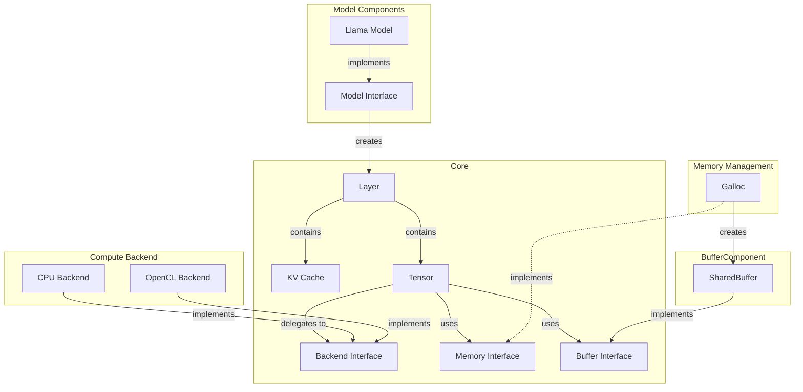
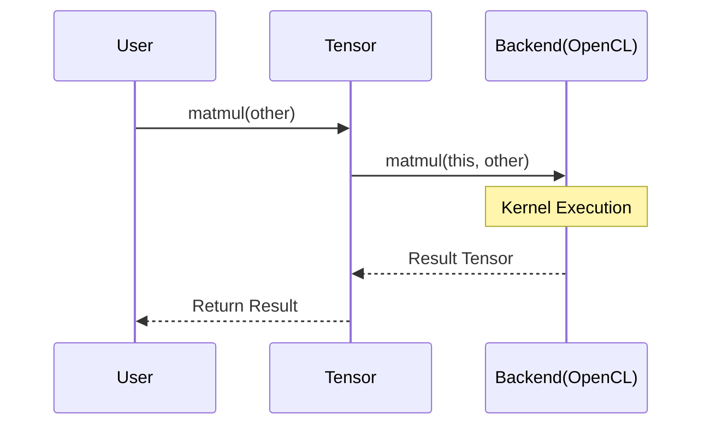
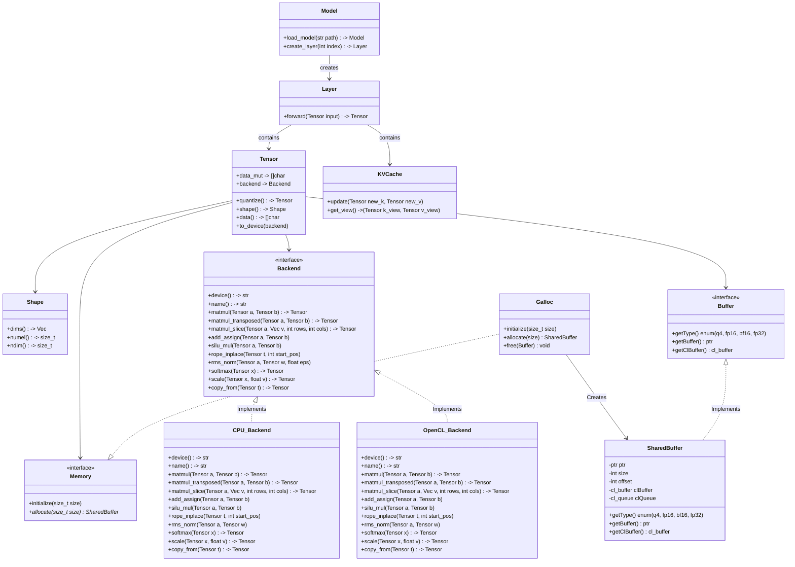

# Architecture

## Overview

### Background & Goals
본 프로젝트는 연구 및 실험 목적의 온디바이스(On-device) LLM 추론 프레임워크입니다. 모바일 및 엣지 디바이스 환경에서의 고성능 추론과 유연한 실험 환경 제공을 목표로 합니다.
- 유연한 백엔드 확장성 (Extensibility): Backend 인터페이스 기반 설계를 통해 CPU, GPU(OpenCL), NPU(QNN, TBD) 등 다양한 하드웨어 가속기를 손쉽게 추가하고 교체할 수 있는 구조를 지향합니다.
- 고성능 메모리 관리 (Performance): ARM64 SoC 환경의 특성을 활용하여, Galloc 기반의 공유 메모리 관리자를 통해 CPU와 GPU/NPU 간 데이터 복사를 최소화(Zero-copy)하도록 설계되었습니다.

### Scope & Limitation
- Target Platform: ARM64 아키텍처 기반의 엣지 디바이스(Android/Linux)를 주 타겟으로 합니다. 대규모 서버 환경이나 x86 아키텍처는 지원 범위에 포함되지 않으며, 확장 계획이 없습니다.
- Supported Models: 현재는 Llama 3.2 아키텍처 모델의 추론만을 지원합니다. 향후 연구 목적에 따라 지원 모델이 추가될 수 있으나, 범용적인 모델 지원보다는 최적화 연구에 집중합니다.

## High-Level Architecture

### Component Diagram


### Key Components
- **Tensor**: 사용자가 조작하는 논리적인 데이터 단위입니다. 실제 데이터는 `Memory` 인터페이스를 통해 관리되며, 수학적 연산은 연결된 `Backend` 구현체로 위임(Delegate)됩니다.
- **Backend Interface**: 하드웨어 가속기(CPU, GPU, NPU)의 추상화 계층입니다. `matmul`, `softmax` 등의 연산자(Operator)를 정의하며, 구체적인 구현 내용은 하위 클래스(`OpenCL_Backend` 등)에서 담당합니다.
- **Galloc (Global Allocator)**: 시스템 메모리와 장치 메모리 간의 공유 버퍼를 관리하는 할당자입니다. ARM SoC의 통합 메모리 구조를 활용하여 불필요한 복사를 방지합니다.

### Memory Model & Data Flow
- **Zero-copy Mechanism**: `Galloc`은 OpenCL의 `CL_MEM_ALLOC_HOST_PTR` 또는 dma-buf와 같은 메커니즘을 사용하여 CPU와 GPU가 물리적으로 동일한 메모리 주소를 가리키도록 `SharedBuffer`를 생성합니다.
- **Data Flow**: Tensor 생성 시 `Galloc`을 통해 메모리를 할당받으며, 별도의 `memcpy` 과정 없이 백엔드가 즉시 연산을 수행할 수 있습니다.

### Execution Sequence
연산 요청 시의 제어 흐름은 다음과 같습니다. Tensor가 Backend에 연산을 위임하고 결과를 반환받는 구조입니다.



## Low-Level Architecture
### Compoenet Diagram
source android.source && cargo build --target aarch64-linux-android --release --bin llmrs-test --features opencl,profile && adb push /home/go/Workspace/llm.rs/target/aarch64-linux-android/release/llmrs-test /data/local/tmp/lm.rs && adb shell "cd /data/local/tmp/lm.rs && ./llmrs-test"



## Implementation Specifications

### 1. Environment
- **Language**: Rust (latest version, 필요하다면 nightly 버전 사용 가능)
- **3rd Party Crates**:
  - `ocl`: OpenCL 바인딩
  - `anyhow`: 에러 핸들링
  - `log` 및 `env_logger`: 로깅
  - `serde` 및 `serde_json`: 모델 구성 파일 파싱
  - `half`: FP16 데이터 타입 지원
  - `safetensors`: Huggingface Safetensors 포맷 지원
  - 그 외 필요한 경우 추가하여 사용 가능
- **LLM Model Format**: Huggingface Safetensors
- **LLM Model**: Llama 3.2 (1B 파라미터 모델 기준)

### 2. Directory Structure
```
src/
├── core/
│   ├── tensor.rs         // Tensor struct & impl
│   ├── kv_cache.rs       // KV Cache struct & impl
|   ├── shape.rs          // Shape struct & impl
|   ├── buffer.rs         // Buffer trait
│   ├── backend.rs        // Backend trait
│   └── memory.rs         // Memory/Buffer traits
├── models/
│   └── llama/llama_model.rs  // Llama Model struct & impl
├── layers/
│   └── llama_layer.rs    // Llama Layer struct & impl
├── backend/
│   ├── cpu/
│   └── opencl/
├── memory/
│   └── galloc.rs         // Galloc implement
├── buffer/
│   ├── shared_buffer.rs  // Shared Buffer implement
│   └── cpu_buffer.rs     // CPU dedicated Buffer
├── backend.rs            // Backend module
├── memory.rs             // Memory module
├── buffer.rs             // Buffer module
├── tests/
|   ├── backend_tests.rs
|   ├── memory_tests.rs
|   ├── buffer_tests.rs
│   └── integration_tests.rs
└── main.rs
models/
├── llama3.2-1b/
|   ├── model.safetensors
|   ├── tokenizer.json
│   └── config.json
kernels/
    └── ...                // 기타 OpenCL 커널 파일 (TBD)
```

### 3. Data Layout & Quantization Specification

#### 3.1. General Data Layout

* **Data Layout**: 기본적으로 C-style **Row-Major**를 따릅니다.
* **Alignment**: 64-byte alignment를 준수하여 ARM NEON SIMD 명령어 및 Cache line 접근 효율을 극대화합니다.

#### 3.2. Block Quantization Formats (Rust Representations)

**Type 1: `Q4_0`**
GGML 표준 `block_q4_0` 구조입니다. 바이어스 없이 스케일값만 가집니다.

* **Group Size**: 32 values
* **Memory Size**: 18 bytes (1 `f16` + 16 `u8`)
* **Formula**: 

```rust
#[repr(C)]
#[derive(Debug, Clone, Copy)]
pub struct BlockQ4_0 {
    pub d: f32,        // 4 bytes: delta (scale)
    pub qs: [u8; 16],  // 16 bytes: 32 x 4-bit quants (offset by 8)
}
const _: () = assert!(std::mem::size_of::<BlockQ4_0>() == 20);
```

**Type 2: `Q4_1` (Custom Format)**
GGML 표준 `block_q4_1` 구조입니다. 바이어스와 스케일값을 모두 가집니다.

* **Group Size**: 32 values
* **Memory Size**: 20 bytes (1 `f16` + 1 `u8` + 16 `u8`)
* **Formula**:

```rust
#[repr(C)]
#[derive(Debug, Clone, Copy)]
pub struct BlockQ4_1 {
    pub d: f32,        // 4 bytes: delta (scale)
    pub m: f32,        // 4 byte: min (bias)
    pub qs: [u8; 16],  // 16 bytes: 32
}
const _: () = assert!(std::mem::size_of::<BlockQ4_1>() == 24);
```

**Type 3: `FP16` (Half Precision)**

* **Group Size**: 1 (No block)
* **Memory Size**: 2 bytes per value
* IEEE 754 half-precision 포맷을 사용합니다.

**Type 4: `BF16` (BFloat16)**

* **Group Size**: 1
* **Memory Size**: 2 bytes per value
* 지수부를 FP32와 동일하게 유지하여 하드웨어 가속기(NPU 등) 연산에 유리합니다.

**Type 5: `FP32` (Single Precision)**

* **Group Size**: 1
* **Memory Size**: 4 bytes per value
* 주로 활성화 함수(Activation) 연산 및 정밀도가 필요한 레이어에 사용됩니다.

## 3.3. KV Cache Layout Specification

KV Cache는 추론 시 시퀀스 길이가 길어짐에 따라 Key와 Value 텐서를 저장하는 공간입니다. 성능 최적화를 위해 매번 할당하지 않고, 최대 시퀀스 길이(`max_seq_len`)만큼 미리 할당된 고정 크기 버퍼를 사용합니다.

* **Structure**: 각 레이어(Layer)마다 별도의 K-Cache와 V-Cache 쌍을 가집니다.
* **GQA(Grouped-Query Attention) 대응**: Llama 3.2는 GQA를 사용하므로, KV 헤드 수는 Query 헤드 수보다 적습니다 (예: 32 heads -> 8 KV heads). 이를 반영한 레이아웃을 구성합니다.
* **Memory Layout**:
* **K-Cache**: `[max_seq_len, kv_heads, head_dim]` (연산 효율을 위해 헤드와 시퀀스 차원 순서가 바뀔 수 있음)
* **V-Cache**: `[max_seq_len, kv_heads, head_dim]`


* **Zero-copy**: `Galloc`을 통해 할당된 단일 연속 메모리 공간을 사용하여, CPU에서 토큰을 추가하고 GPU/NPU에서 즉시 참조할 수 있도록 설계합니다.

## 4. Interface (Trait) Definitions (상세)

이 섹션은 하드웨어 가속기(Backend)와 메모리 관리자(Memory) 간의 규약을 정의합니다.

### 4.1. `Buffer` Trait: 메모리 물리 계층

`Buffer`는 실제 데이터가 위치한 주소를 관리합니다. CPU와 GPU가 동일한 메모리를 바라보는 **Zero-copy**의 핵심입니다.

```rust
pub trait Buffer: Send + Sync {
    /// 데이터의 타입 반환 (Q4_1, FP16, FP32 등)
    fn dtype(&self) -> DType;

    /// 전체 버퍼의 크기 (bytes)
    fn size(&self) -> usize;

    /// CPU 접근을 위한 Read-only 포인터 반환
    fn as_ptr(&self) -> *const u8;

    /// CPU 접근을 위한 Mutable 포인터 반환
    fn as_mut_ptr(&self) -> *mut u8;

    /// OpenCL 가속을 위한 메모리 핸들 반환 (CPU 전용일 경우 None)
    fn cl_mem(&self) -> Option<&cl_mem>;

    /// 데이터가 유효한 디바이스로 동기화되었는지 확인 (Zero-copy에서는 항상 True일 수 있음)
    fn sync_device(&self) -> Result<()>;
}
```

### 4.2. `Backend` Trait: 연산 커널 계층

`Backend`는 연산의 실행 주체입니다. 모든 함수는 `Tensor`의 메타데이터(Shape, Stride)를 해석하여 하드웨어 최적화된 커널을 실행합니다.

| Category | Method | Description |
| --- | --- | --- |
| **Lifecycle** | `setup()` | 백엔드 초기화 (OpenCL Context/Queue 생성 등) |
| **Math** | `matmul(a, b)` |  연산. 양자화 타입(Q4_1)에 따른 Dequantization 포함 |
| **Activation** | `silu_mul(a, b)` | SwiGLU 유닛에서 사용되는  연산 |
| **Norm** | `rms_norm(x, w)` | Layer Normalization의 경량화 버전, In-place 수행 |
| **Position** | `rope_inplace(x, pos)` | Rotary Positional Embedding 적용 |
| **Memory** | `copy(src, dst)` | 서로 다른 백엔드 간 혹은 메모리 레이아웃 변경 시 복사 |

```rust
pub trait Backend: Send + Sync {
    fn name(&self) -> &str;
    
    // MatMul with potential dequantization support inside the kernel
    fn matmul(&self, a: &Tensor, b: &Tensor, out: &mut Tensor) -> Result<()>;

    // MatMul with transposed second operand
    fn matmul_transpose(&self, a: &Tensor, b: &Tensor, out: &mut Tensor) -> Result<()>;

    // MatMul with slicing support for GQA
    fn matmul_slice(&self, a: &Tensor, b: &Vec<f32>, rows: usize, cols: usize, out: &mut Tensor) -> Result<()>;

    // Llama-specific: RMSNorm(x) * w
    fn rms_norm(&self, x: &mut Tensor, w: &Tensor, eps: f32) -> Result<()>;

    // Rotary Embedding: 주어지는 시작 위치(pos)를 기준으로 회전 행렬 적용
    fn apply_rope(&self, x: &mut Tensor, start_pos: usize, theta: f32) -> Result<()>;

    // Softmax: 주로 마지막 Attention Score 계산 시 사용
    fn softmax(&self, x: &mut Tensor) -> Result<()>;
}

```

### 4.3. `Memory` (Allocator) Trait

`Galloc`이 구현해야 할 인터페이스로, 파편화를 방지하고 `SharedBuffer`를 생성합니다.

```rust
pub trait Memory: Send + Sync {
    /// 특정 크기의 SharedBuffer를 할당
    fn alloc(&self, size: usize, dtype: DType) -> Result<Arc<dyn Buffer>>;
    
    /// 현재 사용 중인 총 메모리 양 반환
    fn used_memory(&self) -> usize;
}
```

## 4.4. KV Cache Interface

KV Cache를 관리하고 Attention 연산 시 효율적으로 데이터를 주입하기 위한 인터페이스입니다.

### 4.4.1. `KVCache` Struct

단일 레이어의 KV 데이터를 관리하는 객체입니다.

```rust
pub struct KVCache {
    pub k_buffer: Tensor,    // [max_seq_len, kv_heads, head_dim]
    pub v_buffer: Tensor,    // [max_seq_len, kv_heads, head_dim]
    pub current_pos: usize,  // 현재 저장된 토큰의 위치 (0 ~ max_seq_len-1)
}

impl KVCache {
    /// 새로운 토큰의 K, V 값을 현재 위치에 업데이트
    pub fn update(&mut self, new_k: &Tensor, new_v: &Tensor) -> Result<()> {
        // backend.copy_slice_inplace() 등을 호출하여 
        // 전체 캐시 버퍼의 current_pos 위치에 새로운 데이터를 삽입
        unimplemented!()
    }

    /// 현재까지 쌓인 데이터에 대한 View 반환 (Attention 연산용)
    pub fn get_view(&self) -> (Tensor, Tensor) {
        // current_pos까지의 데이터를 슬라이싱하여 반환
        unimplemented!()
    }
}