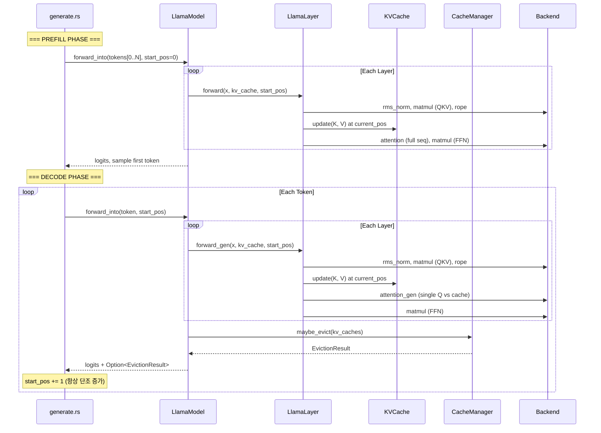
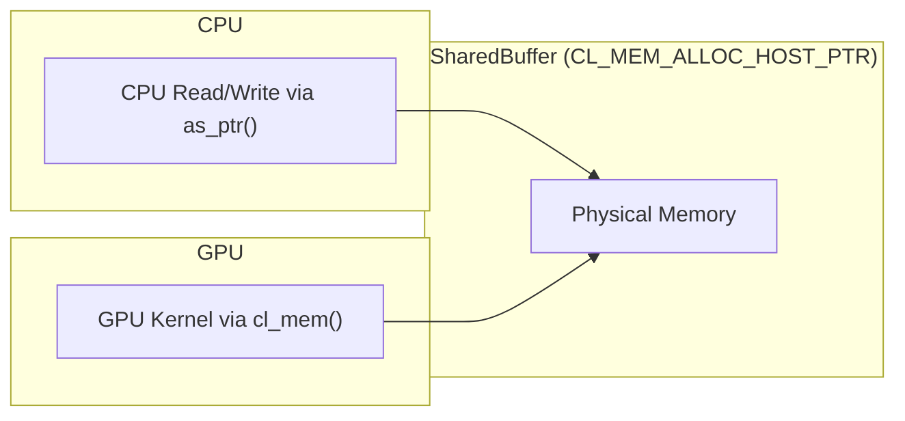
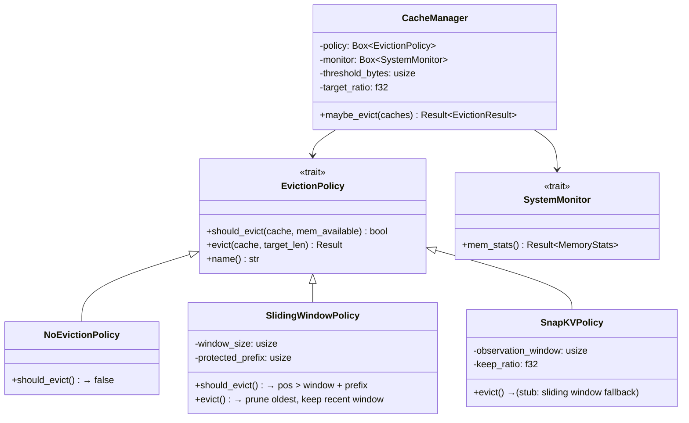

# Architecture

## Overview

### Background & Goals
본 프로젝트는 연구 및 실험 목적의 온디바이스(On-device) LLM 추론 프레임워크입니다. 모바일 및 엣지 디바이스 환경에서의 고성능 추론과 유연한 실험 환경 제공을 목표로 합니다.
- **유연한 백엔드 확장성 (Extensibility)**: Backend 인터페이스 기반 설계를 통해 CPU, GPU(OpenCL), NPU(QNN, TBD) 등 다양한 하드웨어 가속기를 손쉽게 추가하고 교체할 수 있는 구조를 지향합니다.
- **고성능 메모리 관리 (Performance)**: ARM64 SoC 환경의 특성을 활용하여, Galloc 기반의 공유 메모리 관리자를 통해 CPU와 GPU/NPU 간 데이터 복사를 최소화(Zero-copy)하도록 설계되었습니다.
- **동적 KV 캐시 관리**: 메모리 제약 환경에서 장시간 추론을 위한 KV 캐시 Eviction 정책(Sliding Window, SnapKV 등)을 지원합니다.

### Scope & Limitation
- **Target Platform**: ARM64 아키텍처 기반의 엣지 디바이스(Android/Linux)를 주 타겟으로 합니다. x86 CPU 백엔드로도 추론은 가능하나, SIMD 최적화(NEON)는 ARM64 전용입니다.
- **Supported Models**: 현재는 Llama 3.2 아키텍처 모델의 추론만을 지원합니다. 향후 연구 목적에 따라 지원 모델이 추가될 수 있으나, 범용적인 모델 지원보다는 최적화 연구에 집중합니다.

---

## High-Level Architecture

### Component Diagram
```mermaid
graph TB
    subgraph BinaryLayer ["Binaries"]
        Generate["generate"]
        GenerateHybrid["generate_hybrid"]
        MicroBench["micro_bench"]
        TestBackend["test_backend"]
    end

    subgraph ModelComponent ["Model"]
        LlamaModel["LlamaModel"]
        LlamaLayer["LlamaLayer"]
        LayerWS["LayerWorkspace"]
        Attention["Attention (CPU fallback)"]
    end

    subgraph CoreComponent ["Core"]
        BackendTrait["Backend trait"]
        MemoryTrait["Memory trait"]
        BufferTrait["Buffer trait"]
        KVCache["KVCache"]
        Tensor["Tensor"]
        Shape["Shape"]
        Quant["Quant (Q4_0)"]
    end

    subgraph EvictionSubsystem ["KV Cache Eviction"]
        CacheManager["CacheManager"]
        EvictionPolicy["EvictionPolicy trait"]
        NoEviction["NoEvictionPolicy"]
        SlidingWindow["SlidingWindowPolicy"]
        SnapKV["SnapKVPolicy (stub)"]
        SysMonitor["SystemMonitor trait"]
        LinuxMonitor["LinuxSystemMonitor"]
    end

    subgraph BackendComponent ["Compute Backends"]
        CpuBackend["CpuBackend"]
        OpenCLBackend["OpenCLBackend"]
    end

    subgraph MemoryComponent ["Memory Management"]
        Galloc["Galloc"]
        SharedBuffer["SharedBuffer"]
    end

    Generate --> LlamaModel
    GenerateHybrid --> LlamaModel
    LlamaModel --> LlamaLayer
    LlamaLayer --> LayerWS
    LlamaLayer --> Attention
    LlamaLayer --> KVCache

    LlamaModel --> CacheManager
    CacheManager --> EvictionPolicy
    CacheManager --> SysMonitor
    EvictionPolicy <|-- NoEviction
    EvictionPolicy <|-- SlidingWindow
    EvictionPolicy <|-- SnapKV
    SysMonitor <|-- LinuxMonitor
    EvictionPolicy --> KVCache

    Tensor --> BufferTrait
    Tensor --> BackendTrait
    Tensor --> Shape

    CpuBackend -.-> BackendTrait
    OpenCLBackend -.-> BackendTrait
    Galloc -.-> MemoryTrait
    SharedBuffer -.-> BufferTrait
    Galloc --> SharedBuffer
```

### Key Components

| Component | 역할 | 파일 |
|:----------|:-----|:-----|
| **Tensor** | 논리적 데이터 단위. Buffer(물리 메모리) + Shape(차원) + Backend(연산 위임) | `src/core/tensor.rs` |
| **Backend** | 하드웨어 가속기 추상화 (matmul, softmax, RoPE 등 연산자 정의) | `src/core/backend.rs` |
| **Galloc** | 시스템/장치 공유 메모리 할당자. Zero-copy의 핵심 | `src/memory/galloc.rs` |
| **KVCache** | 레이어별 K/V 텐서 저장. `update`, `prune_prefix`, `get_view` 제공 | `src/core/kv_cache.rs` |
| **CacheManager** | 메모리 압박 감지 + EvictionPolicy 실행을 조율 | `src/core/cache_manager.rs` |
| **LlamaLayer** | 단일 트랜스포머 레이어 (`forward` / `forward_gen`) | `src/layers/llama_layer.rs` |
| **LayerWorkspace** | 생성 루프용 사전 할당 작업 텐서 (매 토큰 재사용) | `src/layers/workspace.rs` |
| **LlamaModel** | 모델 로딩, 임베딩, 레이어 반복, 로짓 계산 | `src/models/llama/llama_model.rs` |

---

## Inference Execution Flow

### Prefill → Decode 순서도



### RoPE와 Eviction의 관계 (중요!)

> **⚠️ RoPE Position은 eviction과 무관하게 단조 증가해야 합니다.**
>
> - `start_pos`: RoPE 인코딩용 **논리적 위치** (토큰마다 +1, eviction 무관)
> - `current_pos`: KV 캐시 내 **물리적 슬롯** (eviction 시 감소)
>
> RoPE는 Key 벡터에 absolute position을 write 시점에 영구 인코딩합니다.
> Eviction이 cache를 물리적으로 shift해도 기존 key의 RoPE 인코딩은 변하지 않으므로,
> Query의 RoPE position(`start_pos`)은 연속적으로 증가해야 relative distance가 올바릅니다.

---

## Memory Model & Data Flow

### Zero-copy Mechanism
`Galloc`은 OpenCL의 `CL_MEM_ALLOC_HOST_PTR`을 사용하여 CPU와 GPU가 물리적으로 동일한 메모리 주소를 가리키도록 `SharedBuffer`를 생성합니다. ARM SoC의 통합 메모리(UMA)에서는 별도의 `memcpy` 없이 백엔드가 즉시 연산을 수행할 수 있습니다.



---

## KV Cache & Eviction System

### KVCache 구조

각 트랜스포머 레이어마다 별도의 KVCache를 가집니다. GQA를 지원하므로 KV 헤드 수는 Query 헤드 수보다 적습니다.

```rust
pub struct KVCache {
    pub k_buffer: Tensor,    // [max_seq_len, kv_heads, head_dim]
    pub v_buffer: Tensor,    // [max_seq_len, kv_heads, head_dim]
    pub current_pos: usize,  // 현재 저장된 토큰 수 (0 ~ max_seq_len)
    pub max_seq_len: usize,  // 최대 시퀀스 길이
}
```

주요 메서드:

| 메서드 | 설명 |
|:------|:-----|
| `update(k, v)` | `current_pos` 위치에 새 K,V를 삽입, `current_pos += seq_len` |
| `prune_prefix(count)` | 앞에서 `count`개 토큰 제거, 나머지를 앞으로 shift |
| `get_view()` | 전체 K,V 버퍼 반환 (attention은 `current_pos`까지만 참조) |
| `memory_usage_bytes()` | 현재 사용 중인 KV 데이터의 바이트 크기 |

### Eviction Architecture



**Eviction 트리거 조건** (`CacheManager::maybe_evict`):
1. `EvictionPolicy::should_evict()` 가 true → 즉시 eviction
2. 또는 `mem_available < threshold_bytes` → 메모리 압박에 의한 eviction

**Eviction 후 데이터 흐름**:
```
Before: [T0][T1][T2][T3][T4][T5][T6][T7] current_pos=8, start_pos=8
         ↑ RoPE(0..7)
prune_prefix(3):
After:  [T3][T4][T5][T6][T7][_][_][_]   current_pos=5, start_pos=8 (불변!)
         ↑ RoPE(3..7) — 원래 인코딩 유지

Next token: K gets RoPE(8), stored at slot 5
→ Key at slot 4 has RoPE(7), relative distance = 1 ✓
```

### Sliding Window 품질 가이드라인

| Window Size | 권장 상황 |
|:-----------:|:---------|
| ≥ 256 | 200토큰 이하 생성 — 우수한 품질 |
| 128 | 100토큰 이하 생성 — 양호 |
| ≤ 64 | 짧은 QA 응답에만 적합 — 반복 eviction 시 급격한 열화 |

> **Tip**: `protected_prefix`로 첫 N개 토큰(attention sink)을 보호하면 작은 윈도우에서도 안정성이 향상됩니다 (StreamingLLM 기법).

---

## Implementation Specifications

### 1. Environment
- **Language**: Rust (Edition 2024, nightly 사용 가능)
- **3rd Party Crates**:

| Crate | 버전 | 용도 |
|:------|:-----|:-----|
| `safetensors` | 0.7 | HuggingFace Safetensors 포맷 로딩 |
| `memmap2` | 0.9 | 대용량 모델 파일 메모리 매핑 |
| `half` | 2.7 | BF16/F16 ↔ F32 변환 |
| `tokenizers` | 0.22 | HuggingFace Tokenizer (onig 백엔드) |
| `serde` / `serde_json` | 1.0 | 모델 config 파싱 |
| `anyhow` | 1.0 | 에러 핸들링 |
| `clap` | 4.5 | CLI 인터페이스 (derive 매크로) |
| `rayon` | 1.11 | 데이터 병렬 처리 (attention heads) |
| `ocl` | 0.19 | OpenCL 바인딩 (feature-gated) |
| `rand` | 0.9 | 토큰 샘플링 |
| `log` / `env_logger` | 0.4/0.11 | 로깅 |

- **Features**: `opencl` (기본 활성), `ocl` crate에 의존
- **LLM Model Format**: HuggingFace Safetensors (`model.safetensors` + `config.json` + `tokenizer.json`)
- **Release Profile**: `lto = "fat"`, `codegen-units = 1`, `opt-level = 3`

### 2. Directory Structure

```
llm_rs2/
├── ARCHITECTURE.md          # 본 문서
├── Cargo.toml               # 프로젝트 설정 및 의존성
├── android.source           # Android 크로스컴파일 환경 변수
│
├── src/
│   ├── lib.rs               # 라이브러리 루트 (모듈 선언)
│   ├── main.rs              # 기본 엔트리포인트 (미사용)
│   ├── bin/
│   │   ├── generate.rs      # ★ 주력 추론 바이너리 (단일 백엔드)
│   │   ├── generate_hybrid.rs  # CPU↔GPU 동적 전환 추론
│   │   ├── micro_bench.rs   # 개별 연산자 벤치마크
│   │   ├── test_backend.rs  # 백엔드 정합성 테스트
│   │   ├── test_model.rs    # 모델 로딩 테스트
│   │   └── repro_attention.rs  # attention 버그 재현용
│   │
│   ├── core/                      # 핵심 추상화 레이어
│   │   ├── mod.rs                 # 모듈 선언
│   │   ├── backend.rs             # Backend trait (15개 연산자 정의)
│   │   ├── buffer.rs              # Buffer trait + DType enum
│   │   ├── memory.rs              # Memory trait (alloc/used_memory)
│   │   ├── tensor.rs              # Tensor struct (Shape + Buffer + Backend)
│   │   ├── shape.rs               # Shape struct (dims, numel)
│   │   ├── kv_cache.rs            # KVCache (update, prune_prefix, get_view)
│   │   ├── cache_manager.rs       # CacheManager (eviction 조율)
│   │   ├── sys_monitor.rs         # SystemMonitor trait + LinuxSystemMonitor
│   │   ├── quant.rs               # BlockQ4_0 quantization 구조체
│   │   └── eviction/              # Eviction 정책 (Strategy Pattern)
│   │       ├── mod.rs             # EvictionPolicy trait
│   │       ├── no_eviction.rs     # NoEvictionPolicy (항상 skip)
│   │       ├── sliding_window.rs  # SlidingWindowPolicy (최근 N 토큰 유지)
│   │       └── snap_kv.rs         # SnapKVPolicy (attention score 기반, stub)
│   │
│   ├── models/llama/
│   │   ├── llama_model.rs    # LlamaModel (from_dir, forward_into)
│   │   └── llama_model_tmp.rs  # 실험용
│   │
│   ├── layers/
│   │   ├── llama_layer.rs    # LlamaLayer (forward, forward_gen)
│   │   ├── attention.rs      # CPU attention 함수 (naive, flash)
│   │   └── workspace.rs      # LayerWorkspace (사전 할당 버퍼)
│   │
│   ├── backend/
│   │   ├── cpu/
│   │   │   ├── mod.rs        # CpuBackend struct
│   │   │   ├── common.rs     # 공통 연산 (portable)
│   │   │   ├── neon.rs       # ARM64 NEON SIMD 최적화
│   │   │   └── x86.rs        # x86 SSE/AVX fallback
│   │   └── opencl/
│   │       ├── mod.rs        # OpenCLBackend (35,000+ lines)
│   │       ├── buffer.rs     # OpenCL용 SharedBuffer 확장
│   │       └── memory.rs     # OpenCL용 Galloc (CL_MEM_ALLOC_HOST_PTR)
│   │
│   ├── memory/galloc.rs      # Galloc (CPU 전용 메모리 할당)
│   └── buffer/shared_buffer.rs  # SharedBuffer 구현
│
├── kernels/                  # OpenCL 커널 파일 (~78개 .cl 파일)
│   ├── mul_mv_q4_0_f32*.cl   # Q4_0 양자화 MatVec 커널
│   ├── rms_norm.cl           # RMS Norm 커널
│   ├── rope.cl               # RoPE 커널
│   ├── simple_ops.cl         # 기본 연산 (add, scale, silu)
│   ├── flash_attn_f32.cl     # Flash Attention 커널
│   └── ...
│
├── scripts/                  # 테스트/벤치마크 자동화
│   ├── android_profile.py    # Android 프로파일링 + JSON 결과 수집
│   ├── run_benchmark_suite.py  # 벤치마크 매트릭스 실행
│   ├── update_benchmark_summary.py  # 결과 요약 테이블 생성
│   ├── test_foreground_impact.sh  # 포그라운드 앱 영향 테스트
│   └── visualize_profile.py  # 프로파일 데이터 시각화
│
├── docs/                     # 상세 기술 문서
│   ├── 01_opencl_backend.md
│   ├── 02_kernel_implementation.md
│   ├── 03_memory_management.md
│   ├── 04_attention_mechanism.md
│   ├── 05_model_inference.md
│   └── 06_kv_cache_management.md
│
├── web_dashboard/            # 벤치마크 시각화 웹 대시보드
├── benchmarks/               # 벤치마크 데이터 및 분석 스크립트
├── results/                  # 프로파일링 결과 JSON
└── tests/                    # 통합 테스트
```

### 3. Binaries

| Binary | 용도 | 주요 옵션 |
|:-------|:----|:---------|
| `generate` | 단일 백엔드 추론 (주력) | `--backend`, `--kv-type`, `--eviction-policy`, `--eviction-window` |
| `generate_hybrid` | CPU↔GPU 동적 전환 추론 | `--switch-threshold`, `--warmup-tokens` |
| `micro_bench` | 개별 연산자 벤치마크 | 연산별 크기 지정 |
| `test_backend` | 백엔드 정합성 검증 | CPU vs OpenCL 결과 비교 |
| `test_model` | 모델 로딩 검증 | `--model-path` |
| `repro_attention` | attention 버그 재현 | 디버깅용 |

`generate` 바이너리의 eviction 관련 CLI 옵션:
```
--eviction-policy <POLICY>     none | sliding | snapkv [default: none]
--eviction-window <SIZE>       Sliding window size [default: 512]
--protected-prefix <N>         Attention sink tokens to protect [default: 0]
--memory-threshold-mb <MB>     Memory pressure threshold [default: 256]
```

### 4. Data Layout & Quantization

#### 4.1. General Data Layout
- **Data Layout**: C-style **Row-Major**
- **Alignment**: 64-byte alignment (ARM NEON SIMD 및 Cache line 효율)

#### 4.2. Block Quantization: `Q4_0`

GGML 호환 4-bit 양자화. 바이어스 없이 스케일값만 저장합니다.
- **Group Size**: 32 values
- **Memory Size**: 20 bytes (1 `f32` scale + 16 `u8` packed nibbles)

```rust
#[repr(C)]
#[derive(Debug, Clone, Copy)]
pub struct BlockQ4_0 {
    pub d: f32,        // 4 bytes: scale
    pub qs: [u8; 16],  // 16 bytes: 32 × 4-bit quantized values (offset by 8)
}
const _: () = assert!(std::mem::size_of::<BlockQ4_0>() == 20);
```

**Dequantization**: `value = (nibble - 8) * scale`

#### 4.3. 지원 데이터 타입 (DType)

| DType | Size | 용도 |
|:------|:-----|:----|
| `F32` | 4B | 활성화, 중간 연산, CPU attention |
| `F16` | 2B | GPU KV 캐시, 가중치 |
| `BF16` | 2B | 가중치 로딩 (safetensors) |
| `Q4_0` | 20B/32elem | 모델 가중치 양자화 |
| `U8` | 1B | 범용 바이트 버퍼 |

---

## 5. Interface (Trait) Definitions

### 5.1. `Backend` Trait

하드웨어 가속기의 연산 커널을 추상화합니다. 대부분의 메서드는 기본(CPU) 구현을 가지고 있으며, OpenCL 백엔드에서 override합니다.

| Category | Method | Signature | Description |
|:---------|:-------|:----------|:------------|
| **Identity** | `name()` | `→ &str` | 백엔드 이름 ("CPU", "OpenCL") |
| | `device()` | `→ &str` | 디바이스 정보 |
| **Math** | `matmul()` | `(a, b, out)` | 행렬곱 (양자화 dequant 포함) |
| | `matmul_transposed()` | `(a, b, out)` | B를 전치한 행렬곱 |
| | `matmul_slice()` | `(a, b, rows, cols, out)` | GQA용 슬라이스 행렬곱 |
| **In-place** | `add_assign()` | `(a, b)` | a += b |
| | `scale()` | `(x, v)` | x *= v |
| **Activation** | `silu_mul()` | `(a, b)` | SwiGLU: `a = silu(a) * b` |
| **Norm** | `rms_norm()` | `(x, w, eps)` | RMSNorm in-place |
| | `softmax()` | `(x)` | Softmax in-place |
| **Position** | `rope_inplace()` | `(x, pos, theta)` | RoPE 적용 |
| **Attention** | `attention_gen()` | `(q, k, v, out, ...)` | 단일 쿼리 GQA attention (기본 CPU 구현 제공) |
| **Embedding** | `gather()` | `(src, indices, dst)` | 임베딩 lookup |
| **Memory** | `copy_from()` | `(t) → Tensor` | 텐서 복사 (다른 백엔드→자신) |
| | `copy_slice()` | `(src, dst, off, off, n)` | 버퍼 슬라이스 복사 (element 단위) |
| | `read_buffer()` | `(t, dst)` | GPU→CPU 데이터 읽기 |
| **Type** | `cast()` | `(src, dst)` | dtype 변환 (F32↔F16) |
| **Sync** | `synchronize()` | `()` | GPU 큐 동기화 (벤치마크용) |

### 5.2. `Buffer` Trait

```rust
pub trait Buffer: Send + Sync {
    fn dtype(&self) -> DType;
    fn size(&self) -> usize;          // 전체 크기 (bytes)
    fn as_ptr(&self) -> *const u8;    // CPU 읽기 포인터
    fn as_mut_ptr(&self) -> *mut u8;  // CPU 쓰기 포인터
    fn cl_mem(&self) -> Option<&cl_mem>;  // OpenCL 핸들 (GPU 전용)
}
```

### 5.3. `Memory` Trait

```rust
pub trait Memory: Send + Sync {
    fn alloc(&self, size: usize, dtype: DType) -> Result<Arc<dyn Buffer>>;
    fn used_memory(&self) -> usize;
}
```

### 5.4. `EvictionPolicy` Trait

```rust
pub trait EvictionPolicy: Send + Sync {
    /// 캐시 상태와 가용 메모리 기반 eviction 판단
    fn should_evict(&self, cache: &KVCache, mem_available: usize) -> bool;
    /// 실제 eviction 수행: cache를 target_len 토큰으로 축소
    fn evict(&self, cache: &mut KVCache, target_len: usize) -> Result<()>;
    /// 정책 이름 (로깅용)
    fn name(&self) -> &str;
}
```

### 5.5. `SystemMonitor` Trait

```rust
pub trait SystemMonitor: Send + Sync {
    fn mem_stats(&self) -> Result<MemoryStats>;
}

pub struct MemoryStats {
    pub total: usize,      // 전체 메모리 (bytes)
    pub available: usize,  // 사용 가능 메모리 (bytes)
    pub free: usize,       // 해제된 메모리 (bytes)
}
```

`LinuxSystemMonitor`는 `/proc/meminfo`를 파싱하여 구현합니다.

---

## 6. LlamaLayer Forward Paths

`LlamaLayer`에는 **두 가지 forward 경로**가 있습니다:

### 6.1. `forward()` — Prefill Phase
다수의 토큰(`seq_len > 1`)을 한 번에 처리합니다.
```
Input: [batch, seq_len, dim]
Flow: RMSNorm → QKV matmul → RoPE → KV cache update
      → Attention (flash/naive) → Residual → FFN → Residual
Output: [batch, seq_len, dim]
```

### 6.2. `forward_gen()` — Decode Phase
단일 토큰(`seq_len = 1`)을 효율적으로 처리합니다. `LayerWorkspace`의 사전 할당 버퍼를 재사용합니다.
```
Input: [batch, 1, dim]
Flow: RMSNorm → QKV matmul → RoPE → KV cache update
      → attention_gen (GPU) or CPU fallback → Residual → FFN → Residual
Output: [batch, 1, dim]
```

**CPU Attention Fallback 조건**: 
- OpenCL 백엔드에서 `use_gpu_attn=false`인 경우
- KV 캐시 dtype이 F32인 경우
- CPU 백엔드 사용 시

CPU Fallback은 ARM64에서 NEON 4-way unrolled dot product로 최적화되며, `scores` 버퍼(LayerWorkspace에 사전 할당)를 사용합니다. `rayon`을 이용한 head 병렬화는 `cache_seq_len >= 256`일 때 활성화됩니다.

---

## 7. Development Workflows

자세한 빌드/테스트/배포 절차는 `.agent/skills/`와 `.agent/workflows/`를 참조하세요.

| Workflow | 설명 | 파일 |
|:---------|:----|:-----|
| `/deploy_and_test` | Android 빌드 → 디바이스 push → 추론 테스트 | `.agent/workflows/deploy_and_test.md` |
| `/pre_push` | 포맷/린트/테스트 체크 | `.agent/workflows/pre_push.md` |
| `/dashboard` | 벤치마크 대시보드 실행 | `.agent/workflows/dashboard.md` |

### 7.1. 로컬 PC 테스트 (CPU only)
```bash
cargo build --release --bin generate
./target/release/generate \
  --model-path /path/to/model \
  --prompt "Hello" -n 50 \
  --backend cpu --kv-type f32
```

### 7.2. Eviction 테스트
```bash
./target/release/generate \
  --model-path /path/to/model \
  --prompt "Hello" -n 200 \
  --eviction-policy sliding \
  --eviction-window 256 \
  --memory-threshold-mb 1  # 강제 트리거용
```

### 7.3. Android 디바이스 테스트
```bash
source android.source
cargo build --target aarch64-linux-android --release --bin generate --features opencl
adb push target/aarch64-linux-android/release/generate /data/local/tmp/
adb shell /data/local/tmp/generate --model-path /data/local/tmp/model --backend opencl
```

---

## 8. Design Decisions & Known Limitations

### Design Decisions
1. **Backend trait에 기본 구현 제공**: `attention_gen`, `gather`, `copy_slice` 등은 trait에 CPU 기반 기본 구현이 있어 새 백엔드 추가 시 최소한의 메서드만 구현하면 동작합니다.
2. **Eviction은 forward 이후 실행**: 로짓 계산 전에 eviction을 수행하여 즉시 메모리를 확보합니다. 단, 현재 step의 attention은 eviction 전 상태로 이미 계산되었으므로 품질 영향이 없습니다.
3. **LayerWorkspace로 할당 최소화**: Decode 루프에서 매 토큰마다 메모리를 할당하지 않고, 사전 할당된 작업 버퍼를 재사용합니다.

### Known Limitations
1. **SnapKV는 stub**: Attention score를 외부로 노출하는 API가 아직 없어 falling back to sliding window입니다.
2. **GPU buffer prune 미지원**: `prune_prefix`는 CPU 포인터 접근이 필요하므로 GPU-only 버퍼에서는 실패합니다 (`as_mut_ptr()` null).
3. **Sliding window 품질 한계**: 작은 윈도우(< 128)에서 반복 eviction 시 품질이 급격히 열화됩니다. Attention sink(`protected_prefix`)가 부분적으로 완화합니다.