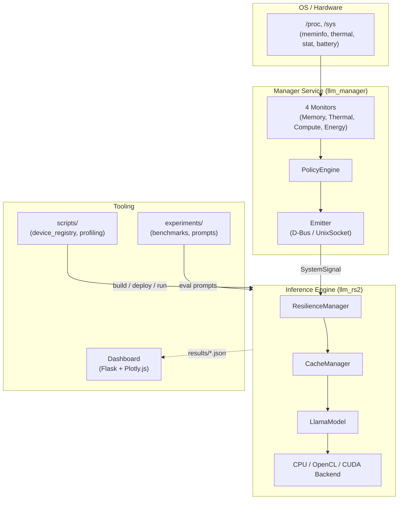
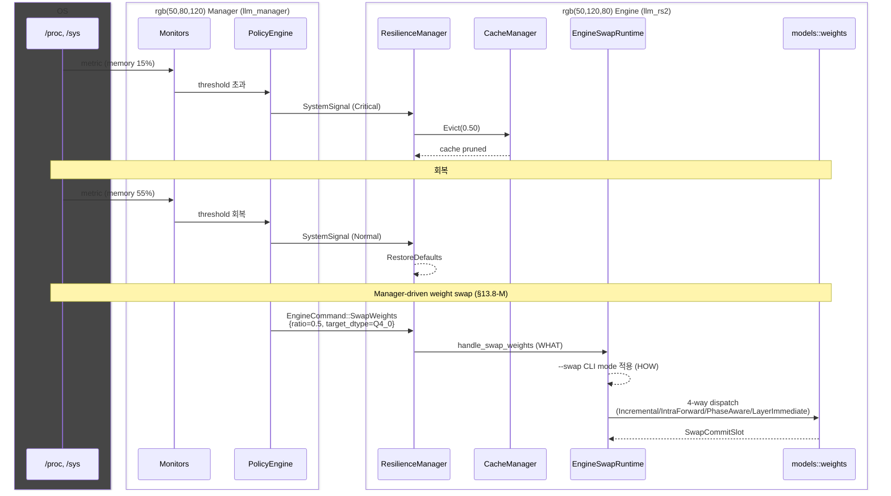
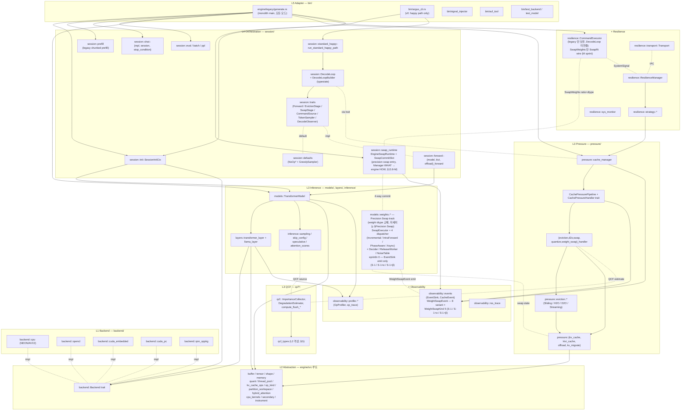
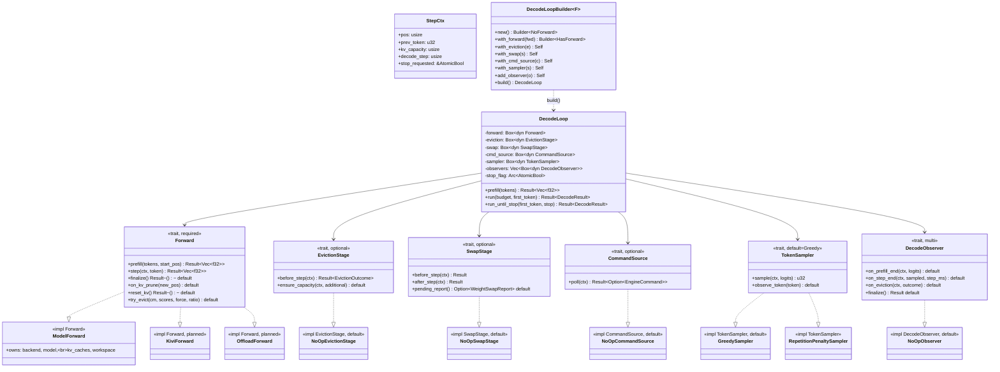
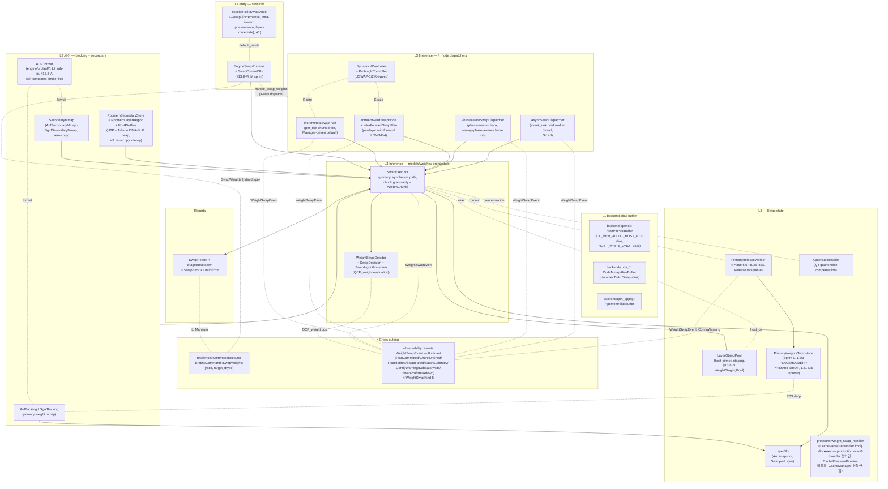
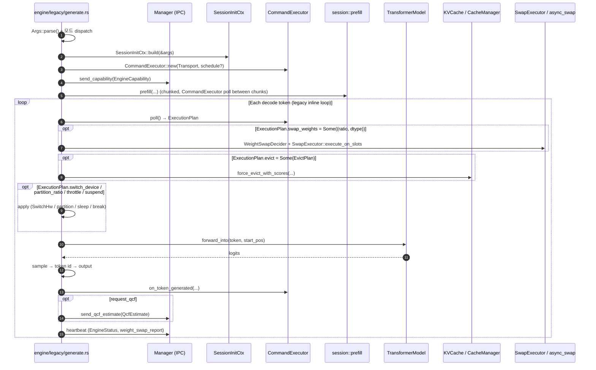
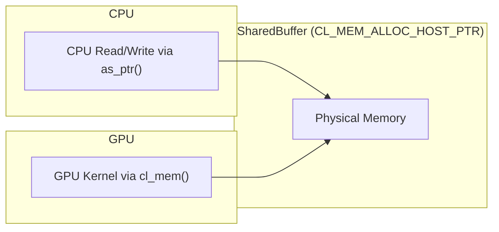
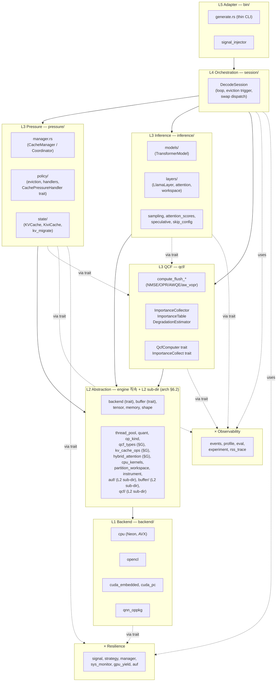

# Architecture

> **상세 구현 가이드**: 이 프로젝트를 처음부터 구현하려면 [`docs/00_build_guide.md`](docs/00_build_guide.md)를 참조하세요. 설계 결정의 근거는 [`docs/01_design_rationale.md`](docs/01_design_rationale.md)에 있습니다.
> **Weight Swap**: 동적 layer dtype 교체 (`arch/weight_swap.md`). Phase 3.7에서 AUF (Argus Unified Format, `.auf`) self-contained 자산 도입 — `arch/auf_format.md`, `docs/auf_tool_guide.md`. Phase 6.5(2026-05-07)에서 Galaxy S25 1564.6 ms swap stall 감축 작업 시작 — `arch/weight_swap.md` §7 (ENG-ALG-226~231, INV-140~143, ENG-DAT-100). 측정 보고서: `papers/eurosys2027/_workspace/experiment/swap_overhead_s25.md`.
> **AUF Primary Loader (W-AUF-1, Sprint 1, 2026-05-19)**: `--model-path foo.auf` 단일 경로가 정식 진입점으로 승격. `engine/src/models/loader/auf/source.rs::AufSource` (TensorSource impl, mmap zero-copy)가 `TransformerModel::load_from_config`의 `PrimaryFormat::Auf` 분기에서 사용된다. `--secondary-gguf`는 deprecated alias (stderr 경고 1회, `.gguf`/`.auf` 양쪽 수용). AUF self-secondary 자동 활성(W-AUF-2)이 후속 단계로 예고 — `--no-self-secondary`로 끌 수 있음(현재 stub).

## Overview

### Background & Goals
본 프로젝트는 연구 및 실험 목적의 온디바이스(On-device) LLM 추론 프레임워크입니다. 모바일 및 엣지 디바이스 환경에서의 고성능 추론과 유연한 실험 환경 제공을 목표로 합니다.
- **유연한 백엔드 확장성 (Extensibility)**: Backend 인터페이스 기반 설계를 통해 CPU, GPU(OpenCL/CUDA), NPU(QNN, TBD) 등 다양한 하드웨어 가속기를 손쉽게 추가하고 교체할 수 있는 구조를 지향합니다.
- **고성능 메모리 관리 (Performance)**: ARM64 SoC 환경의 특성을 활용하여, Galloc 기반의 공유 메모리 관리자를 통해 CPU와 GPU/NPU 간 데이터 복사를 최소화(Zero-copy)하도록 설계되었습니다.
- **동적 KV 캐시 관리**: 메모리 제약 환경에서 장시간 추론을 위한 KV 캐시 Eviction 정책(Sliding Window, H2O, StreamingLLM 등)을 지원합니다.
- **Action Pool 기반 적응형 추론**: 8개 액션(W1~W3, C1, C4~C6, C8)을 동적으로 enable/disable하여 시스템 리소스 압박에 대응합니다. Lossless(백엔드 전환, 디스크 오프로드, 쓰로틀링)와 Lossy(레이어 스킵, KV eviction, KV 압축, KV 양자화) 두 카테고리를 지원합니다.

### Scope & Limitation
- **Target Platform**: ARM64 아키텍처 기반의 엣지 디바이스(Android/Linux)를 주 타겟으로 합니다. x86 CPU 백엔드로도 추론은 가능하나, SIMD 최적화(NEON)는 ARM64 전용입니다.
- **Supported Models**: 현재는 Llama 3.2 아키텍처 모델의 추론만을 지원합니다. 향후 연구 목적에 따라 지원 모델이 추가될 수 있으나, 범용적인 모델 지원보다는 최적화 연구에 집중합니다.

---

## System Architecture

본 프로젝트는 **Cargo workspace** 기반의 멀티크레이트 구조와 비-Rust 컴포넌트로 구성됩니다.

### Workspace 구조

| Crate / 컴포넌트 | 타입 | 역할 |
|:-----------------|:-----|:-----|
| **`engine/`** (`llm_rs2`) | Rust binary+lib | LLM 추론 엔진 — 모델 로딩, forward pass, KV 캐시, 백엔드 연산 |
| **`manager/`** (`llm_manager`) | Rust binary+lib | 시스템 리소스 모니터 서비스 — 메모리/온도/CPU/에너지 감시, 시그널 발신 |
| **`shared/`** (`llm_shared`) | Rust lib | 공유 신호 타입 — `SystemSignal`, `Level` 등 (engine ↔ manager 인터페이스) |
| **`dashboard/`** | Python (Flask) | 벤치마크 시각화 웹 대시보드 (Plotly.js) |
| **`scripts/`** | Python | 디바이스 관리, 프로파일링, 벤치마크 자동화 |
| **`experiments/`** | Python + JSON | 평가 벤치마크, 실험 설정, 결과/보고서 |

### System Component Diagram


```mermaid
graph TB
    subgraph OS ["OS / Hardware"]
        SysMetrics["/proc, /sys
        (meminfo, thermal, stat, battery)"]
    end

    subgraph Manager ["Manager Service (llm_manager)"]
        Monitors["4 Monitors
        (Memory, Thermal, Compute, Energy)"]
        PolicyEngine["PolicyEngine"]
        Emitter["Emitter
        (D-Bus / UnixSocket)"]
    end

    subgraph Engine ["Inference Engine (llm_rs2)"]
        Resilience["ResilienceManager"]
        CacheMgr["CacheManager"]
        Model["LlamaModel"]
        Backends["CPU / OpenCL / CUDA Backend"]
    end

    subgraph Tooling ["Tooling"]
        Scripts["scripts/
        (device_registry, profiling)"]
        Experiments["experiments/
        (benchmarks, prompts)"]
        Dashboard["Dashboard
        (Flask + Plotly.js)"]
    end

    SysMetrics --> Monitors
    Monitors --> PolicyEngine --> Emitter
    Emitter -->|"SystemSignal"| Resilience
    Resilience --> CacheMgr --> Model
    Model --> Backends

    Scripts -->|"build / deploy / run"| Engine
    Experiments -->|"eval prompts"| Engine
    Engine -.->|"results/*.json"| Dashboard
```

### Inter-Component Communication


```mermaid
sequenceDiagram
    box rgb(70,70,70) OS
        participant OS as /proc, /sys
    end
    box rgb(50,80,120) Manager (llm_manager)
        participant Mon as Monitors
        participant PE as PolicyEngine
    end
    box rgb(50,120,80) Engine (llm_rs2)
        participant Res as ResilienceManager
        participant CM as CacheManager
        participant SwapRt as EngineSwapRuntime
        participant WSwap as models::weights
    end

    OS->>Mon: metric (memory 15%)
    Mon->>PE: threshold 초과
    PE->>Res: SystemSignal (Critical)
    Res->>CM: Evict(0.50)
    CM-->>Res: cache pruned

    Note over OS,WSwap: 회복

    OS->>Mon: metric (memory 55%)
    Mon->>PE: threshold 회복
    PE->>Res: SystemSignal (Normal)
    Res-->>Res: RestoreDefaults

    Note over OS,WSwap: Manager-driven weight swap (§13.8-M)

    PE->>Res: EngineCommand::SwapWeights<br/>{ratio=0.5, target_dtype=Q4_0}
    Res->>SwapRt: handle_swap_weights (WHAT)
    SwapRt-->>SwapRt: --swap CLI mode 적용 (HOW)
    SwapRt->>WSwap: 4-way dispatch<br/>(Incremental/IntraForward/PhaseAware/LayerImmediate)
    WSwap-->>SwapRt: SwapCommitSlot
```

**통신 방향**: Manager → Engine (단방향). Engine은 Manager에 피드백을 보내지 않음 (fire-and-forget).

**IPC 프로토콜**:
- **D-Bus** (Linux): System Bus, `org.llm.Manager1` — 타입 안전한 zbus 직렬화
- **Unix Socket** (Android): `[4-byte BE u32 len][UTF-8 JSON]` — 단일 클라이언트 1:1

---

## Engine Architecture

> 이하 "High-Level Architecture" ~ "Resilience Subsystem"은 Engine(`llm_rs2`) 크레이트의 내부 구조를 설명합니다.

### 진입점 이분화 (2026-05-25 상태)

리팩토링 막바지 단계로 진입점이 두 개로 분기되어 있습니다. 두 경로 모두 동일한 L2/L3 도메인 (`backend/`, `inference/`, `pressure/`)을 공유하지만, decode 루프 조립 방식이 다릅니다.

| 진입점 | 파일 | LOC | 상태 | 책임 흡수 방식 |
|--------|------|-----|------|----------------|
| **legacy generate** | `engine/legacy/generate.rs` | ~5000 | 운영용 (모든 모드) | 거대 `main()` 단일 함수 — prefill/decode 인라인 + `CommandExecutor` 직접 보유 |
| **argus-cli** | `engine/src/bin/argus_cli.rs` | ~320 | 진행 중 (happy path만) | `SessionInitCtx::build` → `run_standard_happy_path` → `DecodeLoop` 트레이트 6종 |

**legacy 만 보유한 모드**: chat / experiment / ppl / eval / dump / prompt-batch / weight swap / KIVI / offload / profile / tensor-partition. argus-cli 는 이들을 `reject_unsupported_modes_v0()`에서 명시적으로 차단하며 v1-1 ~ v1-6 sub-sprint 로 점진 흡수 중입니다 (현재 v1-1 = resilience default-on 완료).

다른 bin: `auf_tool`(AUF 빌드), `test_backend`(백엔드 정합성), `test_model`(모델 로딩), `signal_injector`(시그널 주입), `test_q4_soa_byte_equal`(SOA Q4 정합성).

### Top-level Component Diagram


```mermaid
graph TB
    subgraph L5 ["L5 Adapter — bin/"]
        Legacy["engine/legacy/generate.rs<br/>(monolith main, 모든 모드)"]
        ArgusCli["bin/argus_cli.rs<br/>(v0: happy path only)"]
        SigInj["bin/signal_injector"]
        AufTool["bin/auf_tool"]
        TestBin["bin/test_backend / test_model"]
    end

    subgraph L4 ["L4 Orchestration — session/"]
        Init["session::init::SessionInitCtx"]
        StdHappy["session::standard_happy::<br/>run_standard_happy_path"]
        Loop["session::DecodeLoop<br/>+ DecodeLoopBuilder (typestate)"]
        Traits["session::traits<br/>(Forward / EvictionStage / SwapStage /<br/>CommandSource / TokenSampler / DecodeObserver)"]
        Defaults["session::defaults<br/>(NoOp* + GreedySampler)"]
        Prefill["session::prefill<br/>(legacy chunked prefill)"]
        SwapRt["session::swap_runtime<br/>EngineSwapRuntime + SwapCommitSlot<br/>(precision swap entry, Manager WHAT →<br/>engine HOW, §13.8-M)"]
        Chat["session::chat::<br/>{repl, session, stop_condition}"]
        Eval["session::eval / batch / ppl"]
        FwdImpls["session::forward::<br/>{model, kivi, offload}_forward"]
    end

    subgraph L3P ["L3 Pressure — pressure/"]
        CacheMgr["pressure::cache_manager"]
        Pipeline["CachePressurePipeline +<br/>CachePressureHandler trait"]
        EvPolicy["pressure::eviction::*<br/>(Sliding / H2O / D2O / Streaming)"]
        Handlers["{eviction,d2o,swap,<br/>quantize,weight_swap}_handler"]
        KvState["pressure::{kv_cache, kivi_cache,<br/>offload, kv_migrate}"]
    end

    subgraph L3I ["L3 Inference — models/, layers/, inference/"]
        Model["models::TransformerModel"]
        Layer["layers::transformer_layer +<br/>llama_layer"]
        Inf["inference::sampling / skip_config /<br/>speculative / attention_scores"]
        WSwap["models::weights::* — Precision Swap track<br/>(weight dtype 교체, 자세히는 §Precision Swap)<br/>SwapExecutor + 4 dispatcher<br/>(Incremental / IntraForward /<br/>PhaseAware / Async)<br/>+ Decider / ReleaseWorker / NoiseTable<br/>eprintln 0 — EventSink emit only<br/>(S-1 / S-1+α / S-1+β)"]
    end

    subgraph L3Q ["L3 QCF — qcf*/"]
        QcfTypes["qcf_types (L2 격상, §G)"]
        QcfImpl["qcf:: ImportanceCollector,<br/>DegradationEstimator,<br/>compute_flush_*"]
    end

    subgraph L2 ["L2 Abstraction — engine/src 루트"]
        BackendTrait["backend::Backend trait"]
        Buf["buffer / tensor / shape / memory<br/>quant / thread_pool /<br/>kv_cache_ops / op_kind /<br/>partition_workspace / hybrid_attention<br/>cpu_kernels / secondary / instrument"]
    end

    subgraph L1 ["L1 Backend — backend/"]
        Cpu["backend::cpu (NEON/AVX2)"]
        Cl["backend::opencl"]
        CuE["backend::cuda_embedded"]
        CuP["backend::cuda_pc"]
        Qnn["backend::qnn_oppkg"]
    end

    subgraph CC1 ["× Observability"]
        Events["observability::events<br/>(EventSink, CacheEvent)<br/>WeightSwapEvent — 8 variant ×<br/>WeightSwapKind 5 (S-1 / S-1+α / S-1+β)"]
        Profile["observability::profile::*<br/>(OpProfiler, op_trace)"]
        Rss["observability::rss_trace"]
    end

    subgraph CC2 ["× Resilience"]
        ResMgr["resilience::ResilienceManager"]
        Exec["resilience::CommandExecutor<br/>(legacy 만 보유, DecodeLoop 미연결)<br/>SwapWeights 만 SwapRt wire (M sprint)"]
        Strat["resilience::strategy::*"]
        Tp["resilience::transport::Transport"]
        Sys["resilience::sys_monitor"]
    end

    Legacy --> Init
    Legacy --> Prefill
    Legacy --> Chat
    Legacy --> Eval
    Legacy --> Model
    Legacy --> CacheMgr
    Legacy --> Exec

    ArgusCli --> Init
    ArgusCli --> StdHappy
    StdHappy --> Loop
    Loop --> Traits
    Traits -.default.- Defaults
    Traits -.impl.- FwdImpls

    FwdImpls --> Model
    Model --> Layer
    Layer --> BackendTrait
    Model --> Inf
    Init --> Model
    Init --> BackendTrait

    Loop -.via trait.- CacheMgr
    CacheMgr --> Pipeline
    Pipeline --> Handlers
    Handlers --> EvPolicy
    Handlers --> KvState
    EvPolicy --> KvState

    WSwap -.swap state.- KvState
    %% NOTE: pressure::weight_swap_handler 는 dormant (handler 정의만, pipeline 미등록).
    %% CacheManager 경유 precision swap path 는 현재 미구현 — 직접 edge 없음.

    %% M sprint: Manager SwapWeights wire (WHAT) → EngineSwapRuntime (HOW)
    Legacy --> SwapRt
    Exec -.SwapWeights ratio+dtype.- SwapRt
    SwapRt -.4-way commit.- WSwap
    SwapRt --> Events
    WSwap -.WeightSwapEvent emit.- Events

    Cpu -.impl.- BackendTrait
    Cl -.impl.- BackendTrait
    CuE -.impl.- BackendTrait
    CuP -.impl.- BackendTrait
    Qnn -.impl.- BackendTrait

    Layer --> Buf
    Model --> Buf
    KvState --> Buf

    CacheMgr --> Events
    Pipeline --> Events
    Layer --> Profile
    Model --> Profile

    Exec -.SystemSignal.- ResMgr
    ResMgr --> Strat
    Strat --> CacheMgr
    Tp -.IPC.- ResMgr

    QcfImpl --> QcfTypes
    Handlers -.QCF estimate.- QcfImpl
    Inf -.QCF source.- QcfImpl
```

**다이어그램 읽기**:
- 실선 `-->` = owned 또는 직접 함수 호출.
- 점선 `-.label.-` = trait dispatch / 메시지 / 외부 이벤트.
- L4 `session/` 가 L3 두 도메인(Pressure ↔ Inference ↔ QCF) 결합점.
- `resilience::CommandExecutor` ↔ `DecodeLoop` 사이는 **현재 미연결** — 본 다이어그램에서도 점선 미표기 (§ "Manager IPC wiring 현황" 참조).
- **`SwapWeights` 만 부분 해소** (M sprint, §13.8-M): `Exec -.SwapWeights.- SwapRt -.4-way commit.- WSwap`. Manager 는 WHAT (`ratio` + `target_dtype`), engine 은 HOW (CLI `--swap` mode 자율 dispatch).
- **`WSwap → Events`** = sub-module 의 모든 stderr 가 EventSink emit 으로 우회 (S-1 ~ S-1+β 3 sprint, eprintln 0).

### Session — 6 trait + DecodeLoopBuilder typestate

`session/traits.rs` 가 정의하는 6 trait + `StepCtx` 와 `session/decode_loop.rs` 의 typestate builder 가 본 리팩토링의 SOLID 분해 진입점입니다. 모든 trait + builder 가 L4 `session/` 산하에 통일되어 있습니다 (사용자 결정 #1, `arch/inference_pipeline.md` §11.1).


```mermaid
classDiagram
    class StepCtx {
        +pos: usize
        +prev_token: u32
        +kv_capacity: usize
        +decode_step: usize
        +stop_requested: &AtomicBool
    }

    class Forward {
        <<trait, required>>
        +prefill(tokens, start_pos) Result~Vec~f32~~
        +step(ctx, token) Result~Vec~f32~~
        +finalize() Result~()~ default
        +on_kv_prune(new_pos) default
        +reset_kv() Result~()~ default
        +try_evict(cm, scores, force, ratio) default
    }

    class EvictionStage {
        <<trait, optional>>
        +before_step(ctx) Result~EvictionOutcome~
        +ensure_capacity(ctx, additional) default
    }

    class SwapStage {
        <<trait, optional>>
        +before_step(ctx) Result
        +after_step(ctx) Result
        +pending_report() Option~WeightSwapReport~ default
    }

    class CommandSource {
        <<trait, optional>>
        +poll(ctx) Result~Option~EngineCommand~~
    }

    class TokenSampler {
        <<trait, default=Greedy>>
        +sample(ctx, logits) u32
        +observe_token(token) default
    }

    class DecodeObserver {
        <<trait, multi>>
        +on_prefill_end(ctx, logits) default
        +on_step_end(ctx, sampled, step_ms) default
        +on_eviction(ctx, outcome) default
        +finalize() Result default
    }

    class DecodeLoop {
        -forward: Box~dyn Forward~
        -eviction: Box~dyn EvictionStage~
        -swap: Box~dyn SwapStage~
        -cmd_source: Box~dyn CommandSource~
        -sampler: Box~dyn TokenSampler~
        -observers: Vec~Box~dyn DecodeObserver~~
        -stop_flag: Arc~AtomicBool~
        +prefill(tokens) Result~Vec~f32~~
        +run(budget, first_token) Result~DecodeResult~
        +run_until_stop(first_token, stop) Result~DecodeResult~
    }

    class DecodeLoopBuilder~F~ {
        +new() Builder~NoForward~
        +with_forward(fwd) Builder~HasForward~
        +with_eviction(e) Self
        +with_swap(s) Self
        +with_cmd_source(c) Self
        +with_sampler(s) Self
        +add_observer(o) Self
        +build() DecodeLoop
    }

    class ModelForward {
        <<impl Forward>>
        +owns: backend, model,<br/>kv_caches, workspace
    }
    class KiviForward {
        <<impl Forward, planned>>
    }
    class OffloadForward {
        <<impl Forward, planned>>
    }
    class GreedySampler {
        <<impl TokenSampler, default>>
    }
    class RepetitionPenaltySampler {
        <<impl TokenSampler>>
    }
    class NoOpEvictionStage {
        <<impl EvictionStage, default>>
    }
    class NoOpSwapStage {
        <<impl SwapStage, default>>
    }
    class NoOpCommandSource {
        <<impl CommandSource, default>>
    }
    class NoOpObserver {
        <<impl DecodeObserver, default>>
    }

    DecodeLoop --> Forward
    DecodeLoop --> EvictionStage
    DecodeLoop --> SwapStage
    DecodeLoop --> CommandSource
    DecodeLoop --> TokenSampler
    DecodeLoop --> DecodeObserver
    DecodeLoopBuilder ..> DecodeLoop : build()
    Forward ..|> ModelForward
    Forward ..|> KiviForward
    Forward ..|> OffloadForward
    TokenSampler ..|> GreedySampler
    TokenSampler ..|> RepetitionPenaltySampler
    EvictionStage ..|> NoOpEvictionStage
    SwapStage ..|> NoOpSwapStage
    CommandSource ..|> NoOpCommandSource
    DecodeObserver ..|> NoOpObserver
```

상세 시그니처 + 변경 이유(SRP 6 분해) + 빌더 typestate 정당화: `arch/inference_pipeline.md` §2 ~ §4.

### Manager IPC wiring 현황 (drift 마킹)

> **Drift detected — follow-up sprint 필요**: `resilience::CommandExecutor` 가 legacy generate path 에서만 instantiate 되며, argus-cli / `SessionInitCtx::build` / `run_standard_happy_path` 어디에도 생성되지 않습니다. 결과적으로 `DecodeLoop::run` 안의 `cmd_source.poll()` 결과는 `decode_loop.rs:121` 에서 명시 코멘트(`Command dispatch is Phase 4-3+; we accept and drop for now.`) 와 함께 drop 됩니다. ExecutionPlan consumption (Throttle / Suspend / Evict / SwitchHw / SwapWeights / LayerSkip / PartitionRatio) 은 0 LOC. send_capability / send_qcf_estimate / send_weight_swap_report / on_token_generated outbound hook 또한 DecodeLoop 외곽에 미연결.
>
> **부분 해소 — SwapWeights wire (M sprint, 2026-05-25)**: legacy generate path 한정으로 `EngineSwapRuntime::handle_swap_weights` (session/swap_runtime.rs) 가 Manager `EngineCommand::SwapWeights { ratio, target_dtype }` 3 필드 (WHAT) 를 받아 engine 내부 default mode (`--swap` CLI flag normalize 결과) 로 4-way (`Incremental` / `IntraForward` / `PhaseAware` / `LayerImmediate`) dispatch 후 `SwapCommitSlot` 에 commit 한다. mode 결정 위치는 **engine 자율 (HOW)** — wire format 에 노출되지 않음. argus-cli + DecodeLoop 경로는 §13.8-M 정책으로 동일 패턴 흡수 예정.

| 책임 | legacy generate | argus-cli + DecodeLoop |
|------|-----------------|------------------------|
| CommandExecutor 생성 | `legacy/generate.rs:596` | **없음** |
| ExecutionPlan apply (Throttle / Evict / SwitchHw) | `legacy/generate.rs:2267 / 4277 / 4846` 등 | **drop (decode_loop.rs:121~122)** |
| ExecutionPlan apply (**SwapWeights**) | `legacy/generate.rs:2402` → `EngineSwapRuntime::handle_swap_weights` (M sprint RESOLVED) | **drop** |
| capability send | legacy 안 `executor.send_capability(...)` | 없음 |
| heartbeat / qcf estimate | legacy 안 직접 호출 | 없음 |

향후 후속 sprint:
- `ManagerCmdSource: CommandSource` 구현체 도입 (`arch/inference_pipeline.md` §8.1 매트릭스).
- `ExecutionPlanApplyObserver: DecodeObserver` 또는 `DecodeLoop::handle_command()` 본문 구현.
- `outbound_sink: dyn ManagerOutbound` 별도 trait (capability / heartbeat / qcf send).
- legacy 흡수 v1-1 ~ v1-6 sub-sprint 진행 중 (argus-cli 진입점 README 참조).


### Precision Swap Track — Component Diagram

"Precision swap" (코드 식별자: `weight_swap`, `WeightSwap*`) = 런타임 메모리·연산 예산에 맞춰 layer 별 weight *수치 정밀도(dtype)* 를 교체하는 트랙. 본 다이어그램은 트랙 전체 컴포넌트 (자산 / orchestrator / 4 dispatcher / state recovery / backend alias buffer / observability) 와 흐름을 시각화한다. 상위 §Top-level Component Diagram 의 `WSwap` 노드를 분해한 결과.


```mermaid
graph TB
    %% ── L4 entry ──────────────────────────────────────────────
    subgraph Entry ["L4 entry — session/"]
        SwapRt["EngineSwapRuntime<br/>+ SwapCommitSlot<br/>(§13.8-M, M sprint)"]
        CliMode["session::cli::SwapMode<br/>(--swap {incremental, intra-forward,<br/>phase-aware, layer-immediate}, A1)"]
    end

    %% ── Manager (cross-cutting) ───────────────────────────────
    subgraph CC ["× Cross-cutting"]
        Cmd["resilience::CommandExecutor<br/>EngineCommand::SwapWeights<br/>{ratio, target_dtype}"]
        Evt["observability::events<br/>WeightSwapEvent — 8 variant<br/>(PlanCommitted/ChunkDrained/<br/>PlanRetired/SwapFailed/BatchSummary/<br/>ConfigWarning/SubBatchWait/<br/>SwapProfBreakdown)<br/>× WeightSwapKind 5"]
    end

    %% ── L3 Inference: models/weights/ orchestrator + dispatcher
    subgraph Orch ["L3 Inference — models/weights/ orchestrator"]
        Decider["WeightSwapDecider<br/>+ SwapDecision + SwapAlgorithm enum<br/>(QCF_weight evaluation)"]
        Exec["SwapExecutor<br/>(primary, sync/async path,<br/>chunk granularity = WeightChunk)"]
    end

    subgraph Disp ["L3 Inference — 4 mode dispatchers"]
        IncPlan["IncrementalSwapPlan<br/>(per_tick chunk drain,<br/>Manager-driven default)"]
        IfHook["IntraForwardSwapHook<br/>+ IntraForwardSwapPlan<br/>(per-layer mid-forward,<br/>LISWAP-4)"]
        PhAware["PhaseAwareSwapDispatcher<br/>(phase-aware chunk,<br/>--swap-phase-aware-chunk-mb)"]
        AsyncDis["AsyncSwapDispatcher<br/>(event_sink hold worker thread,<br/>S-1+β)"]
        DynK["DynamicKController<br/>+ ProbingKController<br/>(LISWAP-1/2 K-sweep)"]
    end

    %% ── L3 State (Pressure-side or weights-side state) ────────
    subgraph State ["L3 — Swap state"]
        Slot["LayerSlot<br/>(Arc<LayerWeights> snapshot,<br/>SwappedLayer)"]
        Pool["LayerObjectPool<br/>(host-pinned staging,<br/>§13.8-B WeightStagingPool)"]
        Release["PrimaryReleaseWorker<br/>(Phase 6.5 −81% RSS,<br/>ReleaseJob queue)"]
        Tomb["PrimaryWeightsTombstone<br/>(Sprint C-1/2/3 PLACEHOLDER +<br/>PRIMARY DROP, 1.81 GB recover)"]
        Noise["QuantNoiseTable<br/>(Q4 quant noise compensation)"]
        SwapH["pressure::weight_swap_handler<br/>(CachePressureHandler impl)<br/><b>dormant</b> — production wire 0<br/>(handler 정의만, CachePressurePipeline<br/>미등록, CacheManager 호출 안 됨)"]
    end

    %% ── L2 자산 (backing + secondary) ────────────────────────
    subgraph Asset ["L2 자산 — backing + secondary"]
        AufBack["AufBacking / GgufBacking<br/>(primary weight mmap)"]
        AufFmt["AUF format<br/>(engine/src/auf/*, L2 sub-dir, §13.8-A,<br/>self-contained single-file)"]
        SecMmap["SecondaryMmap<br/>(AufSecondaryMmap /<br/>GgufSecondaryMmap, zero-copy)"]
        RpcMem["RpcmemSecondaryStore<br/>+ RpcmemLayerRegion<br/>+ HostPtrAlias<br/>(HTP↔Adreno DMA-BUF heap,<br/>M2 zero-copy interop)"]
    end

    %% ── L1 Backend alias buffer ───────────────────────────────
    subgraph BeBuf ["L1 backend alias buffer"]
        ClAlias["backend/opencl::<br/>HostPtrPoolBuffer<br/>(CL_MEM_ALLOC_HOST_PTR alias,<br/>HOST_WRITE_ONLY -35%)"]
        CuAlias["backend/cuda_*::<br/>CudaMmapAliasBuffer<br/>(Hammer D ArcSwap alias)"]
        QnnAlias["backend/qnn_oppkg::<br/>RpcmemAliasBuffer"]
    end

    %% ── Reports ───────────────────────────────────────────────
    subgraph Rep ["Reports"]
        Report["SwapReport + StageBreakdown<br/>+ SwapError + DrainError"]
    end

    %% ── 흐름: Manager WHAT → SwapRt → engine HOW ─────────────
    Cmd -.SwapWeights {ratio,dtype}.- SwapRt
    CliMode -.default_mode.- SwapRt
    SwapRt -.handle_swap_weights<br/>(4-way dispatch).- Disp

    %% ── orchestrator decides ──────────────────────────────────
    SwapRt --> Exec
    Exec --> Decider
    Decider -.QCF_weight cost.- Evt

    %% ── 4 mode dispatchers route through Exec ────────────────
    IncPlan --> Exec
    IfHook --> Exec
    PhAware --> Exec
    AsyncDis --> Exec
    DynK -.K size.- IncPlan
    DynK -.K size.- IfHook

    %% ── Exec consumes asset / produces state ─────────────────
    Asset --> Exec
    AufFmt -.format.- AufBack
    AufFmt -.format.- SecMmap
    SecMmap --> Exec
    RpcMem --> Exec
    AufBack --> Slot
    Exec --> Slot
    Exec --> Pool
    Exec -.alias.- BeBuf
    BeBuf -.host_ptr.- Pool

    %% ── post-commit recovery ─────────────────────────────────
    Exec -.commit.- Release
    Release --> Tomb
    Tomb -.RSS drop.- AufBack
    Exec -.compensation.- Noise

    %% ── Pressure pipeline handler — dormant ──────────────────
    %% SwapH 는 정의만 존재. CachePressurePipeline 등록 / SwapExecutor 호출 모두
    %% production 코드에 0 — 미래 wire 후보 (handoff R5 후속 후보 참조).

    %% ── observability emit (eprintln 0, S-1 ~ S-1+β) ─────────
    Exec -.WeightSwapEvent.- Evt
    IncPlan -.WeightSwapEvent.- Evt
    IfHook -.WeightSwapEvent.- Evt
    PhAware -.WeightSwapEvent.- Evt
    AsyncDis -.WeightSwapEvent.- Evt
    Release -.WeightSwapEvent::ConfigWarning.- Evt

    %% ── reports ──────────────────────────────────────────────
    Exec --> Report
    Report -.to Manager.- Cmd
```

**다이어그램 읽기**:
- 실선 `-->` = owned 또는 직접 함수 호출.
- 점선 `-.label.-` = trait dispatch / 메시지 / 외부 이벤트.
- **Entry (L4)**: Manager 또는 사용자(`--swap` flag) 가 둘 다 같은 `EngineSwapRuntime` 진입. mode 결정은 engine 자율 (§13.8-M).
- **Orch + Disp (L3 Inference)**: `SwapExecutor` 가 primary, 4 mode dispatcher 는 *얼마나 / 언제 / 어느 layer* 를 commit 할지 정책만 결정 후 Exec 에 위임. `DynamicK`/`ProbingK` 는 chunk size K 만 조절 (LISWAP-1/2).
- **Asset (L2)**: `AUF` 포맷이 primary + secondary 양쪽 자산 공통 (single-file). `SecondaryMmap` 은 OS mmap zero-copy, `RpcmemSecondaryStore` 는 Android DMA-BUF heap 으로 HTP↔Adreno 공유.
- **State (L3)**: `LayerSlot` = layer 별 Arc snapshot (atomic 교체). `PrimaryReleaseWorker` 는 swap 완료 layer 의 primary backing 메모리 회수 (Phase 6.5 −81%). `Tombstone` 은 회수 완료 marker. `WeightSwapHandler` 는 **dormant** — `CachePressureHandler` trait 을 구현해 두었으나 `CachePressurePipeline` 에 등록되지 않으며 `CacheManager` 가 호출하지 않는다. 즉 *KV cache manager 가 메모리 압박 시 precision swap 을 trigger 하는 path 는 현재 미구현*. wire 는 후속 sprint 후보.
- **BeBuf (L1)**: backend 별 alias buffer 가 host pointer 를 GPU/NPU 메모리로 mmap. zero-copy 경로의 실제 substrate.
- **eprintln 0 정책**: 4 dispatcher + Exec + ReleaseWorker 모두 `WeightSwapEvent` emit 만 사용 (S-1 / S-1+α / S-1+β 3 sprint). stderr 직접 출력 없음.
- **부분 미구현 (2건)**:
  1. argus-cli + DecodeLoop 경로는 §13.8-M 정책 따라 후속 sprint 에서 흡수 예정 (handoff R5 후속 후보 A). 현재 legacy generate path + PPL runner 만 wire 됨.
  2. `WeightSwapHandler` ↔ `CachePressurePipeline` wire 는 0 LOC. 현 production trigger 는 (a) Manager `SwapWeights` → `EngineSwapRuntime`, (b) CLI `--force-swap-ratio` macro, (c) PPL runner — 3 path 뿐이며 모두 `CacheManager` 를 거치지 않는다.

### Key Components

> **표 갱신 정책 (2026-05-25)**: 본 표는 *컴포넌트 → 디렉토리* 매핑에 한정합니다. 줄번호는 적지 않습니다(피드백 `arch_component_centric` 준수). 구체 파일 식별은 `engine/src/` 트리에서 `grep` 또는 `Glob` 으로 확인합니다.

| Component | 역할 | 위치 |
|:----------|:-----|:-----|
| **Tensor / Shape / DType** | 논리적 데이터 단위. Buffer(물리 메모리) + Shape(차원) + Backend(연산 위임) | `engine/src/{tensor,shape,buffer}.rs` (L2) |
| **Backend** | 하드웨어 가속기 추상화 (matmul, softmax, RoPE 등). `cpu_kernels`/`secondary` capability trait 동반 | `engine/src/backend.rs` (trait) + `engine/src/backend/<be>/mod.rs` (impl) |
| **Galloc** | 시스템/장치 공유 메모리 할당자. Zero-copy의 핵심. `Memory` trait impl | `engine/src/memory/galloc.rs` |
| **KVCacheOps** | KV 캐시 추상화 trait (OCP 확장점) — `update`, `get_view`, `kv_dtype`. §G shared identifier promotion 으로 L2 격상 | `engine/src/kv_cache_ops.rs` (L2) |
| **KVCache** | 표준 KV 캐시 (F32/F16/Q4_0). Eviction + `compress_per_head()` 지원 | `engine/src/pressure/kv_cache.rs` |
| **KiviCache** | KIVI 다중 비트 압축 캐시 (Q2/Q4/Q8). FP32 Residual + 양자화 저장소 | `engine/src/pressure/kivi_cache.rs` |
| **CacheManager** | 메모리 압박 감지 + CachePressurePipeline 조율. `EventSink` 기반 이벤트 출력 | `engine/src/pressure/cache_manager.rs` |
| **CachePressurePipeline + Handler** | PressureLevel별 다중 `CachePressureHandler` 순차 실행 | `engine/src/pressure/mod.rs` |
| **EvictionHandler / D2OHandler / WeightSwapHandler / QuantizeHandler / SwapHandler** | Pressure handler impl 군 | `engine/src/pressure/*_handler.rs` |
| **EvictionPolicy** | 단순 KV eviction 전략 (NoEviction / Sliding / StreamingLLM / H2O / H2OPlus) | `engine/src/pressure/eviction/*.rs` |
| **OffloadKVCache + DiskStore / RawStore / PrefetchController** | KV 디스크 오프로드 (Warning+ 압력) | `engine/src/pressure/offload/*.rs` |
| **EventSink** | 캐시 관리 이벤트 구조화 출력 (NoOpSink, StderrDiagnosticSink) | `engine/src/observability/events.rs` |
| **OpProfiler / op_trace** | per-op latency 측정 + `op_span!` 매크로 (§H instrument helper, OpKind = §G shared id) | `engine/src/observability/profile/*` + `engine/src/op_kind.rs` (L2) + `engine/src/instrument.rs` (L2) |
| **SamplingConfig** | 토큰 샘플링 파라미터 (temperature, top-k, top-p) | `engine/src/inference/sampling.rs` |
| **SkipConfig + SpeculativeDecoder** | SWIFT 레이어 스킵 / draft-verify 프레임워크 | `engine/src/inference/{skip_config,speculative}.rs` |
| **TransformerLayer / LlamaLayer + LayerWorkspace** | 단일 트랜스포머 레이어 + 사전 할당 작업 텐서 | `engine/src/layers/*` |
| **TransformerModel** | 모델 로딩, 임베딩, 레이어 반복, 로짓 계산. Multi-arch (Llama / Qwen2) | `engine/src/models/transformer.rs` + `engine/src/models/loader/{auf,gguf,safetensors}/` |
| **AUF (Argus Unified Format)** | mmap zero-copy 가중치 + secondary swap 자산 single-file 포맷 | `engine/src/auf/*` (L2) |
| **Weight Swap (LayerSlot / SecondaryMmap / SwapExecutor)** | dynamic layer dtype 교체. swap_executor / async_swap / phase_aware_swap / intra_forward_swap | `engine/src/models/weights/*` |
| **EngineSwapRuntime + SwapCommitSlot** | Manager `SwapWeights` (WHAT) → engine 내부 mode (HOW) 4-way dispatcher. `--swap` CLI flag normalize 결과를 default mode 로 보유. §13.8-M | `engine/src/session/swap_runtime.rs` |
| **WeightSwapEvent + WeightSwapKind** | 구조화 swap lifecycle event (8 variant: PlanCommitted / ChunkDrained / PlanRetired / SwapFailed / BatchSummary / ConfigWarning / SubBatchWait / SwapProfBreakdown). 5 kind (Incremental / IntraForward / PhaseAware / Subsystem) | `engine/src/observability/events.rs` |
| **AttentionScoreAccumulator** | H2O/SnapKV용 attention importance score 누적 (decay, reset) | `engine/src/inference/attention_scores.rs` |
| **QcfMetric / ImportanceTable / DegradationEstimator** | lossy action 품질 cost. KV / Weight 두 패밀리 분리 | `engine/src/qcf/*` + `engine/src/qcf_types.rs` (L2 shared, §G) |
| **HybridAttention setup** | OpenCL Plan 의 GPU/CPU split attention 셋업 (§G L2 격상) | `engine/src/hybrid_attention.rs` (L2) |
| **PartitionWorkspace + tensor_partition** | FFN gate/up 동시분할. PartitionWsCell 은 L2 (§G) | `engine/src/partition_workspace.rs` (L2) + `engine/src/layers/tensor_partition.rs` (L3) |
| **DecodeLoop + 6 trait + Builder** | L4 session 진입점. 신규 inference 조립자 | `engine/src/session/decode_loop.rs` + `engine/src/session/traits.rs` + `engine/src/session/defaults.rs` |
| **session::standard_happy + assembly::build_standard_loop** | argus-cli happy path → `DecodeLoop + ModelForward` 조립 | `engine/src/session/standard_happy.rs` + `engine/src/session/assembly/build_standard_loop.rs` |
| **ModelForward / KiviForward / OffloadForward** | 6 trait 중 `Forward` 구현체 (KIVI / Offload 는 chat phase 에 도입) | `engine/src/session/forward/*.rs` |
| **session::prefill** | legacy chunked prefill 헬퍼. `CommandExecutor` poll 보유 (legacy 진입점에서만 사용) | `engine/src/session/prefill.rs` |
| **session::chat::{repl, session, stop_condition}** | chat REPL (Phase 4-5 재작성, `ChatTurnExec` 폐기 결과) | `engine/src/session/chat/*.rs` |
| **session::eval / batch / ppl / dump_importance** | 평가/실험 진입점 (§I observability sub-module L4 promotion 결과 격상됨) | `engine/src/session/{eval,batch,ppl}/*.rs` + `engine/src/session/dump_importance.rs` |
| **CommandExecutor / ExecutionPlan** | Manager IPC inbound + ExecutionPlan 누적. **legacy generate 안에서만 instantiate** (DecodeLoop 미연결 — drift) | `engine/src/resilience/executor.rs` |
| **ResilienceManager + Strategy** | SystemSignal poll + 4종 Strategy(memory/thermal/energy/compute) | `engine/src/resilience/{manager,strategy/*}.rs` |
| **Transport (DBus / Unix / TCP / Mock)** | Manager↔Engine wire format. `Transport` trait 추상화 | `engine/src/resilience/{transport,dbus_transport}.rs` |
| **GpuSelfMeter / ProcSelfMeter** | GPU `cl_event` 기반 / proc 기반 자기 메트릭 측정 | `engine/src/resilience/{gpu_self_meter,proc_self_meter}.rs` |

---

## Inference Execution Flow

### A. Happy path (argus-cli → DecodeLoop)

`bin/argus_cli.rs::main()` 진입 후 `SessionInitCtx::build` → `run_standard_happy_path` → `DecodeLoopBuilder` → `DecodeLoop::prefill / run` 으로 흐릅니다. legacy generate path 와 동일 L3 도메인을 공유하나 step-by-step 책임이 6 trait 으로 분해되어 있습니다.

```mermaid
sequenceDiagram
    autonumber
    participant Cli as bin/argus_cli
    participant Init as SessionInitCtx
    participant Std as run_standard_happy_path
    participant Bld as DecodeLoopBuilder
    participant Loop as DecodeLoop
    participant Fwd as Forward (ModelForward)
    participant Ev as EvictionStage
    participant Sw as SwapStage
    participant Cm as CommandSource
    participant Sa as TokenSampler
    participant Ob as DecodeObserver

    Cli->>Cli: Args::parse() + reject_unsupported_modes_v0()
    Cli->>Init: build(&args)
    Init-->>Cli: SessionInitCtx { backend, memory, model, ... }
    Cli->>Std: run_standard_happy_path(StandardHappyCtx)
    Std->>Bld: new().with_forward(ModelForward)
    Note over Bld: NoForward → HasForward (typestate)
    Std->>Bld: with_eviction / swap / cmd_source / sampler / add_observer
    Std->>Bld: .build()
    Bld-->>Std: DecodeLoop (Box<dyn Trait> 6종 owned)

    rect rgb(40,60,100)
    Note over Std,Loop: === PREFILL PHASE ===
    Std->>Loop: prefill(&tokens)
    Loop->>Fwd: prefill(tokens, start_pos=0)
    Fwd-->>Loop: Vec<f32> last_logits
    Loop->>Sa: observe_token(t) for t in tokens
    Loop->>Ob: on_prefill_end(ctx, &last_logits)
    Loop-->>Std: last_logits
    Std->>Std: first_token = sampling::sample(&last_logits, prompt, ...)
    end

    rect rgb(40,100,60)
    Note over Std,Loop: === DECODE PHASE ===
    Std->>Loop: run(budget = num_tokens - 1, first_token)
    loop For each step (until budget / EOS / StopFlag)
        Loop->>Cm: poll(&ctx)
        Note right of Cm: Drift: 결과 drop (argus-cli)<br/>legacy 만 ExecutionPlan 소비
        Loop->>Ev: before_step(&ctx)
        Ev-->>Loop: EvictionOutcome (None / Pruned / Skipped)
        Loop->>Ob: on_eviction(&ctx, &outcome)
        alt outcome = Pruned { new_pos }
            Loop->>Loop: pos = new_pos
            Loop->>Fwd: on_kv_prune(new_pos)
        end
        Loop->>Sw: before_step(&ctx)
        Loop->>Fwd: step(&ctx, prev_token)
        Fwd-->>Loop: Vec<f32> logits
        Loop->>Sw: after_step(&ctx)
        Loop->>Sa: sample(&ctx, &logits)
        Sa-->>Loop: u32 sampled
        Loop->>Sa: observe_token(sampled)
        Loop->>Ob: on_step_end(&ctx, sampled, step_ms)
        Loop->>Loop: prev_token = sampled; pos += 1; decode_step += 1
    end
    Loop->>Fwd: finalize()
    Loop->>Ob: finalize()
    Loop-->>Std: DecodeResult { tokens_generated, final_pos, stopped_by }
    end

    Std->>Cli: tokenizer.decode(prompt + first + result.tokens_generated)
```

**6 trait 호출 순서 보장**: `(a) cmd poll → (b) eviction → (c) swap before → (d) forward → (e) swap after → (f) sample → (g) observers`. 모든 trait 은 매 step `StepCtx` 를 새로 build 받으며 mut state 보존 금지.

### B. Legacy path (generate monolith)

`engine/legacy/generate.rs::main()` (~5000 LOC) 은 prefill/decode 인라인 루프 + `CommandExecutor` 직접 보유. 모든 production 모드(chat/experiment/ppl/eval/dump/prompt-batch/swap/profile/KIVI/tensor-partition)가 살아있습니다. DecodeLoop 흡수가 부분 완료 (Phase 4-4-2.3 a/c/b RESOLVED, 3d/3e/4-4-2.4 CANCELED — [[generate-split-binaries]]).


```mermaid
sequenceDiagram
    autonumber
    participant Bin as engine/legacy/generate.rs
    participant Mgr as Manager (IPC)
    participant Init as SessionInitCtx
    participant Exec as CommandExecutor
    participant Pf as session::prefill
    participant Model as TransformerModel
    participant Cache as KVCache / CacheManager
    participant Swap as SwapExecutor / async_swap

    Bin->>Bin: Args::parse() + 모드 dispatch
    Bin->>Init: SessionInitCtx::build(&args)
    Bin->>Exec: CommandExecutor::new(Transport, schedule?)
    Bin->>Mgr: send_capability(EngineCapability)
    Bin->>Pf: prefill(...) (chunked, CommandExecutor poll between chunks)

    loop Each decode token (legacy inline loop)
        Bin->>Exec: poll() → ExecutionPlan
        opt ExecutionPlan.swap_weights = Some((ratio, dtype))
            Bin->>Swap: WeightSwapDecider + SwapExecutor::execute_on_slots
        end
        opt ExecutionPlan.evict = Some(EvictPlan)
            Bin->>Cache: force_evict_with_scores(...)
        end
        opt ExecutionPlan.switch_device / partition_ratio / throttle / suspend
            Bin->>Bin: apply (SwitchHw / partition / sleep / break)
        end
        Bin->>Model: forward_into(token, start_pos)
        Model-->>Bin: logits
        Bin->>Bin: sample → token id → output
        Bin->>Exec: on_token_generated(...)
        opt request_qcf
            Bin->>Mgr: send_qcf_estimate(QcfEstimate)
        end
        Bin->>Mgr: heartbeat (EngineStatus, weight_swap_report)
    end
```

### C. Eval-LL Flow

Log-likelihood 평가 루프는 `StepHook` trait으로 캐시 관리 정책을 추상화하여, KVCache와 KiviCache 경로의 코드 중복을 제거합니다. §I observability sub-module L4 promotion 결과 `session/eval/` 로 격상되어 본 흐름은 L4 진입점입니다 (`session/eval/eval_loop.rs::run_eval_ll_generic`).

```
session/eval/runner.rs
  → Hook 생성: EvictionHook | KiviHook (session/eval/{eviction_hook,kivi_hook}.rs)
  → run_eval_ll_generic<C: KVCacheOps>(model, caches, hook, questions)
      → [Importance 2-pass] hook.before_importance_pass()
      → [Question loop]
          hook.before_question()          # 캐시 초기화 / 스냅샷 복원
          prefill(context tokens)
          hook.after_prefill()            # eviction 트리거 (선택)
          choice decode → NLL 계산
          hook.after_question()
      → EvalOutput JSON
```

`EvictionHook`은 `KVCache`를, `KiviHook`은 `KiviCache`를 각각 전담하며, `session/eval/runner.rs` 는 Hook 생성만 담당합니다. 상세: [`docs/38_eval_refactoring.md`](docs/38_eval_refactoring.md)

### D. RoPE와 Eviction의 관계 (불변)

> **⚠️ RoPE Position은 eviction과 무관하게 단조 증가해야 합니다.**
>
> - `start_pos`: RoPE 인코딩용 **논리적 위치** (토큰마다 +1, eviction 무관)
> - `current_pos`: KV 캐시 내 **물리적 슬롯** (eviction 시 감소)
>
> RoPE는 Key 벡터에 absolute position을 write 시점에 영구 인코딩합니다.
> Eviction이 cache를 물리적으로 shift해도 기존 key의 RoPE 인코딩은 변하지 않으므로,
> Query의 RoPE position(`start_pos`)은 연속적으로 증가해야 relative distance가 올바릅니다.

---

## Memory Model & Data Flow

### Zero-copy Mechanism
`Galloc`은 CPU 메모리 할당을 담당하며, OpenCL 파이프라인에서는 `OpenCLMemory`가 `CL_MEM_ALLOC_HOST_PTR`을 사용하여 CPU와 GPU가 물리적으로 동일한 메모리 주소를 가리키도록 지원합니다. ARM SoC의 통합 메모리(UMA)에서는 별도의 `memcpy` 없이 백엔드가 즉시 연산을 수행할 수 있습니다.


```mermaid
graph LR
    subgraph CPU
        A["CPU Read/Write via as_ptr()"]
    end
    subgraph GPU
        B["GPU Kernel via cl_mem()"]
    end
    subgraph SharedMemory["SharedBuffer (CL_MEM_ALLOC_HOST_PTR)"]
        C["Physical Memory"]
    end
    A --> C
    B --> C
```

---

## KV Cache & Eviction System

### KVCacheOps Trait (OCP 확장점)

LlamaLayer와 LlamaModel은 `C: KVCacheOps` 제네릭으로 KV 캐시를 추상화합니다. Generic monomorphization으로 런타임 오버헤드 없이 다양한 캐시 구현을 지원합니다.

```
KVCacheOps trait
  ├── KVCache          (표준: F32/F16/Q4_0, eviction + compress_per_head 지원)
  ├── KiviCache        (KIVI: Q2/Q4/Q8 다중 비트 + FP32 Residual, transition_bits 동적 전환)
  └── OffloadKVCache   (RawStore/DiskStore 오프로드 + 레이어별 프리페치, eviction 미사용)
```

기본 타입 파라미터 `C = KVCache`로 기존 코드와 완전 호환됩니다. `CacheManager`는 concrete `&mut [KVCache]`를 사용하여 변경 없이 동작합니다.

### Eviction Policies (KVCache 전용)

4가지 전략을 지원하는 Strategy Pattern 기반 KV 캐시 관리:
- **NoEvictionPolicy**: 기본값. eviction 없이 가득 차면 에러.
- **SlidingWindowPolicy**: 최근 N 토큰 유지, `protected_prefix`로 attention sink 보호.
- **StreamingLLM** (SlidingWindowPolicy alias): `--eviction-policy streaming --sink-size 4` — 기본 window=2000, attention sink 4개 보호. SlidingWindowPolicy와 동일 내부 구현이나 StreamingLLM 논문의 파라미터 기본값 적용.
- **H2OPolicy**: 3-partition 모델 (prefix + heavy hitters + recent window). Signal-driven — Resilience 시그널 수신 시 `CacheManager::force_evict_with_scores()`로 실행.
- **AttentionScoreAccumulator**: H2O/SnapKV용 importance score를 매 토큰마다 누적 (bookkeeping only).

### Pressure Handlers (CachePressurePipeline)

Pipeline Pattern 기반 캐시 관리 핸들러 (PressureLevel별 순차 실행):

| Handler | 상태 | 동작 |
|:--------|:-----|:-----|
| **EvictionHandler** | ✅ 완전 구현 | EvictionPolicy를 Pipeline에 연결하는 어댑터 |
| **D2OHandler** | ✅ 완전 구현 | 동적 판별 연산 + merge compensation |
| **SnapKVHandler** | ✅ 완전 구현 | Prefill-time 1회 압축 (observation window voting + pooling + per-head top-k) |
| **QuantizeHandler** | ✅ 완전 구현 | Pressure→KIVI bits 매핑 (Warning→8, Critical→4, Emergency→2) |
| **SwapHandler** | ✅ 완전 구현 | LRU 기반 KV 캐시 디스크 오프로드 |

**Eviction 후 데이터 흐름**:
```
Before: [T0][T1][T2][T3][T4][T5][T6][T7] current_pos=8, start_pos=8
prune_prefix(3):
After:  [T3][T4][T5][T6][T7][_][_][_]   current_pos=5, start_pos=8 (불변!)
         ↑ RoPE(3..7) — 원래 인코딩 유지
```

> `start_pos`(RoPE 논리 위치)는 eviction 후에도 단조 증가. `current_pos`(물리 슬롯)만 감소.

### KIVI Multi-bit Compression (KiviCache)

KIVI 논문(ICML 2024)의 비대칭 양자화를 동적 디코드 중에 적용합니다. **2-bit(Q2), 4-bit(Q4), 8-bit(Q8) 다중 비트 지원**. `transition_bits()`로 런타임 비트 전환 가능 (pressure 연동).

**핵심 메커니즘**:
- **Residual Buffer**: 최근 R 토큰(기본 32)을 FP32로 유지. 가득 차면 현재 bits에 맞춰 배치 양자화 후 flush.
- **Key: per-channel 양자화** — 각 head의 head_dim 채널별로 R개 토큰 값을 하나의 블록으로 양자화.
- **Value: per-token 양자화** — 각 토큰의 head_dim 값을 QKKV(32) 단위로 양자화.
- **QuantizedBlocks enum**: `Q2(Vec<BlockQ2_0>)`, `Q4(Vec<BlockKVQ4>)`, `Q8(Vec<BlockKVQ8>)` — 런타임 디스패치.
- **transition_bits(new_bits)**: 기존 양자화 블록을 dequant → re-quant (오차 누적 있음). dequant 캐시 무효화 포함.

```
KiviCache 데이터 흐름:
  Token 1~32 → Residual (FP32) → [가득 참] → Quantize Flush → Q2/Q4/Q8 Storage
  Token 33   → Residual (FP32)
  ...
  get_view() → Dequantize + Residual Copy → F32 Tensor (기존 attention 코드 호환)

동적 비트 전환 (Pressure 연동):
  Normal → 유지  |  Warning → Q8  |  Critical → Q4  |  Emergency → Q2
```

**양자화 블록 사양**:

| 블록 | bits | bytes/32elem | bytes/elem | Dequant 공식 |
|:-----|:-----|:-------------|:-----------|:-------------|
| `BlockQ2_0` | 2 | 12 | 0.375 | `q * scale + min` |
| `BlockKVQ4` | 4 | 20 | 0.625 | `q * scale + min` |
| `BlockKVQ8` | 8 | 36 | 1.125 | `q * scale + min` |

`kv_dtype()` 반환값: `F32` → LlamaLayer가 F32 데이터를 `update()`에 전달. KIVI 내부에서 양자화 처리. `get_view()`는 dequantize된 F32 Tensor 반환 → 기존 attention 코드 변경 없음.

상세: [`docs/11_kv_cache_management.md`](docs/11_kv_cache_management.md)

---

## Implementation Specifications

### 1. Environment
- **Language**: Rust (Edition 2024, nightly 사용 가능)
- **3rd Party Crates**:

| Crate | 버전 | 용도 |
|:------|:-----|:-----|
| `safetensors` | 0.7 | HuggingFace Safetensors 포맷 로딩 |
| `memmap2` | 0.9 | 대용량 모델 파일 메모리 매핑 |
| `half` | 2.7 | BF16/F16 ↔ F32 변환 |
| `tokenizers` | 0.22 | HuggingFace Tokenizer (onig 백엔드) |
| `serde` / `serde_json` | 1.0 | 모델 config 파싱 |
| `anyhow` | 1.0 | 에러 핸들링 |
| `clap` | 4.5 | CLI 인터페이스 (derive 매크로) |
| `rayon` | 1.11 | 데이터 병렬 처리 (attention heads) |
| `ocl` | 0.19 | OpenCL 바인딩 (feature-gated) |
| `rand` | 0.9 | 토큰 샘플링 |
| `log` / `env_logger` | 0.4/0.11 | 로깅 |
| `zbus` | 5 | D-Bus IPC (feature-gated: `resilience`) |

- **Features**: `opencl` (기본 활성), `resilience` (optional, `zbus` 의존)
- **LLM Model Format**: HuggingFace Safetensors (`model.safetensors` + `config.json` + `tokenizer.json`)
- **Release Profile**: `lto = "fat"`, `codegen-units = 1`, `opt-level = 3`

### 2. Directory Structure

> **갱신 정책 (2026-05-25)**: 본 트리는 `engine/src/` 의 *디렉토리 단위 역할*만 기술합니다. 파일 단위 진실원본은 `git ls-files engine/src/ | sort`. 컴포넌트 → 위치 매핑은 위의 **Key Components** 표를 사용하십시오.
>
> **삭제된 미존재 항목 (이전 stale tree)**: `engine/src/core/*` 통째, `engine/src/eval/*` 통째, `engine/src/models/llama/llama_model.rs` 단일 파일 가정, `engine/src/profile/*`, `engine/src/memory/galloc.rs` (`memory.rs` 단일 파일로 통합됨), `engine/src/buffer/*` 디렉토리(`buffer.rs` 단일 파일), `bin/generate_hybrid.rs`, `bin/micro_bench.rs`. 모두 §13 마이그레이션 결과 실제 트리와 mismatch였음.

```
llm_rs2/
├── ARCHITECTURE.md          # 본 문서
├── Cargo.toml               # Workspace 루트 (engine, shared, manager)
├── devices.toml             # 디바이스 레지스트리 (배포 타겟)
├── hosts.toml.example       # 빌드 호스트별 toolchain 템플릿 (실 hosts.toml은 gitignored)
├── android.source           # [DEPRECATED] hosts.toml로 대체됨 (PR cleanup 예정)
│
├── engine/                  # ★ LLM 추론 엔진 (llm_rs2 crate)
│   ├── Cargo.toml
│   ├── legacy/
│   │   └── generate.rs                  # ★ Legacy monolith main (~5000 LOC, 모든 production 모드). Cargo bin = `legacy_generate`.
│   ├── microbench/                      # 60+ probe/microbench 바이너리 ([[bin]] entries in Cargo.toml)
│   ├── kernels/                         # OpenCL 커널 (~87개 .cl), 런타임 dlopen
│   └── src/
│       ├── lib.rs                       # 라이브러리 루트 (pub mod ...)
│       ├── main.rs                      # 기본 엔트리포인트 (미사용 stub)
│       │
│       │ # ── L2 abstraction (root 평면, §13.4 격상 결과) ──
│       ├── backend.rs                   # Backend trait (17+ 연산)
│       ├── buffer.rs                    # Buffer trait + DType enum (SharedBuffer / UnifiedBuffer 포함)
│       ├── memory.rs                    # Memory trait + Galloc
│       ├── tensor.rs                    # Tensor struct
│       ├── shape.rs                     # Shape struct
│       ├── quant.rs                     # BlockQ4_0 / Q2_0 / KVQ4 / KVQ8 양자화 블록
│       ├── kv_cache_ops.rs              # KVCacheOps trait (§G shared identifier 격상)
│       ├── op_kind.rs                   # OpKind enum (§G shared id, profiler/op_trace 공용)
│       ├── instrument.rs                # OpInstrument trait + op_span! 매크로 (§H)
│       ├── cpu_kernels.rs               # CPU kernel capability trait
│       ├── partition_workspace.rs       # PartitionWsCell (FFN gate/up 분할 워크스페이스, §G)
│       ├── hybrid_attention.rs          # Plan attention setup (§G L2 격상)
│       ├── layer_boundary_hook.rs       # LayerBoundaryHook trait + NoOpHook (§G #8, Sprint C, 2026-05-26)
│       ├── thread_pool.rs               # SpinPool (hybrid spin+park 스레드풀)
│       ├── yield_policy.rs              # CPU yield 정책
│       ├── qcf_types.rs                 # QcfMetric / ImportanceFormula 등 IPC-shared 타입 (§G)
│       ├── qcf_computer.rs              # ImportanceCollector front
│       ├── qcf_collector.rs             # variance/score collector
│       ├── experiment.rs                # 실험 설정/데이터 수집
│       │
│       │ # ── L1 backend impls ──
│       ├── backend/
│       │   ├── cpu/                     # CpuBackend (mod / common / neon ARM64 / x86 fallback)
│       │   ├── opencl/                  # OpenCLBackend (mod / memory / plan / host_ptr_pool* / gpu_self_meter / gpu_score)
│       │   ├── cuda_pc/                 # CUDA discrete GPU (PC dGPU)
│       │   ├── cuda_embedded/           # CUDA Jetson UMA (kernels / memory / profiler)
│       │   └── qnn_oppkg/               # QNN OpPackage HTP (runtime / graph_cache / layer_graph / weight_pack / kv_buffer / hybrid_memory)
│       │
│       │ # ── L2 자산/포맷 ──
│       ├── auf/                         # AUF (Argus Unified Format) — mmap zero-copy single-file 자산
│       │   ├── header.rs / meta.rs / section.rs / reader.rs / writer.rs / tensor_index.rs
│       │   ├── q4_0_soa.rs              # SOA Q4_0 layout
│       │   ├── dtype_convert.rs / stripper.rs / source_hash.rs / tokenizer.rs / error.rs
│       │
│       │ # ── L3 Inference 도메인 ──
│       ├── inference/                   # SamplingConfig, SkipConfig, SpeculativeDecoder, AttentionScoreAccumulator
│       ├── layers/                      # LayerWorkspace / attention / staging_pool / tensor_partition / llama_layer / transformer_layer{forward, forward_gen}
│       ├── models/                      # TransformerModel (multi-arch) + config + loader{auf, gguf, safetensors, convert} + mappers{llama, qwen2, gemma3} + weights{slot, secondary_mmap, swap_executor, async_swap, intra_forward_swap, phase_aware_swap, dynamic_k, probing_k, decider, release_worker, layer_object_pool, backing, noise_table, rpcmem_secondary, incremental_plan}
│       │
│       │ # ── L3 Pressure 도메인 ──
│       ├── pressure/                    # KV cache 관리 + weight swap orchestrator
│       │   ├── kv_cache.rs              # 표준 KVCache (F32/F16/Q4_0)
│       │   ├── kivi_cache.rs            # KIVI 다중 비트 (Q2/Q4/Q8 + FP32 Residual)
│       │   ├── kv_migrate.rs            # KV cache 디바이스 이동
│       │   ├── cache_manager.rs         # CacheManager (Pipeline 조율)
│       │   ├── mod.rs                   # CachePressurePipeline + Handler trait
│       │   ├── {eviction,d2o,quantize,swap,weight_swap}_handler.rs  # Pressure handlers
│       │   ├── d2o_layer_alloc.rs       # D2O layer-level variance allocation
│       │   ├── eviction/                # EvictionPolicy 구현체 (no_eviction / sliding_window / streaming_llm / h2o / h2o_plus / method)
│       │   ├── offload/                 # OffloadKVCache + store / raw_store / disk_store / prefetch / preload_pool
│       │   └── weights/                 # Weight swap orchestrator (Sprint C, 2026-05-26 git mv from models/weights/)
│       │       ├── swap_executor.rs     # SwapExecutor / SwapReport / SwappedLayer (LayerSlot mutate)
│       │       ├── decider.rs           # WeightSwapDecider + compute_qcf_weight_swap (QCF_weight owner)
│       │       ├── async_swap.rs        # AsyncSwapDispatcher worker thread
│       │       ├── phase_aware_swap.rs  # PhaseAwareSwapDispatcher
│       │       ├── intra_forward_swap.rs # IntraForwardSwapHook (LayerBoundaryHook impl, trait은 L2 layer_boundary_hook.rs)
│       │       ├── incremental_plan.rs  # IncrementalSwapPlan
│       │       ├── dynamic_k.rs         # DynamicKController (ARGUS)
│       │       ├── probing_k.rs         # ProbingKController
│       │       ├── noise_table.rs       # QuantNoiseTable (QCF_weight 입력)
│       │       └── release_worker.rs    # PrimaryReleaseWorker (primary cl_mem release worker)
│       │
│       │ # ── L3 QCF 도메인 ──
│       ├── qcf/                         # QcfMetric impl, ImportanceTable, DegradationEstimator
│       │   ├── qcf_kv.rs / quant_qcf.rs / skip_qcf.rs   # action-별 QCF 계산
│       │   ├── topk_retention.rs / entropy.rs / layer_importance.rs / layer_aggregation.rs
│       │   └── estimator.rs             # DegradationEstimator (ΔPPL 환산)
│       │
│       │ # ── L4 Orchestration (session/) ──
│       ├── session/                     # Decode pipeline orchestration
│       │   ├── traits.rs                # 6 trait: Forward / EvictionStage / SwapStage / CommandSource / TokenSampler / DecodeObserver + StepCtx
│       │   ├── defaults.rs              # NoOp* + GreedySampler
│       │   ├── decode_loop.rs           # DecodeLoop + DecodeLoopBuilder typestate
│       │   ├── init.rs                  # SessionInitCtx::build(&args)
│       │   ├── cli/                     # Args + KvMode + eviction sub-args (Phase 4-1 추출)
│       │   ├── assembly/                # build_standard_loop + is_standard_happy_path
│       │   ├── standard_happy.rs        # run_standard_happy_path (argus-cli 진입)
│       │   ├── forward/                 # ModelForward / KiviForward / OffloadForward (Forward trait impls)
│       │   ├── samplers/                # RepetitionPenaltySampler 등
│       │   ├── prefill.rs               # Legacy chunked prefill (legacy generate 전용)
│       │   ├── decode_fallback/         # legacy decode 추출: prologue / eviction_trigger / swap_dispatch
│       │   ├── chat/                    # repl + session + stop_condition (Phase 4-5)
│       │   ├── chat_ipc.rs              # chat IPC adapter (V-11 해소, core → session 이관)
│       │   ├── chat_template.rs         # chat 템플릿
│       │   ├── eval/                    # Eval-LL runner + StepHook (eviction_hook / kivi_hook) + helpers / args / output / qcf_helpers
│       │   ├── batch/                   # --prompt-batch (args / runner / helpers)
│       │   ├── ppl/                     # --ppl (args / runner)
│       │   ├── dump_importance.rs       # --dump-importance
│       │   ├── qcf_runtime.rs           # QCF runtime wrapper
│       │   └── warmup.rs                # Backend warmup
│       │
│       │ # ── Cross-cutting ──
│       ├── observability/               # EventSink, CacheEvent, OpProfiler, op_trace, rss_trace
│       │   ├── events.rs                # EventSink trait + CacheEvent enum
│       │   ├── rss_trace.rs             # /proc/self RSS 추적
│       │   └── profile/                 # OpProfiler + ops/latency/cache/scores/entropy/op_trace/quality_metrics
│       │
│       ├── resilience/                  # Manager IPC + SystemSignal (feature-gated)
│       │   ├── manager.rs / executor.rs / signal.rs / state.rs / sys_monitor.rs
│       │   ├── transport.rs / dbus_transport.rs
│       │   ├── strategy/                # memory / thermal / compute / energy
│       │   ├── gpu_self_meter.rs / gpu_yield.rs / proc_self_meter.rs
│       │
│       └── bin/                         # 진입점 바이너리 (§3 표 참조)
│           ├── argus_cli.rs             # ★ argus-cli (신규, happy path만 — v1-1)
│           ├── auf_tool.rs              # AUF 자산 빌드 (build / info)
│           ├── test_backend.rs          # CPU vs GPU 백엔드 정합성
│           ├── test_model.rs            # 모델 로딩 검증
│           ├── test_q4_soa_byte_equal.rs # SOA Q4_0 byte-equal 검증
│           └── signal_injector.rs       # Resilience 시그널 주입 테스트
│
├── shared/                  # ★ 공유 신호 타입 (llm_shared crate)
│   ├── Cargo.toml
│   └── src/lib.rs           # SystemSignal, Level, RecommendedBackend 등
│
├── manager/                 # ★ 시스템 리소스 모니터 서비스 (llm_manager crate)
│   ├── Cargo.toml
│   └── src/
│       ├── main.rs          # 서비스 진입점 (스레딩 오케스트레이션)
│       ├── lib.rs           # 라이브러리 루트
│       ├── config.rs        # TOML 설정 구조체
│       ├── evaluator.rs     # ThresholdEvaluator (히스테리시스)
│       ├── policy.rs        # PolicyEngine (정책 평가)
│       ├── monitor/         # 데이터 수집 (4 모니터)
│       │   ├── mod.rs       # Monitor trait
│       │   ├── memory.rs    # /proc/meminfo + PSI
│       │   ├── thermal.rs   # /sys/class/thermal/
│       │   ├── compute.rs   # /proc/stat CPU delta
│       │   ├── energy.rs    # /sys/class/power_supply/
│       │   └── external.rs  # 신호 주입 (stdin/socket)
│       ├── emitter/         # 신호 전송
│       │   ├── mod.rs       # Emitter trait
│       │   ├── dbus.rs      # D-Bus System Bus
│       │   └── unix_socket.rs  # Length-prefixed JSON
│       └── bin/
│           └── mock_manager.rs  # 테스트용 신호 발신기
│
├── scripts/                  # 테스트/벤치마크 자동화
│   ├── run_device.py         # 통합 디바이스 실행기 (빌드→배포→실행)
│   ├── device_registry/      # 디바이스 관리 패키지
│   │   ├── config.py         # TOML 설정 로더
│   │   ├── connection.py     # Connection ABC (local/adb/ssh)
│   │   ├── builder.py        # Cargo 빌드 래퍼
│   │   ├── deployer.py       # 바이너리 push + chmod
│   │   └── discover.py       # ADB 디바이스 스캔
│   ├── android_profile.py    # Android 프로파일링 + JSON 결과 수집
│   ├── run_benchmark_suite.py  # 벤치마크 매트릭스 실행
│   ├── run_comparison_benchmark.py  # 베이스라인 vs 실험 비교
│   ├── stress_test_device.py  # 디바이스 스트레스 테스트
│   ├── update_benchmark_summary.py  # 결과 요약 테이블 생성
│   └── visualize_profile.py  # 프로파일 데이터 시각화
│
├── experiments/              # 평가 벤치마크 & 실험
│   ├── prompts/              # 벤치마크 프롬프트 (PPL, NIAH, QA)
│   ├── benchmarks/           # 평가 스크립트 + 데이터셋
│   │   ├── run_eval.py       # Log-likelihood 평가
│   │   └── data/             # PIQA, ARC, HellaSwag 등
│   ├── configs/              # 시그널 주입 스케줄 (40+ JSON)
│   ├── results/              # 실험 결과 JSONL (90+ 실험)
│   ├── reports/              # Round별 보고서 + 분석 그래프
│   └── analysis/             # 메트릭 계산 및 비교 스크립트
│
├── docs/                     # 상세 기술 문서
│   ├── 00_build_guide.md
│   ├── 01_design_rationale.md
│   ├── 02_core_abstractions.md
│   ├── 03_cpu_backend.md
│   ├── 04_model_loading.md
│   ├── 05_tokenizer_and_sampling.md
│   ├── 06_opencl_backend.md
│   ├── 07_kernel_implementation.md
│   ├── 08_memory_management.md
│   ├── 09_attention_mechanism.md
│   ├── 10_model_inference.md
│   ├── 11_kv_cache_management.md
│   ├── 12_hybrid_inference.md
│   ├── 13_testing_and_benchmarks.md
│   ├── 14_component_status.md        # 컴포넌트 품질 게이트
│   ├── 15_test_strategy.md           # Resilience 테스트 전략 (T1-T4)
│   ├── 20_dbus_ipc_spec.md          # D-Bus IPC 명세
│   ├── 21_resilience_architecture.md # Resilience 아키텍처 + 전략 패턴
│   ├── 22_resilience_integration.md  # Phase 3 generate.rs 통합 설계
│   ├── 23_resilience_test_strategy.md # Resilience 통합 테스트 요약
│   ├── 24_resilience_usage_guide.md  # Resilience 사용 가이드
│   ├── 25_troubleshooting.md         # 트러블슈팅 가이드
│   ├── 26_api_reference.md           # Resilience API 레퍼런스
│   ├── 27_manager_architecture.md    # Manager 서비스 내부 아키텍처
│   ├── 28_experiment_guide.md        # 실험 가이드
│   ├── 29_manager_monitor_redesign.md # Manager 모니터 재설계
│   ├── 30_evaluation_methodology.md  # KV Cache Eviction 평가 방법론
│   ├── 31_memory_architecture.md     # 메모리 아키텍처 통합 개요
│   ├── 32_kv_offload.md              # KV 캐시 오프로드 (RawStore, PrefetchController)
│   ├── 34_profiling_framework_design.md # 추론 프로파일링 프레임워크 설계
│   └── 38_eval_refactoring.md          # Eval 루프 리팩토링 설계 (StepHook 추상화)
│
├── dashboard/                # 벤치마크 시각화 웹 대시보드 (Flask + Plotly.js)
│   ├── app.py                # Flask 진입점 (port 5000)
│   ├── backend/              # API + 파서
│   │   ├── api.py            # 9개 REST 엔드포인트
│   │   ├── parser.py         # JSON 프로필 로딩 (유연한 스키마)
│   │   ├── schema_registry.py  # 메트릭 메타데이터
│   │   └── runner.py         # BenchmarkRunner (비동기 실행)
│   ├── static/js/            # 프론트엔드 모듈 (Plotly.js)
│   └── templates/            # HTML 템플릿
│
├── results/                  # 프로파일링 결과 JSON
└── tests/                    # 통합 테스트
```

### 3. Binaries

진입점이 두 트랙으로 분기되어 있습니다 — 이 표는 *현재 실제 빌드되는* 바이너리입니다.

| Binary (Cargo name) | 트랙 / 소스 | 용도 | 주요 옵션 |
|:--------------------|:------------|:----|:---------|
| `legacy_generate` | `engine/legacy/generate.rs` ([[bin]] entry) | 단일 백엔드 추론 — **모든 production 모드 (chat/experiment/ppl/eval/dump/prompt-batch/swap/profile/KIVI/tensor-partition)** | `--backend`, `--kv-type`, `--kv-mode`, `--eviction-policy`, `--eviction-window`, `--enable-resilience`/`--no-resilience`, `--initial-kv-capacity`, `--kivi-residual-size`, `--tensor-partition`, `--secondary-gguf`(deprecated), `--swap [MODE]` (shorthand, A1 sprint — `incremental` / `intra-forward` / `phase-aware` / `layer-immediate`), `--force-swap-ratio`/`--swap-intra-forward`/`--swap-phase-aware`/`--swap-layer-immediate` (deprecated, A1), `--profile`, `--prompt-batch`, `--chat`, `--ppl`, `--eval-ll`, `--qcf-dump`, `--dump-importance` |
| `argus_cli` | `engine/src/bin/argus_cli.rs` | **신규** 분리 진입점 — happy path 만 (`DecodeLoop + ModelForward`). v1-1~v1-6 sub-sprint 로 legacy 모드 점진 흡수 중 | `--backend`, `--kv-type`, `--num-tokens`, `--no-resilience` (default-on, v1-1 RESOLVED). 나머지 옵션은 reject |
| `auf_tool` | `engine/src/bin/auf_tool.rs` | AUF 자산 빌드 (`build`/`info`) | `--tokenizer-config`, `--bos-token-id`, `--eos-token-id` |
| `test_backend` | `engine/src/bin/test_backend.rs` | 백엔드 정합성 검증 (CPU vs GPU) | — |
| `test_model` | `engine/src/bin/test_model.rs` | 모델 로딩 검증 | `--model-path` |
| `signal_injector` | `engine/src/bin/signal_injector.rs` | Resilience 시그널 주입 테스트 | `--signal-type`, `--level` |
| `test_q4_soa_byte_equal` | `engine/src/bin/test_q4_soa_byte_equal.rs` | SOA Q4 byte-equal 검증 | — |
| `micro_bench` + 60+ `microbench_*` / `probe_*` | `engine/microbench/*.rs` ([[bin]] entries) | 개별 op / 백엔드 probe / Vulkan / QNN / OpenCL throughput 측정 도구군 (paper experiment용) | 각 바이너리별로 상이 — `cargo run --bin <name> -- --help` 참조 |

> **stale 항목 삭제 (이전 §3 표)**: `generate_hybrid` (CPU↔GPU 동적 전환 추론) — 현 트리에 미존재, polyglot binary로 부활 시 [[generate-split-binaries]] backlog 에서 처리. `micro_bench` 는 `engine/microbench/micro_bench.rs` 로 이관되어 살아있음 — 위 표 마지막 행에 microbench 패밀리로 집계.

> **Cargo bin name 컨벤션**: `engine/src/bin/*.rs` 는 파일명이 곧 Cargo bin name (`argus_cli.rs` → `cargo run --bin argus_cli`). `engine/legacy/*.rs` 와 `engine/microbench/*.rs` 는 [[bin]] entry 로 명시되어 bin name 이 파일 경로와 다를 수 있음 (예: `legacy/generate.rs` → `legacy_generate`).

`legacy_generate` 바이너리의 eviction 관련 CLI 옵션:
```
--eviction-policy <POLICY>       none | sliding | streaming | h2o | h2o_plus | d2o [default: none]
--eviction-window <SIZE>         Sliding/streaming window size [default: 1024, streaming: 2000]
--sink-size <N>                  StreamingLLM attention sink tokens [default: 4]
--protected-prefix <N>           Attention sink tokens to protect [default: prompt length]
--memory-threshold-mb <MB>       Memory pressure threshold [default: 256]
--eviction-target-ratio <RATIO>  Cache keep ratio on eviction [default: 0.75]
--h2o-recent-window <N>          Recent tokens always protected [default: 128]
--h2o-keep-ratio <RATIO>         Heavy hitter keep ratio [default: 0.5]
--h2o-tracked-layers <N>         Layers tracked for importance [default: 3]
--h2o-decay <DECAY>              Importance score decay per step [default: 0.1]
--d2o-keep-ratio <RATIO>         D2O keep ratio [default: 0.75]
--d2o-beta <BETA>                D2O EMA threshold decay [default: 0.7]
--d2o-merge-e <E>                D2O merge weight parameter [default: 1.0]
```

`legacy_generate` 바이너리의 KIVI 관련 CLI 옵션:
```
--kivi                           KIVI 다중 비트 압축 모드 활성화 (eviction과 상호 배제)
--kivi-residual-size <N>         FP32 Residual 버퍼 크기 [default: 32]
```

### 4. Data Layout & Quantization

- **Data Layout**: C-style Row-Major, 64-byte alignment
- **Q4_0**: GGML 호환 4-bit 양자화 (32 values → 20 bytes: 1 `f32` scale + 16 `u8` nibbles). Dequant: `(nibble - 8) * scale`
- **Q2_0**: KIVI 2-bit 비대칭 양자화 (32 values → 12 bytes: `f16` scale + `f16` minimum + 8 `u8` packed 2-bit). Dequant: `q * scale + minimum`
- **KVQ4**: KV 캐시용 4-bit 비대칭 양자화 (32 values → 20 bytes: `f16` scale + `f16` min + 16 `u8` nibble-packed). Dequant: `q * scale + min`
- **KVQ8**: KV 캐시용 8-bit 비대칭 양자화 (32 values → 36 bytes: `f16` scale + `f16` min + 32 `u8`). Dequant: `q * scale + min`
- **지원 DType**: F32, F16, BF16 (가중치 로딩), Q4_0/Q4_1/Q8_0/Q2_0/KVQ4/KVQ8 (양자화), U8

상세: [`docs/02_core_abstractions.md`](docs/02_core_abstractions.md)

---

## 5. 핵심 인터페이스 (Trait)

- **Backend** (17+ 연산) — 하드웨어 가속기 추상화 (matmul, softmax, RoPE 등) → [`docs/02_core_abstractions.md`](docs/02_core_abstractions.md)
- **Buffer / Memory** — 물리 메모리 할당 및 접근 (CPU pointer, OpenCL handle) → [`docs/02_core_abstractions.md`](docs/02_core_abstractions.md)
- **KVCacheOps** (`update`, `get_view`, `kv_dtype`, `current_pos`, `capacity` 등) — KV 캐시 추상화. Generic monomorphization으로 런타임 오버헤드 제로 → `src/core/kv_cache.rs`
- **EvictionPolicy** (`should_evict`, `evict`, `evict_with_scores`, `name`) → [`docs/11_kv_cache_management.md`](docs/11_kv_cache_management.md)
- **CachePressureHandler** (`handle`, `name`) — 일반화된 캐시 관리 핸들러 (eviction, merge, compress 등) → `src/core/pressure/mod.rs`
- **EventSink** (`emit`) — 캐시 관리 이벤트 구조화 출력 → `src/core/events.rs`
- **SystemMonitor** — `/proc/meminfo` 기반 시스템 메모리 모니터링 → [`docs/11_kv_cache_management.md`](docs/11_kv_cache_management.md)

---

## 6. Resilience Subsystem

D-Bus/UnixSocket 시스템 신호(메모리/CPU/온도/에너지)에 따라 추론 동작을 자동 조절하는 적응형 추론 시스템. Feature-gated (`--features resilience`), opt-in (`--enable-resilience`).

`SignalListener<T: Transport>` (별도 스레드) → mpsc::channel → `ResilienceManager.poll()` (논블로킹) → Strategy.react() → resolve_conflicts() → `cache_manager.force_evict_with_scores()` / execute_action().

| Mode | Trigger | 동작 |
|:-----|:--------|:-----|
| **Normal** | 모든 신호 Normal | 제한 없음 |
| **Degraded** | Warning ≥ 1 | 백엔드 전환 권고 |
| **Minimal** | Critical ≥ 1 | Evict + Throttle + LimitTokens |
| **Suspended** | Emergency ≥ 1 | 추론 중단 (`break`) |

**설계 원칙**: Fail-open, No tokio (std::thread + mpsc).

### Strategy별 Action 매핑

| Level | Memory | Compute | Thermal | Energy |
|:------|:-------|:--------|:--------|:-------|
| **Normal** | RestoreDefaults | RestoreDefaults | RestoreDefaults | RestoreDefaults |
| **Warning** | Evict(0.85) | 백엔드 기록만 (전환 안 함) | SwitchBackend(CPU) | SwitchBackend(CPU) |
| **Critical** | Evict(0.50) | SwitchBackend(권장) 또는 Throttle(50ms) | SwitchBackend(CPU) + Throttle + LimitTokens(64) | SwitchBackend(CPU) + LimitTokens(64) + Throttle(30ms) |
| **Emergency** | Evict(0.25) + RejectNew | — (max Critical) | Suspend | Suspend + RejectNew |

상세: [`docs/21_resilience_architecture.md`](docs/21_resilience_architecture.md) | 통합: [`docs/22_resilience_integration.md`](docs/22_resilience_integration.md) | 사용 가이드: [`docs/24_resilience_usage_guide.md`](docs/24_resilience_usage_guide.md)

---

## 6.1. Action Pool (적응형 추론 액션 시스템)

시스템 리소스 압박에 대응하는 8개 액션을 동적으로 enable/disable할 수 있는 통합 프레임워크입니다. Resilience Manager의 신호를 받아 적절한 액션 조합을 선택합니다.

### Warning (Lossless) Actions

| ID | 이름 | 구현 | 설명 |
|:---|:-----|:-----|:-----|
| **W1** | GPU↔CPU Backend Switch | `generate_hybrid.rs` | Dual context 유지, 토큰 경계 전환, KV cache migration |
| **W2** | KV Cache Disk Offload | `DiskStore` + `SwapHandler` | LRU 방식 oldest token offload, OffloadStore trait |
| **W3** | Throttle (Rate Limiting) | `ResilienceAction::Throttle` | `sleep(delay_ms)` — pressure 비례 지연 삽입 |

### Critical (Lossy) Actions

| ID | 이름 | 구현 | 설명 |
|:---|:-----|:-----|:-----|
| **C1** | SWIFT Layer Skip | `SkipConfig` + `speculative.rs` | Attention/MLP 독립 스킵, speculative draft/verify |
| **C4** | H2O Eviction | `H2OPolicy` + `H2OPlusPolicy` | 3-partition (prefix+HH+recent), per-head variant |
| **C5** | SnapKV Compression | `SnapKVHandler` | Prefill-time 1회 압축 (voting + pooling + per-head top-k) |
| **C6** | StreamingLLM | `SlidingWindowPolicy` (streaming alias) | Attention sink(4) + sliding window(2000) |
| **C8** | KIVI Dynamic Quantization | `KiviCache` + `QuantizeHandler` | Q2/Q4/Q8 multi-bit, pressure 연동 `transition_bits()` |

### 조합 규칙

- **상호 배타**: C4/C5/C6 중 하나만 선택 (같은 KV cache에 2개 eviction 불가)
- **조합 가능**: Eviction(C4/C5/C6) + KIVI(C8) + Throttle(W3) + Backend Switch(W1) 동시 적용 가능
- **SnapKV + Eviction 순차**: C5(prefill 압축) → C4/C6(decode eviction) 직교 동작

---

## 7. Manager Service (`llm_manager`)

시스템 리소스를 모니터링하고, 임계값 기반 정책 평가 후 Engine에 `SystemSignal`을 발신하는 독립 프로세스입니다. Engine 프로세스와 별도로 실행되며, Engine의 Resilience 서브시스템이 수신 측입니다.

### 3-Layer Architecture

```
┌───────────────────────────────────────────────────┐
│ Layer 1: Data Collection (4-5 병렬 스레드)          │
│  MemoryMonitor   /proc/meminfo, /proc/pressure/   │
│  ThermalMonitor  /sys/class/thermal/              │
│  ComputeMonitor  /proc/stat (CPU delta)           │
│  EnergyMonitor   /sys/class/power_supply/         │
│  ExternalMonitor stdin/socket (연구용 신호 주입)    │
│                      │ mpsc::channel              │
├──────────────────────↓────────────────────────────┤
│ Layer 2: Policy Evaluation (메인 스레드)            │
│  ThresholdEvaluator — 히스테리시스 기반 임계값 평가  │
│  Escalation: 즉시 (다단계 점프 허용)               │
│  Recovery: 회복 임계값 통과 필요 (threshold ± Δ)    │
│                      │                            │
├──────────────────────↓────────────────────────────┤
│ Layer 3: Signal Transport (메인 스레드)             │
│  Emitter trait                                    │
│  ├── DbusEmitter      → org.llm.Manager1          │
│  └── UnixSocketEmitter → [len][JSON] wire format  │
└───────────────────────────────────────────────────┘
```

### Key Traits

| Trait | 역할 | 파일 |
|:------|:-----|:-----|
| **Monitor** | `run()` 루프, `initial_signal()`, `name()` — 각 스레드에서 실행 | `manager/src/monitor/mod.rs` |
| **Emitter** | `emit()`, `emit_initial()`, `name()` — 신호 전송 | `manager/src/emitter/mod.rs` |
| **ThresholdEvaluator** | 범용 히스테리시스 평가기 (Direction::Ascending/Descending) | `manager/src/evaluator.rs` |

### Monitor 임계값

| Monitor | Warning | Critical | Emergency | 비고 |
|:--------|:--------|:---------|:----------|:-----|
| Memory | 가용 40% | 가용 20% | 가용 10% | 회수 목표: 총량의 5%/10%/20% |
| Thermal | 60°C | 75°C | 85°C | millicelsius 단위, 다중 zone max |
| Compute | CPU 70% | CPU 90% | — | Emergency 레벨 없음 |
| Energy | 배터리 30% | 배터리 15% | 배터리 5% | 충전 중 무시 옵션 |

### Threading Model

```
메인 스레드: Config 파싱 → emit_initial() → 수집기 spawn → recv_timeout(1s) 루프
수집기 스레드: read() → evaluate() → send(변경 시) → sleep(poll_interval)
종료: SIGINT/SIGTERM → AtomicBool → 모든 스레드 graceful exit
```

**설계 원칙**: No async (std::thread + mpsc), Fail-safe (모니터 실패가 다른 모니터에 영향 없음), Manager 종료가 Engine 중단하지 않음.

상세: [`docs/27_manager_architecture.md`](docs/27_manager_architecture.md)

---

## 8. Shared Types (`llm_shared`)

Engine과 Manager 간 IPC 인터페이스를 정의하는 경량 크레이트입니다.

### SystemSignal (4 variants)

| Variant | Level | 주요 필드 |
|:--------|:------|:----------|
| **MemoryPressure** | Normal~Emergency | `available_bytes`, `reclaim_target_bytes` |
| **ComputeGuidance** | Normal~Critical | `recommended_backend` (Cpu/Gpu/Any), `reason`, `cpu_usage_pct`, `gpu_usage_pct` |
| **ThermalAlert** | Normal~Emergency | `temperature_mc`, `throttling_active`, `throttle_ratio` |
| **EnergyConstraint** | Normal~Emergency | `reason` (BatteryLow/Critical/Charging/None), `power_budget_mw` |

### Level Enum

`Normal < Warning < Critical < Emergency` — `Ord` 구현, D-Bus 문자열 변환 (`from_dbus_str()`), JSON 직렬화 (`serde`).

파일: `shared/src/lib.rs` (210 LOC, 25 unit tests)

---

## 9. Dashboard & Tooling

### Web Dashboard (`dashboard/`)

벤치마크 프로파일과 시스템 메트릭을 시각화하는 웹 대시보드입니다.

| 컴포넌트 | 역할 | 파일 |
|:---------|:-----|:-----|
| **Flask Backend** | REST API (9 endpoints), 프로필 파싱 | `dashboard/app.py`, `dashboard/backend/api.py` |
| **Parser** | JSON 프로필 로딩, 유연한 스키마 버저닝, 필드 자동 감지 | `dashboard/backend/parser.py` |
| **Schema Registry** | 20+ 타임시리즈 메트릭 메타데이터 (라벨, 단위, 색상, 변환) | `dashboard/backend/schema_registry.py` |
| **BenchmarkRunner** | 벤치마크 실행 관리 (비동기 subprocess) | `dashboard/backend/runner.py` |
| **Frontend** | 9-탭 SPA (Plotly.js + HTML/CSS) | `dashboard/templates/`, `dashboard/static/` |

**탭**: Overview, Table, Detail, Compare, Trends, Run, Gates, Todos, Resilience

**API 엔드포인트**: `/api/profiles`, `/api/profiles/<id>`, `/api/compare`, `/api/schema`, `/api/benchmark/run`, `/api/benchmark/status`, `/api/gates`, `/api/todos`, `/api/resilience`

**데이터 흐름**: `results/data/*.json` → `parser.py` → `/api/profiles` → Plotly.js 차트

### Scripts (`scripts/`)

| 스크립트 | 역할 |
|:---------|:-----|
| **`run_device.py`** | 통합 디바이스 실행기 (빌드 → 배포 → 실행) |
| **`device_registry/`** | TOML 기반 디바이스 설정 — `config.py`, `connection.py`, `builder.py`, `deployer.py`, `discover.py` |
| **`android_profile.py`** | 온-디바이스 프로파일링 (JSON 타임시리즈 출력) |
| **`run_benchmark_suite.py`** | 다중 백엔드/정책 벤치마크 매트릭스 스윕 |
| **`run_comparison_benchmark.py`** | 베이스라인 vs 실험 비교 벤치마크 |
| **`stress_test_device.py`** | 디바이스 스트레스 테스트 |
| **`visualize_profile.py`** | 프로파일 데이터 시각화 |

### Experiments (`experiments/`)

| 디렉토리 | 역할 |
|:---------|:-----|
| **`prompts/`** | 벤치마크 프롬프트 — PPL (5개 도메인), NIAH (검색 정확도), QA (LongBench-style) |
| **`benchmarks/`** | 평가 스크립트 (`run_eval.py`) + 데이터셋 (PIQA, ARC, HellaSwag 등) |
| **`configs/`** | 시그널 주입 스케줄 (40+ JSON — 메모리/열/에너지 시나리오) |
| **`results/`** | 실험 결과 JSONL (90+ 실험, Round 1~15) |
| **`reports/`** | Round별 보고서 + 분석 그래프 |
| **`analysis/`** | 메트릭 계산 및 비교 분석 스크립트 |

**평가 계층**:
- **Tier 1**: Perplexity (PPL-01~05) — 연속 생성 품질
- **Tier 2**: NIAH — 검색 정확도 (needle depth/block 파라미터)
- **Tier 3**: QA (LongBench-style) — 태스크 수행 능력

---

## 10. LlamaLayer Forward Paths

`LlamaLayer`의 `forward()`는 `C: KVCacheOps` 제네릭으로 정의됩니다. 기본 타입 파라미터 `C = KVCache`로 기존 코드 호환성을 유지하며, `KiviCache` 등 새 캐시 구현도 동일 경로를 사용합니다.

`LlamaLayerForwardArgs`에는 SWIFT 레이어 스킵을 위한 `skip_attn`, `skip_mlp`, `layer_id` 필드가 포함됩니다. `LlamaModelForwardArgs`의 `skip_config: Option<&SkipConfig>` 필드를 통해 모델 레벨에서 skip 패턴이 전달됩니다.

`LlamaLayer`에는 **두 가지 forward 경로**가 있습니다:

### 10.1. `forward()` — Prefill Phase
다수의 토큰(`seq_len > 1`)을 한 번에 처리합니다.
```
Input: [batch, seq_len, dim]
Check: skip_attn && skip_mlp → early return (identity)
Flow: RMSNorm → QKV matmul → RoPE → KV cache update
      → Attention (flash/naive) → Residual → FFN → Residual
Output: [batch, seq_len, dim]
```

### 10.2. `forward_gen()` — Decode Phase (internal)
단일 토큰(`seq_len = 1`)을 효율적으로 처리하는 **private** 메서드입니다. 공개 API인 `forward()` 내부에서 `seq_len == 1`일 때 자동으로 호출됩니다. `LayerWorkspace`의 사전 할당 버퍼를 재사용합니다.
```
Input: [batch, 1, dim]
Check: skip_attn && skip_mlp → early return (identity)
Flow: RMSNorm → QKV matmul → RoPE → KV cache update
      → attention_gen (GPU) or CPU fallback → Residual → FFN → Residual
Output: [batch, 1, dim]
```

### 10.3. SWIFT Layer Skip
`skip_attn=true`이면 attention 블록 전체(RMSNorm~output projection)를 건너뛰고 residual만 유지합니다. `skip_mlp=true`이면 FFN 블록을 건너뛰고 residual만 유지합니다. 두 플래그가 모두 true이면 forward path 진입 없이 즉시 반환 (identity pass).

**CPU Attention Fallback 조건**: 
- OpenCL 백엔드에서 `use_gpu_attn=false`인 경우
- KV 캐시 dtype이 F32인 경우
- CPU 백엔드 사용 시

CPU Fallback은 ARM64에서 NEON 4-way unrolled dot product로 최적화되며, `scores` 버퍼(LayerWorkspace에 사전 할당)를 사용합니다. `rayon`을 이용한 head 병렬화는 `cache_seq_len >= 256`일 때 활성화됩니다.

---

## 11. Development Workflows

자세한 빌드/테스트/배포 절차는 `.agent/skills/`와 `.agent/workflows/`를 참조하세요.

| Workflow | 설명 | 파일 |
|:---------|:----|:-----|
| `/deploy_and_test` | Android 빌드 → 디바이스 push → 추론 테스트 | `.agent/workflows/deploy_and_test.md` |
| `/pre_push` | 포맷/린트/테스트 체크 | `.agent/workflows/pre_push.md` |
| `/dashboard` | 벤치마크 대시보드 실행 | `.agent/workflows/dashboard.md` |

### 8.1. 로컬 PC 테스트 (CPU only)
```bash
cargo build --release --bin generate
./target/release/generate \
  --model-path /path/to/model \
  --prompt "Hello" -n 50 \
  --backend cpu --kv-type f32
```

### 8.2. Eviction 테스트
```bash
./target/release/generate \
  --model-path /path/to/model \
  --prompt "Hello" -n 200 \
  --eviction-policy sliding \
  --eviction-window 256 \
  --memory-threshold-mb 1  # 강제 트리거용
```

### 8.3. Resilience 테스트
```bash
# Resilience 통합 테스트
cargo test --features resilience --test test_resilience_integration

# Resilience 활성화 추론
./target/release/generate \
  --model-path /path/to/model \
  --prompt "Hello" -n 200 \
  --enable-resilience
```

### 8.4. KIVI Q2 캐시 테스트
```bash
./target/release/generate \
  --model-path /path/to/model \
  --prompt "Hello" -n 200 \
  --kivi --kivi-residual-size 32
```

### 8.5. Android 디바이스 테스트
```bash
# 최초 1회: hosts.toml 생성 (NDK 자동 감지)
python scripts/device_registry.py bootstrap-host

# 빌드 + 배포 + 실행 (run_device.py가 NDK env 자동 주입)
python scripts/run_device.py -d pixel generate --backend opencl
```

---

## 12. Design Decisions & Known Limitations

### Design Decisions
1. **Backend trait에 기본 구현 제공**: `attention_gen`, `gather`, `copy_slice` 등은 trait에 CPU 기반 기본 구현이 있어 새 백엔드 추가 시 최소한의 메서드만 구현하면 동작합니다.
2. **Signal-driven eviction (대 원칙)**: 모든 eviction, throttle, delay 등 추론 성능에 영향을 주는 로직은 **Resilience 시그널을 받았을 때만** 동작합니다. 추론 루프(forward pass)에서 자동으로 eviction을 트리거하지 않습니다. Score 누적(bookkeeping)은 매 토큰마다 수행되지만, 실제 eviction 결정은 외부 Resilience Manager가 내립니다. `CacheManager::force_evict()` / `force_evict_with_scores()`가 시그널 수신 시 호출되며, `CacheManager::maybe_evict()`는 forward path에서 사용하지 않습니다(H2O). H2O의 `should_evict()`는 항상 `false`를 반환합니다.
3. **LayerWorkspace로 할당 최소화**: Decode 루프에서 매 토큰마다 메모리를 할당하지 않고, 사전 할당된 작업 버퍼를 재사용합니다.

### Known Limitations
1. **H2O importance score는 eviction 후 reset됨**: 설계 의도. 3-partition 모델의 recent window가 보완하여, 방금 생성된 토큰이 낮은 score로 evict되는 것을 방지합니다.
2. **GPU buffer prune 미지원**: `prune_prefix`는 CPU 포인터 접근이 필요하므로 GPU-only 버퍼에서는 실패합니다 (`as_mut_ptr()` null).

---

## 13. Layered Architecture (Open-Source Refactoring Target)

> **Status (2026-05-25 갱신)**: 외부 공개를 위한 레이어드 구조 결정 및 다수 마이그레이션 단계 진행 중. 본 섹션은 **목표 구조(target)**, **현재 구조에서 발견된 위반(violation)**, **마이그레이션 순서(plan)** 를 기술한다. **Step 3 sub-sprint 5개 + Phase 4-1 / 4-2 / 4-3 / 4-4-2.3 a/c/b 완료**, Phase 4-4-2.3 d/e + 4-4-2.4 (main() ≤400 LOC) **CANCELED** ([[generate-split-binaries]] 방향 전환). 신규 진입점 `bin/argus_cli.rs` 가 happy path 흡수 (v1-1 RESOLVED). **§13.8 의 §A~§P 모두 RESOLVED** 되어 §13.4 매핑과 §13.7 Migration Plan에 반영. **§13.1 Layer Definitions 의 "현재 경로" 컬럼은 2026-05-25 실측 기준**으로 갱신됨.
>
> 본 절의 레이어 규칙은 spec 측 `INV-LAYER-001 ~ INV-LAYER-005` (`spec/01-architecture.md` §3.8 SYS-100~105, `spec/41-invariants.md` §3.26)와 1:1 대응한다. 코드 매핑/예외 처리 상세는 `arch/01-architecture.md` §6 "Layered Architecture Mapping" 참조.

### 13.1 Layer Definitions

5개 레이어 + 2개 cross-cutting 모듈. **의존 방향은 위에서 아래로만** (L5→L4→L3→L2→L1) 흐른다. 동일 레이어 모듈 사이 cross-import는 신중히 허용하되 사이클은 금지된다.

| Layer | 책임 | 목표 경로 | 현재 경로 (2026-05-25 실측) |
|-------|------|----------|----------------------------|
| **L5 Adapter** | CLI, IPC adapter, signal injection, binary entrypoint | `bin/` | `engine/src/bin/{argus_cli, auf_tool, signal_injector, test_backend, test_model, test_q4_soa_byte_equal}.rs` + `engine/legacy/generate.rs` (monolith, 보존 결정) |
| **L4 Orchestration** | Decode loop, eviction trigger, swap dispatch, prefill 흐름, chat REPL, eval/batch/ppl 진입점 | `session/` | `engine/src/session/{init, traits, decode_loop, defaults, samplers, standard_happy, prefill, assembly/, forward/, chat/, chat_ipc, chat_template, eval/, batch/, ppl/, decode_fallback/, cli/, warmup, qcf_runtime, dump_importance}` |
| **L3 Pressure** | KV pressure pipeline (CacheManager + Handler) + weight swap orchestrator | `pressure/` | `engine/src/pressure/{kv_cache, kivi_cache, cache_manager, kv_migrate, eviction/, offload/, *_handler.rs}` + `engine/src/pressure/weights/{swap_executor, decider, async_swap, phase_aware_swap, intra_forward_swap, incremental_plan, dynamic_k, probing_k, noise_table, release_worker}.rs` (Sprint C, 2026-05-26) |
| **L3 Inference** | Forward path (models, layers, sampling, skip, speculative) + weight resource owner (slot/secondary mmap) | `inference/` | `engine/src/{models/, layers/, inference/}` + `engine/src/models/weights/{slot, secondary_mmap, rpcmem_secondary, backing, layer_object_pool}.rs` (weight resource state, Sprint C 잔존) |
| **L3 QCF** | Quality cost (importance, degradation) — 측정 도메인 | `qcf/` | `engine/src/{qcf/, qcf_collector, qcf_computer}` |
| **L2 Abstraction** | Backend trait, Tensor, Buffer, DType, Memory, Shape, ThreadPool, KVCacheOps, OpKind, PartitionWorkspace, HybridAttention, CpuKernelSet, Secondary, Instrument, QcfTypes, LayerBoundaryHook, AUF | `engine/src/` 루트 | `engine/src/{tensor, shape, buffer, memory, quant, thread_pool, kv_cache_ops, op_kind, partition_workspace, hybrid_attention, cpu_kernels, secondary, instrument, qcf_types, layer_boundary_hook, yield_policy}.rs` + `engine/src/{backend.rs, auf/, memory/}` (layer_boundary_hook: Sprint C 격상, §G #8) |
| **L1 Backend** | 하드웨어별 연산 구현 (CPU NEON/AVX, OpenCL, CUDA, QNN) | `backend/{cpu,opencl,cuda_embedded,cuda_pc,qnn_oppkg}/` | `engine/src/backend/{cpu, opencl, cuda_embedded, cuda_pc, qnn_oppkg}/` |
| **× Observability** | Events, profile, RSS trace, experiment (eval 은 L4 격상) | `observability/` | `engine/src/observability/{events, rss_trace, profile/}` + `engine/src/experiment.rs` |
| **× Resilience** | Signal/strategy/manager, sys monitor, gpu yield, executor, transport | `resilience/` | `engine/src/resilience/{manager, executor, signal, state, strategy/, transport, dbus_transport, sys_monitor, gpu_yield, gpu_self_meter, proc_self_meter}` |

**Cross-cutting 규칙**: Observability/Resilience는 모든 레이어가 import 가능하다. 단 cross-cutting 모듈이 L3 도메인의 concrete type을 직접 import할 때는 trait/Sink 경유로 제한된다 (예: `EventSink` trait, `Transport` trait).

### 13.2 Domain Boundary: Pressure vs Inference vs QCF (L3 결정)

**채택 (S-3b-2, 2026-05-24 갱신)**: L3 내부는 *Pressure* (메모리 압박 대응), *Inference* (forward path), *QCF* (Quality Cost Function 측정) 세 도메인으로 분리한다.

**폐기 (1차)**: "Cache vs Inference" 분류. KV cache eviction과 weight swap이 모두 같은 `CachePressurePipeline`을 통해 트리거되는 현실(현 `core/pressure/weight_swap_handler.rs` 존재)을 반영하면, "캐시 관리"는 더 일반적인 "메모리 압박 응답"의 한 갈래이다.

**갱신 (2차, S-3b-2)**: `qcf/`를 L3-inference에서 분리하여 독립 L3 도메인으로 인정. QCF는 lossy action(eviction/quantization/skip)의 quality cost를 *측정*하는 도메인이며, pressure도 inference도 아닌 측정/평가 책임. data identifier는 §13.8-G로 L2(`engine/src/qcf_types.rs`)에 격상하여 양 도메인 공유 어휘로 통합한다.

근거:
- `core/pressure/weight_swap_handler.rs`는 weight를 KV eviction과 동일한 pipeline에 등록한다 → "캐시 도메인"이 아닌 "압박 도메인"으로 보는 것이 정합적.
- `D2OHandler`, `SwapHandler`, `CompressHandler`, `QuantizeHandler`, `MergeHandler`, `SparseHandler`는 모두 "캐시 상태를 변형하는" 핸들러이며, weight swap은 "weight 상태를 변형하는" 핸들러로 **동일 추상화**에 자연 편입된다.
- "Inference"는 *현재 토큰의 forward pass*에 한정한다 — 모델/레이어/attention/sampling만 포함. 압박-반응형 변형은 모두 L3 Pressure 도메인에 둔다.
- "QCF"는 *측정 도메인* — `compute_flush_*`, `ImportanceCollector`, `DegradationEstimator` 등 quality cost 산출 로직. pressure 측 핸들러와 inference 측 prefill 모두로부터 호출되므로 단방향 도메인 종속이 어색. 독립 도메인으로 분리하여 caller가 trait(`QcfComputer`/`ImportanceCollect`) 경유로 의존하도록 강제 (Phase 4 trait inversion 대상).

다이어그램 (목표 구조):


```mermaid
flowchart TB
    subgraph L5 ["L5 Adapter — bin/"]
        Gen["generate.rs (thin CLI)"]
        SigInj["signal_injector"]
    end
    subgraph L4 ["L4 Orchestration — session/"]
        Sess["DecodeSession<br/>(loop, eviction trigger,<br/>swap dispatch)"]
    end
    subgraph L3A ["L3 Pressure — pressure/"]
        CM["manager.rs<br/>(CacheManager / Coordinator)"]
        Pol["policy/<br/>(eviction, handlers,<br/>CachePressureHandler trait)"]
        State["state/<br/>(KVCache, KiviCache,<br/>kv_migrate)"]
    end
    subgraph L3B ["L3 Inference — inference/"]
        Models["models/<br/>(TransformerModel)"]
        Layers["layers/<br/>(LlamaLayer, attention,<br/>workspace)"]
        Samp["sampling, attention_scores,<br/>speculative, skip_config"]
    end
    subgraph L3C ["L3 QCF — qcf/"]
        QcfCompute["compute_flush_*<br/>(NMSE/OPR/AWQE/aw_vopr)"]
        QcfImp["ImportanceCollector<br/>ImportanceTable<br/>DegradationEstimator"]
        QcfTraits["QcfComputer trait<br/>ImportanceCollect trait"]
    end
    subgraph L2 ["L2 Abstraction — engine 직속 + L2 sub-dir (arch §6.2)"]
        Trait["backend (trait), buffer (trait),<br/>tensor, memory, shape"]
        Util["thread_pool, quant, op_kind,<br/>qcf_types (§G), kv_cache_ops (§G),<br/>hybrid_attention (§G), cpu_kernels,<br/>partition_workspace, instrument,<br/>auf/ (L2 sub-dir), buffer/ (L2 sub-dir),<br/>qcf/ (L2 sub-dir)"]
    end
    subgraph L1 ["L1 Backend — backend/"]
        CPU["cpu (Neon, AVX)"]
        CL["opencl"]
        CUDA["cuda_embedded, cuda_pc"]
        QNN["qnn_oppkg"]
    end
    subgraph CC1 ["× Observability"]
        Obs["events, profile, eval,<br/>experiment, rss_trace"]
    end
    subgraph CC2 ["× Resilience"]
        Res["signal, strategy, manager,<br/>sys_monitor, gpu_yield, auf"]
    end

    L5 --> L4
    L4 --> L3A
    L4 --> L3B
    L4 --> L3C
    L3A --> L2
    L3B --> L2
    L3C --> L2
    L2 --> L1
    L3A -.via trait.-> L3C
    L3B -.via trait.-> L3C
    L4 -.uses.-> CC1
    L4 -.uses.-> CC2
    L3A -.via trait.-> CC1
    L3A -.via trait.-> CC2
    L3B -.via trait.-> CC1
    L3C -.via trait.-> CC1
    L1 -.via trait.-> CC2
```

### 13.3 Domain × Abstraction Matrix

L3 내부는 도메인(Pressure / Inference)과 추상화 위계(Coordinator / Policy / State)로 직교 분해된다.

| 위계 \ 도메인 | Pressure | Inference |
|-------------|----------|-----------|
| **Coordinator** (외부 신호를 받아 정책 호출) | `CacheManager`, `CachePressurePipeline` | `TransformerModel::forward()` |
| **Policy** (전략) | `EvictionPolicy`, `CachePressureHandler` 구현체들 | `LlamaLayer`, `Attention`, `SamplingConfig`, `SkipConfig`, `SpeculativeDecoder` |
| **State** (압박받는 데이터) | `KVCache`, `KiviCache`, `OffloadKVCache`, `LayerSlot`, `SecondaryMmap`, `kv_migrate` | `LayerWorkspace`, `AttentionScoreAccumulator` |
| **Utility / Trait** (L2로 내림) | (없음 — L2 공용) | (없음 — L2 공용) |

**Weight swap의 자리**: `LayerSlot`, `SecondaryMmap`은 *Pressure State*에 속한다 (이전엔 `models/weights/`에 있어 Inference로 오해되었음). `swap_executor`, `release_worker`, `async_swap`, `phase_aware_swap`, `intra_forward_swap`은 *Pressure Policy* (handler 군).

### 13.4 Directory Migration Map

> **갱신 (2026-05-16, §13.8 결정 반영 + Task #4 finalize)**: §A~D 결정 사항을 매핑에 반영. 변경된 행은 **비고** 끝에 `[§13.8-X]` 표시. Task #4 finalize 결정(6 trait `session/` 통일, `Forward` lifecycle hook default no-op, `ChatTurnExec` 폐기 — 자세한 결정 근거는 `arch/inference_pipeline.md` §11)에 따라 `session/` 디렉토리 트리는 §13.4.1 sub-section에 상세 기재한다.

#### 13.4.1 `session/` 디렉토리 구조 (post-migration, Task #4 finalize 반영)

```text
session/
├── mod.rs                                  module root + pub use
├── traits.rs                               6 trait 정의 (사용자 결정 #1: 모두 session/)
│                                            - Forward         (lifecycle hook default no-op, 결정 #2)
│                                            - EvictionStage
│                                            - SwapStage
│                                            - CommandSource
│                                            - TokenSampler
│                                            - DecodeObserver
│                                            + StepCtx / DecodeResult / StopReason / EvictionOutcome
├── decode_loop.rs                          DecodeLoop struct + DecodeLoopBuilder (typestate)
│                                            - INV-LAYER-006: 필드 = Box<dyn> only
│                                            - INV-LAYER-007: build() = HasForward typestate gate
├── defaults.rs                             no-op/default 구현체
│                                            - NoEvictionStage / NoSwapStage / NoCommandSource
│                                            - NoOpObserver / GreedySampler
├── forward/
│   ├── mod.rs
│   ├── model_forward.rs                    Forward 표준 (backend + TransformerModel + KVCache owned)
│   ├── kivi_forward.rs                     KIVI 2bit KV quant
│   └── offload_forward.rs                  per-layer prefetch
├── eviction/
│   ├── mod.rs
│   └── cache_manager_stage.rs              EvictionStage (pressure::CacheManager owned)
├── swap/
│   ├── mod.rs
│   ├── sync_swap_stage.rs
│   ├── async_swap_stage.rs
│   ├── phase_aware_swap_stage.rs
│   ├── dynamic_k_swap_stage.rs
│   └── probing_k_swap_stage.rs
├── command/
│   ├── mod.rs
│   ├── manager_cmd_source.rs
│   ├── schedule_cmd_source.rs
│   └── stdin_cmd_source.rs
├── sampler/
│   ├── mod.rs                              (TempSampler 등은 얇은 wrapper)
│   ├── temp_sampler.rs
│   ├── top_k_sampler.rs
│   ├── top_p_sampler.rs
│   └── mixed_sampler.rs
├── observer/
│   ├── mod.rs
│   ├── profiler_obs.rs
│   ├── experiment_writer_obs.rs
│   ├── tbt_log_obs.rs
│   ├── system_sampler_obs.rs
│   └── event_sink_adapter.rs               EventSink → DecodeObserver bridge
├── init.rs                                 SessionInitCtx (Phase 4-1 외곽 추출)
├── cli.rs                                  Args (clap::Parser) + dump_config 헬퍼
├── prefill.rs                              prompt processing 헬퍼
├── swap_runtime.rs                         EngineSwapRuntime + SwapCommitSlot (M sprint, §13.8-M)
│                                            - Manager SwapWeights (WHAT) → 4-way mode dispatch (HOW)
│                                            - handle_swap_weights / commit slot in/out
├── chat_ipc.rs                             (← core/chat_ipc.rs, §13.8-C, V-11 해소)
├── chat/                                   Phase 4-5: ChatTurnExec 폐기 후 1,178 LOC 재작성 (결정 #3)
│   ├── mod.rs
│   ├── repl.rs                             run_chat_repl_v2 (DecodeLoop 위임)
│   ├── turn.rs                             ChatTurn struct (multi-turn KV 누적)
│   └── stop_condition.rs                   chat 전용 stop token / assistant tag end
└── eval/                                   (← eval/, V-28/V-29 해소)
    ├── mod.rs
    ├── eval_loop.rs
    └── eviction_hook.rs
```

| 현재 경로 | 새 경로 | 비고 |
|----------|--------|------|
| `bin/generate.rs` | `bin/generate.rs` (thin, ≤400 LOC) + `session/` 디렉토리 전체 (위 트리) | 13,022 LOC monolith 분리. trait/구현체 통일 위치 = `session/`. `bin/generate.rs::run_chat_repl` + `ChatTurnExec` trait → `session/chat/` 신규 재작성으로 폐기 [Task #4 finalize 2026-05-16] |
| `bin/{test_backend,test_model,signal_injector,microbench_*}.rs` | `bin/` (그대로) | |
| `core/backend.rs` | `engine/src/backend.rs` (L2 직속) | trait 정의 |
| `core/tensor.rs`, `core/buffer.rs`, `core/shape.rs`, `core/memory.rs` | `engine/src/{tensor,buffer,shape,memory}.rs` (L2 직속, `buffer/` L2 sub-dir 포함) | `core/memory.rs`는 `memory.rs`로 (재이름 보류 — 현 위치는 `engine/src/memory.rs`) |
| `core/quant.rs` | `engine/src/quant.rs` (L2 직속) | |
| `core/thread_pool.rs` | `engine/src/thread_pool.rs` (L2 직속) | |
| `core/qcf/` | `engine/src/qcf/` (L2 sub-dir) | 양 도메인 공용 metric 측정 로직 owner (data identifier는 `qcf_types.rs`로 분리 — §G S-3b-1) |
| `core/sampling.rs`, `core/skip_config.rs`, `core/speculative.rs`, `core/attention_scores.rs` | `inference/{sampling,skip_config,speculative,attention_scores}.rs` | |
| `core/math_utils.rs` | `engine/src/math_utils.rs` (L2 직속, 신설 시) | |
| `core/chat_template.rs` | **generic 부분**: `inference/chat_template.rs`<br/>**모델별 구현체**: `inference/models/<arch>/chat_template.rs` (예: llama) | 모델별 special token/포맷 분리. V-11 해소 (chat→ModelArch가 동일 도메인 internal) [§13.8-C] |
| `core/chat_ipc.rs` | `session/chat_ipc.rs` | L4 IPC adapter [§13.8-C] |
| `core/kv_cache.rs`, `core/kivi_cache.rs`, `core/kv_migrate.rs` | `pressure/state/{kv_cache,kivi_cache,kv_migrate}.rs` | |
| `core/offload/` | `pressure/state/offload/` | |
| `core/cache_manager.rs` | `pressure/manager.rs` | |
| `core/eviction/` | `pressure/policy/eviction/` | |
| `core/pressure/` (handlers) | `pressure/policy/handlers/` | trait도 `pressure/policy/pressure.rs` |
| `core/sys_monitor.rs` | `resilience/sys_monitor.rs` | |
| `core/gpu_yield.rs` | `resilience/gpu_yield.rs` | |
| `core/events.rs`, `core/rss_trace.rs` | `observability/{events,rss_trace}.rs` | |
| `layers/` | `inference/layers/` | 단 `tensor_partition.rs`는 `engine/src/tensor_partition/` (L2 sub-dir)으로 |
| `layers/tensor_partition.rs` | `engine/src/tensor_partition.rs` (L2 직속, TBD) | 백엔드 분할 = L2 책임. `PartitionWsCell`/`PartitionWorkspace`는 §G B-5a `engine/src/partition_workspace.rs`로 격상 완료 |
| `models/` | `inference/models/` | 단, `weights/`는 `pressure/weights/`로 분리 (Sprint C, `5c698d79`) |
| `models/weights/` (handler 군) | **`pressure/weights/`** (Sprint C, 2026-05-26, `5c698d79` 적용 완료) | swap_executor, decider, async_swap, phase_aware_swap, intra_forward_swap, incremental_plan, dynamic_k, probing_k, noise_table, release_worker 10 파일 git mv. `pressure/policy/handlers/weight_swap/` 페이퍼 목표는 폐기 — orchestrator는 `pressure/weights/` 단일 sub-dir (policy 별 계층 없이 평면) |
| `models/weights/{slot,secondary_mmap,rpcmem_secondary,backing}.rs` | **`models/weights/` inference 잔존** (Sprint C 결정, design doc §3.1 참조) | `LayerSlot`이 owns `TransformerLayer` (inference data) — pressure 이전 시 더 큰 위계 어긋남 (pressure→inference data ownership) 발생. pressure orchestrator가 §13.8-O `cross_l3_vocabulary` marker로 임차. `SecondaryStore` trait inversion(V-09 `SecondaryMmapBytes` 패턴 확장)은 backlog. |
| `models/weights/intra_forward_swap.rs::LayerBoundaryHook` trait + `NoOpHook` | **`engine/src/layer_boundary_hook.rs`** (L2 직속, Sprint C, `5c698d79`) | §13.8-G #8 (B-5b `KVCacheOps`/`PreloadAccess` 패턴). 양 도메인 공유 어휘 — inference forward + pressure swap impl. `IntraForwardSwapHook` 구현체는 `pressure/weights/intra_forward_swap.rs`에 잔존, `NoOpHook` default fallback은 trait 본문과 함께 L2. `scripts/layer_lint.py` `TOP_LEVEL_L2` set 등재. |
| `models/weights/layer_object_pool.rs` | **`backend/cuda_embedded/pool.rs`** (and/or `backend/cuda_pc/pool.rs`) — Sprint C 결정 보류, inference 잔존 | CUDA host-pinned pool은 CUDA backend 자원. pressure가 `WeightStagingPool` trait으로 접근. V-27 해소 [§13.8-B]. `TransformerLayer` 의존 trait inversion 후 backend 이동 별 sprint. |
| `backend/opencl/host_ptr_pool.rs` | `backend/opencl/host_ptr_pool.rs` (그대로) | 이미 backend/ 산하 [§13.8-B] |
| `backend/` | `backend/` (그대로) | |
| `buffer/{shared_buffer,slice_buffer,mmap_buffer,unified_buffer,borrowed_mmap_buffer}.rs` | `engine/src/buffer/{...}.rs` (L2 sub-dir) | generic buffer만 L2 유지 [§13.8-D] |
| `buffer/{cl_sub_buffer,cl_wrapped_buffer}.rs` | `backend/opencl/buffer/{cl_sub_buffer,cl_wrapped_buffer}.rs` | V-08 해소 [§13.8-D] |
| `buffer/host_ptr_pool_buffer.rs` | `backend/opencl/buffer/host_ptr_pool_buffer.rs` | V-07 해소 (HostPtrPoolGuard와 한 폴더) [§13.8-D] |
| `buffer/cuda_buffer.rs`, `buffer/cuda_mmap_alias_buffer.rs` | `backend/cuda_embedded/buffer/` 및/또는 `backend/cuda_pc/buffer/` | 두 CUDA backend 공유 시 `backend/cuda_common/buffer/` 신설 후보 (Step 3 실측 후 확정) [§13.8-D] |
| `buffer/rpcmem_alias_buffer.rs` | `backend/qnn_oppkg/buffer/rpcmem_alias_buffer.rs` | V-08 해소 [§13.8-D] |
| `memory/galloc.rs` | `engine/src/memory_alloc.rs` (L2 직속, Galloc) | L2 Memory impl |
| `profile/` | `observability/profile/` | |
| `eval/` | **`session/eval/`** | V-16/V-28/V-29 해소. L3 의존 다수 + backend instantiate 본질 → L4 격상. [§13.8-I] |
| `experiment.rs` | `observability/experiment.rs` | |
| `resilience/` | `resilience/` (그대로) | |
| `auf/` | **`engine/src/auf/`** (L2 sub-dir) | V-23 해소. AUF는 GGUF/Safetensors 동급 가중치 포맷이므로 L2 자산 [§13.8-A] (RESOLVED `5ddc66bf`) |

### 13.5 Violations (실측, HEAD `d8f26156`)

레이어 위반은 `grep "use crate::" engine/src/**/*.rs`로 추출한다. 아래 표는 본 commit 기준 발견된 모든 사례이다. 동일 import가 여러 줄에 등장하는 경우 첫 줄만 인용한다 (인라인 `use crate::`는 함수 본문 안이라도 위반에 포함된다 — 컴파일러는 위치를 구분하지 않음).

| # | 파일 (위반 측) | Import 대상 | 위반 종류 | 해결 방향 |
|---|--------------|------------|----------|----------|
| **V-01** | `backend/opencl/mod.rs:16` | `crate::resilience::gpu_self_meter::OpenClEventGpuMeter` | L1→Cross-cutting concrete (역방향 → trait 경유 필요) | `OpenClEventGpuMeter`를 `Backend` trait 외부의 별도 trait(`GpuEventMeter`)로 추출, OpenCL backend가 register 인터페이스 노출 |
| **V-02** | `backend/opencl/plan.rs:17,21` | `crate::layers::tensor_partition::*`, `crate::layers::workspace::PartitionWsCell` | L1→L3 (Inference 도메인 import) | tensor_partition을 L2(engine 직속, `engine/src/tensor_partition/`)로 이동 (13.4 매핑 완료) + `PartitionWsCell`도 L2로 추출 (현재 layers/workspace 안에 있음). **§13.8-J dispatch orchestrator zone 적용 예정 (B-5a sprint)**: tensor_partition 정책 함수 호출은 `build_partition_plan` zone marker로 baseline 제외. `PartitionWsCell`/`PartitionWorkspace`는 §13.8-G shared identifier promotion으로 `inference/partition_workspace.rs` 이동 (`RESOLVED partial: B-5a, HEAD `232d45ec` (PartitionWs L2) + `98293b25` (Policy snapshot + zone marker). 잔존 1건 plan.rs:17 multi-item use (PartitionContext 함수 시그니처 의존)는 후속 sprint`). |
| **V-03** | `backend/qnn_oppkg/graph_cache.rs:17`, `mod.rs:35`, `layer_graph.rs:41` | `crate::models::weights::LayerSlot`, `crate::layers::transformer_layer::TransformerLayer` | L1→L3 (Inference type 직접 의존) | LayerSlot/TransformerLayer를 trait-defined opaque handle로 추상화, backend는 trait만 import |
| **V-04** | `backend/qnn_oppkg/mod.rs:134,140`, `backend/qnn_oppkg/hybrid_memory.rs:13`, `backend/qnn_oppkg/memory.rs:19` | `crate::backend::opencl::OpenCLBackend` | L1↔L1 cross-backend import | qnn_oppkg가 OpenCL primitive를 빌려쓰는 경로(`with_opencl()`) — L2에 공용 GPU buffer trait/utility 추출 검토 |
| **V-05** | `backend/cuda_pc/mod.rs:597`, `backend/cuda_embedded/mod.rs:1249` | `crate::backend::cpu::CpuBackend` | L1↔L1 (cpu_fallback path) | 각 backend 안의 `cpu_fallback()`은 동일한 패턴 — L2에 `CpuFallback` 어댑터 trait 추출 |
| **V-06** | `backend/cpu/x86.rs:2`, `backend/cpu/neon.rs:1` | `crate::backend::cpu::common::CpuBackendCommon` | L1↔L1 (cpu 내부) | 동일 backend 내부 모듈 의존이므로 위반 아님 (cpu 하위 모듈 사이 cross-import 허용) |
| **V-07** | `buffer/host_ptr_pool_buffer.rs:25` | `crate::backend::opencl::host_ptr_pool::HostPtrPoolGuard` | L2→L1 (역방향) | `HostPtrPoolGuard`는 OpenCL backend 내부 자원의 RAII guard — `buffer/`를 L2 abstraction과 backend-specific impl로 분리 (host_ptr_pool_buffer는 `backend/opencl/buffer/`로 이관) |
| **V-08** | `buffer/cuda_buffer.rs`, `buffer/cuda_mmap_alias_buffer.rs`, `buffer/rpcmem_alias_buffer.rs`, `buffer/cl_sub_buffer.rs`, `buffer/cl_wrapped_buffer.rs` | (자체 import는 OK, 사용처가 backend) | 같은 패턴: backend-specific buffer가 `buffer/`에 있음 | backend-specific buffer는 `backend/<be>/buffer/`로 이관, generic buffer(`shared_buffer`, `mmap_buffer`, `slice_buffer`, `unified_buffer`)만 L2 sub-dir `engine/src/buffer/`에 남김 |
| **V-09** | `buffer/cuda_mmap_alias_buffer.rs:22`, `buffer/rpcmem_alias_buffer.rs:25`, `buffer/host_ptr_pool_buffer.rs:27`, `buffer/borrowed_mmap_buffer.rs:19` | `crate::models::weights::SecondaryMmap` | L2→L3 (Pressure state 의존) | `SecondaryMmap`을 L2의 mmap-backed file source trait(`SecondaryStore` 등)으로 추상화 — 구현은 pressure/에 남기되 buffer는 trait만 import |
| **V-10** | `pressure/cache_manager.rs:13` | `crate::resilience::EvictMethod` | L3→Cross-cutting concrete | **EvictMethod → `pressure/eviction/method.rs`로 이동 (definitional owner = pressure 도메인). `resilience/executor.rs`는 §13.8-F enum-as-data identifier 예외로 허용.** [§13.8-F] |
| **V-11** | `core/chat_template.rs:1` | `crate::models::config::ModelArch` | L3 state→L3 inference (도메인 cross) | `ModelArch` enum을 L2(`engine/src/`) 또는 `session/`(IPC 용)으로 이동 |
| **V-12** | `core/events.rs:7` | `crate::core::pressure::{ActionResult, PressureLevel}` | Cross-cutting(observability) → L3 (Pressure concrete) | events.rs는 L3 변경 사항을 표현해야 하므로 의존 자체는 허용. 단 events가 L3 trait의 출력 채널이 되도록 EventSink trait을 통한 inversion 강화 |
| **V-13** | `core/kivi_cache.rs:19,1568,1863,2128` | `crate::backend::cpu::CpuBackend`, `crate::backend::opencl::{OpenCLBackend, get_cl_mem}` | L3→L1 (state가 backend impl 직접 의존) | KiviCache 내부의 `Arc<dyn Backend>` 의존을 trait 기반으로 유지, downcast 경로는 backend 측에 위임하는 helper trait 추가 |
| **V-14** | `core/kivi_cache.rs:803`, `core/sampling.rs:131`, `core/qcf/layer_importance.rs:75`, `core/qcf/unified_qcf.rs:178`, `models/weights/decider.rs:262` | `crate::profile::quality_metrics::Timer/QCF_*` | L3/L2 → Cross-cutting(observability) concrete | B-2b sprint에서 `qcf_timer!` 매크로 + cfg gate(`profile` feature)로 해소. §13.8-H instrument macro helper 정책 적용. 매크로는 `engine/src/instrument.rs`(L2)에 정의, 사용처는 매크로만 import. [§13.8-H] |
| **V-15** | `core/cache_manager.rs:670`, `core/eviction/*` (테스트 블록) | `crate::buffer::shared_buffer::SharedBuffer`, `crate::backend::cpu::CpuBackend` | L3→L1/L2 (테스트 안만) | 테스트 코드는 backend instantiation이 불가피 — 테스트 전용 `tests/spec/` 외부 harness로 추출 검토 |
| **V-16** | `eval/eval_loop.rs:11,153,177`, `eval/eviction_hook.rs:319,745,866` | `crate::backend::cpu::CpuBackend`, `crate::backend::opencl::buffer::snapshot_alloc_counters`, downcast `OpenCLBackend` | Cross-cutting(observability)→L1 (backend impl) | eval은 L4-equivalent 진입점 — L4에서만 backend instantiate 허용. 또는 `eval`을 L4 `session/eval/`로 격상. **RESOLVED (B-4, HEAD `ae3a1d42`)** |
| **V-17** | `layers/attention.rs:261` (test), `layers/workspace.rs:548` (test), `layers/transformer_layer/forward*.rs` 다수 | `crate::backend::cpu::neon::*`, `crate::backend::opencl::{OpenCLBackend, get_cl_mem}`, `crate::backend::cuda_embedded::CudaBackend` (downcast) | L3→L1 (Inference가 backend impl 직접 의존) | downcast 경로는 backend 측에서 capability trait 노출 (예: `as_opencl(&self) -> Option<&OpenCLOps>`). NEON 직접 호출은 backend method로 재흡수 (Backend trait에 적절한 method 추가) |
| **V-18** | `layers/transformer_layer/mod.rs:12,21`, `layers/transformer_layer/forward.rs:17,65,78,1196,1303` | `crate::memory::galloc::Galloc`, `crate::profile::ops::{OpProfiler, PrefillOpProfiler}` | L3→Cross-cutting (Galloc 자체는 L2 Memory impl, OpProfiler는 observability) | **OpProfiler/PrefillOpProfiler 부분**: B-2d sprint에서 `OpInstrument` trait + trait object로 해소 (정통 trait inversion, §13.8-H 무관 — struct 보유 vs hot-path RAII는 별도 패턴). **Galloc 부분**: 별도 backlog(B-2 scope 외). |
| **V-19** | `layers/tensor_partition.rs:1,196,196` | `crate::buffer::slice_buffer::SliceBuffer`, `crate::buffer::cl_sub_buffer::ClSubBuffer` | L3→L2 + L1 | tensor_partition을 L2로 이동하면 V-19의 첫번째는 OK, 두번째(ClSubBuffer)는 backend-specific이므로 backend trait의 sub-buffer interface로 추상화 |
| **V-20** | `models/transformer.rs:19,45,56,337,...,3556~3617` | `crate::backend::opencl::{plan::FullKernelPlan, OpenCLBackend, NoshuffleSoaEntry, get_cl_mem, plan::*}`, `crate::backend::cuda_embedded::CudaBackend`, `crate::auf::{reader::LmHeadPayload, section::*, tensor_index::*}` | L3→L1 다수 + L3→Cross-cutting | `TransformerModel`이 plan 구성과 backend downcast를 직접 수행 — L4(`session/`)에서 plan을 build해서 model에 주입하는 inversion 필요. AUF 의존은 §13.8-A(RESOLVED, `engine/src/auf/` L2 sub-dir) 이동 후 L3→L2 정상 의존이 됨 |
| **V-21** | `models/transformer.rs:9` | `crate::core::offload::preload_pool::{self, PreloadPool}` | L3→L3 (Inference→Pressure State) | preload_pool은 Pressure State에 속함. TransformerModel이 직접 import할 게 아니라 L4에서 inject |
| **V-22** | `models/transformer.rs:158,1447,1478,1489,1860,1871,1881,1911`, `core/qcf/layer_importance.rs:75-102`, `core/sampling.rs:131` | `crate::profile::ops::OpProfiler`, `crate::profile::op_trace::*`, `crate::profile::quality_metrics::Timer` | L3→Cross-cutting (profiling) | 3 패턴 혼합 해소. **`op_trace::*` 부분**: B-2c sprint `op_span!` 매크로 + `OpKind` enum L2 격상 (§13.8-G shared identifier promotion + §13.8-H instrument macro helper 적용). **`OpProfiler` 부분**: B-2d sprint `OpInstrument` trait inversion. **`Timer` 부분**: B-2b sprint `qcf_timer!` 매크로 (§13.8-H). [§13.8-G/H] |
| **V-23** | `models/transformer.rs:644,3556,3586,3615`, `models/weights/secondary_mmap.rs:26,729,940,944,...`, `buffer/borrowed_mmap_buffer.rs:120,216`, `models/weights/rpcmem_secondary.rs:46+` | `crate::auf::{reader::*, section::*, header::*, tensor_index::*, AufError, AufView, AufMeta, BackendTag}` | L3→Cross-cutting / 또는 일반 가중치 포맷 | **AUF가 resilience 전용이 아닌 일반 모델 로딩에 쓰이고 있음** — §13.8-A에서 `engine/src/auf/` (L2 sub-dir)로 이동 결정(RESOLVED). 이동 후 L3→L2 정상 의존이 되어 V-23 해소 |
| **V-24** | `core/pressure/weight_swap_handler.rs:21,22,23,136,175,192` | `crate::models::config::ModelConfig`, `crate::models::weights::{LayerSlot, SecondaryMmap, swap_executor::SwapExecutor}`, `crate::backend::cpu::CpuBackend`, `crate::memory::galloc::Galloc` | L3 Pressure↔Inference (현재 구조)에서 보면 cross-domain. **재정의(13.2) 후엔 동일 도메인 Pressure 내부 import**이지만 ModelConfig는 inference-side 의존이라 잔존 위반 | **ModelConfig 부분 RESOLVED** (Sprint B + B-fixup, 2026-05-26, `6dcba548` + `d78d3956`) — `engine/src/model_config.rs` L2 직속 격상 + `from_gguf_metadata` → `models/loader/gguf.rs::parse_model_config` 이전. **Weight swap 부분 RESOLVED** (Sprint C, 2026-05-26, `5c698d79`) — orchestrator 10 파일 (`swap_executor`/`async_swap`/`phase_aware_swap`/`intra_forward_swap`/`decider`/`incremental_plan`/`dynamic_k`/`probing_k`/`noise_table`/`release_worker`) `models/weights/` → `pressure/weights/` git mv + `LayerBoundaryHook` trait L2 격상(`engine/src/layer_boundary_hook.rs`, §13.8-G #8). weight_swap_handler.rs의 `SwapExecutor`/`LayerSlot`/`SecondaryMmap` import는 pressure 동도메인 내부 경로로 자연 정렬되어 marker 2건 제거. `LayerSlot`/`SecondaryMmap` 자체는 inference 잔존 (slot이 owns `TransformerLayer` 데이터이므로 pressure 이전 시 더 큰 위계 어긋남 발생, design doc §3.1 결정 근거 참조), pressure orchestrator가 §13.8-O `cross_l3_vocabulary` marker로 임차. `layer_object_pool`은 §13.8-B 결정 보류로 inference 잔존. |
| **V-25** | `models/weights/swap_executor.rs:55,57,58,2139,2146,2410`, `models/weights/intra_forward_swap.rs:43`, `models/weights/phase_aware_swap.rs:33` | `crate::layers::transformer_layer::TransformerLayer`, `crate::models::loader::gguf::*`, `crate::models::transformer::TransformerModel`, `crate::backend::opencl::host_ptr_pool::HostPtrPool`, `crate::profile::op_trace::*` | L3 Pressure→L3 Inference + L3→L1 + L3→Cross-cutting | swap_executor는 layer/transformer로의 mutation을 trait(`SwapTarget`)으로 추상화 — `TransformerModel`이 trait을 impl, executor는 trait만 알면 됨 |
| **V-26** | `models/weights/decider.rs:20` | `crate::core::qcf::layer_importance::{ImportanceTable, SubLayer}` | L3 Pressure→L2 (QCF) | qcf가 L2 sub-dir(`engine/src/qcf/`)로 이동했으므로 L2 의존이라 위반 없음. 현 구조에서는 도메인 cross 아님 |
| **V-27** | `models/weights/layer_object_pool.rs:32,37,124` | `crate::buffer::cuda_buffer::*`, `crate::layers::transformer_layer::TransformerLayer`, downcast `crate::backend::cuda_embedded::CudaBackend` | L3 Pressure→L1 + L3 Pressure→L3 Inference | weight pool은 backend-aware concrete이므로 backend별로 분기된 hook 구조로 재설계 |
| **V-28** | `eval/qcf_helpers.rs:9`, `eval/eval_loop.rs:23`, `eval/eviction_hook.rs:9,10,11` | `crate::models::weights::QuantNoiseTable`, `crate::models::transformer::{TransformerModel,...}`, `crate::core::cache_manager::CacheManager`, `crate::core::kv_cache::{KVCache, max_cache_pos}`, `crate::core::qcf::*` | Cross-cutting(observability)→L3 (다수) | eval은 L3에 의존할 수밖에 없는 진단/평가 코드 — L4 `session/eval/`로 격상 후 L3 trait만 의존. **RESOLVED (B-4, HEAD `ae3a1d42`)** |
| **V-29** | `eval/eviction_hook.rs:319` | downcast `crate::backend::opencl::OpenCLBackend` | Cross-cutting→L1 (직접 downcast) | V-16과 동일. **RESOLVED (B-4, HEAD `ae3a1d42`)** |
| **V-30** | `bin/generate.rs` 전반 (29건의 `use llm_rs2::*`) | 거의 모든 lib 모듈 직접 import | L5→모든 레이어 직접 의존 (monolith) | L5/L4 분리 (Migration Step 2). bin은 `session/` 외 import 최소화 |
| **V-31** | `models/transformer.rs:9` (재기재), `core/cache_manager.rs:9 (pressure)` | (이미 V-21, V-10 등에 포함) | — | — |

**위반 분류 통계**:
- L1→상위 (backend가 상위 import): V-01, V-02, V-03 — 3건
- L1↔L1 (backend cross-import): V-04, V-05 — 2건 (cpu_fallback 패턴)
- L2→L1 (shared가 backend impl 의존): V-07, V-08 — backend-specific buffer가 L2 위치
- L2→L3 (shared가 pressure/inference 의존): V-09 (buffer→pressure state SecondaryMmap) — 1건
- L3→L1 (domain이 backend impl 직접 의존): V-13, V-17 일부, V-19, V-20, V-25, V-27 — 6건 (가장 큰 카테고리, downcast 위주)
- L3→Cross-cutting concrete: V-10, V-14, V-18, V-22, V-23, V-25 일부 — 6건
- Cross-cutting(observability)→L1/L3 (eval): V-16, V-28, V-29 — 3건 (baseline JSON 34건, B-4 sprint §13.8-I로 일괄 RESOLVED, session/eval L4 격상)
- L3↔L3 (Pressure↔Inference cross): V-11, V-21, V-24, V-25 일부 — 4건
- L5 monolith: V-30 — 1건 (전체 도메인 직접 의존)
- 기타: V-12 (events→pressure: 의도된 의존), V-26 (qcf 위치 결정 의존), V-29 (V-16과 동일)

**합의된 5종 violation과 본 표의 매핑**:
- 합의 1 "L1→L3 역의존": V-01, V-02, V-03 + 신규 V-07 (buffer→opencl)
- 합의 2 "L2→L3 역의존": V-09 (buffer→SecondaryMmap). 추가: V-23 (buffer/auf→models)
- 합의 3 "Cache→Inference 역의존 (재정의 후 OK)": V-24 (weight_swap_handler→models), V-21 (transformer→preload_pool), V-11 (chat_template→ModelArch)
- 합의 4 "L3→cross-cutting 직접": V-10, V-14, V-18, V-22 다수
- 합의 5 "L5 monolith": V-30. 추가: V-28 (eval이 L3 다수 import) — **V-28 RESOLVED (B-4, §13.8-I)**

**신규 발견 핵심 violations** (5종 외):
- V-04 (qnn_oppkg→opencl cross-backend), V-05 (cpu_fallback 백엔드끼리 의존) — 동일 layer 내 cross 패턴
- V-13 (KiviCache가 OpenCLBackend 직접 downcast) — L3 State가 L1 concrete
- V-17 (layers가 NEON 직접 호출) — Backend trait 우회 (INV-012 위반 가능)
- V-23 (AUF가 일반 모델 로딩에 사용) — `auf/` 위치 합의(`resilience/auf/`) 재검토 필요 → RESOLVED `5ddc66bf` L2 sub-dir `engine/src/auf/`
- V-27 (layer_object_pool이 CudaBackend downcast)

**Resolution Log** (Migration Step 3 진행 결과, 2026-05-20 기준):

| V-?? | HEAD | 해소 방법 | 잔존 |
|---|---|---|---|
| **V-23** | `5ddc66bf` (Step 3-A) | `auf/` → `engine/src/auf/` (L2 sub-dir) 이동, `dtype_convert.rs`는 engine 의존성 보존 위해 `auf_dtype_convert.rs`로 분리 | 없음 |
| **V-07** | `c2cb436f` (Step 3-D-b) | `buffer/host_ptr_pool_buffer.rs` → `memory/opencl/host_ptr_pool_buffer.rs`. 단 `HostPtrPoolGuard` import 1건은 L2→L1 잔존 | 1건 (backlog: backend trait 추출 필요) |
| **V-08** | `c2cb436f` (Step 3-D-b) | backend-specific buffer를 `memory/<resource>/`로 일괄 이동 (`memory/opencl/`, `memory/cuda/`, `memory/rpcmem/`). 위치는 L2 유지하되 grouping이 물리 메모리 자원 기준이 됨 | 없음 (path-only 갱신) |
| **V-09** | `fc6baee8` (Step 3-E) | `memory/secondary.rs`에 `SecondaryMmapBytes` (1 method) + `RpcmemRegionGuard` (marker) trait 신설. 4개 lifetime-guard 호출처는 `Arc<dyn MmapKeepAlive>`로 erasure, cuda/mmap.rs는 `SecondaryMmapBytes::raw_bytes()` 호출. **5건 해소** | 없음 |
| **V-19** | `c2cb436f` (Step 3-D-b 부분) | `tensor_partition.rs`의 `SliceBuffer`/`ClSubBuffer` import path 갱신 (`memory/opencl/sub::ClSubBuffer`). 단 L3→L1 본질(tensor_partition을 L2로 옮기는 본 변경)은 보류 | 본질 잔존 (backlog) |
| **V-27** | `56074264` (Step 3-B) | `Backend::bind_current_thread()` default no-op + CudaBackend override 추가. `LayerObjectPool::new`의 `CudaBackend` downcast 6줄 제거. 별도로 `WeightStagingPool` trait을 `engine/src/layers/staging_pool.rs`에 신설하여 `swap_executor`/`qcf_runtime`/`generate.rs`의 concrete `LayerObjectPool` 의존도 trait 의존으로 전환 | 없음 |
| **V-10** | TBD (B-1 sprint) | `EvictMethod` → `pressure/eviction/method.rs` 신규 파일로 이동 (definitional owner = pressure 도메인). `resilience/executor.rs`의 신규 `use crate::pressure::eviction::EvictMethod;`는 §13.8-F enum-as-data identifier 예외로 처리 (resilience가 L3 pressure의 정책 식별자 enum을 `EvictPlan.method` 필드로 보유). baseline 296 → ~285 (-11, test_block 자동 path 갱신 포함) | resilience→pressure import 1건 신규 (§13.8-F 예외로 baseline 미등재) |
| **V-14** | `b1a47e5b` (B-2b sprint) | `qcf_timer!` 매크로 + cfg gate(`#[cfg(feature = "profile")]`)로 12건의 `Timer`/`QCF_*` 직접 import 제거. 매크로는 `engine/src/instrument.rs`(L2)에 정의, 사용처는 매크로만 import. §13.8-H instrument macro helper 정책 적용. baseline 282→270 (-12) | 없음 |
| **V-18** | `981f7aac` + `2324d695` (B-2d sprint) | `OpInstrument` trait + trait object로 `OpProfiler`/`PrefillOpProfiler` 6건 해소. 정통 trait inversion (§13.8-H 무관 — hot-path 매크로 패턴과 별도). Galloc 부분 + forward.rs:1304 test block(§13.8-E grandfathered) 잔존. baseline 261→255 (-6) | Galloc 부분 + test_block 1건 잔존 |
| **V-22** | `98fe13f6` + `16ad5473` + `981f7aac` + `2324d695` (B-2a/c/d sprint) | 3 패턴 혼합 해소: `op_trace::*` 9건은 `op_span!` 매크로(§13.8-H) + `OpKind` L2 격상(§13.8-G), `OpProfiler` 부분은 `OpInstrument` trait, `Timer` 부분은 `qcf_timer!` 매크로(§13.8-H). DdrPhase/PhaseHook trait import는 별도 backlog (PhaseHook L2 승격). baseline 287→255 (-32 누적) | DdrPhase/PhaseHook trait 잔존 |
| **V-16** | `ae3a1d42` (B-4-1 sprint) | `observability/eval/*` → `session/eval/` L4 격상으로 자연 해소 (§13.8-I 신설). 격상 후 backend instantiate 및 `OpenCLBackend` downcast가 L4 진입점 책임으로 정상화되며 INV-LAYER-004 적용 대상에서 제외. 본 commit은 B-4-0 단계로 문서·spec만 갱신, 실제 모듈 이동은 후속 B-4-1 implementer가 수행 (mechanical move + path 갱신) | 없음 (B-4-1 적용 시점부터) |
| **V-28** | `ae3a1d42` (B-4-1 sprint) | V-16과 동일 sprint. `eval` sub-module의 L3 import 5건(`QuantNoiseTable`, `TransformerModel`, `CacheManager`, `KVCache`, `core::qcf::*`)이 `session/eval/`로 격상되어 L4→L3 의존이 됨. INV-LAYER-004 적용 대상 자체에서 제거. | 없음 (B-4-1 적용 시점부터) |
| **V-29** | `ae3a1d42` (B-4-1 sprint) | V-16과 동일 sprint(V-16에 병합된 단일 downcast 케이스). `session/eval/`로 격상 후 L4 진입점의 backend downcast는 정상 패턴 (`session/`이 backend 조립 책임 보유). | 없음 (B-4-1 적용 시점부터) |
| **V-01** | TBD (B-5b sprint Phase 1) | `OpenClEventGpuMeter` 위치 정정 — `resilience/gpu_self_meter.rs` → `backend/opencl/gpu_self_meter.rs`. OpenCL `cl_event` 추상화에 종속된 type이라 backend 폴더 산하가 자연. import 1건 갱신, resilience 모듈 export 제거. baseline -1. | 없음 |
| **V-03** | TBD (B-5b sprint Phase 1) | R4 (b') data consumer 카테고리 자동 분류로 해소 — `scripts/layer_lint.py`의 `DATA_CONSUMER_PATTERNS` allowlist가 `crate::models::weights::LayerSlot`, `crate::layers::transformer_layer::TransformerLayer` 등 weight struct/enum import를 자동 식별, baseline에서 제외. spec/41-invariants.md INV-LAYER-001 비고에 data consumer 카테고리 1단락 신설. §13.8 정책 신설 없음(§F~§J 6개 유지). baseline -9 (LayerSlot 3 + TransformerLayer 2 + SecondaryMmap 3 + RpcmemLayerRegion 1, opencl/mod.rs 분 제외). | 없음 |
| **V-04** | TBD (B-5b sprint Phase 2) | `OpenClSecondary` trait 추출 (engine/src/secondary.rs, L2) + `Backend::as_opencl_secondary(&self) -> Option<&dyn OpenClSecondary>` default impl 추가. qnn_oppkg의 `with_opencl_secondary()` 내부 `downcast_ref::<OpenCLBackend>()` 2건 → trait method 호출로 치환. feature gate `cfg(all(feature = "qnn_oppkg", feature = "opencl"))`. baseline -2. | 없음 |
| **V-05** | TBD (B-5b sprint Phase 2) | `Backend::cpu_companion(&self) -> &dyn Backend` default impl 추가 (CpuBackend = self, GPU backend = init-time 주입된 `Arc<CpuBackend>`). cuda_embedded/cuda_pc/opencl의 `cpu_fallback()` free fn → method 호출로 치환. fallback hot path는 cold (matmul unsupported dtype 한정)이라 vtable indirection 영향 미미. baseline -6 (cuda_embedded 3 + cuda_pc 2 + opencl 1). | 없음 |
| **V-24 (weight swap)** | `5c698d79` (precision swap Sprint C, 2026-05-26) | orchestrator 10 파일(`swap_executor`/`decider`/`async_swap`/`phase_aware_swap`/`intra_forward_swap`/`incremental_plan`/`dynamic_k`/`probing_k`/`noise_table`/`release_worker`) `models/weights/` → `pressure/weights/` git mv → `weight_swap_handler.rs:22-25` LAYER-EXEMPT marker 2건 자연 해소(같은 pressure 도메인 내부 import). `LayerBoundaryHook` trait + `NoOpHook` → `engine/src/layer_boundary_hook.rs` L2 격상(§13.8-G #8). `LayerSlot`/`SecondaryMmap`은 inference 잔존(slot이 owns `TransformerLayer`이므로 pressure 이전 시 더 큰 위계 어긋남 — design doc §3.1 결정), pressure orchestrator 5 파일이 §13.8-O `cross_l3_vocabulary` marker 5건으로 임차 명시. transformer.rs ctor 위계 어긋남 17건 marker 부착(본질 해소는 setup helper 별 sprint backlog). baseline 4→6 (V-31 observability §13.8-N 3건 pressure/weights/ 이동 후 재등록 + V-32 htp_fastrpc 2건 별 issue). | LayerSlot/SecondaryMmap inference 잔존 (cross_l3_vocabulary marker), layer_object_pool §13.8-B 결정 보류 |
| **V-?? (gpu_yield)** | TBD (B-5b sprint Phase 1 + 2) | Phase 1: `maybe_yield_after_layer` 위치 정정 — `resilience/gpu_yield.rs` → `backend/opencl/gpu_yield.rs`. Phase 2: `Backend::yield_after_layer(&self, layer, is_decode)` default no-op + OpenCLBackend override로 plan.rs:1834 호출 흡수. resilience export 제거. baseline -1. | 없음 |
| **V-?? (KVCacheOps)** | TBD (B-5b sprint Phase 1) | `KVCacheOps` trait의 L2 격상 (§13.8-G shared identifier promotion 재적용) — `pressure/kv_cache.rs`의 struct 정의는 그대로 두고 trait 부분만 `engine/src/kv_cache_ops.rs` (L2 신규)로 이동. opencl/plan.rs:1250 import path 갱신. KVCache **struct** import는 R4 (b') data consumer로 자동 분류 (V-03 처리에 포함). baseline -1 (trait 분 + KVCache struct는 V-03에 합산). | 없음 |
| **V-?? (CpuKernelSet)** | TBD (B-5b sprint Phase 2) | C7 cpu::neon 4건 (opencl/plan.rs:696/717/1638/1705) 해소 — `engine/src/cpu_kernels.rs` (L2 신규)에 `CpuKernelSet { fused_matmul_f16: unsafe fn(...), fused_matmul_q4_0, flash_partial_kv_range_f16, merge_two_partials_f32 }` 함수 포인터 묶음 정의. `Backend::cpu_kernels(&self) -> Option<&CpuKernelSet>` default None + CpuBackend (NEON/AVX2 variant)만 Some(static ref) 반환. opencl plan에서 `backend.cpu_kernels().expect("cpu companion required for hybrid path").fused_matmul_f16(...)` 형태로 치환. S25 Qwen 2.5 1.5B Q4_0 TBT ±3% 게이트 통과 필수 (함수 포인터 호출은 inline 불가 → -1~3% 회귀 가능). 회귀 시 fallback 결정 라운드. baseline -4. | 없음 |
| **V-?? (hybrid_attention)** | RESOLVED 2026-05-23 (B-5b sprint Phase 3 A, HEAD TBD) | hybrid_attention 모듈을 §13.8-G shared identifier promotion으로 L2 격상 (`layers/hybrid_attention.rs` → `engine/src/hybrid_attention.rs`). plan.rs:1553/1559 + transformer.rs:2300 + prologue.rs 3건 호출자가 새 import path 사용. Backend trait method 추가 없음 (ISP 누적 +0). §J zone marker 부착은 폐기 — plan.rs hot path 호출이 §J 본문 "read-only 정책 query 한정" 제약과 mismatch (AtomicI32 store + Mutex lock + cl_mem 참조 부수효과 발생). baseline -2 (V-02 hybrid_attention 2건 해소). | 없음 |

**B-5b 진행 메모 (2026-05-22 Phase 0 architect 결정)**: 위 7개 plan 행은 architect Phase 0 라운드(`arch/sprint_b5b_phase0_decision.md`) 결정에 따른 work plan. 실제 SHA는 Phase 1~3 implementer sprint 완료 시점 commit으로 교체. 본 sprint는 §13.8 정책 신설 없이 R4 (b') DATA_CONSUMER_PATTERNS allowlist + R1 Backend trait default impl 4 method + R8 위치 정정 3건 + §J 확장 1건으로 baseline 216 → 186 (-30, INV-LAYER-001 27건 중 24건 + R8 3건) 목표.

**B-4 SHA 후속 갱신**: 위 3행의 `<TBD>` 자리는 B-4-1/B-4-2/B-4-3 implementer sprint 완료 후 최종 commit SHA로 교체된다 (B-4-4 단계). 본 문서 갱신(B-4-0)은 spec/arch 분리 원칙에 따라 모듈 이동과 별개 commit으로 처리.

**INV-LAYER-002 위반 추이**: 9 (Step 3-A 진입 시) → 6 (Step 3-D-b 후) → **1** (Step 3-E 후, V-07 `HostPtrPoolGuard` 잔존만).

**baseline JSON 추이**: 309 (Step 1 문서화 시) → 297 (3-A) → 294 (3-D-a) → 294 (3-D-b, path 갱신) → 286 (3-E + 자연 해소).

### 13.6 External Contributor Entry Points

"X를 추가하려면 Y만 보면 된다"는 명확한 진입점:

| 작업 | 진입 모듈 | 의존해야 하는 것 |
|------|---------|----------------|
| **새 백엔드 추가** (예: Metal, Vulkan) | `backend/<name>/mod.rs` | `crate::backend::Backend` trait, `crate::buffer::Buffer` trait, `crate::memory::Memory` trait (L2 직속) |
| **새 양자화 추가** (예: Q5_K, Q6_K) | `engine/src/quant.rs` (L2 직속) + `backend/<be>/` 안 dequant kernel | `crate::buffer::DType` enum 확장 |
| **새 eviction 정책 추가** | `pressure/policy/eviction/<name>.rs` | `pressure::policy::eviction::EvictionPolicy` trait, `pressure::state::kv_cache::KVCache` |
| **새 pressure handler 추가** (예: compression scheme) | `pressure/policy/handlers/<name>_handler.rs` | `pressure::policy::pressure::CachePressureHandler` trait |
| **새 sampling 방법 추가** | `inference/sampling.rs` 확장 | `shared::backend::Backend`만 |
| **새 모델 아키텍처 추가** (예: Mistral) | `inference/models/<name>/` + `inference/models/mappers/<name>.rs` | `inference/layers::transformer_layer::TransformerLayer`, `crate::model_config::ModelConfig` (§G RESOLVED, 2026-05-26) |
| **새 CLI 모드** | `session/<mode>.rs` (new) + `bin/<mode>.rs` (thin) | `session::DecodeSession` 또는 신규 session struct |
| **새 manager 신호 종류** | workspace `shared/` 크레이트 (`llm_shared`, 별 crate) + `resilience/signal.rs` + `resilience/strategy/<name>.rs` | `shared::SystemSignal` enum 확장 |
| **새 observability sink** | `observability/events.rs::EventSink` 구현 | `observability::events::CacheEvent` |
| **새 weight swap 정책** | `pressure/policy/handlers/weight_swap/<name>.rs` | `WeightSwapTarget` trait (TBD) |

### 13.7 Migration Plan

PR 단위로 분할. 각 단계 후 `cargo test --workspace` + `cargo clippy -- -D warnings` 통과를 게이트로 한다.

**Step 1: 문서 단계** (현재 PR — 본 섹션 + spec INV + arch 매핑)
- ARCHITECTURE.md §13 작성
- spec/01-architecture.md에 INV-LAYER-001~005 추가
- arch/01-architecture.md에 layered mapping 섹션 추가
- 코드 변경 없음
- **후속 (Implementer 작업)**: `engine/tests/spec/test_inv_layer_001.rs` ~ `test_inv_layer_005.rs` 작성. 각 테스트는 `grep` 또는 `cargo metadata`로 import 그래프를 추출하여 위반 enum을 검증한다. 또한 `engine/tests/spec.rs` harness에 모듈 등록. `scripts/check_spec_coverage.sh` 통과를 게이트로 한다. **현재 31건 위반은 baseline으로 기록**하고, 마이그레이션 단계마다 baseline을 줄여간다 (예: Step 3 후 V-01~V-09 해소 → baseline 22건).

**Step 2: L5/L4 분리** (`bin/generate.rs` → `session/` 추출)

본 단계는 5개 sub-phase로 세분화된다. 상세 trait API와 빌더 설계는 `arch/inference_pipeline.md` 참조.

- **Step 2-1 외곽 추출** — `main()` 7,051 LOC 중 SOLID 영향 없는 helper 함수 묶음(템플릿 로딩, CLI dump, tokenizer 초기화 등) 7건을 `session/init.rs` / `session/cli_dump.rs`로 분리. 코드 이동만, 신규 trait 없음.
  - 검증 게이트: `cargo test --workspace` PASS + S25/Jetson e2e 생성 동치 (greedy seed 동일 토큰).
- **Step 2-2 trait 정의 + 빌더** — `session/` 모듈에 `session/traits.rs` 신설(`Forward / EvictionStage / SwapStage / CommandSource / TokenSampler / DecodeObserver` 6 trait 시그니처 + `StepCtx` struct), `session/decode_loop.rs`(`DecodeLoop` + `DecodeLoopBuilder` typestate), `session/defaults.rs`(no-op default 5종)까지 도입. 실제 사용처 없음(0-impl). 6 trait 위치는 Task #4 finalize(2026-05-16 사용자 결정 #1)에 따라 `session/` 통일. `Forward::finalize`/`on_kv_prune`은 default no-op(결정 #2).
  - 검증 게이트: `cargo build` PASS + `layer_lint` baseline 그대로(31건 동결) + `engine/tests/spec/test_inv_layer_007.rs`(`trybuild` typestate negative test) PASS.
- **Step 2-3 첫 구현체 (`ModelForward`)** — `session::Forward` 구현체 1개 + `session::EvictionStage` no-op + `session::TokenSampler` 1개를 도입하고, 신규 `bin/probe_inference_loop.rs` (microbench)에서 `DecodeLoop::run`을 호출하여 forward path만 검증. `bin/generate.rs`는 미변경. (Task #4 finalize 2026-05-16 사용자 결정 #1 — 6 trait 모두 `session/`에 위치)
  - 검증 게이트: probe binary가 S25에서 기존 generate.rs와 동일 TBT 대역(±10%) + same first-token.
- **Step 2-4 main() 조립자화** — `bin/generate.rs::main()`을 builder 호출로 교체. 6 책임이 6 trait 구현체로 흡수.
  - **진행 현황 (2026-05-25, master `02cb7106`)**: Phase 4-4-2.3 a/c/b 완료. 세 sub-phase로 추출:
    - 4-4-2.3a (`9313670b`, +655 LOC): decode prologue → `session::decode_fallback::prologue`.
    - 4-4-2.3c (`bcb221e2`, +200 LOC): eviction trigger → `session::decode_fallback::eviction_trigger`.
    - 4-4-2.3b (`02cb7106`, +452 LOC): swap dispatcher → `session::decode_fallback::swap_dispatch`.
    - 결과: `bin/generate.rs` 5,778 → **4,953 LOC (-14.3%)**.
  - **취소**: 4-4-2.3d / 3e / 4-4-2.4 (`bin/generate.rs` ≤ 400 LOC 압축). 사유: legacy generate.rs 를 보존하고 다수 바이너리로 분할하는 방향 전환 ([[generate-split-binaries]] backlog [P2] 등록, 상세 설계 라운드 대기). argus-cli 가 happy path 흡수, chat / experiment / ppl 등은 별 바이너리 후보.
  - 검증 게이트 (4-4-2.3 a/c/b): 모든 디바이스 e2e 통과 (S25 + Jetson + host CPU), TBT 회귀 ≤ 5%.
- **Step 2-5 나머지 구현체 + chat REPL 전면 재작성** — `KiviForward` / `OffloadForward` 도입 (현재 `session/forward/{kivi,offload}_forward.rs` 스텁 존재). **`ChatTurnExec` trait은 폐기**(Task #4 finalize 2026-05-16 사용자 결정 #3). chat REPL 은 `session/chat/{repl, session, stop_condition}.rs` 로 이관 완료 (4-5-c 단계). `core/chat_ipc.rs` → `session/chat_ipc.rs` 이관 완료.
  - 검증 게이트: G1(/stats 라인 동치) + G2(multi-turn KV bit-identical) + G3(/reset 동작) + G4(chat-specific eviction 동치) + G5(`core/chat_ipc.rs` import zero).

**Step 2-bis: argus-cli v1 흡수 (2026-05-25 진행 중)**
- 4-4-2.4 취소 결정의 자연 후속. legacy generate 보존 + argus-cli 점진 흡수.
- **v1-1 RESOLVED** (HEAD `83d7cb4a`): resilience default-on (`--no-resilience` opt-out).
- **v1-2 ~ v1-6 pending**: prompt-batch / swap / profile / KIVI+Offload (`--kv-mode`) / tensor-partition.
- 본 갈래는 §13.7 Step 2 ~ Step 5 와 직교 — argus-cli 흡수 완료 후에도 legacy generate 는 보존 (다수 바이너리 분할 방향).

**Step 3: L1/L2 경계 정리** (backend impl이 L2 (engine 직속 + L2 sub-dir) 외 import 제거 + backend-specific buffer/pool/포맷 재배치)

**진행 현황 (2026-05-20 기준)**: 본 Step은 plan 재설계(B안, `/home/go/.claude/plans/proud-strolling-whale.md`)를 거쳐 6 sub-sprint(3-A → 3-D-a → 3-D-b → 3-D-c → 3-B + 3-E → 3-F)로 분할 진행. 5개 sub-sprint 완료, baseline 309 → 286(-23). INV-LAYER-002 9건 → 1건. 잔존: V-07(`HostPtrPoolGuard` import), V-19 본질(tensor_partition L3→L1), V-25(HostPtrPool downcast) — backlog 등록.

- V-01 (opencl→gpu_self_meter): trait inversion (`GpuEventMeter` trait 신설) — **TODO** (backlog)
- V-02 (opencl→layers): tensor_partition을 L2(`engine/src/tensor_partition/`)로 이동 (먼저 위치만, 로직은 그대로) — **TODO** (V-19와 함께 backlog)
- V-03 (qnn_oppkg→models): LayerSlot을 trait 기반 handle로 변환 — **TODO** (backlog)
- V-04 (qnn_oppkg→opencl), V-05 (cpu_fallback): L2에 `GpuInteropTrait`/`CpuFallback` 도입 또는 명시적 cross-backend 허용 zone 정의 — **TODO** (backlog)
- **§13.8-D**: backend-specific buffer 일괄 이동 — **RESOLVED** (3-D-a `3afafa06` dead code 삭제 + MmapBuffer 통합, 3-D-b `c2cb436f` `memory/<resource>/` 신설로 backend → memory 이전. B안 적용: `backend/<be>/buffer/` 대신 `memory/<resource>/` 사용, 의미적으로 더 적합 — rpcmem은 OpenCL/QNN 공유 자원이고 CUDA buffer는 cuda_embedded/cuda_pc 공유). V-08 path 갱신, V-19 일부(import path)
- **§13.8-B**: `WeightStagingPool` trait — **RESOLVED** (3-B `56074264`). 단 `layer_object_pool.rs`는 위치 유지(파일 이동 시 신규 L1→L3 import 위반 발생), `Backend::bind_current_thread()` default method + CudaBackend override + `engine/src/layers/staging_pool.rs` 신설로 downcast 제거. V-27 해소
- **§13.8-A**: `auf/` → `engine/src/auf/` (L2 sub-dir) — **RESOLVED** (3-A `5ddc66bf`). V-23 해소
- **§3-E (V-09 추가)**: `memory/secondary.rs` 신설 (`SecondaryMmapBytes` + `RpcmemRegionGuard` trait) — **RESOLVED** (3-E `fc6baee8`). 4 lifetime-guard 호출처를 `Arc<dyn MmapKeepAlive>`로 erasure. V-09 5건 해소
- **§3-F (검증·문서)**: baseline JSON 전면 갱신 (305→286 entries) + ARCHITECTURE.md §13.5 Resolution Log 추가 + §13.7 진행 현황 갱신 — **RESOLVED** (3-F, 본 commit)

**Step 4: L3 재배치** (`core/` → `pressure/`, `inference/` rename only)
- `core/{kv_cache, kivi_cache, kv_migrate, cache_manager, eviction, pressure, offload}` → `pressure/`
- `models/`, `layers/` → `inference/`
- `core/{backend, tensor, buffer, memory, shape, quant, thread_pool, qcf, sampling, math_utils, skip_config, speculative, attention_scores}` → 분류에 따라 L2(engine 직속 또는 L2 sub-dir, §6.2) 또는 `inference/`
- **§13.8-C**: `core/chat_template.rs` → `inference/chat_template.rs` (generic) + `inference/models/<arch>/chat_template.rs` (모델별 구현체로 분배). V-11 해소
- `weight_swap_handler.rs` 안의 `models::weights::*` import는 동일 도메인(Pressure) import로 자연 해결 — 같이 이동
- rename only, 로직 변경 없음. clippy/test pass

**Step 5: Cross-cutting 분리** (`observability/`, `resilience/` 확장)
- `core/events.rs`, `core/rss_trace.rs`, `profile/`, `eval/`, `experiment.rs` → `observability/`
- `core/sys_monitor.rs`, `core/gpu_yield.rs` → `resilience/`
- `OpProfiler` 등 cross-cutting concrete 의존을 trait inversion으로 정리 (V-14, V-18, V-22)
- (`auf/`는 Step 3에서 이미 `engine/src/auf/` L2 sub-dir로 이동 완료 — 본 단계 제외)

**Step 6: (별도)** `/simplify` 코드 정리 — orphan import, dead code, 미사용 의존 제거

각 step 종료 시 마이그레이션 PR의 commit message에 `refactor(layer): step N — <summary>` 형식 사용.

### 13.8 Resolved Decisions

본 절은 §13 마이그레이션 진입 전 결정해야 할 항목(원래 §UNRESOLVED-A~E)에 대한 **최종 결정**과, 마이그레이션 진행 중 발견된 추가 정책 (§F~§P, §M) 을 기록한다. 첫 5건 결정 시점: 2026-05-16. 모든 항목 RESOLVED. §M 은 M sprint (2026-05-25) 산출.

**§A — AUF 위치: RESOLVED (L2 sub-dir `engine/src/auf/`)**
- **결정**: `auf/` → **`engine/src/auf/`** (L2 sub-dir). 2026-05-26 정정: 이전 표기 `shared/auf/`는 도입하지 않은 디렉토리 페이퍼 목표. 실제 위치는 engine 직속 L2 sub-dir.
- **근거**: V-23(`ARCHITECTURE.md` §13.5)에서 AUF가 `models/weights/secondary_mmap.rs`, `models/transformer.rs`, `buffer/borrowed_mmap_buffer.rs`의 일반 모델 로딩 path에 깊이 박혀 있음이 실측되었다. 후보 `resilience/auf/`는 cross-cutting 위치이지만 "resilience가 트리거하지 않는 가중치 로딩"이 이미 import하고 있어 의미적으로 맞지 않는다. AUF는 GGUF/Safetensors와 동급 가중치 포맷(L2 자산)이며, "resilience-aware swap" 측면은 사용자(SwapExecutor)에서 처리하므로 포맷 자체는 일반 자산이다. L2 sub-dir에 두면 inference + resilience 양쪽이 의존할 수 있어 V-23 잔존 위반이 자연 해소된다.
- **버린 옵션**: (a) `resilience/auf/` — V-23 실측상 inference path에 박혀 있어 부적합. (b) `inference/formats/auf/` — resilience swap 측에서 자산 변환에 쓰이므로 L3 단일 도메인 종속도 부적합. (c) `shared/auf/` 디렉토리 신설 — `shared/` 디렉토리 자체를 도입하지 않는 §6.2 "L2 위치 정책" (2026-05-26)에 따라 폐기.
- **영향**: Migration Step 3(L1/L2 경계 정리)에서 `auf/` 모듈을 `engine/src/auf/` L2 sub-dir로 이동 (`5ddc66bf` RESOLVED). §13.4 매핑 갱신, INV-LAYER-002의 "backend-specific은 backend 측으로" 원칙과 자연 정합. cross-cutting 분리(Step 5)에서 제외(Step 5는 `auf/` 항목 제거).

**§B — `layer_object_pool`, `host_ptr_pool` 등 backend-aware pool 위치: RESOLVED (backend/<be>/pool.rs + WeightStagingPool trait)**
- **결정**: `models/weights/layer_object_pool.rs`(CUDA pool) → **`backend/cuda_embedded/pool.rs`** 및/또는 `backend/cuda_pc/pool.rs`. `backend/opencl/host_ptr_pool.rs`는 위치 유지. pressure handler는 **`WeightStagingPool` trait**(L2에 정의 — `engine/src/weight_staging_pool.rs` 또는 `engine/src/layers/staging_pool.rs`)을 통해 의존 역전으로 접근한다.
- **근거**: 두 pool 모두 backend-종속 자원(CUDA `cuMemAlloc` host pinned, OpenCL `clCreateBuffer(CL_MEM_ALLOC_HOST_PTR)`)을 소유한다. backend가 자원의 owner이고 lifecycle도 backend context와 결합되어 있으므로 backend/ 산하가 자연스럽다. pressure(L3)는 자원의 사용자일 뿐이므로 trait 경유로 접근하면 INV-LAYER-001(L1→상위 import 금지) + INV-LAYER-003(L3→concrete backend impl 금지) 양쪽을 동시에 만족한다.
- **버린 옵션**: `pressure/policy/handlers/weight_swap/pools/`에 backend별 sub-module — backend resource를 L3가 소유한다는 의미가 되어 INV-LAYER-001을 우회하는 형태가 된다. V-27(layer_object_pool→CudaBackend downcast)이 해결되지 않는다.
- **영향**:
  - Migration Step 3(L1/L2 경계 정리)에서 backend-aware pool을 backend/ 폴더로 이동.
  - `WeightStagingPool` trait을 L2(engine 직속, `engine/src/weight_staging_pool.rs`)에 신설.
  - V-27 해소 + INV-LAYER-001/003 강화.

**§C — `chat_ipc.rs`, `chat_template.rs` 위치: RESOLVED (다중 위치)**
- **결정**:
  - `core/chat_template.rs` 안의 **모델별 템플릿 구현체**는 **`inference/models/<arch>/chat_template.rs`** (예: `inference/models/llama/chat_template.rs`).
  - 모델 독립적인 **generic chat infrastructure**(공통 trait, 메타 형식 등)는 **`inference/chat_template.rs`** (또는 `inference/chat/`).
  - `core/chat_ipc.rs` → **`session/chat_ipc.rs`** (L4 — 외부 IPC adapter 성격).
- **근거**: chat_template은 `ModelArch` enum과 모델별 special token 처리에 의존하므로 inference 도메인. 다만 단일 파일에 여러 아키텍처가 섞여 있다면 generic 부분과 모델별 부분을 나누는 게 inference 내부 응집도에 부합한다. chat_ipc는 외부 입력을 받는 IPC adapter이므로 decode loop의 동등 계층(L4)이 자연스럽다.
- **버린 옵션**: (a) chat_template 전체를 L2(engine 직속)에 두기 — `ModelArch` enum import(V-11)가 잔존. (b) chat_ipc를 `bin/`에 두기 — L5는 thin entrypoint여야 하며 IPC 어댑터는 L4 책임.
- **영향**:
  - Migration Step 2(L5/L4 분리)에서 `chat_ipc.rs`를 `session/`으로 이관.
  - Migration Step 4(L3 재배치)에서 `chat_template.rs`를 `inference/`로 이관하면서 모델별 코드는 `inference/models/<arch>/`로 분배.
  - V-11(`chat_template`→`ModelArch`) 해소 — 동일 도메인 내부 import가 됨.

**§D — backend-specific buffer 위치: RESOLVED (backend/<be>/buffer/)**
- **결정**: `cl_*`, `cuda_*`, `rpcmem_*` 접두어를 가진 모든 buffer는 **`backend/<be>/buffer/`** 또는 **`memory/<resource>/`**(B안 적용)로 이동. generic buffer(`shared_buffer`, `slice_buffer`, `mmap_buffer`, `unified_buffer`, `borrowed_mmap_buffer`)만 **L2 sub-dir `engine/src/buffer/`**에 유지.
- **근거**: V-08(`ARCHITECTURE.md` §13.5)에서 `buffer/` 디렉토리에 backend-specific impl이 섞여 있어 L2(shared)에서 L1(backend)을 import하는 역방향 의존(V-07: `buffer/host_ptr_pool_buffer.rs` → `backend::opencl::host_ptr_pool::HostPtrPoolGuard`)이 다수 발생. 이름이 명시적으로 backend-종속(`cl_`, `cuda_`, `rpcmem_`)인 모듈을 backend 폴더로 옮기면 L2/L1 경계가 정합화된다.
- **이동 대상 (V-08에서 식별)**:
  - `buffer/cl_sub_buffer.rs`, `buffer/cl_wrapped_buffer.rs`, `buffer/host_ptr_pool_buffer.rs` → `backend/opencl/buffer/`
  - `buffer/cuda_buffer.rs`, `buffer/cuda_mmap_alias_buffer.rs` → `backend/cuda_embedded/buffer/` 또는 `backend/cuda_pc/buffer/` (공용이면 양쪽에 re-export, 분기점은 Step 3 실측 후 결정 — 두 backend가 공유하는 경우 `backend/cuda_common/buffer/` 신설도 후보)
  - `buffer/rpcmem_alias_buffer.rs` → `backend/qnn_oppkg/buffer/`
- **버린 옵션**: 모든 buffer를 L2 sub-dir `engine/src/buffer/`에 두고 backend-종속 코드는 `#[cfg(feature=...)]`로 게이트 — 위반이 컴파일 시점에 숨겨질 뿐 import 그래프는 그대로. INV-LAYER-002 위반 해소 안 됨.
- **영향**:
  - Migration Step 3(L1/L2 경계 정리)에서 일괄 이동.
  - V-07, V-08, V-19(`tensor_partition.rs` → `ClSubBuffer`) 해소.
  - V-09(buffer→`SecondaryMmap`)는 SecondaryMmap이 L3 Pressure state(§13.3)이므로 별도 trait inversion 필요 — V-09는 Step 3 보조 작업.

**§E — 테스트 코드의 backend import 허용 정책: RESOLVED (점진적 — 신규 테스트만 tests/spec/ 이전; 2026-05-24 S-C2b 갱신)**
- **결정**:
  - **기존**: lib 내부 inline `#[cfg(test)]` 안의 backend import(V-15: `core/eviction/*`, `core/pressure/*`의 `CpuBackend` instantiation)는 **그대로 유지** (grandfathered exception).
  - **신규**: 앞으로 추가하는 모든 spec test 및 단위 테스트는 **`engine/tests/spec/`**에 작성하며, 이곳에서만 backend instantiation을 허용한다.
  - **2026-05-24 S-C2b 갱신**: `_find_test_block_ranges` 알고리즘이 `#[cfg(test)] #[allow(...)] mod tests { ... }` 와 같은 다중 attribute 패턴을 인식 못 해 test block 21건이 production code 위반으로 잘못 분류된 회귀 fix. `entered_block` flag 추가로 brace_depth가 한 번도 양수가 되지 않은 채 종료되는 false positive 차단. INV-LAYER-003 L3→L1 검사에서도 `is_test_block`이면 자동 baseline 제외 (INV-LAYER-001 data_consumer 패턴과 동일).
- **근거**: V-15 사례는 다수 모듈(eviction/pressure handlers)에 산재해 있어 일괄 이전 시 PR 범위가 과대해진다. INV-LAYER-001/002의 "테스트도 production code"라는 엄격한 해석은 마이그레이션 효율을 해친다. 한편 신규 테스트를 모두 `tests/spec/`로 강제하면 backend instantiation의 무절제한 확산은 차단된다. 베이스라인 기반 점진 축소 전략(spec/41-invariants.md §3.26 "베이스라인 정책")과 정합.
- **버린 옵션**: (a) lib 내부 inline 테스트의 backend import 즉시 금지 — 마이그레이션 단계 폭증, PR 분할 곤란. (b) lib 내부 inline 테스트 영구 허용 — 신규 테스트도 같은 패턴으로 확산.
- **layer_lint.py 처리**:
  - `_find_test_block_ranges`: `#[cfg(test)]` 또는 `#[test]` 발견 시 in_test=True 진입. brace_depth 변동 추적하여 `entered_block` flag가 True로 한 번 set된 이후에만 zone 종료 판정. attribute가 brace를 가지지 않으므로 multi-attribute 패턴도 정확히 인식.
  - INV-LAYER-001/002/003 검사에서 `is_test_block=True`이면 자동 baseline 제외. data_consumer 자동 제외와 동일 운용.
- **영향**:
  - INV-LAYER-001/002/003의 NOTE/예외 절에 "lib 내부 `#[cfg(test)]` backend import는 grandfathered exception"으로 명시.
  - feedback `spec_tests_required`와 일관 — 새 INV 관련 테스트는 `tests/spec/` 필수.
  - V-15는 baseline JSON(`engine/tests/spec/inv_layer_baseline.json`)에 등재되어 마이그레이션 마지막에 0으로 수렴.

**§F — enum-as-data identifier 예외 정책: RESOLVED (2026-05-22)**
- **결정**: cross-cutting 도메인(`observability/`, `resilience/`)이 L3 도메인의 **enum/struct을 *data identifier*** (HashMap key, struct field 값, 메시지 payload 등)로 import하는 경우는 INV-LAYER-004를 위반하지 않는 **예외**로 허용한다.
- **허용 조건** (3개 모두 만족):
  1. **Type 종류**: import 대상이 enum/struct 등 *데이터 타입*이어야 한다 — trait, concrete 함수, RAII guard, lifecycle handle 등은 본 예외에 해당하지 않는다.
  2. **사용 형태**: cross-cutting 측이 그 type을 *읽고 표현/저장*하는 용도로만 사용해야 한다 — type이 소유한 backend resource를 *직접 mutate*하거나 *lifecycle을 관리*하는 형태(`Drop`, `acquire/release` 등)는 본 예외 밖이다.
  3. **방향성**: 양쪽 도메인이 *동일한 단방향 message-passing* 패턴이어야 한다 — cross-cutting = producer/labeler, L3 = consumer/dispatcher. enum 자체가 양 도메인 사이의 *어휘 매체* 역할을 한다.
- **근거**: V-12(`core/events.rs::ActionResult`)에서 이미 같은 패턴이 선례로 허용되어 있다 (§13.5: "events.rs는 L3 변경 사항을 표현해야 하므로 의존 자체는 허용. 단 events가 L3 trait의 출력 채널이 되도록 EventSink trait을 통한 inversion 강화"). enum의 정의는 L3 도메인의 *어휘*이며, cross-cutting이 이를 식별자(label)로 보유하는 것은 trait inversion으로 해소되지 않는 본질적 의존이다. enum을 trait으로 wrapping하면 표현력만 잃고 결합도는 그대로다.
- **선례**: V-12 — `observability/events.rs`가 `pressure::ActionResult`/`PressureLevel`을 EventSink로 흘려보내는 label로 보유.
- **적용 예**: V-10 — `resilience/executor.rs`가 `pressure::eviction::EvictMethod`를 `EvictPlan.method` 필드로 보유 (B-1 sprint에서 EvictMethod가 `resilience/`에서 `pressure/eviction/`로 이동한 후, resilience → pressure 방향 import가 §F 예외로 허용됨).
- **버린 옵션**: (a) 모든 enum을 L2(engine 직속)로 추출 — L2가 도메인 어휘의 dumping ground가 되어 SRP 위반. enum은 정의상 도메인에 종속된 closed set이며, 도메인 외부에 두는 것은 의미적으로 부적합. (b) 모든 cross-cutting→L3 enum import를 trait inversion으로 해소 — enum의 외부 dispatch를 위해 `dyn EvictMethodLabel` 같은 trait object를 만드는 것은 결합도 감소 없이 추상화 비용만 증가시킨다.
- **영향**:
  - INV-LAYER-004 비고에 본 예외 명시 (spec/41-invariants.md).
  - layer_lint.py 처리: §F 예외는 자동 검출이 어렵고 패턴 빈도가 낮으므로 baseline JSON에 등재 유지(grandfathered). spec 코멘트와 §13.8-F 본 결정문에서 그라데이션 처리한다. 향후 패턴이 5건 이상 누적되면 layer_lint.py에 명시적 allowlist 도입 검토.

**§G — Shared identifier promotion 패턴: RESOLVED (2026-05-22)**
- **결정**: cross-cutting 도메인(`observability/`, `resilience/`) 또는 L3 도메인 외부에 정의된 enum/struct이 양쪽 도메인에서 *동등하게* 사용되어 definitional ownership을 단일 도메인에 귀속시키기 어려운 경우, 해당 type을 **L2(engine 직속 모듈 또는 L2 sub-dir, §6.2 참조)로 격상**하는 것을 허용한다.
- **허용 조건** (3개 모두 만족):
  1. **Type 종류**: 대상이 enum/struct 등 *data identifier*여야 한다 — trait, concrete 함수, RAII guard 등은 본 정책 밖이다.
  2. **사용 분포**: 양쪽 도메인이 type을 *동등하게* 사용해야 한다 — 한쪽이 owner이고 다른 쪽이 consumer라면 §F(enum-as-data identifier 예외) 또는 trait inversion이 우선 적용된다.
  3. **위치 정합성**: 이동 후 L2 위치(engine 직속 또는 L2 sub-dir)가 자연스러워야 한다 — `engine/src/tensor.rs`, `engine/src/shape.rs`, `engine/src/quant.rs`와 동급 패턴(도메인 어휘 공유 자산)이어야 한다.
- **근거**: §F는 enum이 cross-cutting과 L3 사이를 *단방향 message data*로 흐를 때 적용된다(producer/labeler ↔ consumer/dispatcher). 그러나 enum/struct이 양 도메인에서 *대등한 어휘*로 쓰이면 단방향 message 패턴이 성립하지 않는다. 이 경우 한쪽 도메인을 임의로 owner로 지정하는 것은 자의적이며, 다른 쪽이 §F 예외를 매번 적용해야 하는 부담을 만든다. L2로 격상하면 도메인 어휘가 *공유 자산*으로 명시화되어 import 방향 자체가 사라진다.
- **§F와의 관계**:
  - **§F (enum-as-data identifier 예외)**: cross-cutting → L3 concrete enum import를 *예외로 허용*한다 (import 위반은 grandfathered, type 위치는 L3 유지). 단방향 message data 패턴 전제.
  - **§G (shared identifier promotion)**: type을 *L2로 이동*하여 import 위반 자체를 *소거*한다 (위치 재배치). 양방향 공유 어휘 패턴 전제.
  - 즉 §F는 위반을 *수용*하고, §G는 위반을 *제거*한다. §F는 owner를 단일 도메인에 명확히 둘 수 있을 때, §G는 그렇지 못할 때 적용한다.
- **선례**: V-10의 `EvictMethod`는 §F로 처리됨 — `pressure/eviction/method.rs`에 definitional owner를 두고 resilience는 §F 예외로 import. 즉 EvictMethod는 pressure 도메인 어휘가 명확하므로 §G 대상이 아니다.
- **적용 예**: B-2a sprint **`OpKind` enum** — 현재 `observability/profile/op_trace.rs:113`에 정의되어 있으나, L3 inference(`models/transformer.rs`, `layers/transformer_layer/forward.rs` 등)가 `OpKind::Embedding`, `OpKind::RmsNorm` 등을 직접 인자로 전달하며 적극 사용한다. observability(producer, op_trace recorder) 측과 L3(consumer, op 식별 인자) 측이 어휘를 *대등하게* 보유하므로, 어느 한쪽에 owner를 두는 게 자연스럽지 않다. → L2 직속 모듈 `engine/src/op_kind.rs`로 격상하여 `engine/src/tensor.rs`/`shape.rs`/`quant.rs`와 동급 도메인 어휘 자산으로 정착시킨다.
- **버린 옵션**: (a) OpKind를 observability owner로 두고 L3 import는 §F 예외로 처리 — L3가 정의자가 아닌 곳의 어휘를 매 forward op마다 import하게 되어 §F의 *단방향 message data* 전제와 어긋난다. (b) OpKind를 L3 inference로 owner 이전 — observability/profile의 op recorder가 L3 enum을 import하게 되어 INV-LAYER-004 trait inversion 원칙을 우회한다.
- **영향**:
  - B-2a sprint에서 OpKind enum을 L2로 이동 (Pattern B 해소의 핵심).
  - §13.4 directory migration map에 "shared identifier promotion" 항목 추가 (TBD, B-2 완료 후).
  - 향후 유사 패턴(예: `OpKind`와 같이 양 도메인 공유 어휘) 식별 시 본 정책 참조.
  - 5건 이상 누적 시 §13.4에 *promotion register* 표 신설 검토 (§F allowlist 정책과 동일 운용 원리).
- **§G 적용 register** (2026-05-26 갱신, 8건 RESOLVED + 0건 CANDIDATE; LayerBoundaryHook 2026-05-26 격상 완료):

| 식별자 | sprint | commit | 원위치 → 신위치 | 사용 도메인 | 격상 근거 |
|---|---|---|---|---|---|
| `OpKind` | B-2a | (RESOLVED) | `observability/profile/op_trace.rs` → `engine/src/op_kind.rs` | observability + L3-inference | producer/consumer 양방향 어휘 |
| `KVCacheOps` (trait + `KVLayout` + `KiviRawBuffers`) | B-5b Phase 1 | (RESOLVED) | `pressure/kv_cache.rs` trait 부분 → `engine/src/kv_cache_ops.rs` | L3-pressure + L1 plan | trait + layout enum 공유 |
| `PartitionWsCell` / `PartitionWorkspace` | B-5a | `232d45ec` | `layers/tensor_partition.rs` 일부 → `engine/src/partition_workspace.rs` | L3-inference + L1 plan | workspace cell 공유 |
| `CpuKernelSet` / `OpenClSecondary` / `SecondaryStore` | B-5b Phase 2 Stage 1 | (RESOLVED) | Backend trait capability 인프라 (`engine/src/cpu_kernels.rs`, `engine/src/secondary.rs`) | L1 + L3 | capability trait |
| `hybrid_attention` 모듈 | B-5b Phase 3 A | 2026-05-23 (RESOLVED) | `layers/hybrid_attention.rs` → `engine/src/hybrid_attention.rs` | L3-inference + L1 plan | RAII + data identifier 동반 격상 (§G 본문 조건 1 "RAII guard 단독 격상" 제외 의도 외 사례) |
| **QCF data identifiers** (`QcfMetric`/`QcfConfig`/`QcfMode`/`AggregationMode`/`KiviFlushParams`/`FlushAttentionParams`/`SubLayer`/`ImportanceFormula` + `aggregate_heads`) | **S-3b-1** | **2026-05-24** | **`qcf/{mod,quant_qcf,layer_importance}.rs` → `engine/src/qcf_types.rs`** | **L3-qcf (신설) + L3-pressure + L3-inference + observability** | **3-도메인 + observability 공유 측정 어휘. 측정 로직(`compute_flush_*`, `ImportanceCollector`)은 L3-qcf에 유지** |
| `ModelConfig` | precision swap Sprint B + B-fixup | `6dcba548` + `d78d3956` (RESOLVED, 2026-05-26) | `inference/models/config.rs` → `engine/src/model_config.rs` (L2 직속) | L3-inference + L3-pressure (`weight_swap_handler.rs`) | INV-LAYER-003 보조 위계 우선순위 #3 — 양 도메인 공유 configuration. Sprint B에서 struct 정의 격상, Sprint B-fixup에서 `from_gguf_metadata` → `models/loader/gguf.rs::parse_model_config` 이전으로 L2→L3 의존 0 달성. §O register에서 항목 제거. 격상 위치는 engine 직속 L2 모듈 (arch §6.2 "L2 위치 정책" 참조). |
| **`LayerBoundaryHook` (trait + `NoOpHook` default impl)** | **precision swap Sprint C** | **`5c698d79` (RESOLVED, 2026-05-26)** | **`models/weights/intra_forward_swap.rs` trait 부분 → `engine/src/layer_boundary_hook.rs` (L2 직속)** | **L3-inference (`models/transformer.rs` forward path) + L3-pressure (`pressure/weights/intra_forward_swap.rs` `IntraForwardSwapHook` impl)** | **§13.8-G B-5b `KVCacheOps`/`PreloadAccess` 패턴과 동일 — 양 도메인(inference forward + pressure swap impl) 공유 어휘. `Send + Sync` super-trait + `Option<Arc<GpuEvent>>` 반환 default method, hot path indirection은 기존 `Option<&dyn>` 호출 형태와 동일하여 zero-cost. `IntraForwardSwapHook` 구현체는 pressure 도메인에 잔존, `NoOpHook` default fallback은 trait 본문과 함께 L2. `scripts/layer_lint.py` `TOP_LEVEL_L2` set에 `"layer_boundary_hook.rs"` 등재.** |

**임계 정책**: 5건 미만 sub-list 형식, 5건 이상 표 형식. **10건 이상** 누적 시 layer_lint.py 명시적 allowlist (자동 검출) 도입 검토 — §F 정책과 동일 운용 원리. `hybrid_attention` 격상 시 자세한 근거: 격상 단위는 모듈 전체(`HybridAttnSetup`/`HybridGpuBuffer` struct + `HybridScope` RAII + `compute_kv_split`/`current`/`install` free fn). §G 본문 조건 1 "RAII guard 본 정책 밖" 문구는 *RAII guard 단독 격상*을 제외하려는 의도이며, 본 사례는 `HybridAttnSetup` data identifier + 그 lifetime을 관리하는 `HybridScope` 동반 격상 패턴으로 §G 정신과 부합. plan.rs(L1) hot path 호출이 §J 본문 "read-only 정책 query 한정" 제약과 mismatch (AtomicI32 store + Mutex lock + cl_mem 참조 부수효과 발생)이므로 §J zone marker 적용은 폐기되고 §G 격상으로 본질 해소. Backend trait method 추가 없음(ISP 누적 +0).

**§H — Instrument macro helper 정책: RESOLVED (2026-05-22)**
- **결정**: L2에 정의된 매크로가 expansion 내부에서 cross-cutting concrete(`observability/profile/*` 등)를 참조하는 패턴은 일정 조건을 만족하면 INV-LAYER-003/004를 위반하지 않는 것으로 본다. 매크로는 *기계적 코드 생성 도구*이며 source-level import 그래프와는 별도 차원에서 동작한다.
- **허용 조건** (3개 모두 만족):
  1. **위치**: 매크로 정의가 L2(`engine/src/instrument.rs` 또는 그에 준하는 L2 위치)에 있어야 한다. 사용처는 **매크로만** import하며 cross-cutting concrete 직접 import는 금지.
  2. **Zero-cost 게이트**: cfg gate(`#[cfg(feature = "profile")]`)로 production 빌드 시 매크로 expansion이 *완전히 제거*되어야 한다 — fallback path가 빈 statement(`;`) 또는 식별 함수(no-op) 호출이어야 한다.
  3. **본문 제약**: 매크로 본문은 zero-cost 추상화만 포함해야 한다 — heap allocation, vtable dispatch, Arc clone, 동적 lookup 등 런타임 비용 발생 코드 금지. RAII guard 또는 free function 호출만 허용.
- **근거**: cross-cutting `observability/profile/*`은 본질적으로 *instrumentation*(insertion하는 측면 관심사) 역할이다. RAII guard나 timer는 trait object로 추상화하면 vtable dispatch 비용이 forward path hot loop마다 누적된다(per-op overhead). 매크로는 source-level 결합도를 *분리*하면서 컴파일러 inlining으로 zero-cost를 유지한다. INV-LAYER-003/004의 본질은 *L3 코드가 cross-cutting 구현체에 컴파일 단위로 결합되어 swap 불가능*한 상태를 막는 것이므로, 매크로 expansion을 통해 호출이 *코드 변경 없이* cfg gate로 통째 사라질 수 있다면 본질적 결합이 없다.
- **layer_lint.py 처리**:
  - 매크로 expansion은 분석 대상 외이다 (layer_lint는 *source token*만 검사하며 `macro_rules!` 본문 또는 procedural macro 출력은 검사하지 않는다).
  - 사용처가 매크로만 import하면 layer_lint에는 위반으로 잡히지 않는다.
  - 정신적 위반(expanded code가 cross-cutting concrete를 호출)은 본 §H 정책으로 명시적 허용한다 — baseline 등재 불요.
- **적용 예**:
  - B-2b sprint **`qcf_timer!(NLL)` 매크로**: `Timer` RAII guard + `QCF_NLL_*` counter 호출을 매크로로 감싸 13건의 cross-cutting concrete import(V-14)를 제거. `engine/src/instrument.rs`에 정의, `profile` feature OFF일 때 expansion이 빈 블록.
  - B-2c sprint **`op_span!(Embedding, ...)` 매크로**: `op_trace::record_op_*` 함수 14건의 직접 호출(V-22 일부)을 매크로로 감싸 제거. OpKind는 §G로 L2 격상 후 매크로 인자로 전달.
- **버린 옵션**: (a) cross-cutting concrete에 의존하는 부분을 trait object로 추상화 — per-op vtable dispatch가 forward hot loop마다 발생, profile feature OFF일 때도 trait object 보유 자체가 register 점유. zero-cost 게이트 불가. (b) 호출처마다 `#[cfg(feature = "profile")]`로 직접 감싸기 — 호출처가 47건이므로 코드 중복이 폭발적이며 매크로 1줄 ≈ cfg-gated 5줄 패턴이 모든 op마다 산재하게 됨.
- **운용 메모**:
  - 매크로 helper도 무한 확장 금지 — 5건 누적 시 layer_lint에 명시적 allowlist 도입을 검토한다 (§F와 동일 정책).
  - **trait inversion이 가능한 경우 우선 적용** — 본 §H는 instrument에 한정된 예외이며 일반적 cross-cutting → L3 의존 해소 패턴이 아니다. observability 일반은 `EventSink` 등 trait inversion이 표준.

**§I — observability sub-module L4 promotion: RESOLVED (2026-05-22)**
- **결정**: `observability/` 산하 sub-module이 (1) L3 도메인(`inference/`, `pressure/`, `qcf/`, `models/`)에 다수 의존하고 (2) 자체적으로 backend·workspace·KV cache를 instantiate하며 (3) `session/` 또는 `bin/`에서만 호출되는 *진입점* 성격을 띠면, cross-cutting(L4·L5만 의존) 가정과 모순된다. 이 경우 sub-module 자체를 L4(`session/`)로 격상한다 — INV-LAYER-004 적용 대상에서 자연 제거.
- **판별 기준** (전 조건 충족 시 L4 격상 검토):
  1. **L3 import 5건 이상** — `grep "use crate::" sub_module/`로 카운트한 L3 도메인 import가 5건 이상.
  2. **backend instantiation 코드 존재** — `CpuBackend::new`, `OpenCLBackend::new`, `CudaBackend::new` 등 backend impl을 직접 생성하는 코드를 포함.
  3. **caller가 L4(`session/`) 또는 L5(`bin/`)에 한정** — 다른 L3 도메인이나 cross-cutting 모듈이 본 sub-module을 import하지 않음 (단방향: 진입점 → sub-module).
- **근거**: cross-cutting(`observability/`, `resilience/`)의 정의는 *모든 L3 도메인이 의존할 수 있는 부수효과·관측 계층*이다(L4·L5만 의존, L3에는 trait inversion 강제). 그러나 sub-module이 L3을 다수 import하고 backend를 직접 instantiate하며 진입점에서만 호출된다면 — 이는 cross-cutting이 아니라 *L4 진입점 어셈블리 코드*의 한 변종이다. `session/`은 이미 backend·workspace·model을 조립하는 L4 책임이며, 동일 패턴의 sub-module이 같은 위치에 있는 것이 자연스럽다. 잘못된 위치를 강제 유지하면서 INV-LAYER-004 baseline에 누적시키는 것은 lint 비용만 증가시키고 본질적 결합도는 해소하지 않는다.
- **§13.8-H/§G와의 관계**:
  - **§G (shared identifier promotion)**: L3 도메인의 enum/struct을 L2로 옮겨 양 도메인 어휘 공유 자산화. 대상은 *data identifier*.
  - **§H (instrument macro helper)**: L2 매크로 expansion 내부의 cross-cutting concrete 참조를 cfg gate로 zero-cost화. 대상은 *매크로* (per-op hot path).
  - **§I (observability sub-module L4 promotion)**: cross-cutting sub-module 자체를 L4로 격상하여 INV-LAYER-004 적용 대상에서 제외. 대상은 *진입점 성격 sub-module 폴더 전체*.
  - §G/§H가 *부분적 type-level/macro-level 해소*라면, §I는 *모듈-level 재배치 해소*. 셋 다 trait inversion이 본질적 결합 해소가 아닐 때(또는 비용이 더 큰 때) 우선 적용한다.
- **버린 옵션**: (a) sub-module의 L3 import를 모두 trait inversion으로 해소 — 진입점이 직접 backend instantiate하면서 동시에 L3 trait만 본다는 것은 모순(trait object를 만들기 위해 결국 concrete impl을 어딘가에서 생성해야 함). (b) sub-module을 그대로 두고 baseline에 누적 — baseline이 본질이 아닌 *위치 오류*로 부풀려져 진짜 위반과 grandfathered exception이 구분되지 않음.
- **적용**: **`observability/eval/` → `session/eval/`** (B-4 sprint).
  - L3 import: backend impl 3종 + `models::weights::QuantNoiseTable` + `models::transformer::TransformerModel` + `core::cache_manager::CacheManager` + `core::kv_cache::{KVCache, max_cache_pos}` + `core::qcf::*` (5건 초과).
  - backend instantiate: `CpuBackend::new`, `OpenCLBackend` downcast.
  - caller: `bin/generate.rs`의 eval 진입점만.
  - 격상 결과: V-16, V-28, V-29 일괄 해소. baseline JSON 254 → ~220 (-34).
- **layer_lint.py 처리**: §I 적용된 sub-module은 격상 commit 시점에 baseline JSON에서 일괄 차감되며, 별도 allowlist는 불요(위치 자체가 L4가 되므로 INV-LAYER-004 검사 대상에서 자연 제거).
- **운용 메모**:
  - §I는 *cross-cutting → L4 격상*이므로 모듈 caller 인터페이스가 바뀐다. `bin/`/`session/` 의 use path 갱신 필수 (B-4-1 implementer 책임).
  - 향후 동일 패턴(observability/profile/* 등) 발견 시 본 정책 참조. 단 `observability/profile/*`은 forward hot path마다 호출되는 *관측 계층*이며 backend instantiate를 하지 않으므로 §I 대상 아님 — §H(instrument macro)가 적용 패턴이다.
  - 3건 이상 누적 시 §13.4에 *L4 promotion register* 표 신설 검토 (§F/§G allowlist 정책과 동일 운용 원리).

**§J — Dispatch orchestrator zone 정책: RESOLVED (2026-05-22)**
- **결정**: L1 backend 모듈의 *명시 zone marker* (`// LAYER-EXEMPT: dispatch_orchestrator`)가 표시된 함수 또는 코드 블록 내에서, L3 도메인(`layers/`, `inference/`)의 *정책 query 함수* 호출(no side effect, no instantiation, env flag/feature flag readback에 한정)은 INV-LAYER-001 위반 baseline에서 제외한다. zone 밖에서는 위반이 그대로 적용된다.
- **판별 기준** (전 조건 충족 시 적용):
  1. **Marker 위치**: `// LAYER-EXEMPT: dispatch_orchestrator` 주석이 함수 시그니처 *바로 위 줄*(`fn foo(...) -> ... {` 직전) 또는 임의 위치에서 `{`로 여는 블록 시작 *다음 줄*에 위치해야 한다.
  2. **Zone 범위**: zone은 marker가 함수에 붙은 경우 *함수 본문 전체*, 블록에 붙은 경우 명시적 close marker(`// LAYER-EXEMPT-END`) 또는 블록 종료(`}`) 직전 줄까지.
  3. **호출 형태 제약**: zone 안의 L3 의존은 *정책 query 함수 호출만* 허용 — struct/enum 인스턴스화나 trait method 호출 금지. struct/enum의 import는 §13.8-G shared identifier promotion 또는 trait inversion으로 별도 처리한다.
  4. **부수효과 금지**: zone 안의 의존은 *읽기 전용*(read-only)이어야 한다 — env flag 캡쳐, feature flag 검사, partition policy snapshot 생성 등. side effect가 발생하는 호출은 zone 밖 책임이며 본 예외 밖이다.
- **근거**: L1 backend가 `Plan`(= OpenCL batched command stream)을 build하는 *build-time* 작업은 L3의 *정책*을 한 번 query해야 한다. 예: `partition_*_enabled()`처럼 env flag/feature flag 상태를 읽어 PartitionPolicySnapshot을 build에 캡쳐하는 호출. 이는 forward hot path runtime이 아니라 build-time decision이며, 모든 정책 query에 trait dispatch를 도입(`Box<dyn PartitionPolicy>`)하면 source-level 추상화 비용·가독성 손실이 ROI 음(陰)이다. §13.8-F/G/H/I와 같은 pragmatism — *trait inversion 비용이 본질적 결합 해소 가치보다 큰 영역*은 명시 zone으로 처리한다.
- **§13.8-G/H/I와의 관계**:
  - **§G (shared identifier promotion)**: 양 도메인 공유 *식별자*(struct/enum)를 L2로 격상. 대상은 *data identifier*.
  - **§H (instrument macro helper)**: L2 매크로 expansion 내부의 cross-cutting concrete 참조를 cfg gate로 zero-cost화. 대상은 *매크로 expansion*(per-op hot path).
  - **§I (observability sub-module L4 promotion)**: cross-cutting sub-module 전체를 L4로 격상. 대상은 *진입점 성격 sub-module 폴더*.
  - **§J (dispatch orchestrator zone)**: L1 backend의 *build-time L3 정책 query*를 명시 zone에서 허용. 대상은 *함수 또는 코드 블록 zone*.
  - 4개 모두 *trait inversion의 비용이 더 크다고 spec이 판단한 영역*. 적용 단위(식별자 / 매크로 / 모듈 / zone)가 다르며 mutually exclusive하다.
- **버린 옵션**:
  - (a) **`PartitionPolicy` trait + dyn dispatch 도입**: build-time 정책 query가 본질이라 trait dispatch는 source overhead만 누적. 매번 trait object를 instantiate하거나 보관하는 비용은 zero-cost 추상화 원칙과 어긋난다.
  - (b) **L2 sub-dir(`engine/src/tensor_partition/`)로 `tensor_partition` 통째 격상**: `tensor_partition`은 backend-aware split_weight 함수를 보유한다(`cpu_backend: &Arc<dyn Backend>`). 격상 시 L2가 backend trait을 import하게 되어 의미상 정상이지만 별도 sprint scope(Step 3)가 필요. B-5 scope에서는 *부분 해소*가 자연 — struct(`PartitionWsCell`/`PartitionWorkspace`)는 §G로, 정책 함수 호출은 §J로.
  - (c) **`Plan`을 backend-generic으로 재설계**: OpenCL batched command stream 의존이 본질적으로 backend-specific하므로 매우 큰 작업. 본 sprint scope 밖(B-3 sprint 영역).
- **적용**:
  - **`backend/opencl/plan.rs::build_partition_plan`** (B-5a sprint 적용): env flag query를 build 시점에 `PartitionPolicySnapshot`으로 캡쳐. zone marker는 `build_partition_plan` 함수 시그니처 위에 부착.
  - 향후 후보: `backend/opencl/plan.rs::PartitionStep::execute` 내부의 `partition_poll_flag_enabled()` 등은 B-5a에서 모두 `self.policy` 참조(snapshot)로 갱신되어 zone 불필요.
  - 향후 후보: `backend/opencl/plan.rs:1531,1537`의 `hybrid_attention` setup(C2 카테고리, B-5b sprint) — 동일 패턴 재적용 가능.
- **layer_lint.py 처리**:
  - zone parser는 B-5a-0b (implementer) 별도 구현. 본 spec은 *marker 형식 정의만* 한다.
  - **Marker 형식**: `// LAYER-EXEMPT: dispatch_orchestrator` (정확히 이 텍스트, 대소문자 일치).
  - **Marker 위치**: 함수 시그니처 바로 위 줄, 또는 임의 위치에서 `{`로 여는 블록 시작 다음 줄.
  - **Zone close**: 함수에 부착된 경우 함수 종료(`}`)까지, 블록에 부착된 경우 `// LAYER-EXEMPT-END` 또는 블록 종료(`}`) 직전 줄까지.
  - **검사 제외 대상**: zone 안의 `use crate::layers::*` / `use crate::inference::*` 같은 import, `crate::layers::xxx::yyy()` / `crate::inference::xxx::yyy()` 형태의 함수 호출이 INV-LAYER-001 위반 baseline에서 제외된다.
  - **검사 적용 대상**: zone 안이라도 struct/enum 인스턴스화(`crate::layers::Foo::new(...)`, `crate::inference::Bar { ... }`), trait method 호출(`Backend::xxx`), RAII guard acquire 등은 본 예외 밖이다. baseline에 등재 유지.
- **운용 메모**:
  - 신규 marker 사용 시 PR description에 *해당 함수가 build-time only / runtime hot path 아님* 명시(review 시 confirm 필수).
  - marker zone 안에서 instantiation 코드를 시도하면 INV-LAYER-001/003 위반이 여전히 발생 — zone은 *정책 query에 한정*. struct/enum 정의 위치 자체가 문제라면 §13.8-G shared identifier promotion으로, trait method 의존이 문제라면 trait inversion으로 처리한다.
  - 5건 이상 누적 시 §13.4에 *dispatch orchestrator register* 표 신설 검토 (§F/G/I allowlist 정책과 동일 운용 원리).
  - 본 §J는 §13.8-F(enum-as-data identifier 예외)와 다음과 같이 직교한다 — §F는 *cross-cutting → L3 enum import*를 baseline에 grandfathered로 허용하고, §J는 *L1 → L3 정책 query 호출*을 zone marker 한정으로 허용. 적용 방향과 범위가 다르므로 동시 적용 가능.

**§K — Cross-backend chain 예외 (qnn_oppkg → opencl): RESOLVED (2026-05-24)**
- **결정**: 특정 GPU backend 간 cross-import는 *sub-layer dependency* 패턴으로 분류하여 INV-LAYER-001 위반에서 제외한다. 본 결정 시점 화이트리스트는 `{ (qnn_oppkg, opencl) }`. 화이트리스트 외 cross-backend import는 위반 그대로 적용된다.
- **허용 조건** (3개 모두 만족):
  1. **Sub-layer 관계**: target backend가 source backend의 *런타임 substrate*(메모리/context owner)여야 한다 — 단순 fallback이나 utility 의존(예: cuda → cpu_fallback)은 본 예외 밖이다.
  2. **Type 종류**: import 대상이 backend struct 자체 또는 그 내부 자원(context/queue/memory handle) 접근용 API여야 한다 — 자유 함수 호출이나 일반 utility는 별도 정책 (§G/H/I/J).
  3. **운용 단방향성**: chain은 *단방향*이며 양방향 의존이 발생하면 sub-layer 관계가 깨진 것이므로 본 예외에서 즉시 제외하고 trait 추출(§B 패턴) 또는 별도 재설계로 전환한다.
- **근거**: qnn_oppkg는 ARM/Adreno SoC에서 QNN OpPackage path로 실행되지만, weight/KV 메모리는 OpenCL `clCreateBuffer(CL_MEM_USE_HOST_PTR)`로 alias된 rpcmem DMA-BUF heap을 공유한다 (HTP↔Adreno zero-copy interop, M2 단계 검증 완료). 즉 qnn_oppkg는 *OpenCL secondary slot 위에서 동작하는 dispatch layer*이며, OpenCLBackend를 downcast하여 cl_mem/queue/context에 접근하는 것이 design intent다. 일반 cross-backend(cuda → cpu fallback 등)와는 본질이 다르다 — 후자는 *대체* 관계, 전자는 *계층* 관계.
- **§13.8-B와의 관계**: §B는 backend가 *자원의 owner*임을 인정하고 pressure(L3)와의 경계를 `WeightStagingPool` trait으로 정리한다. §K는 backend *간*의 sub-layer 관계를 명시적 화이트리스트로 정리한다 — 두 정책은 적용 단위가 다르며(§B = backend↔pressure, §K = backend↔backend) 동시 적용 가능.
- **버린 옵션**:
  - (a) **`OpenCLContextProvider` trait 추출 + qnn_oppkg가 trait만 의존**: cl_mem alias 본질이 컨텍스트별 핸들 공유에 있어 trait API surface가 30+ 메서드로 부풀고 vtable 비용도 hot path에서 누적된다. INV-LAYER-001 위반은 사라지지만 결합도는 실질적으로 그대로다.
  - (b) **qnn_oppkg를 `backend/opencl/qnn_oppkg/` 하위 sub-module로 통합**: mod 분리를 깨뜨려 single mod responsibility(qnn_oppkg는 QNN OpPackage path, opencl은 OpenCL kernel dispatch)를 훼손한다. PR 범위도 폭증한다.
  - (c) **dispatch trait 도입(`SubLayerDispatch`)**: 1건 한정 패턴을 추상화로 일반화 — 누적된 sub-layer 관계가 5건 이상으로 늘기 전에는 ROI 음(陰).
- **적용**:
  - `scripts/layer_lint.py`에 `ALLOWED_BACKEND_CHAINS: Set[Tuple[str, str]] = { ("qnn_oppkg", "opencl") }` 상수 추가. `check_cross_backend()`에서 화이트리스트 멤버십 검사 후 `(None, None)` 반환.
  - 화이트리스트에 등록된 cross-backend import는 baseline JSON에서 제거.
  - 신규 chain 등록 시 본 §K register에 추가 + baseline 갱신.
- **§K 적용 register** (1건):
  - `qnn_oppkg → opencl` (S-1 sprint 2026-05-24, RESOLVED) — `backend/qnn_oppkg/mod.rs:134/142`의 `OpenCLBackend` downcast. 근거: rpcmem DMA-BUF heap interop으로 zero-copy 공유.
- **운용 메모**:
  - 신규 chain 추가 시 PR description에 *sub-layer 관계 근거* 명시(메모리 공유 / context owner 등 구체적 substrate fact).
  - 5건 이상 누적 시 §13.4에 *sub-layer chain register* 표 신설 검토 (§F/G/I allowlist 정책과 동일 운용 원리).
  - 화이트리스트 외 cross-backend import 시 본 §K 우회를 우려하여 PR 리뷰 시 화이트리스트 변경이 동반되는지 확인.

**§L — Backend concrete downcast zone (L3→L1 cold-path access + cross-L3 default init): RESOLVED (2026-05-24, S-C5 확장)**
- **결정**: L3 도메인(`pressure/`, `layers/`, `models/`, `inference/`, `qcf/`)에서 L1 backend의 concrete struct(`OpenCLBackend`/`CudaBackend`/`QnnOppkgBackend`/`CpuBackend`)을 downcast 또는 인스턴스 생성으로 접근하는 패턴, 그리고 cross-L3 concrete default initialization(예: pressure가 qcf의 unit struct을 trait 구현체로 default field 보유)은 두 갈래로 분리하여 운용한다.
  - **(L-auto) EXT-anchored chain**: `get_extension(crate::backend::EXT_*)` 직후의 `.downcast_ref::<*Backend>()` chain은 *자동 화이트리스트*. lint script가 ±5 라인 윈도우에서 anchor 탐지.
  - **(L-marker) Bare downcast / instance**: `as_any().downcast_ref::<*Backend>()` 또는 `Arc::new(*Backend::new())` 패턴은 함수/블록 단위 zone marker(`// LAYER-EXEMPT: backend_concrete_downcast`)로 명시. marker zone 안의 L3→L1 import는 baseline에서 제외.
- **허용 조건** (4개 모두 만족):
  1. **Cold path 우세 또는 hot path measured-OK**: marker 부착자가 hot path에 있는 경우 vtable lookup 비용을 측정해야 한다. Decode loop에서 layer당 호출 시 token당 ≤100회 downcast (현 실측 ~80회/token, TBT 대비 <0.01%)는 허용.
  2. **Type 종류**: import 대상이 backend struct 자체이거나, 그 내부 자원(`queue`/`gpu_score_acc`/`profile_events_enabled` 등) 접근 API여야 한다.
  3. **명시 의도**: marker는 함수 시그니처 위 또는 블록 시작 직후 한 줄. PR description에 *cold path 근거* 또는 *hot path 측정값* 기재.
  4. **Sub-trait 격상 backlog 동반**: marker zone 누적 시 동등 패턴의 sub-trait 격상(예: `OpenCLContext`/`CudaContext` trait + `get_extension`이 `&dyn Trait` 반환) 별 sprint 후보로 등록. 본 sprint 종료 시점 backlog "KiviCache hot path downcast resolve" 항목과 본 §L의 hot path 14건이 그 후보.
- **근거**:
  - **EXT-anchored auto (L-auto)**: 이미 backend extension sprint R-EXT-1/2에서 `EXT_OPENCL_QUEUE`/`EXT_OPENCL_SECONDARY`/`EXT_QNN_OPPKG` 정책 키가 정의됨 (`backend.rs:97-112`). chain 패턴은 *의도된 cold-path access*로 spec이 인정한 경로. lint script가 자동 인식 (코드 변경 0).
  - **Bare marker (L-marker)**: bare `as_any().downcast_ref` 또는 `CpuBackend::new()`는 caller가 backend trait object를 받았음에도 concrete impl에 의존하는 패턴. trait 추출이 본질 해결이나 transitive cost(Queue/GpuScoreAcc/Program 등 nested trait + Plan executor 추상화)가 별 sprint급. 본 §L은 *현 시점의 cost-effective 정책* — marker로 *의도성을 표면화*하고 hot path 누적은 정량 측정 동반.
- **§K/§J와의 관계**:
  - **§K (sub-layer chain)**: backend↔backend 간 cross-import 화이트리스트. §L은 L3→L1 downcast — 적용 단위 다름.
  - **§J (dispatch_orchestrator zone)**: L1→L3 build-time policy query. §L은 L3→L1 backend access — 방향 반대.
  - 세 정책 모두 `// LAYER-EXEMPT: <kind>` marker family 공유.
- **버린 옵션**:
  - (a) **`OpenCLContext`/`CudaContext` sub-trait 격상 (S-C1b)**: 본질 해결이나 transitive drag 큼 (8+ 메서드 trait + 3 nested trait + Plan executor 추상화). 본 sprint scope 밖, 별 sprint 후보로 backlog 등록.
  - (b) **75 callsite register-based 화이트리스트**: §K처럼 (file, type, line) 화이트리스트 부풀어 오름. 1건 한정 §K와 달리 75건은 register 운용 비용 큼.
  - (c) **모든 backend concrete downcast 자동 인식**: lint 의미 약화, hot path / cold path 구분 없이 통과. 비추천.
- **layer_lint.py 처리**:
  - **(L-auto)** `_find_ext_downcast_anchors`: 라인별 `\.get_extension\(crate::backend::EXT_\w+\)` 패턴 발견 시 그 라인 ±5 윈도우를 anchor zone으로 등록. zone 안의 backend concrete downcast import는 baseline 제외.
  - **(L-marker)** `_find_backend_downcast_zone_ranges`: §13.8-J `_find_exempt_zone_ranges` 패턴 재사용. marker 형식 `// LAYER-EXEMPT: backend_concrete_downcast` (정확히 이 텍스트). 함수 시그니처 바로 위 또는 블록 시작 다음 줄. zone close는 함수 종료 또는 `// LAYER-EXEMPT-END`.
  - **검사 제외 대상**: zone 안의 `crate::backend::*::*Backend` 인라인 / `use crate::backend::*::*Backend;` use 문, `Arc::new(*Backend::new())` 인스턴스 생성, `*Backend::new()` 호출.
  - **검사 적용 대상**: zone 안이라도 다른 카테고리(예: `crate::pressure::*` cross-domain) import는 본 예외 밖이다. baseline에 등재 유지.
- **§L 적용 register** (S-C1 sprint 2026-05-24, RESOLVED; S-C5 확장):
  - **L-auto** 4건: `models/transformer.rs:380/818`, `models/weights/secondary_mmap.rs:754/796` — `get_extension(EXT_OPENCL_QUEUE/EXT_OPENCL_SECONDARY/EXT_QNN_OPPKG)` chain.
  - **L-marker** 75건: 함수 단위 marker로 ~20개 함수에 분포. INIT 27 / HOT 14 / COLD_SWAP 14 / COLD_EVICT 6 / OTHER 14.
  - **L-marker cross-L3** 1건 (S-C5): `pressure/kivi_cache.rs:387` — `KiviQcfComputer` default initialization (S-3b-4 trail). 본 default는 ZST unit struct trait 구현체로 의미상 결합도 0이나 정직성 위해 marker 명시.
- **운용 메모**:
  - 신규 marker 추가 시 PR description에 *해당 함수가 cold path임을 입증하는 호출 빈도 데이터* 또는 *hot path 측정값 (downcast 비용 vs TBT 비율)* 기재.
  - 5건 이상의 hot path marker 누적 시 sub-trait 격상 별 sprint 강제 trigger (현재 14건 hot path가 이미 sub-trait sprint 대상).
  - marker 라인 자체는 zero-cost (주석). 런타임 영향 0.

**§O — Cross-L3 domain vocabulary zone (type alias default + public API surface): RESOLVED (2026-05-24, S-C3)**
- **결정**: L3 도메인 간 cross-domain concrete import 중 (1) generic type alias의 default param, (2) public API surface(`pub fn` signature)의 도메인 타입 노출, (3) weight swap orchestrator의 models 도메인 참조 같이 *도메인 어휘 공유* 성격의 import는 함수/use 단위 marker `// LAYER-EXEMPT: cross_l3_vocabulary`로 zone 명시 시 lint baseline 제외.
- **허용 조건** (3개 모두 만족):
  1. **Vocabulary 성격**: import 대상이 *도메인 어휘*(type alias default, struct field 정의, enum-as-data identifier, KVCacheOps 같은 trait의 default 구현체) 또는 *cold path orchestrator*의 인접 도메인 참조여야 한다. hot path concrete method 호출은 본 예외 밖이다.
  2. **본질 격상 backlog 동반**: marker 부착 시 PR description 또는 인접 backlog 항목에 *본질 trait inversion 별 sprint 후보* 명시 (예: WeightSwapDispatch trait, KvCacheView trait, PreloadPool L2 격상).
  3. **방향성**: L3 ↔ L3 양방향 모두 허용 (pressure ↔ inference). 일방향만 허용하는 §L과 다름.
- **해소 우선순위 (INV-LAYER-003 보조 위계, 2026-05-26 명시화)**: cross-L3 vocabulary 침범은 spec INV-LAYER-003 NOTE의 보조 위계(**pressure = stateful runtime resource owner, inference = forward pass executor**)에 따라 다음 우선순위로 해소한다.
  1. **위계 정합 방향** (inference → pressure resource): trait 격상으로 처리. 예: `KVCacheOps`(KVCache 임차), `PreloadAccess`(PreloadPool 임차). pressure가 자원 owner이므로 inference가 trait으로 임차하는 패턴이 자연 정합 — 본질 해소는 trait 노출이며 register 잔존 시 별 sprint candidate.
  2. **위계 어긋남 방향** (pressure → inference owned data): 데이터 owner를 pressure로 이전. 본 §O 본문의 *Phase 6 weight_slot/secondary_mmap → pressure 이전* 결정이 이 우선순위의 적용 사례. pressure가 inference의 stateful resource를 import하는 게 아니라, 해당 resource가 본래 pressure 소유 자산임을 명시화한다.
  3. **양 도메인 공유 configuration**: §13.8-G L2 promotion. inference의 *configuration* 어휘(예: `ModelConfig`)를 pressure가 직접 import할 때 적용 — 양 도메인 동등 사용 시 owner를 inference로 두는 게 자의적이므로 L2 직속 모듈 `engine/src/model_config.rs`로 격상하여 양 도메인 공유 어휘로 정착시킨다.
  - **위계 외 패턴**: 비-resource 성격(예: pressure가 inference orchestration 호출 등)의 cross-L3 import는 본 §O `cross_l3_vocabulary` marker zone을 escape hatch로 유지한다. 단 register 누적 5건 이상 시 §13.4 vocabulary register 신설 + trait inversion 별 sprint 강제 trigger.
- **근거**: cross-L3 trait inversion이 본질 해소이나, 다음 사유로 marker 우선 적용이 cost-effective:
  - **Type alias default**: caller convenience를 위한 외부 API surface — KVCache default를 KVCacheOps trait의 default impl로 노출하는 패턴이 일반적. trait inversion으로 default를 강제 제거하면 caller에 명시 강제 ripple 폭증.
  - **Weight swap orchestrator**: pressure가 models의 SwapExecutor + LayerSlot + SecondaryMmap을 직접 사용하는 패턴은 WeightSwapDispatch trait + handler 이동(`models/weights/swap_handler.rs`)으로 해소 가능하나, ActionResult enum이 pressure 도메인이므로 잔여 위반 1건 남음 (§F enum-as-data). 격상 ROI는 trade-off.
  - **PreloadPool / PrefetchableCache**: L2(engine 직속 또는 L2 sub-dir) 격상 또는 extension trait 분리가 본질이나 별 sprint scope.
- **§L/§N과의 관계**:
  - **§L**: L3→L1 backend impl + cross-L3 default initialization (단방향). marker = `backend_concrete_downcast`.
  - **§N**: cross-cutting ↔ L3 trait/enum usage (방향 불문, but cross-cutting 매개). marker = `cross_cutting_trait_usage`.
  - **§O**: L3 ↔ L3 vocabulary (양방향). marker = `cross_l3_vocabulary`.
  - 세 marker family는 의미가 다르므로 분리 (혼동 방지). 모두 §13.8-J `// LAYER-EXEMPT-END` 종료 지원.
- **버린 옵션**:
  - (a) **KVCache 자체를 L2 격상**: pressure-specific eviction method 분리 + caller ripple 큼. 별 sprint scope.
  - (b) **WeightSwapHandler를 models/weights로 이동**: ActionResult enum 의존 잔존 + pressure/mod.rs re-export ripple. 의미는 있지만 본 sprint scope 밖.
  - (c) **모든 cross-L3 marker 일괄 허용 (정책 약화)**: trait inversion 동기 약화. 본 §O는 register 기반으로 항목별 정당화 강제.
- **§O 적용 register** (S-C3 sprint 2026-05-24, RESOLVED; Sprint C 2026-05-26 갱신):
  - **Type alias default** 3건:
    - `layers/llama_layer.rs:12,16` — `LlamaLayerForwardArgs<'a, C = KVCache>`, `LlamaForwardGenArgs<'a, C = KVCache>` (KVCacheOps generic default)
    - `layers/transformer_layer/mod.rs:12` — `LayerForwardArgs<'a, C: KVCacheOps = KVCache>` (struct default param)
    - `models/transformer.rs:14` — `TransformerModelForwardArgs<'a, C: KVCacheOps = KVCache>` (struct default param + `&mut [KVCache]` concrete signatures)
  - **Offload path** 3건:
    - `models/transformer.rs:15` — `PreloadPool` (offload thread pool, L2 격상 backlog)
    - `models/transformer.rs:2783,2786` — `PrefetchableCache` + `PrefetchController` (offload-only path, 격상 backlog)
  - **Weight swap orchestrator** — **RESOLVED (Sprint C, 2026-05-26, `5c698d79`)**:
    - ~~`pressure/weight_swap_handler.rs:22-25`~~ — `SwapExecutor`, `LayerSlot`/`SecondaryMmap` 2건 marker 제거. 해소 방식: orchestrator 10 파일(`swap_executor`/`decider`/`async_swap`/`phase_aware_swap`/`intra_forward_swap`/`incremental_plan`/`dynamic_k`/`probing_k`/`noise_table`/`release_worker`)을 `models/weights/` → `pressure/weights/`로 git mv 하여 weight_swap_handler.rs import가 pressure 동도메인 내부 경로(`crate::pressure::weights::*`)로 정렬됨. marker 자체가 무의미해져 제거.
  - **Weight swap cross-L3 vocabulary** — **Sprint C 부작용으로 신규 등록 (위계 정합 방향, baseline 자동 제외)**:
    - `pressure/weights/swap_executor.rs` — `crate::models::weights::{LayerSlot, SecondaryMmap}` (pressure orchestrator → inference 잔존 weight resource)
    - `pressure/weights/noise_table.rs` — `crate::models::weights::SecondaryMmap` (QCF_weight 입력 계산이 secondary backing을 readonly 사용)
    - `pressure/weights/phase_aware_swap.rs` — `crate::models::weights::{LayerSlot, SecondaryMmap}` (PhaseAwareSwapDispatcher 분기 path)
    - `pressure/weights/intra_forward_swap.rs` — `crate::models::weights::{LayerSlot, SecondaryMmap}` (LISWAP-4 hook 본체)
    - `pressure/weights/async_swap.rs` — `crate::models::weights::LayerSlot` (worker thread slot mutation)
    - **분류**: 위계 정합 방향 (pressure orchestrator가 inference 잔존 stateful resource를 *임차하여 mutate*). 5건 모두 `cross_l3_vocabulary` marker 부착, baseline 자동 제외.
    - **본질 해소 backlog (§7.5 design doc 참조)**: `SecondaryStore` trait inversion (V-09 `SecondaryMmapBytes` 패턴 — `pressure/weights/noise_table.rs` 우선 candidate). 별 sprint.
  - **Transformer ctor 위계 어긋남** — **Sprint C 부작용으로 신규 등록 (위계 어긋남 방향, marker 유지)**:
    - `models/transformer.rs:134` — `pub quant_noise: Arc<crate::pressure::weights::QuantNoiseTable>` field 정의 (inference owner accepts pressure-owned resource)
    - `models/transformer.rs:145` — `pub release_worker: Arc<crate::pressure::weights::PrimaryReleaseWorker>` field 정의 (동일 사유)
    - `models/transformer.rs` 5개 init path × 2 ctor (`QuantNoiseTable::empty()` + `PrimaryReleaseWorker::spawn(...)`) = 10건 + field 2 + `compute_quant_noise_for_model` 2건 + LayerBoundaryHook 1건 + 기타 ≈ **17건** — 모두 `// LAYER-EXEMPT: cross_l3_vocabulary — §13.8-O inference owner accepts pressure-owned resource via Arc field` marker.
    - **분류**: 위계 어긋남 방향 (inference TransformerModel이 pressure-owned 자원의 ctor를 직접 호출). §13.8-O 우선순위 #2 (데이터 owner를 pressure로 이전)이 본질 해소이나 본 sprint scope 외.
    - **본질 해소 backlog (§7.4 design doc 참조)**: `pressure::weights::setup_runtime_resources(config) -> RuntimeResources` setup helper로 ctor 호출 이전. transformer.rs는 RuntimeResources를 인자로 받아 field에 install. 별 sprint.
- **운용 메모**:
  - marker는 의도성 명시. PR description에 *본질 trait inversion backlog 후보* 또는 *외부 API surface로 정당화* 기재.
  - 5건 이상 누적 시 §13.4에 *cross-L3 vocabulary register* 표 신설 검토. **2026-05-26 Sprint C 시점**: Type alias default 3 + Offload path 3 + Weight swap cross-L3 vocabulary 5 + Transformer ctor 17 = **누적 28건**. 5건 임계 초과로 §13.4 register 표 신설 + trait inversion sprint trigger 검토 필요 (backlog 등록).
  - 향후 trait inversion 별 sprint 진행 시 register에서 항목 제거.

**§N — Cross-cutting ↔ L3 trait/enum usage zone: RESOLVED (2026-05-24, S-C4)**
- **결정**: L3 도메인이 cross-cutting(`observability/`, `resilience/`)의 trait/enum/struct을 import하는 경우(INV-LAYER-003 cross-cutting variant), 또는 cross-cutting이 L3 도메인의 enum/struct을 §13.8-F enum-as-data identifier로 import하는 경우(INV-LAYER-004), 함수/use 단위 marker `// LAYER-EXEMPT: cross_cutting_trait_usage`로 zone 명시 시 lint baseline 제외.
- **허용 조건** (3개 모두 만족):
  1. **Type 종류**: trait 또는 §13.8-F에 해당하는 enum/struct(*data identifier*)여야 한다 — 일반 concrete 함수 호출이나 RAII guard 등은 본 예외 밖이다.
  2. **방향성**: cross-cutting → L3 enum/struct (§F 패턴) 또는 L3 → cross-cutting trait import (의도된 trait inversion). 양방향 모두 동일 marker 적용.
  3. **결합도**: cross-cutting 측이 L3 type의 *데이터* 또는 *trait method*만 사용하며, L3 측이 cross-cutting의 lifecycle을 관리하지 않는다.
- **근거**: §13.8-F는 enum-as-data identifier 예외를 spec에 정의했으나 layer_lint.py가 enum 종류를 자동 식별하지 못해 V-10/V-12가 baseline에 남아있었다. §13.8-J/L과 동일한 marker family 패턴으로 의도성을 표면화하고 lint exception을 명시적으로 한다. trait import는 이미 trait inversion이 적용된 결과이므로 lint가 잡는 path-only 판정의 false positive에 해당.
- **§F와의 관계**: §F는 *정책 정의*(어떤 enum/struct이 data identifier 자격이 있는지), §N은 *layer_lint 적용 메커니즘*(marker 명시). 두 정책은 직교 — §F는 본 §N marker 사용의 정당성을 spec에 부여한다.
- **§L과의 관계**: §L은 L3→L1 backend impl downcast + cross-L3 default init. §N은 cross-cutting ↔ L3 trait/enum usage. 두 marker family는 의미가 다르므로 분리 (혼동 방지).
- **버린 옵션**:
  - (a) **§F를 layer_lint.py에 자동 인식 로직으로 추가**: enum 자체를 path-only로 식별하기 어렵다(struct도 동일 path). KNOWN_V_MAP의 V-ID 기반 화이트리스트는 정직성 떨어짐. marker 명시가 더 정직.
  - (b) **observability/events.rs의 pressure import를 별도 shared 모듈로 추출**: V-12에서 이미 평가됨 — EventSink가 L3 변경 표현 채널이므로 pressure type 보유 정당. shared 추출 시 도메인 어휘 dumping ground 위험.
- **§N 적용 register** (S-C4 sprint 2026-05-24, RESOLVED + S-D2 확장 2026-05-24):
  - **L3 → cross-cutting trait** 3건:
    - `models/weights/phase_aware_swap.rs:32` — `observability::profile::op_trace::{DdrPhase, PhaseHook}` (PhaseHook L2 격상 backlog 대기)
    - `pressure/cache_manager.rs:6` — `observability::events::{CacheEvent, EventSink, NoOpSink}` (EventSink trait inversion 완료)
    - `pressure/cache_manager.rs:14` — `resilience::sys_monitor::SystemMonitor` (SystemMonitor trait inversion 완료)
  - **Cross-cutting → L3 enum (§F)** 3건:
    - `observability/events.rs:7` — `pressure::{ActionResult, PressureLevel}` (V-12, EventSink label vocabulary)
    - `resilience/executor.rs:10` — `pressure::eviction::EvictMethod` (V-10, EvictPlan.method field)
    - `resilience/mod.rs:15` — `pressure::eviction::EvictMethod` re-export (V-10)
  - **L1 → cross-cutting trait** 1건 (S-D2 확장):
    - `backend/opencl/gpu_self_meter.rs:13` — `resilience::gpu_self_meter::GpuSelfMeter` (V-01, OpenCL impl-only)
- **운용 메모**:
  - marker는 trait/enum import에만 사용. concrete struct/함수 import에 부주의하게 박지 말 것.
  - 5건 이상 누적 시 §13.4에 *cross-cutting trait usage register* 표 신설 검토.

**§P — Cross-backend bootstrap zone (L1↔L1 cpu_companion + placeholder): RESOLVED (2026-05-24, S-D2)**
- **결정**: L1 backend impl이 다른 L1 backend(주로 CPU)의 singleton/constructor를 *cpu_companion field init* 또는 *placeholder dependency* 용으로 import하는 경우, 함수/블록 단위 marker `// LAYER-EXEMPT: cross_backend_bootstrap`로 zone 명시 시 INV-LAYER-001 cross-backend baseline 제외.
- **허용 조건** (3개 모두 만족):
  1. **Bootstrap 성격**: import 대상이 backend constructor (`CpuBackend::new`) 또는 singleton 헬퍼 (`cpu_singleton()`) 여야 한다. backend 간 forward op 위임은 본 예외 밖이다.
  2. **단일 호출지**: 각 backend constructor 안에서 1~2 callsite 한정 (cpu_companion field init 또는 placeholder Tensor backend 부착).
  3. **Forward 미참조**: placeholder의 경우 forward 경로가 본 backend Arc를 참조하지 않아야 한다 (ZST 등가).
- **근거**: cross-backend bootstrap은 backend implementation의 internal concern. CUDA/OpenCL backend가 host fallback용으로 CPU singleton을 사용하는 패턴은 단일 인프라 함수에서 일관적이고, trait method (`cpu_companion()`) 격상 시 testing/mock에 oneOff ripple.
- **§L/§N/§O와의 관계**:
  - **§L**: L3→L1 backend impl downcast + cross-L3 default init. 본 §P와 source layer 다름.
  - **§N**: cross-cutting ↔ L3 (그리고 L1→cross-cutting trait) usage. 본 §P와 dst layer 다름.
  - **§O**: L3 ↔ L3 vocabulary. 본 §P와 layer 조합 다름.
- **버린 옵션**:
  - (a) **`cpu_companion()` Backend trait method 격상**: 단 4 callsite를 위해 trait method 추가는 testing/mock ripple 크다. mock backend 모두 default body 구현 강제.
  - (b) **Backend-agnostic CPU bootstrap free fn (`engine/src/cpu_bootstrap.rs`) 추출**: 여전히 `CpuBackend` type을 알아야 함, marker 대비 본질 격상 효과 0.
- **§P 적용 register** (S-D2 sprint 2026-05-24, RESOLVED):
  - **CPU companion field init** 3건:
    - `backend/cuda_embedded/mod.rs:531` — `cpu_singleton()` (host fallback routing)
    - `backend/cuda_pc/mod.rs:329` — `cpu_singleton()` (host fallback routing)
    - `backend/opencl/mod.rs:1542` — `cpu_singleton()` (host fallback routing)
  - **Placeholder Tensor backend** 1건:
    - `backend/opencl/mod.rs:5244` — `CpuBackend::new()` (placeholder Tensor에 부착; forward 미참조)
- **운용 메모**:
  - marker는 backend impl 내부 한정. L3/L4에서 cross-backend access 는 본 예외 밖.
  - 5건 이상 누적 시 backend trait method 격상 별 sprint 강제 trigger.

**§M — Manager WHAT vs Engine HOW (swap mode 결정 위치): RESOLVED (2026-05-25, M sprint)**
- **결정**: Manager → Engine wire format (`shared::EngineCommand::SwapWeights { ratio, target_dtype }`) 은 **WHAT** 만 명시한다. swap mode (`Incremental` / `IntraForward` / `PhaseAware` / `LayerImmediate`) 는 wire format 에 노출되지 않으며, engine 내부 `EngineSwapRuntime::handle_swap_weights` 가 engine-side default mode (사용자가 `--swap` CLI flag 로 한 번 normalize 한 결과) 로 자율 dispatch 한다 (**HOW**).
- **근거**:
  - swap mode 는 디바이스·메모리·workload 특성에 따라 달라지는 *engine-internal optimization choice* 다. Manager 는 자원 budget (`ratio`) 과 target precision (`target_dtype`) 만 알면 충분하며, 어떤 dispatcher (sub-batch chunk drain vs intra-forward hook vs phase-aware vs layer-immediate) 를 쓸지 결정할 도메인 지식이 없다.
  - 만약 mode 가 wire format 에 노출되면 (a) Manager 가 engine internals 에 결합되고 (b) 새 dispatcher 추가 시 protocol breaking change 가 발생한다. WHAT/HOW 분리는 forward-compatible.
  - 사용자 직접 trigger (CLI `--force-swap-ratio` 등) 는 같은 mental model 로 `EngineSwapRuntime` 을 경유한다.
- **§13.8-N/§F 와의 관계**: §N (cross-cutting ↔ L3 trait usage) / §F (enum-as-data identifier) 와 직교 — 본 §M 은 *protocol 설계 정책*, §N/§F 는 *import 위반 zone 정책*.
- **버린 옵션**:
  - (a) **`EngineCommand::SwapWeights { ratio, target_dtype, mode }` 4 필드**: Manager 가 mode 를 결정해야 함 → engine internals 결합 + protocol breaking 위험.
  - (b) **`EngineCommand::SwapWeightsIncremental {...}` 등 mode 별 variant**: protocol 표면 불필요 확장, mode 가 늘 때마다 shared crate 변경.
  - (c) **mode 를 매 caller (legacy generate / PPL runner) 에서 직접 dispatch**: M sprint 이전 상태. 코드 중복 + Manager path 와 CLI force path 에서 일관성 없는 mode 결정 (Manager 경로는 `per_tick=2 IncrementalSwapPlan` 강제, CLI 경로는 `--swap` flag 존중).
- **적용**:
  - `engine/src/session/swap_runtime.rs::EngineSwapRuntime` 신설. `handle_swap_weights(ratio, target_dtype, token, planned_q4) -> SwapCommitSlot` 가 4-way 분기.
  - `legacy/generate.rs:2402` (Manager-driven dispatch) + `engine/src/session/ppl/runner.rs:829` (PPL caller) 가 단일 진입점 사용.
  - CLI force path (`dispatch_force_swap!` 매크로) 는 본 sprint scope (M) 에서 그대로 유지. β sprint 에서 매크로 도 EngineSwapRuntime method 로 흡수 예정 (handoff R5 후속 후보 C).
- **observability 통합**: dispatcher 가 commit 한 mode 는 `WeightSwapEvent.kind: WeightSwapKind` 필드 (`Incremental` / `IntraForward` / `PhaseAware` / `Subsystem`) 로 노출되어 downstream grep / 측정 도구가 mode 별 분류 가능 (S-1+α sprint).
- **eprintln 0 정책**: 세 swap 모듈 (`models/weights/async_swap.rs` / `models/weights/phase_aware_swap.rs` / `models/weights/swap_executor.rs`) 은 모든 stderr 출력을 `EventSink` 경유로 우회 (S-1 / S-1+α / S-1+β 3 sprint). 이로써 (1) downstream 도구가 structured event 만 소비하면 되고 (2) bench mode 의 stdout/stderr 노이즈 0 이며 (3) sub-module 직접 io::Write 결합이 사라져 INV-LAYER-003 위반 누적 회피.
- **운용 메모**:
  - 신규 dispatcher 추가 시 `EngineSwapRuntime::handle_swap_weights` 분기에만 등록. wire format 은 불변.
  - `WeightSwapKind` 추가 시 `noop_sink()` test 와 `events.rs` `StderrSink` arm 갱신 필수.
  - argus-cli + DecodeLoop 흡수 (`SwapStage` trait 본격 wire) 는 별 sprint (Phase 4-4+).

3. **Sliding window 품질 한계**: 작은 윈도우(< 128)에서 반복 eviction 시 품질이 급격히 열화됩니다. Attention sink(`protected_prefix`)가 부분적으로 완화합니다.