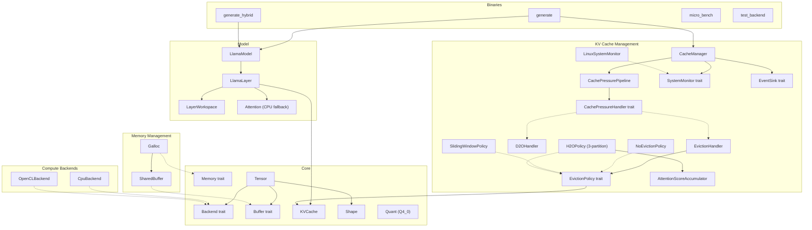
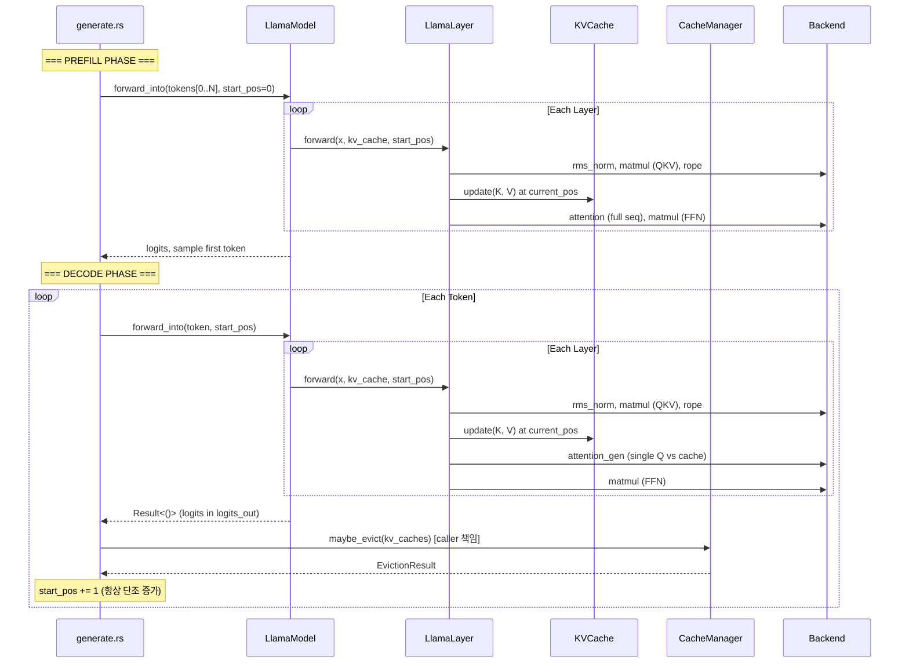
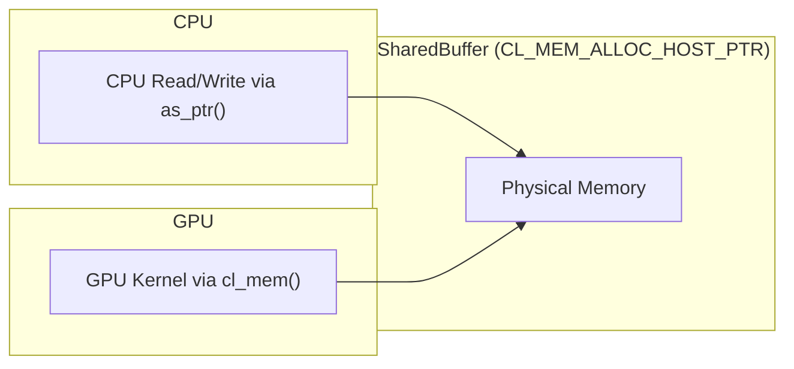

# Architecture

> **상세 구현 가이드**: 이 프로젝트를 처음부터 구현하려면 [`docs/00_build_guide.md`](docs/00_build_guide.md)를 참조하세요. 설계 결정의 근거는 [`docs/01_design_rationale.md`](docs/01_design_rationale.md)에 있습니다.

## Overview

### Background & Goals
본 프로젝트는 연구 및 실험 목적의 온디바이스(On-device) LLM 추론 프레임워크입니다. 모바일 및 엣지 디바이스 환경에서의 고성능 추론과 유연한 실험 환경 제공을 목표로 합니다.
- **유연한 백엔드 확장성 (Extensibility)**: Backend 인터페이스 기반 설계를 통해 CPU, GPU(OpenCL), NPU(QNN, TBD) 등 다양한 하드웨어 가속기를 손쉽게 추가하고 교체할 수 있는 구조를 지향합니다.
- **고성능 메모리 관리 (Performance)**: ARM64 SoC 환경의 특성을 활용하여, Galloc 기반의 공유 메모리 관리자를 통해 CPU와 GPU/NPU 간 데이터 복사를 최소화(Zero-copy)하도록 설계되었습니다.
- **동적 KV 캐시 관리**: 메모리 제약 환경에서 장시간 추론을 위한 KV 캐시 Eviction 정책(Sliding Window, H2O 등)을 지원합니다.

### Scope & Limitation
- **Target Platform**: ARM64 아키텍처 기반의 엣지 디바이스(Android/Linux)를 주 타겟으로 합니다. x86 CPU 백엔드로도 추론은 가능하나, SIMD 최적화(NEON)는 ARM64 전용입니다.
- **Supported Models**: 현재는 Llama 3.2 아키텍처 모델의 추론만을 지원합니다. 향후 연구 목적에 따라 지원 모델이 추가될 수 있으나, 범용적인 모델 지원보다는 최적화 연구에 집중합니다.

---

## High-Level Architecture

### Component Diagram

```mermaid
graph TB
    subgraph BinaryLayer ["Binaries"]
        Generate["generate"]
        GenerateHybrid["generate_hybrid"]
        MicroBench["micro_bench"]
        TestBackend["test_backend"]
    end

    subgraph ModelComponent ["Model"]
        LlamaModel["LlamaModel"]
        LlamaLayer["LlamaLayer"]
        LayerWS["LayerWorkspace"]
        Attention["Attention (CPU fallback)"]
    end

    subgraph CoreComponent ["Core"]
        BackendTrait["Backend trait"]
        MemoryTrait["Memory trait"]
        BufferTrait["Buffer trait"]
        KVCache["KVCache"]
        Tensor["Tensor"]
        Shape["Shape"]
        Quant["Quant (Q4_0)"]
    end

    subgraph EvictionSubsystem ["KV Cache Management"]
        CacheManager["CacheManager"]
        Pipeline["CachePressurePipeline"]
        HandlerTrait["CachePressureHandler trait"]
        EvictionHandler["EvictionHandler"]
        D2OHandler["D2OHandler"]
        EvictionPolicy["EvictionPolicy trait"]
        NoEviction["NoEvictionPolicy"]
        SlidingWindow["SlidingWindowPolicy"]
        H2O["H2OPolicy (3-partition)"]
        ScoreAccum["AttentionScoreAccumulator"]
        SysMonitor["SystemMonitor trait"]
        LinuxMonitor["LinuxSystemMonitor"]
        EventSinkTrait["EventSink trait"]
    end

    subgraph BackendComponent ["Compute Backends"]
        CpuBackend["CpuBackend"]
        OpenCLBackend["OpenCLBackend"]
    end

    subgraph MemoryComponent ["Memory Management"]
        Galloc["Galloc"]
        SharedBuffer["SharedBuffer"]
    end

    Generate --> LlamaModel
    GenerateHybrid --> LlamaModel
    LlamaModel --> LlamaLayer
    LlamaLayer --> LayerWS
    LlamaLayer --> Attention
    LlamaLayer --> KVCache

    Generate --> CacheManager
    CacheManager --> Pipeline
    CacheManager --> SysMonitor
    CacheManager --> EventSinkTrait
    Pipeline --> HandlerTrait
    HandlerTrait -.-> EvictionHandler
    HandlerTrait -.-> D2OHandler
    EvictionHandler --> EvictionPolicy
    NoEviction -.-> EvictionPolicy
    SlidingWindow -.-> EvictionPolicy
    H2O -.-> EvictionPolicy
    LinuxMonitor -.-> SysMonitor
    EvictionPolicy --> KVCache
    H2O --> ScoreAccum

    Tensor --> BufferTrait
    Tensor --> BackendTrait
    Tensor --> Shape

    CpuBackend -.-> BackendTrait
    OpenCLBackend -.-> BackendTrait
    Galloc -.-> MemoryTrait
    SharedBuffer -.-> BufferTrait
    Galloc --> SharedBuffer
```

### Key Components

| Component | 역할 | 파일 |
|:----------|:-----|:-----|
| **Tensor** | 논리적 데이터 단위. Buffer(물리 메모리) + Shape(차원) + Backend(연산 위임) | `src/core/tensor.rs` |
| **Backend** | 하드웨어 가속기 추상화 (matmul, softmax, RoPE 등 연산자 정의) | `src/core/backend.rs` |
| **Galloc** | 시스템/장치 공유 메모리 할당자. Zero-copy의 핵심 | `src/memory/galloc.rs` |
| **KVCache** | 레이어별 K/V 텐서 저장. `update`, `prune_prefix`, `get_view` 제공 | `src/core/kv_cache.rs` |
| **CacheManager** | 메모리 압박 감지 + CachePressurePipeline을 통한 eviction 조율. EventSink 기반 이벤트 출력 | `src/core/cache_manager.rs` |
| **CachePressurePipeline** | PressureLevel별 다중 CachePressureHandler 순차 실행 | `src/core/pressure/mod.rs` |
| **EventSink** | 캐시 관리 이벤트 구조화 출력 (NoOpSink, StderrDiagnosticSink) | `src/core/events.rs` |
| **SamplingConfig** | 토큰 샘플링 파라미터 (temperature, top-k, top-p 등) | `src/core/sampling.rs` |
| **LlamaLayer** | 단일 트랜스포머 레이어 (`forward` 내부에서 seq_len에 따라 분기) | `src/layers/llama_layer.rs` |
| **LayerWorkspace** | 생성 루프용 사전 할당 작업 텐서 (매 토큰 재사용) | `src/layers/workspace.rs` |
| **LlamaModel** | 모델 로딩, 임베딩, 레이어 반복, 로짓 계산 | `src/models/llama/llama_model.rs` |
| **AttentionScoreAccumulator** | H2O용 attention importance score 누적 (decay, reset) | `src/core/attention_scores.rs` |

---

## Inference Execution Flow

### Prefill → Decode 순서도


```mermaid
sequenceDiagram
    participant User as generate.rs
    participant Model as LlamaModel
    participant Layer as LlamaLayer
    participant Cache as KVCache
    participant CM as CacheManager
    participant Backend

    Note over User: === PREFILL PHASE ===
    User->>Model: forward_into(tokens[0..N], start_pos=0)
    loop Each Layer
        Model->>Layer: forward(x, kv_cache, start_pos)
        Layer->>Backend: rms_norm, matmul (QKV), rope
        Layer->>Cache: update(K, V) at current_pos
        Layer->>Backend: attention (full seq), matmul (FFN)
    end
    Model-->>User: logits, sample first token

    Note over User: === DECODE PHASE ===
    loop Each Token
        User->>Model: forward_into(token, start_pos)
        loop Each Layer
            Model->>Layer: forward(x, kv_cache, start_pos)
            Layer->>Backend: rms_norm, matmul (QKV), rope
            Layer->>Cache: update(K, V) at current_pos
            Layer->>Backend: attention_gen (single Q vs cache)
            Layer->>Backend: matmul (FFN)
        end
        Model-->>User: Result<()> (logits in logits_out)
        User->>CM: maybe_evict(kv_caches) [caller 책임]
        CM-->>User: EvictionResult
        Note over User: start_pos += 1 (항상 단조 증가)
    end
```

### RoPE와 Eviction의 관계 (중요!)

> **⚠️ RoPE Position은 eviction과 무관하게 단조 증가해야 합니다.**
>
> - `start_pos`: RoPE 인코딩용 **논리적 위치** (토큰마다 +1, eviction 무관)
> - `current_pos`: KV 캐시 내 **물리적 슬롯** (eviction 시 감소)
>
> RoPE는 Key 벡터에 absolute position을 write 시점에 영구 인코딩합니다.
> Eviction이 cache를 물리적으로 shift해도 기존 key의 RoPE 인코딩은 변하지 않으므로,
> Query의 RoPE position(`start_pos`)은 연속적으로 증가해야 relative distance가 올바릅니다.

---

## Memory Model & Data Flow

### Zero-copy Mechanism
`Galloc`은 CPU 메모리 할당을 담당하며, OpenCL 파이프라인에서는 `OpenCLMemory`가 `CL_MEM_ALLOC_HOST_PTR`을 사용하여 CPU와 GPU가 물리적으로 동일한 메모리 주소를 가리키도록 지원합니다. ARM SoC의 통합 메모리(UMA)에서는 별도의 `memcpy` 없이 백엔드가 즉시 연산을 수행할 수 있습니다.


```mermaid
graph LR
    subgraph CPU
        A["CPU Read/Write via as_ptr()"]
    end
    subgraph GPU
        B["GPU Kernel via cl_mem()"]
    end
    subgraph SharedMemory["SharedBuffer (CL_MEM_ALLOC_HOST_PTR)"]
        C["Physical Memory"]
    end
    A --> C
    B --> C
```

---

## KV Cache & Eviction System

3가지 전략을 지원하는 Strategy Pattern 기반 KV 캐시 관리:
- **NoEvictionPolicy**: 기본값. eviction 없이 가득 차면 에러.
- **SlidingWindowPolicy**: 최근 N 토큰 유지, `protected_prefix`로 attention sink 보호.
- **H2OPolicy**: 3-partition 모델 (prefix + heavy hitters + recent window). Signal-driven — Resilience 시그널 수신 시 `CacheManager::force_evict_with_scores()`로 실행.
- **AttentionScoreAccumulator**: H2O용 importance score를 매 토큰마다 누적 (bookkeeping only).

**Eviction 후 데이터 흐름**:
```
Before: [T0][T1][T2][T3][T4][T5][T6][T7] current_pos=8, start_pos=8
prune_prefix(3):
After:  [T3][T4][T5][T6][T7][_][_][_]   current_pos=5, start_pos=8 (불변!)
         ↑ RoPE(3..7) — 원래 인코딩 유지
```

> `start_pos`(RoPE 논리 위치)는 eviction 후에도 단조 증가. `current_pos`(물리 슬롯)만 감소.

상세: [`docs/11_kv_cache_management.md`](docs/11_kv_cache_management.md)

---

## Implementation Specifications

### 1. Environment
- **Language**: Rust (Edition 2024, nightly 사용 가능)
- **3rd Party Crates**:

| Crate | 버전 | 용도 |
|:------|:-----|:-----|
| `safetensors` | 0.7 | HuggingFace Safetensors 포맷 로딩 |
| `memmap2` | 0.9 | 대용량 모델 파일 메모리 매핑 |
| `half` | 2.7 | BF16/F16 ↔ F32 변환 |
| `tokenizers` | 0.22 | HuggingFace Tokenizer (onig 백엔드) |
| `serde` / `serde_json` | 1.0 | 모델 config 파싱 |
| `anyhow` | 1.0 | 에러 핸들링 |
| `clap` | 4.5 | CLI 인터페이스 (derive 매크로) |
| `rayon` | 1.11 | 데이터 병렬 처리 (attention heads) |
| `ocl` | 0.19 | OpenCL 바인딩 (feature-gated) |
| `rand` | 0.9 | 토큰 샘플링 |
| `log` / `env_logger` | 0.4/0.11 | 로깅 |
| `zbus` | 5 | D-Bus IPC (feature-gated: `resilience`) |

- **Features**: `opencl` (기본 활성), `resilience` (optional, `zbus` 의존)
- **LLM Model Format**: HuggingFace Safetensors (`model.safetensors` + `config.json` + `tokenizer.json`)
- **Release Profile**: `lto = "fat"`, `codegen-units = 1`, `opt-level = 3`

### 2. Directory Structure

```
llm_rs2/
├── ARCHITECTURE.md          # 본 문서
├── Cargo.toml               # 프로젝트 설정 및 의존성
├── android.source           # Android 크로스컴파일 환경 변수
│
├── src/
│   ├── lib.rs               # 라이브러리 루트 (모듈 선언)
│   ├── main.rs              # 기본 엔트리포인트 (미사용)
│   ├── bin/
│   │   ├── generate.rs      # ★ 주력 추론 바이너리 (단일 백엔드)
│   │   ├── generate_hybrid.rs  # CPU↔GPU 동적 전환 추론
│   │   ├── micro_bench.rs   # 개별 연산자 벤치마크
│   │   ├── test_backend.rs  # 백엔드 정합성 테스트
│   │   ├── test_model.rs    # 모델 로딩 테스트
│   │   └── repro_attention.rs  # attention 버그 재현용
│   │
│   ├── core/                      # 핵심 추상화 레이어
│   │   ├── mod.rs                 # 모듈 선언
│   │   ├── backend.rs             # Backend trait (15개 연산자 정의)
│   │   ├── buffer.rs              # Buffer trait + DType enum
│   │   ├── memory.rs              # Memory trait (alloc/used_memory)
│   │   ├── tensor.rs              # Tensor struct (Shape + Buffer + Backend)
│   │   ├── shape.rs               # Shape struct (dims, numel)
│   │   ├── kv_cache.rs            # KVCache (update, prune_prefix, get_view)
│   │   ├── cache_manager.rs       # CacheManager (eviction 조율)
│   │   ├── sys_monitor.rs         # SystemMonitor trait + LinuxSystemMonitor
│   │   ├── quant.rs               # BlockQ4_0 quantization 구조체
│   │   ├── attention_scores.rs    # AttentionScoreAccumulator (H2O importance tracking)
│   │   ├── events.rs              # EventSink trait, CacheEvent enum, StderrDiagnosticSink
│   │   ├── sampling.rs            # SamplingConfig, sample() 함수
│   │   ├── eviction/              # Eviction 정책 (Strategy Pattern)
│   │   │   ├── mod.rs             # EvictionPolicy trait
│   │   │   ├── no_eviction.rs     # NoEvictionPolicy (항상 skip)
│   │   │   ├── sliding_window.rs  # SlidingWindowPolicy (최근 N 토큰 유지)
│   │   │   └── h2o.rs             # H2OPolicy (3-partition: prefix + heavy hitters + recent)
│   │   └── pressure/              # CachePressure 핸들러 (Pipeline Pattern)
│   │       ├── mod.rs             # CachePressureHandler trait, CachePressurePipeline
│   │       ├── eviction_handler.rs # EvictionHandler (EvictionPolicy → Handler 어댑터)
│   │       ├── d2o_handler.rs     # D2OHandler (merge compensation)
│   │       └── {compress,quantize,merge,swap,sparse}_handler.rs  # stubs
│   │
│   ├── models/llama/
│   │   ├── llama_model.rs    # LlamaModel (from_dir, forward_into)
│   │   └── llama_model_tmp.rs  # 실험용
│   │
│   ├── layers/
│   │   ├── llama_layer.rs    # LlamaLayer (forward — seq_len에 따라 내부 분기)
│   │   ├── attention.rs      # CPU attention 함수 (naive, flash)
│   │   └── workspace.rs      # LayerWorkspace (사전 할당 버퍼)
│   │
│   ├── backend/
│   │   ├── cpu/
│   │   │   ├── mod.rs        # CpuBackend struct
│   │   │   ├── common.rs     # 공통 연산 (portable)
│   │   │   ├── neon.rs       # ARM64 NEON SIMD 최적화
│   │   │   └── x86.rs        # x86 SSE/AVX fallback
│   │   └── opencl/
│   │       ├── mod.rs        # OpenCLBackend struct & implementation
│   │       ├── buffer.rs     # OpenCL용 SharedBuffer 확장
│   │       └── memory.rs     # OpenCL용 Galloc (CL_MEM_ALLOC_HOST_PTR)
│   │
│   ├── resilience/                  # Resilience Manager (feature-gated)
│   │   ├── mod.rs                   # 모듈 선언 + re-exports
│   │   ├── manager.rs               # ResilienceManager (poll, execute_action)
│   │   ├── signal.rs                # SystemSignal, Level, enum types
│   │   ├── state.rs                 # OperatingMode (Normal/Degraded/Minimal/Suspended)
│   │   ├── transport.rs              # Transport trait + SignalListener<T> (별도 스레드)
│   │   ├── dbus_transport.rs        # DbusTransport (zbus blocking, Transport 구현)
│   │   └── strategy/                # Signal reaction strategies
│   │       ├── mod.rs               # ResilienceAction, resolve_conflicts()
│   │       ├── memory.rs            # MemoryStrategy
│   │       ├── thermal.rs           # ThermalStrategy
│   │       ├── energy.rs            # EnergyStrategy
│   │       └── compute.rs           # ComputeStrategy
│   │
│   ├── memory/galloc.rs      # Galloc (CPU 전용 메모리 할당)
│   └── buffer/shared_buffer.rs  # SharedBuffer 구현
│
├── kernels/                  # OpenCL 커널 파일 (~78개 .cl 파일)
│   ├── mul_mv_q4_0_f32*.cl   # Q4_0 양자화 MatVec 커널
│   ├── rms_norm.cl           # RMS Norm 커널
│   ├── rope.cl               # RoPE 커널
│   ├── simple_ops.cl         # 기본 연산 (add, scale, silu)
│   ├── flash_attn_f32.cl     # Flash Attention 커널
│   └── ...
│
├── scripts/                  # 테스트/벤치마크 자동화
│   ├── android_profile.py    # Android 프로파일링 + JSON 결과 수집
│   ├── run_benchmark_suite.py  # 벤치마크 매트릭스 실행
│   ├── update_benchmark_summary.py  # 결과 요약 테이블 생성
│   └── visualize_profile.py  # 프로파일 데이터 시각화
│
├── docs/                     # 상세 기술 문서
│   ├── 00_build_guide.md
│   ├── 01_design_rationale.md
│   ├── 02_core_abstractions.md
│   ├── 03_cpu_backend.md
│   ├── 04_model_loading.md
│   ├── 05_tokenizer_and_sampling.md
│   ├── 06_opencl_backend.md
│   ├── 07_kernel_implementation.md
│   ├── 08_memory_management.md
│   ├── 09_attention_mechanism.md
│   ├── 10_model_inference.md
│   ├── 11_kv_cache_management.md
│   ├── 12_hybrid_inference.md
│   ├── 13_testing_and_benchmarks.md
│   ├── 14_component_status.md        # 컴포넌트 품질 게이트
│   ├── 15_test_strategy.md           # Resilience 테스트 전략 (T1-T4)
│   ├── 20_dbus_ipc_spec.md          # D-Bus IPC 명세
│   ├── 21_resilience_architecture.md # Resilience 아키텍처 + 전략 패턴
│   ├── 22_resilience_integration.md  # Phase 3 generate.rs 통합 설계
│   ├── 23_resilience_test_strategy.md # Resilience 통합 테스트 요약
│   ├── 24_resilience_usage_guide.md  # Resilience 사용 가이드
│   ├── 25_troubleshooting.md         # 트러블슈팅 가이드
│   └── 26_api_reference.md           # Resilience API 레퍼런스
│
├── web_dashboard/            # 벤치마크 시각화 웹 대시보드
├── results/                  # 프로파일링 결과 JSON
└── tests/                    # 통합 테스트
```

### 3. Binaries

| Binary | 용도 | 주요 옵션 |
|:-------|:----|:---------|
| `generate` | 단일 백엔드 추론 (주력) | `--backend`, `--kv-type`, `--eviction-policy`, `--eviction-window`, `--enable-resilience`, `--resilience-transport`, `--initial-kv-capacity` |
| `generate_hybrid` | CPU↔GPU 동적 전환 추론 | `--switch-threshold`, `--warmup-tokens` |
| `micro_bench` | 개별 연산자 벤치마크 | 연산별 크기 지정 |
| `test_backend` | 백엔드 정합성 검증 | CPU vs OpenCL 결과 비교 |
| `test_model` | 모델 로딩 검증 | `--model-path` |
| `repro_attention` | attention 버그 재현 | 디버깅용 |
| `reproduce_opencl_cast` | OpenCL cast 버그 재현 | 디버깅용 |

`generate` 바이너리의 eviction 관련 CLI 옵션:
```
--eviction-policy <POLICY>       none | sliding | h2o [default: none]
--eviction-window <SIZE>         Sliding window size [default: 1024]
--protected-prefix <N>           Attention sink tokens to protect [default: prompt length]
--memory-threshold-mb <MB>       Memory pressure threshold [default: 256]
--eviction-target-ratio <RATIO>  Cache keep ratio on eviction [default: 0.75]
--h2o-recent-window <N>          Recent tokens always protected [default: 128]
--h2o-keep-ratio <RATIO>         Heavy hitter keep ratio [default: 0.5]
--h2o-tracked-layers <N>         Layers tracked for importance [default: 3]
--h2o-decay <DECAY>              Importance score decay per step [default: 0.1]
```

### 4. Data Layout & Quantization

- **Data Layout**: C-style Row-Major, 64-byte alignment
- **Q4_0**: GGML 호환 4-bit 양자화 (32 values → 20 bytes: 1 `f32` scale + 16 `u8` nibbles). Dequant: `(nibble - 8) * scale`
- **지원 DType**: F32, F16, BF16 (가중치 로딩), Q4_0/Q4_1/Q8_0 (양자화), U8

상세: [`docs/02_core_abstractions.md`](docs/02_core_abstractions.md)

---

## 5. 핵심 인터페이스 (Trait)

- **Backend** (15+ 연산) — 하드웨어 가속기 추상화 (matmul, softmax, RoPE 등) → [`docs/02_core_abstractions.md`](docs/02_core_abstractions.md)
- **Buffer / Memory** — 물리 메모리 할당 및 접근 (CPU pointer, OpenCL handle) → [`docs/02_core_abstractions.md`](docs/02_core_abstractions.md)
- **EvictionPolicy** (`should_evict`, `evict`, `evict_with_scores`, `name`) → [`docs/11_kv_cache_management.md`](docs/11_kv_cache_management.md)
- **CachePressureHandler** (`handle`, `name`) — 일반화된 캐시 관리 핸들러 (eviction, merge, compress 등) → `src/core/pressure/mod.rs`
- **EventSink** (`emit`) — 캐시 관리 이벤트 구조화 출력 → `src/core/events.rs`
- **SystemMonitor** — `/proc/meminfo` 기반 시스템 메모리 모니터링 → [`docs/11_kv_cache_management.md`](docs/11_kv_cache_management.md)

---

## 6. Resilience Subsystem

D-Bus/UnixSocket 시스템 신호(메모리/CPU/온도/에너지)에 따라 추론 동작을 자동 조절하는 적응형 추론 시스템. Feature-gated (`--features resilience`), opt-in (`--enable-resilience`).

`SignalListener<T: Transport>` (별도 스레드) → mpsc::channel → `ResilienceManager.poll()` (논블로킹) → Strategy.react() → resolve_conflicts() → `cache_manager.force_evict_with_scores()` / execute_action().

| Mode | Trigger | 동작 |
|:-----|:--------|:-----|
| **Normal** | 모든 신호 Normal | 제한 없음 |
| **Degraded** | Warning ≥ 1 | 백엔드 전환 권고 |
| **Minimal** | Critical ≥ 1 | Evict + Throttle + LimitTokens |
| **Suspended** | Emergency ≥ 1 | 추론 중단 (`break`) |

**설계 원칙**: Fail-open, No tokio (std::thread + mpsc).

상세: [`docs/21_resilience_architecture.md`](docs/21_resilience_architecture.md) | 통합: [`docs/22_resilience_integration.md`](docs/22_resilience_integration.md) | 사용 가이드: [`docs/24_resilience_usage_guide.md`](docs/24_resilience_usage_guide.md)

---

## 7. LlamaLayer Forward Paths

`LlamaLayer`에는 **두 가지 forward 경로**가 있습니다:

### 7.1. `forward()` — Prefill Phase
다수의 토큰(`seq_len > 1`)을 한 번에 처리합니다.
```
Input: [batch, seq_len, dim]
Flow: RMSNorm → QKV matmul → RoPE → KV cache update
      → Attention (flash/naive) → Residual → FFN → Residual
Output: [batch, seq_len, dim]
```

### 7.2. `forward_gen()` — Decode Phase (internal)
단일 토큰(`seq_len = 1`)을 효율적으로 처리하는 **private** 메서드입니다. 공개 API인 `forward()` 내부에서 `seq_len == 1`일 때 자동으로 호출됩니다. `LayerWorkspace`의 사전 할당 버퍼를 재사용합니다.
```
Input: [batch, 1, dim]
Flow: RMSNorm → QKV matmul → RoPE → KV cache update
      → attention_gen (GPU) or CPU fallback → Residual → FFN → Residual
Output: [batch, 1, dim]
```

**CPU Attention Fallback 조건**: 
- OpenCL 백엔드에서 `use_gpu_attn=false`인 경우
- KV 캐시 dtype이 F32인 경우
- CPU 백엔드 사용 시

CPU Fallback은 ARM64에서 NEON 4-way unrolled dot product로 최적화되며, `scores` 버퍼(LayerWorkspace에 사전 할당)를 사용합니다. `rayon`을 이용한 head 병렬화는 `cache_seq_len >= 256`일 때 활성화됩니다.

---

## 8. Development Workflows

자세한 빌드/테스트/배포 절차는 `.agent/skills/`와 `.agent/workflows/`를 참조하세요.

| Workflow | 설명 | 파일 |
|:---------|:----|:-----|
| `/deploy_and_test` | Android 빌드 → 디바이스 push → 추론 테스트 | `.agent/workflows/deploy_and_test.md` |
| `/pre_push` | 포맷/린트/테스트 체크 | `.agent/workflows/pre_push.md` |
| `/dashboard` | 벤치마크 대시보드 실행 | `.agent/workflows/dashboard.md` |

### 8.1. 로컬 PC 테스트 (CPU only)
```bash
cargo build --release --bin generate
./target/release/generate \
  --model-path /path/to/model \
  --prompt "Hello" -n 50 \
  --backend cpu --kv-type f32
```

### 8.2. Eviction 테스트
```bash
./target/release/generate \
  --model-path /path/to/model \
  --prompt "Hello" -n 200 \
  --eviction-policy sliding \
  --eviction-window 256 \
  --memory-threshold-mb 1  # 강제 트리거용
```

### 8.3. Resilience 테스트
```bash
# Resilience 통합 테스트
cargo test --features resilience --test test_resilience_integration

# Resilience 활성화 추론
./target/release/generate \
  --model-path /path/to/model \
  --prompt "Hello" -n 200 \
  --enable-resilience
```

### 8.4. Android 디바이스 테스트
```bash
source android.source
cargo build --target aarch64-linux-android --release --bin generate --features opencl
adb push target/aarch64-linux-android/release/generate /data/local/tmp/
adb shell /data/local/tmp/generate --model-path /data/local/tmp/model --backend opencl
```

---

## 9. Design Decisions & Known Limitations

### Design Decisions
1. **Backend trait에 기본 구현 제공**: `attention_gen`, `gather`, `copy_slice` 등은 trait에 CPU 기반 기본 구현이 있어 새 백엔드 추가 시 최소한의 메서드만 구현하면 동작합니다.
2. **Signal-driven eviction (대 원칙)**: 모든 eviction, throttle, delay 등 추론 성능에 영향을 주는 로직은 **Resilience 시그널을 받았을 때만** 동작합니다. 추론 루프(forward pass)에서 자동으로 eviction을 트리거하지 않습니다. Score 누적(bookkeeping)은 매 토큰마다 수행되지만, 실제 eviction 결정은 외부 Resilience Manager가 내립니다. `CacheManager::force_evict()` / `force_evict_with_scores()`가 시그널 수신 시 호출되며, `CacheManager::maybe_evict()`는 forward path에서 사용하지 않습니다(H2O). H2O의 `should_evict()`는 항상 `false`를 반환합니다.
3. **LayerWorkspace로 할당 최소화**: Decode 루프에서 매 토큰마다 메모리를 할당하지 않고, 사전 할당된 작업 버퍼를 재사용합니다.

### Known Limitations
1. **H2O importance score는 eviction 후 reset됨**: 설계 의도. 3-partition 모델의 recent window가 보완하여, 방금 생성된 토큰이 낮은 score로 evict되는 것을 방지합니다.
2. **GPU buffer prune 미지원**: `prune_prefix`는 CPU 포인터 접근이 필요하므로 GPU-only 버퍼에서는 실패합니다 (`as_mut_ptr()` null).
3. **Sliding window 품질 한계**: 작은 윈도우(< 128)에서 반복 eviction 시 품질이 급격히 열화됩니다. Attention sink(`protected_prefix`)가 부분적으로 완화합니다.