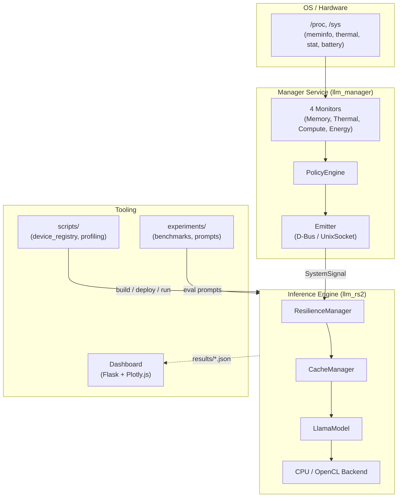
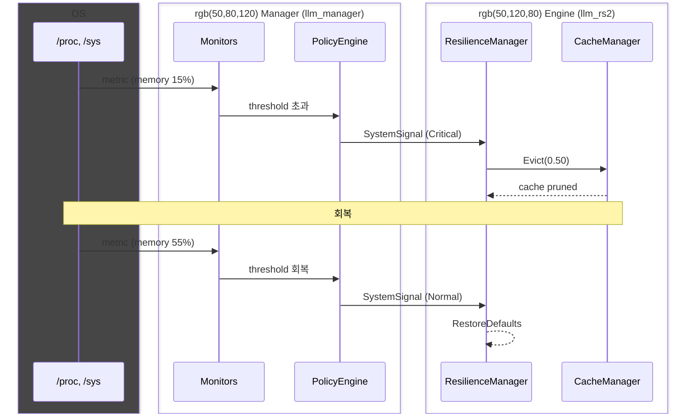
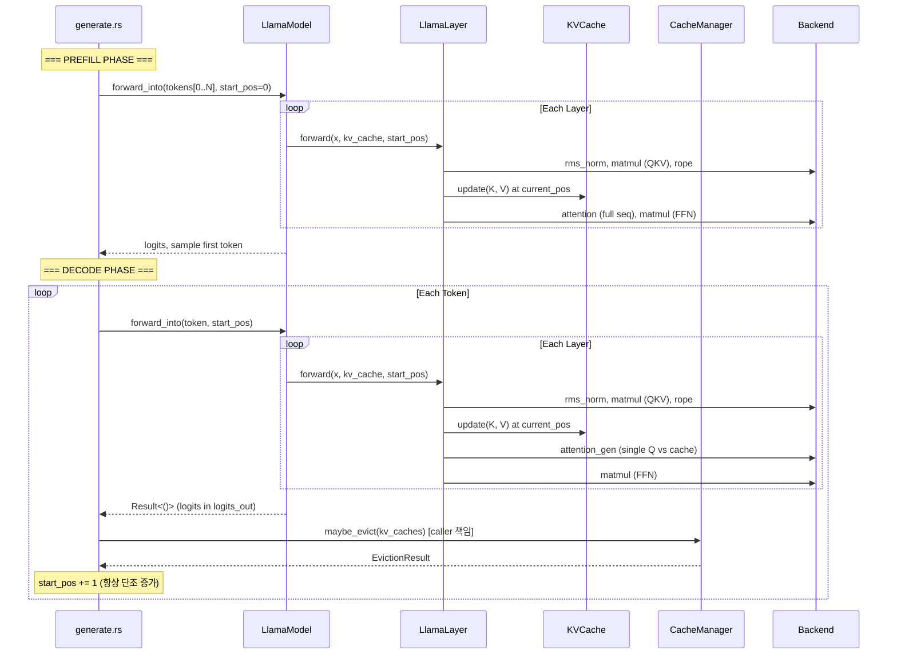
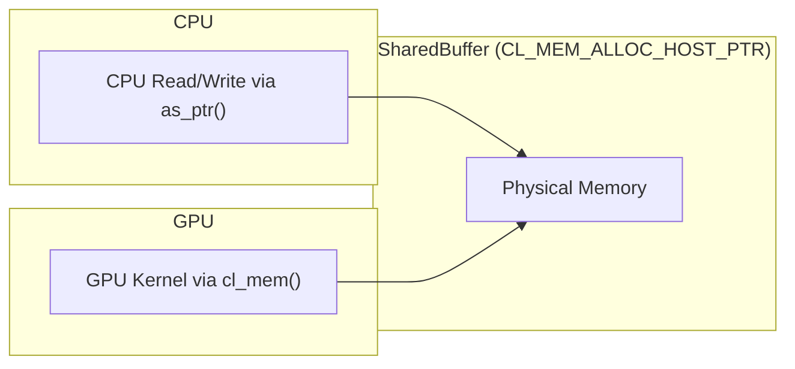

# Architecture

> **상세 구현 가이드**: 이 프로젝트를 처음부터 구현하려면 [`docs/00_build_guide.md`](docs/00_build_guide.md)를 참조하세요. 설계 결정의 근거는 [`docs/01_design_rationale.md`](docs/01_design_rationale.md)에 있습니다.

## Overview

### Background & Goals
본 프로젝트는 연구 및 실험 목적의 온디바이스(On-device) LLM 추론 프레임워크입니다. 모바일 및 엣지 디바이스 환경에서의 고성능 추론과 유연한 실험 환경 제공을 목표로 합니다.
- **유연한 백엔드 확장성 (Extensibility)**: Backend 인터페이스 기반 설계를 통해 CPU, GPU(OpenCL), NPU(QNN, TBD) 등 다양한 하드웨어 가속기를 손쉽게 추가하고 교체할 수 있는 구조를 지향합니다.
- **고성능 메모리 관리 (Performance)**: ARM64 SoC 환경의 특성을 활용하여, Galloc 기반의 공유 메모리 관리자를 통해 CPU와 GPU/NPU 간 데이터 복사를 최소화(Zero-copy)하도록 설계되었습니다.
- **동적 KV 캐시 관리**: 메모리 제약 환경에서 장시간 추론을 위한 KV 캐시 Eviction 정책(Sliding Window, H2O, StreamingLLM 등)을 지원합니다.
- **Action Pool 기반 적응형 추론**: 8개 액션(W1~W3, C1, C4~C6, C8)을 동적으로 enable/disable하여 시스템 리소스 압박에 대응합니다. Lossless(백엔드 전환, 디스크 오프로드, 쓰로틀링)와 Lossy(레이어 스킵, KV eviction, KV 압축, KV 양자화) 두 카테고리를 지원합니다.

### Scope & Limitation
- **Target Platform**: ARM64 아키텍처 기반의 엣지 디바이스(Android/Linux)를 주 타겟으로 합니다. x86 CPU 백엔드로도 추론은 가능하나, SIMD 최적화(NEON)는 ARM64 전용입니다.
- **Supported Models**: 현재는 Llama 3.2 아키텍처 모델의 추론만을 지원합니다. 향후 연구 목적에 따라 지원 모델이 추가될 수 있으나, 범용적인 모델 지원보다는 최적화 연구에 집중합니다.

---

## System Architecture

본 프로젝트는 **Cargo workspace** 기반의 멀티크레이트 구조와 비-Rust 컴포넌트로 구성됩니다.

### Workspace 구조

| Crate / 컴포넌트 | 타입 | 역할 |
|:-----------------|:-----|:-----|
| **`engine/`** (`llm_rs2`) | Rust binary+lib | LLM 추론 엔진 — 모델 로딩, forward pass, KV 캐시, 백엔드 연산 |
| **`manager/`** (`llm_manager`) | Rust binary+lib | 시스템 리소스 모니터 서비스 — 메모리/온도/CPU/에너지 감시, 시그널 발신 |
| **`shared/`** (`llm_shared`) | Rust lib | 공유 신호 타입 — `SystemSignal`, `Level` 등 (engine ↔ manager 인터페이스) |
| **`dashboard/`** | Python (Flask) | 벤치마크 시각화 웹 대시보드 (Plotly.js) |
| **`scripts/`** | Python | 디바이스 관리, 프로파일링, 벤치마크 자동화 |
| **`experiments/`** | Python + JSON | 평가 벤치마크, 실험 설정, 결과/보고서 |

### System Component Diagram


```mermaid
graph TB
    subgraph OS ["OS / Hardware"]
        SysMetrics["/proc, /sys
        (meminfo, thermal, stat, battery)"]
    end

    subgraph Manager ["Manager Service (llm_manager)"]
        Monitors["4 Monitors
        (Memory, Thermal, Compute, Energy)"]
        PolicyEngine["PolicyEngine"]
        Emitter["Emitter
        (D-Bus / UnixSocket)"]
    end

    subgraph Engine ["Inference Engine (llm_rs2)"]
        Resilience["ResilienceManager"]
        CacheMgr["CacheManager"]
        Model["LlamaModel"]
        Backends["CPU / OpenCL Backend"]
    end

    subgraph Tooling ["Tooling"]
        Scripts["scripts/
        (device_registry, profiling)"]
        Experiments["experiments/
        (benchmarks, prompts)"]
        Dashboard["Dashboard
        (Flask + Plotly.js)"]
    end

    SysMetrics --> Monitors
    Monitors --> PolicyEngine --> Emitter
    Emitter -->|"SystemSignal"| Resilience
    Resilience --> CacheMgr --> Model
    Model --> Backends

    Scripts -->|"build / deploy / run"| Engine
    Experiments -->|"eval prompts"| Engine
    Engine -.->|"results/*.json"| Dashboard
```

### Inter-Component Communication


```mermaid
sequenceDiagram
    box rgb(70,70,70) OS
        participant OS as /proc, /sys
    end
    box rgb(50,80,120) Manager (llm_manager)
        participant Mon as Monitors
        participant PE as PolicyEngine
    end
    box rgb(50,120,80) Engine (llm_rs2)
        participant Res as ResilienceManager
        participant CM as CacheManager
    end

    OS->>Mon: metric (memory 15%)
    Mon->>PE: threshold 초과
    PE->>Res: SystemSignal (Critical)
    Res->>CM: Evict(0.50)
    CM-->>Res: cache pruned

    Note over OS,CM: 회복

    OS->>Mon: metric (memory 55%)
    Mon->>PE: threshold 회복
    PE->>Res: SystemSignal (Normal)
    Res-->>Res: RestoreDefaults
```

**통신 방향**: Manager → Engine (단방향). Engine은 Manager에 피드백을 보내지 않음 (fire-and-forget).

**IPC 프로토콜**:
- **D-Bus** (Linux): System Bus, `org.llm.Manager1` — 타입 안전한 zbus 직렬화
- **Unix Socket** (Android): `[4-byte BE u32 len][UTF-8 JSON]` — 단일 클라이언트 1:1

---

## Engine Architecture

> 이하 "High-Level Architecture" ~ "Resilience Subsystem"은 Engine(`llm_rs2`) 크레이트의 내부 구조를 설명합니다.

### Component Diagram

```mermaid
graph TB
    subgraph BinaryLayer ["Binaries"]
        Generate["generate"]
        GenerateHybrid["generate_hybrid"]
        MicroBench["micro_bench"]
        TestBackend["test_backend"]
    end

    subgraph ModelComponent ["Model"]
        LlamaModel["LlamaModel"]
        LlamaLayer["LlamaLayer"]
        LayerWS["LayerWorkspace"]
        Attention["Attention (CPU fallback)"]
    end

    subgraph CoreComponent ["Core"]
        BackendTrait["Backend trait"]
        MemoryTrait["Memory trait"]
        BufferTrait["Buffer trait"]
        KVCacheOpsTrait["KVCacheOps trait"]
        KVCache["KVCache"]
        KiviCache["KiviCache (Q2/Q4/Q8+Residual)"]
        OffloadKVCache["OffloadKVCache (RawStore/DiskStore)"]
        Tensor["Tensor"]
        Shape["Shape"]
        Quant["Quant (Q4_0, Q2_0, KVQ4, KVQ8)"]
        SkipConfig["SkipConfig (SWIFT)"]
        Speculative["SpeculativeDecoder"]
        MathUtils["MathUtils (avg_pool, topk)"]
    end

    subgraph QCFSubsystem ["QCF (Quality Cost Function)"]
        QcfMetric["QcfMetric / QcfConfig"]
        EvictionQcf["compute_eviction_qcf"]
        QuantQcf["compute_flush_qcf (NMSE)"]
        SkipQcf["SkipQcfTracker"]
        LayerImp["ImportanceTable / ImportanceCollector"]
        DegEst["DegradationEstimator (α×Q)"]
    end

    subgraph EvictionSubsystem ["KV Cache Management"]
        CacheManager["CacheManager"]
        Pipeline["CachePressurePipeline"]
        HandlerTrait["CachePressureHandler trait"]
        EvictionHandler["EvictionHandler"]
        D2OHandler["D2OHandler"]
        SnapKVHandler["SnapKVHandler"]
        QuantizeHandler["QuantizeHandler"]
        SwapHandler["SwapHandler"]
        EvictionPolicy["EvictionPolicy trait"]
        NoEviction["NoEvictionPolicy"]
        SlidingWindow["SlidingWindowPolicy (+ StreamingLLM)"]
        H2O["H2OPolicy (3-partition)"]
        ScoreAccum["AttentionScoreAccumulator"]
        SysMonitor["SystemMonitor trait"]
        LinuxMonitor["LinuxSystemMonitor"]
        EventSinkTrait["EventSink trait"]
    end

    subgraph BackendComponent ["Compute Backends"]
        CpuBackend["CpuBackend"]
        OpenCLBackend["OpenCLBackend"]
    end

    subgraph MemoryComponent ["Memory Management"]
        Galloc["Galloc"]
        SharedBuffer["SharedBuffer"]
    end

    Generate --> LlamaModel
    GenerateHybrid --> LlamaModel
    LlamaModel --> LlamaLayer
    LlamaLayer --> LayerWS
    LlamaLayer --> Attention
    LlamaLayer --> KVCacheOpsTrait
    KVCache -.-> KVCacheOpsTrait
    KiviCache -.-> KVCacheOpsTrait
    OffloadKVCache -.-> KVCacheOpsTrait

    Generate --> CacheManager
    CacheManager --> Pipeline
    CacheManager --> SysMonitor
    CacheManager --> EventSinkTrait
    Pipeline --> HandlerTrait
    HandlerTrait -.-> EvictionHandler
    HandlerTrait -.-> D2OHandler
    HandlerTrait -.-> SnapKVHandler
    HandlerTrait -.-> QuantizeHandler
    HandlerTrait -.-> SwapHandler
    EvictionHandler --> EvictionPolicy
    SnapKVHandler --> MathUtils
    NoEviction -.-> EvictionPolicy
    SlidingWindow -.-> EvictionPolicy
    H2O -.-> EvictionPolicy
    LinuxMonitor -.-> SysMonitor
    EvictionPolicy --> KVCache
    Generate --> KiviCache
    Generate --> SkipConfig
    SkipConfig --> Speculative
    LlamaLayer --> SkipConfig
    H2O --> ScoreAccum

    Generate --> QcfMetric
    EvictionHandler --> EvictionQcf
    SnapKVHandler --> EvictionQcf
    QuantizeHandler --> QuantQcf
    EvictionQcf --> KVCache
    EvictionQcf --> ScoreAccum
    QuantQcf --> KiviCache
    LlamaModel --> LayerImp
    DegEst --> QcfMetric

    Tensor --> BufferTrait
    Tensor --> BackendTrait
    Tensor --> Shape

    CpuBackend -.-> BackendTrait
    OpenCLBackend -.-> BackendTrait
    Galloc -.-> MemoryTrait
    SharedBuffer -.-> BufferTrait
    Galloc --> SharedBuffer
```

### Key Components

| Component | 역할 | 파일 |
|:----------|:-----|:-----|
| **Tensor** | 논리적 데이터 단위. Buffer(물리 메모리) + Shape(차원) + Backend(연산 위임) | `engine/src/core/tensor.rs` |
| **Backend** | 하드웨어 가속기 추상화 (matmul, softmax, RoPE 등 연산자 정의) | `engine/src/core/backend.rs` |
| **Galloc** | 시스템/장치 공유 메모리 할당자. Zero-copy의 핵심 | `engine/src/memory/galloc.rs` |
| **KVCacheOps** | KV 캐시 추상화 trait (OCP 확장점). `update`, `get_view`, `kv_dtype` 등 | `engine/src/core/kv_cache.rs` |
| **KVCache** | 표준 KV 캐시 (F32/F16/Q4_0). Eviction + `compress_per_head()` 지원. KVCacheOps 구현 | `engine/src/core/kv_cache.rs` |
| **KiviCache** | KIVI 다중 비트 압축 캐시 (Q2/Q4/Q8). FP32 Residual + 양자화 저장소. `transition_bits()`로 동적 비트 전환 | `engine/src/core/kivi_cache.rs` |
| **CacheManager** | 메모리 압박 감지 + CachePressurePipeline을 통한 eviction 조율. EventSink 기반 이벤트 출력 | `engine/src/core/cache_manager.rs` |
| **CachePressurePipeline** | PressureLevel별 다중 CachePressureHandler 순차 실행 | `engine/src/core/pressure/mod.rs` |
| **SnapKVHandler** | SnapKV prefill-time 1회 압축 — observation window voting + avg pooling + per-head top-k | `engine/src/core/pressure/compress_handler.rs` |
| **QuantizeHandler** | Pressure → KIVI bits 매핑 (Warning→8, Critical→4, Emergency→2) | `engine/src/core/pressure/quantize_handler.rs` |
| **SwapHandler** | LRU 기반 KV 캐시 디스크 오프로드 (Warning+ 압력에서 동작) | `engine/src/core/pressure/swap_handler.rs` |
| **DiskStore** | 파일 기반 KV 캐시 저장소 (OffloadStore trait 구현) | `engine/src/core/offload/disk_store.rs` |
| **EventSink** | 캐시 관리 이벤트 구조화 출력 (NoOpSink, StderrDiagnosticSink) | `engine/src/core/events.rs` |
| **SamplingConfig** | 토큰 샘플링 파라미터 (temperature, top-k, top-p 등) | `engine/src/core/sampling.rs` |
| **SkipConfig** | SWIFT 레이어 스킵 설정 — attention/MLP 독립 스킵, layer 0/L-1 보호 | `engine/src/core/skip_config.rs` |
| **SpeculativeDecoder** | SWIFT draft/verify 프레임워크 — KV rollback, matchness, skip optimizer | `engine/src/core/speculative.rs` |
| **MathUtils** | avg_pool_1d, topk_indices_per_head — SnapKV/압축 알고리즘용 유틸리티 | `engine/src/core/math_utils.rs` |
| **LlamaLayer** | 단일 트랜스포머 레이어 (`forward` 내부에서 seq_len + skip 분기) | `engine/src/layers/llama_layer.rs` |
| **LayerWorkspace** | 생성 루프용 사전 할당 작업 텐서 (매 토큰 재사용) | `engine/src/layers/workspace.rs` |
| **LlamaModel** | 모델 로딩, 임베딩, 레이어 반복(skip_config 전달), 로짓 계산 | `engine/src/models/llama/llama_model.rs` |
| **AttentionScoreAccumulator** | H2O/SnapKV용 attention importance score 누적 (decay, reset) | `engine/src/core/attention_scores.rs` |
| **QcfMetric** | lossy action의 품질 열화 측정값 (action, raw_value, per_head, tokens_affected) | `engine/src/core/qcf/mod.rs` |
| **DegradationEstimator** | QCF→PPL 증가량 변환 (offline-calibrated PiecewiseLinear + runtime EMA 보정) | `engine/src/core/qcf/estimator.rs` |
| **ImportanceTable** | Prefill 시 cosine similarity 기반 레이어 중요도 테이블. Layer Skip QCF 계산용 | `engine/src/core/qcf/layer_importance.rs` |
| **StepHook** | Eval 루프의 캐시 관리 정책 추상화 trait (`before_importance_pass`, `before_question`, `after_question`) | `engine/src/eval/hook.rs` |
| **EvictionHook** | KVCache 전용 eval hook — importance 2-pass, eviction 트리거, 스냅샷 | `engine/src/eval/eviction_hook.rs` |
| **KiviHook** | KiviCache 전용 eval hook — KIVI 압축 정책 연동 | `engine/src/eval/kivi_hook.rs` |
| **EvalOutput** | Eval-LL 결과 구조체 (NLL, QCF, OPR 메트릭 포함) | `engine/src/eval/output.rs` |

---

## Inference Execution Flow

### Prefill → Decode 순서도


```mermaid
sequenceDiagram
    participant User as generate.rs
    participant Model as LlamaModel
    participant Layer as LlamaLayer
    participant Cache as KVCache
    participant CM as CacheManager
    participant Backend

    Note over User: === PREFILL PHASE ===
    User->>Model: forward_into(tokens[0..N], start_pos=0)
    loop Each Layer
        Model->>Layer: forward(x, kv_cache, start_pos)
        Layer->>Backend: rms_norm, matmul (QKV), rope
        Layer->>Cache: update(K, V) at current_pos
        Layer->>Backend: attention (full seq), matmul (FFN)
    end
    Model-->>User: logits, sample first token

    Note over User: === DECODE PHASE ===
    loop Each Token
        User->>Model: forward_into(token, start_pos)
        loop Each Layer
            Model->>Layer: forward(x, kv_cache, start_pos)
            Layer->>Backend: rms_norm, matmul (QKV), rope
            Layer->>Cache: update(K, V) at current_pos
            Layer->>Backend: attention_gen (single Q vs cache)
            Layer->>Backend: matmul (FFN)
        end
        Model-->>User: Result<()> (logits in logits_out)
        User->>CM: maybe_evict(kv_caches) [caller 책임]
        CM-->>User: EvictionResult
        Note over User: start_pos += 1 (항상 단조 증가)
    end
```

### Eval-LL Flow

Log-likelihood 평가 루프는 `StepHook` trait으로 캐시 관리 정책을 추상화하여, KVCache와 KiviCache 경로의 코드 중복을 제거합니다.

```
generate.rs main()
  → Hook 생성: EvictionHook | KiviHook
  → run_eval_ll_generic<C: KVCacheOps>(model, caches, hook, questions)
      → [Importance 2-pass] hook.before_importance_pass()
      → [Question loop]
          hook.before_question()          # 캐시 초기화 / 스냅샷 복원
          prefill(context tokens)
          hook.after_prefill()            # eviction 트리거 (선택)
          choice decode → NLL 계산
          hook.after_question()
      → EvalOutput JSON
```

`EvictionHook`은 `KVCache`를, `KiviHook`은 `KiviCache`를 각각 전담하며, `generate.rs`는 Hook 생성만 담당합니다. 상세: [`docs/38_eval_refactoring.md`](docs/38_eval_refactoring.md)

### RoPE와 Eviction의 관계 (중요!)

> **⚠️ RoPE Position은 eviction과 무관하게 단조 증가해야 합니다.**
>
> - `start_pos`: RoPE 인코딩용 **논리적 위치** (토큰마다 +1, eviction 무관)
> - `current_pos`: KV 캐시 내 **물리적 슬롯** (eviction 시 감소)
>
> RoPE는 Key 벡터에 absolute position을 write 시점에 영구 인코딩합니다.
> Eviction이 cache를 물리적으로 shift해도 기존 key의 RoPE 인코딩은 변하지 않으므로,
> Query의 RoPE position(`start_pos`)은 연속적으로 증가해야 relative distance가 올바릅니다.

---

## Memory Model & Data Flow

### Zero-copy Mechanism
`Galloc`은 CPU 메모리 할당을 담당하며, OpenCL 파이프라인에서는 `OpenCLMemory`가 `CL_MEM_ALLOC_HOST_PTR`을 사용하여 CPU와 GPU가 물리적으로 동일한 메모리 주소를 가리키도록 지원합니다. ARM SoC의 통합 메모리(UMA)에서는 별도의 `memcpy` 없이 백엔드가 즉시 연산을 수행할 수 있습니다.


```mermaid
graph LR
    subgraph CPU
        A["CPU Read/Write via as_ptr()"]
    end
    subgraph GPU
        B["GPU Kernel via cl_mem()"]
    end
    subgraph SharedMemory["SharedBuffer (CL_MEM_ALLOC_HOST_PTR)"]
        C["Physical Memory"]
    end
    A --> C
    B --> C
```

---

## KV Cache & Eviction System

### KVCacheOps Trait (OCP 확장점)

LlamaLayer와 LlamaModel은 `C: KVCacheOps` 제네릭으로 KV 캐시를 추상화합니다. Generic monomorphization으로 런타임 오버헤드 없이 다양한 캐시 구현을 지원합니다.

```
KVCacheOps trait
  ├── KVCache          (표준: F32/F16/Q4_0, eviction + compress_per_head 지원)
  ├── KiviCache        (KIVI: Q2/Q4/Q8 다중 비트 + FP32 Residual, transition_bits 동적 전환)
  └── OffloadKVCache   (RawStore/DiskStore 오프로드 + 레이어별 프리페치, eviction 미사용)
```

기본 타입 파라미터 `C = KVCache`로 기존 코드와 완전 호환됩니다. `CacheManager`는 concrete `&mut [KVCache]`를 사용하여 변경 없이 동작합니다.

### Eviction Policies (KVCache 전용)

4가지 전략을 지원하는 Strategy Pattern 기반 KV 캐시 관리:
- **NoEvictionPolicy**: 기본값. eviction 없이 가득 차면 에러.
- **SlidingWindowPolicy**: 최근 N 토큰 유지, `protected_prefix`로 attention sink 보호.
- **StreamingLLM** (SlidingWindowPolicy alias): `--eviction-policy streaming --sink-size 4` — 기본 window=2000, attention sink 4개 보호. SlidingWindowPolicy와 동일 내부 구현이나 StreamingLLM 논문의 파라미터 기본값 적용.
- **H2OPolicy**: 3-partition 모델 (prefix + heavy hitters + recent window). Signal-driven — Resilience 시그널 수신 시 `CacheManager::force_evict_with_scores()`로 실행.
- **AttentionScoreAccumulator**: H2O/SnapKV용 importance score를 매 토큰마다 누적 (bookkeeping only).

### Pressure Handlers (CachePressurePipeline)

Pipeline Pattern 기반 캐시 관리 핸들러 (PressureLevel별 순차 실행):

| Handler | 상태 | 동작 |
|:--------|:-----|:-----|
| **EvictionHandler** | ✅ 완전 구현 | EvictionPolicy를 Pipeline에 연결하는 어댑터 |
| **D2OHandler** | ✅ 완전 구현 | 동적 판별 연산 + merge compensation |
| **SnapKVHandler** | ✅ 완전 구현 | Prefill-time 1회 압축 (observation window voting + pooling + per-head top-k) |
| **QuantizeHandler** | ✅ 완전 구현 | Pressure→KIVI bits 매핑 (Warning→8, Critical→4, Emergency→2) |
| **SwapHandler** | ✅ 완전 구현 | LRU 기반 KV 캐시 디스크 오프로드 |
| **MergeHandler** | ⚠️ 스텁 | 유사 토큰 병합 (미구현) |
| **SparseHandler** | ⚠️ 스텁 | 희소 attention 마스크 (미구현) |

**Eviction 후 데이터 흐름**:
```
Before: [T0][T1][T2][T3][T4][T5][T6][T7] current_pos=8, start_pos=8
prune_prefix(3):
After:  [T3][T4][T5][T6][T7][_][_][_]   current_pos=5, start_pos=8 (불변!)
         ↑ RoPE(3..7) — 원래 인코딩 유지
```

> `start_pos`(RoPE 논리 위치)는 eviction 후에도 단조 증가. `current_pos`(물리 슬롯)만 감소.

### KIVI Multi-bit Compression (KiviCache)

KIVI 논문(ICML 2024)의 비대칭 양자화를 동적 디코드 중에 적용합니다. **2-bit(Q2), 4-bit(Q4), 8-bit(Q8) 다중 비트 지원**. `transition_bits()`로 런타임 비트 전환 가능 (pressure 연동).

**핵심 메커니즘**:
- **Residual Buffer**: 최근 R 토큰(기본 32)을 FP32로 유지. 가득 차면 현재 bits에 맞춰 배치 양자화 후 flush.
- **Key: per-channel 양자화** — 각 head의 head_dim 채널별로 R개 토큰 값을 하나의 블록으로 양자화.
- **Value: per-token 양자화** — 각 토큰의 head_dim 값을 QKKV(32) 단위로 양자화.
- **QuantizedBlocks enum**: `Q2(Vec<BlockQ2_0>)`, `Q4(Vec<BlockKVQ4>)`, `Q8(Vec<BlockKVQ8>)` — 런타임 디스패치.
- **transition_bits(new_bits)**: 기존 양자화 블록을 dequant → re-quant (오차 누적 있음). dequant 캐시 무효화 포함.

```
KiviCache 데이터 흐름:
  Token 1~32 → Residual (FP32) → [가득 참] → Quantize Flush → Q2/Q4/Q8 Storage
  Token 33   → Residual (FP32)
  ...
  get_view() → Dequantize + Residual Copy → F32 Tensor (기존 attention 코드 호환)

동적 비트 전환 (Pressure 연동):
  Normal → 유지  |  Warning → Q8  |  Critical → Q4  |  Emergency → Q2
```

**양자화 블록 사양**:

| 블록 | bits | bytes/32elem | bytes/elem | Dequant 공식 |
|:-----|:-----|:-------------|:-----------|:-------------|
| `BlockQ2_0` | 2 | 12 | 0.375 | `q * scale + min` |
| `BlockKVQ4` | 4 | 20 | 0.625 | `q * scale + min` |
| `BlockKVQ8` | 8 | 36 | 1.125 | `q * scale + min` |

`kv_dtype()` 반환값: `F32` → LlamaLayer가 F32 데이터를 `update()`에 전달. KIVI 내부에서 양자화 처리. `get_view()`는 dequantize된 F32 Tensor 반환 → 기존 attention 코드 변경 없음.

상세: [`docs/11_kv_cache_management.md`](docs/11_kv_cache_management.md)

---

## Implementation Specifications

### 1. Environment
- **Language**: Rust (Edition 2024, nightly 사용 가능)
- **3rd Party Crates**:

| Crate | 버전 | 용도 |
|:------|:-----|:-----|
| `safetensors` | 0.7 | HuggingFace Safetensors 포맷 로딩 |
| `memmap2` | 0.9 | 대용량 모델 파일 메모리 매핑 |
| `half` | 2.7 | BF16/F16 ↔ F32 변환 |
| `tokenizers` | 0.22 | HuggingFace Tokenizer (onig 백엔드) |
| `serde` / `serde_json` | 1.0 | 모델 config 파싱 |
| `anyhow` | 1.0 | 에러 핸들링 |
| `clap` | 4.5 | CLI 인터페이스 (derive 매크로) |
| `rayon` | 1.11 | 데이터 병렬 처리 (attention heads) |
| `ocl` | 0.19 | OpenCL 바인딩 (feature-gated) |
| `rand` | 0.9 | 토큰 샘플링 |
| `log` / `env_logger` | 0.4/0.11 | 로깅 |
| `zbus` | 5 | D-Bus IPC (feature-gated: `resilience`) |

- **Features**: `opencl` (기본 활성), `resilience` (optional, `zbus` 의존)
- **LLM Model Format**: HuggingFace Safetensors (`model.safetensors` + `config.json` + `tokenizer.json`)
- **Release Profile**: `lto = "fat"`, `codegen-units = 1`, `opt-level = 3`

### 2. Directory Structure

```
llm_rs2/
├── ARCHITECTURE.md          # 본 문서
├── Cargo.toml               # Workspace 루트 (engine, shared, manager)
├── devices.toml             # 디바이스 레지스트리 설정
├── android.source           # Android 크로스컴파일 환경 변수
│
├── engine/                  # ★ LLM 추론 엔진 (llm_rs2 crate)
│   ├── Cargo.toml
│   └── src/
│       ├── lib.rs               # 라이브러리 루트 (모듈 선언)
│       ├── main.rs              # 기본 엔트리포인트 (미사용)
│       ├── experiment.rs        # 실험 설정/데이터 수집
│       ├── bin/
│       │   ├── generate.rs      # ★ 주력 추론 바이너리 (단일 백엔드)
│       │   ├── generate_hybrid.rs  # CPU↔GPU 동적 전환 추론
│       │   ├── micro_bench.rs   # 개별 연산자 벤치마크
│       │   ├── test_backend.rs  # 백엔드 정합성 테스트
│       │   ├── test_model.rs    # 모델 로딩 테스트
│       │   └── signal_injector.rs  # Resilience 시그널 주입 테스트
│       │
│       ├── core/                      # 핵심 추상화 레이어
│       │   ├── mod.rs                 # 모듈 선언
│       │   ├── backend.rs             # Backend trait (17개 연산자 정의)
│       │   ├── buffer.rs              # Buffer trait + DType enum
│       │   ├── memory.rs              # Memory trait (alloc/used_memory)
│       │   ├── tensor.rs              # Tensor struct (Shape + Buffer + Backend)
│       │   ├── shape.rs               # Shape struct (dims, numel)
│       │   ├── kv_cache.rs            # KVCacheOps trait + KVCache (update, prune_prefix, get_view)
│       │   ├── kivi_cache.rs          # KiviCache (KIVI Q2 압축 + FP32 Residual)
│       │   ├── cache_manager.rs       # CacheManager (eviction 조율)
│       │   ├── sys_monitor.rs         # SystemMonitor trait + LinuxSystemMonitor
│       │   ├── quant.rs               # BlockQ4_0, BlockQ2_0, BlockKVQ4, BlockKVQ8 양자화 구조체
│       │   ├── attention_scores.rs    # AttentionScoreAccumulator (H2O/SnapKV importance tracking)
│       │   ├── events.rs              # EventSink trait, CacheEvent enum, StderrDiagnosticSink
│       │   ├── sampling.rs            # SamplingConfig, sample() 함수
│       │   ├── skip_config.rs         # SkipConfig (SWIFT 레이어 스킵 설정)
│       │   ├── speculative.rs         # SpeculativeDecoder, SkipOptimizer (SWIFT draft/verify)
│       │   ├── math_utils.rs          # avg_pool_1d, topk_indices_per_head (SnapKV 유틸리티)
│       │   ├── offload/               # KV Cache Offload (레이어별 프리페치)
│       │   │   ├── mod.rs             # OffloadKVCache struct + KVCacheOps/PrefetchableCache impl
│       │   │   ├── store.rs           # OffloadStore trait
│       │   │   ├── raw_store.rs       # RawStore (무압축 Vec<u8> 저장)
│       │   │   ├── disk_store.rs      # DiskStore (파일 기반 KV 캐시 저장)
│       │   │   ├── prefetch.rs        # PrefetchController (적응형 프리페치 깊이)
│       │   │   └── preload_pool.rs    # PreloadPool (지속성 스레드 풀)
│       │   ├── eviction/              # Eviction 정책 (Strategy Pattern)
│       │   │   ├── mod.rs             # EvictionPolicy trait
│       │   │   ├── no_eviction.rs     # NoEvictionPolicy (항상 skip)
│       │   │   ├── sliding_window.rs  # SlidingWindowPolicy (최근 N 토큰 유지 + StreamingLLM alias)
│       │   │   ├── h2o.rs             # H2OPolicy (3-partition: prefix + heavy hitters + recent)
│       │   │   └── h2o_plus.rs        # H2OPlusPolicy (per-head GQA-aware variant)
│       │   └── pressure/              # CachePressure 핸들러 (Pipeline Pattern)
│       │       ├── mod.rs             # CachePressureHandler trait, CachePressurePipeline
│       │       ├── eviction_handler.rs # EvictionHandler (EvictionPolicy → Handler 어댑터)
│       │       ├── d2o_handler.rs     # D2OHandler (merge compensation)
│       │       ├── compress_handler.rs # SnapKVHandler (prefill-time 1회 압축)
│       │       ├── quantize_handler.rs # QuantizeHandler (pressure→KIVI bits 전환)
│       │       ├── swap_handler.rs    # SwapHandler (LRU 디스크 오프로드)
│       │       └── {merge,sparse}_handler.rs  # stubs
│       │
│       ├── eval/                      # 평가 프레임워크 (StepHook 기반 제네릭 eval 루프)
│       │   ├── mod.rs                 # 모듈 공개 인터페이스
│       │   ├── hook.rs                # StepHook trait, CacheSnapshot trait
│       │   ├── eval_loop.rs           # run_eval_ll_generic<C: KVCacheOps>
│       │   ├── eviction_hook.rs       # EvictionHook (KVCache 전용)
│       │   ├── kivi_hook.rs           # KiviHook (KiviCache 전용)
│       │   ├── output.rs              # EvalOutput, EvalConfig, EvalQuestion
│       │   └── qcf_helpers.rs         # QCF/OPR 메트릭 집계 유틸리티
│       │
│       ├── models/llama/
│       │   └── llama_model.rs    # LlamaModel (from_dir, forward_into)
│       │
│       ├── layers/
│       │   ├── llama_layer.rs    # LlamaLayer (forward — seq_len에 따라 내부 분기)
│       │   ├── attention.rs      # CPU attention 함수 (naive, flash)
│       │   └── workspace.rs      # LayerWorkspace (사전 할당 버퍼)
│       │
│       ├── backend/
│       │   ├── cpu/
│       │   │   ├── mod.rs        # CpuBackend struct
│       │   │   ├── common.rs     # 공통 연산 (portable)
│       │   │   ├── neon.rs       # ARM64 NEON SIMD 최적화
│       │   │   └── x86.rs        # x86 SSE/AVX fallback
│       │   └── opencl/
│       │       ├── mod.rs        # OpenCLBackend struct & implementation
│       │       ├── buffer.rs     # OpenCL용 SharedBuffer 확장
│       │       └── memory.rs     # OpenCL용 Galloc (CL_MEM_ALLOC_HOST_PTR)
│       │
│       ├── resilience/                  # Resilience Manager (feature-gated)
│       │   ├── mod.rs                   # 모듈 선언 + re-exports
│       │   ├── manager.rs               # ResilienceManager (poll, execute_action)
│       │   ├── executor.rs              # Action 실행 로직
│       │   ├── signal.rs                # SystemSignal, Level, enum types
│       │   ├── state.rs                 # OperatingMode (Normal/Degraded/Minimal/Suspended)
│       │   ├── transport.rs             # Transport trait + SignalListener<T> (별도 스레드)
│       │   ├── dbus_transport.rs        # DbusTransport (zbus blocking, Transport 구현)
│       │   └── strategy/                # Signal reaction strategies
│       │       ├── mod.rs               # ResilienceAction, resolve_conflicts()
│       │       ├── memory.rs            # MemoryStrategy
│       │       ├── thermal.rs           # ThermalStrategy
│       │       ├── energy.rs            # EnergyStrategy
│       │       └── compute.rs           # ComputeStrategy
│       │
│       ├── profile/               # 추론 프로파일링 프레임워크
│       │   ├── mod.rs             # Profiler struct, ProbeSet
│       │   ├── latency.rs         # LatencyProbe (레이어별 지연시간)
│       │   ├── ops.rs             # OpsProbe (연산자별 소요시간)
│       │   ├── cache.rs           # CacheProbe (KV 캐시 상태)
│       │   ├── scores.rs          # ScoresProbe (attention score 분포)
│       │   └── entropy.rs         # EntropyProbe (출력 엔트로피)
│       │
│       ├── memory/galloc.rs       # Galloc (CPU 전용 메모리 할당)
│       └── buffer/
│           ├── shared_buffer.rs   # SharedBuffer (CPU Vec)
│           └── unified_buffer.rs  # UnifiedBuffer (CPU-GPU zero-copy)
│
│   └── kernels/              # OpenCL 커널 파일 (~87개 .cl 파일)
│       ├── mul_mv_q4_0_f32*.cl   # Q4_0 양자화 MatVec 커널
│       ├── rms_norm.cl           # RMS Norm 커널
│       ├── rope.cl               # RoPE 커널
│       ├── simple_ops.cl         # 기본 연산 (add, scale, silu)
│       ├── flash_attn_f32.cl     # Flash Attention 커널
│       └── ...
│
├── shared/                  # ★ 공유 신호 타입 (llm_shared crate)
│   ├── Cargo.toml
│   └── src/lib.rs           # SystemSignal, Level, RecommendedBackend 등
│
├── manager/                 # ★ 시스템 리소스 모니터 서비스 (llm_manager crate)
│   ├── Cargo.toml
│   └── src/
│       ├── main.rs          # 서비스 진입점 (스레딩 오케스트레이션)
│       ├── lib.rs           # 라이브러리 루트
│       ├── config.rs        # TOML 설정 구조체
│       ├── evaluator.rs     # ThresholdEvaluator (히스테리시스)
│       ├── policy.rs        # PolicyEngine (정책 평가)
│       ├── monitor/         # 데이터 수집 (4 모니터)
│       │   ├── mod.rs       # Monitor trait
│       │   ├── memory.rs    # /proc/meminfo + PSI
│       │   ├── thermal.rs   # /sys/class/thermal/
│       │   ├── compute.rs   # /proc/stat CPU delta
│       │   ├── energy.rs    # /sys/class/power_supply/
│       │   └── external.rs  # 신호 주입 (stdin/socket)
│       ├── emitter/         # 신호 전송
│       │   ├── mod.rs       # Emitter trait
│       │   ├── dbus.rs      # D-Bus System Bus
│       │   └── unix_socket.rs  # Length-prefixed JSON
│       └── bin/
│           └── mock_manager.rs  # 테스트용 신호 발신기
│
├── scripts/                  # 테스트/벤치마크 자동화
│   ├── run_device.py         # 통합 디바이스 실행기 (빌드→배포→실행)
│   ├── device_registry/      # 디바이스 관리 패키지
│   │   ├── config.py         # TOML 설정 로더
│   │   ├── connection.py     # Connection ABC (local/adb/ssh)
│   │   ├── builder.py        # Cargo 빌드 래퍼
│   │   ├── deployer.py       # 바이너리 push + chmod
│   │   └── discover.py       # ADB 디바이스 스캔
│   ├── android_profile.py    # Android 프로파일링 + JSON 결과 수집
│   ├── run_benchmark_suite.py  # 벤치마크 매트릭스 실행
│   ├── run_comparison_benchmark.py  # 베이스라인 vs 실험 비교
│   ├── stress_test_device.py  # 디바이스 스트레스 테스트
│   ├── update_benchmark_summary.py  # 결과 요약 테이블 생성
│   └── visualize_profile.py  # 프로파일 데이터 시각화
│
├── experiments/              # 평가 벤치마크 & 실험
│   ├── prompts/              # 벤치마크 프롬프트 (PPL, NIAH, QA)
│   ├── benchmarks/           # 평가 스크립트 + 데이터셋
│   │   ├── run_eval.py       # Log-likelihood 평가
│   │   └── data/             # PIQA, ARC, HellaSwag 등
│   ├── configs/              # 시그널 주입 스케줄 (40+ JSON)
│   ├── results/              # 실험 결과 JSONL (90+ 실험)
│   ├── reports/              # Round별 보고서 + 분석 그래프
│   └── analysis/             # 메트릭 계산 및 비교 스크립트
│
├── docs/                     # 상세 기술 문서
│   ├── 00_build_guide.md
│   ├── 01_design_rationale.md
│   ├── 02_core_abstractions.md
│   ├── 03_cpu_backend.md
│   ├── 04_model_loading.md
│   ├── 05_tokenizer_and_sampling.md
│   ├── 06_opencl_backend.md
│   ├── 07_kernel_implementation.md
│   ├── 08_memory_management.md
│   ├── 09_attention_mechanism.md
│   ├── 10_model_inference.md
│   ├── 11_kv_cache_management.md
│   ├── 12_hybrid_inference.md
│   ├── 13_testing_and_benchmarks.md
│   ├── 14_component_status.md        # 컴포넌트 품질 게이트
│   ├── 15_test_strategy.md           # Resilience 테스트 전략 (T1-T4)
│   ├── 20_dbus_ipc_spec.md          # D-Bus IPC 명세
│   ├── 21_resilience_architecture.md # Resilience 아키텍처 + 전략 패턴
│   ├── 22_resilience_integration.md  # Phase 3 generate.rs 통합 설계
│   ├── 23_resilience_test_strategy.md # Resilience 통합 테스트 요약
│   ├── 24_resilience_usage_guide.md  # Resilience 사용 가이드
│   ├── 25_troubleshooting.md         # 트러블슈팅 가이드
│   ├── 26_api_reference.md           # Resilience API 레퍼런스
│   ├── 27_manager_architecture.md    # Manager 서비스 내부 아키텍처
│   ├── 28_experiment_guide.md        # 실험 가이드
│   ├── 29_manager_monitor_redesign.md # Manager 모니터 재설계
│   ├── 30_evaluation_methodology.md  # KV Cache Eviction 평가 방법론
│   ├── 31_memory_architecture.md     # 메모리 아키텍처 통합 개요
│   ├── 32_kv_offload.md              # KV 캐시 오프로드 (RawStore, PrefetchController)
│   ├── 34_profiling_framework_design.md # 추론 프로파일링 프레임워크 설계
│   └── 38_eval_refactoring.md          # Eval 루프 리팩토링 설계 (StepHook 추상화)
│
├── dashboard/                # 벤치마크 시각화 웹 대시보드 (Flask + Plotly.js)
│   ├── app.py                # Flask 진입점 (port 5000)
│   ├── backend/              # API + 파서
│   │   ├── api.py            # 9개 REST 엔드포인트
│   │   ├── parser.py         # JSON 프로필 로딩 (유연한 스키마)
│   │   ├── schema_registry.py  # 메트릭 메타데이터
│   │   └── runner.py         # BenchmarkRunner (비동기 실행)
│   ├── static/js/            # 프론트엔드 모듈 (Plotly.js)
│   └── templates/            # HTML 템플릿
│
├── results/                  # 프로파일링 결과 JSON
└── tests/                    # 통합 테스트
```

### 3. Binaries

| Binary | 용도 | 주요 옵션 |
|:-------|:----|:---------|
| `generate` | 단일 백엔드 추론 (주력) | `--backend`, `--kv-type`, `--kv-offload`, `--max-prefetch-depth`, `--eviction-policy`, `--eviction-window`, `--enable-resilience`, `--resilience-transport`, `--initial-kv-capacity`, `--kivi`, `--kivi-residual-size` |
| `generate_hybrid` | CPU↔GPU 동적 전환 추론 | `--switch-threshold`, `--warmup-tokens` |
| `micro_bench` | 개별 연산자 벤치마크 | 연산별 크기 지정 |
| `test_backend` | 백엔드 정합성 검증 | CPU vs OpenCL 결과 비교 |
| `test_model` | 모델 로딩 검증 | `--model-path` |
| `signal_injector` | Resilience 시그널 주입 테스트 | `--signal-type`, `--level` |

`generate` 바이너리의 eviction 관련 CLI 옵션:
```
--eviction-policy <POLICY>       none | sliding | streaming | h2o | h2o_plus | d2o [default: none]
--eviction-window <SIZE>         Sliding/streaming window size [default: 1024, streaming: 2000]
--sink-size <N>                  StreamingLLM attention sink tokens [default: 4]
--protected-prefix <N>           Attention sink tokens to protect [default: prompt length]
--memory-threshold-mb <MB>       Memory pressure threshold [default: 256]
--eviction-target-ratio <RATIO>  Cache keep ratio on eviction [default: 0.75]
--h2o-recent-window <N>          Recent tokens always protected [default: 128]
--h2o-keep-ratio <RATIO>         Heavy hitter keep ratio [default: 0.5]
--h2o-tracked-layers <N>         Layers tracked for importance [default: 3]
--h2o-decay <DECAY>              Importance score decay per step [default: 0.1]
--d2o-keep-ratio <RATIO>         D2O keep ratio [default: 0.75]
--d2o-beta <BETA>                D2O EMA threshold decay [default: 0.7]
--d2o-merge-e <E>                D2O merge weight parameter [default: 1.0]
```

`generate` 바이너리의 KIVI 관련 CLI 옵션:
```
--kivi                           KIVI 다중 비트 압축 모드 활성화 (eviction과 상호 배제)
--kivi-residual-size <N>         FP32 Residual 버퍼 크기 [default: 32]
```

### 4. Data Layout & Quantization

- **Data Layout**: C-style Row-Major, 64-byte alignment
- **Q4_0**: GGML 호환 4-bit 양자화 (32 values → 20 bytes: 1 `f32` scale + 16 `u8` nibbles). Dequant: `(nibble - 8) * scale`
- **Q2_0**: KIVI 2-bit 비대칭 양자화 (32 values → 12 bytes: `f16` scale + `f16` minimum + 8 `u8` packed 2-bit). Dequant: `q * scale + minimum`
- **KVQ4**: KV 캐시용 4-bit 비대칭 양자화 (32 values → 20 bytes: `f16` scale + `f16` min + 16 `u8` nibble-packed). Dequant: `q * scale + min`
- **KVQ8**: KV 캐시용 8-bit 비대칭 양자화 (32 values → 36 bytes: `f16` scale + `f16` min + 32 `u8`). Dequant: `q * scale + min`
- **지원 DType**: F32, F16, BF16 (가중치 로딩), Q4_0/Q4_1/Q8_0/Q2_0/KVQ4/KVQ8 (양자화), U8

상세: [`docs/02_core_abstractions.md`](docs/02_core_abstractions.md)

---

## 5. 핵심 인터페이스 (Trait)

- **Backend** (17+ 연산) — 하드웨어 가속기 추상화 (matmul, softmax, RoPE 등) → [`docs/02_core_abstractions.md`](docs/02_core_abstractions.md)
- **Buffer / Memory** — 물리 메모리 할당 및 접근 (CPU pointer, OpenCL handle) → [`docs/02_core_abstractions.md`](docs/02_core_abstractions.md)
- **KVCacheOps** (`update`, `get_view`, `kv_dtype`, `current_pos`, `capacity` 등) — KV 캐시 추상화. Generic monomorphization으로 런타임 오버헤드 제로 → `src/core/kv_cache.rs`
- **EvictionPolicy** (`should_evict`, `evict`, `evict_with_scores`, `name`) → [`docs/11_kv_cache_management.md`](docs/11_kv_cache_management.md)
- **CachePressureHandler** (`handle`, `name`) — 일반화된 캐시 관리 핸들러 (eviction, merge, compress 등) → `src/core/pressure/mod.rs`
- **EventSink** (`emit`) — 캐시 관리 이벤트 구조화 출력 → `src/core/events.rs`
- **SystemMonitor** — `/proc/meminfo` 기반 시스템 메모리 모니터링 → [`docs/11_kv_cache_management.md`](docs/11_kv_cache_management.md)

---

## 6. Resilience Subsystem

D-Bus/UnixSocket 시스템 신호(메모리/CPU/온도/에너지)에 따라 추론 동작을 자동 조절하는 적응형 추론 시스템. Feature-gated (`--features resilience`), opt-in (`--enable-resilience`).

`SignalListener<T: Transport>` (별도 스레드) → mpsc::channel → `ResilienceManager.poll()` (논블로킹) → Strategy.react() → resolve_conflicts() → `cache_manager.force_evict_with_scores()` / execute_action().

| Mode | Trigger | 동작 |
|:-----|:--------|:-----|
| **Normal** | 모든 신호 Normal | 제한 없음 |
| **Degraded** | Warning ≥ 1 | 백엔드 전환 권고 |
| **Minimal** | Critical ≥ 1 | Evict + Throttle + LimitTokens |
| **Suspended** | Emergency ≥ 1 | 추론 중단 (`break`) |

**설계 원칙**: Fail-open, No tokio (std::thread + mpsc).

### Strategy별 Action 매핑

| Level | Memory | Compute | Thermal | Energy |
|:------|:-------|:--------|:--------|:-------|
| **Normal** | RestoreDefaults | RestoreDefaults | RestoreDefaults | RestoreDefaults |
| **Warning** | Evict(0.85) | 백엔드 기록만 (전환 안 함) | SwitchBackend(CPU) | SwitchBackend(CPU) |
| **Critical** | Evict(0.50) | SwitchBackend(권장) 또는 Throttle(50ms) | SwitchBackend(CPU) + Throttle + LimitTokens(64) | SwitchBackend(CPU) + LimitTokens(64) + Throttle(30ms) |
| **Emergency** | Evict(0.25) + RejectNew | — (max Critical) | Suspend | Suspend + RejectNew |

상세: [`docs/21_resilience_architecture.md`](docs/21_resilience_architecture.md) | 통합: [`docs/22_resilience_integration.md`](docs/22_resilience_integration.md) | 사용 가이드: [`docs/24_resilience_usage_guide.md`](docs/24_resilience_usage_guide.md)

---

## 6.1. Action Pool (적응형 추론 액션 시스템)

시스템 리소스 압박에 대응하는 8개 액션을 동적으로 enable/disable할 수 있는 통합 프레임워크입니다. Resilience Manager의 신호를 받아 적절한 액션 조합을 선택합니다.

### Warning (Lossless) Actions

| ID | 이름 | 구현 | 설명 |
|:---|:-----|:-----|:-----|
| **W1** | GPU↔CPU Backend Switch | `generate_hybrid.rs` | Dual context 유지, 토큰 경계 전환, KV cache migration |
| **W2** | KV Cache Disk Offload | `DiskStore` + `SwapHandler` | LRU 방식 oldest token offload, OffloadStore trait |
| **W3** | Throttle (Rate Limiting) | `ResilienceAction::Throttle` | `sleep(delay_ms)` — pressure 비례 지연 삽입 |

### Critical (Lossy) Actions

| ID | 이름 | 구현 | 설명 |
|:---|:-----|:-----|:-----|
| **C1** | SWIFT Layer Skip | `SkipConfig` + `speculative.rs` | Attention/MLP 독립 스킵, speculative draft/verify |
| **C4** | H2O Eviction | `H2OPolicy` + `H2OPlusPolicy` | 3-partition (prefix+HH+recent), per-head variant |
| **C5** | SnapKV Compression | `SnapKVHandler` | Prefill-time 1회 압축 (voting + pooling + per-head top-k) |
| **C6** | StreamingLLM | `SlidingWindowPolicy` (streaming alias) | Attention sink(4) + sliding window(2000) |
| **C8** | KIVI Dynamic Quantization | `KiviCache` + `QuantizeHandler` | Q2/Q4/Q8 multi-bit, pressure 연동 `transition_bits()` |

### 조합 규칙

- **상호 배타**: C4/C5/C6 중 하나만 선택 (같은 KV cache에 2개 eviction 불가)
- **조합 가능**: Eviction(C4/C5/C6) + KIVI(C8) + Throttle(W3) + Backend Switch(W1) 동시 적용 가능
- **SnapKV + Eviction 순차**: C5(prefill 압축) → C4/C6(decode eviction) 직교 동작

---

## 7. Manager Service (`llm_manager`)

시스템 리소스를 모니터링하고, 임계값 기반 정책 평가 후 Engine에 `SystemSignal`을 발신하는 독립 프로세스입니다. Engine 프로세스와 별도로 실행되며, Engine의 Resilience 서브시스템이 수신 측입니다.

### 3-Layer Architecture

```
┌───────────────────────────────────────────────────┐
│ Layer 1: Data Collection (4-5 병렬 스레드)          │
│  MemoryMonitor   /proc/meminfo, /proc/pressure/   │
│  ThermalMonitor  /sys/class/thermal/              │
│  ComputeMonitor  /proc/stat (CPU delta)           │
│  EnergyMonitor   /sys/class/power_supply/         │
│  ExternalMonitor stdin/socket (연구용 신호 주입)    │
│                      │ mpsc::channel              │
├──────────────────────↓────────────────────────────┤
│ Layer 2: Policy Evaluation (메인 스레드)            │
│  ThresholdEvaluator — 히스테리시스 기반 임계값 평가  │
│  Escalation: 즉시 (다단계 점프 허용)               │
│  Recovery: 회복 임계값 통과 필요 (threshold ± Δ)    │
│                      │                            │
├──────────────────────↓────────────────────────────┤
│ Layer 3: Signal Transport (메인 스레드)             │
│  Emitter trait                                    │
│  ├── DbusEmitter      → org.llm.Manager1          │
│  └── UnixSocketEmitter → [len][JSON] wire format  │
└───────────────────────────────────────────────────┘
```

### Key Traits

| Trait | 역할 | 파일 |
|:------|:-----|:-----|
| **Monitor** | `run()` 루프, `initial_signal()`, `name()` — 각 스레드에서 실행 | `manager/src/monitor/mod.rs` |
| **Emitter** | `emit()`, `emit_initial()`, `name()` — 신호 전송 | `manager/src/emitter/mod.rs` |
| **ThresholdEvaluator** | 범용 히스테리시스 평가기 (Direction::Ascending/Descending) | `manager/src/evaluator.rs` |

### Monitor 임계값

| Monitor | Warning | Critical | Emergency | 비고 |
|:--------|:--------|:---------|:----------|:-----|
| Memory | 가용 40% | 가용 20% | 가용 10% | 회수 목표: 총량의 5%/10%/20% |
| Thermal | 60°C | 75°C | 85°C | millicelsius 단위, 다중 zone max |
| Compute | CPU 70% | CPU 90% | — | Emergency 레벨 없음 |
| Energy | 배터리 30% | 배터리 15% | 배터리 5% | 충전 중 무시 옵션 |

### Threading Model

```
메인 스레드: Config 파싱 → emit_initial() → 수집기 spawn → recv_timeout(1s) 루프
수집기 스레드: read() → evaluate() → send(변경 시) → sleep(poll_interval)
종료: SIGINT/SIGTERM → AtomicBool → 모든 스레드 graceful exit
```

**설계 원칙**: No async (std::thread + mpsc), Fail-safe (모니터 실패가 다른 모니터에 영향 없음), Manager 종료가 Engine 중단하지 않음.

상세: [`docs/27_manager_architecture.md`](docs/27_manager_architecture.md)

---

## 8. Shared Types (`llm_shared`)

Engine과 Manager 간 IPC 인터페이스를 정의하는 경량 크레이트입니다.

### SystemSignal (4 variants)

| Variant | Level | 주요 필드 |
|:--------|:------|:----------|
| **MemoryPressure** | Normal~Emergency | `available_bytes`, `reclaim_target_bytes` |
| **ComputeGuidance** | Normal~Critical | `recommended_backend` (Cpu/Gpu/Any), `reason`, `cpu_usage_pct`, `gpu_usage_pct` |
| **ThermalAlert** | Normal~Emergency | `temperature_mc`, `throttling_active`, `throttle_ratio` |
| **EnergyConstraint** | Normal~Emergency | `reason` (BatteryLow/Critical/Charging/None), `power_budget_mw` |

### Level Enum

`Normal < Warning < Critical < Emergency` — `Ord` 구현, D-Bus 문자열 변환 (`from_dbus_str()`), JSON 직렬화 (`serde`).

파일: `shared/src/lib.rs` (210 LOC, 25 unit tests)

---

## 9. Dashboard & Tooling

### Web Dashboard (`dashboard/`)

벤치마크 프로파일과 시스템 메트릭을 시각화하는 웹 대시보드입니다.

| 컴포넌트 | 역할 | 파일 |
|:---------|:-----|:-----|
| **Flask Backend** | REST API (9 endpoints), 프로필 파싱 | `dashboard/app.py`, `dashboard/backend/api.py` |
| **Parser** | JSON 프로필 로딩, 유연한 스키마 버저닝, 필드 자동 감지 | `dashboard/backend/parser.py` |
| **Schema Registry** | 20+ 타임시리즈 메트릭 메타데이터 (라벨, 단위, 색상, 변환) | `dashboard/backend/schema_registry.py` |
| **BenchmarkRunner** | 벤치마크 실행 관리 (비동기 subprocess) | `dashboard/backend/runner.py` |
| **Frontend** | 9-탭 SPA (Plotly.js + HTML/CSS) | `dashboard/templates/`, `dashboard/static/` |

**탭**: Overview, Table, Detail, Compare, Trends, Run, Gates, Todos, Resilience

**API 엔드포인트**: `/api/profiles`, `/api/profiles/<id>`, `/api/compare`, `/api/schema`, `/api/benchmark/run`, `/api/benchmark/status`, `/api/gates`, `/api/todos`, `/api/resilience`

**데이터 흐름**: `results/data/*.json` → `parser.py` → `/api/profiles` → Plotly.js 차트

### Scripts (`scripts/`)

| 스크립트 | 역할 |
|:---------|:-----|
| **`run_device.py`** | 통합 디바이스 실행기 (빌드 → 배포 → 실행) |
| **`device_registry/`** | TOML 기반 디바이스 설정 — `config.py`, `connection.py`, `builder.py`, `deployer.py`, `discover.py` |
| **`android_profile.py`** | 온-디바이스 프로파일링 (JSON 타임시리즈 출력) |
| **`run_benchmark_suite.py`** | 다중 백엔드/정책 벤치마크 매트릭스 스윕 |
| **`run_comparison_benchmark.py`** | 베이스라인 vs 실험 비교 벤치마크 |
| **`stress_test_device.py`** | 디바이스 스트레스 테스트 |
| **`visualize_profile.py`** | 프로파일 데이터 시각화 |

### Experiments (`experiments/`)

| 디렉토리 | 역할 |
|:---------|:-----|
| **`prompts/`** | 벤치마크 프롬프트 — PPL (5개 도메인), NIAH (검색 정확도), QA (LongBench-style) |
| **`benchmarks/`** | 평가 스크립트 (`run_eval.py`) + 데이터셋 (PIQA, ARC, HellaSwag 등) |
| **`configs/`** | 시그널 주입 스케줄 (40+ JSON — 메모리/열/에너지 시나리오) |
| **`results/`** | 실험 결과 JSONL (90+ 실험, Round 1~15) |
| **`reports/`** | Round별 보고서 + 분석 그래프 |
| **`analysis/`** | 메트릭 계산 및 비교 분석 스크립트 |

**평가 계층**:
- **Tier 1**: Perplexity (PPL-01~05) — 연속 생성 품질
- **Tier 2**: NIAH — 검색 정확도 (needle depth/block 파라미터)
- **Tier 3**: QA (LongBench-style) — 태스크 수행 능력

---

## 10. LlamaLayer Forward Paths

`LlamaLayer`의 `forward()`는 `C: KVCacheOps` 제네릭으로 정의됩니다. 기본 타입 파라미터 `C = KVCache`로 기존 코드 호환성을 유지하며, `KiviCache` 등 새 캐시 구현도 동일 경로를 사용합니다.

`LlamaLayerForwardArgs`에는 SWIFT 레이어 스킵을 위한 `skip_attn`, `skip_mlp`, `layer_id` 필드가 포함됩니다. `LlamaModelForwardArgs`의 `skip_config: Option<&SkipConfig>` 필드를 통해 모델 레벨에서 skip 패턴이 전달됩니다.

`LlamaLayer`에는 **두 가지 forward 경로**가 있습니다:

### 10.1. `forward()` — Prefill Phase
다수의 토큰(`seq_len > 1`)을 한 번에 처리합니다.
```
Input: [batch, seq_len, dim]
Check: skip_attn && skip_mlp → early return (identity)
Flow: RMSNorm → QKV matmul → RoPE → KV cache update
      → Attention (flash/naive) → Residual → FFN → Residual
Output: [batch, seq_len, dim]
```

### 10.2. `forward_gen()` — Decode Phase (internal)
단일 토큰(`seq_len = 1`)을 효율적으로 처리하는 **private** 메서드입니다. 공개 API인 `forward()` 내부에서 `seq_len == 1`일 때 자동으로 호출됩니다. `LayerWorkspace`의 사전 할당 버퍼를 재사용합니다.
```
Input: [batch, 1, dim]
Check: skip_attn && skip_mlp → early return (identity)
Flow: RMSNorm → QKV matmul → RoPE → KV cache update
      → attention_gen (GPU) or CPU fallback → Residual → FFN → Residual
Output: [batch, 1, dim]
```

### 10.3. SWIFT Layer Skip
`skip_attn=true`이면 attention 블록 전체(RMSNorm~output projection)를 건너뛰고 residual만 유지합니다. `skip_mlp=true`이면 FFN 블록을 건너뛰고 residual만 유지합니다. 두 플래그가 모두 true이면 forward path 진입 없이 즉시 반환 (identity pass).

**CPU Attention Fallback 조건**: 
- OpenCL 백엔드에서 `use_gpu_attn=false`인 경우
- KV 캐시 dtype이 F32인 경우
- CPU 백엔드 사용 시

CPU Fallback은 ARM64에서 NEON 4-way unrolled dot product로 최적화되며, `scores` 버퍼(LayerWorkspace에 사전 할당)를 사용합니다. `rayon`을 이용한 head 병렬화는 `cache_seq_len >= 256`일 때 활성화됩니다.

---

## 11. Development Workflows

자세한 빌드/테스트/배포 절차는 `.agent/skills/`와 `.agent/workflows/`를 참조하세요.

| Workflow | 설명 | 파일 |
|:---------|:----|:-----|
| `/deploy_and_test` | Android 빌드 → 디바이스 push → 추론 테스트 | `.agent/workflows/deploy_and_test.md` |
| `/pre_push` | 포맷/린트/테스트 체크 | `.agent/workflows/pre_push.md` |
| `/dashboard` | 벤치마크 대시보드 실행 | `.agent/workflows/dashboard.md` |

### 8.1. 로컬 PC 테스트 (CPU only)
```bash
cargo build --release --bin generate
./target/release/generate \
  --model-path /path/to/model \
  --prompt "Hello" -n 50 \
  --backend cpu --kv-type f32
```

### 8.2. Eviction 테스트
```bash
./target/release/generate \
  --model-path /path/to/model \
  --prompt "Hello" -n 200 \
  --eviction-policy sliding \
  --eviction-window 256 \
  --memory-threshold-mb 1  # 강제 트리거용
```

### 8.3. Resilience 테스트
```bash
# Resilience 통합 테스트
cargo test --features resilience --test test_resilience_integration

# Resilience 활성화 추론
./target/release/generate \
  --model-path /path/to/model \
  --prompt "Hello" -n 200 \
  --enable-resilience
```

### 8.4. KIVI Q2 캐시 테스트
```bash
./target/release/generate \
  --model-path /path/to/model \
  --prompt "Hello" -n 200 \
  --kivi --kivi-residual-size 32
```

### 8.5. Android 디바이스 테스트
```bash
source android.source
cargo build --target aarch64-linux-android --release --bin generate --features opencl
adb push target/aarch64-linux-android/release/generate /data/local/tmp/
adb shell /data/local/tmp/generate --model-path /data/local/tmp/model --backend opencl
```

---

## 12. Design Decisions & Known Limitations

### Design Decisions
1. **Backend trait에 기본 구현 제공**: `attention_gen`, `gather`, `copy_slice` 등은 trait에 CPU 기반 기본 구현이 있어 새 백엔드 추가 시 최소한의 메서드만 구현하면 동작합니다.
2. **Signal-driven eviction (대 원칙)**: 모든 eviction, throttle, delay 등 추론 성능에 영향을 주는 로직은 **Resilience 시그널을 받았을 때만** 동작합니다. 추론 루프(forward pass)에서 자동으로 eviction을 트리거하지 않습니다. Score 누적(bookkeeping)은 매 토큰마다 수행되지만, 실제 eviction 결정은 외부 Resilience Manager가 내립니다. `CacheManager::force_evict()` / `force_evict_with_scores()`가 시그널 수신 시 호출되며, `CacheManager::maybe_evict()`는 forward path에서 사용하지 않습니다(H2O). H2O의 `should_evict()`는 항상 `false`를 반환합니다.
3. **LayerWorkspace로 할당 최소화**: Decode 루프에서 매 토큰마다 메모리를 할당하지 않고, 사전 할당된 작업 버퍼를 재사용합니다.

### Known Limitations
1. **H2O importance score는 eviction 후 reset됨**: 설계 의도. 3-partition 모델의 recent window가 보완하여, 방금 생성된 토큰이 낮은 score로 evict되는 것을 방지합니다.
2. **GPU buffer prune 미지원**: `prune_prefix`는 CPU 포인터 접근이 필요하므로 GPU-only 버퍼에서는 실패합니다 (`as_mut_ptr()` null).
3. **Sliding window 품질 한계**: 작은 윈도우(< 128)에서 반복 eviction 시 품질이 급격히 열화됩니다. Attention sink(`protected_prefix`)가 부분적으로 완화합니다.