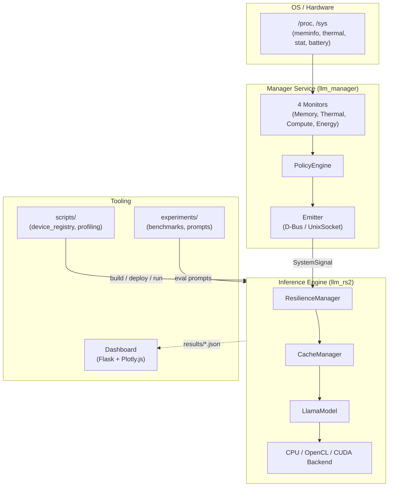
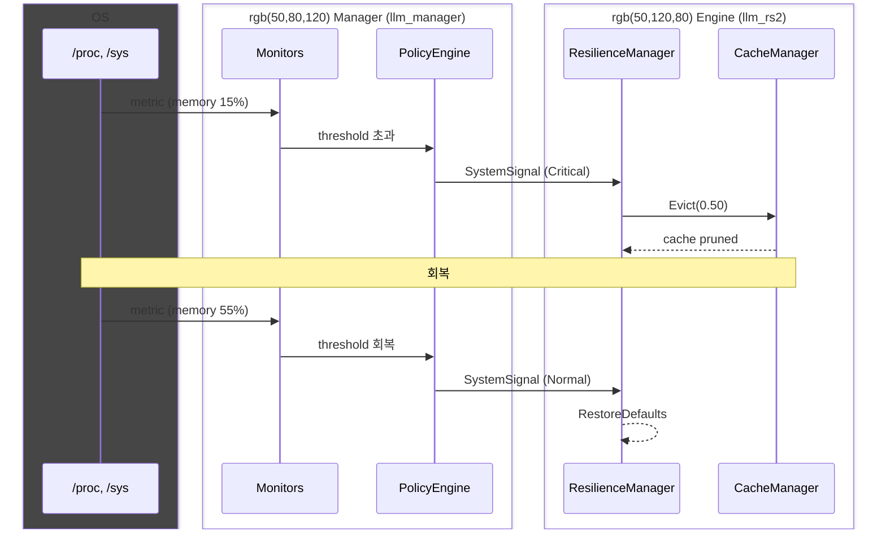
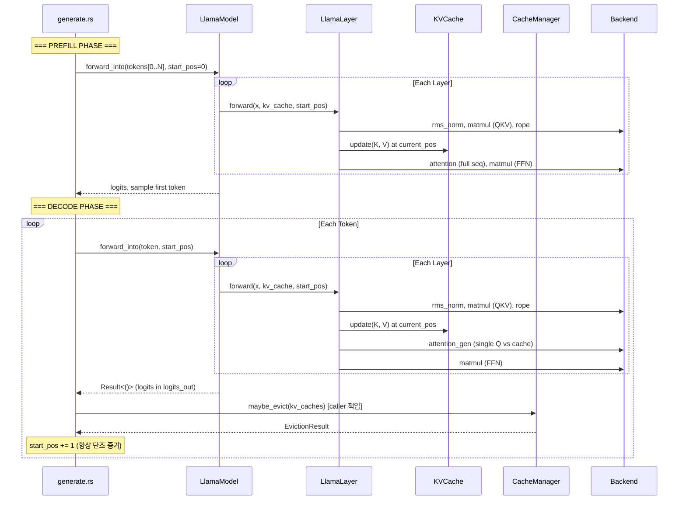
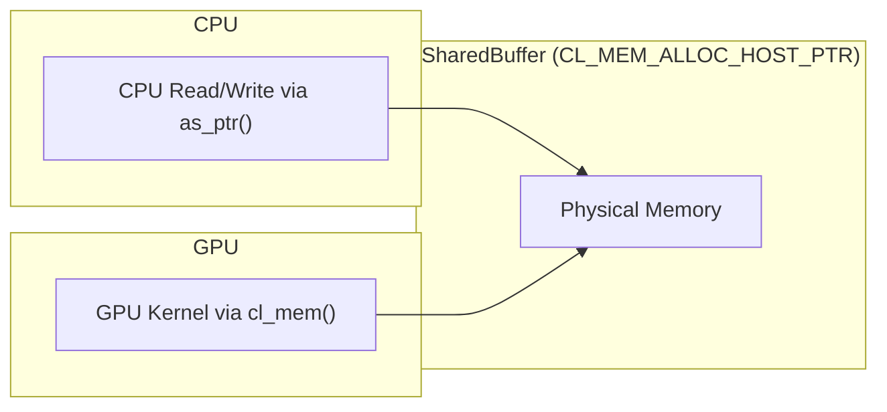
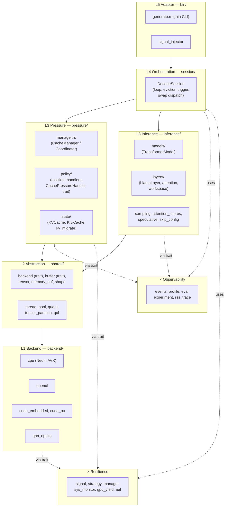

# Architecture

> **상세 구현 가이드**: 이 프로젝트를 처음부터 구현하려면 [`docs/00_build_guide.md`](docs/00_build_guide.md)를 참조하세요. 설계 결정의 근거는 [`docs/01_design_rationale.md`](docs/01_design_rationale.md)에 있습니다.
> **Weight Swap**: 동적 layer dtype 교체 (`arch/weight_swap.md`). Phase 3.7에서 AUF (Argus Unified Format, `.auf`) self-contained 자산 도입 — `arch/auf_format.md`, `docs/auf_tool_guide.md`. Phase 6.5(2026-05-07)에서 Galaxy S25 1564.6 ms swap stall 감축 작업 시작 — `arch/weight_swap.md` §7 (ENG-ALG-226~231, INV-140~143, ENG-DAT-100). 측정 보고서: `papers/eurosys2027/_workspace/experiment/swap_overhead_s25.md`.
> **AUF Primary Loader (W-AUF-1, Sprint 1, 2026-05-19)**: `--model-path foo.auf` 단일 경로가 정식 진입점으로 승격. `engine/src/models/loader/auf/source.rs::AufSource` (TensorSource impl, mmap zero-copy)가 `TransformerModel::load_from_config`의 `PrimaryFormat::Auf` 분기에서 사용된다. `--secondary-gguf`는 deprecated alias (stderr 경고 1회, `.gguf`/`.auf` 양쪽 수용). AUF self-secondary 자동 활성(W-AUF-2)이 후속 단계로 예고 — `--no-self-secondary`로 끌 수 있음(현재 stub).

## Overview

### Background & Goals
본 프로젝트는 연구 및 실험 목적의 온디바이스(On-device) LLM 추론 프레임워크입니다. 모바일 및 엣지 디바이스 환경에서의 고성능 추론과 유연한 실험 환경 제공을 목표로 합니다.
- **유연한 백엔드 확장성 (Extensibility)**: Backend 인터페이스 기반 설계를 통해 CPU, GPU(OpenCL/CUDA), NPU(QNN, TBD) 등 다양한 하드웨어 가속기를 손쉽게 추가하고 교체할 수 있는 구조를 지향합니다.
- **고성능 메모리 관리 (Performance)**: ARM64 SoC 환경의 특성을 활용하여, Galloc 기반의 공유 메모리 관리자를 통해 CPU와 GPU/NPU 간 데이터 복사를 최소화(Zero-copy)하도록 설계되었습니다.
- **동적 KV 캐시 관리**: 메모리 제약 환경에서 장시간 추론을 위한 KV 캐시 Eviction 정책(Sliding Window, H2O, StreamingLLM 등)을 지원합니다.
- **Action Pool 기반 적응형 추론**: 8개 액션(W1~W3, C1, C4~C6, C8)을 동적으로 enable/disable하여 시스템 리소스 압박에 대응합니다. Lossless(백엔드 전환, 디스크 오프로드, 쓰로틀링)와 Lossy(레이어 스킵, KV eviction, KV 압축, KV 양자화) 두 카테고리를 지원합니다.

### Scope & Limitation
- **Target Platform**: ARM64 아키텍처 기반의 엣지 디바이스(Android/Linux)를 주 타겟으로 합니다. x86 CPU 백엔드로도 추론은 가능하나, SIMD 최적화(NEON)는 ARM64 전용입니다.
- **Supported Models**: 현재는 Llama 3.2 아키텍처 모델의 추론만을 지원합니다. 향후 연구 목적에 따라 지원 모델이 추가될 수 있으나, 범용적인 모델 지원보다는 최적화 연구에 집중합니다.

---

## System Architecture

본 프로젝트는 **Cargo workspace** 기반의 멀티크레이트 구조와 비-Rust 컴포넌트로 구성됩니다.

### Workspace 구조

| Crate / 컴포넌트 | 타입 | 역할 |
|:-----------------|:-----|:-----|
| **`engine/`** (`llm_rs2`) | Rust binary+lib | LLM 추론 엔진 — 모델 로딩, forward pass, KV 캐시, 백엔드 연산 |
| **`manager/`** (`llm_manager`) | Rust binary+lib | 시스템 리소스 모니터 서비스 — 메모리/온도/CPU/에너지 감시, 시그널 발신 |
| **`shared/`** (`llm_shared`) | Rust lib | 공유 신호 타입 — `SystemSignal`, `Level` 등 (engine ↔ manager 인터페이스) |
| **`dashboard/`** | Python (Flask) | 벤치마크 시각화 웹 대시보드 (Plotly.js) |
| **`scripts/`** | Python | 디바이스 관리, 프로파일링, 벤치마크 자동화 |
| **`experiments/`** | Python + JSON | 평가 벤치마크, 실험 설정, 결과/보고서 |

### System Component Diagram


```mermaid
graph TB
    subgraph OS ["OS / Hardware"]
        SysMetrics["/proc, /sys
        (meminfo, thermal, stat, battery)"]
    end

    subgraph Manager ["Manager Service (llm_manager)"]
        Monitors["4 Monitors
        (Memory, Thermal, Compute, Energy)"]
        PolicyEngine["PolicyEngine"]
        Emitter["Emitter
        (D-Bus / UnixSocket)"]
    end

    subgraph Engine ["Inference Engine (llm_rs2)"]
        Resilience["ResilienceManager"]
        CacheMgr["CacheManager"]
        Model["LlamaModel"]
        Backends["CPU / OpenCL / CUDA Backend"]
    end

    subgraph Tooling ["Tooling"]
        Scripts["scripts/
        (device_registry, profiling)"]
        Experiments["experiments/
        (benchmarks, prompts)"]
        Dashboard["Dashboard
        (Flask + Plotly.js)"]
    end

    SysMetrics --> Monitors
    Monitors --> PolicyEngine --> Emitter
    Emitter -->|"SystemSignal"| Resilience
    Resilience --> CacheMgr --> Model
    Model --> Backends

    Scripts -->|"build / deploy / run"| Engine
    Experiments -->|"eval prompts"| Engine
    Engine -.->|"results/*.json"| Dashboard
```

### Inter-Component Communication


```mermaid
sequenceDiagram
    box rgb(70,70,70) OS
        participant OS as /proc, /sys
    end
    box rgb(50,80,120) Manager (llm_manager)
        participant Mon as Monitors
        participant PE as PolicyEngine
    end
    box rgb(50,120,80) Engine (llm_rs2)
        participant Res as ResilienceManager
        participant CM as CacheManager
    end

    OS->>Mon: metric (memory 15%)
    Mon->>PE: threshold 초과
    PE->>Res: SystemSignal (Critical)
    Res->>CM: Evict(0.50)
    CM-->>Res: cache pruned

    Note over OS,CM: 회복

    OS->>Mon: metric (memory 55%)
    Mon->>PE: threshold 회복
    PE->>Res: SystemSignal (Normal)
    Res-->>Res: RestoreDefaults
```

**통신 방향**: Manager → Engine (단방향). Engine은 Manager에 피드백을 보내지 않음 (fire-and-forget).

**IPC 프로토콜**:
- **D-Bus** (Linux): System Bus, `org.llm.Manager1` — 타입 안전한 zbus 직렬화
- **Unix Socket** (Android): `[4-byte BE u32 len][UTF-8 JSON]` — 단일 클라이언트 1:1

---

## Engine Architecture

> 이하 "High-Level Architecture" ~ "Resilience Subsystem"은 Engine(`llm_rs2`) 크레이트의 내부 구조를 설명합니다.

### Component Diagram

```mermaid
graph TB
    subgraph BinaryLayer ["Binaries"]
        Generate["generate"]
        GenerateHybrid["generate_hybrid"]
        MicroBench["micro_bench"]
        TestBackend["test_backend"]
    end

    subgraph ModelComponent ["Model"]
        LlamaModel["LlamaModel"]
        LlamaLayer["LlamaLayer"]
        LayerWS["LayerWorkspace"]
        Attention["Attention (CPU fallback)"]
    end

    subgraph CoreComponent ["Core"]
        BackendTrait["Backend trait"]
        MemoryTrait["Memory trait"]
        BufferTrait["Buffer trait"]
        KVCacheOpsTrait["KVCacheOps trait"]
        KVCache["KVCache"]
        KiviCache["KiviCache (Q2/Q4/Q8+Residual)"]
        OffloadKVCache["OffloadKVCache (RawStore/DiskStore)"]
        Tensor["Tensor"]
        Shape["Shape"]
        Quant["Quant (Q4_0, Q2_0, KVQ4, KVQ8)"]
        SkipConfig["SkipConfig (SWIFT)"]
        Speculative["SpeculativeDecoder"]
        MathUtils["MathUtils (avg_pool, topk)"]
    end

    subgraph QCFSubsystem ["QCF (Quality Cost Function)"]
        QcfMetric["QcfMetric / QcfConfig"]
        EvictionQcf["compute_eviction_qcf"]
        QuantQcf["compute_flush_qcf (NMSE)"]
        SkipQcf["SkipQcfTracker"]
        LayerImp["ImportanceTable / ImportanceCollector"]
        DegEst["DegradationEstimator (α×Q)"]
    end

    subgraph EvictionSubsystem ["KV Cache Management"]
        CacheManager["CacheManager"]
        Pipeline["CachePressurePipeline"]
        HandlerTrait["CachePressureHandler trait"]
        EvictionHandler["EvictionHandler"]
        D2OHandler["D2OHandler"]
        SnapKVHandler["SnapKVHandler"]
        QuantizeHandler["QuantizeHandler"]
        SwapHandler["SwapHandler"]
        EvictionPolicy["EvictionPolicy trait"]
        NoEviction["NoEvictionPolicy"]
        SlidingWindow["SlidingWindowPolicy (+ StreamingLLM)"]
        H2O["H2OPolicy (3-partition)"]
        ScoreAccum["AttentionScoreAccumulator"]
        SysMonitor["SystemMonitor trait"]
        LinuxMonitor["LinuxSystemMonitor"]
        EventSinkTrait["EventSink trait"]
    end

    subgraph BackendComponent ["Compute Backends"]
        CpuBackend["CpuBackend"]
        OpenCLBackend["OpenCLBackend"]
    end

    subgraph MemoryComponent ["Memory Management"]
        Galloc["Galloc"]
        SharedBuffer["SharedBuffer"]
    end

    Generate --> LlamaModel
    GenerateHybrid --> LlamaModel
    LlamaModel --> LlamaLayer
    LlamaLayer --> LayerWS
    LlamaLayer --> Attention
    LlamaLayer --> KVCacheOpsTrait
    KVCache -.-> KVCacheOpsTrait
    KiviCache -.-> KVCacheOpsTrait
    OffloadKVCache -.-> KVCacheOpsTrait

    Generate --> CacheManager
    CacheManager --> Pipeline
    CacheManager --> SysMonitor
    CacheManager --> EventSinkTrait
    Pipeline --> HandlerTrait
    HandlerTrait -.-> EvictionHandler
    HandlerTrait -.-> D2OHandler
    HandlerTrait -.-> SnapKVHandler
    HandlerTrait -.-> QuantizeHandler
    HandlerTrait -.-> SwapHandler
    EvictionHandler --> EvictionPolicy
    SnapKVHandler --> MathUtils
    NoEviction -.-> EvictionPolicy
    SlidingWindow -.-> EvictionPolicy
    H2O -.-> EvictionPolicy
    LinuxMonitor -.-> SysMonitor
    EvictionPolicy --> KVCache
    Generate --> KiviCache
    Generate --> SkipConfig
    SkipConfig --> Speculative
    LlamaLayer --> SkipConfig
    H2O --> ScoreAccum

    Generate --> QcfMetric
    EvictionHandler --> EvictionQcf
    SnapKVHandler --> EvictionQcf
    QuantizeHandler --> QuantQcf
    EvictionQcf --> KVCache
    EvictionQcf --> ScoreAccum
    QuantQcf --> KiviCache
    LlamaModel --> LayerImp
    DegEst --> QcfMetric

    Tensor --> BufferTrait
    Tensor --> BackendTrait
    Tensor --> Shape

    CpuBackend -.-> BackendTrait
    OpenCLBackend -.-> BackendTrait
    Galloc -.-> MemoryTrait
    SharedBuffer -.-> BufferTrait
    Galloc --> SharedBuffer
```

### Key Components

| Component | 역할 | 파일 |
|:----------|:-----|:-----|
| **Tensor** | 논리적 데이터 단위. Buffer(물리 메모리) + Shape(차원) + Backend(연산 위임) | `engine/src/core/tensor.rs` |
| **Backend** | 하드웨어 가속기 추상화 (matmul, softmax, RoPE 등 연산자 정의) | `engine/src/core/backend.rs` |
| **Galloc** | 시스템/장치 공유 메모리 할당자. Zero-copy의 핵심 | `engine/src/memory/galloc.rs` |
| **KVCacheOps** | KV 캐시 추상화 trait (OCP 확장점). `update`, `get_view`, `kv_dtype` 등 | `engine/src/core/kv_cache.rs` |
| **KVCache** | 표준 KV 캐시 (F32/F16/Q4_0). Eviction + `compress_per_head()` 지원. KVCacheOps 구현 | `engine/src/core/kv_cache.rs` |
| **KiviCache** | KIVI 다중 비트 압축 캐시 (Q2/Q4/Q8). FP32 Residual + 양자화 저장소. `transition_bits()`로 동적 비트 전환 | `engine/src/core/kivi_cache.rs` |
| **CacheManager** | 메모리 압박 감지 + CachePressurePipeline을 통한 eviction 조율. EventSink 기반 이벤트 출력 | `engine/src/core/cache_manager.rs` |
| **CachePressurePipeline** | PressureLevel별 다중 CachePressureHandler 순차 실행 | `engine/src/core/pressure/mod.rs` |
| **SnapKVHandler** | SnapKV prefill-time 1회 압축 — observation window voting + avg pooling + per-head top-k | `engine/src/core/pressure/compress_handler.rs` |
| **QuantizeHandler** | Pressure → KIVI bits 매핑 (Warning→8, Critical→4, Emergency→2) | `engine/src/core/pressure/quantize_handler.rs` |
| **SwapHandler** | LRU 기반 KV 캐시 디스크 오프로드 (Warning+ 압력에서 동작) | `engine/src/core/pressure/swap_handler.rs` |
| **DiskStore** | 파일 기반 KV 캐시 저장소 (OffloadStore trait 구현) | `engine/src/core/offload/disk_store.rs` |
| **EventSink** | 캐시 관리 이벤트 구조화 출력 (NoOpSink, StderrDiagnosticSink) | `engine/src/core/events.rs` |
| **SamplingConfig** | 토큰 샘플링 파라미터 (temperature, top-k, top-p 등) | `engine/src/core/sampling.rs` |
| **SkipConfig** | SWIFT 레이어 스킵 설정 — attention/MLP 독립 스킵, layer 0/L-1 보호 | `engine/src/core/skip_config.rs` |
| **SpeculativeDecoder** | SWIFT draft/verify 프레임워크 — KV rollback, matchness, skip optimizer | `engine/src/core/speculative.rs` |
| **MathUtils** | avg_pool_1d, topk_indices_per_head — SnapKV/압축 알고리즘용 유틸리티 | `engine/src/core/math_utils.rs` |
| **LlamaLayer** | 단일 트랜스포머 레이어 (`forward` 내부에서 seq_len + skip 분기) | `engine/src/layers/llama_layer.rs` |
| **LayerWorkspace** | 생성 루프용 사전 할당 작업 텐서 (매 토큰 재사용) | `engine/src/layers/workspace.rs` |
| **LlamaModel** | 모델 로딩, 임베딩, 레이어 반복(skip_config 전달), 로짓 계산 | `engine/src/models/llama/llama_model.rs` |
| **AttentionScoreAccumulator** | H2O/SnapKV용 attention importance score 누적 (decay, reset) | `engine/src/core/attention_scores.rs` |
| **QcfMetric** | lossy action의 품질 열화 측정값 (action, raw_value, per_head, tokens_affected) | `engine/src/core/qcf/mod.rs` |
| **DegradationEstimator** | QCF→PPL 증가량 변환 (offline-calibrated PiecewiseLinear + runtime EMA 보정) | `engine/src/core/qcf/estimator.rs` |
| **ImportanceTable** | Prefill 시 cosine similarity 기반 레이어 중요도 테이블. Layer Skip QCF 계산용 | `engine/src/core/qcf/layer_importance.rs` |
| **StepHook** | Eval 루프의 캐시 관리 정책 추상화 trait (`before_importance_pass`, `before_question`, `after_question`) | `engine/src/eval/hook.rs` |
| **EvictionHook** | KVCache 전용 eval hook — importance 2-pass, eviction 트리거, 스냅샷 | `engine/src/eval/eviction_hook.rs` |
| **KiviHook** | KiviCache 전용 eval hook — KIVI 압축 정책 연동 | `engine/src/eval/kivi_hook.rs` |
| **EvalOutput** | Eval-LL 결과 구조체 (NLL, QCF, OPR 메트릭 포함) | `engine/src/eval/output.rs` |

---

## Inference Execution Flow

### Prefill → Decode 순서도


```mermaid
sequenceDiagram
    participant User as generate.rs
    participant Model as LlamaModel
    participant Layer as LlamaLayer
    participant Cache as KVCache
    participant CM as CacheManager
    participant Backend

    Note over User: === PREFILL PHASE ===
    User->>Model: forward_into(tokens[0..N], start_pos=0)
    loop Each Layer
        Model->>Layer: forward(x, kv_cache, start_pos)
        Layer->>Backend: rms_norm, matmul (QKV), rope
        Layer->>Cache: update(K, V) at current_pos
        Layer->>Backend: attention (full seq), matmul (FFN)
    end
    Model-->>User: logits, sample first token

    Note over User: === DECODE PHASE ===
    loop Each Token
        User->>Model: forward_into(token, start_pos)
        loop Each Layer
            Model->>Layer: forward(x, kv_cache, start_pos)
            Layer->>Backend: rms_norm, matmul (QKV), rope
            Layer->>Cache: update(K, V) at current_pos
            Layer->>Backend: attention_gen (single Q vs cache)
            Layer->>Backend: matmul (FFN)
        end
        Model-->>User: Result<()> (logits in logits_out)
        User->>CM: maybe_evict(kv_caches) [caller 책임]
        CM-->>User: EvictionResult
        Note over User: start_pos += 1 (항상 단조 증가)
    end
```

### Eval-LL Flow

Log-likelihood 평가 루프는 `StepHook` trait으로 캐시 관리 정책을 추상화하여, KVCache와 KiviCache 경로의 코드 중복을 제거합니다.

```
generate.rs main()
  → Hook 생성: EvictionHook | KiviHook
  → run_eval_ll_generic<C: KVCacheOps>(model, caches, hook, questions)
      → [Importance 2-pass] hook.before_importance_pass()
      → [Question loop]
          hook.before_question()          # 캐시 초기화 / 스냅샷 복원
          prefill(context tokens)
          hook.after_prefill()            # eviction 트리거 (선택)
          choice decode → NLL 계산
          hook.after_question()
      → EvalOutput JSON
```

`EvictionHook`은 `KVCache`를, `KiviHook`은 `KiviCache`를 각각 전담하며, `generate.rs`는 Hook 생성만 담당합니다. 상세: [`docs/38_eval_refactoring.md`](docs/38_eval_refactoring.md)

### RoPE와 Eviction의 관계 (중요!)

> **⚠️ RoPE Position은 eviction과 무관하게 단조 증가해야 합니다.**
>
> - `start_pos`: RoPE 인코딩용 **논리적 위치** (토큰마다 +1, eviction 무관)
> - `current_pos`: KV 캐시 내 **물리적 슬롯** (eviction 시 감소)
>
> RoPE는 Key 벡터에 absolute position을 write 시점에 영구 인코딩합니다.
> Eviction이 cache를 물리적으로 shift해도 기존 key의 RoPE 인코딩은 변하지 않으므로,
> Query의 RoPE position(`start_pos`)은 연속적으로 증가해야 relative distance가 올바릅니다.

---

## Memory Model & Data Flow

### Zero-copy Mechanism
`Galloc`은 CPU 메모리 할당을 담당하며, OpenCL 파이프라인에서는 `OpenCLMemory`가 `CL_MEM_ALLOC_HOST_PTR`을 사용하여 CPU와 GPU가 물리적으로 동일한 메모리 주소를 가리키도록 지원합니다. ARM SoC의 통합 메모리(UMA)에서는 별도의 `memcpy` 없이 백엔드가 즉시 연산을 수행할 수 있습니다.


```mermaid
graph LR
    subgraph CPU
        A["CPU Read/Write via as_ptr()"]
    end
    subgraph GPU
        B["GPU Kernel via cl_mem()"]
    end
    subgraph SharedMemory["SharedBuffer (CL_MEM_ALLOC_HOST_PTR)"]
        C["Physical Memory"]
    end
    A --> C
    B --> C
```

---

## KV Cache & Eviction System

### KVCacheOps Trait (OCP 확장점)

LlamaLayer와 LlamaModel은 `C: KVCacheOps` 제네릭으로 KV 캐시를 추상화합니다. Generic monomorphization으로 런타임 오버헤드 없이 다양한 캐시 구현을 지원합니다.

```
KVCacheOps trait
  ├── KVCache          (표준: F32/F16/Q4_0, eviction + compress_per_head 지원)
  ├── KiviCache        (KIVI: Q2/Q4/Q8 다중 비트 + FP32 Residual, transition_bits 동적 전환)
  └── OffloadKVCache   (RawStore/DiskStore 오프로드 + 레이어별 프리페치, eviction 미사용)
```

기본 타입 파라미터 `C = KVCache`로 기존 코드와 완전 호환됩니다. `CacheManager`는 concrete `&mut [KVCache]`를 사용하여 변경 없이 동작합니다.

### Eviction Policies (KVCache 전용)

4가지 전략을 지원하는 Strategy Pattern 기반 KV 캐시 관리:
- **NoEvictionPolicy**: 기본값. eviction 없이 가득 차면 에러.
- **SlidingWindowPolicy**: 최근 N 토큰 유지, `protected_prefix`로 attention sink 보호.
- **StreamingLLM** (SlidingWindowPolicy alias): `--eviction-policy streaming --sink-size 4` — 기본 window=2000, attention sink 4개 보호. SlidingWindowPolicy와 동일 내부 구현이나 StreamingLLM 논문의 파라미터 기본값 적용.
- **H2OPolicy**: 3-partition 모델 (prefix + heavy hitters + recent window). Signal-driven — Resilience 시그널 수신 시 `CacheManager::force_evict_with_scores()`로 실행.
- **AttentionScoreAccumulator**: H2O/SnapKV용 importance score를 매 토큰마다 누적 (bookkeeping only).

### Pressure Handlers (CachePressurePipeline)

Pipeline Pattern 기반 캐시 관리 핸들러 (PressureLevel별 순차 실행):

| Handler | 상태 | 동작 |
|:--------|:-----|:-----|
| **EvictionHandler** | ✅ 완전 구현 | EvictionPolicy를 Pipeline에 연결하는 어댑터 |
| **D2OHandler** | ✅ 완전 구현 | 동적 판별 연산 + merge compensation |
| **SnapKVHandler** | ✅ 완전 구현 | Prefill-time 1회 압축 (observation window voting + pooling + per-head top-k) |
| **QuantizeHandler** | ✅ 완전 구현 | Pressure→KIVI bits 매핑 (Warning→8, Critical→4, Emergency→2) |
| **SwapHandler** | ✅ 완전 구현 | LRU 기반 KV 캐시 디스크 오프로드 |

**Eviction 후 데이터 흐름**:
```
Before: [T0][T1][T2][T3][T4][T5][T6][T7] current_pos=8, start_pos=8
prune_prefix(3):
After:  [T3][T4][T5][T6][T7][_][_][_]   current_pos=5, start_pos=8 (불변!)
         ↑ RoPE(3..7) — 원래 인코딩 유지
```

> `start_pos`(RoPE 논리 위치)는 eviction 후에도 단조 증가. `current_pos`(물리 슬롯)만 감소.

### KIVI Multi-bit Compression (KiviCache)

KIVI 논문(ICML 2024)의 비대칭 양자화를 동적 디코드 중에 적용합니다. **2-bit(Q2), 4-bit(Q4), 8-bit(Q8) 다중 비트 지원**. `transition_bits()`로 런타임 비트 전환 가능 (pressure 연동).

**핵심 메커니즘**:
- **Residual Buffer**: 최근 R 토큰(기본 32)을 FP32로 유지. 가득 차면 현재 bits에 맞춰 배치 양자화 후 flush.
- **Key: per-channel 양자화** — 각 head의 head_dim 채널별로 R개 토큰 값을 하나의 블록으로 양자화.
- **Value: per-token 양자화** — 각 토큰의 head_dim 값을 QKKV(32) 단위로 양자화.
- **QuantizedBlocks enum**: `Q2(Vec<BlockQ2_0>)`, `Q4(Vec<BlockKVQ4>)`, `Q8(Vec<BlockKVQ8>)` — 런타임 디스패치.
- **transition_bits(new_bits)**: 기존 양자화 블록을 dequant → re-quant (오차 누적 있음). dequant 캐시 무효화 포함.

```
KiviCache 데이터 흐름:
  Token 1~32 → Residual (FP32) → [가득 참] → Quantize Flush → Q2/Q4/Q8 Storage
  Token 33   → Residual (FP32)
  ...
  get_view() → Dequantize + Residual Copy → F32 Tensor (기존 attention 코드 호환)

동적 비트 전환 (Pressure 연동):
  Normal → 유지  |  Warning → Q8  |  Critical → Q4  |  Emergency → Q2
```

**양자화 블록 사양**:

| 블록 | bits | bytes/32elem | bytes/elem | Dequant 공식 |
|:-----|:-----|:-------------|:-----------|:-------------|
| `BlockQ2_0` | 2 | 12 | 0.375 | `q * scale + min` |
| `BlockKVQ4` | 4 | 20 | 0.625 | `q * scale + min` |
| `BlockKVQ8` | 8 | 36 | 1.125 | `q * scale + min` |

`kv_dtype()` 반환값: `F32` → LlamaLayer가 F32 데이터를 `update()`에 전달. KIVI 내부에서 양자화 처리. `get_view()`는 dequantize된 F32 Tensor 반환 → 기존 attention 코드 변경 없음.

상세: [`docs/11_kv_cache_management.md`](docs/11_kv_cache_management.md)

---

## Implementation Specifications

### 1. Environment
- **Language**: Rust (Edition 2024, nightly 사용 가능)
- **3rd Party Crates**:

| Crate | 버전 | 용도 |
|:------|:-----|:-----|
| `safetensors` | 0.7 | HuggingFace Safetensors 포맷 로딩 |
| `memmap2` | 0.9 | 대용량 모델 파일 메모리 매핑 |
| `half` | 2.7 | BF16/F16 ↔ F32 변환 |
| `tokenizers` | 0.22 | HuggingFace Tokenizer (onig 백엔드) |
| `serde` / `serde_json` | 1.0 | 모델 config 파싱 |
| `anyhow` | 1.0 | 에러 핸들링 |
| `clap` | 4.5 | CLI 인터페이스 (derive 매크로) |
| `rayon` | 1.11 | 데이터 병렬 처리 (attention heads) |
| `ocl` | 0.19 | OpenCL 바인딩 (feature-gated) |
| `rand` | 0.9 | 토큰 샘플링 |
| `log` / `env_logger` | 0.4/0.11 | 로깅 |
| `zbus` | 5 | D-Bus IPC (feature-gated: `resilience`) |

- **Features**: `opencl` (기본 활성), `resilience` (optional, `zbus` 의존)
- **LLM Model Format**: HuggingFace Safetensors (`model.safetensors` + `config.json` + `tokenizer.json`)
- **Release Profile**: `lto = "fat"`, `codegen-units = 1`, `opt-level = 3`

### 2. Directory Structure

```
llm_rs2/
├── ARCHITECTURE.md          # 본 문서
├── Cargo.toml               # Workspace 루트 (engine, shared, manager)
├── devices.toml             # 디바이스 레지스트리 (배포 타겟)
├── hosts.toml.example       # 빌드 호스트별 toolchain 템플릿 (실 hosts.toml은 gitignored)
├── android.source           # [DEPRECATED] hosts.toml로 대체됨 (PR cleanup 예정)
│
├── engine/                  # ★ LLM 추론 엔진 (llm_rs2 crate)
│   ├── Cargo.toml
│   └── src/
│       ├── lib.rs               # 라이브러리 루트 (모듈 선언)
│       ├── main.rs              # 기본 엔트리포인트 (미사용)
│       ├── experiment.rs        # 실험 설정/데이터 수집
│       ├── bin/
│       │   ├── generate.rs      # ★ 주력 추론 바이너리 (단일 백엔드)
│       │   ├── generate_hybrid.rs  # CPU↔GPU 동적 전환 추론
│       │   ├── micro_bench.rs   # 개별 연산자 벤치마크
│       │   ├── test_backend.rs  # 백엔드 정합성 테스트
│       │   ├── test_model.rs    # 모델 로딩 테스트
│       │   └── signal_injector.rs  # Resilience 시그널 주입 테스트
│       │
│       ├── core/                      # 핵심 추상화 레이어
│       │   ├── mod.rs                 # 모듈 선언
│       │   ├── backend.rs             # Backend trait (17개 연산자 정의)
│       │   ├── buffer.rs              # Buffer trait + DType enum
│       │   ├── memory.rs              # Memory trait (alloc/used_memory)
│       │   ├── tensor.rs              # Tensor struct (Shape + Buffer + Backend)
│       │   ├── shape.rs               # Shape struct (dims, numel)
│       │   ├── kv_cache.rs            # KVCacheOps trait + KVCache (update, prune_prefix, get_view)
│       │   ├── kivi_cache.rs          # KiviCache (KIVI Q2 압축 + FP32 Residual)
│       │   ├── cache_manager.rs       # CacheManager (eviction 조율)
│       │   ├── sys_monitor.rs         # SystemMonitor trait + LinuxSystemMonitor
│       │   ├── quant.rs               # BlockQ4_0, BlockQ2_0, BlockKVQ4, BlockKVQ8 양자화 구조체
│       │   ├── attention_scores.rs    # AttentionScoreAccumulator (H2O/SnapKV importance tracking)
│       │   ├── events.rs              # EventSink trait, CacheEvent enum, StderrDiagnosticSink
│       │   ├── sampling.rs            # SamplingConfig, sample() 함수
│       │   ├── skip_config.rs         # SkipConfig (SWIFT 레이어 스킵 설정)
│       │   ├── speculative.rs         # SpeculativeDecoder, SkipOptimizer (SWIFT draft/verify)
│       │   ├── math_utils.rs          # avg_pool_1d, topk_indices_per_head (SnapKV 유틸리티)
│       │   ├── offload/               # KV Cache Offload (레이어별 프리페치)
│       │   │   ├── mod.rs             # OffloadKVCache struct + KVCacheOps/PrefetchableCache impl
│       │   │   ├── store.rs           # OffloadStore trait
│       │   │   ├── raw_store.rs       # RawStore (무압축 Vec<u8> 저장)
│       │   │   ├── disk_store.rs      # DiskStore (파일 기반 KV 캐시 저장)
│       │   │   ├── prefetch.rs        # PrefetchController (적응형 프리페치 깊이)
│       │   │   └── preload_pool.rs    # PreloadPool (지속성 스레드 풀)
│       │   ├── eviction/              # Eviction 정책 (Strategy Pattern)
│       │   │   ├── mod.rs             # EvictionPolicy trait
│       │   │   ├── no_eviction.rs     # NoEvictionPolicy (항상 skip)
│       │   │   ├── sliding_window.rs  # SlidingWindowPolicy (최근 N 토큰 유지 + StreamingLLM alias)
│       │   │   ├── h2o.rs             # H2OPolicy (3-partition: prefix + heavy hitters + recent)
│       │   │   └── h2o_plus.rs        # H2OPlusPolicy (per-head GQA-aware variant)
│       │   └── pressure/              # CachePressure 핸들러 (Pipeline Pattern)
│       │       ├── mod.rs             # CachePressureHandler trait, CachePressurePipeline
│       │       ├── eviction_handler.rs # EvictionHandler (EvictionPolicy → Handler 어댑터)
│       │       ├── d2o_handler.rs     # D2OHandler (merge compensation)
│       │       ├── compress_handler.rs # SnapKVHandler (prefill-time 1회 압축)
│       │       ├── quantize_handler.rs # QuantizeHandler (pressure→KIVI bits 전환)
│       │       ├── swap_handler.rs    # SwapHandler (LRU 디스크 오프로드)
│       │       └── {merge,sparse}_handler.rs  # stubs
│       │
│       ├── eval/                      # 평가 프레임워크 (StepHook 기반 제네릭 eval 루프)
│       │   ├── mod.rs                 # 모듈 공개 인터페이스
│       │   ├── hook.rs                # StepHook trait, CacheSnapshot trait
│       │   ├── eval_loop.rs           # run_eval_ll_generic<C: KVCacheOps>
│       │   ├── eviction_hook.rs       # EvictionHook (KVCache 전용)
│       │   ├── kivi_hook.rs           # KiviHook (KiviCache 전용)
│       │   ├── output.rs              # EvalOutput, EvalConfig, EvalQuestion
│       │   └── qcf_helpers.rs         # QCF/OPR 메트릭 집계 유틸리티
│       │
│       ├── models/llama/
│       │   └── llama_model.rs    # LlamaModel (from_dir, forward_into)
│       │
│       ├── layers/
│       │   ├── llama_layer.rs    # LlamaLayer (forward — seq_len에 따라 내부 분기)
│       │   ├── attention.rs      # CPU attention 함수 (naive, flash)
│       │   └── workspace.rs      # LayerWorkspace (사전 할당 버퍼)
│       │
│       ├── backend/
│       │   ├── cpu/
│       │   │   ├── mod.rs        # CpuBackend struct
│       │   │   ├── common.rs     # 공통 연산 (portable)
│       │   │   ├── neon.rs       # ARM64 NEON SIMD 최적화
│       │   │   └── x86.rs        # x86 SSE/AVX fallback
│       │   └── opencl/
│       │       ├── mod.rs        # OpenCLBackend struct & implementation
│       │       ├── buffer.rs     # OpenCL용 SharedBuffer 확장
│       │       └── memory.rs     # OpenCL용 Galloc (CL_MEM_ALLOC_HOST_PTR)
│       │
│       ├── resilience/                  # Resilience Manager (feature-gated)
│       │   ├── mod.rs                   # 모듈 선언 + re-exports
│       │   ├── manager.rs               # ResilienceManager (poll, execute_action)
│       │   ├── executor.rs              # Action 실행 로직
│       │   ├── signal.rs                # SystemSignal, Level, enum types
│       │   ├── state.rs                 # OperatingMode (Normal/Degraded/Minimal/Suspended)
│       │   ├── transport.rs             # Transport trait + SignalListener<T> (별도 스레드)
│       │   ├── dbus_transport.rs        # DbusTransport (zbus blocking, Transport 구현)
│       │   └── strategy/                # Signal reaction strategies
│       │       ├── mod.rs               # ResilienceAction, resolve_conflicts()
│       │       ├── memory.rs            # MemoryStrategy
│       │       ├── thermal.rs           # ThermalStrategy
│       │       ├── energy.rs            # EnergyStrategy
│       │       └── compute.rs           # ComputeStrategy
│       │
│       ├── profile/               # 추론 프로파일링 프레임워크
│       │   ├── mod.rs             # Profiler struct, ProbeSet
│       │   ├── latency.rs         # LatencyProbe (레이어별 지연시간)
│       │   ├── ops.rs             # OpsProbe (연산자별 소요시간)
│       │   ├── cache.rs           # CacheProbe (KV 캐시 상태)
│       │   ├── scores.rs          # ScoresProbe (attention score 분포)
│       │   └── entropy.rs         # EntropyProbe (출력 엔트로피)
│       │
│       ├── memory/galloc.rs       # Galloc (CPU 전용 메모리 할당)
│       └── buffer/
│           ├── shared_buffer.rs   # SharedBuffer (CPU Vec)
│           └── unified_buffer.rs  # UnifiedBuffer (CPU-GPU zero-copy)
│
│   └── kernels/              # OpenCL 커널 파일 (~87개 .cl 파일)
│       ├── mul_mv_q4_0_f32*.cl   # Q4_0 양자화 MatVec 커널
│       ├── rms_norm.cl           # RMS Norm 커널
│       ├── rope.cl               # RoPE 커널
│       ├── simple_ops.cl         # 기본 연산 (add, scale, silu)
│       ├── flash_attn_f32.cl     # Flash Attention 커널
│       └── ...
│
├── shared/                  # ★ 공유 신호 타입 (llm_shared crate)
│   ├── Cargo.toml
│   └── src/lib.rs           # SystemSignal, Level, RecommendedBackend 등
│
├── manager/                 # ★ 시스템 리소스 모니터 서비스 (llm_manager crate)
│   ├── Cargo.toml
│   └── src/
│       ├── main.rs          # 서비스 진입점 (스레딩 오케스트레이션)
│       ├── lib.rs           # 라이브러리 루트
│       ├── config.rs        # TOML 설정 구조체
│       ├── evaluator.rs     # ThresholdEvaluator (히스테리시스)
│       ├── policy.rs        # PolicyEngine (정책 평가)
│       ├── monitor/         # 데이터 수집 (4 모니터)
│       │   ├── mod.rs       # Monitor trait
│       │   ├── memory.rs    # /proc/meminfo + PSI
│       │   ├── thermal.rs   # /sys/class/thermal/
│       │   ├── compute.rs   # /proc/stat CPU delta
│       │   ├── energy.rs    # /sys/class/power_supply/
│       │   └── external.rs  # 신호 주입 (stdin/socket)
│       ├── emitter/         # 신호 전송
│       │   ├── mod.rs       # Emitter trait
│       │   ├── dbus.rs      # D-Bus System Bus
│       │   └── unix_socket.rs  # Length-prefixed JSON
│       └── bin/
│           └── mock_manager.rs  # 테스트용 신호 발신기
│
├── scripts/                  # 테스트/벤치마크 자동화
│   ├── run_device.py         # 통합 디바이스 실행기 (빌드→배포→실행)
│   ├── device_registry/      # 디바이스 관리 패키지
│   │   ├── config.py         # TOML 설정 로더
│   │   ├── connection.py     # Connection ABC (local/adb/ssh)
│   │   ├── builder.py        # Cargo 빌드 래퍼
│   │   ├── deployer.py       # 바이너리 push + chmod
│   │   └── discover.py       # ADB 디바이스 스캔
│   ├── android_profile.py    # Android 프로파일링 + JSON 결과 수집
│   ├── run_benchmark_suite.py  # 벤치마크 매트릭스 실행
│   ├── run_comparison_benchmark.py  # 베이스라인 vs 실험 비교
│   ├── stress_test_device.py  # 디바이스 스트레스 테스트
│   ├── update_benchmark_summary.py  # 결과 요약 테이블 생성
│   └── visualize_profile.py  # 프로파일 데이터 시각화
│
├── experiments/              # 평가 벤치마크 & 실험
│   ├── prompts/              # 벤치마크 프롬프트 (PPL, NIAH, QA)
│   ├── benchmarks/           # 평가 스크립트 + 데이터셋
│   │   ├── run_eval.py       # Log-likelihood 평가
│   │   └── data/             # PIQA, ARC, HellaSwag 등
│   ├── configs/              # 시그널 주입 스케줄 (40+ JSON)
│   ├── results/              # 실험 결과 JSONL (90+ 실험)
│   ├── reports/              # Round별 보고서 + 분석 그래프
│   └── analysis/             # 메트릭 계산 및 비교 스크립트
│
├── docs/                     # 상세 기술 문서
│   ├── 00_build_guide.md
│   ├── 01_design_rationale.md
│   ├── 02_core_abstractions.md
│   ├── 03_cpu_backend.md
│   ├── 04_model_loading.md
│   ├── 05_tokenizer_and_sampling.md
│   ├── 06_opencl_backend.md
│   ├── 07_kernel_implementation.md
│   ├── 08_memory_management.md
│   ├── 09_attention_mechanism.md
│   ├── 10_model_inference.md
│   ├── 11_kv_cache_management.md
│   ├── 12_hybrid_inference.md
│   ├── 13_testing_and_benchmarks.md
│   ├── 14_component_status.md        # 컴포넌트 품질 게이트
│   ├── 15_test_strategy.md           # Resilience 테스트 전략 (T1-T4)
│   ├── 20_dbus_ipc_spec.md          # D-Bus IPC 명세
│   ├── 21_resilience_architecture.md # Resilience 아키텍처 + 전략 패턴
│   ├── 22_resilience_integration.md  # Phase 3 generate.rs 통합 설계
│   ├── 23_resilience_test_strategy.md # Resilience 통합 테스트 요약
│   ├── 24_resilience_usage_guide.md  # Resilience 사용 가이드
│   ├── 25_troubleshooting.md         # 트러블슈팅 가이드
│   ├── 26_api_reference.md           # Resilience API 레퍼런스
│   ├── 27_manager_architecture.md    # Manager 서비스 내부 아키텍처
│   ├── 28_experiment_guide.md        # 실험 가이드
│   ├── 29_manager_monitor_redesign.md # Manager 모니터 재설계
│   ├── 30_evaluation_methodology.md  # KV Cache Eviction 평가 방법론
│   ├── 31_memory_architecture.md     # 메모리 아키텍처 통합 개요
│   ├── 32_kv_offload.md              # KV 캐시 오프로드 (RawStore, PrefetchController)
│   ├── 34_profiling_framework_design.md # 추론 프로파일링 프레임워크 설계
│   └── 38_eval_refactoring.md          # Eval 루프 리팩토링 설계 (StepHook 추상화)
│
├── dashboard/                # 벤치마크 시각화 웹 대시보드 (Flask + Plotly.js)
│   ├── app.py                # Flask 진입점 (port 5000)
│   ├── backend/              # API + 파서
│   │   ├── api.py            # 9개 REST 엔드포인트
│   │   ├── parser.py         # JSON 프로필 로딩 (유연한 스키마)
│   │   ├── schema_registry.py  # 메트릭 메타데이터
│   │   └── runner.py         # BenchmarkRunner (비동기 실행)
│   ├── static/js/            # 프론트엔드 모듈 (Plotly.js)
│   └── templates/            # HTML 템플릿
│
├── results/                  # 프로파일링 결과 JSON
└── tests/                    # 통합 테스트
```

### 3. Binaries

| Binary | 용도 | 주요 옵션 |
|:-------|:----|:---------|
| `generate` | 단일 백엔드 추론 (주력) | `--backend`, `--kv-type`, `--kv-offload`, `--max-prefetch-depth`, `--eviction-policy`, `--eviction-window`, `--enable-resilience`, `--resilience-transport`, `--initial-kv-capacity`, `--kivi`, `--kivi-residual-size` |
| `generate_hybrid` | CPU↔GPU 동적 전환 추론 | `--switch-threshold`, `--warmup-tokens` |
| `micro_bench` | 개별 연산자 벤치마크 | 연산별 크기 지정 |
| `test_backend` | 백엔드 정합성 검증 | CPU vs OpenCL 결과 비교 |
| `test_model` | 모델 로딩 검증 | `--model-path` |
| `signal_injector` | Resilience 시그널 주입 테스트 | `--signal-type`, `--level` |

`generate` 바이너리의 eviction 관련 CLI 옵션:
```
--eviction-policy <POLICY>       none | sliding | streaming | h2o | h2o_plus | d2o [default: none]
--eviction-window <SIZE>         Sliding/streaming window size [default: 1024, streaming: 2000]
--sink-size <N>                  StreamingLLM attention sink tokens [default: 4]
--protected-prefix <N>           Attention sink tokens to protect [default: prompt length]
--memory-threshold-mb <MB>       Memory pressure threshold [default: 256]
--eviction-target-ratio <RATIO>  Cache keep ratio on eviction [default: 0.75]
--h2o-recent-window <N>          Recent tokens always protected [default: 128]
--h2o-keep-ratio <RATIO>         Heavy hitter keep ratio [default: 0.5]
--h2o-tracked-layers <N>         Layers tracked for importance [default: 3]
--h2o-decay <DECAY>              Importance score decay per step [default: 0.1]
--d2o-keep-ratio <RATIO>         D2O keep ratio [default: 0.75]
--d2o-beta <BETA>                D2O EMA threshold decay [default: 0.7]
--d2o-merge-e <E>                D2O merge weight parameter [default: 1.0]
```

`generate` 바이너리의 KIVI 관련 CLI 옵션:
```
--kivi                           KIVI 다중 비트 압축 모드 활성화 (eviction과 상호 배제)
--kivi-residual-size <N>         FP32 Residual 버퍼 크기 [default: 32]
```

### 4. Data Layout & Quantization

- **Data Layout**: C-style Row-Major, 64-byte alignment
- **Q4_0**: GGML 호환 4-bit 양자화 (32 values → 20 bytes: 1 `f32` scale + 16 `u8` nibbles). Dequant: `(nibble - 8) * scale`
- **Q2_0**: KIVI 2-bit 비대칭 양자화 (32 values → 12 bytes: `f16` scale + `f16` minimum + 8 `u8` packed 2-bit). Dequant: `q * scale + minimum`
- **KVQ4**: KV 캐시용 4-bit 비대칭 양자화 (32 values → 20 bytes: `f16` scale + `f16` min + 16 `u8` nibble-packed). Dequant: `q * scale + min`
- **KVQ8**: KV 캐시용 8-bit 비대칭 양자화 (32 values → 36 bytes: `f16` scale + `f16` min + 32 `u8`). Dequant: `q * scale + min`
- **지원 DType**: F32, F16, BF16 (가중치 로딩), Q4_0/Q4_1/Q8_0/Q2_0/KVQ4/KVQ8 (양자화), U8

상세: [`docs/02_core_abstractions.md`](docs/02_core_abstractions.md)

---

## 5. 핵심 인터페이스 (Trait)

- **Backend** (17+ 연산) — 하드웨어 가속기 추상화 (matmul, softmax, RoPE 등) → [`docs/02_core_abstractions.md`](docs/02_core_abstractions.md)
- **Buffer / Memory** — 물리 메모리 할당 및 접근 (CPU pointer, OpenCL handle) → [`docs/02_core_abstractions.md`](docs/02_core_abstractions.md)
- **KVCacheOps** (`update`, `get_view`, `kv_dtype`, `current_pos`, `capacity` 등) — KV 캐시 추상화. Generic monomorphization으로 런타임 오버헤드 제로 → `src/core/kv_cache.rs`
- **EvictionPolicy** (`should_evict`, `evict`, `evict_with_scores`, `name`) → [`docs/11_kv_cache_management.md`](docs/11_kv_cache_management.md)
- **CachePressureHandler** (`handle`, `name`) — 일반화된 캐시 관리 핸들러 (eviction, merge, compress 등) → `src/core/pressure/mod.rs`
- **EventSink** (`emit`) — 캐시 관리 이벤트 구조화 출력 → `src/core/events.rs`
- **SystemMonitor** — `/proc/meminfo` 기반 시스템 메모리 모니터링 → [`docs/11_kv_cache_management.md`](docs/11_kv_cache_management.md)

---

## 6. Resilience Subsystem

D-Bus/UnixSocket 시스템 신호(메모리/CPU/온도/에너지)에 따라 추론 동작을 자동 조절하는 적응형 추론 시스템. Feature-gated (`--features resilience`), opt-in (`--enable-resilience`).

`SignalListener<T: Transport>` (별도 스레드) → mpsc::channel → `ResilienceManager.poll()` (논블로킹) → Strategy.react() → resolve_conflicts() → `cache_manager.force_evict_with_scores()` / execute_action().

| Mode | Trigger | 동작 |
|:-----|:--------|:-----|
| **Normal** | 모든 신호 Normal | 제한 없음 |
| **Degraded** | Warning ≥ 1 | 백엔드 전환 권고 |
| **Minimal** | Critical ≥ 1 | Evict + Throttle + LimitTokens |
| **Suspended** | Emergency ≥ 1 | 추론 중단 (`break`) |

**설계 원칙**: Fail-open, No tokio (std::thread + mpsc).

### Strategy별 Action 매핑

| Level | Memory | Compute | Thermal | Energy |
|:------|:-------|:--------|:--------|:-------|
| **Normal** | RestoreDefaults | RestoreDefaults | RestoreDefaults | RestoreDefaults |
| **Warning** | Evict(0.85) | 백엔드 기록만 (전환 안 함) | SwitchBackend(CPU) | SwitchBackend(CPU) |
| **Critical** | Evict(0.50) | SwitchBackend(권장) 또는 Throttle(50ms) | SwitchBackend(CPU) + Throttle + LimitTokens(64) | SwitchBackend(CPU) + LimitTokens(64) + Throttle(30ms) |
| **Emergency** | Evict(0.25) + RejectNew | — (max Critical) | Suspend | Suspend + RejectNew |

상세: [`docs/21_resilience_architecture.md`](docs/21_resilience_architecture.md) | 통합: [`docs/22_resilience_integration.md`](docs/22_resilience_integration.md) | 사용 가이드: [`docs/24_resilience_usage_guide.md`](docs/24_resilience_usage_guide.md)

---

## 6.1. Action Pool (적응형 추론 액션 시스템)

시스템 리소스 압박에 대응하는 8개 액션을 동적으로 enable/disable할 수 있는 통합 프레임워크입니다. Resilience Manager의 신호를 받아 적절한 액션 조합을 선택합니다.

### Warning (Lossless) Actions

| ID | 이름 | 구현 | 설명 |
|:---|:-----|:-----|:-----|
| **W1** | GPU↔CPU Backend Switch | `generate_hybrid.rs` | Dual context 유지, 토큰 경계 전환, KV cache migration |
| **W2** | KV Cache Disk Offload | `DiskStore` + `SwapHandler` | LRU 방식 oldest token offload, OffloadStore trait |
| **W3** | Throttle (Rate Limiting) | `ResilienceAction::Throttle` | `sleep(delay_ms)` — pressure 비례 지연 삽입 |

### Critical (Lossy) Actions

| ID | 이름 | 구현 | 설명 |
|:---|:-----|:-----|:-----|
| **C1** | SWIFT Layer Skip | `SkipConfig` + `speculative.rs` | Attention/MLP 독립 스킵, speculative draft/verify |
| **C4** | H2O Eviction | `H2OPolicy` + `H2OPlusPolicy` | 3-partition (prefix+HH+recent), per-head variant |
| **C5** | SnapKV Compression | `SnapKVHandler` | Prefill-time 1회 압축 (voting + pooling + per-head top-k) |
| **C6** | StreamingLLM | `SlidingWindowPolicy` (streaming alias) | Attention sink(4) + sliding window(2000) |
| **C8** | KIVI Dynamic Quantization | `KiviCache` + `QuantizeHandler` | Q2/Q4/Q8 multi-bit, pressure 연동 `transition_bits()` |

### 조합 규칙

- **상호 배타**: C4/C5/C6 중 하나만 선택 (같은 KV cache에 2개 eviction 불가)
- **조합 가능**: Eviction(C4/C5/C6) + KIVI(C8) + Throttle(W3) + Backend Switch(W1) 동시 적용 가능
- **SnapKV + Eviction 순차**: C5(prefill 압축) → C4/C6(decode eviction) 직교 동작

---

## 7. Manager Service (`llm_manager`)

시스템 리소스를 모니터링하고, 임계값 기반 정책 평가 후 Engine에 `SystemSignal`을 발신하는 독립 프로세스입니다. Engine 프로세스와 별도로 실행되며, Engine의 Resilience 서브시스템이 수신 측입니다.

### 3-Layer Architecture

```
┌───────────────────────────────────────────────────┐
│ Layer 1: Data Collection (4-5 병렬 스레드)          │
│  MemoryMonitor   /proc/meminfo, /proc/pressure/   │
│  ThermalMonitor  /sys/class/thermal/              │
│  ComputeMonitor  /proc/stat (CPU delta)           │
│  EnergyMonitor   /sys/class/power_supply/         │
│  ExternalMonitor stdin/socket (연구용 신호 주입)    │
│                      │ mpsc::channel              │
├──────────────────────↓────────────────────────────┤
│ Layer 2: Policy Evaluation (메인 스레드)            │
│  ThresholdEvaluator — 히스테리시스 기반 임계값 평가  │
│  Escalation: 즉시 (다단계 점프 허용)               │
│  Recovery: 회복 임계값 통과 필요 (threshold ± Δ)    │
│                      │                            │
├──────────────────────↓────────────────────────────┤
│ Layer 3: Signal Transport (메인 스레드)             │
│  Emitter trait                                    │
│  ├── DbusEmitter      → org.llm.Manager1          │
│  └── UnixSocketEmitter → [len][JSON] wire format  │
└───────────────────────────────────────────────────┘
```

### Key Traits

| Trait | 역할 | 파일 |
|:------|:-----|:-----|
| **Monitor** | `run()` 루프, `initial_signal()`, `name()` — 각 스레드에서 실행 | `manager/src/monitor/mod.rs` |
| **Emitter** | `emit()`, `emit_initial()`, `name()` — 신호 전송 | `manager/src/emitter/mod.rs` |
| **ThresholdEvaluator** | 범용 히스테리시스 평가기 (Direction::Ascending/Descending) | `manager/src/evaluator.rs` |

### Monitor 임계값

| Monitor | Warning | Critical | Emergency | 비고 |
|:--------|:--------|:---------|:----------|:-----|
| Memory | 가용 40% | 가용 20% | 가용 10% | 회수 목표: 총량의 5%/10%/20% |
| Thermal | 60°C | 75°C | 85°C | millicelsius 단위, 다중 zone max |
| Compute | CPU 70% | CPU 90% | — | Emergency 레벨 없음 |
| Energy | 배터리 30% | 배터리 15% | 배터리 5% | 충전 중 무시 옵션 |

### Threading Model

```
메인 스레드: Config 파싱 → emit_initial() → 수집기 spawn → recv_timeout(1s) 루프
수집기 스레드: read() → evaluate() → send(변경 시) → sleep(poll_interval)
종료: SIGINT/SIGTERM → AtomicBool → 모든 스레드 graceful exit
```

**설계 원칙**: No async (std::thread + mpsc), Fail-safe (모니터 실패가 다른 모니터에 영향 없음), Manager 종료가 Engine 중단하지 않음.

상세: [`docs/27_manager_architecture.md`](docs/27_manager_architecture.md)

---

## 8. Shared Types (`llm_shared`)

Engine과 Manager 간 IPC 인터페이스를 정의하는 경량 크레이트입니다.

### SystemSignal (4 variants)

| Variant | Level | 주요 필드 |
|:--------|:------|:----------|
| **MemoryPressure** | Normal~Emergency | `available_bytes`, `reclaim_target_bytes` |
| **ComputeGuidance** | Normal~Critical | `recommended_backend` (Cpu/Gpu/Any), `reason`, `cpu_usage_pct`, `gpu_usage_pct` |
| **ThermalAlert** | Normal~Emergency | `temperature_mc`, `throttling_active`, `throttle_ratio` |
| **EnergyConstraint** | Normal~Emergency | `reason` (BatteryLow/Critical/Charging/None), `power_budget_mw` |

### Level Enum

`Normal < Warning < Critical < Emergency` — `Ord` 구현, D-Bus 문자열 변환 (`from_dbus_str()`), JSON 직렬화 (`serde`).

파일: `shared/src/lib.rs` (210 LOC, 25 unit tests)

---

## 9. Dashboard & Tooling

### Web Dashboard (`dashboard/`)

벤치마크 프로파일과 시스템 메트릭을 시각화하는 웹 대시보드입니다.

| 컴포넌트 | 역할 | 파일 |
|:---------|:-----|:-----|
| **Flask Backend** | REST API (9 endpoints), 프로필 파싱 | `dashboard/app.py`, `dashboard/backend/api.py` |
| **Parser** | JSON 프로필 로딩, 유연한 스키마 버저닝, 필드 자동 감지 | `dashboard/backend/parser.py` |
| **Schema Registry** | 20+ 타임시리즈 메트릭 메타데이터 (라벨, 단위, 색상, 변환) | `dashboard/backend/schema_registry.py` |
| **BenchmarkRunner** | 벤치마크 실행 관리 (비동기 subprocess) | `dashboard/backend/runner.py` |
| **Frontend** | 9-탭 SPA (Plotly.js + HTML/CSS) | `dashboard/templates/`, `dashboard/static/` |

**탭**: Overview, Table, Detail, Compare, Trends, Run, Gates, Todos, Resilience

**API 엔드포인트**: `/api/profiles`, `/api/profiles/<id>`, `/api/compare`, `/api/schema`, `/api/benchmark/run`, `/api/benchmark/status`, `/api/gates`, `/api/todos`, `/api/resilience`

**데이터 흐름**: `results/data/*.json` → `parser.py` → `/api/profiles` → Plotly.js 차트

### Scripts (`scripts/`)

| 스크립트 | 역할 |
|:---------|:-----|
| **`run_device.py`** | 통합 디바이스 실행기 (빌드 → 배포 → 실행) |
| **`device_registry/`** | TOML 기반 디바이스 설정 — `config.py`, `connection.py`, `builder.py`, `deployer.py`, `discover.py` |
| **`android_profile.py`** | 온-디바이스 프로파일링 (JSON 타임시리즈 출력) |
| **`run_benchmark_suite.py`** | 다중 백엔드/정책 벤치마크 매트릭스 스윕 |
| **`run_comparison_benchmark.py`** | 베이스라인 vs 실험 비교 벤치마크 |
| **`stress_test_device.py`** | 디바이스 스트레스 테스트 |
| **`visualize_profile.py`** | 프로파일 데이터 시각화 |

### Experiments (`experiments/`)

| 디렉토리 | 역할 |
|:---------|:-----|
| **`prompts/`** | 벤치마크 프롬프트 — PPL (5개 도메인), NIAH (검색 정확도), QA (LongBench-style) |
| **`benchmarks/`** | 평가 스크립트 (`run_eval.py`) + 데이터셋 (PIQA, ARC, HellaSwag 등) |
| **`configs/`** | 시그널 주입 스케줄 (40+ JSON — 메모리/열/에너지 시나리오) |
| **`results/`** | 실험 결과 JSONL (90+ 실험, Round 1~15) |
| **`reports/`** | Round별 보고서 + 분석 그래프 |
| **`analysis/`** | 메트릭 계산 및 비교 분석 스크립트 |

**평가 계층**:
- **Tier 1**: Perplexity (PPL-01~05) — 연속 생성 품질
- **Tier 2**: NIAH — 검색 정확도 (needle depth/block 파라미터)
- **Tier 3**: QA (LongBench-style) — 태스크 수행 능력

---

## 10. LlamaLayer Forward Paths

`LlamaLayer`의 `forward()`는 `C: KVCacheOps` 제네릭으로 정의됩니다. 기본 타입 파라미터 `C = KVCache`로 기존 코드 호환성을 유지하며, `KiviCache` 등 새 캐시 구현도 동일 경로를 사용합니다.

`LlamaLayerForwardArgs`에는 SWIFT 레이어 스킵을 위한 `skip_attn`, `skip_mlp`, `layer_id` 필드가 포함됩니다. `LlamaModelForwardArgs`의 `skip_config: Option<&SkipConfig>` 필드를 통해 모델 레벨에서 skip 패턴이 전달됩니다.

`LlamaLayer`에는 **두 가지 forward 경로**가 있습니다:

### 10.1. `forward()` — Prefill Phase
다수의 토큰(`seq_len > 1`)을 한 번에 처리합니다.
```
Input: [batch, seq_len, dim]
Check: skip_attn && skip_mlp → early return (identity)
Flow: RMSNorm → QKV matmul → RoPE → KV cache update
      → Attention (flash/naive) → Residual → FFN → Residual
Output: [batch, seq_len, dim]
```

### 10.2. `forward_gen()` — Decode Phase (internal)
단일 토큰(`seq_len = 1`)을 효율적으로 처리하는 **private** 메서드입니다. 공개 API인 `forward()` 내부에서 `seq_len == 1`일 때 자동으로 호출됩니다. `LayerWorkspace`의 사전 할당 버퍼를 재사용합니다.
```
Input: [batch, 1, dim]
Check: skip_attn && skip_mlp → early return (identity)
Flow: RMSNorm → QKV matmul → RoPE → KV cache update
      → attention_gen (GPU) or CPU fallback → Residual → FFN → Residual
Output: [batch, 1, dim]
```

### 10.3. SWIFT Layer Skip
`skip_attn=true`이면 attention 블록 전체(RMSNorm~output projection)를 건너뛰고 residual만 유지합니다. `skip_mlp=true`이면 FFN 블록을 건너뛰고 residual만 유지합니다. 두 플래그가 모두 true이면 forward path 진입 없이 즉시 반환 (identity pass).

**CPU Attention Fallback 조건**: 
- OpenCL 백엔드에서 `use_gpu_attn=false`인 경우
- KV 캐시 dtype이 F32인 경우
- CPU 백엔드 사용 시

CPU Fallback은 ARM64에서 NEON 4-way unrolled dot product로 최적화되며, `scores` 버퍼(LayerWorkspace에 사전 할당)를 사용합니다. `rayon`을 이용한 head 병렬화는 `cache_seq_len >= 256`일 때 활성화됩니다.

---

## 11. Development Workflows

자세한 빌드/테스트/배포 절차는 `.agent/skills/`와 `.agent/workflows/`를 참조하세요.

| Workflow | 설명 | 파일 |
|:---------|:----|:-----|
| `/deploy_and_test` | Android 빌드 → 디바이스 push → 추론 테스트 | `.agent/workflows/deploy_and_test.md` |
| `/pre_push` | 포맷/린트/테스트 체크 | `.agent/workflows/pre_push.md` |
| `/dashboard` | 벤치마크 대시보드 실행 | `.agent/workflows/dashboard.md` |

### 8.1. 로컬 PC 테스트 (CPU only)
```bash
cargo build --release --bin generate
./target/release/generate \
  --model-path /path/to/model \
  --prompt "Hello" -n 50 \
  --backend cpu --kv-type f32
```

### 8.2. Eviction 테스트
```bash
./target/release/generate \
  --model-path /path/to/model \
  --prompt "Hello" -n 200 \
  --eviction-policy sliding \
  --eviction-window 256 \
  --memory-threshold-mb 1  # 강제 트리거용
```

### 8.3. Resilience 테스트
```bash
# Resilience 통합 테스트
cargo test --features resilience --test test_resilience_integration

# Resilience 활성화 추론
./target/release/generate \
  --model-path /path/to/model \
  --prompt "Hello" -n 200 \
  --enable-resilience
```

### 8.4. KIVI Q2 캐시 테스트
```bash
./target/release/generate \
  --model-path /path/to/model \
  --prompt "Hello" -n 200 \
  --kivi --kivi-residual-size 32
```

### 8.5. Android 디바이스 테스트
```bash
# 최초 1회: hosts.toml 생성 (NDK 자동 감지)
python scripts/device_registry.py bootstrap-host

# 빌드 + 배포 + 실행 (run_device.py가 NDK env 자동 주입)
python scripts/run_device.py -d pixel generate --backend opencl
```

---

## 12. Design Decisions & Known Limitations

### Design Decisions
1. **Backend trait에 기본 구현 제공**: `attention_gen`, `gather`, `copy_slice` 등은 trait에 CPU 기반 기본 구현이 있어 새 백엔드 추가 시 최소한의 메서드만 구현하면 동작합니다.
2. **Signal-driven eviction (대 원칙)**: 모든 eviction, throttle, delay 등 추론 성능에 영향을 주는 로직은 **Resilience 시그널을 받았을 때만** 동작합니다. 추론 루프(forward pass)에서 자동으로 eviction을 트리거하지 않습니다. Score 누적(bookkeeping)은 매 토큰마다 수행되지만, 실제 eviction 결정은 외부 Resilience Manager가 내립니다. `CacheManager::force_evict()` / `force_evict_with_scores()`가 시그널 수신 시 호출되며, `CacheManager::maybe_evict()`는 forward path에서 사용하지 않습니다(H2O). H2O의 `should_evict()`는 항상 `false`를 반환합니다.
3. **LayerWorkspace로 할당 최소화**: Decode 루프에서 매 토큰마다 메모리를 할당하지 않고, 사전 할당된 작업 버퍼를 재사용합니다.

### Known Limitations
1. **H2O importance score는 eviction 후 reset됨**: 설계 의도. 3-partition 모델의 recent window가 보완하여, 방금 생성된 토큰이 낮은 score로 evict되는 것을 방지합니다.
2. **GPU buffer prune 미지원**: `prune_prefix`는 CPU 포인터 접근이 필요하므로 GPU-only 버퍼에서는 실패합니다 (`as_mut_ptr()` null).

---

## 13. Layered Architecture (Open-Source Refactoring Target)

> **Status (2026-05-16, updated)**: 외부 공개를 위한 레이어드 구조가 결정되었다. 본 섹션은 **목표 구조(target)**와 **현재 구조에서 발견된 위반(violation)**, 그리고 **마이그레이션 순서(plan)**를 기술한다. 코드 이동은 아직 수행되지 않았다 — 이 섹션은 설계 합의의 단일 출처(SoT)이다. **§13.8의 5개 미결 사항(§A~E)은 모두 RESOLVED**되어 §13.4 매핑과 §13.7 Migration Plan에 반영되었다 (이전 §UNRESOLVED 표기는 §13.8 "Resolved Decisions"로 갱신).
>
> 본 절의 레이어 규칙은 spec 측 `INV-LAYER-001 ~ INV-LAYER-005` (`spec/01-architecture.md` §3.8 SYS-100~105, `spec/41-invariants.md` §3.26)와 1:1 대응한다. 코드 매핑/예외 처리 상세는 `arch/01-architecture.md` §6 "Layered Architecture Mapping" 참조.

### 13.1 Layer Definitions

5개 레이어 + 2개 cross-cutting 모듈. **의존 방향은 위에서 아래로만** (L5→L4→L3→L2→L1) 흐른다. 동일 레이어 모듈 사이 cross-import는 신중히 허용하되 사이클은 금지된다.

| Layer | 책임 | 새 경로 (post-migration) | 현재 경로 |
|-------|------|------------------------|----------|
| **L5 Adapter** | CLI, IPC adapter, signal injection, binary entrypoint | `bin/` | `bin/` |
| **L4 Orchestration** | Decode loop, eviction trigger, swap dispatch, prefill 흐름 | `session/` (신규) | `bin/generate.rs` 내부 (monolith) |
| **L3 Domain** | KV pressure pipeline / Inference forward path | `pressure/`, `inference/` | `core/{kv_cache,cache_manager,eviction,pressure,offload}`, `core/{kivi_cache,attention_scores}`, `layers/`, `models/` |
| **L2 Abstraction** | Backend trait, Tensor, Buffer, DType, Memory, Shape, ThreadPool, QCF, TensorPartition | `shared/` | `core/{backend,tensor,buffer,memory,shape,quant,thread_pool,qcf,sampling,skip_config,speculative,math_utils,chat_template,chat_ipc}`, `layers/tensor_partition.rs` |
| **L1 Backend** | 하드웨어별 연산 구현 (CPU NEON/AVX, OpenCL, CUDA, QNN) | `backend/{cpu,opencl,cuda_embedded,cuda_pc,qnn_oppkg}/` | `backend/`, `buffer/` (일부) |
| **× Observability** | Events, profile, eval, experiment, RSS trace | `observability/{events,profile,eval,experiment,rss_trace}` | `core/{events,rss_trace}`, `profile/`, `eval/`, `experiment.rs` |
| **× Resilience** | Signal/strategy/manager, sys monitor, gpu yield, auf format | `resilience/`, `resilience/{sys_monitor,gpu_yield,auf}` | `resilience/`, `core/{sys_monitor,gpu_yield}`, `auf/` |

**Cross-cutting 규칙**: Observability/Resilience는 모든 레이어가 import 가능하다. 단 cross-cutting 모듈이 L3 도메인의 concrete type을 직접 import할 때는 trait/Sink 경유로 제한된다 (예: `EventSink` trait, `Transport` trait).

### 13.2 Domain Boundary: Pressure vs Inference (L3 결정)

**채택**: L3 내부는 *Pressure* (메모리 압박 대응)와 *Inference* (forward path) 도메인으로 분리한다.

**폐기**: "Cache vs Inference" 분류. KV cache eviction과 weight swap이 모두 같은 `CachePressurePipeline`을 통해 트리거되는 현실(현 `core/pressure/weight_swap_handler.rs` 존재)을 반영하면, "캐시 관리"는 더 일반적인 "메모리 압박 응답"의 한 갈래이다.

근거:
- `core/pressure/weight_swap_handler.rs`는 weight를 KV eviction과 동일한 pipeline에 등록한다 → "캐시 도메인"이 아닌 "압박 도메인"으로 보는 것이 정합적.
- `D2OHandler`, `SwapHandler`, `CompressHandler`, `QuantizeHandler`, `MergeHandler`, `SparseHandler`는 모두 "캐시 상태를 변형하는" 핸들러이며, weight swap은 "weight 상태를 변형하는" 핸들러로 **동일 추상화**에 자연 편입된다.
- "Inference"는 *현재 토큰의 forward pass*에 한정한다 — 모델/레이어/attention/sampling만 포함. 압박-반응형 변형은 모두 L3 Pressure 도메인에 둔다.

다이어그램 (목표 구조):


```mermaid
flowchart TB
    subgraph L5 ["L5 Adapter — bin/"]
        Gen["generate.rs (thin CLI)"]
        SigInj["signal_injector"]
    end
    subgraph L4 ["L4 Orchestration — session/"]
        Sess["DecodeSession<br/>(loop, eviction trigger,<br/>swap dispatch)"]
    end
    subgraph L3A ["L3 Pressure — pressure/"]
        CM["manager.rs<br/>(CacheManager / Coordinator)"]
        Pol["policy/<br/>(eviction, handlers,<br/>CachePressureHandler trait)"]
        State["state/<br/>(KVCache, KiviCache,<br/>kv_migrate)"]
    end
    subgraph L3B ["L3 Inference — inference/"]
        Models["models/<br/>(TransformerModel)"]
        Layers["layers/<br/>(LlamaLayer, attention,<br/>workspace)"]
        Samp["sampling, attention_scores,<br/>speculative, skip_config"]
    end
    subgraph L2 ["L2 Abstraction — shared/"]
        Trait["backend (trait), buffer (trait),<br/>tensor, memory_buf, shape"]
        Util["thread_pool, quant,<br/>tensor_partition, qcf"]
    end
    subgraph L1 ["L1 Backend — backend/"]
        CPU["cpu (Neon, AVX)"]
        CL["opencl"]
        CUDA["cuda_embedded, cuda_pc"]
        QNN["qnn_oppkg"]
    end
    subgraph CC1 ["× Observability"]
        Obs["events, profile, eval,<br/>experiment, rss_trace"]
    end
    subgraph CC2 ["× Resilience"]
        Res["signal, strategy, manager,<br/>sys_monitor, gpu_yield, auf"]
    end

    L5 --> L4
    L4 --> L3A
    L4 --> L3B
    L3A --> L2
    L3B --> L2
    L2 --> L1
    L4 -.uses.-> CC1
    L4 -.uses.-> CC2
    L3A -.via trait.-> CC1
    L3A -.via trait.-> CC2
    L3B -.via trait.-> CC1
    L1 -.via trait.-> CC2
```

### 13.3 Domain × Abstraction Matrix

L3 내부는 도메인(Pressure / Inference)과 추상화 위계(Coordinator / Policy / State)로 직교 분해된다.

| 위계 \ 도메인 | Pressure | Inference |
|-------------|----------|-----------|
| **Coordinator** (외부 신호를 받아 정책 호출) | `CacheManager`, `CachePressurePipeline` | `TransformerModel::forward()` |
| **Policy** (전략) | `EvictionPolicy`, `CachePressureHandler` 구현체들 | `LlamaLayer`, `Attention`, `SamplingConfig`, `SkipConfig`, `SpeculativeDecoder` |
| **State** (압박받는 데이터) | `KVCache`, `KiviCache`, `OffloadKVCache`, `LayerSlot`, `SecondaryMmap`, `kv_migrate` | `LayerWorkspace`, `AttentionScoreAccumulator` |
| **Utility / Trait** (L2로 내림) | (없음 — L2 공용) | (없음 — L2 공용) |

**Weight swap의 자리**: `LayerSlot`, `SecondaryMmap`은 *Pressure State*에 속한다 (이전엔 `models/weights/`에 있어 Inference로 오해되었음). `swap_executor`, `release_worker`, `async_swap`, `phase_aware_swap`, `intra_forward_swap`은 *Pressure Policy* (handler 군).

### 13.4 Directory Migration Map

> **갱신 (2026-05-16, §13.8 결정 반영 + Task #4 finalize)**: §A~D 결정 사항을 매핑에 반영. 변경된 행은 **비고** 끝에 `[§13.8-X]` 표시. Task #4 finalize 결정(6 trait `session/` 통일, `Forward` lifecycle hook default no-op, `ChatTurnExec` 폐기 — 자세한 결정 근거는 `arch/inference_pipeline.md` §11)에 따라 `session/` 디렉토리 트리는 §13.4.1 sub-section에 상세 기재한다.

#### 13.4.1 `session/` 디렉토리 구조 (post-migration, Task #4 finalize 반영)

```text
session/
├── mod.rs                                  module root + pub use
├── traits.rs                               6 trait 정의 (사용자 결정 #1: 모두 session/)
│                                            - Forward         (lifecycle hook default no-op, 결정 #2)
│                                            - EvictionStage
│                                            - SwapStage
│                                            - CommandSource
│                                            - TokenSampler
│                                            - DecodeObserver
│                                            + StepCtx / DecodeResult / StopReason / EvictionOutcome
├── decode_loop.rs                          DecodeLoop struct + DecodeLoopBuilder (typestate)
│                                            - INV-LAYER-006: 필드 = Box<dyn> only
│                                            - INV-LAYER-007: build() = HasForward typestate gate
├── defaults.rs                             no-op/default 구현체
│                                            - NoEvictionStage / NoSwapStage / NoCommandSource
│                                            - NoOpObserver / GreedySampler
├── forward/
│   ├── mod.rs
│   ├── model_forward.rs                    Forward 표준 (backend + TransformerModel + KVCache owned)
│   ├── kivi_forward.rs                     KIVI 2bit KV quant
│   └── offload_forward.rs                  per-layer prefetch
├── eviction/
│   ├── mod.rs
│   └── cache_manager_stage.rs              EvictionStage (pressure::CacheManager owned)
├── swap/
│   ├── mod.rs
│   ├── sync_swap_stage.rs
│   ├── async_swap_stage.rs
│   ├── phase_aware_swap_stage.rs
│   ├── dynamic_k_swap_stage.rs
│   └── probing_k_swap_stage.rs
├── command/
│   ├── mod.rs
│   ├── manager_cmd_source.rs
│   ├── schedule_cmd_source.rs
│   └── stdin_cmd_source.rs
├── sampler/
│   ├── mod.rs                              (TempSampler 등은 얇은 wrapper)
│   ├── temp_sampler.rs
│   ├── top_k_sampler.rs
│   ├── top_p_sampler.rs
│   └── mixed_sampler.rs
├── observer/
│   ├── mod.rs
│   ├── profiler_obs.rs
│   ├── experiment_writer_obs.rs
│   ├── tbt_log_obs.rs
│   ├── system_sampler_obs.rs
│   └── event_sink_adapter.rs               EventSink → DecodeObserver bridge
├── init.rs                                 SessionInitCtx (Phase 4-1 외곽 추출)
├── cli.rs                                  Args (clap::Parser) + dump_config 헬퍼
├── prefill.rs                              prompt processing 헬퍼
├── chat_ipc.rs                             (← core/chat_ipc.rs, §13.8-C, V-11 해소)
├── chat/                                   Phase 4-5: ChatTurnExec 폐기 후 1,178 LOC 재작성 (결정 #3)
│   ├── mod.rs
│   ├── repl.rs                             run_chat_repl_v2 (DecodeLoop 위임)
│   ├── turn.rs                             ChatTurn struct (multi-turn KV 누적)
│   └── stop_condition.rs                   chat 전용 stop token / assistant tag end
└── eval/                                   (← eval/, V-28/V-29 해소)
    ├── mod.rs
    ├── eval_loop.rs
    └── eviction_hook.rs
```

| 현재 경로 | 새 경로 | 비고 |
|----------|--------|------|
| `bin/generate.rs` | `bin/generate.rs` (thin, ≤400 LOC) + `session/` 디렉토리 전체 (위 트리) | 13,022 LOC monolith 분리. trait/구현체 통일 위치 = `session/`. `bin/generate.rs::run_chat_repl` + `ChatTurnExec` trait → `session/chat/` 신규 재작성으로 폐기 [Task #4 finalize 2026-05-16] |
| `bin/{test_backend,test_model,signal_injector,microbench_*}.rs` | `bin/` (그대로) | |
| `core/backend.rs` | `shared/backend.rs` | trait 정의 |
| `core/tensor.rs`, `core/buffer.rs`, `core/shape.rs`, `core/memory.rs` | `shared/{tensor,buffer,shape,memory_buf}.rs` | `core/memory.rs` → `memory_buf.rs` (재이름) |
| `core/quant.rs` | `shared/quant.rs` | |
| `core/thread_pool.rs` | `shared/thread_pool.rs` | |
| `core/qcf/` | `shared/qcf/` | 양 도메인 공용 metric |
| `core/sampling.rs`, `core/skip_config.rs`, `core/speculative.rs`, `core/attention_scores.rs` | `inference/{sampling,skip_config,speculative,attention_scores}.rs` | |
| `core/math_utils.rs` | `shared/math_utils.rs` | |
| `core/chat_template.rs` | **generic 부분**: `inference/chat_template.rs`<br/>**모델별 구현체**: `inference/models/<arch>/chat_template.rs` (예: llama) | 모델별 special token/포맷 분리. V-11 해소 (chat→ModelArch가 동일 도메인 internal) [§13.8-C] |
| `core/chat_ipc.rs` | `session/chat_ipc.rs` | L4 IPC adapter [§13.8-C] |
| `core/kv_cache.rs`, `core/kivi_cache.rs`, `core/kv_migrate.rs` | `pressure/state/{kv_cache,kivi_cache,kv_migrate}.rs` | |
| `core/offload/` | `pressure/state/offload/` | |
| `core/cache_manager.rs` | `pressure/manager.rs` | |
| `core/eviction/` | `pressure/policy/eviction/` | |
| `core/pressure/` (handlers) | `pressure/policy/handlers/` | trait도 `pressure/policy/pressure.rs` |
| `core/sys_monitor.rs` | `resilience/sys_monitor.rs` | |
| `core/gpu_yield.rs` | `resilience/gpu_yield.rs` | |
| `core/events.rs`, `core/rss_trace.rs` | `observability/{events,rss_trace}.rs` | |
| `layers/` | `inference/layers/` | 단 `tensor_partition.rs`는 `shared/tensor_partition/`으로 |
| `layers/tensor_partition.rs` | `shared/tensor_partition.rs` | 백엔드 분할 = L2 책임 |
| `models/` | `inference/models/` | 단, `weights/`는 `pressure/policy/handlers/weight_swap/`으로 분리 |
| `models/weights/` (handler 군) | `pressure/policy/handlers/weight_swap/` | swap_executor, async_swap, release_worker, phase_aware_swap, intra_forward_swap |
| `models/weights/{slot,secondary_mmap,rpcmem_secondary}.rs` | `pressure/state/weight_slot/` | State 측면 (Arc<LayerWeights> snapshot) |
| `models/weights/layer_object_pool.rs` | **`backend/cuda_embedded/pool.rs`** (and/or `backend/cuda_pc/pool.rs`) | CUDA host-pinned pool은 CUDA backend 자원. pressure가 `WeightStagingPool` trait으로 접근. V-27 해소 [§13.8-B] |
| `backend/opencl/host_ptr_pool.rs` | `backend/opencl/host_ptr_pool.rs` (그대로) | 이미 backend/ 산하 [§13.8-B] |
| `backend/` | `backend/` (그대로) | |
| `buffer/{shared_buffer,slice_buffer,mmap_buffer,unified_buffer,borrowed_mmap_buffer}.rs` | `shared/buffer/{...}.rs` | generic buffer만 L2 유지 [§13.8-D] |
| `buffer/{cl_sub_buffer,cl_wrapped_buffer}.rs` | `backend/opencl/buffer/{cl_sub_buffer,cl_wrapped_buffer}.rs` | V-08 해소 [§13.8-D] |
| `buffer/host_ptr_pool_buffer.rs` | `backend/opencl/buffer/host_ptr_pool_buffer.rs` | V-07 해소 (HostPtrPoolGuard와 한 폴더) [§13.8-D] |
| `buffer/cuda_buffer.rs`, `buffer/cuda_mmap_alias_buffer.rs` | `backend/cuda_embedded/buffer/` 및/또는 `backend/cuda_pc/buffer/` | 두 CUDA backend 공유 시 `backend/cuda_common/buffer/` 신설 후보 (Step 3 실측 후 확정) [§13.8-D] |
| `buffer/rpcmem_alias_buffer.rs` | `backend/qnn_oppkg/buffer/rpcmem_alias_buffer.rs` | V-08 해소 [§13.8-D] |
| `memory/galloc.rs` | `shared/memory_alloc.rs` (Galloc) | L2 Memory impl |
| `profile/` | `observability/profile/` | |
| `eval/` | `observability/eval/` | 단 L3 의존이 많아 `session/eval/`로 격상 검토 (V-28/V-29) |
| `experiment.rs` | `observability/experiment.rs` | |
| `resilience/` | `resilience/` (그대로) | |
| `auf/` | **`shared/auf/`** | V-23 해소. AUF는 GGUF/Safetensors 동급 가중치 포맷이므로 L2 자산 [§13.8-A] |

### 13.5 Violations (실측, HEAD `d8f26156`)

레이어 위반은 `grep "use crate::" engine/src/**/*.rs`로 추출한다. 아래 표는 본 commit 기준 발견된 모든 사례이다. 동일 import가 여러 줄에 등장하는 경우 첫 줄만 인용한다 (인라인 `use crate::`는 함수 본문 안이라도 위반에 포함된다 — 컴파일러는 위치를 구분하지 않음).

| # | 파일 (위반 측) | Import 대상 | 위반 종류 | 해결 방향 |
|---|--------------|------------|----------|----------|
| **V-01** | `backend/opencl/mod.rs:16` | `crate::resilience::gpu_self_meter::OpenClEventGpuMeter` | L1→Cross-cutting concrete (역방향 → trait 경유 필요) | `OpenClEventGpuMeter`를 `Backend` trait 외부의 별도 trait(`GpuEventMeter`)로 추출, OpenCL backend가 register 인터페이스 노출 |
| **V-02** | `backend/opencl/plan.rs:17,21` | `crate::layers::tensor_partition::*`, `crate::layers::workspace::PartitionWsCell` | L1→L3 (Inference 도메인 import) | tensor_partition을 L2(`shared/`)로 이동 (13.4 매핑 완료) + `PartitionWsCell`도 L2로 추출 (현재 layers/workspace 안에 있음) |
| **V-03** | `backend/qnn_oppkg/graph_cache.rs:17`, `mod.rs:35`, `layer_graph.rs:41` | `crate::models::weights::LayerSlot`, `crate::layers::transformer_layer::TransformerLayer` | L1→L3 (Inference type 직접 의존) | LayerSlot/TransformerLayer를 trait-defined opaque handle로 추상화, backend는 trait만 import |
| **V-04** | `backend/qnn_oppkg/mod.rs:134,140`, `backend/qnn_oppkg/hybrid_memory.rs:13`, `backend/qnn_oppkg/memory.rs:19` | `crate::backend::opencl::OpenCLBackend` | L1↔L1 cross-backend import | qnn_oppkg가 OpenCL primitive를 빌려쓰는 경로(`with_opencl()`) — L2에 공용 GPU buffer trait/utility 추출 검토 |
| **V-05** | `backend/cuda_pc/mod.rs:597`, `backend/cuda_embedded/mod.rs:1249` | `crate::backend::cpu::CpuBackend` | L1↔L1 (cpu_fallback path) | 각 backend 안의 `cpu_fallback()`은 동일한 패턴 — L2에 `CpuFallback` 어댑터 trait 추출 |
| **V-06** | `backend/cpu/x86.rs:2`, `backend/cpu/neon.rs:1` | `crate::backend::cpu::common::CpuBackendCommon` | L1↔L1 (cpu 내부) | 동일 backend 내부 모듈 의존이므로 위반 아님 (cpu 하위 모듈 사이 cross-import 허용) |
| **V-07** | `buffer/host_ptr_pool_buffer.rs:25` | `crate::backend::opencl::host_ptr_pool::HostPtrPoolGuard` | L2→L1 (역방향) | `HostPtrPoolGuard`는 OpenCL backend 내부 자원의 RAII guard — `buffer/`를 L2 abstraction과 backend-specific impl로 분리 (host_ptr_pool_buffer는 `backend/opencl/buffer/`로 이관) |
| **V-08** | `buffer/cuda_buffer.rs`, `buffer/cuda_mmap_alias_buffer.rs`, `buffer/rpcmem_alias_buffer.rs`, `buffer/cl_sub_buffer.rs`, `buffer/cl_wrapped_buffer.rs` | (자체 import는 OK, 사용처가 backend) | 같은 패턴: backend-specific buffer가 `buffer/`에 있음 | backend-specific buffer는 `backend/<be>/buffer/`로 이관, generic buffer(`shared_buffer`, `mmap_buffer`, `slice_buffer`, `unified_buffer`)만 `shared/buffer/`에 남김 |
| **V-09** | `buffer/cuda_mmap_alias_buffer.rs:22`, `buffer/rpcmem_alias_buffer.rs:25`, `buffer/host_ptr_pool_buffer.rs:27`, `buffer/borrowed_mmap_buffer.rs:19` | `crate::models::weights::SecondaryMmap` | L2→L3 (Pressure state 의존) | `SecondaryMmap`을 L2의 mmap-backed file source trait(`SecondaryStore` 등)으로 추상화 — 구현은 pressure/에 남기되 buffer는 trait만 import |
| **V-10** | `pressure/cache_manager.rs:13` | `crate::resilience::EvictMethod` | L3→Cross-cutting concrete | **EvictMethod → `pressure/eviction/method.rs`로 이동 (definitional owner = pressure 도메인). `resilience/executor.rs`는 §13.8-F enum-as-data identifier 예외로 허용.** [§13.8-F] |
| **V-11** | `core/chat_template.rs:1` | `crate::models::config::ModelArch` | L3 state→L3 inference (도메인 cross) | `ModelArch` enum을 `shared/` 또는 `session/`(IPC 용)으로 이동 |
| **V-12** | `core/events.rs:7` | `crate::core::pressure::{ActionResult, PressureLevel}` | Cross-cutting(observability) → L3 (Pressure concrete) | events.rs는 L3 변경 사항을 표현해야 하므로 의존 자체는 허용. 단 events가 L3 trait의 출력 채널이 되도록 EventSink trait을 통한 inversion 강화 |
| **V-13** | `core/kivi_cache.rs:19,1568,1863,2128` | `crate::backend::cpu::CpuBackend`, `crate::backend::opencl::{OpenCLBackend, get_cl_mem}` | L3→L1 (state가 backend impl 직접 의존) | KiviCache 내부의 `Arc<dyn Backend>` 의존을 trait 기반으로 유지, downcast 경로는 backend 측에 위임하는 helper trait 추가 |
| **V-14** | `core/kivi_cache.rs:803`, `core/sampling.rs:131`, `core/qcf/layer_importance.rs:75`, `core/qcf/unified_qcf.rs:178`, `models/weights/decider.rs:262` | `crate::profile::quality_metrics::Timer/QCF_*` | L3/L2 → Cross-cutting(observability) concrete | B-2b sprint에서 `qcf_timer!` 매크로 + cfg gate(`profile` feature)로 해소. §13.8-H instrument macro helper 정책 적용. 매크로는 `engine/src/instrument.rs`(L2)에 정의, 사용처는 매크로만 import. [§13.8-H] |
| **V-15** | `core/cache_manager.rs:670`, `core/eviction/*` (테스트 블록) | `crate::buffer::shared_buffer::SharedBuffer`, `crate::backend::cpu::CpuBackend` | L3→L1/L2 (테스트 안만) | 테스트 코드는 backend instantiation이 불가피 — 테스트 전용 `tests/spec/` 외부 harness로 추출 검토 |
| **V-16** | `eval/eval_loop.rs:11,153,177`, `eval/eviction_hook.rs:319,745,866` | `crate::backend::cpu::CpuBackend`, `crate::backend::opencl::buffer::snapshot_alloc_counters`, downcast `OpenCLBackend` | Cross-cutting(observability)→L1 (backend impl) | eval은 L4-equivalent 진입점 — L4에서만 backend instantiate 허용. 또는 `eval`을 L4 `session/eval/`로 격상 |
| **V-17** | `layers/attention.rs:261` (test), `layers/workspace.rs:548` (test), `layers/transformer_layer/forward*.rs` 다수 | `crate::backend::cpu::neon::*`, `crate::backend::opencl::{OpenCLBackend, get_cl_mem}`, `crate::backend::cuda_embedded::CudaBackend` (downcast) | L3→L1 (Inference가 backend impl 직접 의존) | downcast 경로는 backend 측에서 capability trait 노출 (예: `as_opencl(&self) -> Option<&OpenCLOps>`). NEON 직접 호출은 backend method로 재흡수 (Backend trait에 적절한 method 추가) |
| **V-18** | `layers/transformer_layer/mod.rs:12,21`, `layers/transformer_layer/forward.rs:17,65,78,1196,1303` | `crate::memory::galloc::Galloc`, `crate::profile::ops::{OpProfiler, PrefillOpProfiler}` | L3→Cross-cutting (Galloc 자체는 L2 Memory impl, OpProfiler는 observability) | **OpProfiler/PrefillOpProfiler 부분**: B-2d sprint에서 `OpInstrument` trait + trait object로 해소 (정통 trait inversion, §13.8-H 무관 — struct 보유 vs hot-path RAII는 별도 패턴). **Galloc 부분**: 별도 backlog(B-2 scope 외). |
| **V-19** | `layers/tensor_partition.rs:1,196,196` | `crate::buffer::slice_buffer::SliceBuffer`, `crate::buffer::cl_sub_buffer::ClSubBuffer` | L3→L2 + L1 | tensor_partition을 L2로 이동하면 V-19의 첫번째는 OK, 두번째(ClSubBuffer)는 backend-specific이므로 backend trait의 sub-buffer interface로 추상화 |
| **V-20** | `models/transformer.rs:19,45,56,337,...,3556~3617` | `crate::backend::opencl::{plan::FullKernelPlan, OpenCLBackend, NoshuffleSoaEntry, get_cl_mem, plan::*}`, `crate::backend::cuda_embedded::CudaBackend`, `crate::auf::{reader::LmHeadPayload, section::*, tensor_index::*}` | L3→L1 다수 + L3→Cross-cutting | `TransformerModel`이 plan 구성과 backend downcast를 직접 수행 — L4(`session/`)에서 plan을 build해서 model에 주입하는 inversion 필요. AUF 의존은 §13.8-A(RESOLVED, `shared/auf/`) 이동 후 L3→L2 정상 의존이 됨 |
| **V-21** | `models/transformer.rs:9` | `crate::core::offload::preload_pool::{self, PreloadPool}` | L3→L3 (Inference→Pressure State) | preload_pool은 Pressure State에 속함. TransformerModel이 직접 import할 게 아니라 L4에서 inject |
| **V-22** | `models/transformer.rs:158,1447,1478,1489,1860,1871,1881,1911`, `core/qcf/layer_importance.rs:75-102`, `core/sampling.rs:131` | `crate::profile::ops::OpProfiler`, `crate::profile::op_trace::*`, `crate::profile::quality_metrics::Timer` | L3→Cross-cutting (profiling) | 3 패턴 혼합 해소. **`op_trace::*` 부분**: B-2c sprint `op_span!` 매크로 + `OpKind` enum L2 격상 (§13.8-G shared identifier promotion + §13.8-H instrument macro helper 적용). **`OpProfiler` 부분**: B-2d sprint `OpInstrument` trait inversion. **`Timer` 부분**: B-2b sprint `qcf_timer!` 매크로 (§13.8-H). [§13.8-G/H] |
| **V-23** | `models/transformer.rs:644,3556,3586,3615`, `models/weights/secondary_mmap.rs:26,729,940,944,...`, `buffer/borrowed_mmap_buffer.rs:120,216`, `models/weights/rpcmem_secondary.rs:46+` | `crate::auf::{reader::*, section::*, header::*, tensor_index::*, AufError, AufView, AufMeta, BackendTag}` | L3→Cross-cutting / 또는 일반 가중치 포맷 | **AUF가 resilience 전용이 아닌 일반 모델 로딩에 쓰이고 있음** — §13.8-A에서 `shared/auf/`로 이동 결정(RESOLVED). 이동 후 L3→L2 정상 의존이 되어 V-23 해소 |
| **V-24** | `core/pressure/weight_swap_handler.rs:21,22,23,136,175,192` | `crate::models::config::ModelConfig`, `crate::models::weights::{LayerSlot, SecondaryMmap, swap_executor::SwapExecutor}`, `crate::backend::cpu::CpuBackend`, `crate::memory::galloc::Galloc` | L3 Pressure↔Inference (현재 구조)에서 보면 cross-domain. **재정의(13.2) 후엔 동일 도메인 Pressure 내부 import**이지만 ModelConfig는 inference-side 의존이라 잔존 위반 | ModelConfig를 `shared/config.rs`로 이동 + LayerSlot/SecondaryMmap은 `pressure/state/`로 이동 |
| **V-25** | `models/weights/swap_executor.rs:55,57,58,2139,2146,2410`, `models/weights/intra_forward_swap.rs:43`, `models/weights/phase_aware_swap.rs:33` | `crate::layers::transformer_layer::TransformerLayer`, `crate::models::loader::gguf::*`, `crate::models::transformer::TransformerModel`, `crate::backend::opencl::host_ptr_pool::HostPtrPool`, `crate::profile::op_trace::*` | L3 Pressure→L3 Inference + L3→L1 + L3→Cross-cutting | swap_executor는 layer/transformer로의 mutation을 trait(`SwapTarget`)으로 추상화 — `TransformerModel`이 trait을 impl, executor는 trait만 알면 됨 |
| **V-26** | `models/weights/decider.rs:20` | `crate::core::qcf::layer_importance::{ImportanceTable, SubLayer}` | L3 Pressure→L2 (QCF) | qcf가 shared/로 이동하면 L2 의존이라 위반 없음. 현 구조에서는 도메인 cross 아님 |
| **V-27** | `models/weights/layer_object_pool.rs:32,37,124` | `crate::buffer::cuda_buffer::*`, `crate::layers::transformer_layer::TransformerLayer`, downcast `crate::backend::cuda_embedded::CudaBackend` | L3 Pressure→L1 + L3 Pressure→L3 Inference | weight pool은 backend-aware concrete이므로 backend별로 분기된 hook 구조로 재설계 |
| **V-28** | `eval/qcf_helpers.rs:9`, `eval/eval_loop.rs:23`, `eval/eviction_hook.rs:9,10,11` | `crate::models::weights::QuantNoiseTable`, `crate::models::transformer::{TransformerModel,...}`, `crate::core::cache_manager::CacheManager`, `crate::core::kv_cache::{KVCache, max_cache_pos}`, `crate::core::qcf::*` | Cross-cutting(observability)→L3 (다수) | eval은 L3에 의존할 수밖에 없는 진단/평가 코드 — L4 `session/eval/`로 격상 후 L3 trait만 의존 |
| **V-29** | `eval/eviction_hook.rs:319` | downcast `crate::backend::opencl::OpenCLBackend` | Cross-cutting→L1 (직접 downcast) | V-16과 동일 |
| **V-30** | `bin/generate.rs` 전반 (29건의 `use llm_rs2::*`) | 거의 모든 lib 모듈 직접 import | L5→모든 레이어 직접 의존 (monolith) | L5/L4 분리 (Migration Step 2). bin은 `session/` 외 import 최소화 |
| **V-31** | `models/transformer.rs:9` (재기재), `core/cache_manager.rs:9 (pressure)` | (이미 V-21, V-10 등에 포함) | — | — |

**위반 분류 통계**:
- L1→상위 (backend가 상위 import): V-01, V-02, V-03 — 3건
- L1↔L1 (backend cross-import): V-04, V-05 — 2건 (cpu_fallback 패턴)
- L2→L1 (shared가 backend impl 의존): V-07, V-08 — backend-specific buffer가 L2 위치
- L2→L3 (shared가 pressure/inference 의존): V-09 (buffer→pressure state SecondaryMmap) — 1건
- L3→L1 (domain이 backend impl 직접 의존): V-13, V-17 일부, V-19, V-20, V-25, V-27 — 6건 (가장 큰 카테고리, downcast 위주)
- L3→Cross-cutting concrete: V-10, V-14, V-18, V-22, V-23, V-25 일부 — 6건
- L3↔L3 (Pressure↔Inference cross): V-11, V-21, V-24, V-25 일부 — 4건
- L5 monolith: V-30 — 1건 (전체 도메인 직접 의존)
- 기타: V-12 (events→pressure: 의도된 의존), V-26 (qcf 위치 결정 의존), V-29 (V-16과 동일)

**합의된 5종 violation과 본 표의 매핑**:
- 합의 1 "L1→L3 역의존": V-01, V-02, V-03 + 신규 V-07 (buffer→opencl)
- 합의 2 "L2→L3 역의존": V-09 (buffer→SecondaryMmap). 추가: V-23 (buffer/auf→models)
- 합의 3 "Cache→Inference 역의존 (재정의 후 OK)": V-24 (weight_swap_handler→models), V-21 (transformer→preload_pool), V-11 (chat_template→ModelArch)
- 합의 4 "L3→cross-cutting 직접": V-10, V-14, V-18, V-22 다수
- 합의 5 "L5 monolith": V-30. 추가: V-28 (eval이 L3 다수 import)

**신규 발견 핵심 violations** (5종 외):
- V-04 (qnn_oppkg→opencl cross-backend), V-05 (cpu_fallback 백엔드끼리 의존) — 동일 layer 내 cross 패턴
- V-13 (KiviCache가 OpenCLBackend 직접 downcast) — L3 State가 L1 concrete
- V-17 (layers가 NEON 직접 호출) — Backend trait 우회 (INV-012 위반 가능)
- V-23 (AUF가 일반 모델 로딩에 사용) — `auf/` 위치 합의(`resilience/auf/`) 재검토 필요
- V-27 (layer_object_pool이 CudaBackend downcast)

**Resolution Log** (Migration Step 3 진행 결과, 2026-05-20 기준):

| V-?? | HEAD | 해소 방법 | 잔존 |
|---|---|---|---|
| **V-23** | `5ddc66bf` (Step 3-A) | `auf/` → `shared/auf/` 이동, `dtype_convert.rs`는 engine 의존성 보존 위해 `auf_dtype_convert.rs`로 분리 | 없음 |
| **V-07** | `c2cb436f` (Step 3-D-b) | `buffer/host_ptr_pool_buffer.rs` → `memory/opencl/host_ptr_pool_buffer.rs`. 단 `HostPtrPoolGuard` import 1건은 L2→L1 잔존 | 1건 (backlog: backend trait 추출 필요) |
| **V-08** | `c2cb436f` (Step 3-D-b) | backend-specific buffer를 `memory/<resource>/`로 일괄 이동 (`memory/opencl/`, `memory/cuda/`, `memory/rpcmem/`). 위치는 L2 유지하되 grouping이 물리 메모리 자원 기준이 됨 | 없음 (path-only 갱신) |
| **V-09** | `fc6baee8` (Step 3-E) | `memory/secondary.rs`에 `SecondaryMmapBytes` (1 method) + `RpcmemRegionGuard` (marker) trait 신설. 4개 lifetime-guard 호출처는 `Arc<dyn MmapKeepAlive>`로 erasure, cuda/mmap.rs는 `SecondaryMmapBytes::raw_bytes()` 호출. **5건 해소** | 없음 |
| **V-19** | `c2cb436f` (Step 3-D-b 부분) | `tensor_partition.rs`의 `SliceBuffer`/`ClSubBuffer` import path 갱신 (`memory/opencl/sub::ClSubBuffer`). 단 L3→L1 본질(tensor_partition을 L2로 옮기는 본 변경)은 보류 | 본질 잔존 (backlog) |
| **V-27** | `56074264` (Step 3-B) | `Backend::bind_current_thread()` default no-op + CudaBackend override 추가. `LayerObjectPool::new`의 `CudaBackend` downcast 6줄 제거. 별도로 `WeightStagingPool` trait을 `engine/src/layers/staging_pool.rs`에 신설하여 `swap_executor`/`qcf_runtime`/`generate.rs`의 concrete `LayerObjectPool` 의존도 trait 의존으로 전환 | 없음 |
| **V-10** | TBD (B-1 sprint) | `EvictMethod` → `pressure/eviction/method.rs` 신규 파일로 이동 (definitional owner = pressure 도메인). `resilience/executor.rs`의 신규 `use crate::pressure::eviction::EvictMethod;`는 §13.8-F enum-as-data identifier 예외로 처리 (resilience가 L3 pressure의 정책 식별자 enum을 `EvictPlan.method` 필드로 보유). baseline 296 → ~285 (-11, test_block 자동 path 갱신 포함) | resilience→pressure import 1건 신규 (§13.8-F 예외로 baseline 미등재) |
| **V-14** | TBD (B-2b sprint) | `qcf_timer!` 매크로 + cfg gate(`#[cfg(feature = "profile")]`)로 13건의 `Timer`/`QCF_*` 직접 import 제거. 매크로는 `engine/src/instrument.rs`(L2)에 정의, 사용처는 매크로만 import. §13.8-H instrument macro helper 정책 적용. baseline -13 | 없음 |
| **V-18** | TBD (B-2d sprint) | `OpInstrument` trait + trait object로 `OpProfiler`/`PrefillOpProfiler` 7건 해소. 정통 trait inversion (§13.8-H 무관 — hot-path 매크로 패턴과 별도). Galloc 부분은 별도 backlog(B-2 scope 외) | Galloc 부분 잔존 |
| **V-22** | TBD (B-2b/c/d sprint) | 3 패턴 혼합 해소: `op_trace::*` 14건은 `op_span!` 매크로(§13.8-H) + `OpKind` L2 격상(§13.8-G), `OpProfiler` 부분은 `OpInstrument` trait, `Timer` 부분은 `qcf_timer!` 매크로(§13.8-H). baseline -27 (production 26 + test 1) | 없음 |

**INV-LAYER-002 위반 추이**: 9 (Step 3-A 진입 시) → 6 (Step 3-D-b 후) → **1** (Step 3-E 후, V-07 `HostPtrPoolGuard` 잔존만).

**baseline JSON 추이**: 309 (Step 1 문서화 시) → 297 (3-A) → 294 (3-D-a) → 294 (3-D-b, path 갱신) → 286 (3-E + 자연 해소).

### 13.6 External Contributor Entry Points

"X를 추가하려면 Y만 보면 된다"는 명확한 진입점:

| 작업 | 진입 모듈 | 의존해야 하는 것 |
|------|---------|----------------|
| **새 백엔드 추가** (예: Metal, Vulkan) | `backend/<name>/mod.rs` | `shared::backend::Backend` trait, `shared::buffer::Buffer` trait, `shared::memory_buf::Memory` trait |
| **새 양자화 추가** (예: Q5_K, Q6_K) | `shared/quant.rs` + `backend/<be>/` 안 dequant kernel | `shared::buffer::DType` enum 확장 |
| **새 eviction 정책 추가** | `pressure/policy/eviction/<name>.rs` | `pressure::policy::eviction::EvictionPolicy` trait, `pressure::state::kv_cache::KVCache` |
| **새 pressure handler 추가** (예: compression scheme) | `pressure/policy/handlers/<name>_handler.rs` | `pressure::policy::pressure::CachePressureHandler` trait |
| **새 sampling 방법 추가** | `inference/sampling.rs` 확장 | `shared::backend::Backend`만 |
| **새 모델 아키텍처 추가** (예: Mistral) | `inference/models/<name>/` + `inference/models/mappers/<name>.rs` | `inference/layers::transformer_layer::TransformerLayer`, `shared::config::ModelConfig` |
| **새 CLI 모드** | `session/<mode>.rs` (new) + `bin/<mode>.rs` (thin) | `session::DecodeSession` 또는 신규 session struct |
| **새 manager 신호 종류** | `shared/` 크레이트 + `resilience/signal.rs` + `resilience/strategy/<name>.rs` | `shared::SystemSignal` enum 확장 |
| **새 observability sink** | `observability/events.rs::EventSink` 구현 | `observability::events::CacheEvent` |
| **새 weight swap 정책** | `pressure/policy/handlers/weight_swap/<name>.rs` | `WeightSwapTarget` trait (TBD) |

### 13.7 Migration Plan

PR 단위로 분할. 각 단계 후 `cargo test --workspace` + `cargo clippy -- -D warnings` 통과를 게이트로 한다.

**Step 1: 문서 단계** (현재 PR — 본 섹션 + spec INV + arch 매핑)
- ARCHITECTURE.md §13 작성
- spec/01-architecture.md에 INV-LAYER-001~005 추가
- arch/01-architecture.md에 layered mapping 섹션 추가
- 코드 변경 없음
- **후속 (Implementer 작업)**: `engine/tests/spec/test_inv_layer_001.rs` ~ `test_inv_layer_005.rs` 작성. 각 테스트는 `grep` 또는 `cargo metadata`로 import 그래프를 추출하여 위반 enum을 검증한다. 또한 `engine/tests/spec.rs` harness에 모듈 등록. `scripts/check_spec_coverage.sh` 통과를 게이트로 한다. **현재 31건 위반은 baseline으로 기록**하고, 마이그레이션 단계마다 baseline을 줄여간다 (예: Step 3 후 V-01~V-09 해소 → baseline 22건).

**Step 2: L5/L4 분리** (`bin/generate.rs` → `session/` 추출)

본 단계는 5개 sub-phase로 세분화된다. 상세 trait API와 빌더 설계는 `arch/inference_pipeline.md` 참조.

- **Step 2-1 외곽 추출** — `main()` 7,051 LOC 중 SOLID 영향 없는 helper 함수 묶음(템플릿 로딩, CLI dump, tokenizer 초기화 등) 7건을 `session/init.rs` / `session/cli_dump.rs`로 분리. 코드 이동만, 신규 trait 없음.
  - 검증 게이트: `cargo test --workspace` PASS + S25/Jetson e2e 생성 동치 (greedy seed 동일 토큰).
- **Step 2-2 trait 정의 + 빌더** — `session/` 모듈에 `session/traits.rs` 신설(`Forward / EvictionStage / SwapStage / CommandSource / TokenSampler / DecodeObserver` 6 trait 시그니처 + `StepCtx` struct), `session/decode_loop.rs`(`DecodeLoop` + `DecodeLoopBuilder` typestate), `session/defaults.rs`(no-op default 5종)까지 도입. 실제 사용처 없음(0-impl). 6 trait 위치는 Task #4 finalize(2026-05-16 사용자 결정 #1)에 따라 `session/` 통일. `Forward::finalize`/`on_kv_prune`은 default no-op(결정 #2).
  - 검증 게이트: `cargo build` PASS + `layer_lint` baseline 그대로(31건 동결) + `engine/tests/spec/test_inv_layer_007.rs`(`trybuild` typestate negative test) PASS.
- **Step 2-3 첫 구현체 (`ModelForward`)** — `session::Forward` 구현체 1개 + `session::EvictionStage` no-op + `session::TokenSampler` 1개를 도입하고, 신규 `bin/probe_inference_loop.rs` (microbench)에서 `DecodeLoop::run`을 호출하여 forward path만 검증. `bin/generate.rs`는 미변경. (Task #4 finalize 2026-05-16 사용자 결정 #1 — 6 trait 모두 `session/`에 위치)
  - 검증 게이트: probe binary가 S25에서 기존 generate.rs와 동일 TBT 대역(±10%) + same first-token.
- **Step 2-4 main() 조립자화** — `bin/generate.rs::main()`을 builder 호출로 교체. 6 책임이 6 trait 구현체로 흡수. 남는 코드는 `clap::Parser::parse()` + `DecodeLoopBuilder` 조립 + `prefill` + `run` + `finalize` 5단계 ≤ 400 LOC.
  - 검증 게이트: 모든 디바이스 e2e 통과 (S25 + Jetson + host CPU), TBT 회귀 ≤ 5% (Adreno 14ms baseline).
- **Step 2-5 나머지 구현체 + chat REPL 전면 재작성** — `KiviForward` / `OffloadForward` 도입. **`ChatTurnExec` trait은 폐기**(Task #4 finalize 2026-05-16 사용자 결정 #3). `bin/generate.rs`의 chat REPL 1,178 LOC + `ChatTurnExec` 3 impl(~300 LOC)을 삭제하고 `session/chat/{repl, turn, stop_condition}.rs`로 **DecodeLoop 패턴 전면 재작성**. `core/chat_ipc.rs` → `session/chat_ipc.rs` 이관. sub-step 4-5-a~f로 PR 분할 (`arch/inference_pipeline.md` §9 참조).
  - 검증 게이트: G1(/stats 라인 동치) + G2(multi-turn KV bit-identical) + G3(/reset 동작) + G4(chat-specific eviction 동치) + G5(`core/chat_ipc.rs` import zero).

**Step 3: L1/L2 경계 정리** (backend impl이 `shared/` 외 import 제거 + backend-specific buffer/pool/포맷 재배치)

**진행 현황 (2026-05-20 기준)**: 본 Step은 plan 재설계(B안, `/home/go/.claude/plans/proud-strolling-whale.md`)를 거쳐 6 sub-sprint(3-A → 3-D-a → 3-D-b → 3-D-c → 3-B + 3-E → 3-F)로 분할 진행. 5개 sub-sprint 완료, baseline 309 → 286(-23). INV-LAYER-002 9건 → 1건. 잔존: V-07(`HostPtrPoolGuard` import), V-19 본질(tensor_partition L3→L1), V-25(HostPtrPool downcast) — backlog 등록.

- V-01 (opencl→gpu_self_meter): trait inversion (`GpuEventMeter` trait 신설) — **TODO** (backlog)
- V-02 (opencl→layers): tensor_partition을 `shared/`로 이동 (먼저 위치만, 로직은 그대로) — **TODO** (V-19와 함께 backlog)
- V-03 (qnn_oppkg→models): LayerSlot을 trait 기반 handle로 변환 — **TODO** (backlog)
- V-04 (qnn_oppkg→opencl), V-05 (cpu_fallback): `shared/`에 `GpuInteropTrait`/`CpuFallback` 도입 또는 명시적 cross-backend 허용 zone 정의 — **TODO** (backlog)
- **§13.8-D**: backend-specific buffer 일괄 이동 — **RESOLVED** (3-D-a `3afafa06` dead code 삭제 + MmapBuffer 통합, 3-D-b `c2cb436f` `memory/<resource>/` 신설로 backend → memory 이전. B안 적용: `backend/<be>/buffer/` 대신 `memory/<resource>/` 사용, 의미적으로 더 적합 — rpcmem은 OpenCL/QNN 공유 자원이고 CUDA buffer는 cuda_embedded/cuda_pc 공유). V-08 path 갱신, V-19 일부(import path)
- **§13.8-B**: `WeightStagingPool` trait — **RESOLVED** (3-B `56074264`). 단 `layer_object_pool.rs`는 위치 유지(파일 이동 시 신규 L1→L3 import 위반 발생), `Backend::bind_current_thread()` default method + CudaBackend override + `engine/src/layers/staging_pool.rs` 신설로 downcast 제거. V-27 해소
- **§13.8-A**: `auf/` → `shared/auf/` — **RESOLVED** (3-A `5ddc66bf`). V-23 해소
- **§3-E (V-09 추가)**: `memory/secondary.rs` 신설 (`SecondaryMmapBytes` + `RpcmemRegionGuard` trait) — **RESOLVED** (3-E `fc6baee8`). 4 lifetime-guard 호출처를 `Arc<dyn MmapKeepAlive>`로 erasure. V-09 5건 해소
- **§3-F (검증·문서)**: baseline JSON 전면 갱신 (305→286 entries) + ARCHITECTURE.md §13.5 Resolution Log 추가 + §13.7 진행 현황 갱신 — **RESOLVED** (3-F, 본 commit)

**Step 4: L3 재배치** (`core/` → `pressure/`, `inference/` rename only)
- `core/{kv_cache, kivi_cache, kv_migrate, cache_manager, eviction, pressure, offload}` → `pressure/`
- `models/`, `layers/` → `inference/`
- `core/{backend, tensor, buffer, memory, shape, quant, thread_pool, qcf, sampling, math_utils, skip_config, speculative, attention_scores}` → 분류에 따라 `shared/` 또는 `inference/`
- **§13.8-C**: `core/chat_template.rs` → `inference/chat_template.rs` (generic) + `inference/models/<arch>/chat_template.rs` (모델별 구현체로 분배). V-11 해소
- `weight_swap_handler.rs` 안의 `models::weights::*` import는 동일 도메인(Pressure) import로 자연 해결 — 같이 이동
- rename only, 로직 변경 없음. clippy/test pass

**Step 5: Cross-cutting 분리** (`observability/`, `resilience/` 확장)
- `core/events.rs`, `core/rss_trace.rs`, `profile/`, `eval/`, `experiment.rs` → `observability/`
- `core/sys_monitor.rs`, `core/gpu_yield.rs` → `resilience/`
- `OpProfiler` 등 cross-cutting concrete 의존을 trait inversion으로 정리 (V-14, V-18, V-22)
- (`auf/`는 Step 3에서 이미 `shared/auf/`로 이동 완료 — 본 단계 제외)

**Step 6: (별도)** `/simplify` 코드 정리 — orphan import, dead code, 미사용 의존 제거

각 step 종료 시 마이그레이션 PR의 commit message에 `refactor(layer): step N — <summary>` 형식 사용.

### 13.8 Resolved Decisions

본 절은 §13 마이그레이션 진입 전 결정해야 할 5개 항목(원래 §UNRESOLVED-A~E)에 대한 **최종 결정**을 기록한다. 결정 시점: 2026-05-16. 모든 항목 RESOLVED.

**§A — AUF 위치: RESOLVED (shared/auf/)**
- **결정**: `auf/` → **`shared/auf/`**.
- **근거**: V-23(`ARCHITECTURE.md` §13.5)에서 AUF가 `models/weights/secondary_mmap.rs`, `models/transformer.rs`, `buffer/borrowed_mmap_buffer.rs`의 일반 모델 로딩 path에 깊이 박혀 있음이 실측되었다. 후보 `resilience/auf/`는 cross-cutting 위치이지만 "resilience가 트리거하지 않는 가중치 로딩"이 이미 import하고 있어 의미적으로 맞지 않는다. AUF는 GGUF/Safetensors와 동급 가중치 포맷(L2 자산)이며, "resilience-aware swap" 측면은 사용자(SwapExecutor)에서 처리하므로 포맷 자체는 일반 자산이다. shared/(L2)에 두면 inference + resilience 양쪽이 의존할 수 있어 V-23 잔존 위반이 자연 해소된다.
- **버린 옵션**: (a) `resilience/auf/` — V-23 실측상 inference path에 박혀 있어 부적합. (b) `inference/formats/auf/` — resilience swap 측에서 자산 변환에 쓰이므로 L3 단일 도메인 종속도 부적합.
- **영향**: Migration Step 3(L1/L2 경계 정리)에서 `auf/` 모듈을 `shared/auf/`로 이동. §13.4 매핑 갱신, INV-LAYER-002의 "backend-specific은 backend 측으로" 원칙과 자연 정합. cross-cutting 분리(Step 5)에서 제외(Step 5는 `auf/` 항목 제거).

**§B — `layer_object_pool`, `host_ptr_pool` 등 backend-aware pool 위치: RESOLVED (backend/<be>/pool.rs + WeightStagingPool trait)**
- **결정**: `models/weights/layer_object_pool.rs`(CUDA pool) → **`backend/cuda_embedded/pool.rs`** 및/또는 `backend/cuda_pc/pool.rs`. `backend/opencl/host_ptr_pool.rs`는 위치 유지. pressure handler는 **`WeightStagingPool` trait**(shared/에 정의)을 통해 의존 역전으로 접근한다.
- **근거**: 두 pool 모두 backend-종속 자원(CUDA `cuMemAlloc` host pinned, OpenCL `clCreateBuffer(CL_MEM_ALLOC_HOST_PTR)`)을 소유한다. backend가 자원의 owner이고 lifecycle도 backend context와 결합되어 있으므로 backend/ 산하가 자연스럽다. pressure(L3)는 자원의 사용자일 뿐이므로 trait 경유로 접근하면 INV-LAYER-001(L1→상위 import 금지) + INV-LAYER-003(L3→concrete backend impl 금지) 양쪽을 동시에 만족한다.
- **버린 옵션**: `pressure/policy/handlers/weight_swap/pools/`에 backend별 sub-module — backend resource를 L3가 소유한다는 의미가 되어 INV-LAYER-001을 우회하는 형태가 된다. V-27(layer_object_pool→CudaBackend downcast)이 해결되지 않는다.
- **영향**:
  - Migration Step 3(L1/L2 경계 정리)에서 backend-aware pool을 backend/ 폴더로 이동.
  - `WeightStagingPool` trait을 shared/에 신설.
  - V-27 해소 + INV-LAYER-001/003 강화.

**§C — `chat_ipc.rs`, `chat_template.rs` 위치: RESOLVED (다중 위치)**
- **결정**:
  - `core/chat_template.rs` 안의 **모델별 템플릿 구현체**는 **`inference/models/<arch>/chat_template.rs`** (예: `inference/models/llama/chat_template.rs`).
  - 모델 독립적인 **generic chat infrastructure**(공통 trait, 메타 형식 등)는 **`inference/chat_template.rs`** (또는 `inference/chat/`).
  - `core/chat_ipc.rs` → **`session/chat_ipc.rs`** (L4 — 외부 IPC adapter 성격).
- **근거**: chat_template은 `ModelArch` enum과 모델별 special token 처리에 의존하므로 inference 도메인. 다만 단일 파일에 여러 아키텍처가 섞여 있다면 generic 부분과 모델별 부분을 나누는 게 inference 내부 응집도에 부합한다. chat_ipc는 외부 입력을 받는 IPC adapter이므로 decode loop의 동등 계층(L4)이 자연스럽다.
- **버린 옵션**: (a) chat_template 전체를 `shared/`에 두기 — `ModelArch` enum import(V-11)가 잔존. (b) chat_ipc를 `bin/`에 두기 — L5는 thin entrypoint여야 하며 IPC 어댑터는 L4 책임.
- **영향**:
  - Migration Step 2(L5/L4 분리)에서 `chat_ipc.rs`를 `session/`으로 이관.
  - Migration Step 4(L3 재배치)에서 `chat_template.rs`를 `inference/`로 이관하면서 모델별 코드는 `inference/models/<arch>/`로 분배.
  - V-11(`chat_template`→`ModelArch`) 해소 — 동일 도메인 내부 import가 됨.

**§D — backend-specific buffer 위치: RESOLVED (backend/<be>/buffer/)**
- **결정**: `cl_*`, `cuda_*`, `rpcmem_*` 접두어를 가진 모든 buffer는 **`backend/<be>/buffer/`**로 이동. generic buffer(`shared_buffer`, `slice_buffer`, `mmap_buffer`, `unified_buffer`, `borrowed_mmap_buffer`)만 **`shared/buffer/`**에 유지.
- **근거**: V-08(`ARCHITECTURE.md` §13.5)에서 `buffer/` 디렉토리에 backend-specific impl이 섞여 있어 L2(shared)에서 L1(backend)을 import하는 역방향 의존(V-07: `buffer/host_ptr_pool_buffer.rs` → `backend::opencl::host_ptr_pool::HostPtrPoolGuard`)이 다수 발생. 이름이 명시적으로 backend-종속(`cl_`, `cuda_`, `rpcmem_`)인 모듈을 backend 폴더로 옮기면 L2/L1 경계가 정합화된다.
- **이동 대상 (V-08에서 식별)**:
  - `buffer/cl_sub_buffer.rs`, `buffer/cl_wrapped_buffer.rs`, `buffer/host_ptr_pool_buffer.rs` → `backend/opencl/buffer/`
  - `buffer/cuda_buffer.rs`, `buffer/cuda_mmap_alias_buffer.rs` → `backend/cuda_embedded/buffer/` 또는 `backend/cuda_pc/buffer/` (공용이면 양쪽에 re-export, 분기점은 Step 3 실측 후 결정 — 두 backend가 공유하는 경우 `backend/cuda_common/buffer/` 신설도 후보)
  - `buffer/rpcmem_alias_buffer.rs` → `backend/qnn_oppkg/buffer/`
- **버린 옵션**: 모든 buffer를 `shared/buffer/`에 두고 backend-종속 코드는 `#[cfg(feature=...)]`로 게이트 — 위반이 컴파일 시점에 숨겨질 뿐 import 그래프는 그대로. INV-LAYER-002 위반 해소 안 됨.
- **영향**:
  - Migration Step 3(L1/L2 경계 정리)에서 일괄 이동.
  - V-07, V-08, V-19(`tensor_partition.rs` → `ClSubBuffer`) 해소.
  - V-09(buffer→`SecondaryMmap`)는 SecondaryMmap이 L3 Pressure state(§13.3)이므로 별도 trait inversion 필요 — V-09는 Step 3 보조 작업.

**§E — 테스트 코드의 backend import 허용 정책: RESOLVED (점진적 — 신규 테스트만 tests/spec/ 이전)**
- **결정**:
  - **기존**: lib 내부 inline `#[cfg(test)]` 안의 backend import(V-15: `core/eviction/*`, `core/pressure/*`의 `CpuBackend` instantiation)는 **그대로 유지** (grandfathered exception).
  - **신규**: 앞으로 추가하는 모든 spec test 및 단위 테스트는 **`engine/tests/spec/`**에 작성하며, 이곳에서만 backend instantiation을 허용한다.
- **근거**: V-15 사례는 다수 모듈(eviction/pressure handlers)에 산재해 있어 일괄 이전 시 PR 범위가 과대해진다. INV-LAYER-001/002의 "테스트도 production code"라는 엄격한 해석은 마이그레이션 효율을 해친다. 한편 신규 테스트를 모두 `tests/spec/`로 강제하면 backend instantiation의 무절제한 확산은 차단된다. 베이스라인 기반 점진 축소 전략(spec/41-invariants.md §3.26 "베이스라인 정책")과 정합.
- **버린 옵션**: (a) lib 내부 inline 테스트의 backend import 즉시 금지 — 마이그레이션 단계 폭증, PR 분할 곤란. (b) lib 내부 inline 테스트 영구 허용 — 신규 테스트도 같은 패턴으로 확산.
- **영향**:
  - INV-LAYER-001/002의 NOTE/예외 절에 "lib 내부 `#[cfg(test)]` backend import는 grandfathered exception"으로 명시.
  - feedback `spec_tests_required`와 일관 — 새 INV 관련 테스트는 `tests/spec/` 필수.
  - V-15는 baseline JSON(`engine/tests/spec/inv_layer_baseline.json`)에 등재되어 마이그레이션 마지막에 0으로 수렴.

**§F — enum-as-data identifier 예외 정책: RESOLVED (2026-05-22)**
- **결정**: cross-cutting 도메인(`observability/`, `resilience/`)이 L3 도메인의 **enum/struct을 *data identifier*** (HashMap key, struct field 값, 메시지 payload 등)로 import하는 경우는 INV-LAYER-004를 위반하지 않는 **예외**로 허용한다.
- **허용 조건** (3개 모두 만족):
  1. **Type 종류**: import 대상이 enum/struct 등 *데이터 타입*이어야 한다 — trait, concrete 함수, RAII guard, lifecycle handle 등은 본 예외에 해당하지 않는다.
  2. **사용 형태**: cross-cutting 측이 그 type을 *읽고 표현/저장*하는 용도로만 사용해야 한다 — type이 소유한 backend resource를 *직접 mutate*하거나 *lifecycle을 관리*하는 형태(`Drop`, `acquire/release` 등)는 본 예외 밖이다.
  3. **방향성**: 양쪽 도메인이 *동일한 단방향 message-passing* 패턴이어야 한다 — cross-cutting = producer/labeler, L3 = consumer/dispatcher. enum 자체가 양 도메인 사이의 *어휘 매체* 역할을 한다.
- **근거**: V-12(`core/events.rs::ActionResult`)에서 이미 같은 패턴이 선례로 허용되어 있다 (§13.5: "events.rs는 L3 변경 사항을 표현해야 하므로 의존 자체는 허용. 단 events가 L3 trait의 출력 채널이 되도록 EventSink trait을 통한 inversion 강화"). enum의 정의는 L3 도메인의 *어휘*이며, cross-cutting이 이를 식별자(label)로 보유하는 것은 trait inversion으로 해소되지 않는 본질적 의존이다. enum을 trait으로 wrapping하면 표현력만 잃고 결합도는 그대로다.
- **선례**: V-12 — `observability/events.rs`가 `pressure::ActionResult`/`PressureLevel`을 EventSink로 흘려보내는 label로 보유.
- **적용 예**: V-10 — `resilience/executor.rs`가 `pressure::eviction::EvictMethod`를 `EvictPlan.method` 필드로 보유 (B-1 sprint에서 EvictMethod가 `resilience/`에서 `pressure/eviction/`로 이동한 후, resilience → pressure 방향 import가 §F 예외로 허용됨).
- **버린 옵션**: (a) 모든 enum을 `shared/`로 추출 — `shared/`가 도메인 어휘의 dumping ground가 되어 SRP 위반. enum은 정의상 도메인에 종속된 closed set이며, 도메인 외부에 두는 것은 의미적으로 부적합. (b) 모든 cross-cutting→L3 enum import를 trait inversion으로 해소 — enum의 외부 dispatch를 위해 `dyn EvictMethodLabel` 같은 trait object를 만드는 것은 결합도 감소 없이 추상화 비용만 증가시킨다.
- **영향**:
  - INV-LAYER-004 비고에 본 예외 명시 (spec/41-invariants.md).
  - layer_lint.py 처리: §F 예외는 자동 검출이 어렵고 패턴 빈도가 낮으므로 baseline JSON에 등재 유지(grandfathered). spec 코멘트와 §13.8-F 본 결정문에서 그라데이션 처리한다. 향후 패턴이 5건 이상 누적되면 layer_lint.py에 명시적 allowlist 도입 검토.

**§G — Shared identifier promotion 패턴: RESOLVED (2026-05-22)**
- **결정**: cross-cutting 도메인(`observability/`, `resilience/`) 또는 L3 도메인 외부에 정의된 enum/struct이 양쪽 도메인에서 *동등하게* 사용되어 definitional ownership을 단일 도메인에 귀속시키기 어려운 경우, 해당 type을 **L2(`shared/`)로 격상**하는 것을 허용한다.
- **허용 조건** (3개 모두 만족):
  1. **Type 종류**: 대상이 enum/struct 등 *data identifier*여야 한다 — trait, concrete 함수, RAII guard 등은 본 정책 밖이다.
  2. **사용 분포**: 양쪽 도메인이 type을 *동등하게* 사용해야 한다 — 한쪽이 owner이고 다른 쪽이 consumer라면 §F(enum-as-data identifier 예외) 또는 trait inversion이 우선 적용된다.
  3. **위치 정합성**: 이동 후 L2 위치가 자연스러워야 한다 — `tensor.rs`, `shape.rs`, `quant.rs`와 동급 패턴(도메인 어휘 공유 자산)이어야 한다.
- **근거**: §F는 enum이 cross-cutting과 L3 사이를 *단방향 message data*로 흐를 때 적용된다(producer/labeler ↔ consumer/dispatcher). 그러나 enum/struct이 양 도메인에서 *대등한 어휘*로 쓰이면 단방향 message 패턴이 성립하지 않는다. 이 경우 한쪽 도메인을 임의로 owner로 지정하는 것은 자의적이며, 다른 쪽이 §F 예외를 매번 적용해야 하는 부담을 만든다. L2로 격상하면 도메인 어휘가 *공유 자산*으로 명시화되어 import 방향 자체가 사라진다.
- **§F와의 관계**:
  - **§F (enum-as-data identifier 예외)**: cross-cutting → L3 concrete enum import를 *예외로 허용*한다 (import 위반은 grandfathered, type 위치는 L3 유지). 단방향 message data 패턴 전제.
  - **§G (shared identifier promotion)**: type을 *L2로 이동*하여 import 위반 자체를 *소거*한다 (위치 재배치). 양방향 공유 어휘 패턴 전제.
  - 즉 §F는 위반을 *수용*하고, §G는 위반을 *제거*한다. §F는 owner를 단일 도메인에 명확히 둘 수 있을 때, §G는 그렇지 못할 때 적용한다.
- **선례**: V-10의 `EvictMethod`는 §F로 처리됨 — `pressure/eviction/method.rs`에 definitional owner를 두고 resilience는 §F 예외로 import. 즉 EvictMethod는 pressure 도메인 어휘가 명확하므로 §G 대상이 아니다.
- **적용 예**: B-2a sprint **`OpKind` enum** — 현재 `observability/profile/op_trace.rs:113`에 정의되어 있으나, L3 inference(`models/transformer.rs`, `layers/transformer_layer/forward.rs` 등)가 `OpKind::Embedding`, `OpKind::RmsNorm` 등을 직접 인자로 전달하며 적극 사용한다. observability(producer, op_trace recorder) 측과 L3(consumer, op 식별 인자) 측이 어휘를 *대등하게* 보유하므로, 어느 한쪽에 owner를 두는 게 자연스럽지 않다. → L2(`engine/src/ops.rs` 또는 `engine/src/op_kind.rs`)로 격상하여 `tensor.rs`/`shape.rs`/`quant.rs`와 동급 도메인 어휘 자산으로 정착시킨다.
- **버린 옵션**: (a) OpKind를 observability owner로 두고 L3 import는 §F 예외로 처리 — L3가 정의자가 아닌 곳의 어휘를 매 forward op마다 import하게 되어 §F의 *단방향 message data* 전제와 어긋난다. (b) OpKind를 L3 inference로 owner 이전 — observability/profile의 op recorder가 L3 enum을 import하게 되어 INV-LAYER-004 trait inversion 원칙을 우회한다.
- **영향**:
  - B-2a sprint에서 OpKind enum을 L2로 이동 (Pattern B 해소의 핵심).
  - §13.4 directory migration map에 "shared identifier promotion" 항목 추가 (TBD, B-2 완료 후).
  - 향후 유사 패턴(예: `OpKind`와 같이 양 도메인 공유 어휘) 식별 시 본 정책 참조.
  - 5건 이상 누적 시 §13.4에 *promotion register* 표 신설 검토 (§F allowlist 정책과 동일 운용 원리).

**§H — Instrument macro helper 정책: RESOLVED (2026-05-22)**
- **결정**: L2에 정의된 매크로가 expansion 내부에서 cross-cutting concrete(`observability/profile/*` 등)를 참조하는 패턴은 일정 조건을 만족하면 INV-LAYER-003/004를 위반하지 않는 것으로 본다. 매크로는 *기계적 코드 생성 도구*이며 source-level import 그래프와는 별도 차원에서 동작한다.
- **허용 조건** (3개 모두 만족):
  1. **위치**: 매크로 정의가 L2(`engine/src/instrument.rs` 또는 그에 준하는 L2 위치)에 있어야 한다. 사용처는 **매크로만** import하며 cross-cutting concrete 직접 import는 금지.
  2. **Zero-cost 게이트**: cfg gate(`#[cfg(feature = "profile")]`)로 production 빌드 시 매크로 expansion이 *완전히 제거*되어야 한다 — fallback path가 빈 statement(`;`) 또는 식별 함수(no-op) 호출이어야 한다.
  3. **본문 제약**: 매크로 본문은 zero-cost 추상화만 포함해야 한다 — heap allocation, vtable dispatch, Arc clone, 동적 lookup 등 런타임 비용 발생 코드 금지. RAII guard 또는 free function 호출만 허용.
- **근거**: cross-cutting `observability/profile/*`은 본질적으로 *instrumentation*(insertion하는 측면 관심사) 역할이다. RAII guard나 timer는 trait object로 추상화하면 vtable dispatch 비용이 forward path hot loop마다 누적된다(per-op overhead). 매크로는 source-level 결합도를 *분리*하면서 컴파일러 inlining으로 zero-cost를 유지한다. INV-LAYER-003/004의 본질은 *L3 코드가 cross-cutting 구현체에 컴파일 단위로 결합되어 swap 불가능*한 상태를 막는 것이므로, 매크로 expansion을 통해 호출이 *코드 변경 없이* cfg gate로 통째 사라질 수 있다면 본질적 결합이 없다.
- **layer_lint.py 처리**:
  - 매크로 expansion은 분석 대상 외이다 (layer_lint는 *source token*만 검사하며 `macro_rules!` 본문 또는 procedural macro 출력은 검사하지 않는다).
  - 사용처가 매크로만 import하면 layer_lint에는 위반으로 잡히지 않는다.
  - 정신적 위반(expanded code가 cross-cutting concrete를 호출)은 본 §H 정책으로 명시적 허용한다 — baseline 등재 불요.
- **적용 예**:
  - B-2b sprint **`qcf_timer!(NLL)` 매크로**: `Timer` RAII guard + `QCF_NLL_*` counter 호출을 매크로로 감싸 13건의 cross-cutting concrete import(V-14)를 제거. `engine/src/instrument.rs`에 정의, `profile` feature OFF일 때 expansion이 빈 블록.
  - B-2c sprint **`op_span!(Embedding, ...)` 매크로**: `op_trace::record_op_*` 함수 14건의 직접 호출(V-22 일부)을 매크로로 감싸 제거. OpKind는 §G로 L2 격상 후 매크로 인자로 전달.
- **버린 옵션**: (a) cross-cutting concrete에 의존하는 부분을 trait object로 추상화 — per-op vtable dispatch가 forward hot loop마다 발생, profile feature OFF일 때도 trait object 보유 자체가 register 점유. zero-cost 게이트 불가. (b) 호출처마다 `#[cfg(feature = "profile")]`로 직접 감싸기 — 호출처가 47건이므로 코드 중복이 폭발적이며 매크로 1줄 ≈ cfg-gated 5줄 패턴이 모든 op마다 산재하게 됨.
- **운용 메모**:
  - 매크로 helper도 무한 확장 금지 — 5건 누적 시 layer_lint에 명시적 allowlist 도입을 검토한다 (§F와 동일 정책).
  - **trait inversion이 가능한 경우 우선 적용** — 본 §H는 instrument에 한정된 예외이며 일반적 cross-cutting → L3 의존 해소 패턴이 아니다. observability 일반은 `EventSink` 등 trait inversion이 표준.

3. **Sliding window 품질 한계**: 작은 윈도우(< 128)에서 반복 eviction 시 품질이 급격히 열화됩니다. Attention sink(`protected_prefix`)가 부분적으로 완화합니다.