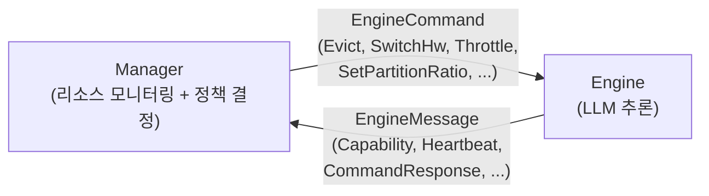

# llm.rs: On-device LLM Inference Framework

본 프로젝트는 ARM64 기반 엣지 디바이스 및 모바일 환경에 최적화된 고성능 **On-device LLM 추론 프레임워크**입니다. Rust 언어로 구현되었으며, 하드웨어 가속기 활용을 위한 유연한 백엔드 구조와 메모리 효율성을 극대화한 Zero-copy 아키텍처를 지향합니다.

## 🏗️ Architecture Overview

Manager와 Engine이 독립 프로세스로 분리되어 IPC로 통신하는 2-프로세스 구조입니다.



- **Manager**: 메모리/CPU/GPU/온도/전력을 모니터링하고, 정책 엔진(Lua 스크립팅)으로 `EngineCommand`를 전송한다.
- **Engine**: LLM 추론을 실행하며, Manager 시그널에 따라 KV eviction, 백엔드 전환, 쓰로틀링, tensor partition ratio 등을 런타임에 적응한다.
- **통신**: Unix Domain Socket / TCP / D-Bus, 프로토콜: serde JSON (`ManagerMessage` ↔ `EngineMessage`)

## 🚀 Key Features

- **ARM64 Optimized**: Android/Linux ARM64 SoC 전용 NEON intrinsics 및 dotprod 최적화
- **Zero-copy Memory**: `Galloc` + `SharedBuffer`로 CPU↔GPU 간 memcpy 제거 (ARM UMA 활용)
- **Backend Extensibility**: `Backend` 트레이트 기반 CPU / OpenCL / CUDA GPU 백엔드 교체 가능
- **Quantization Support**: Q4_0 / Q8_0 블록 양자화, F16/BF16 추론 지원. GGUF 사전 양자화 모델 직접 로드
- **KIVI KV Cache 양자화**: KV 캐시 Q4/Q8 동적 양자화로 메모리 사용량 감소
- **KV Cache Eviction**: Sliding Window / H2O / D2O (merge compensation) / StreamingLLM 정책
- **Tensor Partition**: FFN gate/up matmul을 GPU+CPU에 동시 분산 실행 (`--tensor-partition`)
- **Flash Attention**: GPU flash attention (strided, GQA-aware)
- **Resilience**: Manager 연동 적응형 추론 — 메모리 압박 시 자동 eviction, 온도 시 throttle
- **Llama 3.2 Ready**: Llama 3.2 (1B/3B) 아키텍처 및 GQA 우선 지원
- **Multi-format Model Loading**: HuggingFace Safetensors (F16/BF16) 및 GGUF (Q4_0/Q8_0/F16) 포맷 지원

## 📋 Prerequisites

- **Rust** (stable): `rustup install stable`
- **OpenCL SDK** (GPU 사용 시): 플랫폼별 OpenCL 헤더 및 ICD 설치 필요
- **Android NDK** (크로스컴파일 시): `hosts.toml` 설정 후 `run_device.py`로 빌드 (env 자동 주입). 직접 cargo 호출 시에는 `source android.source` 필요 (비권장)

## ⚡ Quick Start

### Safetensors (F16) 모델

```bash
cargo build --release

# CPU
./target/release/generate -m models/llama3.2-1b --prompt "Hello" -n 50

# GPU (OpenCL) + Q4 양자화 (로드 시 F16→Q4 변환)
./target/release/generate -m models/llama3.2-1b -b opencl --weight-dtype q4 --prompt "Hello" -n 50

# GPU (CUDA) — NVIDIA discrete GPU / Jetson
cargo build --release --no-default-features --features cuda
./target/release/generate -m models/llama3.2-1b -b cuda --prompt "Hello" -n 50
```

### GGUF (사전 양자화) 모델

```bash
# .gguf 파일을 직접 지정 — dtype 자동 감지, 로드 시 변환 불필요
./target/release/generate -m models/llama3.2-1b-q4_0.gguf --prompt "Hello" -n 50

# GPU
./target/release/generate -m models/llama3.2-1b-q4_0.gguf -b opencl --prompt "Hello" -n 50
```

> **지원 GGUF 양자화 타입**: Q4_0, Q8_0, F16, F32. K-quant (Q4_K 등)는 로드 시 F32로 dequant.
> `tokenizer.json`이 GGUF 파일과 같은 디렉토리에 있어야 합니다.

### Android

```bash
# 최초 1회: 호스트 toolchain 등록
python scripts/device_registry.py bootstrap-host  # NDK 자동 감지
# 또는: cp hosts.toml.example hosts.toml && 편집

# 빌드 + 배포 + 실행 (run_device.py가 NDK env 자동 주입)
python scripts/run_device.py -d pixel generate \
    --model-path /data/local/tmp/models/llama3.2-1b -b opencl --prompt Hello

# 배포만 (실행 없이)
python scripts/run_device.py -d pixel --skip-exec generate --extra-bin llm_manager

# 직접 cargo 빌드 시 (비권장): source android.source 필요
# source android.source
# cargo build --release --target aarch64-linux-android
```

자세한 사용법: [docs/USAGE.md](docs/USAGE.md)

## 📖 Documentation

- **[ARCHITECTURE.md](ARCHITECTURE.md)** — 시스템 아키텍처 설계 (컴포넌트, Zero-copy, 프로토콜)
- **[docs/USAGE.md](docs/USAGE.md)** — 전체 사용 매뉴얼 (CLI 플래그, 모드별 가이드, Manager 연동)
- **[docs/](docs/)** — 상세 기술 문서 (백엔드, 커널, KV 캐시, 추론 흐름 등)

## 📁 Project Structure

- `engine/` — LLM 추론 엔진 (`llm_rs2` 크레이트)
- `shared/` — Manager↔Engine 공유 프로토콜 타입 (`llm_shared` 크레이트)
- `manager/` — 시스템 리소스 매니저 서비스 (`llm_manager` 크레이트)
- `web_dashboard/` — 프로파일링 웹 대시보드 (Python/Flask)
