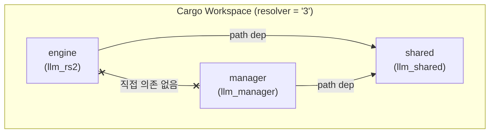

# System Overview -- Architecture

> spec/00-overview.md의 구현 상세. Cargo workspace 구조, feature gate, 빌드 프로파일, 타겟 플랫폼을 기술한다.

## 1. Cargo Workspace 구조

### 설계 결정

3개 크레이트로 분리하여 Engine과 Manager 간 직접 의존을 방지한다.
공유 프로토콜 타입만 `llm_shared`를 통해 교환한다 (INV-001).



### 크레이트 상세

| 크레이트 | 패키지명 | 바이너리 | 주요 의존성 |
|---------|---------|---------|-----------|
| `engine/` | `llm_rs2` | `generate`, `test_backend` | `llm_shared`, `ocl` (opt), `zbus` (opt), `safetensors`, `tokenizers`, `half`, `rayon` |
| `shared/` | `llm_shared` | (라이브러리) | `serde`, `serde_json` (2개만) |
| `manager/` | `llm_manager` | `llm_manager`, `mock_engine`, `mock_manager` | `llm_shared`, `zbus` (opt), `toml`, `clap` |

### 인터페이스

`shared/` 크레이트는 Engine 또는 Manager 내부 타입을 참조하지 않는다 (INV-011).
의존 그래프에서 Engine-Manager 간 경로가 존재하지 않는다 (INV-010).

### Spec 매핑

SYS-001 (3-크레이트 분리), SYS-005 (llm_shared 경유), SYS-061 (workspace members), SYS-072 (shared 최소 의존)

---

## 2. Feature Gate 시스템

### 설계 결정

선택적 기능을 feature gate로 격리하여, 필요 없는 외부 의존성 없이 컴파일 가능하도록 한다.

| Feature | 크레이트 | 기본 | 조건 컴파일 | 활성화 의존성 |
|---------|---------|------|-----------|-------------|
| `opencl` | engine | **활성** | `#[cfg(feature = "opencl")]` | `ocl` crate |
| `resilience` | engine | 비활성 | `#[cfg(feature = "resilience")]` | `zbus` crate |
| `dbus` | manager | **활성** | `#[cfg(feature = "dbus")]` | `zbus` crate |

### Gate 범위

- **`opencl`**: `engine/src/backend/opencl/` 전체, GPU 커널 로딩, `OpenCLBackend` 구조체
- **`resilience`**: `engine/src/resilience/dbus_transport.rs` (D-Bus transport 구현체), `DbusTransport` re-export
- **`dbus`**: `manager/src/emitter/dbus.rs` (D-Bus emitter), `mock_manager` 바이너리 (`required-features = ["dbus"]`)

### 예외 처리

GPU 없는 호스트에서도 `opencl` feature로 컴파일은 되지만, 런타임에 OpenCL 디바이스가 없으면 GPU 연산이 실행되지 않는다. `resilience` 없이 빌드하면 D-Bus transport가 컴파일에서 제외되고, Engine은 Manager 없이 독립 실행된다.

### Spec 매핑

SYS-062

---

## 3. 빌드 프로파일

### 설계 결정

Release 빌드에서 최대 최적화를 적용한다. LTO fat + codegen-units 1 조합으로 크로스-크레이트 인라이닝을 극대화하고, panic=abort로 unwind 오버헤드를 제거한다.

설정 위치: `Cargo.toml` (workspace root)

```toml
[profile.release]
lto = "fat"
codegen-units = 1
panic = "abort"
opt-level = 3
```

### Spec 매핑

SYS-063

---

## 4. 타겟 플랫폼

### 설계 결정

ARM64 Android를 1차 타겟으로 하되, x86_64 Linux 호스트에서도 개발/테스트 가능하도록 한다. 각 아키텍처별 SIMD 최적화 경로를 별도 모듈로 분리한다.

### ARM64 (aarch64-linux-android)

- `.cargo/config.toml`: NEON + dotprod + fhm + fp16 활성화
- CPU SIMD: `engine/src/backend/cpu/neon.rs` (`#[cfg(target_arch = "aarch64")]`, INV-002)
- GPU: OpenCL 커널 ~80개 (`engine/kernels/*.cl`)
- Zero-copy: `CL_MEM_ALLOC_HOST_PTR` — UMA SoC에서 CPU/GPU 간 memcpy 제거 (`engine/src/backend/opencl/`)

### x86_64 (x86_64-unknown-linux-gnu)

- `.cargo/config.toml`: AVX2 + FMA 활성화
- CPU SIMD: `engine/src/backend/cpu/x86.rs`

### 스레딩 모델

- Engine: `std::thread` + `mpsc::channel` only — async 런타임 미사용 (SYS-064)
- Manager: 동일

### Spec 매핑

SYS-020 (ARM64), SYS-022 (NEON), SYS-023 (AVX2), SYS-025 (OpenCL 커널), SYS-026 (zero-copy)

---

## 5. CLI

### Engine (`generate`)

| 플래그 | 설명 | spec 근거 |
|--------|------|----------|
| `--model` | 모델 디렉토리 경로 | SYS-031 |
| `--enable-resilience` | Resilience 매니저 활성화 (Manager 연결) | SYS-050 |
| `--resilience-transport` | 전송 매체: `dbus`, `unix:<path>`, `tcp:<host:port>` | SYS-084 |

### Manager (`llm_manager`)

| 플래그 | 설명 | 기본값 | spec 근거 |
|--------|------|--------|----------|
| `-c, --config` | TOML 설정 파일 경로 | `/etc/llm-manager/config.toml` | SYS-024 |
| `-t, --transport` | 전송 매체 | `dbus` | SYS-089 |
| `--client-timeout` | Unix/TCP 클라이언트 대기 타임아웃(초) | `60` | SEQ-020 |
| `--policy-config` | 정책 설정 TOML 경로 | (없으면 config [policy] 또는 기본값) | SYS-088 |

---

## 6. 코드-스펙 차이

| 항목 | spec | 코드 | 비고 |
|------|------|------|------|
| QcfEstimate 메시지 | SYS-012에서 참조 | `shared/src/lib.rs`에 미정의 | EngineMessage에 QcfEstimate variant 미구현 |
| JSON 직렬화 | SYS-065 | `serde_json` derive | 일치 |