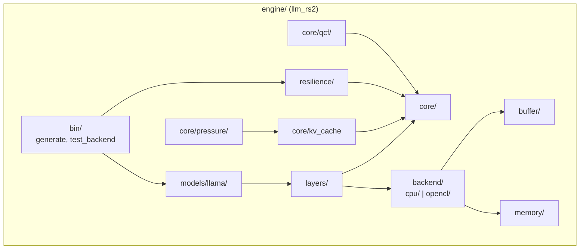
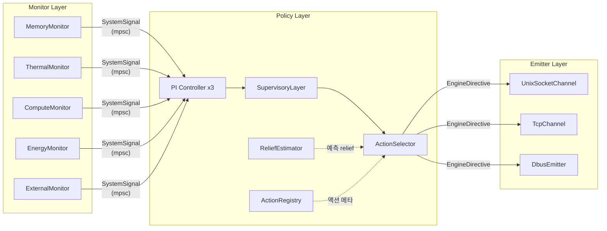
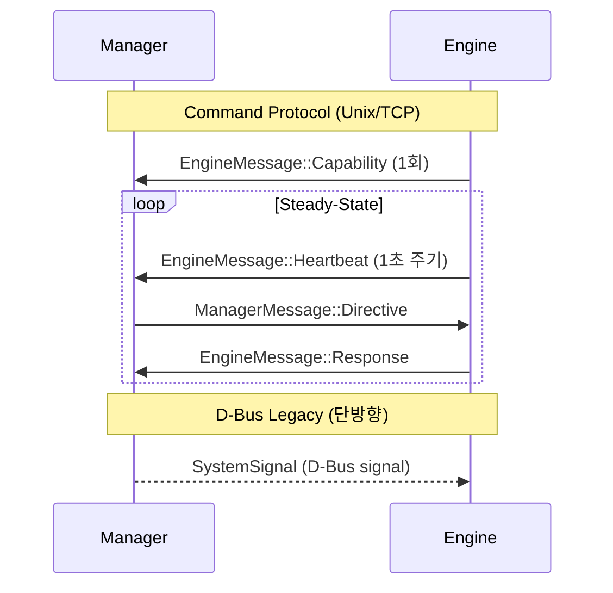
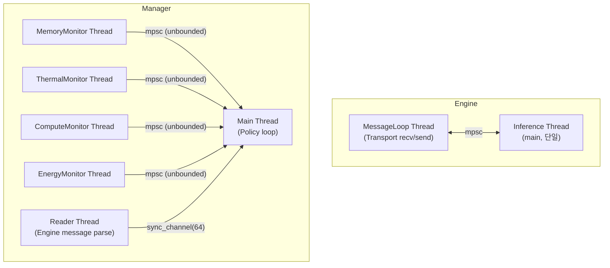
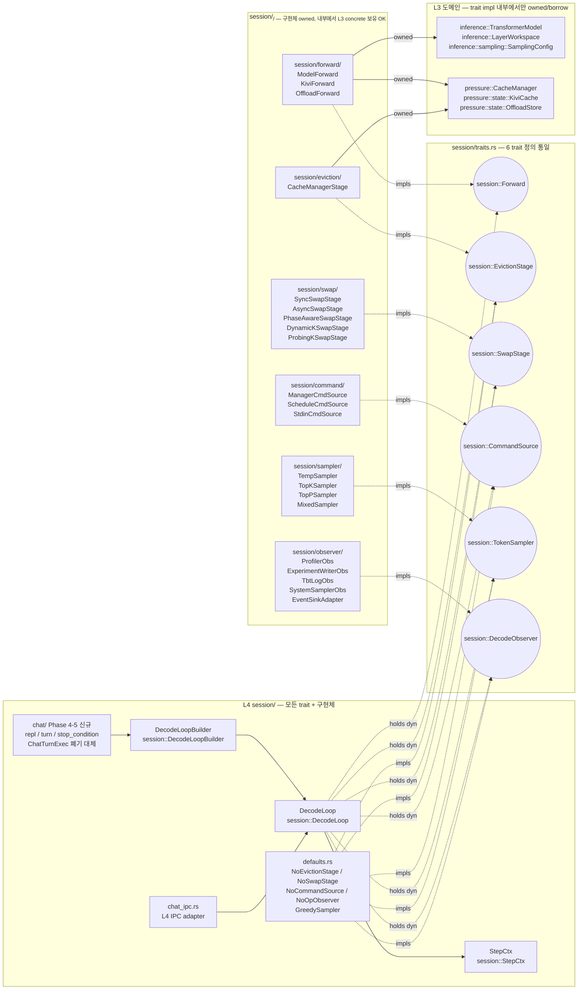

# System Architecture -- Architecture

> spec/01-architecture.md의 구현 상세. Engine 서브시스템, Manager 3-layer, IPC 토폴로지, 스레딩 모델을 기술한다.

## 1. Engine 서브시스템

### 설계 결정

Engine은 8개 서브시스템으로 구성된다. `core/` 모듈이 트레이트를 정의하고 상위 모듈들이 구현한다 (의존성 역전).
유일한 하드웨어 추상화점은 `Backend` trait이다 (INV-012).



### 서브시스템 상세

| 서브시스템 | 주요 모듈 | 책임 |
|-----------|----------|------|
| **Model** | `engine/src/models/llama/llama_model.rs` | Safetensors 로딩, forward pass 오케스트레이션 |
| **Loader** | `engine/src/models/loader/` (`auf/source.rs::AufSource`, `auf/secondary.rs`, `mod.rs::resolve_secondary`) | Primary format dispatch (AUF/Safetensors/GGUF), AUF mmap zero-copy 로드, secondary 해석. W-AUF-1 (2026-05-19) 도입. |
| **Core** | `engine/src/core/` (tensor, buffer, math_utils, sampling, shape) | 트레이트 정의, 기초 타입 |
| **Backend** | `engine/src/backend/cpu/`, `engine/src/backend/opencl/` | Backend trait 구현 (matmul, softmax, RoPE 등 17+ ops) |
| **KV Cache** | `engine/src/core/kv_cache.rs` | KVCacheOps trait + 3개 구현체 |
| **Cache Management** | `engine/src/core/cache_manager.rs`, `engine/src/core/pressure/` | CachePressurePipeline, 6개 Handler |
| **Resilience** | `engine/src/resilience/` | Transport, MessageLoop, CommandExecutor, ResilienceManager |
| **QCF** | `engine/src/core/qcf/` | 품질 비용 함수 (QcfMetric, DegradationEstimator) |
| **Eval** | `engine/src/bin/generate.rs` | 추론 루프 (Prefill/Decode), CLI 진입점 |

### 핵심 인터페이스

#### Backend trait

```rust
// engine/src/core/backend.rs
pub trait Backend {
    // 17+ operations: matmul, softmax, rope, rms_norm, ...
    // 유일한 하드웨어 추상화점 (INV-012)
}
```

구현체: `CpuBackend` (engine/src/backend/cpu/), `OpenCLBackend` (engine/src/backend/opencl/)

#### KVCacheOps trait

```rust
// engine/src/core/kv_cache.rs
pub trait KVCacheOps { ... }
```

| 구현체 | 모듈 | 설명 |
|--------|------|------|
| `KVCache` | `engine/src/core/kv_cache.rs` | F32/F16 기본 KV 캐시 |
| `KiviCache` | `engine/src/core/kivi_cache.rs` | Q4_0/Q8_0 양자화 KV 캐시 |
| `OffloadKVCache` | `engine/src/core/offload_kv_cache.rs` | 디스크 오프로드 KV 캐시 |

#### CachePressureHandler trait

```rust
// engine/src/core/pressure/mod.rs
pub trait CachePressureHandler { ... }
```

| Handler | 모듈 | 상태 |
|---------|------|------|
| `EvictionHandler` | `engine/src/core/pressure/eviction_handler.rs` | 활성 |
| `D2OHandler` | `engine/src/core/pressure/d2o_handler.rs` | 활성 |
| `SwapHandler` | `engine/src/core/pressure/swap_handler.rs` | 활성 |
| `QuantizeHandler` | `engine/src/core/pressure/quantize_handler.rs` | 활성 (간접) |

#### Transport trait

```rust
// engine/src/resilience/transport.rs
pub trait Transport: Send + 'static {
    fn connect(&mut self) -> Result<(), TransportError>;
    fn recv(&mut self) -> Result<ManagerMessage, TransportError>;
    fn send(&mut self, msg: &EngineMessage) -> Result<(), TransportError>;
    fn name(&self) -> &str;
}
```

| 구현체 | 모듈 | 용도 |
|--------|------|------|
| `UnixSocketTransport` | `engine/src/resilience/transport.rs` | Unix domain socket (양방향) |
| `TcpTransport` | `engine/src/resilience/transport.rs` | TCP loopback (Android SELinux 환경) |
| `DbusTransport` | `engine/src/resilience/dbus_transport.rs` | D-Bus System Bus (feature `resilience`) |
| `MockTransport` | `engine/src/resilience/transport.rs` | mpsc 채널 기반 (테스트 전용) |

### Spec 매핑

SYS-080 (모듈 구조), SYS-081 (Backend), SYS-082 (KVCacheOps), SYS-083 (CachePressurePipeline), SYS-084 (Transport), SYS-085 (CommandExecutor), SYS-085a (ResilienceManager)

---

## 2. Manager 3-Layer

### 설계 결정

Manager는 Monitor → Policy → Emitter 3계층으로 구성된다.
Monitor가 SystemSignal을 생성하고, Policy가 EngineDirective로 변환하며, Emitter가 Engine에 전달한다.



### Monitor Layer

```rust
// manager/src/monitor/mod.rs
pub trait Monitor: Send + 'static {
    fn run(&mut self, tx: mpsc::Sender<SystemSignal>, shutdown: Arc<AtomicBool>) -> anyhow::Result<()>;
    fn initial_signal(&self) -> Option<SystemSignal>;
    fn name(&self) -> &str;
}
```

| Monitor | 모듈 | 도메인 |
|---------|------|--------|
| `MemoryMonitor` | `manager/src/monitor/memory.rs` | 메모리 |
| `ThermalMonitor` | `manager/src/monitor/thermal.rs` | 온도 |
| `ComputeMonitor` | `manager/src/monitor/compute.rs` | CPU/GPU 사용률 |
| `EnergyMonitor` | `manager/src/monitor/energy.rs` | 배터리/전력 |
| `ExternalMonitor` | `manager/src/monitor/external.rs` | 외부 시그널 (opt) |

각 Monitor는 독립 `std::thread::spawn`으로 실행된다 (INV-013).
Monitor → Main 방향은 unbounded `mpsc::channel()` 사용 (Monitor 블로킹 방지).

### Policy Layer

```rust
// manager/src/pipeline.rs
pub trait PolicyStrategy: Send {
    fn process_signal(&mut self, signal: &SystemSignal) -> Option<EngineDirective>;
    fn update_engine_state(&mut self, msg: &EngineMessage);
    fn mode(&self) -> OperatingMode;
    fn save_model(&self) {}
}
```

주 구현체: `HierarchicalPolicy` — PI Controller 3개 (compute/memory/thermal) + SupervisoryLayer + ActionSelector.

| 컴포넌트 | 모듈 | 책임 |
|---------|------|------|
| `PiController` | `manager/src/pi_controller.rs` | 도메인별 pressure 계산 (PI 제어) |
| `SupervisoryLayer` | `manager/src/supervisory.rs` | pressure → OperatingMode 결정 |
| `ActionSelector` | `manager/src/selector.rs` | cross-domain 액션 조합 탐색, 배타 그룹 검증 (INV-016) |
| `ActionRegistry` | `manager/src/action_registry.rs` | 액션 메타데이터 (비용, 도메인, 제약) |
| `ReliefEstimator` | `manager/src/relief/mod.rs`, `manager/src/relief/linear.rs` | 온라인 선형 회귀로 액션 효과 예측 |
| `PolicyConfig` | `manager/src/config.rs` | TOML 기반 정책 설정 |
| Types | `manager/src/types.rs` | FeatureVector, ActionId, OperatingMode, PressureVector |

### Emitter Layer

```rust
// manager/src/emitter/mod.rs
pub trait Emitter: Send {
    fn emit(&mut self, signal: &SystemSignal) -> anyhow::Result<()>;
    fn emit_initial(&mut self, signals: &[SystemSignal]) -> anyhow::Result<()>;
    fn emit_directive(&mut self, directive: &EngineDirective) -> anyhow::Result<()>;
    fn name(&self) -> &str;
}
```

```rust
// manager/src/channel/mod.rs
pub trait EngineReceiver: Send {
    fn try_recv(&mut self) -> anyhow::Result<Option<EngineMessage>>;
    fn is_connected(&self) -> bool;
}

// 블랭킷 구현
pub trait EngineChannel: Emitter + EngineReceiver {}
impl<T: Emitter + EngineReceiver> EngineChannel for T {}
```

| 구현체 | 모듈 | Emitter | EngineReceiver | 양방향 |
|--------|------|---------|---------------|--------|
| `UnixSocketChannel` | `manager/src/channel/unix_socket.rs` | O | O | O |
| `TcpChannel` | `manager/src/channel/tcp.rs` | O | O | O |
| `DbusEmitter` | `manager/src/emitter/dbus.rs` | O | X | X |

### Spec 매핑

SYS-086 (3-layer), SYS-087 (Monitor), SYS-088 (HierarchicalPolicy), SYS-088a (ActionSelector), SYS-089 (Emitter), SYS-095~099 (Action Pool)

---

## 3. IPC 토폴로지

### 설계 결정

Engine과 Manager는 `shared/src/lib.rs`의 메시지 타입으로만 통신한다.
두 가지 IPC 경로가 존재한다:

1. **Command Protocol** (양방향): Unix Socket / TCP — `ManagerMessage` ↔ `EngineMessage`
2. **D-Bus Legacy** (단방향): D-Bus System Bus — `SystemSignal` → Engine



와이어 포맷: 4B BE u32 length + UTF-8 JSON payload (상세는 arch/10-protocol.md).

### Seq ID 보장

- Manager: `static SEQ_COUNTER: AtomicU64::new(1)`, `fetch_add(1, Relaxed)` (INV-014)
- D-Bus 경로: `DbusTransport` 자체 `next_seq_id: u64` 카운터
- Engine: Capability 세션당 1회 전송 (INV-015)

### Spec 매핑

SYS-090 (메시지 타입), SYS-092 (와이어 포맷), SYS-093 (1:1 연결), SYS-094 (D-Bus)

---

## 4. 스레딩 모델

### 설계 결정

async 런타임을 사용하지 않고 `std::thread` + `mpsc::channel`만 사용한다 (SYS-064).
Engine 추론 루프는 단일 스레드이다 (INV-018).



### 동기화 메커니즘

| 위치 | 채널 | 용량 | 목적 |
|------|------|------|------|
| Monitor → Main | `mpsc::channel()` | 무제한 | Monitor 블로킹 방지 |
| Reader → Main | `mpsc::sync_channel(64)` | 64 | 배압 제어 |
| Main poll | `recv_timeout(50ms)` | - | Monitor 신호 대기 |
| SHUTDOWN | `AtomicBool` | - | SIGINT/SIGTERM 처리 |

### Spec 매핑

SYS-064, INV-018, INV-013

---

## 5. Config

| config 키 | 타입 | 기본값 | spec 근거 |
|-----------|------|--------|----------|
| `policy.exclusion_groups` | `HashMap<String, Vec<String>>` | `{}` | SYS-096 |
| (기타 PolicyConfig 키) | | | arch/20-manager.md, arch/22-manager-algorithms.md 참조 |

---

## 6. Layered Architecture Mapping (Open-Sourcing Refactoring)

> spec 대응: `spec/01-architecture.md` §3.8 (SYS-100~105), INV-LAYER-001~005 (`spec/41-invariants.md` §3.26). 위반 실측 + 마이그레이션 순서는 `ARCHITECTURE.md` §13 참조.

### 6.1 컴포넌트: L1 Backend (`backend/`)

- **책임 (spec WHAT → HOW)**: SYS-100 L1. 하드웨어별 연산 구현. `Backend` trait 구현체. CPU(NEON/AVX/Common), OpenCL(plan, buffer, memory, host_ptr_pool), CUDA(embedded, pc), QNN(qnn_oppkg).
- **의존**: L2(`shared/`) trait + cross-cutting trait(`resilience::GpuEventMeter` 등) **만** import. `backend/<be>/` 내부 sub-module 간 cross-import는 자유.
- **포함 모듈 (post-migration, §13.8 결정 반영)**:
  - `backend/cpu/{common, neon, x86}`
  - `backend/opencl/{plan, memory, host_ptr_pool, gpu_self_meter, ...}` + **`backend/opencl/buffer/{cl_sub_buffer, cl_wrapped_buffer, host_ptr_pool_buffer}.rs`** (§13.8-D)
  - `backend/cuda_embedded/{...}` + **`backend/cuda_embedded/pool.rs`** (← `models/weights/layer_object_pool.rs`, §13.8-B) + **`backend/cuda_embedded/buffer/{cuda_buffer, cuda_mmap_alias_buffer}.rs`** (§13.8-D)
  - `backend/cuda_pc/{...}` + 동일 패턴
  - `backend/qnn_oppkg/{...}` + **`backend/qnn_oppkg/buffer/rpcmem_alias_buffer.rs`** (§13.8-D)
- **공용 인터페이스**:
  - `Backend` trait — `matmul`, `rms_norm`, `rope`, `softmax`, `attention_gen`, `flash_attention_*`, `kv_scatter_*` 등 ~20 method.
  - 각 backend는 `Box<dyn Backend>` 또는 `Arc<dyn Backend>`로만 외부에 노출. concrete struct는 backend module 내부 + downcast pattern용 `pub`.
  - **`WeightStagingPool` trait** (L2에 정의, backend가 impl 제공) — pressure handler가 swap 시 backend-owned host-pinned/`CL_MEM_ALLOC_HOST_PTR` 영역을 임차하는 표준 경로 (§13.8-B). impl은 `backend/cuda_embedded/pool.rs`, `backend/opencl/host_ptr_pool.rs`.
- **예외 처리**: `cpu_fallback()` 패턴 — `cuda_pc`, `cuda_embedded` 모듈이 `CpuBackend::new()`를 instantiate (V-05). 본 패턴은 INV-LAYER-001의 명시 허용 zone — backend가 자신의 fallback 경로로 cpu backend를 사용하는 패턴은 별도 인터페이스로 격리할 가치보다 단순성이 우선.
- **현 위반**: V-01(opencl→gpu_self_meter concrete), V-02(opencl→layers), V-03(qnn_oppkg→models), V-04(qnn_oppkg→opencl).

### 6.2 컴포넌트: L2 Abstraction (`shared/` — engine 내부)

- **책임 (spec WHAT → HOW)**: SYS-100 L2. 백엔드 독립 trait + 데이터 타입 + utility. Tensor/Buffer/DType/Memory/Shape는 시스템 전반의 통화(common currency).
- **포함 모듈 (post-migration, §13.8 결정 반영)**:
  - **Trait 정의**: `shared/backend.rs` (← `core/backend.rs`), `shared/buffer.rs` (← `core/buffer.rs`), `shared/memory_buf.rs` (← `core/memory.rs`), **`shared/weight_staging_pool.rs`**(신설, §13.8-B — backend pool 접근용 trait).
  - **데이터 타입**: `shared/tensor.rs`, `shared/shape.rs`, `shared/quant.rs`.
  - **공용 utility**: `shared/thread_pool.rs`, `shared/math_utils.rs`, `shared/tensor_partition/` (← `layers/tensor_partition.rs`), `shared/qcf/` (← `core/qcf/`).
  - **공용 buffer impl**: `shared/buffer/{shared_buffer, mmap_buffer, slice_buffer, unified_buffer, borrowed_mmap_buffer}` — generic만 유지 (§13.8-D). backend-specific(`cl_*`, `cuda_*`, `rpcmem_*`, `host_ptr_pool_buffer`)은 모두 `backend/<be>/buffer/`로 이동.
  - **공용 가중치 포맷**: **`shared/auf/`** (← `auf/`, §13.8-A) — Argus Unified Format. GGUF/Safetensors와 동급 자산. resilience 전용이 아니라 inference 측 모델 로딩과 weight swap 양쪽이 공용으로 사용한다.
- **의존**: 외부 crate(`half`, `bytemuck`, `anyhow`) + cross-cutting trait만. **L3/L4/L5 import 금지**.
- **공용 인터페이스**:
  - `Backend` trait — backend 추상화.
  - `Buffer` trait — `as_ptr() / as_mut_ptr() / size_bytes() / dtype()`. `Any` super-trait로 downcast 지원.
  - `Memory` trait — `alloc(size, DType) -> Box<dyn Buffer>`, `used_memory()`.
  - `DType` enum — `F32, F16, BF16, Q4_0, Q4_1, Q8_0, KVQ4, KVQ8, BlockQ2_0, U8`.
  - **`WeightStagingPool` trait** — `acquire(size, dtype) -> StagingLease`, `release(lease)`. backend가 impl, pressure handler(weight swap)가 사용 (§13.8-B). 본 trait 도입으로 V-27(layer_object_pool→CudaBackend downcast)이 해소된다.
  - **AUF API** (`shared::auf::{AufView, AufMeta, AufError, reader, section, header, tensor_index, BackendTag}`) — 가중치 view 자료 구조.
- **예외 처리**: 마이그레이션 완료 후 L2→L1/L3 import는 0건이어야 한다. backend pool 접근은 `WeightStagingPool` trait, secondary mmap 접근은 L3에 정의된 `SecondaryStore` trait(TBD)로 inversion.
- **현 위반**: V-07(buffer→opencl::host_ptr_pool, §13.8-D 이동으로 해소), V-09(buffer→SecondaryMmap, trait inversion 필요), V-23(buffer/auf→models, §13.8-A 이동 후 reverse 의존이 `models`→`shared/auf/`로 정렬).

### 6.3 컴포넌트: L3 Pressure Domain (`pressure/`)

- **책임 (spec WHAT → HOW)**: SYS-101. 메모리 압박 응답 — KV eviction, KV quantization, KV compress, KV swap, weight swap.
- **하위 구조 (Coordinator / Policy / State)**:
  - **Coordinator**: `pressure/manager.rs` (← `core/cache_manager.rs`). `CachePressurePipeline`을 호출하여 신호 수신 시 정책 실행.
  - **Policy/Pressure trait**: `pressure/policy/pressure.rs` (← `core/pressure/mod.rs`). `CachePressureHandler` trait + `Pipeline`.
  - **Policy/Eviction**: `pressure/policy/eviction/{sliding_window, h2o, h2o_plus, d2o, no_eviction, streaming_llm, mod.rs}`. `EvictionPolicy` trait.
  - **Policy/Handlers**: `pressure/policy/handlers/{eviction, d2o, compress, quantize, swap, merge, sparse, weight_swap}_handler.rs`.
  - **Policy/Weight swap (sub-handler)**: `pressure/policy/handlers/weight_swap/{swap_executor, async_swap, release_worker, phase_aware_swap, intra_forward_swap, decider, noise_table, probing_k, dynamic_k, incremental_plan}.rs` (← `models/weights/`).
  - **State/KV**: `pressure/state/{kv_cache, kivi_cache, kv_migrate}.rs`, `pressure/state/offload/` (← `core/offload/`).
  - **State/Weight slot**: `pressure/state/weight_slot/{slot, secondary_mmap, rpcmem_secondary}.rs` (← `models/weights/`).<br/>**Note (§13.8-B)**: `layer_object_pool.rs`는 본 위치가 아닌 **`backend/cuda_embedded/pool.rs`**로 이동한다 — 자원 owner가 backend이고 pressure는 `WeightStagingPool` trait으로 접근.
- **의존**: L2(`shared/`) + cross-cutting trait. `inference/`의 trait(`TransformerLayer` 등)을 매우 제한적으로 import할 수 있으나, concrete struct import는 금지(INV-LAYER-003). backend pool 사용 시 `shared::WeightStagingPool` trait 경유.
- **공용 인터페이스**:
  - `CachePressureHandler` trait — `handle(ctx) -> ActionResult`.
  - `EvictionPolicy` trait — `should_evict() / evict() / evict_with_scores() / name()`.
  - `KVCacheOps` trait — `update / get_view / kv_dtype / current_pos / capacity`. **이 trait이 Pressure와 Inference의 inversion 경계**.
  - `WeightSwapTarget` trait (TBD, Step 4 마이그레이션에서 신설) — `swap_executor`가 transformer model의 layer를 변경하기 위한 trait. 현재는 `TransformerModel`을 직접 import (V-25).
  - `SecondaryStore` trait (TBD) — buffer가 mmap-backed secondary source에 접근하는 inversion 경로 (V-09 해소용).
- **예외 처리**: `weight_swap_handler.rs`가 `models::config::ModelConfig`를 import (V-24) — `ModelConfig`는 shared/로 격상해야 함.
- **현 위반**: V-10(→ resilience::EvictMethod), V-13(KiviCache→OpenCLBackend downcast), V-21(transformer→preload_pool inference→pressure cross-domain), V-24(weight_swap→models), V-25(swap_executor→layers/models), V-26(decider→qcf), V-27(layer_object_pool→CudaBackend — §13.8-B 이동 + `WeightStagingPool` trait 도입으로 해소).

### 6.4 컴포넌트: L3 Inference Domain (`inference/`)

- **책임 (spec WHAT → HOW)**: SYS-101. 단일 토큰의 forward pass — 모델 구조, layer 계산, attention, sampling, chat 템플릿 변환.
- **포함 모듈 (post-migration, §13.8 결정 반영)**:
  - `inference/models/{transformer, llama/, mappers/, loader/, config}.rs` (← `models/`).
  - `inference/layers/{transformer_layer/, attention, hybrid_attention, workspace}.rs` (← `layers/`).
  - `inference/{sampling, attention_scores, speculative, skip_config}.rs` (← `core/`).
  - **`inference/chat_template.rs`** — generic chat infra (← `core/chat_template.rs`의 모델 독립 부분, §13.8-C).
  - **`inference/models/<arch>/chat_template.rs`** — 모델별 chat 템플릿 구현체 (예: `inference/models/llama/chat_template.rs`). `ModelArch`와 동일 도메인이므로 V-11 자연 해소.
- **의존**: L2(`shared/`) + cross-cutting trait. Pressure 도메인의 trait(`KVCacheOps`)만 import. AUF 사용은 `shared::auf::*` (§13.8-A) — V-23 해소.
- **공용 인터페이스**:
  - `TransformerModel::forward()` — logits 텐서 반환 (제네릭 `C: KVCacheOps`).
  - `TransformerLayer::forward()` — 단일 layer 처리.
  - `LayerWorkspace` — decode 루프용 사전 할당 버퍼.
  - `SamplingConfig::sample()`, `AttentionScoreAccumulator::accumulate()`.
  - `ChatTemplate` trait (TBD, §13.8-C) — 모델별 prompt 변환 추상화. impl은 `inference/models/<arch>/chat_template.rs`.
- **예외 처리**: 일부 forward path가 `crate::backend::cpu::neon::*`를 직접 호출 (V-17) — INV-012(Backend trait이 유일 추상화)와 INV-LAYER-003 둘 다 위반. Backend trait에 적절한 method 추가로 흡수 또는 downcast trait(`as_neon() -> Option<&CpuNeon>`)을 backend 측에 노출하는 방식으로 inversion 필요.
- **현 위반**: V-17(layers→backend NEON/CUDA/OpenCL), V-18(layers→Galloc, OpProfiler), V-19(layers→buffer/cl_sub_buffer — §13.8-D로 reverse 방향 정렬), V-20(transformer→opencl plan), V-22(transformer→profile), V-23(transformer→auf — §13.8-A로 reverse 방향 정렬).

### 6.5 컴포넌트: L4 Orchestration (`session/` — 신규)

- **책임 (spec WHAT → HOW)**: SYS-100 L4. Decode loop, prefill 흐름, eviction/swap dispatch, IPC adapter 연동. 현재 `bin/generate.rs` 13,022 LOC monolith로 존재. Migration Step 2에서 분리.
- **포함 모듈 (post-migration, §13.8 결정 반영 + Task #4 finalize 2026-05-16)**:
  - `session/mod.rs` — module roots, 공용 type 재출력(`pub use`).
  - `session/decode_loop.rs` — `DecodeLoop` struct + `DecodeLoopBuilder` (typestate). 6개 추상화 trait object 보유.
  - `session/traits.rs` — **6 trait 정의** (`Forward`, `EvictionStage`, `SwapStage`, `CommandSource`, `TokenSampler`, `DecodeObserver`) + `StepCtx` + `DecodeResult` + `StopReason` + `EvictionOutcome`. 사용자 결정 #1 (2026-05-16): 6 trait 모두 `session/`에 둔다 — `Forward`/`TokenSampler`도 inference로 끌어올리지 않음. 빌더와 한 모듈에 두는 단순성 우선.
  - `session/defaults.rs` — `NoEvictionStage`, `NoSwapStage`, `NoCommandSource`, `NoOpObserver`, `GreedySampler` no-op/default 구현체.
  - `session/forward/{model_forward, kivi_forward, offload_forward}.rs` — `Forward` 구현체 3종.
  - `session/eviction/cache_manager_stage.rs` — `EvictionStage` 구현체 (L3 `pressure::CacheManager` owned).
  - `session/swap/{sync_swap_stage, async_swap_stage, phase_aware_swap_stage, dynamic_k_swap_stage, probing_k_swap_stage}.rs` — `SwapStage` 구현체 5종.
  - `session/command/{manager_cmd_source, schedule_cmd_source, stdin_cmd_source}.rs` — `CommandSource` 구현체.
  - `session/sampler/{temp_sampler, top_k_sampler, top_p_sampler, mixed_sampler}.rs` — `TokenSampler` 구현체 (얇은 wrapper, 내부에서 `inference::sampling::SamplingConfig` 호출).
  - `session/observer/{profiler_obs, experiment_writer_obs, tbt_log_obs, system_sampler_obs, event_sink_adapter}.rs` — `DecodeObserver` 구현체.
  - `session/init.rs` — `SessionInitCtx` (Phase 4-1 추출 헬퍼: backend/model/cache_manager/tokenizer 초기화).
  - `session/cli.rs` (또는 `session/cli_dump.rs`) — CLI 인자 + dump_config 헬퍼.
  - `session/prefill.rs` — prompt processing 헬퍼.
  - `session/eval/` — 평가 hook (← `eval/`, V-28/V-29 해소).
  - **`session/chat_ipc.rs`** (← `core/chat_ipc.rs`, §13.8-C) — 외부 IPC adapter. `DecodeLoop::run_until_stop`에 위임.
  - `session/chat/{repl, turn, stop_condition}.rs` (Phase 4-5 신규) — 사용자 결정 #3 (2026-05-16): `ChatTurnExec` trait 폐기 후 chat REPL 1,178 LOC을 DecodeLoop 패턴으로 전면 재작성.

  상세 trait API + 빌더 typestate + StepCtx + 구현체 카탈로그 + 마이그레이션 sub-phase는 **[`arch/inference_pipeline.md`](inference_pipeline.md)**가 단일 진실 원본. 본 절은 컴포넌트 매핑만.
- **의존**: L3(`pressure/`, `inference/`) + L2(`shared/`) + cross-cutting. **L4 내부 결합도 제약 (INV-LAYER-006)**: `DecodeLoop` struct **필드 자체**는 6 trait의 `Box<dyn>` 또는 generic만 허용. concrete `OpenCLBackend`/`CacheManager`/`LlamaModel`/`ManagerClient`/`Profiler` 직접 보유 금지. L1 backend는 builder가 받는 `Arc<dyn Backend>`만 허용. **단** trait impl struct(`ModelForward`, `CacheManagerStage` 등) **내부**는 L1/L3 concrete를 owned/borrow 자유 보유 가능 — builder가 trait object로 추상화 후 주입하는 자연 경로 (`arch/inference_pipeline.md` §8.3/§8.4 참조).
- **공용 인터페이스**:
  - `DecodeLoop::run(budget: usize) -> DecodeResult` — `Forward::step` × N + observer hook.
  - `DecodeLoop::run_until_stop(stop: &dyn StopCondition)` — chat REPL 경로.
  - `DecodeLoopBuilder::new()` + chainable `.with_forward(...)` / `.add_observer(...)` / `.with_sampler(...)` + `.build()` (typestate, INV-LAYER-007).
  - `ChatIpcServer` (TBD) — IPC 채널로 prompt를 받아 `inference::ChatTemplate` impl로 변환 후 `DecodeLoop::run_until_stop` 호출.
  - **6 trait의 lifecycle hook은 default no-op** (`Forward::finalize`, `Forward::on_kv_prune`) — 외부 기여자가 `prefill`/`step`만 구현해도 컴파일 성공 (사용자 결정 #2). KV 보유 구현체는 `on_kv_prune` override 필수.
- **예외 처리**: backend instantiation은 `session::init` 헬퍼(L4 내부)에서 수행 — CLI 인자 → `Box<dyn Forward>` 변환. 결과 trait object만 builder에 전달.
- **현 위반**: 본 컴포넌트가 존재하지 않음 — 현재 `bin/generate.rs`에 모두 inline. Migration Step 2-2에서 trait 정의, Step 2-4에서 main() 흡수, Step 2-5에서 chat REPL 전면 재작성.

#### 6.5.1 의존 그래프 (`session/` 내부)

사용자 결정 #1 (2026-05-16) — 6 trait + 모든 구현체가 L4 `session/` 산하로 통일.



(점선 `holds dyn`: `DecodeLoop` 필드는 trait object만 — INV-LAYER-006 / 점선 `impls`: trait 구현 관계 / 실선 `owned`: trait impl struct 내부에서 L3 concrete owned — §8.3 무위반)

### 6.6 컴포넌트: L5 Adapter (`bin/`)

- **책임 (spec WHAT → HOW)**: SYS-100 L5. CLI parsing, binary entry, signal injection.
- **포함 모듈**: `bin/{generate, test_backend, test_model, signal_injector, microbench_*, auf_tool, probe_*}.rs`.
- **의존**: production binary(`generate`)는 L4(`session/`)만 직접 import (INV-LAYER-005). test/microbench는 본 규칙 밖.
- **공용 인터페이스**: 각 binary의 `main()` 진입점. `clap::Parser` 기반 CLI.
- **예외 처리**: `test_backend`/`signal_injector` 등은 L3/L1 직접 호출이 본 binary의 목적이므로 enforcement 대상 외.
- **현 위반**: V-30(generate.rs가 거의 모든 lib 모듈 import).

### 6.7 컴포넌트: Cross-cutting Observability (`observability/`)

- **책임 (spec WHAT → HOW)**: SYS-102. Events, profile, eval, experiment, rss trace. 모든 layer에서 사용 가능.
- **포함 모듈 (post-migration)**:
  - `observability/events.rs` (← `core/events.rs`) — `EventSink` trait + `CacheEvent` enum.
  - `observability/profile/` (← `profile/`) — Profiler, latency, ops, cache, scores, entropy, quality_metrics.
  - `observability/eval/` (← `eval/`) — eval loop, hooks (단 L3 의존이 많아 `session/eval/`로 격상 검토).
  - `observability/experiment.rs` (← `experiment.rs`).
  - `observability/rss_trace.rs` (← `core/rss_trace.rs`).
- **의존**: L2 + cross-cutting. L3 concrete import는 trait 경유 (INV-LAYER-004). 예외: `events::CacheEvent` enum이 pressure 결과를 직접 표현 — enum이 inversion 매체이므로 동의어 허용.
- **공용 인터페이스**:
  - `EventSink` trait — `emit(event: CacheEvent)`. Pressure pipeline이 owner, observability는 sink 구현(예: `StderrDiagnosticSink`).
  - `OpInstrument` trait (TBD) — `Timer::start(key)`를 대체할 instrument trait. 현재 `quality_metrics::Timer`/`op_trace::record`가 concrete macro로 cross-cutting → L3 의존을 만들고 있음 (V-14, V-22).
- **현 위반**: V-12(events→pressure concrete, 의도된 enum), V-14/V-22(profile macros가 L3에서 직접 호출됨), V-16/V-28/V-29(eval이 backend/model concrete 의존).

### 6.8 컴포넌트: Cross-cutting Resilience (`resilience/`)

- **책임 (spec WHAT → HOW)**: SYS-102. Manager signal 수신/strategy 적용, system monitor, GPU yield. (**AUF는 §13.8-A 결정으로 본 컴포넌트에서 제외, L2 `shared/auf/`로 이동**.)
- **포함 모듈 (post-migration, §13.8 결정 반영)**:
  - 기존: `resilience/{mod, manager, executor, signal, state, transport, dbus_transport, gpu_self_meter, proc_self_meter, strategy/}.rs`.
  - 신규 이동: `resilience/sys_monitor.rs` (← `core/sys_monitor.rs`), `resilience/gpu_yield.rs` (← `core/gpu_yield.rs`).
  - **AUF 제외 (§13.8-A)**: AUF는 V-23 실측상 inference 측 model loader(`models/transformer.rs`, `models/weights/secondary_mmap.rs`)와 buffer(`buffer/borrowed_mmap_buffer.rs`)가 모두 import하는 **공용 가중치 포맷**이다. resilience-specific이 아니므로 `shared/auf/`(L2)에 위치한다. resilience의 weight swap도 동일하게 L2 자산으로 import한다.
- **의존**: L2(`shared::auf` 포함) + Manager IPC. L3 concrete는 trait 경유.
- **공용 인터페이스**:
  - `Transport` trait, `SystemSignal` enum (← `shared` crate).
  - `SystemMonitor` trait — `read() -> MemoryStats`.
  - `EvictMethod` enum — 현재 `resilience/` 안에 있으나 사실상 pressure policy 식별자 (V-10). `pressure/policy/eviction/method.rs`로 이동 검토.
  - `GpuEventMeter` trait (TBD) — OpenCL backend가 self-meter용 event registry를 노출할 때 backend → resilience inversion 경계.
- **현 위반**: V-01(opencl→gpu_self_meter는 backend가 resilience를 import — cross-cutting 의존이지만 trait inversion 권장).

### 6.9 모듈 의존 그래프 (post-migration target)

```mermaid
flowchart LR
    subgraph L5
        BIN[bin/generate]
    end
    subgraph L4
        SESS[session/]
    end
    subgraph L3P [L3 Pressure]
        PMGR[pressure/manager]
        PPOL[pressure/policy]
        PST[pressure/state]
    end
    subgraph L3I [L3 Inference]
        INFM[inference/models]
        INFL[inference/layers]
    end
    subgraph L2
        SHA[shared/<br/>(includes auf/, weight_staging_pool trait)]
    end
    subgraph L1
        BCPU[backend/cpu]
        BCL[backend/opencl<br/>(+ buffer/, host_ptr_pool)]
        BCUDA[backend/cuda_*<br/>(+ buffer/, pool.rs)]
        BQNN[backend/qnn_oppkg<br/>(+ buffer/rpcmem_*)]
    end
    subgraph CC1 [observability]
        OBS[events/profile/eval/...]
    end
    subgraph CC2 [resilience]
        RES[signal/strategy/sys_monitor/gpu_yield]
    end

    BIN --> SESS
    SESS --> L3P
    SESS --> L3I
    SESS -.->|EventSink trait| CC1
    SESS -.->|Transport trait| CC2
    PMGR --> PPOL
    PPOL --> PST
    PPOL -.->|WeightStagingPool trait| BCUDA
    PPOL -.->|WeightStagingPool trait| BCL
    PMGR --> SHA
    PPOL --> SHA
    PST --> SHA
    INFM --> INFL
    INFM --> SHA
    INFL --> SHA
    SHA --> BCPU
    SHA --> BCL
    SHA --> BCUDA
    SHA --> BQNN
    PPOL -.->|KVCacheOps trait| INFL
    L3P -.->|via EventSink| CC1
    L3I -.->|via OpInstrument trait| CC1
    BCL -.->|via GpuEventMeter trait| CC2
```

### 6.10 위반 현황 요약

- 총 실측 violation: **31건** (V-01 ~ V-31, HEAD `d8f26156`, `ARCHITECTURE.md` §13.5).
- 가장 큰 카테고리: L3 → L1 backend impl 직접 의존 (6건) — `Arc<dyn Backend>` downcast 패턴이 주요 원인.
- 두 번째: L3 → cross-cutting concrete (6건) — `Galloc`, `OpProfiler`, `quality_metrics::Timer` 등.
- Migration Step 3~5에서 단계적 해소.

**§13.8 결정에 따른 위반 해소 매핑** (2026-05-16):

| §13.8 항목 | 결정 | 해소 violation | 적용 Step |
|-----------|------|---------------|----------|
| §13.8-A | AUF → `shared/auf/` | V-23 (buffer/model→auf) | Step 3 |
| §13.8-B | layer_object_pool → `backend/cuda_embedded/pool.rs` + `WeightStagingPool` trait | V-27 (layer_object_pool→CudaBackend) | Step 3 |
| §13.8-C | chat_template → `inference/` + 모델별 분배, chat_ipc → `session/` | V-11 (chat_template→ModelArch) | Step 2(chat_ipc), Step 4(chat_template) |
| §13.8-D | backend-specific buffer → `backend/<be>/buffer/` | V-07 (host_ptr_pool_buffer), V-08 (cuda/cl/rpcmem buffer), V-19 (tensor_partition→ClSubBuffer) | Step 3 |
| §13.8-E | 신규 테스트만 tests/spec/ | V-15 — baseline 등재, 마이그레이션 마지막에 0 수렴 | Step 5 이후 |

남은 위반(V-01 ~ V-06, V-09, V-10, V-12 ~ V-18, V-20 ~ V-22, V-24 ~ V-26, V-28 ~ V-31)은 trait inversion(`GpuEventMeter`, `CpuFallback`, `SecondaryStore`, `OpInstrument`, `WeightSwapTarget` 등)과 L5/L4 분리로 단계적 해소.

---

## 7. 코드-스펙 차이

| 항목 | spec | 코드 | 비고 |
|------|------|------|------|
| `ResilienceManager` | SYS-085a | `engine/src/resilience/manager.rs` | Strategy 기반, D-Bus 경로 전용 (레거시) |
| EngineMessage variant | 4종 | 3종 (Capability, Heartbeat, Response) | QcfEstimate 미구현 |