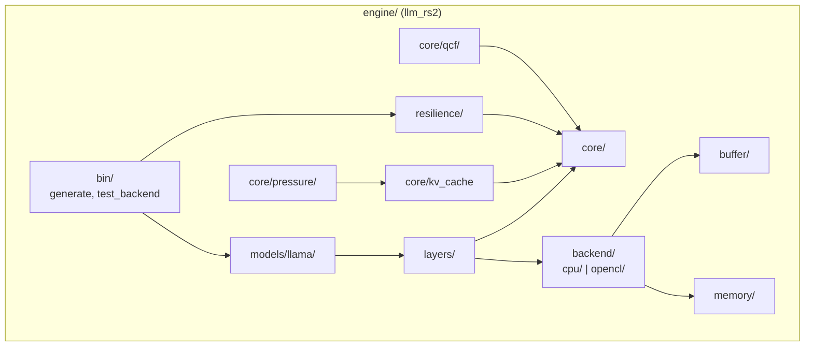
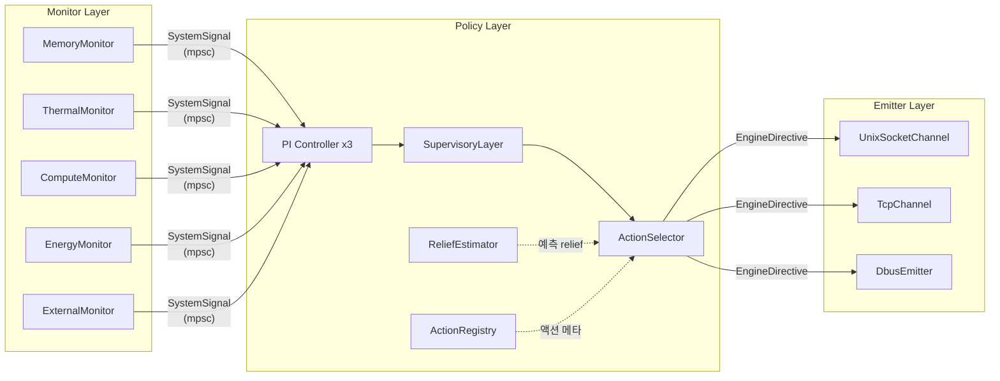
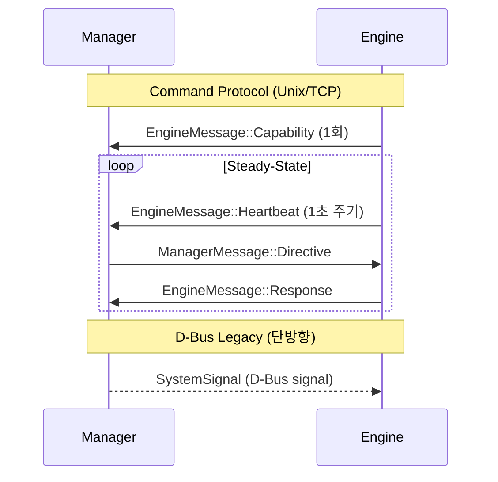
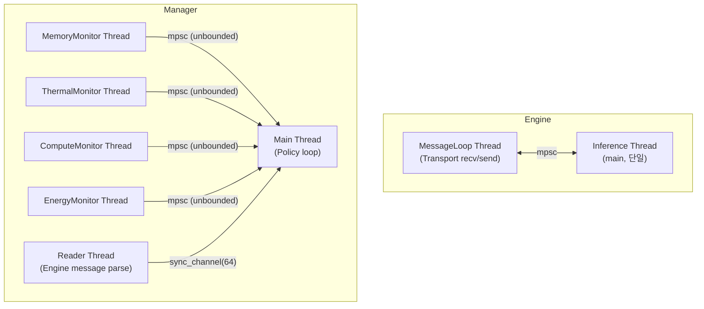

# System Architecture -- Architecture

> spec/01-architecture.md의 구현 상세. Engine 서브시스템, Manager 3-layer, IPC 토폴로지, 스레딩 모델을 기술한다.

## 1. Engine 서브시스템

### 설계 결정

Engine은 8개 서브시스템으로 구성된다. `core/` 모듈이 트레이트를 정의하고 상위 모듈들이 구현한다 (의존성 역전).
유일한 하드웨어 추상화점은 `Backend` trait이다 (INV-012).



### 서브시스템 상세

| 서브시스템 | 주요 모듈 | 책임 |
|-----------|----------|------|
| **Model** | `engine/src/models/llama/llama_model.rs` | Safetensors 로딩, forward pass 오케스트레이션 |
| **Core** | `engine/src/core/` (tensor, buffer, math_utils, sampling, shape) | 트레이트 정의, 기초 타입 |
| **Backend** | `engine/src/backend/cpu/`, `engine/src/backend/opencl/` | Backend trait 구현 (matmul, softmax, RoPE 등 17+ ops) |
| **KV Cache** | `engine/src/core/kv_cache.rs` | KVCacheOps trait + 3개 구현체 |
| **Cache Management** | `engine/src/core/cache_manager.rs`, `engine/src/core/pressure/` | CachePressurePipeline, 6개 Handler |
| **Resilience** | `engine/src/resilience/` | Transport, MessageLoop, CommandExecutor, ResilienceManager |
| **QCF** | `engine/src/core/qcf/` | 품질 비용 함수 (QcfMetric, DegradationEstimator) |
| **Eval** | `engine/src/bin/generate.rs` | 추론 루프 (Prefill/Decode), CLI 진입점 |

### 핵심 인터페이스

#### Backend trait

```rust
// engine/src/core/backend.rs
pub trait Backend {
    // 17+ operations: matmul, softmax, rope, rms_norm, ...
    // 유일한 하드웨어 추상화점 (INV-012)
}
```

구현체: `CpuBackend` (engine/src/backend/cpu/), `OpenCLBackend` (engine/src/backend/opencl/)

#### KVCacheOps trait

```rust
// engine/src/core/kv_cache.rs
pub trait KVCacheOps { ... }
```

| 구현체 | 모듈 | 설명 |
|--------|------|------|
| `KVCache` | `engine/src/core/kv_cache.rs` | F32/F16 기본 KV 캐시 |
| `KiviCache` | `engine/src/core/kivi_cache.rs` | Q4_0/Q8_0 양자화 KV 캐시 |
| `OffloadKVCache` | `engine/src/core/offload_kv_cache.rs` | 디스크 오프로드 KV 캐시 |

#### CachePressureHandler trait

```rust
// engine/src/core/pressure/mod.rs
pub trait CachePressureHandler { ... }
```

| Handler | 모듈 | 상태 |
|---------|------|------|
| `EvictionHandler` | `engine/src/core/pressure/eviction_handler.rs` | 활성 |
| `D2OHandler` | `engine/src/core/pressure/d2o_handler.rs` | 활성 |
| `SwapHandler` | `engine/src/core/pressure/swap_handler.rs` | 활성 |
| `QuantizeHandler` | `engine/src/core/pressure/quantize_handler.rs` | 활성 (간접) |

#### Transport trait

```rust
// engine/src/resilience/transport.rs
pub trait Transport: Send + 'static {
    fn connect(&mut self) -> Result<(), TransportError>;
    fn recv(&mut self) -> Result<ManagerMessage, TransportError>;
    fn send(&mut self, msg: &EngineMessage) -> Result<(), TransportError>;
    fn name(&self) -> &str;
}
```

| 구현체 | 모듈 | 용도 |
|--------|------|------|
| `UnixSocketTransport` | `engine/src/resilience/transport.rs` | Unix domain socket (양방향) |
| `TcpTransport` | `engine/src/resilience/transport.rs` | TCP loopback (Android SELinux 환경) |
| `DbusTransport` | `engine/src/resilience/dbus_transport.rs` | D-Bus System Bus (feature `resilience`) |
| `MockTransport` | `engine/src/resilience/transport.rs` | mpsc 채널 기반 (테스트 전용) |

### Spec 매핑

SYS-080 (모듈 구조), SYS-081 (Backend), SYS-082 (KVCacheOps), SYS-083 (CachePressurePipeline), SYS-084 (Transport), SYS-085 (CommandExecutor), SYS-085a (ResilienceManager)

---

## 2. Manager 3-Layer

### 설계 결정

Manager는 Monitor → Policy → Emitter 3계층으로 구성된다.
Monitor가 SystemSignal을 생성하고, Policy가 EngineDirective로 변환하며, Emitter가 Engine에 전달한다.



### Monitor Layer

```rust
// manager/src/monitor/mod.rs
pub trait Monitor: Send + 'static {
    fn run(&mut self, tx: mpsc::Sender<SystemSignal>, shutdown: Arc<AtomicBool>) -> anyhow::Result<()>;
    fn initial_signal(&self) -> Option<SystemSignal>;
    fn name(&self) -> &str;
}
```

| Monitor | 모듈 | 도메인 |
|---------|------|--------|
| `MemoryMonitor` | `manager/src/monitor/memory.rs` | 메모리 |
| `ThermalMonitor` | `manager/src/monitor/thermal.rs` | 온도 |
| `ComputeMonitor` | `manager/src/monitor/compute.rs` | CPU/GPU 사용률 |
| `EnergyMonitor` | `manager/src/monitor/energy.rs` | 배터리/전력 |
| `ExternalMonitor` | `manager/src/monitor/external.rs` | 외부 시그널 (opt) |

각 Monitor는 독립 `std::thread::spawn`으로 실행된다 (INV-013).
Monitor → Main 방향은 unbounded `mpsc::channel()` 사용 (Monitor 블로킹 방지).

### Policy Layer

```rust
// manager/src/pipeline.rs
pub trait PolicyStrategy: Send {
    fn process_signal(&mut self, signal: &SystemSignal) -> Option<EngineDirective>;
    fn update_engine_state(&mut self, msg: &EngineMessage);
    fn mode(&self) -> OperatingMode;
    fn save_model(&self) {}
}
```

주 구현체: `HierarchicalPolicy` — PI Controller 3개 (compute/memory/thermal) + SupervisoryLayer + ActionSelector.

| 컴포넌트 | 모듈 | 책임 |
|---------|------|------|
| `PiController` | `manager/src/pi_controller.rs` | 도메인별 pressure 계산 (PI 제어) |
| `SupervisoryLayer` | `manager/src/supervisory.rs` | pressure → OperatingMode 결정 |
| `ActionSelector` | `manager/src/selector.rs` | cross-domain 액션 조합 탐색, 배타 그룹 검증 (INV-016) |
| `ActionRegistry` | `manager/src/action_registry.rs` | 액션 메타데이터 (비용, 도메인, 제약) |
| `ReliefEstimator` | `manager/src/relief/mod.rs`, `manager/src/relief/linear.rs` | 온라인 선형 회귀로 액션 효과 예측 |
| `PolicyConfig` | `manager/src/config.rs` | TOML 기반 정책 설정 |
| Types | `manager/src/types.rs` | FeatureVector, ActionId, OperatingMode, PressureVector |

### Emitter Layer

```rust
// manager/src/emitter/mod.rs
pub trait Emitter: Send {
    fn emit(&mut self, signal: &SystemSignal) -> anyhow::Result<()>;
    fn emit_initial(&mut self, signals: &[SystemSignal]) -> anyhow::Result<()>;
    fn emit_directive(&mut self, directive: &EngineDirective) -> anyhow::Result<()>;
    fn name(&self) -> &str;
}
```

```rust
// manager/src/channel/mod.rs
pub trait EngineReceiver: Send {
    fn try_recv(&mut self) -> anyhow::Result<Option<EngineMessage>>;
    fn is_connected(&self) -> bool;
}

// 블랭킷 구현
pub trait EngineChannel: Emitter + EngineReceiver {}
impl<T: Emitter + EngineReceiver> EngineChannel for T {}
```

| 구현체 | 모듈 | Emitter | EngineReceiver | 양방향 |
|--------|------|---------|---------------|--------|
| `UnixSocketChannel` | `manager/src/channel/unix_socket.rs` | O | O | O |
| `TcpChannel` | `manager/src/channel/tcp.rs` | O | O | O |
| `DbusEmitter` | `manager/src/emitter/dbus.rs` | O | X | X |

### Spec 매핑

SYS-086 (3-layer), SYS-087 (Monitor), SYS-088 (HierarchicalPolicy), SYS-088a (ActionSelector), SYS-089 (Emitter), SYS-095~099 (Action Pool)

---

## 3. IPC 토폴로지

### 설계 결정

Engine과 Manager는 `shared/src/lib.rs`의 메시지 타입으로만 통신한다.
두 가지 IPC 경로가 존재한다:

1. **Command Protocol** (양방향): Unix Socket / TCP — `ManagerMessage` ↔ `EngineMessage`
2. **D-Bus Legacy** (단방향): D-Bus System Bus — `SystemSignal` → Engine



와이어 포맷: 4B BE u32 length + UTF-8 JSON payload (상세는 arch/10-protocol.md).

### Seq ID 보장

- Manager: `static SEQ_COUNTER: AtomicU64::new(1)`, `fetch_add(1, Relaxed)` (INV-014)
- D-Bus 경로: `DbusTransport` 자체 `next_seq_id: u64` 카운터
- Engine: Capability 세션당 1회 전송 (INV-015)

### Spec 매핑

SYS-090 (메시지 타입), SYS-092 (와이어 포맷), SYS-093 (1:1 연결), SYS-094 (D-Bus)

---

## 4. 스레딩 모델

### 설계 결정

async 런타임을 사용하지 않고 `std::thread` + `mpsc::channel`만 사용한다 (SYS-064).
Engine 추론 루프는 단일 스레드이다 (INV-018).



### 동기화 메커니즘

| 위치 | 채널 | 용량 | 목적 |
|------|------|------|------|
| Monitor → Main | `mpsc::channel()` | 무제한 | Monitor 블로킹 방지 |
| Reader → Main | `mpsc::sync_channel(64)` | 64 | 배압 제어 |
| Main poll | `recv_timeout(50ms)` | - | Monitor 신호 대기 |
| SHUTDOWN | `AtomicBool` | - | SIGINT/SIGTERM 처리 |

### Spec 매핑

SYS-064, INV-018, INV-013

---

## 5. Config

| config 키 | 타입 | 기본값 | spec 근거 |
|-----------|------|--------|----------|
| `policy.exclusion_groups` | `HashMap<String, Vec<String>>` | `{}` | SYS-096 |
| (기타 PolicyConfig 키) | | | arch/20-manager.md, arch/22-manager-algorithms.md 참조 |

---

## 6. 코드-스펙 차이

| 항목 | spec | 코드 | 비고 |
|------|------|------|------|
| `ResilienceManager` | SYS-085a | `engine/src/resilience/manager.rs` | Strategy 기반, D-Bus 경로 전용 (레거시) |
| EngineMessage variant | 4종 | 3종 (Capability, Heartbeat, Response) | QcfEstimate 미구현 |