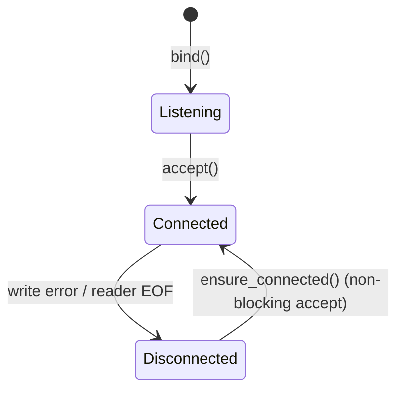

# Wire Protocol -- Architecture

> spec/10-protocol.md의 구현 상세. Wire format, Transport trait 구현체, 연결 수명주기, 타이밍 상수를 기술한다.

## 1. Wire Format

### 설계 결정

모든 메시지는 length-prefixed JSON으로 직렬화한다. 프레이밍 형식은 Engine측과 Manager측에서 동일하다.

```
+──────────────+──────────────────────────+
│ 4 bytes BE   │ UTF-8 JSON payload       │
│ u32 length   │ (serde_json compact)     │
+──────────────+──────────────────────────+
```

### 핵심 함수 (Engine측)

```rust
// engine/src/resilience/transport.rs

/// Read a length-prefixed JSON message from reader.
fn read_length_prefixed<R: Read, T: DeserializeOwned>(reader: &mut R) -> Result<T, TransportError>;

/// Write a length-prefixed JSON message to writer.
fn write_length_prefixed<W: Write, T: Serialize>(writer: &mut W, msg: &T) -> Result<(), TransportError>;
```

**Pre-condition**: `reader`/`writer`가 유효한 스트림이어야 한다.
**Post-condition**: `read_length_prefixed`는 payload 크기가 `MAX_PAYLOAD_SIZE`를 초과하면 `ParseError`를 반환한다.

### 페이로드 크기 가드

```rust
const MAX_PAYLOAD_SIZE: u32 = 64 * 1024;  // 64KB
```

- Engine측: `read_length_prefixed()`에서 `len > MAX_PAYLOAD_SIZE` 시 `ParseError` 반환
- **Manager측: 크기 가드 미구현** — `read_engine_message()`에 검증 없음 (spec 대비 차이)

### 직렬화 전략

- `serde_json::to_vec()` — compact JSON (pretty print 없음)
- 필드명은 Rust struct 필드의 snake_case를 그대로 사용 (rename 없음)
- Enum tagging 전략은 arch/11-protocol-messages.md에서 상세 기술

### Spec 매핑

PROTO-010 (와이어 포맷), PROTO-012 (페이로드 크기 가드), PROTO-020~026 (직렬화), INV-020~021 (seq_id 단조 증가)

---

## 2. Transport trait 및 구현체

### 설계 결정

Engine측은 `Transport` trait으로 전송 매체를 추상화한다. Manager측은 `Emitter` + `EngineReceiver` trait 조합으로 양방향 통신을 추상화한다 (ISP 준수).

### Engine측 Transport

```rust
// engine/src/resilience/transport.rs
pub trait Transport: Send + 'static {
    fn connect(&mut self) -> Result<(), TransportError>;
    fn recv(&mut self) -> Result<ManagerMessage, TransportError>;
    fn send(&mut self, msg: &EngineMessage) -> Result<(), TransportError>;
    fn name(&self) -> &str;
}
```

#### TransportError

```rust
pub enum TransportError {
    ConnectionFailed(String),  // connect() 실패
    Disconnected,              // EOF, 상대측 연결 종료
    ParseError(String),        // JSON 파싱 실패, 페이로드 크기 초과
    Io(std::io::Error),        // 기타 I/O 오류
}
```

#### 구현체 상세

| 구현체 | 초기화 | connect() 동작 | 비고 |
|--------|--------|---------------|------|
| `UnixSocketTransport` | `new(path: PathBuf)` | `UnixStream::connect(path)` → reader/writer 분리 (`try_clone`) | `#[cfg(unix)]` |
| `TcpTransport` | `new(addr: String)` | `TcpStream::connect(addr)` → reader/writer 분리 | Android SELinux 환경용 |
| `DbusTransport` | `new()` | `zbus::blocking::Connection::system()` + proxy + signal iterator | `#[cfg(feature = "resilience")]` |
| `MockTransport` | `channel()` / `bidirectional()` / `from_messages(msgs)` | no-op (항상 Ok) | 테스트 전용 |

### Manager측 Channel

| 구현체 | 모듈 | 초기화 |
|--------|------|--------|
| `UnixSocketChannel` | `manager/src/channel/unix_socket.rs` | `new(socket_path: &Path)` → `UnixListener::bind()` + `set_nonblocking(true)` |
| `TcpChannel` | `manager/src/channel/tcp.rs` | `new(addr: &str)` → `TcpListener::bind()` + `set_nonblocking(true)` |
| `DbusEmitter` | `manager/src/emitter/dbus.rs` | `new()` → `zbus::blocking::Connection::system()` + `request_name("org.llm.Manager1")` |

### MessageLoop (Engine측 메시지 루프)

```rust
// engine/src/resilience/transport.rs
pub struct MessageLoop;

impl MessageLoop {
    pub fn spawn<T: Transport>(transport: T) -> Result<(
        mpsc::Receiver<ManagerMessage>,  // cmd_rx: 수신 명령
        mpsc::Sender<EngineMessage>,     // resp_tx: 응답 전송
        JoinHandle<()>,                  // 스레드 핸들
    ), TransportError>;
}
```

**처리 흐름**:
1. `transport.connect()` 호출
2. 별도 스레드에서 `run_loop()` 실행
3. 루프: pending 응답 `try_recv` drain → blocking `transport.recv()` → `cmd_tx.send()`
4. `ParseError` → warn 로그 + continue (연결 유지)
5. `Disconnected` / 기타 에러 → 루프 종료

### Spec 매핑

PROTO-030 (Unix), PROTO-031 (TCP), PROTO-032 (D-Bus), PROTO-036 (Mock)

---

## 3. Connection Lifecycle

### 설계 결정

Manager가 서버 역할, Engine이 클라이언트 역할을 한다. Manager측 채널은 3-상태 FSM으로 연결 상태를 관리한다.



### Manager측 연결 관리

```rust
// manager/src/channel/unix_socket.rs
enum ConnectionState {
    Listening,
    Connected { writer: UnixStream, inbox: mpsc::Receiver<EngineMessage>, _reader: ReaderHandle },
    Disconnected,
}
```

| 메서드 | Pre-condition | 동작 | Post-condition |
|--------|-------------|------|---------------|
| `wait_for_client(timeout, shutdown)` | Listening | 블로킹 accept (100ms 폴링) | Connected 또는 timeout |
| `ensure_connected()` | Disconnected | non-blocking accept 시도 | Connected 또는 Disconnected 유지 |
| `transition_to_connected(stream)` | any | writer `try_clone`, reader thread spawn, `sync_channel(64)` | Connected |

Connected 전이 시 reader 스레드가 `spawn_reader(stream, inbox_tx)` 로 생성된다. Reader는 blocking `read_engine_message()` 루프를 실행하며, EOF/에러 시 자연 종료하여 inbox_tx가 drop되고, `try_recv()`에서 `Disconnected`를 반환한다.

### Engine측 연결 관리

- `Transport::connect()` 호출 — 실패 시 `ConnectionFailed` 반환
- 연결 후 `CommandExecutor::send_capability()` 1회 호출 (INV-015)
- MessageLoop 내에서 `Disconnected` 감지 시 스레드 종료

### Spec 매핑

PROTO-040 (Manager=서버), PROTO-042 (3-state), PROTO-043 (연결 실패), PROTO-044 (Capability 전송), PROTO-045 (ensure_connected)

---

## 4. 타이밍 상수

### 설계 결정

모든 타이밍 값은 현재 하드코딩되어 있다.

| 상수 | 값 | 위치 | 역할 | spec 근거 |
|------|---|------|------|----------|
| `heartbeat_interval` | 1000ms | `CommandExecutor::new()` 인자 | Heartbeat 전송 주기 | PROTO-070 |
| `MAX_PAYLOAD_SIZE` | 64KB | `engine/src/resilience/transport.rs` | 페이로드 크기 가드 | PROTO-012 |
| `sync_channel` 용량 | 64 | `manager/src/channel/{unix_socket,tcp}.rs` | Reader→Main 배압 | PROTO-071 |
| `recv_timeout` | 50ms | `manager/src/main.rs` | Monitor 신호 대기 | PROTO-072 |
| `client_timeout` | 60초 | CLI `--client-timeout` | 클라이언트 연결 대기 | PROTO-040 |

---

## 5. 예외 처리

| 에러 상황 | Engine 동작 | Manager 동작 |
|----------|------------|-------------|
| JSON 파싱 실패 | MessageLoop: warn 로그 + continue | Reader: 에러 로그 + 루프 종료 |
| 페이로드 크기 초과 | `ParseError` 반환 | **미구현** |
| EOF (상대측 종료) | `Disconnected` → MessageLoop 종료 | inbox Disconnected → 상태 전이 |
| 쓰기 에러 | MessageLoop 종료 | Connected → Disconnected 전이 |
| 연결 실패 | `ConnectionFailed` → 추론 독립 실행 (fail-open) | 프로세스 종료 또는 재시도 |

---

## 6. 코드-스펙 차이

| 항목 | spec | 코드 | 비고 |
|------|------|------|------|
| Manager측 페이로드 크기 가드 | PROTO-012 권장 | 미구현 | Engine측만 64KB 가드 |
| Seq ID 카운터 | INV-020 프로세스 수명 | Manager: `AtomicU64`, D-Bus: 자체 카운터 | 일치 |

---

## 7. CLI

| 플래그 | 설명 | 기본값 | spec 근거 |
|--------|------|--------|----------|
| `--resilience-transport` (Engine) | 전송 매체 선택 | `dbus` | PROTO-033 |
| `--transport` (Manager) | 전송 매체 선택 | `dbus` | PROTO-033 |
| `--client-timeout` (Manager) | 클라이언트 대기 타임아웃(초) | `60` | PROTO-040 |