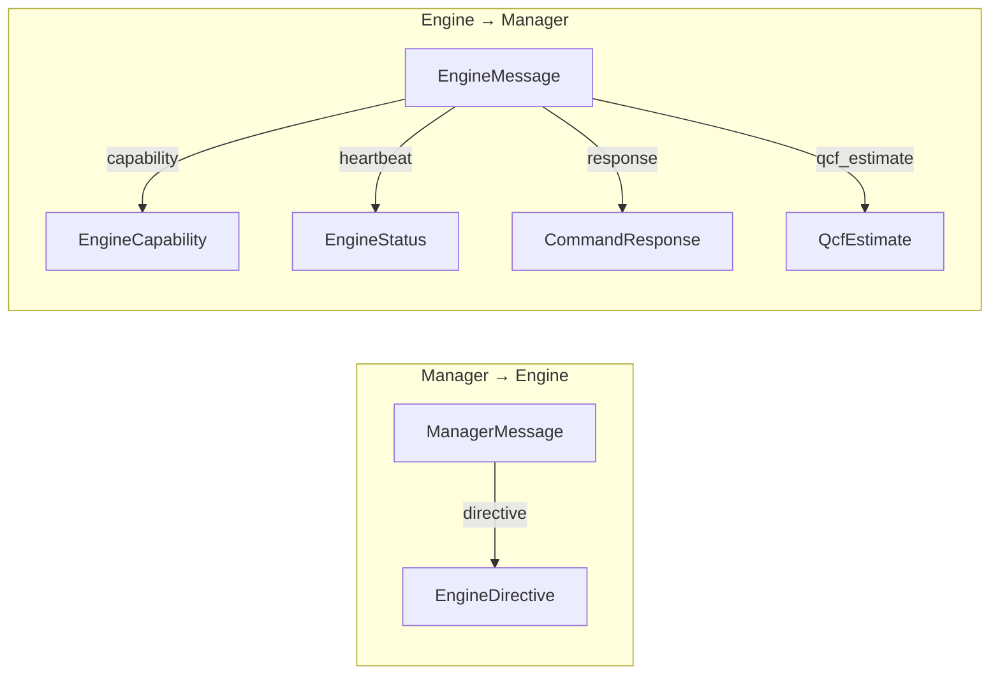

# Protocol Messages -- Architecture

> spec/11-protocol-messages.md의 구현 상세. 모든 메시지 타입은 `shared/src/lib.rs` 단일 파일에 정의되어 있다. EngineDirective/EngineCommand, EngineMessage/EngineStatus, SystemSignal, serde 직렬화 전략을 기술한다.

## 1. Envelope Types (최상위 메시지)

### 설계 결정

Manager→Engine, Engine→Manager 방향 각각에 하나의 enum wrapper를 두어 메시지 종류를 구분한다.
internally tagged (`"type"` 키) + snake_case 전략을 일관 사용한다.



### ManagerMessage

```rust
#[serde(tag = "type", rename_all = "snake_case")]
pub enum ManagerMessage {
    Directive(EngineDirective),
}
```

현재 1종 변형만 존재. 향후 확장 가능하도록 enum으로 정의.

### EngineMessage

```rust
#[serde(tag = "type", rename_all = "snake_case")]
pub enum EngineMessage {
    Capability(EngineCapability),
    Heartbeat(EngineStatus),
    Response(CommandResponse),
    QcfEstimate(QcfEstimate),
}
```

### QcfEstimate (MSG-085~087)

```rust
pub struct QcfEstimate {
    pub estimates: HashMap<String, f32>,
}
```

Engine이 RequestQcf에 대한 응답으로 전송. `estimates` keys는 현재 계산 가능한 lossy action 한정 (MSG-086). 값은 ≥ 0.0 (MSG-087).

4종 변형. spec MSG-085~087에 명세된 `QcfEstimate` 포함.

### Spec 매핑

MSG-010 (ManagerMessage), MSG-011 (EngineMessage), MSG-014/085~087 (QcfEstimate)

---

## 2. EngineDirective / EngineCommand

### 설계 결정

Manager가 Engine에 내리는 명령을 배치(batch)로 전송한다. 각 Directive에 단조 증가하는 `seq_id`를 부여하여 Response와 매칭한다.

### EngineDirective

```rust
pub struct EngineDirective {
    pub seq_id: u64,
    pub commands: Vec<EngineCommand>,
}
```

**seq_id 생성**: `manager/src/pipeline.rs` — `static SEQ_COUNTER: AtomicU64::new(1)`, `fetch_add(1, Relaxed)` (INV-020, INV-021)

### EngineCommand

```rust
#[serde(tag = "type", rename_all = "snake_case")]
pub enum EngineCommand {
    // Compute 도메인
    Throttle { delay_ms: u64 },
    LayerSkip { skip_ratio: f32 },

    // Memory 도메인
    KvEvictH2o { keep_ratio: f32 },
    KvEvictSliding { keep_ratio: f32 },
    KvStreaming { sink_size: usize, window_size: usize },
    KvQuantDynamic { target_bits: u8 },

    // Query
    RequestQcf,

    // Lifecycle
    RestoreDefaults,
    SwitchHw { device: String },
    PrepareComputeUnit { device: String },
    Suspend,
    Resume,
}
```

코드에 13종 변형이 존재한다 (`RequestQcf`, `KvMergeD2o` 모두 구현 완료).

### Engine측 명령 실행

모든 명령은 `CommandExecutor::apply_command()` (`engine/src/resilience/executor.rs`)에서 처리되어 `ExecutionPlan`에 반영된다.

```rust
pub struct ExecutionPlan {
    pub evict: Option<EvictPlan>,
    pub switch_device: Option<String>,
    pub prepare_device: Option<String>,
    pub throttle_delay_ms: u64,
    pub suspended: bool,
    pub resumed: bool,
    pub layer_skip: Option<f32>,
    pub kv_quant_bits: Option<u8>,
    pub restore_defaults: bool,
}
```

| EngineCommand | ExecutionPlan 필드 | CommandResult |
|---------------|-------------------|---------------|
| `Throttle` | `throttle_delay_ms` | Ok |
| `LayerSkip` | `layer_skip` | Ok |
| `KvEvictH2o` | `evict` (EvictPlan, method=H2o) | Ok |
| `KvEvictSliding` | `evict` (EvictPlan, method=Sliding) | Ok |
| `KvStreaming` | `evict` (EvictPlan, method=Streaming, streaming_params=Some) | Ok |
| `KvQuantDynamic` | `kv_quant_bits` | Ok |
| `RequestQcf` | `request_qcf` (generate.rs에서 QCF 계산 후 QcfEstimate 전송) | Ok |
| `RestoreDefaults` | `restore_defaults`, 전체 리셋 | Ok |
| `SwitchHw` | `switch_device` | Ok |
| `PrepareComputeUnit` | `prepare_device` | Ok |
| `Suspend` | `suspended` (모든 다른 필드 override) | Ok |
| `Resume` | `resumed`, 레벨/스로틀 Normal 초기화 | Ok |

**Suspend 후처리**: Suspend가 포함된 Directive를 처리한 후, evict/switch/prepare/throttle을 모두 무효화하고 `EngineState::Suspended`로 전이한다.

### Spec 매핑

MSG-020~022 (EngineDirective), MSG-030~041 (EngineCommand)

---

## 3. EngineCapability / EngineStatus

### EngineCapability (세션당 1회 전송)

```rust
pub struct EngineCapability {
    pub available_devices: Vec<String>,
    pub active_device: String,
    pub max_kv_tokens: usize,
    pub bytes_per_kv_token: usize,
    pub num_layers: usize,
}
```

연결 직후 `CommandExecutor::send_capability()` 로 전송 (INV-015).

### EngineStatus (Heartbeat, 주기적)

```rust
pub struct EngineStatus {
    pub active_device: String,
    pub compute_level: ResourceLevel,
    pub actual_throughput: f32,            // EMA 기반 tok/s
    pub memory_level: ResourceLevel,
    pub kv_cache_bytes: u64,
    pub kv_cache_tokens: usize,
    pub kv_cache_utilization: f32,         // tokens / capacity
    pub memory_lossless_min: f32,          // 현재 항상 1.0
    pub memory_lossy_min: f32,             // protected_prefix / total_tokens
    pub state: EngineState,
    pub tokens_generated: usize,
    #[serde(default)] pub available_actions: Vec<String>,   // 실행 가능 액션
    #[serde(default)] pub active_actions: Vec<String>,       // 현재 활성 액션
    #[serde(default)] pub eviction_policy: String,           // "none", "h2o", "sliding", ...
    #[serde(default)] pub kv_dtype: String,                  // "f16", "q4", "q8", ...
    #[serde(default)] pub skip_ratio: f32,                   // 0.0 = no skip
}
```

필드 12~16에 `#[serde(default)]` 적용으로 이전 버전 JSON과 하위 호환 유지 (INV-028).

`available_actions`는 `CommandExecutor::compute_available_actions()`에서 동적으로 계산:
- 항상 포함: `"throttle"`, `"switch_hw"`, `"layer_skip"`
- eviction_policy != "none": `"kv_evict_h2o"`, `"kv_evict_sliding"` 추가
- kv_dtype가 `q`로 시작: `"kv_quant_dynamic"` 추가

### Spec 매핑

MSG-050~052 (EngineCapability), MSG-060~066 (EngineStatus)

---

## 4. CommandResponse / CommandResult

### CommandResponse

```rust
pub struct CommandResponse {
    pub seq_id: u64,
    pub results: Vec<CommandResult>,
}
```

**불변식**:
- `results.len() == directive.commands.len()` (INV-025)
- `response.seq_id == directive.seq_id` (INV-026)
- Directive당 정확히 1개 Response (INV-022)

### CommandResult

```rust
#[serde(tag = "status", rename_all = "snake_case")]
pub enum CommandResult {
    Ok,
    Partial { achieved: f32, reason: String },
    Rejected { reason: String },
}
```

### Spec 매핑

MSG-070~073 (CommandResponse), MSG-080~083 (CommandResult)

---

## 5. SystemSignal (D-Bus Legacy)

### 설계 결정

D-Bus 경로에서 Manager가 emit하는 시그널. 4종 도메인별 variant로 구성된다.
serde default externally tagged 전략 사용 (tag 키 = variant 이름).

```rust
#[serde(rename_all = "snake_case")]
pub enum SystemSignal {
    MemoryPressure { level: Level, available_bytes: u64, total_bytes: u64, reclaim_target_bytes: u64 },
    ComputeGuidance { level: Level, recommended_backend: RecommendedBackend, reason: ComputeReason, cpu_usage_pct: f64, gpu_usage_pct: f64 },
    ThermalAlert { level: Level, temperature_mc: i32, throttling_active: bool, throttle_ratio: f64 },
    EnergyConstraint { level: Level, reason: EnergyReason, power_budget_mw: u32 },
}
```

공통 `level()` 메서드: 모든 variant에서 Level을 추출한다.

### Supporting Enums

| Enum | Variant들 | 특이 사항 |
|------|----------|----------|
| `Level` | Normal, Warning, Critical, Emergency | 4단계, PartialOrd+Ord derive |
| `ResourceLevel` | Normal, Warning, Critical | 3단계 (프로토콜용, Emergency 없음) |
| `EngineState` | Idle, Running, Suspended | |
| `RecommendedBackend` | Cpu, Gpu, Any | |
| `ComputeReason` | CpuBottleneck, GpuBottleneck, CpuAvailable, GpuAvailable, BothLoaded, Balanced | |
| `EnergyReason` | BatteryLow, BatteryCritical, PowerLimit, ThermalPower, Charging, None | `None`에 `#[serde(rename = "none")]` |

모든 enum에 `from_dbus_str(&str) -> Option<Self>` 헬퍼가 구현되어 있다 (D-Bus 문자열 인자 파싱용).

### D-Bus → ManagerMessage 변환

`DbusTransport::signal_to_manager_message()` (`engine/src/resilience/dbus_transport.rs`)에서 Level별 고정 변환 테이블:

| SystemSignal | Normal | Warning | Critical | Emergency |
|-------------|--------|---------|----------|-----------|
| MemoryPressure | RestoreDefaults | KvEvictSliding(0.85) | KvEvictH2o(0.50) | Suspend |
| ComputeGuidance | RestoreDefaults | Throttle(30)+SwitchHw | Throttle(70)+SwitchHw | Suspend |
| ThermalAlert | RestoreDefaults | Throttle(30)+PrepareComputeUnit(cpu) | Throttle(70)+SwitchHw(cpu) | Suspend |
| EnergyConstraint | RestoreDefaults | SwitchHw(cpu) | SwitchHw(cpu)+Throttle(70) | Suspend |

### Spec 매핑

MSG-090~095 (Supporting Enums), MSG-100~104 (SystemSignal)

---

## 6. serde 직렬화 전략

### 설계 결정

모든 프로토콜 메시지에 일관된 serde 어노테이션 패턴을 적용한다. serde 어노테이션 변경은 프로토콜 버전 변경과 동일하게 취급한다 (INV-027). 새 필드 추가 시 `#[serde(default)]` 필수 (INV-028).

| 타입 | serde 전략 | tag 키 |
|------|-----------|--------|
| `ManagerMessage` | internally tagged | `"type"` |
| `EngineMessage` | internally tagged | `"type"` |
| `EngineCommand` | internally tagged | `"type"` |
| `CommandResult` | internally tagged | `"status"` |
| `SystemSignal` | externally tagged (serde 기본) | variant 이름 |
| 기타 enum | `rename_all = "snake_case"` | — |
| 기타 struct | 필드명 그대로 | — |

### 하위 호환 규칙

- 새 필드 추가: `#[serde(default)]` 필수 → 이전 버전 JSON이 역직렬화 가능
- 필드 제거 / 이름 변경: **금지** (CON-020)
- 새 enum variant 추가: 수신측에서 unknown variant를 무시하거나 에러 처리해야 함

### Spec 매핑

CON-020 (필드명 불변), CON-021 (하위 호환 확장), INV-027 (serde = wire format), INV-028 (default 필수)

---

## 7. 코드-스펙 차이

| 항목 | spec | 코드 | 비고 |
|------|------|------|------|
| ~~QcfEstimate 메시지~~ | ~~MSG-085~087~~ | ~~미정의~~ | **구현 완료** |
| EngineMessage 변형 수 | 4종 | 4종 (Capability, Heartbeat, Response, QcfEstimate) | 일치 |
| ~~KvStreaming 실행~~ | ~~정상 처리 기대~~ | ~~`Rejected` 반환~~ | **해소됨** — 구현 완료, Ok 반환 |