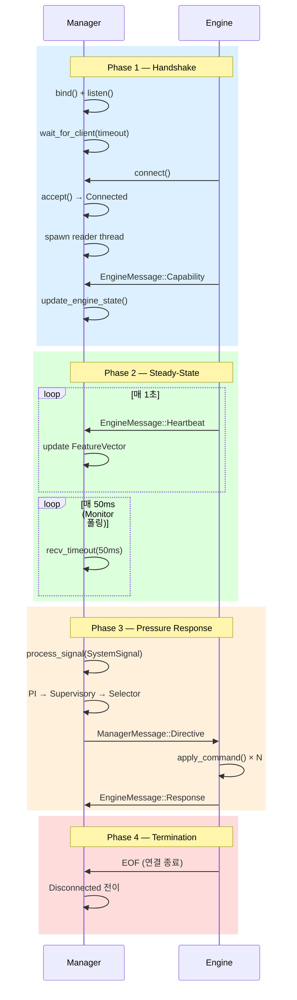
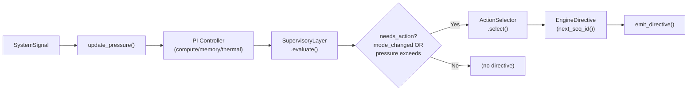
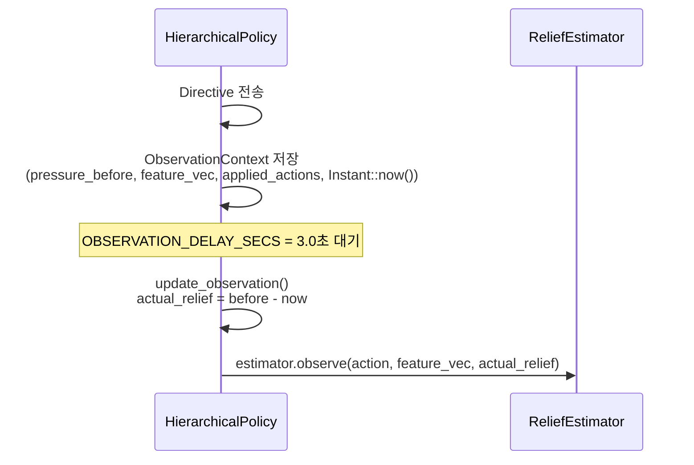
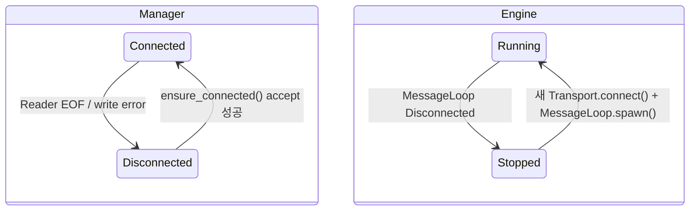
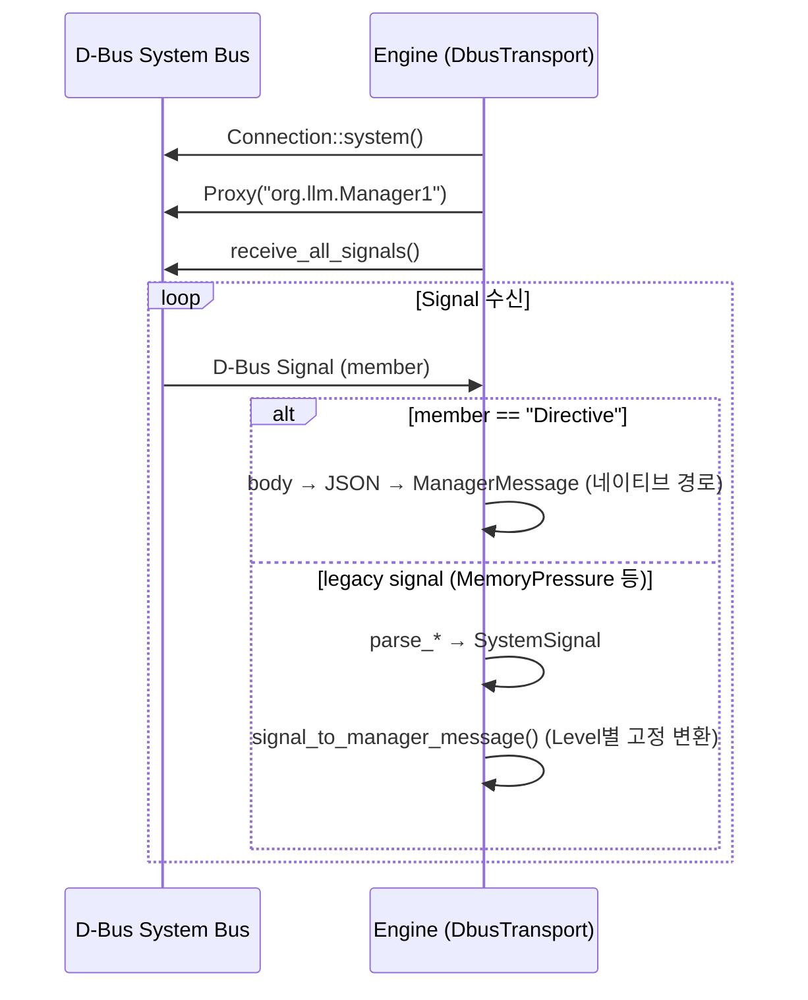

# Protocol Sequences -- Architecture

> spec/12-protocol-sequences.md의 구현 상세. 세션 수명주기, Pressure Escalation, Observation & Relief, D-Bus 시퀀스를 기술한다.

## 1. 세션 수명주기

### 설계 결정

세션은 4개 Phase로 구성된다. Manager가 서버(bind+listen), Engine이 클라이언트(connect)이다.



### Phase 1: Handshake

| 단계 | Manager 코드 | Engine 코드 |
|------|------------|------------|
| 서버 바인드 | `UnixSocketChannel::new(path)` → `bind()` + `set_nonblocking(true)` | — |
| 클라이언트 대기 | `wait_for_client(timeout, shutdown)` — 100ms 폴링 루프 | — |
| 연결 | accept → `transition_to_connected(stream)` | `Transport::connect()` |
| Reader spawn | `spawn_reader(stream, inbox_tx)` — `sync_channel(64)` | — |
| Capability 전송 | `update_engine_state(EngineMessage::Capability)` | `CommandExecutor::send_capability()` (INV-015, 세션당 1회) |

### Phase 2: Steady-State

Manager 메인 루프 (`manager/src/main.rs`):

```
loop {
    1. SHUTDOWN 확인
    2. Engine 메시지 drain: while let Some(msg) = try_recv_engine_message()
       - Heartbeat → update_engine_state()
       - Response → 로그
       - Capability → 로그
    3. Monitor 신호 대기: recv_timeout(50ms)
       - Signal → process_signal() → emit_directive()
       - Timeout → continue
       - Disconnected → break
}
```

Engine 측 (`CommandExecutor::poll()`, 토큰 생성당 1회):
1. Heartbeat 주기 확인 → `send_heartbeat(kv_snap)` (1초 간격)
2. `cmd_rx.try_recv()` drain → `apply_command()` × N
3. Response 전송

### Phase 3: Pressure Response

상세는 섹션 2 "Pressure Escalation 시퀀스" 참조.

### Phase 4: Termination

- Engine 종료 → stream EOF → Reader 스레드 종료 → inbox_tx drop → `try_recv()` Disconnected → 상태 전이
- Manager 종료: `SHUTDOWN.store(true)` → Monitor join → `policy.save_model()` → exit

### Spec 매핑

SEQ-010~013 (Phase 1~4), SEQ-020~025 (Handshake), SEQ-030~035 (Steady-State)

---

## 2. Pressure Escalation 시퀀스

### 설계 결정

SystemSignal 입력에서 EngineDirective 출력까지의 6단계 파이프라인.



### 처리 흐름 상세

| 단계 | 함수/모듈 | 입력 | 출력 |
|------|----------|------|------|
| 1. Signal 수신 | `manager/src/main.rs` | `SystemSignal` | — |
| 2. Pressure 갱신 | `HierarchicalPolicy::update_pressure()` | signal → PI output | `PressureVector` |
| 3. Mode 결정 | `SupervisoryLayer::evaluate()` | `&PressureVector` | `OperatingMode` |
| 4. Action 필요성 | `HierarchicalPolicy::process_signal()` | mode_changed / pressure 초과 | `bool` |
| 5. Action 선택 | `ActionSelector::select()` | 모드, pressure, feature_vec, relief 예측 | `Vec<ActionCommand>` |
| 6. Directive 생성 | `next_seq_id()` → `EngineDirective` | commands | — |

### Engine측 Directive 처리

```rust
// engine/src/resilience/executor.rs
pub fn poll(&mut self, kv_snap: &KVSnapshot) -> ExecutionPlan {
    // 1. Heartbeat (주기적)
    // 2. cmd_rx.try_recv() drain → directives
    // 3. 각 directive의 commands에 대해 apply_command() → results
    // 4. CommandResponse 전송 (INV-022: directive당 1개)
    // 5. Suspend 후처리 (모든 다른 필드 override)
}
```

**불변식**:
- Directive당 정확히 1개 CommandResponse (INV-022)
- `response.seq_id == directive.seq_id` (INV-023)
- `results.len() == commands.len()` (INV-024)

### Spec 매핑

SEQ-040~049 (Pressure Escalation)

---

## 3. Observation & Relief 시퀀스

### 설계 결정

Directive를 전송한 후, 일정 시간이 지난 뒤 실제 pressure 변화를 관측하여 온라인 학습에 피드백한다.



### ObservationContext

```rust
// manager/src/pipeline.rs
struct ObservationContext {
    pressure_before: PressureVector,
    feature_vec: FeatureVector,
    applied_actions: Vec<ActionId>,
    applied_at: Instant,
}
```

- `OBSERVATION_DELAY_SECS = 3.0` (하드코딩)
- 다음 `process_signal()` 호출 시 `applied_at` 경과 시간 확인 → 3초 이상이면 관측 수행

### De-escalation

| 조건 | 동작 | 함수 |
|------|------|------|
| 이전 mode > 현재 mode | lossy 액션 해제 | `build_lossy_release_directive()` → RestoreDefaults |
| Normal 복귀 | 전체 복원 | `build_restore_directive()` → RestoreDefaults |

### Spec 매핑

SEQ-050~054 (Observation & Relief), SEQ-060~064 (De-escalation)

---

## 4. 재연결 시퀀스

### 설계 결정

Manager는 Disconnected 상태에서 non-blocking accept으로 재연결을 시도한다.
Engine MessageLoop는 Disconnected 시 스레드를 종료한다.
Seq ID는 프로세스 수명 동안 리셋하지 않는다 (INV-020).



| 단계 | Manager | Engine |
|------|---------|--------|
| 감지 | Reader EOF → inbox Disconnected → 상태 전이 | `recv()` → `Disconnected` → 루프 종료 |
| 재연결 시도 | `ensure_connected()` — 다음 `emit()` 호출 시 non-blocking accept | (Engine 측 재연결은 별도 메커니즘 필요) |
| 성공 | 새 Reader spawn, `sync_channel(64)` | 새 Capability 전송 (INV-015) |
| Seq ID | `SEQ_COUNTER` 리셋 없음 | — |

### Spec 매핑

SEQ-070~075 (Reconnection)

---

## 5. D-Bus 시퀀스

### 설계 결정

D-Bus 경로는 Engine이 `org.llm.Manager1` 인터페이스의 시그널을 수신하는 단방향 구조이다.
Engine → Manager 응답은 best-effort D-Bus method call로 전송한다 (보장 없음).



### D-Bus 상수

| 상수 | 값 |
|------|---|
| Well-known name | `org.llm.Manager1` |
| Object path | `/org/llm/Manager1` |
| Interface | `org.llm.Manager1` |

### D-Bus용 Seq ID

`DbusTransport` 자체 `next_seq_id: u64` (초기값 1) — Manager의 `SEQ_COUNTER`와 독립.

### Spec 매핑

SEQ-100~104 (D-Bus Sequence)

---

## 6. 배압 (Backpressure) 메커니즘

### 설계 결정

| 위치 | 메커니즘 | 효과 |
|------|---------|------|
| Reader → Main (Manager) | `sync_channel(64)` | 채널 만원 시 Reader thread 블로킹 (자연적 배압) |
| Main Engine drain | `try_recv` 반복 | 큐에 쌓인 메시지 즉시 소비, 마지막 Heartbeat만 유효 |
| Engine `poll()` | `try_recv` 반복 | 다중 Directive drain, 각각 별도 Response |
| Monitor → Main | unbounded `mpsc::channel()` | Monitor 블로킹 방지 (Monitor가 시스템 상태 수집에 지연 없도록) |

### QCF Request 시퀀스

Manager가 Critical 모드 전환 시 `RequestQcf` Directive를 전송 → Engine이 QCF 계산 후 Response(Ok) + QcfEstimate 전송 → Manager의 Selector가 lossy 액션 비용으로 사용.

**구현 완료**: Critical 전환 → RequestQcf 전송 (SEQ-095) → Engine Response(Ok) + QcfEstimate (SEQ-096) → ActionSelector에 real QCF 사용 (SEQ-097) → 1초 타임아웃 시 default_cost 폴백 (SEQ-098).

### Spec 매핑

SEQ-090~093 (Backpressure), SEQ-095~098 (QCF Request)

---

## 7. 예외 처리

| 에러 시퀀스 | Engine 동작 | Manager 동작 | spec |
|-----------|------------|-------------|------|
| JSON 파싱 실패 | MessageLoop: warn + continue (연결 유지) | Reader: 에러 로그 + 루프 종료 | SEQ-080 |
| 페이로드 초과 | `ParseError` (Engine측만 구현) | **미구현** | SEQ-081 |
| Write 에러 | MessageLoop 종료 | Connected → Disconnected, 에러 미전파 | SEQ-082 |
| Heartbeat 타임아웃 | — | **미구현** (제안: 3초) | SEQ-087 |
| Response 타임아웃 | — | **미구현** (제안: 500ms) | SEQ-088 |

---

## 8. 코드-스펙 차이

| 항목 | spec | 코드 | 비고 |
|------|------|------|------|
| Manager측 페이로드 가드 | SEQ-081 | 미구현 | Engine측만 64KB 검증 |
| Heartbeat 타임아웃 | SEQ-087 | 미구현 | docs/37 제안: 3초 |
| Response 타임아웃 | SEQ-088 | 미구현 | docs/37 제안: 500ms |
| ~~QcfEstimate 타임아웃~~ | ~~SEQ-098~~ | ~~미구현~~ | **구현 완료** (1초 타임아웃 + default_cost 폴백) |
| ~~QcfEstimate 구조체~~ | ~~MSG-014~~ | ~~미정의~~ | **구현 완료** (EngineMessage::QcfEstimate) |

---

## 9. CLI

| 플래그 | 설명 | 기본값 | spec 근거 |
|--------|------|--------|----------|
| `--client-timeout` (Manager) | 클라이언트 대기 타임아웃(초) | 60 | SEQ-020 |
| `--enable-resilience` (Engine) | Resilience 활성화 (Handshake 전제) | false | SEQ-010 |
| `--resilience-transport` (Engine) | 전송 매체 | `dbus` | SEQ-100 |

---

## 10. 타이밍 상수

| 상수 | 값 | 위치 | spec |
|------|---|------|------|
| Heartbeat 주기 | 1000ms | `CommandExecutor` 인자 | SEQ-030 |
| Observation delay | 3.0초 | `OBSERVATION_DELAY_SECS` | SEQ-051 |
| Reader→Main 배압 | 64 (sync_channel) | channel/{unix_socket,tcp}.rs | SEQ-090 |
| Monitor 폴링 | 50ms (recv_timeout) | `manager/src/main.rs` | SEQ-032 |
| Client timeout | 60초 (CLI) | `--client-timeout` | SEQ-020 |