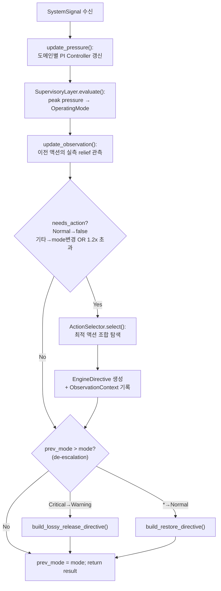
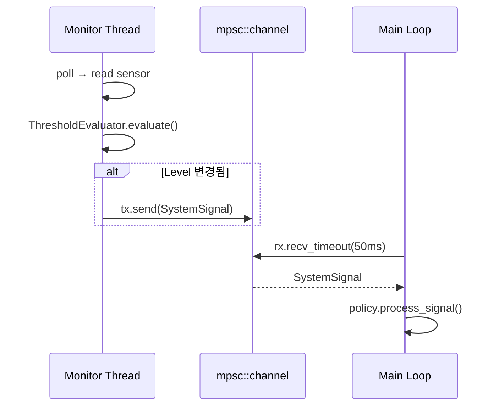
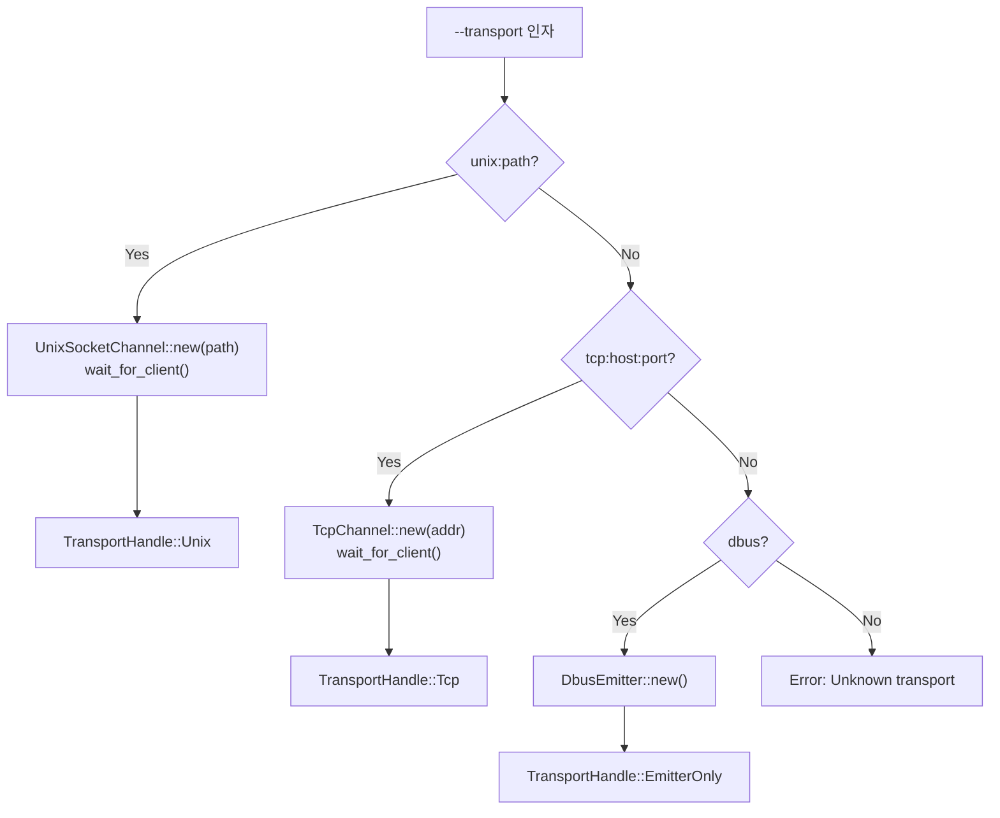
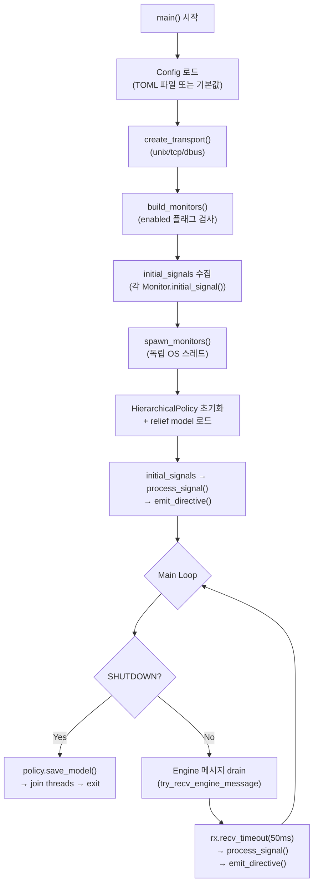

# Manager Overview -- Architecture

> spec/20-manager.md의 구현 상세. 컴포넌트 중심으로 기술한다.

## 1. HierarchicalPolicy -- 3-layer 정책 파이프라인 오케스트레이터

| spec ID | 설명 |
|---------|------|
| MGR-012, MGR-023, MGR-024, MGR-029, MGR-030 | 정책 파이프라인 |

### 설계 결정

- `PolicyStrategy` 트레이트로 정책 구현을 추상화한다. `HierarchicalPolicy`는 유일한 구현체이지만, 트레이트 기반이므로 규칙 기반 정책 등 대체 구현이 가능하다.
- PI Controller 3개(compute, memory, thermal)를 독립 운영하여 도메인별 pressure를 산출한다.
- `EnergyConstraint` 신호는 독립 PI가 아니라 compute PI에 0.5 가중치로 보조 기여한다.
- 액션 효과 관측(observation)은 `OBSERVATION_DELAY_SECS = 3.0`초 대기 후 실측 relief를 계산한다.

### 인터페이스

```rust
// manager/src/pipeline.rs

pub trait PolicyStrategy: Send {
    fn process_signal(&mut self, signal: &SystemSignal) -> Option<EngineDirective>;
    fn update_engine_state(&mut self, msg: &EngineMessage);
    fn mode(&self) -> OperatingMode;
    fn save_model(&self) {}
}

pub struct HierarchicalPolicy { /* ... */ }

impl HierarchicalPolicy {
    pub fn new(config: &PolicyConfig) -> Self;
    pub fn set_relief_model_path(&mut self, path: String);
    pub fn set_dt(&mut self, dt: f32);
    pub fn pressure(&self) -> &PressureVector;
}
```

**Pre/Post conditions for `process_signal`**:
- **Pre**: `signal`은 유효한 `SystemSignal` 변형 (MemoryPressure, ThermalAlert, ComputeGuidance, EnergyConstraint).
- **Post**: Normal 모드이면 `None` 반환. Warning/Critical 모드에서 모드 변경 또는 pressure 1.2x 초과 시 `Some(EngineDirective)` 반환. 모드 하강 시 de-escalation directive 발행.

### 처리 흐름



### 예외 처리

- `EnergyConstraint`: `level_to_measurement(level)` 함수로 Level enum을 0.0~1.0 측정값으로 이산 변환 후 0.5 가중치 적용.
- `elapsed_dt()`: 첫 신호 시 기본 dt(0.1초) 사용. 결과는 `[0.001, 10.0]` clamp.
- `ActionCommand → EngineCommand` 변환 시 `Operation::Release`는 `None` 반환 (restore directive에서 일괄 처리).

## 2. Monitor trait -- 센서 인터페이스

| spec ID | 설명 |
|---------|------|
| MGR-014~020 | Monitor trait + 4+1 구현체 |

### 설계 결정

- 각 Monitor는 데이터 소스, 평가 로직, 신호 구성을 완전히 소유한다. Manager는 단순 signal bus 역할.
- 모든 Monitor는 독립 OS 스레드에서 실행된다 (`std::thread`, async 없음).
- `ThresholdEvaluator`를 내장하여 히스테리시스 기반 레벨 변경 감지 시에만 신호를 전송한다.
- `ExternalMonitor`는 임계값 평가 없이 외부 신호를 직접 전달한다 (연구/테스트 전용).

### 인터페이스

```rust
// manager/src/monitor/mod.rs

pub trait Monitor: Send + 'static {
    fn run(
        &mut self,
        tx: mpsc::Sender<SystemSignal>,
        shutdown: Arc<AtomicBool>,
    ) -> anyhow::Result<()>;

    fn initial_signal(&self) -> Option<SystemSignal>;
    fn name(&self) -> &str;
}
```

### 구현체

| 구현체 | 모듈 | 데이터 소스 | 방향 | 신호 타입 |
|--------|------|-----------|------|----------|
| `MemoryMonitor` | `monitor/memory.rs` | `/proc/meminfo` | Descending | `MemoryPressure` |
| `ThermalMonitor` | `monitor/thermal.rs` | `/sys/class/thermal/` | Ascending | `ThermalAlert` |
| `ComputeMonitor` | `monitor/compute.rs` | `/proc/stat` CPU delta | Ascending | `ComputeGuidance` |
| `EnergyMonitor` | `monitor/energy.rs` | `/sys/class/power_supply/` | Descending | `EnergyConstraint` |
| `ExternalMonitor` | `monitor/external.rs` | stdin / unix socket / tcp | N/A | 모든 타입 (pass-through) |

### Monitor → Main Loop 통신



## 3. PolicyStrategy trait -- 정책 추상화

| spec ID | 설명 |
|---------|------|
| MGR-023 | PolicyStrategy trait 정의 |

### 설계 결정

- Strategy 패턴으로 정책 교체를 지원한다.
- `update_engine_state()`는 Engine heartbeat에서 13차원 `FeatureVector`를 갱신한다.
- `save_model()`은 기본 no-op이며, `HierarchicalPolicy`만 relief model을 저장한다.

### FeatureVector 매핑 (13차원)

| 인덱스 | 이름 | 소스 필드 | 정규화 |
|--------|------|----------|--------|
| 0 | `KV_OCCUPANCY` | `kv_cache_utilization` | 0.0~1.0 그대로 |
| 1 | `IS_GPU` | `active_device` | "opencl" 포함 시 1.0 |
| 2 | `TOKEN_PROGRESS` | `kv_cache_tokens` | / 2048.0, min 1.0 |
| 5 | `TBT_RATIO` | `actual_throughput` | / 100.0, clamp [0,1] |
| 6 | `TOKENS_GENERATED_NORM` | `tokens_generated` | / 2048.0, min 1.0 |
| 10 | `ACTIVE_EVICTION` | `eviction_policy` | 비어있지 않고 "none" 아니면 1.0 |
| 11 | `ACTIVE_LAYER_SKIP` | `skip_ratio` | > 0 이면 1.0 |

## 4. Emitter -- Transport 선택, Directive/Response 처리

| spec ID | 설명 |
|---------|------|
| MGR-031, MGR-032, MGR-033, MGR-034, MGR-043 | Emitter + EngineReceiver + Transport |

### 설계 결정

- **ISP (Interface Segregation)**: `Emitter` (Manager→Engine 전송)과 `EngineReceiver` (Engine→Manager 수신)을 별도 trait으로 분리한다. `DbusEmitter`처럼 수신 불가한 구현체는 `EngineReceiver`를 구현하지 않는다.
- `EngineChannel = Emitter + EngineReceiver` 조합 trait을 블랭킷 구현으로 제공한다.
- main.rs의 `TransportHandle` enum이 unix/tcp/dbus 분기를 캡슐화한다.
- 클라이언트 미연결 시 emit은 no-op (치명적이지 않음).

### 인터페이스

```rust
// manager/src/emitter/mod.rs
pub trait Emitter: Send {
    fn emit(&mut self, signal: &SystemSignal) -> anyhow::Result<()>;
    fn emit_initial(&mut self, signals: &[SystemSignal]) -> anyhow::Result<()>;
    fn emit_directive(&mut self, directive: &EngineDirective) -> anyhow::Result<()>;
    fn name(&self) -> &str;
}

// manager/src/channel/mod.rs
pub trait EngineReceiver: Send {
    fn try_recv(&mut self) -> anyhow::Result<Option<EngineMessage>>;
    fn is_connected(&self) -> bool;
}
pub trait EngineChannel: Emitter + EngineReceiver {}
impl<T: Emitter + EngineReceiver> EngineChannel for T {}
```

### 구현체

| 구현체 | 모듈 | Emitter | EngineReceiver | Wire format |
|--------|------|---------|----------------|-------------|
| `UnixSocketChannel` | `channel/unix_socket.rs` | O | O | Length-prefixed JSON (4-byte BE u32 + UTF-8) |
| `TcpChannel` | `channel/tcp.rs` | O | O | Length-prefixed JSON (동일) |
| `UnixSocketEmitter` | `emitter/unix_socket.rs` | O | X | Length-prefixed JSON (레거시, 단방향) |
| `DbusEmitter` | `emitter/dbus.rs` | O | X | D-Bus System Bus (`#[cfg(feature = "dbus")]`) |

### Transport 선택 (main.rs `create_transport()`)



## 5. ActionRegistry -- 액션 메타데이터 관리

| spec ID | 설명 |
|---------|------|
| MGR-028 | ActionRegistry 초기화 + 조회 |

### 설계 결정

- `PolicyConfig`에서 초기화하며, 알 수 없는 액션 이름은 무시한다.
- `exclusion_groups`로 상호 배타적 액션 조합을 관리한다 (예: `kv_evict_sliding`과 `kv_evict_h2o`).
- `default_cost` 필드는 QCF 비용 proxy로 사용된다 (Engine 미연결 시 fallback).

### 인터페이스

```rust
// manager/src/action_registry.rs

pub struct ActionRegistry { /* ... */ }

impl ActionRegistry {
    pub fn from_config(config: &PolicyConfig) -> Self;
    pub fn get(&self, action: &ActionId) -> Option<&ActionMeta>;
    pub fn all_actions(&self) -> impl Iterator<Item = &ActionMeta>;
    pub fn lossy_actions(&self) -> Vec<ActionId>;
    pub fn lossless_actions(&self) -> Vec<ActionId>;
    pub fn exclusion_groups(&self) -> &HashMap<String, Vec<ActionId>>;
    pub fn is_excluded(&self, a: &ActionId, b: &ActionId) -> bool;
    pub fn default_cost(&self, action: &ActionId) -> f32;  // 미등록 시 1.0
}
```

### ActionId 7종

| ActionId | Kind | Domain | param_range |
|----------|------|--------|-------------|
| `SwitchHw` | config | Compute | 없음 |
| `Throttle` | config | Compute | `delay_ms` [0.0, 100.0] |
| `KvOffloadDisk` | config | Memory | 없음 |
| `KvEvictSliding` | config | Memory | `keep_ratio` [0.3, 0.9] |
| `KvEvictH2o` | config | Memory | `keep_ratio` [0.3, 0.9] |
| `KvQuantDynamic` | config | Memory | `target_bits` [4.0, 8.0] |
| `LayerSkip` | config | Compute | `skip_layers` [1.0, 8.0] |

## 6. ActionSelector -- 최적 액션 조합 선택

| spec ID | 설명 |
|---------|------|
| MGR-026 | Stateless exhaustive 탐색 |

### 설계 결정

- **Stateless**: 모든 상태는 `select()` 호출 인자로 전달된다.
- **Exhaustive 2^N 탐색**: 후보 N개에 대해 모든 조합을 평가한다. 최대 7종이므로 128 조합.
- Warning 모드에서는 lossy 액션을 후보에서 제외한다.
- `available_actions`가 비어있으면 필터링하지 않는다 (backward compat).
- Latency budget 초과 조합은 배제한다.
- 완전 해소 불가 시 coverage 최대화 best-effort를 반환한다.

### 인터페이스

```rust
// manager/src/selector.rs

pub struct ActionSelector;

impl ActionSelector {
    pub fn select(
        registry: &ActionRegistry,
        estimator: &dyn ReliefEstimator,
        pressure: &PressureVector,
        mode: OperatingMode,
        engine_state: &FeatureVector,
        qcf_values: &HashMap<ActionId, f32>,
        latency_budget: f32,
        active_actions: &[ActionId],
        available_actions: &[ActionId],
    ) -> Vec<ActionCommand>;
}
```

**파라미터 결정 규칙**: `primary_domain`의 pressure intensity에 따라 `param_range`를 선형 보간한다.
- intensity 0.0 → `range.max` (보수적)
- intensity 1.0 → `range.min` (공격적)
- 수식: `value = max - intensity * (max - min)`

## 7. ReliefEstimator -- 액션 효과 예측

| spec ID | 설명 |
|---------|------|
| MGR-027, MGR-030 | Relief 추정 + 관측 |

### 설계 결정

- Strategy 패턴으로 추정기 교체를 지원한다.
- `OnlineLinearEstimator`: 액션별 독립 RLS(Recursive Least Squares) 선형 모델.
- 관측 없는 초기 상태에서는 도메인 기반 `default_relief()` prior를 반환한다.
- JSON 직렬화로 디스크 저장/복원을 지원한다.

### 인터페이스

```rust
// manager/src/relief/mod.rs

pub trait ReliefEstimator: Send + Sync {
    fn predict(&self, action: &ActionId, state: &FeatureVector) -> ReliefVector;
    fn observe(&mut self, action: &ActionId, state: &FeatureVector, actual: &ReliefVector);
    fn save(&self, path: &Path) -> io::Result<()>;
    fn load(&mut self, path: &Path) -> io::Result<()>;
    fn observation_count(&self, action: &ActionId) -> u32;
}
```

### default_relief prior 테이블

| ActionId | compute | memory | thermal | latency |
|----------|---------|--------|---------|---------|
| SwitchHw | 0.5 | 0.0 | 0.3 | -0.1 |
| Throttle | 0.3 | 0.0 | 0.2 | -0.3 |
| KvOffloadDisk | 0.0 | 0.4 | 0.0 | -0.2 |
| KvEvictSliding | 0.0 | 0.7 | 0.0 | 0.0 |
| KvEvictH2o | 0.0 | 0.6 | 0.0 | 0.0 |
| KvQuantDynamic | 0.0 | 0.3 | 0.0 | 0.0 |
| LayerSkip | 0.3 | 0.0 | 0.1 | -0.2 |

## 8. PiController -- 도메인별 PI 제어기

### 설계 결정

- 단일 도메인의 원시 측정값(0.0~1.0)을 연속적 pressure intensity(0.0~1.0)로 변환한다.
- **단방향**: `measurement < setpoint`이면 출력 0 (완화 방향은 관여 안 함).
- Anti-windup: `can_act=false` 시 적분 동결, `integral_clamp`로 상한 제한.
- Gain scheduling: `memory_gain_zones`로 측정값 구간별 Kp를 동적 적용한다.

### 인터페이스

```rust
// manager/src/pi_controller.rs

pub struct PiController { /* ... */ }

impl PiController {
    pub fn new(kp: f32, ki: f32, setpoint: f32, integral_clamp: f32) -> Self;
    pub fn with_gain_zones(self, zones: Vec<GainZone>) -> Self;
    pub fn update(&mut self, measurement: f32, dt: f32) -> f32;
    pub fn set_can_act(&mut self, can_act: bool);
    pub fn reset_integral(&mut self);
}

pub struct GainZone {
    pub above: f32,
    pub kp: f32,
}
```

## 9. 메인 루프

| spec ID | 설명 |
|---------|------|
| MGR-035~041, MGR-045 | main loop 흐름, 초기화, 종료 |

### 처리 흐름



### 주요 설계 포인트

- **Engine 메시지 우선 drain**: `while let` 루프로 Engine 메시지를 모두 소진한 후 Monitor 신호를 처리한다.
- **recv_timeout(50ms)**: Monitor 신호가 없어도 50ms마다 Engine 메시지를 확인한다.
- **SHUTDOWN**: `static AtomicBool` + SIGINT/SIGTERM 핸들러. 종료 시 relief model 저장 후 스레드 join.
- **PolicyConfig 로드 우선순위**: CLI `--policy-config` > 메인 config의 `[policy]` 섹션 > `PolicyConfig::default()`.

## 코드-스펙 차이 (Known Divergence)

| 항목 | 스펙 | 코드 | 영향 |
|------|------|------|------|
| EnergyConstraint 처리 (MGR-029) | raw `battery_pct`에서 `m = clamp(1 - battery_pct/100, 0, 1) * 0.5` | `level_to_measurement(level) * 0.5` -- Level enum 기반 4단계 이산 변환: Normal=0.0, Warning=0.55, Critical=0.80, Emergency=1.0 | 스펙은 raw 값 직접 사용을 명세. 코드는 Level 기반 변환. 향후 raw 전환 필요 |
| ActionId 8종 (MGR-028) | 8종 (`KvMergeD2o` 포함) | 8종 (`KvMergeD2o` variant 포함) | 스펙-코드 일치 |

## Config

| config 키 | 타입 | 기본값 | spec/ 근거 |
|-----------|------|--------|-----------|
| `manager.poll_interval_ms` | u64 | 1000 | MGR-022 |
| `policy.pi_controller.compute_kp` | f32 | 1.5 | MGR-024 |
| `policy.pi_controller.compute_ki` | f32 | 0.3 | MGR-024 |
| `policy.pi_controller.compute_setpoint` | f32 | 0.70 | MGR-024 |
| `policy.pi_controller.memory_kp` | f32 | 2.0 | MGR-024 |
| `policy.pi_controller.memory_ki` | f32 | 0.5 | MGR-024 |
| `policy.pi_controller.memory_setpoint` | f32 | 0.75 | MGR-024 |
| `policy.pi_controller.thermal_kp` | f32 | 1.0 | MGR-024 |
| `policy.pi_controller.thermal_ki` | f32 | 0.2 | MGR-024 |
| `policy.pi_controller.thermal_setpoint` | f32 | 0.80 | MGR-024 |
| `policy.pi_controller.integral_clamp` | f32 | 2.0 | MGR-024 |
| `policy.selector.latency_budget` | f32 | 0.5 | MGR-026 |
| `policy.selector.algorithm` | String | "exhaustive" | MGR-026 |
| `policy.relief_model.forgetting_factor` | f32 | 0.995 | MGR-027 |
| `policy.relief_model.prior_weight` | u32 | 5 | MGR-027 |
| `policy.relief_model.storage_dir` | String | "~/.llm_rs/models" | MGR-027 |

## CLI

| 플래그 | 설명 | spec/ 근거 |
|--------|------|-----------|
| `--config` / `-c` | TOML 설정 파일 경로 (기본: `/etc/llm-manager/config.toml`) | MGR-047 |
| `--transport` / `-t` | 전송 매체 (`dbus`, `unix:<path>`, `tcp:<host:port>`) (기본: `dbus`) | MGR-043, MGR-047 |
| `--client-timeout` | Engine 연결 대기 시간, 초 (기본: 60) | MGR-047 |
| `--policy-config` | 별도 정책 설정 TOML 경로 | MGR-042, MGR-047 |

## 모듈 구조

```
manager/src/
├── main.rs                  # 바이너리 진입점, main loop, CLI, TransportHandle
├── lib.rs                   # 모듈 re-export
├── config.rs                # Config, ManagerConfig, PolicyConfig, 각 MonitorConfig,
│                            # PiControllerConfig, SupervisoryConfig, SelectorConfig,
│                            # ReliefModelConfig, ActionConfig
├── types.rs                 # ActionId(7종), ActionKind, Domain, OperatingMode,
│                            # PressureVector, ReliefVector, FeatureVector(13dim),
│                            # ActionMeta, ParamRange, ActionParams, ActionCommand, Operation
├── pipeline.rs              # PolicyStrategy trait, HierarchicalPolicy, ObservationContext
├── pi_controller.rs         # PiController, GainZone
├── supervisory.rs           # SupervisoryLayer (OperatingMode FSM)
├── selector.rs              # ActionSelector (stateless 2^N exhaustive)
├── action_registry.rs       # ActionRegistry (ActionMeta + exclusion groups)
├── evaluator.rs             # ThresholdEvaluator, Direction, Thresholds
├── monitor/
│   ├── mod.rs               # Monitor trait (run, initial_signal, name)
│   ├── memory.rs            # MemoryMonitor — /proc/meminfo, Descending
│   ├── thermal.rs           # ThermalMonitor — /sys/class/thermal/, Ascending
│   ├── compute.rs           # ComputeMonitor — /proc/stat CPU delta, Ascending
│   ├── energy.rs            # EnergyMonitor — /sys/class/power_supply/, Descending
│   └── external.rs          # ExternalMonitor — stdin/unix/tcp JSON Lines (pass-through)
├── emitter/
│   ├── mod.rs               # Emitter trait (emit, emit_initial, emit_directive, name)
│   ├── unix_socket.rs       # UnixSocketEmitter (레거시, Emitter only)
│   └── dbus.rs              # DbusEmitter (#[cfg(feature = "dbus")])
├── channel/
│   ├── mod.rs               # EngineReceiver trait, EngineChannel trait (blanket impl)
│   ├── unix_socket.rs       # UnixSocketChannel (Emitter + EngineReceiver, 양방향)
│   └── tcp.rs               # TcpChannel (Emitter + EngineReceiver, 양방향)
├── relief/
│   ├── mod.rs               # ReliefEstimator trait (predict, observe, save, load)
│   └── linear.rs            # OnlineLinearEstimator (RLS), LinearModel, default_relief()
└── bin/
    ├── mock_engine.rs       # Manager 테스트용 모의 Engine
    └── mock_manager.rs      # Engine 테스트용 모의 Manager
```

## Spec ID 매핑 요약

| spec ID | 컴포넌트 | 모듈 |
|---------|----------|------|
| MGR-010, MGR-046 | 바이너리 | `main.rs`, `Cargo.toml` |
| MGR-011, MGR-C01, MGR-C02 | 아키텍처 보증 | (크레이트 경계) |
| MGR-012, MGR-035~041, MGR-045 | 메인 루프 | `main.rs` |
| MGR-013, MGR-042~044, MGR-047 | CLI/Config | `main.rs`, `config.rs` |
| MGR-014~020 | Monitor | `monitor/` |
| MGR-021 | ThresholdEvaluator | `evaluator.rs` |
| MGR-022 | Poll interval | `config.rs` |
| MGR-023, MGR-024, MGR-029 | HierarchicalPolicy | `pipeline.rs` |
| MGR-025 | SupervisoryLayer | `supervisory.rs` |
| MGR-026 | ActionSelector | `selector.rs` |
| MGR-027, MGR-030 | ReliefEstimator | `relief/` |
| MGR-028 | ActionRegistry | `action_registry.rs` |
| MGR-031~034 | Emitter/Channel | `emitter/`, `channel/` |
| MGR-048 | Relief model persistence | `pipeline.rs` (`set_relief_model_path`, `save_model`) |