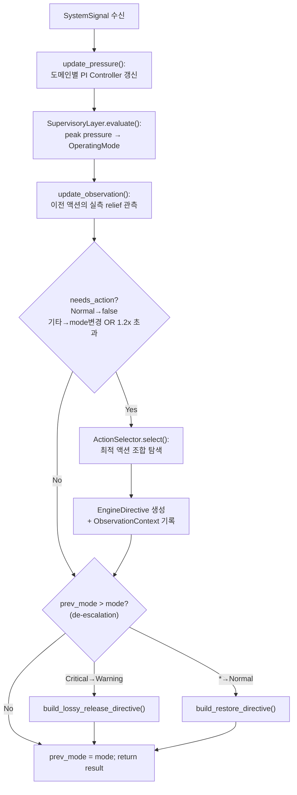
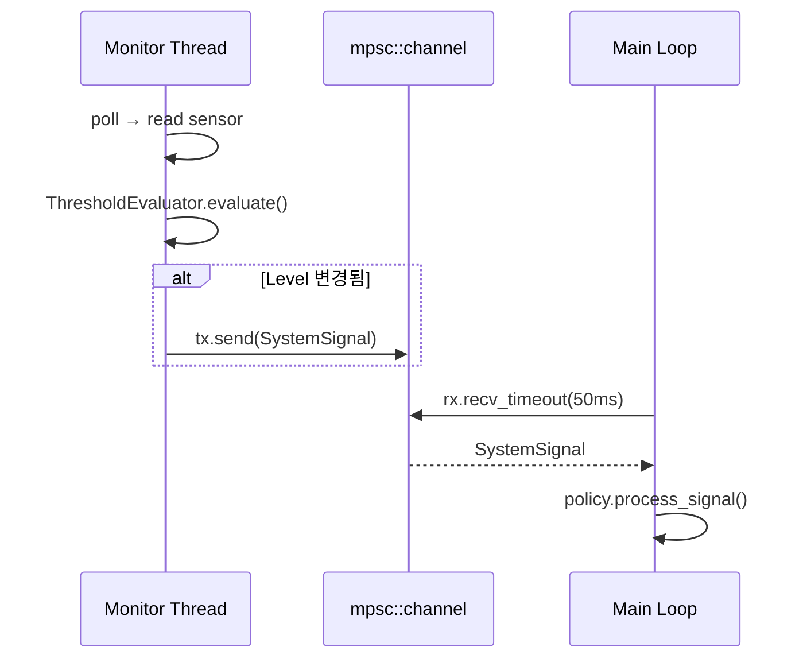
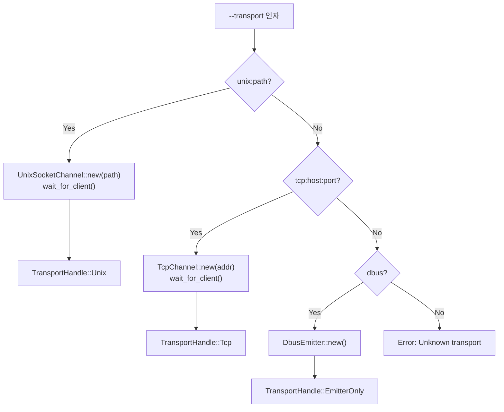
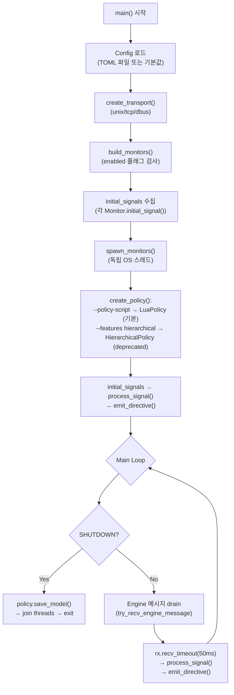
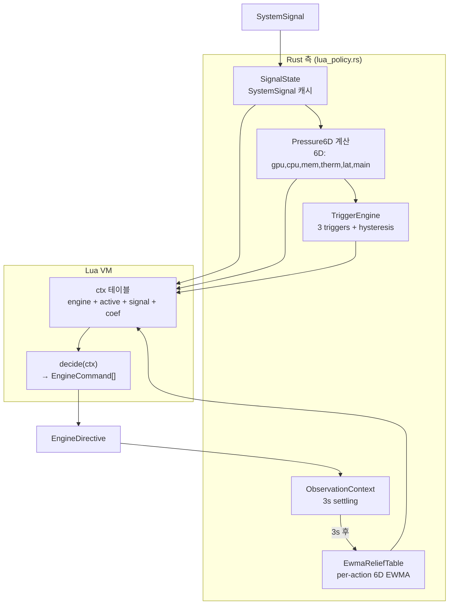
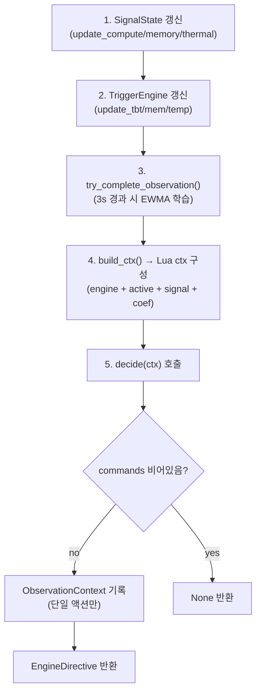
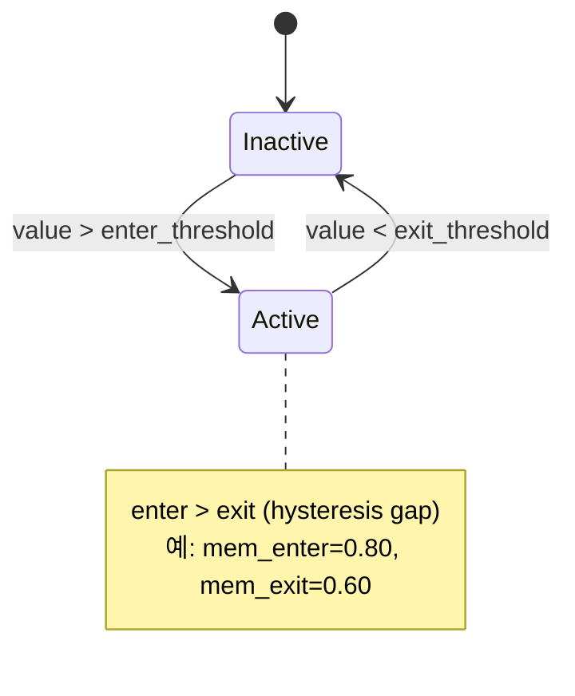
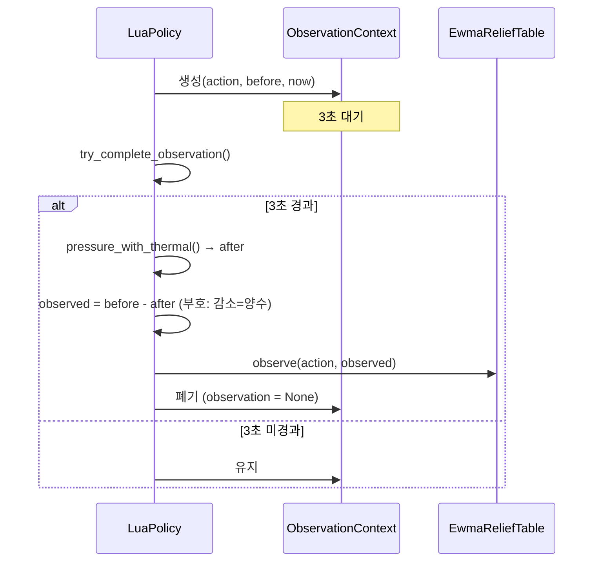
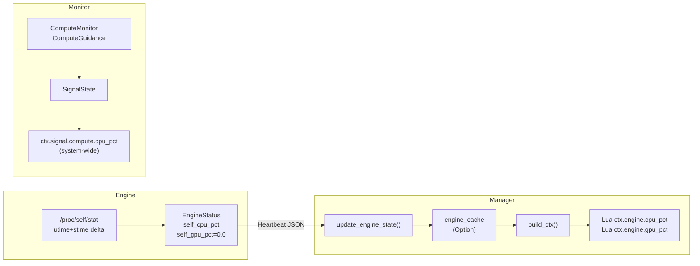

# Manager Overview -- Architecture

> spec/20-manager.md의 구현 상세. 컴포넌트 중심으로 기술한다.
>
> **Feature flags** (2026-04 기준):
> - `lua` (default) — LuaPolicy 기본 정책
> - `hierarchical` (opt-in) — HierarchicalPolicy, PI Controller, Supervisory, Selector, RLS Relief, ActionRegistry
> - `dbus` (default) — D-Bus emitter

## 1. HierarchicalPolicy -- 3-layer 정책 파이프라인 오케스트레이터 **[DEPRECATED: `#[cfg(feature = "hierarchical")]`]**

> **DEPRECATED (2026-04)**: `hierarchical` feature flag 뒤로 이동. 기본 비활성.
> PI Controller, SupervisoryLayer, ActionSelector, RLS ReliefEstimator, ActionRegistry, Evaluator 모두 포함.
> `--features hierarchical`로 컴파일 시에만 사용 가능. 기본 정책은 §6 LuaPolicy.

| spec ID | 설명 |
|---------|------|
| MGR-012, MGR-023, MGR-024, MGR-029, MGR-030 | 정책 파이프라인 |

### 설계 결정

- `PolicyStrategy` 트레이트로 정책 구현을 추상화한다. `HierarchicalPolicy`(Rust 내장, **deprecated**)와 `LuaPolicy`(스크립트 기반, §6, **기본**)가 구현체이다.
- PI Controller 3개(compute, memory, thermal)를 독립 운영하여 도메인별 pressure를 산출한다.
- `EnergyConstraint` 신호는 독립 PI가 아니라 compute PI에 0.5 가중치로 보조 기여한다.
- 액션 효과 관측(observation)은 `OBSERVATION_DELAY_SECS = 3.0`초 대기 후 실측 relief를 계산한다.

### 인터페이스

```rust
// manager/src/pipeline.rs

pub trait PolicyStrategy: Send {
    fn process_signal(&mut self, signal: &SystemSignal) -> Option<EngineDirective>;
    fn update_engine_state(&mut self, msg: &EngineMessage);
    fn mode(&self) -> OperatingMode;
    fn save_model(&self) {}
}

pub struct HierarchicalPolicy { /* ... */ }

impl HierarchicalPolicy {
    pub fn new(config: &PolicyConfig) -> Self;
    pub fn set_relief_model_path(&mut self, path: String);
    pub fn set_dt(&mut self, dt: f32);
    pub fn pressure(&self) -> &PressureVector;
}
```

**Pre/Post conditions for `process_signal`**:
- **Pre**: `signal`은 유효한 `SystemSignal` 변형 (MemoryPressure, ThermalAlert, ComputeGuidance, EnergyConstraint).
- **Post**: Normal 모드이면 `None` 반환. Warning/Critical 모드에서 모드 변경 또는 pressure 1.2x 초과 시 `Some(EngineDirective)` 반환. 모드 하강 시 de-escalation directive 발행.

### 처리 흐름



### 예외 처리

- `EnergyConstraint`: `level_to_measurement(level)` 함수로 Level enum을 0.0~1.0 측정값으로 이산 변환 후 0.5 가중치 적용.
- `elapsed_dt()`: 첫 신호 시 기본 dt(0.1초) 사용. 결과는 `[0.001, 10.0]` clamp.
- `ActionCommand → EngineCommand` 변환 시 `Operation::Release`는 `None` 반환 (restore directive에서 일괄 처리).

## 2. Monitor trait -- 센서 인터페이스

| spec ID | 설명 |
|---------|------|
| MGR-014~020 | Monitor trait + 4+1 구현체 |

### 설계 결정

- 각 Monitor는 데이터 소스, 평가 로직, 신호 구성을 완전히 소유한다. Manager는 단순 signal bus 역할.
- 모든 Monitor는 독립 OS 스레드에서 실행된다 (`std::thread`, async 없음).
- `ThresholdEvaluator`를 내장하여 히스테리시스 기반 레벨 변경 감지 시에만 신호를 전송한다.
- `ExternalMonitor`는 임계값 평가 없이 외부 신호를 직접 전달한다 (연구/테스트 전용).

### 인터페이스

```rust
// manager/src/monitor/mod.rs

pub trait Monitor: Send + 'static {
    fn run(
        &mut self,
        tx: mpsc::Sender<SystemSignal>,
        shutdown: Arc<AtomicBool>,
    ) -> anyhow::Result<()>;

    fn initial_signal(&self) -> Option<SystemSignal>;
    fn name(&self) -> &str;
}
```

### 구현체

| 구현체 | 모듈 | 데이터 소스 | 방향 | 신호 타입 |
|--------|------|-----------|------|----------|
| `MemoryMonitor` | `monitor/memory.rs` | `/proc/meminfo` | Descending | `MemoryPressure` |
| `ThermalMonitor` | `monitor/thermal.rs` | `/sys/class/thermal/` | Ascending | `ThermalAlert` |
| `ComputeMonitor` | `monitor/compute.rs` | `/proc/stat` CPU delta | Ascending | `ComputeGuidance` |
| `EnergyMonitor` | `monitor/energy.rs` | `/sys/class/power_supply/` | Descending | `EnergyConstraint` |
| `ExternalMonitor` | `monitor/external.rs` | stdin / unix socket / tcp | N/A | 모든 타입 (pass-through) |

### Monitor → Main Loop 통신



## 3. PolicyStrategy trait -- 정책 추상화

| spec ID | 설명 |
|---------|------|
| MGR-023 | PolicyStrategy trait 정의 |

### 설계 결정

- Strategy 패턴으로 정책 교체를 지원한다.
- `update_engine_state()`는 Engine heartbeat에서 13차원 `FeatureVector`를 갱신한다.
- `save_model()`은 기본 no-op이며, `HierarchicalPolicy`만 relief model을 저장한다.

### FeatureVector 매핑 (13차원)

| 인덱스 | 이름 | 소스 필드 | 정규화 |
|--------|------|----------|--------|
| 0 | `KV_OCCUPANCY` | `kv_cache_utilization` | 0.0~1.0 그대로 |
| 1 | `IS_GPU` | `active_device` | "opencl" 포함 시 1.0 |
| 2 | `TOKEN_PROGRESS` | `kv_cache_tokens` | / 2048.0, min 1.0 |
| 5 | `TBT_RATIO` | `actual_throughput` | / 100.0, clamp [0,1] |
| 6 | `TOKENS_GENERATED_NORM` | `tokens_generated` | / 2048.0, min 1.0 |
| 10 | `ACTIVE_EVICTION` | `eviction_policy` | 비어있지 않고 "none" 아니면 1.0 |
| 11 | `ACTIVE_LAYER_SKIP` | `skip_ratio` | > 0 이면 1.0 |

## 4. Emitter -- Transport 선택, Directive/Response 처리

| spec ID | 설명 |
|---------|------|
| MGR-031, MGR-032, MGR-033, MGR-034, MGR-043 | Emitter + EngineReceiver + Transport |

### 설계 결정

- **ISP (Interface Segregation)**: `Emitter` (Manager→Engine 전송)과 `EngineReceiver` (Engine→Manager 수신)을 별도 trait으로 분리한다. `DbusEmitter`처럼 수신 불가한 구현체는 `EngineReceiver`를 구현하지 않는다.
- `EngineChannel = Emitter + EngineReceiver` 조합 trait을 블랭킷 구현으로 제공한다.
- main.rs의 `TransportHandle` enum이 unix/tcp/dbus 분기를 캡슐화한다.
- 클라이언트 미연결 시 emit은 no-op (치명적이지 않음).

### 인터페이스

```rust
// manager/src/emitter/mod.rs
pub trait Emitter: Send {
    fn emit(&mut self, signal: &SystemSignal) -> anyhow::Result<()>;
    fn emit_initial(&mut self, signals: &[SystemSignal]) -> anyhow::Result<()>;
    fn emit_directive(&mut self, directive: &EngineDirective) -> anyhow::Result<()>;
    fn name(&self) -> &str;
}

// manager/src/channel/mod.rs
pub trait EngineReceiver: Send {
    fn try_recv(&mut self) -> anyhow::Result<Option<EngineMessage>>;
    fn is_connected(&self) -> bool;
}
pub trait EngineChannel: Emitter + EngineReceiver {}
impl<T: Emitter + EngineReceiver> EngineChannel for T {}
```

### 구현체

| 구현체 | 모듈 | Emitter | EngineReceiver | Wire format |
|--------|------|---------|----------------|-------------|
| `UnixSocketChannel` | `channel/unix_socket.rs` | O | O | Length-prefixed JSON (4-byte BE u32 + UTF-8) |
| `TcpChannel` | `channel/tcp.rs` | O | O | Length-prefixed JSON (동일) |
| `UnixSocketEmitter` | `emitter/unix_socket.rs` | O | X | Length-prefixed JSON (레거시, 단방향) |
| `DbusEmitter` | `emitter/dbus.rs` | O | X | D-Bus System Bus (`#[cfg(feature = "dbus")]`) |

### Transport 선택 (main.rs `create_transport()`)



## 5. ActionRegistry -- 액션 메타데이터 관리 **[DEPRECATED: `#[cfg(feature = "hierarchical")]`]**

> **DEPRECATED (2026-04)**: `hierarchical` feature flag 뒤로 이동. LuaPolicy는 ActionRegistry를 사용하지 않는다.

| spec ID | 설명 |
|---------|------|
| MGR-028 | ActionRegistry 초기화 + 조회 |

### 설계 결정

- `PolicyConfig`에서 초기화하며, 알 수 없는 액션 이름은 무시한다.
- `exclusion_groups`로 상호 배타적 액션 조합을 관리한다 (예: `kv_evict_sliding`과 `kv_evict_h2o`).
- `default_cost` 필드는 QCF 비용 proxy로 사용된다 (Engine 미연결 시 fallback).

### 인터페이스

```rust
// manager/src/action_registry.rs

pub struct ActionRegistry { /* ... */ }

impl ActionRegistry {
    pub fn from_config(config: &PolicyConfig) -> Self;
    pub fn get(&self, action: &ActionId) -> Option<&ActionMeta>;
    pub fn all_actions(&self) -> impl Iterator<Item = &ActionMeta>;
    pub fn lossy_actions(&self) -> Vec<ActionId>;
    pub fn lossless_actions(&self) -> Vec<ActionId>;
    pub fn exclusion_groups(&self) -> &HashMap<String, Vec<ActionId>>;
    pub fn is_excluded(&self, a: &ActionId, b: &ActionId) -> bool;
    pub fn default_cost(&self, action: &ActionId) -> f32;  // 미등록 시 1.0
}
```

### ActionId 7종

| ActionId | Kind | Domain | param_range |
|----------|------|--------|-------------|
| `SwitchHw` | config | Compute | 없음 |
| `Throttle` | config | Compute | `delay_ms` [0.0, 100.0] |
| `KvOffloadDisk` | config | Memory | 없음 |
| `KvEvictSliding` | config | Memory | `keep_ratio` [0.3, 0.9] |
| `KvEvictH2o` | config | Memory | `keep_ratio` [0.3, 0.9] |
| `KvQuantDynamic` | config | Memory | `target_bits` [4.0, 8.0] |
| `LayerSkip` | config | Compute | `skip_layers` [1.0, 8.0] |

## 6. ActionSelector -- 최적 액션 조합 선택 **[DEPRECATED: `#[cfg(feature = "hierarchical")]`]**

> **DEPRECATED (2026-04)**: `hierarchical` feature flag 뒤로 이동. LuaPolicy는 Lua 스크립트 내에서 직접 액션을 선택한다.

| spec ID | 설명 |
|---------|------|
| MGR-026 | Stateless exhaustive 탐색 |

### 설계 결정

- **Stateless**: 모든 상태는 `select()` 호출 인자로 전달된다.
- **Exhaustive 2^N 탐색**: 후보 N개에 대해 모든 조합을 평가한다. 최대 7종이므로 128 조합.
- Warning 모드에서는 lossy 액션을 후보에서 제외한다.
- `available_actions`가 비어있으면 필터링하지 않는다 (backward compat).
- Latency budget 초과 조합은 배제한다.
- 완전 해소 불가 시 coverage 최대화 best-effort를 반환한다.

### 인터페이스

```rust
// manager/src/selector.rs

pub struct ActionSelector;

impl ActionSelector {
    pub fn select(
        registry: &ActionRegistry,
        estimator: &dyn ReliefEstimator,
        pressure: &PressureVector,
        mode: OperatingMode,
        engine_state: &FeatureVector,
        qcf_values: &HashMap<ActionId, f32>,
        latency_budget: f32,
        active_actions: &[ActionId],
        available_actions: &[ActionId],
    ) -> Vec<ActionCommand>;
}
```

**파라미터 결정 규칙**: `primary_domain`의 pressure intensity에 따라 `param_range`를 선형 보간한다.
- intensity 0.0 → `range.max` (보수적)
- intensity 1.0 → `range.min` (공격적)
- 수식: `value = max - intensity * (max - min)`

## 7. ReliefEstimator -- 액션 효과 예측 **[DEPRECATED: `#[cfg(feature = "hierarchical")]`]**

> **DEPRECATED (2026-04)**: `hierarchical` feature flag 뒤로 이동. LuaPolicy는 `EwmaReliefTable`(6D EWMA)을 사용한다 (§10 참조).

| spec ID | 설명 |
|---------|------|
| MGR-027, MGR-030 | Relief 추정 + 관측 |

### 설계 결정

- Strategy 패턴으로 추정기 교체를 지원한다.
- `OnlineLinearEstimator`: 액션별 독립 RLS(Recursive Least Squares) 선형 모델.
- 관측 없는 초기 상태에서는 도메인 기반 `default_relief()` prior를 반환한다.
- JSON 직렬화로 디스크 저장/복원을 지원한다.

### 인터페이스

```rust
// manager/src/relief/mod.rs

pub trait ReliefEstimator: Send + Sync {
    fn predict(&self, action: &ActionId, state: &FeatureVector) -> ReliefVector;
    fn observe(&mut self, action: &ActionId, state: &FeatureVector, actual: &ReliefVector);
    fn save(&self, path: &Path) -> io::Result<()>;
    fn load(&mut self, path: &Path) -> io::Result<()>;
    fn observation_count(&self, action: &ActionId) -> u32;
}
```

### default_relief prior 테이블

| ActionId | compute | memory | thermal | latency |
|----------|---------|--------|---------|---------|
| SwitchHw | 0.5 | 0.0 | 0.3 | -0.1 |
| Throttle | 0.3 | 0.0 | 0.2 | -0.3 |
| KvOffloadDisk | 0.0 | 0.4 | 0.0 | -0.2 |
| KvEvictSliding | 0.0 | 0.7 | 0.0 | 0.0 |
| KvEvictH2o | 0.0 | 0.6 | 0.0 | 0.0 |
| KvQuantDynamic | 0.0 | 0.3 | 0.0 | 0.0 |
| LayerSkip | 0.3 | 0.0 | 0.1 | -0.2 |

## 8. PiController -- 도메인별 PI 제어기 **[DEPRECATED: `#[cfg(feature = "hierarchical")]`]**

> **DEPRECATED (2026-04)**: `hierarchical` feature flag 뒤로 이동. LuaPolicy는 `SignalState.pressure_with_thermal()`로 직접 pressure를 계산한다 (§10 참조).

### 설계 결정

- 단일 도메인의 원시 측정값(0.0~1.0)을 연속적 pressure intensity(0.0~1.0)로 변환한다.
- **단방향**: `measurement < setpoint`이면 출력 0 (완화 방향은 관여 안 함).
- Anti-windup: `can_act=false` 시 적분 동결, `integral_clamp`로 상한 제한.
- Gain scheduling: `memory_gain_zones`로 측정값 구간별 Kp를 동적 적용한다.

### 인터페이스

```rust
// manager/src/pi_controller.rs

pub struct PiController { /* ... */ }

impl PiController {
    pub fn new(kp: f32, ki: f32, setpoint: f32, integral_clamp: f32) -> Self;
    pub fn with_gain_zones(self, zones: Vec<GainZone>) -> Self;
    pub fn update(&mut self, measurement: f32, dt: f32) -> f32;
    pub fn set_can_act(&mut self, can_act: bool);
    pub fn reset_integral(&mut self);
}

pub struct GainZone {
    pub above: f32,
    pub kp: f32,
}
```

## 9. 메인 루프

| spec ID | 설명 |
|---------|------|
| MGR-035~041, MGR-045 | main loop 흐름, 초기화, 종료 |

### 처리 흐름



### 주요 설계 포인트

- **Engine 메시지 우선 drain**: `while let` 루프로 Engine 메시지를 모두 소진한 후 Monitor 신호를 처리한다.
- **recv_timeout(50ms)**: Monitor 신호가 없어도 50ms마다 Engine 메시지를 확인한다.
- **SHUTDOWN**: `static AtomicBool` + SIGINT/SIGTERM 핸들러. 종료 시 relief model 저장 후 스레드 join.
- **PolicyConfig 로드 우선순위**: CLI `--policy-config` > 메인 config의 `[policy]` 섹션 > `PolicyConfig::default()` (hierarchical feature 전용).
- **정책 선택**: `create_policy()` 함수가 `--policy-script` 유무로 분기. LuaPolicy 사용 시 `config.adaptation` 설정을 전달한다.

## 코드-스펙 차이 (Known Divergence)

| 항목 | 스펙 | 코드 | 영향 |
|------|------|------|------|
| EnergyConstraint 처리 (MGR-029) | raw `battery_pct`에서 `m = clamp(1 - battery_pct/100, 0, 1) * 0.5` | `level_to_measurement(level) * 0.5` [hierarchical] | HierarchicalPolicy 전용 (deprecated). LuaPolicy는 EnergyConstraint를 직접 처리하지 않음 (Monitor에서 신호만 수신) |
| ActionId 8종 (MGR-028) | 8종 (`KvMergeD2o` 포함) | 8종 (`KvMergeD2o` variant 포함, hierarchical 뒤) | 스펙-코드 일치 |
| 기본 정책 | HierarchicalPolicy | LuaPolicy (2026-04 변경) | `lua` feature가 default. `--policy-script` 필수 |
| ReliefVector 차원 | 4D | LuaPolicy: 6D `[f32; 6]` | LuaPolicy 전용 확장. 기존 4D는 hierarchical 뒤에 유지 |

## Config

### LuaPolicy Config (기본)

| config 키 | 타입 | 기본값 | 설명 |
|-----------|------|--------|------|
| `manager.poll_interval_ms` | u64 | 1000 | 모니터 폴링 간격 |
| `adaptation.ewma_alpha` | f32 | 0.875 | EWMA 평활 계수 |
| `adaptation.relief_table_path` | String | "" | Relief table JSON 경로 |
| `adaptation.temp_safe_c` | f32 | 35.0 | Thermal 정규화 하한 |
| `adaptation.temp_critical_c` | f32 | 50.0 | Thermal 정규화 상한 |
| `adaptation.trigger.*` | TriggerConfig | (§10.3 참조) | Trigger thresholds |
| `adaptation.default_relief.*` | HashMap | {} | Per-action 6D default relief |

### HierarchicalPolicy Config [DEPRECATED: `#[cfg(feature = "hierarchical")]`]

| config 키 | 타입 | 기본값 | spec/ 근거 |
|-----------|------|--------|-----------|
| `policy.pi_controller.compute_kp` | f32 | 1.5 | MGR-024 |
| `policy.pi_controller.compute_ki` | f32 | 0.3 | MGR-024 |
| `policy.pi_controller.compute_setpoint` | f32 | 0.70 | MGR-024 |
| `policy.pi_controller.memory_kp` | f32 | 2.0 | MGR-024 |
| `policy.pi_controller.memory_ki` | f32 | 0.5 | MGR-024 |
| `policy.pi_controller.memory_setpoint` | f32 | 0.75 | MGR-024 |
| `policy.pi_controller.thermal_kp` | f32 | 1.0 | MGR-024 |
| `policy.pi_controller.thermal_ki` | f32 | 0.2 | MGR-024 |
| `policy.pi_controller.thermal_setpoint` | f32 | 0.80 | MGR-024 |
| `policy.pi_controller.integral_clamp` | f32 | 2.0 | MGR-024 |
| `policy.selector.latency_budget` | f32 | 0.5 | MGR-026 |
| `policy.selector.algorithm` | String | "exhaustive" | MGR-026 |
| `policy.relief_model.forgetting_factor` | f32 | 0.995 | MGR-027 |
| `policy.relief_model.prior_weight` | u32 | 5 | MGR-027 |
| `policy.relief_model.storage_dir` | String | "~/.llm_rs/models" | MGR-027 |

## CLI

| 플래그 | 설명 | spec/ 근거 |
|--------|------|-----------|
| `--config` / `-c` | TOML 설정 파일 경로 (기본: `/etc/llm-manager/config.toml`) | MGR-047 |
| `--transport` / `-t` | 전송 매체 (`dbus`, `unix:<path>`, `tcp:<host:port>`) (기본: `dbus`) | MGR-043, MGR-047 |
| `--client-timeout` | Engine 연결 대기 시간, 초 (기본: 60) | MGR-047 |
| `--policy-script` | Lua 정책 스크립트 경로 (**필수**, LuaPolicy 활성화) | MGR-049 |
| `--policy-config` | 별도 정책 설정 TOML 경로 [hierarchical] | MGR-042, MGR-047 |

## 모듈 구조

```
manager/src/
├── main.rs                  # 바이너리 진입점, main loop, CLI, TransportHandle
├── lib.rs                   # 모듈 re-export
├── config.rs                # Config, ManagerConfig, AdaptationConfig, TriggerConfig,
│                            # 각 MonitorConfig
│                            # [hierarchical] PolicyConfig, PiControllerConfig, SupervisoryConfig,
│                            #   SelectorConfig, ReliefModelConfig, ActionConfig
├── types.rs                 # OperatingMode
│                            # [hierarchical] ActionId(7종), ActionKind, Domain,
│                            #   PressureVector, ReliefVector, FeatureVector(13dim),
│                            #   ActionMeta, ParamRange, ActionParams, ActionCommand, Operation
├── lua_policy.rs            # [lua] LuaPolicy, SignalState, Pressure6D, TriggerEngine,
│                            #   TbtTracker, EwmaReliefTable, ObservationContext (기본 정책)
├── pipeline.rs              # PolicyStrategy trait
│                            # [hierarchical] HierarchicalPolicy, ObservationContext
├── pi_controller.rs         # [hierarchical] PiController, GainZone
├── supervisory.rs           # [hierarchical] SupervisoryLayer (OperatingMode FSM)
├── selector.rs              # [hierarchical] ActionSelector (stateless 2^N exhaustive)
├── action_registry.rs       # [hierarchical] ActionRegistry (ActionMeta + exclusion groups)
├── evaluator.rs             # ThresholdEvaluator, Direction, Thresholds
├── monitor/
│   ├── mod.rs               # Monitor trait (run, initial_signal, name)
│   ├── memory.rs            # MemoryMonitor — /proc/meminfo, Descending
│   ├── thermal.rs           # ThermalMonitor — /sys/class/thermal/, Ascending
│   ├── compute.rs           # ComputeMonitor — /proc/stat CPU delta, Ascending
│   ├── energy.rs            # EnergyMonitor — /sys/class/power_supply/, Descending
│   └── external.rs          # ExternalMonitor — stdin/unix/tcp JSON Lines (pass-through)
├── emitter/
│   ├── mod.rs               # Emitter trait (emit, emit_initial, emit_directive, name)
│   ├── unix_socket.rs       # UnixSocketEmitter (레거시, Emitter only)
│   └── dbus.rs              # DbusEmitter (#[cfg(feature = "dbus")])
├── channel/
│   ├── mod.rs               # EngineReceiver trait, EngineChannel trait (blanket impl)
│   ├── unix_socket.rs       # UnixSocketChannel (Emitter + EngineReceiver, 양방향)
│   └── tcp.rs               # TcpChannel (Emitter + EngineReceiver, 양방향)
├── relief/                  # [hierarchical]
│   ├── mod.rs               # ReliefEstimator trait (predict, observe, save, load)
│   └── linear.rs            # OnlineLinearEstimator (RLS), LinearModel, default_relief()
└── bin/
    ├── mock_engine.rs       # Manager 테스트용 모의 Engine
    └── mock_manager.rs      # Engine 테스트용 모의 Manager
```

## Spec ID 매핑 요약

| spec ID | 컴포넌트 | 모듈 |
|---------|----------|------|
| MGR-010, MGR-046 | 바이너리 | `main.rs`, `Cargo.toml` |
| MGR-011, MGR-C01, MGR-C02 | 아키텍처 보증 | (크레이트 경계) |
| MGR-012, MGR-035~041, MGR-045 | 메인 루프 | `main.rs` |
| MGR-013, MGR-042~044, MGR-047 | CLI/Config | `main.rs`, `config.rs` |
| MGR-014~020 | Monitor | `monitor/` |
| MGR-021 | ThresholdEvaluator | `evaluator.rs` |
| MGR-022 | Poll interval | `config.rs` |
| MGR-023, MGR-024, MGR-029 | HierarchicalPolicy [hierarchical] | `pipeline.rs` |
| MGR-025 | SupervisoryLayer [hierarchical] | `supervisory.rs` |
| MGR-026 | ActionSelector [hierarchical] | `selector.rs` |
| MGR-027, MGR-030 | ReliefEstimator [hierarchical] | `relief/` |
| MGR-028 | ActionRegistry [hierarchical] | `action_registry.rs` |
| MGR-031~034 | Emitter/Channel | `emitter/`, `channel/` |
| MGR-048 | Relief model persistence | `pipeline.rs` (`set_relief_model_path`, `save_model`) |
| MGR-049 | LuaPolicy (**기본 정책**) | `lua_policy.rs` (feature: `lua`, default 포함) |

## 6. LuaPolicy -- Lua 스크립트 기반 정책 (**기본 정책**, 관련 spec: MGR-049)

> **2026-04 변경**: optional feature에서 **기본 정책**으로 격상. `lua` feature가 `default`에 포함.
> `--policy-script` CLI 플래그로 Lua 스크립트 경로를 지정한다.
> HierarchicalPolicy는 `#[cfg(feature = "hierarchical")]` 뒤로 이동 (deprecated).

### 설계 결정

- Lua 5.4 VM을 `mlua` 크레이트로 임베딩한다 (`lua` feature, `default`에 포함, vendored 정적 빌드).
- `PolicyStrategy` trait의 **기본 구현체**. `--policy-script <path>` 필수.
- Lua VM은 Manager 시작 시 1회 생성, 세션 동안 상태를 유지한다 (글로벌 변수, 이력 테이블 등 호출 간 보존).
- Monitor 스레드의 `SystemSignal` 수신 시 Rust 측에서 `SignalState` 갱신 → `TriggerEngine` 갱신 → `Pressure6D` 계산 → `ctx` 테이블 구성 → `decide(ctx)` 호출.
- **Rust 측 적응 엔진**: `SignalState`, `TriggerEngine`, `EwmaReliefTable`, `ObservationContext`가 Lua 외부(Rust)에서 6D pressure 계산, trigger 판정, relief 학습, 관측 지연을 담당한다.
- 센서 데이터는 Lua가 `sys.*` 헬퍼로 직접 읽을 수도 있고 (확장성), Rust 측 `ctx.signal`/`ctx.coef`로 전달받을 수도 있다.
- 샌드박스: TABLE, STRING, MATH만 허용. IO/OS 차단. 메모리 4MB 제한.

### 전체 아키텍처



### 인터페이스

```rust
// manager/src/lua_policy.rs  (#[cfg(feature = "lua")])

pub struct LuaPolicy {
    lua: mlua::Lua,
    engine_state: Option<EngineStatus>,
    signal_state: SignalState,
    trigger_engine: TriggerEngine,
    relief_table: EwmaReliefTable,
    observation: Option<ObservationContext>,
    adaptation_config: AdaptationConfig,
}

impl LuaPolicy {
    pub fn new(script_path: &str, config: AdaptationConfig) -> anyhow::Result<Self>;
    // POST: Lua VM 초기화, decide() 함수 존재 확인, relief table 로드/생성
}

impl PolicyStrategy for LuaPolicy {
    fn process_signal(&mut self, signal: &SystemSignal) -> Option<EngineDirective>;
    fn update_engine_state(&mut self, msg: &EngineMessage);
    fn mode(&self) -> OperatingMode;  // 기본 Normal
    fn save_model(&self);             // relief table JSON 저장
}
```

### process_signal 처리 흐름



### Lua `decide(ctx)` 호출 규약

```lua
-- 입력: ctx 테이블
ctx = {
    engine = {device, throughput, kv_util, cache_tokens, cache_bytes,
              tokens_generated, state, kv_dtype, skip_ratio,
              -- 신규 (2026-04 Phase 1, §10.7): Engine 자가 측정 사용률
              cpu_pct,     -- f64 [0,1]  EngineStatus.self_cpu_pct
              gpu_pct},    -- f64 [0,1]  Phase 1 = 0.0 (placeholder)
    active = {"throttle", ...},

    -- 신규 (2026-04): 원시 센서 메트릭
    signal = {
        memory  = {available = <bytes>, total = <bytes>},
        compute = {cpu_pct = <0-100>, gpu_pct = <0-100>},
        thermal = {temp_c = <float>, throttling = <bool>},
    },

    -- 신규 (2026-04): Rust 측 계산된 계수
    coef = {
        pressure = {gpu, cpu, memory, thermal, latency, main_app},  -- 6D, 0.0~1.0
        trigger  = {tbt_degraded, mem_low, temp_high},              -- bool
        relief   = {                                                 -- per-action 6D EWMA
            switch_hw = {gpu, cpu, memory, thermal, latency, main_app_qos},
            throttle  = {...},
            ...
        },
    },
}

-- sys 헬퍼 (Rust에서 등록, sysfs/procfs 직접 읽기)
sys.read(path)         -- 범용 파일 읽기 → string
sys.meminfo()          -- {total, available, free} (KB)
sys.thermal(zone)      -- °C (float)
sys.gpu_busy()         -- 0-100
sys.gpu_freq()         -- MHz
sys.cpu_freq(cluster)  -- MHz

-- 출력: EngineCommand 테이블 배열
return {
    {type = "kv_evict_h2o", keep_ratio = 0.5},
    {type = "set_target_tbt", target_ms = 150},
}
```

### 에러 처리

- Lua 문법/런타임 에러: `log::error` 기록, `None` 반환 (Manager crash 방지).
- `sys.*` 헬퍼 파일 읽기 실패: 기본값 반환 (thermal → -1.0, meminfo → 0 등).
- `decide()` 함수 미정의: 로드 시 에러, Manager 시작 실패.
- `--policy-script` 미지정 + `hierarchical` feature 미활성: `anyhow::bail` (정책 없음 에러).

### Config / CLI

| 플래그 | 타입 | 기본값 | spec 근거 |
|--------|------|--------|-----------|
| `--policy-script` | `Option<PathBuf>` | None (필수) | MGR-049 |

| config 섹션 | 타입 | 기본값 | 설명 |
|-------------|------|--------|------|
| `[adaptation]` | `AdaptationConfig` | (아래 §10 참조) | LuaPolicy 적응 엔진 설정 |

## 10. LuaPolicy 내부 컴포넌트 -- Rust 측 적응 엔진

> **신규 (2026-04)**: LuaPolicy 내부의 Rust 컴포넌트들. Lua VM 외부에서 pressure 계산, trigger 판정, relief 학습을 담당한다.

### 10.1 SignalState -- SystemSignal 캐시 + 6D Pressure 계산

**파일**: `manager/src/lua_policy.rs` (비공개 struct)

#### 설계 결정

- `SystemSignal`의 최신 센서 값을 도메인별로 캐시한다 (cpu_pct, gpu_pct, mem_available, mem_total, temp_mc, throttling).
- `pressure_with_thermal()` 메서드로 캐시된 값에서 `Pressure6D`를 계산한다.
- Thermal normalization: `(temp_c - temp_safe_c) / (temp_critical_c - temp_safe_c)`, clamp [0, 1].
- HierarchicalPolicy의 PI Controller 경유와 달리, **직접 정규화 매핑** (지연 없음).

#### 인터페이스

```rust
struct SignalState {
    cpu_pct: f64,
    gpu_pct: f64,
    mem_available: u64,
    mem_total: u64,
    temp_mc: i32,
    throttling: bool,
}

impl SignalState {
    fn update_compute(&mut self, cpu_pct: f64, gpu_pct: f64);
    fn update_memory(&mut self, available: u64, total: u64);
    fn update_thermal(&mut self, temp_mc: i32, throttling: bool);

    fn pressure_with_thermal(
        &self,
        temp_safe_c: f32,     // AdaptationConfig.temp_safe_c
        temp_critical_c: f32, // AdaptationConfig.temp_critical_c
        latency_ratio: Option<f64>,  // TbtTracker.degradation_ratio()
    ) -> Pressure6D;
}
```

#### Pressure6D 계산 규칙

| 차원 | 계산식 | 범위 |
|------|--------|------|
| `gpu` | `gpu_pct / 100.0` | [0, 1] |
| `cpu` | `cpu_pct / 100.0` | [0, 1] |
| `memory` | `1.0 - available / total` | [0, 1] |
| `thermal` | `(temp_c - safe) / (critical - safe)` | [0, 1] |
| `latency` | `TbtTracker.degradation_ratio()` 또는 0.0 | [0, +inf) |
| `main_app` | 0.0 (예약) | 0.0 |

### 10.2 Pressure6D -- 6차원 압력 벡터

**파일**: `manager/src/lua_policy.rs` (비공개 struct)

```rust
struct Pressure6D {
    gpu: f32,
    cpu: f32,
    memory: f32,
    thermal: f32,
    latency: f32,      // TBT degradation ratio
    main_app: f32,      // 예약 (main app QoS)
}
```

HierarchicalPolicy의 `PressureVector`(3D: compute, memory, thermal)와 달리, **6차원**으로 확장되어 GPU/CPU를 분리하고 latency/main_app을 추가한다. LuaPolicy 내부에서만 사용되며, `types.rs`의 `PressureVector`/`ReliefVector`는 `hierarchical` feature 뒤에 남아있다.

### 10.3 TriggerEngine -- 3-trigger 판정 + Hysteresis

**파일**: `manager/src/lua_policy.rs` (비공개 struct)

#### 설계 결정

- 3개의 독립 trigger (tbt_degraded, mem_low, temp_high)를 관리한다.
- 각 trigger는 **enter/exit threshold 분리** (hysteresis)로 진동을 방지한다.
- TBT trigger는 `TbtTracker`의 EWMA baseline 대비 degradation ratio를 사용한다.
- Trigger 상태는 Lua `ctx.coef.trigger` 테이블로 전달된다.

#### 인터페이스

```rust
struct TriggerEngine {
    config: TriggerConfig,
    tbt: TbtTracker,
    trigger: TriggerState,  // {tbt_degraded, mem_low, temp_high}
}

impl TriggerEngine {
    fn new(config: TriggerConfig) -> Self;
    fn update_tbt_from_throughput(&mut self, throughput: f32);
    fn update_mem(&mut self, pressure: f64);
    fn update_temp(&mut self, normalized: f64);
    fn state(&self) -> &TriggerState;
    fn tbt_degradation_ratio(&self) -> Option<f64>;
}
```

#### Trigger Hysteresis 흐름



#### Trigger 구성

| Trigger | 입력 | enter | exit | 설명 |
|---------|------|-------|------|------|
| `tbt_degraded` | `TbtTracker.degradation_ratio()` | 0.30 | 0.10 | TBT가 baseline 대비 30% 이상 악화 |
| `mem_low` | `pressure.memory` (0~1) | 0.80 | 0.60 | 메모리 사용률 80% 초과 |
| `temp_high` | `pressure.thermal` (0~1) | 0.70 | 0.50 | 정규화 온도 70% 초과 |

### 10.4 TbtTracker -- EWMA 기반 TBT Baseline 추적

**파일**: `manager/src/lua_policy.rs` (비공개 struct)

#### 설계 결정

- Engine heartbeat의 `throughput` (tok/s)에서 `tbt_ms = 1000 / throughput`으로 역산한다.
- EWMA (alpha=0.875, Jacobson TCP RTT) 로 평활화한다.
- Warmup 단계 (`warmup_target` 토큰, 기본 20) 동안 baseline을 설정하지 않는다.
- Warmup 완료 시 현재 EWMA 값을 `baseline`으로 확정한다.
- `degradation_ratio = (ewma - baseline) / baseline`: baseline 대비 악화 비율.

#### 인터페이스

```rust
struct TbtTracker {
    ewma: f64,
    baseline: Option<f64>,
    warmup_count: u32,
    warmup_target: u32,
}

impl TbtTracker {
    fn new(warmup_target: u32) -> Self;
    fn observe(&mut self, tbt_ms: f64);
    // POST: 첫 관측은 ewma 직접 대입, 이후 EWMA 갱신
    // POST: warmup_count >= warmup_target 시 baseline 확정

    fn degradation_ratio(&self) -> Option<f64>;
    // PRE: baseline 존재
    // POST: ratio = (ewma - baseline) / baseline
}
```

### 10.5 EwmaReliefTable -- Per-Action 6D EWMA 학습

**파일**: `manager/src/lua_policy.rs` (비공개 struct)

#### 설계 결정

- 액션 이름(String)별로 6D relief 벡터를 EWMA로 학습한다.
- Alpha=0.875 (Jacobson TCP RTT에서 유래). 첫 관측은 직접 대입, 이후 EWMA.
- `default_relief` HashMap (AdaptationConfig)으로 cold start prior를 제공한다.
- JSON 직렬화로 디스크 저장/복원을 지원한다 (`relief_table_path`).
- HierarchicalPolicy의 `OnlineLinearEstimator`(RLS + 13D FeatureVector)와 달리, **단순 EWMA + 6D 고정 입력** (feature 없음, 상태 의존 없음).

#### 인터페이스

```rust
struct EwmaReliefTable {
    entries: HashMap<String, ReliefEntry>,
    alpha: f32,
    defaults: HashMap<String, Vec<f32>>,
}

struct ReliefEntry {
    relief: [f32; 6],         // RELIEF_DIMS = 6
    observation_count: u32,
}

impl EwmaReliefTable {
    fn new(alpha: f32, defaults: HashMap<String, Vec<f32>>) -> Self;
    fn load(path: &Path, alpha: f32, defaults: ...) -> io::Result<Self>;
    fn predict(&self, action: &str) -> [f32; 6];
    // POST: entries 존재 → 학습값, 없으면 defaults, 없으면 zeros
    fn observe(&mut self, action: &str, observed: &[f32; 6]);
    // POST: count==0 → 직접 대입, count>0 → EWMA 갱신
    fn observation_count(&self, action: &str) -> u32;
    fn save(&self, path: &Path) -> io::Result<()>;
}
```

#### EWMA 갱신 수식

```
첫 관측 (count == 0):  relief = observed
이후:                   relief[i] = alpha * relief[i] + (1 - alpha) * observed[i]
                        alpha = 0.875 → 반감기 ~5.2 관측
```

### 10.6 ObservationContext -- 3초 지연 관측

**파일**: `manager/src/lua_policy.rs` (비공개 struct)

#### 설계 결정

- Directive 발행 시 `ObservationContext` 생성 (before pressure + action name + timestamp).
- 3초 (`OBSERVATION_DELAY_SECS`) 경과 후 after pressure를 계산하여 EWMA 갱신.
- **단일 액션만 학습**: decide()가 여러 커맨드를 반환해도, 첫 번째 액션만 observation에 기록.
- 새 directive 발행 시 이전 observation은 폐기 (설정 안정화 전에 새 조치 필요한 경우).

#### 인터페이스

```rust
struct ObservationContext {
    action: String,       // 관측 대상 액션 이름
    before: Pressure6D,   // 액션 적용 직전 6D pressure
    timestamp: Instant,   // 적용 시각
}

const OBSERVATION_DELAY_SECS: f64 = 3.0;
```

#### 관측 → 학습 흐름



#### 6D Relief 관측 방향 (부호 규약)

| 차원 | 양수 의미 | 계산 |
|------|----------|------|
| gpu, cpu, memory, thermal, latency | pressure 감소 (좋음) | `before[i] - after[i]` |
| main_app | QoS 향상 (좋음) | `after[5] - before[5]` (반전) |

### 10.7 Engine Self-Util Exposure -- `ctx.engine.cpu_pct` / `ctx.engine.gpu_pct`

> 요구사항: MSG-060(필드 17~18), MSG-067, MSG-068, MSG-069, MGR-DAT-075, MGR-DAT-076, INV-091, INV-092
>
> **신규 (2026-04 Phase 1)**: Engine이 Heartbeat에 자신의 프로세스 단위 CPU 사용률을 실어 보내면, LuaPolicy는 이를 Monitor가 생성하는 system-wide `ctx.signal.compute.cpu_pct`와 병존하는 raw 값으로 `ctx.engine` 테이블에 노출한다. Phase 1은 CPU만 실제 측정하고, GPU는 필드만 선제 배선한다.

#### 설계 결정

- Pressure6D 계산은 변경하지 않는다. `SignalState.pressure_with_thermal()`은 기존대로 `ComputeGuidance.cpu_pct`(시스템 전체)만 사용한다. Engine self CPU 값은 `Pressure6D`에 섞이지 않는다.
- 두 값(engine-self, system-wide)을 섞어 "경합(contention)" 단일 스칼라로 계산하지 않는다. 계산 주체는 Lua 측이며, 정책 다양성을 위해 의도적으로 raw 로 노출한다.
- `cpu_pct`/`gpu_pct`는 `ctx.engine` 테이블 하위에 둔다 (`ctx.signal`이 아닌 이유: `ctx.signal`은 OS sensor 기반 공간, `ctx.engine`은 engine 프로세스 자기 보고 공간으로 의미 분리).
- GPU(Phase 1): Engine이 항상 0.0을 송출하므로 `ctx.engine.gpu_pct`도 항상 0.0이다. Lua 스크립트는 Phase 1에서 참조하지 말 것이 권고된다. 필드를 지금 배선하여 Phase 2에서 shape 변경 없이 값만 채우도록 한다 (하위호환 리스크 최소화).
- 측정 실패 시 Engine 측에서 0.0 fallback (INV-092) 하여 송출하므로, Manager/Lua 측에서는 별도 방어 코드가 필요 없다. 단, 정책 스크립트가 `nil` 분기를 두면 미래 확장성을 해칠 수 있으므로 항상 0.0 숫자 값으로 간주한다.

#### ctx.engine 신규 필드 매핑

| Lua 경로 | 원천 | 타입 | Phase 1 값 |
|----------|------|------|------------|
| `ctx.engine.cpu_pct` | `EngineStatus.self_cpu_pct` (MGR-DAT-075, MSG-060 #17) | number [0,1] | Engine `/proc/self/stat` 기반 실측 |
| `ctx.engine.gpu_pct` | `EngineStatus.self_gpu_pct` (MGR-DAT-076, MSG-060 #18) | number [0,1] | 항상 0.0 (placeholder, MSG-068) |

#### 데이터 흐름



#### Lua 사용 예 (정보 제공, non-normative)

```lua
-- 외부 앱이 CPU를 점유하고 있는지 추정
local system_cpu = ctx.signal.compute.cpu_pct / 100.0   -- 0..1
local engine_cpu = ctx.engine.cpu_pct                    -- 0..1
local external_cpu = math.max(0.0, system_cpu - engine_cpu)

if external_cpu > 0.4 and ctx.coef.trigger.tbt_degraded then
    -- 시스템은 바쁘지만 engine 자체는 여유 → throttle보다
    -- layer_skip 같은 self-limit이 적절할 수 있다
    return { {type = "layer_skip", ratio = 0.1} }
end
```

Phase 1 `ctx.engine.gpu_pct`는 항상 0.0이므로 동일한 패턴을 GPU에 적용하면 의도치 않게 트리거된다. Phase 2가 도입될 때까지 GPU 경합 추정은 `sys.gpu_busy()` 헬퍼를 권장한다.

#### 처리 흐름 변경 요약

- `LuaPolicy::update_engine_state()`가 `EngineMessage::Heartbeat(status)`를 수신하면 기존 필드와 함께 `self_cpu_pct`, `self_gpu_pct`를 `engine_cache`에 보관.
- `build_ctx()`가 `ctx.engine` 테이블을 구성할 때 두 필드를 `cpu_pct`, `gpu_pct` 키로 노출.
- `SignalState`, `TriggerEngine`, `EwmaReliefTable`는 Phase 1에서 영향을 받지 않는다.

#### 예외/엣지

- Engine이 구버전(MSG-061 하위호환)이라 두 필드를 송출하지 않으면 serde default로 0.0 복원. `ctx.engine.cpu_pct == 0.0`은 "idle"과 구별할 수 없으므로 Lua 측에서 0.0을 의미 있는 구분자로 사용하지 말 것.
- Heartbeat 손실 구간 동안 `engine_cache`는 이전 값을 유지하지 않고 Option으로 설계되어 있으므로, 연결 재개 전에는 Lua 측 `ctx.engine.cpu_pct`가 이전 값으로 고정될 수 있다(기존 `EngineStatus` 캐시 동작과 동일).

#### Phase 2 follow-up (non-normative)

- OpenCL: 커널 enqueue 시 `cl_event`를 수집, `CL_PROFILING_COMMAND_START/END`로 커널 wall-clock을 누적한 뒤 heartbeat 구간의 벽시계 시간으로 나누어 `self_gpu_pct` 산출.
- CUDA: `cudaEventRecord` + `cudaEventElapsedTime`로 동일한 누적 후 정규화.
- 측정 오버헤드가 무시할 수 없다면 샘플링(예: N 커널마다 1회) 전략을 `AdaptationConfig`에 노출할 수 있다 (Phase 2 스펙 개정 시 MGR-DAT-076 확장).
