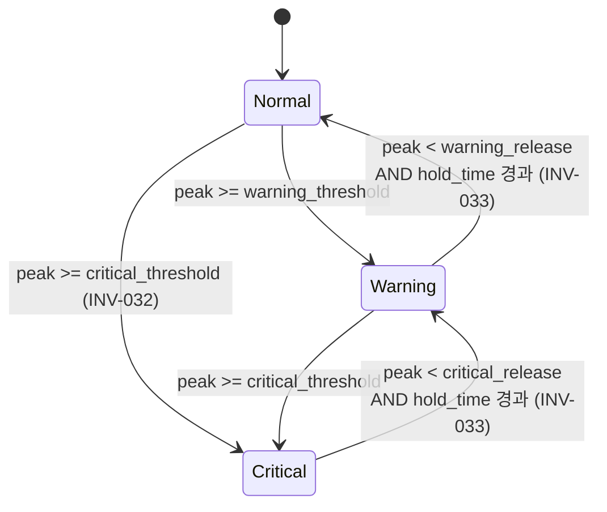
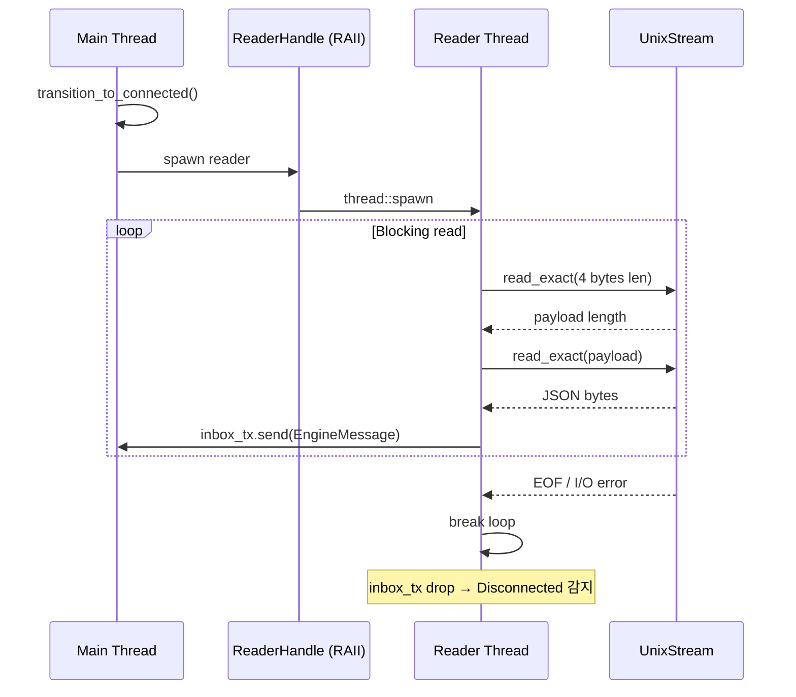
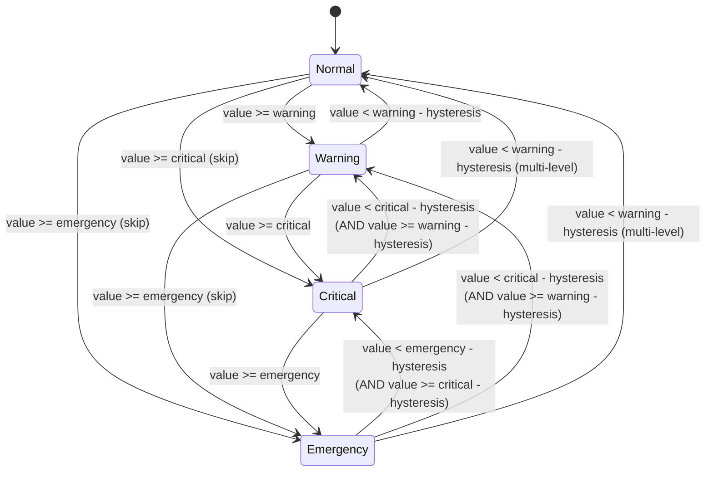
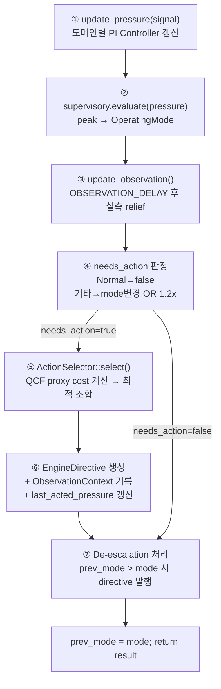
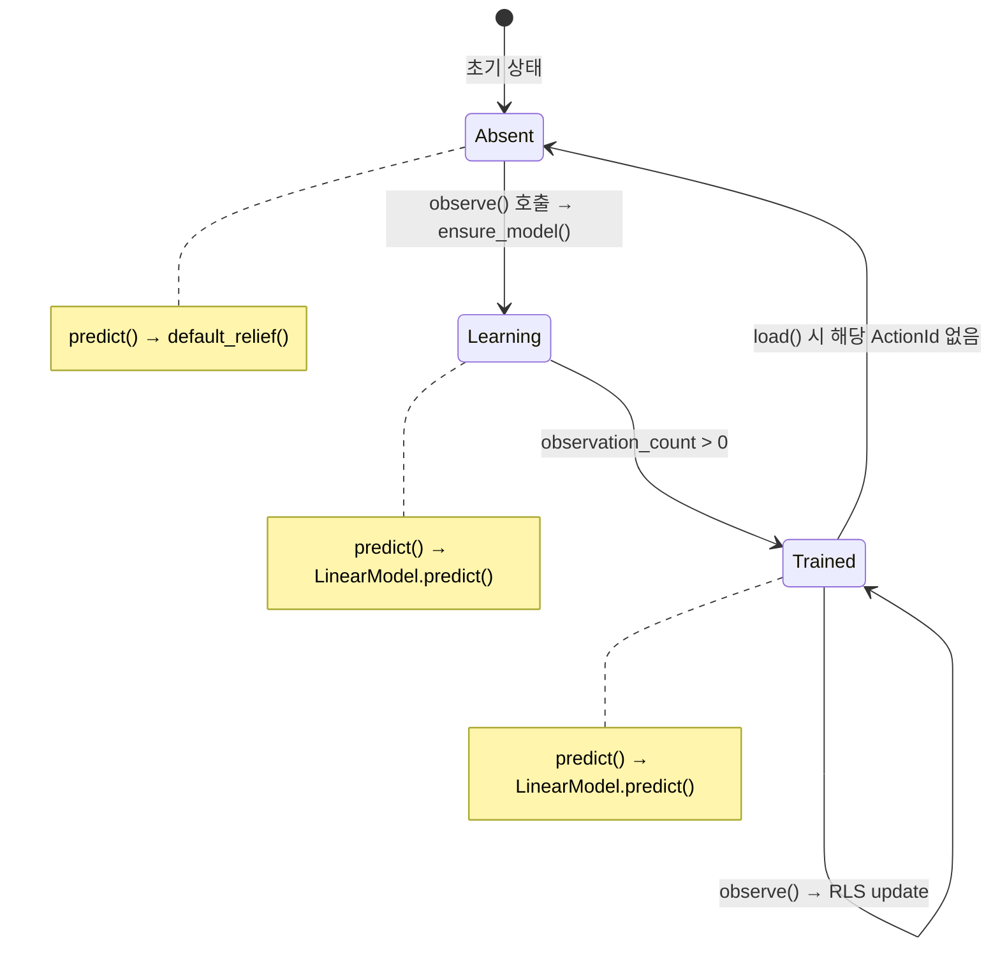

# Manager State Machines -- Architecture

> spec/21-manager-state.md의 구현 상세. 컴포넌트별 상태 기계를 기술한다.

## 1. OperatingMode FSM -- SupervisoryLayer

| spec ID | 설명 |
|---------|------|
| MGR-050~055, INV-032, INV-033 | 운영 모드 상태 기계 |

### 설계 결정

- **3-state FSM**: `Normal`, `Warning`, `Critical`. `PartialOrd`/`Ord` derive로 비교 연산을 지원한다.
- **비대칭 전이**: 에스컬레이션은 즉시(단계 건너뛰기 가능), 디에스컬레이션은 `hold_time` 경과 후 1단계씩.
- **Worst-wins**: `PressureVector.max()`로 3개 도메인 중 최대 peak을 사용한다.
- **테스트 용이성**: `evaluate_at(pressure, now: Instant)`으로 시간 주입을 지원한다.
- `stable_since: Option<Instant>` — 하강 안정화 타이머. 상승 또는 현상 유지 시 `None`으로 리셋.

### 인터페이스

```rust
// manager/src/supervisory.rs

pub struct SupervisoryLayer {
    mode: OperatingMode,
    warning_threshold: f32,     // 기본 0.4
    critical_threshold: f32,    // 기본 0.7
    warning_release: f32,       // 기본 0.25
    critical_release: f32,      // 기본 0.50
    hold_time: Duration,        // 기본 4.0초
    stable_since: Option<Instant>,
}

impl SupervisoryLayer {
    pub fn new(config: &SupervisoryConfig) -> Self;
    pub fn mode(&self) -> OperatingMode;
    pub fn evaluate(&mut self, pressure: &PressureVector) -> OperatingMode;
    pub fn evaluate_at(&mut self, pressure: &PressureVector, now: Instant) -> OperatingMode;
}
```

**Pre/Post conditions for `evaluate`**:
- **Pre**: `pressure`는 유효한 `PressureVector` (각 도메인 0.0~1.0 범위 권장).
- **Post**: 반환값은 새로운 `OperatingMode`. 내부 `self.mode`가 갱신됨.
- **INV-032**: `peak >= critical_threshold`이면 현재 모드 무관하게 `Critical` 직행.
- **INV-033**: 디에스컬레이션은 1단계씩만 (`Critical → Warning → Normal`).

### 전이 다이어그램



### 전이 테이블 상세

| 현재 상태 | 조건 | 다음 상태 | stable_since |
|-----------|------|----------|-------------|
| Normal | `peak >= critical_threshold` | Critical | None |
| Normal | `peak >= warning_threshold` | Warning | None |
| Normal | `peak < warning_threshold` | Normal | None |
| Warning | `peak >= critical_threshold` | Critical | None |
| Warning | `peak >= warning_threshold` | Warning (유지) | None |
| Warning | `peak < warning_release` AND `hold_time` 미경과 | Warning (대기) | Some(now) 또는 유지 |
| Warning | `peak < warning_release` AND `hold_time` 경과 | Normal | None |
| Warning | `warning_release <= peak < warning_threshold` | Warning (하강 불충분) | None |
| Critical | `peak >= critical_threshold` | Critical (유지) | None |
| Critical | `peak < critical_release` AND `hold_time` 미경과 | Critical (대기) | Some(now) 또는 유지 |
| Critical | `peak < critical_release` AND `hold_time` 경과 | Warning | None |
| Critical | `critical_release <= peak < critical_threshold` | Critical (하강 불충분) | None |

### De-escalation과 Pipeline 상호작용

`process_signal()`에서 `prev_mode > mode` 감지 시:
- `Critical → Warning`: `build_lossy_release_directive()` — lossy 액션 해제 (현재 RestoreDefaults 사용)
- `* → Normal`: `build_restore_directive()` — 모든 액션 복원 (`EngineCommand::RestoreDefaults`)

## 2. ConnectionState -- 양방향 채널 연결 관리

| spec ID | 설명 |
|---------|------|
| MGR-060~066 | ConnectionState 3-state FSM |

### 설계 결정

- **명시적 상태 모델링**: `enum ConnectionState { Listening, Connected, Disconnected }`로 연결 상태를 타입 안전하게 관리한다.
- **비대칭 끊김 수렴**: Writer 에러와 Reader EOF 모두 `Disconnected`로 수렴하여 처리를 단순화한다.
- **ReaderHandle RAII**: Drop 시 join하지 않음. Reader thread는 stream EOF 시 자연 종료한다.
- **sync_channel(64)**: Reader thread → main thread 메시지 버퍼 크기 64.
- **재연결**: `ensure_connected()`가 `Disconnected` 상태에서 non-blocking accept를 시도한다.

### 인터페이스

```rust
// manager/src/channel/unix_socket.rs

pub struct UnixSocketChannel { /* ... */ }

impl UnixSocketChannel {
    pub fn new(socket_path: &Path) -> anyhow::Result<Self>;
    pub fn wait_for_client(&mut self, timeout: Duration, shutdown: &Arc<AtomicBool>) -> bool;
}

// Emitter 구현: emit(), emit_initial(), emit_directive(), name()
// EngineReceiver 구현: try_recv(), is_connected()
```

### 전이 다이어그램

```mermaid
stateDiagram-v2
    [*] --> Listening : new()

    Listening --> Connected : wait_for_client() accept 성공

    Connected --> Disconnected : write 에러 (emit/emit_directive)
    Connected --> Disconnected : inbox TryRecvError::Disconnected (reader EOF)

    Disconnected --> Connected : ensure_connected() accept 성공
    note right of Disconnected : emit() 호출 시 자동 재연결 시도
```

### Reader Thread 구조



### TcpChannel

`TcpChannel` (`channel/tcp.rs`)은 `TcpConnectionState` enum으로 동일한 3-state 패턴을 구현한다.
`TcpListener` 기반이며, `Emitter + EngineReceiver`를 동시 구현한다.

## 3. ThresholdEvaluator -- 히스테리시스 임계값 평가

| spec ID | 설명 |
|---------|------|
| MGR-067~073 | ThresholdEvaluator 4-level FSM |

### 설계 결정

- **4-level 상태**: `Level { Normal, Warning, Critical, Emergency }` (llm_shared 크레이트 정의).
- **방향별 로직 분리**: `Direction::Ascending` (높을수록 나쁨)과 `Direction::Descending` (낮을수록 나쁨).
- **에스컬레이션 즉시, 단계 건너뛰기 가능**: 측정값이 Emergency 임계값을 넘으면 Normal에서 바로 Emergency.
- **Recovery 히스테리시스**: Ascending은 `threshold - hysteresis`, Descending은 `threshold + hysteresis`를 recovery 임계값으로 사용.
- 각 Monitor가 내부적으로 `ThresholdEvaluator`를 소유한다. Level 변경 시에만 `SystemSignal`을 전송한다.

### 인터페이스

```rust
// manager/src/evaluator.rs

pub enum Direction { Ascending, Descending }

pub struct Thresholds {
    pub warning: f64,
    pub critical: f64,
    pub emergency: f64,   // f64::MAX/MIN으로 비활성화 가능
    pub hysteresis: f64,
}

pub struct ThresholdEvaluator { /* ... */ }

impl ThresholdEvaluator {
    pub fn new(direction: Direction, thresholds: Thresholds) -> Self;
    pub fn evaluate(&mut self, value: f64) -> Option<Level>;  // 변경 시 Some
    pub fn level(&self) -> Level;
}
```

**Pre/Post conditions for `evaluate`**:
- **Pre**: `value`는 해당 메트릭의 원시 측정값.
- **Post**: 레벨 변경 시 `Some(new_level)` 반환. 미변경 시 `None`. 내부 `current`가 갱신됨.

### 전이 다이어그램 (Ascending)



### Monitor별 기본 임계값

| Monitor | Direction | Warning | Critical | Emergency | Hysteresis |
|---------|-----------|---------|----------|-----------|------------|
| Memory | Descending | 40% avail | 20% avail | 10% avail | 5% |
| Thermal | Ascending | 60000mc (60C) | 75000mc (75C) | 85000mc (85C) | 5000mc |
| Compute | Ascending | 70% usage | 90% usage | f64::MAX (비활성) | 5% |
| Energy | Descending | 30% battery | 15% battery | 5% battery | 2.0 (하드코딩) |

### 예외 처리

- Compute의 Emergency를 `f64::MAX`로 설정하여 Emergency 레벨 도달을 사실상 차단한다.
- Energy의 hysteresis는 config에 노출되지 않고 2.0으로 하드코딩되어 있다.

## 4. PolicyPipeline 실행 흐름 -- signal → pressure → mode → action

| spec ID | 설명 |
|---------|------|
| MGR-074~082 | HierarchicalPolicy 내부 상태 |

### 설계 결정

- `HierarchicalPolicy`의 `process_signal()` 구현은 7단계 순차 처리로 구성된다.
- `needs_action` 판정: Normal이면 항상 `false`. Warning/Critical에서는 모드 변경 또는 도메인별 pressure가 `last_acted_pressure`의 1.2배를 초과할 때 `true`.
- `ObservationContext`: 액션 적용 직전의 pressure 스냅샷, feature vector, 적용 액션 목록, 적용 시각을 기록한다. `OBSERVATION_DELAY_SECS` 후 실측 relief 계산.
- `update_engine_state()`: Heartbeat 메시지만 처리 (Capability, Response 무시). `available_actions`, `active_actions`는 `ActionId::from_str()` 파싱으로 캐싱.

### HierarchicalPolicy 상태 필드

```rust
// manager/src/pipeline.rs (주요 필드만)

pub struct HierarchicalPolicy {
    pi_compute: PiController,
    pi_memory: PiController,
    pi_thermal: PiController,
    supervisory: SupervisoryLayer,
    registry: ActionRegistry,
    estimator: OnlineLinearEstimator,
    engine_state: FeatureVector,           // 13차원, heartbeat로 갱신
    pressure: PressureVector,              // PI Controller 출력
    prev_mode: OperatingMode,              // 직전 모드 (de-escalation 감지)
    last_acted_pressure: PressureVector,   // 마지막 액션 시 pressure 스냅샷
    pending_observation: Option<ObservationContext>,  // 관측 대기 컨텍스트
    latency_budget: f32,                   // Selector latency 상한
    dt: f32,                               // PI update dt (기본 0.1초)
    relief_model_path: Option<String>,     // 모델 저장/로드 경로
    available_actions: Vec<ActionId>,      // Engine 보고 가능 액션
    active_actions_reported: Vec<ActionId>, // Engine 보고 활성 액션
    last_signal_time: HashMap<&'static str, Instant>,  // 실측 dt 계산용
}
```

### process_signal 7단계 흐름



### needs_action 판정 로직

```
match mode {
    Normal => false,
    Warning | Critical =>
        mode != prev_mode                              // 모드 변경
        OR pressure.any_domain_exceeds(                // 또는 pressure 급등
            last_acted_pressure, 1.2
        )
}
```

`any_domain_exceeds`는 3개 도메인 중 하나라도 reference의 `factor`배를 초과하면 `true`.

## 5. ReliefEstimator Lifecycle

| spec ID | 설명 |
|---------|------|
| MGR-083~087 | ReliefEstimator 생명주기 |

### 설계 결정

- 액션별 독립 `LinearModel` (`HashMap<ActionId, LinearModel>`).
- **3-phase lifecycle**: Absent (모델 미생성) → Learning (첫 observe로 생성) → Trained (observation_count > 0).
- Absent/Learning 단계에서 `predict()`는 하드코딩 `default_relief()` prior를 반환한다.
- RLS(Recursive Least Squares): `W × phi + b` 선형 모델. P matrix는 `D x D` (D=13) 역공분산 행렬.

### 생명주기 다이어그램



### 저장/복원

- `save()`: `SavedEstimator` struct를 JSON (`serde_json::to_string_pretty`)으로 직렬화. ActionId를 문자열 키로 변환.
- `load()`: JSON에서 역직렬화. 인식 불가한 ActionId 문자열은 건너뛴다. 기존 모델은 clear 후 복원.

## Config

| config 키 | 타입 | 기본값 | spec/ 근거 |
|-----------|------|--------|-----------|
| `policy.supervisory.warning_threshold` | f32 | 0.4 | MGR-054 |
| `policy.supervisory.critical_threshold` | f32 | 0.7 | MGR-054 |
| `policy.supervisory.warning_release` | f32 | 0.25 | MGR-054 |
| `policy.supervisory.critical_release` | f32 | 0.50 | MGR-054 |
| `policy.supervisory.hold_time_secs` | f32 | 4.0 | MGR-054 |
| Memory thresholds | f64 | w=40, c=20, e=10, h=5 | MGR-067 |
| Thermal thresholds | f64 (mc) | w=60000, c=75000, e=85000, h=5000 | MGR-067 |
| Compute thresholds | f64 | w=70, c=90, e=MAX, h=5 | MGR-067 |
| Energy thresholds | f64 | w=30, c=15, e=5, h=2.0 (하드코딩) | MGR-067 |

## Spec ID 매핑 요약

| spec ID | 컴포넌트 | 모듈 |
|---------|----------|------|
| MGR-050~055, INV-032, INV-033 | OperatingMode FSM | `types.rs`, `supervisory.rs` |
| MGR-060~066 | ConnectionState FSM | `channel/unix_socket.rs`, `channel/tcp.rs` |
| MGR-067~073 | ThresholdEvaluator FSM | `evaluator.rs` |
| MGR-074~082 | PolicyPipeline 내부 상태 | `pipeline.rs` |
| MGR-083~087 | ReliefEstimator Lifecycle | `relief/mod.rs`, `relief/linear.rs` |