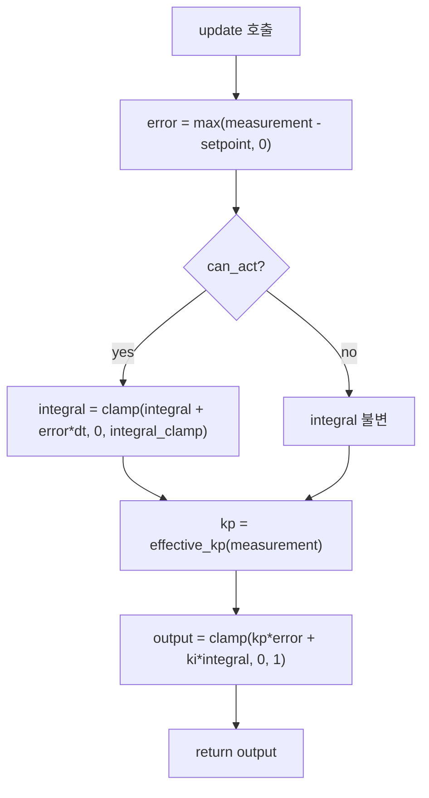
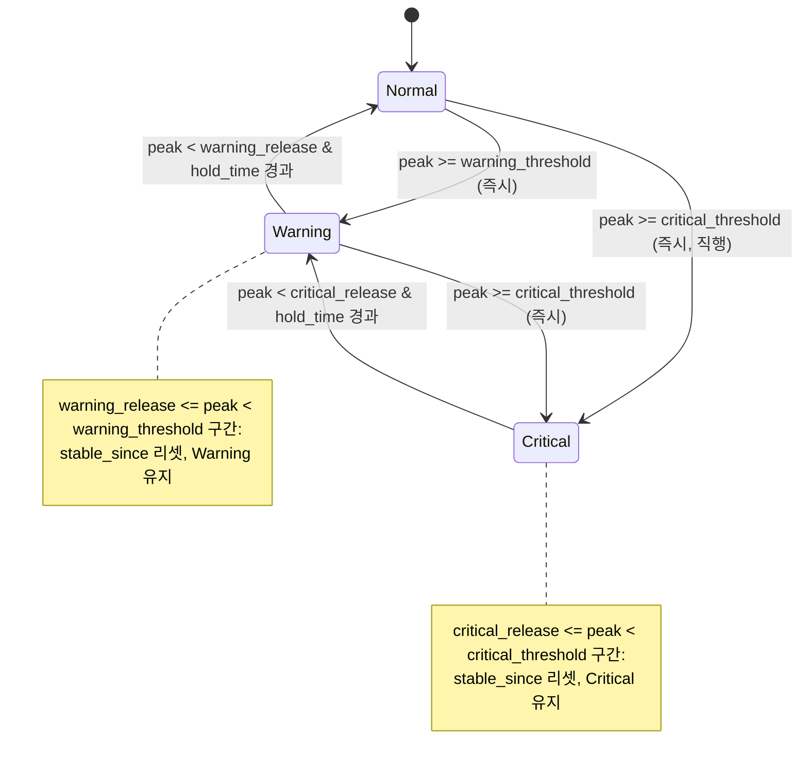
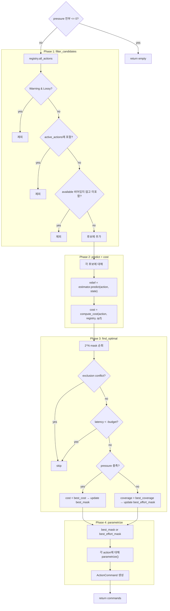
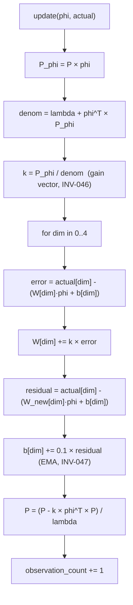
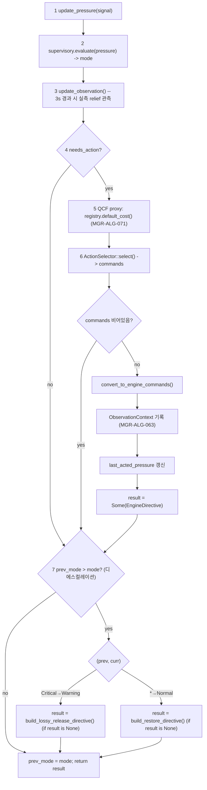
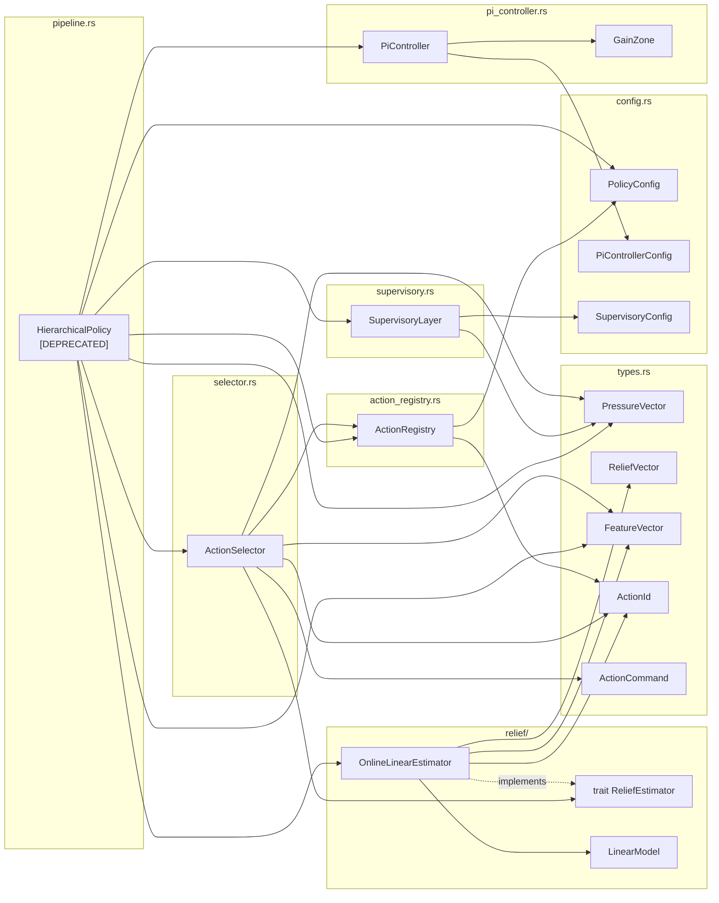
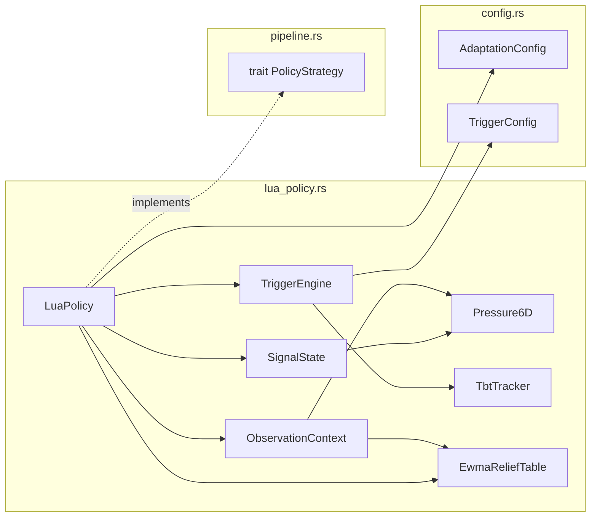

# Manager Algorithms -- Architecture

> spec/22-manager-algorithms.md (WHAT) → 구현 상세 (HOW).
> 컴포넌트 중심으로 설계 결정, 인터페이스, 처리 흐름, 예외 처리, 코드-스펙 차이를 기술한다.

---

## 1. PiController (MGR-ALG-010~016, INV-030~031) **[DEPRECATED: `#[cfg(feature = "hierarchical")]`]**

> **DEPRECATED (2026-04)**: `hierarchical` feature flag 뒤로 이동. LuaPolicy는 PI Controller 대신 `SignalState.pressure_with_thermal()`로 직접 pressure를 계산한다 (§8 참조).

**파일**: `manager/src/pi_controller.rs`

### 1.1 설계 결정

spec은 "도메인별 독립 압력 계산기"를 요구한다 (MGR-ALG-010). 구현은 단일 `PiController` struct를 도메인별로 인스턴스화하여 사용한다. Compute/Thermal은 PI 제어, Memory는 PI 경유하되 **코드-스펙 차이**가 있다 (아래 1.6 참조).

Gain scheduling (MGR-ALG-011)은 `gain_zones: Vec<GainZone>`으로 구현하며, builder 패턴 (`with_gain_zones()`)으로 선택적 주입한다. 현재 Memory 인스턴스만 gain scheduling을 사용하고, Compute/Thermal은 고정 Kp이다.

Anti-windup (MGR-ALG-012)은 이중 메커니즘으로 구현한다:
- `can_act` 플래그: 해소 가능한 액션 부재 시 적분 동결 (INV-030)
- `integral_clamp`: 적분 상한 제한 (INV-031)

### 1.2 인터페이스

```rust
pub struct GainZone {
    pub above: f32,   // measurement 임계값
    pub kp: f32,      // 이 구간의 비례 이득
}

pub struct PiController {
    kp: f32,
    ki: f32,
    setpoint: f32,
    integral: f32,
    integral_clamp: f32,
    can_act: bool,
    gain_zones: Vec<GainZone>,
}

impl PiController {
    pub fn new(kp: f32, ki: f32, setpoint: f32, integral_clamp: f32) -> Self
    // POST: integral = 0.0, can_act = true, gain_zones = []

    pub fn with_gain_zones(mut self, zones: Vec<GainZone>) -> Self
    // Builder 패턴. PRE: zones는 above 기준 오름차순 정렬

    pub fn update(&mut self, measurement: f32, dt: f32) -> f32
    // PRE: measurement in [0, 1], dt > 0
    // POST: output in [0, 1] (INV-031)
    // POST: can_act == false 이면 integral 불변 (INV-030)

    pub fn set_can_act(&mut self, can_act: bool)
    // Anti-windup 플래그 설정

    pub fn reset_integral(&mut self)
    // POST: integral = 0.0
}
```

### 1.3 처리 흐름



`effective_kp(measurement)` — `gain_zones`를 역순 탐색하여 `measurement >= zone.above`인 첫 zone의 `kp`를 반환. zones가 비어있으면 기본 `self.kp` 반환.

### 1.4 인스턴스 구성 (pipeline.rs 내)

| 인스턴스 | kp | ki | setpoint | integral_clamp | gain_zones | spec ID |
|---------|----|----|----------|---------------|------------|---------|
| `pi_compute` | 1.5 | 0.3 | 0.70 | 2.0 | 없음 | MGR-ALG-013 |
| `pi_thermal` | 1.0 | 0.2 | 0.80 | 2.0 | 없음 | MGR-ALG-013 |
| `pi_memory` | 2.0 | 0.5 | 0.75 | 2.0 | config 주입 | MGR-ALG-013 |

인스턴스 생성은 `HierarchicalPolicy::new()` (`manager/src/pipeline.rs`)에서 `PiControllerConfig` 기반으로 수행한다.

### 1.5 Measurement Normalization (update_pressure)

`HierarchicalPolicy::update_pressure()` (`manager/src/pipeline.rs`)이 SystemSignal에서 도메인별 measurement를 추출한다.

| SystemSignal | 측정값 변환 | PI 인스턴스 | spec ID |
|-------------|-----------|------------|---------|
| MemoryPressure | `m = clamp(1 - available/total, 0, 1)` | `pi_memory` | MGR-ALG-014 |
| ThermalAlert | `m = clamp(temperature_mc / 85000, 0, 1)` | `pi_thermal` | MGR-ALG-014 |
| ComputeGuidance | `m = max(cpu_pct/100, gpu_pct/100)` | `pi_compute` | MGR-ALG-014 |
| EnergyConstraint | `m = level_to_measurement(level) * 0.5` | `pi_compute` (보조) | MGR-ALG-015 |

`elapsed_dt()` 메서드 (MGR-ALG-016): 도메인별 `last_signal_time` HashMap을 유지하여 실측 dt를 계산한다. 첫 신호 시 default 0.1s, 결과는 `[0.001, 10.0]`으로 clamp.

### 1.6 코드-스펙 차이

| 항목 | 스펙 (WHAT) | 코드 (HOW) | 영향 |
|------|------------|-----------|------|
| **Memory 압력 계산** (MGR-ALG-013a) | `pressure.memory = m` (직접 매핑, PI 미경유) | `self.pi_memory.update(m, dt)` (PI 경유) | 코드가 PI 평활화를 적용하여 OOM 상황에서 반응이 지연됨. 스펙 의도는 즉각 반영. |
| **EnergyConstraint** (MGR-ALG-015) | raw `battery_pct` → `clamp(1 - battery_pct/100, 0, 1) * 0.5` | `level_to_measurement(level) * 0.5` (4단계 이산 변환) | 코드는 Level enum (Normal=0.0, Warning=0.55, Critical=0.80, Emergency=1.0)으로 변환. 스펙은 연속 raw 값 사용. |

### 1.7 테스트 커버리지

`manager/src/pi_controller.rs` 내 12개 유닛 테스트:
- zero error 출력, proportional-only, 적분 누적, anti-windup (can_act/clamp), 출력 범위, spike vs sustained, reset, gain zones (empty/low/mid/high/critical).

---

## 2. SupervisoryLayer (MGR-ALG-020~024, INV-032~036) **[DEPRECATED: `#[cfg(feature = "hierarchical")]`]**

> **DEPRECATED (2026-04)**: `hierarchical` feature flag 뒤로 이동. LuaPolicy는 `TriggerEngine`(3 triggers + hysteresis)으로 대체한다 (§9 참조).

**파일**: `manager/src/supervisory.rs`

### 2.1 설계 결정

spec은 "peak pressure 기반 3-state 운영 모드 판정, 비대칭 hysteresis"를 요구한다 (MGR-ALG-020~021). 구현 전략:

- **에스컬레이션**: 즉시 전환. Normal에서 Critical 직행 가능 (INV-032).
- **디에스컬레이션**: `hold_time` 동안 release threshold 미만 유지 후 1단계씩 하강 (INV-033). `stable_since: Option<Instant>` 필드로 추적.
- **테스트 용이성**: `evaluate_at(&mut self, pressure, now: Instant)` 메서드로 시간 주입 가능. 공개 `evaluate()` 메서드는 `Instant::now()` 위임.

### 2.2 인터페이스

```rust
pub struct SupervisoryLayer {
    mode: OperatingMode,
    warning_threshold: f32,
    critical_threshold: f32,
    warning_release: f32,
    critical_release: f32,
    hold_time: Duration,
    stable_since: Option<Instant>,
}

impl SupervisoryLayer {
    pub fn new(config: &SupervisoryConfig) -> Self
    // POST: mode = Normal, stable_since = None

    pub fn mode(&self) -> OperatingMode

    pub fn evaluate(&mut self, pressure: &PressureVector) -> OperatingMode
    // POST: mode 갱신 및 반환

    pub fn evaluate_at(&mut self, pressure: &PressureVector, now: Instant) -> OperatingMode
    // 테스트용 시간 주입 버전
}
```

### 2.3 상태 전이 흐름



**디에스컬레이션 상세**: peak가 release threshold 미만이 될 때 `stable_since = Some(now)` 설정. 이후 호출에서 `now - stable_since >= hold_time`이면 1단계 하강. 중간에 peak가 재상승하면 `stable_since = None`으로 리셋 (hold_time 재시작).

### 2.4 needs_action 판정 (MGR-ALG-024)

`HierarchicalPolicy::process_signal()` 내부에서 수행:

```rust
let needs_action = match mode {
    OperatingMode::Normal => false,
    _ => mode != self.prev_mode
        || self.pressure.any_domain_exceeds(&self.last_acted_pressure, 1.2),
};
```

- Normal 모드: 항상 false.
- Warning/Critical: 모드 변경 시 또는 **어느 한 도메인이든** 마지막 액션 시점 대비 20% 이상 압력 증가 시 true.

### 2.5 Config

| 파라미터 | 기본값 | 불변식 |
|---------|--------|--------|
| `warning_threshold` | 0.4 | INV-036: `< critical_threshold` |
| `critical_threshold` | 0.7 | |
| `warning_release` | 0.25 | INV-034: `< warning_threshold` |
| `critical_release` | 0.50 | INV-035: `< critical_threshold` |
| `hold_time_secs` | 4.0 | |

불변식 보증: `SupervisoryConfig::default()` 값으로 보증. 런타임 검증은 없음 (config 로딩 시 위반 가능).

### 2.6 테스트 커버리지

`manager/src/supervisory.rs` 내 8개 유닛 테스트:
- 정상 유지, Warning/Critical 에스컬레이션, 직행, hold_time 미충족/경과, spike 리셋, stepwise 디에스컬레이션.

---

## 3. ActionSelector (MGR-ALG-030~037, INV-037~045) **[DEPRECATED: `#[cfg(feature = "hierarchical")]`]**

> **DEPRECATED (2026-04)**: `hierarchical` feature flag 뒤로 이동. LuaPolicy는 Lua 스크립트 내에서 직접 액션을 선택한다.

**파일**: `manager/src/selector.rs`

### 3.1 설계 결정

spec은 "전수 탐색 후 최소 비용 조합 선택"을 요구한다 (MGR-ALG-030). 구현 전략:

- **Stateless unit struct**: `ActionSelector`는 필드 없는 unit struct. 모든 상태는 `select()` 호출 인자로 전달된다. 이로써 테스트에서 쉽게 mock 주입 가능.
- **2^N bitmask 순회**: N <= 8 제약 (MGR-ALG-037) 하에 최대 256 조합이므로 상수 시간에 완료된다 (O(2^N * N^2) = 최대 16384 연산).
- **best-effort 폴백**: 어떤 조합도 전체 pressure를 해소하지 못하면 coverage 최대화 조합을 반환 (INV-043).

### 3.2 인터페이스

```rust
pub struct ActionSelector;  // unit struct, stateless

impl ActionSelector {
    pub fn select(
        registry: &ActionRegistry,
        estimator: &dyn ReliefEstimator,
        pressure: &PressureVector,
        mode: OperatingMode,
        engine_state: &FeatureVector,
        qcf_values: &HashMap<ActionId, f32>,
        latency_budget: f32,
        active_actions: &[ActionId],
        available_actions: &[ActionId],
    ) -> Vec<ActionCommand>
    // PRE: mode != Normal (호출측에서 보장; 내부적으로 pressure=0 조기 반환)
    // POST: 각 ActionCommand.params 값 in [range.min, range.max] (INV-044)
    // POST: Warning 모드 → 반환에 Lossy 액션 없음 (INV-037)
    // POST: active_actions에 포함된 액션 없음 (INV-038)
    // POST: Lossless cost = 0 (INV-039)
    // POST: QCF 없는 Lossy = INFINITY (INV-040)
}
```

### 3.3 4-Phase 처리 흐름



### 3.4 핵심 내부 함수

| 함수 | spec ID | 역할 |
|------|---------|------|
| `filter_candidates()` | MGR-ALG-031 | Warning/active/available 필터. INV-037, INV-038 보증. |
| `compute_cost()` | MGR-ALG-032 | Lossless=0.0, Lossy=QCF값 또는 INFINITY. INV-039, INV-040 보증. |
| `find_optimal()` | MGR-ALG-033 | 2^N bitmask 순회. exclusion (INV-041), latency budget (INV-042), best-effort (INV-043). |
| `has_exclusion_conflict()` | MGR-ALG-034 | O(N^2) 쌍별 검사 via `registry.is_excluded()`. |
| `parametrize()` | MGR-ALG-035 | 선형 보간: `value = max - intensity * (max - min)`, clamp. INV-044 보증. |

### 3.5 ActionCommand → EngineCommand 변환 (MGR-ALG-036)

**파일**: `manager/src/pipeline.rs` — 모듈 레벨 함수 `action_to_engine_command()`

| ActionId | EngineCommand | 파라미터 |
|----------|-------------|---------|
| SwitchHw | `SwitchHw { device: "cpu" }` | 고정 |
| Throttle | `Throttle { delay_ms }` | `params["delay_ms"] as u64` |
| KvEvictSliding | `KvEvictSliding { keep_ratio }` | `params["keep_ratio"]` |
| KvEvictH2o | `KvEvictH2o { keep_ratio }` | `params["keep_ratio"]` |
| KvOffloadDisk | `KvEvictSliding { keep_ratio: 0.8 }` | fallback 고정 |
| KvQuantDynamic | `KvQuantDynamic { target_bits }` | `params["target_bits"] as u8` |
| LayerSkip | `LayerSkip { skip_ratio }` | `skip_layers / total_layers`, clamp [0, 1] |
| (any, Release) | None | restore directive에서 일괄 처리 |

### 3.6 primary_domain 매핑 (INV-045)

**파일**: `manager/src/types.rs` — `ActionId::primary_domain()`

| ActionId | Domain |
|----------|--------|
| SwitchHw, Throttle, LayerSkip | Compute |
| KvOffloadDisk, KvEvictSliding, KvEvictH2o, KvQuantDynamic | Memory |

### 3.7 테스트 커버리지

`manager/src/selector.rs` 내 10개 유닛 테스트:
- Warning lossless only, Critical minimum cost, cross-domain single action, exclusion group, latency budget, best-effort, empty candidates, parametrize proportional, no action at zero pressure, active exclusion, available_actions filtering.

`MockEstimator` (테스트 전용): `HashMap<ActionId, ReliefVector>` 기반 predict, observe/save/load는 no-op.

---

## 4. ReliefEstimator / OnlineLinearEstimator (MGR-ALG-040~047, INV-046~049) **[DEPRECATED: `#[cfg(feature = "hierarchical")]`]**

> **DEPRECATED (2026-04)**: `hierarchical` feature flag 뒤로 이동. LuaPolicy는 `EwmaReliefTable`(6D EWMA)로 대체한다 (§10 참조).

**파일**: `manager/src/relief/mod.rs` (trait), `manager/src/relief/linear.rs` (구현체)

### 4.1 설계 결정

spec은 "Strategy 패턴 인터페이스 + RLS 온라인 선형 회귀 구현"을 요구한다 (MGR-ALG-040~041).

- **trait ReliefEstimator**: `predict`, `observe`, `save`, `load`, `observation_count` 5개 메서드. `Send + Sync` bound로 스레드 안전 보장.
- **OnlineLinearEstimator**: 액션별 독립 `LinearModel`을 `HashMap<ActionId, LinearModel>`로 관리.
- **지연 초기화**: `observe()` 호출 시에만 `ensure_model()`로 모델 생성. `predict()`는 모델 미존재 또는 `observation_count == 0` 시 `default_relief()` 반환 (MGR-ALG-042).
- **default_relief**: 하드코딩 prior 테이블 (MGR-ALG-043). 학습 데이터 없는 cold start 시 합리적 초기 예측 제공.

### 4.2 인터페이스

```rust
// --- trait (relief/mod.rs) ---
pub trait ReliefEstimator: Send + Sync {
    fn predict(&self, action: &ActionId, state: &FeatureVector) -> ReliefVector;
    fn observe(&mut self, action: &ActionId, state: &FeatureVector, actual: &ReliefVector);
    fn save(&self, path: &Path) -> io::Result<()>;
    fn load(&mut self, path: &Path) -> io::Result<()>;
    fn observation_count(&self, action: &ActionId) -> u32;
}

// --- 구현체 (relief/linear.rs) ---
pub struct OnlineLinearEstimator {
    models: HashMap<ActionId, LinearModel>,
    feature_dim: usize,        // FEATURE_DIM = 13
    forgetting_factor: f32,    // lambda, default 0.995
}

impl OnlineLinearEstimator {
    pub fn new(feature_dim: usize, forgetting_factor: f32) -> Self
    pub fn default_config() -> Self
    // POST: feature_dim = 13, forgetting_factor = 0.995
}
```

### 4.3 LinearModel 내부 구조

```rust
struct LinearModel {        // 비공개, Serialize/Deserialize
    weights: Vec<Vec<f32>>, // 4 x D 행렬
    bias: [f32; 4],         // 4차원 bias
    p_matrix: Vec<Vec<f32>>,// D x D 역공분산 행렬
    forgetting_factor: f32, // lambda
    observation_count: u32,
}
```

- **초기화** (MGR-ALG-045, INV-048): `W = zeros(4, D)`, `b = [0; 4]`, `P = 100 * I(D)`.
- P의 큰 초기값은 초기 관측에 높은 학습률을 부여한다.

### 4.4 RLS Update 처리 흐름 (MGR-ALG-044)



**핵심 수식**:
- Gain vector: `k = P*phi / (lambda + phi^T*P*phi)` (INV-046)
- Bias 갱신: EMA (lr=0.1), W 갱신 후 잔여 오차 기반 (INV-047)
- P 갱신: `P = (P - k * phi^T * P) / lambda`
- lambda = 0.995 → 반감기 ~138 관측 (INV-049)

### 4.5 Default Relief Prior 테이블 (MGR-ALG-043)

| ActionId | compute | memory | thermal | latency |
|----------|---------|--------|---------|---------|
| SwitchHw | 0.5 | 0.0 | 0.3 | -0.1 |
| Throttle | 0.3 | 0.0 | 0.2 | -0.3 |
| KvOffloadDisk | 0.0 | 0.4 | 0.0 | -0.2 |
| KvEvictSliding | 0.0 | 0.7 | 0.0 | 0.0 |
| KvEvictH2o | 0.0 | 0.6 | 0.0 | 0.0 |
| KvQuantDynamic | 0.0 | 0.3 | 0.0 | 0.0 |
| KvMergeD2o | 0.0 | 0.6 | 0.0 | 0.0 |
| LayerSkip | 0.3 | 0.0 | 0.1 | -0.2 |

### 4.6 Persistence (MGR-ALG-047)

- `save()`: `SavedEstimator { feature_dim, forgetting_factor, models: HashMap<String, LinearModel> }` → JSON 직렬화.
- `load()`: JSON → 파싱, `key_to_action()`으로 문자열 → ActionId 변환 (인식 불가 키는 skip).
- `action_to_key()`: ActionId ↔ snake_case 문자열 (예: `SwitchHw` ↔ `"switch_hw"`).
- 파일 부재 시 빈 models로 시작 (비치명적).

### 4.7 테스트 커버리지

`manager/src/relief/linear.rs` 내 7개 유닛 테스트:
- default relief 반환, 각 액션별 default 값 확인, observe 후 수렴 방향, 액션 독립성, save/load roundtrip, observation_count 일치, 수렴 품질.

---

## 5. 데이터 타입 (MGR-ALG-050~053, INV-045, INV-050) **[DEPRECATED: `#[cfg(feature = "hierarchical")]` 일부]**

> **일부 DEPRECATED (2026-04)**: `PressureVector`, `ReliefVector`, `FeatureVector`, `ActionId`, `ActionMeta`, `ParamRange`, `ActionParams`, `ActionCommand`, `Operation`은 `hierarchical` feature flag 뒤로 이동. `OperatingMode`는 공용 유지.

**파일**: `manager/src/types.rs`

### 5.1 PressureVector

```rust
pub struct PressureVector {
    pub compute: f32,
    pub memory: f32,
    pub thermal: f32,
}

impl PressureVector {
    pub fn max(&self) -> f32
    // MGR-ALG-022: compute.max(memory).max(thermal)

    pub fn any_domain_exceeds(&self, reference: &PressureVector, factor: f32) -> bool
    // MGR-ALG-024: 도메인별 factor 배 초과 검사
}

impl Sub for PressureVector {
    type Output = ReliefVector;
    // INV-050: latency = 0.0 (PressureVector에 latency 차원 없음)
}
```

### 5.2 ReliefVector

```rust
pub struct ReliefVector {
    pub compute: f32,
    pub memory: f32,
    pub thermal: f32,
    pub latency: f32,   // 음수 = 악화
}

impl ReliefVector {
    pub fn zero() -> Self
}
// Add, AddAssign 구현
```

### 5.3 FeatureVector (MGR-ALG-050~052)

```rust
pub const FEATURE_DIM: usize = 13;

pub struct FeatureVector {
    pub values: [f32; FEATURE_DIM],
}

impl FeatureVector {
    pub fn zeros() -> Self
    // MGR-ALG-052: 13차원 zero vector
}

pub mod feature {
    pub const KV_OCCUPANCY: usize = 0;
    pub const IS_GPU: usize = 1;
    pub const TOKEN_PROGRESS: usize = 2;
    pub const IS_PREFILL: usize = 3;          // 미사용, 확장 예약
    pub const KV_DTYPE_NORM: usize = 4;       // 미사용, 확장 예약
    pub const TBT_RATIO: usize = 5;
    pub const TOKENS_GENERATED_NORM: usize = 6;
    pub const ACTIVE_SWITCH_HW: usize = 7;    // 미사용, 확장 예약
    pub const ACTIVE_THROTTLE: usize = 8;     // 미사용, 확장 예약
    pub const ACTIVE_KV_OFFLOAD: usize = 9;   // 미사용, 확장 예약
    pub const ACTIVE_EVICTION: usize = 10;
    pub const ACTIVE_LAYER_SKIP: usize = 11;
    pub const ACTIVE_KV_QUANT: usize = 12;    // 미사용, 확장 예약
}
```

### 5.4 ActionId

```rust
pub enum ActionId {
    SwitchHw, Throttle, KvOffloadDisk,
    KvEvictSliding, KvEvictH2o, KvQuantDynamic, LayerSkip,
}

impl ActionId {
    pub fn from_str(s: &str) -> Option<ActionId>   // MGR-ALG-053
    pub fn all() -> &'static [ActionId]
    pub fn primary_domain(&self) -> Domain            // INV-045
}
```

### 5.5 기타 타입

| 타입 | 설명 |
|------|------|
| `ActionKind` | `Lossless` / `Lossy` |
| `Domain` | `Compute` / `Memory` / `Thermal` |
| `OperatingMode` | `Normal` / `Warning` / `Critical` (PartialOrd 도출) |
| `ActionMeta` | id, kind, reversible, param_range, exclusion_group, default_cost |
| `ParamRange` | param_name, min, max |
| `ActionParams` | `values: HashMap<String, f32>` |
| `ActionCommand` | action: ActionId, operation: Operation |
| `Operation` | `Apply(ActionParams)` / `Release` |

---

## 6. HierarchicalPolicy 오케스트레이션 (MGR-ALG-060~072) **[DEPRECATED: `#[cfg(feature = "hierarchical")]`]**

> **DEPRECATED (2026-04)**: `hierarchical` feature flag 뒤로 이동. LuaPolicy가 기본 정책.

**파일**: `manager/src/pipeline.rs`

### 6.1 설계 결정

spec은 "SystemSignal → PI → Supervisory → ActionSelector → EngineDirective" 7단계 순차 파이프라인을 요구한다 (MGR-ALG-070). `HierarchicalPolicy`는 이 4개 컴포넌트와 관측 컨텍스트를 통합 관리하는 오케스트레이터이다.

**PolicyStrategy trait**: 정책 계층의 공통 인터페이스. 향후 규칙 기반 정책 등으로 교체 가능 (OCP).

### 6.2 인터페이스

```rust
pub trait PolicyStrategy: Send {
    fn process_signal(&mut self, signal: &SystemSignal) -> Option<EngineDirective>;
    fn update_engine_state(&mut self, msg: &EngineMessage);
    fn mode(&self) -> OperatingMode;
    fn save_model(&self) {}  // default no-op
}

pub struct HierarchicalPolicy {
    // 컴포넌트
    pi_compute: PiController,
    pi_memory: PiController,
    pi_thermal: PiController,
    supervisory: SupervisoryLayer,
    registry: ActionRegistry,
    estimator: OnlineLinearEstimator,
    // 상태
    engine_state: FeatureVector,
    pressure: PressureVector,
    prev_mode: OperatingMode,
    last_acted_pressure: PressureVector,
    pending_observation: Option<ObservationContext>,
    latency_budget: f32,
    dt: f32,
    relief_model_path: Option<String>,
    available_actions: Vec<ActionId>,
    active_actions_reported: Vec<ActionId>,
    last_signal_time: HashMap<&'static str, Instant>,
}

impl HierarchicalPolicy {
    pub fn new(config: &PolicyConfig) -> Self
    pub fn set_relief_model_path(&mut self, path: String)
    pub fn set_dt(&mut self, dt: f32)
    pub fn pressure(&self) -> &PressureVector
}
```

### 6.3 process_signal 7단계 파이프라인 (MGR-ALG-070)



### 6.4 ObservationContext 수명 관리 (MGR-ALG-060~064)

```rust
struct ObservationContext {
    pressure_before: PressureVector,
    feature_vec: FeatureVector,
    applied_actions: Vec<ActionId>,
    applied_at: Instant,
}
```

| 이벤트 | 전이 | spec ID |
|--------|------|---------|
| Directive 발행 | `None → Some(ctx)` | MGR-ALG-063 |
| 3.0s 경과 | `Some → None` (observe 호출 후) | MGR-ALG-061 |
| 3.0s 미경과 | `Some` 유지 | MGR-ALG-062 |
| 새 Directive (관찰 중) | 이전 폐기, 새 ctx로 교체 | MGR-ALG-062 |

**실측 relief 계산**: `actual_relief = pressure_before - current_pressure` (INV-050: latency=0.0). 적용된 모든 액션에 동일 relief 귀속 (INV-051: 개별 기여 분리 불가).

### 6.5 update_engine_state (MGR-ALG-051)

Heartbeat 메시지에서만 FeatureVector를 갱신한다. Capability/Response 메시지는 무시.

갱신 필드: `KV_OCCUPANCY`, `IS_GPU`, `TOKEN_PROGRESS`, `TBT_RATIO`, `TOKENS_GENERATED_NORM`, `ACTIVE_EVICTION`, `ACTIVE_LAYER_SKIP`. 미사용 인덱스 (3, 4, 7, 8, 9, 12)는 기본값 0.0 유지.

또한 `available_actions`, `active_actions_reported`를 `ActionId::from_str()` 파싱으로 갱신 (MGR-ALG-053).

### 6.6 QCF Proxy (MGR-ALG-071)

실시간 QCF가 미구현이므로, `registry.default_cost(&id)`로 lossy 액션의 cost를 대체한다.

### 6.7 디에스컬레이션 Directive (MGR-ALG-064)

- Critical → Warning: `RestoreDefaults` (lossy 해제, lossless는 다음 사이클에서 재선택)
- * → Normal: `RestoreDefaults` (전체 복원)
- 동일 사이클에서 needs_action 경로에서 이미 directive가 생성된 경우 디에스컬레이션은 무시 (`result.is_none()` 확인).

### 6.8 테스트 커버리지

`manager/src/pipeline.rs` 내 유닛 테스트:
- Normal pressure 무응답, pressure 누적, (통합 테스트는 mock_engine/mock_manager 바이너리).

---

## 7. ActionRegistry **[DEPRECATED: `#[cfg(feature = "hierarchical")]`]**

> **DEPRECATED (2026-04)**: `hierarchical` feature flag 뒤로 이동.

**파일**: `manager/src/action_registry.rs`

### 7.1 설계 결정

`PolicyConfig`에서 액션 메타데이터와 배타 그룹을 파싱하여 통합 레지스트리로 관리한다. ActionSelector가 이 레지스트리에 의존하여 후보 필터링, cost 계산, exclusion 검사, 파라미터 결정을 수행한다.

### 7.2 인터페이스

```rust
pub struct ActionRegistry {
    actions: HashMap<ActionId, ActionMeta>,
    exclusion_groups: HashMap<String, Vec<ActionId>>,
}

impl ActionRegistry {
    pub fn from_config(config: &PolicyConfig) -> Self
    pub fn get(&self, action: &ActionId) -> Option<&ActionMeta>
    pub fn all_actions(&self) -> impl Iterator<Item = &ActionMeta>
    pub fn lossy_actions(&self) -> Vec<ActionId>
    pub fn is_excluded(&self, a: &ActionId, b: &ActionId) -> bool
    pub fn default_cost(&self, action: &ActionId) -> f32
}
```

`default_param_range(id)` (모듈 레벨 함수): ActionId별 하드코딩 ParamRange 반환. 예: `KvEvictSliding` → `ParamRange { param_name: "keep_ratio", min: 0.3, max: 0.9 }`.

---

## 8. Config 종합 **[DEPRECATED 섹션 — hierarchical feature 전용]**

> 아래 config 키들은 `hierarchical` feature 활성 시에만 유효하다. LuaPolicy의 config는 §12 참조.

| config 키 | 타입 | 기본값 | spec 근거 |
|-----------|------|--------|-----------|
| `policy.pi_controller.compute_kp` | f32 | 1.5 | MGR-ALG-013 |
| `policy.pi_controller.compute_ki` | f32 | 0.3 | MGR-ALG-013 |
| `policy.pi_controller.compute_setpoint` | f32 | 0.70 | MGR-ALG-013 |
| `policy.pi_controller.thermal_kp` | f32 | 1.0 | MGR-ALG-013 |
| `policy.pi_controller.thermal_ki` | f32 | 0.2 | MGR-ALG-013 |
| `policy.pi_controller.thermal_setpoint` | f32 | 0.80 | MGR-ALG-013 |
| `policy.pi_controller.integral_clamp` | f32 | 2.0 | MGR-ALG-012 |
| `policy.pi_controller.memory_kp` | f32 | 2.0 | MGR-ALG-013 |
| `policy.pi_controller.memory_ki` | f32 | 0.5 | MGR-ALG-013 |
| `policy.pi_controller.memory_setpoint` | f32 | 0.75 | MGR-ALG-013 |
| `policy.pi_controller.memory_gain_zones` | `Vec<GainZone>` | [] | MGR-ALG-011 |
| `policy.supervisory.warning_threshold` | f32 | 0.4 | MGR-ALG-023 |
| `policy.supervisory.critical_threshold` | f32 | 0.7 | MGR-ALG-023 |
| `policy.supervisory.warning_release` | f32 | 0.25 | MGR-ALG-023 |
| `policy.supervisory.critical_release` | f32 | 0.50 | MGR-ALG-023 |
| `policy.supervisory.hold_time_secs` | f32 | 4.0 | MGR-ALG-023 |
| `policy.selector.latency_budget` | f32 | 0.5 | MGR-ALG-033 |
| `policy.selector.algorithm` | String | "exhaustive" | MGR-ALG-030 |
| `policy.relief_model.forgetting_factor` | f32 | 0.995 | MGR-ALG-046 |
| `policy.relief_model.prior_weight` | u32 | 5 | MGR-ALG-045 |
| `policy.relief_model.storage_dir` | String | `"~/.llm_rs/models"` | MGR-ALG-047 |

---

## 9. 주요 상수

### 9.1 HierarchicalPolicy 상수 [DEPRECATED: `#[cfg(feature = "hierarchical")]`]

| 상수 | 값 | 코드 위치 | spec 근거 |
|------|---|----------|-----------|
| `OBSERVATION_DELAY_SECS` | 3.0 | `manager/src/pipeline.rs` | MGR-ALG-061 |
| `FEATURE_DIM` | 13 | `manager/src/types.rs` | MGR-ALG-050 |
| `level_to_measurement` | Normal=0.0, Warning=0.55, Critical=0.80, Emergency=1.0 | `manager/src/pipeline.rs` | MGR-ALG-015 (코드-스펙 차이) |
| `lr_bias` | 0.1 | `manager/src/relief/linear.rs` | MGR-ALG-044 |
| `P_init` | 100.0 * I | `manager/src/relief/linear.rs` | MGR-ALG-045 (INV-048) |
| `SEQ_COUNTER` | AtomicU64, 1부터 | `manager/src/pipeline.rs` | (내부 구현) |

### 9.2 LuaPolicy 상수

| 상수 | 값 | 코드 위치 | 설명 |
|------|---|----------|------|
| `RELIEF_DIMS` | 6 | `manager/src/lua_policy.rs` | 6D relief: gpu, cpu, memory, thermal, latency, main_app_qos |
| `OBSERVATION_DELAY_SECS` | 3.0 | `manager/src/lua_policy.rs` | 관측 settling 시간 |

---

## 10. 코드-스펙 차이 종합 (Known Divergence)

| 항목 | 스펙 (WHAT) | 코드 (HOW) | 영향 | 심각도 |
|------|------------|-----------|------|--------|
| Memory 압력 계산 (MGR-ALG-013a) | `pressure.memory = m` (직접 매핑, PI 미경유) | `self.pi_memory.update(m, dt)` (PI 경유) | PI 평활화로 OOM 즉각 대응 지연 | 높음 |
| EnergyConstraint (MGR-ALG-015) | raw `battery_pct` → 연속 변환 | `level_to_measurement(level)` → 4단계 이산 | 중간 배터리 수준(30~70%)에서 세밀한 압력 반영 불가 | 중간 |
| KvMergeD2o default relief | spec 테이블에 포함 (memory=0.6) | ActionId enum에 KvMergeD2o 정의, default_relief 포함 | 스펙-코드 일치 | 해소 |

---

## 11. 컴포넌트 의존성 다이어그램

### 11.1 HierarchicalPolicy [DEPRECATED]



### 11.2 LuaPolicy (기본 정책)



---

## 12. LuaPolicy 적응 알고리즘 (신규 2026-04)

> LuaPolicy의 Rust 측 적응 엔진 알고리즘. HierarchicalPolicy의 PI+Supervisory+Selector+RLS를 대체한다.

### 12.1 Pressure6D 직접 정규화 (SignalState → Pressure6D)

**기존 대비 차이**: HierarchicalPolicy는 PI Controller(적분+비례)를 경유하여 pressure를 평활화했다. LuaPolicy는 직접 정규화 매핑으로 **즉각적 반응**을 보장한다.

**계산 규칙**:

| 차원 | 입력 | 변환식 | 범위 |
|------|------|--------|------|
| `gpu` | `SignalState.gpu_pct` (0~100) | `gpu_pct / 100.0` | [0, 1] |
| `cpu` | `SignalState.cpu_pct` (0~100) | `cpu_pct / 100.0` | [0, 1] |
| `memory` | `mem_available / mem_total` | `1.0 - available/total` | [0, 1] |
| `thermal` | `temp_mc` (millidegree) | `(temp_c - safe) / (critical - safe)` | [0, 1] |
| `latency` | `TbtTracker.degradation_ratio()` | 직접 사용 (baseline 미확정 시 0.0) | [0, +inf) |
| `main_app` | (예약) | 0.0 | 0.0 |

**Thermal 정규화**: `temp_safe_c`(기본 35.0)과 `temp_critical_c`(기본 50.0)로 선형 보간. safe 이하 → 0.0, critical 이상 → 1.0.

### 12.2 TBT Baseline 추적 (EWMA)

**파일**: `manager/src/lua_policy.rs` — `TbtTracker`

Engine heartbeat의 `throughput` (tokens/sec)에서 TBT(Time Between Tokens)를 역산하고 EWMA로 추적한다.

**알고리즘**:

```
입력: throughput (tok/s, > 0 필수. <= 0 이면 skip)
tbt_ms = 1000.0 / throughput

if warmup_count == 0:
    ewma = tbt_ms                          # 첫 관측: 직접 대입
else:
    ewma = 0.875 * ewma + 0.125 * tbt_ms   # alpha=0.875 (Jacobson TCP RTT)

warmup_count += 1
if baseline is None and warmup_count >= warmup_target (default 20):
    baseline = ewma                        # baseline 확정

degradation_ratio = (ewma - baseline) / baseline   # baseline 대비 악화 비율
```

**설계 근거**: Alpha=0.875 (= 7/8)는 Jacobson의 TCP RTT 추정에서 유래. 빠른 적응과 노이즈 필터링의 균형. 반감기 ~5.2 관측.

### 12.3 Trigger Hysteresis

**파일**: `manager/src/lua_policy.rs` — `TriggerEngine`

각 trigger는 독립적인 **enter/exit threshold** 쌍으로 hysteresis를 구현한다.

**상태 전이**:

```
비활성 상태:
    if value > enter_threshold → 활성화

활성 상태:
    if value < exit_threshold → 비활성화
    (enter_threshold > exit_threshold 이므로 진동 방지)
```

**3개 Trigger**:

| Trigger | 입력 | enter | exit | Hysteresis gap |
|---------|------|-------|------|---------------|
| `tbt_degraded` | `degradation_ratio` | 0.30 (30% 악화) | 0.10 (10%) | 0.20 |
| `mem_low` | `pressure.memory` | 0.80 | 0.60 | 0.20 |
| `temp_high` | `pressure.thermal` (정규화) | 0.70 | 0.50 | 0.20 |

**TBT trigger 특이사항**:
- `throughput <= 0` 이면 관측 건너뜀 (0으로 나누기 방지)
- `baseline` 미확정 시 (`warmup_count < warmup_target`) trigger 갱신 안 함

### 12.4 EWMA Relief Learning

**파일**: `manager/src/lua_policy.rs` — `EwmaReliefTable`

액션별 6D relief 벡터를 EWMA로 학습한다.

**알고리즘**:

```
observe(action, observed[6]):
    entry = entries.get_or_create(action)
    if entry.observation_count == 0:
        entry.relief = observed             # 첫 관측: 직접 대입 (prior 대체)
    else:
        for i in 0..6:
            entry.relief[i] = alpha * entry.relief[i] + (1 - alpha) * observed[i]
    entry.observation_count += 1

predict(action) -> [f32; 6]:
    if entries.contains(action): return entries[action].relief
    if defaults.contains(action): return defaults[action]   # cold start prior
    return [0.0; 6]
```

**HierarchicalPolicy RLS 대비 차이**:

| 측면 | RLS (OnlineLinearEstimator) | EWMA (EwmaReliefTable) |
|------|---------------------------|------------------------|
| 입력 | 13D FeatureVector (상태 의존) | 없음 (상태 무관) |
| 모델 | 4 x D 가중치 행렬 + bias | 6D 스칼라 |
| 차원 | 4D (compute, memory, thermal, latency) | 6D (gpu, cpu, memory, thermal, latency, main_app) |
| 학습률 | 적응적 (P 행렬, forgetting factor) | 고정 alpha=0.875 |
| 복잡도 | O(D^2) per update | O(6) per update |
| 장점 | 상태 조건부 예측 가능 | 단순, 빠른 수렴, Lua 친화적 |

### 12.5 Observation (3초 Settling)

**파일**: `manager/src/lua_policy.rs` — `ObservationContext`

**알고리즘**:

```
process_signal() 내 try_complete_observation():
    if observation is None: return
    if elapsed < 3.0s: return (observation 유지)

    after = pressure_with_thermal()   # 현재 pressure 계산
    observed[0..4] = before[0..4] - after[0..4]   # 감소=양수 (호전)
    observed[5]    = after[5] - before[5]         # main_app: 증가=양수 (호전)
    relief_table.observe(action, observed)
    observation = None

decide() 반환 후:
    if commands 비어있지 않음:
        첫 번째 커맨드의 action_name으로 ObservationContext 생성
        (여러 커맨드가 반환되어도 단일 액션만 추적)
```

**단일 액션 제한 근거**: 여러 액션이 동시 적용되면 개별 기여를 분리할 수 없다. HierarchicalPolicy도 동일한 제한이 있었다 (INV-051). LuaPolicy는 이를 명시적으로 단일 액션만 추적하여 EWMA 오염을 방지한다.

---

## 13. LuaPolicy Config (AdaptationConfig)

**파일**: `manager/src/config.rs`

| config 키 | 타입 | 기본값 | 설명 |
|-----------|------|--------|------|
| `adaptation.ewma_alpha` | f32 | 0.875 | EWMA 평활 계수 (Jacobson TCP RTT) |
| `adaptation.relief_table_path` | String | "" (비활성) | Relief table JSON 저장 경로 |
| `adaptation.temp_safe_c` | f32 | 35.0 | Thermal 정규화 하한 (Celsius) |
| `adaptation.temp_critical_c` | f32 | 50.0 | Thermal 정규화 상한 (Celsius) |
| `adaptation.trigger.tbt_enter` | f64 | 0.30 | TBT degradation trigger 진입 threshold |
| `adaptation.trigger.tbt_exit` | f64 | 0.10 | TBT degradation trigger 해제 threshold |
| `adaptation.trigger.tbt_warmup_tokens` | u32 | 20 | TBT baseline 확정 전 warmup 토큰 수 |
| `adaptation.trigger.mem_enter` | f64 | 0.80 | Memory trigger 진입 threshold |
| `adaptation.trigger.mem_exit` | f64 | 0.60 | Memory trigger 해제 threshold |
| `adaptation.trigger.temp_enter` | f64 | 0.70 | Temperature trigger 진입 threshold |
| `adaptation.trigger.temp_exit` | f64 | 0.50 | Temperature trigger 해제 threshold |
| `adaptation.default_relief` | `HashMap<String, Vec<f32>>` | {} | Per-action 6D default relief (cold start prior) |