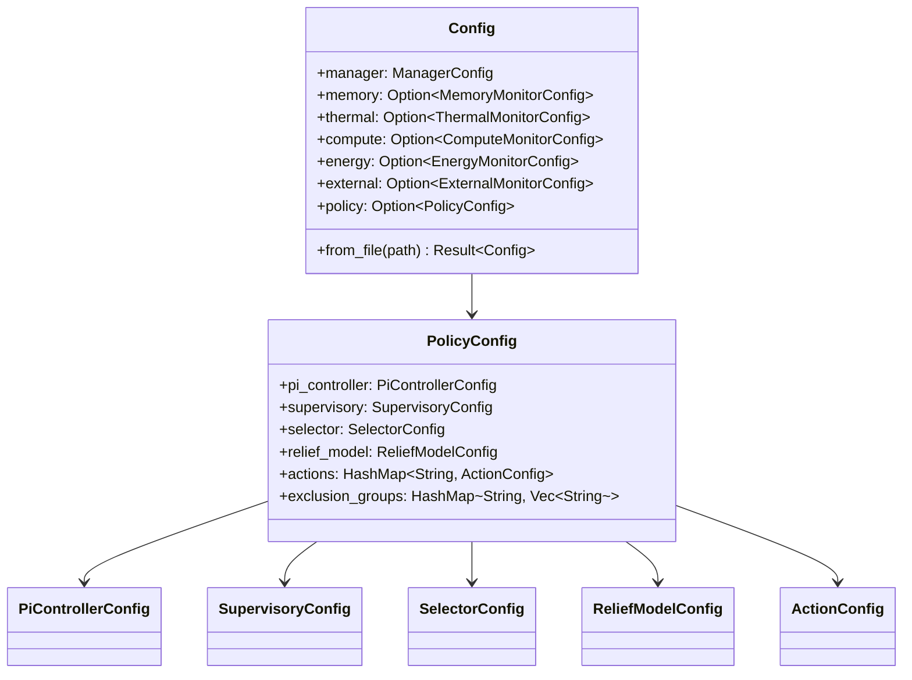
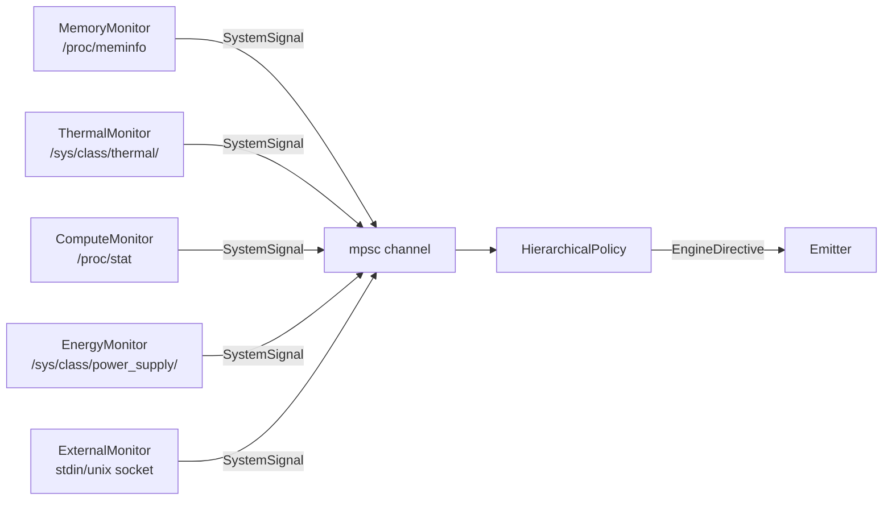

# Manager Data Types and Configuration Schema -- Architecture

> spec/23-manager-data.md의 구현 상세. 컴포넌트 중심 기술.

---

## 1. TOML Config 계층 구조

### 설계 결정

Config 시스템은 2계층 구조를 따른다:

1. **Top-level `Config`** -- 모니터 4종 + 외부 모니터 + 정책 엔진을 선택적으로 구성
2. **PolicyConfig** -- PI Controller, Supervisory, Selector, Relief Model, Actions, Exclusion Groups의 6개 하위 설정

모든 모니터 섹션은 `Option<T>` 래핑이며, 미지정 시 `None` (비활성). 정책도 `Option<PolicyConfig>`. Config 전체는 `#[serde(default)]`로 부분 TOML 파일 허용.



### 인터페이스

**`Config`** (`manager/src/config.rs`)

```rust
pub struct Config {
    pub manager: ManagerConfig,
    pub memory: Option<MemoryMonitorConfig>,
    pub thermal: Option<ThermalMonitorConfig>,
    pub compute: Option<ComputeMonitorConfig>,
    pub energy: Option<EnergyMonitorConfig>,
    pub external: Option<ExternalMonitorConfig>,
    pub policy: Option<PolicyConfig>,
}

impl Config {
    pub fn from_file(path: &Path) -> anyhow::Result<Self>;
}
```

- **Pre**: `path`가 유효한 TOML 파일
- **Post**: 각 섹션은 `#[serde(default)]`로 기본값 보충됨
- **Error**: TOML 파싱 실패 시 `anyhow::Error` 전파 (MGR-DAT-C02)

### Config 검증 규칙

| 규칙 | 보장 방법 | 관련 INV |
|------|----------|---------|
| 비어있는 actions HashMap = 빈 ActionRegistry | `PolicyConfig::default()` | MGR-DAT-C01 |
| TOML 파싱 실패 = 에러 전파 | `Config::from_file()` → `anyhow::Result` | MGR-DAT-C02 |
| 모니터 미지정 = 비활성 | `Option<T>` + `None` default | 아키텍처 |
| Supervisory 임계값 부등식 | Default 값으로 정적 보장 | INV-034~036 |

### Config 키 레퍼런스

#### `[manager]` -- ManagerConfig

| TOML 키 | 타입 | 기본값 | spec ID |
|---------|------|--------|---------|
| `poll_interval_ms` | u64 | 1000 | MGR-DAT-021 |

#### `[memory]` -- MemoryMonitorConfig (Descending: 낮을수록 심각)

| TOML 키 | 타입 | 기본값 | spec ID |
|---------|------|--------|---------|
| `enabled` | bool | true | MGR-DAT-022 |
| `poll_interval_ms` | Option\<u64\> | None | MGR-DAT-022 |
| `warning_pct` | f64 | 40.0 | MGR-DAT-022 |
| `critical_pct` | f64 | 20.0 | MGR-DAT-022 |
| `emergency_pct` | f64 | 10.0 | MGR-DAT-022 |
| `hysteresis_pct` | f64 | 5.0 | MGR-DAT-022 |

#### `[thermal]` -- ThermalMonitorConfig (Ascending: 높을수록 심각)

| TOML 키 | 타입 | 기본값 | spec ID |
|---------|------|--------|---------|
| `enabled` | bool | true | MGR-DAT-023 |
| `poll_interval_ms` | Option\<u64\> | None | MGR-DAT-023 |
| `zone_types` | Vec\<String\> | [] | MGR-DAT-023 |
| `warning_mc` | i32 | 60000 | MGR-DAT-023 |
| `critical_mc` | i32 | 75000 | MGR-DAT-023 |
| `emergency_mc` | i32 | 85000 | MGR-DAT-023 |
| `hysteresis_mc` | i32 | 5000 | MGR-DAT-023 |

#### `[compute]` -- ComputeMonitorConfig (Ascending, Emergency 없음)

| TOML 키 | 타입 | 기본값 | spec ID |
|---------|------|--------|---------|
| `enabled` | bool | true | MGR-DAT-024 |
| `poll_interval_ms` | Option\<u64\> | None | MGR-DAT-024 |
| `warning_pct` | f64 | 70.0 | MGR-DAT-024 |
| `critical_pct` | f64 | 90.0 | MGR-DAT-024 |
| `hysteresis_pct` | f64 | 5.0 | MGR-DAT-024 |

#### `[energy]` -- EnergyMonitorConfig (Descending)

| TOML 키 | 타입 | 기본값 | spec ID |
|---------|------|--------|---------|
| `enabled` | bool | true | MGR-DAT-025 |
| `poll_interval_ms` | Option\<u64\> | None | MGR-DAT-025 |
| `warning_pct` | f64 | 30.0 | MGR-DAT-025 |
| `critical_pct` | f64 | 15.0 | MGR-DAT-025 |
| `emergency_pct` | f64 | 5.0 | MGR-DAT-025 |
| `warning_power_budget_mw` | u32 | 3000 | MGR-DAT-025 |
| `critical_power_budget_mw` | u32 | 1500 | MGR-DAT-025 |
| `emergency_power_budget_mw` | u32 | 500 | MGR-DAT-025 |
| `ignore_when_charging` | bool | true | MGR-DAT-025 |

#### `[external]` -- ExternalMonitorConfig

| TOML 키 | 타입 | 기본값 | spec ID |
|---------|------|--------|---------|
| `enabled` | bool | false | MGR-DAT-026 |
| `transport` | String | "stdin" | MGR-DAT-026 |

#### `[policy.pi_controller]` -- PiControllerConfig

| TOML 키 | 타입 | 기본값 | spec ID |
|---------|------|--------|---------|
| `compute_kp` | f32 | 1.5 | MGR-DAT-031 |
| `compute_ki` | f32 | 0.3 | MGR-DAT-031 |
| `compute_setpoint` | f32 | 0.70 | MGR-DAT-031 |
| `memory_kp` | f32 | 2.0 | MGR-DAT-031 |
| `memory_ki` | f32 | 0.5 | MGR-DAT-031 |
| `memory_setpoint` | f32 | 0.75 | MGR-DAT-031 |
| `thermal_kp` | f32 | 1.0 | MGR-DAT-031 |
| `thermal_ki` | f32 | 0.2 | MGR-DAT-031 |
| `thermal_setpoint` | f32 | 0.80 | MGR-DAT-031 |
| `integral_clamp` | f32 | 2.0 | MGR-DAT-031 |
| `memory_gain_zones` | Vec\<GainZone\> | [] | MGR-DAT-031 |

#### `[policy.supervisory]` -- SupervisoryConfig

| TOML 키 | 타입 | 기본값 | spec ID |
|---------|------|--------|---------|
| `warning_threshold` | f32 | 0.4 | MGR-DAT-032 |
| `critical_threshold` | f32 | 0.7 | MGR-DAT-032 |
| `warning_release` | f32 | 0.25 | MGR-DAT-032 |
| `critical_release` | f32 | 0.50 | MGR-DAT-032 |
| `hold_time_secs` | f32 | 4.0 | MGR-DAT-032 |

#### `[policy.selector]` -- SelectorConfig

| TOML 키 | 타입 | 기본값 | spec ID |
|---------|------|--------|---------|
| `latency_budget` | f32 | 0.5 | MGR-DAT-033 |
| `algorithm` | String | "exhaustive" | MGR-DAT-033 |

#### `[policy.relief_model]` -- ReliefModelConfig

| TOML 키 | 타입 | 기본값 | spec ID |
|---------|------|--------|---------|
| `forgetting_factor` | f32 | 0.995 | MGR-DAT-034 |
| `prior_weight` | u32 | 5 | MGR-DAT-034 |
| `storage_dir` | String | "~/.llm_rs/models" | MGR-DAT-034 |

#### `[policy.actions.<name>]` -- ActionConfig

| TOML 키 | 타입 | 기본값 | spec ID |
|---------|------|--------|---------|
| `lossy` | bool | false | MGR-DAT-035 |
| `reversible` | bool | false | MGR-DAT-035 |
| `default_cost` | f32 | 1.0 | MGR-DAT-035 |

#### `[policy.exclusion_groups]`

| TOML 키 | 타입 | 기본값 | spec ID |
|---------|------|--------|---------|
| `<group_name>` | Vec\<String\> | (없음) | MGR-DAT-036 |

---

## 2. SystemSignal 데이터 타입

### 설계 결정

`SystemSignal`은 `shared/` 크레이트 (`llm_shared`)에 정의되어 Manager와 Engine 양쪽에서 사용한다. 각 variant는 도메인별 센서 데이터와 `level: Level` 필드를 모두 포함한다.

### 인터페이스

**`SystemSignal`** (`shared/src/lib.rs`)

```rust
#[serde(rename_all = "snake_case")]
pub enum SystemSignal {
    MemoryPressure {
        level: Level,
        available_bytes: u64,
        total_bytes: u64,
        reclaim_target_bytes: u64,
    },
    ComputeGuidance {
        level: Level,
        recommended_backend: RecommendedBackend,
        reason: ComputeReason,
        cpu_usage_pct: f64,
        gpu_usage_pct: f64,
    },
    ThermalAlert {
        level: Level,
        temperature_mc: i32,
        throttling_active: bool,
        throttle_ratio: f64,
    },
    EnergyConstraint {
        level: Level,
        reason: EnergyReason,
        power_budget_mw: u32,
    },
}

impl SystemSignal {
    pub fn level(&self) -> Level;  // 모든 variant에서 level 추출
}
```

**보조 타입** (`shared/src/lib.rs`)

```rust
#[derive(PartialOrd, Ord)]  // Normal < Warning < Critical < Emergency
pub enum Level { Normal, Warning, Critical, Emergency }

pub enum RecommendedBackend { Cpu, Gpu, Any }
pub enum ComputeReason { CpuBottleneck, GpuBottleneck, CpuAvailable, GpuAvailable, BothLoaded, Balanced }
pub enum EnergyReason { BatteryLow, BatteryCritical, PowerLimit, ThermalPower, Charging, None }
```

- 모든 보조 타입은 `from_dbus_str(&str) -> Option<Self>` 메서드를 제공 (D-Bus 문자열 역직렬화)
- 모든 타입은 `serde(rename_all = "snake_case")` 적용

### 데이터 흐름



---

## 3. Monitor 인터페이스

### 설계 결정

각 Monitor는 독립 OS 스레드에서 실행되며, `mpsc::Sender<SystemSignal>`을 통해 정책 엔진에 시그널을 전달한다. 공유 상태 없이 채널로만 통신하여 Monitor 간 장애 전파를 차단한다 (INV-013).

### 인터페이스

**`Monitor` trait** (`manager/src/monitor/mod.rs`)

```rust
pub trait Monitor: Send + 'static {
    fn run(&mut self, tx: mpsc::Sender<SystemSignal>, shutdown: Arc<AtomicBool>) -> anyhow::Result<()>;
    fn initial_signal(&self) -> Option<SystemSignal>;
    fn name(&self) -> &str;
}
```

- **Pre**: `shutdown`이 false 상태
- **Post**: `shutdown`이 true가 되면 `Ok(())` 반환
- **Side effect**: 임계값 교차 시 `tx`로 `SystemSignal` 전송

### Monitor별 데이터 소스

| Monitor | 데이터 소스 | Direction | 임계값 단위 |
|---------|-----------|-----------|-----------|
| MemoryMonitor | `/proc/meminfo` | Descending (낮을수록 심각) | % (available memory) |
| ThermalMonitor | `/sys/class/thermal/` | Ascending (높을수록 심각) | millidegree Celsius |
| ComputeMonitor | `/proc/stat` (CPU delta) | Ascending (높을수록 심각) | % (CPU usage) |
| EnergyMonitor | `/sys/class/power_supply/` | Descending (낮을수록 심각) | % (battery) + mW (budget) |
| ExternalMonitor | stdin 또는 Unix socket | N/A (직접 JSON 주입) | N/A |

모든 Monitor (External 제외)는 내부적으로 `ThresholdEvaluator`를 사용하여 raw 측정값을 `Level`로 변환한다. Hysteresis 적용으로 Level 간 진동(flickering)을 방지한다.

---

## 4. Core Data Types (Policy Engine)

### 설계 결정

Manager 정책 엔진의 핵심 타입은 `manager/src/types.rs`에 집중되어 있다. 이 타입들은 PI Controller → Supervisory → Selector → Directive 생성 파이프라인 전체에서 사용된다.

### ActionId 및 도메인 매핑

**`ActionId`** (`manager/src/types.rs`)

```rust
#[serde(rename_all = "snake_case")]
pub enum ActionId {
    SwitchHw, Throttle, KvOffloadDisk,
    KvEvictSliding, KvEvictH2o, KvQuantDynamic, LayerSkip,
}

impl ActionId {
    pub fn from_str(s: &str) -> Option<ActionId>;
    pub fn all() -> &'static [ActionId];      // 7종
    pub fn primary_domain(&self) -> Domain;    // INV-045
}
```

- `primary_domain()` 매핑: SwitchHw/Throttle/LayerSkip -> `Domain::Compute`, 나머지 -> `Domain::Memory` (INV-045)

### Pressure / Relief 벡터

```rust
pub struct PressureVector { pub compute: f32, pub memory: f32, pub thermal: f32 }
impl PressureVector {
    pub fn max(&self) -> f32;
    pub fn any_domain_exceeds(&self, reference: &PressureVector, factor: f32) -> bool;
}
impl Sub for PressureVector { type Output = ReliefVector; }  // latency=0.0 (INV-050)

pub struct ReliefVector { pub compute: f32, pub memory: f32, pub thermal: f32, pub latency: f32 }
impl ReliefVector { pub fn zero() -> Self; }
impl Add for ReliefVector { ... }
impl AddAssign for ReliefVector { ... }
```

### FeatureVector (Relief Estimator 입력)

```rust
pub const FEATURE_DIM: usize = 13;
pub struct FeatureVector { pub values: [f32; FEATURE_DIM] }
```

13개 feature 인덱스 상수: `feature::KV_OCCUPANCY(0)`, `IS_GPU(1)`, `TOKEN_PROGRESS(2)`, `IS_PREFILL(3)`, `KV_DTYPE_NORM(4)`, `TBT_RATIO(5)`, `TOKENS_GENERATED_NORM(6)`, `ACTIVE_SWITCH_HW(7)`, `ACTIVE_THROTTLE(8)`, `ACTIVE_KV_OFFLOAD(9)`, `ACTIVE_EVICTION(10)`, `ACTIVE_LAYER_SKIP(11)`, `ACTIVE_KV_QUANT(12)`.

### Action 관련 타입

| 타입 | 역할 | 위치 |
|------|------|------|
| `ActionKind { Lossless, Lossy }` | 품질 영향 분류 | `types.rs` |
| `Domain { Compute, Memory, Thermal }` | 압력 도메인 (내부 전용, serde 없음) | `types.rs` |
| `OperatingMode { Normal, Warning, Critical }` | 시스템 운영 모드 (PartialOrd/Ord) | `types.rs` |
| `ActionMeta { id, kind, reversible, param_range, exclusion_group, default_cost }` | 액션 메타데이터 | `types.rs` |
| `ParamRange { param_name, min, max }` | 파라미터 범위 (Serialize/Deserialize) | `types.rs` |
| `ActionParams { values: HashMap<String, f32> }` | 파라미터 집합 | `types.rs` |
| `ActionCommand { action, operation }` | Selector 출력 | `types.rs` |
| `Operation { Apply(ActionParams), Release }` | 적용/해제 | `types.rs` |

---

## 5. ActionRegistry

### 설계 결정

`ActionRegistry`는 TOML 설정에서 등록된 액션의 메타데이터와 배타 그룹을 통합 관리한다. PolicyConfig에 포함된 액션만 등록되며, 알 수 없는 이름은 무시한다.

### 인터페이스

**`ActionRegistry`** (`manager/src/action_registry.rs`)

```rust
pub struct ActionRegistry {
    actions: HashMap<ActionId, ActionMeta>,
    exclusion_groups: HashMap<String, Vec<ActionId>>,
}

impl ActionRegistry {
    pub fn from_config(config: &PolicyConfig) -> Self;
    pub fn get(&self, action: &ActionId) -> Option<&ActionMeta>;
    pub fn all_actions(&self) -> impl Iterator<Item = &ActionMeta>;
    pub fn lossy_actions(&self) -> Vec<ActionId>;
    pub fn lossless_actions(&self) -> Vec<ActionId>;
    pub fn exclusion_groups(&self) -> &HashMap<String, Vec<ActionId>>;
    pub fn is_excluded(&self, a: &ActionId, b: &ActionId) -> bool;
    pub fn default_cost(&self, action: &ActionId) -> f32;  // 미등록 = 1.0
}
```

- **`from_config()` 처리 흐름**: 순회 -> `ActionId::from_str()` 필터 -> kind 분류 -> `default_param_range()` 할당 -> exclusion group 매핑

### default_param_range 하드코딩 테이블

`default_param_range()` 함수 (`manager/src/action_registry.rs`) -- 액션별 기본 파라미터 범위.

| ActionId | param_name | min | max |
|----------|-----------|-----|-----|
| KvEvictSliding | keep_ratio | 0.3 | 0.9 |
| KvEvictH2o | keep_ratio | 0.3 | 0.9 |
| KvQuantDynamic | target_bits | 4.0 | 8.0 |
| LayerSkip | skip_layers | 1.0 | 8.0 |
| Throttle | delay_ms | 0.0 | 100.0 |
| SwitchHw | (None) | -- | -- |
| KvOffloadDisk | (None) | -- | -- |

---

## 6. 코드-스펙 차이 (Known Divergence)

| 항목 | 스펙 | 코드 | 영향 |
|------|------|------|------|
| SystemSignal level 필드 | raw 전용 (level 없음) | 모든 variant에 `level: Level` 포함 | Monitor가 Level 산출 담당. 스펙 갱신 권장 |
| ActionId 7종 vs 스펙 8종 | 8종 (KvMergeD2o 포함) | 7종 (KvMergeD2o 미구현) | variant 추가 시 스펙 변경 불필요 |
| EnergyMonitor hysteresis | 하드코딩 2.0 | Config 필드 없음, 코드 내 고정값 | 일치 (하드코딩 의도) |
| default_relief 7종 vs 스펙 8종 | 8종 (KvMergeD2o 포함) | 7종 | ActionId 추가 시 함께 추가 필요 |