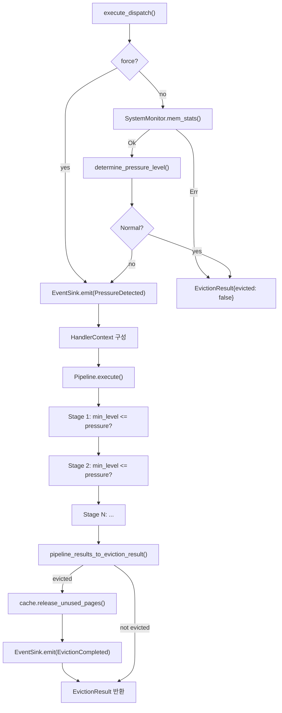
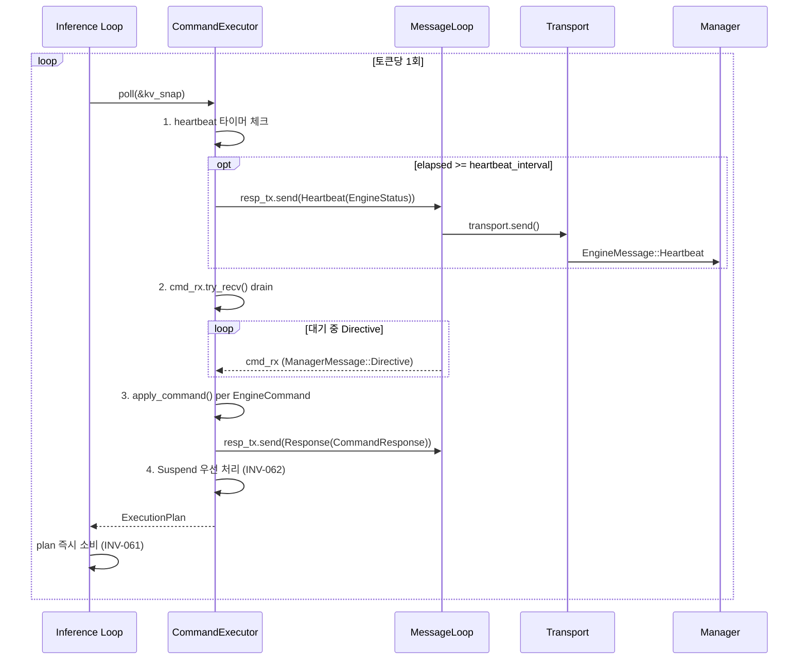
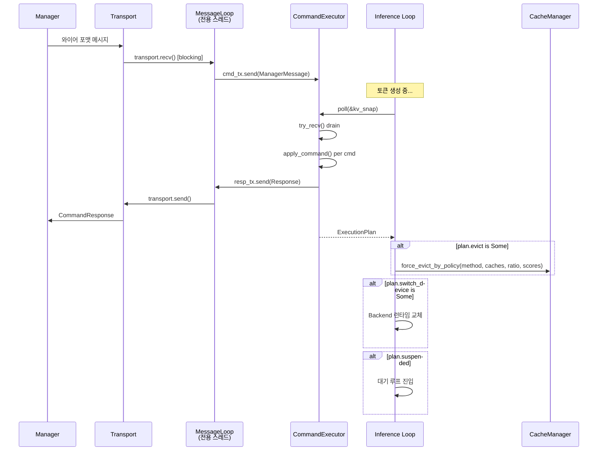
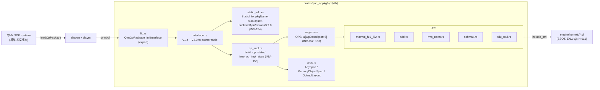
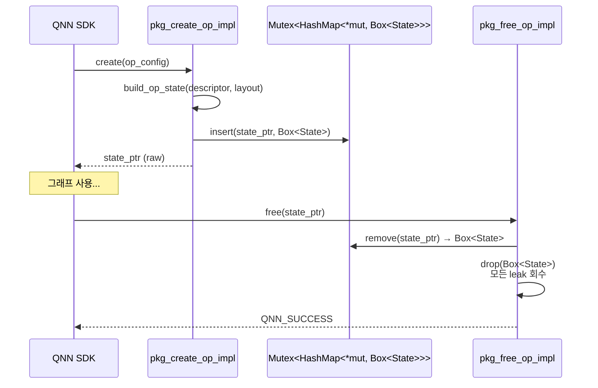
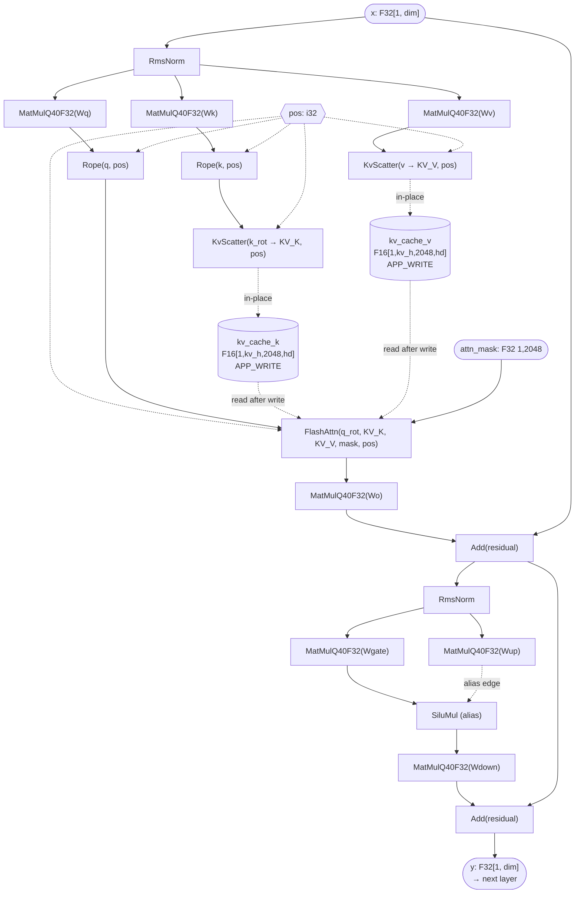
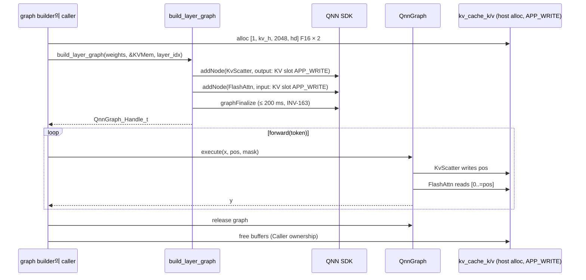
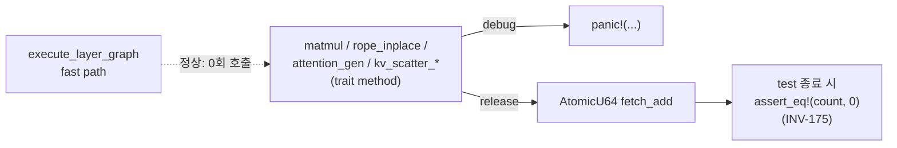
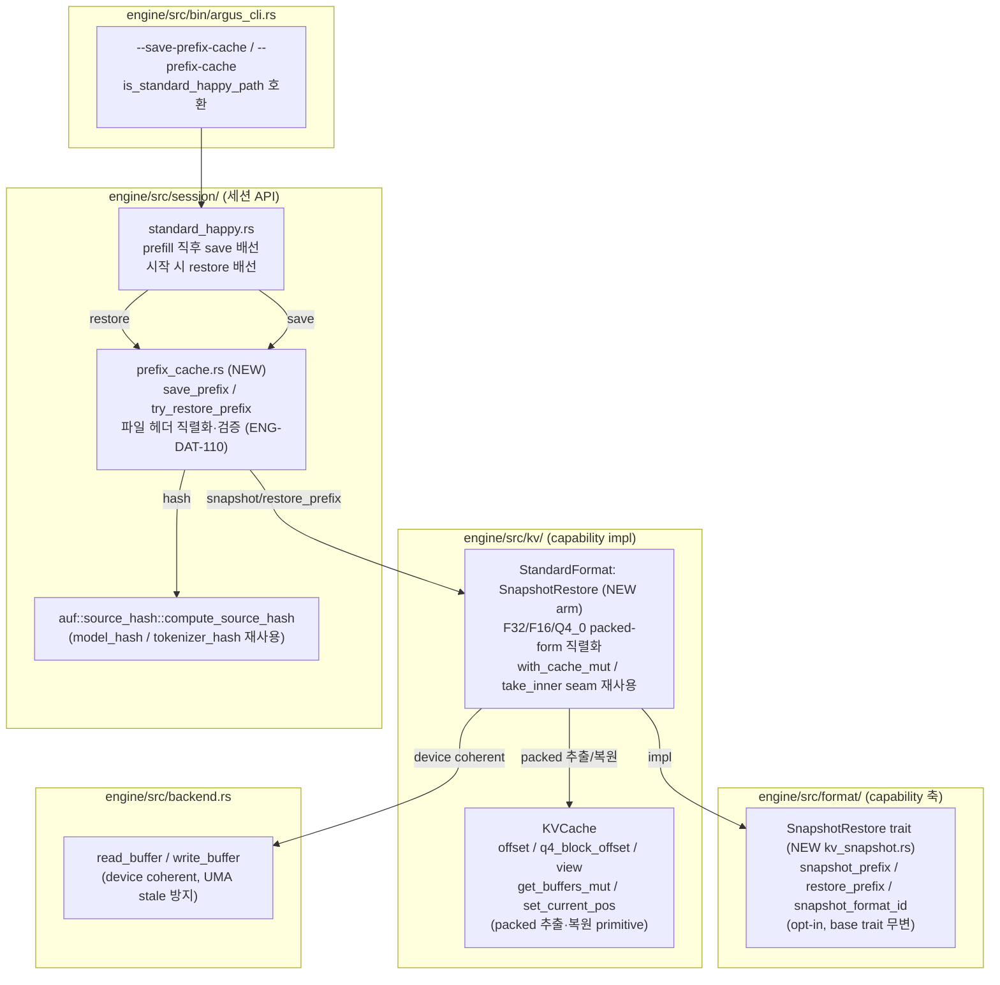

# Engine Overview -- Architecture

> spec/30-engine.md WHAT → 구현 HOW.
> 컴포넌트(모듈/구조체/트레이트) 중심으로 설계 결정, 인터페이스, 처리 흐름, 에러 경로를 기술한다.

---

## 1. 서브시스템 의존 그래프 (ENG-050)

```mermaid
flowchart TD
    GEN["generate.rs<br/>(Main Binary)"]

    subgraph Model ["Model Subsystem (ENG-011)"]
        TM["TransformerModel"]
        LL["LlamaLayer / TransformerLayer"]
    end

    subgraph Backend_Sub ["Backend Subsystem (ENG-013)"]
        BT["Backend trait"]
        CPU["CpuBackend<br/>Neon / AVX2 / Common"]
        OCL["OpenCLBackend"]
    end

    subgraph Core ["Core Subsystem (ENG-012)"]
        TEN["Tensor / Buffer / Shape"]
        MEM["Memory trait / Galloc"]
        DT["DType / Quant"]
        SAMP["SamplingConfig"]
        TP["SpinPool"]
    end

    subgraph KVCache_Sub ["KV Cache Subsystem (ENG-014)"]
        KVO["KVCacheOps trait"]
        KVC["KVCache"]
        KIVI["KiviCache"]
        OFFL["OffloadKVCache"]
    end

    subgraph CacheMgmt ["Cache Management (ENG-015)"]
        CM["CacheManager"]
        PP["CachePressurePipeline"]
        EP["EvictionPolicy trait"]
        SM["SystemMonitor trait"]
        ES["EventSink trait"]
    end

    subgraph Resilience_Sub ["Resilience Subsystem (ENG-016)"]
        TR["Transport trait"]
        ML["MessageLoop"]
        CE["CommandExecutor"]
        XP["ExecutionPlan"]
        RM["ResilienceManager<br/>(D-Bus 레거시)"]
    end

    subgraph QCF_Sub ["QCF Subsystem (ENG-017)"]
        QM["QcfMetric / DegradationEstimator"]
    end

    subgraph Eval_Sub ["Eval Subsystem (ENG-018)"]
        EL["EvalLoop / StepHook"]
    end

    GEN --> TM
    GEN --> CE
    GEN --> CM
    TM --> LL
    LL --> BT
    LL --> KVO
    BT --> TEN
    BT --> CPU
    BT --> OCL
    CPU --> TEN
    OCL --> TEN
    TEN --> MEM
    TEN --> DT
    KVO --> TEN
    KVC -.->|implements| KVO
    KIVI -.->|implements| KVO
    OFFL -.->|implements| KVO
    CM --> PP
    CM --> SM
    CM --> ES
    PP --> EP
    CE --> XP
    CE --> ML
    ML --> TR
    QM --> TEN
    EL --> TM
    EL --> KVO
    EL --> QM
</flowchart>
```

---

## 2. Backend trait (ENG-013)

### 설계 결정

**Spec WHAT**: 하드웨어별 수치 연산을 추상화하는 단일 trait (ENG-013).

**구현 HOW**: `core/backend.rs`에 20+ 메서드를 가진 `Backend` trait을 정의한다. 대부분의 메서드에 기본 구현(scalar CPU fallback)을 제공하여, 새 백엔드 추가 시 핵심 연산만 오버라이드하면 된다.

**전략 근거**: Interface Segregation을 완벽히 따르면 `MatmulBackend`, `NormBackend` 등으로 분리해야 하지만, 모든 연산이 같은 하드웨어 컨텍스트(GPU queue, SIMD 레지스터)에 바인딩되므로 단일 trait이 실용적이다. 기본 구현으로 OCP(Open-Closed)를 보장한다.

### 인터페이스

```rust
// engine/src/core/backend.rs
pub trait Backend: Send + Sync {
    fn as_any(&self) -> &dyn std::any::Any;
    fn name(&self) -> &str;
    fn device(&self) -> &str;

    // -- 핵심 연산 (구현체 필수) --
    fn matmul(&self, a: &Tensor, b: &Tensor, out: &mut Tensor) -> Result<()>;
    fn matmul_transposed(&self, a: &Tensor, b: &Tensor, out: &mut Tensor) -> Result<()>;
    fn matmul_slice(&self, a: &Tensor, b: &Tensor, rows: usize, cols: usize, out: &mut Tensor) -> Result<()>;
    fn add_assign(&self, a: &mut Tensor, b: &Tensor) -> Result<()>;
    fn scale(&self, x: &mut Tensor, v: f32) -> Result<()>;
    fn silu_mul(&self, a: &mut Tensor, b: &Tensor) -> Result<()>;
    fn rms_norm(&self, x: &mut Tensor, w: &Tensor, eps: f32, add_unit: bool) -> Result<()>;
    fn softmax(&self, x: &mut Tensor) -> Result<()>;
    fn rope_inplace(&self, x: &mut Tensor, start_pos: usize, theta: f32) -> Result<()>;
    fn attention_gen(&self, q: &Tensor, k_cache: &Tensor, v_cache: &Tensor, out: &mut Tensor,
                     num_heads_q: usize, num_heads_kv: usize, head_dim: usize,
                     cache_seq_len: usize, scores_out: Option<&mut [f32]>) -> Result<()>;
    fn copy_from(&self, t: &Tensor) -> Result<Tensor>;
    fn cast(&self, src: &Tensor, dst: &mut Tensor) -> Result<()>;

    // -- 기본 구현 있음 (오버라이드 가능) --
    fn add_row_bias(&self, x: &mut Tensor, bias: &Tensor) -> Result<()>;      // scalar loop
    fn gelu_tanh_mul(&self, gate: &mut Tensor, up: &Tensor) -> Result<()>;     // scalar loop
    fn rms_norm_oop(&self, x: &Tensor, out: &mut Tensor, w: &Tensor, eps: f32, add_unit: bool) -> Result<()>;
    fn add_rms_norm_oop(&self, x: &mut Tensor, residual: &Tensor, out: &mut Tensor, w: &Tensor, eps: f32, add_unit: bool) -> Result<()>;
    fn copy_into(&self, src: &Tensor, dst: &mut Tensor) -> Result<()>;         // memcpy
    fn read_buffer(&self, t: &Tensor, dst: &mut [u8]) -> Result<()>;
    fn write_buffer(&self, t: &mut Tensor, src: &[u8]) -> Result<()>;
    fn gather(&self, src: &Tensor, indices: &Tensor, dst: &mut Tensor) -> Result<()>;
    fn buffer_shift(&self, tensor: &mut Tensor, src_offset: usize, dst_offset: usize, count: usize) -> Result<()>;
    fn copy_slice(&self, src: &Tensor, dst: &mut Tensor, src_offset: usize, dst_offset: usize, count: usize) -> Result<()>;
    fn kv_scatter_f32_to_f16(&self, k_src: &Tensor, v_src: &Tensor, k_dst: &mut Tensor, v_dst: &mut Tensor,
                              head_dim: usize, capacity: usize, write_pos: usize) -> Result<()>;
    fn synchronize(&self) -> Result<()>;                                        // no-op
    fn flush(&self) -> Result<()>;                                              // no-op
}
```

**전제조건**: 모든 Tensor의 버퍼가 유효한 메모리 주소를 가져야 한다 (null pointer이면 에러 반환).

**후조건**: 연산 결과는 `out`/`dst` 매개변수에 기록된다. GPU 백엔드에서는 `synchronize()` 호출 전까지 결과가 GPU 메모리에만 존재할 수 있다.

### 구현체

| 구현체 | feature gate | 타겟 | 코드 | 특이사항 |
|--------|-------------|------|------|---------|
| CpuBackendNeon | 기본 | aarch64 | `backend/cpu/neon.rs` | NEON SIMD, dotprod, F16 네이티브 |
| CpuBackendAVX2 | 기본 | x86_64 | `backend/cpu/x86.rs` | AVX2+FMA |
| CpuBackendCommon | 기본 | 기타 | `backend/cpu/common.rs` | scalar fallback |
| OpenCLBackend | `opencl` | 모든 아키텍처 | `backend/opencl/mod.rs` | ~80 커널, plan-based decode |

### 에러 경로

- Tensor shape mismatch: `anyhow::bail!`
- Null pointer (GPU 미매핑 버퍼): `anyhow::bail!`
- `kv_scatter_f32_to_f16` 미지원: `anyhow::bail!` (기본 구현)
- OpenCL 커널 실행 실패: `clEnqueueNDRangeKernel` 에러 코드 → `anyhow::Error`

### 코드-스펙 차이

- Spec에는 "~20 메서드"로 기술되어 있으나, 실제로는 기본 구현 포함 약 25개 메서드가 존재한다.
- `kv_scatter_f32_to_f16`는 OpenCL 전용 최적화 메서드로, Spec에 명시되지 않았으나 성능 필수 경로이다.

### INV-065

`Send + Sync` trait bound가 Backend trait 정의에 직접 명시되어 있다: `pub trait Backend: Send + Sync`. 이는 `Arc<dyn Backend>` 공유를 보장한다.

---

## 3. KVCacheOps trait 및 구현체 (ENG-014)

### 설계 결정

**Spec WHAT**: KV 캐시 저장/조회/용량 관리를 추상화 (ENG-014).

**구현 HOW**: `KVCacheOps` trait을 제네릭 모노모피즘(`<C: KVCacheOps>`)으로 사용한다. `dyn Trait` 대신 제네릭을 선택한 이유는 contiguous slice 접근(`&mut [C]`)과 zero runtime overhead를 위함이다.

### 인터페이스

```rust
// engine/src/core/kv_cache.rs
pub trait KVCacheOps: Send {
    fn current_pos(&self) -> usize;
    fn set_current_pos(&mut self, pos: usize);
    fn capacity(&self) -> usize;
    fn kv_heads(&self) -> usize;
    fn head_dim(&self) -> usize;
    fn layout(&self) -> KVLayout;
    fn kv_dtype(&self) -> DType;
    fn memory_usage_bytes(&self) -> usize;
    fn update(&mut self, new_k: &Tensor, new_v: &Tensor) -> Result<()>;
    fn get_view(&mut self) -> (Tensor, Tensor);
    fn get_buffers_mut(&mut self) -> Option<(&mut Tensor, &mut Tensor)>;  // default: None
    fn advance_pos(&mut self, _n: usize);                                  // default: no-op
    fn ensure_capacity(&mut self, _min_tokens: usize) -> Result<bool>;     // default: Ok(false)
    fn needs_attn_scores(&self) -> bool;                                   // default: false
    fn set_attn_scores(&mut self, _scores: &[f32], ...);                  // default: no-op
}

pub trait PrefetchableCache: KVCacheOps {
    fn preload(&mut self) -> Result<()>;
    fn release_buffers(&mut self);
    fn reset_preload(&mut self);
    fn retain_preload(&mut self);  // default: no-op
}
```

### KVLayout

```rust
pub enum KVLayout {
    SeqMajor,   // [batch, seq_pos, kv_heads, head_dim]
    HeadMajor,  // [batch, kv_heads, seq_pos, head_dim]
}
```

### 구현체

| 구현체 | DType | 코드 | 특이사항 |
|--------|-------|------|---------|
| KVCache | F32, F16, Q4_0 | `core/kv_cache.rs` | 모든 eviction, offload, grow-on-demand |
| KiviCache | F32 입력 → 내부 Q2 | `core/kivi_cache.rs` | `needs_attn_scores()=true` (AWQE), eviction 미지원 |
| OffloadKVCache | F16, F32 | `core/kv_cache.rs` 또는 별도 | `PrefetchableCache` 구현, seq-major only, `--kv-offload` |

---

## 4. CacheManager 및 CachePressurePipeline (ENG-015)

### 설계 결정

**Spec WHAT**: 메모리 압력 기반 KV 캐시 관리 오케스트레이션 (ENG-015).

**구현 HOW**: 2-tier 추상화. `CacheManager`는 항상 `CachePressurePipeline`을 통해 동작한다. 레거시 `new()` API에서도 `EvictionPolicy`를 `EvictionHandler`로 래핑하여 Pipeline에 등록한다.

**전략 근거**: 초기에 CacheManager가 이중 모드(직접 eviction + Pipeline)로 동작했으나, 2026-03-10 리팩토링에서 Pipeline-only로 통합했다. 이는 라우팅 중복을 제거하고 DIP(Dependency Inversion)를 강화한다.

### CacheManager 인터페이스

```rust
// engine/src/core/cache_manager.rs
pub struct CacheManager {
    pipeline: CachePressurePipeline,
    monitor: Box<dyn SystemMonitor>,
    threshold_bytes: usize,
    event_sink: Arc<dyn EventSink>,
    policies: HashMap<EvictMethod, Box<dyn EvictionPolicy>>,  // Manager-directed dispatch
}

impl CacheManager {
    // 생성
    pub fn new(policy: Box<dyn EvictionPolicy>, monitor: Box<dyn SystemMonitor>,
               threshold_bytes: usize, target_ratio: f32) -> Self;
    pub fn with_pipeline(pipeline: CachePressurePipeline, monitor: Box<dyn SystemMonitor>,
                         threshold_bytes: usize) -> Self;

    // Observability
    pub fn set_event_sink(&mut self, sink: Arc<dyn EventSink>);
    pub fn event_sink(&self) -> &Arc<dyn EventSink>;

    // 자동 eviction (SystemMonitor 기반 메모리 체크)
    pub fn maybe_evict(&self, caches: &mut [KVCache]) -> Result<EvictionResult>;
    pub fn maybe_evict_with_scores(&self, caches: &mut [KVCache], importance: &[f32]) -> Result<EvictionResult>;
    pub fn maybe_evict_with_head_scores(&self, caches: &mut [KVCache], flat: &[f32],
                                         head: &[f32], n_kv_heads: usize) -> Result<EvictionResult>;

    // 강제 eviction (Resilience 시그널, Emergency 레벨)
    pub fn force_evict(&self, caches: &mut [KVCache], target_ratio: f32) -> Result<EvictionResult>;
    pub fn force_evict_with_scores(&self, ...) -> Result<EvictionResult>;
    pub fn force_evict_with_scores_and_budgets(&self, ...) -> Result<EvictionResult>;
    pub fn force_evict_with_head_scores(&self, ...) -> Result<EvictionResult>;

    // Manager-directed dispatch (named policy)
    pub fn register_policy(&mut self, method: EvictMethod, policy: Box<dyn EvictionPolicy>);
    pub fn force_evict_by_policy(&self, method: EvictMethod, caches: &mut [KVCache],
                                  target_ratio: f32, scores: ScoreContext) -> Result<EvictionResult>;

    pub fn policy_name(&self) -> String;
}
```

### CachePressurePipeline 처리 흐름



### PressureLevel 결정 로직

| 조건 | PressureLevel |
|------|--------------|
| `mem_available >= threshold` | Normal |
| `mem_available >= threshold / 2` | Warning |
| `mem_available >= threshold / 4` | Critical |
| `mem_available < threshold / 4` | Emergency |
| `force == true` | Emergency (직접) |

### EvictionPolicy trait

```rust
// engine/src/core/eviction/mod.rs
pub trait EvictionPolicy: Send + Sync {
    fn should_evict(&self, cache: &KVCache, mem_available: usize) -> bool;
    fn evict(&self, cache: &mut KVCache, target_len: usize) -> Result<()>;
    fn name(&self) -> &str;
    fn evict_with_scores(&self, cache: &mut KVCache, target_len: usize, _importance: &[f32]) -> Result<()>;  // default: evict()
    fn evict_with_head_scores(&self, cache: &mut KVCache, target_len: usize, flat: &[f32],
                               _head: &[f32], _n_kv_heads: usize) -> Result<()>;  // default: evict_with_scores()
}
```

| 구현체 | CLI | 코드 |
|--------|-----|------|
| NoEvictionPolicy | `none` | `eviction/no_eviction.rs` |
| SlidingWindowPolicy | `sliding` | `eviction/sliding_window.rs` |
| StreamingLLMPolicy | `streaming` | `eviction/streaming_llm.rs` |
| H2OPolicy | `h2o` | `eviction/h2o.rs` |
| H2OPlusPolicy | `h2o_plus` | `eviction/h2o_plus.rs` |

### CachePressureHandler trait 및 6종 구현

```rust
// engine/src/core/pressure/mod.rs
pub trait CachePressureHandler: Send + Sync {
    fn handle(&self, ctx: &mut HandlerContext) -> Result<ActionResult>;
    fn name(&self) -> &str;
}
```

| Handler | 상태 | 코드 |
|---------|------|------|
| EvictionHandler | 완성 | `kv/eviction_handler.rs` |
| D2OHandler | 완성 | `kv/d2o_handler.rs` |
| SwapHandler | 완성 | `kv/swap_handler.rs` |
| QuantizeHandler | 간접 | `kv/quantize_handler.rs` |

### EventSink trait (Observability)

```rust
// engine/src/core/events.rs
pub trait EventSink: Send + Sync {
    fn emit(&self, event: CacheEvent);
}
```

| Sink 구현체 | 용도 |
|------------|------|
| NoOpSink | 기본값, 제로 오버헤드 |
| StderrDiagnosticSink | 스코어 진단을 stderr 출력 |

### SystemMonitor trait

```rust
// engine/src/core/sys_monitor.rs
pub trait SystemMonitor: Send + Sync {
    fn mem_stats(&self) -> Result<MemoryStats>;
}

pub struct MemoryStats {
    pub total: usize,
    pub available: usize,
    pub free: usize,
}
```

| 구현체 | 코드 | 비고 |
|--------|------|------|
| LinuxSystemMonitor | `core/sys_monitor.rs` | `/proc/meminfo` 파싱 |
| (테스트용 mock) | 테스트 코드 내 | `mem_stats()` 반환값 고정 |

---

## 5. CommandExecutor 및 ExecutionPlan (ENG-016 Directive 경로)

### 설계 결정

**Spec WHAT**: Manager Directive를 수신하여 Engine이 즉시 소비할 수 있는 ExecutionPlan을 생성 (ENG-016).

**구현 HOW**: CommandExecutor는 전략 로직이 없다. EngineCommand 11종을 1:1로 ExecutionPlan 필드에 매핑하는 순수 변환기이다. 전략 결정은 Manager의 책임이다 (SRP).

### ExecutionPlan

```rust
// engine/src/resilience/executor.rs
pub struct ExecutionPlan {
    pub evict: Option<EvictPlan>,
    pub switch_device: Option<String>,
    pub prepare_device: Option<String>,
    pub throttle_delay_ms: u64,             // 0 = no throttle
    pub suspended: bool,
    pub resumed: bool,
    pub layer_skip: Option<f32>,
    pub kv_quant_bits: Option<u8>,
    pub restore_defaults: bool,
}

pub struct EvictPlan {
    pub target_ratio: f32,                  // 0.0-1.0 (Streaming에서는 0.0)
    pub level: ResourceLevel,
    pub method: EvictMethod,                // H2o | Sliding | Streaming
    pub streaming_params: Option<StreamingParams>,  // Streaming 전용
}

pub struct StreamingParams {
    pub sink_size: usize,                   // attention sink 토큰 수
    pub window_size: usize,                 // recent window 크기
}

pub enum EvictMethod { H2o, Sliding, Streaming }

pub struct KVSnapshot {
    pub total_bytes: u64,
    pub total_tokens: usize,
    pub capacity: usize,
    pub protected_prefix: usize,
    pub kv_dtype: String,
    pub eviction_policy: String,
    pub skip_ratio: f32,
}
```

### CommandExecutor 인터페이스

```rust
pub struct CommandExecutor {
    cmd_rx: mpsc::Receiver<ManagerMessage>,
    resp_tx: mpsc::Sender<EngineMessage>,
    // ... 내부 상태 (compute_level, memory_level, engine_state, active_device, etc.)
}

impl CommandExecutor {
    pub fn new(cmd_rx: mpsc::Receiver<ManagerMessage>, resp_tx: mpsc::Sender<EngineMessage>,
               active_device: String, heartbeat_interval: Duration) -> Self;
    pub fn send_capability(&self, cap: EngineCapability);
    pub fn set_running(&mut self);
    pub fn on_token_generated(&mut self);                   // 처리량 EMA 갱신
    pub fn poll(&mut self, kv_snap: &KVSnapshot) -> ExecutionPlan;  // 토큰당 1회 (INV-060)
    pub fn state(&self) -> EngineState;
    pub fn compute_level(&self) -> ResourceLevel;           // 레거시, 항상 Normal
    pub fn memory_level(&self) -> ResourceLevel;            // 레거시, 항상 Normal
    pub fn throttle_delay_ms(&self) -> u64;
    pub fn active_actions(&self) -> &[String];
}
```

### poll() 처리 흐름



### EngineCommand → ExecutionPlan 필드 매핑

| EngineCommand | ExecutionPlan 필드 | 비고 |
|---------------|-------------------|------|
| Throttle { delay_ms } | `throttle_delay_ms` | active_actions에 "throttle" 추가 |
| LayerSkip { skip_ratio } | `layer_skip = Some(ratio)` | active_actions에 "layer_skip" |
| KvEvictH2o { keep_ratio } | `evict = Some(EvictPlan{H2o, ratio, Critical})` | |
| KvEvictSliding { keep_ratio } | `evict = Some(EvictPlan{Sliding, ratio, Critical})` | |
| KvStreaming { sink_size, window_size } | `evict = Some(EvictPlan{Streaming, 0.0, Critical, streaming_params: Some({sink_size, window_size})})` | active_actions에 "kv_evict_streaming" 추가 |
| KvQuantDynamic { target_bits } | `kv_quant_bits = Some(bits)` | KIVI 경로에서 소비 |
| RestoreDefaults | `restore_defaults = true` | 모든 active_actions 초기화 |
| SwitchHw { device } | `switch_device = Some(device)` | 후행 명령이 선행을 덮어씀 |
| PrepareComputeUnit { device } | `prepare_device = Some(device)` | |
| Suspend | `suspended = true` | **다른 모든 plan 필드 초기화** (INV-062) |
| Resume | `resumed = true` | level/throttle를 Normal로 리셋 |

### Superseding 규칙

동일 `poll()` 호출 내에서 복수의 Directive가 대기 중이면 순서대로 처리하며, 후행이 선행을 덮어쓴다. 각 Directive에 대해 개별 `CommandResponse`가 전송된다.

### Heartbeat

- 주기: `heartbeat_interval` (generate.rs에서 `Duration::from_secs(1)` 하드코딩)
- 내용: `EngineStatus` (16개 필드: `active_device`, `kv_cache_utilization`, `active_actions`, `available_actions` 등)
- 처리량 EMA: `on_token_generated()` 호출마다 ALPHA=0.1 지수이동평균으로 tok/s 갱신

### 에러 경로

- `cmd_rx` 채널 닫힘: `try_recv()`가 `Err(TryRecvError::Disconnected)` 반환 → 루프 탈출, 빈 plan 반환
- `resp_tx.send()` 실패: `let _ =`로 무시 (Manager 연결 끊김에도 추론 계속)

---

## 6. Transport trait 및 MessageLoop (ENG-020 ~ ENG-023)

### 설계 결정

**Spec WHAT**: Manager-Engine 양방향 바이트 스트림 추상화 (ENG-020).

**구현 HOW**: `Transport` trait 4종 구현체 + `MessageLoop` 브리징 스레드. Transport는 `Send + 'static` 바운드만 가지며 `Sync`는 불필요하다 (MessageLoop가 단일 소유자, INV-063).

### Transport trait

```rust
// engine/src/resilience/transport.rs
pub trait Transport: Send + 'static {
    fn connect(&mut self) -> Result<(), TransportError>;
    fn recv(&mut self) -> Result<ManagerMessage, TransportError>;   // blocking
    fn send(&mut self, msg: &EngineMessage) -> Result<(), TransportError>;
    fn name(&self) -> &str;
}
```

### TransportError

```rust
pub enum TransportError {
    ConnectionFailed(String),
    Disconnected,
    ParseError(String),
    Io(std::io::Error),
}
```

### 와이어 포맷 (ENG-021)

UnixSocket, TCP 공통: `[4 bytes BE u32 length][UTF-8 JSON payload]`. 최대 페이로드 크기: `MAX_PAYLOAD_SIZE = 64KB`.

### Transport 구현체 4종

| 구현체 | feature | CLI | 코드 | 내부 구조 |
|--------|---------|-----|------|----------|
| UnixSocketTransport | `#[cfg(unix)]` | `unix:/path` | `transport.rs` | `UnixStream` reader/writer |
| TcpTransport | 기본 | `tcp:addr:port` | `transport.rs` | `TcpStream` reader/writer |
| DbusTransport | `resilience` | `dbus` | `dbus_transport.rs` | `zbus::blocking::Connection` |
| MockTransport | 테스트 | -- | `transport.rs` | `mpsc::channel` |

### MessageLoop

```rust
// engine/src/resilience/transport.rs
pub struct MessageLoop;

impl MessageLoop {
    pub fn spawn<T: Transport>(mut transport: T)
        -> Result<(mpsc::Receiver<ManagerMessage>, mpsc::Sender<EngineMessage>, JoinHandle<()>), TransportError>;
}
```

**동작**: 전용 스레드에서 (1) `resp_rx.try_recv()` drain → `transport.send()`, (2) blocking `transport.recv()` → `cmd_tx.send()`.

**종료 조건**: `Disconnected`, `cmd_tx` 수신측 drop, `send` 에러.

**INV-063**: Transport가 `move` 클로저로 스레드에 이동되어 단일 소유자를 보장한다.

### MockTransport 테스트 지원

```rust
pub fn channel() -> (MockTransport, MockSender);              // 단방향
pub fn bidirectional() -> (MockTransport, MockManagerEnd);     // 양방향
pub fn from_messages(messages: Vec<ManagerMessage>) -> Self;   // pre-loaded
```

---

## 7. ResilienceManager (D-Bus 레거시 경로, ENG-016)

> **α-W-3 갱신 (`arch/pipeline_stage_design_v2.md` §5.4 drift-sync)**: 본 절의 strategy 출력 어휘는 폐기 타입 `ResilienceAction`(engine 내부 coarse 7-variant)이 아니라 `EngineCommand`(`shared/src/lib.rs:189`, 18-variant, `kv.*`/`weight.*` dot-prefix)다 — `EngineCommand` 가 **유일한 이산 어휘**다. `MemoryStrategy` 는 삭제(memory 압력은 graded `Pressure(0–100)` scalar 경로, `LocalPressureSource` 가 memory·thermal·energy magnitude 를 단일 scalar 로 융합) → strategy 는 **Thermal/Energy/Compute 3종**만 생존하며, scalar 로 환원 불가한 *mode* 명령(switch/suspend)만 낸다. `ResilienceStrategy::react` 는 `mode: OperatingMode` dead param 을 제거한다. `ResilienceManager`/4-strategy/`resolve_conflicts` 는 production 소비자 0(test-only)였고, 라이브 경로는 `EngineCommand`→`CommandExecutor::apply_command`(`executor.rs`)→`ExecutionPlan` 이다 (`execute_action`/`InferenceContext` 폐기). 아래 코드블록·표·규칙은 이 canonical 어휘로 읽는다.

### 설계 결정

**Spec WHAT**: D-Bus signal에 직접 반응하는 자율 모드 (ENG-061).

**구현 HOW**: `ResilienceManager`는 4종 `SystemSignal`을 `mpsc` 채널로 수신하고, `SignalLevels` 캐시 갱신 → 해당 `ResilienceStrategy`(Thermal/Energy/Compute 3종; α-W-3 에서 `MemoryStrategy` 소멸 — memory 압력은 graded `Pressure` scalar 경로로 분리) `.react(signal)` → `Vec<EngineCommand>` 수집 → `resolve_conflicts()` 충돌 해소의 순서로 동작한다. `OperatingMode` 계산은 더 이상 `react()` 입력이 아니라 보고/상태용으로만 잔존한다(§5.4 CF3 — 구 `react(signal, mode)` 의 `mode` dead param 제거; 위 배너).

**중요**: `generate.rs`에서 직접 사용되지 않는다. DbusTransport가 `signal_to_manager_message()`로 변환하여 CommandExecutor에 전달하므로, 사실상 Directive 경로로 합류한다.

### OperatingMode

```rust
// engine/src/resilience/state.rs
pub enum OperatingMode { Normal, Degraded, Minimal, Suspended }

impl OperatingMode {
    pub fn from_levels(memory: Level, compute: Level, thermal: Level, energy: Level) -> Self;
    // 가장 심각한 Level이 Mode를 결정: Normal→Normal, Warning→Degraded, Critical→Minimal, Emergency→Suspended
}
```

### ResilienceStrategy trait

> **α-W-3 갱신 (`arch/pipeline_stage_design_v2.md` §5.4 drift-sync)**: `react` 시그니처에서 구 `mode: OperatingMode` 인자는 dead 라 제거하고, 출력을 `Vec<EngineCommand>` 로 통일한다(구 `Vec<ResilienceAction>` 폐기). `name()` 은 불변.

```rust
// engine/src/resilience/strategy/mod.rs
pub trait ResilienceStrategy: Send + Sync {
    fn react(&mut self, signal: &SystemSignal) -> Vec<EngineCommand>;
    fn name(&self) -> &str;
}
```

> **α-W-3 갱신 (`arch/pipeline_stage_design_v2.md` §5.4 drift-sync)**: `MemoryStrategy` 행 삭제 — memory 압력은 이산 strategy 가 아니라 graded `Pressure(0–100)` scalar 경로(`LocalPressureSource` 융합)로 흐른다. 생존 strategy 는 scalar 로 환원 불가한 *mode* 명령(switch/suspend)을 내는 3종뿐이다.

| Strategy | 코드 |
|----------|------|
| ComputeStrategy | `strategy/compute.rs` |
| ThermalStrategy | `strategy/thermal.rs` |
| EnergyStrategy | `strategy/energy.rs` |

### 이산 어휘 = EngineCommand

> **α-W-3 갱신 (`arch/pipeline_stage_design_v2.md` §5.4 drift-sync)**: 구 `ResilienceAction` enum(engine 내부 coarse 7-variant)은 **삭제됨**. `EngineCommand`(`shared/src/lib.rs:189`, fine 18-variant, `kv.*`/`weight.*` dot-prefix)가 이미 cross-domain 해소된 정식 wire format 이자 **유일한 이산 어휘**다. strategy 의 출력은 이 `EngineCommand` 를 직접 생산한다. 구 `ResilienceAction` 변형 → `EngineCommand` 매핑 요약:
>
> - `Evict { target_ratio }` → **폐기** (graded `Pressure` scalar 경로로 흡수)
> - `SwitchBackend { to }` → `SwitchHw { device }`
> - `LimitTokens { max_tokens }` → **폐기** (`EngineCommand` 등가 부재로 어휘 소멸)
> - `Throttle { delay_ms }` → `Throttle { delay_ms }` (유지)
> - `Suspend` → `Suspend` (유지)
> - `RejectNew` → **폐기** (`EngineCommand` 등가 부재로 어휘 소멸)
> - `RestoreDefaults` → `RestoreDefaults` (유지)

### resolve_conflicts() 규칙

> **α-W-3 갱신 (`arch/pipeline_stage_design_v2.md` §5.4 drift-sync)**: `resolve_conflicts(Vec<EngineCommand>) -> Vec<EngineCommand>` 로 시그니처가 바뀌고, 규칙은 7→4 로 축소된다 (Evict/LimitTokens/RejectNew 폐기). 아래는 생존 규칙. (단 `ResilienceManager`/4-strategy/`resolve_conflicts` 자체는 production 소비자 0 = test-only 였으며, 라이브 경로는 `EngineCommand`→`CommandExecutor::apply_command`(`executor.rs`)→`ExecutionPlan` 이다.)

- (R1) `Suspend`가 있으면 결과를 `[Suspend]` 로 환원 (다른 모든 명령 무시)
- `SwitchHw { device: "cpu" }`가 GPU보다 우선 (안전 우선; 구 SwitchBackend CPU-wins)
- 최대 delay 의 `Throttle`가 승리
- (R2) `RestoreDefaults`는 다른 제약이 없을 때(단독일 때)만 유효

### DbusTransport 변환 테이블 (ENG-024)

| D-Bus signal | Level | 변환 결과 EngineCommand |
|-------------|-------|----------------------|
| MemoryPressure | Normal | RestoreDefaults |
| MemoryPressure | Warning | KvEvictSliding { keep_ratio: 0.85 } |
| MemoryPressure | Critical | KvEvictH2o { keep_ratio: 0.50 } |
| MemoryPressure | Emergency | Suspend |
| ComputeGuidance | Normal | RestoreDefaults |
| ComputeGuidance | Warning | Throttle { 30 } + SwitchHw { device } |
| ComputeGuidance | Critical | Throttle { 70 } + SwitchHw { device } |
| ComputeGuidance | Emergency | Suspend |
| ThermalAlert | Normal | RestoreDefaults |
| ThermalAlert | Warning | Throttle { 30 } + PrepareComputeUnit { "cpu" } |
| ThermalAlert | Critical | Throttle { 70 } + SwitchHw { "cpu" } |
| ThermalAlert | Emergency | Suspend |
| EnergyConstraint | Normal | RestoreDefaults |
| EnergyConstraint | Warning | SwitchHw { "cpu" } |
| EnergyConstraint | Critical | SwitchHw { "cpu" } + Throttle { 70 } |
| EnergyConstraint | Emergency | Suspend |

### 코드-스펙 차이

Spec (ENG-024)에서 MemoryPressure Emergency는 `KvEvictH2o { keep_ratio: 0.25 }`로 기술되어 있으나, 실제 코드(`dbus_transport.rs`)에서는 `Suspend`로 변환한다. 이는 SYS-055 (Emergency에서 자율 Suspend)를 우선 적용한 결과이다.

---

## 8. Resilience Directive 전체 흐름



---

## 9. 8종 액션의 Engine 실행 경로

| 액션 | ExecutionPlan 필드 | 실행 경로 | 상태 |
|------|-------------------|----------|------|
| SwitchHw | `switch_device` | `generate.rs` — Backend 런타임 교체 (`Arc<dyn Backend>` swap) | 구현 완료 |
| Throttle | `throttle_delay_ms` | `generate.rs` — 토큰 간 `thread::sleep` | 구현 완료 |
| KvEvictH2o | `evict` (H2o) | `CacheManager::force_evict_by_policy(EvictMethod::H2o, ...)` | 구현 완료 |
| KvEvictSliding | `evict` (Sliding) | `CacheManager::force_evict_by_policy(EvictMethod::Sliding, ...)` | 구현 완료 |
| KvStreaming | `evict` (Streaming) | `StreamingLLMPolicy::new(sink_size, window_size).evict()` 즉석 호출 | 구현 완료 |
| KvQuantDynamic | `kv_quant_bits` | KIVI 경로에서 양자화 비트 갱신 | 구현 완료 |
| KvMergeD2o | `evict` (D2o) | `CacheManager::force_evict_with_scores(target_ratio)` via Pipeline D2OHandler | 구현 완료 |
| LayerSkip | `layer_skip` | `generate.rs` — SkipConfig 갱신 | 구현 완료 |

---

## 10. 스레딩 모델 (ENG-030 ~ ENG-033)

### 스레드 구조

| 스레드 | 생성 조건 | 역할 |
|--------|----------|------|
| Main (추론) | 항상 | CLI 파싱 → 모델 로딩 → Prefill → Decode loop |
| MessageLoop | `--enable-resilience` 또는 `--experiment-schedule` | Transport recv/send 브리징 |
| Rayon pool | 항상 (전역) | matmul 병렬화. `--threads N` |
| SpinPool | 항상 (CPU 백엔드) | F16 GEMV 등 latency-sensitive 작업 |

### Main 스레드 10단계 흐름 (ENG-031)

```
1. CLI Args 파싱
2. Rayon/SpinPool 스레드 풀 초기화
3. Backend 생성 (cpu / opencl / hybrid)
4. Model 로딩 (safetensors → Tensor)
5. KV Cache 생성 (KVCache / KiviCache / OffloadKVCache)
6. CacheManager 생성 (EvictionPolicy + SystemMonitor + Pipeline)
7. CommandExecutor 생성:
   - experiment_schedule → 내부 mpsc 채널
   - enable_resilience   → transport + MessageLoop::spawn()
   - 둘 다 없으면         → None
8. [KIVI 경로] run_kivi() 분기
9. [Offload 경로] run_offload() 분기
10. Prefill → Decode loop
```

### Resilience Checkpoint (ENG-032)

Decode loop 내 토큰당 1회 `executor.poll(&kv_snap)` 호출. KVSnapshot 구성 → plan 소비 → eviction/switch/throttle/suspend 처리.

---

## 11. Invariants 코드 매핑

| INV ID | 코드 위치 | 구현 방법 |
|--------|----------|----------|
| INV-060 | `generate.rs` decode loop | loop iteration당 `executor.poll()` 1회 호출 |
| INV-061 | `generate.rs` decode loop | `let plan = executor.poll(...)` — 즉시 소비, 다음 iteration에서 재할당 |
| INV-062 | `executor.rs` `poll()` step 4 | `plan.suspended == true` → `evict=None`, `switch_device=None`, `prepare_device=None` |
| INV-063 | `transport.rs` `MessageLoop::spawn()` | Transport를 `move` 클로저로 이동 — 단일 소유자 보장 |
| INV-064 | `executor.rs` `poll()` step 1 | `elapsed >= heartbeat_interval` → `send_heartbeat()` |
| INV-065 | `backend.rs` Backend trait | `pub trait Backend: Send + Sync` — 정의에 직접 명시 |

## 12. Constraints 코드 매핑

| Constraint | 코드 위치 | 구현 방법 |
|------------|----------|----------|
| ENG-070 (no async) | 프로젝트 전체 | `std::thread` + `mpsc` 채널, Cargo.toml에 tokio 미포함 |
| ENG-071 (JSON) | `transport.rs` | `serde_json::to_vec()` / `from_slice()` |
| ENG-072 (단일 세션) | `executor.rs` | 단일 `cmd_rx` 채널 — 1개 Transport에서만 수신 |
| ENG-073 (blocking) | `transport.rs` MessageLoop | `transport.recv()` blocking 호출은 전용 스레드에서만 |

---

## 13. Feature Gates

| feature | 영향 모듈 | 설명 | spec 근거 |
|---------|----------|------|-----------|
| `opencl` | `backend/opencl/` | OpenCL GPU 백엔드 (기본 활성) | ENG-013 |
| `resilience` | `resilience/dbus_transport.rs` | D-Bus Transport, Strategy 경로 | ENG-016, ENG-061 |
| `#[cfg(unix)]` | `resilience/transport.rs` | UnixSocketTransport | ENG-022 |

---

## 14. CLI

### Resilience (ENG-040)

| 플래그 | 타입 | 기본값 | spec 근거 |
|--------|------|--------|-----------|
| `--enable-resilience` | bool | false | ENG-040 |
| `--resilience-transport` | String | "dbus" | ENG-040 |
| `--experiment-schedule` | Option\<String\> | None | ENG-040/045 |

### Backend (ENG-041)

| 플래그 | 타입 | 기본값 | spec 근거 |
|--------|------|--------|-----------|
| `--backend` | String | "cpu" | ENG-041 |
| `--switch-threshold` | usize | 0 | ENG-041 |
| `--gpu-attn` | bool | false | ENG-041 |
| `--zero-copy` | bool | false | ENG-041 |

### KV Cache (ENG-042)

| 플래그 | 타입 | 기본값 | spec 근거 |
|--------|------|--------|-----------|
| `--kv-type` | String | "f16" | ENG-042 |
| `--kv-layout` | String | "head" | ENG-042 |
| `--eviction-policy` | String | "none" | ENG-042 |
| `--kv-budget` | usize | 0 | ENG-042 |
| `--kv-budget-ratio` | f32 | 0.0 | ENG-042 |
| `--kivi` | bool | false | ENG-042 |
| `--kv-offload` | String | "none" | ENG-042 |
| `--protected-prefix` | Option\<usize\> | None | ENG-042 |

### QCF/Eval (ENG-043)

| 플래그 | 타입 | 기본값 | spec 근거 |
|--------|------|--------|-----------|
| `--qcf-mode` | String | "attn" | ENG-043 |
| `--eval-ll` | bool | false | ENG-043 |
| `--eval-batch` | Option\<String\> | None | ENG-043 |
| `--profile` | bool | false | ENG-043 |

### Inference (ENG-044)

| 플래그 | 타입 | 기본값 | spec 근거 |
|--------|------|--------|-----------|
| `--model-path` | String | "models/llama3.2-1b" | ENG-044 |
| `--num-tokens` | usize | 20 | ENG-044 |
| `--max-seq-len` | usize | 2048 | ENG-044 |
| `--threads` | usize | 0 (auto) | ENG-044 |
| `--weight-dtype` | String | "f16" | ENG-044 |
| `--skip-ratio` | Option\<f32\> | None | ENG-044 |
| `--greedy` | bool | false | ENG-044 |

### Experiment (ENG-045)

| 플래그 | 타입 | 기본값 | spec 근거 |
|--------|------|--------|-----------|
| `--experiment-schedule` | Option\<String\> | None | ENG-045 |
| `--experiment-output` | Option\<String\> | None | ENG-045 |
| `--experiment-eviction-ratio` | Option\<f32\> | None | ENG-045 |

---

## 15. Config

Engine은 설정 파일 기반 config를 사용하지 않는다. 모든 설정은 CLI 플래그로 전달된다.

---

## 16. QNN OpPackage cdylib (spec/30-engine.md 부록 A, INV-151~155)

### 16.1 위치 및 격리

```
crates/qnn_oppkg/        ← M1 production cdylib (5 ops)
crates/qnn_oppkg_poc/    ← Phase R PoC (보존, 회귀 안전망)
engine/                  ← qnn_oppkg에 의존하지 않음 (INV-151)
manager/                 ← qnn_oppkg에 의존하지 않음 (INV-151)
shared/                  ← qnn_oppkg에 의존하지 않음 (INV-151)
```

**검증 방법**: `cargo tree -p qnn_oppkg`가 `llm_rs2` / `llm_manager` / `llm_shared` 어느 것도 포함하지 않는다. `cargo tree -p llm_rs2 | grep qnn_oppkg`도 빈 결과를 반환한다.

### 16.2 컴포넌트 분해



### 16.3 Op 등록 매핑 (M1 범위)

| op_type | Kernel source (`include_str!`) | Kernel name | M1 단계 |
|---------|--------------------------------|-------------|---------|
| `CustomMatMulF16F32` | `engine/kernels/mul_mv_f16_f32.cl` | `kernel_mul_mat_f16_f32` | M1.4 |
| `CustomAdd` | `engine/kernels/simple_ops.cl` | `kernel_add_assign_opt` | M1.3 |
| `CustomRmsNorm` | `engine/kernels/simple_ops.cl` | `kernel_rms_norm_opt` | M1.5 |
| `CustomSoftmax` | `engine/kernels/simple_ops.cl` | `kernel_softmax_opt` | M1.6 |
| `CustomSiluMul` | `engine/kernels/simple_ops.cl` | `kernel_silu_mul_opt` | M1.7 |

### 16.4 Free 정상화 (INV-155)



PoC는 leak 패턴을 사용했다. M1.8에서 reverse-mapping table로 정상화한다. 100회 register/free 후 VmRSS slope < 1 KB/iter 게이트 (INV-155).

### 16.5 코드-스펙 차이

- `qnn_oppkg`는 INV-001/010/011의 "engine + manager + shared" 골격을 외형적으로 4번째 crate로 확장하는 것처럼 보이나, **cdylib 산출물**이며 어떤 Rust 프로세스에도 정적/동적 링크되지 않는다. INV-001은 "프로세스 수=2"를 강제할 뿐 cdylib 산출물 수를 강제하지 않는다.
- `engine/kernels/*.cl`은 OpenCL 백엔드와 cdylib 양쪽이 동시 참조하지만, cdylib은 `include_str!`로 빌드 시점에 단순 임베드만 한다 — 컴파일 의존이 아니라 **소스 코드 의존**이다.

### 16.6 테스트 위치 (Implementer 작성 예정)

| 검증 대상 INV | 테스트 위치 | 함수명 (제안) | 검증 방법 |
|---------------|-------------|---------------|-----------|
| INV-151 | `crates/qnn_oppkg/tests/spec/test_inv_151_isolation.rs` | `qnn_oppkg_has_no_engine_manager_shared_deps` | `cargo_metadata` 크레이트로 dependency edge 검사 (host) |
| INV-152 | `crates/qnn_oppkg/tests/spec/test_inv_152_153_registry.rs` | `ops_len_equals_num_operations` | `OPS.len() == static_info().num_operations as usize` |
| INV-153 | 동상 | `op_types_are_unique` | `HashSet::from_iter(OPS.iter().map(|d| d.op_type)).len() == OPS.len()` |
| INV-154 | `crates/qnn_oppkg/tests/spec/test_inv_154_api_version.rs` | `backend_api_version_is_3_7_0` | `pkg_get_info()` FFI 호출 후 major/minor/patch 비교 |
| INV-155 | `crates/qnn_oppkg/tests/spec/test_inv_155_no_leak.rs` (host primary) + `crates/qnn_oppkg/src/bin/microbench_qnn_oppkg_leak.rs` (device secondary) | `state_map_drained_after_free_cycle` (host) + binary (device) | (Primary) host에서 `STATE_MAP::lock().len() == 0` 검증. (Secondary) 디바이스 100회 reg/free + last-50 VmRSS slope < 3 KB/iter |

> 주의: tests/spec/ 작성은 Implementer가 M1.2~M1.10 단계에서 구현한다. Architect는 명세만 제공한다.

---

## 17. QNN OpPackage M2 — Layer-level Graph (spec/30-engine.md 부록 B, INV-156~165)

### 17.1 위치 및 격리

```
crates/qnn_oppkg/
├── src/
│   ├── ops/                  ← M1 5개 + M2 5개 (10 ops)
│   │   ├── matmul_q4_0_f32.rs    (NEW M2)
│   │   ├── flash_attn.rs         (NEW M2)
│   │   ├── rope.rs               (NEW M2)
│   │   ├── kv_scatter.rs         (NEW M2)
│   │   └── deq_q4_0.rs           (NEW M2)
│   ├── graph/                ← layer-level graph builder (NEW M2)
│   │   ├── mod.rs
│   │   ├── layer.rs              (build_layer_graph)
│   │   ├── kv_buffer.rs          (external KV cache handle)
│   │   └── executor.rs           (execute + scalar arg update)
│   ├── args.rs               ← + ArgSpec::OutputTensorAliased + MemoryObjectSpec::RawBytes
│   └── bin/
│       └── microbench_qnn_layer_graph.rs   (NEW M2, device)
engine/                       ← 변경 0 (INV-160)
manager/                      ← 변경 0 (INV-160)
shared/                       ← 변경 0 (INV-160)
engine/kernels/*.cl           ← 변경 0 (INV-157)
```

**검증 방법**: `git diff master..M2_HEAD -- engine/src/ manager/src/ shared/src/ engine/kernels/`가 빈 출력. CI 게이트로 강제.

### 17.2 컴포넌트 분해

```mermaid
flowchart TB
    subgraph EXT [External]
        SDK["QNN SDK runtime"]
        REF["Production engine<br/>(NEON CPU forward)<br/>--- accuracy reference (INV-161)"]
    end

    subgraph CDYLIB ["crates/qnn_oppkg/ (M2 cdylib)"]
        REG["registry.rs<br/>OPS: &[OpDescriptor; 10]<br/>(INV-156)"]

        subgraph OPS_M1 ["M1 ops (보존)"]
            MM_F16["matmul_f16_f32"]
            ADD_["add"]
            RMS_["rms_norm"]
            SM_["softmax"]
            SiluM_["silu_mul<br/>(intermediate alias 적용)<br/>(INV-164)"]
        end

        subgraph OPS_M2 ["M2 신규 ops"]
            MM_Q4["matmul_q4_0_f32<br/>RawBytes(18, N/32)<br/>(INV-165)"]
            FA["flash_attn<br/>max-padded mask<br/>(INV-159)"]
            RP["rope<br/>pos: ArgSpec::Int"]
            KV_SC["kv_scatter<br/>F32→F16 cast<br/>in-place write to ext"]
            DQ4["deq_q4_0<br/>fallback"]
        end

        subgraph GRAPH ["graph/ (M2 builder)"]
            BUILD["layer.rs::build_layer_graph<br/>weights × kv_handles → QnnGraph<br/>≤ 13 nodes (INV-158)"]
            KVB["kv_buffer.rs<br/>APP_WRITE handles"]
            EXEC["executor.rs<br/>execute + pos arg update"]
        end

        ARGS["args.rs<br/>+ OutputTensorAliased<br/>+ RawBytes"]
        OI_["op_impl.rs<br/>+ STATE_MAP unchanged"]
    end

    subgraph KCL ["engine/kernels/*.cl (SSOT, 변경 0)"]
        K_F16["mul_mv_f16_f32.cl"]
        K_Q4["mul_mv_q4_0_f32.cl<br/>(production 자산)"]
        K_FA["flash_attn_*.cl<br/>(production 자산)"]
        K_SO["simple_ops.cl<br/>rope/kv_scatter/dequant"]
    end

    SDK -->|loadOpPackage| CDYLIB
    SDK -.->|graph build| BUILD
    BUILD --> REG
    BUILD --> KVB
    BUILD --> ARGS
    SDK -.->|graphFinalize<br/>≤ 200 ms (INV-163)| EXEC
    OPS_M2 -.->|include_str!| KCL
    OPS_M1 -.->|include_str!| KCL
    EXEC -.->|max_abs_err < 1e-2<br/>(INV-161)| REF
```

### 17.3 신규 op 매핑 (M2 범위)

| op_type | Kernel source (`include_str!`) | data_type 매핑 | scalar args | KV slot 접근 |
|---------|-------------------------------|----------------|-------------|--------------|
| `CustomMatMulQ40F32` | `engine/kernels/mul_mv_q4_0_f32.cl` (또는 production 등가물) | weight: `RawBytes { block_size: 18, element_count: K/32 }`<br/>act: F32 | — | — |
| `CustomFlashAttn` | `engine/kernels/flash_attn_*.cl` | Q/O: F32, KV: F16, mask: F32 | `pos: Int` | input KV slot READ |
| `CustomRope` | `engine/kernels/simple_ops.cl::kernel_rope_*` (가용 시) | F32 | `pos: Int` | — |
| `CustomKvScatter` | `engine/kernels/simple_ops.cl::kernel_kv_scatter_f32_to_f16` | input F32, output F16 (HeadMajor stride) | `pos: Int` | output KV slot WRITE (in-place) |
| `CustomDeqQ40` | `engine/kernels/simple_ops.cl::kernel_dequant_q4_0` | RawBytes → F32 | — | — |

> production이 별도 RoPE kernel을 갖지 않을 경우 Rope op은 simple_ops 안의 인라인 회전을 호출하거나 M2.2에서 옵션 평가 (kernel 추가 금지 — INV-157).

### 17.4 Layer Graph Topology (Qwen2.5-1.5B)



총 13 nodes (INV-158: ≤13). `KvScatter` 출력은 graph 내부 tensor가 아니라 외부 KV buffer로 직접 write. `SiluMul`은 alias edge로 input2/output 동일 backing buffer (INV-164).

### 17.5 SiluMul Intermediate Alias 패턴

```mermaid
flowchart LR
    SiluKernel["kernel_silu_mul_opt<br/>(in-place: out == in2)"]
    AliasNode["graph topology view"]

    GateBuf[("gate_buf<br/>cl_mem")]
    UpBuf[("up_buf<br/>cl_mem")]

    GateBuf -->|input1| SiluKernel
    UpBuf -->|input2 == output<br/>(alias)| SiluKernel

    AliasNode -.->|"input1: gate_edge"| GateBuf
    AliasNode -.->|"input2: up_edge"| UpBuf
    AliasNode -.->|"output: silu_out_edge<br/>(same cl_mem as up)"| UpBuf
```

`ArgSpec::OutputTensorAliased { input_index: 1 }` 또는 `OpImplLayout::build`가 mem_objects[output_idx] = mem_objects[input_idx] 동일 cl_mem 채우는 패턴. SDK가 동일 buffer alias를 거부 시 옵션 B (silu_oop + mul_oop 2단계) fallback.

### 17.6 KV Cache Lifecycle (External APP_WRITE)



`Caller`는 M2 단계에서 `microbench_qnn_layer_graph` 바이너리. M3에서 production engine의 `Backend::execute_layer` 경로로 이동.

### 17.7 코드-스펙 차이

- **Q4_0 abstraction**: spec은 `RawBytes(18, N/32)`이지만 kernel은 cl_mem을 byte 단위로 받으므로 abstraction 변경은 layer 위 ArgSpec 매핑만 영향. kernel 시그니처는 변경 0.
- **Rope/KvScatter scalar pos**: SDK가 매 execute 호출마다 scalar `Qnn_OpConfig_t::params`를 갱신할 수 있어야 함. 가능 여부는 M2.2 검증 게이트.
- **SiluMul alias**: 옵션 C가 SDK에서 작동하지 않으면 옵션 B fallback. 코드는 옵션 C 우선 시도 + 실패 시 분기 (M2.4 dynamic detection).

### 17.8 Production code 변경 0 강제

- `crates/qnn_oppkg/Cargo.toml`은 `engine`/`manager`/`shared` dependency 추가하지 않음 (INV-151 보존).
- `crates/qnn_oppkg/build.rs` 또는 `include_str!`은 `engine/kernels/*.cl`을 참조하지만 빌드 시점 복사로 의존 없음.
- M2 microbench는 `crates/qnn_oppkg/src/bin/`에 위치. `cargo build -p qnn_oppkg --bin microbench_qnn_layer_graph`만 호출. production binary (`generate`, `test_backend`)는 M2 단계에서 호출 금지.

### 17.9 M3 Trail (M2 종료 후)

| M3 sub-task | 변경 영역 | INV 영향 |
|-------------|----------|---------|
| Backend trait integration | `engine/src/backend/qnn_oppkg/` 신규 모듈 | INV-160 expire (M2 종료 후 자연 만료) |
| Multi-layer graph | `crates/qnn_oppkg/src/graph/model.rs` | INV-158 확장 (16 layer 동일 graph 재사용 평가) |
| Dynamic seq_len (prefill) | `kv_buffer.rs` + flash_attn op | INV-159 변경 (max-padded only → variable seq) |
| Multi-quantization (Q8_0, Q5_K) | `args.rs::MemoryObjectSpec::RawBytes` variants | INV-165 확장 |

### 17.10 테스트 위치 (Implementer 작성 예정)

| 검증 대상 INV | 테스트 위치 | 함수명 (제안) | 검증 방법 |
|---------------|-------------|---------------|-----------|
| INV-156 | `crates/qnn_oppkg/tests/spec/test_inv_156_m2_ops_count.rs` | `ops_len_equals_10_after_m2` | `OPS.len() == 10` + `static_info().num_operations == 10` |
| INV-157 | `crates/qnn_oppkg/tests/spec/test_inv_157_kernel_files_unchanged.rs` | `engine_kernels_dir_has_no_new_files` | git ls-files 또는 cargo metadata로 `engine/kernels/*.cl` 파일 set 비교 (master baseline) |
| INV-158 | `crates/qnn_oppkg/tests/spec/test_inv_158_layer_graph_node_count.rs` | `layer_graph_has_at_most_13_nodes` | `build_layer_graph(...)` mock 후 node count 검사 |
| INV-159 | `crates/qnn_oppkg/tests/spec/test_inv_159_kv_cache_shape.rs` | `kv_cache_handle_is_max_padded` | `KvCacheHandle::new(...)` 출력 tensor descriptor의 dims 검증 |
| INV-160 | CI 스크립트 (`scripts/ci_check_no_production_change.sh` 또는 동등) | `git diff master..HEAD -- engine/src/ manager/src/ shared/src/` | empty diff |
| INV-161 | `crates/qnn_oppkg/tests/spec/test_inv_161_layer_accuracy.rs` (디바이스) | `layer_0_matches_cpu_reference_within_1e-2` | NEON CPU forward 1 layer vs OpPackage graph forward 1 layer; max\|y_qnn - y_cpu\| < 1e-2 |
| INV-162 | `crates/qnn_oppkg/src/bin/microbench_qnn_layer_graph.rs` (디바이스) | (binary) | wall-clock 측정. baseline = `--backend opencl` decode, ratio ≤ 1.10 |
| INV-163 | 동상 | (binary) | `QnnGraph_finalize` wall-clock ≤ 200 ms |
| INV-164 | `crates/qnn_oppkg/tests/spec/test_inv_164_silu_mul_alias.rs` (디바이스) | `silu_mul_intermediate_alias_produces_readable_output` | layer graph 내 SiluMul 출력의 다음 노드 (ffn_up matmul) 입력 정합성 |
| INV-165 | `crates/qnn_oppkg/tests/spec/test_inv_165_q4_0_raw_bytes.rs` | `q4_0_memory_object_spec_uses_raw_bytes_18` | `MemoryObjectSpec::RawBytes` 생성 시 block_size=18, element_count=N/32 검증 |

> 주의: tests/spec/ 작성은 Implementer가 M2.1~M2.6 단계에서 구현한다. Architect는 ID + 위치 + 검증 방법만 명세한다.

## 18. QNN-GPU OpPackage M3 Backend (spec/30-engine.md 부록 C, INV-166~180)

### 18.1 위치 및 격리

```
engine/src/backend/
├── opencl/                       ← 기존 (INV-169 무회귀 게이트 보호)
├── cpu/                          ← 기존
├── cuda/                         ← 기존
└── qnn_oppkg/                    (NEW M3, #[cfg(feature = "qnn")])
    ├── mod.rs                        QnnOppkgBackend: Backend
    ├── runtime.rs                    libQnnGpu.so + libqnn_oppkg.so dlopen + V2.0 fn-ptr cache
    ├── memory.rs                     QnnOppkgMemory: Memory (rpcmem allocator)
    ├── buffer.rs                     QnnOppkgBuffer: Buffer (host_ptr + qnn_mem_handle)
    ├── graph_cache.rs                Vec<Arc<LayerGraph>> (28 layer × 1 graph)
    └── layer_graph.rs                M2.H 14-node graph 호출 wrapper

engine/src/core/backend.rs        ← Backend trait 신규 method 2개 (default impl)
engine/src/bin/generate.rs        ← --backend qnn_oppkg | qnngpu dispatch + Args 추가
engine/src/models/transformer.rs  ← supports_layer_graph() fast path 분기
crates/qnn_oppkg/                 ← M2 산출물 그대로 재사용 (host metadata crate dep edge 신설)
```

**격리 정책 변경**:
- M2 INV-160 (production change == 0)은 자연 만료. M3은 backend trait 통합이 본질이므로 trait 신규 method 추가 불가피.
- INV-169 (OpenCL backend 무회귀)가 정신 대체 게이트. `cargo test --workspace --features opencl` 0건 회귀 + `--backend opencl` decode TBT ≤ 1.05× baseline.

### 18.2 컴포넌트 분해

```mermaid
flowchart TB
    subgraph EXT [External]
        SDK["QNN GPU SDK runtime"]
        DMABUF["rpcmem (DMA-BUF heap)"]
        OPENCL_REF["OpenCL backend<br/>(INV-169 무회귀 baseline)"]
    end

    subgraph CDYLIB ["crates/qnn_oppkg/ (M2, 변경 0)"]
        CDY_REG["registry::OPS &#91;10&#93;"]
        CDY_GRAPH["graph::layer::build_layer_graph"]
        CDY_LC["graph::LayerConfig<br/>(host metadata)"]
    end

    subgraph BACKEND ["engine/src/backend/qnn_oppkg/ (NEW M3)"]
        QBE["QnnOppkgBackend<br/>: Backend<br/>(INV-166)"]
        QRT["runtime.rs<br/>dlopen V2.0 fn-ptrs"]
        QMEM["QnnOppkgMemory<br/>: Memory<br/>(rpcmem allocator)<br/>(INV-171)"]
        QBUF["QnnOppkgBuffer<br/>: Buffer<br/>(host_ptr + qnn_mem_handle)"]
        QGC["graph_cache.rs<br/>Vec&lt;Arc&lt;LayerGraph&gt;&gt;<br/>(N=28, INV-167)"]
        QLG["layer_graph.rs<br/>M2 14-node wrapper<br/>(INV-176)"]
    end

    subgraph CORE ["engine/src/core/"]
        TRAIT["backend.rs Backend trait<br/>+ supports_layer_graph()<br/>+ execute_layer_graph()<br/>(default impl)"]
        KV["kv_cache.rs<br/>HeadMajor stride<br/>(INV-168, INV-177)"]
    end

    subgraph TRANS ["engine/src/models/transformer.rs"]
        FWD["forward_into() layer loop"]
        FAST["if supports_layer_graph()<br/>&nbsp;&nbsp;execute_layer_graph(...)<br/>else<br/>&nbsp;&nbsp;trait method path"]
    end

    subgraph CLI ["engine/src/bin/generate.rs"]
        DISP["match args.backend.as_str()<br/>cpu | opencl | cuda<br/>+ qnn_oppkg | qnngpu (#[cfg(qnn)])"]
        ARGS["--qnn-graph-cache-prebuild (default true)<br/>--qnn-allow-fallback (default false)"]
    end

    DISP -->|select| QBE
    QBE -->|impl| TRAIT
    QBE --> QRT
    QBE --> QMEM
    QBE --> QGC
    QGC -->|holds| QLG
    QLG -->|build_layer_graph| CDY_GRAPH
    QLG -->|metadata| CDY_LC
    QMEM -->|allocates| DMABUF
    QMEM -->|wraps| QBUF
    QBUF -->|host_ptr| KV
    SDK -->|dlopen| CDY_REG
    SDK -->|graphFinalize ≤200ms × 28| QLG
    FWD --> FAST
    FAST -->|fast path| QBE
    FAST -.->|fallback| OPENCL_REF
    OPENCL_REF -.->|TBT ≤ 1.05× baseline<br/>(INV-169)| TRAIT
```

### 18.3 호출 흐름 (decode token 1개 처리)

```mermaid
sequenceDiagram
    participant T as transformer.rs::forward_into
    participant B as QnnOppkgBackend
    participant GC as graph_cache
    participant LG as LayerGraph (cached)
    participant SDK as QNN SDK
    participant KV as KVCache (rpcmem)
    participant MASK as attn_mask buffer

    Note over T: layer loop entry
    T->>B: supports_layer_graph()
    B-->>T: true (idempotent, INV-174)

    loop layer_idx in 0..28
        T->>MASK: mask&#91;pos&#93; ← valid (INV-228)
        T->>B: execute_layer_graph(layer_idx, x, kv, pos, x_out)
        B->>GC: graph = cache&#91;layer_idx&#93;
        GC-->>B: Arc&lt;LayerGraph&gt;
        B->>LG: dispatch(x, kv, pos, x_out, mask)
        LG->>SDK: graph.execute (1× per layer)
        SDK->>KV: KvScatter writes pos slot (multi-output)
        SDK->>KV: FlashAttn reads &#91;0..=pos&#93;
        SDK-->>LG: x_out filled
        LG-->>B: Ok
        B-->>T: Ok
        Note over T: x ← x_out (next layer input)
    end

    Note over T: pos += 1, sample, append
    Note over B: trait fallback count == 0 (INV-175)
```

### 18.4 컴포넌트 책임

| 컴포넌트 | 책임 | 의존성 |
|---------|------|-------|
| `QnnOppkgBackend` | `Backend` trait 구현 진입점. `supports_layer_graph()` true. `execute_layer_graph()` fast path. trait fallback method (matmul/rope/etc)는 debug panic 또는 metric count (INV-175). | `core::backend::Backend`, `runtime`, `memory`, `graph_cache` |
| `runtime.rs` (`QnnOppkgRuntime`) | model load 시 1회 `dlopen("libQnnGpu.so")` + `dlopen("libqnn_oppkg.so")`. V2.0 fn-pointer 캐싱 (M2 microbench의 init flow 이식). cdylib OPS 등록 호출. | libdl |
| `QnnOppkgMemory` | `Memory` trait 구현. KV cache 등 large buffer는 rpcmem(DMA-BUF heap) allocator를 통해 alloc → mmap → host_ptr 노출 (INV-171). small buffer는 일반 malloc fallback. | rpcmem fd 기반 system call |
| `QnnOppkgBuffer` | `Buffer` trait 구현. (host_ptr, qnn_mem_handle) 쌍을 보유. graph builder가 qnn_mem_handle을 weight tensor handle로 baked. host pointer는 production KVCache view에 직접 expose. | `QnnOppkgMemory` |
| `graph_cache.rs` | `Vec<Arc<LayerGraph>>` length == n_layers (Qwen2.5-1.5B = 28). model load 시 eager prebuild (D1, INV-167). cache invalidation은 weight swap path에서만 (M4 영역). | `layer_graph` |
| `layer_graph.rs` (`LayerGraph`) | M2 `crates/qnn_oppkg::graph::layer::build_layer_graph` host wrapper. weight slot snapshot에서 source pointer 추출 + KV handle bind + graph build + finalize (≤ 200 ms × 28, INV-236). dispatch 시 pos scalar arg 갱신. | `crates/qnn_oppkg::graph` |

### 18.5 Layer Graph Cache 구조

```mermaid
flowchart LR
    LOAD[/Model load entry/]
    LOAD --> ITER{for layer_idx<br/>in 0..n_layers}
    ITER --> BUILD["build_layer_graph(<br/>weights&#91;layer_idx&#93;,<br/>kv_handles,<br/>layer_idx)"]
    BUILD --> FIN["graphFinalize<br/>(≤ 200 ms,<br/>INV-236 / M2 INV-163)"]
    FIN --> STORE["cache.push(<br/>Arc::new(LayerGraph))"]
    STORE --> ITER
    ITER -->|done| READY[/cache: Arc&lt;LayerGraph&gt; × N/]
    READY --> DECODE[/decode loop entry/]

    DECODE -.->|process lifetime<br/>(INV-167)| DISPATCH["execute_layer_graph<br/>(read-only Arc)"]
```

- 28× `graphFinalize` × ~1.2 s = ~33 s spike at model load (D1 결정).
- decode 동안 `Arc` clone만으로 lock-free read (INV-018: forward pass single-thread 보존).
- weight swap (M4) 발생 시에만 invalidation. 정책: 옵션 A SDK API rebind / 옵션 B graph 재build (200ms penalty per swap layer).

### 18.6 KV Cache Layout View Transform (INV-177)

```mermaid
flowchart LR
    subgraph KV_PROD ["production KVCache (HeadMajor)"]
        KP["cl_mem layout:<br/>head × capacity × head_dim<br/>head_stride = capacity × head_dim × 2B"]
    end

    subgraph KV_GRAPH ["layer graph 입력"]
        KG["expected shape:<br/>&#91;1, kv_heads, 2048, head_dim&#93; F16<br/>kv_heads × 2048 × head_dim × 2B"]
    end

    subgraph TRANSFORM ["view transform (zero-copy)"]
        T1["stride mapping:<br/>head_stride == kv_heads dim stride<br/>↓<br/>same backing buffer"]
    end

    KP -->|reshape only<br/>no memcpy| T1
    T1 -->|same cl_mem / rpcmem fd| KG
```



production HeadMajor stride와 graph 입력 stride가 **동일 메모리 layout**이므로 reshape view transform만으로 입력 전달이 가능 (INV-177). copy 발생 시 RED.

### 18.7 Backend dispatch 분기 (generate.rs)

```mermaid
flowchart TB
    ARGS[/Args::backend = String/]
    ARGS --> M{"match<br/>args.backend.as_str()"}

    M -->|"cpu"| CPU[CpuBackend::new]
    M -->|"opencl" / "gpu"| OPC[OpenCLBackend::new]
    M -->|"cuda"| CDA[CudaBackend::new]
    M -->|"qnn_oppkg" / "qnngpu"<br/>#[cfg(feature = qnn)]| QNN["QnnOppkgBackend::new<br/>+ OpenCL secondary<br/>(SwitchHw round-trip)"]
    M -->|_<br/>(unknown)| BAIL["bail!(Unknown backend)<br/>(INV-170)"]

    CPU --> RET["(backend, memory,<br/>gpu_arc, gpu_mem_arc, is_gpu)"]
    OPC --> RET
    CDA --> RET
    QNN --> RET
```

- `--backend qnn_oppkg | qnngpu`는 `feature = "qnn"` 활성 시에만 dispatch에 등장 (INV-170).
- `--qnn-graph-cache-prebuild` (default true), `--qnn-allow-fallback` (default false) Args 추가 (ENG-QNN-220).
- secondary backend = OpenCL (SwitchHw round-trip 가능). CPU secondary는 본 단계 범위 외.

### 18.8 Backend Trait 신규 method (default impl)

```rust
pub trait Backend {
    // ... 기존 method (matmul, rope_inplace, etc) ...

    fn supports_layer_graph(&self) -> bool { false }

    fn execute_layer_graph(
        &self,
        layer_idx: usize,
        x: &Tensor,
        kv_cache: &mut KVCache,
        pos: usize,
        x_out: &mut Tensor,
    ) -> Result<()> {
        bail!("backend does not implement execute_layer_graph")
    }
}
```

기존 backend (CPU/OpenCL/CUDA)는 변경 없이 컴파일. transformer.rs는 forward 진입 시 `supports_layer_graph()` 1회 호출로 분기 결정 (INV-174 idempotent).

### 18.9 Trait Fallback Instrumentation (INV-175)



fast path가 정상 동작하면 trait method (matmul 등)는 호출되지 않아야 한다. count > 0은 RED 신호.

### 18.10 코드-스펙 차이

- **Q4_0 raw bytes pass-through**: spec INV-165 (`RawBytes(18, N/32)`)을 그대로 사용. M3 backend는 LayerSlot snapshot의 cl_mem 또는 rpcmem 주소만 graph build 시점에 baked.
- **rpcmem KV vs OpenCL KV**: OpenCL backend는 zero-copy `CL_MEM_ALLOC_HOST_PTR` 또는 일반 cl_mem. qnn_oppkg backend는 rpcmem fd 기반 mmap host pointer. SwitchHw round-trip 시 두 backend가 동일 memory backing을 공유할 수 없을 수 있어 KV state는 round-trip 시점에 host copy 필요.
- **Mask buffer**: M2는 graph 외부 alloc + APP_WRITE이지만 model load 시 1회 alloc 후 process lifetime 재사용 (INV-228). 매 token `mask[pos]` update만.
- **secondary backend**: M3 단계에서는 OpenCL secondary만. CPU secondary (NEON forward)는 Qwen2.5 path 미검증 (`feedback`/Qwen NEON garbage 이슈) — 본 단계 범위 외.

### 18.11 의존성

- 기존: `engine/src/core/backend.rs` Backend trait, `engine/src/models/weights/slot.rs` LayerSlot, `engine/src/core/kv_cache.rs` KVCache.
- 신규 host crate dep: `engine/Cargo.toml`에 `qnn_oppkg = { path = "../crates/qnn_oppkg" }` (`#[cfg(feature = "qnn")]`). cdylib binary는 dlopen 산출물로 link 형성하지 않음 (INV-180).
- runtime: `libQnnGpu.so` (system QNN SDK), `libqnn_oppkg.so` (cdylib path는 device deploy 시점 결정).

### 18.12 테스트 위치 (Implementer 작성 예정)

| 검증 대상 INV | 테스트 위치 | 함수명 (제안) | 검증 방법 |
|---------------|-------------|---------------|-----------|
| INV-166 | `engine/tests/spec/test_qnn_201.rs` | `qnn_backend_implements_required_trait_methods` | trait bound + method 시그니처 비교 (host) |
| INV-167 | `engine/tests/spec/test_qnn_201.rs` | `graph_cache_finalize_count_equals_n_layers_at_load` | model load 후 instrumentation count == 28, decode 동안 +0 |
| INV-168 | `engine/tests/spec/test_qnn_211.rs` | `kv_cache_shape_is_max_padded_2048_f16` | KVCache descriptor 검증 |
| INV-169 | CI script (`cargo test --workspace --features opencl`) + 디바이스 microbench | (script) | 기존 test suite + OpenCL TBT diff |
| INV-170 | `engine/tests/spec/test_qnn_201.rs` | `unknown_backend_bails` + `qnn_oppkg_default_off` | host integration test |
| INV-171 | `engine/tests/spec/test_qnn_201.rs` | `kv_cache_is_rpcmem_backed` | host_ptr 메타데이터 또는 디바이스 `/proc/self/maps` |
| INV-172 | `engine/tests/spec/test_qnn_231.rs` (디바이스) | `qnn_decode32_token_seq_matches_opencl_100pct` | 두 backend 결과 diff |
| INV-173 | `engine/tests/spec/test_qnn_231.rs` (디바이스) | `tbt_uses_wallclock_no_profile_events` | 측정 코드 정적 검사 + flag enforce |
| INV-174 | `engine/tests/spec/test_qnn_211.rs` | `supports_layer_graph_idempotent` | host unit test |
| INV-175 | `engine/tests/spec/test_qnn_231.rs` (디바이스) | `trait_fallback_count_is_zero_after_decode` | atomic counter inspect |
| INV-176 | `engine/tests/spec/test_qnn_221.rs` | `layer_graph_node_count_equals_const` | const 검증 + 빌더 결과 enumerate |
| INV-177 | `engine/tests/spec/test_qnn_221.rs` | `kv_layout_view_transform_zero_copy` | 디바이스 trace 또는 stride 비교 |
| INV-178 | `engine/tests/spec/test_qnn_231.rs` (디바이스) | `vmrss_slope_below_50kb_per_token` | 32 iter linear regression |
| INV-179 | `engine/tests/spec/test_qnn_231.rs` (디바이스) | `tbt_band_classification` | 5회 평균 + GREEN/YELLOW/RED 분류 |
| INV-180 | CI script (`cargo tree`) | `cdylib_not_linked_by_engine_binary` | static crate dep 검증 |

> 주의: tests/spec/ 본문은 Implementer가 M3.1~M3.4 단계에서 구현한다. M3.0 단계에서는 stub만 작성한다 (각 파일에 `#[test]` placeholder + spec ID 주석).

## 19. Session Prefix Cache (KV persistence Tier 1, spec/30 §3.7 ENG-080~085, INV-189~191)

> 설계 SSOT: `docs/adr/0012-session-prefix-cache-snapshot.md`. 데이터 = spec/33 §3.25 (ENG-DAT-110). 본 절은 컴포넌트(capability trait + 세션 모듈 + 파일 헤더 + CLI) 중심 매핑이다.

### 19.1 설계 결정 요지

KV 캐시의 "프로세스 1세션 수명" 한계를 깬다 — system prompt prefix 의 KV 를 디스크에 저장해 다음 실행에서 prefill 을 skip 한다. **정확성은 "prefill 직후·eviction 전" 상태만 저장한다는 단일 제약에서 나온다** (KV = prefix 토큰의 순수 함수 + RoPE 절대 위치 baked + prefix=위치 0 고정 → position 매핑 불요). snapshot 은 format 축 **capability opt-in**(`SnapshotRestore`)으로, base trait 6-method 를 변경하지 않는다(`INV-KVCACHELAYER-PRIMITIVE-AGNOSTIC`).

### 19.2 컴포넌트 분해



### 19.3 인터페이스 (전제/후조건)

| 메서드 | 시그니처 (개념) | 전제 (pre) | 후조건 (post, INV) |
|--------|------|------|------|
| `SnapshotRestore::snapshot_prefix` | `(&self, token_count, &dyn Backend) → Result<Vec<u8>>` | `current_pos == token_count`, eviction 미발생, 연속 prefix (INV-189) | capacity 패딩 제거 packed K+V bytes, device=read_buffer 경유 (INV-191) |
| `SnapshotRestore::restore_prefix` | `(&self, bytes, token_count, &dyn Backend) → Result<()>` | `current_pos == 0` (빈 캐시), bytes = 동일 format packed-form | 복원 후 `current_pos == token_count`, KV byte-identical to fresh prefill (INV-191), device=write_buffer |
| `SnapshotRestore::snapshot_format_id` | `(&self) → u32` | — | format 고유 식별자 (헤더 무효화 케이스 ②) |
| `save_prefix` (세션) | `(path, model_hash, tokenizer_hash, token_ids, &[format]) → Result<()>` | prefill 직후, eviction 전 (INV-189) | atomic write (tmp→rename), 헤더 4-tuple + payload |
| `try_restore_prefix` (세션) | `(path, model_hash, tokenizer_hash, format_id, prompt, &[format]) → Result<Option<usize>>` | 세션 시작, 빈 캐시 | `Some(token_count)`=복원 성공(잔여 prefill from token_count) / `None`=miss→fresh prefill (INV-190) |

### 19.4 처리 흐름

```mermaid
flowchart TD
    subgraph SAVE
        S1["prefill(prompt)"] --> S2{current_pos<br/>== prompt.len()<br/>&& eviction 미발생?}
        S2 -->|no| SX["save 안 함 (INV-189)"]
        S2 -->|yes| S3["per-layer snapshot_prefix<br/>(read_buffer, packed)"]
        S3 --> S4["헤더 조립 + atomic write"]
    end
    subgraph RESTORE
        R1["try_restore_prefix(path, ...)"] --> R2{magic·version·geometry·<br/>model·format·tokenizer<br/>일치?}
        R2 -->|no| RM["None → fresh prefill (INV-190)"]
        R2 -->|yes| R3{token_ids ==<br/>prompt&#91;0..tc&#93;?}
        R3 -->|no| RM
        R3 -->|yes| R4["per-layer restore_prefix<br/>(write_buffer, current_pos=tc)"]
        R4 --> R5{tc == prompt.len()?}
        R5 -->|yes| R6["Some(tc): prefill skip"]
        R5 -->|no| R7["Some(tc): 잔여 prefill<br/>(start_pos=tc)"]
    end
```

### 19.5 예외 처리·fallback

- **무효화/miss = 에러 아님**: 모든 무효화 케이스(model/format/tokenizer/version/geometry/token divergence)는 `Ok(None)` → fresh prefill 로 silent 강하(INV-190). 사용자에게 panic/에러 전파 안 함. stderr 1회 경고는 선택(UX).
- **capability 미지원 format (KIVI/opaque)**: `SnapshotRestore` 미구현 → `--prefix-cache` 가 no-op(restore 시도 안 함), `--save-prefix-cache` 도 no-op. 정확성 안전, 단지 가속 없음(ADR-0012 D1).
- **파일 IO 실패** (디스크 풀/권한): save 는 경고 후 무시(추론 계속), restore 는 miss 로 처리.
- **atomic write race**: tmp 파일 write → 같은 디렉토리 rename 으로 부분-쓰기 파일 노출 차단.

### 19.6 코드-스펙 차이

- **부분 일치 미지원 (D4)**: Tier 1 은 접두 일치 + 잔여 prefill 만. 중간 divergence 후 재일치는 miss(Tier 3 CacheBlend 영역). token_ids 비교는 접두 비교만 — 부분 매칭 알고리즘 없음.
- **packed-form vs raw capacity (R2)**: snapshot payload 는 capacity 패딩을 *제거*한 token_count packed-form. 코드상 `snapshot_prefix` 가 per-head `[0..token_count)` 만 추출(HeadMajor head_stride = capacity×head_dim 에서 capacity-무관 token_count 추출). 이것이 cross-run(다른 initial_capacity) 재현성의 전제.
- **mtime 포함 hash (D3)**: source_hash 가 mtime 을 포함해, 같은 내용 파일이 재생성되면 무효화(보수적 false-miss). 의도된 안전 편향.

### 19.7 Config/CLI

| 플래그 | 타입 | 기본값 | 위치 |
|--------|------|--------|------|
| `--save-prefix-cache` | `Option<String>` | None | `session::cli::Args` |
| `--prefix-cache` | `Option<String>` | None | `session::cli::Args` |

- 두 flag 모두 None = prefix cache 코드 미진입(기존 happy path byte-identical, INV-147 정신, ADR-0012 R6).
- 두 flag 동시 = restore 시도 → miss 면 prefill 후 결과 save(self-warming).
- `is_standard_happy_path` 호환: prefix cache 는 eviction-전 저장이라 eviction off happy path 와 직교 정합(추가 reject 불필요).

### 19.8 의존성

- 기존 재사용: `engine/src/auf/source_hash.rs::compute_source_hash`(model/tokenizer hash), `engine/src/kv/kv_cache.rs`(offset/q4_block_offset/view/get_buffers_mut/set_current_pos — packed 회계), `engine/src/backend.rs`(read_buffer/write_buffer — device coherent), `engine/src/kv/standard_format.rs`(with_cache_mut/take_inner seam).
- 신규: `engine/src/format/kv_snapshot.rs`(capability trait), `engine/src/session/prefix_cache.rs`(파일 헤더 + 세션 API).

### 19.9 테스트 위치 (Implementer 작성 예정)

| 검증 대상 | 테스트 위치 | 함수명 (제안) | 검증 방법 |
|-----------|-------------|---------------|-----------|
| INV-189 | `engine/tests/spec/test_inv_189_snapshot_timing.rs` | `snapshot_only_at_prefill_end_before_eviction` | prefill 후 current_pos==prompt.len() assert; eviction 후 save reject |
| INV-190 | `engine/tests/spec/test_inv_190_invalidation.rs` | `invalidation_3cases_fall_back_to_fresh_prefill` | model/format/tokenizer 변조 + token divergence 각각 None→fresh |
| INV-191 | `engine/tests/spec/test_inv_191_restore_byte_identical.rs` | `restore_byte_identical_cross_capacity` + `restore_token_ids_match_fresh` | 다른 initial_capacity save/restore byte-identical; CpuBackend greedy token-id == fresh; device 게이트 별도 |

> 주의: device(S25) 게이트(INV-191 device arm, TTFT 단축 실측)는 host 테스트로 불충분 — read_buffer/write_buffer coherent 경로는 OpenCL 에서만 의미. Implementer 가 host 단위 + spec 작성 후 Tester 가 device 게이트 수행.
