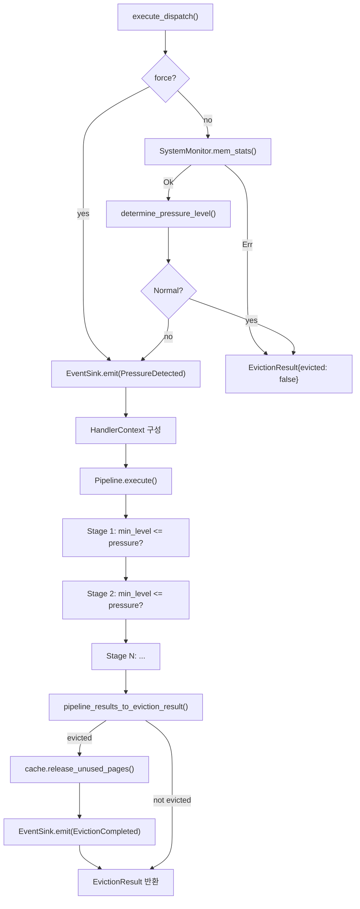
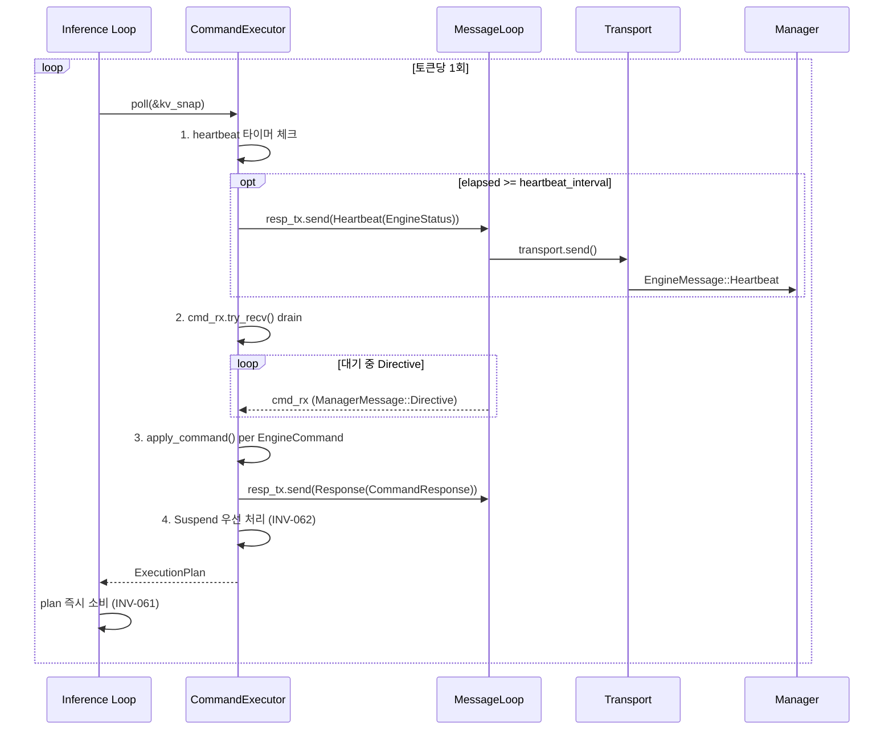
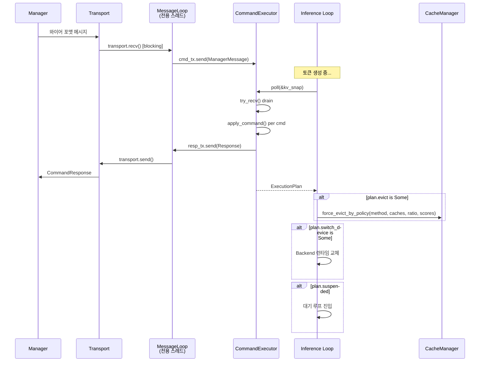

# Engine Overview -- Architecture

> spec/30-engine.md WHAT → 구현 HOW.
> 컴포넌트(모듈/구조체/트레이트) 중심으로 설계 결정, 인터페이스, 처리 흐름, 에러 경로를 기술한다.

---

## 1. 서브시스템 의존 그래프 (ENG-050)

```mermaid
flowchart TD
    GEN["generate.rs<br/>(Main Binary)"]

    subgraph Model ["Model Subsystem (ENG-011)"]
        TM["TransformerModel"]
        LL["LlamaLayer / TransformerLayer"]
    end

    subgraph Backend_Sub ["Backend Subsystem (ENG-013)"]
        BT["Backend trait"]
        CPU["CpuBackend<br/>Neon / AVX2 / Common"]
        OCL["OpenCLBackend"]
    end

    subgraph Core ["Core Subsystem (ENG-012)"]
        TEN["Tensor / Buffer / Shape"]
        MEM["Memory trait / Galloc"]
        DT["DType / Quant"]
        SAMP["SamplingConfig"]
        TP["SpinPool"]
    end

    subgraph KVCache_Sub ["KV Cache Subsystem (ENG-014)"]
        KVO["KVCacheOps trait"]
        KVC["KVCache"]
        KIVI["KiviCache"]
        OFFL["OffloadKVCache"]
    end

    subgraph CacheMgmt ["Cache Management (ENG-015)"]
        CM["CacheManager"]
        PP["CachePressurePipeline"]
        EP["EvictionPolicy trait"]
        SM["SystemMonitor trait"]
        ES["EventSink trait"]
    end

    subgraph Resilience_Sub ["Resilience Subsystem (ENG-016)"]
        TR["Transport trait"]
        ML["MessageLoop"]
        CE["CommandExecutor"]
        XP["ExecutionPlan"]
        RM["ResilienceManager<br/>(D-Bus 레거시)"]
    end

    subgraph QCF_Sub ["QCF Subsystem (ENG-017)"]
        QM["QcfMetric / DegradationEstimator"]
    end

    subgraph Eval_Sub ["Eval Subsystem (ENG-018)"]
        EL["EvalLoop / StepHook"]
    end

    GEN --> TM
    GEN --> CE
    GEN --> CM
    TM --> LL
    LL --> BT
    LL --> KVO
    BT --> TEN
    BT --> CPU
    BT --> OCL
    CPU --> TEN
    OCL --> TEN
    TEN --> MEM
    TEN --> DT
    KVO --> TEN
    KVC -.->|implements| KVO
    KIVI -.->|implements| KVO
    OFFL -.->|implements| KVO
    CM --> PP
    CM --> SM
    CM --> ES
    PP --> EP
    CE --> XP
    CE --> ML
    ML --> TR
    QM --> TEN
    EL --> TM
    EL --> KVO
    EL --> QM
</flowchart>
```

---

## 2. Backend trait (ENG-013)

### 설계 결정

**Spec WHAT**: 하드웨어별 수치 연산을 추상화하는 단일 trait (ENG-013).

**구현 HOW**: `core/backend.rs`에 20+ 메서드를 가진 `Backend` trait을 정의한다. 대부분의 메서드에 기본 구현(scalar CPU fallback)을 제공하여, 새 백엔드 추가 시 핵심 연산만 오버라이드하면 된다.

**전략 근거**: Interface Segregation을 완벽히 따르면 `MatmulBackend`, `NormBackend` 등으로 분리해야 하지만, 모든 연산이 같은 하드웨어 컨텍스트(GPU queue, SIMD 레지스터)에 바인딩되므로 단일 trait이 실용적이다. 기본 구현으로 OCP(Open-Closed)를 보장한다.

### 인터페이스

```rust
// engine/src/core/backend.rs
pub trait Backend: Send + Sync {
    fn as_any(&self) -> &dyn std::any::Any;
    fn name(&self) -> &str;
    fn device(&self) -> &str;

    // -- 핵심 연산 (구현체 필수) --
    fn matmul(&self, a: &Tensor, b: &Tensor, out: &mut Tensor) -> Result<()>;
    fn matmul_transposed(&self, a: &Tensor, b: &Tensor, out: &mut Tensor) -> Result<()>;
    fn matmul_slice(&self, a: &Tensor, b: &Tensor, rows: usize, cols: usize, out: &mut Tensor) -> Result<()>;
    fn add_assign(&self, a: &mut Tensor, b: &Tensor) -> Result<()>;
    fn scale(&self, x: &mut Tensor, v: f32) -> Result<()>;
    fn silu_mul(&self, a: &mut Tensor, b: &Tensor) -> Result<()>;
    fn rms_norm(&self, x: &mut Tensor, w: &Tensor, eps: f32, add_unit: bool) -> Result<()>;
    fn softmax(&self, x: &mut Tensor) -> Result<()>;
    fn rope_inplace(&self, x: &mut Tensor, start_pos: usize, theta: f32) -> Result<()>;
    fn attention_gen(&self, q: &Tensor, k_cache: &Tensor, v_cache: &Tensor, out: &mut Tensor,
                     num_heads_q: usize, num_heads_kv: usize, head_dim: usize,
                     cache_seq_len: usize, scores_out: Option<&mut [f32]>) -> Result<()>;
    fn copy_from(&self, t: &Tensor) -> Result<Tensor>;
    fn cast(&self, src: &Tensor, dst: &mut Tensor) -> Result<()>;

    // -- 기본 구현 있음 (오버라이드 가능) --
    fn add_row_bias(&self, x: &mut Tensor, bias: &Tensor) -> Result<()>;      // scalar loop
    fn gelu_tanh_mul(&self, gate: &mut Tensor, up: &Tensor) -> Result<()>;     // scalar loop
    fn rms_norm_oop(&self, x: &Tensor, out: &mut Tensor, w: &Tensor, eps: f32, add_unit: bool) -> Result<()>;
    fn add_rms_norm_oop(&self, x: &mut Tensor, residual: &Tensor, out: &mut Tensor, w: &Tensor, eps: f32, add_unit: bool) -> Result<()>;
    fn copy_into(&self, src: &Tensor, dst: &mut Tensor) -> Result<()>;         // memcpy
    fn read_buffer(&self, t: &Tensor, dst: &mut [u8]) -> Result<()>;
    fn write_buffer(&self, t: &mut Tensor, src: &[u8]) -> Result<()>;
    fn gather(&self, src: &Tensor, indices: &Tensor, dst: &mut Tensor) -> Result<()>;
    fn buffer_shift(&self, tensor: &mut Tensor, src_offset: usize, dst_offset: usize, count: usize) -> Result<()>;
    fn copy_slice(&self, src: &Tensor, dst: &mut Tensor, src_offset: usize, dst_offset: usize, count: usize) -> Result<()>;
    fn kv_scatter_f32_to_f16(&self, k_src: &Tensor, v_src: &Tensor, k_dst: &mut Tensor, v_dst: &mut Tensor,
                              head_dim: usize, capacity: usize, write_pos: usize) -> Result<()>;
    fn synchronize(&self) -> Result<()>;                                        // no-op
    fn flush(&self) -> Result<()>;                                              // no-op
}
```

**전제조건**: 모든 Tensor의 버퍼가 유효한 메모리 주소를 가져야 한다 (null pointer이면 에러 반환).

**후조건**: 연산 결과는 `out`/`dst` 매개변수에 기록된다. GPU 백엔드에서는 `synchronize()` 호출 전까지 결과가 GPU 메모리에만 존재할 수 있다.

### 구현체

| 구현체 | feature gate | 타겟 | 코드 | 특이사항 |
|--------|-------------|------|------|---------|
| CpuBackendNeon | 기본 | aarch64 | `backend/cpu/neon.rs` | NEON SIMD, dotprod, F16 네이티브 |
| CpuBackendAVX2 | 기본 | x86_64 | `backend/cpu/x86.rs` | AVX2+FMA |
| CpuBackendCommon | 기본 | 기타 | `backend/cpu/common.rs` | scalar fallback |
| OpenCLBackend | `opencl` | 모든 아키텍처 | `backend/opencl/mod.rs` | ~80 커널, plan-based decode |

### 에러 경로

- Tensor shape mismatch: `anyhow::bail!`
- Null pointer (GPU 미매핑 버퍼): `anyhow::bail!`
- `kv_scatter_f32_to_f16` 미지원: `anyhow::bail!` (기본 구현)
- OpenCL 커널 실행 실패: `clEnqueueNDRangeKernel` 에러 코드 → `anyhow::Error`

### 코드-스펙 차이

- Spec에는 "~20 메서드"로 기술되어 있으나, 실제로는 기본 구현 포함 약 25개 메서드가 존재한다.
- `kv_scatter_f32_to_f16`는 OpenCL 전용 최적화 메서드로, Spec에 명시되지 않았으나 성능 필수 경로이다.

### INV-065

`Send + Sync` trait bound가 Backend trait 정의에 직접 명시되어 있다: `pub trait Backend: Send + Sync`. 이는 `Arc<dyn Backend>` 공유를 보장한다.

---

## 3. KVCacheOps trait 및 구현체 (ENG-014)

### 설계 결정

**Spec WHAT**: KV 캐시 저장/조회/용량 관리를 추상화 (ENG-014).

**구현 HOW**: `KVCacheOps` trait을 제네릭 모노모피즘(`<C: KVCacheOps>`)으로 사용한다. `dyn Trait` 대신 제네릭을 선택한 이유는 contiguous slice 접근(`&mut [C]`)과 zero runtime overhead를 위함이다.

### 인터페이스

```rust
// engine/src/core/kv_cache.rs
pub trait KVCacheOps: Send {
    fn current_pos(&self) -> usize;
    fn set_current_pos(&mut self, pos: usize);
    fn capacity(&self) -> usize;
    fn kv_heads(&self) -> usize;
    fn head_dim(&self) -> usize;
    fn layout(&self) -> KVLayout;
    fn kv_dtype(&self) -> DType;
    fn memory_usage_bytes(&self) -> usize;
    fn update(&mut self, new_k: &Tensor, new_v: &Tensor) -> Result<()>;
    fn get_view(&mut self) -> (Tensor, Tensor);
    fn get_buffers_mut(&mut self) -> Option<(&mut Tensor, &mut Tensor)>;  // default: None
    fn advance_pos(&mut self, _n: usize);                                  // default: no-op
    fn ensure_capacity(&mut self, _min_tokens: usize) -> Result<bool>;     // default: Ok(false)
    fn needs_attn_scores(&self) -> bool;                                   // default: false
    fn set_attn_scores(&mut self, _scores: &[f32], ...);                  // default: no-op
}

pub trait PrefetchableCache: KVCacheOps {
    fn preload(&mut self) -> Result<()>;
    fn release_buffers(&mut self);
    fn reset_preload(&mut self);
    fn retain_preload(&mut self);  // default: no-op
}
```

### KVLayout

```rust
pub enum KVLayout {
    SeqMajor,   // [batch, seq_pos, kv_heads, head_dim]
    HeadMajor,  // [batch, kv_heads, seq_pos, head_dim]
}
```

### 구현체

| 구현체 | DType | 코드 | 특이사항 |
|--------|-------|------|---------|
| KVCache | F32, F16, Q4_0 | `core/kv_cache.rs` | 모든 eviction, offload, grow-on-demand |
| KiviCache | F32 입력 → 내부 Q2 | `core/kivi_cache.rs` | `needs_attn_scores()=true` (AWQE), eviction 미지원 |
| OffloadKVCache | F16, F32 | `core/kv_cache.rs` 또는 별도 | `PrefetchableCache` 구현, seq-major only, `--kv-offload` |

---

## 4. CacheManager 및 CachePressurePipeline (ENG-015)

### 설계 결정

**Spec WHAT**: 메모리 압력 기반 KV 캐시 관리 오케스트레이션 (ENG-015).

**구현 HOW**: 2-tier 추상화. `CacheManager`는 항상 `CachePressurePipeline`을 통해 동작한다. 레거시 `new()` API에서도 `EvictionPolicy`를 `EvictionHandler`로 래핑하여 Pipeline에 등록한다.

**전략 근거**: 초기에 CacheManager가 이중 모드(직접 eviction + Pipeline)로 동작했으나, 2026-03-10 리팩토링에서 Pipeline-only로 통합했다. 이는 라우팅 중복을 제거하고 DIP(Dependency Inversion)를 강화한다.

### CacheManager 인터페이스

```rust
// engine/src/core/cache_manager.rs
pub struct CacheManager {
    pipeline: CachePressurePipeline,
    monitor: Box<dyn SystemMonitor>,
    threshold_bytes: usize,
    event_sink: Arc<dyn EventSink>,
    policies: HashMap<EvictMethod, Box<dyn EvictionPolicy>>,  // Manager-directed dispatch
}

impl CacheManager {
    // 생성
    pub fn new(policy: Box<dyn EvictionPolicy>, monitor: Box<dyn SystemMonitor>,
               threshold_bytes: usize, target_ratio: f32) -> Self;
    pub fn with_pipeline(pipeline: CachePressurePipeline, monitor: Box<dyn SystemMonitor>,
                         threshold_bytes: usize) -> Self;

    // Observability
    pub fn set_event_sink(&mut self, sink: Arc<dyn EventSink>);
    pub fn event_sink(&self) -> &Arc<dyn EventSink>;

    // 자동 eviction (SystemMonitor 기반 메모리 체크)
    pub fn maybe_evict(&self, caches: &mut [KVCache]) -> Result<EvictionResult>;
    pub fn maybe_evict_with_scores(&self, caches: &mut [KVCache], importance: &[f32]) -> Result<EvictionResult>;
    pub fn maybe_evict_with_head_scores(&self, caches: &mut [KVCache], flat: &[f32],
                                         head: &[f32], n_kv_heads: usize) -> Result<EvictionResult>;

    // 강제 eviction (Resilience 시그널, Emergency 레벨)
    pub fn force_evict(&self, caches: &mut [KVCache], target_ratio: f32) -> Result<EvictionResult>;
    pub fn force_evict_with_scores(&self, ...) -> Result<EvictionResult>;
    pub fn force_evict_with_scores_and_budgets(&self, ...) -> Result<EvictionResult>;
    pub fn force_evict_with_head_scores(&self, ...) -> Result<EvictionResult>;

    // Manager-directed dispatch (named policy)
    pub fn register_policy(&mut self, method: EvictMethod, policy: Box<dyn EvictionPolicy>);
    pub fn force_evict_by_policy(&self, method: EvictMethod, caches: &mut [KVCache],
                                  target_ratio: f32, scores: ScoreContext) -> Result<EvictionResult>;

    pub fn policy_name(&self) -> String;
}
```

### CachePressurePipeline 처리 흐름



### PressureLevel 결정 로직

| 조건 | PressureLevel |
|------|--------------|
| `mem_available >= threshold` | Normal |
| `mem_available >= threshold / 2` | Warning |
| `mem_available >= threshold / 4` | Critical |
| `mem_available < threshold / 4` | Emergency |
| `force == true` | Emergency (직접) |

### EvictionPolicy trait

```rust
// engine/src/core/eviction/mod.rs
pub trait EvictionPolicy: Send + Sync {
    fn should_evict(&self, cache: &KVCache, mem_available: usize) -> bool;
    fn evict(&self, cache: &mut KVCache, target_len: usize) -> Result<()>;
    fn name(&self) -> &str;
    fn evict_with_scores(&self, cache: &mut KVCache, target_len: usize, _importance: &[f32]) -> Result<()>;  // default: evict()
    fn evict_with_head_scores(&self, cache: &mut KVCache, target_len: usize, flat: &[f32],
                               _head: &[f32], _n_kv_heads: usize) -> Result<()>;  // default: evict_with_scores()
}
```

| 구현체 | CLI | 코드 |
|--------|-----|------|
| NoEvictionPolicy | `none` | `eviction/no_eviction.rs` |
| SlidingWindowPolicy | `sliding` | `eviction/sliding_window.rs` |
| StreamingLLMPolicy | `streaming` | `eviction/streaming_llm.rs` |
| H2OPolicy | `h2o` | `eviction/h2o.rs` |
| H2OPlusPolicy | `h2o_plus` | `eviction/h2o_plus.rs` |

### CachePressureHandler trait 및 6종 구현

```rust
// engine/src/core/pressure/mod.rs
pub trait CachePressureHandler: Send + Sync {
    fn handle(&self, ctx: &mut HandlerContext) -> Result<ActionResult>;
    fn name(&self) -> &str;
}
```

| Handler | 상태 | 코드 |
|---------|------|------|
| EvictionHandler | 완성 | `pressure/eviction_handler.rs` |
| D2OHandler | 완성 | `pressure/d2o_handler.rs` |
| SwapHandler | 완성 | `pressure/swap_handler.rs` |
| QuantizeHandler | 간접 | `pressure/quantize_handler.rs` |
| MergeHandler | 스텁 | `pressure/merge_handler.rs` |
| SparseHandler | 스텁 | `pressure/sparse_handler.rs` |

### EventSink trait (Observability)

```rust
// engine/src/core/events.rs
pub trait EventSink: Send + Sync {
    fn emit(&self, event: CacheEvent);
}
```

| Sink 구현체 | 용도 |
|------------|------|
| NoOpSink | 기본값, 제로 오버헤드 |
| StderrDiagnosticSink | 스코어 진단을 stderr 출력 |

### SystemMonitor trait

```rust
// engine/src/core/sys_monitor.rs
pub trait SystemMonitor: Send + Sync {
    fn mem_stats(&self) -> Result<MemoryStats>;
}

pub struct MemoryStats {
    pub total: usize,
    pub available: usize,
    pub free: usize,
}
```

| 구현체 | 코드 | 비고 |
|--------|------|------|
| LinuxSystemMonitor | `core/sys_monitor.rs` | `/proc/meminfo` 파싱 |
| (테스트용 mock) | 테스트 코드 내 | `mem_stats()` 반환값 고정 |

---

## 5. CommandExecutor 및 ExecutionPlan (ENG-016 Directive 경로)

### 설계 결정

**Spec WHAT**: Manager Directive를 수신하여 Engine이 즉시 소비할 수 있는 ExecutionPlan을 생성 (ENG-016).

**구현 HOW**: CommandExecutor는 전략 로직이 없다. EngineCommand 11종을 1:1로 ExecutionPlan 필드에 매핑하는 순수 변환기이다. 전략 결정은 Manager의 책임이다 (SRP).

### ExecutionPlan

```rust
// engine/src/resilience/executor.rs
pub struct ExecutionPlan {
    pub evict: Option<EvictPlan>,
    pub switch_device: Option<String>,
    pub prepare_device: Option<String>,
    pub throttle_delay_ms: u64,             // 0 = no throttle
    pub suspended: bool,
    pub resumed: bool,
    pub layer_skip: Option<f32>,
    pub kv_quant_bits: Option<u8>,
    pub restore_defaults: bool,
}

pub struct EvictPlan {
    pub target_ratio: f32,                  // 0.0-1.0
    pub level: ResourceLevel,
    pub method: EvictMethod,                // H2o | Sliding | Streaming
}

pub enum EvictMethod { H2o, Sliding, Streaming }

pub struct KVSnapshot {
    pub total_bytes: u64,
    pub total_tokens: usize,
    pub capacity: usize,
    pub protected_prefix: usize,
    pub kv_dtype: String,
    pub eviction_policy: String,
    pub skip_ratio: f32,
}
```

### CommandExecutor 인터페이스

```rust
pub struct CommandExecutor {
    cmd_rx: mpsc::Receiver<ManagerMessage>,
    resp_tx: mpsc::Sender<EngineMessage>,
    // ... 내부 상태 (compute_level, memory_level, engine_state, active_device, etc.)
}

impl CommandExecutor {
    pub fn new(cmd_rx: mpsc::Receiver<ManagerMessage>, resp_tx: mpsc::Sender<EngineMessage>,
               active_device: String, heartbeat_interval: Duration) -> Self;
    pub fn send_capability(&self, cap: EngineCapability);
    pub fn set_running(&mut self);
    pub fn on_token_generated(&mut self);                   // 처리량 EMA 갱신
    pub fn poll(&mut self, kv_snap: &KVSnapshot) -> ExecutionPlan;  // 토큰당 1회 (INV-060)
    pub fn state(&self) -> EngineState;
    pub fn compute_level(&self) -> ResourceLevel;           // 레거시, 항상 Normal
    pub fn memory_level(&self) -> ResourceLevel;            // 레거시, 항상 Normal
    pub fn throttle_delay_ms(&self) -> u64;
    pub fn active_actions(&self) -> &[String];
}
```

### poll() 처리 흐름



### EngineCommand → ExecutionPlan 필드 매핑

| EngineCommand | ExecutionPlan 필드 | 비고 |
|---------------|-------------------|------|
| Throttle { delay_ms } | `throttle_delay_ms` | active_actions에 "throttle" 추가 |
| LayerSkip { skip_ratio } | `layer_skip = Some(ratio)` | active_actions에 "layer_skip" |
| KvEvictH2o { keep_ratio } | `evict = Some(EvictPlan{H2o, ratio, Critical})` | |
| KvEvictSliding { keep_ratio } | `evict = Some(EvictPlan{Sliding, ratio, Critical})` | |
| KvStreaming { .. } | (무시) | `CommandResult::Rejected` 반환 |
| KvQuantDynamic { target_bits } | `kv_quant_bits = Some(bits)` | KIVI 경로에서 소비 |
| RestoreDefaults | `restore_defaults = true` | 모든 active_actions 초기화 |
| SwitchHw { device } | `switch_device = Some(device)` | 후행 명령이 선행을 덮어씀 |
| PrepareComputeUnit { device } | `prepare_device = Some(device)` | |
| Suspend | `suspended = true` | **다른 모든 plan 필드 초기화** (INV-062) |
| Resume | `resumed = true` | level/throttle를 Normal로 리셋 |

### Superseding 규칙

동일 `poll()` 호출 내에서 복수의 Directive가 대기 중이면 순서대로 처리하며, 후행이 선행을 덮어쓴다. 각 Directive에 대해 개별 `CommandResponse`가 전송된다.

### Heartbeat

- 주기: `heartbeat_interval` (generate.rs에서 `Duration::from_secs(1)` 하드코딩)
- 내용: `EngineStatus` (16개 필드: `active_device`, `kv_cache_utilization`, `active_actions`, `available_actions` 등)
- 처리량 EMA: `on_token_generated()` 호출마다 ALPHA=0.1 지수이동평균으로 tok/s 갱신

### 에러 경로

- `cmd_rx` 채널 닫힘: `try_recv()`가 `Err(TryRecvError::Disconnected)` 반환 → 루프 탈출, 빈 plan 반환
- `resp_tx.send()` 실패: `let _ =`로 무시 (Manager 연결 끊김에도 추론 계속)

---

## 6. Transport trait 및 MessageLoop (ENG-020 ~ ENG-023)

### 설계 결정

**Spec WHAT**: Manager-Engine 양방향 바이트 스트림 추상화 (ENG-020).

**구현 HOW**: `Transport` trait 4종 구현체 + `MessageLoop` 브리징 스레드. Transport는 `Send + 'static` 바운드만 가지며 `Sync`는 불필요하다 (MessageLoop가 단일 소유자, INV-063).

### Transport trait

```rust
// engine/src/resilience/transport.rs
pub trait Transport: Send + 'static {
    fn connect(&mut self) -> Result<(), TransportError>;
    fn recv(&mut self) -> Result<ManagerMessage, TransportError>;   // blocking
    fn send(&mut self, msg: &EngineMessage) -> Result<(), TransportError>;
    fn name(&self) -> &str;
}
```

### TransportError

```rust
pub enum TransportError {
    ConnectionFailed(String),
    Disconnected,
    ParseError(String),
    Io(std::io::Error),
}
```

### 와이어 포맷 (ENG-021)

UnixSocket, TCP 공통: `[4 bytes BE u32 length][UTF-8 JSON payload]`. 최대 페이로드 크기: `MAX_PAYLOAD_SIZE = 64KB`.

### Transport 구현체 4종

| 구현체 | feature | CLI | 코드 | 내부 구조 |
|--------|---------|-----|------|----------|
| UnixSocketTransport | `#[cfg(unix)]` | `unix:/path` | `transport.rs` | `UnixStream` reader/writer |
| TcpTransport | 기본 | `tcp:addr:port` | `transport.rs` | `TcpStream` reader/writer |
| DbusTransport | `resilience` | `dbus` | `dbus_transport.rs` | `zbus::blocking::Connection` |
| MockTransport | 테스트 | -- | `transport.rs` | `mpsc::channel` |

### MessageLoop

```rust
// engine/src/resilience/transport.rs
pub struct MessageLoop;

impl MessageLoop {
    pub fn spawn<T: Transport>(mut transport: T)
        -> Result<(mpsc::Receiver<ManagerMessage>, mpsc::Sender<EngineMessage>, JoinHandle<()>), TransportError>;
}
```

**동작**: 전용 스레드에서 (1) `resp_rx.try_recv()` drain → `transport.send()`, (2) blocking `transport.recv()` → `cmd_tx.send()`.

**종료 조건**: `Disconnected`, `cmd_tx` 수신측 drop, `send` 에러.

**INV-063**: Transport가 `move` 클로저로 스레드에 이동되어 단일 소유자를 보장한다.

### MockTransport 테스트 지원

```rust
pub fn channel() -> (MockTransport, MockSender);              // 단방향
pub fn bidirectional() -> (MockTransport, MockManagerEnd);     // 양방향
pub fn from_messages(messages: Vec<ManagerMessage>) -> Self;   // pre-loaded
```

---

## 7. ResilienceManager (D-Bus 레거시 경로, ENG-016)

### 설계 결정

**Spec WHAT**: D-Bus signal에 직접 반응하는 자율 모드 (ENG-061).

**구현 HOW**: `ResilienceManager`는 4종 `SystemSignal`을 `mpsc` 채널로 수신하고, `SignalLevels` 캐시 갱신 → `OperatingMode` 계산 → 4종 `ResilienceStrategy` 위임 → `resolve_conflicts()` 충돌 해소의 순서로 동작한다.

**중요**: `generate.rs`에서 직접 사용되지 않는다. DbusTransport가 `signal_to_manager_message()`로 변환하여 CommandExecutor에 전달하므로, 사실상 Directive 경로로 합류한다.

### OperatingMode

```rust
// engine/src/resilience/state.rs
pub enum OperatingMode { Normal, Degraded, Minimal, Suspended }

impl OperatingMode {
    pub fn from_levels(memory: Level, compute: Level, thermal: Level, energy: Level) -> Self;
    // 가장 심각한 Level이 Mode를 결정: Normal→Normal, Warning→Degraded, Critical→Minimal, Emergency→Suspended
}
```

### ResilienceStrategy trait

```rust
// engine/src/resilience/strategy/mod.rs
pub trait ResilienceStrategy: Send + Sync {
    fn react(&mut self, signal: &SystemSignal, mode: OperatingMode) -> Vec<ResilienceAction>;
    fn name(&self) -> &str;
}
```

| Strategy | 코드 |
|----------|------|
| MemoryStrategy | `strategy/memory.rs` |
| ComputeStrategy | `strategy/compute.rs` |
| ThermalStrategy | `strategy/thermal.rs` |
| EnergyStrategy | `strategy/energy.rs` |

### ResilienceAction

```rust
pub enum ResilienceAction {
    Evict { target_ratio: f32 },
    SwitchBackend { to: RecommendedBackend },
    LimitTokens { max_tokens: usize },
    Throttle { delay_ms: u64 },
    Suspend,
    RejectNew,
    RestoreDefaults,
}
```

### resolve_conflicts() 규칙

- Suspend가 있으면 다른 모든 액션을 무시
- CPU backend가 GPU보다 우선 (안전 우선)
- 가장 공격적인 eviction ratio (최소값)가 승리
- 최대 delay가 승리
- RestoreDefaults는 다른 제약이 없을 때만 유효

### DbusTransport 변환 테이블 (ENG-024)

| D-Bus signal | Level | 변환 결과 EngineCommand |
|-------------|-------|----------------------|
| MemoryPressure | Normal | RestoreDefaults |
| MemoryPressure | Warning | KvEvictSliding { keep_ratio: 0.85 } |
| MemoryPressure | Critical | KvEvictH2o { keep_ratio: 0.50 } |
| MemoryPressure | Emergency | Suspend |
| ComputeGuidance | Normal | RestoreDefaults |
| ComputeGuidance | Warning | Throttle { 30 } + SwitchHw { device } |
| ComputeGuidance | Critical | Throttle { 70 } + SwitchHw { device } |
| ComputeGuidance | Emergency | Suspend |
| ThermalAlert | Normal | RestoreDefaults |
| ThermalAlert | Warning | Throttle { 30 } + PrepareComputeUnit { "cpu" } |
| ThermalAlert | Critical | Throttle { 70 } + SwitchHw { "cpu" } |
| ThermalAlert | Emergency | Suspend |
| EnergyConstraint | Normal | RestoreDefaults |
| EnergyConstraint | Warning | SwitchHw { "cpu" } |
| EnergyConstraint | Critical | SwitchHw { "cpu" } + Throttle { 70 } |
| EnergyConstraint | Emergency | Suspend |

### 코드-스펙 차이

Spec (ENG-024)에서 MemoryPressure Emergency는 `KvEvictH2o { keep_ratio: 0.25 }`로 기술되어 있으나, 실제 코드(`dbus_transport.rs`)에서는 `Suspend`로 변환한다. 이는 SYS-055 (Emergency에서 자율 Suspend)를 우선 적용한 결과이다.

---

## 8. Resilience Directive 전체 흐름



---

## 9. 8종 액션의 Engine 실행 경로

| 액션 | ExecutionPlan 필드 | 실행 경로 | 상태 |
|------|-------------------|----------|------|
| SwitchHw | `switch_device` | `generate.rs` — Backend 런타임 교체 (`Arc<dyn Backend>` swap) | 구현 완료 |
| Throttle | `throttle_delay_ms` | `generate.rs` — 토큰 간 `thread::sleep` | 구현 완료 |
| KvEvictH2o | `evict` (H2o) | `CacheManager::force_evict_by_policy(EvictMethod::H2o, ...)` | 구현 완료 |
| KvEvictSliding | `evict` (Sliding) | `CacheManager::force_evict_by_policy(EvictMethod::Sliding, ...)` | 구현 완료 |
| KvStreaming | (미매핑) | `CommandResult::Rejected` 반환 | 프로토콜만 정의 |
| KvQuantDynamic | `kv_quant_bits` | KIVI 경로에서 양자화 비트 갱신 | 구현 완료 |
| KvMergeD2o | (미매핑) | -- | 스펙 전용, 미구현 |
| LayerSkip | `layer_skip` | `generate.rs` — SkipConfig 갱신 | 구현 완료 |

---

## 10. 스레딩 모델 (ENG-030 ~ ENG-033)

### 스레드 구조

| 스레드 | 생성 조건 | 역할 |
|--------|----------|------|
| Main (추론) | 항상 | CLI 파싱 → 모델 로딩 → Prefill → Decode loop |
| MessageLoop | `--enable-resilience` 또는 `--experiment-schedule` | Transport recv/send 브리징 |
| Rayon pool | 항상 (전역) | matmul 병렬화. `--threads N` |
| SpinPool | 항상 (CPU 백엔드) | F16 GEMV 등 latency-sensitive 작업 |

### Main 스레드 10단계 흐름 (ENG-031)

```
1. CLI Args 파싱
2. Rayon/SpinPool 스레드 풀 초기화
3. Backend 생성 (cpu / opencl / hybrid)
4. Model 로딩 (safetensors → Tensor)
5. KV Cache 생성 (KVCache / KiviCache / OffloadKVCache)
6. CacheManager 생성 (EvictionPolicy + SystemMonitor + Pipeline)
7. CommandExecutor 생성:
   - experiment_schedule → 내부 mpsc 채널
   - enable_resilience   → transport + MessageLoop::spawn()
   - 둘 다 없으면         → None
8. [KIVI 경로] run_kivi() 분기
9. [Offload 경로] run_offload() 분기
10. Prefill → Decode loop
```

### Resilience Checkpoint (ENG-032)

Decode loop 내 토큰당 1회 `executor.poll(&kv_snap)` 호출. KVSnapshot 구성 → plan 소비 → eviction/switch/throttle/suspend 처리.

---

## 11. Invariants 코드 매핑

| INV ID | 코드 위치 | 구현 방법 |
|--------|----------|----------|
| INV-060 | `generate.rs` decode loop | loop iteration당 `executor.poll()` 1회 호출 |
| INV-061 | `generate.rs` decode loop | `let plan = executor.poll(...)` — 즉시 소비, 다음 iteration에서 재할당 |
| INV-062 | `executor.rs` `poll()` step 4 | `plan.suspended == true` → `evict=None`, `switch_device=None`, `prepare_device=None` |
| INV-063 | `transport.rs` `MessageLoop::spawn()` | Transport를 `move` 클로저로 이동 — 단일 소유자 보장 |
| INV-064 | `executor.rs` `poll()` step 1 | `elapsed >= heartbeat_interval` → `send_heartbeat()` |
| INV-065 | `backend.rs` Backend trait | `pub trait Backend: Send + Sync` — 정의에 직접 명시 |

## 12. Constraints 코드 매핑

| Constraint | 코드 위치 | 구현 방법 |
|------------|----------|----------|
| ENG-070 (no async) | 프로젝트 전체 | `std::thread` + `mpsc` 채널, Cargo.toml에 tokio 미포함 |
| ENG-071 (JSON) | `transport.rs` | `serde_json::to_vec()` / `from_slice()` |
| ENG-072 (단일 세션) | `executor.rs` | 단일 `cmd_rx` 채널 — 1개 Transport에서만 수신 |
| ENG-073 (blocking) | `transport.rs` MessageLoop | `transport.recv()` blocking 호출은 전용 스레드에서만 |

---

## 13. Feature Gates

| feature | 영향 모듈 | 설명 | spec 근거 |
|---------|----------|------|-----------|
| `opencl` | `backend/opencl/` | OpenCL GPU 백엔드 (기본 활성) | ENG-013 |
| `resilience` | `resilience/dbus_transport.rs` | D-Bus Transport, Strategy 경로 | ENG-016, ENG-061 |
| `#[cfg(unix)]` | `resilience/transport.rs` | UnixSocketTransport | ENG-022 |

---

## 14. CLI

### Resilience (ENG-040)

| 플래그 | 타입 | 기본값 | spec 근거 |
|--------|------|--------|-----------|
| `--enable-resilience` | bool | false | ENG-040 |
| `--resilience-transport` | String | "dbus" | ENG-040 |
| `--experiment-schedule` | Option\<String\> | None | ENG-040/045 |

### Backend (ENG-041)

| 플래그 | 타입 | 기본값 | spec 근거 |
|--------|------|--------|-----------|
| `--backend` | String | "cpu" | ENG-041 |
| `--switch-threshold` | usize | 0 | ENG-041 |
| `--gpu-attn` | bool | false | ENG-041 |
| `--zero-copy` | bool | false | ENG-041 |

### KV Cache (ENG-042)

| 플래그 | 타입 | 기본값 | spec 근거 |
|--------|------|--------|-----------|
| `--kv-type` | String | "f16" | ENG-042 |
| `--kv-layout` | String | "head" | ENG-042 |
| `--eviction-policy` | String | "none" | ENG-042 |
| `--kv-budget` | usize | 0 | ENG-042 |
| `--kv-budget-ratio` | f32 | 0.0 | ENG-042 |
| `--kivi` | bool | false | ENG-042 |
| `--kv-offload` | String | "none" | ENG-042 |
| `--protected-prefix` | Option\<usize\> | None | ENG-042 |

### QCF/Eval (ENG-043)

| 플래그 | 타입 | 기본값 | spec 근거 |
|--------|------|--------|-----------|
| `--qcf-mode` | String | "attn" | ENG-043 |
| `--eval-ll` | bool | false | ENG-043 |
| `--eval-batch` | Option\<String\> | None | ENG-043 |
| `--profile` | bool | false | ENG-043 |

### Inference (ENG-044)

| 플래그 | 타입 | 기본값 | spec 근거 |
|--------|------|--------|-----------|
| `--model-path` | String | "models/llama3.2-1b" | ENG-044 |
| `--num-tokens` | usize | 20 | ENG-044 |
| `--max-seq-len` | usize | 2048 | ENG-044 |
| `--threads` | usize | 0 (auto) | ENG-044 |
| `--weight-dtype` | String | "f16" | ENG-044 |
| `--skip-ratio` | Option\<f32\> | None | ENG-044 |
| `--greedy` | bool | false | ENG-044 |

### Experiment (ENG-045)

| 플래그 | 타입 | 기본값 | spec 근거 |
|--------|------|--------|-----------|
| `--experiment-schedule` | Option\<String\> | None | ENG-045 |
| `--experiment-output` | Option\<String\> | None | ENG-045 |
| `--experiment-eviction-ratio` | Option\<f32\> | None | ENG-045 |

---

## 15. Config

Engine은 설정 파일 기반 config를 사용하지 않는다. 모든 설정은 CLI 플래그로 전달된다.
