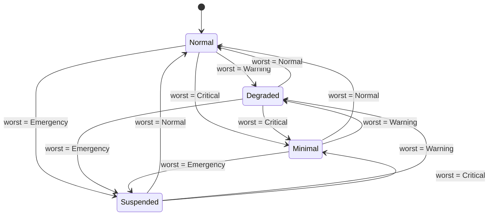
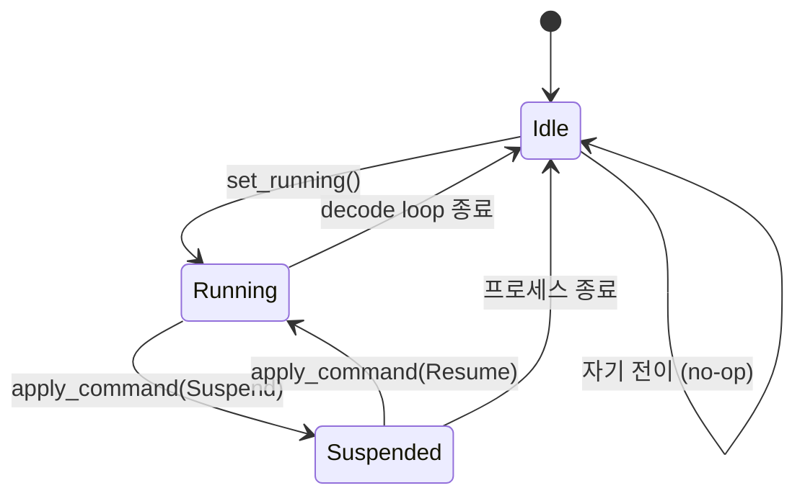
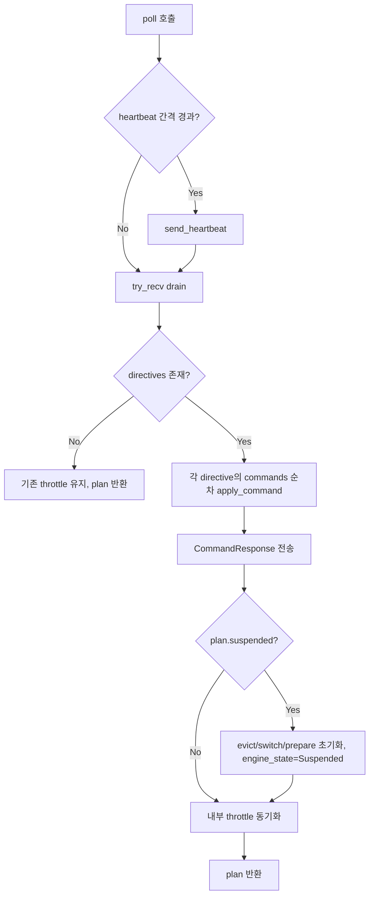
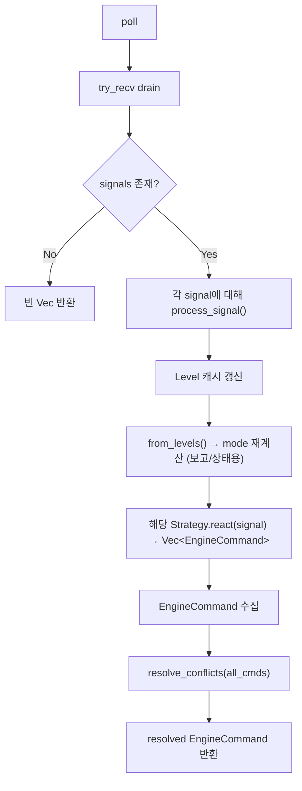

# Engine State Machines -- Architecture

> spec/31-engine-state.md의 구현 매핑. 컴포넌트 중심으로 설계 결정, 인터페이스, 처리 흐름, 예외를 기술한다.

---

## 1. OperatingMode FSM

**모듈**: `engine/src/resilience/state.rs`
**Spec**: ENG-ST-010 ~ ENG-ST-015

### 1.1 설계 결정

OperatingMode는 **순수 함수 기반 FSM**이다. 이전 상태를 참조하지 않고, 4종 Level 입력만으로 결정된다. Strategy 경로(D-Bus 레거시) 전용이며 CommandExecutor 경로에서는 사용하지 않는다.

### 1.2 인터페이스

```rust
pub enum OperatingMode { Normal, Degraded, Minimal, Suspended }

impl OperatingMode {
    /// 4종 Level 중 worst가 모드를 결정한다. 순수 함수, &self 없음.
    pub fn from_levels(memory: Level, compute: Level, thermal: Level, energy: Level) -> Self;
}
```

**Pre**: 각 Level은 `Normal | Warning | Critical | Emergency` 중 하나.
**Post**: `worst = max(memory, compute, thermal, energy)` → Normal→Normal, Warning→Degraded, Critical→Minimal, Emergency→Suspended.

### 1.3 전이 다이어그램



12 전이 모두 가능 (순수 함수이므로 이전 상태 무관).

### 1.4 호출 위치

- `ResilienceManager::process_signal()` (`engine/src/resilience/manager.rs`) -- signal 수신 후 mode 재계산
- `dbus_transport.rs`의 `signal_to_manager_message()` -- Emergency → `EngineCommand::Suspend` 변환 (SYS-055)

### 1.5 불변식

- **INV-070**: `from_levels()`는 순수 함수 -- 입력 4종 Level만 참조, 외부 상태 의존 없음.

---

## 2. EngineState FSM

**모듈**: `shared/src/lib.rs` (정의), `engine/src/resilience/executor.rs` (전이)
**Spec**: ENG-ST-020 ~ ENG-ST-025

### 2.1 설계 결정

EngineState는 Manager-Engine 프로토콜 공유를 위해 **shared 크레이트**에 정의된다. Directive 경로의 프로토콜 수준 상태이며, OperatingMode와 **독립 FSM**이다.

### 2.2 인터페이스

```rust
// shared/src/lib.rs
#[derive(Debug, Clone, Copy, PartialEq, Eq, Serialize, Deserialize)]
pub enum EngineState { Idle, Running, Suspended }
```

### 2.3 전이 다이어그램



- **Idle→Suspended**: 코드상 가능하나 의미 없는 전이 (SHOULD NOT).
- EngineState는 Heartbeat (`EngineStatus.state`) 필드로 Manager에 보고된다.

### 2.4 전이 코드

| 전이 | 트리거 | 함수 |
|------|--------|------|
| Idle→Running | `executor.set_running()` | `engine/src/resilience/executor.rs` |
| Running→Suspended | `apply_command(&EngineCommand::Suspend, ..)` | 동상 |
| Suspended→Running | `apply_command(&EngineCommand::Resume, ..)` | 동상 |
| Running→Idle | decode loop 자연 종료 | `engine/src/bin/generate.rs` |

### 2.5 불변식

- **INV-071**: EngineState 전이는 `apply_command(Suspend)`, `apply_command(Resume)`, `set_running()` 내부에서만 발생. `engine_state` 필드는 private이므로 외부 직접 변경 불가.

---

## 3. CommandExecutor

**모듈**: `engine/src/resilience/executor.rs`
**Spec**: ENG-ST-030 ~ ENG-ST-035

### 3.1 설계 결정

CommandExecutor는 **전략 로직 없이** Manager→Engine 명령을 ExecutionPlan으로 변환하는 translator이다. Strategy 패턴 대신 단순 command→plan 1:1 매핑을 사용한다. Heartbeat 전송, 처리량 EMA 추적, active/available actions 관리를 부대 책임으로 갖는다.

### 3.2 인터페이스

```rust
pub struct CommandExecutor { /* 11 private fields */ }

impl CommandExecutor {
    pub fn new(
        cmd_rx: mpsc::Receiver<ManagerMessage>,
        resp_tx: mpsc::Sender<EngineMessage>,
        active_device: String,
        heartbeat_interval: Duration,
    ) -> Self;

    pub fn send_capability(&self, cap: EngineCapability);
    pub fn set_running(&mut self);
    pub fn on_token_generated(&mut self);

    /// 토큰당 1회 호출. Heartbeat 전송 + 명령 drain + ExecutionPlan 생성.
    pub fn poll(&mut self, kv_snap: &KVSnapshot) -> ExecutionPlan;

    // Accessors
    pub fn state(&self) -> EngineState;
    pub fn compute_level(&self) -> ResourceLevel;
    pub fn memory_level(&self) -> ResourceLevel;
    pub fn throttle_delay_ms(&self) -> u64;
    pub fn active_actions(&self) -> &[String];
}
```

### 3.3 poll() 처리 흐름



### 3.4 EngineCommand → ExecutionPlan 매핑

12종 EngineCommand(shared 크레이트 정의)를 ExecutionPlan 필드에 매핑한다.

| EngineCommand | Plan 필드 | CommandResult | 부수 효과 |
|---------------|----------|---------------|----------|
| `Throttle { delay_ms }` | `throttle_delay_ms = delay_ms` | Ok | active_actions: delay>0이면 "throttle" 추가 |
| `LayerSkip { skip_ratio }` | `layer_skip = Some(ratio)` | Ok | active_actions: "layer_skip" 추가 |
| `KvEvictH2o { keep_ratio }` | `evict = Some(EvictPlan { H2o, ratio, Critical })` | Ok | active_actions: "kv_evict_h2o" 추가 |
| `KvEvictSliding { keep_ratio }` | `evict = Some(EvictPlan { Sliding, ratio, Critical })` | Ok | active_actions: "kv_evict_sliding" 추가 |
| `KvMergeD2o { keep_ratio }` | `evict = Some(EvictPlan { D2o, ratio, Critical })` | Ok | active_actions: "kv_merge_d2o" 추가 |
| `KvStreaming { sink_size, window_size }` | `evict = Some(EvictPlan { Streaming, 0.0, Critical, streaming_params: Some({sink_size, window_size}) })` | Ok | active_actions: "kv_evict_streaming" 추가 |
| `KvQuantDynamic { target_bits }` | `kv_quant_bits = Some(bits)` | Ok | active_actions: "kv_quant_dynamic" 추가 |
| `RestoreDefaults` | `restore_defaults = true, throttle_delay_ms = 0` | Ok | active_actions.clear(), levels→Normal |
| `SwitchHw { device }` | `switch_device = Some(device)` | Ok | -- |
| `PrepareComputeUnit { device }` | `prepare_device = Some(device)` | Ok | -- |
| `Suspend` | `suspended = true` | Ok | engine_state = Suspended |
| `Resume` | `resumed = true, throttle_delay_ms = 0` | Ok | engine_state = Running, levels→Normal |

**Superseding 규칙**: 동일 poll() 내 복수 Directive의 동일 필드 명령은 후행이 선행을 덮어쓴다.

### 3.5 compute_available_actions()

Heartbeat 전송 시 동적으로 계산된다.

```
기본 3종: ["throttle", "switch_hw", "layer_skip"]
+ eviction_policy != "none" → ["kv_evict_h2o", "kv_evict_sliding"]
+ kv_dtype.starts_with('q') → ["kv_quant_dynamic"]
```

### 3.6 처리량 EMA

```
alpha = 0.1
instant_tps = 1.0 / elapsed_since_last_token
ema = alpha * instant_tps + (1 - alpha) * ema
```

### 3.7 불변식

- **INV-074**: Suspend 시 `plan.evict = None, plan.switch_device = None, plan.prepare_device = None, plan.resumed = false`.
- **INV-075**: Resume 시 `compute_level = Normal, memory_level = Normal, throttle_delay_ms = 0`.
- **INV-076**: RestoreDefaults 시 `active_actions.clear(), throttle_delay_ms = 0, compute_level = Normal, memory_level = Normal`.

---

## 4. ExecutionPlan

**모듈**: `engine/src/resilience/executor.rs`
**Spec**: ENG-ST-040 ~ ENG-ST-043

### 4.1 설계 결정

ExecutionPlan은 **1회성 값 객체**이다. `poll()`이 생성하고, decode loop의 단일 iteration에서 즉시 소비된다. 다음 iteration의 `poll()`이 새로운 plan을 반환하므로 이전 plan은 자동 폐기된다.

### 4.2 구조

```rust
#[derive(Debug, Default)]
pub struct ExecutionPlan {
    pub evict: Option<EvictPlan>,
    pub switch_device: Option<String>,
    pub prepare_device: Option<String>,
    pub throttle_delay_ms: u64,        // 0 = no throttle
    pub suspended: bool,
    pub resumed: bool,
    pub layer_skip: Option<f32>,
    pub kv_quant_bits: Option<u8>,
    pub restore_defaults: bool,
}

pub struct EvictPlan {
    pub target_ratio: f32,             // 0.0~1.0 (Streaming에서는 0.0)
    pub level: ResourceLevel,          // 항상 Critical
    pub method: EvictMethod,
    pub streaming_params: Option<StreamingParams>,  // Streaming 전용
}

pub struct StreamingParams {
    pub sink_size: usize,              // attention sink 토큰 수
    pub window_size: usize,            // recent window 크기
}

pub enum EvictMethod { H2o, Sliding, Streaming, D2o }
```

### 4.3 소비 순서 (generate.rs decode loop)

1. `evict` → method별 분기: H2o/Sliding은 CacheManager 실행, Streaming은 `StreamingLLMPolicy::new(params.sink_size, params.window_size).evict()` 즉석 호출
2. `switch_device` → Backend 전환
3. `prepare_device` → Backend pre-warm
4. `kv_quant_bits` → KIVI transition_bits()
5. `layer_skip` → SkipConfig 재계산
6. `restore_defaults` → 모든 동적 설정 초기화
7. `suspended` → 대기 루프 진입
8. `resumed` → 대기 루프 탈출
9. `throttle_delay_ms` → sleep 삽입

---

## 5. ResilienceManager (Strategy 경로, manager-less `LocalPolicy`)

**모듈**: `engine/src/resilience/manager.rs`, `engine/src/resilience/strategy/`
**Spec**: ENG-ST-050 ~ ENG-ST-055

> **α-W-3 갱신 (`arch/pipeline_stage_design_v2.md` §5.4 drift-sync)**: 이 섹션의 strategy 경로는 manager-less `LocalPolicy`(front-door ①, `ResilienceStrategy` 3종 + `resolve_conflicts`)로 재정위된다. `ResilienceAction`/`MemoryStrategy` 는 **삭제**되고, strategy 출력 어휘는 `EngineCommand`(`shared/src/lib.rs:189`, 18-variant, `kv.*`/`weight.*` dot-prefix)로 통일된다. manager-full Directive 경로는 종전대로 `signal_to_manager_message()` → `EngineCommand` → `CommandExecutor`(§3) 를 사용하며 본 섹션을 경유하지 않는다. ResilienceManager/3-strategy/`resolve_conflicts` 는 production 소비자 0(test-only)이었고, 라이브 경로는 §3 의 `EngineCommand`→`CommandExecutor::apply_command` 다.

### 5.1 설계 결정

ResilienceManager는 **manager-less `LocalPolicy` 경로** 전용이다. CommandExecutor(Directive 경로)와 독립적으로 동작하며, DbusTransport가 두 경로를 브리징한다. **Thermal/Energy/Compute 3종 Strategy** 패턴으로 Signal→`EngineCommand`(이산 *mode* 명령) 변환 후 `resolve_conflicts()`로 충돌을 해결한다. memory 압력은 더 이상 이산 strategy 가 아니라 graded `Pressure(0–100)` scalar(`LocalPressureSource`)로 흐른다 (§5.4 R1; `MemoryStrategy` 소멸).

### 5.2 인터페이스

> **α-W-3 갱신 (§5.4 drift-sync)**: `poll()` 반환 어휘 `Vec<ResilienceAction>` → `Vec<EngineCommand>`. `strategies` 는 thermal/energy/compute 3종(memory 행 소멸). OperatingMode 재계산은 `react()` 입력이 아닌 보고/상태용으로만 잔존.

```rust
pub struct ResilienceManager { /* rx, mode, current_levels, strategies(thermal/energy/compute 3종) */ }

impl ResilienceManager {
    pub fn new(rx: mpsc::Receiver<SystemSignal>) -> Self;
    /// 토큰당 1회 호출. Signal drain → Strategy react → resolve_conflicts.
    pub fn poll(&mut self) -> Vec<EngineCommand>;
    pub fn mode(&self) -> OperatingMode;
}
```

### 5.3 처리 흐름

> **α-W-3 갱신 (§5.4 drift-sync)**: mermaid 노드를 새 어휘로 갱신 — `Strategy.react(signal, mode)` → `react(signal)`(dead `mode` 인자 제거), `from_levels() → mode 재계산`은 보고/상태용으로만 잔존, 수집·반환 어휘는 `EngineCommand`.



### 5.4 ResilienceStrategy trait

> **α-W-3 갱신 (§5.4 drift-sync)**: 시그니처에서 dead `mode: OperatingMode` 인자 제거(`react()` 가 `mode` 를 소비한 적 없음), 출력을 `Vec<EngineCommand>` 로 통일. trait 은 front-door 확장점 ① 로 **생존**(manager-less `LocalPolicy` 의 정책 단위). 이산 채널은 scalar 로 환원 불가한 *mode* 출력(switch/suspend) 전용이다. `name()` 불변.

```rust
pub trait ResilienceStrategy: Send + Sync {
    fn react(&mut self, signal: &SystemSignal) -> Vec<EngineCommand>;
    fn name(&self) -> &str;
}
```

**3종 구현체**:

| Strategy | 모듈 | 도메인 |
|----------|------|--------|
| `ComputeStrategy` | `strategy/compute.rs` | ComputeGuidance |
| `ThermalStrategy` | `strategy/thermal.rs` | ThermalAlert |
| `EnergyStrategy` | `strategy/energy.rs` | EnergyConstraint |

> **α-W-3 갱신 (§5.4 drift-sync)**: `MemoryStrategy`(`strategy/memory.rs`) 행 제거 — `MemoryStrategy` 삭제, memory 압력은 graded `Pressure(0–100)` scalar(`LocalPressureSource`)로 흐른다(§5.4 R1). thermal/energy 의 magnitude 도 같은 scalar 에 융합되지만 그건 `PressureSource` 측 관여이고, 여기 `react()` 는 *mode* 출력(switch/suspend) 전용이다.

**Strategy 반응 테이블** (thermal/energy/compute 3종, 이산 *mode* 채널):

| Strategy | Level | EngineCommand |
|----------|-------|---------------|
| Thermal | Normal | `RestoreDefaults` |
| Thermal | Warning | `SwitchHw { device: "cpu" }` |
| Thermal | Critical | `SwitchHw { device: "cpu" }` + `Throttle { delay_ms }` |
| Thermal | Emergency | `Suspend` |
| Compute | Normal | `RestoreDefaults` |
| Compute | Warning | (없음 -- 준비만, 전환 안 함) |
| Compute | Critical | `SwitchHw { device: recommended }` 또는 `Throttle { delay_ms: 50 }` (이미 해당 backend면) |
| Compute | Emergency | `SwitchHw { device: "cpu" }` + `Throttle { delay_ms: 100 }` |
| Energy | Normal | `RestoreDefaults` |
| Energy | Warning | `SwitchHw { device: "cpu" }` |
| Energy | Critical | `SwitchHw { device: "cpu" }` + `Throttle { delay_ms: 30 }` |
| Energy | Emergency | `Suspend` |

> **superseded (α-W-3, §5.4) — silent 삭제 금지로 명기**:
> - **구 4종 구현체의 `MemoryStrategy` 와 그 매핑 표 전체** (`Normal→RestoreDefaults`, `Warning→Evict{0.85}`, `Critical→Evict{0.50}`, `Emergency→Evict{0.25}+RejectNew`): graded `Pressure` scalar 경로로 이관 (`LocalPressureSource` → `band()` → `EvictionStage`). `MemoryStrategy` 자체가 소멸하므로 행 전면 제거. `Evict` 는 graded 경로로, `RejectNew` 는 어휘 소멸(아래).
> - **`SwitchBackend { Cpu }` → `SwitchHw { device: "cpu" }`** 매핑: `RecommendedBackend::Cpu`→`"cpu"`, `Gpu`→`"gpu"`, `Any`→switch 생략(구체 GPU backend(opencl/cuda) 해석은 dispatcher/`Hardware` 책임).
> - **`LimitTokens { max_tokens }`** / **`RejectNew`**: `EngineCommand` 에 등가 변종 부재 + production `CommandExecutor`/`ExecutionPlan` 미처리 → **drop**. token-rate 억제 의도는 잔존 `Throttle` 이, stop-intent 는 `Suspend` 가 흡수.

### 5.5 EngineCommand → LoopControl 적용 (구 InferenceContext, 폐기)

> **α-W-3 갱신 (§5.4 drift-sync)**: `react()` 출력이 `EngineCommand` 로 통일되므로 변환·적용은 `CommandDispatcher`(L4) → `LoopControl`(②control 채널) 단일 거처로 이동한다(구 `InferenceContext`/`execute_action` 의 `&mut` borrow 기반 ad-hoc 직접 적용 폐기). ①KV/weight·③switch 명령은 `registry.submit(OneShotStage)` 로 간다(§5.4 A-1 3역할 분리). `LoopControl` 은 ②control 명령(throttle/target_tbt/suspend/resume/restore)만 보유한다.

`LocalPolicy.poll()` 이 반환한 `Vec<EngineCommand>` 는 `CommandDispatcher` 가 채널별로 분배한다. ②control 채널 적용:

```rust
// LoopControl (구 InferenceContext ② 잔여)
pub struct LoopControl {
    pub throttle_delay_ms: u64,
    pub target_tbt_ms: u64,
    pub suspended: bool,
}

fn apply(cmd: &EngineCommand, lc: &mut LoopControl) {
    // Throttle { delay_ms }      -> lc.throttle_delay_ms = delay_ms
    // SetTargetTbt { target_ms } -> lc.target_tbt_ms = target_ms
    // Suspend                    -> lc.suspended = true
    // Resume                     -> lc.suspended = false
    // RestoreDefaults            -> lc.throttle_delay_ms = 0, lc.target_tbt_ms = 0
    // SwitchHw / Prepare*        -> ③switch 채널 (registry/Hardware), LoopControl 무관
    // Kv* / SwapWeights / LayerSkip / SetPartitionRatio / SetPrefillPolicy -> ①KV/weight 채널 (OneShot Stage)
}
```

> **superseded (α-W-3, §5.4)**: 구 `InferenceContext` 의 `max_tokens: &mut usize` / `reject_new: &mut bool` 필드와 `execute_action`(구 `pub fn execute_action(action: &ResilienceAction, ctx: &mut InferenceContext)`)의 `LimitTokens`/`RejectNew`/`Evict`/`SwitchBackend` 분기는 **폐기**. `LimitTokens`/`RejectNew` 는 `EngineCommand` 등가 부재로 어휘 자체가 소멸, `Evict` 는 graded `Pressure` 경로로, `SwitchBackend` 는 `SwitchHw` 로 이관. `&mut` borrow 기반 직접 작용 모델은 `LoopControl` 값-기반 적용으로 대체. 라이브 경로는 §3 의 `CommandExecutor`(executor.rs).

---

## 6. resolve_conflicts()

**모듈**: `engine/src/resilience/strategy/mod.rs`
**Spec**: ENG-ST-060 ~ ENG-ST-063

### 6.1 인터페이스

> **α-W-3 갱신 (§5.4 drift-sync)**: 입력·출력 어휘 `Vec<ResilienceAction>` → `Vec<EngineCommand>`. manager-less `LocalPolicy` 가 thermal/energy/compute 3 strategy 출력을 cross-domain 해소한다.

```rust
pub fn resolve_conflicts(cmds: Vec<EngineCommand>) -> Vec<EngineCommand>;
```

### 6.2 4규칙 (single-pass scan)

> **α-W-3 갱신 (§5.4 drift-sync)**: strategy 어휘 축소(Memory·LimitTokens·RejectNew 소멸, SwitchBackend→SwitchHw)로 규칙 수 **7→4**. 어휘에서 사라진 명령에 대응하던 구 R3(Evict)·R5(LimitTokens)·R7(RejectNew)는 폐기(아래 superseded).

| 규칙 | 설명 | 결과 |
|------|------|------|
| R1 | Suspend 존재 | `[Suspend]` 즉시 반환, 다른 모든 명령 무시 |
| R2 | RestoreDefaults만 존재 (다른 제약 없음) | `[RestoreDefaults]` 반환 |
| R3 | 복수 `SwitchHw` | `device == "cpu"` 가 하나라도 있으면 `"cpu"` 승리 (안전 우선), 아니면 마지막 값 |
| R4 | 복수 `Throttle` | `max(delay_ms)` 승리 |

> 그 외 `EngineCommand` 변종(`SetTargetTbt`/`Resume`/`PrepareComputeUnit`/`Kv*`/`SwapWeights`/`LayerSkip`/`SetPartitionRatio`/`SetPrefillPolicy`/`RequestQcf`)은 **pass-through** — strategy 가 생산하지 않거나 충돌 의미가 없어 그대로 통과한다(`resolve_conflicts` 는 임의 `EngineCommand` 벡터에 vacuous-agnostic).

> **superseded (α-W-3, §5.4) — silent 삭제 금지로 명기**:
> - **구 R3 (Evict: most aggressive, `min(target_ratio)`)**: `Evict` 가 strategy 어휘에서 소멸(graded `Pressure` 경로 이관) → 폐기. graded eviction 강도 결정은 `Pressure` scalar 의 `band()` 가 담당하므로 충돌 해소 불필요.
> - **구 R5 (LimitTokens: smallest, `min(max_tokens)`)** / **구 R7 (RejectNew: any)**: 어휘 소멸(EngineCommand 등가 부재) → 폐기.
> - **구 R4 (SwitchBackend: CPU wins)** → 현 R3 (`SwitchHw "cpu" precedence`)로 재명명·재정의(`RecommendedBackend::Cpu` enum 비교 → `device == "cpu"` 문자열 비교). **구 R6 (Throttle: largest delay)** → 현 R4 로 번호만 이동(의미 불변).

### 6.3 불변식

- **INV-072**: Suspend가 존재하면 반드시 `[Suspend]`만 반환.
- **INV-073**: RestoreDefaults는 다른 제약이 없을 때만 통과.

### 6.4 Strategy 출력 EngineCommand 변종 (이산 mode 채널)

> **α-W-3 갱신 (§5.4 drift-sync)**: 구 `ResilienceAction` enum(7-variant, `engine/src/resilience/strategy/mod.rs` 내부 타입) → **삭제**. `EngineCommand`(`shared/src/lib.rs:189`, 18-variant)가 유일한 이산 어휘다. thermal/energy/compute strategy 의 `react()` 는 아래 부분집합만 생산한다(graded magnitude 는 `Pressure` scalar 가, KV/weight 명령은 manager IPC 또는 OneShot Stage 가 담당).

| EngineCommand | 설명 | 어느 strategy 가 생산 |
|--------------|------|--------------------|
| `SwitchHw { device }` | 백엔드 전환 ("cpu"/"gpu") | Thermal/Energy/Compute |
| `Throttle { delay_ms }` | 토큰 간 지연 | Thermal/Energy/Compute |
| `Suspend` | 추론 중단 | Thermal(Emergency)/Energy(Emergency) |
| `RestoreDefaults` | 모든 제약 해제 | 모든 strategy(Normal) |

> **superseded (α-W-3, §5.4)**: 구 `ResilienceAction` 의 `Evict`/`SwitchBackend`/`LimitTokens`/`RejectNew` 변종 폐기 — `Evict` 는 graded `Pressure` 경로(strategy 비생산), `SwitchBackend` 는 `SwitchHw` 로 재명명, `LimitTokens`/`RejectNew` 는 `EngineCommand` 등가 부재로 어휘 소멸. `ResilienceAction` 은 production 소비자 0(test-only)였으며 삭제됨; manager-full 경로(`signal_to_manager_message()`)는 이미 `SystemSignal` → `EngineCommand` 직접 변환을 사용해 왔고 본 변경의 영향을 받지 않는다.

---

## 7. KVSnapshot

**모듈**: `engine/src/resilience/executor.rs`
**Spec**: ENG-ST-070

### 7.1 설계 결정

KVSnapshot은 KV 캐시 상태의 **읽기 전용 스냅샷**이다. `generate.rs`에서 매 토큰 생성하여 `executor.poll()`에 전달하고, Heartbeat의 EngineStatus 필드를 채우는 데 사용된다.

### 7.2 구조

```rust
#[derive(Debug, Clone, Default)]
pub struct KVSnapshot {
    pub total_bytes: u64,           // 전 layer KV buffer 크기 합산
    pub total_tokens: usize,        // kv_caches[0].current_pos()
    pub capacity: usize,            // kv_caches[0].capacity()
    pub protected_prefix: usize,    // CLI --protected-prefix 또는 정책 기본값
    pub kv_dtype: String,           // "f16", "q4", "q2" 등
    pub eviction_policy: String,    // "none", "h2o", "sliding" 등
    pub skip_ratio: f32,            // 현재 layer skip 비율
}
```

---

## Config

Engine 상태 머신은 별도 config 파일을 사용하지 않는다. 하드코딩 상수:

| 항목 | 값 | 타입 | Spec 근거 |
|------|---|------|-----------|
| heartbeat_interval | 1000ms | `Duration` | ENG-ST-030 |
| throughput_ema alpha | 0.1 | `f32` | ENG-ST-030 |
| EvictPlan.level 기본값 | Critical | `ResourceLevel` | ENG-ST-041 |

## CLI

Engine 상태 머신 관련 CLI는 `arch/30-engine.md`에서 관리한다.
