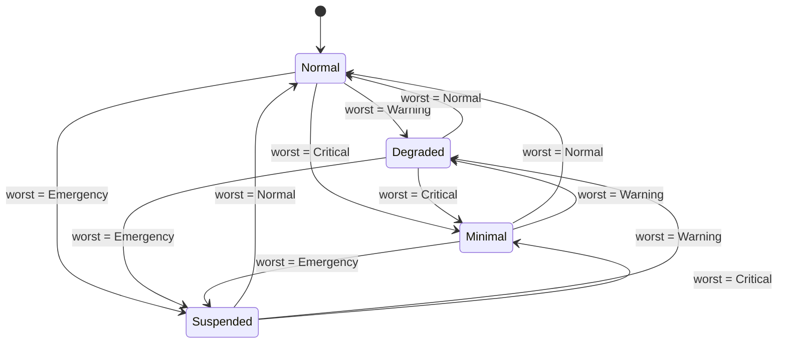
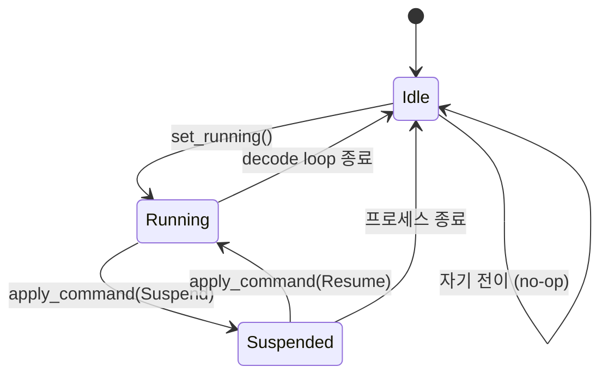
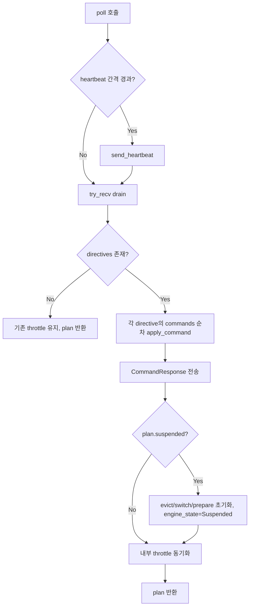
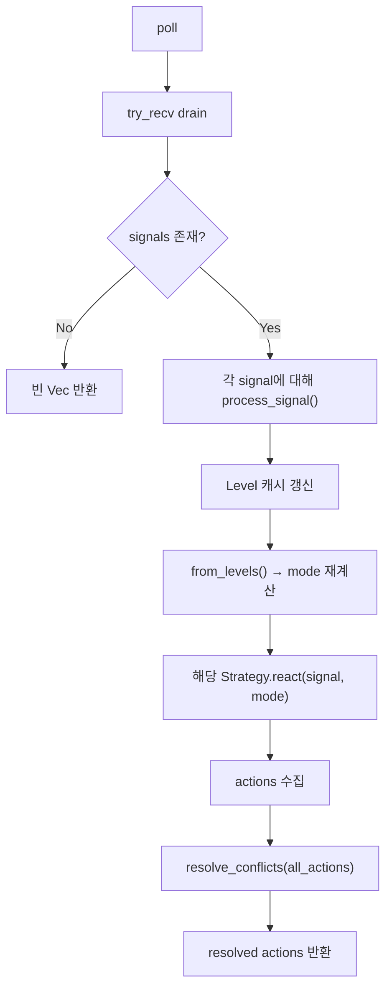

# Engine State Machines -- Architecture

> spec/31-engine-state.md의 구현 매핑. 컴포넌트 중심으로 설계 결정, 인터페이스, 처리 흐름, 예외를 기술한다.

---

## 1. OperatingMode FSM

**모듈**: `engine/src/resilience/state.rs`
**Spec**: ENG-ST-010 ~ ENG-ST-015

### 1.1 설계 결정

OperatingMode는 **순수 함수 기반 FSM**이다. 이전 상태를 참조하지 않고, 4종 Level 입력만으로 결정된다. Strategy 경로(D-Bus 레거시) 전용이며 CommandExecutor 경로에서는 사용하지 않는다.

### 1.2 인터페이스

```rust
pub enum OperatingMode { Normal, Degraded, Minimal, Suspended }

impl OperatingMode {
    /// 4종 Level 중 worst가 모드를 결정한다. 순수 함수, &self 없음.
    pub fn from_levels(memory: Level, compute: Level, thermal: Level, energy: Level) -> Self;
}
```

**Pre**: 각 Level은 `Normal | Warning | Critical | Emergency` 중 하나.
**Post**: `worst = max(memory, compute, thermal, energy)` → Normal→Normal, Warning→Degraded, Critical→Minimal, Emergency→Suspended.

### 1.3 전이 다이어그램



12 전이 모두 가능 (순수 함수이므로 이전 상태 무관).

### 1.4 호출 위치

- `ResilienceManager::process_signal()` (`engine/src/resilience/manager.rs`) -- signal 수신 후 mode 재계산
- `dbus_transport.rs`의 `signal_to_manager_message()` -- Emergency → `EngineCommand::Suspend` 변환 (SYS-055)

### 1.5 불변식

- **INV-070**: `from_levels()`는 순수 함수 -- 입력 4종 Level만 참조, 외부 상태 의존 없음.

---

## 2. EngineState FSM

**모듈**: `shared/src/lib.rs` (정의), `engine/src/resilience/executor.rs` (전이)
**Spec**: ENG-ST-020 ~ ENG-ST-025

### 2.1 설계 결정

EngineState는 Manager-Engine 프로토콜 공유를 위해 **shared 크레이트**에 정의된다. Directive 경로의 프로토콜 수준 상태이며, OperatingMode와 **독립 FSM**이다.

### 2.2 인터페이스

```rust
// shared/src/lib.rs
#[derive(Debug, Clone, Copy, PartialEq, Eq, Serialize, Deserialize)]
pub enum EngineState { Idle, Running, Suspended }
```

### 2.3 전이 다이어그램



- **Idle→Suspended**: 코드상 가능하나 의미 없는 전이 (SHOULD NOT).
- EngineState는 Heartbeat (`EngineStatus.state`) 필드로 Manager에 보고된다.

### 2.4 전이 코드

| 전이 | 트리거 | 함수 |
|------|--------|------|
| Idle→Running | `executor.set_running()` | `engine/src/resilience/executor.rs` |
| Running→Suspended | `apply_command(&EngineCommand::Suspend, ..)` | 동상 |
| Suspended→Running | `apply_command(&EngineCommand::Resume, ..)` | 동상 |
| Running→Idle | decode loop 자연 종료 | `engine/src/bin/generate.rs` |

### 2.5 불변식

- **INV-071**: EngineState 전이는 `apply_command(Suspend)`, `apply_command(Resume)`, `set_running()` 내부에서만 발생. `engine_state` 필드는 private이므로 외부 직접 변경 불가.

---

## 3. CommandExecutor

**모듈**: `engine/src/resilience/executor.rs`
**Spec**: ENG-ST-030 ~ ENG-ST-035

### 3.1 설계 결정

CommandExecutor는 **전략 로직 없이** Manager→Engine 명령을 ExecutionPlan으로 변환하는 translator이다. Strategy 패턴 대신 단순 command→plan 1:1 매핑을 사용한다. Heartbeat 전송, 처리량 EMA 추적, active/available actions 관리를 부대 책임으로 갖는다.

### 3.2 인터페이스

```rust
pub struct CommandExecutor { /* 11 private fields */ }

impl CommandExecutor {
    pub fn new(
        cmd_rx: mpsc::Receiver<ManagerMessage>,
        resp_tx: mpsc::Sender<EngineMessage>,
        active_device: String,
        heartbeat_interval: Duration,
    ) -> Self;

    pub fn send_capability(&self, cap: EngineCapability);
    pub fn set_running(&mut self);
    pub fn on_token_generated(&mut self);

    /// 토큰당 1회 호출. Heartbeat 전송 + 명령 drain + ExecutionPlan 생성.
    pub fn poll(&mut self, kv_snap: &KVSnapshot) -> ExecutionPlan;

    // Accessors
    pub fn state(&self) -> EngineState;
    pub fn compute_level(&self) -> ResourceLevel;
    pub fn memory_level(&self) -> ResourceLevel;
    pub fn throttle_delay_ms(&self) -> u64;
    pub fn active_actions(&self) -> &[String];
}
```

### 3.3 poll() 처리 흐름



### 3.4 EngineCommand → ExecutionPlan 매핑

11종 EngineCommand(shared 크레이트 정의)를 ExecutionPlan 필드에 매핑한다.

| EngineCommand | Plan 필드 | CommandResult | 부수 효과 |
|---------------|----------|---------------|----------|
| `Throttle { delay_ms }` | `throttle_delay_ms = delay_ms` | Ok | active_actions: delay>0이면 "throttle" 추가 |
| `LayerSkip { skip_ratio }` | `layer_skip = Some(ratio)` | Ok | active_actions: "layer_skip" 추가 |
| `KvEvictH2o { keep_ratio }` | `evict = Some(EvictPlan { H2o, ratio, Critical })` | Ok | active_actions: "kv_evict_h2o" 추가 |
| `KvEvictSliding { keep_ratio }` | `evict = Some(EvictPlan { Sliding, ratio, Critical })` | Ok | active_actions: "kv_evict_sliding" 추가 |
| `KvStreaming { .. }` | (변경 없음) | Rejected | 미구현 |
| `KvQuantDynamic { target_bits }` | `kv_quant_bits = Some(bits)` | Ok | active_actions: "kv_quant_dynamic" 추가 |
| `RestoreDefaults` | `restore_defaults = true, throttle_delay_ms = 0` | Ok | active_actions.clear(), levels→Normal |
| `SwitchHw { device }` | `switch_device = Some(device)` | Ok | -- |
| `PrepareComputeUnit { device }` | `prepare_device = Some(device)` | Ok | -- |
| `Suspend` | `suspended = true` | Ok | engine_state = Suspended |
| `Resume` | `resumed = true, throttle_delay_ms = 0` | Ok | engine_state = Running, levels→Normal |

**Superseding 규칙**: 동일 poll() 내 복수 Directive의 동일 필드 명령은 후행이 선행을 덮어쓴다.

### 3.5 compute_available_actions()

Heartbeat 전송 시 동적으로 계산된다.

```
기본 3종: ["throttle", "switch_hw", "layer_skip"]
+ eviction_policy != "none" → ["kv_evict_h2o", "kv_evict_sliding"]
+ kv_dtype.starts_with('q') → ["kv_quant_dynamic"]
```

### 3.6 처리량 EMA

```
alpha = 0.1
instant_tps = 1.0 / elapsed_since_last_token
ema = alpha * instant_tps + (1 - alpha) * ema
```

### 3.7 불변식

- **INV-074**: Suspend 시 `plan.evict = None, plan.switch_device = None, plan.prepare_device = None, plan.resumed = false`.
- **INV-075**: Resume 시 `compute_level = Normal, memory_level = Normal, throttle_delay_ms = 0`.
- **INV-076**: RestoreDefaults 시 `active_actions.clear(), throttle_delay_ms = 0, compute_level = Normal, memory_level = Normal`.

---

## 4. ExecutionPlan

**모듈**: `engine/src/resilience/executor.rs`
**Spec**: ENG-ST-040 ~ ENG-ST-043

### 4.1 설계 결정

ExecutionPlan은 **1회성 값 객체**이다. `poll()`이 생성하고, decode loop의 단일 iteration에서 즉시 소비된다. 다음 iteration의 `poll()`이 새로운 plan을 반환하므로 이전 plan은 자동 폐기된다.

### 4.2 구조

```rust
#[derive(Debug, Default)]
pub struct ExecutionPlan {
    pub evict: Option<EvictPlan>,
    pub switch_device: Option<String>,
    pub prepare_device: Option<String>,
    pub throttle_delay_ms: u64,        // 0 = no throttle
    pub suspended: bool,
    pub resumed: bool,
    pub layer_skip: Option<f32>,
    pub kv_quant_bits: Option<u8>,
    pub restore_defaults: bool,
}

pub struct EvictPlan {
    pub target_ratio: f32,             // 0.0~1.0
    pub level: ResourceLevel,          // 항상 Critical
    pub method: EvictMethod,
}

pub enum EvictMethod { H2o, Sliding, Streaming }
```

### 4.3 소비 순서 (generate.rs decode loop)

1. `evict` → CacheManager 실행
2. `switch_device` → Backend 전환
3. `prepare_device` → Backend pre-warm
4. `kv_quant_bits` → KIVI transition_bits()
5. `layer_skip` → SkipConfig 재계산
6. `restore_defaults` → 모든 동적 설정 초기화
7. `suspended` → 대기 루프 진입
8. `resumed` → 대기 루프 탈출
9. `throttle_delay_ms` → sleep 삽입

---

## 5. ResilienceManager (D-Bus 레거시 경로)

**모듈**: `engine/src/resilience/manager.rs`, `engine/src/resilience/strategy/`
**Spec**: ENG-ST-050 ~ ENG-ST-055

### 5.1 설계 결정

ResilienceManager는 **D-Bus 레거시 경로** 전용이다. CommandExecutor(Directive 경로)와 독립적으로 동작하며, DbusTransport가 두 경로를 브리징한다. 4종 Strategy 패턴으로 Signal→Action 변환 후 `resolve_conflicts()`로 충돌을 해결한다.

### 5.2 인터페이스

```rust
pub struct ResilienceManager { /* rx, mode, current_levels, strategies */ }

impl ResilienceManager {
    pub fn new(rx: mpsc::Receiver<SystemSignal>) -> Self;
    /// 토큰당 1회 호출. Signal drain → Strategy react → resolve_conflicts.
    pub fn poll(&mut self) -> Vec<ResilienceAction>;
    pub fn mode(&self) -> OperatingMode;
}
```

### 5.3 처리 흐름



### 5.4 ResilienceStrategy trait

```rust
pub trait ResilienceStrategy: Send + Sync {
    fn react(&mut self, signal: &SystemSignal, mode: OperatingMode) -> Vec<ResilienceAction>;
    fn name(&self) -> &str;
}
```

**4종 구현체**:

| Strategy | 모듈 | 도메인 |
|----------|------|--------|
| `MemoryStrategy` | `strategy/memory.rs` | MemoryPressure |
| `ComputeStrategy` | `strategy/compute.rs` | ComputeGuidance |
| `ThermalStrategy` | `strategy/thermal.rs` | ThermalAlert |
| `EnergyStrategy` | `strategy/energy.rs` | EnergyConstraint |

**MemoryStrategy 매핑** (대표):

| Level | Actions |
|-------|---------|
| Normal | `[RestoreDefaults]` |
| Warning | `[Evict { target_ratio: 0.85 }]` |
| Critical | `[Evict { target_ratio: 0.50 }]` |
| Emergency | `[Evict { target_ratio: 0.25 }, RejectNew]` |

### 5.5 InferenceContext (미사용)

```rust
pub struct InferenceContext<'a> {
    pub max_tokens: &'a mut usize,
    pub throttle_delay_ms: &'a mut u64,
    pub suspended: &'a mut bool,
    pub reject_new: &'a mut bool,
}
pub fn execute_action(action: &ResilienceAction, ctx: &mut InferenceContext);
```

현재 `generate.rs`에서 미사용. CommandExecutor 경로가 이를 대체한다.

---

## 6. resolve_conflicts()

**모듈**: `engine/src/resilience/strategy/mod.rs`
**Spec**: ENG-ST-060 ~ ENG-ST-063

### 6.1 인터페이스

```rust
pub fn resolve_conflicts(actions: Vec<ResilienceAction>) -> Vec<ResilienceAction>;
```

### 6.2 7규칙 (single-pass scan)

| 규칙 | 설명 | 결과 |
|------|------|------|
| R1 | Suspend 존재 | `[Suspend]` 즉시 반환, 다른 모든 액션 무시 |
| R2 | RestoreDefaults만 존재 (다른 제약 없음) | `[RestoreDefaults]` 반환 |
| R3 | 복수 Evict | min(target_ratio) 승리 (가장 공격적) |
| R4 | 복수 SwitchBackend | CPU 항상 승리 (안전 우선) |
| R5 | 복수 LimitTokens | min(max_tokens) 승리 |
| R6 | 복수 Throttle | max(delay_ms) 승리 |
| R7 | RejectNew | 하나라도 있으면 포함 |

### 6.3 불변식

- **INV-072**: Suspend가 존재하면 반드시 `[Suspend]`만 반환.
- **INV-073**: RestoreDefaults는 다른 제약이 없을 때만 통과.

### 6.4 ResilienceAction enum

```rust
pub enum ResilienceAction {
    Evict { target_ratio: f32 },
    SwitchBackend { to: RecommendedBackend },
    LimitTokens { max_tokens: usize },
    Throttle { delay_ms: u64 },
    Suspend,
    RejectNew,
    RestoreDefaults,
}
```

**모듈**: `engine/src/resilience/strategy/mod.rs` -- Strategy 경로 내부 타입.

---

## 7. KVSnapshot

**모듈**: `engine/src/resilience/executor.rs`
**Spec**: ENG-ST-070

### 7.1 설계 결정

KVSnapshot은 KV 캐시 상태의 **읽기 전용 스냅샷**이다. `generate.rs`에서 매 토큰 생성하여 `executor.poll()`에 전달하고, Heartbeat의 EngineStatus 필드를 채우는 데 사용된다.

### 7.2 구조

```rust
#[derive(Debug, Clone, Default)]
pub struct KVSnapshot {
    pub total_bytes: u64,           // 전 layer KV buffer 크기 합산
    pub total_tokens: usize,        // kv_caches[0].current_pos()
    pub capacity: usize,            // kv_caches[0].capacity()
    pub protected_prefix: usize,    // CLI --protected-prefix 또는 정책 기본값
    pub kv_dtype: String,           // "f16", "q4", "q2" 등
    pub eviction_policy: String,    // "none", "h2o", "sliding" 등
    pub skip_ratio: f32,            // 현재 layer skip 비율
}
```

---

## Config

Engine 상태 머신은 별도 config 파일을 사용하지 않는다. 하드코딩 상수:

| 항목 | 값 | 타입 | Spec 근거 |
|------|---|------|-----------|
| heartbeat_interval | 1000ms | `Duration` | ENG-ST-030 |
| throughput_ema alpha | 0.1 | `f32` | ENG-ST-030 |
| EvictPlan.level 기본값 | Critical | `ResourceLevel` | ENG-ST-041 |

## CLI

Engine 상태 머신 관련 CLI는 `arch/30-engine.md`에서 관리한다.
