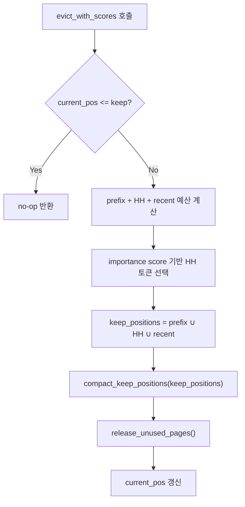
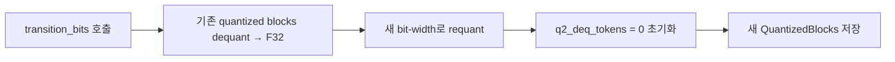
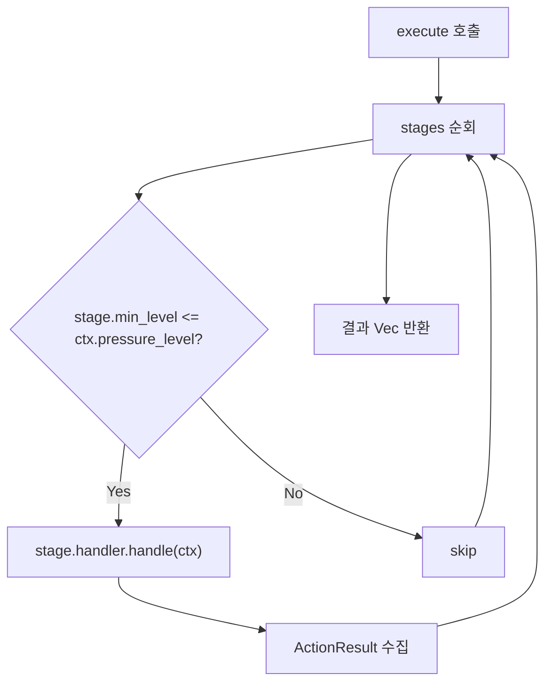

# Engine Algorithms -- Architecture

> spec/32-engine-algorithms.md의 구현 매핑. 컴포넌트 중심으로 알고리즘, 처리 흐름, 설계 결정을 기술한다.

---

## 1. KV Cache Eviction

### 1.1 H2O (Heavy-Hitter Oracle)

**모듈**: `engine/src/core/eviction/h2o.rs`
**Spec**: ENG-ALG-010

#### 설계 결정

H2O는 attention score 기반 3-partition 모델이다. **Signal-driven 전용**: `should_evict()`는 항상 `false`를 반환하고, 외부 resilience signal에 의해서만 eviction이 트리거된다. Score 누적은 매 토큰 수행되지만 eviction 결정은 외부에서 온다.

#### 인터페이스

```rust
pub struct H2OPolicy {
    keep_ratio: f32,          // HH budget 비율 (0.0~1.0, default 0.5)
    protected_prefix: usize,  // 최소 4 (attention sink)
}

impl H2OPolicy {
    pub fn new(recent_window: usize, keep_ratio: f32, protected_prefix: usize) -> Self;
}
```

#### 3-Partition 예산 할당

```
target_len = keep (external parameter)
available = keep - protected_prefix
hh_budget = available * keep_ratio
recent_budget = available - hh_budget
```

#### 처리 흐름 (evict_with_scores)



#### Fallback (score 미제공)

Score가 없으면 sliding window fallback: 전체 budget을 recent에 할당. `shift_positions()` 사용.

#### 코드-스펙 차이

- Spec에 정의된 `keep_ratio=0.5`가 default이나, 실험 결과(Round 14) Llama 3.2 1B에서 HH는 무가치 (kr=0.0 == Sliding). 이는 1B 모델의 score distribution 특성 때문.

---

### 1.2 Sliding Window

**모듈**: `engine/src/core/eviction/sliding_window.rs`
**Spec**: ENG-ALG-011

#### 설계 결정

Auto-eviction 지원: `should_evict()`가 `current_pos > window_size + protected_prefix`일 때 true 반환. Score 불필요. `protected_prefix` 최소값 4가 강제된다.

#### 인터페이스

```rust
pub struct SlidingWindowPolicy {
    window_size: usize,
    protected_prefix: usize,  // max(input, 4)
}

impl SlidingWindowPolicy {
    pub fn new(window_size: usize, protected_prefix: usize) -> Self;
}
```

#### 처리 흐름

```
max_keep = window_size + protected_prefix
min_keep = min(protected_prefix + 16, max_keep)
keep = clamp(target_len, min_keep, max_keep)
prune_count = current_pos - keep
```

- `protected_prefix == 0`: `cache.prune_prefix(prune_count)` 호출
- `protected_prefix > 0`: `cache.shift_positions(prefix + prune_count, prefix, remaining)` 후 current_pos 갱신

KVCache 연산: `prune_prefix()` → `shift_positions()` + `release_unused_pages()`.

---

### 1.3 D2O (Dynamic Discriminative Operations)

**모듈**: `engine/src/core/pressure/d2o_handler.rs`, `d2o_layer_alloc.rs`
**Spec**: ENG-ALG-012

#### 설계 결정

D2O는 **EvictionPolicy가 아닌 CachePressureHandler**로 구현된다. H2O 3-partition eviction에 cosine similarity merge compensation을 추가한다. 내부 상태(EMA threshold)가 필요하므로 `Mutex<D2OState>`로 interior mutability를 사용한다. F32/F16/Q4_0 KV cache 모두 지원.

#### 인터페이스

```rust
pub struct D2OConfig {
    pub keep_ratio: f32,              // HH 비율, default 0.75
    pub protected_prefix: usize,      // default 4
    pub target_ratio: f32,            // cache 보존 비율, default 0.5
    pub ema_alpha: f32,               // EMA old-threshold weight, default 0.5
    pub ema_beta: f32,                // EMA new-mean weight, default 0.5
    pub use_layer_allocation: bool,   // Phase B: per-layer allocation
    pub protected_layers: Vec<usize>,
}

pub struct D2OHandler {
    config: D2OConfig,
    state: Mutex<D2OState>,  // EMA threshold, merge/delete stats
}

impl CachePressureHandler for D2OHandler {
    fn handle(&self, ctx: &mut HandlerContext) -> Result<ActionResult>;
    fn name(&self) -> &str; // "d2o"
}
```

#### EMA Merge/Delete 결정

```
sim = cosine_similarity(evicted_token, nearest_retained_token)
mean_sim = average(all sims in this batch)

if !initialized:
    threshold = mean_sim
    initialized = true
else:
    threshold = alpha * threshold + beta * mean_sim

if sim >= threshold:
    merge (scatter-reduce) -- w = exp(sim) / (exp(sim) + e)
else:
    delete permanently
```

#### 지원 DType

- **F32**: 직접 cosine + merge
- **F16**: `f16::to_f32()` 변환 후 계산, 결과를 `f16::from_f32()` 저장
- **Q4_0**: `BlockQ4_0` → dequantize → merge → re-quantize per block

---

## 2. KIVI Quantization

**모듈**: `engine/src/core/kivi_cache.rs`
**Spec**: ENG-ALG-020 ~ ENG-ALG-023

### 2.1 설계 결정

KIVI는 비대칭 양자화: Key는 per-channel, Value는 per-token 양자화. 최근 R 토큰은 FP32 residual에 유지되고, residual이 가득 차면 batch 양자화하여 compressed storage로 flush한다. `KVCacheOps` trait을 구현하되 `kv_dtype()`은 항상 F32를 반환하여 호출자가 F32를 전달하도록 한다.

### 2.2 핵심 연산

| 연산 | 모듈 | 설명 |
|------|------|------|
| `flush_residual()` | `kivi_cache.rs` | CPU: residual → quantized storage |
| `flush_residual_gpu()` | `kivi_cache.rs` | GPU: CPU에서 양자화 후 GPU 저장소에 복사 |
| `transition_bits(new_bits)` | `kivi_cache.rs` | dequant → requant, Q2/Q4/Q8 전환 |
| `assemble_view()` | `kivi_cache.rs` | CPU: incremental dequant + residual copy → F32 view |
| `assemble_view_gpu()` | `kivi_cache.rs` | GPU path |

### 2.3 양자화 단위

- `QuantizedBlocks` enum: `Q2(Vec<BlockQ2_0>)`, `Q4(Vec<BlockKVQ4>)`, `Q8(Vec<BlockKVQ8>)`
- 그룹 크기: QKKV = 32 (compile-time constant)
- GPU 모드: 6종 persistent GPU 버퍼 (gpu_res_k/v, gpu_attn_k/v, gpu_q2k/v)

### 2.4 Bit Transition 흐름



---

## 3. Layer Skip (SWIFT)

**모듈**: `engine/src/core/skip_config.rs`
**Spec**: ENG-ALG-030

### 3.1 설계 결정

SWIFT 기반 self-speculative decoding. Attention과 MLP를 독립적으로 skip 가능. Layer 0과 L-1은 항상 실행 (SWIFT constraint).

### 3.2 인터페이스

```rust
pub struct SkipConfig {
    pub attn_skip: HashSet<usize>,  // attention skip 레이어
    pub mlp_skip: HashSet<usize>,   // MLP skip 레이어
}

impl SkipConfig {
    pub fn uniform_init(num_layers: usize, skip_ratio: f32) -> Self;
    pub fn validate(&self, num_layers: usize) -> bool;
    pub fn skip_attn(&self, layer_id: usize) -> bool;
    pub fn skip_mlp(&self, layer_id: usize) -> bool;
    pub fn total_skips(&self) -> usize;
    pub fn is_active(&self) -> bool;
}
```

### 3.3 uniform_init 알고리즘

```
candidates = (num_layers - 2) * 2     // layer 0, L-1 제외, attn+mlp 각각
num_skip = round(candidates * skip_ratio)
순서: 홀수 인덱스(1,3,5..) attn → mlp → 짝수 인덱스(2,4,6..) attn → mlp
```

### 3.4 Layer Importance (QCF 연동)

**모듈**: `engine/src/core/qcf/layer_importance.rs`

```rust
pub struct ImportanceCollector { /* per-layer before/after snapshots */ }
impl ImportanceCollector {
    pub fn snapshot_before(&mut self, layer_id: usize, hidden: &[f32]);
    pub fn record_after(&mut self, layer_id: usize, hidden: &[f32]);
    pub fn build(self) -> ImportanceTable;
}

pub struct ImportanceTable {
    entries: Vec<ImportanceEntry>,
    total_importance: f32,
}
```

`importance(layer) = 1 - cosine_similarity(input, output)` -- prefill 시 1회 계산, decode 전체에서 재사용.

---

## 4. QCF (Quality Cost Function)

**모듈**: `engine/src/core/qcf/`
**Spec**: ENG-ALG-041 ~ ENG-ALG-048

### 4.1 설계 결정

각 lossy action이 부작용으로 `QcfMetric`을 생산한다. 8종 QCF 변형이 존재하며, `DegradationEstimator`가 이를 PPL 증가량으로 변환한다.

### 4.2 Eviction QCF (4종)

**모듈**: `engine/src/core/qcf/eviction_qcf.rs`

| 함수 | 수식 | 특징 |
|------|------|------|
| `compute_eviction_qcf_attn()` | `sum_evicted(attn*V_norm) / sum_all(attn*V_norm)` | per-head → Mean/Defensive 집계 |
| `compute_sliding_qcf_attn()` | V-norm only | attention score 불필요 |
| `compute_eviction_qcf_caote()` | `amplification * weighted_residual / output_norm` | softmax redistribution |
| `compute_qcf_attn_v2()` | attention score only | V-norm 계산 생략, 경량 |

### 4.3 Quantization QCF (3종)

**모듈**: `engine/src/core/qcf/quant_qcf.rs`

| 함수 | 수식 | 특징 |
|------|------|------|
| `compute_flush_qcf()` | NMSE per-block, `0.6*K + 0.4*V` | 기본 양자화 품질 지표 |
| `compute_flush_opr()` | `V_delta_sum / V_orig_sum` | V cache 변형 비율 |
| `compute_flush_awqe()` | attention-weighted V 양자화 오차 | 기본 비활성 |

### 4.4 Layer Skip QCF

**모듈**: `engine/src/core/qcf/skip_qcf.rs`

```rust
pub struct SkipQcfTracker {
    window: VecDeque<f32>,     // rejection rates
    window_size: usize,        // default 50
}

impl SkipQcfTracker {
    pub fn record(&mut self, accepted: usize, drafted: usize);
    pub fn current_proxy(&self) -> QcfMetric;  // 1 - acceptance_rate (windowed avg)
}
```

### 4.5 Head Aggregation

```rust
pub fn aggregate_heads(per_head: &[f32], mode: &AggregationMode) -> f32;
```

- **Mean**: 산술 평균
- **Defensive**: softmax-weighted (low temperature → worst-case head 강조)

---

## 5. DegradationEstimator

**모듈**: `engine/src/core/qcf/estimator.rs`
**Spec**: ENG-ALG-060

### 5.1 설계 결정

QCF raw value → PPL 증가량 변환. Offline calibrated piecewise-linear curve + runtime EMA correction.

### 5.2 인터페이스

```rust
pub struct PiecewiseLinear {
    pub breakpoint: f32,
    pub slope_low: f32,
    pub slope_high: f32,
}

pub struct DegradationEstimator {
    curves: HashMap<String, PiecewiseLinear>,  // per-action
    d_max: f32,                                 // clamp ceiling
    ema_alpha: f32,                             // 0 = no correction
    ema_corrections: HashMap<String, f32>,
}

impl DegradationEstimator {
    pub fn with_defaults(d_max: f32) -> Self;
    pub fn new(curves: HashMap<String, PiecewiseLinear>, d_max: f32, ema_alpha: f32) -> Self;
    pub fn load(path: &str) -> Result<Self>;  // JSON calibration file

    /// estimate = clamp(curve(raw_value) * ema_correction, 0, d_max)
    pub fn estimate(&self, metric: &QcfMetric) -> f32;
    pub fn update_ema(&mut self, action: &str, proxy_value: f32, actual_d: f32);
}
```

### 5.3 Piecewise-Linear 수식

```
f(x) = slope_low * x                                      if x < breakpoint
     = slope_low * breakpoint + slope_high * (x - breakpoint)  if x >= breakpoint
```

Default curves: 모든 action에 `slope=1.0` (미보정 상태).

---

## 6. CachePressurePipeline

**모듈**: `engine/src/core/pressure/mod.rs`
**Spec**: ENG-ALG-091 ~ ENG-ALG-093

### 6.1 설계 결정

Eviction 이상의 캐시 관리 기법(swap, quantize, merge, compress, sparse)을 일반화하는 파이프라인. `CachePressureHandler` trait으로 각 기법을 추상화하고, `PressureStageConfig`로 pressure level별 활성화를 제어한다.

### 6.2 인터페이스

```rust
pub trait CachePressureHandler: Send + Sync {
    fn handle(&self, ctx: &mut HandlerContext) -> Result<ActionResult>;
    fn name(&self) -> &str;
}

pub struct PressureStageConfig {
    pub min_level: PressureLevel,                    // 활성화 최소 레벨
    pub handler: Box<dyn CachePressureHandler>,
}

pub struct CachePressurePipeline {
    stages: Vec<PressureStageConfig>,  // min_level 오름차순 정렬
}

impl CachePressurePipeline {
    pub fn new(stages: Vec<PressureStageConfig>) -> Self;  // 내부 정렬
    pub fn execute(&self, ctx: &mut HandlerContext) -> Result<Vec<ActionResult>>;
    pub fn name(&self) -> String;
}
```

### 6.3 실행 흐름



**핵심 특성**: 각 handler는 이전 handler가 변경한 cache 상태를 본다 (순차 실행, 누적 효과).

### 6.4 Handler 6종

| Handler | 모듈 | 상태 | 설명 |
|---------|------|------|------|
| `EvictionHandler` | `eviction_handler.rs` | 완료 | `EvictionPolicy`를 래핑, QCF 계산 연동 |
| `D2OHandler` | `d2o_handler.rs` | 완료 | H2O eviction + cosine merge + EMA |
| `SwapHandler` | `swap_handler.rs` | 완료 | LRU 기반 oldest token offload (prune_prefix) |
| `QuantizeHandler` | `quantize_handler.rs` | 완료 | Pressure→bits 매핑 (KIVI 외부 처리) |
| `MergeHandler` | `merge_handler.rs` | stub | Adjacent token merge (미구현, NoOp 반환) |
| `SparseHandler` | `sparse_handler.rs` | stub | Sparse attention mask (미구현, NoOp 반환) |

### 6.5 EvictionHandler QCF 연동

`EvictionHandler`는 eviction 실행 전에 `compute_and_push_proxy()`를 호출하여 QcfMetric을 ctx.qcf_sink에 push한다. GPU 백엔드에서 V buffer 포인터가 null이면 skip.

---

## 7. Chunked Prefill

**모듈**: `engine/src/bin/generate.rs`
**Spec**: ENG-ALG-080

### 7.1 설계 결정

긴 프롬프트를 고정 크기 청크로 나누어 순차적으로 `model.forward()`를 호출한다. 메모리 피크를 줄이고 KV cache grow를 점진적으로 수행한다.

### 7.2 동작

```
chunk_size = CLI --prefill-chunk-size (0 = 비활성, 전체 prefill)
for each chunk of input_ids:
    model.forward(chunk, logits_last_only=true)
```

마지막 chunk의 logits만 사용된다. 중간 chunk의 logits는 버려진다.

---

## 8. Memory Release

**모듈**: `engine/src/core/kv_cache.rs`, `engine/src/buffer/madviseable_gpu_buffer.rs`
**Spec**: ENG-ALG-071 ~ ENG-ALG-073

### 8.1 release_unused_pages()

Eviction 후 물리 메모리를 해제한다. 두 가지 경로:

1. **shrink_to_fit()** (dynamic cache 전용): `next_power_of_2(current_pos)` 크기로 재할당. `memory.is_some()` 조건.
2. **madvise_dontneed()** (fallback): page-aligned `MADV_DONTNEED`. `high_water_pos` 기반 범위 제한으로 미사용 영역에 대한 spurious page fault 방지.

### 8.2 MadviseableGPUBuffer

`CL_MEM_USE_HOST_PTR` + `is_host_managed()=true`. Adreno pin 문제 시 shrink_to_fit 대안.

---

## Config

| 키 | 타입 | 기본값 | Spec |
|----|------|--------|------|
| `d2o.keep_ratio` | f32 | 0.75 | ENG-ALG-012 |
| `d2o.ema_alpha` | f32 | 0.5 | ENG-ALG-012 |
| `d2o.ema_beta` | f32 | 0.5 | ENG-ALG-012 |
| `d2o.protected_prefix` | usize | 4 | ENG-ALG-012 |
| `d2o.target_ratio` | f32 | 0.5 | ENG-ALG-012 |
| `degradation_estimator.d_max` | f32 | 5.0 | ENG-ALG-060 |
| `degradation_estimator.ema_alpha` | f32 | 0.1 | ENG-ALG-060 |
| `degradation_estimator.curves` | JSON | action별 piecewise-linear | ENG-ALG-060 |

## CLI

| 플래그 | 설명 | Spec |
|--------|------|------|
| `--eviction-policy` | eviction 정책 (none/sliding/streaming/h2o/h2o_plus/d2o) | ENG-ALG-010~012 |
| `--h2o-keep-ratio` | H2O HH 보존 비율 | ENG-ALG-010 |
| `--h2o-decay` | H2O score 지수 감쇠 | ENG-ALG-010 |
| `--d2o-keep-ratio` | D2O HH 비율 | ENG-ALG-012 |
| `--d2o-ema-alpha` / `--d2o-ema-beta` | D2O EMA 가중치 | ENG-ALG-012 |
| `--d2o-layer-alloc` | D2O per-layer 동적 할당 | ENG-ALG-012 |
| `--kivi` | KIVI 양자화 활성 | ENG-ALG-020 |
| `--kivi-residual-size` | KIVI residual 버퍼 크기 | ENG-ALG-020 |
| `--skip-ratio` | layer skip 비율 | ENG-ALG-030 |
| `--skip-layers` | 명시적 skip 레이어 | ENG-ALG-030 |
| `--dump-importance` | importance table 출력 후 종료 | ENG-ALG-032 |
| `--qcf-mode` | QCF proxy 모드 (attn/caote/both) | ENG-ALG-041~043 |
| `--prefill-chunk-size` | chunked prefill 크기 (0=비활성) | ENG-ALG-080 |
| `--eviction-target-ratio` | eviction 보존 비율 | ENG-ALG-095 |