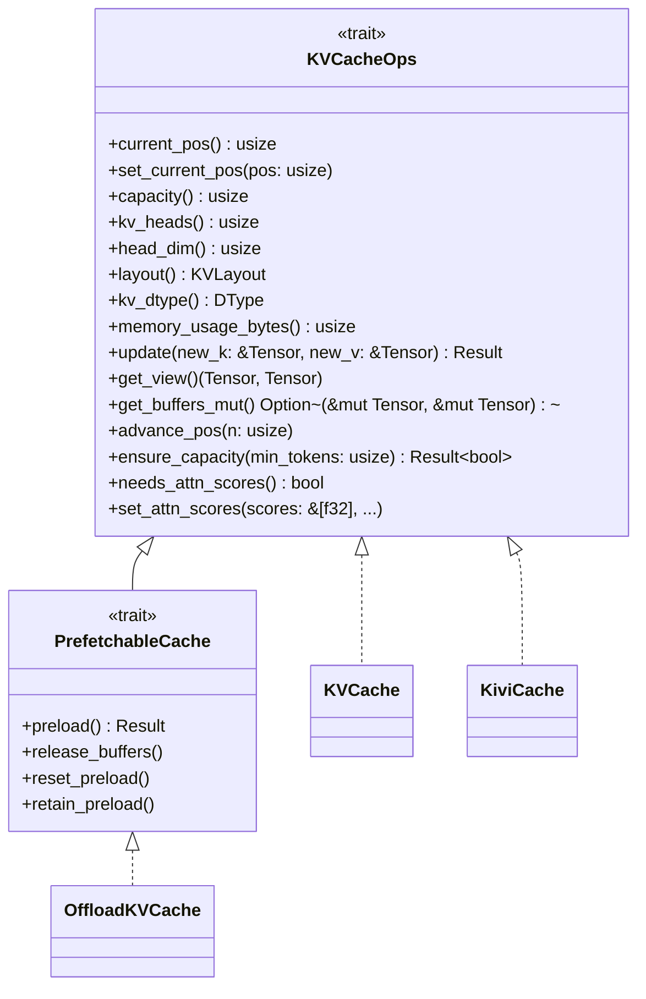
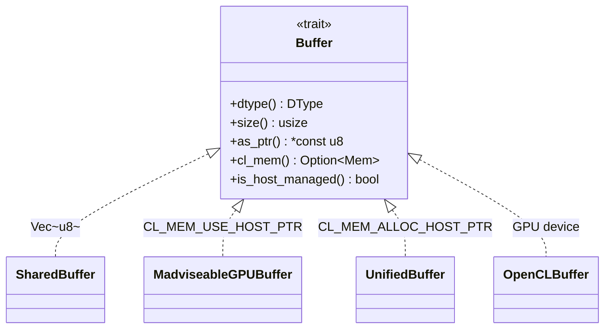
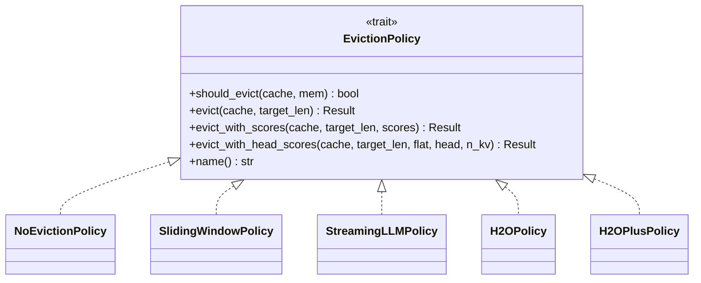
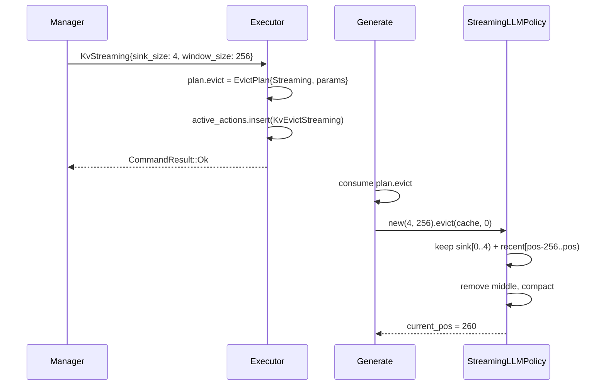

# Engine Data Types -- Architecture

> spec/33-engine-data.md의 구현 매핑. 컴포넌트 중심으로 타입 계층, 인터페이스, 설계 결정을 기술한다.

---

## 1. KVCacheOps Trait 계층

**모듈**: `engine/src/core/kv_cache.rs`
**Spec**: ENG-DAT-010 ~ ENG-DAT-013

### 1.1 설계 결정

KVCacheOps는 **generic monomorphization** (`<C: KVCacheOps>`)으로 사용되며, `dyn Trait`이 아니다. 이는 contiguous slice access (`&mut [C]`)와 zero runtime overhead를 보장한다. 3종 구현체가 동일 인터페이스를 제공하면서 내부 저장 방식이 다르다.

### 1.2 트레이트 계층 다이어그램



### 1.3 KVCache

**모듈**: `engine/src/core/kv_cache.rs`

표준 F32/F16/Q4_0 KV 캐시. Dynamic grow/shrink, HeadMajor/SeqMajor 레이아웃 지원.

```rust
pub struct KVCache {
    pub k_buffer: Tensor,
    pub v_buffer: Tensor,
    pub current_pos: usize,
    pub high_water_pos: usize,       // madvise 범위 제한용
    pub max_seq_len: usize,
    capacity: usize,                  // 물리 버퍼 토큰 수
    kv_heads: usize,
    head_dim: usize,
    pub(crate) layout: KVLayout,
    memory: Option<Arc<dyn Memory>>,  // Some = dynamic grow 가능
}
```

**핵심 연산**:

| 연산 | 설명 |
|------|------|
| `new(k, v, max_seq_len)` | 전체 pre-allocation, SeqMajor default |
| `new_dynamic(k, v, init_cap, max_seq, kv_heads, head_dim, memory)` | grow-on-demand |
| `with_layout(layout)` | Builder 패턴으로 레이아웃 설정 |
| `grow()` | 용량 2배 확장 (capacity = min(cap*2, max_seq_len)) |
| `shrink_to_fit()` | next_power_of_2(current_pos) 크기로 축소 |
| `prune_prefix(count)` | 앞쪽 count 토큰 제거 + shift + release_unused_pages |
| `shift_positions(src, dst, count)` | layout-agnostic memmove |
| `compact_keep_positions(positions)` | 선택 토큰만 유지하는 batch compaction |
| `compact_keep_positions_for_head(h, positions)` | per-head 변형 (HeadMajor 전용) |
| `release_unused_pages()` | shrink_to_fit 우선, madvise fallback |

**KVLayout**:

```rust
pub enum KVLayout {
    SeqMajor,   // [batch, seq_pos, kv_heads, head_dim]
    HeadMajor,  // [batch, kv_heads, seq_pos, head_dim]
}
```

### 1.4 KiviCache

**모듈**: `engine/src/core/kivi_cache.rs`

KIVI Q2/Q4/Q8 + FP32 residual. `kv_dtype()`은 항상 F32 (호출자가 F32 전달, 내부 양자화). `get_buffers_mut()`은 항상 None (직접 scatter write 불가).

```rust
pub struct KiviCache {
    // residual: FP32 [kv_heads, residual_size, head_dim]
    // quantized: QuantizedBlocks (Q2/Q4/Q8)
    // GPU mode: 6종 persistent buffer
}

enum QuantizedBlocks {
    Unquantized,             // bits=16: residual-only
    Q2(Vec<BlockQ2_0>),
    Q4(Vec<BlockKVQ4>),
    Q8(Vec<BlockKVQ8>),
}
```

### 1.5 OffloadKVCache

**모듈**: `engine/src/core/offload/mod.rs`

Layer-wise KV offload. `PrefetchableCache` 구현. SeqMajor only. 동시 2 layer만 attn buffer 보유 (75% 메모리 절약). `OffloadStore` trait으로 backing storage 추상화.

```rust
pub struct OffloadKVCache {
    store: Box<dyn OffloadStore>,
    attn_k_buf: Option<Vec<u8>>,   // lazy-allocated
    attn_v_buf: Option<Vec<u8>>,   // lazy-allocated
    preloaded: bool,
    // ...
}
```

---

## 2. Buffer Trait 계층

**모듈**: `engine/src/core/buffer.rs`
**Spec**: ENG-DAT-020

### 2.1 설계 결정

Buffer는 물리 메모리 추상화이다. CPU heap, zero-copy GPU mapped, GPU-only를 통합 인터페이스로 제공한다. `is_host_managed()` 플래그로 madvise/shrink_to_fit 가능 여부를 구분한다.

### 2.2 인터페이스

```rust
pub trait Buffer: Send + Sync {
    fn as_any(&self) -> &dyn Any;
    fn dtype(&self) -> DType;
    fn size(&self) -> usize;
    fn as_ptr(&self) -> *const u8;
    fn as_mut_ptr(&self) -> *mut u8;
    fn cl_mem(&self) -> Option<&Mem>;       // #[cfg(feature = "opencl")]
    fn sync_device(&self) -> Result<()>;

    // Zero-copy support
    fn map_for_cpu(&self) -> Result<()>;    // default: no-op
    fn unmap_for_gpu(&self) -> Result<()>;  // default: no-op
    fn is_mapped(&self) -> bool;            // default: true
    fn is_host_managed(&self) -> bool;      // default: true
}
```

### 2.3 구현체 비교

| 구현체 | 모듈 | Backing | host_managed | cl_mem | 용도 |
|--------|------|---------|-------------|--------|------|
| `SharedBuffer` | `buffer/shared_buffer.rs` | `Vec<u8>` | true | None | CPU-only, 기본 |
| `MadviseableGPUBuffer` | `buffer/madviseable_gpu_buffer.rs` | `CL_MEM_USE_HOST_PTR` | true | Some | GPU + madvise 가능 |
| `UnifiedBuffer` | `buffer/unified_buffer.rs` | `CL_MEM_ALLOC_HOST_PTR` | false | Some | ARM SoC zero-copy |
| `OpenCLBuffer` | `backend/opencl/buffer.rs` | GPU device memory | false | Some | GPU-only compute |



---

## 3. Backend Trait

**모듈**: `engine/src/core/backend.rs`
**Spec**: ENG-DAT-030

### 3.1 설계 결정

Backend는 ~20종 연산의 추상화이다. Default implementation이 제공되어 새 구현체는 핵심 연산만 override하면 된다. `Send + Sync` 바운드로 multi-thread 안전. `Arc<dyn Backend>`로 공유.

### 3.2 인터페이스 (핵심 메서드)

```rust
pub trait Backend: Send + Sync {
    fn as_any(&self) -> &dyn std::any::Any;
    fn name(&self) -> &str;
    fn device(&self) -> &str;

    // Math
    fn matmul(&self, a: &Tensor, b: &Tensor, out: &mut Tensor) -> Result<()>;
    fn matmul_transposed(&self, a: &Tensor, b: &Tensor, out: &mut Tensor) -> Result<()>;
    fn matmul_slice(&self, a: &Tensor, b: &Tensor, rows: usize, cols: usize, out: &mut Tensor) -> Result<()>;

    // In-place
    fn add_assign(&self, a: &mut Tensor, b: &Tensor) -> Result<()>;
    fn scale(&self, x: &mut Tensor, v: f32) -> Result<()>;
    fn add_row_bias(&self, x: &mut Tensor, bias: &Tensor) -> Result<()>;  // default impl

    // Activation & Norm
    fn silu_mul(&self, a: &mut Tensor, b: &Tensor) -> Result<()>;
    fn gelu_tanh_mul(&self, gate: &mut Tensor, up: &Tensor) -> Result<()>;  // default: scalar
    fn rms_norm(&self, x: &mut Tensor, w: &Tensor, eps: f32, add_unit: bool) -> Result<()>;
    fn rms_norm_oop(&self, x: &Tensor, out: &mut Tensor, w: &Tensor, eps: f32, add_unit: bool) -> Result<()>;  // default: copy+norm
    fn add_rms_norm_oop(&self, x: &mut Tensor, residual: &Tensor, out: &mut Tensor, w: &Tensor, eps: f32, add_unit: bool) -> Result<()>;  // default: add+norm
    fn softmax(&self, x: &mut Tensor) -> Result<()>;

    // Positional
    fn rope_inplace(&self, x: &mut Tensor, start_pos: usize, theta: f32) -> Result<()>;

    // Attention (GQA-aware single-query generation)
    fn attention_gen(&self, q: &Tensor, k_cache: &Tensor, v_cache: &Tensor, out: &mut Tensor,
                     num_heads_q: usize, num_heads_kv: usize, head_dim: usize,
                     cache_seq_len: usize, scores_out: Option<&mut [f32]>) -> Result<()>;  // default: scalar CPU

    // Memory
    fn copy_from(&self, t: &Tensor) -> Result<Tensor>;
    fn copy_into(&self, src: &Tensor, dst: &mut Tensor) -> Result<()>;  // default: memcpy
    fn read_buffer(&self, t: &Tensor, dst: &mut [u8]) -> Result<()>;
    fn write_buffer(&self, t: &mut Tensor, src: &[u8]) -> Result<()>;
    fn buffer_shift(&self, tensor: &mut Tensor, src_off: usize, dst_off: usize, count: usize) -> Result<()>;  // default: memmove
    fn copy_slice(&self, src: &Tensor, dst: &mut Tensor, src_off: usize, dst_off: usize, count: usize) -> Result<()>;  // default: memcpy

    // Casting & KV
    fn cast(&self, src: &Tensor, dst: &mut Tensor) -> Result<()>;
    fn kv_scatter_f32_to_f16(&self, k_src: &Tensor, v_src: &Tensor, k_dst: &mut Tensor, v_dst: &mut Tensor,
                              head_dim: usize, capacity: usize, write_pos: usize) -> Result<()>;  // default: bail

    // Embedding
    fn gather(&self, src: &Tensor, indices: &Tensor, dst: &mut Tensor) -> Result<()>;  // default: F32/F16 CPU

    // Sync
    fn synchronize(&self) -> Result<()>;  // default: no-op
    fn flush(&self) -> Result<()>;        // default: no-op
}
```

### 3.3 구현체

| 구현체 | 모듈 | 조건 | 특화 |
|--------|------|------|------|
| `CpuBackendNeon` | `backend/cpu/neon.rs` | `#[cfg(target_arch = "aarch64")]` | NEON intrinsics + dotprod |
| `CpuBackendAVX2` | `backend/cpu/x86.rs` | `#[cfg(target_arch = "x86_64")]` | AVX2 + FMA |
| `CpuBackendCommon` | `backend/cpu/common.rs` | fallback | scalar Rust |
| `OpenCLBackend` | `backend/opencl/mod.rs` | `#[cfg(feature = "opencl")]` | ~80 OpenCL kernels |

---

## 4. Tensor

**모듈**: `engine/src/core/tensor.rs`, `engine/src/core/shape.rs`
**Spec**: ENG-DAT-031

### 4.1 설계 결정

Tensor = Shape + `Arc<dyn Buffer>` + `Arc<dyn Backend>`. `Clone`은 shallow copy (Arc 공유). Backend 참조를 들고 있어 self-contained 연산이 가능하다.

### 4.2 구조

```rust
#[derive(Clone)]
pub struct Tensor {
    shape: Shape,
    buffer: Arc<dyn Buffer>,
    backend: Arc<dyn Backend>,
}

impl Tensor {
    pub fn new(shape: Shape, buffer: Arc<dyn Buffer>, backend: Arc<dyn Backend>) -> Self;
    pub fn shape(&self) -> &Shape;
    pub fn buffer(&self) -> &Arc<dyn Buffer>;
    pub fn backend(&self) -> &Arc<dyn Backend>;
    pub fn dtype(&self) -> DType;
    pub fn size(&self) -> usize;      // bytes
    pub fn numel(&self) -> usize;     // elements
    pub fn as_ptr(&self) -> *const u8;
    pub fn as_mut_ptr(&self) -> *mut u8;
    pub fn as_slice<T>(&self) -> &[T];
    pub fn as_mut_slice<T>(&self) -> &mut [T];
}
```

---

## 5. DType

**모듈**: `engine/src/core/buffer.rs`
**Spec**: ENG-DAT-021

```rust
#[derive(Debug, Clone, Copy, PartialEq, Eq)]
pub enum DType { Q4_0, Q4_1, F16, BF16, F32, U8 }

impl DType {
    pub fn size(&self) -> usize;  // Q4_0/Q4_1/U8→1, F16/BF16→2, F32→4
}
```

**주의**: Q4_0의 `size()`는 1을 반환하지만, 실제 블록 크기는 `std::mem::size_of::<BlockQ4_0>()` = 18 bytes (32 elements). Block 단위 연산 시 type_size 계산에 주의.

---

## 6. EvictionPolicy Trait + 구현체

**모듈**: `engine/src/core/eviction/`
**Spec**: ENG-DAT-050

### 6.1 설계 결정

Strategy 패턴. SOLID 준수: SRP(각 정책 하나의 전략), OCP(새 정책 추가 시 기존 코드 불변), LSP(모든 정책 교환 가능), DIP(소비자는 trait에만 의존).

### 6.2 인터페이스

```rust
pub trait EvictionPolicy: Send + Sync {
    fn should_evict(&self, cache: &KVCache, mem_available: usize) -> bool;
    fn evict(&self, cache: &mut KVCache, target_len: usize) -> Result<()>;
    fn name(&self) -> &str;

    // Score-aware (default: delegate to evict)
    fn evict_with_scores(&self, cache: &mut KVCache, target_len: usize, importance: &[f32]) -> Result<()>;
    // GQA-aware (default: delegate to evict_with_scores)
    fn evict_with_head_scores(&self, cache: &mut KVCache, target_len: usize,
                               flat_importance: &[f32], head_importance: &[f32],
                               n_kv_heads: usize) -> Result<()>;
}
```

### 6.3 구현체 비교

| 구현체 | 모듈 | name() | should_evict | Score 사용 | 특징 |
|--------|------|--------|-------------|-----------|------|
| `NoEvictionPolicy` | `no_eviction.rs` | "none" | 항상 false | X | evict()도 no-op |
| `SlidingWindowPolicy` | `sliding_window.rs` | "sliding_window" | pos > window+prefix | X | auto-eviction, FIFO |
| `StreamingLLMPolicy` | `streaming_llm.rs` | "streaming_llm" | pos > sink+window | X | 항상 S+W로 compact, target_len 무시 |
| `H2OPolicy` | `h2o.rs` | "h2o" | 항상 false | O | signal-driven, 3-partition |
| `H2OPlusPolicy` | `h2o_plus.rs` | "h2o_plus" | 항상 false | O (per-head) | GQA-aware, HeadMajor 전용 |



### 6.4 StreamingLLMPolicy 프로토콜 경로

StreamingLLMPolicy는 두 가지 경로로 호출된다:

1. **CLI 경로** (`--eviction-policy streaming`): CacheManager에 등록되어 auto-eviction (`should_evict()` → `evict()`) 수행. `--sink-size`, `--streaming-window` CLI 플래그로 파라미터 지정.

2. **프로토콜 경로** (Manager Directive `KvStreaming { sink_size, window_size }`):
   - executor.rs에서 `EvictPlan { method: Streaming, target_ratio: 0.0, pressure_level: Critical, streaming_params: Some(StreamingParams { sink_size, window_size }) }` 생성
   - `active_actions.insert(ActionId::KvEvictStreaming)` — C4/C5/C7과 eviction 배타 그룹
   - generate.rs에서 `StreamingLLMPolicy::new(sink_size, window_size).evict(cache, 0)` 즉석 호출 (target_len 무시됨)
   - CacheManager에 등록된 정책과 무관하게, Directive 파라미터로 즉석 생성한 인스턴스로 실행



---

## 7. QcfMetric / QcfConfig

**모듈**: `engine/src/core/qcf/mod.rs`
**Spec**: ENG-DAT-060, ENG-DAT-061

### 7.1 QcfMetric

```rust
pub struct QcfMetric {
    pub action: String,              // "h2o", "sliding", "kivi", "swift"
    pub raw_value: f32,              // [0, 1] (higher = more degradation)
    pub normalized_value: f32,       // unbounded above 1 (cross-policy 비교용)
    pub per_head: Option<Vec<f32>>,  // [n_kv_heads] (optional)
    pub tokens_affected: usize,
}
```

### 7.2 QcfConfig

```rust
pub struct QcfConfig {
    pub enabled: bool,                    // default: true
    pub mode: QcfMode,                    // default: Attn
    pub aggregation: AggregationMode,     // default: Mean
    pub d_max: f32,                       // default: 5.0
    pub epsilon: f32,                     // default: 1e-8
}

pub enum QcfMode { Attn, Caote, Both }

pub enum AggregationMode {
    Mean,
    Defensive { temperature: f32 },  // softmax-weighted, worst-case 강조
}
```

---

## 8. ImportanceTable

**모듈**: `engine/src/core/qcf/layer_importance.rs`
**Spec**: ENG-DAT-063

```rust
pub struct ImportanceEntry {
    pub layer_id: usize,
    pub sublayer: SubLayer,       // Full | Attention | Mlp
    pub importance: f32,          // 1 - cosine_similarity(in, out)
    pub opr: f32,                 // ||output - input|| / ||input||
}

pub struct ImportanceTable {
    entries: Vec<ImportanceEntry>,
    total_importance: f32,
}

impl ImportanceTable {
    pub fn from_entries(entries: Vec<ImportanceEntry>) -> Self;
    pub fn compute_opr_skip(&self, skip_set: &[(usize, SubLayer)]) -> f32;
}
```

---

## 9. Pressure Pipeline 데이터 타입

**모듈**: `engine/src/core/pressure/mod.rs`
**Spec**: ENG-DAT-080

### 9.1 PressureLevel

```rust
pub type PressureLevel = llm_shared::Level;  // Normal < Warning < Critical < Emergency (Ord)
```

### 9.2 ActionResult

```rust
pub enum ActionResult {
    NoOp,
    Evicted { tokens_removed: usize, new_pos: usize },
    Quantized,
    Merged,
    Swapped { tokens_swapped: usize },
    Sparsified,
}

impl ActionResult {
    pub fn is_action(&self) -> bool;  // !NoOp
}
```

### 9.3 HandlerContext

```rust
pub struct HandlerContext<'a> {
    pub caches: &'a mut [KVCache],
    pub importance: Option<&'a [f32]>,          // per-token scores
    pub head_importance: Option<&'a [f32]>,     // [n_kv_heads * max_seq_len]
    pub n_kv_heads: usize,
    pub pressure_level: PressureLevel,
    pub mem_available: usize,
    pub target_ratio: Option<f32>,              // external override
    pub qcf_sink: Option<&'a mut Vec<QcfMetric>>,
    pub layer_ratios: Option<&'a [(f32, f32)]>, // D2O per-layer (hh_ratio, recent_ratio)
}
```

---

## Config

| 키 | 타입 | 기본값 | Spec |
|----|------|--------|------|
| `kivi.bits` | u8 | 4 | ENG-DAT-013 |
| `kivi.residual_size` | usize | 32 | ENG-DAT-013 |
| `kivi.group_size` | usize | 32 (QKKV) | ENG-DAT-013 |
| `kivi.awqe_enabled` | bool | false | ENG-DAT-013 |
| `qcf.enabled` | bool | true | ENG-DAT-061 |
| `qcf.mode` | QcfMode | Attn | ENG-DAT-061 |
| `qcf.aggregation` | AggregationMode | Mean | ENG-DAT-061 |
| `qcf.d_max` | f32 | 5.0 | ENG-DAT-061 |
| `qcf.epsilon` | f32 | 1e-8 | ENG-DAT-061 |

## CLI

| 플래그 | 설명 | Spec |
|--------|------|------|
| `--model-path` | 모델 경로 | ENG-DAT-070 |
| `--prompt` / `--prompt-file` | 입력 프롬프트 | ENG-DAT-070 |
| `--num-tokens` | 생성 토큰 수 | ENG-DAT-070 |
| `--backend` | cpu / opencl / hybrid | ENG-DAT-070 |
| `--max-seq-len` | 최대 시퀀스 길이 | ENG-DAT-070 |
| `--threads` | 스레드 수 (0=auto) | ENG-DAT-070 |
| `--use-rayon` | Rayon vs SpinPool | ENG-DAT-070 |
| `--temperature` | 샘플링 온도 | ENG-DAT-070 |
| `--top-p` / `--top-k` | 샘플링 파라미터 | ENG-DAT-070 |
| `--greedy` | 그리디 샘플링 | ENG-DAT-070 |
| `--weight-dtype` | 모델 가중치 타입 (f16/q4) | ENG-DAT-070 |
| `--kv-type` | KV 캐시 타입 (f32/f16/q4) | ENG-DAT-070 |
| `--kv-layout` | KV 레이아웃 (head/seq) | ENG-DAT-070 |
| `--initial-kv-capacity` | 초기 KV 용량 | ENG-DAT-070 |
| `--kv-budget` / `--kv-budget-ratio` | KV 예산 | ENG-DAT-070 |
| `--kivi` / `--kivi-residual-size` | KIVI 양자화 | ENG-DAT-070 |
| `--eviction-policy` | eviction 정책 | ENG-DAT-070 |
| `--eviction-window` | sliding/streaming 윈도우 | ENG-DAT-070 |
| `--sink-size` | StreamingLLM sink 토큰 수 | ENG-DAT-070 |
| `--protected-prefix` | eviction 보호 prefix | ENG-DAT-070 |
| `--memory-threshold-mb` | eviction 트리거 메모리 | ENG-DAT-070 |
| `--eviction-target-ratio` | eviction 보존 비율 | ENG-DAT-070 |
| `--h2o-keep-ratio` / `--h2o-decay` / `--h2o-tracked-layers` | H2O 파라미터 | ENG-DAT-070 |
| `--d2o-keep-ratio` / `--d2o-ema-alpha` / `--d2o-ema-beta` / `--d2o-layer-alloc` | D2O 파라미터 | ENG-DAT-070 |
| `--skip-layers` / `--skip-ratio` | layer skip | ENG-DAT-070 |
| `--qcf-mode` | QCF proxy 모드 | ENG-DAT-070 |
| `--enable-resilience` / `--resilience-transport` | Resilience | ENG-DAT-070 |
| `--kv-offload` | KV offload 모드 | ENG-DAT-070 |
| `--gpu-attn` | GPU attention 커널 | ENG-DAT-070 |
| `--prefill-chunk-size` | chunked prefill | ENG-DAT-070 |
| `--profile` / `--profile-dir` | 프로파일링 | ENG-DAT-070 |
| `--eval-ll` / `--ppl` | 평가 모드 | ENG-DAT-070 |
| `--experiment-schedule` | 실험 스케줄 | ENG-DAT-070 |