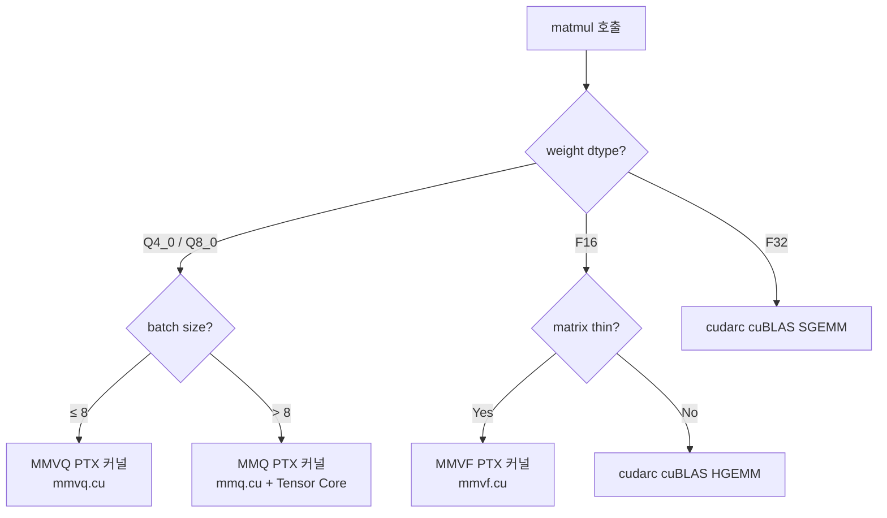
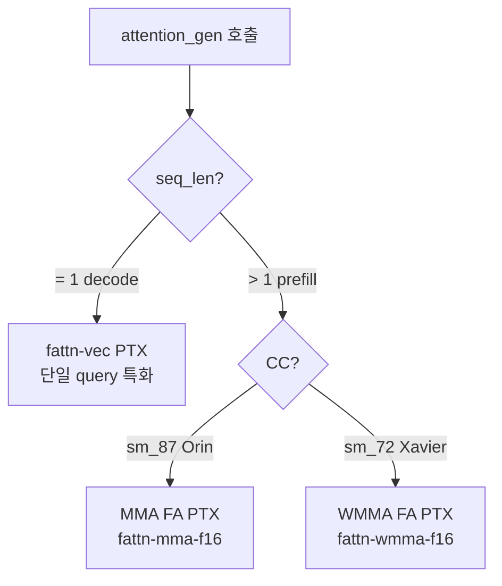
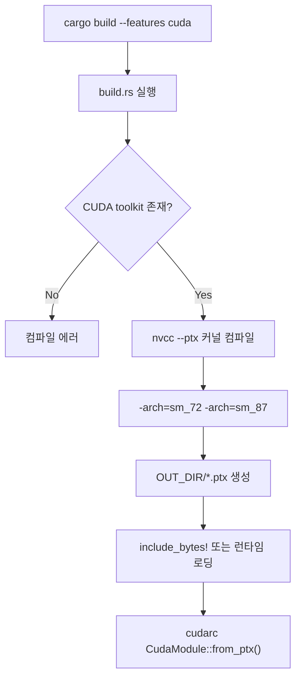

# Engine CUDA Backend -- Architecture

> spec/34-engine-cuda.md의 구현 설계.

## CudaBackend (관련 spec ID: ENG-CUDA-010~013)

### 설계 결정

CUDA 백엔드는 **cudarc 크레이트 + llama.cpp PTX 커널**로 구현한다. 자체 CUDA 커널을 작성하지 않는다.

핵심 설계 원칙:
- **cudarc 기반**: Rust safe API로 CUDA Driver/Runtime, cuBLAS 접근. `extern "C"` 수동 FFI 불필요.
- **PTX 커널 로딩**: llama.cpp `.cu` → `nvcc --ptx` → `CudaModule::from_ptx()`. ggml graph/tensor 시스템에 비의존.
- **op-by-op 실행**: 초기 구현은 Backend trait 메서드별 개별 커널 launch. Plan 시스템(OpenCL)에 해당하는 CUDA Graph은 향후 선택적 최적화.
- **Unified Memory**: Jetson UMA에서 cudarc `CudaDevice::alloc()`, CPU/GPU 양쪽 접근.

### 인터페이스

```rust
// engine/src/backend/cuda/mod.rs

use cudarc::driver::{CudaDevice, CudaFunction, CudaModule, CudaSlice, CudaStream};
use cudarc::cublas::CudaBlas;

pub struct CudaBackend {
    device: Arc<CudaDevice>,         // cudarc device handle
    stream: CudaStream,             // default compute stream
    blas: CudaBlas,                  // cuBLAS handle (cudarc 래핑)
    compute_capability: (u32, u32),  // (major, minor) e.g., (8, 7) for Orin

    // 로딩된 PTX 커널 모듈
    matmul_module: CudaModule,       // mmvq.cu, mmq.cu → PTX
    norm_module: CudaModule,         // norm.cu → PTX
    rope_module: CudaModule,         // rope.cu → PTX
    attn_module: CudaModule,         // fattn*.cu → PTX
    ops_module: CudaModule,          // unary.cu, bin_bcast.cu, softmax.cu → PTX
}

impl CudaBackend {
    /// CUDA device 초기화. CC < sm_72이면 에러.
    pub fn new() -> Result<Self>
    // 전제: CUDA driver 로딩됨, GPU 1개 이상 존재
    // 후조건: PTX 모듈 로딩됨, CC 확인됨 (INV-066)

    /// CC 기반 최적 커널 경로 선택
    fn select_matmul_path(&self, weight_dtype: DType, batch: usize) -> MatmulPath
    fn select_fa_path(&self) -> FlashAttnPath
}

impl Backend for CudaBackend {
    fn name(&self) -> &str { "cuda" }
    fn device(&self) -> &str { "jetson" }
    fn matmul(&self, a: &Tensor, b: &Tensor, out: &mut Tensor) -> Result<()>
    fn rms_norm(&self, x: &mut Tensor, w: &Tensor, eps: f32, add_unit: bool) -> Result<()>
    fn rope_inplace(&self, x: &mut Tensor, start_pos: usize, theta: f32) -> Result<()>
    fn attention_gen(&self, ...) -> Result<()>
    fn synchronize(&self) -> Result<()>  // device.synchronize()
    // ... 전체 Backend trait 메서드
}
```

### 처리 흐름 — matmul dispatch



### 처리 흐름 — Flash Attention dispatch



## cudarc + PTX 커널 레이어 (관련 spec ID: ENG-CUDA-020~025)

### 설계 결정

ggml-cuda의 커널 `.cu` 파일만 추출하여 PTX로 프리컴파일하고, cudarc로 로딩한다. ggml의 graph/tensor/메모리 시스템은 일체 사용하지 않는다.

```
빌드 시:  vendor/ggml-cuda/mmvq.cu → nvcc --ptx → OUT_DIR/mmvq.ptx
런타임:   CudaModule::from_ptx(include_bytes!("mmvq.ptx"))
          → module.get_function("mul_mat_vec_q4_0_q8_1")
          → function.launch(grid, block, args)
```

ggml C FFI 대비 장점:
- **ggml 의존성 없음**: tensor struct 변환, graph 시스템 등 불필요
- **Rust safe API**: cudarc의 `LaunchConfig`, `CudaSlice<T>` 등 제네릭 타입 사용
- **API 안정성**: 커널 함수 시그니처만 맞으면 ggml 버전 변경에 면역
- **디버깅 용이**: 커널 launch 파라미터를 Rust 쪽에서 완전 제어

### 인터페이스

```rust
// engine/src/backend/cuda/kernels.rs

use cudarc::driver::{CudaFunction, LaunchConfig, LaunchAsync};

/// PTX 커널 모듈 로더
pub struct CudaKernels {
    // matmul
    mmvq_q4_0: CudaFunction,   // vec_dot_q4_0_q8_1
    mmvq_q8_0: CudaFunction,   // vec_dot_q8_0_q8_1
    mmq_q4_0: CudaFunction,    // mul_mat_q4_0 (Tensor Core)
    mmvf_f16: CudaFunction,    // mul_mat_vec_f16_f32

    // norm, rope, softmax
    rms_norm: CudaFunction,
    rope_norm: CudaFunction,
    softmax: CudaFunction,

    // activation
    silu: CudaFunction,
    gelu_tanh: CudaFunction,
    mul: CudaFunction,

    // attention
    fattn_vec: CudaFunction,    // decode 단일 query
    fattn_mma: Option<CudaFunction>,  // sm_87+ prefill
    fattn_wmma: Option<CudaFunction>, // sm_72+ prefill

    // copy, convert
    cpy: CudaFunction,
    convert: CudaFunction,
    get_rows: CudaFunction,
}

impl CudaKernels {
    pub fn load(device: &Arc<CudaDevice>, cc: (u32, u32)) -> Result<Self> {
        let matmul_ptx = include_bytes!(concat!(env!("OUT_DIR"), "/mmvq.ptx"));
        let matmul_mod = device.load_ptx(Ptx::from_src(matmul_ptx), "mmvq", &["mul_mat_vec_q4_0_q8_1", ...])?;
        // ...
    }
}
```

### 커널 호출 예시

```rust
// rms_norm 커널 launch
impl CudaBackend {
    fn rms_norm(&self, x: &mut Tensor, w: &Tensor, eps: f32, add_unit: bool) -> Result<()> {
        let x_ptr = x.buffer().cuda_device_ptr()?;
        let w_ptr = w.buffer().cuda_device_ptr()?;
        let ncols = x.shape().last();
        let nrows = x.shape().numel() / ncols;

        unsafe {
            self.kernels.rms_norm.launch(
                LaunchConfig {
                    grid_dim: (nrows as u32, 1, 1),
                    block_dim: (256, 1, 1),
                    shared_mem_bytes: 0,
                },
                (x_ptr, w_ptr, ncols as i32, eps, add_unit as i32),
            )?;
        }
        Ok(())
    }
}
```

### 예외 처리

- cudarc API 호출 실패 → `cudarc::driver::DriverError` → `anyhow::Error`로 변환
- PTX 로딩 실패 → 빌드 시 PTX 생성 실패를 의미, 명확한 에러 메시지
- CUDA OOM → `device.alloc()` 실패 시 에러 반환, 프로세스 크래시 방지
- CC 미달 → `CudaBackend::new()` 에서 에러 반환

## CudaBuffer (관련 spec ID: ENG-CUDA-030~033)

### 설계 결정

Jetson UMA에서 cudarc `CudaDevice::alloc()`으로 할당한 버퍼. CPU/GPU 양쪽에서 동일 포인터로 접근 가능.

가중치 로딩 시:
1. mmap으로 모델 파일 읽기 (기존 MmapBuffer)
2. `cuMemHostRegister(ptr, size)`로 GPU에 매핑 (cudarc driver API)
3. 추가 메모리 할당 없이 zero-copy GPU 접근

이는 OpenCL의 `ClWrappedBuffer` (`CL_MEM_USE_HOST_PTR`)와 동일한 패턴.

### 인터페이스

```rust
// engine/src/buffer/cuda_buffer.rs

use cudarc::driver::CudaSlice;

/// cudarc CudaSlice를 래핑하는 Buffer 구현.
/// KV 캐시, workspace 등 새로 할당하는 GPU 버퍼에 사용.
pub struct CudaBuffer {
    slice: CudaSlice<u8>,    // cudarc가 소유권 관리
    size: usize,
    dtype: DType,
}

/// 기존 CPU 버퍼를 GPU에 등록하는 zero-copy 래퍼.
/// 모델 가중치 로딩에 사용. ClWrappedBuffer의 CUDA 대응.
pub struct CudaWrappedBuffer {
    inner: Arc<dyn Buffer>,  // 원본 버퍼 (MmapBuffer 등)
    device_ptr: CudaSlice<u8>,  // cuMemHostRegister로 등록된 디바이스 뷰
    size: usize,
    dtype: DType,
}

impl Buffer for CudaBuffer {
    fn as_ptr(&self) -> *const u8 {
        // Jetson UMA: device pointer == host pointer
        *self.slice.device_ptr() as *const u8
    }
    fn cl_mem(&self) -> Option<&Mem> { None }
    fn is_host_managed(&self) -> bool { true }  // Jetson UMA
}

impl Buffer for CudaWrappedBuffer {
    fn as_ptr(&self) -> *const u8 { self.inner.as_ptr() }  // 원본 포인터
    fn is_host_managed(&self) -> bool { true }
}
```

### OpenCL 버퍼 대응

| OpenCL | CUDA (cudarc) | 용도 |
|--------|--------------|------|
| `UnifiedBuffer` (CL_MEM_ALLOC_HOST_PTR) | `CudaBuffer` (CudaDevice::alloc) | KV 캐시, workspace |
| `ClWrappedBuffer` (CL_MEM_USE_HOST_PTR) | `CudaWrappedBuffer` (cuMemHostRegister) | 가중치 zero-copy |
| `MadviseableGPUBuffer` (Vec + CL handle) | 사용하지 않음 | — |

## 빌드 시스템 (관련 spec ID: ENG-CUDA-050~052)

### 설계 결정

`build.rs`에서 llama.cpp `.cu` 파일을 `nvcc --ptx`로 컴파일. ggml 전체 라이브러리를 빌드하지 않고, 커널 PTX만 생성.

### 처리 흐름



### Config / CLI

| 환경변수 | 용도 | 기본값 |
|---------|------|--------|
| `CUDA_PATH` | CUDA toolkit 경로 | `/usr/local/cuda` |
| `CUDA_ARCHITECTURES` | 타겟 CC | `72;87` |

### Cargo.toml

```toml
[features]
default = ["opencl"]
opencl = ["ocl"]
cuda = ["cudarc"]

[dependencies]
cudarc = { version = "0.19", features = ["driver", "cublas", "no-std"], optional = true }
```

## 디렉토리 구조 (최종)

```
engine/
├── src/
│   ├── backend/
│   │   ├── cpu/            # 기존
│   │   ├── opencl/         # 기존
│   │   └── cuda/           # 신규
│   │       ├── mod.rs      # CudaBackend impl Backend
│   │       ├── kernels.rs  # PTX 로딩, CudaKernels 구조체
│   │       └── memory.rs   # CUDA 메모리 관리
│   └── buffer/
│       ├── cuda_buffer.rs         # CudaBuffer (Buffer trait impl)
│       └── cuda_wrapped_buffer.rs # CudaWrappedBuffer (zero-copy)
├── build.rs                # nvcc --ptx 컴파일 스크립트 추가
└── vendor/
    └── ggml-cuda/          # llama.cpp에서 추출한 .cu 파일만
        ├── mmvq.cu
        ├── mmq.cu
        ├── norm.cu
        ├── rope.cu
        ├── softmax.cu
        ├── unary.cu
        ├── fattn*.cu
        ├── common.cuh      # 공유 헤더
        └── ...
```

## OpenCL Plan 시스템과의 관계

### 현재 OpenCL Plan

OpenCL 백엔드는 `plan.rs` (1769줄)에서 전체 forward pass의 커널을 미리 준비(pre-bind)하여 decode 시 CPU 오버헤드를 제거한다:

```
빌드 시: FullKernelPlan = { layers[N] × [RmsNorm, QKV, RoPE, KV, Attn, Wo, FFN...], final_norm, lm_head }
토큰마다: plan.all_steps().for_each(|step| step.update_dynamic(pos) → clEnqueueNDRange)
```

### CUDA에서의 대응

CUDA는 OpenCL 대비 커널 launch 오버헤드가 낮으므로, 초기 구현은 **op-by-op**으로 충분하다.

향후 최적화가 필요하면 **CUDA Graph**으로 동일한 효과를 달성할 수 있다:

```rust
// 향후 (선택적) CUDA Graph 최적화
let graph = device.stream_capture(|| {
    // forward pass의 모든 커널을 순차 실행
    for layer in &self.layers {
        self.rms_norm(...)?;
        self.matmul_qkv(...)?;
        self.rope(...)?;
        // ...
    }
})?;

// 이후 매 토큰마다 graph 재실행
graph.launch()?;
```

**중요**: Plan 시스템은 `#[cfg(feature = "opencl")]` 범위에 완전히 격리되어 있으므로, CUDA 백엔드 추가 시 Plan 코드를 수정할 필요가 없다. CUDA 백엔드는 독립적으로 op-by-op 또는 CUDA Graph을 구현한다.
