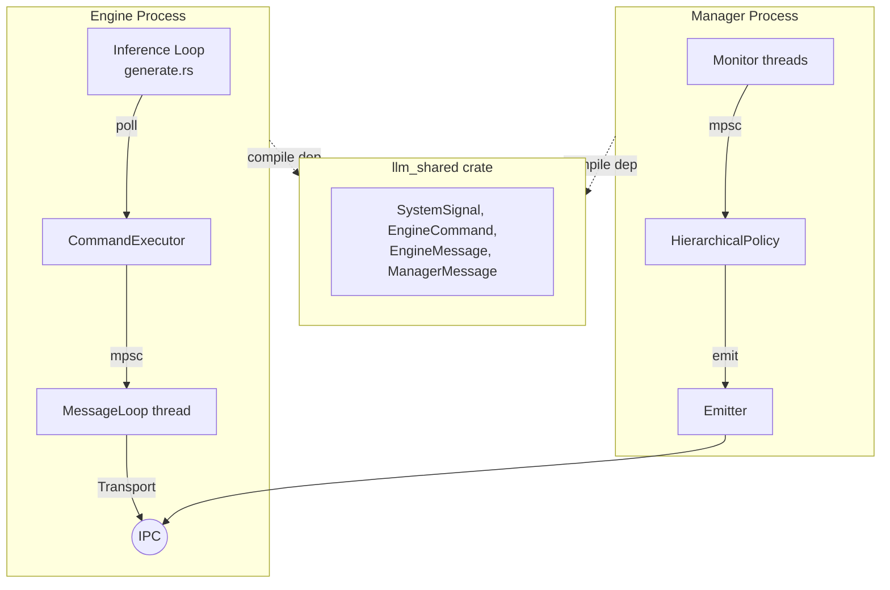
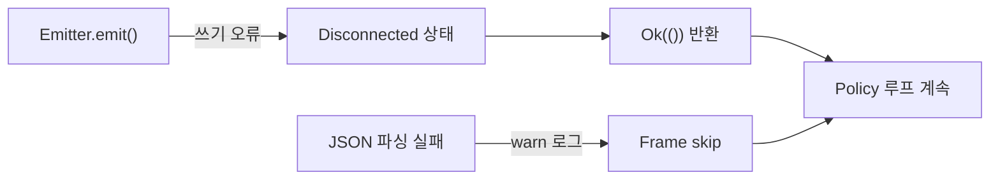
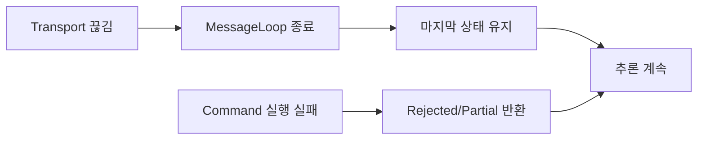

# Cross-cutting Concerns -- Architecture

> spec/40-cross-cutting.md의 구현 상세. 컴포넌트 중심 기술.

---

## 1. Fail-Safety 전략 (Engine/Manager 독립성)

### 설계 결정

Engine과 Manager는 별도 OS 프로세스로, 상대방 장애가 자신의 핵심 루프를 중단시키지 않는다 (INV-005, INV-006). 공유 의존성은 `llm_shared` 크레이트뿐이며, 런타임 통신은 IPC(Unix Socket/TCP)로만 이루어진다.



### Engine 독립 동작 (CROSS-011)

| 장애 시나리오 | 구현 컴포넌트 | 동작 |
|-------------|-------------|------|
| Manager 미연결 | `generate.rs` | `command_executor = None` → resilience checkpoint skip, 순수 추론 |
| Manager 연결 끊김 | `CommandExecutor::poll()` | MessageLoop 종료 → mpsc 수신 중단 → 마지막 plan 유지, 추론 계속 |
| Transport 에러 | `engine/src/resilience/transport.rs` | `TransportError::Disconnected` → MessageLoop thread 종료 |

### Manager 독립 동작 (CROSS-012)

| 장애 시나리오 | 구현 컴포넌트 | 동작 |
|-------------|-------------|------|
| Engine 미연결 | `UnixSocketEmitter::wait_for_client()` | timeout 후 반환, Policy 루프 계속 |
| Engine 연결 끊김 | `UnixSocketEmitter::emit_directive()` | 쓰기 오류 → Disconnected 전이, `Ok(())` 반환 |
| JSON 파싱 실패 | `channel/unix_socket.rs`, `channel/tcp.rs` | `warn!` 로그 → frame skip, 루프 계속 |

### Emergency 자율 대응 (CROSS-013)

Emergency 시그널은 Manager 없이도 Engine이 자율적으로 처리한다:

| Strategy | 파일 | Emergency 대응 |
|----------|------|---------------|
| MemoryStrategy | `engine/src/resilience/strategy/memory.rs` | `Evict(0.25)` + `RejectNew` |
| ThermalStrategy | `engine/src/resilience/strategy/thermal.rs` | `Suspend` |
| EnergyStrategy | `engine/src/resilience/strategy/energy.rs` | `Suspend` + `RejectNew` |

---

## 2. Shared Crate 경계 (llm_shared)

### 설계 결정

`llm_shared`는 Engine/Manager 간 유일한 공유 의존성이다 (INV-001, INV-010). Shared 자체는 Engine/Manager 내부 구현에 의존하지 않는다 (INV-011).

### 의존 구조

```
engine/Cargo.toml  → [dependencies] llm_shared (path)
manager/Cargo.toml → [dependencies] llm_shared (path)
shared/Cargo.toml  → [dependencies] serde, serde_json (외부만)
```

**위반 감지**: `shared/Cargo.toml`에 `llm_rs2` 또는 `llm_manager` 의존 추가 = INV-011 위반.

### Shared에 정의된 타입 목록

| 범주 | 타입 | serde 태깅 |
|------|------|-----------|
| Signal | `SystemSignal`, `Level`, `RecommendedBackend`, `ComputeReason`, `EnergyReason` | externally tagged, `rename_all = "snake_case"` |
| Protocol (Manager→Engine) | `ManagerMessage`, `EngineDirective`, `EngineCommand` | `tag = "type"`, `rename_all = "snake_case"` |
| Protocol (Engine→Manager) | `EngineMessage`, `EngineCapability`, `EngineStatus`, `CommandResponse`, `CommandResult` | `tag = "type"` / `tag = "status"` |
| State | `ResourceLevel`, `EngineState` | `rename_all = "snake_case"` |

### 프로토콜 호환성 규칙

| 규칙 | 보장 방법 | 관련 INV |
|------|----------|---------|
| 새 필드 추가 시 `#[serde(default)]` 필수 | 코드 리뷰 | INV-028, CROSS-030 |
| 기존 필드 삭제/이름 변경 금지 | 코드 리뷰 | INV-027, CROSS-031 |
| serde 어노테이션 변경 = 프로토콜 버전 변경 | 코드 리뷰 | INV-027 |
| 외부 의존성: serde, serde_json만 | `shared/Cargo.toml` | INV-081, CROSS-032 |

---

## 3. 로깅 전략

### 설계 결정

Engine과 Manager는 별도 프로세스이므로 별도 로그 스트림을 가진다. 양쪽 모두 `env_logger` + `RUST_LOG` 환경 변수를 사용한다.

### 로그 포인트

| 프로세스 | 컴포넌트 | 주요 로그 이벤트 |
|---------|---------|----------------|
| Manager | `pipeline.rs` | 모드 전이, Directive 발행, Response 수신, 관측 업데이트 |
| Manager | `supervisory.rs` | 운영 모드 상승/하강 결정 |
| Manager | `emitter/*.rs` | 클라이언트 연결/연결 끊김 |
| Engine | `executor.rs` | EngineState 전이, Command 실행 결과 |
| Engine | `transport.rs` | Transport 연결/끊김, ParseError |
| Engine | `generate.rs` | 추론 시작/완료, eviction 이벤트 |

---

## 4. 에러 전파 패턴

### 설계 결정

IPC 에러는 연결 상태에만 영향을 주고, 비즈니스 로직(추론/모니터링)을 중단하지 않는다. Command 실행 실패는 `CommandResult` 타입으로 응답하며, Transport 에러와 분리된다.

### Manager 에러 전파



### Engine 에러 전파



### CommandResult 타입

```rust
pub enum CommandResult {
    Ok,
    Partial { achieved: f32, reason: String },
    Rejected { reason: String },
}
```

비즈니스 응답이며, 연결 상태에 영향을 주지 않는다.

---

## 5. 타이밍 규약 (Heartbeat, Timeout)

### 설계 결정

모든 타이밍 상수는 하드코딩이다. 설정 가능한 타이밍은 Manager의 `poll_interval_ms`와 각 Monitor의 `poll_interval_ms`뿐이다.

### 하드코딩 타이밍 상수

| 상수 | 값 | 위치 | 역할 |
|------|---|------|------|
| Heartbeat 주기 | 1000ms | `executor.rs` — `poll()` 내부 타이머 | Engine → Manager 상태 보고 |
| recv_timeout | 50ms | `pipeline.rs` — 메인 루프 | Manager mpsc 수신 타임아웃 |
| sync_channel 버퍼 | 64 | `channel/unix_socket.rs`, `channel/tcp.rs` | 배압 제어 |
| MAX_PAYLOAD_SIZE | 64KB | `transport.rs` — `read_frame()` | 악의적 크기 페이로드 차단 |
| OBSERVATION_DELAY | 3.0초 | `pipeline.rs` — `OBSERVATION_DELAY_SECS` | Relief 관측 대기 |

### 타이밍 관계

```
MemoryMonitor 폴링 (기본 1000ms, 설정 가능)
      ↓ SystemSignal
recv_timeout (50ms) → 정책 평가 → Directive 발행
      ↓ IPC
Engine poll() (토큰당 1회) → ExecutionPlan 소비
      ↓
Heartbeat (1000ms 간격) → Manager로 상태 보고
```

Emergency 시그널에 대한 최악 대응 지연: Monitor 폴링 + recv_timeout + IPC 왕복 ~= 수백ms.

### CLI 타이밍 옵션

| 플래그 | 대상 | 설명 | 기본값 |
|--------|------|------|--------|
| `--client-timeout` | Manager | Engine 초기 연결 대기 | 60초 |

---

## 6. 플랫폼 의존성

### 설계 결정

플랫폼별 코드는 `#[cfg]` feature gate로 격리한다. 크로스 컴파일(x86→ARM64) 시 잘못된 SIMD 코드가 포함되지 않도록 보장한다 (INV-002).

### Engine 플랫폼 게이트

| 컴포넌트 | 게이트 | 파일 |
|---------|--------|------|
| CpuBackendNeon | `#[cfg(target_arch = "aarch64")]` | `engine/src/backend/cpu/neon.rs` |
| CpuBackendAVX2 | `#[cfg(target_arch = "x86_64")]` | `engine/src/backend/cpu/x86.rs` |
| OpenCLBackend | `#[cfg(feature = "opencl")]` | `engine/src/backend/opencl/mod.rs` |
| GPU 커널 | N/A (런타임 로딩) | `engine/kernels/*.cl` (~80 파일) |

### Manager OS 인터페이스

| Monitor | 데이터 소스 | OS |
|---------|-----------|-----|
| MemoryMonitor | `/proc/meminfo` | Linux |
| ComputeMonitor | `/proc/stat` (CPU delta) | Linux |
| ThermalMonitor | `/sys/class/thermal/` | Linux |
| EnergyMonitor | `/sys/class/power_supply/` | Linux |

### IPC Transport

| Transport | 파일 (Manager 측) | 파일 (Engine 측) | 비고 |
|-----------|------------------|-----------------|------|
| Unix Domain Socket | `manager/src/channel/unix_socket.rs` | `engine/src/resilience/transport.rs` | 기본 |
| TCP loopback | `manager/src/channel/tcp.rs` | `engine/src/resilience/transport.rs` | SELinux fallback |

CLI: Manager `--transport unix|tcp:<host:port>`, Engine `--resilience-transport dbus|unix|tcp`.

---

## 7. 메모리 관리 전략

### 설계 결정

모델 가중치는 mmap으로 로딩하여 OS 페이지 캐시와 demand paging을 활용한다. KV 캐시는 grow-on-demand이며, eviction 후 물리 메모리 반환을 위해 `madvise(MADV_DONTNEED)` 또는 `shrink_to_fit()`을 사용한다.

| 전략 | 컴포넌트 | 구현 |
|------|---------|------|
| mmap 가중치 로딩 | `engine/src/models/` | Safetensors mmap, demand paging |
| madvise(DONTNEED) | `engine/src/core/kv_cache.rs` — `madvise_dontneed()` | `high_water_pos` 이후 페이지 해제 |
| shrink_to_fit | `engine/src/core/kv_cache.rs` — `shrink_to_fit()` | 재할당으로 물리 메모리 해제 (dynamic cache) |
| Zero-copy UMA | `engine/src/buffer/unified_buffer.rs` | `CL_MEM_ALLOC_HOST_PTR` — GPU pin, madvise 무효 |
| Host-managed GPU | `engine/src/buffer/madviseable_gpu_buffer.rs` | `CL_MEM_USE_HOST_PTR` — madvise 가능 |

---

## 8. 보안 모델

### 설계 결정

Manager-Engine 간 IPC는 1:1 신뢰 모델이다 (INV-082). 인증/암호화 없음. 페이로드 크기 제한으로 기본적인 DoS 방어만 제공.

| 규칙 | 구현 | 비고 |
|------|------|------|
| 단일 클라이언트 연결 | `UnixSocketEmitter` — 단일 `accept()` | 다중 Engine 미지원 |
| 페이로드 크기 제한 | `transport.rs` — `MAX_PAYLOAD_SIZE = 64KB` | Engine 측만 적용 |
| 소켓 파일 정리 | `UnixSocketEmitter::Drop` — 소켓 파일 삭제 | stale socket 방지 |

---

## 9. 하드코딩 상수 요약

| 상수 | 값 | 위치 | spec 근거 |
|------|---|------|----------|
| Heartbeat 주기 | 1000ms | `executor.rs` | CROSS-060 |
| recv_timeout | 50ms | `pipeline.rs` | CROSS-060 |
| sync_channel 버퍼 | 64 | `channel/{unix_socket,tcp}.rs` | CROSS-060 |
| MAX_PAYLOAD_SIZE | 64KB | `transport.rs` | CROSS-060 |
| OBSERVATION_DELAY_SECS | 3.0 | `pipeline.rs` | CROSS-061 |