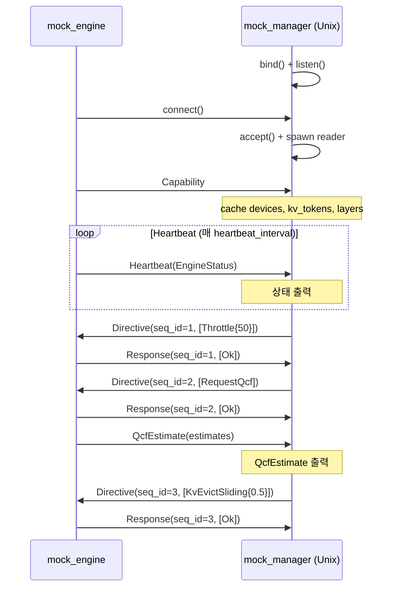

# Test Tools — Architecture

> 대응 spec: `spec/50-test-tools.md` (TOOL-010 ~ TOOL-061)

## 1. mock_engine

### 코드 위치

- **바이너리**: `manager/src/bin/mock_engine.rs`

### 설계 결정

**상태 시뮬레이션 (TOOL-014, TOOL-016)**: `EngineState_` struct가 mock 엔진의 내부 상태를 관리한다. 각 `EngineCommand`에 대해 `apply()` 메서드가 상태를 갱신하고 `CommandResult`를 반환한다. Production Engine의 `ExecutionPlan` 패턴과 유사하나, 실제 KV 캐시/모델 없이 숫자 값만 갱신한다.

**Heartbeat 생성 (TOOL-013)**: `EngineState_::status()` 메서드가 현재 상태에서 `EngineStatus`를 빌드한다. 16개 필드 중 동적 필드(active_device, kv_cache_utilization, state, skip_ratio, eviction_policy, tokens_generated)를 내부 상태에서 매핑한다.

**와이어 포맷 (TOOL-023)**: `send_message()` / `recv_message()` 함수가 4-byte BE length prefix + JSON 직렬화를 수행한다. Production의 `UnixSocketEmitter` / `Transport`와 동일한 프레이밍이다.

### 구현 격차 (spec vs 현재 코드)

| TOOL ID | 상태 | 비고 |
|---------|------|------|
| TOOL-010~012 | 구현됨 | Capability 전송 완료 |
| TOOL-013 | 구현됨 | heartbeat_interval 주기 전송 |
| TOOL-014 | **부분** | `active_actions`, `available_actions`가 항상 빈 Vec. command 적용 시 갱신 미구현 |
| TOOL-015 | 구현됨 | |
| TOOL-016 | 구현됨 | 13종 command 처리 완료 |
| TOOL-017~018 | 구현됨 | INV-022~024 준수 |
| TOOL-019 | **미구현** | RequestQcf 시 Ok 반환만 하고 QcfEstimate 미전송 (SEQ-096 위반) |
| TOOL-020~023 | 구현됨 | |

## 2. mock_manager

### 코드 위치

- **바이너리**: `manager/src/bin/mock_manager.rs`

### 설계 결정

**D-Bus 전용 (현재)**: 기존 구현은 D-Bus 시그널 발행만 지원한다. `zbus::blocking::Connection::system()` 으로 System Bus에 연결하고 4종 시그널을 발행한다. Unix 소켓 양방향 통신은 미구현이다.

**모드 분리 (TOOL-045~046)**: D-Bus 모드(`--dbus`)와 Unix 모드(기본)를 CLI 플래그로 분리한다. 기존 D-Bus 코드를 `dbus_mode` 함수로 캡슐화하고, 새 Unix 코드를 `unix_mode` 함수로 구현한다.

**Unix Server (TOOL-030~034)**: mock_engine의 `send_message`/`recv_message` 함수와 대칭적인 구현이 필요하다. `UnixListener::bind()` → `accept()` → Reader thread(또는 non-blocking read) → EngineMessage 수신.

**seq_id 관리 (TOOL-036)**: AtomicU64 또는 단순 u64 카운터를 사용한다. 초기값 1, Directive 전송마다 1 증가.

### 구현 격차 (spec vs 현재 코드)

| TOOL ID | 상태 | 비고 |
|---------|------|------|
| TOOL-030~034 | **미구현** | Unix 소켓 서버 전체 |
| TOOL-035~039 | **미구현** | Directive 전송, Response/QcfEstimate 수신 |
| TOOL-040~044 | **부분** | D-Bus 모드 CLI만 존재 |
| TOOL-045~046 | **부분** | D-Bus 기능 있으나 모드 분리 미구현 |
| TOOL-047 | **미구현** | |
| TOOL-048 | **미구현** | |

## 3. 상호운용 흐름

## 4. 테스트 전략

- **mock_engine**: 기존 15개 유닛 테스트 유지. TOOL-019(QcfEstimate) 구현 시 QcfEstimate 전송 테스트 추가.
- **mock_manager**: Unix 모드 구현 시 유닛 테스트 추가 필요:
  - `accept()` + Capability 수신 테스트
  - Directive 전송 + Response 수신 round-trip 테스트
  - seq_id 단조 증가 테스트
  - INV-023/024 검증 테스트
  - QcfEstimate 수신 테스트
