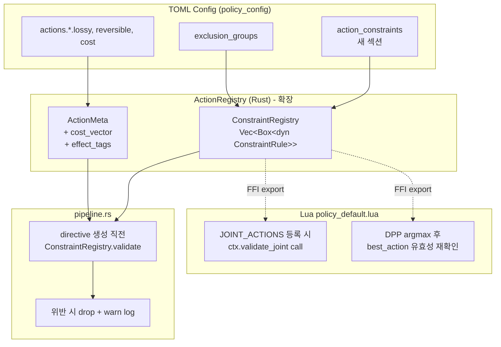

# Action Constraint Management -- 설계 문서

> **상태**: Draft v1
> **작성**: 2026-04-15
> **범위**: Manager 크레이트의 `EngineCommand`/`ActionId` 조합 제약 관리
> **관련 spec**: SYS-096 (배타 그룹), INV-016, MGR-026 (ActionSelector), MGR-028 (ActionRegistry)
> **관련 arch**: `arch/20-manager.md` §6 (LuaPolicy), `arch/23-manager-data.md` §DAT-036

---

## 1. 배경과 동기

### 1.1 발견된 버그

`manager/scripts/policy_default.lua`의 joint action 레지스트리에 잘못된 조합이 등록되어 있다.

```lua
local JOINT_ACTIONS = {
    kv_evict_plus_quant      = { components = { "kv_evict_sliding", "kv_quant_dynamic" } },  -- 잘못됨
    throttle_plus_layer_skip = { components = { "throttle",         "layer_skip"        } },
}
```

- `kv_evict_sliding` → KV 토큰 수 감소 (문맥 손실)
- `kv_quant_dynamic` → KV 정밀도 감소 (수치 손실)
- 두 액션 모두 **memory 도메인의 "KV 품질 예산"**을 소비한다. 동시 적용 시 품질 이중 훼손.

### 1.2 구조적 문제

| 문제 | 현재 상태 |
|------|----------|
| 제약 선언 위치 분산 | `action_registry.exclusion_groups` (Rust) + `JOINT_ACTIONS` (Lua), 두 곳 모두 동일 정책을 이중 정의하지 않음 |
| 제약 표현력 | "mutually exclusive (동시 활성 금지)" 하나만 지원, joint에는 적용 불가 |
| Joint 유효성 검증 부재 | Lua 등록 시 정합성 체크 없음. 실수한 조합을 발견할 수단이 없음 |
| Rust pipeline 레벨 방어선 부재 | `EngineDirective` 생성 경로에서 commands 조합의 타당성을 검증하지 않는다 (`pipeline.rs::convert_to_engine_commands`는 단순 매핑) |
| 확장성 | 새 EngineCommand 추가 시 제약 정의 위치가 명확하지 않다 |

### 1.3 설계 목표

1. **단일 소스(Single Source of Truth)**: 제약은 한 곳(Rust registry)에서 선언, Lua와 pipeline 양쪽에서 참조
2. **다층 방어**: Lua candidate 생성 + Rust pipeline 최종 검증 (defense in depth)
3. **확장 가능한 제약 DSL**: mutual exclusion 외에 budget, dependency, saturation 같은 미래 제약도 표현 가능
4. **DPP 도메인과의 정합성**: 제약이 기존 pressure domain(gpu/cpu/memory/thermal)과 자연스럽게 매핑됨
5. **점진적 마이그레이션**: 기존 `exclusion_groups` TOML 스키마와 호환, 파괴적 변경 최소화

---

## 2. 패턴 비교 분석

### 2.1 Pattern A: Primary Domain Exclusion

**아이디어**: 각 `ActionId::primary_domain()`을 선언하고, 같은 도메인 액션 두 개를 같은 directive에 담을 수 없게 한다.

```rust
// 이미 types.rs에 존재
ActionId::KvEvictSliding.primary_domain()  // Domain::Memory
ActionId::KvQuantDynamic.primary_domain()  // Domain::Memory  -- 동시 금지
ActionId::Throttle.primary_domain()        // Domain::Compute
ActionId::LayerSkip.primary_domain()       // Domain::Compute -- 동시 금지
```

| 항목 | 평가 |
|------|------|
| 확장성 | 낮음. `throttle + layer_skip`처럼 **허용된** same-domain joint도 존재 (compute에서 두 전략의 합은 유효) |
| 복잡도 | 매우 낮음 (이미 `primary_domain()` 존재) |
| DPP 정합성 | 완벽하지만 **과도하게 제한적** |
| 표현력 | "동일 도메인 금지" 한 가지만 |
| 위양성 | `throttle + layer_skip` 같이 실제로 유효한 compute joint를 막는다 |

**결론**: 단독으로는 불충분. 보조 분류로만 사용.

### 2.2 Pattern B: Resource Budget Model

**아이디어**: 각 액션이 소비하는 도메인별 "cost"를 선언, directive 레벨에서 도메인 예산 합산이 1.0을 넘지 못하게 한다.

```rust
KvEvictSliding { memory_quality_cost: 0.6, compute_cost: 0.0 }
KvQuantDynamic { memory_quality_cost: 0.5, compute_cost: 0.0 }
// 0.6 + 0.5 = 1.1 > 1.0 → 거부

Throttle       { memory_quality_cost: 0.0, compute_cost: 0.4 }
LayerSkip      { memory_quality_cost: 0.0, compute_cost: 0.5 }
// 0.0 + 0.9 → 통과
```

| 항목 | 평가 |
|------|------|
| 확장성 | 매우 높음. 새 도메인/새 예산 추가 용이 |
| 복잡도 | 중간. 비용 튜닝이 필요 (DPP의 `default_cost`와 중복 가능성) |
| DPP 정합성 | 훌륭함. 이미 `ActionConfig.default_cost`가 존재하여 자연스러운 확장 |
| 표현력 | mutual exclusion을 `cost=1.0` 같은 값으로 흉내 낼 수 있음 |
| 단점 | 숫자 튜닝 필요, **category mismatch** 표현이 어렵다 (예: "같은 메모리지만 품질 훼손 vs 용량 감소"가 구분 안 됨) |

**결론**: 강력하지만 표현력에 미묘한 간극이 있다. Effect Tag와 결합하면 보완 가능.

### 2.3 Pattern C: Effect Tag System

**아이디어**: 액션이 시스템에 미치는 **의미적 효과**를 tag로 선언. 충돌은 특정 tag들의 조합을 금지하는 규칙으로 표현.

```rust
KvEvictSliding: [Tag::KvContextLoss, Tag::ReducesKvMemory]
KvQuantDynamic: [Tag::KvPrecisionLoss, Tag::ReducesKvMemory]
Throttle:       [Tag::ReducesComputeLoad, Tag::IncreasesLatency]
LayerSkip:      [Tag::ReducesComputeLoad, Tag::DegradesQuality]

// 규칙:
// - Any two actions sharing Tag::KvContextLoss | KvPrecisionLoss 금지
//   (= "KV 품질 예산 이중 소비")
// - Tag::ReducesComputeLoad는 joint 허용
```

| 항목 | 평가 |
|------|------|
| 확장성 | 매우 높음 |
| 복잡도 | 높음. 태그 집합 설계 + 충돌 규칙 정의 이중 작업 |
| DPP 정합성 | 간접적. tag가 domain보다 세밀 |
| 표현력 | 가장 높음. 버그 재현도 명확히 표현됨 |
| 단점 | 설계 부담. 초기 태그 선정이 잘못되면 반복 수정 필요 |

**결론**: 장기적으로 이상적이지만 현재 규모(10 actions)에는 과설계.

### 2.4 Pattern D: Rust-level ActionConstraintRegistry

**아이디어**: 제약을 Rust 쪽 선언적 구조체로 일괄 관리하고, Lua는 `is_joint_valid(name)`를 호출해 검증, pipeline은 `validate_directive(directive)`를 호출해 최종 방어한다.

```rust
pub struct ConstraintRegistry {
    rules: Vec<Box<dyn ConstraintRule>>,
}

pub trait ConstraintRule: Send + Sync {
    fn check(&self, actions: &[ActionId], params: &ParamMap) -> Result<(), ConstraintViolation>;
    fn name(&self) -> &str;
}
```

| 항목 | 평가 |
|------|------|
| 확장성 | 매우 높음 (trait 기반) |
| 복잡도 | 중간. 초기 구조가 약간 부담이지만 이후 추가는 저렴 |
| DPP 정합성 | 자유 — rule 안에서 원하는 기준으로 검증 |
| 표현력 | 무제한 (Pattern A/B/C를 모두 rule로 구현 가능) |
| 다층 방어 | Lua + pipeline 양쪽에서 동일 registry 호출 |

**결론**: **권장.** Pattern A/B/C의 장점을 개별 rule로 흡수 가능한 메타 패턴.

---

## 3. 권장 아키텍처

**Pattern D (ConstraintRegistry) + Pattern B의 단순화 형태(도메인별 budget)**를 조합한다.
초기 rule 세트는 다음 4종을 제공하되, 새 rule 추가는 trait 구현으로 확장한다.

### 3.1 레이어 다이어그램



### 3.2 Rust 타입 스케치

#### 3.2.1 ConstraintRule trait

```rust
// manager/src/constraint/mod.rs (신규 모듈)

use llm_shared::EngineCommand;
use crate::types::{ActionId, Domain};

/// 여러 액션의 조합에 대한 제약 규칙.
/// 모든 rule은 pure function이어야 한다 (side-effect 금지).
pub trait ConstraintRule: Send + Sync {
    /// Rule 식별자 (로그/에러 메시지에서 사용).
    fn id(&self) -> &'static str;

    /// 주어진 액션 조합이 이 rule에 대해 유효한지 검사.
    /// actions는 directive에 포함될 예정인 ActionId의 정렬된 슬라이스.
    /// params는 각 액션의 해석된 파라미터 (keep_ratio, target_bits 등).
    fn check(
        &self,
        actions: &[ActionId],
        params: &ActionParamView<'_>,
    ) -> Result<(), ConstraintViolation>;
}

pub struct ActionParamView<'a> {
    // EngineCommand variant별 파라미터 조회. Option<&Command>로 반환.
    commands: &'a [EngineCommand],
}

#[derive(Debug, Clone)]
pub struct ConstraintViolation {
    pub rule_id: &'static str,
    pub reason: String,
    pub offending_actions: Vec<ActionId>,
}
```

#### 3.2.2 ConstraintRegistry

```rust
pub struct ConstraintRegistry {
    rules: Vec<Box<dyn ConstraintRule>>,
}

impl ConstraintRegistry {
    /// 표준 rule 세트로 초기화.
    pub fn with_standard_rules(action_registry: &ActionRegistry) -> Self {
        Self {
            rules: vec![
                Box::new(ExclusionGroupRule::new(action_registry.exclusion_groups().clone())),
                Box::new(DomainBudgetRule::new(action_registry)),
                Box::new(KvQualityDoubleJeopardyRule),
                Box::new(ParameterSanityRule),
            ],
        }
    }

    pub fn add_rule(&mut self, rule: Box<dyn ConstraintRule>) {
        self.rules.push(rule);
    }

    /// 모든 rule을 순차 검사. 첫 번째 위반에서 Err 반환 (fail-fast).
    /// 진단 목적으로 모든 위반 수집이 필요하면 `validate_all` 사용.
    pub fn validate(
        &self,
        actions: &[ActionId],
        commands: &[EngineCommand],
    ) -> Result<(), ConstraintViolation> {
        let params = ActionParamView { commands };
        for rule in &self.rules {
            rule.check(actions, &params)?;
        }
        Ok(())
    }

    pub fn validate_all(
        &self,
        actions: &[ActionId],
        commands: &[EngineCommand],
    ) -> Vec<ConstraintViolation> {
        let params = ActionParamView { commands };
        self.rules
            .iter()
            .filter_map(|r| r.check(actions, &params).err())
            .collect()
    }
}
```

#### 3.2.3 표준 Rule 구현

```rust
/// Rule 1: 기존 exclusion_groups TOML 설정을 그대로 활용.
/// 같은 그룹 내 두 액션이 동시 활성이면 위반.
pub struct ExclusionGroupRule {
    groups: HashMap<String, Vec<ActionId>>,
}

/// Rule 2: 도메인별 소비 예산 <= 1.0.
/// 각 액션이 (compute_cost, memory_cost, thermal_cost, kv_quality_cost)를 선언.
/// 합산이 1.0을 초과하면 위반.
pub struct DomainBudgetRule {
    costs: HashMap<ActionId, DomainCost>,
    budget: DomainBudget,  // 기본 [1.0, 1.0, 1.0, 1.0]
}

#[derive(Debug, Clone, Copy, Default)]
pub struct DomainCost {
    pub compute: f32,
    pub memory_capacity: f32,  // KV 용량 감소 효과
    pub memory_quality: f32,   // KV 품질 훼손 효과 (새 도메인)
    pub thermal: f32,
}

/// Rule 3: 현재 버그의 명시적 방지.
/// "KV context 손실"(eviction/merge)과 "KV precision 손실"(quant) 동시 금지.
pub struct KvQualityDoubleJeopardyRule;

impl ConstraintRule for KvQualityDoubleJeopardyRule {
    fn id(&self) -> &'static str { "kv_quality_double_jeopardy" }

    fn check(&self, actions: &[ActionId], _p: &ActionParamView) -> Result<(), ConstraintViolation> {
        let has_eviction = actions.iter().any(|a| matches!(a,
            ActionId::KvEvictSliding
            | ActionId::KvEvictH2o
            | ActionId::KvMergeD2o
            | ActionId::KvEvictStreaming
        ));
        let has_quant = actions.iter().any(|a| matches!(a, ActionId::KvQuantDynamic));

        if has_eviction && has_quant {
            return Err(ConstraintViolation {
                rule_id: self.id(),
                reason: "KV context-loss action과 precision-loss action은 동시 적용 불가".into(),
                offending_actions: actions.to_vec(),
            });
        }
        Ok(())
    }
}

/// Rule 4: 파라미터 sanity (keep_ratio ∈ [0,1], delay_ms > 0 등).
/// 단일 액션 단위의 검증이며 EngineCommand 파라미터 range 체크.
pub struct ParameterSanityRule;
```

### 3.3 Lua 바인딩

Lua에서 Rust의 ConstraintRegistry를 호출할 수 있도록 `ctx`에 함수 2개를 노출한다.

```rust
// manager/src/lua_policy.rs 의 ctx 빌드 단계
ctx.set("is_joint_valid", lua.create_function(|_, components: Vec<String>| {
    let ids: Vec<ActionId> = components.iter()
        .filter_map(|s| ActionId::from_str(s))
        .collect();
    Ok(constraint_registry.validate(&ids, &[]).is_ok())
})?)?;

ctx.set("validate_combo", lua.create_function(|_, components: Vec<String>| {
    // 위반 rule 목록을 string array로 반환
    ...
})?)?;
```

Lua 측 사용:

```lua
-- JOINT_ACTIONS 등록 전 load-time 검증
for jkey, jspec in pairs(JOINT_ACTIONS) do
    if not is_joint_valid(jspec.components) then
        error("Invalid joint action: " .. jkey)
    end
end

-- Candidate 생성 루프에서 runtime 검증 (이중 방어)
for jkey in pairs(JOINT_ACTIONS) do
    if is_joint_valid(JOINT_ACTIONS[jkey].components) then
        local jr = joint_relief(c, jkey)
        ...
    end
end
```

### 3.4 Pipeline 레벨 최종 검증

```rust
// pipeline.rs::run_action_selection_with_qcf 내부
let engine_commands = self.convert_to_engine_commands(&commands);
let action_ids: Vec<ActionId> = commands.iter().map(|c| c.action).collect();

if let Err(v) = self.constraint_registry.validate(&action_ids, &engine_commands) {
    tracing::warn!(
        rule = v.rule_id,
        actions = ?v.offending_actions,
        reason = %v.reason,
        "Constraint violation in directive — dropping"
    );
    // 관측용 counter 증가
    METRICS.constraint_violations.with_label(v.rule_id).inc();
    return None;  // directive 발행 안 함
}
```

### 3.5 TOML 스키마 확장 (옵션)

기존 `[policy.exclusion_groups]`는 유지하고, 새 선언을 아래에 추가한다.

```toml
[policy.actions.kv_evict_sliding]
lossy = true
reversible = false
default_cost = 1.0

# 신규: 도메인별 cost vector
[policy.actions.kv_evict_sliding.domain_cost]
compute = 0.1
memory_capacity = 0.8
memory_quality = 0.6
thermal = 0.0

[policy.actions.kv_quant_dynamic.domain_cost]
compute = 0.05
memory_capacity = 0.4
memory_quality = 0.7
thermal = 0.0

# 0.6 + 0.7 = 1.3 > 1.0 → DomainBudgetRule이 거부
# + KvQualityDoubleJeopardyRule이 추가로 거부
```

하위 호환: `domain_cost` 섹션 누락 시 `DomainCost::default()` (all zeros) 사용 → `DomainBudgetRule`은 통과.

---

## 4. Lua vs Rust 역할 분담

| 단계 | Lua 역할 | Rust 역할 |
|------|---------|----------|
| **Load-time (정책 파일 로드 시)** | `JOINT_ACTIONS` 등록 루프에서 `is_joint_valid(components)` 호출. 실패 시 early error | `is_joint_valid` FFI 제공 |
| **Candidate 생성** | `JOINT_ACTIONS`의 각 후보에 대해 `is_joint_valid` 재확인 (hot reload 대응) | (동일) |
| **DPP argmax** | 결과 `best_action`이 joint일 경우 `validate_combo` 호출, 위반 시 skip | (동일) |
| **Directive 생성** | component별 `build_cmd` 호출 | — |
| **Pipeline 최종 방어** | — | `ConstraintRegistry.validate()`로 모든 rule 재실행. 위반 시 directive drop + metric 카운트 + warn log |

**다층 방어의 근거**:
- Lua는 사용자 수정 가능한 스크립트 → **신뢰하지 않는다**. 버그 가능성 상존.
- Rust pipeline은 최후의 방어선. 같은 rule을 재실행하여 발행된 directive가 항상 불변식을 만족하도록 보장.
- 중복 검증 비용은 무시 가능 (rule 수 ≤ 10, 액션 수 ≤ 3).

---

## 5. 기존 코드 변경 범위

### 5.1 신규 파일

| 파일 | 내용 |
|------|------|
| `manager/src/constraint/mod.rs` | `ConstraintRule` trait, `ConstraintRegistry`, `ConstraintViolation` |
| `manager/src/constraint/rules.rs` | `ExclusionGroupRule`, `DomainBudgetRule`, `KvQualityDoubleJeopardyRule`, `ParameterSanityRule` |
| `manager/tests/constraint_integration.rs` | rule 조합에 대한 통합 테스트 |

### 5.2 수정 파일

| 파일 | 변경 |
|------|------|
| `manager/src/lib.rs` | `pub mod constraint;` 추가 |
| `manager/src/types.rs` | `ActionMeta`에 `domain_cost: DomainCost` 필드 추가 (기본값 zero) |
| `manager/src/config.rs` | `ActionConfig`에 `domain_cost: Option<DomainCostConfig>` 필드 추가 |
| `manager/src/action_registry.rs` | `from_config`에서 `domain_cost` 파싱 및 `ActionMeta`에 주입 |
| `manager/src/pipeline.rs` | `HierarchicalPolicy`에 `constraint_registry: ConstraintRegistry` 필드 추가, `run_action_selection_with_qcf`에서 validate 호출 |
| `manager/src/lua_policy.rs` | `ctx`에 `is_joint_valid`, `validate_combo` FFI 등록 |
| `manager/scripts/policy_default.lua` | `JOINT_ACTIONS` 등록 루프 및 candidate 생성 루프에서 `is_joint_valid` 호출. `kv_evict_plus_quant` 제거 (버그 수정) |
| `spec/20-manager.md` | MGR-028, MGR-026 관련 섹션에 ConstraintRegistry 언급 추가 |
| `spec/23-manager-data.md` | `domain_cost` TOML 스키마 추가 (MGR-DAT-037 신규 또는 DAT-036 확장) |
| `spec/41-invariants.md` | INV-016 개정 또는 INV-017 신규: "KV quality double jeopardy 금지" |
| `arch/20-manager.md` | §7 또는 신규 섹션: ConstraintRegistry 구조 참조 |
| `arch/23-manager-data.md` | `domain_cost` 매핑 추가 |

### 5.3 EngineCommand 변경

`shared/src/lib.rs`의 `EngineCommand` enum 자체는 **변경하지 않는다**. ConstraintRegistry는 enum variant와 ActionId의 매핑만 알면 되고, 이는 `ActionId::from_engine_command(cmd)` 헬퍼로 처리한다 (없으면 신규 추가).

---

## 6. 새 EngineCommand 추가 시 체크리스트

새 `EngineCommand` variant를 추가하려는 개발자가 따라야 할 순서:

1. **shared 크레이트**
   - [ ] `shared/src/lib.rs`의 `EngineCommand` enum에 variant 추가
   - [ ] `snake_case` serde tag 명명 확인 (예: `kv_new_policy`)

2. **Manager 타입 등록**
   - [ ] `manager/src/types.rs`의 `ActionId` enum에 대응 variant 추가
   - [ ] `ActionId::from_str`, `all()`, `primary_domain()` 업데이트
   - [ ] `ActionId::from_engine_command` 헬퍼 업데이트 (EngineCommand ↔ ActionId 매핑)

3. **Constraint 선언** (본 설계의 핵심)
   - [ ] `manager/src/action_registry.rs::default_param_range`에 파라미터 범위 추가
   - [ ] 기본 `default_cost` 설정 (`ActionConfig` TOML default)
   - [ ] 신규 액션의 `DomainCost` 선언 (compute/memory_capacity/memory_quality/thermal 각 ∈ [0, 1])
   - [ ] 같은 exclusion group이 있다면 `[policy.exclusion_groups]`에 추가
   - [ ] 기존 rule로 커버 불가능한 고유 제약이 있다면 신규 `ConstraintRule` 구현

4. **Lua 통합**
   - [ ] `policy_default.lua::build_cmd`에 variant → cmd 매핑 분기 추가
   - [ ] Joint에 포함하려면 `JOINT_ACTIONS`에 선언 (자동으로 `is_joint_valid` 검증 통과해야 함)
   - [ ] `RELIEF_DIMS` 또는 `default_relief`에 초기 relief 벡터 등록

5. **Pipeline 변환**
   - [ ] `manager/src/pipeline.rs::action_to_engine_command`에 ActionId → EngineCommand 변환 추가

6. **테스트**
   - [ ] `manager/tests/constraint_integration.rs`에 새 액션 조합의 valid/invalid 케이스 추가
   - [ ] `action_registry` 단위 테스트에 파싱 확인 추가

7. **스펙/아키 문서**
   - [ ] `spec/11-protocol-messages.md`에 MSG-xxx 추가 (command 메시지 포맷)
   - [ ] `spec/23-manager-data.md`에 action config 예시 갱신
   - [ ] `arch/23-manager-data.md`에 실제 구현 매핑 추가

**자동화 검증 아이디어 (향후)**: `cargo xtask validate-actions` 커맨드가 `EngineCommand` variant 수 == `ActionId` variant 수를 체크하고, 각 `ActionId`에 대해 `ActionRegistry` 내 `DomainCost` 선언이 있는지 확인.

---

## 7. 리스크 분석

| 리스크 | 심각도 | 발생 가능성 | 완화 방안 |
|-------|-------|------------|----------|
| 기존 TOML 설정 파괴 | 높음 | 낮음 | `domain_cost` 필드는 Option. 누락 시 zero vector 사용. 기존 `exclusion_groups`는 그대로 유지 |
| DomainBudgetRule의 cost 튜닝 오류로 정상 joint 거부 | 중간 | 중간 | Phase 1에서는 `DomainBudgetRule`을 feature flag 뒤로. `KvQualityDoubleJeopardyRule`만 활성화. 튜닝 안정화 후 단계 확장 |
| Lua FFI 호출 비용 | 낮음 | 낮음 | Lua 쪽 호출은 candidate 개수(≤ 10)만큼. 전체 poll interval(1000ms) 대비 negligible |
| rule 간 순서 의존성 | 중간 | 낮음 | `validate`는 fail-fast, `validate_all`은 수집형으로 분리. 진단 경로에서 모든 위반 확인 가능 |
| 기존 `exclusion_groups` 이중 등록 | 낮음 | 중간 | `ExclusionGroupRule`이 기존 스키마만 소비. 두 번째 source 추가하지 않는다 |
| Pipeline validate 실패 시 silent drop | 중간 | 중간 | `METRICS.constraint_violations` 카운터 추가 + `tracing::warn!`. 대시보드에서 모니터링 |
| Joint action의 `build_cmd` 순서 의존성 (현재 component 순서대로 EngineCommand 배치) | 낮음 | 낮음 | `validate`는 순서 비의존적으로 설계. ordered set으로 내부 처리 |

---

## 8. 마이그레이션 경로

### Phase 1 -- 즉시 버그 수정 (S급 우선)

1. `policy_default.lua`에서 `kv_evict_plus_quant` joint 제거
2. `KvQualityDoubleJeopardyRule`만 구현 + pipeline validate 연결
3. 단위 테스트 추가 (eviction + quant 조합은 항상 거부되어야 함)

### Phase 2 -- ConstraintRegistry 인프라 구축

1. `manager/src/constraint/` 모듈 신설
2. `ExclusionGroupRule` (기존 기능의 trait화) 구현
3. `ParameterSanityRule` 구현
4. Lua FFI `is_joint_valid` 노출 + `policy_default.lua`의 JOINT_ACTIONS 등록 루프에 검증 추가

### Phase 3 -- DomainBudget 도입

1. `ActionMeta`에 `domain_cost` 필드 추가 (기본값 zero)
2. `DomainBudgetRule` 구현 + feature flag 뒤로
3. 주요 액션에 domain_cost 선언 (TOML 또는 코드 default)
4. 시뮬레이터(`manager/bin/sim.rs` 등)에서 모든 조합 스윕 → budget 튜닝

### Phase 4 -- Effect Tag (선택, 장기)

액션 수가 20개 이상으로 확장되거나 제약 규칙이 10개 이상 누적될 때 재검토.

---

## 9. 참고

- spec SYS-096, INV-016 (exclusion group 불변식)
- `manager/src/action_registry.rs` (기존 exclusion group 구현)
- `manager/scripts/policy_default.lua::JOINT_ACTIONS` (제거 대상 버그)
- `docs/46_dpp_policy_design.md` (DPP 도메인 정의)
- `docs/44_multi_domain_policy_design.md` (multi-domain 설계 배경)
