# AUF (Argus Unified Format) — Self-Contained Weight Asset Architecture

> **상태**: Draft v0.1.1 (2026-04-26, Sprint G-1 lm_head Q4_0 사전 변환 추가).
> **대상 spec**: `spec/33-engine-data.md` §3.22 (ENG-DAT-096, .12, .13), `spec/32-engine-algorithms.md` §3.12.17 (ENG-ALG-223), `spec/41-invariants.md` §3.16 (INV-132~135).
> **연관 작업**:
> - Phase 3.7a (ENG-ALG-222 / INV-131) — runtime SOA 재변환 safety net. AUF 부재 시 fallback 경로로 사용.
> - Phase 6 Sprint G-1 (ENG-DAT-096.12 / INV-135) — lm_head Q4_0 사전 변환으로 model load 시점 ~1.4 s runtime quantize 비용 제거.
> **작성**: 2026-04-25 (v0.1), 2026-04-26 (v0.1.1).

---

## 0. 컨텍스트

Phase 3.6 디바이스 실측에서 Q4_0 weight swap 후 첫 토큰("Paris")은 정답이지만 후속 토큰이 garbage("(Parameter" 반복)인 현상이 관측되었다. 근본 원인:

- **OpenCL backend의 `copy_from`은 Q4_0 weight를 AOS(Array-of-Structures) 원본 바이트 그대로 GPU로 업로드**한다.
- **Adreno noshuffle Q4_0 GEMV kernel은 SOA(Struct-of-Arrays) layout** (`q_buf` + `d_buf` 분리, `q_img` image2d 정렬)을 입력으로 가정한다.
- Swap 시점에 AOS→SOA 변환이 누락되면 noshuffle kernel은 매칭 SOA descriptor를 찾지 못해 일반 fallback kernel로 전환되며, 정확도가 임계치를 미달한다.

**해결안 두 갈래**:
- **3.7a (런타임 safety net)**: swap 직후 `convert_aos_to_soa()`를 명시 호출하여 매번 변환. 호환성 안전, 변환 비용 매번 발생.
- **3.7b (AUF 포맷)**: 빌드 시점에 모든 backend variant payload를 사전 생성하여 단일 self-contained 파일에 보관. 런타임 변환 비용 0, 다만 빌드 도구(`auf-tool`)와 spec 안정화 필요.

본 문서는 **3.7b** 갈래의 컴포넌트 매핑이다. 3.7a는 `arch/weight_swap.md`에서 다룬다.

---

## 1. 개요

### 1.1 AUF의 역할

AUF는 GGUF의 **derived but independent self-contained 자산**이다. 다음 3가지 운영 모드 중 본 v0.1 spec은 **Mode B (self-contained)** 단일을 채택한다.

| Mode | 설명 | v0.1 채택 여부 |
|------|------|---------------|
| Mode A | AUF는 GGUF 옆에 있는 cache. AUF 부재/stale 시 GGUF에서 자동 재생성 | 미채택 |
| **Mode B** | **AUF가 자립적 자산. GGUF 없이도 동작. 모든 metadata/tokenizer/tensor를 포함** | **채택** |
| Mode C | AUF는 multi-asset bundle (모델 + adapters + finetune deltas) | 미채택 |

**B-2 (multi-variant single file) + Selective Strip**: 빌드 시점에 모든 backend variant(`WEIGHTS_ADRENO_SOA` / `WEIGHTS_CUDA_AOS` / `WEIGHTS_CPU_AOS`)를 한 파일에 동시 보관. 배포 시 target device variant만 남기고 나머지 strip.

### 1.2 GGUF와의 관계

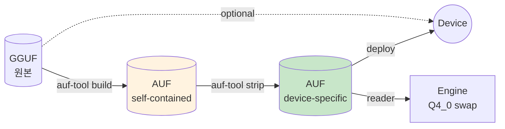

핵심 관계:
- **build 시점**: GGUF 입력 필수. variant 변환(`Q/K permute`, SOA reorder, alignment padding) 모두 수행.
- **deploy 시점**: AUF 단일 파일만 디바이스로 전송. GGUF는 워크스테이션에 잔류.
- **runtime**: Engine은 AUF만 mmap. `source_hash`는 정보성 메타데이터로 보존되지만 GGUF가 부재해도 정상 동작 (INV-132).

### 1.3 v0.1 범위와 비범위

**범위**:
- 256B 헤더 + 가변 section table + payload sections.
- Magic `"ARGUS_W\0"` + 3-tier 버저닝 (semver + capability flags + section table 확장점).
- 6개 section tag: META / TOKENIZER / TENSOR_INDEX / WEIGHTS_ADRENO_SOA / WEIGHTS_CUDA_AOS / WEIGHTS_CPU_AOS.
- Hybrid `source_hash` (size + mtime + head/tail 8MB sha256).
- Reader / Writer / Stripper 알고리즘. Repacker는 Phase 5.

**비범위 (v0.x로 미룸)**:
- zstd 압축 section (`SECTION_COMPRESSED` flag bit 2 reserved).
- Image2d_t precomputed payload (Phase 4 디바이스 실측 후 결정).
- Unigram tokenizer (`tokenizer_kind = 1`).
- Cross-asset bundling (LoRA delta, fine-tune snapshot 등) — Mode C.
- 자동 strip / 자동 cache 정책 — 사용자 피드백 후 v0.2에서 결정.

---

## 2. 핵심 컴포넌트

### 2.1 AufHeader

**역할**: 파일 식별자, 포맷 버전, source 메타데이터, section table 위치를 256B 고정 영역에 보관.

**책임**:
- Magic 검증 (`"ARGUS_W\0"`).
- format_major/minor/patch 노출 (semver 진화 정책).
- capability_required/optional 노출 (capability flag 진화 정책).
- section_table_offset / payload_start_offset 노출.

**진화 정책**:

| 변경 유형 | 처리 | 예 |
|-----------|------|-----|
| 새 section tag 추가 (additive) | format_minor 증가, 기존 reader는 무시 | v0.1 → v0.2: `WEIGHTS_INTEL_AVX512` 추가 |
| 새 capability flag bit | format_minor 증가, 의미에 따라 required/optional 분류 | v0.1 → v0.2: bit 0 = `SOURCE_HASH_FULL_SHA256` |
| 헤더 필드 의미 변경 | format_major 증가 (breaking) | v0.x → v1.0: `_reserved` 영역의 일부를 신규 필드로 사용 |
| Magic 변경 | 새 포맷 (별도 tool로 처리) | 발생하지 않을 것 (영구 reserved) |

**불변 필드**: 한번 v1.0 stable 선언 이후에는 다음 필드의 byte offset이 변경되지 않는다.
- `magic`, `format_major`, `format_minor`, `format_patch`, `capability_required`, `capability_optional`, `section_count`, `section_table_offset`, `payload_start_offset`.

**가변 영역**: `_reserved [120B]`은 v0.x 기간 동안 자유롭게 사용 가능하지만, v1.0 이후의 변경은 format_major bump 필요.

**인터페이스 (개념)**:

```rust
pub struct AufHeader {
    pub magic: [u8; 8],
    pub format_major: u16,
    pub format_minor: u16,
    pub format_patch: u16,
    pub created_by: [u8; 32],
    pub source_hash: [u8; 32],
    pub source_size: u64,
    pub source_mtime: u64,
    pub capability_required: u64,
    pub capability_optional: u64,
    pub section_count: u32,
    pub section_table_offset: u64,
    pub payload_start_offset: u64,
    // private padding
}

impl AufHeader {
    /// pre: bytes.len() >= 256.
    /// post: magic이 "ARGUS_W\0"가 아니면 Err. _pad/_reserved 무시.
    /// INV-132: format_major > READER_MAX → Err.
    pub fn parse(bytes: &[u8]) -> Result<Self, AufError>;

    pub fn serialize(&self) -> [u8; 256];

    /// post: 알려진 capability bit만 set. 모르는 비트 set 시 Err.
    /// INV-132 매핑.
    pub fn validate_capabilities(&self) -> Result<(), AufError>;
}
```

### 2.2 SectionTable

**역할**: 파일 내 section의 위치/크기/속성을 보관. ELF의 section header table과 유사한 확장 지점.

**책임**:
- 각 section의 `tag`, `offset`, `size`, `flags`, `version` 보관.
- Reader에 lookup API 제공 (tag 기반 검색).
- INV-134 무결성 검증 (overlap 금지, file_size 내, tag unique).

**인터페이스**:

```rust
pub struct SectionEntry {
    pub tag: [u8; 16],          // UTF-8 ASCII, NUL-padded
    pub offset: u64,
    pub size: u64,
    pub flags: u32,             // SECTION_REQUIRED | SECTION_STRIPPABLE | SECTION_COMPRESSED | ...
    pub version: u32,
    // private reserved [u8; 8]
}

pub struct SectionTable {
    entries: Vec<SectionEntry>,
}

impl SectionTable {
    pub fn parse(bytes: &[u8], count: u32) -> Result<Self, AufError>;
    pub fn serialize(&self) -> Vec<u8>;

    /// post: tag 일치하는 entry 반환. NUL trimming 후 비교.
    pub fn find(&self, tag: &str) -> Option<&SectionEntry>;

    /// pre: file_size 인자 = 실제 파일 크기.
    /// INV-134: offset + size <= file_size, no overlap, unique tag.
    pub fn validate(&self, file_size: u64, payload_start: u64) -> Result<(), AufError>;
}
```

**카탈로그 (v0.1)**:

| Tag | required | strippable | 내용 요약 |
|-----|----------|------------|----------|
| META | yes | no | architecture, dims, RoPE config (JSON-in-binary) |
| TOKENIZER | yes | no | vocab + BPE merges + special tokens + chat template |
| TENSOR_INDEX | yes | no | layer → tensor 메타데이터 매핑 |
| WEIGHTS_ADRENO_SOA | no | yes | Adreno SOA: q_buf + d_buf + q_img alignment |
| WEIGHTS_CUDA_AOS | no | yes | CUDA AOS: 18B block + 128B align |
| WEIGHTS_CPU_AOS | no | yes | CPU AOS: 18B block + 64B align |

### 2.3 AufReader

**역할**: AUF 파일을 mmap하고, 자기 backend variant 한정으로 lazy access를 제공.

**책임**:
- `path` + `backend_tag` 입력 → `AufView` 출력.
- mmap-first: payload는 byte slice로만 노출 (zero-copy 의도). META/TOKENIZER만 즉시 파싱.
- INV-132/133/134 검증 — 모두 reader 진입 시 1회 수행.
- 에러 메시지에 진단 정보 + 권장 조치 (INV-132).

**처리 흐름**:

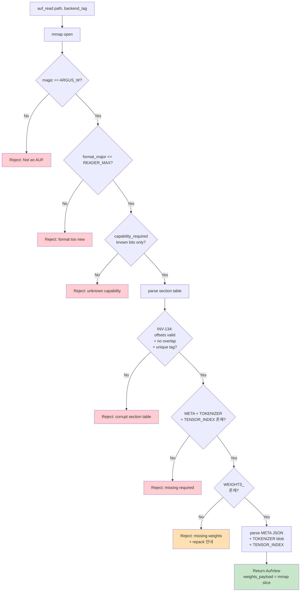

**인터페이스**:

```rust
pub struct AufView<'a> {
    pub header: AufHeader,
    pub sections: SectionTable,
    pub meta: ModelMeta,                // META JSON 파싱 결과
    pub tokenizer: Tokenizer,           // TOKENIZER blob 파싱 결과
    pub tensor_index: TensorIndex,      // TENSOR_INDEX 파싱 결과
    pub weights_payload: &'a [u8],      // backend variant section의 byte slice
    _mmap: Mmap,                        // lifetime 유지용
}

pub fn auf_read(path: &Path, backend_tag: BackendTag) -> Result<AufView, AufError>;
```

**예외 처리** (모든 케이스 panic 없이 `Err` 반환):

| 케이스 | Err variant | 메시지 |
|--------|-------------|--------|
| 파일 < 256 B | `AufError::Truncated` | "AUF file too small (header < 256 B)" |
| Magic 불일치 | `AufError::NotAuf` | "Not an AUF file (magic mismatch)" |
| format_major > READER_MAX | `AufError::FormatTooNew { found, max }` | "AUF format_major=2 but reader supports up to 1. Update llm_rs2." |
| Unknown required capability | `AufError::UnknownCapability { bits }` | "AUF requires capability bit 5 (zstd compression) but reader does not support it" |
| Section overlap | `AufError::SectionOverlap { tag_a, tag_b }` | "Sections X and Y overlap" |
| Section out of file | `AufError::SectionOutOfBounds { tag }` | "Section X exceeds file size" |
| Required section 누락 | `AufError::RequiredMissing { tag }` | "META section missing — file is not a valid AUF" |
| 자기 backend WEIGHTS_* 누락 | `AufError::WeightsMissing { tag, repack_hint }` | "WEIGHTS_ADRENO_SOA missing. Run 'auf-tool repack ...'" |

### 2.4 AufWriter

**역할**: GGUF 입력 → variant 변환 → AUF 파일 atomic write.

**책임**:
- GGUF metadata + tokenizer + 모든 layer tensor를 읽음.
- 요청된 variants(`--variants WEIGHTS_ADRENO_SOA WEIGHTS_CUDA_AOS WEIGHTS_CPU_AOS`)별로 weight payload 변환:
  - `WEIGHTS_ADRENO_SOA`: Q/K permute → SOA 분리 → q_img alignment.
  - `WEIGHTS_CUDA_AOS`: Q/K permute → 128B align padding.
  - `WEIGHTS_CPU_AOS`: Q/K permute → 64B align padding.
- META JSON + TOKENIZER blob + TENSOR_INDEX 직렬화.
- Section layout 결정 (cursor 기반 단조 진행, 64KB align for `WEIGHTS_*`).
- Header finalize → 단일 파일 atomic write (`tempfile + rename`).

**처리 흐름**:

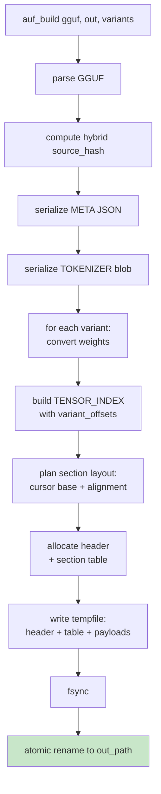

**인터페이스**:

```rust
pub struct VariantTag(pub &'static str);   // "WEIGHTS_ADRENO_SOA" 등

pub struct AufBuildOptions {
    pub variants: Vec<VariantTag>,
    pub created_by: String,                // 보통 "llm_rs2 v{CARGO_PKG_VERSION}"
    pub source_path: PathBuf,
    pub output_path: PathBuf,
}

/// pre: source_path는 valid GGUF.
/// pre: variants는 비어있지 않음.
/// post: output_path에 valid AUF 생성. atomic rename. partial state 외부 노출 금지 (ENG-ALG-C11).
/// post: source_hash는 hybrid (size + mtime + head/tail 8MB sha256).
pub fn auf_build(opts: &AufBuildOptions) -> Result<(), AufError>;
```

**Variant 변환 모듈**: backend-specific. 코드 위치는 implementation 단계에서 결정 (예: `engine/src/auf/variant_adreno_soa.rs`). 각 변환 함수는 GGUF의 layer tensor → variant payload byte vector를 생성하며, 같은 입력에 대해 deterministic을 보장해야 한다 (실험 재현성, source_hash 의미 유지).

### 2.5 AufStripper

**역할**: 기존 AUF에서 일부 strippable section을 제거하여 새 AUF를 만든다 (in-place atomic replace).

**책임**:
- `--keep <tags>` 또는 `--remove <tags>` 입력 받음.
- `SECTION_REQUIRED` 비트 set인 section은 절대 제거 거부.
- `SECTION_STRIPPABLE` 비트 set이 아닌 section은 제거 거부.
- 유지할 section만으로 새 AUF 파일 build (writer 경로 재사용 + source_hash/created_by 보존).
- 기본 백업 생성 (`<name>.auf.bak`), `--no-backup`으로 비활성화.
- atomic rename으로 in-place 교체.

**처리 흐름**:

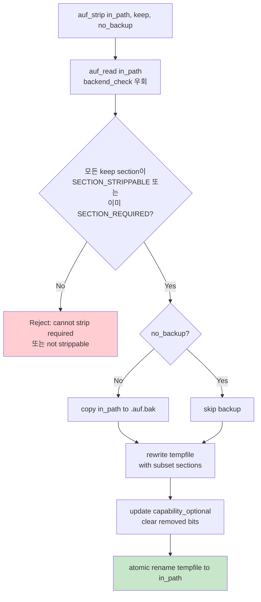

**인터페이스**:

```rust
pub struct AufStripOptions {
    pub keep_tags: Vec<String>,
    pub no_backup: bool,
}

/// pre: in_path는 valid AUF.
/// pre: keep_tags의 모든 tag는 SECTION_STRIPPABLE이거나 SECTION_REQUIRED 중 하나.
/// post: in_path가 새 AUF로 교체됨. atomic rename. source_hash 보존 (향후 repack 가능).
/// post: capability_optional에서 제거된 variant bit 클리어.
pub fn auf_strip(in_path: &Path, opts: &AufStripOptions) -> Result<(), AufError>;
```

**중요 — Strip은 truncation이 아니다**:

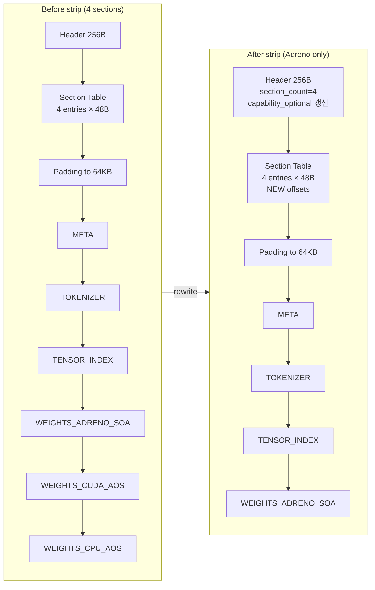

단순히 file end를 truncate하면 section table에는 여전히 6 entries가 있고, 마지막 두 entries의 offset은 file_size를 넘어가게 되어 INV-134 위반. 따라서 **반드시 rewrite**.

### 2.5b lm_head Q4_0 사전 변환 (v0.1.1, Sprint G-1)

**역할**: AUF build 시점에 GGUF의 F16 lm_head를 Q4_0으로 사전 변환하여 backend variant section에 동봉. Engine load 시점 ~1.4 s runtime quantize 비용 제거.

**설계 결정 근거 (Sprint G-1-A)**:

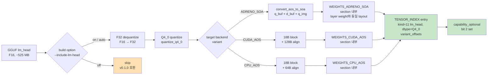

**핵심 결정**:

1. **Section type 신설하지 않음**. lm_head Q4_0 payload는 기존 `WEIGHTS_<backend>` section 내부에 layer weight와 동일한 layout으로 동봉. 근거: lm_head는 transformer.rs `prepare_noshuffle_buffers()`(line 914-917)에서 layer weight와 **동일한 SOA 변환 함수**를 호출하므로 layout이 layer weight와 byte-level 동일하다. 별도 section type을 두면 strip / capability / reader switch logic이 두 배로 복잡해진다.

2. **TENSOR_INDEX entry 재사용**. spec ENG-DAT-096.8에 이미 `kind = 11(lm_head)` enum이 정의되어 있다. 이 entry의 `dtype = Q4_0`, `shape = [vocab_size, hidden_dim]`(GGUF 원본 그대로), `variant_offsets[i]`가 backend variant section 내부의 lm_head payload offset을 가리킨다. cross-layer tensor의 `layer_idx = u32::MAX` 규칙은 그대로 적용.

3. **SOA 변환 적용**: target backend가 `WEIGHTS_ADRENO_SOA`인 경우 lm_head Q4_0도 SOA layout (`q_buf` + `d_buf` 분리, `q_img` 정렬 hint)으로 사전 변환. `WEIGHTS_CUDA_AOS` / `WEIGHTS_CPU_AOS`는 AOS 18B block + alignment padding. layer weight와 동일한 variant convert 함수 재사용.

4. **capability_optional bit 2 = `LM_HEAD_PRECOMPUTED_Q4_0`** 신설. reader는 bit 미인식 시 ignore (`capability_optional`의 의미상). 후방 호환 보장.

5. **source_hash 재사용**. lm_head 단일 tensor 별도 hash 없음. AUF 헤더의 hybrid `source_hash`(GGUF 전체)가 일치하면 lm_head Q4_0 payload도 신뢰. v0.1 채택 결정에서 이미 hybrid hash가 부분 변조에 약함을 인지했고(spec §3.22.6 근거), lm_head는 GGUF tail 8 MB에 거의 항상 포함됨.

**인터페이스 (개념)**:

```rust
// AUF reader (Sprint G-1-C 산출)
pub struct AufView<'a> {
    // 기존 필드들...
    pub lm_head_precomputed_q4_0: bool,   // capability_optional bit 2 검사 결과
}

impl<'a> AufView<'a> {
    /// post: capability_optional bit 2 = 1이고 TENSOR_INDEX에 kind=lm_head + dtype=Q4_0
    /// entry가 존재하면 backend variant section 내부의 byte slice 반환.
    /// 그 외(bit 0 또는 entry 미존재)는 None — caller는 runtime quantize fallback.
    pub fn lm_head_q4_0_payload(&self) -> Option<LmHeadPayload<'a>>;
}

pub struct LmHeadPayload<'a> {
    pub shape: [u64; 2],          // [vocab_size, hidden_dim]
    pub alignment: u64,
    pub bytes: &'a [u8],          // backend variant에 따라 SOA 또는 AOS 직렬화
    pub variant_tag: VariantTag,  // 호출자가 SOA vs AOS 분기에 사용
}
```

**model load 분기 (transformer.rs Sprint G-1-D 산출)**:

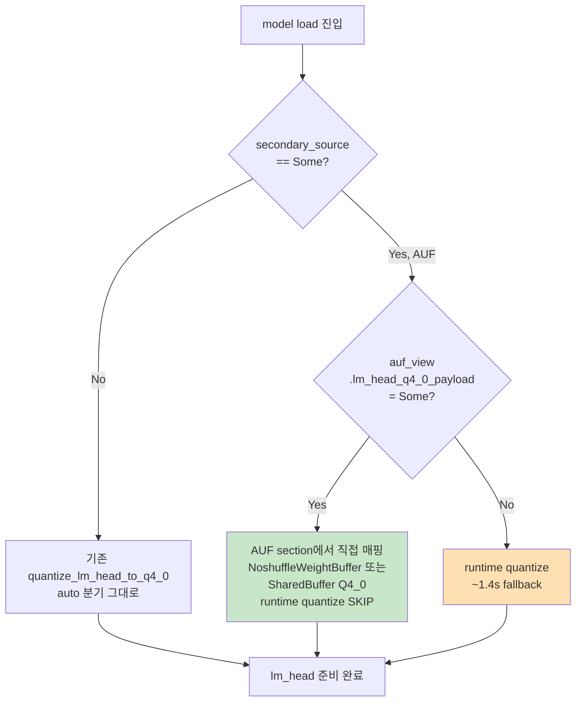

**예외 처리 / fallback**:

| 케이스 | 동작 |
|--------|------|
| AUF에 capability bit 2 = 0 | runtime quantize fallback (Sprint F 동작 그대로) |
| AUF에 bit 2 = 1이지만 `kind=lm_head` entry shape이 model config와 불일치 | reject + 명시 에러. AUF가 다른 model용. |
| AUF에 bit 2 = 1이지만 `dtype != Q4_0` | reject + 명시 에러. capability bit 의미 위반. |
| `--quantize-lm-head q4_0` 강제 (debug) | AUF entry 무시 + runtime quantize 강제 (회귀 비교용) |
| `--quantize-lm-head none` | AUF entry도 사용하지 않고 lm_head F16 유지 |

**결정성 요구사항 (ENG-DAT-096.13)**:

- 동일 GGUF + 동일 build option + 동일 host → byte-level 동일 AUF 출력.
- `quantize_q4_0`은 round-half-to-even로 결정성 보장.
- SOA 변환은 host 환경에서 deterministic kernel(reference CPU 또는 host OpenCL)로 수행. 디바이스간 portability는 v0.1.x 범위 외이며 v1.0 conformance에서 별도 검증.

**메모리/디스크 영향 (Llama 3.2 1B 기준)**:

- F16 lm_head 보관 시 (v0.1.0): 525 MB (per backend variant).
- Q4_0 lm_head 보관 시 (v0.1.1): 148 MB (per backend variant).
- 디스크 절감: 377 MB / variant. 3-variant build 시 ~1.1 GB 절감.
- model load 시간 절감: ~1.4 s (Galaxy S25 실측, Sprint F).

### 2.6 auf-tool CLI

**역할**: AUF 자산을 만들고 검사하고 수정하는 사용자 인터페이스.

**위치 결정 (Architect 권고)**: `engine/src/bin/auf_tool.rs`로 배치하여 cargo workspace 단순성 유지. 별도 crate로 분리하면 GGUF parser, OpenCL convert_aos_to_soa 등 engine 내부 함수에 의존하기 위해 pub API 노출이 추가로 필요하며, 이는 engine crate의 표면적을 늘린다. binary 격리 필요성은 v1.0 이후 재평가.

**서브커맨드**:

| 명령 | 동작 | Phase 3.7 필수 |
|------|------|---------------|
| `auf-tool build --input <gguf> --output <auf> --variants <list>` | GGUF → AUF 빌드. variants 예: `WEIGHTS_ADRENO_SOA WEIGHTS_CUDA_AOS WEIGHTS_CPU_AOS` 또는 `all` | yes |
| `auf-tool info <auf>` | header, sections, sizes, capability flags 출력 | yes |
| `auf-tool strip --keep <tags> [--no-backup] <auf>` | 지정 section만 남기고 나머지 strip. atomic rename. | yes |
| `auf-tool verify [--source <gguf>] <auf>` | 무결성 검증 (INV-132/133/134). `--source` 제공 시 source_hash 일치도 비교 | yes (선택적) |
| `auf-tool repack --input <stripped> --source <gguf> --add <tag> --output <out>` | stripped AUF에 누락된 variant section 재생성 추가 | **Phase 5로 미룸** |

**예시 사용 시나리오** (`docs/auf_tool_guide.md`에 상세):

```sh
# 1) 워크스테이션에서 모든 variants 포함 build
auf-tool build --input model.gguf --output model.auf --variants all

# 2) Galaxy S25용 strip
auf-tool strip --keep META TOKENIZER TENSOR_INDEX WEIGHTS_ADRENO_SOA model.auf

# 3) 디바이스로 전송
adb push model.auf /data/local/tmp/

# 4) Engine에서 사용
generate --secondary-source /data/local/tmp/model.auf ...
```

---

## 3. 운영 시나리오

### 3.1 워크스테이션 빌드 → 배포 워크플로우

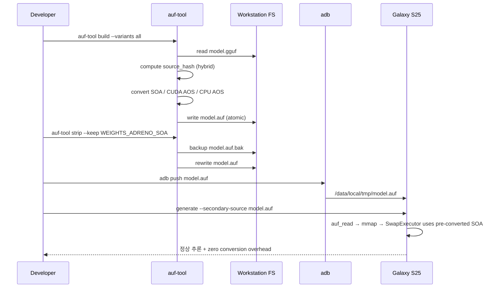

### 3.2 모바일 배포 시 strip 효과

Llama 3.2 1B Q4_0 기준 대략적 크기 (실측 예상):

| 구성 | 파일 크기 |
|------|----------|
| GGUF 원본 (Q4_0) | ~700 MB |
| AUF (all variants) | ~2.1 GB (3 variants × ~700 MB + meta overhead) |
| AUF (Adreno only after strip) | ~700 MB + meta + 64KB align |
| AUF (CPU only after strip) | ~700 MB + meta + 64KB align |

배포 시점에는 strip된 AUF만 디바이스로 전송하므로 전송량은 GGUF와 거의 동일. variant 변환 비용(SOA reorder, alignment)은 워크스테이션에서 1회 수행.

### 3.3 HF Hub 스타일 (미래 v0.x)

향후 HF Hub 같은 모델 호스팅 사이트에서 multi-variant AUF를 직접 공개할 수 있다. 사용자는 디바이스에 맞는 strip된 변종을 다운받거나, full multi-variant AUF를 받은 뒤 로컬 strip한다. v0.1 spec 자체는 이 시나리오를 막지 않으나, 명시적 지원 도구는 v1.0 이후 추가.

---

## 4. 진화 Roadmap

### 4.1 v0.1 (현재)

- 본 spec.
- 6개 section tag.
- Mode B 단일.
- Hybrid source_hash.
- Reader/Writer/Stripper 구현. Repacker는 Phase 5로 미룸.

### 4.2 v0.x 실험적 기간

`format_major = 0`. forward/backward compat 보장 안 함. 이 기간 동안 가능한 변경:

- 새 section tag 추가 (예: `WEIGHTS_INTEL_AVX512`, `WEIGHTS_QNN_HTP`).
- Capability flag bit 추가 (예: bit 0 = `SOURCE_HASH_FULL_SHA256`, bit 1 = `ZSTD_COMPRESSION`).
- TENSOR_INDEX schema 확장 (예: per-tensor quantization params 보존).
- TOKENIZER blob의 unigram 지원 (`tokenizer_kind = 1`).

### 4.3 v1.0 stable 선언 조건

1. **Phase 4 디바이스 실측 통과**: Galaxy S25에서 INV-122 (logit NMSE ≤ 0.01, top-5 overlap ≥ 0.9, top-1 match ≥ 0.95) 통과.
2. **Multi-variant 검증**: 최소 1개 추가 디바이스 변종(예: CUDA AOS Jetson 또는 Intel CPU AVX2)이 추가되어 multi-variant 시나리오가 cross-device로 동작 검증됨.
3. **Tool stable**: `auf-tool` CLI가 인터페이스 변경 없이 사용된 기간 ≥ 4주.

### 4.4 v1.0 이후 호환성 규칙

| 변경 유형 | 허용 | 절차 |
|-----------|------|------|
| 새 section tag (additive) | yes | format_minor++. 기존 reader는 무시. |
| 새 capability_optional bit | yes | format_minor++. 기존 reader는 무시. |
| 새 capability_required bit | yes (조건부) | format_minor++. 기존 reader는 reject (의도된 동작). |
| 헤더 reserved → 신규 필드 | yes | format_minor++. additive 의미 유지. |
| 헤더 필드 의미 변경 | no | format_major++. migration tool 제공 의무. |
| Magic 변경 | no | 별도 포맷으로 처리 (사실상 발생 안 함). |

### 4.5 미래 capability 후보

| 후보 | 용도 | bit position 권고 |
|------|------|-------------------|
| `SOURCE_HASH_FULL_SHA256` | source_hash가 hybrid 대신 full SHA256 | optional bit 0 |
| `ZSTD_COMPRESSION` | section payload zstd 압축 | required bit 0 |
| `IMAGE2D_PRECOMPUTED` | Adreno q_img가 device-specific texture format으로 사전 인코딩 | optional bit 1 |
| `LM_HEAD_PRECOMPUTED_Q4_0` | lm_head 사전 Q4_0 양자화 (v0.1.1, **할당 완료**) | optional bit 2 |
| `LORA_DELTAS` | section tag `LORA_<name>` 도입, multi-asset bundle | required bit 1 (Mode C) |
| `UNIGRAM_TOKENIZER` | TOKENIZER가 SentencePiece unigram 지원 | optional bit 3 (구 권고 bit 2에서 변경) |

---

## 5. 다이어그램 모음

### 5.1 Multi-variant AUF 파일 layout

```mermaid
flowchart TB
    subgraph FILE["model.auf (multi-variant, post-build)"]
        H["[0..256) Header<br/>magic ARGUS_W<br/>format=v0.1<br/>section_count=6<br/>section_table_offset=256<br/>payload_start_offset=65536"]
        T["[256..544) SectionTable<br/>6 entries × 48B"]
        P0["[544..65536) Padding<br/>0x00 fill"]
        S1["META<br/>JSON (~2 KiB)<br/>required, not strippable"]
        S2["TOKENIZER<br/>~6 MiB BPE blob<br/>required, not strippable"]
        S3["TENSOR_INDEX<br/>~64 KiB tensor metadata<br/>kind=11 lm_head entry 포함<br/>required, not strippable"]
        S4["WEIGHTS_ADRENO_SOA<br/>~700 MiB<br/>strippable<br/>q_buf + d_buf + image2d hint<br/>+ lm_head Q4_0 SOA (v0.1.1)"]
        S5["WEIGHTS_CUDA_AOS<br/>~700 MiB<br/>strippable<br/>18B block + 128B align<br/>+ lm_head Q4_0 AOS (v0.1.1)"]
        S6["WEIGHTS_CPU_AOS<br/>~700 MiB<br/>strippable<br/>18B block + 64B align<br/>+ lm_head Q4_0 AOS (v0.1.1)"]
        H --> T --> P0 --> S1 --> S2 --> S3 --> S4 --> S5 --> S6
    end

    style S4 fill:#c8e6c9
    style S5 fill:#bbdefb
    style S6 fill:#ffe0b2
```

### 5.2 Strip 전후 비교

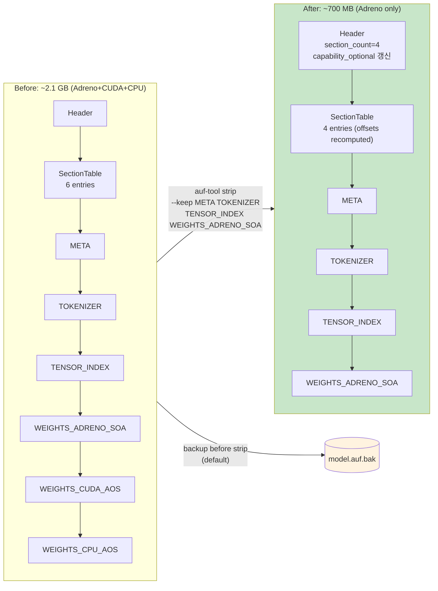

### 5.3 Reader / Writer dataflow

```mermaid
flowchart TB
    subgraph WRITE["Write path (auf-tool build)"]
        GGUF[(GGUF)]
        GGUF --> Parse[parse GGUF]
        Parse --> META_W[META JSON]
        Parse --> TOK_W[TOKENIZER blob]
        Parse --> Layers[layer tensors]
        Layers --> Adreno_W[Adreno SOA<br/>convert]
        Layers --> Cuda_W[CUDA AOS<br/>permute + align]
        Layers --> Cpu_W[CPU AOS<br/>permute + align]
        Adreno_W --> TIDX_W[TENSOR_INDEX<br/>build]
        Cuda_W --> TIDX_W
        Cpu_W --> TIDX_W
        META_W --> Layout[plan section layout<br/>cursor + 64KB align]
        TOK_W --> Layout
        TIDX_W --> Layout
        Adreno_W --> Layout
        Cuda_W --> Layout
        Cpu_W --> Layout
        Layout --> Write[write tempfile<br/>+ atomic rename]
        Write --> AUF_W[(model.auf)]
    end

    subgraph READ["Read path (Engine init)"]
        AUF_R[(model.auf)]
        AUF_R --> Mmap[mmap]
        Mmap --> Header_R[parse header<br/>INV-132 verify]
        Header_R --> Table[parse section table<br/>INV-134 verify]
        Table --> Required[locate META + TOKENIZER<br/>+ TENSOR_INDEX<br/>+ WEIGHTS_<backend><br/>INV-133 verify]
        Required --> Meta_R[parse META JSON]
        Required --> Tok_R[parse TOKENIZER]
        Required --> Tidx_R[parse TENSOR_INDEX]
        Required --> Weights_R[zero-copy slice<br/>weights_payload]
        Meta_R --> View[AufView]
        Tok_R --> View
        Tidx_R --> View
        Weights_R --> View
        View --> Engine[Engine: SwapExecutor<br/>+ noshuffle SOA register]
    end

    style AUF_W fill:#c8e6c9
    style View fill:#c8e6c9
```

---

## 6. 코드-스펙 차이 (Phase 3.7 진입 시점)

본 시점에는 코드가 아직 작성되지 않았다 (Architect 단계). 다음은 implementation 단계에서 발생할 수 있는 차이 후보의 사전 예측이며, 실제 차이 발견 시 본 §6에 추가한다.

| 예상 차이 | 사유 | 처리 방향 |
|-----------|------|----------|
| Variant 변환 함수가 GGUF parser와 강결합 | 기존 GGUF loader 재사용 효율 | engine crate 내 모듈로 배치, auf-tool은 동일 crate의 binary로 |
| Reader/Writer trait 추상화 부재 | v0.1은 단일 포맷이라 trait 불필요 | v0.2에서 trait 검토 (zstd reader 등 추가 시) |
| Section payload alignment 64KB가 작은 모델(<100MB)에서 비효율 | 헤더 패딩만 ~63KB | 작은 모델은 4KB align fallback (v0.2 capability) — v0.1은 64KB 일괄 |

---

## 7. Config / CLI

### 7.1 `auf-tool` CLI 플래그

```
auf-tool build
    --input <PATH>          GGUF 입력
    --output <PATH>         AUF 출력
    --variants <list>       "all" 또는 comma-separated (예: WEIGHTS_ADRENO_SOA,WEIGHTS_CPU_AOS)
    [--created-by <STR>]    custom created_by (기본: "llm_rs2 v{CARGO_PKG_VERSION}")
    [--include-lm-head <on|off|auto>]   lm_head Q4_0 사전 변환 (v0.1.1, default: auto)
                                        auto: GGUF lm_head dtype != Q4_0이면 quantize
                                        on:   강제 quantize (이미 Q4_0이면 no-op)
                                        off:  skip (v0.1.0 호환 출력, capability bit 2 = 0)

auf-tool info <PATH>        헤더 + section 목록 + capability flags 출력

auf-tool strip <PATH>
    --keep <list>           유지할 section tag (comma-separated)
    [--no-backup]           기본은 .auf.bak 자동 생성

auf-tool verify <PATH>
    [--source <GGUF>]       제공 시 source_hash 일치도 검증

auf-tool repack             [Phase 5로 미룸. v0.1에서는 미구현]
    --input <STRIPPED>
    --source <GGUF>
    --add <list>
    --output <PATH>
```

### 7.2 Engine CLI 통합

기존 `--secondary-source <PATH>` 플래그가 GGUF 또는 AUF 둘 다 받도록 확장:

- 확장자 `.gguf` → 기존 GGUF loader.
- 확장자 `.auf` → AUF reader (본 spec).
- 그 외 → 에러.

이 분기는 implementation 단계에서 결정. 본 spec/arch는 reader 인터페이스만 명시.

---

## 8. 교차 참조

| 항목 | 위치 |
|------|------|
| 포맷 정의 (binary layout) | `spec/33-engine-data.md` §3.22 (ENG-DAT-096) |
| Reader/Writer/Stripper 알고리즘 | `spec/32-engine-algorithms.md` §3.12.17 (ENG-ALG-223) |
| Adreno SOA 재변환 (3.7a) | `spec/32-engine-algorithms.md` §3.12.16 (ENG-ALG-222), `arch/weight_swap.md` |
| Phase 3.6 SOA registry coherence | `spec/32-engine-algorithms.md` §3.12.15 (ENG-ALG-221), `arch/weight_swap.md` |
| 무결성 불변식 | `spec/41-invariants.md` §3.16 (INV-131~134) |
| CLI 사용 가이드 | `docs/auf_tool_guide.md` |
| 버전별 변경 이력 | `docs/auf_format_changelog.md` |
| Phase 3.7 TODO | `.agent/todos/feat_weight_swap.md` |
