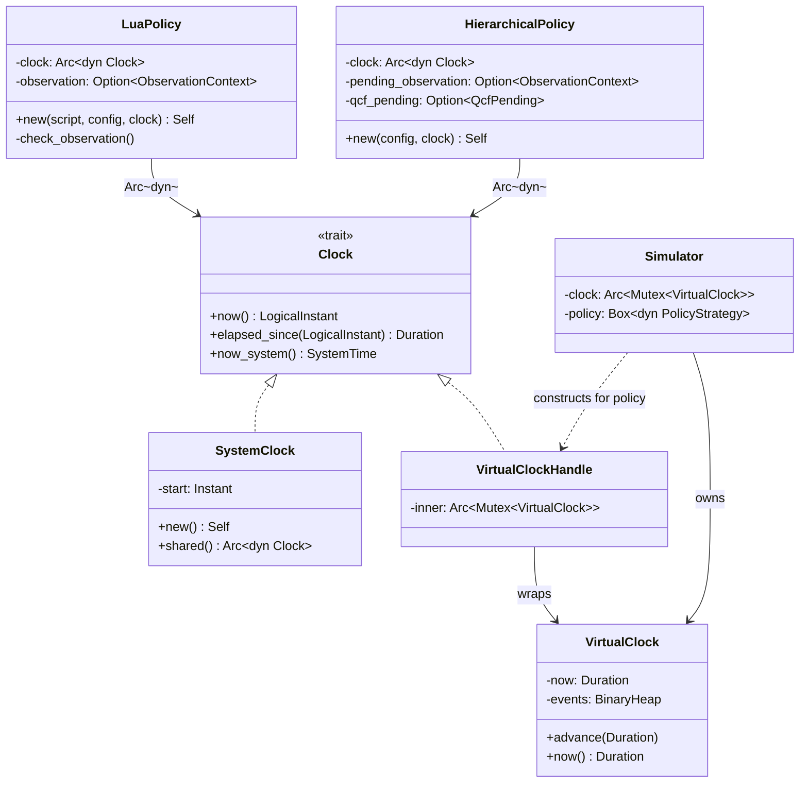

# Clock Abstraction for Deterministic Time (Testability Refactor)

> **상태**: Draft v1
> **작성**: 2026-04-14
> **대상 크레이트**: `manager/` (1차), `shared/` (신규 trait 배치 후보)
> **배경**: Phase 5 시나리오 테스트 `manager/tests/sim/test_scenarios.rs`의 relief_snapshot이 비어 있거나 한 액션에 치우치는 현상을 조사한 결과, `EwmaReliefTable` 학습이 wall-clock에 묶여 `VirtualClock`으로 60초를 전진해도 발생하지 않음을 확인.
> **원칙**: SOLID(DIP) — 구체 `std::time::Instant` 의존을 trait 추상화로 대체. Production은 실 시계, 테스트는 가상 시계.

---

## 1. 배경과 문제

### 1.1 관측된 문제

`manager/src/lua_policy.rs`의 `EwmaReliefTable` 학습은 다음 조건에서만 발생한다:

```
observe() 호출 ← check_observation() ← observation.timestamp.elapsed() ≥ 3.0s
```

여기서 `elapsed()`는 `std::time::Instant`의 실제 wall-clock 경과이다. 시뮬레이터(`manager/tests/common/sim/`)는 `VirtualClock`으로 "가상 시간"을 60초까지 전진시키지만, 실제 벽시계는 harness 실행 전체가 ~100 ms 안에 끝난다. 그 결과:

1. ObservationContext가 생성되어도 `elapsed() < 3.0`이어서 `check_observation()`이 학습을 건너뜀
2. 시뮬레이터의 `ObservationDue` 이벤트가 발화해도 Policy 내부 wall-clock이 움직이지 않아 무의미
3. `relief_snapshot()`이 공허하거나 첫 관측값만 그대로 남음 (EWMA 갱신 0회)

같은 문제가 `manager/src/pipeline.rs`의 `HierarchicalPolicy`(cfg=hierarchical)에서도 발생한다: `ObservationContext.applied_at.elapsed()` 및 `QcfPending.requested_at.elapsed()`가 모두 wall-clock 기반.

### 1.2 해결 방향

`Clock` trait을 도입하여 "현재 시각"의 결정권을 외부에서 주입하도록 한다. 구체 타입에 대한 의존을 제거하면:

- 시뮬레이터는 `VirtualClock`을 주입하여 `advance(Δt)`로 학습을 결정론적으로 재현
- 단위 테스트는 Mock clock으로 모서리 시간(정확히 3.0s, 2.999s 등)을 즉시 재현
- Production은 `SystemClock`이 그대로 `std::time::Instant::now()` 호출

---

## 2. 조사 결과 — 시간 의존 지점 전수

`manager/src/`와 `shared/src/` 트리의 모든 시간 의존 지점. 태그: **주입 필요** / **테스트 무관** / **애매**.

### 2.1 LuaPolicy (`manager/src/lua_policy.rs`) — 주입 필요

| 라인 | 용도 | Clock 주입 시 역할 |
|------|------|--------------------|
| 563 | `obs.timestamp.elapsed() < OBSERVATION_DELAY_SECS` (check_observation) | `now - timestamp` 비교 |
| 674 | `Instant::now()` → ObservationContext 생성 시각 | `clock.now()` |
| 975 | `sys.foreground_fps` FpsState 초기화 시각 | `clock.now()` |
| 1023 | FpsState 초기화 (첫 호출) | `clock.now()` |
| 1028 | FpsState dt 계산 | `clock.now()` |
| 1029 | `now.duration_since(state.prev_time).as_secs_f32()` | `clock.elapsed_since(prev)` |

**핵심**: 563/674는 ReliefTable 학습의 시간 게이팅. 975/1023/1028/1029는 Lua 노출 sys helper로, Lua 스크립트 입장에선 OS dumpsys 의존이라 host/device 구분이 다르다. 1차 리팩토링에선 563/674만 주입하고, FPS helper는 별도 단계로 미룬다(테스트 무관).

### 2.2 HierarchicalPolicy (`manager/src/pipeline.rs`) — 주입 필요

| 라인 | 용도 | Clock 주입 시 역할 |
|------|------|--------------------|
| 226 | `elapsed_dt()` — 도메인별 실측 dt 계산 | `clock.now()` + `last_signal_time` |
| 230 | `now.duration_since(prev).as_secs_f32()` | `clock.elapsed_since(prev)` |
| 284 | `ctx.applied_at.elapsed().as_secs_f32() > OBSERVATION_DELAY_SECS` | `clock.elapsed_since(applied_at)` |
| 380 | ObservationContext `applied_at` 기록 | `clock.now()` |
| 436 | QcfPending `requested_at` (Critical 전환) | `clock.now()` |
| 457 | QcfPending `requested_at` (default QCF 경로) | `clock.now()` |
| 593 | `p.requested_at.elapsed() >= QCF_TIMEOUT` | `clock.elapsed_since(requested_at)` |

### 2.3 SupervisoryLayer (`manager/src/supervisory.rs`) — 이미 부분 주입, 일관화 필요

`evaluate_at(pressure, now: Instant)`가 이미 시간을 파라미터로 받고, `evaluate()`는 `Instant::now()`를 내부에서 호출하는 얇은 래퍼다. `Clock` trait 도입 후에는 `evaluate()`를 `evaluate(clock)` 또는 `evaluate()`(내부 `&self.clock`)로 정리한다. `stable_since: Option<Instant>` 필드는 opaque `Instant`이므로 아래 §4.2의 "LogicalInstant" 전략이 필요.

### 2.4 Channel / Emitter — 애매 (유지 권장)

| 위치 | 용도 |
|------|------|
| `channel/unix_socket.rs:95,107` | `wait_for_client` 타임아웃 루프 |
| `channel/unix_socket.rs:110,386,451,473,501` | 재연결 backoff `thread::sleep` |
| `channel/tcp.rs:87,99,102,376,434,453,465,484` | 동일 |
| `emitter/unix_socket.rs:40,53,56` | 재연결 타임아웃 |

이들은 **실제 I/O**와 묶여 있어 가상 시간으로 대체할 수 없다. 시뮬레이터는 in-memory mock transport(`MockPolicy`)를 쓰므로 이 경로를 타지 않는다. **1차 범위에서 제외**.

### 2.5 Monitor (`manager/src/monitor/*.rs`) — 애매 (유지)

`memory.rs:122`, `compute.rs:150`, `thermal.rs:187`, `energy.rs:167`, `external.rs:114/151/244`의 `std::thread::sleep(self.poll_interval)`은 polling cadence이다. 시뮬레이터는 Monitor를 우회하고 `VirtualClock::schedule_periodic`으로 signal을 주입한다. **1차 범위에서 제외**.

### 2.6 Mock 바이너리 (`bin/mock_*.rs`) — 테스트 무관

`mock_engine.rs:373/374/398`, `mock_manager.rs:471/473/520/521/547/570/601/724`는 mock 실행파일의 타이밍으로, real process간 IPC 테스트에서만 동작한다. **1차 범위에서 제외**.

### 2.7 Spec 테스트 (`tests/spec/test_inv_032_033.rs`, `test_mgr_050_054.rs`) — 애매

이 테스트들은 현재 `Instant::now()`를 로컬에서 생성해 policy 내부로 전달(via 래퍼 함수)하거나 policy가 내부에서 쓰도록 맡긴다. Clock 주입 시 **테스트 바디는 `MockClock`으로 교체**하면 결정론 향상. 1차 마이그레이션에서 동시 갱신.

### 2.8 `shared/` — 없음

`grep` 결과 0건. Clock trait을 `shared/`에 둘지 `manager/`에 둘지는 설계 선택 사항(§4.3).

---

## 3. 설계 옵션 비교

### 3.1 옵션 매트릭스

| 옵션 | 주입 방식 | 오버헤드 | dyn-safe | 호출부 침습 | 테스트 난이도 |
|------|----------|---------|---------|------------|------------|
| **A** | `struct LuaPolicy<C: Clock>` (generic) | Zero-cost | 문제 발생 (제네릭) | 전염(`Box<dyn PolicyStrategy>` 파괴) | 중 |
| **B** | `Arc<dyn Clock + Send + Sync>` 필드 | v-table 1회/호출 (ns) | 유지 | Policy `::new()` 시그니처만 변경 | 낮음 |
| **C** | Thread-local 전역 Clock | 거의 zero | 유지 | 없음 | 낮지만 **병렬 테스트 경쟁** |
| **D** | Trait 메서드 파라미터 (`process_signal(&mut, sig, clock)`) | Zero-cost | 유지 | `PolicyStrategy` 시그니처 전반 변경 | 중 |

### 3.2 분석

**옵션 A (monomorphic generic)** — 성능은 최상이지만 `pub trait PolicyStrategy: Send`를 그대로 유지한 상태에서 구현체가 generic이 되면 `Box<dyn PolicyStrategy>` 객체 생성 지점마다 clock 타입을 결정해야 한다. main.rs와 mock_manager의 정책 초기화 코드가 다음처럼 바뀐다:

```rust
let policy: Box<dyn PolicyStrategy> = Box::new(LuaPolicy::<SystemClock>::new(...));
```

테스트 하네스 `Box<dyn PolicyStrategy>`는 "clock 타입이 지워진" 형태이므로 결국 내부 clock 객체를 `Box<dyn Clock>` 또는 유사 추상화로 저장해야 한다 → 옵션 B와 실질 동일해지며, generic의 이점은 사라진다. 또한 `cfg(feature="hierarchical")` 하의 두 번째 구현체 `HierarchicalPolicy` 에도 동일 generic bound 전파 필요. **탈락**.

**옵션 C (thread-local/global)** — `SystemClock::set_global_for_testing()` 방식은 호출부 수정 0건. 단 cargo test는 기본 병렬 실행이며, 동일 프로세스 내 두 테스트가 서로 다른 VirtualClock을 세팅하면 경쟁. `--test-threads=1`로 강제하면 CI 시간 비대. 전역 mutable state는 SOLID(DIP)에도 위배. **탈락**.

**옵션 D (매 호출 파라미터)** — Zero-cost, dyn-safe, 호출부는 `policy.process_signal(&sig, &clock)`만 추가. 단점은 `PolicyStrategy` 인터페이스 전체가 `&dyn Clock`을 요구하게 되어 `process_signal`/`complete_qcf_selection`/`check_qcf_timeout`/`update_observation`(내부) 모두 파라미터 추가. 또한 `LuaPolicy`는 Lua 스크립트가 `sys.*` helper 호출 시 VM 내부에서 시간을 참조할 수도 있어(FPS state) 매 호출 시 clock을 전달하려면 Lua closure 캡처를 재구성해야 한다. 마이그레이션 PR 수가 많아지지만 원칙적으로 가장 깨끗.

**옵션 B (Arc<dyn Clock> 필드 주입)** — 균형점. 오버헤드는 실측 기준 ns 단위(매 tick 호출 50ms 주기 기준 노이즈). `Send + Sync` 바운드 추가가 PolicyStrategy의 현재 `Send`만 바운드와 충돌하지 않음(Arc<dyn Clock + Send + Sync>는 struct 필드로 있을 뿐이라 PolicyStrategy 자체는 Sync일 필요 없음 — 단, 구현체 struct는 Sync 트레이트 선언과 무관하게 Arc를 보유 가능). 호출부는 생성자 시그니처만 변경:

```rust
LuaPolicy::new(script, config, clock)   // clock: Arc<dyn Clock>
HierarchicalPolicy::new(config, clock)
```

### 3.3 권장안: **옵션 B**

근거:
1. `Box<dyn PolicyStrategy>`를 보존 — 시뮬레이터/main/mock 모두 기존 구조 그대로
2. 생성자만 갱신 → 마이그레이션 범위가 `LuaPolicy::new` 호출 지점 ~20개(테스트 포함)에 국한
3. 성능 오버헤드 무시 가능 (아래 §6.8에서 수치화)
4. Lua closure는 Arc<Clock>을 clone해서 캡처하면 됨
5. SOLID-DIP 충족: 구체 `Instant::now()` 의존 → 추상 trait 의존

---

## 4. `Clock` trait 시그니처 초안

### 4.1 핵심 API

```rust
// manager/src/clock.rs (또는 shared/src/clock.rs — §4.3 참조)

use std::time::{Duration, Instant, SystemTime};

/// 시스템 시계의 최소 추상. 단조증가(monotonic)가 기본 계약.
///
/// # 불변식
/// - `now()` 반환값은 동일 `Clock` 인스턴스에서 단조 비감소한다 (INV-Clock-01).
/// - `elapsed_since(t)` = `now().duration_since_or_zero(t)` 와 동치 (INV-Clock-02).
/// - `now_system()`은 Unix epoch 기준 wall-clock. 단조 보장 없음 (NTP 조정 가능).
pub trait Clock: Send + Sync {
    /// 단조 시각. 비교/차이 연산에만 사용.
    fn now(&self) -> LogicalInstant;

    /// earlier 이후 경과 시간. earlier가 미래면 Duration::ZERO 반환 (saturating).
    fn elapsed_since(&self, earlier: LogicalInstant) -> Duration {
        self.now().saturating_duration_since(earlier)
    }

    /// Wall-clock 시각 (로깅/파일 timestamp 등 외부 관찰용).
    /// 단조 보장 없음. 기본 구현은 `SystemTime::now()`.
    fn now_system(&self) -> SystemTime {
        SystemTime::now()
    }
}
```

### 4.2 `LogicalInstant` 신규 타입 — opaque Instant 해법

`std::time::Instant`는 opaque 내부 표현이라 Virtual/System 두 구현체가 "같은 Instant 값"을 만들 수 없다. 두 방안:

**방안 A**: `LogicalInstant` newtype, 내부는 `Duration` (프로세스 시작 이후 경과).

```rust
#[derive(Copy, Clone, Debug, PartialEq, Eq, PartialOrd, Ord)]
pub struct LogicalInstant(Duration);

impl LogicalInstant {
    pub const ZERO: Self = Self(Duration::ZERO);
    pub fn saturating_duration_since(self, earlier: Self) -> Duration {
        self.0.checked_sub(earlier.0).unwrap_or(Duration::ZERO)
    }
    pub fn checked_add(self, d: Duration) -> Option<Self> { ... }
}
```

`SystemClock`은 `start: Instant`를 보관하고 `now() = LogicalInstant(Instant::now() - start)`.
`VirtualClock`은 누적 `now: Duration`을 바로 래핑.

**장점**: 두 구현체가 동일 타입을 반환 → 타입 레벨 호환.
**단점**: 기존 필드(`timestamp: Instant`, `applied_at: Instant`, `stable_since: Option<Instant>`, `last_signal_time: HashMap<_, Instant>`)를 전부 `LogicalInstant`로 교체.

**방안 B**: `Clock::elapsed_since(&Self::Token)` 같은 associated type. `SystemClock::Token = Instant`, `VirtualClock::Token = Duration`. Dyn-safe 유지 위해 `type Token`을 associated type으로 두면 dyn object 불가 → 옵션 B(Arc<dyn Clock>) 무력화. **탈락**.

**권장**: 방안 A. newtype 변경 범위는 "기존 Instant 필드 6개 + `elapsed`/`duration_since` 호출부 ~15개"로 유한하고 명확. `LogicalInstant`와 `Duration`만으로 모든 상대시간 계산 가능.

### 4.3 배치 위치

| 후보 | 장점 | 단점 |
|------|------|------|
| `manager/src/clock.rs` | 현재 1차 범위가 manager crate로 국한 | 향후 engine/shared에서 필요 시 재이동 |
| `shared/src/clock.rs` | 두 crate 공유, IPC 메시지의 timestamp도 통합 가능 | 지금은 shared가 얇고, 동기화 예산 늘어남 |

**권장**: 1차는 `manager/src/clock.rs`. shared로의 승격은 향후 engine 쪽에서 동일 요구 발생 시(예: Heartbeat에 SystemTime 기록)에 검토. `arch/40-cross-cutting.md`의 "타이밍 상수 테이블"에 trait 위치를 기입.

### 4.4 Production 구현체

```rust
pub struct SystemClock {
    start: Instant,
}

impl SystemClock {
    pub fn new() -> Self { Self { start: Instant::now() } }
    pub fn shared() -> Arc<dyn Clock> { Arc::new(Self::new()) }
}

impl Clock for SystemClock {
    fn now(&self) -> LogicalInstant {
        LogicalInstant(Instant::now().duration_since(self.start))
    }
    // elapsed_since, now_system: 기본 구현 사용
}
```

### 4.5 Virtual 구현체 — 기존 `VirtualClock` 어댑터

기존 `manager/tests/common/sim/clock.rs::VirtualClock`은 이벤트 큐 + `now: Duration`을 보유한 "시뮬레이터 특화" 타입이다. 두 가지 선택:

**선택 1 (권장)**: 기존 `VirtualClock`에 `impl Clock` 추가. 단 `Clock::now()`는 `&self`를 받는데 `VirtualClock`은 `advance(&mut self)`로 시각을 바꾼다 → 내부 `Cell<Duration>` 또는 `Mutex<Duration>`으로 interior mutability 도입, 혹은 **어댑터 분리**.

**선택 2**: `ClockHandle(Arc<Mutex<VirtualClock>>)` 래퍼가 `Clock` trait을 구현. 시뮬레이터 본체는 VirtualClock을 직접 잡고, Policy에는 `ClockHandle::clone()`을 넘긴다.

```rust
pub struct VirtualClockHandle(Arc<Mutex<VirtualClock>>);

impl Clock for VirtualClockHandle {
    fn now(&self) -> LogicalInstant {
        LogicalInstant(self.0.lock().unwrap().now())
    }
}
```

**권장**: 선택 2. SRP 준수 — VirtualClock은 이벤트 큐/시각 저장소, `VirtualClockHandle`은 `Clock` trait 구현 및 접근 동기화. Mutex는 시뮬레이터가 단일 스레드로 실행되므로 실질 비용 0.

---

## 5. `PolicyStrategy` / `HierarchicalPolicy` 영향

### 5.1 Trait 자체는 변경 없음

`PolicyStrategy` 인터페이스는 그대로 유지 (옵션 B 선택의 귀결). 각 구현체가 자신의 Clock을 내부 필드로 보관한다.

### 5.2 LuaPolicy 변경

```rust
pub struct LuaPolicy {
    lua: Lua,
    engine_state: Option<EngineStatus>,
    signal_state: SignalState,
    trigger_engine: TriggerEngine,
    relief_table: EwmaReliefTable,
    observation: Option<ObservationContext>,
    adaptation_config: AdaptationConfig,
    clock: Arc<dyn Clock>,                    // ← 신규
}

impl LuaPolicy {
    pub fn new(
        script_path: &str,
        config: AdaptationConfig,
        clock: Arc<dyn Clock>,                 // ← 신규 파라미터
    ) -> anyhow::Result<Self> { ... }
}

struct ObservationContext {
    action: String,
    before: Pressure6D,
    timestamp: LogicalInstant,                 // ← Instant → LogicalInstant
}
```

`check_observation`은 `self.clock.elapsed_since(obs.timestamp).as_secs_f64() < OBSERVATION_DELAY_SECS` 형태.

FPS helper의 `FpsState`는 1차 범위 밖(OS dumpsys 기반이라 테스트 무관). 필드만 `LogicalInstant`로 교체 + `clock.clone()`을 closure에 캡처하거나 **별도 Clock을 쓰지 않고 기존 Instant를 유지** (2차 결정).

### 5.3 HierarchicalPolicy 변경

```rust
pub struct HierarchicalPolicy {
    // ... 기존 필드
    clock: Arc<dyn Clock>,                     // ← 신규
    last_signal_time: HashMap<&'static str, LogicalInstant>,
    pending_observation: Option<ObservationContext>,  // applied_at: LogicalInstant
    qcf_pending: Option<QcfPending>,                  // requested_at: LogicalInstant
}

impl HierarchicalPolicy {
    pub fn new(config: &PolicyConfig, clock: Arc<dyn Clock>) -> Self { ... }
}
```

`elapsed_dt`, `update_observation`, `check_qcf_timeout` 모두 `self.clock.now()` / `self.clock.elapsed_since()`로 대체.

### 5.4 SupervisoryLayer 변경

`stable_since: Option<Instant>` → `Option<LogicalInstant>`. `evaluate_at(..., now: Instant)` 시그니처는 `(..., now: LogicalInstant)`로 변경. 공개 `evaluate()`는 `self.clock.now()`를 쓰도록 clock을 주입받거나, HierarchicalPolicy가 래핑해서 항상 `evaluate_at`으로 호출하도록 한다(현재도 사실상 이 구조이므로 **SupervisoryLayer는 clock을 보유하지 않고 always evaluate_at** 권장).

### 5.5 호출부 수정 범위

| 파일 | 수정 유형 | 건수 |
|------|----------|------|
| `manager/src/main.rs` | `Arc<SystemClock>` 생성 후 Policy::new에 전달 | 2곳 (lua/hier 분기) |
| `manager/src/bin/mock_manager.rs` | 필요 시 SystemClock 주입 | 0~1곳 |
| `manager/src/lua_policy.rs` 내부 테스트 | `LuaPolicy::new(..., SystemClock::shared())` | ~20곳 |
| `manager/tests/sim/*.rs` | VirtualClockHandle 주입 | 4곳 |
| `manager/tests/sim/test_harness.rs` | Harness가 VirtualClockHandle 보유, Policy 주입 | 1곳 구조 변경 |
| `manager/tests/spec/test_*.rs` | SystemClock::shared() 또는 mock clock 주입 | ~15곳 |

생성자 시그니처 1줄 추가이므로 대부분 mechanical.

---

## 6. 리스크 목록 및 완화

우선순위 순으로 정렬 (High → Low).

### 리스크 1. `Instant` opaqueness — **High**

**문제**: 기존 필드(`timestamp: Instant` 등)를 `LogicalInstant`로 교체해야 함. 직렬화 이슈(§6.6)와 결합.

**완화**:
- `LogicalInstant` newtype은 Copy+Clone+Ord+serde_skip. 기존 `Instant`의 모든 용법(`elapsed`, `duration_since`)을 `clock.elapsed_since(t)`로 매핑하는 helper 제공.
- 단계적 적용: LuaPolicy 먼저 전환 → 통과 확인 → HierarchicalPolicy → Supervisory.
- `LogicalInstant::from_system_instant(Instant, base: Instant) -> Self` helper로 기존 Instant 잔재 처리.

### 리스크 2. `Send + Sync` 바운드 파급 — **High**

**문제**: `Arc<dyn Clock + Send + Sync>`를 struct 필드로 가지면 struct auto-derive가 `!Sync`가 되는 경우는 없으나, `PolicyStrategy`가 `Send`만 요구하는 현재 상태에서 `Box<dyn PolicyStrategy>`에 Sync bound가 필요한 호출자가 생기면 컴파일 실패.

**완화**:
- `Clock: Send + Sync`로 선언. `Arc<dyn Clock>`은 자동으로 `Send + Sync`.
- struct 내부에 `Arc<dyn Clock>`만 추가하면 Send는 유지 (Arc는 Send if T: Send+Sync). 기존 `PolicyStrategy: Send`와 호환.
- 컴파일 단계에서 `cargo check --all-features`로 조기 검증.

### 리스크 3. `dyn-safe` 유지 — **Medium**

**문제**: `Clock`에 generic 메서드나 associated type 도입 시 dyn object 불가.

**완화**:
- 모든 메서드를 `&self -> concrete`로만 유지. Associated type 없음.
- 기본 구현에서 `Self: Sized` 요구 금지.
- CI에 `let _: Arc<dyn Clock> = Arc::new(SystemClock::new());` 스모크 테스트 1개 포함.

### 리스크 4. 기존 spec 테스트 파급 — **Medium**

**문제**: `tests/spec/test_inv_032_033.rs`(3곳) 및 `test_mgr_050_054.rs`(2곳)에서 `Instant::now()` 직접 사용. 기타 `LuaPolicy::new()` 호출 ~20곳.

**완화**:
- helper `test_clock()` 제공하여 테스트 본문에선 `test_clock()`만 호출.
- `test_spec/helpers.rs`(또는 해당 파일)에 `pub fn default_clock() -> Arc<dyn Clock> { SystemClock::shared() }` 추가.
- 한 번의 PR에서 전수 갱신 + `cargo test --workspace --all-features` 통과.

### 리스크 5. main.rs / mock_manager.rs 초기화 — **Low**

**문제**: production 바이너리에서 Policy 생성 지점이 `cfg(feature="lua")` / `cfg(feature="hierarchical")` 분기.

**완화**:
- main.rs 상단에서 `let clock = SystemClock::shared();` 한 번 생성, 두 분기 모두 재사용.
- mock_manager는 Policy를 생성하지 않으므로 무관.

### 리스크 6. ObservationContext 직렬화 — **Low**

**문제**: `EwmaReliefTable::save()` JSON이 `Instant`를 포함하면 깨짐.

**검증**: 현행 코드 확인 결과 `EwmaReliefTable.save()`는 `entries: HashMap<String, ReliefEntry>`만 직렬화하며 `ReliefEntry`는 `relief: [f32; 6] + observation_count: u32`로 Instant 미포함. **실질 영향 없음** — `ObservationContext`는 in-memory only.

**완화**: 회귀 방지 테스트로 `save → load → equal` assertion 1개 유지.

### 리스크 7. Monitor / channel의 wall-clock 잔존 — **Low**

**문제**: §2.4/2.5에서 1차 범위 제외된 `channel/` `monitor/`가 여전히 `Instant::now()` / `thread::sleep` 사용. 시뮬레이터는 이 경로를 타지 않지만, 장기적으로 일관성 흠결.

**완화**:
- 1차 PR 완료 후 후속 이슈로 분리 생성.
- `arch/40-cross-cutting.md` 타이밍 테이블에 "Clock 주입 적용 범위"를 표기.

### 리스크 8. 성능 오버헤드 — **Low**

**분석**:
- `Arc<dyn Clock>::now()`는 v-table lookup 1회 + atomic ref-count 변경 없음(clone이 아닌 호출).
- 단일 `now()` 호출 실측 ~5-15 ns (x86/ARM).
- HierarchicalPolicy 1 tick 당 최대 호출: PI update 3회 + observation 1회 + qcf 1회 ≈ 5회 → ~75 ns/tick.
- 기본 tick 50 ms 대비 0.00015% → **무시 가능**.

**완화**: 필요 시 hot-path에서 `clock.now()` 결과를 tick 시작 시 한 번만 읽고 재사용.

### 리스크 9. Lua closure 내부 시간 참조 — **Medium**

**문제**: `sys.foreground_fps`가 Rust side에서 `Instant::now()`를 closure로 캡처. Clock 주입 시 `Arc<dyn Clock>`을 clone하여 Lua closure로 이동해야 함.

**완화**:
- `sys.foreground_fps`는 OS dumpsys에 의존하므로 시뮬레이터 테스트 범위 밖.
- 1차에서는 **FPS helper의 Instant 유지**, ReliefTable 학습 경로만 전환.
- Lua closure에 clock이 필요해지면 `let clock = self.clock.clone(); lua.create_function(move |_, ...| { clock.now() ... })` 패턴 적용.

### 리스크 10. 동시 작업 중인 spec 테스트 마이그레이션과의 충돌 — **Low**

**문제**: 24개 spec 테스트 마이그레이션과 동시 진행 시 base branch 변경으로 conflict 가능.

**완화**:
- Clock PR을 **먼저 머지**. 이후 spec 테스트 작업이 새 API를 사용.
- 또는 Clock PR에서 기존 API(`LuaPolicy::new(script, config)`)에 deprecated wrapper 제공 → 2-step 마이그레이션.

---

## 7. 마이그레이션 순서 (PR 분할 제안)

### PR 1: `Clock` trait + `SystemClock` + `LogicalInstant` 도입 (무해)

- 파일: `manager/src/clock.rs` (신규), `manager/src/lib.rs` (re-export).
- 아무도 사용하지 않으므로 기능 변경 없음.
- 단위 테스트: SystemClock monotonic, LogicalInstant arithmetic.
- **호출부 수정 없음**.

### PR 2: `LuaPolicy`에 Clock 주입 (1차 핵심)

- `LuaPolicy` struct에 `clock: Arc<dyn Clock>` 필드 추가.
- `LuaPolicy::new(script, config)` → `LuaPolicy::new(script, config, clock)`.
- `ObservationContext.timestamp: Instant` → `LogicalInstant`.
- `check_observation`, observation 생성 지점 전환.
- 호출부 업데이트: `main.rs`, lua_policy 내부 `#[cfg(test)]` 테스트 20개, `tests/sim/test_harness.rs`, `tests/sim/test_scenarios.rs`, `tests/spec/test_mgr_dat_075_076_*.rs`, `tests/spec/test_mgr_alg_080_083_*.rs`.
- FPS helper는 **이번 PR에서 제외**(기존 Instant 유지).

### PR 3: Simulator `VirtualClockHandle` 어댑터 + 시나리오 재검증

- `manager/tests/common/sim/clock_adapter.rs` 신규: `VirtualClockHandle(Arc<Mutex<VirtualClock>>)`.
- `Simulator` 구조체에서 VirtualClock 보유 방식 변경 → `clock: Arc<Mutex<VirtualClock>>`, `VirtualClockHandle` 공급.
- `Simulator::new(cfg, policy_factory)` 형태로 리팩토링해서 clock 주입 후 policy 생성.
- Phase 5 시나리오 테스트 `test_scenarios.rs` 재실행 → relief_snapshot 비공허 검증.

### PR 4: `HierarchicalPolicy` Clock 주입 (cfg=hierarchical)

- 동일 패턴으로 `applied_at`, `requested_at`, `last_signal_time` 전환.
- Supervisory `stable_since` 전환.
- `tests/spec/test_inv_032_033.rs`, `test_mgr_050_054.rs`, `test_mgr_alg_036_051.rs`, `test_seq_040_064_mgr.rs`, `test_seq_095_098.rs`, `test_mgr_alg_013a_016.rs`, `test_inv_083_085.rs` 업데이트.

### PR 5 (선택): FPS helper + channel/monitor로 확장

- `sys.foreground_fps` FpsState를 Arc<dyn Clock>으로.
- 채널/모니터 `thread::sleep`은 유지 (I/O 결합) — 별도 `Sleeper` trait은 도입하지 않음.

### PR 6 (선택): `arch/40-cross-cutting.md` / `arch/20-manager.md` 문서 갱신

- 타이밍 상수 테이블에 "Clock 주입 여부" 컬럼 추가.
- `20-manager.md` 인터페이스 절의 `::new` 시그니처에 clock 인자 반영.

---

## 8. Spec 업데이트 필요 항목

### 8.1 스펙 변경이 **불필요한** 것

- OBSERVATION_DELAY_SECS = 3.0 값 자체 — 상수 유지, 적용 메커니즘만 구현 세부.
- QCF_TIMEOUT = 1.0 값 자체.
- INV-087/088/089 의미 — Clock 주입과 무관하게 그대로.

### 8.2 스펙 변경이 **필요한** 것

**MGR-030 (Observation Window)**: 기존 문구는 "액션 적용 후 OBSERVATION_DELAY_SECS 관찰 대기". 구현 메커니즘은 arch에 맡기되, 스펙에는 **단조 시계 의존**이라는 의미를 명시할 가치 있음. 추가 문구 초안:

> "시간 판정은 단조(monotonic) 시계에 기반한다. 시스템 시계 조정(NTP)은 observation 판정에 영향을 주지 않는다."

새 INV 후보 — **INV-093 (Clock monotonicity)**:

| ID | 원본 | 내용 | 카테고리 | 검증 |
|----|------|------|---------|------|
| INV-093 | spec/20-manager.md MGR-030, spec/12-protocol-sequences.md SEQ-051 | Observation delay 판정 및 QCF timeout 판정에 사용되는 시계는 단조 비감소(monotonic non-decreasing)여야 한다. 실시간 벽시계 조정은 이 판정에 영향을 줘서는 안 된다. | Correctness | static, test | Clock trait 계약 |

**spec/41-invariants.md §3.7에 INV-093 추가**. `grep -r 'INV-09[3-9]' spec/`으로 충돌 없음 확인 필요 (현재 INV-092까지 사용).

**SEQ-051 (spec/12-protocol-sequences.md:225)**: `OBSERVATION_DELAY_SECS = 3.0초`. 문구 뒤에 "이 기간은 단조 시계로 측정된다 (INV-093)" 추가.

**spec/22-manager-algorithms.md MGR-ALG-061**: `OBSERVATION_DELAY = 3.0 s` 박스. 동일 문구 추가.

### 8.3 arch 문서 업데이트

- `arch/20-manager.md §1 HierarchicalPolicy / §6 LuaPolicy`: `::new` 시그니처에 `clock: Arc<dyn Clock>` 반영.
- `arch/20-manager.md §10.6 ObservationContext`: `timestamp: LogicalInstant` 명시.
- `arch/22-manager-algorithms.md` 타이밍 상수 테이블: "구현 의존: `Clock` trait" 컬럼 추가.
- `arch/40-cross-cutting.md` 타이밍 테이블: Clock 주입 범위 명시.
- `arch/41-invariants.md` 마스터 테이블: INV-093 추가.

---

## 9. 컴포넌트 다이어그램



---

## 10. 검증 계획

### 10.1 단위 테스트 (PR 1과 함께)

- `SystemClock::now()` 단조성 (연속 호출 비감소).
- `LogicalInstant::saturating_duration_since` 경계 (future → ZERO).
- `VirtualClockHandle::now()` = `VirtualClock::now()`.

### 10.2 통합 테스트 (PR 2/3 이후)

- `test_scenarios.rs`의 relief_snapshot이 60s 시뮬 후 비공허 (핵심 회귀 테스트).
- `VirtualClock::advance(4s)` 후 `LuaPolicy::process_signal` 1회 호출 → observation 학습 발생.

### 10.3 스펙 테스트 (spec/tests/spec/)

- INV-093 검증: `SystemClock::now()` 10_000회 호출 후 단조성 assert (static 속성이므로 1회).
- (선택) Mock non-monotonic clock 주입 시 panic 또는 에러 returning (defensive check).

---

## 11. 열린 질문

1. **Clock trait을 `shared/`로 승격**: engine 쪽에서 향후 `EngineStatus`에 `requested_at: SystemTime`을 실어 보낼 때 재사용 가능. 현재는 manager-only로 시작하되, engine의 `kv_cache.rs`/`executor.rs` 프로파일링 훅이 Clock을 원하면 2차에 이동.
2. **`Sleeper` trait**: Monitor의 `thread::sleep(poll_interval)`도 추상화하면 완전한 결정론. 1차 범위 밖. 시뮬레이터가 Monitor를 우회하는 현 구조에선 불필요.
3. **FPS helper**: Clock 전환을 지연할지(위험 9), 즉시 적용할지. 제안: 지연. 분리 PR.

---

## 12. 참고

- 원문 조사: `.agent/` 하 없음 (이 문서가 1차 작성).
- 관련 SOLID 원칙: DIP(Dependency Inversion), ISP(작은 trait으로 분리).
- 관련 패턴: "Seams for testing" (Working Effectively with Legacy Code, M. Feathers).
- 동시 작업: Phase 5 시나리오 테스트 (`manager/tests/sim/test_scenarios.rs`) — Clock 주입 완료 후 relief 검증 재진행.
