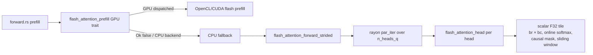
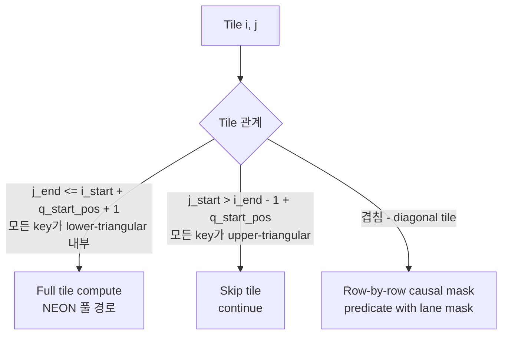

# CPU Flash Attention Prefill — Tile-based QK·V with NEON (Step 3)

> **Status**: Draft — awaiting senior-implementer review
> **Scope**: CPU prefill-path attention (F16/F32/Q4_0 KV, HeadMajor + SeqMajor)
> **작성일**: 2026-04-13
> **전제 단계**: Step 1 (Online Softmax, `89a7afd`) + Step 2 (Flash Decoding, `70a059f`) 완료
> **다음 단계**: Step 3 튜닝 / Q4_0 KV NEON 가속 (별도)

---

## 0. Spec Triage

본 설계는 **기존 prefill flash attention 경로의 내부 구현을 교체**한다. 호출자(`transformer_layer/forward.rs`)가 보는 출력과 spec 수준 불변식은 수학적으로 동등하게 유지된다.

- 새 트레이트/프로토콜 메시지/CLI 플래그 없음
- `Backend::attention_gen`, `Backend::flash_attention_prefill` 시그니처 불변
- `layers::attention::flash_attention_forward_strided` public 시그니처 불변 — 내부 구현만 교체
- KV layout (HeadMajor 우선, SeqMajor도 지원) 전제 불변
- Causal mask semantics 불변; sliding window (Gemma3 local attention) 유지

→ **spec/ 변경 없음**. arch/ 단독 추가 (`arch/cpu_flash_attention_prefill.md`). 실패 시 롤백은 내부 feature flag 또는 `PREFILL_FLASH_THRESHOLD` 극단화로 가능.

---

## 1. 목표와 동기

### 1.1 현재 측정치

**Qwen2.5 1.5B Q4_0, Galaxy S25 / Snapdragon 8 Elite / CPU 6T** (2026-04-13):

| 단계 | 현재 | 목표 (Step 3 후) | 근거 |
|------|------|--------------------|------|
| Prefill 4K (4472 tok) | **11.7 tok/s** (≈400 s) | **≥ 100 tok/s** | llama.cpp pp4096 수준 근접 |
| Decode short ctx | 22.6 tok/s | 회귀 금지 | Step 1/2 범위 |
| Decode 4K | 10.4 tok/s | 회귀 금지 | Step 1/2 범위 |

### 1.2 기존 구현 분석 (매우 중요)

이 설계에서 자주 오해되는 지점: **llm_rs의 prefill은 "naive O(n²)"가 아니다**. `engine/src/layers/attention.rs`에 이미 다음이 존재한다.



**즉 알고리즘적으로는 이미 tile + online softmax 구조**이지만, 실제 병목은 다음 네 가지의 조합이다.

| 병목 | 위치 | 영향 |
|------|------|------|
| **완전 scalar F32** (`for d in 0..head_dim { dot += q[·]*k[·] }`) | `attention.rs:149-154, 191-205` | NEON 미활용 → FMA throughput의 1/4 |
| **br=bc=32 하드코딩** (4K에서 `tc = 128`) | `forward.rs:390-391` | L1/L2 locality 미최적화 |
| **F16 KV 전량 F32 변환** (prefill 진입 전) | `forward.rs:748-824` | `kv_heads × capacity × head_dim × 2B→4B` 임시 버퍼 + O(N) 변환 |
| **head 축 단일 병렬** (`par_iter` over `n_heads_q`) | `attention.rs:313` | Q tile 축 미활용 → long prefill에서 GQA 중복 읽기 |

**수치 감각** (Qwen 4K, per layer):
- 총 FLOPs: `seq_len × seq_len × head_dim × n_heads_q × 2 = 4K × 4K × 128 × 12 × 2 ≈ 50 GFLOP` (attention만)
- Scalar F32 peak ~4 GFLOPS/core (Oryon) → 12.5 s/layer/core → 28 layer / 6 core → 약 10분(!)
- NEON F32 peak ~16 GFLOPS/core (4 lane FMA) → 4배 단축 예상치만으로도 decode보다 작은 숫자

### 1.3 설계 원칙

1. **기존 `flash_attention_forward_strided` 시그니처 불변** — 내부 구현만 NEON tile 경로로 교체.
2. **GQA 중복 KV 읽기 제거**: inner loop에서 `for q_h ∈ GQA group` 하여 한 K tile 로드에 `gqa_ratio`개 Q-head의 dot+FMA 수행.
3. **Q tile 축 병렬화 추가** — `n_heads_q × n_q_tiles` 을 2D SpinPool task grid로 뿌려 long prefill에서 6-core 포화.
4. **F16 KV 제자리 처리**: prefill 진입부의 F16→F32 전환 제거, tile inner loop에서 `fcvtl/fcvtl2`로 per-8-lane 변환.
5. **Step 1/2의 `PartialState` 재사용** — 동일한 online softmax 상태 구조와 `flash_uniform_fallback` 경로 그대로 이용.
6. **Short prefill 회귀 방지**: `seq_len < PREFILL_FLASH_THRESHOLD` 이면 기존 scalar 경로 유지.

---

## 2. 현재 prefill 경로의 문제와 대체 전략

### 2.1 기존 `flash_attention_head` 알고리즘 (참고)

```
# attention.rs:78-221 (pseudocode)
for i in 0..tr:            # Q tile (br=32)
    init (m_i, l_i, o_i) for br queries
    for j in 0..tc:        # K/V tile (bc=32)
        if c_start > max_global_q_in_block: break         # causal skip
        for r in 0..cur_br:
            for c in 0..cur_bc:
                if causal_ok && window_ok:
                    s = Σ_d Q[r,d] · K[c,d] * scale       # scalar F32
                    row_max = max(row_max, s)
            (m_new, l_new) = online_softmax_update(m_prev, row_max, sij)
            for d in 0..head_dim:                         # scalar
                o[r,d] = o[r,d]*alpha + Σ_c p_row[c] * V[c,d]
    normalize: out[i] = o_i / l_i
```

**문제점** (이미 §1.2에서 설명). 본 설계의 핵심은 **이 구조를 유지한 채 내부 loop를 NEON intrinsic으로 교체 + Q-head GQA 공유 + Q tile 축 병렬화**.

### 2.2 "새 함수 추가" vs "naive 대체" 선택

**선택: 새 함수 `flash_prefill_forward_neon`을 `backend/cpu/neon.rs`에 추가하고, `flash_attention_forward_strided` 내부에서 런타임 분기**.

근거:
- `attention.rs`는 portable(host) 경로 유지 — F32 scalar는 unit-test reference 및 x86/WASM 기본값.
- NEON 경로는 `#[cfg(target_arch="aarch64")]` 로 분리해 빌드 환경 독립성 확보.
- Step 2 (decode flash decoding)도 `backend/cpu/neon.rs` 내에서 구현되어 있으므로 코드 locality 일관성.

런타임 분기 지점:

```rust
// layers/attention.rs:flash_attention_forward_strided 내부
#[cfg(target_arch = "aarch64")]
{
    if n_heads_q * q_len >= PREFILL_FLASH_THRESHOLD
        && q.len() >= ... /* dtype/align 체크 */
    {
        return crate::backend::cpu::neon::flash_prefill_forward_neon(...);
    }
}
// Fallback: 기존 scalar rayon 경로
```

---

## 3. 알고리즘 — FlashAttention v2 스타일 Tile 처리

### 3.1 수식 (Step 1/2와 동일한 online softmax)

Q tile `Q_i ∈ R^{br × d}`, K tile `K_j ∈ R^{bc × d}`, V tile `V_j ∈ R^{bc × d}` 에 대해:

```
S_ij = Q_i · K_j^T * scale                           # [br, bc]
rowmax_ij[r] = max_c S_ij[r, c]                      # causal + window mask 후
m_new[r] = max(m_prev[r], rowmax_ij[r])
α[r] = exp(m_prev[r] - m_new[r])
P_ij[r, c] = exp(S_ij[r, c] - m_new[r])              # masked-out은 0
l_new[r] = l_prev[r] * α[r] + Σ_c P_ij[r, c]
O_new[r, d] = O_prev[r, d] * α[r] + Σ_c P_ij[r, c] * V_j[c, d]
m_prev ← m_new; l_prev ← l_new; O_prev ← O_new
```

Tile 순회 종료 후:
```
out[r, d] = O_prev[r, d] / l_prev[r]
```

### 3.2 Causal Mask Tile 분류

Prefill은 causal. Q tile `i`의 global query range `[i_start, i_end)`와 K tile `j`의 global key range `[j_start, j_end)`에 대해 (모두 `q_start_pos` 가산 후):



**3가지 타입 처리**:

| Tile 분류 | 개수 (4K, br=bc=64) | 처리 |
|-----------|---------------------|------|
| Full tile (causal 내부) | ≈ N²/(2·br·bc) = 2048 | NEON inner product + V FMA, mask 없음 |
| Skip tile (causal 외부) | ≈ N²/(2·br·bc) = 2048 | 즉시 continue |
| Diagonal tile (경계) | ≈ N/br = 64 | row별 `lane_mask = (c < global_q - c_start + 1) ? 1 : 0` |

**Sliding window (Gemma3)**: 추가로 `global_c + ws <= global_q` 인 key lane 마스킹. 좌측 경계도 별도 diagonal tile로 분류 (하지만 sliding + causal 교차 영역이 대각선 아래 `ws`만큼의 띠가 되므로 구현상 row predicate로 통합).

### 3.3 NEON Inner Kernel 전략

#### Kernel A — QK^T dot (`compute_S_tile_neon`)

```text
for r in 0..cur_br:           # 4 row 단위 unroll (register pressure OK)
    for c in 0..cur_bc:       # scalar outer, vector over d
        acc_v = vdupq_n_f32(0)
        for d in 0..head_dim step 8:     # F16 KV는 8 lane / F32는 4 lane
            q_lo, q_hi = load_4+4 F32 from Q
            k_raw = vld1q_u16(K ptr)     # F16 KV
            k_lo: fcvtl  -> 4xF32
            k_hi: fcvtl2 -> 4xF32
            acc_v = vfmaq_f32(acc_v, q_lo, k_lo)
            acc_v = vfmaq_f32(acc_v, q_hi, k_hi)
        S[r, c] = vaddvq_f32(acc_v) * scale
```

- `head_dim = 64 (Llama)`: 8 iter → 16 FMA per (r, c) pair
- `head_dim = 128 (Qwen)`: 16 iter → 32 FMA per (r, c) pair

**GQA 공유 최적화**:

실제로는 `r` 루프 안에 `for q_h ∈ GQA group` 루프가 한 층 더 있다 (Step 2의 핵심 패턴). 즉:

```
for c in 0..cur_bc:
    for d step 8: load K[c, d..d+8] once
    for r in 0..cur_br:
        for q_h ∈ group:
            load Q[q_h, r, d..d+8]
            accumulate into S[q_h, r, c]
```

이렇게 하면 한 K lane load 당 `gqa_ratio × cur_br` FMA가 수행되어 DRAM 트래픽이 `gqa_ratio` 배 감소. Qwen(gqa=6) + br=16 → K lane 1개에 96 FMA → compute-bound.

#### Kernel B — Online softmax update + P·V (`apply_and_accumulate_neon`)

```text
# P_row 계산 (scalar exp is fine — cur_bc 작음)
for c in 0..cur_bc:
    if masked: p_row[c] = 0
    else:       p_row[c] = fast_exp(S[r, c] - m_new[r])

# O += P · V with NEON
for d in 0..head_dim step 8:
    o_lo = vld1q_f32(O ptr + d)           # (이전 tile에서 rescale 이미 완료)
    o_hi = vld1q_f32(O ptr + d + 4)
    for c in 0..cur_bc:
        p_v = vdupq_n_f32(p_row[c])
        v_raw = vld1q_u16(V ptr + c*head_dim + d)
        v_lo: fcvtl / v_hi: fcvtl2
        o_lo = vfmaq_f32(o_lo, p_v, v_lo)
        o_hi = vfmaq_f32(o_hi, p_v, v_hi)
    vst1q_f32(O ptr + d, o_lo)
    vst1q_f32(O ptr + d + 4, o_hi)
```

**O rescale**: `O *= α[r]`는 Kernel B 직전 별도 NEON loop. Step 2의 `vmulq_n_f32` 패턴 그대로.

#### exp() 근사

Per-tile당 `br × bc = 64 × 64 = 4K` exp가 필요. **벡터 exp** 구현:

- 옵션 1 (권장): `f32::exp` scalar — br=bc=64에서 4K scalar exp per tile. Oryon의 CORDIC-based exp는 ~20 cycle. Tile당 80K cycle = 10 µs (compute 대비 무시 가능).
- 옵션 2: 4-lane NEON exp 근사 (e.g. Cephes polynomial) — 2~3배 빠르지만 정밀도 검증 추가 필요. **1차 PR 범위 밖**.

### 3.4 NaN / ±∞ 처리

Step 2 `flash_uniform_fallback` 재사용 가능하나, prefill은 per-query-row 단위로 fallback 판정.

```
if m_prev[r].is_infinite() && m_prev[r].is_sign_negative() && l_prev[r] == 0.0 {
    fallback_uniform_row(out[r, :], valid_keys);
}
```

`valid_keys = [0, global_r + q_start_pos]` (causal) 범위에서 V uniform 평균. **정확성 영향 미미** (실제 prompt에서는 NaN이 거의 없음; RoPE/embedding 경로에 방어막 존재).

---

## 4. Tile 크기 및 병렬화

### 4.1 Tile 크기 선택

**Working set 계산** (Qwen head_dim=128, F16 KV):

| br | bc | Q tile (F32) | K tile (F16) | V tile (F16) | S tile (F32) | O tile (F32) | 합계 |
|----|-----|-------------|---------------|---------------|---------------|---------------|------|
| 32 | 32 | 16 KB (gqa 6, 1 head×32×128×4) | 8 KB | 8 KB | 4 KB | 16 KB | 52 KB |
| 64 | 64 | 32 KB | 16 KB | 16 KB | 16 KB | 32 KB | 112 KB |
| 128 | 64 | 64 KB | 16 KB | 16 KB | 32 KB | 64 KB | 192 KB |

Oryon **L1D 64 KB, L2 2 MB (shared)**.

- **br=32, bc=32** (현재 기본값): 단일 head 기준 L1 fit. 하지만 K/V tile이 작아 load overhead 큼.
- **br=64, bc=64** (권장): Single head+GQA 공유 시 112 KB → L1 초과, L2 fit. `bc=64` tile 당 K+V=32 KB 재사용 → GQA group 6 heads × br=64 = 24K FMA.
- **br=128, bc=64**: Q tile이 L1 초과 시작. Long prefill(4K+)에서는 이득 미미.

**권장**: `br=64, bc=64`. `head_dim=64(Llama)`에서는 K/V tile이 절반 → `br=128, bc=64`로 늘려도 L1 여유. **Model별 분기 대신 head_dim 기반**:

```rust
const BR_BC_DEFAULT: (usize, usize) = (64, 64);   // head_dim >= 96
const BR_BC_SMALL_HD: (usize, usize) = (128, 64); // head_dim <= 96
```

**NEON align**:
- `bc`는 8의 배수 (F16 fcvtl lane 단위)
- `head_dim`은 8의 배수 전제 (llama 64, qwen 128 만족)
- `br`는 lane mask 생성의 편의상 4의 배수

### 4.2 Threshold — naive vs flash

`seq_len < PREFILL_FLASH_THRESHOLD` 인 경우 기존 scalar 경로 유지.

**후보**:

| THRESHOLD | seq_len=32 | seq_len=128 | seq_len=512 | seq_len=2048 |
|-----------|-----------|-------------|-------------|--------------|
| 64 | scalar | flash | flash | flash |
| **128** | scalar | scalar | **flash** | **flash** |
| 512 | scalar | scalar | scalar | flash |

권장: **`PREFILL_FLASH_THRESHOLD = 128`**.

근거:
- seq_len < 64에서는 tile 오버헤드(SpinPool dispatch, buffer alloc)가 compute보다 큼.
- seq_len = 128일 때 tile 그리드는 `tr×tc = 2×2` → 4 tile 중 3 full + 1 diagonal → 이미 이득.
- llama.cpp도 pp128부터 flash 경로로 분기 (유사 heuristic).

### 4.3 병렬 축 선택

**Prefill의 작업량** (Qwen 4K, 1 layer):
- 총 tile 수 = `tr × tc × n_heads_q = 64 × 64 × 12 = 49,152` (causal filter 전)
- Full tile = `tr × tc / 2 = 2048` — 병렬도 충분

**옵션**:

| 옵션 | 병렬 축 | n_tasks (4K Qwen) | GQA 공유 | Long seq 적합도 |
|------|---------|---------------------|------------|-----------------|
| A. head only (기존 rayon) | `n_heads_q` | 12 | X (q_h 단위 분리) | 약함 (long seq에 고정) |
| B. Q tile only | `tr × n_heads_kv` | 64 × 2 = 128 | O | 우수 |
| **C. (Q tile × kv_h)** | `tr × n_heads_kv` | 128 | **O** | **우수** |
| D. (Q tile × q_h) | `tr × n_heads_q` | 768 | X | 과도 분할 |

**선택: C (Q tile × kv_h)**. 근거 (Step 2 선택 논리와 동형):

1. 한 task가 `(tile_i, kv_h)`를 받아 **내부에서 `for q_h ∈ GQA group` × `for tile_j`** 루프 → K tile이 L2 residency 유지하는 동안 `gqa_ratio`개 Q-head가 공유.
2. `n_tasks = tr × n_heads_kv = 64 × 2 = 128` (Qwen 4K) / `64 × 8 = 512` (Llama) — 6-core에 충분히 분산, work-stealing 없이도 정적 분배 가능.
3. Short prefill(tr=4)에서도 `4 × 2 = 8 > 6 cores` → 코어 포화. Llama는 `2 × 8 = 16` → 안전.
4. Step 2의 SpinPool + `FlashDecodeCtx` 패턴 그대로 사용 → 코드 재사용 높음.

**비교 — 왜 A (head only, 기존)가 부족한가**:
- n_heads_q=12, 6 cores → 평균 2 head/core. 한 head 내부는 직렬이므로 long prefill에서 2 core 놀는 상태 발생 가능(llama.cpp는 Q tile 축을 추가로 병렬화함).
- GQA group 내 6 Q-heads가 **다른 core에 할당**되어 같은 K를 각자 로드 → DRAM 트래픽 증가.

### 4.4 Task Layout

```mermaid
flowchart TD
    subgraph Prefill["Prefill Dispatch"]
        direction LR
        P1[SpinPool.dispatch<br/>n_tasks = tr * n_heads_kv]
    end
    subgraph Worker["Worker task_id"]
        direction TB
        W1[tile_i = task_id / n_heads_kv<br/>kv_h = task_id % n_heads_kv]
        W1 --> W2[Init O, m, l for br*gqa_ratio queries]
        W2 --> W3[for tile_j in 0..tc]
        W3 --> W4{Causal mask class}
        W4 -->|Full| W5[NEON full tile:<br/>QK, softmax update, PV]
        W4 -->|Diagonal| W6[NEON masked tile:<br/>per-row predicate]
        W4 -->|Skip| W7[continue]
        W5 --> W3
        W6 --> W3
        W7 --> W3
        W3 -->|done| W8[Normalize: O /= l<br/>Write out[tile_i, gqa_group]]
    end
    P1 --> W1
```

### 4.5 Thread Pool 선택

**결정**: **SpinPool 직접 사용** (`engine/src/core/thread_pool.rs`).

근거:
- Step 2와 일관성 (rayon + SpinPool 혼재 시 oversubscription).
- 128 tasks가 정적이므로 work-stealing 불필요.
- Batch mode로 연속 layer 간 worker park 비용 제거 가능 (optional).

---

## 5. Data Layout 및 메모리 접근

### 5.1 KV 접근

HeadMajor 전제 (§1.3):

```
K[kv_h, t, d] offset = kv_h * capacity * head_dim + t * head_dim + d
```

한 tile_j 읽기: `[kv_h * capacity + t_start, kv_h * capacity + t_end)` 연속. `bc=64, head_dim=128, F16` → 16 KB contiguous blob → hardware prefetcher 포착 용이.

**SeqMajor fallback**: 기존 scalar 경로로 divert (§7.2). SeqMajor에서 tile 접근은 stride `n_heads_kv`로 K lane이 분산되어 L1 miss 폭발.

### 5.2 Q 접근

Prefill Q 텐서 레이아웃: `[batch=1, seq_len, n_heads_q * head_dim]` (q_rope 출력).

→ Q의 head stride = `head_dim`, token stride = `n_heads_q * head_dim`.

Tile worker는 `Q[tile_i*br .. (tile_i+1)*br, q_h*head_dim .. (q_h+1)*head_dim]`를 br × head_dim row-major로 접근. Unit-stride 아님 (token stride = `n_heads_q * head_dim`). 개선안:

- **옵션 a**: Q를 tile 진입 시 `[br × head_dim × gqa_ratio]` contiguous scratch로 copy (한 번) — small overhead.
- **옵션 b**: stride 읽기 유지 (prefetcher가 잡아주기를 기대).

**권장**: **옵션 a** (tile scratch copy). 이유:
- br=64, head_dim=128, gqa=6 → 192 KB scratch per tile (stack 불가, heap reuse).
- Per-task 1회 복사 후 tile_j 루프 내 unit-stride 보장 → QK inner loop 속도 극대화.
- Reuse: task 시작 시 이 scratch에 copy, task 내내 재사용.

### 5.3 Partial State / Output 버퍼

한 task당:
- `m[br]`, `l[br]` F32 : 512 byte (br=64)
- `O[br × head_dim]` F32: 32 KB (br=64, head_dim=128) — task 종료 시 `/l` 적용 후 직접 out tensor로 write

**false sharing 방지**: task별 scratch를 `#[repr(align(64))]` 구조체로 감싸거나 64B-aligned 할당. Step 2의 `PartialState` 64B 정렬 패턴 재사용.

**Scratch buffer 할당 전략**:

```
Per-call layout:
  scratch[n_tasks] of {
    Q_tile: [br * gqa_ratio * head_dim] F32,
    m: [br] F32,
    l: [br] F32,
    o_tile: [br * head_dim * gqa_ratio] F32,  // 최종 out으로 write 전
  }
```

총 scratch ≈ `n_tasks × (br × gqa_ratio × head_dim + br + br + br × head_dim × gqa_ratio) × 4B`
→ Qwen 4K: `128 × (64×6×128 + 64 + 64 + 64×128×6) × 4 = 128 × 98,432 × 4 ≈ 50 MB`.

너무 큼 → **task별 할당이 아니라 worker thread-local**. SpinPool worker 수 = `n_cores` 고정. Thread-local scratch:

```
thread_local! {
    static PREFILL_SCRATCH: RefCell<PrefillScratch>;
}
```

`n_cores × 98KB = ~600 KB` — 수용 가능.

대안: Per-layer scratch 재사용 (단일 heap Vec, call 시작에 resize, call 종료 시 유지). `Workspace` 구조체에 `prefill_attn_scratch: Vec<f32>` 필드 추가 고려. `engine/src/layers/workspace.rs` 수정 범위는 senior-impl가 판단.

### 5.4 F16 KV 제자리 사용 (중요)

**현재**: `forward.rs:748-824`에서 전체 F16 KV cache를 F32 벡터로 복사.

**변경**: NEON flash prefill은 F16 원본 포인터를 직접 받아 tile inner loop에서 `fcvtl/fcvtl2` 변환 → 대규모 F32 버퍼 제거.

- 4K Qwen: K+V F16 = 2 × 4K × 2 × 128 × 2B = 4 MB → 제거
- SeqMajor fallback 또는 Q4_0 KV는 기존 변환 경로 유지 (별도 분기)

---

## 6. Numerical Stability

### 6.1 F32 중간값

모든 `(m, l, O)`는 F32. F16 KV는 로드 직후 `fcvtl` F32 변환. Step 1/2와 동일.

### 6.2 Masked-out lane

Causal 또는 window로 마스킹된 lane의 `P_ij[r, c] = 0` 처리. NEON에서는:

- Full tile: mask 없음, 전체 lane 유효.
- Diagonal tile: row별 predicate. 구현은 `S[r, c] = is_masked ? -INF : S_computed` 후 `P = exp(S - m_new)` → masked는 `exp(-INF) = 0`. 추가 branching 불필요.

또는 `p_row[c] = mask ? 0 : exp(...)` 으로 explicit 0 할당. 선호는 후자 (NaN 방지 확실).

### 6.3 Scalar 경로와 bit-exact 여부

**불가능**. tile 순서·FMA 순서 다름. 허용 오차: **NMSE < 1e-4**, top-k logit 일치율 > 99%.

### 6.4 Rescale exp 누적 precision

Prefill tr=64 ⇒ Q tile 1개당 최대 tc=64 tile 반복. `exp(m_prev - m_new)` 곱셈 64번 누적. F32 오차는 충분히 안정.

---

## 7. API / 인터페이스 변경

### 7.1 Backend trait

**변경 없음**. `Backend::attention_gen`과 `Backend::flash_attention_prefill` 시그니처 불변.

### 7.2 `layers::attention::flash_attention_forward_strided`

**시그니처 불변**. 내부 구현에 런타임 분기 추가:

```rust
pub fn flash_attention_forward_strided(
    q: &[f32], k: &[f32], v: &[f32], out: &mut [f32],
    n_heads_q: usize, n_heads_kv: usize,
    q_len: usize, kv_len: usize, head_dim: usize,
    q_stride: usize, k_stride: usize, v_stride: usize, out_stride: usize,
    kv_head_stride: usize,
    q_start_pos: usize, br: usize, bc: usize,
    window_size: Option<usize>,
) {
    #[cfg(target_arch = "aarch64")]
    {
        // F16 KV 경로는 아직 F32로 변환되어 들어오므로 1차 PR은 F32-in-F32 NEON.
        if q_len >= PREFILL_FLASH_THRESHOLD
            && is_head_major_stride_layout(head_dim, kv_head_stride)
            && head_dim.is_multiple_of(8)
            && n_heads_q.is_multiple_of(n_heads_kv)
        {
            crate::backend::cpu::neon::flash_prefill_forward_f32_neon(
                /* same args */
            );
            return;
        }
    }
    flash_attention_forward_strided_scalar(/* existing impl */);
}
```

**주의**:
- 현재 caller가 모두 F32 버퍼를 전달 (`forward.rs`가 F16 KV를 prefill 진입 전 F32로 변환). 1차 PR은 F32-in-F32 NEON만 구현.
- F16 직접 접근은 2차 PR: `flash_attention_forward_strided_f16_neon(…, k_f16: *const u16, v_f16: *const u16)` 새 시그니처를 추가하고 `forward.rs`에서 F16 KV일 때 분기.

### 7.3 `forward.rs` 수정 범위

**1차 PR (F32-in-F32)**: 수정 없음. 기존 F16→F32 변환 → `flash_attention_forward_strided` 호출 유지. 내부에서 NEON 경로로 분기.

**2차 PR (F16 직접)**: `forward.rs:172-321` F16 KV 분기에서 F32 변환을 스킵하고 신규 F16 NEON 함수 호출로 변경. Q4_0 KV는 기존 경로 유지.

### 7.4 `common.rs` / `x86.rs` / `cuda/mod.rs`

**변경 없음**. Non-aarch64는 기존 scalar rayon 경로.

---

## 8. 구현 단계 분해 (senior-implementer 작업 리스트)

각 Stage 1일 이내 독립 빌드/테스트 가능하도록 설계.

### Stage 1: 테스트 하네스 (0.5일)

- `engine/tests/test_attention_flash_prefill.rs` 신규.
- F32 inline reference: `naive_attention_head_f32_ref` (3-pass: QK → softmax → PV, causal + sliding window)를 `#[cfg(test)]` 로컬로 작성.
- 테스트 행렬:
  - `seq_len ∈ {32, 128, 127, 128, 129, 256, 512, 1024, 2048, 4096}`
  - `head_dim ∈ {64, 128}`
  - `(n_heads_q, n_heads_kv) ∈ {(1,1), (2,1), (8,2), (12,2), (32,8)}`
  - Tile boundary: `seq_len = br, br+1, 2*br-1, bc, 2*bc+1`
  - Sliding window: `None, Some(32), Some(128), Some(seq_len)`
  - NaN 주입: `q[rand] = NaN` 한 위치
- 검증: `NMSE(out, ref) < 1e-4`, 각 row별로도 확인.
- **Invariant**: 기존 scalar `flash_attention_forward_strided` 경로도 reference와 NMSE 통과 (baseline 확인).

### Stage 2: Tile geometry + causal mask 분류 유틸 (0.5일)

- `fn classify_tile(tile_i, tile_j, br, bc, q_start_pos, q_len, kv_len, window_size) -> TileClass`
  - `enum TileClass { Full, Diagonal, Skip }`
- `fn diagonal_lane_mask_u32(r, c_start, bc, global_q, window_size) -> u32`
  - bc=64 bit lane mask (u64 or 2×u32)
- Unit test: 모든 causal/window 조합 체커보드 비교 vs scalar reference.

### Stage 3: Scratch 버퍼 + SpinPool Ctx (0.5일)

- `struct PrefillFlashCtx { q_ptr, k_ptr, v_ptr, out_ptr, scratch_ptr, br, bc, ... }`
- Thread-local scratch `PrefillScratch { q_tile: Vec<f32>, m: Vec<f32>, l: Vec<f32>, o_tile: Vec<f32> }`
- `fn flash_prefill_forward_f32_neon(...)` 엔트리: ctx 구성, SpinPool dispatch, join.
- Unit test: `PrefillFlashCtx` round-trip (scratch alloc → dispatch NOP worker → verify no leak).

### Stage 4: NEON QK full tile (1일)

- `fn qk_full_tile_neon(q_tile, k_tile, s_out, br, bc, head_dim, scale, gqa_ratio)`:
  - `for c in 0..bc`: `for r*q_h in 0..br*gqa_ratio`: NEON dot product
  - F32-in-F32: `vfmaq_f32(acc, q_lane, k_lane)`, `vaddvq_f32` for reduction
- Unit test: random Q/K tile → NMSE vs scalar matmul.

### Stage 5: Online softmax + V FMA NEON (1일)

- `fn softmax_pv_tile_neon(s_tile, v_tile, m_state, l_state, o_state, br, bc, head_dim)`:
  - row별 `m_new = max(m_prev, row_max(s))`
  - `alpha = exp(m_prev - m_new)` (scalar per row)
  - `rescale O *= alpha` (NEON vmulq)
  - `p_row[c] = exp(s[r,c] - m_new)` (scalar per c)
  - `O += p_row[c] * V_tile[c, :]` (NEON vfmaq)
  - `l_new = l_prev * alpha + Σ p_row`
- Unit test: single tile vs reference.

### Stage 6: Diagonal tile masked path (0.5일)

- `fn qk_diagonal_tile_neon(..., global_q_start, q_start_pos, window_size)`:
  - 내부에서 `S[r, c] = masked ? -INF : compute` (branchless) 또는 `p_row[c] = masked ? 0 : exp(...)`
- Unit test: `(tile_i, tile_j)` with tile_i == tile_j → 정확성 검증 + sliding window edge.

### Stage 7: Outer loop + SpinPool 병합 (0.5일)

- `unsafe fn prefill_tile_worker(ctx: *const u8, task_id: usize)`:
  - `tile_i = task_id / n_heads_kv; kv_h = task_id % n_heads_kv`
  - Init local state
  - for tile_j: classify → dispatch to full/diag/skip
  - Normalize → write out
- Hookup `flash_prefill_forward_f32_neon` → SpinPool dispatch → join.
- End-to-end 검증: Stage 1 테스트 전체 통과.

### Stage 8: Host 및 디바이스 벤치 (0.5일)

- Host test: `cargo test -p llm_rs2 -- attention_flash_prefill`
- Android 배포 + 4K prefill 측정:
  - 현재: 11.7 tok/s
  - 목표: 100 tok/s (llama.cpp pp4096 ~51 tok/s 이상)
- 회귀 확인: short (20 tok) 프롬프트 prefill 시간.
- 결과를 `.agent/todos/long_context_attention_optimization.md`에 추가.

### Stage 9 (optional, 2차 PR): F16 KV 직접 경로 (1일)

- `flash_attention_forward_strided_f16_neon(...)` 신규 + `forward.rs` F16 분기.
- F16→F32 변환 버퍼 제거 → prefill 진입 latency 감소.

### Stage 10 (optional, 3차 PR): br/bc adaptive 선택 (0.5일)

- Device detection(head_dim, L1 size)으로 br/bc 동적 선택.

---

## 9. 테스트 전략

### 9.1 정확도

| 항목 | 허용치 |
|------|--------|
| NMSE vs F32 reference | `< 1e-4` |
| Top-K (K=5) logit 일치율 | `> 99%` |
| NaN sanitization | 단일 NaN 주입 후 FINITE 출력 보장 |

### 9.2 Performance (Android)

| 지점 | 측정 목표 |
|------|----------|
| Prefill 128 tok (회귀) | `flash scalar` 기준 ± 5% 이내 (또는 개선) |
| Prefill 512 tok | ≥ 1.5× scalar |
| Prefill 2K tok | ≥ 3× scalar |
| Prefill 4K tok | ≥ 5× scalar (11.7 → 60+ tok/s) |
| Prefill 8K tok | ≥ 5× scalar |

### 9.3 회귀 방지

- **Decode 경로**: Step 1/2 테스트(`test_attention_flash_decoding.rs`) 통과 유지.
- **GPU 경로**: `opencl` feature로 빌드 시 GPU flash prefill이 먼저 dispatch되는지 확인 (`forward.rs:137-154, 657-675` 로직 보존).
- **Q4_0 KV**: prefill 진입 전 F32 변환 유지, scalar 경로로 분기 (1차 PR 범위).
- **SeqMajor KV**: scalar 경로 유지.

---

## 10. 리스크 분석

### 10.1 Top 3 리스크

| # | 리스크 | 심각도 | 완화 |
|---|--------|-------|------|
| 1 | **Diagonal tile mask 버그** — causal/window 교차 영역에서 lane mask 오프셋 오류 | 높음 (silent incorrect output) | Stage 6 단위 테스트 강화; `tile_j == tile_i` 전용 고밀도 random seed 반복; sliding window + causal 조합 테스트 행렬 |
| 2 | **Scratch 메모리 overhead** — thread-local 600KB가 layer별 재할당 시 첫 호출 지연 | 중간 | Workspace에 pre-alloc; `Layer::new` 시 1회만 alloc. 또는 `Mutex<Vec<Vec<f32>>>` pool |
| 3 | **Q stride 비연속성** — Q가 `[seq, heads*dim]` 레이아웃이라 per-tile copy 필요, copy 자체가 병목 가능 | 중간 | Stage 4 profiling으로 copy vs inline stride 비교. Copy 1회당 `br × gqa × head_dim × 4B = 192KB`는 DRAM bandwidth 77GB/s에서 2.5µs — 무시 가능 |

### 10.2 기능 회귀

- `flash_attention_forward_strided`는 test_flash_attention_* 등 18개 단위 테스트에 사용 중. 런타임 분기 도입 시 **scalar fallback 정확성 유지** 필수.
- 신규 NEON 함수는 별도 함수로 분리 → 기존 테스트는 scalar 경로를 그대로 가리킴 (분기 조건에 `#[cfg(not(test))]` 또는 `PREFILL_FLASH_THRESHOLD` 극단값).

### 10.3 성능 회귀

- Short prefill (< 128 tok) 에서 NEON 경로가 분기 overhead로 느려질 수 있음 → THRESHOLD = 128 로 억제. 실측에서 회귀 시 256 / 512로 상향.
- 모델 config 비표준(head_dim=96 등)에서 L1 fit가 깨질 수 있음 → `br/bc` adaptive 분기 고려(Stage 10).

### 10.4 호환성

- **CLI 변경 없음**, **spec 변경 없음**, **CUDA/OpenCL 경로 불변**.
- 직렬화 포맷 영향 없음.

---

## 11. Step 2와의 재사용 포인트

| 자산 | Step 2 위치 | Step 3 재사용 |
|------|-------------|-----------------|
| `PartialState` struct | `neon.rs:254` | 그대로 사용 (per-row state) |
| `flash_uniform_fallback` | `neon.rs:323` | per-row fallback으로 확장 (row 단위 uniform) |
| `FlashDecodeCtx` 패턴 | `neon.rs:281` | `PrefillFlashCtx`로 동형 복제 |
| `flash_chunk_worker` outer loop | `neon.rs:903` | `prefill_tile_worker`의 골격 |
| SpinPool dispatch 패턴 | `neon.rs:856-890` | 동일 |
| `bulk_f16_to_f32` NEON | `neon.rs` (`fcvtl/fcvtl2`) | QK/PV inner kernel에서 inline 사용 |
| `fast_exp` 논의 | Step 2 scalar exp 채택 | 동일 (추후 2차 PR에서 벡터화) |

**새로 추가되는 것**:
- Tile 2D grid (Q tile × K tile) — Step 2는 decode (Q=1 token) 전용.
- Causal mask 분류 (diagonal/full/skip) — Decode는 항상 다음 토큰, 자연스럽게 causal OK.
- Per-row state (Step 2는 per-head, 여기선 per-(head, row)).

---

## 12. 미결 이슈 / 후속 작업

- **Q4_0 KV prefill 경로**: 현재 전량 dequant 후 scalar. Step 3에서는 scalar 유지. 3차 PR에서 block 단위 dequant→NEON 고려.
- **F16 KV 직접 경로**: 본 설계의 2차 PR. F32 변환 버퍼 제거 시 prefill 시작 latency 10~20% 추가 단축 기대.
- **br/bc adaptive**: Snapdragon Oryon 외 디바이스(Exynos, Dimensity, Apple) L1/L2 차이 대응.
- **벡터 exp()**: Cephes 또는 Remez 근사로 per-tile exp cost 추가 단축. 정밀도 검증 수반.
- **Merge-aware scores_out**: `scores_out.is_some()` 인 진단 모드는 현재 scalar 경로로 divert. 필요 시 tile별 scratch에 raw S 저장 후 merge 시 softmax 재구성.

---

## 13. 참고 자료

- **FlashAttention 2** (Tri Dao, 2023) — arxiv 2307.08691. Backward는 본 설계 범위 밖.
- **llama.cpp `ggml_flash_attn_ext`** CPU 구현: `ggml/src/ggml-cpu/ops.cpp::ggml_compute_forward_flash_attn_ext_f16`.
- 프로젝트 내: `arch/cpu_flash_decoding.md` (Step 2), `.agent/todos/long_context_attention_optimization.md` §3 Step 3.
