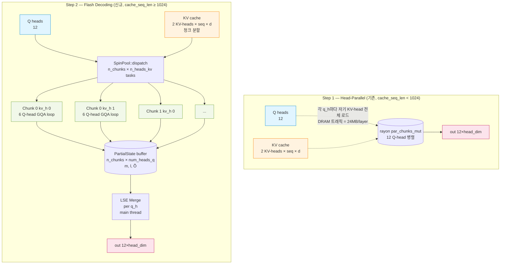
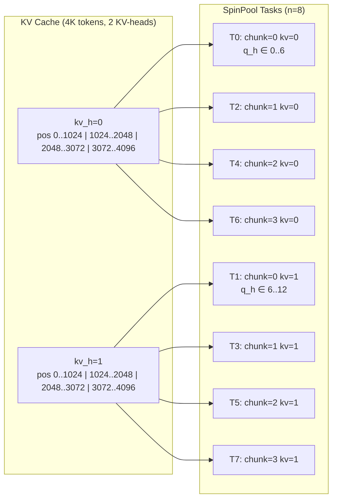
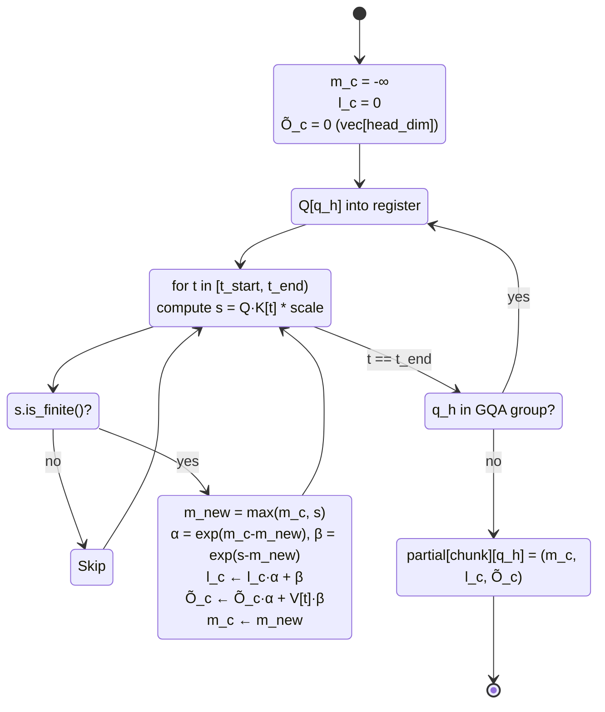
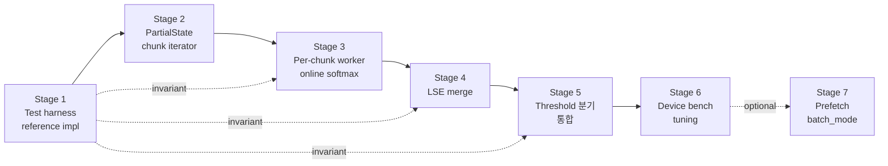

# CPU Flash Decoding — KV-Split 병렬화 설계 (Step 2)

> **Status**: Draft — awaiting senior-implementer review
> **Scope**: CPU decode-path attention only (`attention_gen_f16_neon`)
> **작성일**: 2026-04-13
> **전제 단계**: Step 1 Online Softmax (커밋 `89a7afd`) 완료
> **다음 단계**: Step 3 (Prefill Flash Attention)은 본 설계 범위 밖

---

## 0. Spec Triage 재확인

본 설계는 `attention_gen_f16_neon`의 **내부 병렬 모델**만 변경한다. 호출자가 보는 출력과 스펙 수준 불변식(INV)은 수학적으로 동등하게 유지된다:

- 새 트레이트/프로토콜 메시지/CLI 플래그 없음
- `Backend::attention_gen` 시그니처 불변
- KV layout (HeadMajor) 전제 불변
- 출력 텐서의 값 분포는 기존 Step 1 구현과 부동소수점 반올림 수준의 차이만 허용 (NMSE < 1e-4)

→ **spec/ 변경 없음**. arch/ 단독 추가 (`arch/cpu_flash_decoding.md`). 실패 시 롤백도 내부 feature flag 또는 threshold 극단화로 가능하므로 후방 호환성 리스크는 국한된다.

---

## 1. 목표와 동기

### 1.1 배경 — Step 1의 한계

Step 1 online softmax(1-pass)는 K/V의 cache-line locality를 복구하여 short context(~20 tokens)에서 +43% 개선을 얻었으나, 4K context에서는 기대했던 25~30%에 못 미치고 있다 (10.6 → ~13 tok/s 추정, thermal throttling 혼재). 근본 원인은 **GQA 중복 KV 읽기**이며, head 단위 병렬화로는 해결되지 않는다.

| 항목 | Qwen2.5 1.5B (GQA=6) | Llama 3.2 1B (GQA=4) |
|------|---------------------|-----------------------|
| `n_heads_q` | 12 | 32 |
| `n_heads_kv` | 2 | 8 |
| `head_dim` | 128 | 64 |
| K/V per KV-head @4K F16 | 1 MB each | 256 KB each |
| K+V per Q-head working set | 2 MB (= L2 전체) | 512 KB |
| Layer별 KV 트래픽 (head-parallel) | 12 × (1+1) = **24 MB** | 32 × (0.25+0.25) = 16 MB |
| Layer별 KV 트래픽 (flash decoding) | 2 × (1+1) = **4 MB** | 8 × (0.25+0.25) = 4 MB |
| 축소 배수 | **6×** | **4×** |

Snapdragon 8 Elite Oryon core L2 2MB 기준으로 한 Q-head 처리 시 K/V 2MB가 L2 전체를 점유하여 6-thread 동시 실행 시 L2 thrashing → DRAM fallback이 발생한다.

### 1.2 목표 성능

| 지점 | 현재 (Step 1 완료) | 목표 (Step 2 후) |
|------|-------------------|------------------|
| Short ctx (~20 tok) | ~24 tok/s | **≥ 24 tok/s** (회귀 금지) |
| 2K ctx | ~18 tok/s (추정) | **≥ 22 tok/s** |
| 4K ctx | ~14 tok/s | **≥ 25 tok/s** |
| 8K ctx (여유) | 측정 필요 | head-parallel 대비 ≥ 2× |

### 1.3 설계 원칙

1. **GQA의 모든 Q-head가 같은 K/V 청크를 공유**하여 DRAM 트래픽을 `n_heads_q / n_heads_kv` 배 감소시킨다.
2. **Working set이 L2 2 MB 안에 들어오도록** chunk size를 결정한다.
3. **Short context 회귀 없음** — threshold 미만에서는 Step 1과 바이트 단위로 동일 경로.
4. **시그니처 불변** — 내부 분기로만 전환.

---

## 2. 알고리즘 — Flash Decoding (KV-Split + Log-Sum-Exp Merge)

### 2.1 수학적 근거

Online softmax는 sequence를 여러 chunk로 쪼갠 뒤 **log-sum-exp reduction**으로 정확히 합산할 수 있다. Chunk $c$ 안에서 계산된 부분 통계를 $(m_c, l_c, \mathbf{o}_c)$라 하자:

```
m_c = max_{t ∈ chunk_c} s_t               (chunk local max)
l_c = Σ_{t ∈ chunk_c} exp(s_t − m_c)      (chunk local partition)
o_c = Σ_{t ∈ chunk_c} V_t · exp(s_t − m_c) / l_c    (chunk local weighted V)
```

**전역 merge**:

```
M = max_c m_c
α_c = exp(m_c − M)                       # rescale factor
L = Σ_c α_c · l_c                        # global partition
O = (Σ_c α_c · l_c · o_c) / L            # global weighted V
```

구현상으로는 `o_c`를 "미정규화" 형태 `Õ_c := l_c · o_c = Σ V_t · exp(s_t − m_c)`로 보관하면 merge가 단순해진다:

```
M = max_c m_c
L = Σ_c exp(m_c − M) · l_c
O = (Σ_c exp(m_c − M) · Õ_c) / L
```

### 2.2 의사코드

```
# 입력: Q[num_heads_q, head_dim], K/V[n_heads_kv, cache_seq_len, head_dim], cache_seq_len
# 파라미터: CHUNK_SIZE = 1024, THRESHOLD = 1024
#
# n_chunks = ceil(cache_seq_len / CHUNK_SIZE)
# 마지막 chunk는 [n_chunks-1) * CHUNK_SIZE, cache_seq_len) — 가변 길이

# Step A — 청크 × 헤드 partial state 계산 (병렬)
parallel for chunk_idx in 0..n_chunks:
    t_start = chunk_idx * CHUNK_SIZE
    t_end   = min(cache_seq_len, t_start + CHUNK_SIZE)

    for kv_h in 0..n_heads_kv:                          # 2 iter (Qwen) / 8 (Llama)
        # Prefetch K/V chunk (optional hint)
        for q_h in kv_h * gqa..(kv_h + 1) * gqa:        # GQA group 공유
            m_c = -inf
            l_c = 0
            Õ_c = 0    # 미정규화 weighted V

            for t in t_start..t_end:
                s = (Q[q_h] · K[kv_h, t]) * scale        # 재계산, but K는 L2 hit
                if not finite(s): continue               # NaN 처리
                m_new = max(m_c, s)
                alpha = exp(m_c - m_new)
                beta  = exp(s - m_new)
                l_c   = l_c * alpha + beta
                Õ_c   = Õ_c * alpha + V[kv_h, t] * beta
                m_c   = m_new

            partial[chunk_idx, q_h] = (m_c, l_c, Õ_c)    # head_dim F32 vector + 2 F32 scalars

# Step B — per-head log-sum-exp reduction (직렬 또는 head-parallel)
parallel for q_h in 0..num_heads_q:
    M = max_c partial[c, q_h].m_c
    L = 0
    O = 0
    for c in 0..n_chunks:
        α = exp(partial[c, q_h].m_c - M)
        L += α * partial[c, q_h].l_c
        O += α * partial[c, q_h].Õ_c                     # vector FMA
    out[q_h] = O / L                                     # vector scale

# Fallback: 모든 chunk가 fallback_uniform 인 경우 기존 uniform 평균 경로 유지
```

### 2.3 Q-head inner loop 선택의 근거

`for kv_h` 바깥 루프에서 K/V를 L1/L2에 상주시키고 `for q_h ∈ GQA group` 내부 루프로 6개 (Qwen) / 4개 (Llama) Q-head가 같은 K/V를 **연속 재사용**한다. 이것이 "GQA 중복 읽기 제거"의 수학적 의미다. 실제 구현에서는 추가로 innermost loop를 `for t` 방향으로 interleave하여 t별 K[t]·V[t] load 1회당 GQA만큼의 Q·K dot + V FMA를 수행한다 (아래 §5 참조).

---

## 3. 병렬 구조 선택

### 3.1 rayon vs SpinPool

| 축 | rayon `par_iter` | `SpinPool::dispatch` |
|----|------------------|----------------------|
| 호출 overhead | ~5–10 µs (fork/join + work-stealing split) | ~1–3 µs (unpark, batch mode 시 ~0.5 µs) |
| Short ctx 회귀 | ⚠️ 4K 미만에서 overhead 심화 | 안전 (batch_mode 활용) |
| 작업 크기 통제 | 불가 (work-stealing 자동 분할) | **명시적 n_chunks 제어** |
| Nested parallel | ⚠️ 내부 rayon 호출과 충돌 (matmul 이후) | 중립 (단일 pool singleton) |
| 구현 복잡도 | 낮음 | 중간 (unsafe ctx + worker fn) |

**결정**: **SpinPool 직접 사용**. 근거:

1. 엔진은 이미 `engine/src/core/thread_pool.rs`에 `get_pool()` singleton을 갖고 있으며 matmul에서 활용 중이다. rayon과 SpinPool이 병존하면 thread oversubscription 위험이 있다.
2. 청크 수(4–8개)가 작고 정적이므로 rayon의 동적 work-stealing 이득이 없다.
3. Step 1이 `par_chunks_mut`를 쓰지만 Step 2의 추가 분할에서는 overhead 민감도가 훨씬 커서 rayon 누적 overhead(Step 1 overhead + Step 2 overhead)를 피해야 한다.
4. Batch mode(연속 attention 호출 간 worker 스핀 유지)로 decode 루프 전체에서 park/unpark 비용을 제거할 여지가 있다. (옵션; 1차 PR 범위 밖)

### 3.2 Thread 할당 전략

**6 core 가정** (Snapdragon 8 Elite Oryon). Qwen2.5 1.5B (GQA=6, n_heads_q=12, n_heads_kv=2), 4K context:

| 전략 | n_tasks | 코어 활용 | GQA 공유 효과 |
|------|---------|----------|--------------|
| A. Chunk-only 병렬, 내부 head-loop 직렬 | 4 | 4/6 (놀는 2 core) | 완전 (1 chunk 내 모든 q_h가 K/V 재사용) |
| B. Chunk × kv_h 병렬 | 4×2 = 8 | 6/6 포화 | 완전 (1 task가 1 kv_h × 1 chunk) |
| **C. Chunk × q_h 병렬 (GQA group 교차 금지)** | 4×12 = 48 | 6/6 포화 | **깨짐** — GQA group 내 여러 thread가 같은 K/V를 각자 load |

**선택: B** (chunk × kv_h). 근거:

1. Qwen의 `n_heads_kv=2`는 코어 수(6)보다 작으므로 단독으로는 under-subscribe.
2. Chunk 수 4 × kv_h 2 = 8 > 6 코어 → work-stealing으로 자연스럽게 load balance.
3. 1 task 내부에서 `for q_h ∈ GQA group` 루프가 유지되어 GQA 공유 효과는 온전.
4. Llama 3.2 1B (GQA=4, n_heads_kv=8)는 kv_h만으로도 이미 충분 → chunk 축 병렬이 과잉일 수 있으나 Llama는 head_dim=64라 chunk 전체 K/V 크기가 256 KB로 이미 L2 안에 들어오므로 chunk split 없이 head-parallel로 남아도 된다 (§4 threshold 참조).

**일반화 공식**:

```
n_tasks = n_chunks × n_heads_kv
n_chunks = ceil(cache_seq_len / CHUNK_SIZE)
```

`n_tasks < n_cores`이면 chunk split은 역효과. → §4.2 threshold에서 조건부 활성화.

### 3.3 Step B (merge) 병렬화

Merge 작업량은 `num_heads_q × n_chunks × head_dim` FMA이다. 4K/Qwen에서 12 × 4 × 128 = 6144 FMA → 단일 core에 할당해도 수 µs. **Step B는 직렬**로 두고 Step A 끝난 직후 main thread에서 수행한다 (SpinPool join 후). 필요 시 future optimization으로 q_h 축 병렬화 가능하지만 dispatch overhead(>4 µs)가 작업량과 비슷해 이득 미미.

---

## 4. Chunk Size 및 Threshold 튜닝

### 4.1 Chunk Size 후보와 working set 계산

Chunk 하나의 working set = `CHUNK_SIZE × head_dim × 2 (K+V) × 2 byte (F16)`:

| CHUNK_SIZE | Qwen (head_dim=128) | Llama (head_dim=64) | Qwen에서 L2(2MB) 점유율 |
|------------|----------------------|---------------------|-------------------------|
| 512 | 256 KB | 128 KB | 12.5% |
| **1024** | **512 KB** | 256 KB | **25%** |
| 2048 | 1 MB | 512 KB | 50% |
| 4096 | 2 MB | 1 MB | 100% (= 현재 head-parallel과 동일) |

**권장**: `CHUNK_SIZE = 1024` (Qwen 기준).

근거:
- 512 KB chunk는 L2 25%만 점유 → 6 thread 동시 실행 시 각 thread당 ~340 KB 가정할 때 합이 2MB 미만이 될 가능성 (Oryon의 shared L2이므로 thread 전체 working set이 L2에 fit해야 함).
- 2048은 half-L2를 한 thread가 점유 → 2 thread 동시 시 L2 fit 경계 아슬아슬.
- Llama(head_dim=64)는 chunk size를 배로 늘려도 되지만 공통 상수로 1024를 쓰면 L2 여유가 충분하므로 model별 분기를 피한다.

**NEON align 제약**: `CHUNK_SIZE`는 Step 1의 `full_4 = cache_seq_len / 4` 루프 조건과 호환되도록 **4의 배수**여야 하며 1024는 만족.

**Sensitivity test 권장**: senior-implementer가 512 / 1024 / 2048 세 값을 디바이스 벤치로 검증하여 최종 확정 (§9 테스트 전략).

### 4.2 Threshold — head-parallel vs flash decoding 분기

`cache_seq_len < THRESHOLD` 인 경우 Step 1 경로(head-parallel)를 그대로 사용한다. 다음을 고려:

| THRESHOLD 후보 | Short (20) | 512 (n_chunks=?) | 1024 | 2048 |
|----------------|------------|------------------|------|------|
| 512 | head-parallel | flash (1 chunk) | flash (1) | flash (2) |
| **1024** | head-parallel | head-parallel | **flash (1)** | **flash (2)** |
| 2048 | head-parallel | head-parallel | head-parallel | flash (2) |

**권장**: `THRESHOLD = 1024`.

근거:
- `cache_seq_len < 1024`일 때 `n_chunks = 1`이 되면 분기 자체가 무의미하고 merge overhead만 늘어남.
- 1024 기준이면 정확히 **1 chunk부터 flash 경로 활성** → `n_chunks = ceil(cache_seq_len / CHUNK_SIZE)`가 1 chunk일 경우 merge가 trivial (α=1, L=l_0, O=Õ_0)이므로 overhead가 미미.
- 그러나 "1 chunk + merge"는 기존 head-parallel 대비 `n_heads_kv` 축 병렬의 불리함(작업 분할 세분화 overhead)이 있으므로 **2 chunk 이상**에서 이득이 극대화. 실무적으로는 `THRESHOLD = CHUNK_SIZE` 대신 `THRESHOLD = 2 * CHUNK_SIZE = 2048`도 후보.

**1차 PR은 THRESHOLD = 1024 (= CHUNK_SIZE)로 고정**하고, bench가 short ctx 회귀를 보이면 2048로 상향.

### 4.3 마지막 chunk 처리

`cache_seq_len`이 `CHUNK_SIZE`의 배수가 아닐 때 마지막 chunk는 `[t_start, cache_seq_len)`의 가변 길이. 내부 루프는 `t_end = min(cache_seq_len, t_start + CHUNK_SIZE)`로 처리. 빈 chunk(`t_start == cache_seq_len`)는 `n_chunks = ceil(...)`로 자연스럽게 생성되지 않는다.

---

## 5. Data Layout 및 메모리 액세스 패턴

### 5.1 KV HeadMajor 레이아웃 재확인

```
K[batch=1, kv_h, pos, d]
  offset(kv_h, t, d) = kv_h * capacity * head_dim
                     + t * head_dim
                     + d
```

Chunk `[t_start, t_end)` × `kv_h` 고정 시:
- 메모리 범위: `[kv_h*capacity + t_start) * head_dim` ~ `(kv_h*capacity + t_end) * head_dim`
- **연속 메모리** (head_dim × chunk_len F16, 즉 Qwen 1024×128×2 = 256 KB = 1 contiguous blob)

이는 flash decoding의 전제: **K/V 청크가 byte-contiguous** 하면 prefetch/hardware streaming이 효율적.

### 5.2 Prefetch 전략

각 task가 들어갈 때 K/V chunk 시작 주소에 대해 software prefetch 힌트를 발행:

```rust
use std::arch::asm;
unsafe {
    asm!("prfm pldl2keep, [{ptr}]", ptr = in(reg) k_ptr.add(0));
    asm!("prfm pldl2keep, [{ptr}]", ptr = in(reg) v_ptr.add(0));
    // ... for each cache line (64B stride) in chunk
}
```

실제로는 `for t in chunk` 루프의 t+prefetch_distance 지점을 미리 프리페치. 1차 PR에서는 optional — 직접 순차 액세스만으로도 hardware prefetcher가 잡아줄 것이 기대되지만 측정 후 추가.

### 5.3 Partial State 저장 배치 (false sharing 방지)

`partial[n_chunks][num_heads_q]` 버퍼는 `(m: f32, l: f32, Õ: [f32; head_dim])`의 배열.

- 원소당 크기 = 2 × 4 + 128 × 4 = 520 byte (Qwen)
- 64-byte alignment로 padding해 `PartialState` struct를 cache-line 단위 정렬:

```rust
#[repr(C, align(64))]
struct PartialState {
    m: f32,
    l: f32,
    _pad: [f32; 14],        // 16 × 4 = 64 byte head
    o_tilde: [f32; 128],    // head_dim * 4 byte
}
```

메모리 layout: `partial[chunk][head]` 또는 `partial[head][chunk]` 중 **`partial[chunk][head]`** 선호 (Step A에서 한 task가 같은 chunk를 쓰므로 task별로 연속 기록).

Task 경계에서 **서로 다른 chunk_idx는 물리적으로 다른 64B 라인**에 떨어지므로 cache-line false sharing 없음 (단일 PartialState가 이미 64B 정렬되어 있음).

**Merge 단계**는 `partial[*][head]` 순회 = stride `n_chunks × sizeof(PartialState)` 접근. Cache-line hit 기대는 낮지만 merge는 작업량이 작아 DRAM latency 문제 아님.

---

## 6. Numerical Stability

### 6.1 F32 중간값 유지

모든 partial state (`m, l, Õ`)는 **F32**로 보관. F16 KV를 로드한 직후 F32로 변환(`fcvtl`/`vcvt_f32_f16`)하여 계산하는 Step 1의 패턴을 그대로 유지.

### 6.2 Empty chunk 처리

`n_chunks = ceil(cache_seq_len / CHUNK_SIZE)`로 계산 → 빈 chunk가 생성되지 않는다. 단 `cache_seq_len == 0`일 때는 Step 1 경로와 동일하게 fallback (uniform average를 계산할 토큰도 없으므로 out을 0으로 둠).

### 6.3 All-NaN chunk 처리

어떤 chunk의 모든 토큰 score가 NaN/−inf이면 `m_c = -inf, l_c = 0, Õ_c = 0`이 된다. Merge 단계에서:

- 해당 chunk의 `α_c = exp(-inf - M) = 0` → L/O 기여 0.
- 모든 chunk가 이 상태면 `M = -inf, L = 0`. Step 1의 fallback (uniform average over all V[t]) 경로로 진입.

**구현 체크**: `if M.is_infinite() && M.is_sign_negative() { fallback_uniform(); }`

### 6.4 Merge 단계의 precision

`α_c · l_c`와 `α_c · Õ_c`의 곱셈은 F32 accumulation. 최악의 경우 `m_c - M ≈ -80`에서 `exp ≈ 1e-35` (denormal 경계). Chunk 수가 작으므로(≤ 8) 누적 오차는 무시 가능.

**FMA 순서**는 아래와 같이 stabilize:

```
α_c := (m_c - M).exp()
L   += α_c * l_c
tmp  = α_c * l_c              # 또는 위에서 이미 계산
O   += tmp * (Õ_c / l_c)      # ≡ α_c * Õ_c after l_c 분모 통합
```

단순하게 `O += α_c * Õ_c` (미정규화 형태) 후 `O /= L`로 마무리하는 것이 연산 횟수 최소. 이 쪽을 채택.

### 6.5 Step 1 대비 bit-exact 여부

**불가능**. Chunk 경계에서 `m_c`가 새로 초기화되고 merge에서 exp 재계산 → 부동소수점 더하기 순서가 다르다. 단, 수학적으로는 동등하므로 NMSE < 1e-4 허용 오차(TODO §4 참조) 안에서 일치.

`cache_seq_len < THRESHOLD` 인 경우(head-parallel fallback)에만 **bit-exact** 보장.

---

## 7. API / 인터페이스 변경

### 7.1 Backend trait

**변경 없음**. `Backend::attention_gen(...)` 시그니처는 그대로.

### 7.2 `attention_gen_f16_neon` 내부 구조

```rust
fn attention_gen_f16_neon(...) -> Result<()> {
    const CHUNK_SIZE: usize = 1024;
    const THRESHOLD: usize = 1024;

    if cache_seq_len < THRESHOLD || scores_out.is_some() {
        // Step 1 경로: head-parallel + online softmax.
        return Self::attention_gen_f16_neon_head_parallel(...);
    }
    Self::attention_gen_f16_neon_flash_decoding(...)
}
```

**주의**: `scores_out.is_some()` 인 경우도 head-parallel로 빠지도록 강제한다. 이유: scores (post-softmax weights)는 global softmax에 의존하며, flash 경로에서는 최종 normalization 시점까지 chunk별 raw score만 보관한다. 진단용 scores 기록은 merge 이후에 일괄 수행해야 하므로 1차 PR에서는 단순성을 위해 head-parallel로 divert. 필요 시 future PR에서 merge-aware scores 기록을 추가.

### 7.3 호출자 (`forward_gen.rs`) 영향

**변경 없음**. `backend.attention_gen(...)` 호출부는 그대로.

### 7.4 `common.rs` / `x86.rs`

**이번 범위 아님**. `CpuBackendCommon::attention_gen` (Q4_0 경로 포함)과 `CpuBackendX86`는 기존 경로 유지. 필요 시 Step 2 후속으로 포팅 예정이되 본 PR에는 포함하지 않음.

---

## 8. 구현 단계 분해 (senior-implementer 작업 리스트)

각 단계는 독립 빌드/테스트 가능하도록 설계. 괄호는 예상 소요.

### Stage 1: 테스트 하네스 확보 (0.5일)

- [ ] `engine/tests/test_attention_flash_decoding.rs` 신규.
- [ ] `attention_gen_f16_neon_reference`: 순진한 F32 3-pass 구현을 `#[cfg(test)]` 로컬 함수로 작성 (검증용 reference).
- [ ] GQA 케이스 행렬 테스트: `(gqa=1, 2, 4, 6) × (cache_seq_len = 16, 512, 1023, 1024, 1025, 2048, 4096)` × `head_dim ∈ {64, 128}`.
- [ ] NaN 유입 케이스 (일부 K를 `+inf`로 오염).
- [ ] 검증 기준: `NMSE(out, reference) < 1e-4`.

**Invariant 체크**: Step 1 구현을 돌려 reference와 비교 → 이미 Step 1 완료 상태이므로 pass 해야 함. Stage 1 성공이 baseline.

### Stage 2: Chunk Iterator + PartialState struct (0.5일)

- [ ] `struct PartialState { m: f32, l: f32, o_tilde_ptr: *mut f32 }` (head_dim이 runtime이므로 flat buffer + head_dim stride).
- [ ] `struct FlashDecodeCtx { ... }`: SpinPool dispatch context. K/V ptr, scale, partial buffer ptr, cache_seq_len, CHUNK_SIZE.
- [ ] Chunk 인덱싱 유틸 `fn chunk_range(chunk_idx, cache_seq_len, chunk_size) -> (usize, usize)`.
- [ ] Scratch 버퍼 할당: `Vec<f32>` of size `n_chunks × num_heads_q × (2 + head_dim)`. Per-call alloc (Vec). 측정 후 필요 시 thread-local reuse.

**Invariant 체크**: chunk_range는 `cache_seq_len` 비배수에서도 누락/중복 없이 `[0, cache_seq_len)` 를 cover. 유닛 테스트 포함.

### Stage 3: Per-chunk online softmax worker (1일)

- [ ] `unsafe fn flash_chunk_worker(ctx: *const u8, task_id: usize)`:
  - `task_id → (chunk_idx, kv_h)` 디코드 (`kv_h = task_id % n_heads_kv`).
  - `for q_h in GQA group`: Step 1의 online softmax 루프 복붙 + `partial[chunk_idx][q_h] = (m_c, l_c, Õ_c)` 기록.
  - NEON fcvtl / vld1q_f16 pattern은 Step 1에서 가져옴.
  - `apply_token` 클로저는 그대로 사용 가능 (`out_h`가 `Õ_c`로 바뀌는 것만 차이).

**Invariant 체크**:
- Single-chunk (n_chunks=1) 호출 시 결과가 Step 1과 bit-exact 이어야 함 (merge는 no-op이 되는 특수 케이스 테스트).
- `l_c = 0` 인 chunk에서도 crash 없음.

### Stage 4: LSE merge reducer (0.5일)

- [ ] `fn merge_partials(partial: &[PartialState], num_heads_q, n_chunks, head_dim) -> Result<()>`:
  - Step 1 코드의 finalize 블록(uniform fallback 포함)을 일반화.
  - `M = max_c m_c` 스칼라 reduction.
  - `L = Σ α_c · l_c`, `O = Σ α_c · Õ_c` (NEON FMA vectorize).
  - `out_h = O / L`; fallback uniform 조건 재사용.

**Invariant 체크**:
- `n_chunks = 1`이면 `O = Õ_0, L = l_0` → 기존 output과 동일.
- All-NaN chunk 포함 시 fallback uniform 경로 활성.

### Stage 5: Threshold 분기 + 통합 (0.5일)

- [ ] `attention_gen_f16_neon` 진입부에 `if cache_seq_len < THRESHOLD { head_parallel(...) } else { flash_decoding(...) }`.
- [ ] `scores_out.is_some()` → head_parallel 강제.
- [ ] 기존 Step 1 구현을 `attention_gen_f16_neon_head_parallel` 로 rename.
- [ ] `attention_gen_f16_neon_flash_decoding`: SpinPool dispatch + merge 호출.

**Invariant 체크**:
- `cargo test -p llm_rs2 -- attention_gen_f16` 그린.
- `cache_seq_len < THRESHOLD` 테스트 케이스에서 Step 1과 bit-exact.

### Stage 6: 디바이스 벤치 + threshold/chunk tuning (1일)

- [ ] Galaxy S25 배포 + Qwen2.5 1.5B 4K / 2K / 8K 측정.
- [ ] `CHUNK_SIZE ∈ {512, 1024, 2048}` sensitivity.
- [ ] Thermal cooldown(10분)마다 재측정.
- [ ] Llama 3.2 1B 회귀 확인.
- [ ] 최종 상수 commit.

**Invariant 체크**: Short ctx(20 tok) TBT이 Step 1 대비 ±3% 이내.

### Stage 7 (선택): Prefetch + SpinPool batch_mode (0.5–1일)

- [ ] Chunk 워커 내부에 `prfm pldl2keep` 삽입.
- [ ] decode 루프 전체를 `begin_batch`/`end_batch`로 감싸 park/unpark 제거.
- [ ] 측정 후 유의미하면 merge.

**전체 예상**: 4–5일 (Stage 1–6). Stage 7은 후속.

---

## 9. 테스트 전략

### 9.1 정확도 테스트

| 테스트 | 입력 | 기준 |
|--------|------|------|
| `test_flash_vs_reference_qwen_gqa6` | head_dim=128, gqa=6, seq ∈ {16, 1024, 4096} | NMSE vs F32 reference < 1e-4 |
| `test_flash_vs_reference_llama_gqa4` | head_dim=64, gqa=4, seq ∈ {16, 1024, 4096} | NMSE < 1e-4 |
| `test_flash_vs_reference_mha_gqa1` | gqa=1, seq=2048 | NMSE < 1e-4 (regression) |
| `test_chunk_boundary` | seq ∈ {1023, 1024, 1025, 2047, 2048, 2049, 4095, 4096, 4097} | NMSE < 1e-4, 비배수 누락 없음 |
| `test_all_nan_chunk` | 하나의 chunk 전체에 NaN 주입 | fallback uniform 활성화, 비-NaN chunk 결과 분리 |
| `test_partial_nan_chunk` | chunk 내 일부 토큰만 NaN | NaN 토큰 기여 0, 나머지는 정상 |
| `test_short_bit_exact` | seq < THRESHOLD | Step 1 구현과 **bit-exact** |
| `test_single_chunk_equivalence` | seq = CHUNK_SIZE, THRESHOLD = 0 (test-only override) | single-chunk flash 경로 = head-parallel |
| `test_needs_scores_routes_head_parallel` | `scores_out = Some(...)` | flash 경로 진입 안 함 (scores slice가 post-softmax로 기록됨을 확인) |

파일: `engine/tests/test_attention_flash_decoding.rs` 신규.

### 9.2 회귀 테스트 (호스트)

- [ ] `cargo test -p llm_rs2 -- attention`
- [ ] `cargo test -p llm_rs2 -- kivi`
- [ ] `cargo test -p llm_rs2 -- online_softmax` (Step 1 테스트 유지)
- [ ] `cargo fmt --check`
- [ ] `cargo clippy --release --bin generate`

### 9.3 디바이스 벤치 (tier 2)

| Ctx | 측정 | 회귀 기준 |
|-----|------|----------|
| Short (~20 tok) | decode tok/s | ≥ Step 1 값 − 3% |
| 2K | decode tok/s | ≥ 22 tok/s |
| 4K | decode tok/s | ≥ 25 tok/s |
| 8K | decode tok/s | ≥ 2× head-parallel 측정치 |

**측정 주의** (TODO §1 재인용):
- `--profile` 없이 측정 (ops 당 sync 2회 overhead).
- 각 context 길이 측정 전 10분 cooldown으로 thermal throttling 제거.
- 최소 3회 반복 후 중앙값 채택.

### 9.4 Llama 3.2 1B 회귀

Qwen 튜닝 상수가 Llama(head_dim=64, gqa=4, n_heads_kv=8)에서도 회귀 없이 동작하는지 확인. 예상은 중립 (Llama는 L2 부담이 낮음).

---

## 10. 리스크 분석 및 완화

### 10.1 주요 리스크

| # | 리스크 | 심각도 | 확률 | 완화 |
|---|--------|--------|------|------|
| R1 | Rayon과 SpinPool 혼용으로 thread oversubscription → core contention | **높음** | 중 | SpinPool 단독 사용. Step 1의 `par_chunks_mut`를 flash 경로에서는 쓰지 않음. |
| R2 | Cache-line false sharing (`PartialState` 배열) | 중 | 중 | `#[repr(align(64))]` + per-chunk 블록 정렬. 테스트: `test_cache_line_alignment`와 유사 패턴. |
| R3 | Short context 회귀 | 중 | 중 | THRESHOLD 분기로 기존 경로 유지 + bit-exact 테스트 게이트. 측정 후 THRESHOLD 상향 옵션 (1024 → 2048). |
| R4 | Chunk size 작을 때 merge overhead가 계산 이득을 잠식 | 중 | 낮 | 1차 PR은 CHUNK_SIZE=1024로 고정 (n_chunks ≤ 8 @ 8K). Sensitivity test로 검증. |
| R5 | NaN/−inf 전파가 chunk merge에서 `-inf − (-inf)` NaN을 유발 | 높 | 낮 | `m_c == -inf` 검사를 global merge의 `M` 결정 전에 수행. All-NaN chunk는 기여 0으로 통과. |
| R6 | `scores_out` 경로가 flash와 호환 안 됨 (merge 이후에만 post-softmax 계산 가능) | 낮 | 100% | 1차 PR: `scores_out.is_some()`이면 head-parallel로 강제 (§7.2). 실험 시 `--protected-prefix`와 결합한 진단 경로는 cache_seq_len < 4K가 대부분이라 실손실 미미. |
| R7 | F16 intermediate 누적으로 precision loss | 낮 | 낮 | 모든 partial/merge F32 유지 (§6.1). |
| R8 | Prefetch 힌트가 A55 core(효율 core)에서 역효과 | 낮 | 낮 | Prefetch는 optional Stage 7. 실측 후에만 enable. |

### 10.2 Rollback 전략

**단계 1 — Soft rollback** (threshold 극단화):
```rust
const THRESHOLD: usize = usize::MAX;  // flash 경로 비활성
```

이 한 줄 변경으로 Step 1 경로로 완전 복귀. 디바이스 hotfix 배포 가능.

**단계 2 — Hard rollback** (코드 revert):
`attention_gen_f16_neon_flash_decoding` 함수 및 PartialState 관련 코드 제거. Stage 5 커밋만 revert.

**Feature flag 옵션** (선호 시):
```rust
#[cfg(feature = "cpu_flash_decoding")]
```

로 감싸면 빌드 타임 통제 가능. 1차 PR은 feature flag 없이 하드코딩 + THRESHOLD rollback으로 충분.

---

## 11. 아키텍처 다이어그램

### 11.1 Step 1 (head-parallel) vs Step 2 (flash decoding) 데이터 흐름



### 11.2 Chunk × KV-head Task 분할 (Qwen 4K 예시)



### 11.3 Per-chunk worker 상태 전이



### 11.4 Merge 단계

```mermaid
flowchart LR
  P0["partial[0..n_chunks]<br/>(m_c, l_c, Õ_c)"] --> MaxR[M = max m_c]
  MaxR --> AlphaC[α_c = exp(m_c − M)]
  AlphaC --> LR[L = Σ α_c · l_c]
  AlphaC --> OR[Õ = Σ α_c · Õ_c]
  LR --> Div
  OR --> Div
  Div[out_h = Õ / L] --> OUT[out tensor]
  MaxR -.->|M = -∞?| FB[Uniform fallback:<br/>out_h = mean(V[0..seq])]
  FB --> OUT
```

---

## 12. 참고 자료

- Tri Dao, *Flash-Decoding for long-context inference*, 2023 — https://crfm.stanford.edu/2023/10/12/flashdecoding.html
- llama.cpp PR #19209 — "ggml-cpu: FA split across kv for faster TG" (2025)
- `engine/src/backend/cpu/neon.rs:228-564` — Step 1 reference 구현 (커밋 `89a7afd`)
- `engine/src/core/thread_pool.rs` — SpinPool (dispatch / batch_mode)
- `engine/src/layers/transformer_layer/forward_gen.rs:249-393` — decode attention 호출 체인
- `.agent/todos/long_context_attention_optimization.md` — 전체 로드맵

---

## 13. 개방 질문 (Implementation-time 결정)

1. **Partial buffer 할당 전략**: per-call `Vec::with_capacity` vs thread-local reuse vs 호출자 workspace 전달. → Stage 2에서 제일 단순한 per-call로 시작, 측정 후 workspace로 이관 고려.
2. **CHUNK_SIZE 최종값**: 1024 (권장) vs Model-adaptive (Qwen 1024 / Llama 2048). → Stage 6 벤치 결과로 결정.
3. **Merge 병렬화**: 1차는 직렬. 측정 후 필요하면 q_h 축 rayon으로 분산 (dispatch overhead < 1 µs 보장 시).
4. **KIVI Q4 경로 확장**: 본 설계는 F16 KV만 대상. Q4_0 KV는 `common.rs` 경로이며 Step 2에 포함하지 않는다. Step 3 시점에 별도 계획.

---

## 14. Stage 간 의존 그래프


