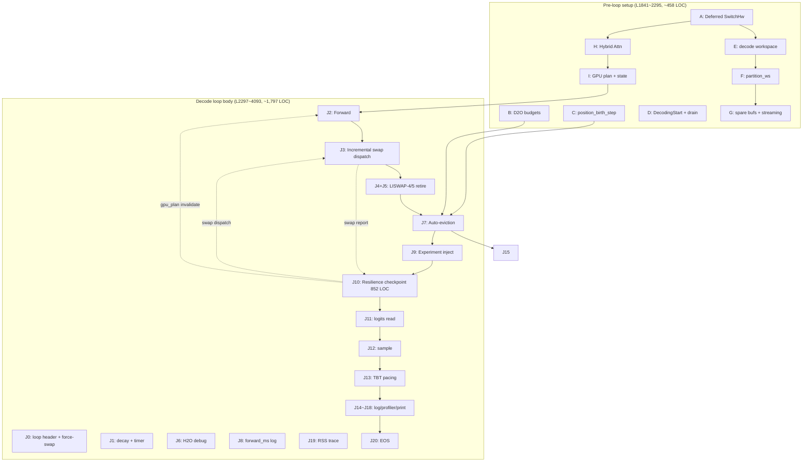
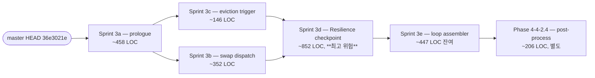

# Phase 4-4-2.3 `decode_fallback` 추출 — sub-sub-sprint 분해 설계

> **위치**: `bin/generate.rs::main()` L1841~L4095 (~2,255 LOC) — chunked prefill 종료 직후 deferred SwitchHw부터 decode loop 종료까지. **Phase 4-4-2.4** (post-process L4097~L4302, ~206 LOC)는 본 문서 범위 밖.
>
> **방향**: `arch/inference_pipeline.md` §11 사용자 결정 + Phase 4-4-2 handoff §2.5 결정에 따라 **G3 LOC-only mechanical move**. trait 추상화는 본 단계에서 시도하지 않는다. 본 문서는 `bin/generate.rs`에서 `session/decode_fallback/`로 이식할 단위 분해와 진입 순서를 확정한다.
>
> **참조**:
> - `arch/inference_pipeline.md` — Phase 4 6 trait 설계 (본 단계에서는 적용 안 함)
> - `.agent/todos/handoff_phase4_4_2_sprint_exit_2026_05_19.md` §5 backlog — Phase 4-4-2.3은 "추가 분해 권장"으로 명시 지연
> - `.agent/todos/handoff_phase4_4_2_e1prime_entry_2026_05_19.md` §4 — "가장 크고 위험. 가능하면 더 분해" 명시
> - `ARCHITECTURE.md §13` + `spec/41-invariants.md` §3.26 — INV-LAYER-001~007

---

## 1. 현 구조 분석 (L1841~L4095)

### 1.1 의미 단위 매핑

| # | start | end | LOC | 책임 | 인입 (mut) | 인출 (mut) | 외부 의존 |
|---|------|-----|-----|------|------------|------------|----------|
| **A** | 1841 | 1885 | 45 | **Deferred SwitchHw 실행** — GPU↔CPU KV migrate + backend/is_gpu 재할당 | `deferred_switch`, `kv_caches`, `backend`, `is_gpu`, `gpu_backend_arc`, `cpu_backend_arc`, `gpu_memory_arc`, `cpu_memory_arc`, `kv_heads`, `head_dim`, `max_seq_len` | `backend` ★, `is_gpu` ★, `kv_caches` ★ | `llm_rs2::pressure::kv_migrate::migrate_kv_caches` |
| **B** | 1887 | 1901 | 15 | **D2O per-layer budget 계산** | `variance_collector`, `args` | `d2o_layer_ratios: Option<Vec<(f32,f32)>>` | `D2OVarianceCollector::compute_budgets` |
| **C** | 1903 | 1916 | 14 | **position_birth_step 초기화** (profiler tracking) | `profiler`, `tokens`, `actual_protected_prefix` | `position_birth_step: Vec<usize>` ★, `profiler` ★ (record_token_births) | `Profiler::record_token_births` |
| **D** | 1918 | 1946 | 29 | **DecodingStart event + profile-events drain** (warmup pollution clear) | `backend`, `args.profile_events`, `args.heartbeat_gpu_profile` | (none — side effect) | OpenCL `flush_and_aggregate_profile` |
| **E** | 1947 | 1994 | 48 | **Decode workspace 할당** — `x_gen`, `gen_ws`, `decode_mem` resolve | `is_gpu`, `memory`, `cpu_memory_arc`, `vocab_size`, `hidden_size`, `logits`, `model.config` | `decode_mem`, `x_gen`, `gen_ws`, `logits` (재할당 가능) | `LayerWorkspace`, `decode_mem.alloc` |
| **F** | 1996 | 2030 | 35 | **Partition workspace 부착** (zero-copy residual mapping) | `model.layers[0]`, `backend`, `decode_mem`, `gen_ws` | `gen_ws.partition_ws` ★ | `PartitionWorkspace`, `UnifiedBuffer::map` |
| **G** | 2032 | 2099 | 68 | **단일 토큰 입력 텐서 + spare 버퍼 + streaming setup** | `cpu_memory_arc`, `is_gpu`, `args.resilience_prealloc_switch`, `tokens`, `tokenizer` | `cpu_gen_input`, `gen_input_tensor`, `spare_logits/xgen/gen_ws/gen_input` ★, `stdout`, `_printed_len` | `Galloc`, `tokenizer.decode` |
| **H** | 2101 | 2215 | 115 | **UMA Hybrid Attention setup** (`#[cfg(feature = "opencl")]`) — gating + map_for_cpu + install | `backend`, `args.kv_type`, `model.config`, `args.tensor_partition`, `args.eviction_policy`, `kv_caches`, `gen_ws` | `_hybrid_scope` (RAII guard, decode loop 끝까지 살아야 함) | `HybridAttnSetup`, `hybrid_attention::install` |
| **I** | 2217 | 2295 | 79 | **GPU kernel plan 초기 빌드 + sticky disable + decode buffer pre-alloc + evict ceiling state** | `backend`, `args`, `score_accumulator`, `model`, `x_gen`, `logits`, `gen_ws`, `kv_caches` | `gpu_plan` ★, `gpu_plan_sticky_disabled` ★, `logits_cpu`, `sampling_indices`, `evict_ceiling`, `evict_floor_logged`, `last_applied_partition_ratio` | `model.build_plan` |
| **J0** | 2297 | 2335 | 39 | **decode loop header** — `for (decode_token_index, _)` 진입 + max_seq check + mid-decode force-swap trigger + 토큰 write_buffer | (1885까지 모든 mut) | (loop body 진입) | `dispatch_force_swap!` macro (L1321) |
| **J1** | 2337 | 2347 | 11 | **score decay + forward_start timer + phase reset** | `score_accumulator`, `phase_aware_swap_dispatcher` | `forward_start` | — |
| **J2** | 2349 | 2479 | 131 | **Forward 실행** — GPU plan path attempt → fallback `model.forward_into` + plan rebuild | 13개 (backend, gpu_plan, model, x_gen, kv_caches, logits, gen_ws, score_accumulator, profiler, skip_config, intra_forward_swap_hook, cuda_graph args, …) | `gpu_plan` ★ (invalidate on failure), `logits` (forward 결과 기록) | `model.execute_plan`, `model.forward_into`, CUDA graph capture |
| **J3** | 2522 | 2773 | 252 | **Layer-Incremental Swap dispatch** (LISWAP-1/2/6, Dynamic-K, Probing-K) — drain chunk + run_layer_swap + dispatcher drain + manager WeightSwapReport build | `incremental_force_swap_plan` ★, `dynamic_k_controller`, `probing_k_controller`, `model.release_worker`, `async_swap_dispatcher`, `host_ptr_swap_pool`, `layer_swap_pool`, `mmap_registration`, `manager_swap_report_pending` ★, `ready_weight_swap_report` ★, `importance_table_for_swap`, `model.quant_noise`, `gpu_backend_arc`, `cpu_backend_arc` | swap report enqueue, plan retire | `run_layer_swap`, `compute_qcf_weight_swap`, `remap_weights_for_cpu_after_swap`, `dynamic_k_controller.calibrate/observe`, `probing_k_controller.observe` |
| **J4** | 2776 | 2820 | 45 | **LISWAP-4 Intra-forward Swap retire** (INV-150) — finalize hook + bump ratio_generation + invalidate SOA | `intra_forward_swap_hook` ★, `model.ratio_generation`, `gpu_backend_arc`, `backend` | hook retire (set None) | `IntraForwardSwapHook::finalize`, `invalidate_noshuffle_soa_registry` |
| **J5** | 2823 | 2878 | 56 | **LISWAP-5 Phase-aware Swap retire** — dispatcher.is_complete() → finalize + remap | `phase_aware_swap_dispatcher` ★, `model.ratio_generation`, `gpu_backend_arc`, `backend` | dispatcher retire (set None) | `PhaseAwareSwapDispatcher::finalize` |
| **J6** | 2881 | 2918 | 38 | **H2O debug per-step diagnostics** (gated by `args.h2o_debug()`) | `gen_ws.scores`, `score_accumulator`, `model.config`, `kv_caches` | stderr | (read-only) |
| **J7** | 2920 | 3065 | 146 | **Auto-eviction (non-experiment mode)** — GPU score sync + pre-eviction snapshot + force/maybe_evict + EvictionEvent + position_birth_step compact + score reset | `kv_caches` ★, `auto_eviction`, `score_based_eviction`, `score_accumulator` ★, `cache_manager`, `d2o_layer_ratios`, `args`, `profiler` ★, `position_birth_step` ★, `actual_protected_prefix`, `backend` | `kv_caches` size change, `score_accumulator` reset, GPU score reset, `position_birth_step` compaction | `cache_manager.force_evict*` / `maybe_evict*`, `compute_h2o_evicted_indices` |
| **J8** | 3066 | 3072 | 7 | **forward_ms 기록 + per-token log** | `forward_ms_values`, `forward_ms`, `decode_token_index`, `kv_caches[0].current_pos` | `forward_ms_values.push` | (read-only env var) |
| **J9** | 3074 | 3082 | 9 | **Experiment directive 주입** (schedule.directives_at(t)) | `experiment_schedule`, `experiment_tx` | `injected_signals: Vec<String>` ★, `experiment_tx` send | `directive_summary` |
| **J10** | 3084 | 3935 | 852 | **Resilience checkpoint** — `command_executor.poll()` + 12+ plan field dispatch (QCF, SwapWeights, Evict, Partition, Skip, SwitchHw, KvOffload, Throttle, TargetTbt, RestoreDefaults, Suspend) | `command_executor` ★, `kv_caches`, `score_accumulator` ★, `model` ★ (slot.store_weights_same_dtype), `gen_ws` ★ (partition_ws), `cache_manager`, `gpu_plan` ★, `skip_config` ★, `last_skip_ratio` ★, `backend` ★, `is_gpu` ★, `spare_*` swap, `evict_ceiling` ★, `last_applied_partition_ratio` ★, `throttle_delay_ms` ★, `target_tbt_ms` ★, `incremental_force_swap_plan` ★, `manager_swap_report_pending` ★, `ready_weight_swap_report` 소비, `importance_table_for_swap`, `collector_armed` ★, `experiment_*` 카운터 ★ | 광범위 mut transfer | `compute_qcf_estimates`, `dispatch_swap_weights`, `cache_manager.force_evict_by_policy*`, `kv_migrate`, `model.prepare_tensor_partition`, `prepare_noshuffle_buffers`, `clear_noshuffle_soa_registry` |
| **J11** | 3937 | 3949 | 13 | **logits → CPU read (token-boundary sync)** | `logits`, `logits_cpu`, `backend` | `logits_cpu` ★ | `backend.read_buffer` |
| **J12** | 3951 | 3966 | 16 | **top-K logits 추출 + sample** | `logits_cpu`, `tokens`, `vocab_size`, `sampling_config`, `sampling_indices` | `next_token_id`, `top_logits`, `sample_us` | `sampling::sample`, `extract_top_k_logits` |
| **J13** | 3968 | 3979 | 12 | **TBT 계산 + target pacing sleep** | `_last_token_time`, `target_tbt_ms`, `tbt` | `tbt` ★ (clamped to target), `pacing_ms` | `std::thread::sleep` |
| **J14** | 3981 | 3990 | 10 | **TBT log JSONL write** | `tbt_log_writer`, `tbt`, `forward_ms`, `kv_caches[0].current_pos`, `pacing_ms` | JSONL line | `std::io::Write` |
| **J15** | 3992 | 4029 | 38 | **Profiler step record + position_birth_step push** | `profiler` ★, `decode_token_index`, `next_token_id`, `score_accumulator`, `kv_caches`, `forward_us`, `sample_us`, `position_birth_step` ★ | profiler 누적, position_birth_step push | `Profiler::on_step_end`, `record_token_births` |
| **J16** | 4031 | 4035 | 5 | **last_token_time + tokens.push + start_pos++** | `tokens`, `start_pos`, `now` | `tokens` ★, `start_pos` ★, `_last_token_time` ★ | — |
| **J17** | 4037 | 4062 | 26 | **Experiment per-token JSONL write** (TokenRecord) | `experiment_writer`, `system_sampler`, `injected_signals`, `next_token_id`, `tokens`, `decode_token_index`, `tbt`, `forward_ms`, `top_logits`, `action_names`, `kv_caches`, `throttle_delay_ms`, `args.experiment_logits_topk` | JSONL record | `tokenizer.decode`, `SystemSampler::sample`, `writer.write_token` |
| **J18** | 4064 | 4080 | 17 | **Streaming print (suppress in experiment mode) + token-id debug dump** | `experiment_writer`, `tokenizer`, `tokens`, `_printed_len`, `stdout` | stdout write, `_printed_len` ★ | `tokenizer.decode` |
| **J19** | 4082 | 4089 | 8 | **RSS/IO trace snapshots (decode_1, decode_16)** | `decode_token_index` | rss_trace, io_trace side effects | `rss_trace`, `io_trace` |
| **J20** | 4091 | 4093 | 3 | **EOS check + break** | `next_token_id`, `eos_id`, `args.ignore_eos` | loop break | — |
| **K** | 4094 | 4095 | 2 | **decode loop close brace + GENERATION PHASE block close** | — | — | — |

**총계**: 32개 unit, ~2,255 LOC. **J10 (Resilience checkpoint)이 852 LOC로 전체의 37.8% 점유** — 단일 sub-sprint로도 권장 prefill (590) 보다 1.4× 크다.

### 1.2 의존성 핫스팟



**핵심 결합**:
- **decode_mem 의존성** (E/F/G/H/I 그리고 J10의 Partition rebuild가 모두 의존). PreLoop 5개 unit이 같은 `decode_mem: &dyn Memory` reference를 공유 → 단일 ctx로 묶기 자연.
- **gpu_plan 양방향**: J2에서 invalidate, J10에서 `gpu_plan = None` 강제 (eviction/partition/SwitchHw 시). 모든 변경이 같은 `Option<FullKernelPlan>` mut를 통해 일어남 — 분리 시 mut borrow 충돌 위험.
- **swap state 클러스터** (J3+J4+J5+J10의 SwapWeights 분기): 6개 mut state (`incremental_force_swap_plan`, `intra_forward_swap_hook`, `phase_aware_swap_dispatcher`, `manager_swap_report_pending`, `ready_weight_swap_report`, `dynamic_k_controller`/`probing_k_controller`) + 4개 dispatch path가 얽혀 있음.
- **J10 내부 12+ plan field** — 단일 if 블록 안에서 plan 필드별 dispatch가 직렬화되어 있어 개별 sub-sprint로 쪼개기 어렵다 (변수 mut transfer 폭증).

---

## 2. Sub-sub-sprint 분할안 검증

### 2.1 권장안 4분할의 적절성 검토

handoff 권장 4분할:
1. decode prologue (~458 LOC, PreLoop A~I)
2. eviction trigger (~146 LOC, J7)
3. swap dispatcher (~352 LOC, J3+J4+J5)
4. experiment writer (~38 LOC, J17)

**문제**: 4개 합계 ~994 LOC로 **decode_fallback 전체 2,255 LOC의 44%만 커버**. 가장 큰 **J10 (Resilience checkpoint, 852 LOC)이 분할안에서 누락**되어 있고, J0/J1/J2/J6/J8/J9/J11~J20 (~409 LOC)도 잔존하여 main()이 여전히 ~1,260 LOC 부담을 진다. handoff 분할안만으로는 "main 외과적 추출" 목표(generate.rs ≤ 400 LOC)에 미달.

### 2.2 채택 분할안: **5 sub-sub-sprint** (G3 LOC-only + J10 별도 격리)

| # | Sub-sprint | 영역 | LOC | 모듈 path |
|---|-----------|------|-----|-----------|
| **3a** | **decode prologue** | A~I (L1841~2295) | ~458 | `session::decode_fallback::prologue::run_decode_prologue` |
| **3b** | **swap dispatcher** | J3 + J4 + J5 (L2522~2878) | ~352 | `session::decode_fallback::swap_dispatch::{run_incremental_dispatch, retire_intra_forward, retire_phase_aware}` |
| **3c** | **eviction trigger** | J7 (L2920~3065) | ~146 | `session::decode_fallback::eviction_trigger::run_auto_eviction` |
| **3d** | **Resilience checkpoint** | J10 (L3084~3935) | ~852 | `session::decode_fallback::resilience_checkpoint::run_resilience_checkpoint` |
| **3e** | **decode loop assembler** | J0/J1/J2/J6/J8/J9/J11~J20 + outer for-loop (L2297~4093 잔여) | ~447 | `session::decode_fallback::loop_runner::run_decode_loop` (3a~3d 호출자) |

**왜 5개인가**:
- **J10 단독 sub-sprint 필수**: 852 LOC 단일 블록, 12+ plan field, 광범위 mut transfer. 다른 unit과 묶으면 ctx 필드가 100+로 폭증 → 1회 단일-sprint 실패 위험.
- **swap dispatcher (3b) 단독**: J3+J4+J5는 swap state cluster 6개를 모두 mut 보유. J7과 묶으면 swap state ↔ eviction state 결합도 증가, J10과 묶으면 sub-sprint LOC 1,200+. **응집성 + 분리**가 자연.
- **eviction trigger (3c) 단독**: J7만 추출하면 score_accumulator/cache_manager/position_birth_step의 mut transfer가 명확. J10과 묶으면 eviction이 두 곳에서 일어나 ctx 의미 모호.
- **decode prologue (3a)**: A~I는 모두 "decode loop 진입 전 1회 setup"이라 응집성 자연. PrefillOutput처럼 `DecodePrologueOutput` struct로 깔끔히 묶임.
- **decode loop assembler (3e) 마지막**: 3a~3d 추출 후 잔여 부분이 자연스럽게 outer for-loop + Forward + sample + 로깅으로 남음. 이 단계는 **3a~3d 모두 의존**하므로 반드시 마지막.

### 2.3 각 sub-sprint 상세

#### Sprint 3a — decode prologue (~458 LOC)

```rust
// engine/src/session/decode_fallback/prologue/mod.rs
pub struct DecodePrologueCtx<'a> {
    pub args: &'a Args,
    pub model: &'a mut TransformerModel,
    pub backend: Arc<dyn Backend>,
    pub is_gpu: bool,
    pub memory: Arc<dyn Memory>,
    pub cpu_backend_arc: Arc<dyn Backend>,
    pub cpu_memory_arc: Arc<dyn Memory>,
    pub gpu_backend_arc: Option<Arc<dyn Backend>>,
    pub gpu_memory_arc: Option<Arc<dyn Memory>>,
    pub kv_caches: Vec<KVCache>,
    pub logits: Tensor,
    pub deferred_switch: Option<String>,
    pub variance_collector: Option<D2OVarianceCollector>,
    pub tokens: Vec<u32>,
    pub profiler: Option<InferenceProfiler>,
    pub tokenizer: &'a Tokenizer,
    pub actual_protected_prefix: usize,
    pub vocab_size: usize, pub hidden_size: usize,
    pub kv_heads: usize, pub head_dim: usize, pub max_seq_len: usize,
    pub score_accumulator: &'a Option<AttentionScoreAccumulator>,
}

pub struct DecodePrologueOutput {
    // mut transferred to loop
    pub backend: Arc<dyn Backend>,
    pub is_gpu: bool,
    pub kv_caches: Vec<KVCache>,
    pub logits: Tensor,
    pub x_gen: Tensor,
    pub gen_ws: LayerWorkspace,
    pub gen_input_tensor: Tensor,
    pub cpu_gen_input: Tensor,
    pub spare_logits: Option<Tensor>,
    pub spare_xgen: Option<Tensor>,
    pub spare_gen_ws: Option<LayerWorkspace>,
    pub spare_gen_input: Option<Tensor>,
    pub gpu_plan: Option<FullKernelPlan>,
    pub gpu_plan_sticky_disabled: bool,
    pub partition_active_any: bool,
    pub logits_cpu: Vec<f32>,
    pub sampling_indices: Vec<usize>,
    pub evict_ceiling: Option<usize>,
    pub evict_floor_logged: Option<bool>,
    pub last_applied_partition_ratio: Option<f32>,
    pub d2o_layer_ratios: Option<Vec<(f32,f32)>>,
    pub position_birth_step: Vec<usize>,
    pub profiler: Option<InferenceProfiler>,
    pub printed_len: usize,
    pub stdout: std::io::Stdout,
    // RAII guard (must outlive loop)
    #[cfg(feature = "opencl")]
    pub hybrid_scope: Option<HybridScope>,
}

pub fn run_decode_prologue(ctx: DecodePrologueCtx<'_>) -> anyhow::Result<DecodePrologueOutput>;
```

- **선행 sub-sprint**: 없음. PrefillOutput 직후 진입 가능.
- **위험**: hybrid_scope의 RAII lifetime — `#[cfg(feature = "opencl")]` 분기에서 `HybridScope` 타입이 `_hybrid_scope` 변수로 살아남아야 decode loop의 hybrid attention path가 활성된다. Output struct에 그대로 owned로 담아 loop runner가 drop 시점을 통제하면 ABI 변경 0. dropping order: hybrid_scope → spare_* → gen_ws.
- **게이트**: bit-identical 32 tok + avg_tbt n=5 ≤5% + hybrid_attn 활성 시 hybrid 게이트 stderr 출력 라인 동일성.

#### Sprint 3b — swap dispatcher (~352 LOC)

```rust
// engine/src/session/decode_fallback/swap_dispatch/mod.rs
pub struct SwapDispatchCtx<'a> {
    pub model: &'a TransformerModel,                  // (mut for J3 chunk: model.layers state, &mut model 필요할 수 있음 — Sprint 진입 시 확인)
    pub args: &'a Args,
    pub decode_token_index: usize,
    pub forward_ms: f64,
    pub backend: &'a Arc<dyn Backend>,
    pub gpu_backend_arc: &'a Option<Arc<dyn Backend>>,
    pub cpu_backend_arc: &'a Arc<dyn Backend>,
    pub is_gpu: bool,
    pub async_swap_dispatcher: &'a Option<AsyncSwapDispatcher>,
    pub host_ptr_swap_pool: &'a Option<Arc<HostPtrPool>>,
    pub layer_swap_pool: &'a Option<Arc<dyn WeightStagingPool>>,
    pub mmap_registration: &'a Option<Arc<CudaMmapRegistration>>,
    pub importance_table_for_swap: &'a Option<ImportanceTable>,
    // mut clusters
    pub incremental_force_swap_plan: &'a mut Option<IncrementalSwapPlan>,
    pub intra_forward_swap_hook: &'a mut Option<Arc<IntraForwardSwapHook>>,
    pub phase_aware_swap_dispatcher: &'a mut Option<Arc<PhaseAwareSwapDispatcher>>,
    pub dynamic_k_controller: &'a mut Option<DynamicKController>,
    pub probing_k_controller: &'a mut Option<ProbingKController>,
    pub manager_swap_report_pending: &'a mut Option<(f32, usize, std::time::Instant, f32)>,
    pub ready_weight_swap_report: &'a mut Option<llm_shared::WeightSwapReport>,
}

/// J3 — Incremental swap dispatch (drain chunk + run_layer_swap + plan retire + report build)
pub fn run_incremental_dispatch(ctx: &mut SwapDispatchCtx<'_>) -> anyhow::Result<()>;
/// J4 — LISWAP-4 intra-forward retire (INV-150)
pub fn retire_intra_forward(ctx: &mut SwapDispatchCtx<'_>) -> anyhow::Result<()>;
/// J5 — LISWAP-5 phase-aware retire
pub fn retire_phase_aware(ctx: &mut SwapDispatchCtx<'_>) -> anyhow::Result<()>;
```

- **선행 sub-sprint**: 3a (prologue가 backend/is_gpu 확정). 3b는 3a output 사용 가능 가정.
- **위험**:
  - `&mut model` 필요 여부 — `run_layer_swap`이 슬롯 ArcSwap.store()를 호출하므로 shared `&model`로 충분 (Arc state 내부 변이). 단 `remap_weights_for_cpu_after_swap`은 `&mut model` 필요. Sprint 진입 시 grep으로 정확히 확인.
  - 6개 mut state cluster ownership transfer — `&'a mut Option<T>` 6개 인자가 borrow checker 친화적인지 검증 필요. 충돌 시 `SwapState` wrapper struct로 묶는 1단 후퇴 옵션.
  - `dispatch_force_swap!` macro (L1321) — J0의 mid-decode force-swap trigger와 공유. 3b가 macro를 owner하기엔 J0이 prologue 영역이 아니라 loop body 진입 직후 → 일단 3e (loop assembler)에 J0을 두고 macro도 거기서 사용.
- **게이트**: bit-identical + force_swap_ratio + sync/async/dynamic-K/probing-K 4-mode 각 1회 동치 (3e가 완성된 이후에만 검증 가능).

#### Sprint 3c — eviction trigger (~146 LOC)

```rust
// engine/src/session/decode_fallback/eviction_trigger/mod.rs
pub struct AutoEvictionCtx<'a> {
    pub args: &'a Args,
    pub cache_manager: &'a CacheManager,
    pub kv_caches: &'a mut Vec<KVCache>,
    pub auto_eviction: bool,
    pub score_based_eviction: bool,
    pub score_accumulator: &'a mut Option<AttentionScoreAccumulator>,
    pub d2o_layer_ratios: &'a Option<Vec<(f32, f32)>>,
    pub backend: &'a Arc<dyn Backend>,
    pub profiler: &'a mut Option<InferenceProfiler>,
    pub position_birth_step: &'a mut Vec<usize>,
    pub actual_protected_prefix: usize,
    pub decode_token_index: usize,
}

pub fn run_auto_eviction(ctx: AutoEvictionCtx<'_>) -> anyhow::Result<()>;
```

- **선행 sub-sprint**: 3a (d2o_layer_ratios from prologue).
- **위험**:
  - GPU score sync block — `#[cfg(feature = "opencl")]` 분기 + `gpu_acc.sync_to_cpu(queue)`. Sprint 진입 시 backend dispatch 동치 확인.
  - pre_eviction_scores 스냅샷 → EvictionEvent.evicted_indices 계산 — `compute_h2o_evicted_indices` 호출 시그니처 변경 없음.
  - position_birth_step 압축 로직 — HashSet 기반, 동치성 명확.
- **게이트**: bit-identical + h2o/sliding/d2o/none 4-policy 동치 + 90% capacity trigger 시 EvictionEvent 동일 + profiler scores.deaths 라인-단위 동치.

#### Sprint 3d — Resilience checkpoint (~852 LOC) **★ 최고 위험**

```rust
// engine/src/session/decode_fallback/resilience_checkpoint/mod.rs
pub struct ResilienceCheckpointCtx<'a> {
    // command source
    pub command_executor: &'a mut CommandExecutor,
    pub args: &'a Args,
    pub decode_token_index: usize,
    // KV / score
    pub kv_caches: &'a mut Vec<KVCache>,
    pub cache_manager: &'a CacheManager,
    pub score_accumulator: &'a mut Option<AttentionScoreAccumulator>,
    pub actual_protected_prefix: usize,
    // model / backend / partition / plan
    pub model: &'a mut TransformerModel,
    pub backend: &'a mut Arc<dyn Backend>,   // SwitchHw 시 swap
    pub is_gpu: &'a mut bool,
    pub gpu_backend_arc: &'a Option<Arc<dyn Backend>>,
    pub gpu_memory_arc: &'a Option<Arc<dyn Memory>>,
    pub cpu_backend_arc: &'a Arc<dyn Backend>,
    pub cpu_memory_arc: &'a Arc<dyn Memory>,
    pub decode_mem: &'a dyn Memory,
    pub kv_heads: usize, pub head_dim: usize, pub max_seq_len: usize,
    pub weights_on_gpu: bool,
    pub gen_ws: &'a mut LayerWorkspace,
    pub gpu_plan: &'a mut Option<FullKernelPlan>,
    pub last_applied_partition_ratio: &'a mut Option<f32>,
    // dynamic config
    pub skip_config: &'a mut Option<SkipConfig>,
    pub last_skip_ratio: &'a mut Option<f32>,
    pub throttle_delay_ms: &'a mut u64,
    pub target_tbt_ms: &'a mut f64,
    pub evict_ceiling: &'a mut Option<usize>,
    pub evict_floor_logged: &'a mut Option<bool>,
    // swap cluster
    pub incremental_force_swap_plan: &'a mut Option<IncrementalSwapPlan>,
    pub manager_swap_report_pending: &'a mut Option<(f32, usize, std::time::Instant, f32)>,
    pub ready_weight_swap_report: &'a mut Option<llm_shared::WeightSwapReport>,
    pub importance_table_for_swap: &'a Option<ImportanceTable>,
    pub collector_armed: &'a mut bool,
    // spare buffers
    pub logits: &'a mut Tensor,
    pub x_gen: &'a mut Tensor,
    pub gen_input_tensor: &'a mut Tensor,
    pub spare_logits: &'a mut Option<Tensor>,
    pub spare_xgen: &'a mut Option<Tensor>,
    pub spare_gen_ws: &'a mut Option<LayerWorkspace>,
    pub spare_gen_input: &'a mut Option<Tensor>,
    // workspace dims (partition rebuild)
    pub ffn_hidden: usize, pub hidden_size: usize,
    // experiment counters
    pub experiment_total_throttle_ms: &'a mut u64,
    pub experiment_eviction_count: &'a mut usize,
    pub experiment_evicted_total: &'a mut usize,
    pub profiler: &'a mut Option<InferenceProfiler>,
}

pub struct ResilienceCheckpointOutput {
    pub action_names: Vec<String>,
    pub suspended: bool, // caller가 break
}

pub fn run_resilience_checkpoint(
    ctx: ResilienceCheckpointCtx<'_>,
) -> anyhow::Result<ResilienceCheckpointOutput>;
```

- **선행 sub-sprint**: 3a + 3b + 3c (모든 prologue/swap/eviction state 사용).
- **위험 (최고)**:
  - **ctx 필드 40+ 개** — `PrefillCtx`의 35 필드보다 많고 reference type이 대부분 `&mut` → borrow checker 충돌 가능성 매우 높음.
  - **12+ plan field dispatch** — QCF(plan.request_qcf), SwapWeights(plan.swap_weights + pending), Evict, Partition, Skip, SwitchHw, KvOffload, KvQuantBits, Throttle, TargetTbt, RestoreDefaults, Suspend, set_partition_ratio, send_weight_swap_report, on_token_generated. 단일 함수 추출 시 함수 본문 800+ LOC.
  - **Partition rebuild 분기** (L3470~3685, ~215 LOC) — `prepare_tensor_partition` + `prepare_noshuffle_buffers` + `make_partition_gpu_alloc` + SOA registry clear/re-register. layered architecture 위반 위험 (`session/`에서 OpenCL backend 직접 downcast).
  - **SwitchHw spare buffer swap** (L3705~3811, ~107 LOC) — `std::mem::swap` 4종 + KV migrate + backend 재할당. is_gpu mut transfer가 caller로 다시 빠져나가야 함.
- **완화**:
  - 본 sub-sprint 내부에서 **3개 함수로 추가 split** 권장 (G3 분해, trait 추상화 없음):
    - `dispatch_swap_and_evict(ctx) -> _` (QCF + SwapWeights + plan.evict 처리, ~280 LOC)
    - `dispatch_partition_and_skip(ctx) -> _` (Partition rebuild + LayerSkip + RestoreDefaults partition 처리, ~230 LOC)
    - `dispatch_switch_throttle_misc(ctx) -> _` (SwitchHw + KvOffload + recall + Throttle + TargetTbt + Suspend, ~340 LOC)
  - 위 3개는 같은 `ResilienceCheckpointCtx`를 공유. **3d 진입 전 별도 EnterWorktree에서 3-sub-함수 split이 정확성 회귀 없이 가능한지 microbench 1회 확인 권장**.
- **게이트 (강화)**:
  - bit-identical 32 tok + avg_tbt n=5 ≤5%
  - **verify v2 시나리오 전체** PASS (resilience scenario matrix가 본 블록의 plan field dispatch 정확성을 모두 cover) — handoff `verify/USAGE.md` 참조
  - manager mock 시나리오 — KvEvict / SwapWeights / SetPartitionRatio / LayerSkip / SwitchHw / KvOffload / Throttle / Suspend 각 1회 emit 후 stderr 로그 라인-단위 동치

#### Sprint 3e — decode loop assembler (~447 LOC 잔여)

`session::decode_fallback::loop_runner::run_decode_loop(ctx)` — outer `for (decode_token_index, _) in ...` loop를 보유하고 3a output을 받아 3b/3c/3d를 호출하는 thin assembler. J0 (force-swap trigger + `dispatch_force_swap!` macro 호출), J1 (decay + timer), J2 (Forward — `model.execute_plan` + `model.forward_into`), J6 (h2o_debug), J8 (forward_ms log), J9 (experiment inject), J11~J20 (logits read / sample / TBT / log / profiler / print / RSS trace / EOS)을 inline 유지.

- **선행 sub-sprint**: 3a, 3b, 3c, 3d 모두 완료.
- **위험**:
  - J2 Forward는 13개 mut를 사용하므로 추출 시 trait 도입이 자연스럽지만 본 단계는 G3 LOC-only → inline 유지.
  - `dispatch_force_swap!` macro는 J0(`pending_force_swap.take()`)에서 호출. macro 정의(L1321)는 main scope에 있어야 swap state cluster 6개를 capture. 3e에서 macro 호출자만 들어가도록 main에 macro 정의를 유지.
  - EOS check (`args.ignore_eos`, `eos_id`) + break — chat REPL과 무관한 단순 종료 분기.
- **게이트**: bit-identical + 4-mode (force_swap_ratio off/on, manager mock on/off) 동치 + 전체 verify v2 시나리오 PASS.

---

## 3. 추출 순서 권장



| Sub-sprint | 진입 시점 | 병렬 가능 |
|------------|----------|----------|
| 3a prologue | 1순위 (PrefillOutput 직후) | — |
| 3c eviction | 3a 후 | **3b와 병렬** (서로 다른 worktree) |
| 3b swap | 3a 후 | **3c와 병렬** (서로 다른 worktree) |
| 3d resilience | 3a + 3b + 3c 모두 완료 후 | — |
| 3e loop assembler | 3d 완료 후 | — |

**병렬화 권장**: 3b와 3c는 mut state cluster가 겹치지 않으므로(swap state ≠ score_accumulator/cache_manager) 두 worktree에서 동시 진행 가능. main()의 텍스트 충돌은 마지막 merge 시점에 해결.

---

## 4. Trait 추상화 vs LOC-only 판단

**전체 결론**: 모든 sub-sprint에서 **G3 LOC-only 유지** (`inference_pipeline.md` §11 사용자 결정 + handoff §2.5 방향 A 확정).

| Sub | 6 trait 매핑 가능성 | 본 단계 채택 | 근거 |
|-----|---------------------|------------|------|
| 3a prologue | Forward 구현체 빌드 시점에 흡수 가능 (`ModelForward::from_init`) | **LOC-only** | Hybrid Attn RAII guard, partition_ws 부착, decode_mem 분기 등이 Forward 추상화 경계 밖. Phase 4-5에서 `ModelForward::new(...)` 빌더 분리 시 재평가 |
| 3b swap dispatch | **SwapStage** trait 자연 후보 (`before_step`/`after_step`/`pending_report`) | **LOC-only** | LISWAP-1/2/4/5/6 5개 path가 한 ctx에 묶임. trait 분해 시 5개 구현체 + dispatcher 추가 → 본 단계 scope creep. Phase 4-5에서 5종 `SwapStage` impl 분리 시 재평가 |
| 3c eviction | **EvictionStage** trait 자연 후보 | **LOC-only** | `CacheManagerStage`로 자연 흡수 가능하나 GPU score sync 분기(`gpu_acc.sync_to_cpu`)가 EvictionStage 책임 경계 모호. position_birth_step 압축은 DecodeObserver와 EvictionStage 사이 위치 불명 |
| 3d resilience | **CommandSource + 다수 trait dispatch** 패턴 | **LOC-only 강력** | 12+ plan field가 각각 다른 trait에 분산되어야 하므로 단일 sprint에서 분해 불가. 별도 multi-sprint 필요 |
| 3e loop assembler | **DecodeLoop 본체와 거의 일치** | **LOC-only** | Phase 4-5에서 `DecodeLoop::run`으로 흡수가 자연. 본 단계는 thin assembler로 두고 다음 phase에서 trait 도입 |

**experiment writer (J17)의 EventSink/DecodeObserver 흡수**: handoff §4 분할안에서 별도 sub-sprint 후보였으나, J17은 38 LOC뿐이고 `system_sampler.sample()` + `writer.write_token()` 단순 호출 — 별도 sub-sprint ROI가 낮다. **3e (loop assembler)에 inline 유지**. Phase 4-5에서 `DecodeObserver` 도입 시 `ExperimentWriterObs`로 자연 흡수.

---

## 5. Layered architecture 위반 위험

INV-LAYER-001~007 점검 (§3.26 spec/41-invariants.md).

| INV | 위반 위험 | 위치 | 완화 |
|-----|----------|------|------|
| **INV-LAYER-001** (L1 backend → L2 + cross-cutting 외 금지) | 낮음 | — | `session::decode_fallback`은 L4. 본 sub-sprint가 backend 모듈을 새로 import할 일 없음 |
| **INV-LAYER-002** (L2 shared → 다른 layer import 금지) | 없음 | — | shared 변경 0 |
| **INV-LAYER-003** (L3 inference ↔ L3 pressure trait만) | 낮음 | 3c가 `pressure::cache_manager::ScoreContext`를 사용 — 이미 spec 내 허용 패턴 (trait/enum) | 변경 없음 |
| **INV-LAYER-004** (cross-cutting trait/Sink 경유) | 낮음 | profiler/experiment writer는 trait 미경유 — 기존 위반 (handoff §1 baseline 31건) | 본 단계는 위반 동결, 신규 0 보장 |
| **INV-LAYER-005** (L5 bin → L4 session만) | 낮음 | `bin/generate.rs::main()`이 `session::decode_fallback::*` 직접 호출 — INV-LAYER-005 정합 | — |
| **INV-LAYER-006** (L4 DecodeLoop struct 필드 = trait object/generic만) | **본 단계 적용 안 함** | 본 sub-sprint는 `DecodeLoop` struct를 도입하지 않음. ctx struct는 concrete 보유 허용 (INV-LAYER-006은 `DecodeLoop` 한정) | Phase 4-5에서 builder 도입 시 강제 |
| **INV-LAYER-007** (builder typestate) | **본 단계 적용 안 함** | builder 없음 | Phase 4-5 |

### 5.1 잠재적 신규 위반 — Sprint 3d Partition rebuild

`session/decode_fallback/resilience_checkpoint/`에서 `model.prepare_tensor_partition` + OpenCL backend `clear_noshuffle_soa_registry` + `prepare_noshuffle_buffers` 직접 호출 (L3470~3685, 215 LOC).

- `session/`(L4)에서 `inference::TransformerModel` concrete 메서드 호출 — INV-LAYER-005 + INV-LAYER-003 점검 결과: L4가 L3 concrete를 호출하는 것은 **INV-LAYER-003 적용 외**(L3 ↔ L3 cross-domain만 통제, §8.3 `arch/inference_pipeline.md`).
- 단 `backend.as_any().downcast_ref::<OpenCLBackend>()` 패턴 (L3649~3654)은 layered architecture baseline의 OpenCL downcast 위반 군에 속함. **3d 내부에서 신규 downcast 발생 0건** 검증 필수. (기존 위반을 옮기는 것은 허용, 신규 추가는 금지.)

### 5.2 신규 INV 후보 — **없음**

본 sub-sprint 분해는 모두 mechanical move로, 의미 변경 없음. INV-LAYER-006/007도 본 단계에서는 적용하지 않으므로 신규 INV 도입 없음. spec/41-invariants.md 변경 0.

---

## 6. 첫 sub-sprint 진입 권장

### **Sprint 3a (decode prologue, ~458 LOC) 우선 진입**

**근거 (4)**:
1. **선행 의존 0**: PrefillOutput 직후 진입 가능. 다른 sub-sprint의 ctx 필드 정의가 3a output에 의존하므로 3a가 stable해야 3b/3c/3d 진입 가능.
2. **LOC 적절** (~458): prefill (590) 보다 작고 패턴 (Ctx struct + Output struct + cut/paste) 동일. 1-day worktree로 완료 예상.
3. **위험 중간**: hybrid_scope RAII drop order만 주의. partition_ws 부착 logic은 prefill에 없던 신규 영역이라 약간 까다롭지만 cut/paste 정확성으로 해결.
4. **결과 측정 가능**: 3a 완료 후 generate.rs는 ~5,778 → ~5,320 LOC (-458). Hybrid Attn / partition / spare buffer / GPU plan setup 응집체가 격리되어 후속 sub-sprint의 entry 명확화.

**대안 비교**:
- **3c (eviction trigger, ~146 LOC) 먼저**: 가장 작고 단순하지만 d2o_layer_ratios가 prologue output이라 ctx 의존이 깨끗하지 않음. 3a 없이 진입하면 ad-hoc 인자 전달 필요.
- **3b (swap dispatch, ~352 LOC) 먼저**: swap state cluster 6개 mut transfer 검증 가치는 크지만 3a 완료 전이라 backend/is_gpu 의존 처리 복잡.
- **3d (resilience, ~852 LOC) 먼저**: 절대 금물. 최고 위험 + 모든 선행 의존.

### 진입 명령

```
"Phase 4-4-2.3a 진행"
```

worktree 이름: `phase4_4_2_3a_decode_prologue`

게이트:
- `cargo test --lib session::` PASS
- `cargo test --test spec` 회귀 0
- S25 Adreno OpenCL 32 tok bit-identical
- avg_tbt n=5 ≤5% (현 master baseline 71.09 ms 기준)
- (가능 시) Jetson CUDA 동치
- `#[cfg(feature = "opencl")]` 분기 PASS (hybrid_attn gating + partition_ws + spare buffer)

---

## 7. 권장 sprint 일정

| Sub-sprint | LOC | 예상 worktree 기간 | 직전 의존 |
|------------|-----|-------------------|----------|
| **3a** prologue | 458 | 1d | none |
| **3c** eviction | 146 | 0.5d | 3a |
| **3b** swap dispatch | 352 | 1d | 3a |
| **3d** resilience (3-sub-함수 split) | 852 | 2~3d | 3a + 3b + 3c |
| **3e** loop assembler | 447 | 1d | 3a + 3b + 3c + 3d |
| 4-4-2.4 post-process | 206 | 0.5d | 3e |

**총 예상**: ~6~7d worktree (3b/3c 병렬화로 1d 단축 가능 → 5~6d). 단일 sprint(~2,260 LOC)와 비교 시 LOC당 위험 분산 + 게이트 5회로 회귀 조기 발견.

**3a 완료 후 generate.rs**: 5,778 → ~5,320 LOC.
**3e 완료 후**: 5,778 → ~3,520 LOC (목표 ≤ 400 LOC 미달, Phase 4-4-2.4 + 잔여 helper 함수 정리 + Phase 4-5 chat REPL 재작성 후 도달).

---

## 8. 변경 영향

- **spec/**: 변경 0 (신규 INV 없음, 의미 변경 없음).
- **arch/**: 본 파일 신설 (`arch/decode_fallback_decomposition.md`). `arch/inference_pipeline.md` §9 Phase 4-4 변경 0 (본 분해는 Phase 4-4-2.3 sub-step 추가 분해이며 §9의 외곽 단계 단위는 그대로).
- **ARCHITECTURE.md**: §13.7 Step 2-4 진행 상태 갱신 시 본 문서 참조 추가 권장 (Implementer가 sub-sprint 진행 중 갱신).
- **tests/spec/**: 신규 spec test 요구 없음 (INV 신규 도입 없음).
