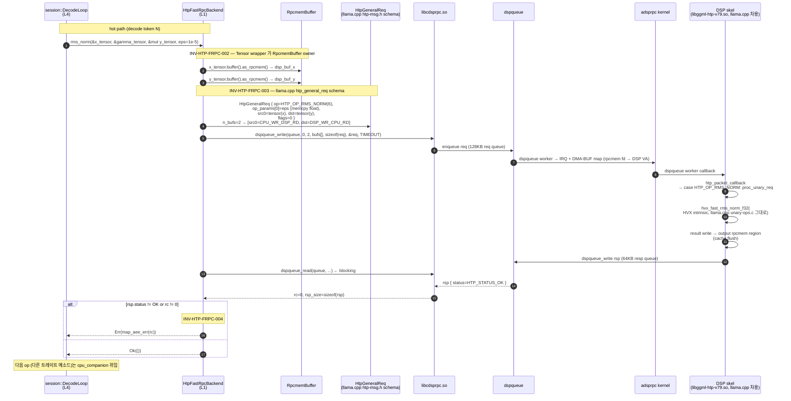

# HTP FastRPC Backend — Architecture (PoC)

> **상태**: Draft v0.1 (2026-05-26, Q-2.2-α PoC 진입)
> **대상 스펙**: `spec/htp_fastrpc.md` (`INV-HTP-FRPC-001 ~ 005`)
> **범위**: rms_norm 1 op 진짜 HTP 호출 + 나머지 method `cpu_companion` 위임. β/γ/δ 단계 method 매핑은 `papers/eurosys2027/_workspace/experiment/qnn_q22_dryrun_fastrpc_2026_05_26/backend_interface_matrix.md` 참조.
> **차용 베이스**: llama.cpp `ggml/src/ggml-hexagon/` (MIT). 본 디렉토리 안의 host binding 패턴(`ggml-hexagon.cpp::init_dsp/open_session/dspqueue_create`) 과 HVX skel rms_norm (`htp/unary-ops.c`) 을 차용.
> **dry-run 검증**: Q-2.2 dry-run B GREEN (4-step FastRPC handshake stock S25 통과, `papers/.../report.md`).

## 1. 설계 결정 요약

| 영역 | 결정 | 근거 |
|------|------|------|
| Backend 이름 | `htp_fastrpc` | QNN SDK 의존 0건이라 `qnn` prefix 회피. transport (`fastrpc`) + device family (`htp`) 이중 식별. `backend_interface_matrix.md` §3-1 |
| Spec INV prefix | `INV-HTP-FRPC-*` | `INV-QNN-OPPKG-*` / `INV-LAYER-*` 와 namespace 충돌 없음. matrix §3-2 |
| feature gate | `htp_fastrpc` (default OFF) | 다른 backend 와 mutually exclusive 아님. runtime `--backend` 로 선택 |
| PoC scope | rms_norm 1 op 한정 | HVX skel 차용 LOC 최소 + matrix §3-6 sprint α 진입 게이트 |
| llama.cpp 차용 정책 | MIT, namespace `llmrs_htp::rms_norm` rename, attribution 동봉 | 라이선스 합치 + 식별자 충돌 방지 |
| cpu_companion 주입 | `Backend::cpu_companion(&self) -> Option<&CpuBackend>` 로 owned CpuBackend 보유 | 60+ method 중 약 9 method 위임. 책임 분리 (NPU = 진짜 host, CPU = fallback) |
| QNN SDK 의존 | **0건** (libQnnHtp\*, libQnnHtpV79Skel.so 사용 안 함) | Q-2.1 dry-run RED 의 root cause 인 `domain_init` vendor control 우회. Q-2.2 dry-run B GREEN 으로 검증 |

## 2. Component 구조

```mermaid
flowchart TB
    subgraph L4 ["L4 session/ (orchestration)"]
        Init["init::SessionInitCtx<br/>--backend htp_fastrpc 분기"]
        Loop["decode_loop::DecodeLoop<br/>(trait 경유)"]
    end

    subgraph L2 ["L2 abstraction"]
        BackendTrait["backend::Backend trait<br/>(60+ method)"]
    end

    subgraph L1 ["L1 backend/htp_fastrpc/ (신규)"]
        Mod["mod.rs<br/>HtpFastRpcBackend<br/>(Backend trait impl)"]
        Host["host.rs<br/>HtpFastRpcHost<br/>(libcdsprpc.so dlopen<br/>+ 17 symbol dlsym<br/>+ handle/session lifecycle)"]
        Idl["idl.rs<br/>OpReqRmsNorm struct<br/>(host↔DSP packet schema)"]
        Buf["buffer.rs<br/>RpcmemBuffer<br/>(rpcmem_alloc/free wrapper)"]
        Err["error.rs<br/>map_aee_err()"]
    end

    subgraph L1cpu ["L1 backend/cpu/ (기존)"]
        CpuBe["CpuBackend<br/>(60+ method 구현)"]
    end

    subgraph DSP ["DSP-side (별도 빌드)"]
        Skel["htp_skel/<br/>(C source, Hexagon SDK)"]
        SkelLib["libllmrs_htp_v79.so<br/>(디바이스 push)"]
        RmsNormC["unary-ops.c::rms_norm<br/>(llama.cpp 차용, MIT)"]
    end

    subgraph Vendor ["Stock S25 /vendor/lib64/"]
        Cdsprpc["libcdsprpc.so<br/>(497 KB)"]
        Adsprpc["adsprpc kernel driver"]
    end

    Init --> Loop
    Loop -- "via Backend trait" --> BackendTrait
    BackendTrait -. "impl" .- Mod
    Mod --> Host
    Mod --> Idl
    Mod --> Buf
    Mod --> Err
    Mod -- "cpu_companion()" --> CpuBe
    Host -- "dlopen + dlsym 17" --> Cdsprpc
    Host -- "dspqueue_write/read" --> Adsprpc
    Adsprpc -- "IRQ + DMA-BUF" --> SkelLib
    Skel -. "llama.cpp Docker 빌드<br/>(Path B 차용)" .- SkelLib
    Skel -- "차용 base" --- RmsNormC
    Idl -. "schema = htp-msg.h" .- Skel

    style Mod fill:#3d2d5a
    style Host fill:#3d2d5a
    style Skel fill:#5a3d2d
    style RmsNormC fill:#5a3d2d
```



### 설명

`engine/src/backend/htp_fastrpc/` 는 5개 파일로 분해된다 — **mod.rs** (`Backend` trait impl, dispatch 및 cpu_companion 위임), **host.rs** (`libcdsprpc.so` dlopen + 17 symbol dlsym + handle/session/PD 라이프사이클, INV-HTP-FRPC-001/004 책임), **idl.rs** (host↔DSP packet schema, INV-HTP-FRPC-003 책임), **buffer.rs** (rpcmem allocator wrapper + RAII free, INV-HTP-FRPC-002 책임), **error.rs** (AEEResult → Error mapping, INV-HTP-FRPC-004 책임). 5 파일 분리 근거는 각 INV 와 1:1 매칭이라 검증 위치가 명확하기 때문. 후속 sprint 에서 op 가 추가되면 idl.rs 만 grow (op_req struct + op_id constant 추가) 하며 다른 파일은 변경 0.

DSP-side skel 은 **Path B 차용 정책**: 본 Rust workspace 와 별도로 `third_party/llama_cpp_htp/` 에 vendored 된 llama.cpp ggml-hexagon backend 를 Hexagon SDK Docker (`ghcr.io/snapdragon-toolchain/arm64-android:v0.3`) 안에서 빌드하여 산출물 `libggml-htp-v79.so` 만 디바이스에 push. Engine binary 는 본 .so 를 link 하지 않으며 runtime 에 FastRPC 가 dlopen 한다 (cdylib 격리, INV-151 정신 차용). 자체 IDL 정의 + qaic 컴파일 + HVX 자체 빌드는 **β 진입 시점 재검토** (현 PoC scope 외).

외부 의존 두 가지가 명확히 분리되어 있다 — (1) `/vendor/lib64/libcdsprpc.so` 는 stock S25 사전 배포 (497624 bytes, Q-2.2 dry-run 에서 확인), (2) `libggml-htp-v79.so` 는 Path B 빌드 산출물. (1) 의존은 ABI 호환만 책임이며 (2) 의존은 llama.cpp MIT 라이선스 attribution + 빌드 매뉴얼 (Docker 명령 1줄) 이 본 sprint commit 에 포함된다.

## 3. Data flow: rmsnorm 1회 호출 (Path B, dspqueue transport)



### 설명

호출 1회의 wall time = host overhead (packet 작성 + dspqueue_write) + dspqueue worker dispatch + DSP execute (HVX rms_norm) + dspqueue_write rsp + host dspqueue_read return. dry-run B 측정상 4-step session 준비 자체가 ~60 ms 이지만 process lifetime 1회 비용 (INV-HTP-FRPC-001). hot path 의 dspqueue round-trip 은 ~수십 μs 수준이어야 한다 — microbench `htp_rmsnorm` 이 3-way 비교로 측정.

DSP 측은 rpcmem fd 를 `fastrpc_mmap` 으로 DSP VA 에 매핑하여 HVX 로 직접 접근한다. host 측 vaddr 와 DSP 측 vaddr 가 다르므로 packet 안의 `htp_tensor.data` field 는 buffer offset (0) 이며, DSP 측 stub 가 `htp_packet_callback` 안에서 `bufs[i]` 의 mapped DSP ptr 로 patch 한다 (llama.cpp 그대로). `sync=true` 인 경우 dspqueue_write 직후 flush() 가 dspqueue_read 로 응답을 기다리며, `sync=false` 인 경우 다음 op enqueue 시점에 amortize.

**IDL method 부재**: `htp_iface.idl` 은 lifecycle 만 (start/stop/enable_etm/disable_etm). op dispatch path 에서 `remote_handle64_invoke` 호출 없음 — 모든 op 가 dspqueue message passing.

`map_aee_err` 의 진단 강화는 후속 sprint 작업 — 본 PoC 에서는 raw code wrap 만 한다 (INV-HTP-FRPC-004 의 "PoC scope" 표기).

## 4. Backend trait integration: 다른 backend 와 공존

```mermaid
flowchart LR
    subgraph CLI ["L5 bin/argus_cli or legacy/generate"]
        Arg["--backend htp_fastrpc<br/>(default OFF)"]
    end

    subgraph SESS ["L4 session::init"]
        Disp["match args.backend {<br/>  &quot;cpu&quot; → CpuBackend,<br/>  &quot;opencl&quot; → OpenCLBackend,<br/>  &quot;cuda&quot; → CudaBackend,<br/>  &quot;qnn_oppkg&quot; → QnnOppkgBackend,<br/>  &quot;htp_fastrpc&quot; → HtpFastRpcBackend,<br/>  _ → bail!(&quot;Unknown backend&quot;)<br/>}"]
    end

    subgraph BE ["L1 Backend impl 5종"]
        Cpu["CpuBackend<br/>(60+ method)"]
        Cl["OpenCLBackend<br/>(60+ method)"]
        Cu["CudaBackend<br/>(60+ method)"]
        Qnn["QnnOppkgBackend<br/>(60+ method, QNN SDK 의존)"]
        Htp["HtpFastRpcBackend<br/>(rms_norm 만 진짜 HTP,<br/>나머지는 cpu_companion 위임)"]
    end

    subgraph FALL ["내부 fallback"]
        HtpInner["HtpFastRpcBackend {<br/>  host: HtpFastRpcHost,<br/>  cpu_companion: CpuBackend  // ← 9 method 위임<br/>}"]
    end

    Arg --> Disp
    Disp --> Cpu
    Disp --> Cl
    Disp --> Cu
    Disp --> Qnn
    Disp --> Htp
    Htp -. "owns" .- HtpInner
    HtpInner -. "delegate matmul/silu/rope/etc" .- Cpu

    style Htp fill:#3d2d5a
    style HtpInner fill:#5a4d3d
```



### 설명

dispatch 분기는 `engine/src/session/init.rs` 의 기존 backend match 에 `"htp_fastrpc"` arm 만 추가한다. 다른 backend 호출 경로 (cpu/opencl/cuda/qnn_oppkg) 는 변경 0. `feature = "htp_fastrpc"` 가 OFF 일 때 본 arm 은 `#[cfg]` 로 컴파일에서 제거되며, unknown backend `bail!` 으로 빠진다 (INV-170 정신 차용).

`HtpFastRpcBackend` 는 `cpu_companion: CpuBackend` 를 **owned 필드** 로 보유한다. 본 PoC sprint 에서는 `Backend::rms_norm` 만 자체 HVX 호출이고, 다른 method (matmul / silu_mul / softmax / attention_gen / kv_scatter / ...) 는 모두 `self.cpu_companion.method(...)` 로 위임한다. 이 패턴은 `QnnOppkgBackend` 가 `OpenCLBackend` 를 secondary 로 보유하는 방식과 동등하며 (ENG-QNN-206), trait 추상화 위반 0 (caller 입장에서는 `Backend` 트레이트 단일).

CPU 위임 후 trait method 수를 단계적으로 HTP-native 로 옮기는 게 sprint β/γ/δ 의 작업 — backend_interface_matrix.md §3-3 의 22 (α) + 18 (β) + 5 (γ) + 15 (δ) 분포.

## 5. 외부 contributor 진입 경로

1. **HVX skel 작성자**: `htp_skel/` 디렉토리 안에서 작업. Hexagon SDK + llama.cpp `ggml/src/ggml-hexagon/htp/` 참조. namespace `llmrs_htp::*` 로 rename + MIT attribution 동봉 필수.
2. **host binding 확장자**: `engine/src/backend/htp_fastrpc/idl.rs` 에 새 op req struct 추가 (`OpReqMatMul` 등) + `mod.rs` 의 trait method 구현에서 dispatch + INV-HTP-FRPC-003 의 sub-INV (3-003-matmul) 를 spec/htp_fastrpc.md 에 등록.
3. **테스트 작성자**: `engine/tests/spec/test_inv_htp_frpc_{001..005}.rs` 5 파일 (후속 sprint 추가 예정). PoC sprint 에서는 microbench `htp_rmsnorm_correctness` 의 logcat 검증만.

## 6. 라이선스 및 attribution

- llama.cpp `ggml/src/ggml-hexagon/htp/unary-ops.c::rms_norm` HVX 코드 차용 — **MIT License**.
- `htp_skel/LICENSE-MIT-ggml-hexagon` 파일에 원문 MIT 라이선스 + 원작자 attribution 동봉.
- 본 sprint 의 PR 또는 패키지 안에 attribution 명시:

```
This file contains code derived from llama.cpp ggml-hexagon backend,
(c) Qualcomm Technologies, Inc. and llama.cpp contributors.
Licensed under the MIT License. See htp_skel/LICENSE-MIT-ggml-hexagon.
Namespace renamed: ggml_hexagon::rms_norm → llmrs_htp::rms_norm.
```

- `engine/src/backend/htp_fastrpc/host.rs` 의 17 symbol struct/매크로 정의는 `github.com/qualcomm/fastrpc/inc/remote.h` open source 헤더 기반 (이미 dry-run prototype `engine/microbench/htp_fastrpc_dryrun.rs` 에서 확인). 라이선스: BSD-3-Clause (Qualcomm 공개 헤더). 동일 attribution 패턴 적용.

## 7. ARCHITECTURE.md backend matrix 갱신

`ARCHITECTURE.md` 의 backend matrix (현재 §4 "Data Layout & Quantization" 뒤, §5 "핵심 인터페이스" 앞에 신설) 에 다음 행을 추가한다:

| Backend | feature | default | target | op coverage | 비고 |
|---------|---------|---------|--------|-------------|------|
| `cpu` (NEON/AVX2/Common) | (always) | ON | aarch64 / x86_64 / 기타 | 60+ method 전부 | reference impl |
| `opencl` | `opencl` | ON | 모든 arch | 60+ method 전부 | Adreno/Mali production |
| `cuda_embedded` / `cuda_pc` | `cuda` | OFF | aarch64 (Jetson) / x86_64 | 60+ method 전부 | sm_72+ |
| `qnn_oppkg` | `qnn` | OFF | aarch64-linux-android | 14-node layer graph (Qwen 2.5 1.5B) | QNN SDK 의존, S25 검증 |
| **`htp_fastrpc`** | **`htp_fastrpc`** | **OFF** | **aarch64-linux-android** | **rmsnorm only (PoC), matmul/attention coming in β/γ** | **QNN SDK 의존 0, FastRPC + 자체 HVX skel, S25 dry-run B GREEN** |

mutually exclusive 아님 — 동시 빌드 가능 (`--features htp_fastrpc,opencl,qnn`), runtime `--backend` 로 단일 선택.

## 8. 검증 게이트 (본 sprint 종료 시점)

- [ ] **spec 5 INV 완성**: `spec/htp_fastrpc.md` 의 INV-HTP-FRPC-001~005 각각 Statement/Why/Verification/Implementation/Status 5 field 모두 채움 → 본 sprint 작성 완료.
- [ ] **arch mermaid 3개**: component / data flow / integration → 본 문서 §2/§3/§4.
- [ ] **ARCHITECTURE.md backend matrix**: htp_fastrpc row 추가 → 본 문서 §7 (Implementer 가 ARCHITECTURE.md 에 patch 적용).
- [ ] **spec test 위치 명시**: `engine/tests/spec/test_inv_htp_frpc_{001..005}.rs` — 본 sprint 에서는 실제 test 작성 안 함, 후속 sprint (rmsnorm rmsnorm-correctness microbench 진입 시점) 에 추가 예정으로 명시.
- [ ] **llama.cpp 차용 라이선스 명시**: MIT, attribution 동봉, 본 문서 §6.

## 9. 후속 sprint 진입 조건

PoC (Q-2.2-α) 가 다음 게이트를 통과하면 β 진입:

1. `microbench_htp_rmsnorm_correctness` (Qwen 2.5 1.5B dim=1536, batch=1) 가 S25 디바이스에서 CPU reference 대비 `max_abs_err < 1e-3` (F32 tolerance).
2. wall-clock latency 측정 (CPU NEON 6T vs HTP FastRPC). HTP 가 50% slower 이하면 GREEN, 2× slower 이상이면 YELLOW (architectural fix 후 진행), 5× slower 이상이면 RED (sprint 보류 + 원인 분석).
3. 5 INV-HTP-FRPC-* 의 PoC scope 항목이 모두 spec test 또는 manual verification 으로 PASS.
4. logcat 의 `E adsprpc` 라인 0건 (Q-2.2 dry-run B GREEN 패턴 유지).

β 진입 시 matmul + attention + silu_mul (P0 hot-path 7개 중 rmsnorm 제외 6개) 가 본격 작업 대상이 되며, spec INV 가 packet schema 별로 sub-id (`INV-HTP-FRPC-003-matmul` 등) 로 확장된다.
