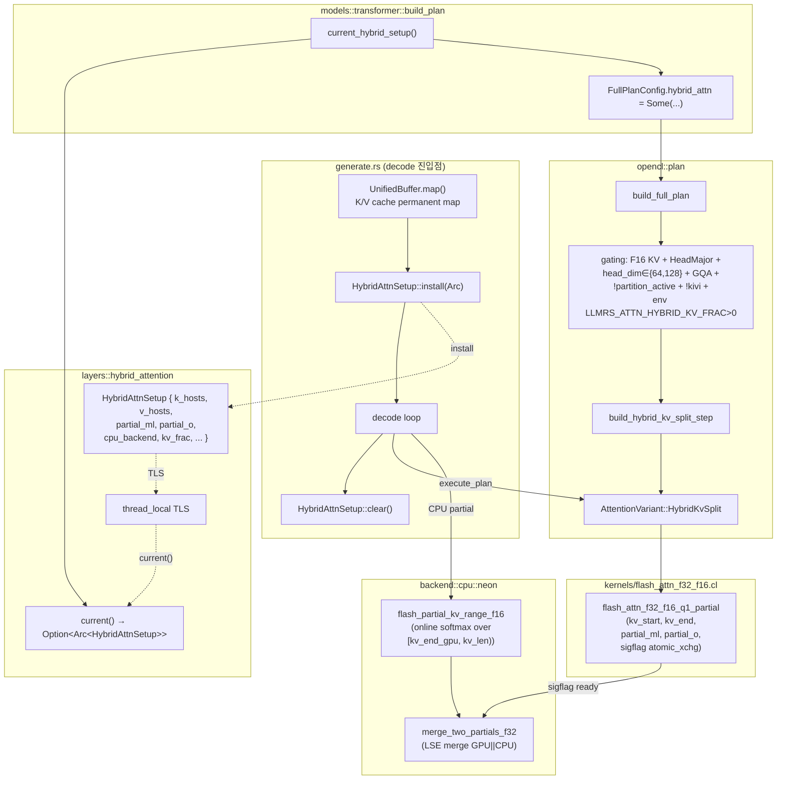

# Hybrid CPU-GPU Attention — UMA KV-split Flash Decoding 설계

> **상태**: Draft v1
> **작성**: 2026-04-24
> **대상**: Decode-only (seq_len == 1) attention step
> **전제**: UMA SoC (ARM Adreno/Mali), F16 KV cache + HeadMajor, head_dim ∈ {64, 128}, GQA
> **관계**: `arch/tensor_partition.md` (FFN 분할) 와 **배타**. 둘 다 CPU를 점유하므로 동시 사용 불가.

---

## 1. 개요

### 1.1 문제

현재 decode 경로의 attention 단계는 **GPU Q1 flash attention 커널**(`flash_attn_f32_f16_q1`, `engine/kernels/flash_attn_f32_f16.cl`)
이 n_kv 전 구간을 단독 처리한다. n_kv가 커질수록 (n ≥ 4000) attention이 per-token 병목이 되고,
같은 시간 CPU는 decode hot path에서 유휴 상태다.

UMA SoC는 KV cache를 `CL_MEM_ALLOC_HOST_PTR` 로 배치하면 GPU/CPU가 **동일 physical page**를 읽을 수
있다. FFN tensor partition과 유사한 원리를 attention에 적용하되 **weight 축이 아닌 KV 축(시퀀스 축)** 을
분할하여 GPU와 CPU가 서로 다른 K/V 구간을 동시에 흡수한 뒤 online softmax 결과를 merge한다.

### 1.2 핵심 아이디어 — KV-split Flash Decoding

Q1 flash attention은 **온라인 소프트맥스**로 구성되므로, KV 구간을 둘로 나눠 각각의 partial `(m, l, Õ)`
을 독립 계산한 뒤 LSE merge로 최종 `out`을 얻을 수 있다. (CPU 경로의 `flash_merge_partials` 이미
`engine/src/backend/cpu/neon.rs` 내부에서 동일한 LSE merge를 chunked decoding용으로 구현했다.)

분할 기준은 **최근성**이다:
- GPU 범위: `kv[0 .. kv_end_gpu)` — oldest tokens (긴 구간, GPU throughput 유리)
- CPU 범위: `kv[kv_end_gpu .. kv_len)` — 최근 tokens (짧은 구간, cache hit 유리 + GPU wait 없이 동시 실행)

이유:
1. 최근 토큰은 RoPE 기준으로 막 기록된 직후라 CPU L2에 이미 들어있을 확률이 높다.
2. CPU는 GPU enqueue 이후 자기 구간을 동기적으로 흡수할 수 있으므로 파이프라인 지연이 없다.
3. 커널 코드 분기 최소화 — GPU는 기존 Q1 경로에 `kv_start=0, kv_end=kv_end_gpu` 만 추가.

### 1.3 기대 효과

n≥4000 구간에서 TBT −5ms/tok 수준 기대. 작은 n(<1000)에서는 CPU 자원 경쟁과 merge 오버헤드로 **역효과**
가능하므로 env/CLI gate로 opt-in.

---

## 2. 컴포넌트 구성



### 2.1 신규/수정 파일 (구현 Phase에 전달)

| 경로 | 유형 | 역할 |
|---|---|---|
| `engine/src/layers/hybrid_attention.rs` | **신규** | `HybridAttnSetup` 구조체 + install/current/clear TLS API. Arc 기반 lifetime 보유(Plan 빌드 시 clone). |
| `engine/kernels/flash_attn_f32_f16.cl` | 추가 | `flash_attn_f32_f16_q1_partial` 커널 (기존 Q1 복제 후 정규화 제거, kv_start/kv_end 도입, partial_ml/partial_o 출력, sigflag atomic_xchg). |
| `engine/src/backend/opencl/plan.rs` | 수정 | `FullPlanConfig.hybrid_attn` 필드 추가, `AttentionVariant::HybridKvSplit` variant 추가, `build_hybrid_kv_split_step` 함수, `build_layer_plan` 내 gating. |
| `engine/src/backend/cpu/neon.rs` | 추가 | `flash_partial_kv_range_f16`(단일 KV 구간 online softmax, `flash_chunk_worker`/`flash_apply_token` 재활용), `merge_two_partials_f32`(`flash_merge_partials` 축약 — 두 partial만 merge). |
| `engine/src/bin/generate.rs` | 수정 | decode 진입점에서 (a) K/V UnifiedBuffer.map() 확보, (b) `HybridAttnSetup` install/clear, (c) KV resize 시 setup refresh. |
| `engine/src/models/transformer.rs` | 수정 | `build_plan` 내에서 `hybrid_attention::current()` 조회 후 FullPlanConfig에 전달. |

---

## 3. 설계 결정

### 3.1 `HybridAttnSetup` lifetime

Arc 기반으로 install. 이유:
- Plan은 layer_count 개수만큼 attention KernelStep을 retained_bufs 안에 `Mem` clone으로 보유한다.
- CPU partial 버퍼(`partial_ml`, `partial_o`)는 layer별 1개를 decode 전체에서 재사용. `Arc<Vec<...>>`로
  Plan·Setup 모두 가리킨다.
- `generate.rs`의 decode 루프가 끝나거나 KV가 grow 되면 `clear()` → 다음 token build_plan이 `None`을 보면
  기존 flash_attn_f32_f16_q1 경로로 복귀.

TLS 사용 이유: `build_plan`은 `&self`를 받는 순수 빌더 메서드. 인자 시그니처 변경을 최소화하기 위해
TLS에서 조회한다 (tensor_partition의 `partition_plan_enabled()` 등과 동일 패턴).

### 3.2 KV permanent map

`UnifiedBuffer::map()` 이 리턴하는 host pointer를 decode 생명주기 동안 유지. 이미 `memory.rs` KV alloc
경로는 `CL_MEM_ALLOC_HOST_PTR` 를 사용(`alloc_kv` → `UnifiedBuffer::new`)하고, FFN partition의 residual도
`LLMRS_PARTITION_ZCOPY_RESIDUAL` 경로에서 permanent map을 확보한다(`plan.rs` `residual_host_ptr` 필드).
동일 패턴 적용:

1. `generate.rs` decode 진입 직전 각 layer의 `k_buffer`/`v_buffer` 에 대해 `UnifiedBuffer::map()` 호출.
   실패(discrete GPU 등) 시 hybrid attention 자체를 disable.
2. 반환된 `*const u8` (실제로는 `*const half::f16`)를 `HybridAttnSetup.k_hosts[layer_idx]`,
   `v_hosts[layer_idx]` 에 저장.
3. KV resize(`grow`) 시점에 전체 setup 재구성 (grow는 버퍼 교체를 수반하므로 pointer 무효화).

### 3.3 GPU partial kernel 설계 (`flash_attn_f32_f16_q1_partial`)

기존 `flash_attn_f32_f16_q1` 과의 차이만 기술:

| 항목 | Q1 (기존) | Q1_partial (신규) |
|---|---|---|
| KV 범위 | `for k in tid .. n_kv step Q1_WG_SIZE` | `for k in (kv_start + tid) .. kv_end step Q1_WG_SIZE` |
| 정규화 | `o_row[i] = local_o_comp[0] / l_final` | **제거** — `Õ = Σ p · V` (un-normalized) 그대로 기록 |
| 출력 | `o_row` only | `partial_ml[head_idx]`(m, l)  + `partial_o[head_idx * head_dim_v]`(Õ) |
| score 출력 | args 40-43 | **제거** (partial 단계는 정규화 이전이므로 post-softmax weight 작성 불가) |
| sigflag | 없음 | 마지막에 `barrier(CLK_GLOBAL_MEM_FENCE)` + `atomic_xchg(ready_flag, 1)` ← partition sigflag와 동일 release 패턴 |

**Adreno 주의**(커널 수정 시): DK=128 경로에서 per-thread `q_priv[DK_VEC]`, `o_acc[DV_VEC]` 가 각각 32 float4.
partial 버퍼 쓰기는 atomic 불필요(head별 disjoint)이지만 register 추가 할당을 금지한다. 기존 Q1 register
footprint 그대로 유지해야 spill을 피한다 (feedback_adreno_gpu_kernel_state_limit).

### 3.4 CPU partial 함수 (`flash_partial_kv_range_f16`)

기존 `CpuBackendNeon::flash_chunk_worker` (neon.rs ~L903) + `flash_apply_token` (~L1006) 재활용. 차이:
- 단일 "chunk" (= `[kv_end_gpu, kv_len)`) 만 처리.
- `FlashDecodeCtx` 대신 lighter per-head ctx. Multi-kv-head는 rayon/SpinPool `dispatch(num_heads_kv)`.
- 출력: partial slot(`m, l, Õ`) — layer별 SoA `[num_heads_q]` 배열. GPU partial slot과 **별도 영역** 이고
  CPU merge 단계에서 두 개를 LSE로 합성.

### 3.5 Merge (`merge_two_partials_f32`)

기존 `flash_merge_partials` (neon.rs ~L1099) 는 n_chunks 개 partial을 reduce 하지만, 여기서는 항상 2개.
단순화된 버전:

```
for q_h in 0..num_heads_q:
    m_max = max(ml_gpu[q_h].m, ml_cpu[q_h].m)
    α_gpu = exp(ml_gpu.m - m_max); α_cpu = exp(ml_cpu.m - m_max)
    l = α_gpu * ml_gpu.l + α_cpu * ml_cpu.l
    O = α_gpu * Õ_gpu + α_cpu * Õ_cpu   // NEON fma
    out[q_h] = O / l
```

fallback: 한 쪽이 `m = -inf`이면 다른 쪽만 normalize (Õ / l). 둘 다 `-inf` 는 불가능 (kv_len > 0 보장,
gating이 이를 검사).

### 3.6 Sync 전략

1. GPU Q1_partial enqueue → `flush()` 호출하여 driver에게 제출.
2. CPU 자신의 partial 계산 (blocking NEON). GPU와 자연스럽게 병렬.
3. CPU partial 완료 후 **sigflag spin-poll** (FFN partition과 동일 패턴). 타임아웃은 `MAX_SPINS=50M`.
4. flag 관측 후 `std::sync::atomic::fence(Acquire)` → GPU partial slot을 읽어 merge.
5. merge 결과를 `out_attn_buf` (ALLOC_HOST_PTR) 에 직접 기록 → 다음 `kernel_matmul_wo` 가 GPU에서 읽을 때
   ARM UMA에서 일관성 확보용 Release fence.

`LLMRS_ATTN_HYBRID_WAIT_GPU=1` 시 sigflag 대신 `clFinish(queue)` 로 fallback — partition의 WAIT_GPU env
선례와 동일.

---

## 4. 배타 조건 (gating)

`build_layer_plan`의 attention 선택 블록(`plan.rs` L2594 `use_flash` 조건) **이후** 다음 gate를 통과할 때만
`AttentionVariant::HybridKvSplit` 로 대체:

| 조건 | 검사 위치 | 실패 시 |
|---|---|---|
| F16 KV dtype | build_plan (layer 0 KV buffer dtype) | `use_flash` 경로 유지 |
| HeadMajor 레이아웃 | 이미 `use_flash`가 요구 — 동일 predicate 재사용 | 해당 |
| head_dim ∈ {64, 128} | 동일 | 해당 |
| GQA (`n_heads_q > n_kv_heads`) | LlamaConfig | 비분할 attention 유지 |
| FFN tensor partition 비활성 | `config.partition_layers.as_ref().map_or(true, \|v\| v.iter().all(Option::is_none))` | CPU 경쟁 방지 → flash 유지 |
| KIVI / eviction_qcf 비활성 | 별도 플래그(KIVI는 full plan이 아님; eviction_qcf는 `needs_attention_scores` 로 드러남) | 기존 legacy/flash 유지 |
| `HybridAttnSetup::current().is_some()` | 빌더 호출 시점 | 해당 |
| env `LLMRS_ATTN_HYBRID_KV_FRAC > 0` | setup install 조건 | setup install 자체를 건너뜀 |
| n_kv ≥ HYBRID_N_THRESHOLD (기본 1000) | 런타임 — kv_end_gpu 계산 시 `if n_kv < threshold: kv_end_gpu = n_kv` (CPU range empty → 기존 경로와 동일 연산) | 자동 소프트 fallback |

**설계 노트**: CPU range가 비는 경우(런타임 n_kv < threshold) 커널을 두 번 invoke 하지 않고 CPU partial 단계를
no-op 처리 + GPU partial을 full range로 실행 + merge는 CPU partial을 `m=-inf, l=0` 로 전달해 zero contribution
처리. 이렇게 하면 plan 재빌드 없이 매 토큰 동적 결정 가능.

---

## 5. 정확성 보장

### 5.1 Bit-exact 비교 기준

기존 `flash_attn_f32_f16_q1` 단독 실행 결과와의 ULP 차이는 **online softmax 누적 순서 변경** 으로 인해
정확히 0은 아니지만, LSE merge의 수치 안정성은 `flash_merge_partials` 가 이미 검증한 영역이다. 허용 기준:

- F32 accumulator 상대 오차: `|Δ| ≤ 1e-4 × sqrt(head_dim)` (prefill flash path 검증 기준 재사용,
  neon.rs `assert_close` 톨러런스).
- 생성 token ID: temperature=0 greedy에서 최소 64 토큰까지 hybrid 활성 / 비활성 결과가 **완전히 동일** 해야 함.
  divergence 시 hybrid path 버그로 판정.

### 5.2 필요 테스트 (Implementer 테스트 작성 시 참조)

`tests/spec/` 하위에 다음을 배치할 것:

1. **unit**: `merge_two_partials_f32` 에 대한 property test — single-partial 케이스(한 쪽 m=-inf)에서 원본
   online softmax 결과와 비교.
2. **unit**: `flash_partial_kv_range_f16` 을 full range `[0, n_kv)` 로 호출 → 출력 Õ/m/l 조합을 재정규화한
   값이 `attention_gen_f16_neon_flash` 결과와 일치.
3. **integration** (OpenCL 사용 가능 환경): `flash_attn_f32_f16_q1_partial` + CPU partial + merge 로
   생성한 `out` 이 `flash_attn_f32_f16_q1` 단독 결과와 허용 tol 내 일치 (head_dim=64, 128 각각).
4. **integration**: env gate 동작 — `LLMRS_ATTN_HYBRID_KV_FRAC=0` 일 때 AttentionVariant가
   `StandardFlash`로 유지되는지.
5. **regression**: FFN tensor partition (`--tensor-partition 0.5`) 과 hybrid attention을 동시에 켰을 때
   hybrid 경로가 gating에 의해 비활성화되는지 (CPU 경쟁 방지).

---

## 6. 성능 모델

### 6.1 손익 분기점

| n_kv | GPU Q1 단독 | GPU kv[0..0.5n] + CPU kv[0.5n..n] | 예상 Δ |
|---|---|---|---|
| 500 | ~0.5 ms | CPU: 0.3 ms × 8 kv_heads / 6T ≈ 0.4 ms + GPU 0.25 ms + merge 0.05 ms ≈ 0.7 ms | **−0.2 ms (loss)** |
| 2000 | ~2.0 ms | GPU 1.0 + CPU 1.6 / 6 = 0.27 + merge 0.05 ≈ 1.1 ms | +0.9 ms gain |
| 4000 | ~4.0 ms | GPU 2.0 + CPU 3.2/6=0.53 + merge 0.05 ≈ 2.1 ms | +1.9 ms gain |
| 8000 | ~8.0 ms | GPU 4.0 + CPU 6.4/6=1.07 + merge 0.05 ≈ 4.1 ms | +3.9 ms gain |

사용자 보고된 "n=4000+에서 −5 ms/tok" 목표는 kv_frac 튜닝(예: 0.3 — CPU 부담 축소) 으로 달성 가능 범위.

### 6.2 threshold 및 env 튜닝

- `LLMRS_ATTN_HYBRID_N_THRESHOLD=1000` (기본) — 이 값 미만이면 런타임 CPU range empty로 자동 소프트 비활성.
- `LLMRS_ATTN_HYBRID_KV_FRAC=0.5` — CPU가 담당할 tail 비율. 0.0 이면 hybrid 전체 disable.
- `LLMRS_ATTN_HYBRID_WAIT_GPU=1` — sigflag 대신 clFinish fallback (디버깅용).

### 6.3 한계

1. n_kv < 1000: 손실. threshold로 방어.
2. GQA ratio=1 (MHA): CPU 분담 시 cache pressure 커짐. gating으로 제외.
3. FFN partition과 공존 불가 — 둘 다 CPU decode hot path를 점유하므로. 공존 시 FFN partition 우선
   (이미 검증된 경로).
4. Score 출력 요구 시(eviction_qcf 활성) partial 커널 불가 — `Standard` (kernel_attn_gen_half) 경로로 fallback.

---

## 7. 리스크

### 7.1 기능 회귀

| 리스크 | 심각도 | 완화 |
|---|---|---|
| GPU Q1 경로 회귀 (버퍼 명세 변경) | 중간 | 기존 `flash_attn_f32_f16_q1` 는 그대로 유지, 신규 Q1_partial 만 추가. `use_flash` gate는 동일. |
| HybridAttnSetup 재진입 (batch → non-batch 전환) | 높음 | `install/clear` pair를 decode 진입/탈출에 **각각 1회**. Batch 경로는 별도 decode loop (~L2610) → 해당 경로에는 hybrid 비활성 (v1 범위 제한). |
| KV grow 후 stale host pointer | 높음 | grow 콜백(cache_manager `grow_cache`)에 setup refresh hook. 현 상태에서는 매 토큰 `kv_caches[0].capacity()` 를 감시하고 변경되면 `clear → install` 재수행. |

### 7.2 성능 리스크

| 리스크 | 심각도 | 완화 |
|---|---|---|
| n<1000 영역 역효과 | 중간 | threshold 기본값 1000 + CPU range empty 시 no-op path. |
| CPU read-write amp (K/V HeadMajor contiguous but GQA 그룹 중복 읽기) | 낮음 | GQA inner loop는 CPU 경로가 이미 `flash_chunk_worker` 에서 수행(K/V 공유). |
| sigflag spin 낭비 (GPU가 CPU보다 오래 걸릴 때) | 낮음 | CPU partial 완료 후에야 spin 시작 → CPU가 늦은 경우 spin 없음. GPU가 늦으면 어쨌든 merge는 둘 다 완료 기다려야 함. |

### 7.3 호환성

- CUDA 백엔드: `UnifiedBuffer`는 CudaHostBuffer(pinned)로 동일 의미를 갖지만 Q1_partial 커널은 PTX 미구현.
  v1은 OpenCL 전용.
- NVIDIA OpenCL 호스트: fallback 커널이 이미 garbage라는 기록(project_nvidia_opencl.md) — gating으로 OpenCL
  사용 가능 & Adreno/Mali 조건 추가 검사 필요 (device_name 체크 또는 단순히 `is_zero_copy` 활성 여부).

---

## 8. Config/CLI/Env

### 8.1 Env

- `LLMRS_ATTN_HYBRID_KV_FRAC` — `f32 in (0.0, 1.0]`. 기본 0.0(disable). CPU가 담당하는 kv tail 비율.
- `LLMRS_ATTN_HYBRID_N_THRESHOLD` — `usize`. 기본 1000. 이 값 미만 n_kv에서는 자동 소프트 fallback.
- `LLMRS_ATTN_HYBRID_WAIT_GPU` — unset / `1`. 기본 unset(sigflag 사용). 디버그 시 `1` 설정해 clFinish fallback.

### 8.2 CLI

v1은 env 전용. 안정화 후 `--hybrid-attn-kv-frac` CLI 플래그를 추가 고려 (매뉴얼 튜닝 필요 시).

### 8.3 배타 플래그

- `--tensor-partition` > 0: hybrid attention 자동 비활성 (gating에서 partition_layers 존재 검사).
- `--kivi` / `--kv-offload`: 별도 full plan 경로 — hybrid 미적용.
- `--profile` / `--profile-events`: plan 자체가 비활성화되므로 hybrid도 자동 off.

---

## 9. 관계 문서

- `arch/tensor_partition.md` — CPU-GPU FFN 분할. CPU 점유 측면에서 **배타**.
- `arch/plan_partition_integration.md` — plan/partition 통합 패턴. sigflag/permanent-map 선례 참조.
- `docs/00*` 류 — 전체 decode pipeline. hybrid attention은 attention step만 대체하며 나머지 step은 기존 plan
  경로 그대로 사용.
