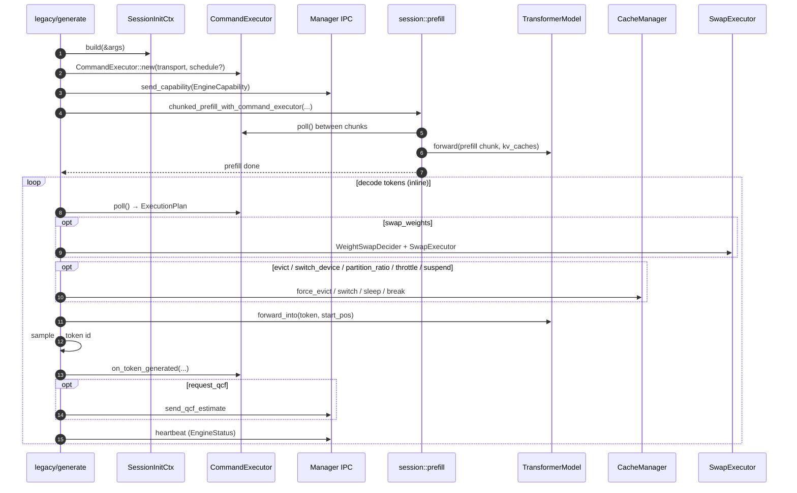

# Inference Pipeline — DecodeLoop SOLID 분해 + 빌더 설계

> **v1 (Phase 4-2/4-3/4-4-2.3 7-trait, 2026-05-16~25)** — 본 문서.
> **v3 (Hook pattern, 2026-05-27 grill 결정)** — `arch/pipeline_stage_design.md` 참조.
>
> **본 문서(v1) 운명**: Phase β 시점에 v3 기준으로 **v2로 재작성** 예정. 본 sprint 외 별 sprint scope. v1의 `EvictionStage` / `SwapStage` / `CommandSource` / `DecodeObserver` 4 trait는 v3에서 단일 `PipelineStage` trait로 흡수 폐기, `Forward` / `TokenSampler` 2 trait + `DecodeLoopBuilder` typestate는 보존 (`pipeline_stage_design.md` §10.1 보존/철회 매트릭스 참조).
> **v1 → v3 보존**: INV-LAYER-006/007 (DecodeLoop 추상화 결합도 + typestate builder), `SessionInitCtx` (Phase 4-1 산출물), `Forward` + `TokenSampler` trait 시그니처. v3 진입 후에도 정합 유지.

> spec/01-architecture.md §3.8 (SYS-100, SYS-105) + `INV-LAYER-005/006/007`의 구현 설계. legacy `bin/generate.rs` 13,017 LOC 중 `main()` 7,051 LOC을 6개 trait 추상화 + typestate builder로 분해하기 위한 설계. **본 문서는 2026-05-16 finalize 시점 설계 단일 진실 원본**이며 일부 단계는 이미 구현 완료되었다.

본 문서의 trait API와 빌더 시그니처는 `engine/src/session/decode_loop.rs` + `engine/src/session/traits.rs` + `engine/src/session/defaults.rs` 로 이식 완료되었다 (Phase 4-2 HEAD `584496b7`). 시그니처 변경은 본 문서의 갱신을 동반한다.

## 컴포넌트 — `session/` 디렉토리 (Post Phase 4-2/4-3/4-4-2.3, 2026-05-25 실측)

```mermaid
flowchart TB
    subgraph Bin ["L5 bin/"]
        argus[argus_cli]
        legacy[legacy/generate.rs<br/>monolith]
    end

    subgraph Sess ["L4 session/"]
        init[init::SessionInitCtx]
        std[standard_happy::<br/>run_standard_happy_path]
        asm[assembly::build_standard_loop]
        loop[decode_loop::<br/>DecodeLoop + Builder]
        tr[traits::*<br/>6 trait]
        def[defaults::*<br/>NoOp + Greedy]
        sa[samplers::<br/>RepetitionPenalty]
        fwd[forward/<br/>model / kivi / offload]
        prefill[prefill::*<br/>chunked, CommandExecutor poll]
        chat[chat/<br/>repl + session + stop_condition]
        chatipc[chat_ipc]
        chattmp[chat_template]
        eval[eval/<br/>hook + runner + eviction/kivi]
        batch[batch/<br/>args + runner + helpers]
        ppl[ppl/<br/>args + runner]
        decfb[decode_fallback/<br/>prologue + eviction_trigger + swap_dispatch]
        cli[cli/<br/>Args + KvMode + eviction]
        warm[warmup]
        qcfrt[qcf_runtime]
        dump[dump_importance]
    end

    argus --> init
    argus --> std
    std --> asm
    asm --> loop
    loop --> tr
    tr -. impl .- fwd
    tr -. default .- def

    legacy --> init
    legacy --> prefill
    legacy --> chat
    legacy --> eval
    legacy --> batch
    legacy --> ppl
    legacy --> decfb
    legacy --> qcfrt
    legacy --> dump
    legacy --> chat
    chat --> chatipc
    chat --> chattmp
    chat --> loop

    style argus fill:#2d5a3d
    style legacy fill:#5a3d2d
    style loop fill:#3d2d5a
    style tr fill:#3d2d5a
```



**파일 단위 진실원본**: `git ls-files engine/src/session/ | sort` 결과와 본 다이어그램이 1:1 매칭되어야 한다. drift 발견 시 본 절을 우선 갱신.

## 진행 현황 요약 (2026-05-25 시점)

| Phase | 상태 | HEAD | 비고 |
|-------|------|------|------|
| Phase 4-1 외곽 추출 (`SessionInitCtx`) | **DONE** | `f637722e` | main() 7,051 → 6,122 LOC. S25 OpenCL + Jetson CUDA 32-token bit-identical PASS. |
| Phase 4-2 trait + Builder + defaults | **DONE** | `584496b7` | +929 LOC. trybuild + spec test PASS. legacy generate.rs 변경 0. |
| Phase 4-3 `ModelForward` + probe microbench | **DONE** | `c63190d1` | S25 Δ=2.29%, host CPU Qwen2.5-1.5B Q4_0 Δ=1.53%. 게이트 5% 절반 이내. |
| Phase 4-4-2.3 a/c/b — prologue/eviction/swap 추출 | **DONE** | `9313670b` + `bcb221e2` + `02cb7106` | `decode_fallback/{prologue,eviction_trigger,swap_dispatch}.rs` 신설. generate.rs 5,778 → 4,953 (-14.3%). |
| Phase 4-4-2.3 d/e + 4-4-2.4 (main ≤400 LOC) | **CANCELED** | — | 방향 전환: legacy generate.rs 보존 + 다수 바이너리 분할 ([[generate-split-binaries]] backlog [P2]). |
| Phase 4-5 chat REPL 재작성 | **PARTIAL DONE** | (다수) | `session/chat/{repl,session,stop_condition}.rs` 신설. `core/chat_ipc.rs` → `session/chat_ipc.rs` 이관. `KiviForward`/`OffloadForward` 스텁 존재. |

### argus-cli 신규 진입점 (Phase 4-4 후속, 2026-05-25)

Phase 4-4-2.4 취소 결정의 결과로 새 진입점 `engine/src/bin/argus_cli.rs` 가 도입되었다. 진행 sub-sprint:
- **v1-1 RESOLVED** (HEAD `83d7cb4a`): resilience default-on (`--no-resilience` opt-out).
- **v1-2 pending**: `--prompt-batch` (`session::batch`).
- **v1-3 pending**: weight swap 8종 (`session::decode_fallback::swap_dispatch`).
- **v1-4 pending**: `--profile` / `--profile-events`.
- **v1-5 pending**: KIVI / Offload `--kv-mode`.
- **v1-6 pending**: `--tensor-partition > 0`.

argus-cli 는 현재 happy path (= `is_standard_happy_path(&args)`) 만 흡수하고 나머지를 `reject_unsupported_modes_v0()` 에서 명시적 차단. legacy generate 와 argus-cli 의 진입점 이분화는 ARCHITECTURE.md §Engine Architecture 참조.

## 두 진입점의 inference 시퀀스 (실측 코드 반영)

### argus-cli (happy path)

```mermaid
sequenceDiagram
    autonumber
    participant Cli as argus_cli::main
    participant Init as SessionInitCtx
    participant Std as run_standard_happy_path
    participant Asm as assembly::build_standard_loop
    participant Loop as DecodeLoop
    participant Fwd as ModelForward
    Cli->>Cli: Args::parse() + reject_unsupported_modes_v0
    Cli->>Init: build(&args)
    Init-->>Cli: SessionInitCtx
    Cli->>Std: StandardHappyCtx { ... }
    Std->>Asm: build_standard_loop(backend, memory, model, ...)
    Asm-->>Std: DecodeLoop (Box<dyn Forward=ModelForward> + defaults)
    Std->>Loop: prefill(tokens)
    Loop->>Fwd: prefill(tokens, start_pos=0)
    Fwd-->>Loop: last_logits
    Std->>Std: first_token = sampling::sample(...)
    Std->>Loop: run(budget, first_token)
    loop step
        Loop->>Loop: poll → drop (drift)
        Loop->>Loop: eviction.before_step → None
        Loop->>Loop: swap.before_step → ()
        Loop->>Fwd: step(ctx, prev)
        Fwd-->>Loop: logits
        Loop->>Loop: swap.after_step → ()
        Loop->>Loop: sampler.sample → tok
        Loop->>Loop: observers.on_step_end
    end
    Loop->>Fwd: finalize
    Loop-->>Std: DecodeResult
    Std->>Cli: tokenizer.decode + TBT 출력
```

### legacy generate (full feature path)



## Manager IPC wiring 격차 (Drift, follow-up 필요)

본 절은 *의도된 설계와 현재 코드 사이의 격차* 를 명시한다.

| 책임 | 의도된 설계 | 현재 코드 상태 |
|------|-------------|----------------|
| `CommandSource` slot | `ManagerCmdSource: CommandSource` 등록 (§8.1 매트릭스) | trait 슬롯 존재. `NoOpCommandSource` 만 default. `ManagerCmdSource` 구현체 0 LOC. |
| `cmd_source.poll()` 결과 소비 | `DecodeLoop::handle_command(cmd)` 가 ExecutionPlan 을 dispatch | `decode_loop.rs:121~122`: `let _cmd = self.cmd_source.poll(&ctx)?; // Command dispatch is Phase 4-3+; we accept and drop for now.` |
| ExecutionPlan 적용 (Throttle / Suspend / Evict / SwitchHw / SwapWeights / LayerSkip / PartitionRatio / SetTargetTbt) | DecodeLoop / forward stage / eviction stage / swap stage 협업 | **0 LOC in argus-cli path** — legacy generate.rs:2267 / 4277 / 4846 에서만 수행 |
| Outbound: capability / heartbeat / qcf estimate / weight swap report / on_token_generated | `OutboundSink` 또는 `DecodeObserver` 어댑터 | legacy 만 수행. DecodeLoop 외곽 hook 없음. |

**해소 후보 sprint**:
1. `session::command::manager_cmd_source.rs` 신설 — `Arc<Mutex<CommandExecutor>>` wrap.
2. `DecodeLoop::handle_command(EngineCommand)` 본문 구현 — eviction stage / swap stage / forward stage 로 dispatch.
3. `session::observer::manager_outbound_obs.rs` — `DecodeObserver` impl 로 capability + heartbeat + qcf 발신.
4. `argus-cli` v1-3 (weight swap) / v1-4 (profile) 흡수와 묶음 가능.

본 격차는 Phase 4-4-2.4 취소 결정 이전 가정 (= legacy generate ≤ 400 LOC 압축 후 모든 IPC 가 DecodeLoop 안으로 흡수) 의 부산물이다. 다수 바이너리 분할 방향으로 전환된 만큼, argus-cli 외 별 바이너리 (argus-chat / argus-bench / argus-eval) 도입 시 본 wiring 을 어디서 어떻게 공유할지 별 sprint 라운드 필요.

---

## 1. 책임 분해 (decode loop의 6개 변경축)

`main()` 안에서 매 토큰 루프가 수행하는 작업을 *변경 이유*(reason to change, SRP) 단위로 분리한다. 메인 세션 분석에서 식별된 6개 책임은 다음과 같다.

| # | 책임 | 변경 이유 (예시) | 현재 `main()` 보유 변수 (인용) |
|---|------|------------------|-------------------------------|
| 1 | **Forward 실행** | backend 교체 (CPU / OpenCL / CUDA / QNN), 변형 forward path (kivi / offload) | `backend`, `model`, `kv_caches`, `workspace`, `gpu_buffers`, `logits` |
| 2 | **Eviction trigger** | 정책 교체 (Sliding / H2O / D2O / None), SWIFT skip | `cache_manager`, `score_accumulator`, `skip_config`, `last_skip_ratio` |
| 3 | **Weight swap dispatch** | 알고리즘 교체 (sync / async / dynamic-K / phase-aware / probing-K) | 8개: `incremental_force_swap_plan`, `manager_swap_report_pending`, `ready_weight_swap_report`, `intra_forward_swap_hook`, `phase_aware_swap_dispatcher`, `async_swap_dispatcher`, `dynamic_k_controller`, `probing_k_controller` |
| 4 | **Command source** | 명령 source 교체 (Manager IPC / ScheduleFile / Stdin REPL) | `manager_client`, `experiment_schedule`, `command_executor` |
| 5 | **Token sampling** | 전략 교체 (greedy / temperature / top-k / top-p / spec-decoding seed) | `sampling_config` |
| 6 | **Observation** | 메트릭 추가/교체 (profiler / experiment writer / tbt log / system sampler) | `profiler`, `experiment_writer`, `tbt_log_writer`, `system_sampler`, `forward_ms_values`, `tbt_values` |

**파생 결정 (SRP 위반 회피)**: 6 책임 중 두 개를 한 trait에 합치면 *서로 다른 이유로 변경* 됨을 보여야 했으나, 모두 독립 변경 사례가 존재한다 — e.g. Forward는 그대로 두고 Eviction만 H2O→Sliding으로 교체한 실험이 다수 (Round 14/15), Swap만 sync→async로 교체한 ablation (Phase 6.5).

---

## 2. Trait API 정의

각 trait는 hot path 호출 빈도, mutability, lifetime 비용을 함께 명시한다. `&mut dyn` 가정. generic monomorphization은 §7에서 별도 검토.

### 2.1 `session::StepCtx` — 공유 read-only context

> **Trait 모듈 위치 (사용자 결정 #1)**: 본 절의 6 trait(`Forward`, `EvictionStage`, `SwapStage`, `CommandSource`, `TokenSampler`, `DecodeObserver`) 및 `StepCtx`는 **모두 L4 `session/` 산하**에 정의된다. `Forward`/`TokenSampler`를 L3 `inference/`로 끌어올리지 않는다 — 빌더와 한 모듈에 두는 단순성을 우선한다. 자세한 근거는 §11 "확정 결정" 참조.

```rust
/// Decode step 단위의 read-only context. DecodeLoop가 매 step 시작에서 빌드.
/// trait들은 mutate 불가. mutable state는 각 trait 구현체 내부 또는
/// DecodeLoop 자신의 카운터에만 보관.
pub struct StepCtx<'a> {
    pub pos: usize,              // 현재 KV pos (decode 직전)
    pub prev_token: u32,         // 직전 sample된 token (prefill 종료 직후엔 마지막 prompt token)
    pub kv_capacity: usize,      // 현재 cache의 max_seq_len
    pub decode_step: usize,      // 0부터 시작하는 decode iteration index
    pub stop_requested: &'a AtomicBool, // signal handler가 set
}
```

- **누가 생성?** `DecodeLoop::run` 루프 헤더가 매 iteration마다 stack에 빌드.
- **누가 mutate?** 아무도 안 함 (`&'a` shared reference). 카운터(`pos`, `decode_step`)는 다음 iteration 시작 시 새 값으로 재구성.
- **수명 전략**: `'a`는 단일 step scope. trait 메서드 안에서 `StepCtx`를 저장하지 못하도록 lifetime으로 막는다.

### 2.2 `session::Forward` (필수)

```rust
pub trait Forward {
    // ── 필수 메서드 (구현 강제) ─────────────────────────────────────
    /// Prefill 페이즈: prompt 전체를 한번에 처리. 마지막 위치 logits 반환.
    fn prefill(&mut self, tokens: &[u32]) -> anyhow::Result<Vec<f32>>;

    /// Decode 1 step. 호출 후 pos는 +1 효과를 가진다 (Forward 내부 KV 갱신).
    fn step(&mut self, ctx: &StepCtx, token: u32) -> anyhow::Result<Vec<f32>>;

    // ── lifecycle hook (default: no-op) ──────────────────────────────
    // 외부 기여자가 prefill/step만 구현하면 동작한다.
    // KV 상태를 관리하지 않는 단순 forward는 모두 default 사용 가능.

    /// 종료 직전 호출 (eos 또는 budget 소진). 마지막 logits/score flush 등.
    /// default: no-op
    fn finalize(&mut self) -> anyhow::Result<()> { Ok(()) }

    /// KV pos 동기화 — eviction stage가 KV에서 N토큰 제거 후 호출.
    /// default: no-op (KV를 보유하지 않는 forward는 무시).
    /// **주의**: KV 상태 보유 forward(ModelForward/KiviForward/OffloadForward)는
    /// 반드시 override하여 내부 카운터를 갱신해야 한다. default 사용 시
    /// eviction과 forward 사이 pos 불일치로 attention mask가 깨질 수 있다.
    fn on_kv_prune(&mut self, _new_pos: usize) { /* no-op */ }
}
```

- 호출 빈도: prefill 1회, step N회 (decode 토큰 수).
- 흡수할 변수(책임 #1 전부): `backend`, `model`, `kv_caches`, `workspace`, `gpu_buffers`, `logits`.
- 구현체 예시: `ModelForward` (표준), `KiviForward` (KIVI 2bit KV quant), `OffloadForward` (per-layer prefetch).
- **필수 메서드 typestate 강제**: `prefill`/`step` 미구현 시 trait impl 자체가 컴파일 실패. `build()`는 `HasForward` marker에서만 호출 가능 (INV-LAYER-007).
- **default no-op 메서드**: `finalize`, `on_kv_prune` — 외부 기여자가 prefill/step만 구현해도 컴파일 성공 (사용자 결정 #2). KV 관리가 필요한 구현체는 architect review 시 `on_kv_prune` override 여부를 게이트로 한다.

### 2.3 `session::EvictionStage` (선택)

```rust
pub enum EvictionOutcome {
    None,
    Pruned { removed: usize, new_pos: usize },
    Skipped { reason: SkipReason },  // SWIFT skip 트리거 등
}

pub trait EvictionStage {
    /// Forward::step 직전 호출. 압박 감지 + policy 적용.
    fn before_step(&mut self, ctx: &StepCtx) -> anyhow::Result<EvictionOutcome>;

    /// 옵션: turn 종료 또는 capacity 보장. chat REPL용.
    fn ensure_capacity(
        &mut self,
        ctx: &StepCtx,
        additional: usize,
    ) -> anyhow::Result<()> { Ok(()) }
}
```

- 호출 빈도: step당 1회 (`before_step`). chat 모드에선 `ensure_capacity` 추가 호출.
- 흡수할 변수(책임 #2): `cache_manager`, `score_accumulator`, `skip_config`, `last_skip_ratio`.
- 구현체 예시: `CacheManagerStage` (현 `CacheManager` 래핑), `NoEvictionStage` (no-op).
- No-op default: `NoEvictionStage` — `EvictionOutcome::None` 반환.

### 2.4 `session::SwapStage` (선택)

```rust
pub trait SwapStage {
    /// Forward::step 직전: prefetch/load 트리거.
    fn before_step(&mut self, ctx: &StepCtx) -> anyhow::Result<()>;

    /// Forward::step 직후: commit/release 트리거.
    fn after_step(&mut self, ctx: &StepCtx) -> anyhow::Result<()>;

    /// Manager 측 SwapReport 가용 여부 (heartbeat 동봉용).
    fn pending_report(&mut self) -> Option<llm_shared::WeightSwapReport> { None }
}
```

- 호출 빈도: step당 2회. hot path지만 default 구현은 zero-cost (vtable + empty fn body).
- 흡수할 변수(책임 #3 전부 8개): `incremental_force_swap_plan`, `manager_swap_report_pending`, `ready_weight_swap_report`, `intra_forward_swap_hook`, `phase_aware_swap_dispatcher`, `async_swap_dispatcher`, `dynamic_k_controller`, `probing_k_controller`.
- 구현체 예시: `SyncSwapStage`, `AsyncSwapStage`, `PhaseAwareSwapStage`, `ProbingKSwapStage`, `NoSwapStage`.
- No-op default: `NoSwapStage` — 두 메서드 모두 `Ok(())`.

### 2.5 `session::CommandSource` (선택)

```rust
pub trait CommandSource {
    /// 1 step 내에 들어온 command (있다면) 반환. Non-blocking.
    fn poll(&mut self, ctx: &StepCtx) -> anyhow::Result<Option<EngineCommand>>;
}
```

- 호출 빈도: step당 1회.
- 흡수할 변수(책임 #4): `manager_client`, `experiment_schedule`, `command_executor`.
- 구현체 예시: `ManagerCmdSource` (IPC), `ScheduleCmdSource` (timed schedule), `StdinCmdSource` (chat REPL), `NoCommandSource`.
- No-op default: `NoCommandSource` — 항상 `Ok(None)`.

### 2.6 `session::TokenSampler` (필수, default 제공)

```rust
pub trait TokenSampler {
    fn sample(&mut self, ctx: &StepCtx, logits: &[f32]) -> u32;
}
```

- 호출 빈도: step당 1회.
- 흡수할 변수(책임 #5): `sampling_config`.
- 구현체 예시: `GreedySampler`, `TempSampler`, `TopKSampler`, `TopPSampler`, `MixedSampler`.
- Default: `GreedySampler` (단순 argmax) — `Forward`와 달리 typestate 강제 안 함. 빌더에서 미지정 시 자동 적용 (compile time).

### 2.7 `session::DecodeObserver` (선택, multi)

```rust
pub trait DecodeObserver {
    fn on_prefill_end(&mut self, ctx: &StepCtx, last_logits: &[f32]) {}
    fn on_step_end(&mut self, ctx: &StepCtx, sampled: u32, step_ms: f64) {}
    fn on_eviction(&mut self, ctx: &StepCtx, outcome: &EvictionOutcome) {}
    fn finalize(&mut self) -> anyhow::Result<()> { Ok(()) }
}
```

- 호출 빈도: step당 1~3회 (eviction outcome이 None 외인 경우만 `on_eviction` 호출).
- 흡수할 변수(책임 #6): `profiler`, `experiment_writer`, `tbt_log_writer`, `system_sampler`, `forward_ms_values`, `tbt_values`.
- 구현체 예시: `ProfilerObs` (현 `Profiler`), `ExperimentWriterObs`, `TbtLogObs`, `SystemSamplerObs`, `EventSinkAdapterObs` (§6 참조), `NoOpObserver`.
- No-op default: `NoOpObserver`.
- **다중 등록**: builder에 `.add_observer(...)`를 반복 호출하여 `Vec<Box<dyn DecodeObserver>>`로 누적. `DecodeLoop`는 매 step 끝에 전체 vec를 순회.

---

## 3. `session::DecodeLoop` 구조

> **모듈 경로**: 본 절의 `DecodeLoop`, `DecodeLoopBuilder`, `StepCtx`, `DecodeResult`, `StopReason`은 모두 `session::*`로 노출된다. concrete type 이름은 `session/mod.rs`(또는 `session/decode_loop.rs`)에서 `pub use`로 재출력한다.

### 3.1 필드와 메서드

```rust
pub struct DecodeLoop {
    forward: Box<dyn Forward>,          // session::Forward
    eviction: Box<dyn EvictionStage>,   // session::EvictionStage
    swap: Box<dyn SwapStage>,           // session::SwapStage
    cmd_source: Box<dyn CommandSource>, // session::CommandSource
    sampler: Box<dyn TokenSampler>,     // session::TokenSampler
    observers: Vec<Box<dyn DecodeObserver>>, // session::DecodeObserver

    // 내부 카운터 (변경축 없음 — DecodeLoop 자신의 SRP)
    pos: usize,
    decode_step: usize,
    stop_flag: Arc<AtomicBool>,
}

pub struct DecodeResult {
    pub tokens: Vec<u32>,
    pub stopped_by: StopReason,
}

impl DecodeLoop {
    pub fn prefill(&mut self, tokens: &[u32]) -> anyhow::Result<Vec<f32>> {
        let logits = self.forward.prefill(tokens)?;
        self.pos = tokens.len();
        let ctx = StepCtx { pos: self.pos, prev_token: *tokens.last().unwrap(),
                            kv_capacity: 0, decode_step: 0, stop_requested: &self.stop_flag };
        for obs in &mut self.observers { obs.on_prefill_end(&ctx, &logits); }
        Ok(logits)
    }

    pub fn run(&mut self, budget: usize) -> anyhow::Result<DecodeResult> {
        let mut out = Vec::with_capacity(budget);
        let mut last_logits = vec![]; // 또는 prefill에서 전달받음
        let mut prev_token = 0u32;

        for step in 0..budget {
            if self.stop_flag.load(Ordering::Relaxed) { return Ok(DecodeResult { tokens: out, stopped_by: StopReason::Signal }); }

            let ctx = StepCtx {
                pos: self.pos, prev_token,
                kv_capacity: 0, decode_step: step, stop_requested: &self.stop_flag,
            };

            // (a) command poll
            if let Some(cmd) = self.cmd_source.poll(&ctx)? { self.handle_command(cmd)?; }

            // (b) eviction
            let evict = self.eviction.before_step(&ctx)?;
            if let EvictionOutcome::Pruned { new_pos, .. } = evict {
                self.forward.on_kv_prune(new_pos);
                self.pos = new_pos;
            }
            for obs in &mut self.observers { obs.on_eviction(&ctx, &evict); }

            // (c) swap before
            self.swap.before_step(&ctx)?;

            // (d) forward
            let t0 = std::time::Instant::now();
            let logits = self.forward.step(&ctx, prev_token)?;
            let step_ms = t0.elapsed().as_secs_f64() * 1000.0;

            // (e) swap after
            self.swap.after_step(&ctx)?;

            // (f) sample
            let sampled = self.sampler.sample(&ctx, &logits);
            out.push(sampled);
            prev_token = sampled;
            self.pos += 1;
            last_logits = logits;

            // (g) observers
            for obs in &mut self.observers { obs.on_step_end(&ctx, sampled, step_ms); }

            if self.is_stop_token(sampled) { return Ok(DecodeResult { tokens: out, stopped_by: StopReason::Eos }); }
        }
        Ok(DecodeResult { tokens: out, stopped_by: StopReason::Budget })
    }

    pub fn finalize(mut self) -> anyhow::Result<()> {
        self.forward.finalize()?;
        for mut obs in self.observers { obs.finalize()?; }
        Ok(())
    }

    fn handle_command(&mut self, cmd: EngineCommand) -> anyhow::Result<()> { /* eviction.target_ratio, swap.cancel 등 dispatch */ Ok(()) }
    fn is_stop_token(&self, t: u32) -> bool { /* eos / stop_ids 매칭 */ false }
}
```

### 3.2 Lifetime 전략 비교

| 옵션 | 시그니처 | 장점 | 단점 | 채택 |
|------|---------|------|------|------|
| (a) `<'a>` 단순 | `struct DecodeLoop<'a> { forward: &'a mut dyn Forward, ... }` | zero allocation. trait object 비용 0 추가. | builder가 모든 구현체의 lifetime을 호출자로 lift해야 함. chat REPL/IPC 비동기 분기 시 lifetime hell. | X |
| (b) **owned `Box<dyn>`** | `struct DecodeLoop { forward: Box<dyn Forward>, ... }` | builder가 owned로 받음 → caller-side lifetime free. trait object 1회 alloc(start-up). | Box vtable indirection — §7에서 별도 측정. | **O** |
| (c) `Arc<dyn>` | `struct DecodeLoop { forward: Arc<dyn Forward + Send + Sync>, ... }` | observer를 background thread에 공유 가능. | mutate 시 `Arc<Mutex<...>>` 필요 → 매 step lock. hot path에 부담. | X (observer만 필요 시 별도 검토) |

**채택: (b)**. 매 step 5+N개 vtable 호출은 ARM A-class out-of-order에서 ~50-100 ns 수준이며, Adreno 14 ms TBT 대비 0.5% 미만이다 (§7 측정 게이트로 검증).

---

## 4. 빌더 패턴 설계 (typestate)

> **모듈 경로**: `session::DecodeLoopBuilder`, `session::NoForward`, `session::HasForward` 모두 `session/decode_loop.rs`에 정의. 사용자는 `use llm_rs2::session::DecodeLoopBuilder;` 1줄로 시작.

### 4.1 typestate marker

```rust
// engine/src/session/decode_loop.rs
pub struct NoForward; pub struct HasForward(Box<dyn Forward>);

pub struct DecodeLoopBuilder<F = NoForward> {
    forward: F,
    eviction: Option<Box<dyn EvictionStage>>,
    swap: Option<Box<dyn SwapStage>>,
    cmd_source: Option<Box<dyn CommandSource>>,
    sampler: Option<Box<dyn TokenSampler>>,
    observers: Vec<Box<dyn DecodeObserver>>,
    stop_flag: Option<Arc<AtomicBool>>,
}
```

### 4.2 빌더 API

```rust
impl DecodeLoopBuilder<NoForward> {
    pub fn new() -> Self { /* all None / empty */ unimplemented!() }

    pub fn with_forward<T: Forward + 'static>(self, fwd: T) -> DecodeLoopBuilder<HasForward> {
        DecodeLoopBuilder {
            forward: HasForward(Box::new(fwd)),
            eviction: self.eviction, swap: self.swap, cmd_source: self.cmd_source,
            sampler: self.sampler, observers: self.observers, stop_flag: self.stop_flag,
        }
    }
}

impl<F> DecodeLoopBuilder<F> {
    pub fn with_eviction<T: EvictionStage + 'static>(mut self, e: T) -> Self { self.eviction = Some(Box::new(e)); self }
    pub fn with_swap<T: SwapStage + 'static>(mut self, s: T) -> Self { self.swap = Some(Box::new(s)); self }
    pub fn with_cmd_source<T: CommandSource + 'static>(mut self, c: T) -> Self { self.cmd_source = Some(Box::new(c)); self }
    pub fn with_sampler<T: TokenSampler + 'static>(mut self, s: T) -> Self { self.sampler = Some(Box::new(s)); self }
    pub fn add_observer<T: DecodeObserver + 'static>(mut self, o: T) -> Self {
        self.observers.push(Box::new(o)); self
    }
    pub fn with_stop_flag(mut self, f: Arc<AtomicBool>) -> Self { self.stop_flag = Some(f); self }
}

// **핵심**: build()는 HasForward 상태에서만 가능 — INV-LAYER-007 컴파일 강제.
impl DecodeLoopBuilder<HasForward> {
    pub fn build(self) -> DecodeLoop {
        DecodeLoop {
            forward: self.forward.0,
            eviction: self.eviction.unwrap_or_else(|| Box::new(NoEvictionStage)),
            swap: self.swap.unwrap_or_else(|| Box::new(NoSwapStage)),
            cmd_source: self.cmd_source.unwrap_or_else(|| Box::new(NoCommandSource)),
            sampler: self.sampler.unwrap_or_else(|| Box::new(GreedySampler::default())),
            observers: self.observers,
            pos: 0, decode_step: 0,
            stop_flag: self.stop_flag.unwrap_or_else(|| Arc::new(AtomicBool::new(false))),
        }
    }
}
```

### 4.3 사용 예시 — argus-cli happy path (실측 코드 반영, 2026-05-25)

> **주의**: 본 예시는 `bin/argus_cli.rs::main` + `session::standard_happy::run_standard_happy_path` + `session::assembly::build_standard_loop` 의 **현 실제 코드** 를 압축한 것이다. Phase 4-4-2.4 (legacy main ≤400 LOC 통합) 가 CANCELED 되면서 빌더 호출 site 가 단일 통합 `main()` 이 아닌 `run_standard_happy_path` 안으로 이동했다. swap/cmd_source/multi-observer 등은 v1-2 ~ v1-6 sub-sprint 에서 추가 예정 (Manager IPC wiring 격차 절 참조).

`bin/argus_cli.rs::main` 진입 흐름 (압축):

```rust
fn main() -> anyhow::Result<()> {
    env_logger::init();
    let mut args = Args::parse();
    args.enable_resilience = !args.no_resilience;     // v1-1: default-on
    reject_unsupported_modes_v0(&args)?;              // v0 미구현 모드 명시 차단

    let ctx = SessionInitCtx::build(&args)?;          // backend / memory / model / sampling_config 일괄 초기화
    let tokenizer = Tokenizer::from_file(&resolve_tokenizer_path(&args, &ctx.model_path, ctx.is_gguf))?;
    check_vocab_compatibility(&tokenizer, &ctx.model, &tokenizer_path)?;
    let tokens: Vec<u32> = tokenizer.encode(args.prompt.as_str(), true)?.get_ids().to_vec();

    let kv_caches = alloc_standard_kv_caches(/* HeadMajor F32/F16/Q4_0 num_layers개 */)?;
    if !is_standard_happy_path(&args) { bail!("argus-cli v0: not yet supported"); }

    run_standard_happy_path(StandardHappyCtx {
        args, backend: ctx.backend, memory: ctx.memory, cpu_backend_arc: ctx.cpu_backend_arc,
        model: ctx.model, tokenizer, kv_caches, tokens,
        initial_kv_capacity, max_seq_len, kv_type, sampling_config: ctx.sampling_config, vocab_size,
    })
}
```

`run_standard_happy_path` 내부 — `build_standard_loop` 가 [`DecodeLoop`] 을 조립하고, prefill → first_token sampling → run 순서로 호출:

```rust
pub fn run_standard_happy_path(ctx: StandardHappyCtx) -> anyhow::Result<()> {
    let StandardHappyCtx { args, backend, memory, cpu_backend_arc, model,
                            tokenizer, kv_caches, tokens, initial_kv_capacity,
                            max_seq_len, kv_type, sampling_config, vocab_size } = ctx;

    drop(kv_caches);                                  // build_standard_loop가 자체 alloc

    let mut decode_loop = build_standard_loop(
        backend, memory, cpu_backend_arc, model,
        initial_kv_capacity, max_seq_len, kv_type,
        sampling_config.clone(), !args.no_gpu_plan,
    )?;
    let mut last_logits = decode_loop.prefill(&tokens)?;

    // Phase 4-4.7: production fallback과 동치 — repetition penalty가 prompt suffix에 적용됨
    let first_token = sampling::sample(&mut last_logits, &tokens, vocab_size, &sampling_config, None);
    let result = decode_loop.run(args.num_tokens - 1, first_token)?;

    let mut final_tokens = tokens.clone();
    final_tokens.push(first_token);
    final_tokens.extend_from_slice(&result.tokens_generated);
    println!("{}", tokenizer.decode(&final_tokens, true)?);
    Ok(())
}
```

`build_standard_loop` (in `session/assembly/build_standard_loop.rs`) — 빌더 typestate 적용 site:

```rust
pub fn build_standard_loop(/* unpack-args */) -> Result<DecodeLoop> {
    let kv = alloc_standard_kv_caches(&model, backend.clone(), memory.clone(), ...)?;
    let mf = ModelForward::new(backend, memory, cpu_backend, Arc::new(model), kv,
                                max_seq_len, plan_enabled)?;

    // Phase 4-4.7: sampler 자동 선택. temperature==0 && repetition_penalty==1.0이면
    // GreedySampler == sampling::sample 결과. 그 외는 RepetitionPenaltySampler.
    let use_stateful =
        sampling_config.repetition_penalty != 1.0 || sampling_config.temperature != 0.0;
    let builder = DecodeLoopBuilder::new().with_forward(mf);   // NoForward → HasForward
    let builder = if use_stateful {
        builder.with_sampler(RepetitionPenaltySampler::new(sampling_config, vocab_size))
    } else {
        builder.with_sampler(GreedySampler)
    };
    Ok(builder.build())                               // eviction/swap/cmd_source/observer = defaults (No-op)
}
```

> **legacy generate path 는 별 빌더 site 없이 살아있다**. `engine/legacy/generate.rs::main()` 은 본 빌더를 거치지 않고 prefill/decode 를 inline 으로 수행하며 `CommandExecutor` 를 직접 보유한다. argus-cli v1-2 ~ v1-6 sub-sprint 가 legacy 의 prompt-batch / swap / profile / KIVI / Offload / tensor-partition 모드를 점진 흡수하면서 빌더 호출 site 가 분기별로 늘어날 예정 (다수 바이너리 분할 방향, [[generate-split-binaries]]).

### 4.4 typestate vs runtime check — 결정 근거

| 옵션 | 시그니처 안전성 | 빌더 코드량 | 채택 |
|------|----------------|------------|------|
| (a) typestate (`HasForward` marker) | `build()` 누락 시 컴파일 실패 | marker struct + 2개 impl block 추가 (~30 LOC) | **O** |
| (b) runtime check (`build() -> Result<...>`) | 빌드 시점 panic / unwrap | `Option<Box<dyn>>` + unwrap_or panic | X |

채택: (a). 필수 컴포넌트는 1개(`Forward`)뿐이라 marker 1쌍으로 충분하다. `Sampler`도 필수지만 `GreedySampler` default가 있어 typestate 불필요. 빌더 코드량 부담은 INV-LAYER-007의 컴파일 강제 가치 대비 미미하다.

### 4.5 No-op default 위치

신규 `engine/src/session/defaults.rs`에 5개 default 구현체를 모은다 — `NoEvictionStage`, `NoSwapStage`, `NoCommandSource`, `NoOpObserver`, `GreedySampler`. 각 구현체는 lib visibility (`pub` — 외부 부분 override 시 explicit import 필요).

참고: `session::Forward`의 `finalize`/`on_kv_prune`은 **trait 자체의 default 메서드**(§2.2)이며 별도 구현체로 분리되지 않는다 — 외부 기여자는 prefill/step 2개만 구현하면 즉시 컴파일된다 (사용자 결정 #2).

---

## 5. 진입점 조립자 — 실측 코드 (2026-05-25)

> **History**: 본 절은 원래 *legacy main() 7,051 LOC → ≤400 LOC 압축 변환 예시* 였다. Phase 4-4-2.4 CANCELED 결정 (2026-05-21, [[generate-split-binaries]]) 이후 단일 통합 main() 모델이 폐기되고 **다수 바이너리 분할 + argus-cli 신규 진입점** 으로 방향이 바뀌어, 예시 코드를 실측 코드 기반으로 교체했다.

현재 빌더 사용 site 는 한 곳뿐이다 — `session::assembly::build_standard_loop`. argus-cli happy path (§4.3 참조) 가 이 빌더를 호출한다. v1-2 ~ v1-6 sub-sprint 에서 새 진입점 (argus-chat / argus-bench / argus-eval 가능성) 마다 자신의 build_*_loop 헬퍼를 추가하는 것이 자연 확장 패턴.

### 5.1 빌더 호출 site 의 현재 모양

```rust
// engine/src/session/assembly/build_standard_loop.rs (실측 압축)
pub fn build_standard_loop(
    backend: Arc<dyn Backend>, memory: Arc<dyn Memory>, cpu_backend: Arc<dyn Backend>,
    model: TransformerModel, initial_kv_capacity: usize, max_seq_len: usize,
    kv_dtype: DType, sampling_config: SamplingConfig, plan_enabled: bool,
) -> Result<DecodeLoop> {
    let kv = alloc_standard_kv_caches(&model, backend.clone(), memory.clone(), ...)?;
    let mf = ModelForward::new(backend, memory, cpu_backend, Arc::new(model), kv,
                                max_seq_len, plan_enabled)?;
    let use_stateful =
        sampling_config.repetition_penalty != 1.0 || sampling_config.temperature != 0.0;

    let builder = DecodeLoopBuilder::new().with_forward(mf);   // 필수 — NoForward → HasForward
    let builder = if use_stateful {
        builder.with_sampler(RepetitionPenaltySampler::new(sampling_config, vocab_size))
    } else {
        builder.with_sampler(GreedySampler)                    // happy path 의 default
    };
    Ok(builder.build())                                        // eviction/swap/cmd_source/observer = defaults
}
```

### 5.2 신규 진입점 도입 시 확장 매트릭스 (예고)

v1 sub-sprint 별 추가될 slot. 각 v1 작업은 builder 한 site 에 한두 `.with_*()` 호출을 추가한다.

| sub-sprint | 추가 slot | 후보 구현체 위치 |
|------------|-----------|------------------|
| v1-2 prompt-batch | (sampling 변형은 builder 외) | `session/batch/runner.rs` 가 build_*_loop 호출자만 분기 |
| v1-3 weight swap | `.with_swap(SyncSwapStage / AsyncSwapStage / PhaseAwareSwapStage / ...)` | `session/decode_fallback/swap_dispatch.rs` + `session/swap/*` (TBD) |
| v1-4 profile | `.add_observer(ProfilerObs::maybe(args)?)` | `session/observer/profiler_obs.rs` (신규) |
| v1-5 KIVI / Offload | `with_forward(KiviForward / OffloadForward)` 대신 분기 | `session/forward/{kivi_forward, offload_forward}.rs` (스텁 존재) |
| v1-6 tensor-partition | (forward 내부 plan 분기) | `session/forward/model_forward.rs` (기존 hot path 확장) |
| Manager IPC wiring | `.with_cmd_source(ManagerCmdSource)` + `.add_observer(ManagerOutboundObs)` | `session/command/manager_cmd_source.rs`, `session/observer/manager_outbound_obs.rs` (둘 다 신규 — Manager IPC 격차 참조) |

### 5.3 legacy generate 는 빌더를 우회한다

`engine/legacy/generate.rs::main()` 은 본 빌더를 호출하지 않고 prefill/decode 를 inline 으로 수행한다. legacy 는 모든 production 모드 (chat/experiment/ppl/eval/dump/prompt-batch/swap/profile/KIVI/tensor-partition) 를 유지하며, sub-sprint 가 흡수 완료 후에도 보존되는 방향으로 정해졌다. INV-LAYER-006 (L4 struct 필드 = trait object/generic 만) 준수 책임은 *DecodeLoop 를 사용하는 새 진입점들 (`argus_cli` + 향후 argus-chat 등)* 에 한정된다.

### 5.4 SessionInitCtx 의 책임 경계

`session::init::SessionInitCtx::build(&args)` 는 **모든 진입점이 공유** 한다. backend / memory / model / cpu_backend / sampling_config / swap_algorithm / importance_formula / model_path / is_gpu / weights_on_gpu 를 일괄 초기화한다. 즉 진입점이 추가될 때마다 reinitialize 하지 않고 build_*_loop 만 다양화한다 — INV-LAYER-005 (L4 가 L3 양 도메인을 합법적으로 import) 의 자연 구현.

---

## 6. `EventSink` vs `DecodeObserver` 통합 분석

### 6.1 현 `EventSink` 시그니처 (인용)

`engine/src/core/events.rs:69-74`:

```rust
pub trait EventSink: Send + Sync {
    fn emit(&self, event: CacheEvent);
}
```

CacheEvent variants: `PressureDetected{level, mem_available, forced}` / `EvictionCompleted{policy, tokens_removed, new_pos}` / `PipelineStageExecuted{handler, result}` / `ScoreDiagnostic(ScoreSnapshot)` / `ProxyComputed(QcfMetric)` (events.rs:43-67).

소유: `CachePressurePipeline`이 `Arc<dyn EventSink>` 보유 (`HandlerContext::events`로 핸들러에 전달).

### 6.2 의미 호환성 분석

| 차원 | `EventSink` | `DecodeObserver` | 호환? |
|------|------------|------------------|-------|
| 호출 주체 | Pressure pipeline 내부 핸들러 | DecodeLoop 본체 | 다름 |
| 시그니처 | `&self` (Send+Sync 필수) | `&mut self` (단일 스레드 가정) | 다름 |
| 이벤트 도메인 | pressure 결정(eviction/swap/score 진단) | decode step 메트릭(forward_ms, sampled token, observer finalize) | 부분 겹침 (eviction outcome만) |
| 이벤트 비대칭성 | 광범위 enum (ScoreSnapshot 70-byte 구조체 등) | 단순 콜백 (timing, token id) | 다름 |
| 사용처 | stderr diagnostic, 향후 IPC sink | profile/experiment writer, tbt log | 다름 |

### 6.3 권장: **분리 + Adapter** (통합 안 함)

- 분리 근거 (3):
  1. **Send+Sync vs &mut**: `EventSink::emit(&self, _)`는 immutable interior-mutability 패턴 강제 (Mutex/Atomic). `DecodeObserver::on_step_end(&mut self, _)`는 hot path 매 step 호출이며 단일 스레드 owned mut가 효율적 (TbtLogObs는 buffered file writer → `&mut`가 적합).
  2. **이벤트 도메인 격차**: `CacheEvent`는 *pressure 결정의 의미* 표현 (e.g. `ProxyComputed(QcfMetric)`은 cross-cutting QCF). `DecodeObserver` 콜백은 *decode 진행 상황*. 한 trait에 다 넣으면 method 수가 폭증하고 SRP 위반.
  3. **호출 빈도/오버헤드**: EventSink는 eviction event 발생 시만 emit (드물게, ~수 step에 1회). DecodeObserver는 step당 항상 호출. 통합 시 매 step `CacheEvent::StepCompleted{...}` enum boxing 비용이 hot path에 추가됨.

- 통합 안의 단점:
  - `CacheEvent`에 `StepCompleted{step_ms, sampled, ...}` variant 추가 → variant 14개로 폭증.
  - 매 step pattern match overhead.

### 6.4 Adapter: `EventSinkAdapterObs`

`EventSink`가 emit하는 이벤트 중 `EvictionCompleted` / `ScoreDiagnostic` 등을 `DecodeObserver::on_eviction` 콜백으로 옮기고 싶은 케이스를 위해 어댑터 제공:

```rust
pub struct EventSinkAdapterObs(pub Arc<dyn EventSink>);
impl DecodeObserver for EventSinkAdapterObs {
    fn on_eviction(&mut self, _ctx: &StepCtx, outcome: &EvictionOutcome) {
        if let EvictionOutcome::Pruned { removed, new_pos } = outcome {
            self.0.emit(CacheEvent::EvictionCompleted {
                policy: "decode-loop".into(),
                tokens_removed: *removed,
                new_pos: *new_pos,
            });
        }
    }
}
```

이 어댑터는 `session/defaults.rs`에 위치. 사용자는 `.add_observer(EventSinkAdapterObs(stderr_sink))`로 기존 EventSink를 decode loop 관측 경로에 동봉 가능.

### 6.5 위치 결정

- `EventSink`는 **그대로 `pressure/` 또는 `observability/events.rs`에 유지**. Step 5 cross-cutting 분리 시 `observability/events.rs`로 이동(이미 `arch/01-architecture.md` §6.7에 매핑).
- `DecodeObserver`는 **`session::DecodeObserver` (정의 위치: `session/traits.rs` 또는 `session/decode_loop.rs`, 구현체: `session/observer/*.rs`)**. L4 도메인 내부 trait — 6 trait 전부 `session/` 산하 통일(사용자 결정 #1).
- `EventSinkAdapterObs`도 `session/observer/event_sink_adapter.rs`(또는 `session/defaults.rs`)에 위치.
- 두 trait는 의미 격차로 통합 안 하되, **Adapter로 cross-direction 호환** 제공.

---

## 7. Vtable Overhead 분석

### 7.1 매 토큰 trait 호출 수

| Step 단계 | 호출 | 빈도 |
|----------|------|------|
| cmd poll | `CommandSource::poll` | 1 |
| eviction | `EvictionStage::before_step` | 1 |
| swap before | `SwapStage::before_step` | 1 |
| forward | `Forward::step` | 1 |
| swap after | `SwapStage::after_step` | 1 |
| sample | `TokenSampler::sample` | 1 |
| observer | `DecodeObserver::on_step_end` × N (등록된 수만큼) | N ∈ [0, 4] (profiler+experiment+tbt+system) |
| eviction observer | `DecodeObserver::on_eviction` × N | drop 발생 시만 (~ 5-step 평균 1회) |

**Step당 총 vtable indirect call**: 6 + N ≈ 8-10회.

### 7.2 비용 추정 (Adreno baseline 14 ms TBT)

- ARMv9 indirect call: branch predictor hit 시 ~2-3 cycle, miss 시 ~10-20 cycle (out-of-order recovery 포함). 1 GHz 클럭 가정 시 ~3-20 ns/call.
- 10 calls × 20 ns (pessimistic, miss 가정) = **200 ns/step ≈ 0.0014%** of 14 ms TBT.
- realistic (branch predictor hit, single-call-site): **30-50 ns/step** ≈ 0.0003%.

→ **이론적 overhead는 무시 가능**. CPU baseline (28 ms qnn_oppkg fast off) 대비도 동일.

### 7.3 hot path monomorphization 결정

monomorphize 안:
- `DecodeLoop<F: Forward, E: EvictionStage, S: SwapStage, C: CommandSource, T: TokenSampler, O: DecodeObserver>` 6-generic.
- 장점: vtable 제거, inline 가능.
- 단점: 변형 1개 추가 시(예: KiviForward) `DecodeLoop`의 monomorphized 코드가 1세트 더 생성 — `cargo build` 시간 증가 + binary size 증가 + chat REPL 동적 분기 시 generic instantiation hell.

**권장: monomorphize 비채택 (vtable 사용)**. 다음 두 가지 보조 결정:
1. **측정 게이트**: Migration Step 2-3 (`bin/probe_inference_loop.rs`) 완료 시점에 기존 `main()` vs `DecodeLoop` 1회 microbench. S25 + Jetson + host CPU 3개 디바이스. **회귀 ≤ 5%** PASS 기준. 회귀 시 Step 2-4 진행 전 stop + 가설(vtable miss, sampler hot loop 등) 검증.
2. **사후 escape hatch**: 측정에서 5%-15% 회귀가 관찰되면 `Forward`와 `TokenSampler` 두 trait만 generic화하는 변형(`DecodeLoop<F, T>`)을 도입. 다른 4개는 vtable. 이는 *hot path 1-2개만 monomorphize*하는 절충안.

---

## 8. 책임별 구현체 카탈로그 (변수 흡수 매트릭스)

`main()`의 100+ 변수가 어느 trait 구현체로 흡수되는지의 매트릭스. **god container 회피 증명**.

### 8.1 trait × 구현체 매트릭스

모든 구현체는 **L4 `session/` 산하**에 위치한다 (사용자 결정 #1). L3 inference/pressure의 concrete struct(`TransformerModel`, `KiviCache`, `CacheManager`, `OffloadStore` 등)를 owned로 보유하는 구현체도 `session/`에 둔다 — 이는 L4가 L3 concrete를 builder injection으로 보유하는 자연 위치이다. INV-LAYER-003 위반 여부는 §8.3에서 별도 검증.

| trait | 구현체 | 흡수 변수 (`main()` 인용) | 모듈 위치 (post-migration) |
|-------|--------|---------------------------|--------------------------|
| **session::Forward** | `ModelForward` | `backend`, `model`, `kv_caches`, `workspace`, `gpu_buffers`, `logits` | `session/forward/model_forward.rs` |
| **session::Forward** | `KiviForward` | + `kivi_cache`, `kivi_workspace` | `session/forward/kivi_forward.rs` |
| **session::Forward** | `OffloadForward` | + `offload_store`, `preload_pool` | `session/forward/offload_forward.rs` |
| **session::EvictionStage** | `CacheManagerStage` | `cache_manager`, `score_accumulator`, `skip_config`, `last_skip_ratio`, `auto_eviction`, `protected_prefix` | `session/eviction/cache_manager_stage.rs` |
| **session::EvictionStage** | `NoEvictionStage` | — | `session/defaults.rs` |
| **session::SwapStage** | `SyncSwapStage` | `incremental_force_swap_plan`, `manager_swap_report_pending`, `ready_weight_swap_report` | `session/swap/sync_swap_stage.rs` |
| **session::SwapStage** | `AsyncSwapStage` | + `async_swap_dispatcher`, `intra_forward_swap_hook` | `session/swap/async_swap_stage.rs` |
| **session::SwapStage** | `PhaseAwareSwapStage` | + `phase_aware_swap_dispatcher` | `session/swap/phase_aware_swap_stage.rs` |
| **session::SwapStage** | `DynamicKSwapStage` | + `dynamic_k_controller` | `session/swap/dynamic_k_swap_stage.rs` |
| **session::SwapStage** | `ProbingKSwapStage` | + `probing_k_controller` | `session/swap/probing_k_swap_stage.rs` |
| **session::SwapStage** | `NoSwapStage` | — | `session/defaults.rs` |
| **session::CommandSource** | `ManagerCmdSource` | `manager_client`, `command_executor`(절반) | `session/command/manager_cmd_source.rs` |
| **session::CommandSource** | `ScheduleCmdSource` | `experiment_schedule`, `command_executor`(절반) | `session/command/schedule_cmd_source.rs` |
| **session::CommandSource** | `StdinCmdSource` | (chat REPL stdin polling) | `session/command/stdin_cmd_source.rs` |
| **session::CommandSource** | `NoCommandSource` | — | `session/defaults.rs` |
| **session::TokenSampler** | `GreedySampler` | (default) | `session/defaults.rs` |
| **session::TokenSampler** | `TempSampler` | `sampling_config.temperature` | `session/sampler/temp_sampler.rs` (얇은 wrapper, 내부에서 `inference::sampling::SamplingConfig` 호출) |
| **session::TokenSampler** | `TopKSampler` | + `sampling_config.top_k` | `session/sampler/top_k_sampler.rs` |
| **session::TokenSampler** | `TopPSampler` | + `sampling_config.top_p` | `session/sampler/top_p_sampler.rs` |
| **session::TokenSampler** | `MixedSampler` | 전체 `sampling_config` | `session/sampler/mixed_sampler.rs` |
| **session::DecodeObserver** | `ProfilerObs` | `profiler` | `session/observer/profiler_obs.rs` |
| **session::DecodeObserver** | `ExperimentWriterObs` | `experiment_writer` | `session/observer/experiment_writer_obs.rs` |
| **session::DecodeObserver** | `TbtLogObs` | `tbt_log_writer`, `forward_ms_values`, `tbt_values` | `session/observer/tbt_log_obs.rs` |
| **session::DecodeObserver** | `SystemSamplerObs` | `system_sampler` | `session/observer/system_sampler_obs.rs` |
| **session::DecodeObserver** | `EventSinkAdapterObs` | (외부 EventSink 보유 시) | `session/observer/event_sink_adapter.rs` (또는 `defaults.rs`) |
| **session::DecodeObserver** | `NoOpObserver` | — | `session/defaults.rs` |

### 8.2 흡수 안 되는 변수 (DecodeLoop 자체 state)

| 변수 | 처분 | 근거 |
|------|------|------|
| `start_time` | `DecodeLoop` 내부 (생성 시점 기록) | 변경축 없음 — 단순 인스턴스 카운터 |
| `start_pos` | `DecodeLoop::prefill` 후 `self.pos` 자체 | 동일 |
| `stop_flag: AtomicBool` | `DecodeLoop` 내부 + `StepCtx` 노출 | 단일 책임의 일부 |
| `tokenizer` | `SessionInitCtx`에 owned, `main()`에서 prefill 전후 사용 | `Forward::step`은 token id만 받음 — tokenizer는 외부 |
| `args.eos_token_id`, `stop_ids` | `DecodeLoop` 내부 (`is_stop_token()`) 또는 별도 `StopCondition` trait | 변형 적으면 내부, 다양해지면 별도 추출 |

흡수 매트릭스 합계: `main()` 변수 ~110개 중 ~100개가 6 trait 구현체로 분배 (90%+). 나머지는 DecodeLoop 본체 또는 SessionInitCtx 초기화 헬퍼로 자연 분배.

### 8.3 INV-LAYER-003 위반 검증 (구현체 위치 = `session/` 통일 결정의 부작용)

**검증 대상**: §8.1의 모든 구현체가 `session/`(L4) 산하에 위치한다. 그런데 `ModelForward`는 내부에 L3 `inference::TransformerModel`을 owned 보유하고, `CacheManagerStage`는 L3 `pressure::CacheManager`를 owned 보유한다. 이것이 INV-LAYER-003 위반인가?

**INV-LAYER-003 정의 (`spec/41-invariants.md`)**:
> Engine L3 `inference/`와 L3 `pressure/`는 **상대 도메인의 trait만** import할 수 있고 concrete 구현체 import 금지. 동일 도메인 내 모듈 cross-import는 자유.

**판정**: **위반 아님**. 세 가지 근거:

1. **`session/`는 L4이지 L3가 아님**. INV-LAYER-003은 L3 inference ↔ L3 pressure 사이의 cross-domain만 통제한다. L4가 L3 concrete를 보유하는 것은 본 INV 영역 밖. (L4의 결합도는 INV-LAYER-006이 별도 통제.)
2. **L4 → L3 concrete 의존은 INV-LAYER-005가 허용**. L4 `session/`은 L3 `inference/`, `pressure/` 양쪽 도메인을 모두 import할 수 있다 (계층 하향 의존). 단 L4 진입점인 `DecodeLoop` struct 자체는 trait object/generic만 필드로 보유한다(INV-LAYER-006). trait 구현체(`ModelForward` 등) 내부는 L3 concrete를 자유롭게 보유한다.
3. **빌더 주입 패턴이 자연 정합**. `DecodeLoopBuilder::with_forward(ModelForward::new(model))`은 L4 builder가 L4 구현체를 받고, 그 구현체 내부에서 L3 concrete를 owned로 잡는다. `DecodeLoop`는 `Box<dyn Forward>`만 본다 → INV-LAYER-006 ⊕ INV-LAYER-005 ⊕ INV-LAYER-003 모두 만족.

**경계 사례 — `CacheManagerStage`**: L3 `pressure::CacheManager`를 borrow/own. INV-LAYER-003 점검 — `CacheManagerStage`는 `session/eviction/`(L4)에 위치하므로 본 INV 적용 외. `CacheManager` 자체는 `pressure/manager.rs`(L3 Pressure)에서 trait/struct로 유지.

**경계 사례 — `ModelForward` + `KiviForward`**: `ModelForward`는 `inference::TransformerModel` + `inference::layers::LayerWorkspace` + `Arc<dyn Backend>`를 owned 보유. `KiviForward`는 `pressure::state::KiviCache`도 추가 보유 — 즉 L3 두 도메인의 concrete를 동시에 owned 보유한다. INV-LAYER-003이 만약 L3 내부에 두 도메인을 동시 보유하는 코드를 금지한다면 위반이지만, **본 구현체가 L4에 위치하므로 cross-domain composition은 L4의 자연 역할**이다. 오히려 L4가 L3 두 도메인을 결합하는 진입점이 되어야 SOLID 정합.

**결론**: §8.1 배치는 INV-LAYER-003 무위반. INV-LAYER-006 강화(아래 §8.4 참조)로 충분.

### 8.4 INV-LAYER-006 정의 보강 — `DecodeLoop` 필드 vs trait impl 내부

본 결정에 따라 INV-LAYER-006의 적용 경계를 명확화한다 (spec 본문은 §D에서 갱신).

- **금지(`DecodeLoop` struct 필드)**: `Arc<OpenCLBackend>`, `CacheManager`, `LlamaModel`, `ManagerClient`, `Profiler`, `KiviCache`, `TransformerModel`, `OffloadStore` 등 L1/L3 concrete를 **직접 필드로** 보유 금지. 6 추상화의 `Box<dyn>` 또는 generic bound만 허용.
- **허용(trait impl struct 내부 필드)**: `session::Forward`/`session::EvictionStage` 등을 impl하는 구현체(`ModelForward`, `CacheManagerStage`)는 L1/L3 concrete를 owned/borrow로 자유 보유. 이들은 builder가 trait object로 추상화 후 주입하는 자연 경로.

---

## 9. 마이그레이션 순서 (Phase 4 sub-phase)

`ARCHITECTURE.md` §13.7 Step 2와 1:1 정합. 본 절은 산출물 + 검증 게이트만 상세화.

### Phase 4-1 (= Step 2-1) 외곽 추출 — **DONE** HEAD `f637722e`
- **산출물**: `session/init.rs` (SessionInitCtx + `build()` 헬퍼), `session/cli/` (Args + dump). `main()` 7,051 → 6,122 LOC (실측).
- **검증 게이트**: `cargo test --workspace` PASS + S25/Jetson e2e 생성 동치 (greedy seed 동일 토큰). 둘 다 PASS.
- **위험**: 거의 없음 — 순수 함수 이동.

### Phase 4-2 (= Step 2-2) trait 정의 + 빌더 — **DONE** HEAD `584496b7`
- **산출물**:
  - `session/traits.rs` — 6 trait 정의 (`Forward / EvictionStage / SwapStage / CommandSource / TokenSampler / DecodeObserver`) + `StepCtx` / `DecodeResult` / `StopReason` / `EvictionOutcome` / `SkipReason`. 사용자 결정 #1 적용: 모두 `session/`. `Forward::finalize`/`on_kv_prune`은 default no-op (결정 #2). 추가로 `Forward::reset_kv`, `Forward::try_evict` default no-op 도입 (Phase 4-5-d/e 흡수).
  - `session/decode_loop.rs` — `DecodeLoop` struct + `DecodeLoopBuilder` (typestate) + `NoForward`/`HasForward` marker.
  - `session/defaults.rs` — 5개 no-op default (`NoOpEvictionStage`/`NoOpSwapStage`/`NoOpCommandSource`/`NoOpObserver`/`GreedySampler`).
  - `session/samplers/` — `RepetitionPenaltySampler` 등.
  - `session/mod.rs` — module root + `pub use` re-export로 외부 `use llm_rs2::session::*` 1줄 진입.
- **검증 게이트**: `cargo build` PASS, `engine/tests/spec/test_inv_layer_007.rs` (trybuild typestate negative test + lifecycle hook default 검증) PASS, `layer_lint` baseline 동결.
- **위험**: trait 시그니처 동결 — 추후 변경이 어렵다. 본 단계 PR 리뷰에 architect/senior implementer 양측 sign-off 완료.

### Phase 4-3 (= Step 2-3) 첫 구현체 (`ModelForward`) — **DONE** HEAD `c63190d1`
- **산출물**: `session/forward/model_forward.rs` (`ModelForward`), `session/assembly/build_standard_loop.rs` (표준 조립). probe microbench 별도.
- **검증 게이트 결과**: host CPU Qwen2.5-1.5B Q4_0 **Δ=1.53%**, S25 Adreno OpenCL gen=32 runs=5 **Δ=2.29%** — 둘 다 bit-identical, 게이트 5% 절반 이내 → §7.3 escape hatch 불필요.
- **위험**: vtable cost 회귀 — 게이트 통과로 해소.

### Phase 4-4 (= Step 2-4) main() 조립자화 — **CANCELED + 부분 DONE**
- **부분 DONE (4-4-2.3 a/c/b)**: `session::decode_fallback::{prologue, eviction_trigger, swap_dispatch}` 추출. generate.rs 5,778 → 4,953 LOC (-14.3%).
  - 4-4-2.3a `9313670b`: decode prologue (655 LOC).
  - 4-4-2.3c `bcb221e2`: eviction trigger (200 LOC).
  - 4-4-2.3b `02cb7106`: swap dispatcher (452 LOC).
- **CANCELED (4-4-2.3 d/e + 4-4-2.4)**: `bin/generate.rs::main()` ≤ 400 LOC 압축 목표는 폐기. 사유:
  - legacy generate.rs 를 보존하고 다수 바이너리로 분할하는 방향 ([[generate-split-binaries]] backlog [P2]).
  - `argus-cli` 신규 진입점 도입으로 happy path 흡수 (v1-1 RESOLVED `83d7cb4a`).
- **새 흐름**: argus-cli v1 sub-sprint (v1-2~v1-6) 로 legacy 모드를 점진 흡수. legacy generate 는 흡수 완료 후에도 보존 (조정 라운드 결과).
- **검증 게이트 결과 (4-4-2.3 a/c/b 한정)**: 모든 디바이스 e2e PASS, TBT 회귀 ≤ 5%.
- **drift RESOLVED (2026-05-25)**: §4.3 / §5 빌더 예시 코드를 `bin/argus_cli.rs::main` + `session::standard_happy::run_standard_happy_path` + `session::assembly::build_standard_loop` 의 실측 코드 기반으로 갱신. 단일 통합 main() ≤ 400 LOC 가정 폐기.

### Phase 4-5 (= Step 2-5) 나머지 구현체 + chat REPL 전면 재작성 — **PARTIAL DONE**

> **진행 현황 (2026-05-25)**: chat REPL 의 `session/chat/{repl, session, stop_condition}.rs` 신설은 완료. `core/chat_ipc.rs` → `session/chat_ipc.rs` 이관 완료. `KiviForward`/`OffloadForward` 스텁 존재 (`session/forward/{kivi_forward, offload_forward}.rs`). `ChatTurnExec` trait + 3 impl 제거는 legacy generate 분할 방향 전환과 맞물려 별 sprint 회부 — chat 은 argus-chat 신규 바이너리에 들어갈 예정 ([[generate-split-binaries]]). 본 §의 sub-step 4-5-a~f 는 그 sprint 에서 재정렬.


**사용자 결정 #3 (2026-05-16)**: `ChatTurnExec` trait은 **폐기**한다. adapter로 유지하지 않는다. 현 `bin/generate.rs`의 chat REPL 1,178 LOC를 본 phase에서 **DecodeLoop 패턴으로 전면 재작성**한다.

- **산출물**:
  - `KiviForward`, `OffloadForward` (`session/forward/`) — Phase 4-3에서 도입한 `ModelForward`와 동일 패턴.
  - `session/chat_ipc.rs` (← `core/chat_ipc.rs`) — L4 IPC adapter (§13.8-C, V-11 해소).
  - `session/chat/repl.rs` (신규) — `run_chat_repl_v2()`. 기존 1,178 LOC 대체. 내부적으로 `DecodeLoop` + `StdinCmdSource` + chat-specific eviction policy + `/reset` 처리.
  - `session/chat/turn.rs` (신규) — `ChatTurn` struct (단일 user/assistant 1회 왕복 단위). multi-turn KV 누적 상태 owned.
  - `session/chat/stop_condition.rs` (신규) — chat 모드용 stop token + assistant tag end 감지.
  - `bin/generate.rs`의 `trait ChatTurnExec`, `impl ChatTurnExec for { Standard, Kivi, Offload }` 3종, `run_chat_repl<E: ChatTurnExec>()` **모두 삭제**.
- **작업량 재추정** (사용자 결정 #3 반영):
  - 삭제: chat REPL 관련 1,178 LOC + `ChatTurnExec` trait/impl 3종 (~300 LOC) ≈ 1,478 LOC.
  - 신규: `session/chat/{repl, turn, stop_condition}.rs` + `session/chat_ipc.rs` 이관 ≈ 800~900 LOC (DecodeLoop 위임으로 boilerplate 감축).
  - 순 감축: **−500 LOC 내외** (chat 도메인).
- **Sub-step 분해**:
  1. **4-5-a**: `KiviForward`, `OffloadForward` 도입 (Phase 4-3 `ModelForward` 패턴 복제). 검증: generate 모드의 kivi/offload e2e 동치.
  2. **4-5-b**: `session/chat_ipc.rs` 이관 (`core/chat_ipc.rs` → `session/chat_ipc.rs`, V-11 해소). 검증: chat_ipc import zero from `bin/`.
  3. **4-5-c**: `session/chat/stop_condition.rs` 도입 — chat 전용 stop token 감지 분리. 검증: 기존 stop 동작 동치.
  4. **4-5-d**: `session/chat/turn.rs` 도입 — multi-turn KV 누적 + `/reset` 처리. 검증: multi-turn에서 KV pos 누적이 기존과 bit-identical.
  5. **4-5-e**: `session/chat/repl.rs` 신규 작성 (`run_chat_repl_v2`) — DecodeLoop builder 호출로 단일 turn 처리. 검증: 기존 `/stats` 출력 동치 + `/reset` 동작 + chat-specific eviction(`ensure_capacity` per turn) 동치.
  6. **4-5-f**: `bin/generate.rs`의 `ChatTurnExec` trait 및 모든 impl 삭제. `main()`의 chat 분기를 `run_chat_repl_v2` 호출로 교체. 검증: cargo build PASS + grep `ChatTurnExec` 결과 0건.
- **검증 게이트 (강화)**:
  - **G1** chat REPL `/stats` 출력 라인-단위 동치 (기존 generate.rs의 stats_line 포맷 보존).
  - **G2** multi-turn KV 정확성 — `assistant turn 1 → user turn 2 → assistant turn 2` 시나리오에서 turn 2 첫 토큰이 기존 구현과 bit-identical.
  - **G3** `/reset` 명령 동작 — KV pos = 0, score accumulator clear, manager 측에 reset 통보(있다면). 기존 동작 라인-단위 동치.
  - **G4** chat-specific eviction 동치 — 각 turn 종료 시 `ensure_capacity` 호출 시점 + 결과 토큰 수가 기존과 일치.
  - **G5** `core/chat_ipc.rs` import zero from `bin/`, `core/chat_template.rs`는 본 phase 범위 외 (Migration Step 4에서 처리).
- **위험**: §10.4 "chat 전면 재작성 risk" 참조. 본 phase가 다른 Phase보다 PR 규모가 크므로 sub-step별 PR 분할 필수.

### 다음 진입점 (2026-05-25 시점)
- Phase 4-1 ~ 4-4-2.3 a/c/b DONE. Phase 4-4-2.4 CANCELED → 다수 바이너리 분할 방향.
- 우선순위 1: argus-cli v1-2 (`--prompt-batch`) 흡수 + Manager IPC wiring `ManagerCmdSource`/`handle_command` 도입 라운드 (본 문서 "Manager IPC wiring 격차" 참조).
- 우선순위 2: 다수 바이너리 분할 라운드 — argus-chat / argus-bench / argus-eval 분리 설계. chat REPL 의 `ChatTurnExec` 제거가 자연 합류.

---

## 10. 위험 분석 + 대응

### 10.1 Trait API 동결 위험 (외부 공개 후 breaking change)

- **시나리오**: 외부 공개 후 `Forward::step` 시그니처에 `metadata: &StepMetadata` 추가 필요. 모든 외부 구현체가 깨짐.
- **심각도**: 높음 (외부 사용자 영향).
- **완화**:
  - 초기 시그니처는 `&StepCtx`로 **확장 가능 struct** 채택 (필드 추가는 non-breaking).
  - default impl 가능한 메서드는 `default { }` 본문으로 추가 (`Forward::on_kv_prune`도 default 검토 — 단 KV 동기화는 안전상 명시적 implement 권장).
  - public API surface 줄이기: `Forward`, `EvictionStage`, `SwapStage`, `CommandSource`, `TokenSampler`, `DecodeObserver`, `DecodeLoopBuilder`, `DecodeLoop`만 `pub`. 나머지(StepCtx 내부 필드, defaults, observer impl 등)는 `pub(crate)`.

### 10.2 Lifetime 복잡도

- **시나리오**: chat REPL에서 IPC 콜백이 DecodeLoop에 mut access. async task 분기 시 lifetime 충돌.
- **심각도**: 중간.
- **완화**:
  - `Box<dyn>` owned (§3.2 옵션 b) 채택으로 caller-side lifetime 제거.
  - chat REPL이 background에서 stdin polling을 한다면 `CommandSource`가 `Arc<Mutex<...>>`로 inner state 관리. DecodeLoop은 여전히 owned.
  - 만약 mut access가 본질적으로 multi-threaded라면 (현재는 single-threaded), 별도 trait `AsyncCommandSource` 도입 검토 — 본 phase 범위 외.

### 10.3 vtable overhead

- **시나리오**: hot path 5+N vtable call이 Adreno TBT에 누적 영향.
- **심각도**: 낮음 (이론 200 ns ≪ 14 ms).
- **완화**: Phase 4-3 measurement gate (§7.3). 회귀 시 partial monomorphization escape hatch.

### 10.4 chat REPL 전면 재작성 위험 (`ChatTurnExec` 폐기 확정)

**사용자 결정 #3 (2026-05-16)**: `ChatTurnExec` trait은 폐기한다. adapter로 유지하지 않는다. Phase 4-5에서 chat REPL 1,178 LOC을 DecodeLoop 패턴으로 **전면 재작성**한다 (§9 Phase 4-5 sub-step 분해 참조).

이 결정의 트레이드오프 — adapter 유지가 점진적 마이그레이션 안정성을 줄 수 있었지만, 외부 공개 후 `ChatTurnExec`가 영구 부담이 되는 risk가 더 크다고 판단. 재작성 risk는 sub-step 분해(4-5-a~f)로 PR 단위를 잘게 쪼개 완화한다.

#### 재작성 risk 5종

| # | risk | 심각도 | 완화 방안 |
|---|------|--------|----------|
| R1 | **multi-turn KV state 보존** — chat REPL은 turn 사이 KV pos를 누적 보존. 재작성 시 turn 경계에서 pos 손실 또는 중복 누적 위험. | 높음 | sub-step 4-5-d 검증 게이트 G2 (turn 2 첫 토큰 bit-identical). `ChatTurn` struct가 KV pos owned 보유 + DecodeLoop을 turn마다 build/drop 패턴은 금지(KV 손실), turn마다 같은 DecodeLoop를 재사용하되 `run_until_stop()` 진입/탈출만 반복. |
| R2 | **`/reset` 명령 처리** — KV clear + score accumulator clear + manager 측 notify (있다면) 동시 수행. 재작성 시 일부 누락 위험. | 중간 | 검증 게이트 G3. `/reset` 처리를 `CommandSource::poll` 결과 `EngineCommand::ResetSession`으로 통일하여 `DecodeLoop::handle_command`에서 단일 경로 처리. |
| R3 | **chat-specific eviction 동치** — turn 종료 시 `ensure_capacity(next_turn_prompt_len)` 호출 — 기존 `ChatTurnExec::ensure_capacity` 메서드. `EvictionStage::ensure_capacity` (§2.3 옵션 메서드)로 자연 흡수되지만 호출 시점/결과 토큰 수 정확히 동치 여부 검증 필요. | 중간 | 검증 게이트 G4. 4-5-d/e 단계에서 기존 호출 시점 trace 추출 후 새 구현과 diff. |
| R4 | **stats_line 포맷 호환성** — 기존 `/stats` 명령 출력은 외부 tool/대시보드가 파싱할 수 있다. 포맷 변경 금지. | 낮음 | 검증 게이트 G1. 라인-단위 string diff. 새 `TbtLogObs` 또는 chat 전용 `ChatStatsObs`가 동일 포맷 emit. |
| R5 | **PR 규모 폭발** — 1,478 LOC 삭제 + 900 LOC 신규 작성을 단일 PR로 진행 시 리뷰 불가. | 높음 | sub-step 4-5-a~f를 6개 PR로 분할. 각 PR은 단일 디바이스 e2e + cargo test PASS를 자체 게이트로. |

#### 핵심 보강 — KiviForward/OffloadForward는 chat REPL의 KV-type 분기를 자연 흡수

기존 `ChatTurnExec`이 KV-type 분기(standard/kivi/offload)를 trait dispatch로 처리했다. 폐기 후엔 `Forward` trait의 구현체 3종(`ModelForward`/`KiviForward`/`OffloadForward`)이 동일 역할을 한다 — chat REPL은 자신이 어떤 Forward인지 모르고, `Box<dyn Forward>`만 받아 turn loop를 돈다. 따라서 분기 코드 자체가 builder 단계로 이동하며 chat 로직에서 사라진다. 이는 재작성 단순화의 큰 이점이다.

### 10.5 인라인 카운터 (start_time, start_pos 등)

- **처분**: §8.2 표 참조 — DecodeLoop 본체 state 또는 SessionInitCtx로 흡수.
- **위험**: 매우 낮음.

### 10.6 Builder의 `Send + Sync` 요구

- **시나리오**: trait object가 `Send + Sync` 미만족이면 spawn 시 fail. 현재 `OpenCLBackend`는 `Send + Sync`이나 일부 OpenCL context는 thread-affine.
- **심각도**: 중간 (background sampling thread, 측정 thread 활용 시 발생).
- **완화**:
  - 초기 trait 정의는 `Send + Sync` 미포함 — single-threaded 가정.
  - 멀티스레드 필요 시 별도 `Send + Sync` extension trait (`AsyncForward: Forward + Send + Sync` 등) 도입. 본 phase 범위 외.

---

## 11. 확정 결정 (사용자, 2026-05-16)

본 절은 본 문서 작성 시점에 유보되었던 3건의 설계 결정에 대한 사용자 확정안과 근거를 기록한다. 본 문서의 모든 §섹션은 이 결정에 따라 갱신되었다.

### 11.1 6 trait 모두 L4 `session/`에 위치

- **결정**: `Forward / EvictionStage / SwapStage / CommandSource / TokenSampler / DecodeObserver` 6 trait + `StepCtx`를 **모두 `session/` (L4)에 정의**한다. `Forward`/`TokenSampler`도 inference/(L3)가 아닌 session/에.
- **근거**: 빌더와 trait이 한 모듈에 있는 단순성을 우선. 외부 기여자가 `use llm_rs2::session::*` 1줄로 시작 가능. trait이 L3로 흩어지면 import 경로가 `session::DecodeLoopBuilder` + `inference::Forward` + `inference::sampling::TokenSampler` 등으로 분기되어 인지 부담이 늘어난다.
- **버린 옵션**: `Forward`/`TokenSampler`를 `inference/`로 끌어올림 — INV-LAYER-003은 합법이나 외부 import 부담 증가.
- **영향 받는 §**: §2.1 (trait 위치 명시), §2.2~2.7 (trait 헤더에 `session::` prefix), §3 헤더, §4 헤더, §6.5 (DecodeObserver 위치), §8.1 (구현체 위치 표 `session/` 통일), §8.3 (INV-LAYER-003 위반 검증, 무위반 결론).

### 11.2 `Forward::on_kv_prune`/`finalize` default = no-op

- **결정**: `Forward` trait의 lifecycle hook(`on_kv_prune`, `finalize`)은 **default no-op** 제공. 외부 기여자가 `prefill`/`step` 2개만 구현해도 컴파일 성공.
- **근거**: 외부 친화성 우선. 단순 forward(KV 미보유)는 lifecycle 무시해도 안전. KV 보유 구현체(`ModelForward`/`KiviForward`/`OffloadForward`)는 `on_kv_prune` override를 architect review 게이트로 강제.
- **버린 옵션**: 명시적 implement 강제 — 외부 기여자 진입 장벽 증가, 단순 forward에 boilerplate 부담.
- **영향 받는 §**: §2.2 — default impl 시그니처 추가 + 주의 사항(KV 보유 구현체는 반드시 override) 명시.

### 11.3 `ChatTurnExec` trait 폐기, chat REPL 전면 재작성

- **결정**: `ChatTurnExec` trait은 **폐기**한다. adapter로 유지하지 않는다. Phase 4-5에서 chat REPL 1,178 LOC을 DecodeLoop 패턴으로 **전면 재작성**.
- **근거**: 외부 공개 후 `ChatTurnExec`가 영구 부담이 됨. 단기 마이그레이션 안정성보다 장기 SOLID 정합 우선. KV-type 분기는 `Forward` 구현체 3종이 자연 흡수하므로 chat 로직 자체가 단순해진다.
- **버린 옵션**: (b) Adapter 유지, (c) `ChatTurnExec` 별도 보존 — 둘 다 trait 중첩 또는 코드 중복을 야기.
- **영향 받는 §**: §9 Phase 4-5 (전면 재작성으로 강화 + sub-step 4-5-a~f 분해 + 검증 게이트 G1~G5 추가), §10.4 (adapter 옵션 표 제거 + 재작성 risk R1~R5 + sub-step 매핑).

### 11.4 결정 후속 작업

- **arch/01-architecture.md §6.5**: trait 위치 + Mermaid 다이어그램 `session/` 통일 갱신 (본 commit에 포함).
- **ARCHITECTURE.md §13.4**: `session/` 디렉토리 트리에 6 trait + 구현체 정확히 반영 (본 commit).
- **spec/41-invariants.md INV-LAYER-006**: 문구 정확화 — "L4 session::DecodeLoop은 concrete backend/manager/profiler를 직접 참조 금지" (본 commit).
- **Implementer 위임 prompt (Phase 4-1)**: 본 finalize 후에도 그대로 유효하다 — Phase 4-1은 `session/init.rs` 외곽 추출 단계로, 6 trait 위치 결정의 영향을 받지 않는다. Phase 4-2부터 본 결정이 반영된다.