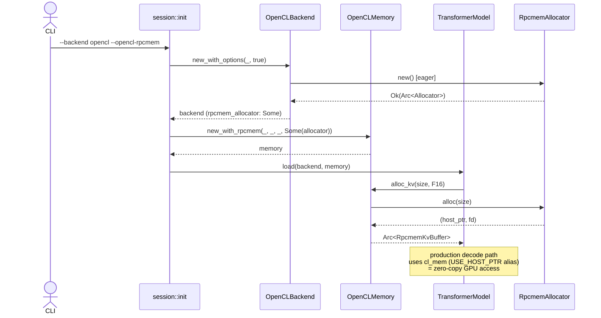

# OpenCL Backend — `--opencl-rpcmem` Wire-up (Sprint 2a Phase 2 부분)

> **상태**: Draft v1 (2026-05-26, Sprint 2a Phase 2 spec/arch — 구현 대기).
> **범위**: 본 문서는 `--opencl-rpcmem` 활성 시 OpenCLBackend / OpenCLMemory 의 wire-up 만 다룬다. OpenCL backend 전반 (kernel binding / plan / partition) 은 별도 문서 (`engine/src/backend/opencl/` source 자체 + `arch/tensor_partition.md` 등) 참조.
> **대상 spec**: `spec/30-engine.md` 부록 E.3 (ENG-RPCMEM-020 ~ ENG-RPCMEM-024).
> **연관 문서**: `arch/rpcmem_allocator.md` (allocator 자체), `arch/precision_swap.md` (다른 consumer).

---

## 1. 변경 범위

| 컴포넌트 | 파일 | 변경 종류 |
|----------|------|----------|
| OpenCLBackend | `engine/src/backend/opencl/mod.rs` | `new_with_options` 신설, `rpcmem_allocator: Option<Arc<RpcmemAllocator>>` field 추가, `get_extension(EXT_RPCMEM_ALLOCATOR)` 분기 추가 |
| OpenCLMemory | `engine/src/backend/opencl/memory.rs` | `new_with_rpcmem(ctx, queue, use_zero_copy, allocator)` 신설, `alloc_kv` 가 allocator Some 시 rpcmem path |
| RpcmemKvBuffer | `engine/src/memory/rpcmem/kv_buffer.rs` (신설) | `QnnOppkgKvBuffer` 의 backend-agnostic 후신. `Arc<RpcmemAllocator>` 보유 |
| Backend extension const | `engine/src/backend/mod.rs` | `EXT_RPCMEM_ALLOCATOR: &str` 신규 |
| session::init | `engine/src/session/init.rs` | `"opencl"` 분기에서 `new_with_options` 호출 + `args.opencl_rpcmem` 전달 |
| CLI | `engine/src/session/cli/mod.rs` | `--opencl-rpcmem: bool` flag |

`alloc_alias_weight_buffer` (LISWAP-6, precision swap path) 는 무변경 — 기존 `RpcmemAliasBuffer` 생성 코드 (mod.rs:5311~5373) 그대로 사용.

---

## 2. OpenCLBackend 구조

### 2.1 신규 / 변경 field

```rust
pub struct OpenCLBackend {
    // ... 기존 field ...
    pub context: Context,
    pub queue: Queue,

    // Sprint 2a Phase 2 신설.
    // - `None`: `--opencl-rpcmem` 비활성 또는 RpcmemAllocator::new 실패 후 강등.
    // - `Some(arc)`: process 내 단일 인스턴스. OpenCLMemory / RpcmemSecondaryStore 와 공유.
    rpcmem_allocator: Option<Arc<crate::memory::rpcmem::allocator::RpcmemAllocator>>,
}
```

### 2.2 생성자 (ENG-RPCMEM-020 / 021)

```rust
impl OpenCLBackend {
    pub fn new() -> Result<Self> {
        Self::new_with_options(false, false)
    }

    pub fn new_with_profile_events(profile_events_enabled: bool) -> Result<Self> {
        Self::new_with_options(profile_events_enabled, false)
    }

    /// 신규. profile_events_enabled + opencl_rpcmem 두 옵션을 동시에 처리.
    pub fn new_with_options(
        profile_events_enabled: bool,
        opencl_rpcmem: bool,
    ) -> Result<Self> {
        // ... 기존 context/queue 초기화 ...

        let rpcmem_allocator = if opencl_rpcmem {
            #[cfg(target_os = "android")]
            {
                match crate::memory::rpcmem::allocator::RpcmemAllocator::new() {
                    Ok(a) => Some(Arc::new(a)),
                    Err(e) => {
                        eprintln!(
                            "[OpenCL] --opencl-rpcmem 강등: RpcmemAllocator init 실패 ({}). \
                             UnifiedBuffer/GGUF mmap path 로 진행.",
                            e
                        );
                        None
                    }
                }
            }
            #[cfg(not(target_os = "android"))]
            {
                eprintln!("[OpenCL] --opencl-rpcmem 강등: Android 전용 옵션 (host 빌드).");
                None
            }
        } else {
            None
        };

        Ok(Self {
            // ...
            rpcmem_allocator,
        })
    }

    /// Sprint 2a Phase 2 — secondary loader 가 lookup 하는 helper.
    pub fn rpcmem_allocator(&self) -> Option<&Arc<crate::memory::rpcmem::allocator::RpcmemAllocator>> {
        self.rpcmem_allocator.as_ref()
    }
}
```

### 2.3 Backend extension (ENG-RPCMEM-024)

```rust
// engine/src/backend/mod.rs
pub const EXT_OPENCL_QUEUE: &str = "opencl_queue";
pub const EXT_OPENCL_SECONDARY: &str = "opencl_secondary";
pub const EXT_QNN_OPPKG: &str = "qnn_oppkg";
pub const EXT_RPCMEM_ALLOCATOR: &str = "rpcmem_allocator";  // Sprint 2a Phase 2 신설

// engine/src/backend/opencl/mod.rs 의 get_extension 매치 추가
impl Backend for OpenCLBackend {
    fn get_extension(&self, name: &str) -> Option<&dyn std::any::Any> {
        match name {
            crate::backend::EXT_OPENCL_QUEUE | crate::backend::EXT_OPENCL_SECONDARY => {
                Some(self as &dyn std::any::Any)
            }
            crate::backend::EXT_RPCMEM_ALLOCATOR => {
                // None 반환 시 RpcmemSecondaryStore 가 SecondaryUnavailable 처리.
                self.rpcmem_allocator
                    .as_ref()
                    .map(|a| a as &dyn std::any::Any)
            }
            _ => None,
        }
    }
}
```

---

## 3. OpenCLMemory 분기

### 3.1 신규 생성자

```rust
impl OpenCLMemory {
    pub fn new(context: Context, queue: Queue, use_zero_copy: bool) -> Self {
        Self::new_with_rpcmem(context, queue, use_zero_copy, None)
    }

    pub fn new_with_rpcmem(
        context: Context,
        queue: Queue,
        use_zero_copy: bool,
        rpcmem_allocator: Option<Arc<crate::memory::rpcmem::allocator::RpcmemAllocator>>,
    ) -> Self {
        Self {
            context,
            queue,
            used_memory: Mutex::new(0),
            use_zero_copy,
            rpcmem_allocator,
        }
    }
}
```

### 3.2 alloc_kv 분기 (ENG-RPCMEM-022)

```rust
impl Memory for OpenCLMemory {
    fn alloc_kv(&self, size: usize, dtype: DType) -> Result<Arc<dyn Buffer>> {
        // 1. rpcmem allocator 보유 → zero-copy path 시도.
        if let Some(allocator) = self.rpcmem_allocator.as_ref() {
            match unsafe { allocator.alloc(size) } {
                Ok((host_ptr, fd)) => {
                    let host_slice = unsafe { std::slice::from_raw_parts_mut(host_ptr, size) };
                    let cl_mem = unsafe {
                        ocl::core::create_buffer(
                            self.context.as_core(),
                            ocl::core::MEM_USE_HOST_PTR | ocl::core::MEM_READ_WRITE,
                            size,
                            Some(host_slice),
                        )
                    };
                    match cl_mem {
                        Ok(cl_mem_obj) => {
                            let buf = crate::memory::rpcmem::kv_buffer::RpcmemKvBuffer::new(
                                host_ptr,
                                fd,
                                cl_mem_obj,
                                size,
                                dtype,
                                allocator.clone(),
                            );
                            return Ok(Arc::new(buf));
                        }
                        Err(e) => {
                            // alias 생성 실패 → host_ptr 해제 후 fallback.
                            unsafe { allocator.free(host_ptr) };
                            eprintln!(
                                "[OpenCL] rpcmem KV alloc 후 cl_mem alias 실패 (size={}): {}. \
                                 UnifiedBuffer fallback.",
                                size, e
                            );
                            // ↓ fall through to UnifiedBuffer path
                        }
                    }
                }
                Err(e) => {
                    eprintln!(
                        "[OpenCL] rpcmem KV alloc 실패 (size={}): {}. UnifiedBuffer fallback.",
                        size, e
                    );
                    // ↓ fall through to UnifiedBuffer path
                }
            }
        }

        // 2. 기존 path (UnifiedBuffer / OpenCLBuffer).
        if self.use_zero_copy {
            let buffer = UnifiedBuffer::new(self.queue.clone(), size, dtype)?;
            // ... 기존 코드 ...
        } else {
            self.alloc(size, dtype)
        }
    }
}
```

### 3.3 alloc (activation) 무변경 보장 (ENG-RPCMEM-023, INV-RPCMEM-007)

`Memory::alloc` 은 `rpcmem_allocator` field 를 무시한다. activation tensor 는 short-lived 라 rpcmem heap fragmentation 위험만 증가. spec test 가 downcast 로 RpcmemKvBuffer 부재를 확인 (INV-RPCMEM-007).

---

## 4. RpcmemKvBuffer 신설

```rust
// engine/src/memory/rpcmem/kv_buffer.rs (신설)

use crate::buffer::{Buffer, DType};
use crate::memory::rpcmem::allocator::RpcmemAllocator;
use anyhow::Result;
use std::any::Any;
use std::sync::Arc;

/// rpcmem (DMA-BUF heap) + OpenCL `CL_MEM_USE_HOST_PTR` alias.
///
/// Backend-agnostic 후신 of `engine/src/backend/qnn_oppkg/kv_buffer.rs::QnnOppkgKvBuffer`
/// (Sprint 2b 에서 후자 삭제).
pub struct RpcmemKvBuffer {
    host_ptr: *mut u8,
    #[allow(dead_code)]
    fd: i32,
    #[cfg(feature = "opencl")]
    cl_mem_obj: ocl::core::Mem,
    size: usize,
    dtype: DType,
    // INV-RPCMEM-005 — allocator 가 본 buffer 보다 오래 살도록 Arc 보유.
    // Drop 시 allocator.free(host_ptr) 호출 후 Arc strong count 감소.
    allocator: Arc<RpcmemAllocator>,
}

unsafe impl Send for RpcmemKvBuffer {}
unsafe impl Sync for RpcmemKvBuffer {}

impl Drop for RpcmemKvBuffer {
    fn drop(&mut self) {
        // SAFETY: host_ptr 은 self.allocator.alloc 결과. Drop 1회 → double-free 없음.
        unsafe { self.allocator.free(self.host_ptr) };
    }
}

impl Buffer for RpcmemKvBuffer {
    // 기존 QnnOppkgKvBuffer 와 동일 구현 (as_ptr / as_mut_ptr / cl_mem / sync_device /
    // is_host_managed / is_gpu_buffer). 코드 이식만.
    // ...
}
```

---

## 5. session::init wire-up

```rust
// engine/src/session/init.rs 의 "opencl" 분기

"opencl" => {
    // 신규: opencl_rpcmem flag 전달.
    let gpu_concrete = crate::backend::opencl::OpenCLBackend::new_with_options(
        args.profile_events || args.heartbeat_gpu_profile,
        args.opencl_rpcmem,
    )?;
    let gpu_concrete = Arc::new(gpu_concrete);

    // OpenCLMemory 가 backend 의 allocator 를 공유.
    let gpu_mem: Arc<dyn Memory> = Arc::new(
        crate::backend::opencl::memory::OpenCLMemory::new_with_rpcmem(
            gpu_concrete.context.clone(),
            gpu_concrete.queue.clone(),
            !args.no_zero_copy,
            gpu_concrete.rpcmem_allocator().cloned(),
        ),
    );

    // ... 기존 코드 ...
}
```

`secondary_mmap.rs::backend_supports_rpcmem_secondary` 분기는 `arch/precision_swap.md` 참조.

---

## 6. 처리 흐름 (요약)



---

## 7. 측정 영향

본 wire-up 자체는 **eager init 1회 (dlopen + 3 dlsym, ~ms)** 외 runtime 비용 없음. KV alloc 경로는 rpcmem allocator Some 시:

| 단계 | 비용 (Adreno UMA 가정) |
|------|----------------------|
| `RpcmemAllocator::alloc` | `rpcmem_alloc` 호출 ~수십 μs / page |
| `clCreateBuffer(USE_HOST_PTR)` | ~수 ms / call (driver internal) |
| KV write/read | **zero-copy** (CPU↔GPU 같은 물리 페이지) |

baseline (UnifiedBuffer): clCreateBuffer + driver internal page alloc + driver internal copy on first map.

기대: KV write/read hot path 가 zero-copy 화되어 forward TBT 가 `--backend qnn_oppkg` (rpcmem on via QnnOppkgHybridMemory) 와 동등. baseline `--backend opencl` 대비 2× 가속 가설 (Galaxy S25 Qwen2.5-1.5B Q4_0 기준, MEMORY 참조).

---

## 8. Implementer 인수인계

- `OpenCLBackend` 의 기존 callsite 가 `new` / `new_with_profile_events` 두 개 — 모두 위임으로 호환 유지. 검색 keyword: `OpenCLBackend::new`. 새 callsite 는 `new_with_options` 만 사용.
- `Backend` trait 에 `rpcmem_allocator()` accessor 를 추가하지 않는다 — extension lookup 으로 충분 (다른 backend 가 본 메서드를 default 구현 강제받는 부담 방지). spec ENG-RPCMEM-024 가 명시한 `EXT_RPCMEM_ALLOCATOR` extension 만 추가.
- `RpcmemKvBuffer` 의 Drop 순서: `cl_mem_obj` (ocl::core::Mem) 가 먼저 drop → host_ptr 의 USE_HOST_PTR alias 해제 → 그 후 `allocator.free(host_ptr)` 안전. Rust struct field 선언 순서 (`cl_mem_obj` 가 `allocator` 보다 앞) 로 강제.
- `--opencl-rpcmem` 와 `--no-zero-copy` 조합: rpcmem 활성 시 KV path 는 항상 rpcmem 사용 (UnifiedBuffer 분기 무시). activation alloc 만 `use_zero_copy` 가 결정. doc comment 에 명시.
