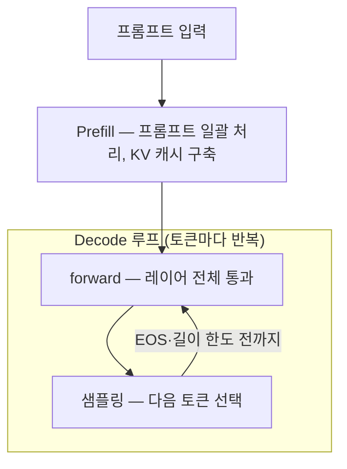
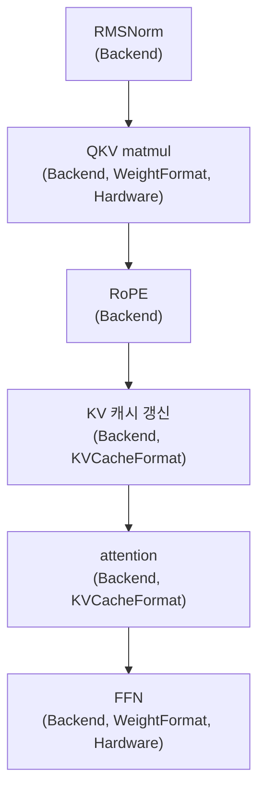
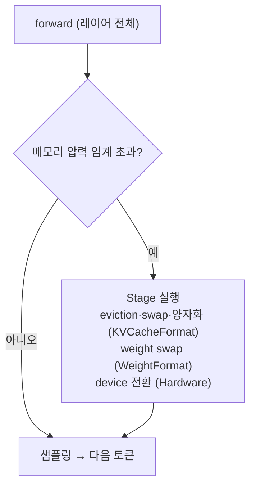
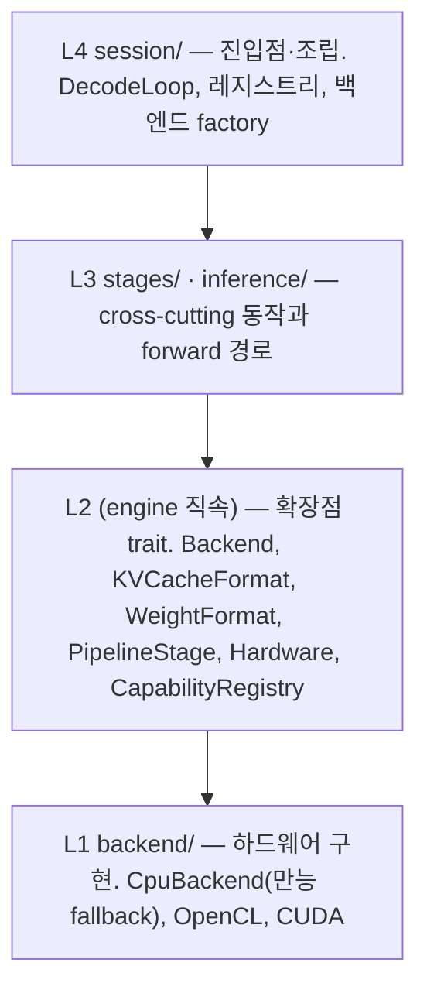

# 확장 가능 추론 파이프라인 — 큰 그림

> **유형**: Explanation (Diátaxis). 시스템이 무엇을 하고 어떻게 동작하는지 머릿속 그림을 세운다.
> **정식 출처(SSOT)**: [`arch/pipeline_stage_design_v2.md`](../pipeline_stage_design_v2.md). 본 문서와 충돌하면 v2가 권위를 갖는다.
> **비규범적 문서**: 정확한 시그니처와 불변식은 v2에 링크한다. 여기 실린 코드와 표는 이해를 돕는 단순화 예시다.
> **동기화 기준**: v2 @ 2026-06-03 검토. 이후 v2가 바뀌면 본 문서를 재검토한다.

## 목차

1. [이 시스템이 하는 일](#1-이-시스템이-하는-일)
2. [추론 흐름](#2-추론-흐름)
   - [2.1 전체 흐름](#21-전체-흐름)
   - [2.2 레이어 내부 파이프라인](#22-레이어-내부-파이프라인)
   - [2.3 스텝 사이의 Stage](#23-스텝-사이의-stage)
3. [부품과 영향 범위](#3-부품과-영향-범위)
   - [3.1 여섯 부품](#31-여섯-부품)
   - [3.2 각 부품이 어디에 영향을 주나](#32-각-부품이-어디에-영향을-주나)
   - [3.3 코드 구조](#33-코드-구조)
4. [설계가 추구하는 것](#4-설계가-추구하는-것)

---

## 1. 이 시스템이 하는 일

llm.rs는 ARM64 휴대폰이나 엣지 디바이스에서 LLM 추론을 실행하는 프레임워크다. 메모리에 적재된 모델에 프롬프트를 넣고, 토큰을 하나씩 생성한다.

이 문서가 설명하는 "파이프라인 아키텍처"는 그 추론 과정을 구성하고 확장하는 방식이다. 추론이 어떻게 흐르는지 먼저 보고, 그 흐름의 각 지점에서 부품들이 어떻게 영향을 주는지 따라가면 전체 그림이 선다.

## 2. 추론 흐름

### 2.1 전체 흐름

추론은 Prefill과 Decode 두 단계로 나뉜다. Prefill은 프롬프트를 한 번에 처리하면서 KV 캐시를 채운다. Decode는 토큰을 하나씩 생성하며, 매 토큰마다 새 K/V를 캐시에 더한다.

Prefill은 모델의 `forward`로, Decode는 `forward_into`로 실행된다. 한 번의 forward는 모델의 모든 레이어를 순서대로 통과한다. Llama 3.2 1B은 16개 레이어를 가진다.

### 2.2 레이어 내부 파이프라인

한 레이어는 여섯 단계로 연산한다. 각 단계 아래에 그 단계를 좌우하는 부품을 적었다.

- **QKV matmul**과 **FFN**은 weight를 읽어 행렬곱을 한다. weight를 어떤 정밀도로 쓸지, 레이어를 통째로 계산할지 건너뛸지 나눠 계산할지는 WeightFormat이 정한다. 나눠 계산(partition)하면 Hardware가 슬라이스마다 어느 연산기를 쓸지 푼다.
- **KV 캐시 갱신**과 **attention**은 KV를 다룬다. KV를 어떤 형태(F16, Q4_0, KIVI 양자화)로 저장할지, 그 형태에 맞는 attention 커널이 무엇인지는 KVCacheFormat이 정한다.
- 모든 단계의 실제 연산(행렬곱, 커널 실행)은 Backend가 수행한다.

### 2.3 스텝 사이의 Stage

토큰이 쌓이면 KV 캐시가 커지고 메모리를 압박한다. 압력이 임계치를 넘으면 forward와 forward 사이에서 Stage가 실행되어 캐시나 weight를 조정한다.

Stage가 끼어드는 정확한 지점(`LifecyclePhase`)의 이름과 목록은 v2 §5.1에 있다.

## 3. 부품과 영향 범위

### 3.1 여섯 부품

| 부품 | 역할 | 흐름의 어디서 |
|---|---|---|
| **Backend** | 실제 연산(matmul, attention 등)을 실행한다. CPU와 GPU가 같은 연산을 각자 구현한다. | 모든 연산 단계 |
| **KVCacheFormat** | KV의 저장 형태와 거기 맞는 attention 커널을 정한다. | KV 갱신, attention |
| **WeightFormat** | weight의 dispatch 모드(Full/Skip/Partition)와 정밀도를 정한다. | QKV matmul, FFN |
| **Hardware** | DeviceTarget(Cpu/Gpu/Npu)을 실제 backend와 memory로 푼다. partition과 device 전환에 쓰인다. | partition, device 전환 |
| **PipelineStage** | 토큰 사이에 끼어드는 cross-cutting 동작(eviction, swap, 양자화, 전환). | 스텝 사이 |
| **DecodeLoop** | 위 부품들을 조율하며 decode를 반복하고 Stage를 dispatch한다. | 루프 전체 |

### 3.2 각 부품이 어디에 영향을 주나

| 파이프라인 지점 | Backend | KVCacheFormat | WeightFormat | Hardware | PipelineStage |
|---|:---:|:---:|:---:|:---:|:---:|
| RMSNorm | 연산 | | | | |
| QKV matmul | 연산 | | dispatch·정밀도 | 분산 위치 | |
| RoPE | 연산 | | | | |
| KV 캐시 갱신 | 쓰기 | 저장 형태 | | | |
| attention | 커널 실행 | paired 커널 | | | |
| FFN | 연산 | | dispatch·정밀도 | 분산 위치 | |
| 스텝 사이 (압력 시) | | compact | weight swap | device 전환 | 트리거·조율 |

표를 세로로 읽으면 한 부품이 파이프라인 전반에 어떻게 퍼져 있는지 보인다. Backend는 거의 모든 행에 있고, KVCacheFormat은 KV를 만지는 두 단계와 스텝 사이에, WeightFormat은 weight를 쓰는 두 단계에 모인다.

### 3.3 코드 구조

코드는 다섯 레이어로 나뉜다.

L2가 부품의 계약(추상화)을 정의한다. L1이 그 계약을 하드웨어별로 구현한다. L3가 추상 핸들로 계약을 소비한다. L4가 시작 시점에 "이번에는 OpenCL과 KIVI" 같은 조합을 골라 핸들을 꽂는다. 화살표가 모두 그려진 정식 구조도는 v2 §0.3에 있다.

## 4. 설계가 추구하는 것

이 구조는 두 가지를 함께 추구한다. 새 기능을 추가할 때 기존 코드 변경을 최소화하고(확장성), 그 과정에서 추론 성능을 떨어뜨리지 않는다(성능). "기능"은 새 하드웨어 백엔드, 새 KV 관리 방식, 새 점수 알고리즘 같은 것이다.

두 목표는 hot path(토큰마다, 레이어마다 실행되는 코드)에서 충돌한다. 유연성을 위한 추상화가 그 자리에서 성능 비용이 되기 때문이다. 세 가지 원칙이 이 충돌을 조정한다. 각 원칙은 정작 필요한 문서에서 자세히 다룬다.

| 원칙 | 한 줄 | 자세히 |
|---|---|---|
| Path-dependent 합격선 | "최소 변경"의 기준이 코드의 실행 위치에 따라 달라진다 | [02_backend_capability](02_backend_capability.md) |
| Mechanism over policy | 프레임워크는 메커니즘만 제공하고, 구성과 안전은 조립하는 사람이 책임진다 | [04_pipeline_stage](04_pipeline_stage.md) |
| Capability over god-trait | 능력을 거대한 공용 trait에 붙이지 않고 작은 opt-in 단위로 분리한다 | [02_backend_capability](02_backend_capability.md) |

---

다음 문서: [02_backend_capability](02_backend_capability.md). Backend가 연산을 어떻게 실행하고, 특정 하드웨어의 능력(capability)이 어떻게 붙는지 설명한다.
