# Pipeline Stage Design — DecodeLoop v3 (Hook Pattern)

> **상태**: 설계 finalize 2026-05-27. 23 라운드 grill 종료 후 단일 진실원본.
> **선행 문서**: `arch/inference_pipeline.md` v1 (Phase 4-2/4-3/4-4-2.3 — `Forward / EvictionStage / SwapStage / CommandSource / TokenSampler / DecodeObserver` 7-trait 설계). 본 문서는 v1을 단일 PipelineStage trait + lifecycle phase enum + entry point별 PipelineRegistry 패턴으로 재설계한다.
> **선행 후속 관계**: `arch/inference_pipeline.md` v2는 본 문서 기준으로 Phase β scope에서 재작성된다. 본 sprint 외 별 sprint.
> **본 sprint에서 풀지 않은 결정점**: Q24 sub-trait 4종 (`KVCacheView` / `LayerView` / `SecondaryStore` / `SparsePattern`)의 시그니처. Pre-α-1 별 design round로 분리.

---

## 0. TL;DR

- DecodeLoop의 7-trait v2 설계는 (a) `EvictionStage` 시그니처 부족 → 책임 재분배 깊이 (R-2), (b) `ResilienceStage` 신설 결정점 미해결 (R-5), (c) `decode_fallback/{eviction_trigger,swap_dispatch}.rs`의 God Ctx 12/21 필드, (d) `arch/inference_pipeline.md:177` Manager IPC wiring 격차, (e) speculative decoding / per-op measurement 등 신규 책임 추가 비용 문제를 해결하지 못한다.
- 본 문서는 **단일 `PipelineStage` trait + `LifecyclePhase` enum + entry point별 `PipelineRegistry`** 패턴으로 재설계한다. 모든 책임을 stage(phase event handler) 단위로 분해, `Arc<dyn PipelineStage>` 공유 + entry point별 selection.
- 의도된 효과: SRP/OCP 양립 (`PipelineStage::on_phase` 1개 method), 신규 책임 추가 비용 = 새 stage struct + 새 entry point에서 `submit()` 1줄.
- 인정 비용: god ctx (`StageContext` 5 field) 명시 수용 + 권한 강제는 code review (M1만). 컴파일 강제 시 sub-trait 보유 비용이 과대.
- 작업 분해 — **Phase α (WeightBundle prerequisite, 2~3주) / Phase β (hook pattern 본격, 3~4주) / Phase γ (legacy 잔여 마이그레이션, 3~4주)** = 총 8~13주.
- Escape hatch — Pre-α-1 design round 합의 실패 또는 Pre-α-2 PoC 4 test 중 1+ fail 시 v2 (b₁) 7-trait 후퇴. Phase β 진입 후 후퇴는 권장하지 않으며 stage impl 재설계로 해소.

---

## 1. 동기 + 배경

### 1.1 v2 7-trait 잔여 문제

`arch/inference_pipeline.md` v1 (Phase 4-2 HEAD `584496b7`)은 `Forward / EvictionStage / SwapStage / CommandSource / TokenSampler / DecodeObserver` 6 trait + 신설 후보 `ResilienceStage`로 책임을 분해했다. 1차 리뷰에서 다음 문제가 식별되었다.

| ID | 문제 |
|----|------|
| R-2 | `EvictionStage` 시그니처 부족 — pressure handler 다양화 (D2O merge / KIVI quant / SnapKV / KvOffload / Sparse) 흡수를 위한 책임 재분배 깊이 |
| R-5 | `ResilienceStage` 신설 결정점 — Manager IPC ResilienceAction (Evict / SwitchBackend / LimitTokens / Throttle / Suspend / RejectNew / RestoreDefaults / SetPartition / LayerSkip) 흡수처가 불분명 |
| God Ctx | `decode_fallback/{eviction_trigger,swap_dispatch}.rs` 시그니처에 12/21 필드 — 추출했지만 책임 분리 미달 |
| IPC 격차 | `arch/inference_pipeline.md:177` 명시 — `cmd_source.poll()` 결과를 accept-and-drop. ExecutionPlan 적용 0 LOC in argus-cli path |
| 신규 비용 | speculative decoding / per-op measurement / KIVI per-layer / SnapKV / Sparse 등 추가마다 새 trait 또는 기존 trait의 신규 method, 양쪽 모두 OCP 위반 |

### 1.2 단일 hook 패턴 합의

사용자가 더 근본적 재설계 제안: **trait 1개로 통일, 차이는 phase enum과 stage 구현체로 분기**. 본 grill 23 라운드 동안 다음을 확정.

| 결정 | 내용 |
|------|------|
| **Trait 통일** | `PipelineStage::on_phase(&self, phase: &LifecyclePhase, ctx: &mut StageContext) -> Result<StageOutcome>` 1개 method |
| **Phase enum** | 21 variant (P3) + `Fine(FinePhase)` (P4, Cargo feature `pipeline-fine-grained` 컴파일 타임 활성) |
| **God ctx 수용** | 5 field (`step` / `kv` / `weights` / `backend_ext` / `profiler`), 권한 강제는 code review (M1만) |
| **Forward / Sampler 분리** | bit-identical 회귀 위험 최소화로 별 trait 유지 (W-1) — `DecodeLoop`가 `Box<dyn Forward>` + `Box<dyn TokenSampler>` 직접 보유 |
| **Manager IPC** | `DecodeLoop` owned (stage 외부) — Manager IPC poll + outbound 발신 모두 DecodeLoop 직접 |
| **Registry 모델** | `Arc<PipelineRegistry>` + `Mutex<Vec<Arc<dyn PipelineStage>>>` (M-γ, interior mutability) |
| **OneShot lifecycle** | `StageLifecycle::OneShot` + `StageOutcome::Consumed` + dispatcher 자동 GC |
| **에러 처리** | panic on Err — partial commit 없음, 후속 stage skip 없음 |
| **Entry point 등록** | X2 (caller가 명시 `submit()`), 드리프트 발생 시 helper 도입 (지금은 YAGNI) |

---

## 2. 모듈 구조 (L2 / L3 / L4)

본 설계는 INV-LAYER-001 ~ 005 (Engine internal layered architecture) 정신을 보존한다. `PipelineStage` / `LifecyclePhase` / `StageContext` / `KvBundle` / `WeightBundle` / `BackendExtensions` / `Profiler` / `PipelineDispatcher`는 **L2** (engine 직속) 위치. `PipelineRegistry` 와 concrete stage impl은 **L4 `session/`**. `DecodeLoop` 는 L4 진입점.

```mermaid
flowchart TB
    subgraph L5 ["L5 bin/"]
        bins["argus_cli / argus_chat / argus_bench / ..."]
    end

    subgraph L4 ["L4 session/"]
        decode["DecodeLoop"]
        registry["PipelineRegistry<br/>impl PipelineDispatcher"]
        stages["concrete stages<br/>EvictionPolicyStage / KvMergeStage /<br/>SwapDispatchStage / OneShot* × 9"]
        cmdexec["CommandExecutor<br/>Manager IPC"]
    end

    subgraph L3 ["L3 inference/ pressure/ qcf/"]
        forward["Forward (TBD: L4 trait)"]
        sampler["TokenSampler"]
        kvcache["KVCache"]
        pressure_handlers["existing pressure handlers<br/>(migration target)"]
    end

    subgraph L2 ["L2 engine direct"]
        pstage["PipelineStage trait"]
        phase["LifecyclePhase enum"]
        sctx["StageContext"]
        outcome["StageOutcome / StageLifecycle"]
        pdisp["PipelineDispatcher trait"]
        kvb["KvBundle trait"]
        wb["WeightBundle trait"]
        bext["BackendExtensions trait"]
        prof["Profiler trait"]
    end

    subgraph L1 ["L1 backend/"]
        be["OpenCL / CUDA / CPU / qnn_oppkg"]
    end

    bins --> decode
    decode --> registry
    decode --> cmdexec
    decode --> forward
    decode --> sampler
    decode -. owns .- kvb
    decode -. owns .- wb
    decode -. owns .- prof
    registry --> pstage
    stages --> pstage
    pstage --> phase
    pstage --> sctx
    sctx --> kvb
    sctx --> wb
    sctx --> bext
    sctx --> prof
    kvb -.-> kvcache
    bext --> be

    style pstage fill:#3d2d5a
    style phase fill:#3d2d5a
    style sctx fill:#3d2d5a
    style registry fill:#2d5a3d
    style decode fill:#2d5a3d
```



**층별 위치 결정 근거**:

| 모듈 | 위치 | 근거 |
|------|------|------|
| `PipelineStage`, `LifecyclePhase`, `StageContext`, `StageOutcome`, `StageLifecycle` | L2 (engine 직속) | hook 정의는 abstraction primitive — 어떤 L3 도메인에도 종속되지 않음 |
| `PipelineDispatcher` | L2 | dispatch는 stage 구현체와 무관한 control primitive |
| `KvBundle`, `WeightBundle`, `BackendExtensions`, `Profiler` | L2 | god ctx 5 field의 trait 정의 — stage가 의존하는 abstraction barrier |
| `PipelineRegistry` (`impl PipelineDispatcher`) | L4 `session/` | concrete impl, entry point별 caller가 build |
| concrete stage struct (`EvictionPolicyStage` 등) | L4 `session/` | stage 구현체는 session policy의 일부 |
| `Forward`, `TokenSampler` | L4 `session/` (현 위치 유지) | 별 trait — INV-LAYER-006 적용 대상 |

---

## 3. Trait 시그니처 (코드 finalize)

### 3.1 `PipelineStage` (L2)

```rust
// engine/src/pipeline_stage.rs (신규)

pub trait PipelineStage: Send + Sync {
    fn name(&self) -> &str;

    /// 기본 Persistent — OneShot stage만 override
    fn lifecycle(&self) -> StageLifecycle { StageLifecycle::Persistent }

    /// Phase event handler.
    ///
    /// # Phase-based KV mutation 제약 (INV-DECODE-STAGE-KV-PHASE)
    ///
    /// `ctx.kv` mutation method (prune / offload / recall / set_layer_dtype /
    /// merge_evicted / compress_prefix / set_sparse_pattern)는 다음 phase에서만 호출:
    ///
    /// 허용: PreEviction, PostEviction, PreSwap, PostSwapBefore, PostSwapAfter,
    ///       PreForward, PostForward, PreSample, PostSample,
    ///       PrefillStart, PrefillChunkBoundary, PrefillEnd,
    ///       SessionStart, SessionEnd, DecodeStart, DecodeEnd, TurnStart, TurnEnd, Finalize
    /// 금지: PreLayer, PostLayer, Fine(*)
    ///
    /// 위반 시 step 안 layer 간 KV state inconsistency → logits corruption.
    /// 컴파일/런타임 강제 X — stage 구현자가 자기 phase 매칭에서 책임.
    fn on_phase(&self, _phase: &LifecyclePhase, _ctx: &mut StageContext<'_>) -> Result<StageOutcome> {
        Ok(StageOutcome::Continue)
    }
}

pub enum StageLifecycle {
    Persistent,
    OneShot,
}

pub enum StageOutcome {
    Continue,
    Stop(StopReason),
    Consumed,    // OneShot stage 자기 실행 완료 신호
}
```

### 3.2 `LifecyclePhase` (L2)

```rust
// engine/src/pipeline_stage.rs (계속)

pub enum LifecyclePhase {
    // session lifecycle
    SessionStart,
    SessionEnd,

    // turn lifecycle (chat REPL 등 multi-turn 시나리오)
    TurnStart,
    TurnEnd,

    // prefill
    PrefillStart,
    PrefillChunkStart { chunk_idx: usize },
    PrefillChunkEnd,
    PrefillEnd,

    // decode step lifecycle
    DecodeStart,
    DecodeEnd,

    // pressure / eviction / swap
    PreEviction,
    PostEviction,
    PreSwap,
    PostSwapBefore,
    PostSwapAfter,

    // forward
    PreForward,
    PreLayer { idx: usize },         // KV mutation 금지
    PostLayer { idx: usize },        // KV mutation 금지
    PostForward { logits_len: usize },

    // sampling
    PreSample,
    PostSample { token: u32 },

    Finalize,

    #[cfg(feature = "pipeline-fine-grained")]
    Fine(FinePhase),
}

#[cfg(feature = "pipeline-fine-grained")]
pub enum FinePhase {
    PostRMSNorm { layer_idx: usize },
    PostQKV { layer_idx: usize },
    PostRoPE { layer_idx: usize },
    PostKVUpdate { layer_idx: usize },
    PostAttention { layer_idx: usize },
    PostFFN { layer_idx: usize },
    PostFFNDown { layer_idx: usize },
}
```

**Variant 결정 (Q4)**:
- **P3 (~22 variant)** — 기본 phase 집합. KV/weight 책임 분기, pressure pipeline, 토큰 lifecycle을 모두 P3에 흡수.
- **P4 (fine phase)** — `pipeline-fine-grained` Cargo feature 활성 시 컴파일 타임에만 추가. **feature off 시 dispatch site 자체 컴파일 제거** (성능 안전망). 사용처: probing per-op measurement, SWIFT skip 최적화 등.
- **PreLayer / PostLayer 결정 (갈래 1 B)** — `LayerBoundary` 통합 폐기. SWIFT skip = `PreLayer`, intra-forward swap = `PostLayer`. 의미 명확.
- **추상화 (갈래 2 α)** — L3 `transformer.rs`는 `PipelineDispatcher` L2 trait의 ref만 의존. concrete `PipelineRegistry` 미사용. §13.8-O (cross-L3 vocabulary trait inversion) 정합.
- **Stage 등록 정책 (갈래 4)** — Cargo feature가 on이라도 stage는 caller가 명시 `add` (opt-in). feature 활성 = 등록 가능성, caller 의도 = 실제 등록.

### 3.3 `StageContext` (L2 god ctx)

```rust
// engine/src/pipeline_stage.rs (계속)

pub struct StageContext<'a> {
    pub step: StepInfo,
    pub kv: &'a mut dyn KvBundle,
    pub weights: &'a mut dyn WeightBundle,
    pub backend_ext: &'a dyn BackendExtensions,
    pub profiler: &'a mut dyn Profiler,
}

pub struct StepInfo {
    pub pos: usize,
    pub prev_token: u32,
    pub kv_capacity: usize,
    pub decode_step: usize,
    pub last_forward_ms: f64,
    pub stop_requested: Arc<AtomicBool>,
}
```

**5 field 결정 근거 (Q3 god ctx 수용)**:
- `step` — phase-invariant 상태 (값 타입, 복사 안전)
- `kv` — KV cache mutation 통합 trait
- `weights` — weight slot / layer skip / partition 통합 trait
- `backend_ext` — backend-specific 확장 (opencl secondary store, gpu score acc, host ptr pool)
- `profiler` — profiling 채널 (production = `NoopProfiler`, zero overhead)

**폐기된 ctx 필드 (이전 안에서)**:
- `~~execution_plan~~` — `ExecutionPlan` ctx field 자체 폐기 (Q18). 명령은 OneShot stage 객체에 캡슐화.
- `~~outbound~~` — DecodeLoop 직접 발신으로 결정 (Q22).
- `~~forward_sync~~` — `ForwardSync` trait 폐기 (Q9). Forward는 KV state cache 0이므로 notify 불필요.

### 3.4 `PipelineDispatcher` (L2)

```rust
// engine/src/pipeline_dispatcher.rs (신규)

pub trait PipelineDispatcher: Send + Sync {
    fn dispatch(&self, phase: LifecyclePhase, ctx: &mut StageContext<'_>) -> Option<StopReason>;
}
```

**시그니처 결정 (Q13)**:
- **반환 `Option<StopReason>`** — dispatcher가 stage `Result::Err`을 panic으로 흡수. caller에게는 `Stop(reason)` 또는 정상(`None`)만 노출.
- **Stage trait return은 `Result<StageOutcome>`** — 작성자 편의 (anyhow::bail!, `?` 연산자 사용 가능). 단 dispatcher가 panic으로 변환하므로 `Err` 의미는 "복구 불가 + 정확성 위반".
- **Arc + Mutex** — `Arc<dyn PipelineStage + Send + Sync>` + 내부 mutation은 stage struct에서 `Mutex<T>` 명시. dispatcher는 stage shared ref만 보유.

### 3.5 `KvBundle` (L2)

```rust
// engine/src/kv_bundle.rs (신규)

pub trait KvBundle: Send {
    // Read
    fn current_pos(&self) -> usize;
    fn capacity(&self) -> usize;
    fn n_layers(&self) -> usize;
    fn layer_view(&self, idx: usize) -> &dyn KVCacheView;
    fn current_dtype(&self, idx: usize) -> DType;

    // Mutation
    //
    // INV-DECODE-STAGE-KV-PHASE 준수 (PreLayer/PostLayer/Fine(*) 금지).
    // INV-KVBUNDLE-SYNC 보장 (호출 후 GPU work 완료).
    // INV-KVBUNDLE-CONSISTENCY 준수 (layer-wide vs per-layer idx scope 명시).
    fn prune(&mut self, evicted_indices: &[usize]) -> Result<usize>;
    fn offload(&mut self, ratio: f32) -> Result<usize>;
    fn recall(&mut self) -> Result<usize>;
    fn set_layer_dtype(&mut self, idx: usize, dtype: DType) -> Result<()>;
    fn merge_evicted(&mut self, evicted: &[usize], nearest: &[usize], weights: &[f32]) -> Result<()>;
    fn compress_prefix(&mut self, snap_window: usize) -> Result<usize>;
    fn set_sparse_pattern(&mut self, idx: usize, pattern: &SparsePattern) -> Result<()>;

    // Backend integration
    fn sync_gpu_scores(&mut self, ext: &dyn BackendExtensions, acc: &mut AttentionScoreAccumulator) -> Result<()>;
    fn reset_gpu_score_acc(&mut self, ext: &dyn BackendExtensions) -> Result<()>;
}
```

**Method scope**:
- `prune` / `offload` / `recall` / `compress_prefix` — layer-wide
- `set_layer_dtype` / `merge_evicted` / `set_sparse_pattern` — per-layer (`idx` 명시)
- `merge_evicted`의 `evicted` / `nearest` / `weights` slice — layer-wide concat 또는 per-layer 호출, scope는 caller가 명시 (Q24-1 sub-trait round에서 finalize)

### 3.6 `WeightBundle` (L2)

```rust
// engine/src/weight_bundle.rs (신규, Phase α prerequisite)

pub trait WeightBundle: Send {
    // Read
    fn n_layers(&self) -> usize;
    fn current_dtype(&self, idx: usize) -> DType;
    fn layer_view(&self, idx: usize) -> &dyn LayerView;

    // Mutation
    fn swap_layer(&mut self, idx: usize, new_dtype: DType) -> Result<()>;
    fn enqueue_release(&mut self, idx: usize) -> Result<()>;
    fn release_pending(&self) -> usize;
    fn secondary_store(&self) -> Option<&dyn SecondaryStore>;

    // Resilience directives
    fn set_partition_ratio(&mut self, ratio: f32) -> Result<()>;
    fn set_layer_skip_ratio(&mut self, ratio: f32) -> Result<()>;
    fn switch_device(&mut self, device: &str) -> Result<()>;
}
```

**10 method 결정 (Q15)**: 진행 중 막히면 개선 — 최소 출발점.

### 3.7 `BackendExtensions` + `Profiler` (L2)

```rust
// engine/src/backend_extensions.rs (신규)
pub trait BackendExtensions: Sync {
    fn as_opencl_secondary(&self) -> Option<&dyn OpenClSecondary>;
    fn gpu_score_acc(&self) -> Option<&dyn GpuScoreAcc>;
    fn host_ptr_swap_pool(&self) -> Option<&dyn HostPtrPool>;
}

// engine/src/profiler.rs (신규)
pub trait Profiler: Send {
    fn record(&mut self, event: ProfileEvent<'_>);
}

pub enum ProfileEvent<'a> {
    Eviction { step: usize, count: usize, scores: &'a [f32] },
    Forward { ms: f64 },
    Swap { layer_idx: usize, latency_us: u64 },
    Token { id: u32 },
}

pub struct NoopProfiler;
impl Profiler for NoopProfiler {
    #[inline] fn record(&mut self, _: ProfileEvent<'_>) {}
}

#[cfg(feature = "profile")]
pub struct InferenceProfiler { /* 기존 코드 */ }
```

**최소 구현 결정 (Q8)**:
- Production default = `NoopProfiler` (`#[inline]` + empty body = zero overhead)
- Feature gate `profile` 활성 시 `InferenceProfiler` 사용 — 기존 `engine/src/observability/profiler.rs` 코드 보존

### 3.8 `Forward` + `TokenSampler` (L4, 변경 없음)

본 설계는 **W-1 (별 trait 유지)** 결정에 따라 `Forward` / `TokenSampler`를 PipelineStage로 통합하지 않는다. 이유: bit-identical 회귀 위험 최소화. `DecodeLoop`가 `Box<dyn Forward>` + `Box<dyn TokenSampler>`를 직접 owned. 시그니처는 `arch/inference_pipeline.md` v1 (Phase 4-2) 그대로 유지.

---

## 4. `PipelineRegistry` (L4 concrete)

```rust
// engine/src/session/pipeline_registry.rs (신규)

pub struct PipelineRegistry {
    stages: Mutex<Vec<Arc<dyn PipelineStage + Send + Sync>>>,
}

impl PipelineRegistry {
    pub fn new(stages: Vec<Arc<dyn PipelineStage + Send + Sync>>) -> Self {
        Self { stages: Mutex::new(stages) }
    }

    /// 단일 등록 함수 — stage 객체가 자기 정보 보유 (lifecycle / name)
    pub fn submit(&self, stage: Arc<dyn PipelineStage + Send + Sync>) {
        self.stages.lock().unwrap().push(stage);
    }

    pub fn stage_names(&self) -> Vec<String> {
        self.stages.lock().unwrap().iter().map(|s| s.name().to_string()).collect()
    }
}

impl PipelineDispatcher for PipelineRegistry {
    fn dispatch(&self, phase: LifecyclePhase, ctx: &mut StageContext<'_>) -> Option<StopReason> {
        let stages = self.stages.lock().unwrap().clone();
        let mut consumed: Vec<Arc<dyn PipelineStage + Send + Sync>> = vec![];
        let mut result = None;

        for stage in &stages {
            match stage.on_phase(&phase, ctx) {
                Ok(StageOutcome::Continue) => {}
                Ok(StageOutcome::Consumed) => {
                    debug_assert!(
                        matches!(stage.lifecycle(), StageLifecycle::OneShot),
                        "Consumed outcome only valid for OneShot stage — got Persistent stage '{}'",
                        stage.name()
                    );
                    consumed.push(Arc::clone(stage));
                }
                Ok(StageOutcome::Stop(r)) => { result = Some(r); break; }
                Err(e) => panic!(
                    "Stage '{}' failed in phase {:?}: {:#}",
                    stage.name(), phase, e
                ),
            }
        }

        if !consumed.is_empty() {
            let mut stages = self.stages.lock().unwrap();
            stages.retain(|s| !consumed.iter().any(|c| Arc::ptr_eq(s, c)));
        }

        result
    }
}
```

**M-γ 결정 (Q21)**: `Arc<PipelineRegistry>` 외부 공유 + 내부 `Mutex<Vec<Arc<dyn>>>` interior mutability. DecodeLoop이 Manager IPC handler에서 `registry.submit(stage)` 호출 가능. PoC에서 contention 측정.

**X2 결정 (Q14)**: entry point별 selection. caller가 명시 `submit()` 또는 `new(vec)`. helper 함수는 후속 도입 (drift 실제 발생 시).

---

## 5. Stage 구현 패턴

### 5.1 패턴 (책임 매트릭스)

**Stage 책임 = phase event handler** (콜백). Stage가 아닌 것:
- 상태 (score_accumulator, profiler 등) — stage struct 내부 `Mutex<T>` field로 보유, ctx 외부 owned 패턴은 별도 (예: score_accumulator는 `Arc<Mutex<>>` 외부 owned + EvictionPolicyStage + OneShotQcfReportStage 양쪽 inject — 미해결 결정점)
- 데이터 추출 함수 (QCF 계산 — EvictionPolicyStage 또는 OneShotQcfReportStage 내부 helper)
- outbound channel (Manager IPC handler — DecodeLoop 본체)

### 5.2 패턴 시그니처

```rust
// 예시: EvictionPolicyStage

pub struct EvictionPolicyStage {
    // immutable config
    policy_name: String,
    target_ratio: f32,
    keep_ratio: f32,
    protected_prefix: usize,
    is_score_based: bool,
    policy: Box<dyn EvictionPolicy + Send + Sync>,

    // mutable state — 명시 Mutex
    score_accumulator: Mutex<Option<AttentionScoreAccumulator>>,
    d2o_layer_ratios: Mutex<Option<Vec<(f32, f32)>>>,
}

impl PipelineStage for EvictionPolicyStage {
    fn name(&self) -> &str { "eviction_policy" }
    // lifecycle = default Persistent

    fn on_phase(&self, phase: &LifecyclePhase, ctx: &mut StageContext<'_>) -> Result<StageOutcome> {
        if !matches!(phase, LifecyclePhase::PreEviction) {
            return Ok(StageOutcome::Continue);
        }

        // ... 책임 수행 (ctx.kv / ctx.profiler 사용) ...

        Ok(StageOutcome::Continue)
    }
}
```

OneShot 예시:

```rust
// 예시: OneShotEvictStage (Manager Evict 명령)

pub struct OneShotEvictStage {
    target_ratio: f32,
}

impl PipelineStage for OneShotEvictStage {
    fn name(&self) -> &str { "oneshot_evict" }
    fn lifecycle(&self) -> StageLifecycle { StageLifecycle::OneShot }

    fn on_phase(&self, phase: &LifecyclePhase, ctx: &mut StageContext<'_>) -> Result<StageOutcome> {
        if !matches!(phase, LifecyclePhase::PreEviction) {
            return Ok(StageOutcome::Continue);  // 자기 phase 도달 전 대기
        }

        let evicted = compute_eviction_count(ctx.kv.current_pos(), self.target_ratio);
        ctx.kv.prune(&evicted_indices)?;

        Ok(StageOutcome::Consumed)
    }
}
```

### 5.3 Stage 종류 매트릭스

**Persistent stages** (registry build 시 등록):

| Stage | 책임 | Trigger | Phase |
|---|---|---|---|
| `EvictionPolicyStage` | pressure-based auto eviction | KV cap 90% 자동 | PreEviction |
| `KvMergeStage` (D2O) | eviction 후 compensation | 자동 | PostEviction |
| `SwapDispatchStage` | intra-forward swap | layer event 자동 | PostLayer |

**OneShot stages** (Manager 명령으로 동적 `submit`):

| Stage | Manager command | Phase |
|---|---|---|
| `OneShotEvictStage` | Evict | PreEviction |
| `OneShotSwapStage` | SwapWeights | PreSwap |
| `OneShotOffloadStage` | KvOffload | PreEviction |
| `OneShotRecallStage` | RestoreDefaults (또는 별) | PreEviction |
| `OneShotPartitionStage` | SetPartitionRatio | PreForward |
| `OneShotLayerSkipStage` | SetLayerSkip | PreForward |
| `OneShotSwitchDeviceStage` | SwitchHw | PreForward |
| `OneShotKvQuantStage` | KvQuantDynamic | PreForward |
| `OneShotQcfReportStage` | RequestQcf | (미해결 결정점 — PreCommandPoll 폐기 후 후속 round에서 phase 매핑 확정) |

**폐기 stage** (이전 안에서):
- `ManagerCommandStage` — Manager IPC가 DecodeLoop owned (stage 외부)
- `ResilienceApplyStage` — OneShot stage들로 분해 (위 매트릭스)
- `KvQuantizeStage` (Persistent) — `OneShotKvQuantStage`로 (Persistent KV quant는 backlog)
- `ProfilerStage` — profiler ctx field로 직접 노출, stage 불필요

**Backlog (본 sprint scope 외)**:
- SnapKV / Sparse — `CompressHandler` / `SparseHandler` 대응. 향후 Phase γ 이후 stage 추가.
- KvOffloadStage Persistent 모드 — pressure 자동 trigger. 권장: OneShot 우선, Persistent는 후속 backlog.

---

## 6. `DecodeLoop` 시그니처 (L4)

```rust
pub struct DecodeLoop {
    // execution
    forward: Box<dyn Forward>,
    sampler: Box<dyn TokenSampler>,

    // pipeline (god ctx 구성요소)
    pipeline: Arc<PipelineRegistry>,
    kv: Box<dyn KvBundle>,
    weights: Box<dyn WeightBundle>,
    backend_ext: Arc<dyn BackendExtensions>,
    profiler: Box<dyn Profiler>,

    // Manager IPC — DecodeLoop owned (stage 외부)
    command_executor: Option<CommandExecutor>,
    heartbeat_interval_steps: usize,

    // step state
    pos: usize,
    decode_step: usize,
    stop_flag: Arc<AtomicBool>,
}
```

### 6.1 `run()` 흐름

```mermaid
sequenceDiagram
    participant Loop as DecodeLoop::run()
    participant Reg as PipelineRegistry
    participant Cmd as CommandExecutor (Manager IPC)
    participant Fwd as Forward
    participant Smp as TokenSampler

    Loop->>Reg: dispatch(SessionStart)
    Loop->>Reg: dispatch(PrefillStart)
    Loop->>Fwd: prefill(...)
    Loop->>Reg: dispatch(PrefillEnd)
    Loop->>Reg: dispatch(DecodeStart)

    loop decode step
        Loop->>Cmd: poll() (interval ok?)
        alt has command
            Cmd-->>Loop: EngineCommand
            Loop->>Reg: submit(OneShot* stage)
        end

        Loop->>Reg: dispatch(PreEviction)
        Loop->>Reg: dispatch(PostEviction)
        Loop->>Reg: dispatch(PreSwap)
        Loop->>Reg: dispatch(PostSwapBefore)
        Loop->>Reg: dispatch(PreForward)
        Loop->>Fwd: step(...) (PreLayer/PostLayer 내부 dispatch)
        Loop->>Reg: dispatch(PostForward)
        Loop->>Reg: dispatch(PreSample)
        Loop->>Smp: sample(...)
        Loop->>Reg: dispatch(PostSample)
        Loop->>Reg: dispatch(PostSwapAfter)
        Loop->>Cmd: heartbeat (interval ok?)

        opt stop_flag set
            Loop->>Reg: dispatch(DecodeEnd)
            break
        end
    end

    Loop->>Reg: dispatch(SessionEnd)
    Loop->>Reg: dispatch(Finalize)
```

### 6.2 Manager IPC 위치 (Q17-2, Q22 결정)

| 책임 | 위치 | 근거 |
|------|------|------|
| `command_executor.poll()` | DecodeLoop 본체 | stage 외부 (Q17-2) — 명령 source 변경 (Manager / Schedule / Stdin)은 entry point별 결정, stage 책임 아님 |
| 명령 → OneShot stage 변환 | DecodeLoop 본체 | 변환 후 `registry.submit(stage)` 호출 |
| heartbeat outbound | DecodeLoop 본체 (Q22) | Outbound 위치 = DecodeLoop 직접 발신. stage가 아닌 이유: heartbeat은 phase event response가 아니라 주기적 외부 통신 |
| `on_token_generated` outbound | DecodeLoop 본체 (Q22) | 위와 동일. Observer/Adapter 패턴 미사용 |

---

## 7. Forward / Sampler (W-1 별 trait)

`PipelineStage`와 별도로 `Forward`와 `TokenSampler`는 `arch/inference_pipeline.md` v1 시그니처 유지. Pre-α-1 design round에서 별 sprint 검토 가능하나 본 sprint scope 외.

```rust
// engine/src/session/traits.rs (v1 기존 유지)

pub trait Forward: Send {
    fn prefill(&mut self, /* ... */) -> Result<...>;
    fn step(&mut self, /* ... */) -> Result<...>;
    // lifecycle hook은 default no-op
    fn finalize(&mut self) -> Result<()> { Ok(()) }
}

pub trait TokenSampler: Send {
    fn sample(&mut self, logits: &[f32], step: usize) -> Result<u32>;
}
```

---

## 8. 신규 spec invariant 7건 + 폐기 INV 매트릭스

### 8.1 신규 INV

| Spec ID (할당 예정) | 한줄 요약 | 카테고리 | 검증 |
|--------------------|---------|---------|------|
| **INV-DECODE-STAGE-KV-PHASE** | KV mutation 허용 phase 명시 (PreLayer / PostLayer / Fine(*) 금지). PipelineStage trait 주석 + spec 본문. Stage 구현자 책임 (M1만, runtime/compile 강제 없음). | Correctness | static (코드리뷰), test (4 test PoC) |
| **INV-KVBUNDLE-CONSISTENCY** | KvBundle 시그니처 layer scope 명시 (layer-wide vs per-layer idx). `prune` / `offload` / `recall` / `compress_prefix`는 layer-wide, `set_layer_dtype` / `set_sparse_pattern`은 per-layer (`idx` 명시), `merge_evicted`는 caller 명시. | Correctness | static |
| **INV-KVBUNDLE-SYNC** | KvBundle mutation method가 호출 후 GPU work 완료 보장 (`backend.synchronize_kv_queue()` 또는 동등 barrier). impl 책임으로 격리. | Safety / Correctness | runtime, test |
| **INV-DECODE-STAGE-OUTCOME** | StageOutcome 3 variant (Continue / Stop / Consumed) 처리. 한 phase 내 즉시 commit + Stop 시 break + Consumed는 OneShot stage만 반환. Persistent stage가 Consumed 반환 시 debug_assert. | Correctness | runtime, test |
| **INV-DECODE-STAGE-ORDER** | caller 책임 (register 순서). entry point 안에서 명시 `registry.submit()` 순서. 등록 순서가 동일 phase 내 dispatch 순서. | Correctness | static (코드리뷰) |
| **INV-DECODE-STAGE-CTX-AUTHORITY** | god ctx 인정 (5 field). mutation 권한 강제 X — code review 책임 (M1만). PR checklist 의무화. | Correctness | static (코드리뷰), test |
| **INV-DECODE-STAGE-LIFECYCLE** | `StageLifecycle::OneShot`은 자기 phase 도달 시 Consumed 반환 → dispatcher 자동 GC. Persistent는 Consumed 반환 금지 (debug_assert). | Correctness | runtime, test |

### 8.2 폐기 INV 매트릭스

| ID | 폐기 사유 |
|----|---------|
| `INV-EXECUTIONPLAN-CONSUME` (이전 안에서 검토되었던 가상 ID) | ExecutionPlan ctx field 자체 폐기 (Q18). 자연 해소. |
| `INV-FORWARDSYNC-*` (이전 안에서 검토되었던 가상 ID) | `ForwardSync` trait 폐기 (Q9). Forward는 KV state cache 0이므로 notify 불필요. 자연 해소. |

**INV-LAYER-006/007과의 관계**:
- INV-LAYER-006 (DecodeLoop 추상화 결합도): 본 설계의 `DecodeLoop` 필드는 모두 `Box<dyn>` / `Arc<dyn>` 또는 generic bound — INV-LAYER-006 정합.
- INV-LAYER-007 (typestate builder): 본 설계의 `DecodeLoopBuilder`는 v2 typestate 패턴 보존. `Forward` 필수, 나머지 optional + default.

---

## 9. 리스크 매트릭스 (RPN 점수)

| ID | 리스크 | RPN | 완화 |
|---|---|---|---|
| R-V3-1 | 8~13주 sunk cost | 224 | Pre-α-2 PoC 4 test 게이트 + escape hatch (v2 7-trait 후퇴) |
| R-V3-2 | god ctx 인정 — code review 운영 부담 | 168 | INV-DECODE-STAGE-CTX-AUTHORITY + PR checklist |
| R-V3-3 | WeightBundle 추상화 폭 미확정 | 140 | Pre-α-1 design round + Phase α 종료 spec test |
| R-V3-4 | `arch/inference_pipeline.md` 전면 재작성 (Phase β scope) | 126 | v1 git history 보존 + 보존/철회 매트릭스 첫 절 |
| R-V3-5 | hot path vtable N × M dispatch | 108 | Pre-α-2 PoC TBT Δ ≤ +3% 게이트 |
| R-K1 | **mid-forward KV mutation → corruption** | **270** | M1만 — INV-DECODE-STAGE-KV-PHASE spec + trait 주석 (stage 구현자 책임) |
| R-K2 | KIVI prefill mid-layer | 160 | `OneShotKvQuantStage`가 PreForward phase 제한 |
| R-K3 | layer-wide vs per-layer 일관성 | 105 | KvBundle 시그니처 강제 + INV-KVBUNDLE-CONSISTENCY |
| R-K4 | GPU sync | 120 | INV-KVBUNDLE-SYNC — KvBundle impl 책임 |
| R-K5 | Recall position drift | 72 | `KvBundle::recall` impl 내부 처리 |

**R-K6/R-K7** (`ForwardSync` 트랜잭션 race / Forward ctx 노출 시 mutable race)은 `ForwardSync` 폐기 + ctx에 Forward 미노출로 자연 해소.

---

## 10. Phase α/β/γ 작업 분해

| Phase | Sub-sprint | 기간 | 게이트 |
|---|---|---|---|
| **Pre-α-1** | Architect design round — 본 grill 결정사항 명문화(본 문서) + Q24 sub-trait 4종 (`KVCacheView` / `LayerView` / `SecondaryStore` / `SparsePattern`) finalize | 2~3일 | design-review PASS |
| **Pre-α-2** | PoC — `PipelineStage` v0 + `EvictionPolicyStage` 1개 + S25 microbench | 1주 | 4 test PASS (§11) |
| **Phase α** | WeightBundle prerequisite — Sprint D 잔여 (RuntimeResourcesAccess) + `SecondaryStore` trait inversion + WeightBundle high-level | 2~3주 | WeightBundle method set spec + S25 bit-identical |
| **Phase β** | Hook pattern 본격 — L2 trait 정의 + DecodeLoop 재작성 + 6+ stage impl + `arch/inference_pipeline.md` v2 작성 + argus-cli 마이그레이션 | 3~4주 | S25 32토큰 bit-identical + avg_tbt Δ ≤ +3% + INV 7건 PASS |
| **Phase γ** | 잔여 마이그레이션 — legacy `bin/generate.rs` (generate-split-binaries 묶음 옵션) + `session/{chat,ppl,eval,prefill}` + chat unsafe 정리 | 3~4주 | `grep cache_manager. 0건` + miri PASS + PACT2026 PoC |

**총 8~13주**.

### 10.1 보존/철회 매트릭스 (Phase β 진입 전 명시 필요)

`arch/inference_pipeline.md` v1의 다음 컴포넌트는 본 설계 진입 시 운명이 결정된다:

| v1 컴포넌트 | 운명 | 근거 |
|---|---|---|
| `Forward` trait | **보존** | W-1 결정 |
| `TokenSampler` trait | **보존** | W-1 결정 |
| `EvictionStage` trait | **폐기** | `EvictionPolicyStage: PipelineStage`로 흡수 |
| `SwapStage` trait | **폐기** | `SwapDispatchStage: PipelineStage`로 흡수 |
| `CommandSource` trait | **폐기** | DecodeLoop 본체에서 `CommandExecutor` 직접 보유 |
| `DecodeObserver` trait | **폐기** | DecodeLoop 본체에서 직접 outbound |
| `DecodeLoopBuilder` typestate | **보존** | INV-LAYER-007 정합 |
| `SessionInitCtx` | **보존** | Phase 4-1 산출물, 본 설계와 직교 |
| `legacy generate.rs` | **보존** (Phase γ까지) | `[[generate-split-binaries]]` backlog 묶음 옵션 |

---

## 11. Pre-α-2 PoC scope (4 test)

```
1. PipelineStage v0 + EvictionPolicyStage 1개 — 정상 동작 확인
2. S25 Qwen2.5-1.5B Q4_0 32토큰 bit-identical (baseline vs PoC)
3. S25 microbench — stage N=7~8 × phase M=21 (P3) × 32토큰 TBT
   임계: avg_tbt Δ ≤ +3% (INV-147 noise 기준 — `tok0` inclusive avg_tbt)
4. KIVI per-layer mix (5 layer만 Q4 dynamic) — TBT regression < 5%
```

**측정 방법**:
- (2) bit-identical: `python scripts/run_device.py -d s25 generate --backend opencl --opencl-rpcmem --model-path qwen2.5-1.5b-q40.auf --prompt "..." --max-tokens 32 --seed 42`. baseline (HEAD `master`) vs PoC branch token id sequence 비교.
- (3) avg_tbt: tok0 inclusive (feedback `feedback_tbt_metric_tok0_inclusive.md` 부합). `n ≥ 5, median`. INV-147 (Performance, hook=None zero overhead, < 1%) 적용.
- (4) KIVI mix: `OneShotKvQuantStage` × 5 layer submit. PreForward phase 처리. TBT vs single-dtype baseline.

---

## 12. Escape hatch — v2 (b₁) 7 trait 후퇴

| 시점 | 조건 | 후퇴 |
|---|---|---|
| Pre-α-1 종료 | design round 합의 실패 | v2 (b₁) 7 trait |
| Pre-α-2 PoC 종료 | 4 test 중 1+ fail | v2 (b₁) 7 trait — WeightBundle 인프라는 (b₁)에서도 활용 (sunk 0) |
| Phase α 종료 | WeightBundle 추상화 폭 미해결 | v2 (b₁) + WeightBundle 별 sprint 자산 |
| Phase β 진입 후 | — | 후퇴 권장 안 함. 게이트 실패 시 stage impl 재설계로 해소 |

---

## 13. 미해결 결정점 (별 grill 라운드 필요)

본 grill에서 풀지 않은 사항. 별 grill 라운드 권장.

### 13.1 Q24 sub-trait 4종 (Pre-α-1 design round)

**Q24-1: `KVCacheView`** — `engine/src/kv_cache_ops.rs` (B-5b-1b `45bfd16f`) 현 method set 확인 + 추가 method 필요성 (per-layer dtype query, capacity query, score acc handle 등) + `KvBundle::layer_view` 반환 type 확정.

**Q24-2: `LayerView`** — Llama / Qwen / Mistral 모두 흡수 가능한 시그니처. Generic `weight_tensor(name)` vs specific method 9개. Tensor sub-trait 활용 검토.

**Q24-3: `SecondaryStore`** — backlog [P2] `arch/weights_pressure_split.md §7.5` 확정. mmap-based vs file-based vs streaming. AUF format integration (`arch/auf_format.md`). secondary missing fallback 정책. **Phase α 본격 작업과 같이 진행**.

**Q24-4: `SparsePattern`** — 본 sprint scope 결정 (stub or 별 sprint). Sparse attention kernel 통합 (현 미구현).

### 13.2 기타 미해결

- **`KvOffloadStage` 정책** — Persistent (pressure 자동) vs OneShot (Manager 명령) 결정. **권장**: OneShot 우선, 자동 pressure 기반은 Phase γ 이후 backlog.
- **`score_accumulator` ownership** — `Arc<Mutex<>>` 외부 owned + `EvictionPolicyStage` + `OneShotQcfReportStage` 양쪽 inject 패턴 finalize. 또는 stage 내부 보유 + 명시 transfer method.
- **`OneShotQcfReportStage` phase** — Manager `RequestQcf` 명령이 어느 phase에서 처리? (PreCommandPoll 폐기됐으니 `PreEviction` 등으로 매핑 필요)

---

## 14. 합의 결정 요약 (Q1 ~ Q23)

| Q | 결정 | 비고 |
|---|---|---|
| Q1: God 객체 정체 | (b)/(c) — PipelineRegistry 외부 객체 | (a) DecodeLoop owned는 prefill 확장 어려움 |
| Q2: ownership 모델 | (c') — handle 공유 + entry point별 registry build | `Arc<dyn PipelineStage>` 공유, entry point별 selection 명시 |
| Q3: mutation 채널 | (A) god ctx | 인프라(KV/weight/plan/backend) mutation은 ctx 통해 |
| Q4: phase 매트릭스 | P3 (~22 variant) + P4는 `pipeline-fine-grained` Cargo feature 컴파일 타임 활성 | P4 feature off 시 dispatch site 자체 컴파일 제거 |
| Q4 갈래 1 | (B) Pre/PostLayer, LayerBoundary 폐기 | SWIFT skip = PreLayer, intra-forward swap = PostLayer |
| Q4 갈래 2 | (α) trait 추상화 — `PipelineDispatcher` L2 trait | L3 `transformer.rs`가 L2 trait ref만 의존, §13.8-O 정합 |
| Q4 갈래 3 | INV-147 +3% PoC 게이트 | 단일 hook 대신 stage N × phase M iteration 측정 |
| Q4 갈래 4 | feature flag opt-in stage 등록 | feature on이라도 stage는 caller가 명시 add |
| Q5: StageScratch | **폐기** | 통신 케이스가 outcome / outbound / 책임 재분배로 모두 해결 |
| Q6: Forward/Sampler vs PipelineStage | **(W-1) 별 trait** | bit-identical 회귀 위험 최소, Forward는 `Box<dyn Forward>` DecodeLoop owned |
| Q7: outbound channel | (변경됨 — Q22에서 ctx field 폐기) | DecodeLoop이 직접 발신으로 결정 |
| Q8: Profiler | 최소 구현 — `Profiler` trait 1 method + `ProfileEvent<'a>` enum 4 variant + `NoopProfiler` default | production default = Noop (zero overhead), `#[cfg(feature = "profile")]` InferenceProfiler |
| Q8: KV 정책 stage 다양화 | EvictionPolicyStage + KvOffloadStage + KvMergeStage(D2O) + KvQuantizeStage(KIVI) 4종 + SnapKV/Sparse는 backlog | CachePressureHandler 기존 패턴 마이그레이션 |
| Q9: ForwardSync | **폐기** — Forward는 KV state cache 0이므로 notify 불필요 | 실측: `transformer_layer/forward.rs:195-196` 매 layer call에서 `kv_cache.current_pos()` 재read |
| Q9: StageOutcome | 2 variant (Continue / Stop) — Q20에서 Consumed 추가하여 **3 variant** | KvMutation/WeightMutation enum 폐기 → inference loop이 정책 종류 모름 (SOLID-OCP) |
| Q9: KvMutation/WeightMutation enum | **폐기** | inference loop OCP 정합 |
| Q10: 권한 강제 | M1만 — spec 경고 + trait 주석 (runtime guard / debug_assert / ForwardGuard 모두 폐기) | stage 구현자 책임 — god ctx 인정 원칙 일관 |
| Q11: INV-KVBUNDLE-SYNC | 명문화 — KvBundle::prune 등 mutation method가 호출 후 GPU work 완료 보장 | impl 책임으로 격리 |
| Q11: PipelineStage 주석 | KV phase 제약 풀이 (허용/금지 phase 명시) | doc comment 형식 |
| Q11: PoC test | 4건 | PipelineStage v0 + EvictionPolicyStage / bit-identical / TBT +3% / KIVI mix |
| Q12: error handling | **panic on Err** — dispatcher가 stage.name() + phase + error 노출 후 panic | partial commit 없음, 후속 stage skip 없음 |
| Q13: trait 시그니처 | **R-3** — `Arc<dyn PipelineStage + Send + Sync>` + `on_phase(&self)` + 내부 Mutex | stage struct 정의에 mutable field만 `Mutex<T>` 명시 |
| Q13: dispatcher return | `Option<StopReason>` 반환 (panic on Err 흡수) | |
| Q13: stage trait return | `Result<StageOutcome>` 유지 (작성자 편의 — anyhow::bail!, ? 연산자) | |
| Q14: registry build | **X2** — entry point별 selection (caller가 명시 add) | helper 함수는 후속 도입 (drift 실제 발생 시) |
| Q15: WeightBundle method set | 10 method (Resilience 3 method 포함) — 진행 중 막히면 개선 | swap_layer / enqueue_release / release_pending / secondary_store / set_partition_ratio / set_layer_skip_ratio / switch_device + read 3 |
| Q16: sub-trait 시그니처 | **본 grill에서 풀지 않음** — 별 grill 라운드로 분리 (KVCacheView / LayerView / SecondaryStore / SparsePattern) | Phase α 진입 전 finalize 필요 |
| Q17-1: register_standard_pipeline helper | **YAGNI 폐기** — 처음엔 entry point 안 직접 등록 | drift 우려가 실제 발생 시점에 도입 |
| Q17-2: Manager IPC 위치 | **stage에서 제외 → DecodeLoop owned (별도 처리)** | Manager IPC poll + outbound 발신 모두 DecodeLoop 직접 |
| Q18: ExecutionPlan consume 패턴 | **폐기** — ExecutionPlan ctx field 자체 폐기. 명령은 OneShot stage 객체로 캡슐화 | INV-EXECUTIONPLAN-CONSUME 폐기 |
| Q19: PipelineStatus | **PipelineRegistry와 통합** — 단일 `submit(stage)` method, stage 객체 자체에 정보 보유 | abstraction barrier 없이 단일 객체 |
| Q20: 1회 stage lifecycle | `StageLifecycle` enum (Persistent / OneShot) + `PipelineStage::lifecycle()` method + `StageOutcome::Consumed` variant + dispatcher 자동 GC | Persistent stage가 Consumed 반환 시 debug_assert |
| Q21: Registry mutation | **(M-γ)** `Arc<PipelineRegistry>` + 내부 `Mutex<Vec<Arc<dyn>>>` interior mutability | PoC에서 contention 측정 |
| Q22: Outbound 위치 | **DecodeLoop이 직접 발신** — stage 외부, Manager IPC handler와 대칭 | heartbeat / on_token_generated 모두 DecodeLoop 본체 |
| Q23: PipelineStatus 명명 폐기 | PipelineStatus → PipelineRegistry 통합 (Q19 확정) | 위 Q19 결정 그대로 |

---

## 15. 참조

- `arch/inference_pipeline.md` v1 — 본 설계의 선행 v2 7-trait. Phase β 시점에 v2로 재작성.
- `spec/41-invariants.md` — INV 7건 신규 등록 (§8.1).
- `.agent/todos/handoff_pipeline_stage_design_2026_05_27.md` — Phase α 진입 핸드오프.
- `ARCHITECTURE.md` §13.8 — INV-LAYER 시리즈 정합 (§13.8-O cross-L3 vocabulary trait inversion 참조).
- `arch/weights_pressure_split.md §7.5` — `SecondaryStore` trait inversion (Q24-3, Phase α 본격 작업).
- `papers/eurosys2027/_workspace/experiment/swap_overhead_s25.md` — TBT 측정 baseline 참조.

