# Pipeline Stage Design — DecodeLoop v3 (Hook Pattern)

> **상태**: 설계 finalize 2026-05-27 → **2026-05-28 본 grill 12 결정 반영** (KvBundle/WeightBundle trait 폐기 + KVCacheLayer/WeightLayer trait + ctx 5→3 field + KV dispatch Generic→Trait object). 단일 진실원본.
> **선행 문서**: `arch/inference_pipeline.md` v1 (Phase 4-2/4-3/4-4-2.3 — `Forward / EvictionStage / SwapStage / CommandSource / TokenSampler / DecodeObserver` 7-trait 설계). 본 문서는 v1을 단일 PipelineStage trait + lifecycle phase enum + entry point별 PipelineRegistry 패턴으로 재설계한다.
> **선행 후속 관계**: `arch/inference_pipeline.md` v2는 본 문서 기준으로 Phase β scope에서 재작성된다. 본 sprint 외 별 sprint.
> **본 sprint에서 풀지 않은 결정점**: Q24 sub-trait 4종 (`KVCacheView` / `WeightLayerView` / `SecondaryStore` / `SparsePattern` / `StorageSpec`)의 시그니처 detail. Phase α-W 작업 일부로 통합 (별 sprint X — KVCacheLayer/WeightLayer trait 채택으로 작업 자연 통합).
>
> **본 grill 2026-05-28 핵심 변경 (이전 grill 2026-05-27 supersede)**:
> 1. `KvBundle` / `WeightBundle` trait **폐기** → `KVCacheLayer` / `WeightLayer` trait + interior mutability ((γ) 모델, LayerSlot::rcu_weights 자연 확장)
> 2. `StageContext` 5 field → **3 field** (`kv` / `weights` 폐기, `step` / `backend_ext` / `profiler` 유지)
> 3. KV dispatch Generic (`<C: KVCacheOps>`) → **Trait object (`Arc<dyn KVCacheLayer>`)** 전환 — `engine/src/kv_cache_ops.rs:53` 정책 반전, **ADR-0001 필수**
> 4. Sprint 분리: **Phase α-W (Weight, low risk 2-3주) → ADR-0001 → Phase α-K (KV big refactor 4-6주)**
> 5. KV/Weight 도메인 **비대칭** 인정 — Weight는 LayerSlot+RCU 기존 패턴 활용 (~5 file 추가), KV는 ~20 file refactor + bit-identical 검증
> 6. **(β) sync 모델 + (d-1) primitive only + Q7 (A) composite kernel 유지** — 새 sync 인프라 0건 + storage-format-agnostic API + AttentionKernels sub-trait 분리 미채택
> 7. KvBundle 8 method → KVCacheLayer **5 mutation primitive** 통합 (compact merges/keep atomic, migrate_layer → apply_storage 흡수)
>
> **변경 추적성** (이전 결정 → 본 grill 변경 사유):
> - 2026-05-27 KvBundle 8 method (prune/offload/recall/set_layer_dtype/merge_evicted/compress_prefix/set_sparse_pattern/sync_gpu_scores/reset_gpu_score_acc) → **본 grill (d-1) primitive only 채택**: dtype/codebook/rotation matrix 등을 stage가 모르게 함. 5 mutation primitive (write_kv/write_kv_batch/compact/apply_storage + view)로 축소.
> - 2026-05-27 KvBundle trait 자체 → **본 grill 폐기**: PipelineRegistry 정신(stage 객체 안 캡슐화)과 god ctx 인정의 정합 — 한 ctx field가 모든 layer state를 노출하는 god abstraction은 stage register 시점에 필요 layer handle만 보관하는 패턴으로 자연 해소.
> - 2026-05-27 god ctx 5 field 인정 → **본 grill 3 field 축소**: kv/weights field는 stage 객체 내부로 이동. ctx는 phase-invariant 횡단 인프라(step/backend_ext/profiler)만 보유.
> - 2026-05-27 KV dispatch 명시 결정 없음 (Generic 그대로 가정) → **본 grill ADR-0001 작성**: Q8 mixed storage (layer별 다른 paradigm) + 5년 시야 paradigm 추가 frequency 정당화로 trait object 전환.

---

## 0. TL;DR

- DecodeLoop의 7-trait v2 설계는 (a) `EvictionStage` 시그니처 부족 → 책임 재분배 깊이 (R-2), (b) `ResilienceStage` 신설 결정점 미해결 (R-5), (c) `decode_fallback/{eviction_trigger,swap_dispatch}.rs`의 God Ctx 12/21 필드, (d) `arch/inference_pipeline.md:177` Manager IPC wiring 격차, (e) speculative decoding / per-op measurement 등 신규 책임 추가 비용 문제를 해결하지 못한다.
- 본 문서는 **단일 `PipelineStage` trait + `LifecyclePhase` enum + entry point별 `PipelineRegistry`** 패턴으로 재설계한다. 모든 책임을 stage(phase event handler) 단위로 분해, `Arc<dyn PipelineStage>` 공유 + entry point별 selection.
- 의도된 효과: SRP/OCP 양립 (`PipelineStage::on_phase` 1개 method), 신규 책임 추가 비용 = 새 stage struct + 새 entry point에서 `submit()` 1줄.
- 인정 비용: god ctx (`StageContext` 5 field) 명시 수용 + 권한 강제는 code review (M1만). 컴파일 강제 시 sub-trait 보유 비용이 과대.
- 작업 분해 — **Phase α (WeightBundle prerequisite, 2~3주) / Phase β (hook pattern 본격, 3~4주) / Phase γ (legacy 잔여 마이그레이션, 3~4주)** = 총 8~13주.
- Escape hatch — Pre-α-1 design round 합의 실패 또는 Pre-α-2 PoC 4 test 중 1+ fail 시 v2 (b₁) 7-trait 후퇴. Phase β 진입 후 후퇴는 권장하지 않으며 stage impl 재설계로 해소.

---

## 1. 동기 + 배경

### 1.1 v2 7-trait 잔여 문제

`arch/inference_pipeline.md` v1 (Phase 4-2 HEAD `584496b7`)은 `Forward / EvictionStage / SwapStage / CommandSource / TokenSampler / DecodeObserver` 6 trait + 신설 후보 `ResilienceStage`로 책임을 분해했다. 1차 리뷰에서 다음 문제가 식별되었다.

| ID | 문제 |
|----|------|
| R-2 | `EvictionStage` 시그니처 부족 — pressure handler 다양화 (D2O merge / KIVI quant / SnapKV / KvOffload / Sparse) 흡수를 위한 책임 재분배 깊이 |
| R-5 | `ResilienceStage` 신설 결정점 — Manager IPC ResilienceAction (Evict / SwitchBackend / LimitTokens / Throttle / Suspend / RejectNew / RestoreDefaults / SetPartition / LayerSkip) 흡수처가 불분명 |
| God Ctx | `decode_fallback/{eviction_trigger,swap_dispatch}.rs` 시그니처에 12/21 필드 — 추출했지만 책임 분리 미달 |
| IPC 격차 | `arch/inference_pipeline.md:177` 명시 — `cmd_source.poll()` 결과를 accept-and-drop. ExecutionPlan 적용 0 LOC in argus-cli path |
| 신규 비용 | speculative decoding / per-op measurement / KIVI per-layer / SnapKV / Sparse 등 추가마다 새 trait 또는 기존 trait의 신규 method, 양쪽 모두 OCP 위반 |

### 1.2 단일 hook 패턴 합의

사용자가 더 근본적 재설계 제안: **trait 1개로 통일, 차이는 phase enum과 stage 구현체로 분기**. 본 grill 23 라운드 동안 다음을 확정.

| 결정 | 내용 |
|------|------|
| **Trait 통일** | `PipelineStage::on_phase(&self, phase: &LifecyclePhase, ctx: &mut StageContext) -> Result<StageOutcome>` 1개 method |
| **Phase enum** | 21 variant (P3) + `Fine(FinePhase)` (P4, Cargo feature `pipeline-fine-grained` 컴파일 타임 활성) |
| **Slim ctx (본 grill 2026-05-28)** | **3 field** (`step` / `backend_ext` / `profiler`), 권한 강제는 code review (M1만). kv / weights field 폐기 — Stage 객체가 layer handle 보관 |
| **Forward / Sampler 분리** | bit-identical 회귀 위험 최소화로 별 trait 유지 (W-1) — `DecodeLoop`가 `Box<dyn Forward>` + `Box<dyn TokenSampler>` 직접 보유 |
| **Layer handle 모델 (본 grill 2026-05-28)** | (γ) `Arc<dyn KVCacheLayer>` / `Arc<dyn WeightLayer>` + interior mutability. KvBundle / WeightBundle trait 폐기. `LayerSlot::rcu_weights` 자연 확장 |
| **Manager IPC** | `DecodeLoop` owned (stage 외부) — Manager IPC poll + outbound 발신 모두 DecodeLoop 직접 |
| **Registry 모델** | `Arc<PipelineRegistry>` + `Mutex<Vec<Arc<dyn PipelineStage>>>` (M-γ, interior mutability) |
| **OneShot lifecycle** | `StageLifecycle::OneShot` + `StageOutcome::Consumed` + dispatcher 자동 GC |
| **에러 처리** | panic on Err — partial commit 없음, 후속 stage skip 없음 |
| **Entry point 등록** | X2 (caller가 명시 `submit()`), 드리프트 발생 시 helper 도입 (지금은 YAGNI) |
| **KV dispatch paradigm (본 grill 2026-05-28)** | Trait object (`Arc<dyn KVCacheLayer>`) — kv_cache_ops.rs:53 정책 반전. **ADR-0001 필수** |
| **Weight dispatch paradigm (본 grill 2026-05-28)** | LayerSlot 유지 + WeightLayer trait wrap. Forward path 무변경 |
| **Sprint 분리 (본 grill 2026-05-28)** | Phase α-W (Weight + PipelineStage 인프라, 2-3주) → ADR-0001 → Phase α-K (KV refactor 4-6주) |

---

## 2. 모듈 구조 (L2 / L3 / L4)

본 설계는 INV-LAYER-001 ~ 005 (Engine internal layered architecture) 정신을 보존한다. `PipelineStage` / `LifecyclePhase` / `StageContext` / `KVCacheLayer` / `WeightLayer` / `BackendExtensions` / `Profiler` / `PipelineDispatcher`는 **L2** (engine 직속) 위치. concrete stage impl은 **L3 cross-cutting `engine/src/stages/`** (post-grill review 2026-05-28: §2 sub-grill round 결정 — `core/` cross-cutting 패턴 정합 + 외부 기여자 discoverability + session/이 god module 되는 것 방지). `PipelineRegistry` 는 entry point별 build 객체로 **L4 `session/`**. `DecodeLoop` 는 L4 진입점.

```mermaid
%% Arrow convention (post-grill review 2026-05-28):
%%   `-->`  = "uses" (call dependency, runtime 의존성)
%%   `-.->` = "implements" (abstraction relationship, trait 구현)
flowchart TB
    subgraph L5 ["L5 bin/"]
        bins["argus_cli / argus_chat / argus_bench / ..."]
    end

    subgraph L4 ["L4 session/"]
        decode["DecodeLoop"]
        registry["PipelineRegistry<br/>impl PipelineDispatcher<br/>(entry point별 build)"]
        cmdexec["CommandExecutor<br/>Manager IPC"]
    end

    subgraph L3cc ["L3 cross-cutting"]
        subgraph L3stages ["engine/src/stages/"]
            stages_kv["kv/<br/>eviction / d2o_merge /<br/>oneshot_evict / oneshot_offload /<br/>oneshot_recall / oneshot_kv_quant"]
            stages_w["weight/<br/>swap_dispatch / oneshot_swap /<br/>oneshot_partition / oneshot_layer_skip"]
            stages_sys["system/<br/>oneshot_switch_device /<br/>oneshot_qcf_report"]
        end
    end

    subgraph L3 ["L3 inference/ pressure/ qcf/"]
        forward["Forward (TBD: L4 trait)"]
        sampler["TokenSampler"]
        kvcache_impl["KVCacheLayer impl<br/>StandardLayer / KIVILayer"]
        weight_impl["WeightLayer impl<br/>(LayerSlot thin wrap)"]
        pressure_handlers["existing pressure handlers<br/>(migration target)"]
    end

    subgraph L2 ["L2 engine direct (본 grill 2026-05-28 + 후속 결정 14)"]
        pstage["PipelineStage trait"]
        phase["LifecyclePhase enum"]
        sctx["StageContext (2 field)"]
        outcome["StageOutcome / StageLifecycle"]
        pdisp["PipelineDispatcher trait"]
        kvl["KVCacheLayer trait<br/>(KvBundle 폐기)"]
        wl["WeightLayer trait<br/>(WeightBundle 폐기)"]
        swm["SwapMetrics trait"]
        prof["Profiler trait"]
    end

    subgraph L1 ["L1 backend/"]
        be["OpenCL / CUDA / CPU / qnn_oppkg<br/>(capability provider — §13.8-L)"]
    end

    %% Uses (runtime call dependency)
    bins --> decode
    decode --> registry
    decode --> cmdexec
    decode --> forward
    decode --> sampler
    decode --> prof
    registry --> pstage
    stages_kv --> kvl
    stages_w --> wl
    %% system stages 는 backend 또는 DecodeLoop 협업 — 직접 layer trait 의존 없음 (별 stage 마다 의존 달라짐)
    stages_sys --> be
    pstage --> phase
    pstage --> sctx
    sctx --> prof
    %% Layer impl 이 backend ref 보유 + capability 내부 호출 (별 sub-grill, R5 #12)
    kvcache_impl --> be
    weight_impl --> be

    %% Implements (trait 구현)
    stages_kv -.-> pstage
    stages_w -.-> pstage
    stages_sys -.-> pstage
    kvcache_impl -.-> kvl
    weight_impl -.-> wl
    registry -.-> pdisp

    style pstage fill:#3d2d5a
    style phase fill:#3d2d5a
    style sctx fill:#3d2d5a
    style registry fill:#2d5a3d
    style decode fill:#2d5a3d
    style stages_kv fill:#2d4a5a
    style stages_w fill:#2d4a5a
    style stages_sys fill:#2d4a5a
```



**층별 위치 결정 근거**:

| 모듈 | 위치 | 근거 |
|------|------|------|
| `PipelineStage`, `LifecyclePhase`, `StageContext`, `StageOutcome`, `StageLifecycle` | L2 (engine 직속) | hook 정의는 abstraction primitive — 어떤 L3 도메인에도 종속되지 않음 |
| `PipelineDispatcher` | L2 | dispatch는 stage 구현체와 무관한 control primitive |
| `KVCacheLayer`, `WeightLayer`, `SwapMetrics`, `Profiler` | L2 | 본 grill 2026-05-28: KvBundle/WeightBundle 폐기 → layer trait + measurement axis 분리. Stage register 시점 `Arc<dyn>` 보관. **본 grill 후속 결정 14**: `BackendExtensions` trait 폐기 — §13.8-L Backend trait capability provider 패턴 중복 추상화 회피. Layer impl 이 backend ref 보유 + capability 내부 호출. |
| **concrete stage struct (`EvictionPolicyStage` 등)** | **L3 cross-cutting `engine/src/stages/{kv,weight,system}/`** (post-grill review 2026-05-28) | core/ cross-cutting 패턴 정합 + 외부 기여자 discoverability + session/은 entry point 정책 모음으로 한정. 내부 `Arc<dyn KVCacheLayer>` / `Arc<dyn WeightLayer>` 보관 패턴은 동일. sub-structure 규약: §5.4 참조. |
| `PipelineRegistry` (`impl PipelineDispatcher`) | L4 `session/` | concrete impl, entry point별 caller가 build (build 객체이므로 session/ 유지) |
| `KVCacheLayer` impl (`StandardLayer` / `KIVILayer` / `SparseLayer`) | L3 `core/` 또는 L1 `backend/` 인접 | mechanism 캡슐화 — backend kernel paired |
| `WeightLayer` impl (`LayerSlot` thin wrap) | L3 `models/weights/` | LayerSlot::rcu_weights 패턴 자연 확장 |
| `Forward`, `TokenSampler` | L4 `session/` (현 위치 유지) | 별 trait — INV-LAYER-006 적용 대상 |

**post-grill review 2026-05-28 — 다이어그램 화살표 정정 + stages 위치 이동**:

본 grill 종결 후 사용자가 추가 review 로 다음 2건 문제를 발견:
1. **다이어그램 화살표 방향**: 이전 버전에서 `bext --> be` (BackendExtensions trait → backend impl) 와 `kvl -.-> kvcache` 두 화살표가 **방향 반대** (trait 이 impl 을 의존하는 것처럼 그려져 있었음). 정정 후: impl 이 trait 을 implements (`be -.-> bext`, `kvcache_impl -.-> kvl`). 화살표 marker convention 을 다이어그램 헤더 주석으로 명시 (`-->` = uses, `-.->` = implements).
2. **`bext` leaky abstraction 신호**: `BackendExtensions::as_opencl_secondary()` 메소드가 trait 에 backend variant 이름 (`opencl`) 을 박음 — §13.8-O cross-L3 vocabulary trait inversion 위반 의심. 단, trait 시그니처 재설계는 별 sub-grill round 로 분리 (§13.3 미해결 결정점 + handoff R5).
3. **concrete stages 위치 변경**: L4 `session/` → L3 cross-cutting `engine/src/stages/{kv,weight,system}/`. 근거는 위 표 (concrete stage struct 행) + §5.4 sub-structure.

**본 grill 후속 결정 14 (2026-05-28) — `BackendExtensions` trait 폐기**:

위 #2 leaky abstraction 신호의 본질 해결로 `BackendExtensions` trait 자체를 폐기. 결정 영향:
- 다이어그램에서 `bext` 노드 + `sctx --> bext` / `stages_sys --> bext` / `be -.-> bext` 화살표 모두 삭제.
- ctx field 3 → **2 field** (`step` / `profiler`).
- Layer impl 이 backend ref 직접 보유 + capability 내부 호출 (`backend.gpu_score_acc()`, `backend.as_kivi_attention()`) — §13.8-L 패턴 일관.
- Backend trait Stage 2 sprint `as_opencl_secondary()` (`engine/src/backend.rs:1232-1255`) 명명 정합 충돌은 별 sub-grill (Phase α-W 종료 후 ~ Phase α-K 진입 전, ADR-0001 timing 권장, handoff R5 #11).
- Layer impl 의 backend ref 보유 패턴 (full `Arc<dyn Backend>` vs ISP-split capability sub-trait) 은 별 sub-grill (Phase α-W 진입 전 필수, handoff R5 #12).
- KIVI 예시 교정: 이전 design doc 의 `secondary_store_handle()` 부정확. KIVI 의 진짜 backend capability 의존 = `as_kivi_attention()` / `gpu_score_acc()` / `kivi_gather_update()` (§3.7.1).

---

## 3. Trait 시그니처 (코드 finalize)

### 3.1 `PipelineStage` (L2)

```rust
// engine/src/pipeline_stage.rs (신규)

pub trait PipelineStage: Send + Sync {
    fn name(&self) -> &str;

    /// 기본 Persistent — OneShot stage만 override
    fn lifecycle(&self) -> StageLifecycle { StageLifecycle::Persistent }

    /// Phase event handler.
    ///
    /// # Phase-based KV mutation 제약 (INV-DECODE-STAGE-KV-PHASE)
    ///
    /// `ctx.kv` mutation method (prune / offload / recall / set_layer_dtype /
    /// merge_evicted / compress_prefix / set_sparse_pattern)는 다음 phase에서만 호출:
    ///
    /// 허용: PreEviction, PostEviction, PreSwap, PostSwapBefore, PostSwapAfter,
    ///       PreForward, PostForward, PreSample, PostSample,
    ///       PrefillStart, PrefillChunkBoundary, PrefillEnd,
    ///       SessionStart, SessionEnd, DecodeStart, DecodeEnd, TurnStart, TurnEnd, Finalize
    /// 금지: PreLayer, PostLayer, Fine(*)
    ///
    /// 위반 시 step 안 layer 간 KV state inconsistency → logits corruption.
    /// 컴파일/런타임 강제 X — stage 구현자가 자기 phase 매칭에서 책임.
    fn on_phase(&self, _phase: &LifecyclePhase, _ctx: &mut StageContext<'_>) -> Result<StageOutcome> {
        Ok(StageOutcome::Continue)
    }
}

pub enum StageLifecycle {
    Persistent,
    OneShot,
}

pub enum StageOutcome {
    Continue,
    Stop(StopReason),
    Consumed,    // OneShot stage 자기 실행 완료 신호
}
```

### 3.2 `LifecyclePhase` (L2)

```rust
// engine/src/pipeline_stage.rs (계속)

pub enum LifecyclePhase {
    // session lifecycle
    SessionStart,
    SessionEnd,

    // turn lifecycle (chat REPL 등 multi-turn 시나리오)
    TurnStart,
    TurnEnd,

    // prefill
    PrefillStart,
    PrefillChunkStart { chunk_idx: usize },
    PrefillChunkEnd,
    PrefillEnd,

    // decode step lifecycle
    DecodeStart,
    DecodeEnd,

    // pressure / eviction / swap
    PreEviction,
    PostEviction,
    PreSwap,
    PostSwapBefore,
    PostSwapAfter,

    // forward
    PreForward,
    PreLayer { idx: usize },         // KV mutation 금지
    PostLayer { idx: usize },        // KV mutation 금지
    PostForward { logits_len: usize },

    // sampling
    PreSample,
    PostSample { token: u32 },

    Finalize,

    #[cfg(feature = "pipeline-fine-grained")]
    Fine(FinePhase),
}

#[cfg(feature = "pipeline-fine-grained")]
pub enum FinePhase {
    PostRMSNorm { layer_idx: usize },
    PostQKV { layer_idx: usize },
    PostRoPE { layer_idx: usize },
    PostKVUpdate { layer_idx: usize },
    PostAttention { layer_idx: usize },
    PostFFN { layer_idx: usize },
    PostFFNDown { layer_idx: usize },
}
```

**Variant 결정 (Q4)**:
- **P3 (~22 variant)** — 기본 phase 집합. KV/weight 책임 분기, pressure pipeline, 토큰 lifecycle을 모두 P3에 흡수.
- **P4 (fine phase)** — `pipeline-fine-grained` Cargo feature 활성 시 컴파일 타임에만 추가. **feature off 시 dispatch site 자체 컴파일 제거** (성능 안전망). 사용처: probing per-op measurement, SWIFT skip 최적화 등.
- **PreLayer / PostLayer 결정 (갈래 1 B)** — `LayerBoundary` 통합 폐기. SWIFT skip = `PreLayer`, intra-forward swap = `PostLayer`. 의미 명확.
- **추상화 (갈래 2 α)** — L3 `transformer.rs`는 `PipelineDispatcher` L2 trait의 ref만 의존. concrete `PipelineRegistry` 미사용. §13.8-O (cross-L3 vocabulary trait inversion) 정합.
- **Stage 등록 정책 (갈래 4)** — Cargo feature가 on이라도 stage는 caller가 명시 `add` (opt-in). feature 활성 = 등록 가능성, caller 의도 = 실제 등록.

### 3.3 `StageContext` (L2 slim — 본 grill 2026-05-28: 5 field → 2 field)

```rust
// engine/src/pipeline_stage.rs (계속, 본 grill 후속 결정 14 갱신)

pub struct StageContext<'a> {
    pub step: StepInfo,
    pub profiler: &'a mut dyn Profiler,
    // kv / weights / backend_ext field 모두 폐기 — stage 객체 register 시점에 layer handle 보관
    // (Arc<dyn KVCacheLayer> / Arc<dyn WeightLayer> 직접 보유, §3.5/§3.6).
    // backend capability 는 layer impl 내부에서 backend ref 통해 직접 호출 — Stage 는 mechanism 모름.
}

pub struct StepInfo {
    pub pos: usize,
    pub prev_token: u32,
    pub kv_capacity: usize,
    pub decode_step: usize,
    pub last_forward_ms: f64,
    pub stop_requested: Arc<AtomicBool>,
}
```

**2 field 결정 근거 (본 grill 후속 결정 14, 2026-05-28)**:
- `step` — phase-invariant 상태 (값 타입, 복사 안전)
- `profiler` — profiling 채널 (production = `NoopProfiler`, zero overhead) — 횡단 인프라

**5 → 2 field 축소 근거 (2026-05-27 god ctx 5 field → 2026-05-28 본 grill 3 field → 본 grill 후속 결정 14 2 field)**:
- 1차 (2026-05-27, 5 field): god ctx 인정 (kv / weights / step / backend_ext / profiler). 권한 강제는 code review 책임 (M1만).
- 2차 (2026-05-28 본 grill, 3 field): kv / weights 폐기. Stage register 시점 layer handle 보관 ((γ) 모델). 단 backend_ext 는 ctx 에 유지.
- 3차 (2026-05-28 본 grill 후속 결정 14, 2 field): **`backend_ext` 도 폐기**. 근거:
  - §13.8-L Backend trait 이 이미 capability provider 패턴 정착 (`backend.gpu_score_acc()`, `backend.as_kivi_attention()`) — `BackendExtensions` trait 은 중복 추상화 + leaky abstraction (`as_opencl_secondary()` 명명에 backend variant 박음).
  - (γ) 정신 일관 — Stage 가 mechanism 모름 → backend capability 도 stage 가 모름. Layer impl 이 backend ref 보유 + 내부에서 capability 호출.
  - Backend ref 보유 패턴 (full `Arc<dyn Backend>` vs ISP-split sub-trait) 은 **별 sub-grill** (Phase α-W 진입 전 필수, handoff R5 #12).

**god ctx 인정 영역 (2 field 한정)**:
- profiler 1 field 만 "어느 stage 든 만질 수 있다" 영역으로 남음. step 은 read-only 값 타입. code review 책임 (INV-DECODE-STAGE-006) 은 2 field 한정으로 더 명확.

**폐기된 ctx 필드** (누적):
- `~~execution_plan~~` — `ExecutionPlan` ctx field 자체 폐기 (Q18). 명령은 OneShot stage 객체에 캡슐화.
- `~~outbound~~` — DecodeLoop 직접 발신으로 결정 (Q22).
- `~~forward_sync~~` — `ForwardSync` trait 폐기 (Q9). Forward는 KV state cache 0이므로 notify 불필요.
- `~~kv~~` — **본 grill 2026-05-28 폐기** — KvBundle trait 자체 폐기 + Stage 객체가 `Arc<dyn KVCacheLayer>` register 시점 보관.
- `~~weights~~` — **본 grill 2026-05-28 폐기** — WeightBundle trait 자체 폐기 + Stage 객체가 `Arc<dyn WeightLayer>` register 시점 보관.
- `~~backend_ext~~` — **본 grill 2026-05-28 후속 결정 14 폐기**. Stage 는 backend capability 직접 의식 안 함. Layer impl 이 backend ref 보유 + capability 내부 호출 ((γ) 정신 일관). Backend trait capability provider 패턴 (`backend.gpu_score_acc()`, `backend.as_kivi_attention()`) 중복 추상화 회피.

### 3.4 `PipelineDispatcher` (L2)

```rust
// engine/src/pipeline_dispatcher.rs (신규)

pub trait PipelineDispatcher: Send + Sync {
    fn dispatch(&self, phase: LifecyclePhase, ctx: &mut StageContext<'_>) -> Option<StopReason>;
}
```

**시그니처 결정 (Q13)**:
- **반환 `Option<StopReason>`** — dispatcher가 stage `Result::Err`을 panic으로 흡수. caller에게는 `Stop(reason)` 또는 정상(`None`)만 노출.
- **Stage trait return은 `Result<StageOutcome>`** — 작성자 편의 (anyhow::bail!, `?` 연산자 사용 가능). 단 dispatcher가 panic으로 변환하므로 `Err` 의미는 "복구 불가 + 정확성 위반".
- **Arc + Mutex** — `Arc<dyn PipelineStage + Send + Sync>` + 내부 mutation은 stage struct에서 `Mutex<T>` 명시. dispatcher는 stage shared ref만 보유.

#### 3.4.1 본 grill 후속 결정 13 (2026-05-28) — `PipelineDispatcher` trait 유지

본 grill 후속 검토에서 `PipelineDispatcher` trait 의 **단일 impl (`PipelineRegistry`)** 우려가 제기되었으나, 다음 분석을 거쳐 **trait 유지 확정**.

**deletion test (trait 폐기 시 영향)**:
- trait 폐기 → DecodeLoop 이 `Arc<PipelineRegistry>` concrete 직접 보유.
- INV-LAYER-006 (L4 struct 필드 타입의 추상화 결합도, DIP 강화) **위반** — DecodeLoop 이 concrete 타입에 결합.
- 복잡도가 INV violation 으로 모임 → **폐기 안 됨**.

**mock 패턴 정합**:
- 본 프로젝트 mock 패턴 정착 — `mock_engine` (manager 테스트용) / `mock_manager` (engine 테스트용) 두 binary 존재 (manager/src/bin/).
- 미래 impl ≥ 2 보장:
  - `NoopDispatcher` (PoC / probe microbench — stage 없이 forward path 만 측정 시)
  - `TestMockDispatcher` (host test 에서 dispatch 호출 회수 / phase 순서 검증)
- 단일 impl 우려는 실제 trait 사용 패턴 정합 안 함.

**vtable cost 분석**:
- dispatch 호출 frequency: ~1,100 lookup/sec (decode step 32/sec × phase ~22 + prefill amortized + lifecycle).
- 호출당 cost: 1-3 ns/call (modern CPU 표준 vtable).
- 총 overhead: ~3 μs/sec (noise 이하, INV-147 < 1% 게이트 안전 margin 내).
- 본 grill 결정 9 (KV Generic → Trait object, ~800 × layers calls/sec) 와의 일관성 — 같은 cost 모델에서 trait object 채택.

**위치 재검토 (별 sub-grill, Phase α-W detail)**:
- §6.1 sequence 다이어그램에서 `dispatch()` 호출지 점검 — 모든 dispatch 가 L4 `DecodeLoop::run()` 안 또는 L4 `Forward::step()` 내부 (`PreLayer` / `PostLayer` phase) 안에서 일어남.
- L3 inference code 에서 dispatch 호출 없음 → trait 의 L2 위치 정당화 약함. **L4 `session/` 으로 이동 가능**.
- 단 본 grill 후속 결정 13 에서는 trait **유지** 만 확정 — 위치 이동은 별 sub-grill (handoff R5 #10).

### 3.5 `KVCacheLayer` (L2) — 본 grill 2026-05-28 (KvBundle trait 폐기 후 layer handle 모델)

**이전 결정 (2026-05-27) → 본 grill 변경**:
- `KvBundle` (8 mutation method + layer-wide vs per-layer scope 혼재) **폐기**.
- 변경 사유: (a) KvBundle trait는 god abstraction — ctx field로 모든 layer state 노출, (b) PipelineRegistry 정신과 충돌 (stage 객체 캡슐화), (c) `LayerSlot::rcu_weights` 와 같은 layer-self-mutation 패턴이 본 프로젝트에 이미 정착되어 있어 자연 확장 가능.
- 본 grill 채택: **`KVCacheLayer` trait + Stage 객체 내부 `Arc<dyn KVCacheLayer>` 보관 + interior mutability**.

```rust
// engine/src/kv_layer.rs (신규, 본 grill 2026-05-28)

pub trait KVCacheLayer: Send + Sync {
    // Read (immutable identity)
    fn idx(&self) -> usize;
    fn current_pos(&self) -> usize;
    fn capacity(&self) -> usize;
    fn view(&self) -> &dyn KVCacheView;

    // Mutation API — interior mutability (`&self`, NOT `&mut self`)
    //
    // INV-KVCACHELAYER-PRIMITIVE-AGNOSTIC 준수 (storage-format-agnostic).
    // INV-DECODE-STAGE-001 (KV-PHASE) 준수 (PreLayer/PostLayer/Fine(*) 금지).
    // sync 모델 (β): R1 (host read) / R2 (release) / R3 (backend transition) 자동.
    //
    // 5 mutation primitive — semantic op only, dtype/codebook/rotation 모름.

    /// Single-token KV write — primitive granularity.
    fn write_kv(&self, pos: usize, k: &[f32], v: &[f32]) -> Result<()>;

    /// Batch KV write — range granularity, prefill/chunk 흡수.
    fn write_kv_batch(&self, pos_range: Range<usize>, k_batch: &[f32], v_batch: &[f32]) -> Result<()>;

    /// Compact — keep + merge atomic operation.
    ///
    /// `keep`: 유지할 token positions (sorted ascending).
    /// `merges`: D2O-style nearest merge `[(evicted_pos, nearest_pos, weight)]` (선택, 빈 slice 가능).
    ///
    /// Sliding / H2O / SnapKV: `compact(keep, &[])`.
    /// D2O: `compact(keep, merges_slice)` — paper Eq.10/11.
    ///
    /// keep 과 merges 의 atomic 결합 — 5 → 3 primitive 통합 근거 (D2O semantic 보장).
    fn compact(&self, keep: &[usize], merges: &[(usize, usize, f32)]) -> Result<()>;

    /// Apply storage spec — dtype/codebook/rotation/sparse pattern 모두 spec 한 axis 로 흡수.
    ///
    /// 이전 grill `set_layer_dtype` / `set_sparse_pattern` / `migrate_layer` 통합.
    /// StorageSpec trait 의 detail signature 는 Phase α-K Q24 sub-trait round.
    fn apply_storage(&self, spec: &dyn StorageSpec) -> Result<()>;
}
```

**Mutation 5 → 3 primitive 통합 근거 (본 grill 2026-05-28)**:
- 이전 (KvBundle 7 mutation method: prune / offload / recall / set_layer_dtype / merge_evicted / compress_prefix / set_sparse_pattern + 2 backend integration)
- 통합:
  - `prune` + `merge_evicted` → **`compact(keep, merges)`** — atomic semantic (D2O Eq.10/11 보장: keep 과 merge 시간적 결합 강함)
  - `offload` + `recall` → **storage spec 의 한 axis (Tier::Primary / Tier::Secondary)** → `apply_storage` 흡수
  - `set_layer_dtype` + `compress_prefix` + `set_sparse_pattern` → **storage spec 다른 axes (Dtype / Codebook / SparsePattern / SnapWindow)** → `apply_storage` 흡수
  - `migrate_layer` → `apply_storage` 흡수 (Tier 가 spec 의 한 axis)
  - `sync_gpu_scores` + `reset_gpu_score_acc` → **`view().score_handle()`** 으로 이동 (KVCacheView sub-trait, Phase α-K Q24)
- 결과: 8 method → 5 method (idx / current_pos / capacity / view + 3 mutation + apply_storage). primitive only, storage-format-agnostic.

**(d-1) primitive only 결정 (본 grill 2026-05-28, 결정 #2)**:
- Method 가 token / layer / range granularity 만 알고 storage paradigm (dtype / codebook / rotation matrix / sparse pattern) 은 **모름**.
- Stage 가 `KVCacheLayer::compact(keep, &[])` 호출 — 그 layer 가 KIVI Q4 인지 standard F16 인지 sparse 인지 stage 가 모름.
- KVCacheLayer impl (예: `KIVILayer` / `StandardLayer` / `SparseLayer`) 이 mechanism 캡슐화.
- 새 paradigm 추가 = 새 impl + paired backend attention kernel (INV-KVCACHELAYER-PAIRED-KERNEL).

**(β) sync 모델 (본 grill 2026-05-28, 결정 #1)**:
- Buffer-level lazy + access-mode-aware API. R1 / R2 / R3 자동.
- 현 인프라 (`OpenCL blocking read`, `CUDA explicit sync in read_buffer`, `migrate_kv 내부 synchronize`) 가 이미 (β) 패턴 — **새 sync 인프라 0건 필요**.
- 이전 grill `INV-KVBUNDLE-SYNC` → **본 grill 폐기** (R1/R2/R3 자동 처리로 흡수).

**Q8 mixed storage 허용 (본 grill 2026-05-28, 결정 #4)**:
- Layer 별 다른 storage paradigm OK (예: layer 0 = KIVI Q4, layer 1 = TurboQuant, layer 2 = Standard F16, ...).
- 결정 #9 (KV Generic → Trait object) 의 직접 결과.

**Q9 호환성 차단 인프라 X (본 grill 2026-05-28, 결정 #5)**:
- 정책-storage 호환 안 되는 조합 (Sparse + H2O score eviction 등) compile-time 차단 / fallback 로직 만들지 않음.
- 만나면 panic (Q12 dispatcher 정신).

### 3.5.1 KV/Weight 도메인 비대칭 (본 grill 핵심 발견)

| 측면 | KV (KVCacheOps + slice, 현 상태) | Weight (LayerSlot + RCU, 현 상태) |
|---|---|---|
| 현 Trait | `KVCacheOps` (~15 method, `engine/src/kv_cache_ops.rs:55`) | 없음 (concrete LayerSlot) |
| 현 Dispatch | Generic `<C: KVCacheOps>` — compile-time inline (kv_cache_ops.rs:53 명시 정책) | concrete + Arc clone — vtable 0 |
| 현 Mixed storage | **불가** (모든 layer 동일 C) | **이미 가능** (LayerWeights dtype layer 별) |
| (γ) 전환 cost | ~20 file refactor + bit-identical 검증 | ~5 file 추가, forward 무변경 |
| `LayerSlot::rcu_weights` 정합 | N/A | **이미 완벽** (slot.rs:158) |
| 명시 결정 충돌 | kv_cache_ops.rs:53 반전 → **ADR-0001 필수** | 없음 |

**비대칭 인정 근거 (본 grill 결정 #10/#11)**:
- 두 도메인을 동일 패턴으로 묶으려 하지 않음. Weight 는 LayerSlot/RCU 패턴 보존 + WeightLayer trait thin wrap, KV 는 KVCacheOps → KVCacheLayer trait object 전환.
- Sprint 분리 (Phase α-W → ADR-0001 → Phase α-K) — risk 분산 + escape hatch.

### 3.6 `WeightLayer` (L2) — 본 grill 2026-05-28 (WeightBundle trait 폐기 후 layer handle 모델)

**이전 결정 (2026-05-27) → 본 grill 변경**:
- `WeightBundle` (10 method 통합 trait) **폐기**.
- 변경 사유: KV 와 동일 — god abstraction 회피, Stage register 시점 layer handle 보관.
- 본 grill 채택: **`WeightLayer` trait + Stage 객체 내부 `Arc<dyn WeightLayer>` 보관 + interior mutability via RCU (LayerSlot::rcu_weights 자연 확장)**.

```rust
// engine/src/weight_layer.rs (신규, 본 grill 2026-05-28)

pub trait WeightLayer: Send + Sync {
    fn idx(&self) -> usize;
    fn view(&self) -> &dyn WeightLayerView;

    /// Apply storage spec — dtype (F16/Q4_0/Q8_0/...) / variant / tier 흡수.
    /// 이전 WeightBundle::swap_layer / enqueue_release / secondary_store 통합.
    fn apply_storage(&self, spec: &dyn WeightStorageSpec) -> Result<()>;

    /// Apply layer-level dispatch (skip / partition / full).
    /// 이전 WeightBundle::set_layer_skip_ratio / set_partition_ratio 통합.
    fn apply_dispatch(&self, dispatch: LayerDispatch) -> Result<()>;
}

/// Layer-level dispatch paradigm — Q12 결정 #12 Fixed 3 variant.
pub enum LayerDispatch {
    Full,
    Skip,
    Partition { gpu_ratio: f32 },
}

/// 별 measurement trait — Q15 release_pending / ratio_generation 등 측정 axis 분리.
pub trait SwapMetrics: Send + Sync {
    fn pending_count(&self) -> usize;
    fn ratio_generation(&self) -> u64;
    fn last_swap_latency_us(&self) -> u64;
    fn finalize_barrier(&self) -> Result<()>;
}
```

**10 → 4 method 통합 (본 grill 2026-05-28, 결정 #10)**:
- 이전 WeightBundle: 10 method (n_layers / current_dtype / layer_view / swap_layer / enqueue_release / release_pending / secondary_store / set_partition_ratio / set_layer_skip_ratio / switch_device)
- 통합 후 WeightLayer: 4 method (idx / view / apply_storage / apply_dispatch)
  - `n_layers` → DecodeLoop / model init 시 `Vec<Arc<dyn WeightLayer>>` 의 `.len()`
  - `current_dtype` → `view().dtype()` 으로 이동
  - `swap_layer` + `enqueue_release` + `secondary_store` → `apply_storage(spec)` 흡수
  - `set_partition_ratio` + `set_layer_skip_ratio` → `apply_dispatch(LayerDispatch::Partition / Skip)`
  - `release_pending` + ratio generation → **별 trait `SwapMetrics`** (measurement axis 분리, INV-LAYER-006 정합)
  - `switch_device` → backend 단위 op (model / engine 수준), layer-self 아님 → DecodeLoop 또는 OneShotSwitchDeviceStage 가 backend 직접 호출.

**LayerDispatch enum 3 variant 고정 (본 grill 2026-05-28, 결정 #12)**:
- Dispatch paradigm frequency 낮음 (연 1건 미만 — Skip = SWIFT 2026, Partition = Tensor Partition 2026).
- enum + match exhaustive 가독성 우월. Custom hook 은 미래 필요 시 variant 추가.

**LayerSlot/RCU 자연 정합 (본 grill 결정 #10)**:
- 본 프로젝트 `LayerSlot::rcu_weights` (`engine/src/models/weights/slot.rs:158`) — 이미 `&self` mutation (RCU semantics).
- `WeightLayer::apply_storage` impl 은 `LayerSlot::rcu_weights` 호출만 thin wrap — forward path 무변경.
- ~5 file 추가 (weight_layer.rs trait + impl + Stage 변환 helper + test) — low risk.

### 3.7 `Profiler` (L2)

```rust
// engine/src/profiler.rs (신규)
pub trait Profiler: Send {
    fn record(&mut self, event: ProfileEvent<'_>);
}

pub enum ProfileEvent<'a> {
    Eviction { step: usize, count: usize, scores: &'a [f32] },
    Forward { ms: f64 },
    Swap { layer_idx: usize, latency_us: u64 },
    Token { id: u32 },
}

pub struct NoopProfiler;
impl Profiler for NoopProfiler {
    #[inline] fn record(&mut self, _: ProfileEvent<'_>) {}
}

#[cfg(feature = "profile")]
pub struct InferenceProfiler { /* 기존 코드 */ }
```

**최소 구현 결정 (Q8)**:
- Production default = `NoopProfiler` (`#[inline]` + empty body = zero overhead)
- Feature gate `profile` 활성 시 `InferenceProfiler` 사용 — 기존 `engine/src/observability/profiler.rs` 코드 보존

#### 3.7.1 `BackendExtensions` trait 폐기 (본 grill 후속 결정 14, 2026-05-28)

본 §3.7 의 이전 안 (`BackendExtensions` trait 정의 + `as_opencl_secondary()` / `gpu_score_acc()` / `host_ptr_swap_pool()` 3 method) **폐기**.

**폐기 사유**:
- §13.8-L Backend trait capability provider 패턴 (`backend.gpu_score_acc()`, `backend.as_kivi_attention()` — S-L-2/3) 이 이미 정착. `BackendExtensions` trait 은 동일 패턴의 중복 추상화.
- 명명 leak: `as_opencl_secondary()` 가 trait 에 backend variant 이름 (`opencl`) 박음 → §13.8-O cross-L3 vocabulary trait inversion 위반 신호.
- (γ) 정신 일관 — Stage 가 mechanism 모름 + Layer impl 이 backend ref 보유 + capability 내부 호출 일관 패턴 적용.

**대체 구조**:
- Stage 는 backend capability 직접 의식 안 함. `StageContext` 3 → **2 field** (`step` / `profiler`).
- Layer impl (KVCacheLayer / WeightLayer impl) 이 backend ref 보유 + capability 내부 호출. Layer impl 의 backend ref 보유 패턴 (full `Arc<dyn Backend>` vs ISP-split capability sub-trait) 은 **별 sub-grill** (Phase α-W 진입 전 필수, handoff R5 #12).
- Backend trait Stage 2 sprint `as_opencl_secondary()` (`engine/src/backend.rs:1232-1255`) 명명 정합 충돌은 **별 sub-grill** (Phase α-W 종료 후 ~ Phase α-K 진입 전, ADR-0001 timing 권장, handoff R5 #11).

**KIVI 예시 교정**:
- 이전 안 KIVILayer 예시에서 `secondary_store_handle()` 호출은 부정확 — KIVI 는 secondary store 와 직접 관련 없음. KIVI 의 진짜 backend capability 의존:
  - `backend.as_kivi_attention()` — fused KIVI attention dispatch (S-L-2/3)
  - `backend.gpu_score_acc()` — H2O policy 조합 시 score buffer accumulator
  - `backend.kivi_gather_update()` — KIVI residual circular buffer maintenance
- Secondary store 는 별 layer impl (`OffloadLayer`) 또는 별 stage (`OneShotOffloadStage`) 책임 — KIVI 와 별 도메인.

### 3.8 `Forward` + `TokenSampler` (L4, 변경 없음)

본 설계는 **W-1 (별 trait 유지)** 결정에 따라 `Forward` / `TokenSampler`를 PipelineStage로 통합하지 않는다. 이유: bit-identical 회귀 위험 최소화. `DecodeLoop`가 `Box<dyn Forward>` + `Box<dyn TokenSampler>`를 직접 owned. 시그니처는 `arch/inference_pipeline.md` v1 (Phase 4-2) 그대로 유지.

---

## 4. `PipelineRegistry` (L4 concrete)

```rust
// engine/src/session/pipeline_registry.rs (신규)

pub struct PipelineRegistry {
    stages: Mutex<Vec<Arc<dyn PipelineStage + Send + Sync>>>,
}

impl PipelineRegistry {
    pub fn new(stages: Vec<Arc<dyn PipelineStage + Send + Sync>>) -> Self {
        Self { stages: Mutex::new(stages) }
    }

    /// 단일 등록 함수 — stage 객체가 자기 정보 보유 (lifecycle / name)
    pub fn submit(&self, stage: Arc<dyn PipelineStage + Send + Sync>) {
        self.stages.lock().unwrap().push(stage);
    }

    pub fn stage_names(&self) -> Vec<String> {
        self.stages.lock().unwrap().iter().map(|s| s.name().to_string()).collect()
    }
}

impl PipelineDispatcher for PipelineRegistry {
    fn dispatch(&self, phase: LifecyclePhase, ctx: &mut StageContext<'_>) -> Option<StopReason> {
        let stages = self.stages.lock().unwrap().clone();
        let mut consumed: Vec<Arc<dyn PipelineStage + Send + Sync>> = vec![];
        let mut result = None;

        for stage in &stages {
            match stage.on_phase(&phase, ctx) {
                Ok(StageOutcome::Continue) => {}
                Ok(StageOutcome::Consumed) => {
                    debug_assert!(
                        matches!(stage.lifecycle(), StageLifecycle::OneShot),
                        "Consumed outcome only valid for OneShot stage — got Persistent stage '{}'",
                        stage.name()
                    );
                    consumed.push(Arc::clone(stage));
                }
                Ok(StageOutcome::Stop(r)) => { result = Some(r); break; }
                Err(e) => panic!(
                    "Stage '{}' failed in phase {:?}: {:#}",
                    stage.name(), phase, e
                ),
            }
        }

        if !consumed.is_empty() {
            let mut stages = self.stages.lock().unwrap();
            stages.retain(|s| !consumed.iter().any(|c| Arc::ptr_eq(s, c)));
        }

        result
    }
}
```

**M-γ 결정 (Q21)**: `Arc<PipelineRegistry>` 외부 공유 + 내부 `Mutex<Vec<Arc<dyn>>>` interior mutability. DecodeLoop이 Manager IPC handler에서 `registry.submit(stage)` 호출 가능. PoC에서 contention 측정.

**X2 결정 (Q14)**: entry point별 selection. caller가 명시 `submit()` 또는 `new(vec)`. helper 함수는 후속 도입 (drift 실제 발생 시).

---

## 5. Stage 구현 패턴

### 5.1 패턴 (책임 매트릭스)

**Stage 책임 = phase event handler** (콜백). Stage가 아닌 것:
- 상태 (score_accumulator, profiler 등) — stage struct 내부 `Mutex<T>` field로 보유, ctx 외부 owned 패턴은 별도 (예: score_accumulator는 `Arc<Mutex<>>` 외부 owned + EvictionPolicyStage + OneShotQcfReportStage 양쪽 inject — 미해결 결정점)
- 데이터 추출 함수 (QCF 계산 — EvictionPolicyStage 또는 OneShotQcfReportStage 내부 helper)
- outbound channel (Manager IPC handler — DecodeLoop 본체)

### 5.2 패턴 시그니처 (본 grill 2026-05-28 — (γ) layer handle 모델)

**이전 (2026-05-27) → 본 grill 변경**:
- 이전 패턴: `ctx.kv` / `ctx.weights` 통해 모든 layer 접근. Stage 가 어느 layer 를 만질지 phase 처리 안에서 결정.
- 본 grill 패턴: Stage 가 register 시점에 `Arc<dyn KVCacheLayer>` / `Arc<dyn WeightLayer>` 보관. phase 처리 안에서 직접 layer self method 호출 (interior mutability).

```rust
// 예시: EvictionStage (본 grill 2026-05-28 + 후속 결정 14)
// 위치 (post-grill review 2026-05-28): engine/src/stages/kv/eviction.rs (L3 cross-cutting)
//
// 본 grill 후속 결정 14 (2026-05-28) — Stage 는 backend capability 모름.
// ctx.backend_ext 사용 금지 — `BackendExtensions` trait 폐기. Layer impl 이 backend ref 보유.

pub struct EvictionStage {
    layer: Arc<dyn KVCacheLayer>,        // register 시점 보관 (단일 layer 책임)
    policy: Box<dyn EvictionPolicy + Send + Sync>,

    // mutable state — 명시 Mutex
    score_accumulator: Mutex<Option<AttentionScoreAccumulator>>,
}

impl PipelineStage for EvictionStage {
    fn name(&self) -> &str { "eviction" }
    // lifecycle = default Persistent

    fn on_phase(&self, phase: &LifecyclePhase, _ctx: &mut StageContext<'_>) -> Result<StageOutcome> {
        if !matches!(phase, LifecyclePhase::PreEviction) {
            return Ok(StageOutcome::Continue);
        }

        // Layer self method 호출만 — backend / dtype / codebook 의식 없음.
        // score_handle() 내부에서 layer impl 이 backend ref 통해 gpu_score_acc() capability 호출.
        let scores = self.layer.view().score_handle().unwrap().read_scores();
        let keep = self.policy.decide_keep(&scores);
        self.layer.compact(&keep, &[])?;  // primitive only — KIVI? Sparse? layer 가 캡슐화.

        Ok(StageOutcome::Continue)
    }
}

// Model init pattern (본 grill 2026-05-28)
let kv_layers: Vec<Arc<dyn KVCacheLayer>> = (0..n_layers)
    .map(|idx| KIVILayer::new(idx, ...) as Arc<dyn KVCacheLayer>)
    .collect();

// Stage register 시 layer handle 직접 전달
let eviction = EvictionStage {
    layer: kv_layers[5].clone(),
    policy: Box::new(SlidingPolicy::new()),
    score_accumulator: Mutex::new(None),
};
pipeline_registry.submit(Arc::new(eviction));

// D2O 예시 — compact 의 merges 활용
let d2o = D2OMergeStage {
    layer: kv_layers[5].clone(),
    state: Mutex::new(D2OState::new()),
};
// on_phase 안에서: self.layer.compact(&keep, &merges_eq10_11)?;
```

OneShot 예시:

```rust
// 예시: OneShotEvictStage (Manager Evict 명령)
// 위치 (post-grill review 2026-05-28): engine/src/stages/kv/oneshot_evict.rs (L3 cross-cutting)

pub struct OneShotEvictStage {
    layers: Vec<Arc<dyn KVCacheLayer>>,   // layer-wide eviction = 모든 layer handle 보유
    target_ratio: f32,
}

impl PipelineStage for OneShotEvictStage {
    fn name(&self) -> &str { "oneshot_evict" }
    fn lifecycle(&self) -> StageLifecycle { StageLifecycle::OneShot }

    fn on_phase(&self, phase: &LifecyclePhase, _ctx: &mut StageContext<'_>) -> Result<StageOutcome> {
        if !matches!(phase, LifecyclePhase::PreEviction) {
            return Ok(StageOutcome::Continue);  // 자기 phase 도달 전 대기
        }

        for layer in &self.layers {
            let pos = layer.current_pos();
            let keep_count = (pos as f32 * self.target_ratio) as usize;
            let keep: Vec<usize> = (0..keep_count).collect();
            layer.compact(&keep, &[])?;
        }

        Ok(StageOutcome::Consumed)
    }
}
```

**Layer handle 보관 패턴 결정 근거 (본 grill 결정 #8)**:
- `LayerSlot::rcu_weights` 패턴 자연 확장 — `&self` mutation via interior mutability.
- Stage 가 자기 책임 layer 만 보유 → 권한 명확화 (god ctx 회피).
- KV / Weight 양 도메인 통일 패턴 (KV = `Arc<dyn KVCacheLayer>`, Weight = `Arc<dyn WeightLayer>`).
- INV-STAGE-LAYER-HANDLE (신규) 로 spec 명문화.

### 5.3 Stage 종류 매트릭스

**Persistent stages** (registry build 시 등록):

| Stage | 책임 | Trigger | Phase |
|---|---|---|---|
| `EvictionPolicyStage` | pressure-based auto eviction | KV cap 90% 자동 | PreEviction |
| `KvMergeStage` (D2O) | eviction 후 compensation | 자동 | PostEviction |
| `SwapDispatchStage` | intra-forward swap | layer event 자동 | PostLayer |

**OneShot stages** (Manager 명령으로 동적 `submit`):

| Stage | Manager command | Phase |
|---|---|---|
| `OneShotEvictStage` | Evict | PreEviction |
| `OneShotSwapStage` | SwapWeights | PreSwap |
| `OneShotOffloadStage` | KvOffload | PreEviction |
| `OneShotRecallStage` | RestoreDefaults (또는 별) | PreEviction |
| `OneShotPartitionStage` | SetPartitionRatio | PreForward |
| `OneShotLayerSkipStage` | SetLayerSkip | PreForward |
| `OneShotSwitchDeviceStage` | SwitchHw | PreForward |
| `OneShotKvQuantStage` | KvQuantDynamic | PreForward |
| `OneShotQcfReportStage` | RequestQcf | (미해결 결정점 — PreCommandPoll 폐기 후 후속 round에서 phase 매핑 확정) |

**폐기 stage** (이전 안에서):
- `ManagerCommandStage` — Manager IPC가 DecodeLoop owned (stage 외부)
- `ResilienceApplyStage` — OneShot stage들로 분해 (위 매트릭스)
- `KvQuantizeStage` (Persistent) — `OneShotKvQuantStage`로 (Persistent KV quant는 backlog)
- `ProfilerStage` — profiler ctx field로 직접 노출, stage 불필요

**Backlog (본 sprint scope 외)**:
- SnapKV / Sparse — `CompressHandler` / `SparseHandler` 대응. 향후 Phase γ 이후 stage 추가.
- KvOffloadStage Persistent 모드 — pressure 자동 trigger. 권장: OneShot 우선, Persistent는 후속 backlog.

### 5.4 `engine/src/stages/` sub-structure (post-grill review 2026-05-28)

본 grill 종결 후 추가 review (사용자 제안): concrete stage 구현체의 위치는 L4 `session/` 이 아니라 **L3 cross-cutting `engine/src/stages/`** 으로 이동한다. 근거:
1. **L3 cross-cutting 패턴 정합**: `engine/src/core/` 가 이미 cross-cutting (backend·model·layer 모두 의존) 으로 정착. stages 도 동일 패턴 — 어느 L4 entry point 든 stages 를 import 하지만 stages 는 entry point 를 모름.
2. **외부 기여자 discoverability**: 새 PipelineStage 추가 시 진입점이 `engine/src/stages/` 하나. session/ 내부 구조를 모르는 외부 기여자가 stage 위치를 찾기 쉬움.
3. **`session/` god module 방지**: session/ 은 entry point 별 build 함수 (`session::cli::*`, `session::chat::*` 등) + DecodeLoop + PipelineRegistry + Forward / TokenSampler 만 보유. 모든 stage struct 가 session/ 에 들어가면 god module.

**디렉토리 구조**:

```
engine/src/stages/
├── mod.rs                      # re-export + 신규 stage 추가 가이드 doc
├── kv/                         # KVCacheLayer 의존
│   ├── eviction.rs             # EvictionPolicyStage (Persistent)
│   ├── d2o_merge.rs            # KvMergeStage (Persistent)
│   ├── oneshot_evict.rs
│   ├── oneshot_offload.rs
│   ├── oneshot_recall.rs
│   └── oneshot_kv_quant.rs
├── weight/                     # WeightLayer 의존
│   ├── swap_dispatch.rs        # SwapDispatchStage (Persistent)
│   ├── oneshot_swap.rs
│   ├── oneshot_partition.rs
│   └── oneshot_layer_skip.rs
└── system/                     # 도메인 경계 모호 (backend / DecodeLoop 협업)
    ├── oneshot_switch_device.rs
    └── oneshot_qcf_report.rs   # phase 매핑 미해결 — §13.3
```

**분류 규약**:

| 의존 | 위치 | 예 |
|---|---|---|
| `Arc<dyn KVCacheLayer>` 만 | `kv/` | EvictionPolicyStage, KvMergeStage(D2O), OneShotEvictStage, OneShotOffloadStage, OneShotRecallStage, OneShotKvQuantStage |
| `Arc<dyn WeightLayer>` 만 | `weight/` | SwapDispatchStage, OneShotSwapStage, OneShotPartitionStage, OneShotLayerSkipStage |
| 두 layer trait 모두 또는 backend / DecodeLoop 협업 | `system/` | OneShotSwitchDeviceStage (backend switch), OneShotQcfReportStage (QCF estimator inject) |

**mod.rs 신규 stage 가이드 (Phase α-W 진입 시 작성, 미해결 결정점 §13.3)**:
- PipelineStage trait 학습 진입점 (`arch/pipeline_stage_design.md §3.1`)
- layer handle 보관 패턴 (INV-STAGE-LAYER-HANDLE 체크리스트)
- KV-PHASE 제약 (INV-DECODE-STAGE-001) — mutation method 허용 phase
- KVCacheLayer storage-format-agnostic 의무 (INV-KVCACHELAYER-PRIMITIVE-AGNOSTIC 체크리스트)
- 어느 sub-directory (`kv/` vs `weight/` vs `system/`) 에 넣을지 분류 규약 (위 표)
- `system/` 모듈 명명 검토 — 후보: `system/` vs `misc/` vs `dispatch/` (Phase α-W architect detail, §13.3)

**INV-STAGE-MODULE-LOCATION 후보** (spec 등록 검토, post-grill review 2026-05-28):
- concrete PipelineStage 구현체는 L3 cross-cutting `engine/src/stages/{kv,weight,system}/` 에 위치
- L4 `session/` 에 직접 stage struct 정의 금지 (session/ god module 방지)
- 위반 시 외부 기여자 discoverability 폭증 + session/ 결합도 증가
- 등록 시점: Phase α-W 진입 commit (본 grill review 에서는 후보 등록만, INV 즉시 추가는 §13.3 미해결로 분리)

---

## 6. `DecodeLoop` 시그니처 (L4) — 본 grill 2026-05-28 (kv/weights field 폐기)

```rust
pub struct DecodeLoop {
    // execution
    forward: Box<dyn Forward>,
    sampler: Box<dyn TokenSampler>,

    // pipeline
    pipeline: Arc<dyn PipelineDispatcher>,

    // 본 grill 2026-05-28: kv / weights field 폐기.
    // 본 grill 후속 결정 14 (2026-05-28): backend_ext field 폐기.
    // KVCacheLayer / WeightLayer handle 은 Stage 객체 내부에 register 시점 보관.
    // Backend capability 는 Layer impl 내부에서 backend ref 통해 직접 호출 (Stage 는 mechanism 모름).
    // DecodeLoop 는 layer collection 의 직접 owner 가 아님 — model / engine 이 owner.
    profiler: Box<dyn Profiler>,

    // Layer collection — Forward 가 보유 (forward path 무변경), DecodeLoop 가 Stage register
    // 시점에 model 로부터 Arc<dyn KVCacheLayer> / Arc<dyn WeightLayer> 추출하여 Stage 에 전달.
    // (구현 detail — Phase α-W 진입 시 finalize)
    //
    // Layer impl 의 backend ref 보유 패턴 (full Arc<dyn Backend> vs ISP-split capability sub-trait):
    // 별 sub-grill (Phase α-W 진입 전 필수, handoff R5 #12).

    // Manager IPC — DecodeLoop owned (stage 외부)
    command_executor: Option<CommandExecutor>,
    heartbeat_interval_steps: usize,

    // step state
    pos: usize,
    decode_step: usize,
    stop_flag: Arc<AtomicBool>,
}
```

**kv/weights/backend_ext field 폐기 근거**:
- **kv / weights** (본 grill 2026-05-28 결정 #6/#7): 이전 grill 은 DecodeLoop 가 `Box<dyn KvBundle>` / `Box<dyn WeightBundle>` 보유 + ctx 통해 stage 에 전달. 본 grill 은 Stage 가 register 시점 layer handle 직접 보유. DecodeLoop 는 layer collection 의 직접 owner 가 아니라 model/engine 이 owner. Stage register 시점에 `Arc::clone` 전달.
- **backend_ext** (본 grill 후속 결정 14, 2026-05-28): `BackendExtensions` trait 자체 폐기 — §13.8-L Backend trait capability provider 패턴 중복 추상화 회피 + (γ) 정신 일관 (Stage 는 mechanism 모름). Layer impl 이 backend ref 보유 + capability 내부 호출.
- 결과: DecodeLoop 필드 수 감소, INV-LAYER-006 (DecodeLoop 추상화 결합도) 더 강화.

### 6.1 `run()` 흐름

```mermaid
sequenceDiagram
    participant Loop as DecodeLoop::run()
    participant Reg as PipelineRegistry
    participant Cmd as CommandExecutor (Manager IPC)
    participant Fwd as Forward
    participant Smp as TokenSampler

    Loop->>Reg: dispatch(SessionStart)
    Loop->>Reg: dispatch(PrefillStart)
    Loop->>Fwd: prefill(...)
    Loop->>Reg: dispatch(PrefillEnd)
    Loop->>Reg: dispatch(DecodeStart)

    loop decode step
        Loop->>Cmd: poll() (interval ok?)
        alt has command
            Cmd-->>Loop: EngineCommand
            Loop->>Reg: submit(OneShot* stage)
        end

        Loop->>Reg: dispatch(PreEviction)
        Loop->>Reg: dispatch(PostEviction)
        Loop->>Reg: dispatch(PreSwap)
        Loop->>Reg: dispatch(PostSwapBefore)
        Loop->>Reg: dispatch(PreForward)
        Loop->>Fwd: step(...) (PreLayer/PostLayer 내부 dispatch)
        Loop->>Reg: dispatch(PostForward)
        Loop->>Reg: dispatch(PreSample)
        Loop->>Smp: sample(...)
        Loop->>Reg: dispatch(PostSample)
        Loop->>Reg: dispatch(PostSwapAfter)
        Loop->>Cmd: heartbeat (interval ok?)

        opt stop_flag set
            Loop->>Reg: dispatch(DecodeEnd)
            break
        end
    end

    Loop->>Reg: dispatch(SessionEnd)
    Loop->>Reg: dispatch(Finalize)
```

### 6.2 Manager IPC 위치 (Q17-2, Q22 결정)

| 책임 | 위치 | 근거 |
|------|------|------|
| `command_executor.poll()` | DecodeLoop 본체 | stage 외부 (Q17-2) — 명령 source 변경 (Manager / Schedule / Stdin)은 entry point별 결정, stage 책임 아님 |
| 명령 → OneShot stage 변환 | DecodeLoop 본체 | 변환 후 `registry.submit(stage)` 호출 |
| heartbeat outbound | DecodeLoop 본체 (Q22) | Outbound 위치 = DecodeLoop 직접 발신. stage가 아닌 이유: heartbeat은 phase event response가 아니라 주기적 외부 통신 |
| `on_token_generated` outbound | DecodeLoop 본체 (Q22) | 위와 동일. Observer/Adapter 패턴 미사용 |

---

## 7. Forward / Sampler (W-1 별 trait)

`PipelineStage`와 별도로 `Forward`와 `TokenSampler`는 `arch/inference_pipeline.md` v1 시그니처 유지. Pre-α-1 design round에서 별 sprint 검토 가능하나 본 sprint scope 외.

```rust
// engine/src/session/traits.rs (v1 기존 유지)

pub trait Forward: Send {
    fn prefill(&mut self, /* ... */) -> Result<...>;
    fn step(&mut self, /* ... */) -> Result<...>;
    // lifecycle hook은 default no-op
    fn finalize(&mut self) -> Result<()> { Ok(()) }
}

pub trait TokenSampler: Send {
    fn sample(&mut self, logits: &[f32], step: usize) -> Result<u32>;
}
```

---

## 8. 신규 spec invariant 7건 + 폐기 INV 매트릭스

### 8.1 신규 INV (본 grill 2026-05-28 갱신)

| Spec ID | 한줄 요약 | 카테고리 | 검증 |
|--------------------|---------|---------|------|
| **INV-DECODE-STAGE-001 (KV-PHASE)** | KV mutation 허용 phase 명시 (PreLayer / PostLayer / Fine(*) 금지). PipelineStage trait 주석 + spec 본문. Stage 구현자 책임 (M1만, runtime/compile 강제 없음). | Correctness | static (코드리뷰), test |
| **INV-DECODE-STAGE-004 (OUTCOME)** | StageOutcome 3 variant (Continue / Stop / Consumed) 처리. 한 phase 내 즉시 commit + Stop 시 break + Consumed는 OneShot stage만 반환. Persistent stage가 Consumed 반환 시 debug_assert. | Correctness | runtime, test |
| **INV-DECODE-STAGE-005 (ORDER)** | caller 책임 (register 순서). entry point 안에서 명시 `registry.submit()` 순서. 등록 순서가 동일 phase 내 dispatch 순서. | Correctness | static (코드리뷰) |
| **INV-DECODE-STAGE-006 (CTX-AUTHORITY)** | ctx **2 field** (`step` / `profiler`) mutation 권한 강제 X — code review 책임 (M1만). 본 grill 2026-05-28: 5 → 3 field 1차 축소 (kv/weights field 폐기). **본 grill 후속 결정 14**: 3 → 2 field 2차 축소 (`backend_ext` 폐기, BackendExtensions trait 자체 폐기). PR checklist 의무화. | Correctness | static (코드리뷰), test |
| **INV-DECODE-STAGE-007 (LIFECYCLE)** | `StageLifecycle::OneShot`은 자기 phase 도달 시 Consumed 반환 → dispatcher 자동 GC. Persistent는 Consumed 반환 금지 (debug_assert). | Correctness | runtime, test |
| **INV-KVCACHELAYER-PRIMITIVE-AGNOSTIC** (신규) | KVCacheLayer mutation method (`write_kv` / `write_kv_batch` / `compact` / `apply_storage`) 는 storage-format-agnostic. Stage 가 dtype / codebook / rotation matrix / sparse pattern 알면 안 됨. KVCacheLayer impl 이 mechanism 캡슐화. 위반 시 stage 가 storage paradigm 별 분기 로직 가짐 → OCP 위반 + 새 paradigm 추가 cost 폭증. | Correctness | static (코드리뷰), test |
| **INV-KVCACHELAYER-PAIRED-KERNEL** (신규) | KVCacheLayer impl 과 paired backend attention kernel 매핑. 새 storage paradigm = 새 layer impl + paired kernel set. Sparse layer + standard attention kernel 등 mismatched 조합 금지 (Q9 호환성 차단 인프라 X — 만나면 panic). | Correctness | static (코드리뷰), runtime (panic) |
| **INV-STAGE-LAYER-HANDLE** (신규) | PipelineStage 가 layer handle (`Arc<dyn KVCacheLayer>` / `Arc<dyn WeightLayer>`) 을 register 시점 보관. StageContext 에 kv/weights field 두지 않음. 본 grill (γ) 모델의 핵심. 위반 시 ctx god abstraction 재발생. | Correctness | static (코드리뷰), test |

### 8.2 폐기 INV 매트릭스 (본 grill 2026-05-28 갱신)

| ID | 폐기 사유 |
|----|---------|
| `INV-EXECUTIONPLAN-CONSUME` (가상 ID) | ExecutionPlan ctx field 자체 폐기 (Q18). 자연 해소. |
| `INV-FORWARDSYNC-*` (가상 ID) | `ForwardSync` trait 폐기 (Q9). Forward는 KV state cache 0이므로 notify 불필요. 자연 해소. |
| **`INV-DECODE-STAGE-002` (KVBUNDLE-CONSISTENCY)** | **본 grill 2026-05-28 폐기** — KvBundle trait 자체 폐기. KVCacheLayer 는 layer-self primitive 만 가짐 (idx 명시 불필요). layer-wide vs per-layer 구분 자체가 사라짐. |
| **`INV-DECODE-STAGE-003` (KVBUNDLE-SYNC)** | **본 grill 2026-05-28 폐기** — (β) sync 모델 채택. R1/R2/R3 자동 처리로 흡수. 현 인프라 (OpenCL blocking read / CUDA explicit sync / migrate_kv 내부 synchronize) 가 이미 (β) 패턴. 새 sync 인프라 0건. |

### 8.3 본 grill 폐기 INV 정신 보존

INV-DECODE-STAGE-002 / 003 의 정신은 다음에 흡수되어 보존:
- INV-DECODE-STAGE-002 (KVBUNDLE-CONSISTENCY) 정신 → **INV-KVCACHELAYER-PRIMITIVE-AGNOSTIC** (storage-format-agnostic primitive). layer scope 명시 의무가 primitive granularity 명시 의무로 변환.
- INV-DECODE-STAGE-003 (KVBUNDLE-SYNC) 정신 → (β) sync 모델 + R1/R2/R3 자동 처리. KVCacheLayer mutation method 의 호출 후 GPU work 완료 보장은 **impl 내부 책임으로 격리되며 trait 본문에서는 의무 명시 X** (자동 처리이므로).

**INV-LAYER-006/007과의 관계**:
- INV-LAYER-006 (DecodeLoop 추상화 결합도): 본 설계의 `DecodeLoop` 필드는 모두 `Box<dyn>` / `Arc<dyn>` 또는 generic bound — INV-LAYER-006 정합.
- INV-LAYER-007 (typestate builder): 본 설계의 `DecodeLoopBuilder`는 v2 typestate 패턴 보존. `Forward` 필수, 나머지 optional + default.

---

## 9. 리스크 매트릭스 (RPN 점수) — 본 grill 2026-05-28 갱신

### 9.1 현재 매트릭스 (본 grill 결정 12 반영)

| ID | 리스크 | RPN | 완화 |
|---|---|---|---|
| **R-G1** | **KV dispatch hot path vtable cost (`Arc<dyn KVCacheLayer>` for every layer-step KV write)** | **144** | Phase α-K PoC TBT 게이트 (S25 Δ ≤ +3%). 측정 실패 시 ADR-0001 revoke + Generic 유지 + Q8 mixed storage 포기 (갈래 1 후퇴). |
| **R-G2** | KVCacheOps (~15 method) → KVCacheLayer (5 method) 매핑 시 semantic loss (특히 score acc / KIVI-specific ops) | 105 | Phase α-K 진입 전 `engine/src/kv_cache_ops.rs` 의 15 method 전수 매핑 표 작성 + KVCacheView sub-trait 에 흡수 검증. semantic loss 발견 시 trait method 추가 vs spec 재설계 결정. |
| **R-G3** | ADR-0001 (kv_cache_ops.rs:53 정책 반전) 미작성 시 미래 explorer 가 Generic 으로 회귀 시도 | 60 | ADR-0001 작성 **필수** (status: Accepted) + kv_cache_ops.rs:53 주석에서 ADR-0001 참조 갱신 (Phase α-K 구현 단계). |
| **R-G4** | **CacheManager / EvictionPolicy / D2OHandler 등 기존 ~10 component 가 KVCache 구체 타입에 강결합 — KVCacheLayer trait object 전환 시 분해** | **168** | Phase α-K 작업 분해 시 component 별 마이그레이션 plan 작성 (CacheManager → Per-Layer Stage 분해, EvictionPolicy → EvictionStage 흡수 등). 기존 CachePressurePipeline 의 흡수 경로 명시. |
| **R-G5** | **Bit-identical 검증 — 5 mutation primitive 통합으로 인한 D2O / SnapKV / KIVI 출력 차이** | **168** | Phase α-K 종료 게이트: S25 Qwen2.5-1.5B Q4_0 32-token bit-identical (baseline `master` vs Phase α-K branch). 모든 KV paradigm (Sliding / H2O / D2O / KIVI / SnapKV) 32 토큰 token id sequence 일치. |
| R-V3-1 | 8~13주 sunk cost | 224 | Phase α-W (low risk 2-3주) 먼저 → ADR-0001 → Phase α-K (high risk 4-6주). risk 분산 + escape hatch. |
| R-V3-2 | code review 운영 부담 (3 field god ctx + INV-DECODE-STAGE-006) | **112** (축소: 5 field → 3 field) | INV-DECODE-STAGE-006 (CTX-AUTHORITY) + PR checklist. 3 field 한정으로 권한 명확화. |
| R-V3-3 | WeightLayer 추상화 폭 미확정 | **84** (축소: KvBundle/WeightBundle → layer trait 분리로 폭 명확) | Phase α-W 종료 spec test (S25 bit-identical + weight swap 정확성 회귀 0). |
| R-V3-4 | `arch/inference_pipeline.md` 전면 재작성 (Phase β scope) | 126 | v1 git history 보존 + 보존/철회 매트릭스 (§10.1). 본 grill 결정 반영하여 v1 deprecation notice 갱신. |
| R-K1 | **mid-forward KV mutation → corruption** | **270** | M1 만 — INV-DECODE-STAGE-001 (KV-PHASE) spec + trait 주석 (stage 구현자 책임). KVCacheLayer 도 동일 — interior mutability 가 위반 위험 안 줄임. |
| R-K2 | KIVI prefill mid-layer | 160 | `OneShotKvQuantStage` 가 PreForward phase 제한. KIVI = KVCacheLayer impl 변형 (Q8 mixed storage). |

### 9.2 폐기된 리스크 (이전 grill 2026-05-27 → 본 grill 2026-05-28)

| ID | 폐기 사유 |
|----|---------|
| R-K3 (layer-wide vs per-layer 일관성, RPN 105) | KvBundle trait 폐기 → 자연 해소. KVCacheLayer 는 layer-self primitive 만 가짐 (idx 명시 불필요). |
| R-K4 (GPU sync, RPN 120) | (β) sync 모델 채택 — 새 sync 인프라 0건. R1/R2/R3 자동 처리로 흡수. INV-KVBUNDLE-SYNC 폐기. |
| R-K5 (Recall position drift, RPN 72) | recall = apply_storage(Tier::Primary) 의 한 case → KVCacheLayer impl 내부 처리. layer-self primitive 보장. |
| R-V3-5 (hot path vtable N × M dispatch, RPN 108) | **R-G1 으로 흡수 + 약화** — N × M 은 phase iteration overhead (PipelineStage trait), R-G1 은 layer-step KV write 의 KVCacheLayer trait object cost. 본 grill 에서 layer-step 만 별 리스크화. |
| R-K6 / R-K7 (`ForwardSync` 트랜잭션 race / Forward ctx 노출 시 mutable race) | `ForwardSync` 폐기 + ctx 에 Forward 미노출로 자연 해소 (이전 grill 결정 보존). |

### 9.3 본 grill 신규 5 리스크 (R-G1 ~ R-G5) 사유

- **R-G1 (RPN 144)**: KV dispatch Generic → Trait object 전환은 layer-step (forward path) hot path 에 매 step `Arc<dyn>::call` vtable 1 lookup 추가. Modern CPU 에서 ~1-3 ns/call cost. layer-step 빈도 (n_layers × decode_step) × cost 가 0.1-0.3 ms/token 추가 → 본 프로젝트 S25 Qwen2.5-1.5B Q4_0 TBT 32 ms/tok 의 1% 미만 예상. 다만 측정 게이트 (Δ ≤ +3%) 까지 안전 margin 있음. PoC 측정 실패 시 ADR-0001 revoke.
- **R-G2 (RPN 105)**: KVCacheOps 15 method (set_current_pos / capacity / write_token / get_score_handle / migrate / ...) 가 KVCacheLayer 5 method 로 정합 매핑 가능한지 미검증. 일부 method 는 KVCacheView sub-trait (Q24-1) 으로 이동 가능하나 score acc 의 GPU buffer ownership 등 edge case 존재.
- **R-G3 (RPN 60)**: kv_cache_ops.rs:53 의 명시 정책 ("Generic monomorphization preserves zero overhead") 반전 → ADR 없이 미래 explorer 가 Generic 으로 회귀 시도하면 본 grill 결정 lost.
- **R-G4 (RPN 168)**: CacheManager (Pipeline mode, `engine/src/core/cache_manager.rs`) / EvictionPolicy / D2OHandler / CachePressurePipeline 등 ~10 component 가 `KVCache` 구체 타입 또는 `<C: KVCacheOps>` generic 에 강결합. KVCacheLayer trait object 전환 시 모든 component 가 마이그레이션 대상 — 분해 / 흡수 경로 미확정.
- **R-G5 (RPN 168)**: 5 mutation primitive 통합 (특히 `compact(keep, merges)`) 으로 인한 D2O / SnapKV / KIVI 출력 비트 정확성 회귀 위험. 기존 `merge_evicted` 의 paper Eq.10/11 semantic 이 compact 안에서 동일하게 보존되는지 검증 필요.

---

## 10. Phase α-W / ADR-0001 / Phase α-K / β / γ 작업 분해 (본 grill 2026-05-28)

### 10.0 본 grill 결정 #11 — Sprint 분리

이전 grill (2026-05-27): 단일 Phase α (WeightBundle prerequisite) 2-3주.
본 grill (2026-05-28): **Phase α-W (Weight + PipelineStage 인프라, low risk 2-3주) → ADR-0001 (KV dispatch paradigm) → Phase α-K (KV Generic → Trait object 4-6주)**.

분리 사유: KV/Weight 도메인 비대칭 (§3.5.1). Weight 는 LayerSlot/RCU 자연 정합 (~5 file 추가), KV 는 ~20 file refactor + bit-identical 검증. 큰 risk 를 작은 risk 위로 쌓지 않음 — Phase α-W 가 PipelineStage / EvictionStage / SwapStage / OneShot 인프라를 검증한 뒤 KV refactor 진입.

| Phase | Sub-sprint | 기간 | 게이트 |
|---|---|---|---|
| **Pre-α-1** | Architect design round — 본 grill 결정사항 명문화(본 문서) + 핵심 sub-trait detail finalize (`KVCacheView` / `WeightLayerView` / `StorageSpec` / `WeightStorageSpec` / `SparsePattern`) | 2~3일 | design-review PASS |
| **Phase α-W** | **Weight + PipelineStage 인프라 + Bundle 폐기** — (1) `PipelineStage` trait + `LifecyclePhase` + L2 정의 (Profiler trait 포함; `BackendExtensions` trait 정의 **삭제** — 본 grill 후속 결정 14, §3.7.1) + `PipelineRegistry` 는 L4 `session/` 에 신설 (entry point 별 build 객체, 위치 재검토는 별 sub-grill R5 #10), (2) `WeightLayer` trait + `LayerSlot` thin wrap, (3) `SwapMetrics` 별 trait, (4) **L3 cross-cutting `engine/src/stages/` 신설** + sub-structure (`kv/`/`weight/`/`system/`) — concrete stage impl (EvictionStage / SwapDispatchStage / OneShot* 5종) 위치 (post-grill review 2026-05-28), KVCache 부분은 KVCacheOps 구상 generic 유지 (Phase α-K 진입 전 placeholder), (5) `stages/mod.rs` 신규 stage 추가 가이드 doc (§13.3 미해결 결정점), (6) argus_cli 또는 작은 entry point 마이그레이션, (7) PoC 4 test (§11) | 2~3주 | (a) S25 Qwen2.5-1.5B Q4_0 32 token bit-identical, (b) avg_tbt Δ ≤ +3% (INV-147 noise 3배), (c) Weight swap (`--secondary-layout aos` 또는 AUF) 정확성 회귀 0건, (d) spec test (INV-DECODE-STAGE-001~007 + 신규 INV-STAGE-LAYER-HANDLE + INV-KVCACHELAYER-PRIMITIVE-AGNOSTIC + INV-KVCACHELAYER-PAIRED-KERNEL) PASS, (e) INV-STAGE-MODULE-LOCATION 후보 정식 INV 등록 여부 결정, (f) **본 grill 후속 결정 14 — Layer impl backend ref 보유 패턴 sub-grill (R5 #12) 진입 전 finalize** |
| **ADR-0001** | **KV dispatch paradigm — Generic → Trait object 정식 결정 문서** (`docs/adr/0001-kv-dispatch-paradigm.md`) — Phase α-W 종료 후 ADR 작성, Status: Accepted. kv_cache_ops.rs:53 의 정책 반전 정당화 + Rejected alternatives (갈래 1/3/4) 명시 + Validation gate | 2-3일 | ADR 작성 + Architect review + kv_cache_ops.rs:53 주석 갱신 (구현은 Phase α-K) |
| **Phase α-K** | **KV Generic → Trait object 전환** — (1) `KVCacheLayer` trait L2 정의, (2) KVCacheOps 15 method → KVCacheLayer 5 method + KVCacheView sub-trait 매핑, (3) `StandardLayer` / `KIVILayer` impl + paired backend attention kernel 매핑 검증, (4) CacheManager / EvictionPolicy / D2OHandler / CachePressurePipeline 흡수, (5) Forward path generic `<C: KVCacheOps>` → `&[Arc<dyn KVCacheLayer>]` 변환 (~20 file refactor), (6) Mixed storage test (layer 0 Q4, layer 1 F16 등) | **4~6주** | (a) S25 Qwen2.5-1.5B Q4_0 32 token bit-identical (모든 KV paradigm: Sliding / H2O / D2O / KIVI / SnapKV), (b) avg_tbt Δ ≤ +3%, (c) Mixed storage test PASS, (d) RPN ≥ 100 리스크 (R-G1 ~ R-G5) 모두 GREEN |
| **Phase β** | **Hook pattern 본격 + DecodeLoop 재작성** — L4 DecodeLoop 재작성 + 모든 stage impl 완료 + `arch/inference_pipeline.md` v2 작성 + argus-cli 마이그레이션 | 3~4주 | S25 32토큰 bit-identical + avg_tbt Δ ≤ +3% + INV 신규 PASS |
| **Phase γ** | 잔여 마이그레이션 — legacy `bin/generate.rs` (generate-split-binaries 묶음 옵션) + `session/{chat,ppl,eval,prefill}` + chat unsafe 정리 | 3~4주 | `grep cache_manager. 0건` + miri PASS + PACT2026 PoC |

**총 12~19주** (이전 grill 8~13주 → 본 grill +4-6주, KV refactor risk 분리).

**본 grill 후속 결정 14 (2026-05-28) Sprint 영향**:
- **Phase α-W 진입 전 sub-grill 2건 추가 의무** (handoff R5 #11/#12):
  - R5 #11: Backend trait `as_opencl_secondary()` (engine/src/backend.rs:1232-1255) 명명 정합 — Phase α-W 종료 후 ~ Phase α-K 진입 전, ADR-0001 timing 권장. 진행 중 Stage 2 sprint default impl 작업과 충돌 → sub-grill 결과로 명명 갈래 (A/B/C) 결정 후 적용.
  - R5 #12: Layer impl 의 backend ref 보유 패턴 (full `Arc<dyn Backend>` vs ISP-split capability sub-trait) — Phase α-W 진입 전 필수. KVCacheLayer / WeightLayer impl 시그니처 detail 에 영향.
- Phase α-W 인프라 작업 (L2 trait 정의) 에서 `BackendExtensions` trait 정의 부분 **삭제** — 사전 작업 0건 (구현 단계 단순화).

### 10.1 보존/철회 매트릭스 (Phase β 진입 전 명시 필요)

`arch/inference_pipeline.md` v1의 다음 컴포넌트는 본 설계 진입 시 운명이 결정된다:

| v1 컴포넌트 | 운명 | 근거 |
|---|---|---|
| `Forward` trait | **보존** | W-1 결정 |
| `TokenSampler` trait | **보존** | W-1 결정 |
| `EvictionStage` trait | **폐기** | `EvictionPolicyStage: PipelineStage`로 흡수 |
| `SwapStage` trait | **폐기** | `SwapDispatchStage: PipelineStage`로 흡수 |
| `CommandSource` trait | **폐기** | DecodeLoop 본체에서 `CommandExecutor` 직접 보유 |
| `DecodeObserver` trait | **폐기** | DecodeLoop 본체에서 직접 outbound |
| `DecodeLoopBuilder` typestate | **보존** | INV-LAYER-007 정합 |
| `SessionInitCtx` | **보존** | Phase 4-1 산출물, 본 설계와 직교 |
| `legacy generate.rs` | **보존** (Phase γ까지) | `[[generate-split-binaries]]` backlog 묶음 옵션 |

### 10.2 본 grill 신규 분리 — KvBundle/WeightBundle 운명

| 컴포넌트 | 이전 grill (2026-05-27) | 본 grill (2026-05-28) |
|---|---|---|
| `KvBundle` trait | L2 신규 신설 (8 method) | **폐기** — KVCacheLayer trait (5 method) 로 대체 |
| `WeightBundle` trait | L2 신규 신설 (10 method) | **폐기** — WeightLayer trait (4 method) + SwapMetrics 별 trait |
| `StageContext::kv` field | `&mut dyn KvBundle` 노출 | **폐기** — Stage 내부 `Arc<dyn KVCacheLayer>` |
| `StageContext::weights` field | `&mut dyn WeightBundle` 노출 | **폐기** — Stage 내부 `Arc<dyn WeightLayer>` |
| KV dispatch | (명시 결정 없음, Generic 가정) | **Trait object 전환** — ADR-0001 필수 |
| Weight dispatch | (명시 결정 없음, concrete 가정) | **LayerSlot + WeightLayer thin wrap** (forward 무변경) |

---

## 11. Phase α-W PoC scope (4 test) — 본 grill 2026-05-28

```
1. PipelineStage v0 + EvictionStage + SwapDispatchStage (Weight, layer handle 패턴) — 정상 동작 확인
2. S25 Qwen2.5-1.5B Q4_0 32토큰 bit-identical (baseline `master` vs PoC branch)
3. S25 microbench — stage N=5~7 × phase M=21 (P3) × 32토큰 TBT
   임계: avg_tbt Δ ≤ +3% (INV-147 noise 기준 — `tok0` inclusive avg_tbt)
4. Weight swap (`--secondary-layout aos` 또는 AUF) 정확성 회귀 0건 — switch_hw cpu/gpu 후 forward 정확성
```

**측정 방법**:
- (2) bit-identical: `python scripts/run_device.py -d s25 generate --backend opencl --opencl-rpcmem --model-path qwen2.5-1.5b-q40.auf --prompt "..." --max-tokens 32 --seed 42`. baseline (HEAD `master`) vs PoC branch token id sequence 비교.
- (3) avg_tbt: tok0 inclusive (feedback `feedback_tbt_metric_tok0_inclusive.md` 부합). `n ≥ 5, median`. INV-147 (Performance, hook=None zero overhead, < 1%) 적용.
- (4) Weight swap: `OneShotSwapStage` submit + WeightLayer::apply_storage(F16 → Q4_0). 5 layer 변환 후 forward token 정확성 검증.

**Phase α-K 진입 게이트 (별도)**: KV refactor 본격 진입 전 ADR-0001 작성 + Architect review. PoC test 는 Phase α-W 검증 완료 후 KV-specific 시나리오 (KIVI per-layer mix, mixed storage layer 0 Q4 + layer 1 F16) 로 확장.

---

## 12. Escape hatch — v2 (b₁) 7 trait 후퇴

| 시점 | 조건 | 후퇴 |
|---|---|---|
| Pre-α-1 종료 | design round 합의 실패 | v2 (b₁) 7 trait |
| Pre-α-2 PoC 종료 | 4 test 중 1+ fail | v2 (b₁) 7 trait — WeightBundle 인프라는 (b₁)에서도 활용 (sunk 0) |
| Phase α 종료 | WeightBundle 추상화 폭 미해결 | v2 (b₁) + WeightBundle 별 sprint 자산 |
| Phase β 진입 후 | — | 후퇴 권장 안 함. 게이트 실패 시 stage impl 재설계로 해소 |

---

## 13. 미해결 결정점 — 본 grill 2026-05-28 갱신

본 grill 에서 풀지 않은 사항. Phase α-W / Phase α-K 진입 전 finalize 필요.

### 13.1 Phase α-W 진입 전 sub-trait detail finalize

본 grill 2026-05-27 의 Q24 sub-trait 4종 → 본 grill 2026-05-28 결정 (KvBundle / WeightBundle 폐기) 후 변형:

**Q24-1 (변경): `KVCacheView`** — 이전 grill `KvBundle::layer_view` 반환 type → 본 grill `KVCacheLayer::view()` 반환 type. score acc handle / capacity / pos / dtype query 등. `engine/src/kv_cache_ops.rs` 의 15 method 중 read-only method 가 흡수 후보.

**Q24-2 (변경): `WeightLayerView`** — 이전 grill `LayerView` (generic LayerView) → 본 grill `WeightLayer::view()` 반환 type. Llama / Qwen / Mistral 흡수. Generic `weight_tensor(name)` vs specific method.

**Q24-3 (유지): `SecondaryStore`** — backlog [P2] `arch/weights_pressure_split.md §7.5` 확정. mmap-based vs file-based vs streaming. AUF format integration (`arch/auf_format.md`). secondary missing fallback 정책. **Phase α-W 진입과 같이 진행 (WeightLayer::apply_storage 의 dependency)**.

**Q24-4 (유지): `SparsePattern`** — 본 sprint scope 결정 (stub or 별 sprint). Sparse attention kernel 통합 (현 미구현). KVCacheLayer impl 인 `SparseLayer` 의 dependency.

**Q24-5 (신규): `StorageSpec` + `WeightStorageSpec`** — 본 grill 결정 #2/#3 (apply_storage 흡수) 의 spec object 시그니처. Dtype / Codebook / Rotation / Tier / SparsePattern axis 표현. trait object vs enum 검토.

### 13.2 Phase α-K 진입 전 매핑 작업

- **KVCacheOps 15 method → KVCacheLayer 5 method 매핑 표** (R-G2 mitigation): `engine/src/kv_cache_ops.rs:55` 의 모든 method 가 (a) KVCacheLayer 의 5 mutation primitive, (b) KVCacheView read-only method, (c) 폐기 (mechanism 안으로 흡수) 중 어디로 가는지 전수 표 작성.
- **CacheManager / EvictionPolicy / D2OHandler / CachePressurePipeline 마이그레이션 plan** (R-G4 mitigation): 각 component 가 KVCacheLayer trait object 모델에서 어떻게 분해 / 흡수 / 보존되는지 design round.

### 13.3 기타 미해결

- **`KvOffloadStage` 정책** — Persistent (pressure 자동) vs OneShot (Manager 명령) 결정. **권장**: OneShot 우선, 자동 pressure 기반은 Phase γ 이후 backlog.
- **`score_accumulator` ownership** — 본 grill 결정 #8 (Stage register 시점 layer handle 보관) 후: `KVCacheLayer::view()::score_handle()` 으로 layer 내부 흡수 → 외부 ownership 패턴 불필요. **finalize 됨**.
- **`OneShotQcfReportStage` phase** — Manager `RequestQcf` 명령이 어느 phase 에서 처리? `PreEviction` 또는 `DecodeEnd` 후보.

### 13.4 post-grill review 2026-05-28 신규 (다이어그램 정정 + stages 위치 이동 후속)

본 grill 종결 후 사용자 추가 review 결과 식별된 후속 결정점. 모두 별 sub-grill round 로 분리.

1. ~~**`BackendExtensions` trait 재설계 sub-grill**~~ **(본 grill 후속 결정 14, 2026-05-28 로 자연 폐기)**:
   - 본 결정점은 처음에 `BackendExtensions` trait 시그니처 재설계 sub-grill 으로 등록되었으나, 본 grill 후속 결정 14 에서 **trait 자체 폐기** 로 본질 해소.
   - 잔여 후속 sub-grill 2건 (§13.5 #6/#7) 으로 승계:
     - #6: Backend trait Stage 2 sprint `as_opencl_secondary()` 명명 정합 — 진행 중 sprint 와 충돌 분리.
     - #7: Layer impl 의 backend ref 보유 패턴 — `BackendExtensions` 폐기의 직접 결과.
   - 본 항목은 추적성 보존을 위해 strikethrough 로 유지.

2. **`engine/src/stages/mod.rs` 신규 stage 추가 가이드 doc 작성** (Phase α-W architect detail):
   - 외부 기여자 진입점 — 본 grill design 결정을 stage 작성자가 즉시 적용할 수 있는 형태로 정리
   - 필수 포함:
     - PipelineStage trait 학습 진입점 (`arch/pipeline_stage_design.md §3.1`)
     - layer handle 보관 패턴 + Stage struct 시그니처 예제 (INV-STAGE-LAYER-HANDLE 체크리스트)
     - KV-PHASE 제약 (INV-DECODE-STAGE-001) — mutation method 허용 phase 표
     - KVCacheLayer storage-format-agnostic 의무 (INV-KVCACHELAYER-PRIMITIVE-AGNOSTIC 체크리스트)
     - sub-directory 분류 규약 (§5.4 표)
   - 작성 시점: Phase α-W stages/ 디렉토리 신설 commit 과 같은 commit

3. **`system/` 모듈 명명 검토** (Phase α-W architect detail):
   - 후보: `system/` vs `misc/` vs `dispatch/` vs (다른 명명)
   - `system/` 후보 근거: backend / DecodeLoop 협업 stage 모음 — system-level coordination 의 의미
   - `misc/` 후보 근거: 도메인 경계 모호 — KV/Weight 어느 쪽에도 속하지 않음을 명시
   - `dispatch/` 후보 근거: backend switch / qcf report 등 dispatch 행위 강조
   - 결정 기준: backend / DecodeLoop 협업의 본질 표현 + 외부 기여자 직관성
   - 결정 시점: Phase α-W stages/ 디렉토리 신설 commit 전

4. **`INV-STAGE-MODULE-LOCATION` spec 정식 등록 여부**:
   - 후보 INV 본문: "concrete PipelineStage 구현체는 L3 cross-cutting `engine/src/stages/{kv,weight,system}/` 에 위치. L4 `session/` 에 직접 stage struct 정의 금지."
   - 즉시 spec 추가 vs Phase α-W 진입 commit 에서 추가 — Architect 판단: **Phase α-W 진입 commit 으로 미룸** (근거는 §14.1 보고 노트)

### 13.5 본 grill 후속 결정 13/14 (2026-05-28) 누적 결정점

본 grill 추가 결정 2건 (결정 13 PipelineDispatcher trait 유지 + 결정 14 BackendExtensions trait 폐기) 의 후속 sub-grill.

5. **`PipelineDispatcher` trait 위치 재검토** (별 sub-grill, Phase α-W detail):
   - 본 grill 후속 결정 13 에서 trait **유지** 확정 (deletion test PASS + mock 패턴 + INV-LAYER-006 강제). 단 위치 (L2 vs L4) 만 미해결.
   - §6.1 sequence 다이어그램 점검: 모든 `dispatch()` 호출지가 L4 `DecodeLoop::run()` 또는 L4 `Forward::step()` 내부 (`PreLayer` / `PostLayer` phase) 안. L3 inference code 호출 없음.
   - 갈래:
     - (A) L2 유지 — abstraction primitive 정신 보존, future-proof
     - (B) L4 `session/` 이동 — 실제 사용 위치 기반 정합
   - 결정 시점: Phase α-W stages/ 디렉토리 신설 commit 전 (PipelineRegistry impl 위치와 같이)

6. **`BackendExtensions` trait 자체 폐기 → Backend trait `as_opencl_secondary()` 명명 정합 sub-grill** (별 sub-grill, Phase α-W 종료 후 ~ Phase α-K 진입 전, ADR-0001 timing 권장):
   - 본 grill 후속 결정 14 에서 `BackendExtensions` trait 자체 폐기 확정. 단 `as_opencl_secondary()` 메소드는 진행 중 Backend trait Stage 2 sprint (`engine/src/backend.rs:1232-1255`) 에서 추가 중 → 명명 정합 충돌 분리 결정 필요.
   - 갈래 (sub-grill 에서 결정):
     - (A) `secondary_store_handle()` 명명 정합 — variant 이름 (`opencl`) 제거
     - (B) cold-path `get_extension(EXT_SECONDARY_STORE)` 격하 — 확장 API 패턴
     - (C) sub-trait 분리 (`SecondaryStoreProvider`) — Backend trait 결합도 분산
   - §13.8-O cross-L3 vocabulary trait inversion 정신 정합 필수.
   - 우선순위 근거: Phase α-W (Weight infra) 와 직교, ADR-0001 timing 과 같이 sub-grill round.

7. **Layer impl 의 backend ref 보유 패턴** (별 sub-grill, Phase α-W 진입 전 필수):
   - 본 grill 후속 결정 14 의 직접 결과 — Stage 가 backend capability 모름 → Layer impl 이 backend ref 보유 + capability 내부 호출.
   - 후보:
     - (a) Full `Arc<dyn Backend>` 보유 — layer impl 단순, vtable 1 lookup, 단 layer 가 Backend trait 전체 의식
     - (b) Capability sub-trait 별 보유 (예: `Arc<dyn KiviAttentionBackend>` + `Arc<dyn GpuScoreAccess>` 등 ISP-split) — ISP 강화, 단 layer impl 복잡 + sub-trait 정의 비용
   - 결정 방법: layer impl 별 capability 의존도 표 작성 후 결정. 예시:
     - `KIVILayer` = `KiviAttentionBackend` + `GpuScoreAccess`
     - `StandardLayer` = `GpuScoreAccess` 만
     - `OffloadLayer` = `SecondaryStore`
   - 결정 시점: Phase α-W KVCacheLayer / WeightLayer impl 시그니처 detail finalize 와 같은 sub-grill round.

---

## 14. 합의 결정 요약 (Q1 ~ Q23)

| Q | 결정 | 비고 |
|---|---|---|
| Q1: God 객체 정체 | (b)/(c) — PipelineRegistry 외부 객체 | (a) DecodeLoop owned는 prefill 확장 어려움 |
| Q2: ownership 모델 | (c') — handle 공유 + entry point별 registry build | `Arc<dyn PipelineStage>` 공유, entry point별 selection 명시 |
| Q3: mutation 채널 | (A) god ctx | 인프라(KV/weight/plan/backend) mutation은 ctx 통해 |
| Q4: phase 매트릭스 | P3 (~22 variant) + P4는 `pipeline-fine-grained` Cargo feature 컴파일 타임 활성 | P4 feature off 시 dispatch site 자체 컴파일 제거 |
| Q4 갈래 1 | (B) Pre/PostLayer, LayerBoundary 폐기 | SWIFT skip = PreLayer, intra-forward swap = PostLayer |
| Q4 갈래 2 | (α) trait 추상화 — `PipelineDispatcher` L2 trait | L3 `transformer.rs`가 L2 trait ref만 의존, §13.8-O 정합 |
| Q4 갈래 3 | INV-147 +3% PoC 게이트 | 단일 hook 대신 stage N × phase M iteration 측정 |
| Q4 갈래 4 | feature flag opt-in stage 등록 | feature on이라도 stage는 caller가 명시 add |
| Q5: StageScratch | **폐기** | 통신 케이스가 outcome / outbound / 책임 재분배로 모두 해결 |
| Q6: Forward/Sampler vs PipelineStage | **(W-1) 별 trait** | bit-identical 회귀 위험 최소, Forward는 `Box<dyn Forward>` DecodeLoop owned |
| Q7: outbound channel | (변경됨 — Q22에서 ctx field 폐기) | DecodeLoop이 직접 발신으로 결정 |
| Q8: Profiler | 최소 구현 — `Profiler` trait 1 method + `ProfileEvent<'a>` enum 4 variant + `NoopProfiler` default | production default = Noop (zero overhead), `#[cfg(feature = "profile")]` InferenceProfiler |
| Q8: KV 정책 stage 다양화 | EvictionPolicyStage + KvOffloadStage + KvMergeStage(D2O) + KvQuantizeStage(KIVI) 4종 + SnapKV/Sparse는 backlog | CachePressureHandler 기존 패턴 마이그레이션 |
| Q9: ForwardSync | **폐기** — Forward는 KV state cache 0이므로 notify 불필요 | 실측: `transformer_layer/forward.rs:195-196` 매 layer call에서 `kv_cache.current_pos()` 재read |
| Q9: StageOutcome | 2 variant (Continue / Stop) — Q20에서 Consumed 추가하여 **3 variant** | KvMutation/WeightMutation enum 폐기 → inference loop이 정책 종류 모름 (SOLID-OCP) |
| Q9: KvMutation/WeightMutation enum | **폐기** | inference loop OCP 정합 |
| Q10: 권한 강제 | M1만 — spec 경고 + trait 주석 (runtime guard / debug_assert / ForwardGuard 모두 폐기) | stage 구현자 책임 — god ctx 인정 원칙 일관 |
| Q11: INV-KVBUNDLE-SYNC | 명문화 — KvBundle::prune 등 mutation method가 호출 후 GPU work 완료 보장 | impl 책임으로 격리 |
| Q11: PipelineStage 주석 | KV phase 제약 풀이 (허용/금지 phase 명시) | doc comment 형식 |
| Q11: PoC test | 4건 | PipelineStage v0 + EvictionPolicyStage / bit-identical / TBT +3% / KIVI mix |
| Q12: error handling | **panic on Err** — dispatcher가 stage.name() + phase + error 노출 후 panic | partial commit 없음, 후속 stage skip 없음 |
| Q13: trait 시그니처 | **R-3** — `Arc<dyn PipelineStage + Send + Sync>` + `on_phase(&self)` + 내부 Mutex | stage struct 정의에 mutable field만 `Mutex<T>` 명시 |
| Q13: dispatcher return | `Option<StopReason>` 반환 (panic on Err 흡수) | |
| Q13: stage trait return | `Result<StageOutcome>` 유지 (작성자 편의 — anyhow::bail!, ? 연산자) | |
| Q14: registry build | **X2** — entry point별 selection (caller가 명시 add) | helper 함수는 후속 도입 (drift 실제 발생 시) |
| Q15: WeightBundle method set | 10 method (Resilience 3 method 포함) — 진행 중 막히면 개선 | swap_layer / enqueue_release / release_pending / secondary_store / set_partition_ratio / set_layer_skip_ratio / switch_device + read 3 |
| Q16: sub-trait 시그니처 | **본 grill에서 풀지 않음** — 별 grill 라운드로 분리 (KVCacheView / LayerView / SecondaryStore / SparsePattern) | Phase α 진입 전 finalize 필요 |
| Q17-1: register_standard_pipeline helper | **YAGNI 폐기** — 처음엔 entry point 안 직접 등록 | drift 우려가 실제 발생 시점에 도입 |
| Q17-2: Manager IPC 위치 | **stage에서 제외 → DecodeLoop owned (별도 처리)** | Manager IPC poll + outbound 발신 모두 DecodeLoop 직접 |
| Q18: ExecutionPlan consume 패턴 | **폐기** — ExecutionPlan ctx field 자체 폐기. 명령은 OneShot stage 객체로 캡슐화 | INV-EXECUTIONPLAN-CONSUME 폐기 |
| Q19: PipelineStatus | **PipelineRegistry와 통합** — 단일 `submit(stage)` method, stage 객체 자체에 정보 보유 | abstraction barrier 없이 단일 객체 |
| Q20: 1회 stage lifecycle | `StageLifecycle` enum (Persistent / OneShot) + `PipelineStage::lifecycle()` method + `StageOutcome::Consumed` variant + dispatcher 자동 GC | Persistent stage가 Consumed 반환 시 debug_assert |
| Q21: Registry mutation | **(M-γ)** `Arc<PipelineRegistry>` + 내부 `Mutex<Vec<Arc<dyn>>>` interior mutability | PoC에서 contention 측정 |
| Q22: Outbound 위치 | **DecodeLoop이 직접 발신** — stage 외부, Manager IPC handler와 대칭 | heartbeat / on_token_generated 모두 DecodeLoop 본체 |
| Q23: PipelineStatus 명명 폐기 | PipelineStatus → PipelineRegistry 통합 (Q19 확정) | 위 Q19 결정 그대로 |

### 14.1 본 grill 2026-05-28 추가 결정 (Q24 ~ Q35) — KvBundle/WeightBundle grill 종결

| Q | 결정 | 비고 |
|---|---|---|
| **Q24: sync model** | **(β) Buffer-level lazy + access-mode-aware** — R1 (host read) / R2 (release) / R3 (backend transition) 자동 sync | 현 인프라 (OpenCL blocking read / CUDA explicit sync / migrate_kv 내부 synchronize) 가 이미 (β) 패턴. 새 sync 인프라 0건. INV-KVBUNDLE-SYNC 폐기. |
| **Q25: primitive granularity** | **(d-1) primitive only — storage-format-agnostic** | KVCacheLayer method 가 token/layer/range granularity, storage-format-agnostic. dtype/codebook/rotation/sparse pattern 을 stage 가 모름. KVCacheLayer impl 이 mechanism 캡슐화. |
| **Q26: Backend composite kernel ownership** | **(A) 유지** (AttentionKernels sub-trait 분리 (A') 보류) | 본 프로젝트 KiviAttentionBackend / GpuScoreAccess 패턴 + frequency × cost 정당화 부족. cheap follow-up = grouping 주석만. |
| **Q27: Mixed storage 허용** | **OK** (layer 별 다른 storage paradigm) | layer 0 = KIVI Q4, layer 1 = TurboQuant, ... |
| **Q28: 호환성 차단 인프라** | **X** (정책-storage 호환 안 되는 조합 compile-time 차단 / fallback 로직 X) | 만나면 panic (Q12 dispatcher 정신 일관). |
| **Q29: KvBundle / WeightBundle trait** | **폐기** | 본 프로젝트가 이미 Bundle 없이 동작 (KVCacheOps + slice). Stage 가 register 시점 layer handle 보관 → ctx layer field 자체 폐기. |
| **Q30: StageContext field 수** | **5 → 3** (`step` / `backend_ext` / `profiler` 유지) | `kv` / `weights` field 폐기. PipelineRegistry 정신 (의도는 stage 객체 안 캡슐화) 100% 정합. |
| **Q31: Layer handle 모델** | **(γ) `Arc<dyn KVCacheLayer>` / `Arc<dyn WeightLayer>` + interior mutability** | Mutation API 가 layer self method (`&self` via RCU/Mutex/Atomic). 본 프로젝트 `LayerSlot::rcu_weights` (slot.rs:158) 패턴의 자연 확장. |
| **Q32: KV dispatch paradigm** | **갈래 2 Trait object 전면 채택** | `KVCacheOps` generic (kv_cache_ops.rs:53 명시 정책) → `KVCacheLayer` trait object. Generic monomorphization 폐기. **kv_cache_ops.rs:53 정책 정면 반전 → ADR-0001 작성 필수**. 갈래 1 (Generic 유지 + mixed storage 포기), 갈래 3 (Hybrid), 갈래 4 (Static enum) 모두 REJECTED. |
| **Q33: Weight dispatch paradigm** | **LayerSlot 유지 + WeightLayer trait wrap** | Weight 도메인은 이미 `Vec<Arc<LayerSlot>>` + RCU 패턴 (γ 정합). Forward path 무변경. WeightLayer trait 신설은 thin wrapper. ~5 file 추가만. KV 와 비대칭. |
| **Q34: Sprint 분리** | **Phase α-W → ADR-0001 → Phase α-K** | Phase α-W (Weight + PipelineStage 인프라, low risk, 2-3주) 먼저 → ADR-0001 작성 → Phase α-K (KV Generic→Trait object, big refactor ~20 file ~1500 LOC, high risk, 4-6주). Risk 분산 + escape hatch. |
| **Q35: LayerDispatch enum 형태** | **Fixed 3 variant (Full / Skip / Partition)** | Dispatch paradigm frequency 낮음 (연 1건 미만). enum + match exhaustive 가독성 우월. Custom hook 은 미래 필요 시 variant 추가. |

#### Q32 갈래 비교 매트릭스 (KV dispatch paradigm)

| 갈래 | 형태 | 결정 | 거부 사유 |
|---|---|---|---|
| 갈래 1 | Generic 유지 (`<C: KVCacheOps>`) + Mixed storage 포기 | **REJECTED** | Q27 (mixed storage 허용) 정면 충돌. KIVI per-layer mix 등 paper-aligned use case 차단. |
| **갈래 2** | **Trait object (`Arc<dyn KVCacheLayer>`)** | **ACCEPTED (본 grill)** | KV/Weight 통일 패턴 + LayerSlot::rcu_weights 자연 확장. vtable cost = layer-step KV write × ~1-3 ns/call (R-G1 PoC 게이트). |
| 갈래 3 | Hybrid (Read = Generic, Write = Trait object) | REJECTED | Read/Write 분리로 인한 API surface 복잡도 폭증. Q25 (primitive only) semantic 깨짐. |
| 갈래 4 | Static enum dispatch (`enum KVCacheLayerVariant { Standard, KIVI, Sparse, ... }`) | REJECTED | 새 paradigm 추가 = enum variant 추가 = OCP 위반. 본 grill OCP 정신 (PipelineStage hook 패턴) 과 직접 충돌. |

---

## 15. 참조

- `arch/inference_pipeline.md` v1 — 본 설계의 선행 v2 7-trait. Phase β 시점에 v2로 재작성.
- `spec/41-invariants.md` — INV-DECODE-STAGE-001~007 등록 + 본 grill 2026-05-28 추가/폐기 (§8.1, 본 문서). post-grill review 2026-05-28: INV-STAGE-MODULE-LOCATION 후보 (Phase α-W 진입 commit 등록 검토, §13.4).
- `docs/adr/0001-kv-dispatch-paradigm.md` — KV dispatch Generic → Trait object 정식 결정 (본 grill 결정 #9).
- `.agent/todos/handoff_pipeline_stage_design_2026_05_27.md` — 이전 grill handoff (본 grill 결정에 의해 supersede).
- `.agent/todos/handoff_kv_weight_grill_2026_05_28.md` — 본 grill handoff (Phase α-W 진입). **post-grill review 2026-05-28 R5 신규 3건 추가** (BackendExtensions 재설계 sub-grill + stages/mod.rs 가이드 doc + system/ 명명 검토).
- `ARCHITECTURE.md` §13.8 — INV-LAYER 시리즈 정합 (§13.8-O cross-L3 vocabulary trait inversion 참조).
- `arch/weights_pressure_split.md §7.5` — `SecondaryStore` trait inversion (Q24-3, Phase α-W 본격 작업).
- `papers/eurosys2027/_workspace/experiment/swap_overhead_s25.md` — TBT 측정 baseline 참조.
- `engine/src/kv_cache_ops.rs:53` — Generic monomorphization 정책 명시 (본 grill 에서 ADR-0001 로 반전).
- `engine/src/models/weights/slot.rs:158` — `LayerSlot::rcu_weights` 패턴 (본 grill (γ) interior mutability 자연 확장 근거).

---

## 16. 본 grill 2026-05-28 후속 결정 요약 (KvBundle/WeightBundle grill 종결)

본 grill (2026-05-28) 은 이전 grill (2026-05-27, HEAD `6f07af8d`) 의 KvBundle 8 method / WeightBundle 10 method 시그니처 결정을 재검토했다. 결정 14 건 누적 (본문 결정 12 + post-grill 후속 결정 13/14):

| # | 결정 | 의미 / 이전 결정과의 관계 |
|---|---|---|
| 1 | **(β) sync model** | Buffer-level lazy + access-mode-aware. R1/R2/R3 자동. **새 sync 인프라 0건 필요**. INV-KVBUNDLE-SYNC 폐기. |
| 2 | **(d-1) primitive only — storage-format-agnostic** | KVCacheLayer method 가 token/layer/range granularity 만 알고 storage paradigm 모름. KVCacheLayer impl 이 mechanism 캡슐화. |
| 3 | **Q7 (A) 유지** (AttentionKernels sub-trait 분리 (A') 보류) | 본 프로젝트 KiviAttentionBackend / GpuScoreAccess 패턴 + frequency × cost 정당화 부족. |
| 4 | **Q8 Mixed storage 허용** | Layer 별 다른 storage paradigm OK. |
| 5 | **Q9 호환성 차단 인프라 X** | 만나면 panic. |
| 6 | **KvBundle / WeightBundle trait 폐기** | 본 프로젝트가 이미 Bundle 없이 동작. Stage register 시점 layer handle 보관 → ctx layer field 자체 폐기. |
| 7 | **StageContext 5 field → 3 field** | `kv` / `weights` 폐기. `step` / `backend_ext` / `profiler` 유지. |
| 8 | **(γ) Layer handle 전환** | KVCacheLayer / WeightLayer trait + interior mutability. Stage 가 `Arc<dyn ...>` 보관. LayerSlot::rcu_weights 자연 확장. |
| 9 | **KV dispatch 갈래 2 Trait object 전면 채택** | KVCacheOps generic → KVCacheLayer trait object. **kv_cache_ops.rs:53 정책 정면 반전 → ADR-0001 작성 필수**. |
| 10 | **Weight dispatch: LayerSlot 유지 + WeightLayer trait wrap** | Weight 도메인은 이미 RCU 패턴 (γ 정합). Forward path 무변경. ~5 file 추가만. **KV 와 비대칭**. |
| 11 | **Sprint 분리: Phase α-W → ADR-0001 → Phase α-K** | Phase α-W (Weight + PipelineStage 인프라, low risk, 2-3주) 먼저. Risk 분산 + escape hatch. |
| 12 | **LayerDispatch enum: Fixed 3 variant (Full/Skip/Partition)** | Dispatch paradigm frequency 낮음 (연 1건 미만). enum + match exhaustive 가독성 우월. |
| **13** | **PipelineDispatcher trait 유지** (post-grill 후속) | 단일 impl 우려에도 trait 유지. 근거: (a) deletion test — trait 폐기 시 DecodeLoop 이 concrete `Arc<PipelineRegistry>` 결합 → INV-LAYER-006 위반, (b) mock 패턴 정합 (mock_engine/mock_manager 정착 + 미래 NoopDispatcher / TestMockDispatcher 보장), (c) vtable cost ~3 μs/sec (noise 이하) — 결정 9 일관성. 위치 재검토 (L2 vs L4) 는 별 sub-grill (R5 #10). |
| **14** | **BackendExtensions trait 폐기** (post-grill 후속) | §13.8-L Backend trait capability provider 패턴 (`backend.gpu_score_acc()`, `backend.as_kivi_attention()`) 이 이미 정착 → `BackendExtensions` trait 은 중복 추상화 + leaky abstraction (`as_opencl_secondary()` 명명 leak). (γ) 정신 일관 적용 — Stage 는 mechanism 모름, Layer impl 이 backend ref 보유 + capability 내부 호출. **StageContext 3 → 2 field** (`step` / `profiler` 만). Backend trait Stage 2 sprint 명명 정합 + Layer impl backend ref 보유 패턴 sub-grill 2건 분리 (R5 #11/#12). |

### 16.1 KV vs Weight 도메인 비대칭 — 본 grill 핵심 발견

§3.5.1 의 비교 표 참조. 두 도메인을 동일 패턴으로 묶지 말고 차이 명시:
- **Weight**: 이미 LayerSlot + RCU + Arc<LayerWeights> 패턴 정착 → WeightLayer trait thin wrap, forward path 무변경, ~5 file 추가.
- **KV**: `KVCacheOps` generic + slice 강결합 (kv_cache_ops.rs:53 명시 정책) → 정책 반전 + ~20 file refactor + bit-identical 검증 risk.

Sprint 분리 (결정 #11) 의 직접 근거.

### 16.2 분기점 결정 로직 추적성 (왜 갈래 X 가 아닌 Y 인가)

- **왜 (A) 가 아닌 (A')**: Q7 결정 — 본 프로젝트 KiviAttentionBackend / GpuScoreAccess 가 이미 backend trait 위에 sub-trait 분리 패턴을 사용 중. AttentionKernels 별 sub-trait 추가는 (a) 새 backend 변형 (예: TurboQuant 전용 kernel) 의 frequency 가 낮고, (b) sub-trait 분리 cost (composite ops + trait object surface) 가 frequency × cost 비례 분석에서 정당화 안 됨. (A) 유지 — Backend trait 가 단일 owner.
- **왜 갈래 1 (Generic 유지 + mixed storage 포기) 가 아닌 갈래 2 (Trait object)**: Q27 (mixed storage 허용) 결정과 직접 충돌. KIVI per-layer mix / D2O variance allocation / SnapKV 등 paper-aligned use case 가 layer 별 다른 paradigm 을 요구.
- **왜 갈래 4 (Static enum dispatch) 가 아닌 갈래 2 (Trait object)**: 새 paradigm 추가 = enum variant 추가 = OCP 위반. 본 grill 의 hook 패턴 (PipelineStage) 이 OCP 정신을 채택했으므로 KV dispatch 도 동일 정신 — Trait object 가 OCP 정합.
- **왜 (γ) layer handle 모델 (interior mutability) 인가**: 본 프로젝트 `LayerSlot::rcu_weights` (slot.rs:158) 이 이미 `&self` mutation via RCU 패턴 정착. (γ) 가 본 프로젝트의 기존 정신 자연 확장 — 새 패러다임 도입 cost 0.

### 16.3 본 grill 변경 추적성 (이전 결정 → 본 grill 변경 사유)

미래 reader 가 "왜 결정이 바뀌었는지" 확인 가능하도록 추적성 보존:

| 이전 결정 (2026-05-27) | 본 grill 변경 (2026-05-28) | 사유 |
|---|---|---|
| KvBundle 8 mutation method | KVCacheLayer 5 method 통합 (primitive only) | (d-1) storage-format-agnostic — stage 가 mechanism 모름. compact(keep, merges) atomic semantic 보장 (D2O Eq.10/11). |
| WeightBundle 10 method | WeightLayer 4 method + SwapMetrics 별 trait | Layer self mutation + measurement axis 분리. INV-LAYER-006 강화. |
| StageContext 5 field (kv/weights 포함) | StageContext 3 field | god ctx 가 PipelineRegistry 정신 위반 — Stage register 시점 layer handle 보관으로 자연 해소. |
| (KV dispatch 명시 결정 없음) | ADR-0001 작성 (Generic → Trait object) | Q8 mixed storage + 5년 시야 paradigm frequency 정당화. kv_cache_ops.rs:53 의 명시 정책 반전이므로 ADR 필수. |
| 단일 Phase α 2-3주 | Phase α-W → ADR-0001 → Phase α-K 분리 | KV/Weight 도메인 비대칭. 큰 risk 위에 큰 risk 쌓지 않음. |
| (PipelineDispatcher 단일 impl 우려) | **trait 유지** (본 grill 후속 결정 13) | deletion test 결과 INV-LAYER-006 위반 + 본 프로젝트 mock 패턴 (mock_engine/mock_manager) 정착 → 미래 impl ≥ 2 보장 (NoopDispatcher / TestMockDispatcher) + vtable cost ~3 μs/sec (noise 이하). 단일 impl 우려 반박. |
| BackendExtensions trait 신설 (3 method `as_opencl_secondary` / `gpu_score_acc` / `host_ptr_swap_pool`) | **폐기** (본 grill 후속 결정 14) | §13.8-L Backend trait capability provider 패턴 (`backend.gpu_score_acc()`, `backend.as_kivi_attention()`) 중복 추상화 + leaky abstraction (`as_opencl_secondary()` backend variant 명명 leak). (γ) 정신 일관 — Layer impl 이 backend ref 보유 + capability 내부 호출. StageContext 3 → 2 field (`step` / `profiler` 만). |

