# 확장 가능 추론 파이프라인 아키텍처

> **상태**: clean 재작성 2026-05-29. 본 문서는 `arch/pipeline_stage_design.md` (v1, grill 이력 누적본) 를 **독자 우선 (overview-first) 구조로 재작성한 단일 진실원본**이다. v1 은 결정 이력 (grill 라운드 / 결정 #N 로그) 보존용으로 유지된다. 설계 *근거의 이력* 이 필요하면 v1 의 §13.5 / §16 / Resolution Log 를 본다. 설계의 *현재 상태* 가 필요하면 본 문서를 본다.
>
> **대응 spec**: `spec/41-invariants.md` §3.28 (INV-DECODE-STAGE / INV-KVCACHELAYER / INV-STAGE-LAYER-HANDLE / INV-STAGE-ORDER-SAFETY / INV-BACKEND-COMPUTE-FALLBACK).
> **선행 문서**: `arch/inference_pipeline.md` (v1 7-trait), `docs/adr/0001-kv-dispatch-paradigm.md` (KV dispatch Generic→Trait object).

---

## 0. Overview — 한 화면 정신 모델

### 0.1 미션

**어떤 기능 추가도 최소한의 변경으로 수용한다 — 단, 성능 타협 없이.**

이 한 문장이 본 아키텍처의 모든 결정을 지배한다. "기능 추가"는 새 backend(HW), 새 KV 관리 paradigm(KIVI/SnapKV/D2O), 새 score 알고리즘, 새 weight 관리, 새 pipeline 동작 등이다. 목표는 이들을 추가할 때 **기존 코드 수정을 최소화**하되, **hot path 성능을 회귀시키지 않는** 것이다.

이 두 목표는 hot path 에서만 충돌한다 (추상화는 indirection 을 부르고 hot path 에서 비용이 된다). 그 충돌을 **§1 의 governing principle** 로 해소한다.

### 0.2 지배 원칙 3개 (§1 상세)

| 원칙 | 한 줄 |
|---|---|
| **Path-dependent 합격선** | hot path = 성능 우선 + 비용 locality / cold path = zero-edit OCP. "최소 변경"의 정의가 path 에 따라 다르다. |
| **Safety over policy** | 프레임워크는 *안전*(crash-safe) 을 보장한다. 여러 유효 구성(stage 순서 등) 중 어느 것을 쓸지는 *사용자 책임* — policy/config 로 금지하지 않는다. |
| **Capability over god-trait** | 기능별 능력은 god trait 에 method 를 붙이지 않고, 작은 opt-in capability 로 분리한다. 소비자는 capability handle 을 construction 시점에 보유한다. |

### 0.3 전체 구조

```mermaid
flowchart TB
    subgraph L4["L4 session/ : 진입점 / 조립"]
        decode["DecodeLoop run"]
        registry["PipelineRegistry"]
        factory["Backend factory + CapabilityRegistry build"]
    end

    subgraph L3stage["L3 stages/ : cross-cutting state mutation"]
        evict["EvictionStage"]
        swap["SwapDispatchStage"]
        kivi_q["KviQuantizeStage"]
        tier["TierMoveStage"]
    end

    subgraph L3inf["L3 inference/ : forward path"]
        fwd["Forward step"]
        layerexec["per-layer execution"]
    end

    subgraph L2["L2 engine 직속 : 확장점 trait"]
        be["Backend compute core"]
        kvl["KVCacheLayer"]
        wl["WeightLayer"]
        ps["PipelineStage / LifecyclePhase / StageContext"]
        caps["CapabilityRegistry"]
    end

    subgraph L1["L1 backend/ : HW impl + capability"]
        cpu["CpuBackend : universal fallback"]
        ocl["OpenCLBackend + KiviAttentionBackend / GpuScoreAccess"]
        cuda["CudaBackend"]
    end

    decode --> registry
    decode --> fwd
    factory --> caps
    registry --> evict
    registry --> swap
    registry --> kivi_q
    registry --> tier
    fwd --> layerexec
    layerexec --> kvl
    layerexec --> wl
    kvl --> be
    wl --> be
    be --> cpu
    be --> ocl
    be --> cuda
    caps -.->|capability handle 주입| kivi_q
    caps -.-> tier
    ocl -.->|미가속 op fallback| cpu

    style L2 fill:#2d4a5a
    style L1 fill:#3d2d5a
    style L4 fill:#2d5a3d
```



### 0.4 Front-door 확장점 (외부 기여자가 배워야 하는 전부)

44개 trait 중 기여자가 "무언가를 추가하려면" 알아야 하는 것은 아래 ~7개뿐이다 (나머지는 opt-in capability 또는 내부 seam — §7). **"내 기능 = 어느 trait" 즉답표**:

| 추가하려는 것 | 구현할 trait | 위치 |
|---|---|---|
| 새 HW backend | `Backend` (가속할 op 만 override) | `backend/<hw>/` |
| 새 KV 관리 paradigm | `KVCacheLayer` + paired attention kernel | `core/` + `backend/<hw>/` |
| 새 weight 관리 paradigm | `WeightLayer` | `models/weights/` |
| 새 pipeline 동작 (eviction trigger, swap, resilience, 측정) | `PipelineStage` | `stages/{kv,weight,system}/` |
| 새 eviction 정책 | `EvictionPolicy` | `pressure/eviction/` |
| 새 resilience 전략 | `ResilienceStrategy` | `resilience/strategy/` |
| 새 sampling 방법 | `TokenSampler` | `inference/sampling.rs` |
| 새 backend 능력 (fused kernel 등) | capability sub-trait + `CapabilityRegistry` 등록 | `backend/<hw>/` (자기 모듈) |
| 새 score 알고리즘 | `ScoreCollector` (CPU reference + 선택적 fused kernel) | `inference/` + `backend/<hw>/` |

### 0.5 Wiring 3부작 — 모든 기능은 construction 에서 wiring 된다

| 무엇 | 어떻게 | 핵심 |
|---|---|---|
| **Capability** (KIVI attn, score 등) | `CapabilityRegistry` (typed anymap) | 소비자가 handle 을 construction 에서 보유. per-forward lookup 0. |
| **Backend** (HW) | backend factory + compute auto-default | 가속 op 만 구현, 나머지는 `cpu_companion` 자동 위임. |
| **Stage** | `registry.submit(stage)` | 순서는 사용자 책임, 안전은 프레임워크 보장. |

---

## 1. 지배 원칙 (Governing Principles)

### 1.1 Path-dependent 합격선

"최소 변경" 은 측정 가능한 합격선이 있어야 판정된다. 그 합격선은 path 에 따라 다르다:

| Path | 예 | 합격선 |
|---|---|---|
| **Cold** | eviction trigger, swap dispatch, score read/aggregation, tier move, resilience action, 모든 construction/wiring | **새 파일만 + 기존 파일 0 edit** (registration 1줄 제외). vtable/indirection 비용이 무시 가능하므로 OCP 를 끝까지 민다. |
| **Hot** | per-layer forward, score collection, matmul/attention dispatch | **그 기능 axis 의 concrete 모듈은 수정 OK. 단 (1) 다른 backend/layer impl 0 edit, (2) 기존 hot path 에 런타임 분기/vtable 추가 0** (선택을 construction 으로 흡수). perf 가 OCP 를 이기되, 그 비용을 한 모듈에 가둔다. |

두 목표(최소 변경 / 성능)는 hot path 에서만 충돌한다. cold path 에서는 충돌하지 않으므로 거기서는 순수 OCP 를 추구한다. hot path 에서는 충돌이 실재하므로 trade 를 허용하되, 그 비용(=concrete 모듈 수정)을 locality 로 가둔다.

### 1.2 Safety over policy

확장점에 복수의 유효 구성이 존재할 때, 프레임워크는 **"틀린 구성을 금지하는 policy"** 를 만들지 않는다. 대신 **"어떤 구성에서도 안전(crash-safe)"** 만 보장한다. 의미상 옳은 구성의 선택은 사용자(통합자) 책임이다.

예: stage 순서가 "eviction → KIVI" 든 "KIVI → eviction" 이든 프레임워크는 둘 다 crash 가 안 나도록 보장한다. 성능·정책상 어느 순서를 쓸지는 사용자가 정한다. 프레임워크가 "KIVI → eviction 은 안 됨" 같은 config 를 만들지 않는다. → `INV-STAGE-ORDER-SAFETY`.

### 1.3 Capability over god-trait

기능별 능력(KIVI fused attention, GPU score accumulator 등)은 공유 god trait(`Backend`)에 method 를 붙이지 않는다. 붙이면 새 기능 추가 = trait 수정 = 전 backend 재컴파일 = "최소 변경" 위반. 대신:

- 능력은 작은 **capability sub-trait** 로 분리한다 (opt-in — 미지원 backend 는 0줄).
- 소비자는 그 capability handle 을 **construction 시점에 보유**한다 (per-forward `as_xxx` lookup 0 → hot path 분기 0).
- handle 의 (backend → capability) 매핑은 **`CapabilityRegistry`** 한 곳이 담당한다 (§3.3).

---

## 2. 레이어링 (L1–L5)

`INV-LAYER-001 ~ 007` 정신 보존. 위치 요약:

| 항목 | 레이어 | 위치 |
|---|---|---|
| `Backend`, `KVCacheLayer`, `WeightLayer`, `PipelineStage`, `LifecyclePhase`, `StageContext`, `PipelineDispatcher`, `CapabilityRegistry` | **L2** (engine 직속) | `engine/src/` |
| concrete stage impl (`EvictionStage`, `KviQuantizeStage`, ...) | **L3** cross-cutting | `engine/src/stages/{kv,weight,system}/` |
| `KVCacheLayer` / `WeightLayer` impl, forward path | **L3** | `engine/src/core/`, `engine/src/layers/` |
| `PipelineRegistry`, `DecodeLoop`, backend factory | **L4** | `engine/src/session/` |
| HW backend impl + capability impl | **L1** | `engine/src/backend/<hw>/` |

---

## 3. Backend & Capability 모델

### 3.1 `Backend` trait — compute core

`Backend` 는 **모든 backend 가 공유하는 compute primitive** 만 가진다. paradigm-specific 능력(KIVI 등)은 여기 없다 (§3.3 capability 로 분리).

**Required floor (~4)** — 새 backend 가 반드시 제공:

```rust
pub trait Backend: Send + Sync {
    fn cpu_companion(&self) -> &dyn Backend;   // fallback 대상 제공 의무
    fn name(&self) -> &str;
    fn device(&self) -> &str;
    fn as_any(&self) -> &dyn std::any::Any;     // cold-path 한정 escape hatch
    // ... compute + memory op (아래) ...
}
```

**Compute op — cpu_companion auto-default** (`INV-BACKEND-COMPUTE-FALLBACK`):

compute op (`matmul`, `attention_gen`, `flash_attention_prefill`, `rms_norm`, `rope_inplace`, `silu_mul`, ...) 의 default 본문은 `self.cpu_companion()` 으로 위임한다. 새 backend(구형 NPU 포함)는 **가속 가능한 op 만 override** 하고, 못하는 op 은 그냥 두면 자동으로 CPU 에서 정확히 동작한다.

```rust
    fn flash_attention_prefill(&self, /* ... */) -> Result<()> {
        fallback_profile::note(self.name(), "flash_attention_prefill");  // 기본 OFF → ~0
        self.cpu_companion().flash_attention_prefill(/* ... */)
    }
```

- CPU backend 는 universal fallback 이므로 모든 compute op 을 실제 구현한다 (`cpu_companion()` 이 self → 위임 default 를 쓰지 않음).
- 이로써 새 backend 비용 ↓ + core 에 새 compute method 추가 시 기존 backend 안 깨짐 (관리 비용 0).

**Memory/sync op — companion 위임 불가**:

`write_buffer` / `read_buffer` / `synchronize` / `wait_event` / `alloc_*` 등은 backend 자기 device 메모리를 다루므로 companion 으로 위임할 수 없다. 대부분 required, UMA 처럼 의미상 무방한 경우만 no-op default.

### 3.2 Fallback profiling

compute op 이 가속되지 않고 `cpu_companion` 으로 위임될 때, 어느 op 이 위임됐는지 **coverage map** 을 수집한다. 새 backend bring-up 시 가속 미달 op 을 즉시 보기 위함.

- `LLMRS_FALLBACK_PROFILE=1` 로 활성 (기본 OFF, `OnceLock` 캐시 → hot path 비용 ~0; 그나마 이미 느린 fallback 경로에서만 분기).
- count/coverage 만 수집 (timing 은 위임된 `cpu_companion` op 이 기존 `OpProfiler` 에 CPU 항목으로 이미 잡힘 — DRY).
- 기존 `observability/profile/op_trace.rs` sink 재사용.

```
LLMRS_FALLBACK_PROFILE=1 → "NPU_xyz: CPU-fallback[flash_attention_prefill ×1024, attention_gen ×1024]"
```

### 3.3 Capability sub-trait + `CapabilityRegistry`

paradigm-specific 능력은 작은 sub-trait 으로 분리한다:

```rust
pub trait KiviAttentionBackend: Send + Sync {
    fn has_kivi_attn_kernel(&self, bits: u8) -> bool;
    fn is_nosub_device(&self) -> bool;
    fn attention_gen_kivi(&self, /* ... */) -> Result<()>;
}
pub trait GpuScoreAccess: Send + Sync { /* ... */ }
pub trait ScoreCollector: Send + Sync { /* §6 */ }
pub trait TierMovable: Send + Sync { /* cross-paradigm tier move */ }
```

소비자는 이 handle 을 **construction 시점에 보유** 하고 hot path 에서 직접 호출한다 (per-forward `backend.as_kivi_attention()` lookup 폐기). (backend → capability) 매핑은 `CapabilityRegistry` 한 곳이 담당한다 — `as_any` / `as_kivi_attention` / `gpu_score_acc` / `get_extension` 4개 메커니즘을 1개 typed registry 로 수렴:

```rust
#[derive(Default)]
pub struct CapabilityRegistry { map: HashMap<TypeId, Box<dyn Any + Send + Sync>> }
impl CapabilityRegistry {
    pub fn register<C: ?Sized + 'static>(&mut self, h: Arc<C>) {
        self.map.insert(TypeId::of::<Arc<C>>(), Box::new(h));   // Arc<dyn Trait> 를 concrete payload 로 (unsafe 없음)
    }
    pub fn get<C: ?Sized + 'static>(&self) -> Option<Arc<C>> {
        self.map.get(&TypeId::of::<Arc<C>>())?.downcast_ref::<Arc<C>>().cloned()
    }
}

// backend factory — backend "자기 모듈" 에서만 등록
fn build_opencl() -> (Arc<dyn Backend>, CapabilityRegistry) {
    let ocl = Arc::new(OpenCLBackend::new(/* ... */));
    let mut caps = CapabilityRegistry::default();
    caps.register::<dyn KiviAttentionBackend>(ocl.clone());   // concrete→dyn (OpenCLBackend 가 impl)
    caps.register::<dyn GpuScoreAccess>(ocl.clone());
    (ocl, caps)
}
```

- **새 capability 종류** = 새 trait 으로 `register`/`get` — 공유 struct edit 0. 양 축(새 backend / 새 capability) 모두 open.
- registry lookup 은 construction(cold) 에서만 → 비용 무관.

**두 가지 construction-side 니즈 구분**: (a) layer 가 드는 backend-agnostic capability handle (kivi/score) → 위 registry. (b) cold-path backend-specific 자원(rpcmem allocator, OpenCL queue) → backend-aware setup 코드가 사용; 별 메커니즘으로 유지 가능 (본 통일의 우선 대상은 (a)).

### 3.4 Stage layer-handle 형태 (3종 — 계층 아닌 메뉴)

Stage 가 layer 를 보유하는 `Arc<...>` handle 의 정적 타입은 Rust 에서 정확히 3가지뿐이다 (exhaustive, **순서 없는 선택지** — "tier/계층" 아님):

| 형태 | 타입 | 전형적 용례 | downcast |
|---|---|---|---|
| **base-trait-handle** | `Arc<dyn KVCacheLayer>` / `Arc<dyn WeightLayer>` | base primitive 만 호출 (storage paradigm 모름) | 0 |
| **concrete-handle** | `Arc<ConcreteLayer>` (예: `Arc<KIVILayer>`) | 그 paradigm 의 concrete method 직접 호출 | 0 (register 시 compile-time type) |
| **capability-handle** | `Arc<dyn CapabilityTrait>` (Stage 측 정의) | 이종 layer 가로지르는 능력 | 0 |

규칙은 handle *타입* 에서 자동 도출된다 ("tier 라벨" 불필요): base-trait-handle 을 든 Stage 는 paradigm 을 몰라야 한다(`INV-KVCACHELAYER-PRIMITIVE-AGNOSTIC`); concrete-handle 을 든 Stage 가 그 타입을 아는 것은 위반이 아니다(그게 concrete 를 든다는 의미); capability-handle 은 Stage 측 trait 의 추상화 책임. 4번째 형태는 없다(enum-of-concrete 는 OCP 재발이라 기각).

**concrete-handle 실제 예시 — D2O eviction (결정 2026-05-29)**: D2O 는 evict 토큰을 K 코사인 유사도로 retained nearest 에 merge 한다(`engine/src/pressure/d2o_handler.rs` — `dequantize_k` 가 F32/F16/Q4_0 분기). raw K read 가 필요해 base-trait-handle 로는 불가하지만, **capability-handle(`Arc<dyn DenseKVRead>`)을 지금 만들지 않는다**. raw-K-read 소비자가 D2O **하나뿐**이기 때문(H2O/SnapKV 는 attention score, Sliding/Streaming 은 position 으로 결정 — K 안 읽음). 1-adapter = 가설적 seam → capability trait 은 premature abstraction. 따라서 D2O Stage 는 `Arc<StandardLayer>` 를 든 **concrete-handle Stage** 로, K read 는 `StandardLayer` 의 inherent method (`read_k_layer_wide`) 직접 호출. dense concrete 가 `StandardLayer` 1개뿐이라 "dtype 변종마다 재구현" 부담 없음(이 type 이 F32/F16/Q4_0 내부 처리). KIVI/Sparse 위엔 타입 불일치로 build 시점 차단 → 잘못된 paradigm silent garbage 원천 봉쇄.
- **승격 trigger**: 2번째 raw-K-read 소비자(예: K-기반 클러스터링 eviction) **또는** 2번째 dense `KVCacheLayer` impl 이 등장하면 — 그때 `read_k_layer_wide` 를 `DenseKVRead` capability trait 으로 기계적 추출(method→trait + 양쪽 impl). 그 전엔 추출 금지(deletion-test 미통과).

---

## 4. KV / Weight Layer 모델

(γ) interior mutability 모델 — layer 가 `&self` 통해 자기 state 를 mutate (`LayerSlot::rcu_weights` 패턴의 자연 확장). KV dispatch 는 Generic monomorphization → Trait object (`docs/adr/0001`).

### 4.1 `KVCacheLayer`

```rust
pub trait KVCacheLayer: Send + Sync {
    fn view(&self) -> KVCacheView<'_>;
    fn write_kv(&self, /* ... */) -> Result<()>;
    fn write_kv_batch(&self, /* ... */) -> Result<()>;
    fn compact(&self, keep: &[usize], merges: &[Merge]) -> Result<()>;   // keep+merges atomic
    // as_any() 없음 — downcast 의도적 차단.
    // dtype() 없음 — Stage 가 storage paradigm 모름 (KVCacheView 도 dtype 미노출).
}
```

mutation primitive 3개는 storage-format-agnostic. dtype / codebook / rotation matrix / sparse pattern 은 impl(`StandardLayer` / `KIVILayer` / `SparseLayer`) 이 캡슐화. 새 paradigm = 새 impl + paired attention kernel (`INV-KVCACHELAYER-PAIRED-KERNEL`), base-trait-handle Stage 변경 0.

### 4.2 `WeightLayer`

```rust
pub trait WeightLayer: Send + Sync {
    fn idx(&self) -> usize;
    fn view(&self) -> WeightView<'_>;
    fn apply_dispatch(&self, d: LayerDispatch) -> Result<()>;   // LayerDispatch = Full / Skip / Partition (고정 3 variant)
    // apply_storage(spec) 없음 — precision swap 등 paradigm mutation 은
    //   concrete-handle Stage (예: WeightSwapStage with Arc<LayerSlot>) 가 concrete method 직접 호출
}
```

---

## 5. PipelineStage 모델

v1 의 7-trait (`Forward / EvictionStage / SwapStage / CommandSource / TokenSampler / DecodeObserver`) 을 **단일 `PipelineStage` + `LifecyclePhase` enum + entry point별 `PipelineRegistry`** 로 통합. 현 코드의 5개 hook trait(StepHook/PhaseHook/LayerBoundaryHook/DecodeObserver/StopCondition)을 흡수한다.

### 5.1 trait

```rust
pub trait PipelineStage: Send + Sync {
    fn name(&self) -> &str;
    fn lifecycle(&self) -> StageLifecycle { StageLifecycle::Persistent }
    fn on_phase(&self, phase: &LifecyclePhase, ctx: &mut StageContext<'_>) -> Result<StageOutcome>;
}

pub enum StageLifecycle { Persistent, OneShot }
pub enum StageOutcome { Continue, Consumed /* OneShot 만 */, Stop(StopReason) }

pub struct StageContext<'a> {   // 2 field 슬림
    pub step: StepInfo,         // read-only 값
    pub profiler: &'a mut Profiler,
}
```

Stage 는 자기 책임 layer handle 을 **register 시점 보관** (`StageContext` 에 `kv`/`weights` field 없음 — god ctx 회피, `INV-STAGE-LAYER-HANDLE`). handle 형태는 §3.4 의 3종 중 본질에 맞는 것. **Cardinality 자유**: 1 layer(signal-driven) / N layer(cross-layer policy) / 0 layer(backend-only).

### 5.2 `PipelineRegistry` (L4)

```rust
pub struct PipelineRegistry { stages: Mutex<Vec<Arc<dyn PipelineStage + Send + Sync>>> }

impl PipelineDispatcher for PipelineRegistry {
    fn dispatch(&self, phase: LifecyclePhase, ctx: &mut StageContext<'_>) -> Option<StopReason> {
        // submit 순서로 순회, 각 stage 가 on_phase 안에서 자기 phase self-filter.
        // Continue → 진행 / Consumed → OneShot GC / Stop(r) → break / Err → panic (fail-fast)
        // ...
    }
}
```

`Arc<PipelineRegistry>` + 내부 `Mutex` interior mutability — DecodeLoop 이 Manager IPC handler 에서 `registry.submit(stage)` 가능 (단일 스레드 추론 가정, `INV-018`).

### 5.3 순서 = 사용자 / 안전 = 프레임워크

stage 실행 순서는 **submit 순서** 이고, 이는 **사용자(통합자) 책임** 이다 (`INV-DECODE-STAGE-005`). 프레임워크는 자동 ordering 추론을 하지 않으며, "이 순서만 허용" 같은 policy/config 를 만들지 않는다 (§1.2).

프레임워크가 보장하는 것은 **안전** 이다 (`INV-STAGE-ORDER-SAFETY`): 어떤 submit 순서에서도 crash 가 나지 않는다. 한 stage 가 다른 stage 의 선행 실행을 *가정* 해서, 그 가정이 깨질 때 panic/UB 가 나면 안 된다. 순서에 따라 *결과* 는 달라질 수 있으나(사용자 책임), *crash* 는 안 난다(프레임워크 책임).

> commutativity 강제 / named-phase ordering / priority 숫자 같은 ordering policy 는 **도입하지 않는다** — 사용자 책임을 프레임워크가 가로채는 over-engineering.

---

## 6. Score collection

score collection 은 본질이 hot-path compute capability 이므로 §3 모델을 그대로 적용한다 (별도 메커니즘/별 sprint 두지 않음).

- **score formula** = `ScoreCollector` capability. 새 알고리즘(예: attention×value) = 새 `ScoreCollector` impl.
  - **CPU reference** → companion 경유 어디서나 즉시 동작 (correctness 최소 변경). accumulator / `EvictionPolicy` / read API 0 edit (출력 shape 불변: per-token `importance`).
  - **선택적 fused GPU kernel** → 그 backend 모듈에 변종 + `CapabilityRegistry` 등록 (opt-in 성능). 없으면 CPU separate-pass fallback (`LLMRS_FALLBACK_PROFILE` 에 노출).
- **hot/cold asymmetry (intentional)**: collection(매 layer, hot) = capability / aggregation+read(cold) = `AttentionScoreAccumulator` + `EvictionStage`. asymmetry 는 도메인 본질(hot/cold 분리)의 정직한 표현이다.
- **정직한 catch**: 새 formula 의 GPU-fused 성능은 fused attention kernel 변종을 요구한다(score 가 attention 중간값과 register-level 로 엮임). 이는 환원 불가능한 hot-path 비용 — §1.1 hot path 합격선이 허용하는 "그 formula axis 가 그 backend kernel 모듈을 만짐". 다른 backend/formula 0 edit, correctness-everywhere 는 공짜.
- accumulator **출력 shape** 확장성(새 정책이 importance 아닌 shape 요구)은 문제 될 때 재고 (YAGNI).

---

## 7. Trait 표면 거버넌스

**핵심: 입문 장벽 = front-door 크기지, trait 총개수가 아니다.** OCP 가 제대로 작동하면 capability sub-trait 은 자연히 늘어난다(정상). 총개수를 god-trait 로 줄이면 OCP 가 깨진다. 따라서 trait 을 3 범주로 관리한다:

| 범주 | 무엇 | 인지 부담 | 규칙 |
|---|---|---|---|
| **① Front-door 확장점** (~7) | Backend, KVCacheLayer, WeightLayer, PipelineStage, EvictionPolicy, ResilienceStrategy, TokenSampler | 모든 기여자 1회 학습 | **capping** — 새 front-door 는 ADR급 정당화. (PipelineStage 가 5+ hook 흡수로 *줄임*) |
| **② Capability sub-trait** | KiviAttentionBackend, ScoreCollector, TierMovable, ... (성장) | 그 paradigm 추가자만 | 자유 성장. opt-in + 한 모듈 co-located + `CapabilityRegistry` 경유 → front-door 비용 0 |
| **③ 내부 seam** | ImportanceCollect, VarianceObserver, ... (long tail) | 기여자 비노출 | deletion test 로 가지치기 (single-impl + testability용뿐이면 collapse) |

- §0.4 의 "내 기능 = 어느 trait" 표가 front-door 단일 입문 가이드.
- 신규 trait 은 범주를 선언한다. ① 는 정당화 필요, ② 는 registry+co-location 의무, ③ 는 deletion test 통과.
- 44개 trait 의 ③ deletion-test 감사는 별 액션 (PipelineStage sprint 중 자연 정리 또는 설계 완료 후).

---

## 8. 불변식 요약

| INV | 한 줄 | 검증 |
|---|---|---|
| `INV-STAGE-LAYER-HANDLE` | Stage 는 layer handle 을 register 시점 보관 (ctx 에 kv/weights 없음). handle 형태 3종, cardinality 자유. | static + test |
| `INV-KVCACHELAYER-PRIMITIVE-AGNOSTIC` | base-trait-handle Stage 는 storage paradigm(dtype/codebook/...) 모름. concrete-handle Stage 는 의식 OK. `as_any`/`dtype` 부재. | static + test |
| `INV-KVCACHELAYER-PAIRED-KERNEL` | KVCacheLayer impl 과 paired attention kernel 매핑 의무. mismatch → panic. | static + runtime |
| `INV-STAGE-ORDER-SAFETY` (신규) | 임의 submit-order 에서 crash-safe. 순서 옳음은 사용자, 안전은 프레임워크. | static + test |
| `INV-BACKEND-COMPUTE-FALLBACK` (신규) | compute op default 는 `cpu_companion` 위임 + `fallback_profile::note` 호출. `unimplemented!()` 금지. memory/sync op 은 자기 contract. | static + conformance |
| `INV-DECODE-STAGE-004/005/006/007` | Outcome 처리 / 순서=caller 책임 / ctx 2-field 권한 / OneShot GC. | runtime + static |
| `INV-LAYER-006` | DecodeLoop `pipeline: Arc<dyn PipelineDispatcher>`, `PipelineDispatcher` L4. | static |

---

## 9. Sprint 분기

```
[Phase α-W (2-3주)]  Weight + PipelineStage 인프라 + Bundle 폐기 + CapabilityRegistry
   ↓
[ADR-0001 (2-3일)]   KV dispatch paradigm Accepted
   ↓
[Phase α-K (4-6주)]  KV Generic → Trait object 전환
   ↓
[Phase β (3-4주)]    DecodeLoop 재작성
   ↓
[Phase γ (3-4주)]    legacy generate.rs 잔여 마이그레이션 + PACT2026 PoC
```

**별 sprint**: Score collection 의 ScoreCollector capability 통합(§6, 구 #17/#13 회수) / 44-trait deletion-test 감사(§7) / Phase NPU-1~5 (llm.npu 흡수).
