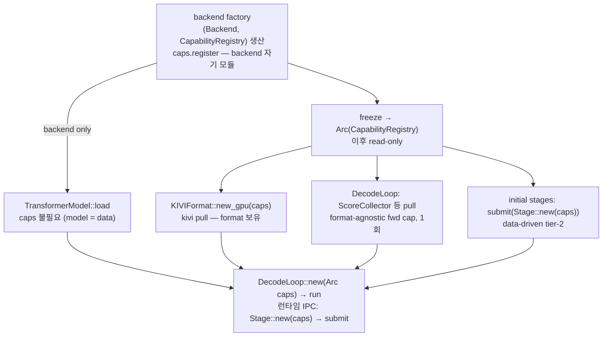
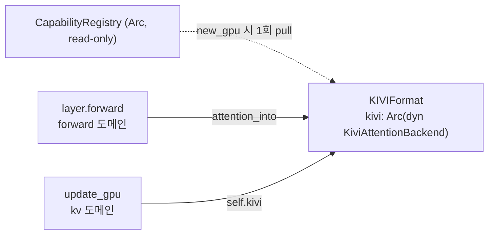
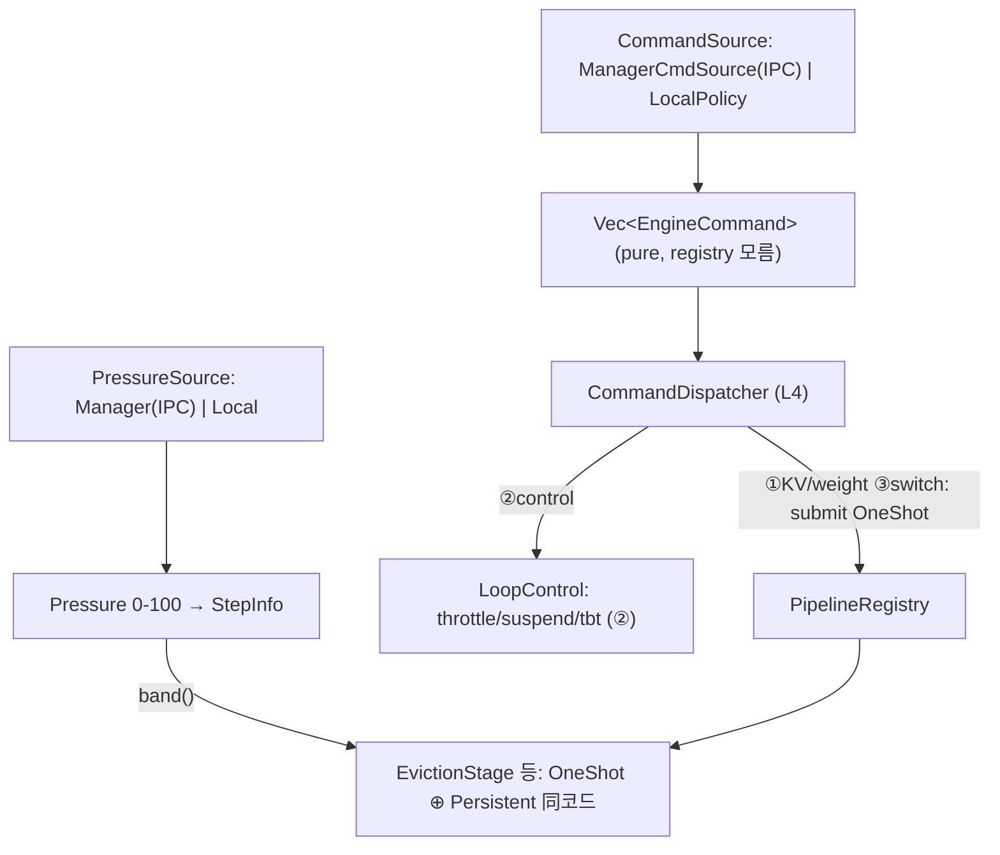

# 확장 가능 추론 파이프라인 아키텍처

> **상태**: clean 재작성 2026-05-29. 본 문서는 `arch/pipeline_stage_design.md` (v1, grill 이력 누적본) 를 **독자 우선 (overview-first) 구조로 재작성한 단일 진실원본**이다. v1 은 결정 이력 (grill 라운드 / 결정 #N 로그) 보존용으로 유지된다. 설계 *근거의 이력* 이 필요하면 v1 의 §13.5 / §16 / Resolution Log 를 본다. 설계의 *현재 상태* 가 필요하면 본 문서를 본다.
>
> **대응 spec**: `spec/41-invariants.md` §3.28 (INV-DECODE-STAGE / INV-KVCACHELAYER / INV-STAGE-LAYER-HANDLE / INV-STAGE-ORDER-SAFETY / INV-BACKEND-COMPUTE-FALLBACK).
> **선행 문서**: `arch/inference_pipeline.md` (v1 7-trait), `docs/adr/0001-kv-dispatch-paradigm.md` (KV dispatch Generic→Trait object).

---

## 0. Overview — 한 화면 정신 모델

### 0.1 미션

**어떤 기능 추가도 최소한의 변경으로 수용한다 — 단, 성능 타협 없이.**

이 한 문장이 본 아키텍처의 모든 결정을 지배한다. "기능 추가"는 새 backend(HW), 새 KV 관리 Format(KIVI/SnapKV/D2O), 새 score 알고리즘, 새 weight 관리, 새 pipeline 동작 등이다. 목표는 이들을 추가할 때 **기존 코드 수정을 최소화**하되, **hot path 성능을 회귀시키지 않는** 것이다.

이 두 목표는 hot path 에서만 충돌한다 (추상화는 indirection 을 부르고 hot path 에서 비용이 된다). 그 충돌을 **§1 의 governing principle** 로 해소한다.

### 0.2 지배 원칙 3개 (§1 상세)

| 원칙 | 한 줄 |
|---|---|
| **Path-dependent 합격선** | hot path = 성능 우선 + 비용 locality / cold path = zero-edit OCP. "최소 변경"의 정의가 path 에 따라 다르다. |
| **Safety over policy** | 프레임워크는 *안전*(crash-safe) 을 보장한다. 여러 유효 구성(stage 순서 등) 중 어느 것을 쓸지는 *사용자 책임* — policy/config 로 금지하지 않는다. |
| **Capability over god-trait** | 기능별 능력은 god trait 에 method 를 붙이지 않고, 작은 opt-in capability 로 분리한다. 소비자는 capability handle 을 construction 시점에 보유한다. |

### 0.3 전체 구조

```mermaid
flowchart TB
    subgraph L4["L4 session/ : 진입점 / 조립"]
        decode["DecodeLoop run"]
        registry["PipelineRegistry"]
        factory["Backend factory + CapabilityRegistry build"]
    end

    subgraph L3stage["L3 stages/ : cross-cutting state mutation"]
        evict["EvictionStage"]
        swap["SwapDispatchStage"]
        kivi_q["KviQuantizeStage"]
        tier["TierMoveStage"]
        sw["SwitchStage : device 전환"]
    end

    subgraph L3inf["L3 inference/ : forward path"]
        fwd["Forward step"]
        layerexec["per-layer execution"]
    end

    subgraph L2["L2 engine 직속 : 확장점 trait"]
        be["Backend compute core"]
        hw["Hardware : hardware 축 resolver (backend, memory)"]
        kvl["KVCacheFormat"]
        wl["WeightFormat"]
        ps["PipelineStage / LifecyclePhase / StageContext"]
        caps["CapabilityRegistry"]
    end

    subgraph L1["L1 backend/ : HW impl + capability"]
        cpu["CpuBackend : universal fallback"]
        ocl["OpenCLBackend + KiviAttentionBackend / GpuScoreAccess"]
        cuda["CudaBackend"]
    end

    decode --> registry
    decode --> fwd
    factory --> caps
    registry --> evict
    registry --> swap
    registry --> kivi_q
    registry --> tier
    registry --> sw
    fwd --> layerexec
    layerexec --> kvl
    layerexec --> wl
    kvl --> be
    wl --> be
    hw --> be
    sw -.->|resolve| hw
    be --> cpu
    be --> ocl
    be --> cuda
    caps -.->|capability handle 주입| kivi_q
    caps -.-> tier
    ocl -.->|미가속 op fallback| cpu

    style L2 fill:#2d4a5a
    style L1 fill:#3d2d5a
    style L4 fill:#2d5a3d
```



### 0.4 Front-door 확장점 (외부 기여자가 배워야 하는 전부)

44개 trait 중 기여자가 "무언가를 추가하려면" 알아야 하는 것은 아래 ~7개뿐이다 (나머지는 opt-in capability 또는 내부 seam — §7). **"내 기능 = 어느 trait" 즉답표**:

| 추가하려는 것 | 구현할 trait | 위치 |
|---|---|---|
| 새 HW backend | `Backend` (가속할 op 만 override) | `backend/<hw>/` |
| 새 KV 관리 Format | `KVCacheFormat` + paired attention kernel | `kv/` + `backend/<hw>/` |
| 새 weight 관리 Format | `WeightFormat` | `models/weights/` |
| 새 pipeline 동작 (eviction trigger, swap, resilience, 측정) | `PipelineStage` | `stages/{kv,weight,system}/` |
| 새 eviction 정책 | `EvictionPolicy` | `kv/eviction/` |
| 새 resilience 전략 (manager-less 자율) | `ResilienceStrategy` (출력 `Vec<EngineCommand>`) | `resilience/strategy/` |
| 새 sampling 방법 | `TokenSampler` | `inference/sampling.rs` |
| 새 backend 능력 (fused kernel 등) | capability sub-trait + `CapabilityRegistry` 등록 | `backend/<hw>/` (자기 모듈) |
| 새 score 알고리즘 | `ScoreCollector` (CPU reference + 선택적 fused kernel) | `inference/` + `backend/<hw>/` |
| 새 pressure source (manager 수신 / 자율 계산 / 3rd-party) | `PressureSource` (default 제공, opt-in 교체) | `inference/` 또는 `resilience/` |
| 새 command source (manager IPC / manager-less 자율 정책) | `CommandSource` (`PressureSource` 대칭, 출력 `Vec<EngineCommand>`) | `resilience/` 또는 `session/` |

### 0.5 Wiring 3부작 — 모든 기능은 construction 에서 wiring 된다

| 무엇 | 어떻게 | 핵심 |
|---|---|---|
| **Capability** (KIVI attn, score 등) | `CapabilityRegistry` (typed anymap) | 소비자가 handle 을 construction 에서 보유. per-forward lookup 0. (도달 경로 §3.6) |
| **Backend** (HW) | backend factory + compute auto-default | 가속 op 만 구현, 나머지는 `cpu_companion` 자동 위임. |
| **Stage** | `registry.submit(stage)` | 순서는 사용자 책임, 안전은 프레임워크 보장. |

---

## 1. 지배 원칙 (Governing Principles)

### 1.1 Path-dependent 합격선

"최소 변경" 은 측정 가능한 합격선이 있어야 판정된다. 그 합격선은 path 에 따라 다르다:

| Path | 예 | 합격선 |
|---|---|---|
| **Cold** | eviction trigger, swap dispatch, score read/aggregation, tier move, resilience action, 모든 construction/wiring | **새 파일만 + 기존 파일 0 edit** (registration 1줄 제외). vtable/indirection 비용이 무시 가능하므로 OCP 를 끝까지 민다. |
| **Hot** | per-layer forward, score collection, matmul/attention dispatch | **그 기능 axis 의 concrete 모듈은 수정 OK. 단 (1) 다른 backend/layer impl 0 edit, (2) 기존 hot path 에 런타임 분기/vtable 추가 0** (선택을 construction 으로 흡수). perf 가 OCP 를 이기되, 그 비용을 한 모듈에 가둔다. |

두 목표(최소 변경 / 성능)는 hot path 에서만 충돌한다. cold path 에서는 충돌하지 않으므로 거기서는 순수 OCP 를 추구한다. hot path 에서는 충돌이 실재하므로 trade 를 허용하되, 그 비용(=concrete 모듈 수정)을 locality 로 가둔다.

이 합격선을 검증 가능한 형태로 박은 것이 `INV-HOTPATH-DISPATCH`(§8)다. **3-tier** 로 허용 dispatch 메커니즘을 명시한다 — **layer**(N_layers×/token, forward 내부) = 정적만(concrete / enum / `Option`+직접분기, **`dyn` 금지**) / **step**(1×/token, decode 루프 stage) = `Box<dyn>` OK / **boundary**(1×/generation) = 자유. enforce: static grep(per-layer forward 에 `dyn` 0) + runtime(S25 bit-identical + avg_tbt Δ≤+3%). layer tier 의 진짜 비용은 vtable 호출 자체(~ns)가 아니라 **인라인·Format 특화·벡터화의 장벽**이므로, dispatch 선택을 construction 시점에 보유한 concrete handle(§3.3 capability / §4.1 Format)로 흡수해 컴파일러 특화를 보존한다(= "성능 타협 없이" 의 검증 게이트).

### 1.2 Safety over policy

확장점에 복수의 유효 구성이 존재할 때, 프레임워크는 **"틀린 구성을 금지하는 policy"** 를 만들지 않는다. 대신 **"어떤 구성에서도 안전(crash-safe)"** 만 보장한다. 의미상 옳은 구성의 선택은 사용자(통합자) 책임이다.

예: stage 순서가 "eviction → KIVI" 든 "KIVI → eviction" 이든 프레임워크는 둘 다 crash 가 안 나도록 보장한다. 성능·정책상 어느 순서를 쓸지는 사용자가 정한다. 프레임워크가 "KIVI → eviction 은 안 됨" 같은 config 를 만들지 않는다. → `INV-STAGE-ORDER-SAFETY`.

### 1.3 Capability over god-trait

기능별 능력(KIVI fused attention, GPU score accumulator 등)은 공유 god trait(`Backend`)에 method 를 붙이지 않는다. 붙이면 새 기능 추가 = trait 수정 = 전 backend 재컴파일 = "최소 변경" 위반. 대신:

- 능력은 작은 **capability sub-trait** 로 분리한다 (opt-in — 미지원 backend 는 0줄).
- 소비자는 그 capability handle 을 **construction 시점에 보유**한다 (per-forward `as_xxx` lookup 0 → hot path 분기 0).
- handle 의 (backend → capability) 매핑은 **`CapabilityRegistry`** 한 곳이 담당한다 (§3.3).

---

## 2. 레이어링 (L1–L5)

`INV-LAYER-001 ~ 007` 정신 보존. 위치 요약:

| 항목 | 레이어 | 위치 |
|---|---|---|
| `Backend`, `KVCacheFormat`, `WeightFormat`, `PipelineStage`, `LifecyclePhase`, `StageContext`, `StepInfo`, `Pressure`, `PressureSource`, `PipelineDispatcher`, `CapabilityRegistry`, `Hardware` | **L2** (engine 직속) | `engine/src/` 직속 (파일 단위 배치 = **§2.1**) |
| concrete stage impl (`EvictionStage`, `KviQuantizeStage`, ...) | **L3** cross-cutting | `engine/src/stages/{kv,weight,system}/` |
| `KVCacheFormat` impl + forward path | **L3** | `engine/src/kv/` (KV format), `engine/src/layers/`·`inference/` (forward) |
| `WeightFormat` impl | **L3** | `engine/src/models/weights/` |
| `EvictionPolicy` impl | **L3** | `engine/src/kv/eviction/` |
| `PipelineRegistry`, `DecodeLoop`, backend factory | **L4** | `engine/src/session/` |
| HW backend impl + capability impl | **L1** | `engine/src/backend/<hw>/` |

### 2.1 Type → file 배치 (구현 결정성)

**역할.** §2 의 레이어 표가 *레이어* 만 정하면, 같은 L2 라도 어느 *파일* 에 사는지가 세션마다 갈려 모듈 그래프가 비결정적이 된다. 본 절은 신규 타입의 type→file 을 결정적으로 고정한다 (어느 구현자가 와도 같은 그래프로 수렴). 두 배치 규칙이 표를 지배한다:

- **규칙 A — L2 추상화는 top-level 형제 파일** (`core/` 우산 없음). `backend.rs`·`memory.rs`·`buffer.rs` 가 이미 L2 추상화를 top-level 파일로 두는 확립된 패턴이고, `core/` 접두어는 2026-05-29 제거됐다. 따라서 신규 L2 trait/타입도 top-level 형제(`hardware.rs`·`pipeline.rs`) 또는 응집 모듈(`capability/`)로 둔다. `core/` 를 되살리지 않는다.
- **규칙 B — `stages/` subdir = 그 Stage 가 *주로* 바꾸는 state 도메인** (`kv`/`weight`/`system`). 메커니즘이 아니라 주 의도로 가른다 (switch 는 KV migrate 를 *유발* 하지만 주 의도가 device 변경이므로 `system/`).

| 모듈 / 파일 | 레이어 | 거주 type | 비고 |
|---|---|---|---|
| `backend.rs` | L2 | `Backend` (god-trait + required floor 만) | capability sub-trait 는 `capability/` 로 이동 → backend.rs 가 깨끗해짐 |
| `capability/mod.rs` | L2 | `CapabilityRegistry` (typed anymap) | §3.3 |
| `capability/{kivi_attention,gpu_score,score_collector,tier_movable}.rs` | L2 | 각 capability sub-trait | 새 capability = 새 파일(순수 OCP). impl·등록은 `backend/<hw>/`(L1) |
| `hardware.rs` | L2 | `Hardware`, `BackendRegistry`, `MemoryRegistry`, `DeviceTarget` | §3.5. `session/init.rs` 4 Arc 흡수. `DeviceTarget` = `{ Cpu, Gpu, Npu }` 추상 연산 역할(**G5 닫힘** — 구체 backend(OpenCL/CUDA)는 registry resolve, `Npu` 는 registry 미보유 시 resolve None) |
| `pipeline.rs` | L2 | `PipelineStage`, `LifecyclePhase`, `StageContext`, `StepInfo`, `Pressure`, `PressureSource`(trait), `StageOutcome`, `StopReason`, `StageLifecycle`, `PipelineDispatcher`(trait) | §5. `Pressure` 는 유일 소비처가 `StepInfo` 라 여기 동거(과거 `pressure/` 디렉토리 이름 충돌은 `kv/` rename 으로 해소). `StepInfo` = `{ pos, decode_step, pressure }` 3필드 `Copy`(**G5 닫힘** — `prev_token` 은 observe Stage 승격 trigger, `kv_capacity`→held handle query, `stop_requested`→`StageOutcome::Stop`) |
| `stages/kv/{eviction,d2o,kivi_quantize,swap_dispatch,tier_move}.rs` | L3 | 각 KV-mutate Stage (**얇은 trigger 만**) | 현 `*_handler.rs` 4종의 `handle()` trigger 부분 + `tier_move`(신규). 알고리즘(d2o merge·`offload_one`/`recall_one`)은 `kv/` 로 추출(**함수 단위 cut**, G3-reconcile Q3). `kv/` 정책·포맷에 수평 의존(L3→L3) |
| `stages/weight/weight_swap.rs` | L3 | `WeightSwapStage` (얇은 trigger) | concrete-handle `Arc<LayerSlot>`(§4.2). 현 `pressure/weight_swap_handler.rs` 의 trigger 부분. swap 오케스트레이션은 `weight/`(아래 행) |
| `stages/system/switch.rs` | L3 | `SwitchStage` | `Arc<Hardware>` resolve(§5.1). **system/ 확정 거주자 1개** |
| `stages/system/` (미정) | L3 | resilience-제어 Stage, observe/보고 Stage | §0.4 가 system/ 거주만 약속. 분해·명명은 downstream (resilience→stage 매핑은 별도 설계) |
| `kv/` (신설, 현 `pressure/` rename) | L3 | `KVCacheFormat` impl(`kv_cache.rs`=Standard / `kivi_cache.rs`=KIVI), `eviction/`(EvictionPolicy sliding/h2o/streaming), `offload/`(tier + `offload_one`/`recall_one`), `d2o/`(merge 알고리즘 + `d2o_layer_alloc`), `kv_migrate.rs`(🟡 §4.1 storage-slot 트랙) | KV-cache 도메인 = format+policy+tier+algo. format 은 도메인 1차 타입(**flat**, `kv/format/` subdir 아님). 트리거(Stage)만 `stages/` 로 분리(G3-reconcile Q1/Q3/Q4) |
| `weight/` (신설, 현 `pressure/weights/` rename) | L3 | weight runtime swap 오케스트레이션(`swap_executor`/`phase_aware_swap`/`decider`/`async_swap`/`noise_table`/...) | §13.8-O trait 경계(`RuntimeResourcesAccess`) 유지. `models/weights/`(load-time artifact: LayerSlot/SecondaryMmap)와 분리(G3-reconcile Q2) |
| `inference/sampling.rs` | L3 | `TokenSampler`(trait, v1 `session/traits.rs` 서 이동) + 기존 `sample()`/`SamplingConfig` | front-door ①(§0.4/§7) 생존자 |
| `models/weights/` | L3 | `WeightFormat` impl | §0.4 |
| `resilience/` | L3 | `ManagerPressureSource`(`PressureSource` impl), `ManagerCommandSource`/`LocalPolicy`(`CommandSource` impl), `ResilienceStrategy` 3종(thermal/energy/compute)+`resolve_conflicts`, resilience adapter | trait 정의는 `pipeline.rs`(L2), impl 만 여기. **`ResilienceAction`·`MemoryStrategy` 삭제**(§5.4). `CommandDispatcher`는 L4(`session/`) |
| `session/` | L4 | `PipelineRegistry`(impl `PipelineDispatcher`), `CommandDispatcher`(§5.4), `DecodeLoop`, backend factory, `DecodeResult`, `LocalPressureSource` | factory 가 `Hardware`/`CapabilityRegistry` 인스턴스 출생(타입은 L2) |
| `backend/<hw>/` | L1 | `Backend` impl + capability impl + `caps.register` | §0.4 |

**v1 잔재 처리.** `session/traits.rs`(v1 7-trait: `Forward`/`EvictionStage`/`SwapStage`/`CommandSource`/`EngineReport`/`TokenTickSink`/`ResilienceBundle`/`DecodeObserver` + `StepCtx`/`EvictionOutcome`)는 §5 가 단일 `PipelineStage` 로 흡수하므로 **SUPERSEDED — Phase β(DecodeLoop 재작성) 삭제** (dead code 제거, doc 과 달리 코드는 frozen 보존 안 함). 동명 충돌(v1 `EvictionStage`/`SwapStage` trait ↔ v2 concrete Stage)은 흡수로 소멸. 단 **`TokenSampler` + `CommandSource` 가 생존**: `TokenSampler` → `inference/sampling.rs` 로 이동(front-door ①), `CommandSource` 는 이산 명령 source seam(`PressureSource` 대칭)으로 존속(§5.4 — 초기 "PipelineStage 흡수" 판정을 역전; 명령을 *생산*하지 phase 에 *반응*하지 않으므로 Stage 로 흡수 불가). `EngineReport` 는 heartbeat/status 보고 역할로 `CommandExecutor` 에 잔류. `StopReason`/`StepCtx`/`EvictionOutcome` 등가물은 `pipeline.rs` 로 수렴.

**enforce.** 규칙 A/B 의 핵심 제약(capability·`Hardware`·`Pressure` 가 L2 여야 함)은 이미 `INV-LAYER-001~007`(L1 impl·L3 consumer 양 끝이 L2 abstraction 에 의존, DIP)로 강제된다 — 별도 INV 불요. 본 §2.1 표가 *파일 단위* 배치의 SSOT.

> **연혁** — G3 type→file 배치 확정 (2026-06-01 "설계 구체화" 세션 grill, Q1~Q6): §2 표가 레이어만 정하고 *파일* 은 미명세였던 공백(handoff G3) + §2/§0.4 의 stale `core/` 경로(2026-05-29 제거됨) + `stages/` 미생성을 닫음. Q1 스켈레톤 = `core/` 부활 안 함·L2 top-level 형제·`stages/` 3-way 신설·format impl 은 `pressure/` 유지. Q2 `Hardware` 클러스터 4종(+`DeviceTarget`) 단일 `hardware.rs`(레이어링이 L2 강제 — stage(L3)·WeightFormat 이 의존). Q3 `capability/` 모듈(registry+sub-trait 정의 한데, backend.rs 는 god-trait 만). Q4 단일 `pipeline.rs`(trait 패밀리+`StepInfo`+`Pressure`; impl 분산). Q5 stages 매핑(kv 5+weight 1+system switch 확정, resilience-control·observe 는 downstream; `pressure/`=데이터·정책 유지·`stages/`=트리거 분리; subdir=주 mutate 도메인). Q6 `session/traits.rs`=v1 폐기(Phase β)·`TokenSampler` 만 생존 이동. 코드 적용 = Phase α-W(`hardware.rs`/`capability/`/`pipeline.rs` 신설 + `stages/` 골격) / α-K(KV format impl `pressure/` 정착). `DeviceTarget` variant·`StepInfo` 필드는 **G5** 로 분리.
>
> **연혁** — G3-reconcile: `pressure/` 해체 (2026-06-02 "pressure grill" 세션, Q1~Q4): 위 G3 의 "format impl 은 `pressure/` 유지" 결정을 **SUPERSEDED**. Q1 `pressure/`→`kv/` rename — redesign 후 디렉토리 내용물이 전부 KV-cache 데이터(format+policy+tier+algo)라 "pressure" 는 역사적 사고이고, `Pressure` 타입↔dir 이름 충돌도 해소(blast radius 189 ref/53 file, 기계적). Q2 `pressure/weights/`(weight swap 오케스트레이션, KVCache 0 import — 오배치 입주자)→`weight/` 신설 (§13.8-O `RuntimeResourcesAccess` trait 경계 유지, `models/weights/` load-time artifact 와 분리). Q3 handler split = **함수 단위 cut**(트리거 `handle()`→`stages/`, 알고리즘→도메인 dir; d2o merge ~440 LOC·`offload_one`/`recall_one` 추출) — G3 의 "file 단위(handler 통째→Stage)" 를 정밀화(d2o_handler 2273 LOC 에 트리거+알고리즘 혼재). Q4 format = `kv/` **1차 타입(flat)**, `kv/format/` subdir 철회 — format 은 kv 종속이 아니라 **축**(추상화=L2 trait `KVCacheFormat`/`WeightFormat` + 공유수학=`quant/`, impl 만 데이터에 내재; per-layer 동적 precision 은 Stage+format mutation primitive 로 지원하므로 impl 위치 무관). 코드 적용 = Phase α-K(`kv/`/`weight/` rename + handler 함수 cut + `KVCacheFormat` trait 확립).
>
> **연혁** — G5 detail-fill (2026-06-02 "G5" 세션 grill, Q1~Q2): G3 가 `DeviceTarget`·`StepInfo` 를 file 에 배치만 하고 미룬 variant/필드 열거를 닫음. G5-1 `DeviceTarget` = `{ Cpu, Gpu, Npu }` 추상 연산 역할(§3.5) — 구체 backend 는 registry resolve(OpenCL↔CUDA feature 배타 → `Gpu` 택1, rpcmem 은 device 아님), `Npu` 는 backend 부재지만 partition `SliceSpec` 가 spec 레벨 전제. G5-2 `StepInfo` = `{ pos, decode_step, pressure }` 3필드 `Copy`(§5.1) — v1 `StepCtx` 5필드 중 `pos`/`decode_step` 승계, `prev_token`(샘플러)/`kv_capacity`(held-handle query)/`stop_requested`(`StageOutcome::Stop` 반환) 드롭, `prev_token` 은 observe Stage 승격 trigger(driver 보유 → ripple 0). 코드 적용 = Phase α-W(`hardware.rs`/`pipeline.rs` 신설 시 동봉).

---

## 3. Backend & Capability 모델

### 3.1 `Backend` trait — compute core

`Backend` 는 **모든 backend 가 공유하는 compute primitive** 만 가진다. Format-specific 능력(KIVI 등)은 여기 없다 (§3.3 capability 로 분리).

**Required floor (~4)** — 새 backend 가 반드시 제공:

```rust
pub trait Backend: Send + Sync {
    fn cpu_companion(&self) -> &dyn Backend;   // fallback 대상 제공 의무
    fn name(&self) -> &str;
    fn device(&self) -> &str;
    fn as_any(&self) -> &dyn std::any::Any;     // cold-path 한정 escape hatch
    // ... compute + memory op (아래) ...
}
```

**Compute op — cpu_companion auto-default** (`INV-BACKEND-COMPUTE-FALLBACK`):

compute op (`matmul`, `attention_gen`, `flash_attention_prefill`, `rms_norm`, `rope_inplace`, `silu_mul`, ...) 의 default 본문은 `self.cpu_companion()` 으로 위임한다. 새 backend(구형 NPU 포함)는 **가속 가능한 op 만 override** 하고, 못하는 op 은 그냥 두면 자동으로 CPU 에서 정확히 동작한다.

```rust
    fn flash_attention_prefill(&self, /* ... */) -> Result<()> {
        fallback_profile::note(self.name(), "flash_attention_prefill");  // 기본 OFF → ~0
        self.cpu_companion().flash_attention_prefill(/* ... */)
    }
```

- CPU backend 는 universal fallback 이므로 모든 compute op 을 실제 구현한다 (`cpu_companion()` 이 self → 위임 default 를 쓰지 않음).
- 이로써 새 backend 비용 ↓ + core 에 새 compute method 추가 시 기존 backend 안 깨짐 (관리 비용 0).

**Memory/sync op — companion 위임 불가**:

`write_buffer` / `read_buffer` / `synchronize` / `wait_event` / `alloc_*` 등은 backend 자기 device 메모리를 다루므로 companion 으로 위임할 수 없다. 대부분 required, UMA 처럼 의미상 무방한 경우만 no-op default.

### 3.2 Fallback profiling

compute op 이 가속되지 않고 `cpu_companion` 으로 위임될 때, 어느 op 이 위임됐는지 **coverage map** 을 수집한다. 새 backend bring-up 시 가속 미달 op 을 즉시 보기 위함.

- `LLMRS_FALLBACK_PROFILE=1` 로 활성 (기본 OFF, `OnceLock` 캐시 → hot path 비용 ~0; 그나마 이미 느린 fallback 경로에서만 분기).
- count/coverage 만 수집 (timing 은 위임된 `cpu_companion` op 이 기존 `OpProfiler` 에 CPU 항목으로 이미 잡힘 — DRY).
- 기존 `observability/profile/op_trace.rs` sink 재사용.

```
LLMRS_FALLBACK_PROFILE=1 → "NPU_xyz: CPU-fallback[flash_attention_prefill ×1024, attention_gen ×1024]"
```

### 3.3 Capability sub-trait + `CapabilityRegistry`

**왜 필요한가.** 추론 경로는 backend 를 `Arc<dyn Backend>` 추상 핸들 하나로 들고 다닌다(CPU/OpenCL/CUDA 무관 — 호출지는 backend 종류를 몰라야 한다). 그런데 일부 능력은 특정 backend 에만 있다 — GPU score accumulator·KIVI fused attention 커널은 OpenCL 에만 존재한다. 추상 핸들로는 이 능력을 부를 수 없어, "이 backend 가 사실 OpenCL 이면 그 능력을 꺼내 쓰자" 는 escape hatch 가 시간이 지나며 **4종**(`as_any` downcast / `as_kivi_attention` / `gpu_score_acc` / `get_extension`)으로 자라났다. 같은 일(backend 능력 접근)을 4 문법으로 하고, hot path 가 토큰마다 downcast 를 반복하며, 새 backend 는 4종을 전부 흉내내야 한다 — "기능 추가를 최소 변경으로 수용" 의 정반대다.

**무엇을 신설하나 — registry 하나뿐.** 흔한 오해(폐기): "4 메커니즘을 1 registry 로 수렴". 실측이 이를 반박한다 — `as_any` 53 호출 중 capability lookup 은 **0건**이다(concrete backend downcast 32 + buffer downcast 25; `KiviAttentionBackend`/`GpuScoreAccess` 로 downcast 하는 곳은 없다 — 그것들은 전용 method 로만 접근). 4종은 성격이 전혀 다르므로 하나로 묶으면 buffer downcast·cold 자원까지 끌어들이는 과설계가 된다. 본 설계가 *신설*하는 메커니즘은 **`CapabilityRegistry` 하나**이며, 그것이 흡수하는 대상은 **backend-agnostic capability handle**(gpu_score·KIVI·score collector — 이종 소비자가 backend 종류를 모른 채 공유하는 능력) 뿐이다. 나머지 3종은 신설이 아니라 각자 제자리로 귀속된다(§3.3.1 표).

Format-specific 능력은 작은 sub-trait 으로 분리한다:

```rust
pub trait KiviAttentionBackend: Send + Sync {
    fn has_kivi_attn_kernel(&self, bits: u8) -> bool;
    fn is_nosub_device(&self) -> bool;
    fn attention_gen_kivi(&self, /* ... */) -> Result<()>;
}
pub trait GpuScoreAccess: Send + Sync { /* ... */ }
pub trait ScoreCollector: Send + Sync { /* §6 */ }
pub trait TierMovable: Send + Sync { /* cross-Format tier move */ }
```

소비자는 이 handle 을 **construction 시점에 보유**(도달 경로 = §3.6 wiring 표준) 하고 hot path 에서 직접 호출한다 (per-forward `backend.as_kivi_attention()` lookup 폐기 → hot path 분기 0). (backend → capability) 매핑은 `CapabilityRegistry` 한 곳이 담당한다(흡수 대상 = capability handle 뿐, 위 "무엇을 신설하나" 참조):

```rust
#[derive(Default)]
pub struct CapabilityRegistry { map: HashMap<TypeId, Box<dyn Any + Send + Sync>> }
impl CapabilityRegistry {
    pub fn register<C: ?Sized + 'static>(&mut self, h: Arc<C>) {
        self.map.insert(TypeId::of::<Arc<C>>(), Box::new(h));   // Arc<dyn Trait> 를 concrete payload 로 (unsafe 없음)
    }
    pub fn get<C: ?Sized + 'static>(&self) -> Option<Arc<C>> {
        self.map.get(&TypeId::of::<Arc<C>>())?.downcast_ref::<Arc<C>>().cloned()
    }
}

// backend factory — backend "자기 모듈" 에서만 등록
fn build_opencl() -> (Arc<dyn Backend>, CapabilityRegistry) {
    let ocl = Arc::new(OpenCLBackend::new(/* ... */));
    let mut caps = CapabilityRegistry::default();
    caps.register::<dyn KiviAttentionBackend>(ocl.clone());   // concrete→dyn (OpenCLBackend 가 impl)
    caps.register::<dyn GpuScoreAccess>(ocl.clone());
    (ocl, caps)
}
```

- **새 capability 종류** = 새 trait 으로 `register`/`get` — 공유 struct edit 0. 양 축(새 backend / 새 capability) 모두 open.
- registry lookup 은 construction(cold) 에서만 → 비용 무관.

#### 3.3.1 backend-specific 동작의 귀속 — registry 는 그중 하나

`as_any` 라는 범용 escape hatch 가 떠맡던 일은 **성격별로 제자리에 귀속**된다. 신설은 ① 하나뿐이고, ②·③ 은 *기존* 메커니즘 유지, 나머지는 *기존* abstraction·정당 예외다.

| 동작 성격 | 거처 | 신설? | 예 | 왜 여기 |
|---|---|---|---|---|
| **① 능력 (capability)** | `CapabilityRegistry` | **신설** | gpu_score, KIVI, score collector | 이종 소비자가 backend 종류 모른 채 공유 → handle 보유 + hot path 분기 0 |
| **② 자원 (resource)** | `get_extension(EXT_*)` | 유지 | OpenCL queue, rpcmem allocator | setup 순서 의존(소비자가 construction 에 미리 못 받음) → string-key cold lookup 이 자연 |
| **③ 관찰 (diagnostic)** | log macro + `action_diag_helper` | 유지 | cl_mem dump, profile flush, op label | fire-and-forget 디버깅 채널 — `d0bd0802` 가 EventSink trait 제거 → log 로 확정. capability trait 화는 회귀 |
| **메모리/buffer** | 기존 `memory/` abstraction | — | weight materialise, buffer write | backend capability 가 아니라 memory 도메인 책임 (buffer 는 이미 추상화됨) |

**②·③ 을 registry 에 넣지 않는 이유.** ② 자원은 capability handle 과 **라이프사이클이 다르다** — queue/allocator 는 setup 순서에 묶여 construction 시점에 핸들을 미리 줄 수 없다. ③ 관찰은 능력이 아니라 fire-and-forget 채널이고, 이미 `d0bd0802` 에서 sink trait 인프라(936 LOC)를 걷어내 log macro 로 이행한 영역이다 — 여기에 `BackendDiagnostics` capability trait 을 세우면 막 제거한 것을 되살리는 회귀가 된다.

#### 3.3.2 도메인 귀속 — concrete downcast 가 정당한 경우

위 ①~③ 으로 흡수되지 않고 남는 concrete backend downcast 는 **누수가 아니라 정당한 예외**일 수 있다. 판정 기준은 **호출 도메인**이다:

- **model forward 도메인 *내부*의 concrete downcast 는 정당하다.** model forward 는 "이 backend 로 forward 를 실행한다" 의 최종 책임자이므로 backend concrete 를 알 수밖에 없다. 예: `plan.execute(&OpenCLBackend)` (GPU kernel 실행 엔진 — 소비자가 model forward 단일 도메인, 1-consumer 라 capability 로 추출할 가설적 seam 도 아님), noshuffle SOA weight layout 설치/검증, raw enqueue. 이들은 `// LAYER-EXEMPT` 로 명시 인정한다.
- **다른 도메인(kv/eviction/session)이 backend concrete 를 downcast 하면 누수다.** capability(①)·자원(②)·관찰(③)·memory abstraction 중 하나로 흡수해야 한다. 예: weight swap 의 `try_pool_materialise` 가 OpenCL DMA-BUF 메모리를 직접 만지는 것 → memory 도메인으로 흡수 대상.

**KIVI 와 plan 이 갈리는 이유**(같은 OpenCL 실행이지만 운명이 다름): KIVI 는 소비자가 kivi_cache(kv) + transformer(forward) = **cross-domain** 이고 `KiviAttentionBackend` trait 이 *이미 존재*하므로 — 능력의 절반만 덮고 절반은 concrete 로 새는 **반쪽 trait** 이 최악이라 표면을 완성해 ① 로 흡수한다. plan 은 소비자가 model forward **단일 도메인** 이라 1-consumer 가설적 seam → 정당 예외로 둔다. (이미 존재하는 trait 은 완성하거나 폐기하거나, 반쪽 금지. 아직 없는 trait 은 2nd consumer 까지 만들지 않는다 — promotion-trigger.)

### 3.4 Stage Format-handle 형태 (3종 — 계층 아닌 메뉴)

Stage 가 Format 을 보유하는 `Arc<...>` handle 의 정적 타입은 Rust 에서 정확히 3가지뿐이다 (exhaustive, **순서 없는 선택지** — "tier/계층" 아님):

| 형태 | 타입 | 전형적 용례 | downcast |
|---|---|---|---|
| **base-trait-handle** | `Arc<dyn KVCacheFormat>` / `Arc<dyn WeightFormat>` | base primitive 만 호출 (어느 Format 인지 모름) | 0 |
| **concrete-handle** | `Arc<ConcreteFormat>` (예: `Arc<KIVIFormat>`) | 그 Format 의 concrete method 직접 호출 | 0 (register 시 compile-time type) |
| **capability-handle** | `Arc<dyn CapabilityTrait>` (Stage 측 정의) | 이종 Format 가로지르는 능력 | 0 |

규칙은 handle *타입* 에서 자동 도출된다 ("tier 라벨" 불필요): base-trait-handle 을 든 Stage 는 어느 Format 인지 몰라야 한다(`INV-KVCACHELAYER-PRIMITIVE-AGNOSTIC`); concrete-handle 을 든 Stage 가 그 타입을 아는 것은 위반이 아니다(그게 concrete 를 든다는 의미); capability-handle 은 Stage 측 trait 의 추상화 책임. 4번째 형태는 없다(enum-of-concrete 는 OCP 재발이라 기각).

**concrete-handle 실제 예시 — D2O eviction**: D2O 는 evict 토큰을 K 코사인 유사도로 retained nearest 에 merge 한다(`engine/src/kv/d2o/` — `dequantize_k` 가 F32/F16/Q4_0 분기). raw K read 가 필요해 base-trait-handle 로는 불가하지만, **capability-handle(`Arc<dyn DenseKVRead>`)을 지금 만들지 않는다**. raw-K-read 소비자가 D2O **하나뿐**이기 때문(H2O/SnapKV 는 attention score, Sliding/Streaming 은 position 으로 결정 — K 안 읽음). 1-adapter = 가설적 seam → capability trait 은 premature abstraction. 따라서 D2O Stage 는 `Arc<StandardFormat>` 를 든 **concrete-handle Stage** 로, K read 는 `StandardFormat` 의 inherent method (`read_k_layer_wide`) 직접 호출. dense concrete 가 `StandardFormat` 1개뿐이라 "dtype 변종마다 재구현" 부담 없음(이 type 이 F32/F16/Q4_0 내부 처리). KIVI/Sparse 위엔 타입 불일치로 build 시점 차단 → 잘못된 Format silent garbage 원천 봉쇄.
- **승격 trigger**: 2번째 raw-K-read 소비자(예: K-기반 클러스터링 eviction) **또는** 2번째 dense `KVCacheFormat` impl 이 등장하면 — 그때 `read_k_layer_wide` 를 `DenseKVRead` capability trait 으로 기계적 추출(method→trait + 양쪽 impl). 그 전엔 추출 금지(deletion-test 미통과).

> **연혁** — 결정 2026-05-29: D2O eviction 을 concrete-handle Stage(`Arc<StandardFormat>`)로 확정하고, `DenseKVRead` capability 는 미생성(raw-K-read 소비자 1개 = 가설적 seam).

### 3.5 Hardware — hardware 축 resolver

**역할.** **hardware 축**(연산 위치)의 좌표를 해석하는 **read-only resolver**. `Backend`(§3.1)가 단일 연산기라면, `Hardware` 는 전환·분산을 위해 **여러 backend + memory** 를 묶고 `resolve(target) → (backend, memory)` 로 좌표를 푼다. 활성 backend 를 mutable 하게 소유하지 않는다 — "현재 device" 는 decode-loop local 상태이고, 어떤 실행 경로도 이 객체를 통해 "현재" 를 관찰하지 않는다(실행은 텐서 태그로 storage 에서 backend 를 얻는다). hardware 가 정식 축인 근거는 precision(format)⊥backend 분리 가능성이다(`/CONTEXT.md` — 단일 backend 6 precision, q4 3 backend → many-to-many).

**backend ⊥ memory 직교.** 내부에 두 레지스트리를 분리 보유한다 — compute(backend) 와 data(memory). UMA(ARM SoC)에서는 여러 backend 가 한 memory 를 공유하고(switch 시 연산기 tag 만 교체, zero-copy), discrete GPU 에서는 backend 마다 별도 memory(VRAM↔RAM migrate). 1:1 페어로 묶지 않는 이유다. `resolve(target)` 이 "이 backend 로 가려면 어느 memory?" 의 UMA/discrete 분기를 한 곳에 가둔다 — 새 메모리 토폴로지가 추가돼도 호출지는 안 바뀐다.

```rust
struct Hardware {                // hardware 축 resolver (read-only, 2026-05-31 3축 확정)
    backends: BackendRegistry,   // compute: { cpu, gpu?, npu? }
    memories: MemoryRegistry,    // data:    { host, device? }  (UMA 면 device==host)
}
impl Hardware {
    // read-only: &self only. 활성 backend 소유 없음 (switch_to / current_backend 폐기).
    fn resolve(&self, target: DeviceTarget) -> (&Arc<dyn Backend>, &Arc<dyn Memory>); // UMA/discrete 캡슐화
    fn mem_available(&self) -> usize;                  // HandlerContext.mem_available 흡수
}

pub enum DeviceTarget {   // hardware 축 좌표 = 연산 위치(추상 역할). 구체 backend 는 registry resolve (G5)
    Cpu,                  // NEON/AVX2 — 항상 존재
    Gpu,                  // OpenCL or CUDA (feature 배타 → registry 가 컴파일된 것 택1)
    Npu,                  // HeteroLLM GPU∥NPU 재진입분 (line 359). registry 미보유 시 resolve None
}
```

**`DeviceTarget` = 역할이지 구체 backend 아님 (G5-1).** OpenCL↔CUDA 는 같은 `Gpu` 위치의 플랫폼별 구현체이고 feature 배타(`lib.rs:1` `compile_error!`)라 한 바이너리에 공존 불가 → `Gpu` 하나가 컴파일된 GPU backend 로 resolve. `--opencl-rpcmem` 은 device 가 아니라 memory interop(DMA-BUF alias) 차이라 variant 아님. 구체 backend variant 화(`{Cpu, OpenCL, OpenCLRpcmem, Cuda}`)는 registry 책임 중복 + feature 배타로 인한 dead variant 라 기각. 다중 GPU(`Gpu(u8)`)는 타겟 플랫폼(ARM SoC·Jetson 단일 GPU)에서 YAGNI — 등장 시 후속 확장 trivial. `Npu` 는 코드상 backend 부재(qnn_oppkg 제거 2026-05-26)지만 partition `SliceSpec`(§4.x line 484 "GPU-f16 / NPU-q4")이 spec 레벨에서 이미 전제하므로 variant 보유("spec N-capable now / leaf grows later" line 491).

**Stage 가 잡는 방식 = register 시점 `Arc<Hardware>` 보관** (read-only 라 interior mutability 불요). `resolve()`/`mem_available()` 는 순수 query 라 ctx 로 매번 흘릴 필요 없음(god ctx 회피, `INV-STAGE-LAYER-HANDLE`). 현재 흩어진 4 변수(`cpu_backend_arc` / `gpu_backend_arc` / `cpu_memory_arc` / `gpu_memory_arc`, `session/init.rs`)를 이 객체가 흡수한다(신설). "현재 활성 device" 는 여기 들지 않고 decode-loop local 로 둔다 — switch(hardware 축 동작)가 그 local 을 갱신하고 필요시 KV migrate 를 트리거한다(migrate 메커니즘은 grill 중, item 1).

> **연혁 [SUPERSEDED → 아래 2026-05-31 3축 재확정]** — device 3축 분리 기각 → 2축 + 실행 바탕 (2026-05-30 grill): device(switch + partition)를 Format/Stage 와 동급의 3번째 축으로 분리하는 안을 검토 후 기각. device 가 바뀌어도 Format 은 따라가므로(KIVI 는 GPU 든 CPU 든 KIVI) "곱"이 아니라 "위치"다 — deletion test 통과(partition 은 이미 `WeightFormat` dispatch, switch 는 Stage 로 강등해도 복잡도 안 늚). 결과: **switch = device 제어 Stage**, **partition = `WeightFormat` dispatch 모드**, 별도 `LifecycleStage` trait 폐기. device 변종은 늘기보다 줄어드는 추세(2026-05-26 backend matrix 5→4)라 3축 격리 명분도 약함.
>
> **연혁** — `Hardware` 명명 확정 (2026-05-31 grill): 잠정명 `Fabric` 을 `Hardware` 로 확정. `Substrate`(추상적) / `Placement`(배치 결정 함의 → partition 과 혼동) / `ExecutionContext`(Context 과부하) / `Fabric`(network fabric 연상) 검토 후, device(추상 개념)를 구체적으로 보유하는 객체라는 점에서 가장 직역적·과부하 0 인 `Hardware` 채택. `RuntimeResources`(weight-domain init 자원, `weight/setup.rs`)와는 별개 개념이라 이름 충돌 없음. 코드 rename(4 변수 → `Hardware`, `session/init.rs`)은 Phase α-W.
>
> **연혁** — device 3축 재확정 (2026-05-31 grill, 위 2026-05-30 2축 결정 역전): stage/format/hardware 3축으로 재정의. 역전 근거 = precision(format) ⊥ backend(hardware) **분리 가능성** — 단일 OpenCL backend 가 6 precision(f32/f16/q4_0/q8_0/q6_k/mxfp4) 커널 보유 + q4_0 이 CPU·GPU·CUDA 에 모두 존재 → many-to-many, precision ≠ f(backend). 옛 "곱 아닌 위치" 논거는 옛 Format(바이트 레이아웃) 정의 전제였고, 새 정의(format = 표현/precision)에선 무효. (format × hardware) 커널은 환원 불가 M×N 이나 `Backend` 인터페이스 아래 격리되어 축 가산성(M+N+K) 유지. 결과: **switch = hardware 축 동작**(구 "device 제어 Stage" 폐기), **partition = format × hardware 곱**, **`Hardware` = read-only resolver**(`switch_to`/`current_backend` 폐기, "현재 device" 는 decode-loop local). 변종 감소 추세(5→4) 논거는 HeteroLLM(GPU∥NPU)이 NPU 를 재진입시켜 무효화. 상세: `/CONTEXT.md` 세 축.

### 3.6 Wiring — capability handle 도달 경로

**역할.** §3.3 이 capability 를 *무엇으로 분리하나*(sub-trait + `CapabilityRegistry`)를 정한다면, §3.6 은 그 handle 이 *어떻게 소비자에게 도달하나*를 정한다. "소비자는 handle 을 construction 시점에 보유"(§0.2 / §1.3 / §3.3 / §5.1)라는 반복 선언의 구체적 wiring 표준이다 — 누가 registry 를 소유하고(수명), 각 소비자군이 handle 을 어떻게 얻는가. 이 표준이 없으면 같은 "construction-held" 를 모두 충족하는 복수 소유 그래프(model-필드 / decode-resolve / layer-held / format-held)가 세션마다 갈려 **구현 비결정성**이 된다 — 본 절은 그 갈림을 닫는다.

**① registry 소유자 & 수명 — session-lived.** backend factory 가 `(Arc<dyn Backend>, CapabilityRegistry)` 를 생산하고, capability 는 backend "자기 모듈" 에서만 register 한다(§3.3). register 가 끝나면 `Arc<CapabilityRegistry>` 로 **freeze → 이후 read-only**. mutable(build phase) → `Arc`(read-only) 상태 전이를 타입으로 강제(`&mut` 비노출)해 build 후 register 를 봉쇄한다. 세션 소유자(`SessionInitCtx` 에서 출생 → `DecodeLoop` 이 `Arc` 보유)가 들고, **build-time 소유자와 런타임 IPC handler 양쪽이 `get()` 으로 pull** 한다(런타임 stage 생성 지원). `Hardware`(§3.5, read-only resolver `Arc`)와 **대칭** — 둘 다 factory/init 에서 태어나 세션 내내 read-only `Arc` 로 산다.

**② 획득 메커니즘 — locator-at-owner (조립자 god-wiring 회피).** 각 도메인 소유자가 *자기 생성 시점* 에 registry 에서 *자기 것만* pull 한다(`caps.get::<dyn C>()`). 조립자가 capability 를 손으로 열거하지 않으므로 capability 가 늘어도 **조립자 0 edit**. hot per-layer 코드는 registry 를 모른다 — 이미 resolve 된 handle 을 forward-args 로 관통받아 `Option` + 직접분기로 소비한다(`INV-HOTPATH-DISPATCH` layer-tier 가 허용하는 형태, per-forward `as_xxx()` lookup 0). 플러그인 천장 = **tier-2**(새 파일 + 등록 ≤1줄, data-driven). tier-1 자동발견(`inventory` 류)은 §5.3 "순서 = 사용자 책임" 과 충돌하므로 도입하지 않고 미래 escalation 으로만 열어둔다.

**③ 소비자군별 handle 거처 (생성 규칙).**

| 소비자군 | 도메인 | handle 거처 | 획득 시점 |
|---|---|---|---|
| `TransformerModel` | — | **보유 안 함** (model = data) | — |
| `TransformerLayer` (per-layer) | forward | **보유 안 함 — args 관통** | (소유자가 args 주입) |
| KV/Weight format (`KIVIFormat` 등) | forward + kv | 필드 | format 생성 시 pull |
| cache (`KiviCache` 등) | kv | 필드 | 생성 시 pull |
| stage | stage | 필드 | 생성 시(build/runtime) pull |
| execution 주인 (`DecodeLoop`) | forward(format-agnostic) | 필드/local | 1회 pull, args 관통 |

**생성 규칙(deterministic).** "생성 site 가 국소적인 *도메인 소유자* 가 handle 을 필드로 보유하고 자기 생성 시점에 registry 에서 pull 한다. per-layer hot 코드는 예외 — 필드 없이 소유자가 forward-args 로 관통한다(`TransformerLayer` 는 15+ struct-literal 생성 site + `INV-HOTPATH-DISPATCH` layer-tier `dyn` 금지라 필드 추가가 최소변경·hot 양쪽에서 진다). **model 은 어떤 capability 도 보유하지 않는다** — capability 는 execution/hardware 의 관심사이지 model state(weights+config)가 아니다(같은 model 이 CPU 면 KIVI 커널 없음, OpenCL 이면 있음)."

**④ forward-domain home 규칙 — capability 성격이 거처를 정한다.**

- **format 관심사 capability → 그 format 객체가 보유.** KIVI fused attention 은 KV 표현(`KIVIFormat`)의 관심사다. §4.1 ④ 가 KIVI attention dispatch 를 `attention_into` 안으로 캡슐화했으므로, kivi handle 은 `KIVIFormat` 필드로 산다(KV 생성 시 pull). **forward 소비자**(layer 가 호출하는 `attention_into`)와 **kv 소비자**(`update_gpu`)가 *동일 format 객체* 를 공유 → cross-domain capability 가 단일 소유자로 통일된다. KV format 은 어차피 decode-state 라 forward-args 로 layer 에 흐르므로 kivi 가 그에 얹혀 따라간다(별도 thread 불요). 현 `KiviCache.gpu_backend: Arc<dyn Backend>` 필드 + per-call `as_kivi_attention`(`kivi_cache.rs:252/1569`, `forward_gen.rs:419`)이 이미 절반 그 형태 — 마이그레이션 = 필드 타입을 `Arc<dyn KiviAttentionBackend>` 로 좁히고 per-call lookup 제거.
- **format-agnostic forward capability → execution 주인(`DecodeLoop`)이 보유, args 관통.** 탈 format 이 없는 forward cap(예: `ScoreCollector`, §6 — format-tied 여부는 score collection 결정 대기)은 `DecodeLoop` 이 1회 resolve 해 args 로 관통한다. **model 이 아니다.**

**⑤ 조립 시퀀스.** freeze ≺ 모든 pull. model 은 caps 와 독립(가장 강한 SoC 신호).



cross-domain capability 단일 소유자 (KIVI 예):



> **연혁** — G1 wiring 표준 확정 (2026-06-01 "설계 구체화" 세션 grill): construction-held 만 선언되고 *도달 경로* 가 미명세였던 공백(handoff G1)을 닫음. ① locator-at-owner(조립자 god-wiring 회피) + 플러그인 천장 tier-2(§5.3 순서 원칙 보존, tier-1 자동발견 미도입). ② session-lived registry(freeze 후 `Arc` read-only, 런타임 IPC pull 지원). ③/④ forward cap home = format 관심사→format / agnostic→execution 주인 / **model 금지** — 초기 "model-필드 + args 주입" 추천을 사용자 push back("capability 는 execution 관심사이지 model state 아님")으로 역전. KIVI 는 §4.1 `attention_into` 캡슐화에 따라 `KIVIFormat` 단일 보유로 대안 A(model-필드)/B(decode-resolve) 둘 다 증발. ⑤ freeze≺pull, model⊥caps. 코드 적용 = Phase α-W(`CapabilityRegistry` 신설 + `SessionInitCtx`/`Hardware` 정리 + `KiviCache.gpu_backend` 좁히기) / α-K(KV Generic→trait object 시 `KIVIFormat` 확립).

---

## 4. KV / Weight Format 모델

(γ) interior mutability 모델 — Format 이 `&self` 통해 자기 state 를 mutate (`LayerSlot::rcu_weights` 패턴의 자연 확장). KV dispatch 는 Generic monomorphization → Trait object (`docs/adr/0001`).

### 4.1 `KVCacheFormat`

**역할.** KV 캐시의 **state 책임**(geometry · mutation · attention)을 **storage-format-agnostic** 하게 제공하는 base trait — geometry 3(`idx` / `current_pos` / `capacity`) + mutation 3(`write_kv` / `write_kv_batch` / `compact`) + attention 1(`attention_into`) = **7 method**. base-trait-handle 을 든 Stage 는 geometry·mutation 만 알면 되고, forward 는 `attention_into` 로 q→out 만 보므로 양쪽 다 dtype/codebook/rotation/sparse pattern 을 모른다 (impl(`StandardFormat` / `KIVIFormat` / `SparseFormat`)이 캡슐화, `INV-KVCACHELAYER-PRIMITIVE-AGNOSTIC`). 새 Format = 새 impl + paired attention kernel (`INV-KVCACHELAYER-PAIRED-KERNEL`), **base trait·forward 변경 0**.

**read 표면은 두 갈래로 분리된다.** (1) **geometry**(idx / current_pos / capacity) 는 base trait method 로 Layer 본체가 단일 소유한다 — capacity 가 한 곳에만 있어 중복이 없다. (2) **content**(raw K/V 값) 는 base trait 에 두지 않는다; concrete-handle 의 read-only inherent method(예: `StandardFormat::read_k_layer_wide -> Cow<[f32]>`)로만 접근한다. 제네릭 read view 가 없으므로 mutation 이 샐 표면도 없다 (mutation 은 3 primitive 단일 경로). **attention 은 content read 표면을 늘리지 않는다** — `attention_into` 가 layer 내부에서 자기 K/V 를 소비하되 결과(out)만 호출자에 돌려주므로 content 가 base trait 으로 새지 않는다 (forward 는 q/out 만 봄).

```rust
pub trait KVCacheFormat: Send + Sync {
    fn idx(&self) -> usize;
    fn current_pos(&self) -> usize;
    fn capacity(&self) -> usize;
    fn write_kv(&self, /* ... */) -> Result<()>;
    fn write_kv_batch(&self, /* ... */) -> Result<()>;
    fn compact(&self, keep: &[usize], merges: &[Merge]) -> Result<()>;   // keep+merges atomic
    fn attention_into(&self, /* q, backend, out, dims, scores */) -> Result<()>; // impl 이 paired kernel dispatch (NVIDIA fused / Adreno dequant). 정확한 시그니처 = impl 단계(#12)
    // as_any() 없음 — downcast 의도적 차단.
    // dtype() / KVCacheView 없음 — Stage 가 어느 Format 인지 모름.
}
```

**왜 attention 이 format 에 속하고 stage 동작이 아닌가.** format(표현)과 stage(상주 데이터 조절)는 직교한다 — **표현**(format impl: Standard / KIVI)과 **동작**(stage: Sliding / H2O / D2O). 판단 기준: `compact(keep, merges)` primitive 로 표현되면 Stage(토큰을 버리는 동작), 저장 바이트 형태가 달라 전용 커널이 필요하면 Format impl(저장 형태). attention 은 모든 Format 이 갖는 보편 연산이며 Format 별 커널(NVIDIA fused / Adreno dequant)이 다르므로 **Format 소유** — deletion test 통과(base trait 에서 빼면 forward 가 다시 Format 을 sniff 해야 함). M 표현(format) × N stage = **M+N**(조합 폭발 없음). 성능·확장성 동시 달성의 비결은 **cold/hot 분리**다: base trait 은 `Arc<dyn KVCacheFormat>`(cold path, 외부 impl 수용)로 확장성을, plan 빠른 경로는 concrete-handle(hot path, vtable 0)로 성능을 잡는다. 용어 정의는 `/CONTEXT.md` 참조.

**승격 trigger**: 2번째 Format-agnostic content-read 소비자가 등장하면 그때 `KVCacheView` capability 를 재도입한다 (§3.4 D2O 의 `DenseKVRead` 와 대칭 — 그 전엔 빈 trait 금지, deletion test).

> **연혁** — Q-#1-4/5 해소 (2026-05-29): `KVCacheView` trait + `view()` 를 **삭제**했다. #18(dtype 폐기) + Q-#1-3 (a)(raw K → concrete-handle) 이후 `KVCacheView` 는 멤버 0·소비자 0 이 되었다 (eviction 정책은 position/score 만 읽고, backend·score·D2O 는 view 를 우회) → deletion test 불통과. 삭제의 부수 효과로 capacity 중복(Q-#1-4)과 mutation 누설 표면(Q-#1-5)이 함께 소거되었다.
>
> **연혁** — ④ KIVI creep 제거 (2026-05-30 grill): `attention_into` 를 base trait 에 추가(6→7 method)하여 `forward_gen` 의 `get_kivi_raw_buffers()` Some/None Format sniff 를 제거했다. KIVI-specific no-op creep(`get_kivi_raw_buffers` / `res_pos` / `q2_tokens` / `res_cap` / `needs_flush` / `flush_if_needed`)이 ADR-0001(Generic→dyn) 전환 시 base trait 에 영구화되는 것을 사전 차단. plan 빠른 경로는 concrete-handle(`Arc<KIVIFormat>`)로 KIVI 고유 step 을 읽어 **base trait creep 0 + hot path vtable 0** 동시 달성(④-a). plan `AttentionVariant` enum 평탄화(④-b)는 Phase α-K 로 연기(friction-triggered).
>
> **연혁** — Format 용어 정리 (2026-05-30 grill-with-docs): `/CONTEXT.md` 확정에 맞춰 본 v2 문서의 저장-형태 명칭을 `Layer → Format` 으로 일괄 정리했다 (`KVCacheLayer→KVCacheFormat` / `WeightLayer→WeightFormat` / `StandardLayer→StandardFormat` / `KIVILayer→KIVIFormat` / `SparseLayer→SparseFormat` / `ConcreteLayer→ConcreteFormat`, axis 명칭 `storage 축→Format 축` · `policy 축→Stage 축`, generic "paradigm"→"Format"). "Layer" 는 transformer 디코더 블록(`TransformerLayer`/`LayerSlot`/`layer_idx`) 전용으로 한정. **INV ID(`INV-KVCACHELAYER-*` / `INV-STAGE-LAYER-HANDLE`)는 추적용 안정 키로 유지**(본문 prose 만 갱신). **잔여 [P2]**: spec/41-invariants.md INV 본문 + 잔여 arch 문서(inference_pipeline·README·backend_conformance·adr/0001) + 코드(`KVCacheOps→KVCacheFormat`, Phase α-K 동행). v1(`pipeline_stage_design.md`)은 결정-이력 아카이브라 동결.
>
> **연혁** — item 1 (switch KV migrate) 해소 (2026-05-31 grill): migrate 를 **interior-mutate** 로 확정 (현 `kv/kv_migrate.rs::migrate_kv_caches` 의 `&mut [KVCache]` `*kv=new_kv` 값 교체는 held-handle 모델과 충돌 → Phase α-K 수렴). 결정적 관찰: UMA migrate 는 데이터(format 좌표) 불변·backend 태그(hardware 좌표)만 교체(`kv_migrate.rs:84-97`)라 **hardware 축 op** 이다. 따라서 migrate 는 KVCacheFormat mutation primitive(write_kv/compact)에 **넣지 않는다**(handoff 원 Q1 = No, cross-axis 오염 회피). seam: KV storage(buffer+태그)를 format 과 분리된 **slot 으로 빼고**(weight `Arc<LayerSlot>` 과 대칭 → "KV·weight 동일 3축" 원칙 실현) format 은 slot 을 읽어 계산만, migrate 는 slot 내용 swap — **(c) storage-slot 잠정 결정**(대안 (a) format 메서드=축 오염, (b) `Relocatable` capability=소비자 1개 deletion-test 불통과). 후속 재검토 여지 표시.

### 4.2 `WeightFormat`

**역할.** weight layer 의 dispatch 모드(Full / Skip / Partition)를 적용하는 base trait — KV(§4.1)와 대칭이다. base-trait-handle 을 든 Stage 는 dispatch 모드만 알고 weight content 는 모른다. precision swap 등 Format mutation 은 concrete-handle Stage(예: `WeightSwapStage` with `Arc<LayerSlot>`)가 concrete method 로 직접 수행한다. `LayerDispatch::Partition` 의 분산 대상 backend 는 `Hardware`(§3.5)에서 resolve 하고, 슬라이스마다 다른 (format, hardware) 좌표를 가질 수 있다(GPU-f16 / NPU-q4). **partition = format(표현) × hardware(위치)의 곱**이다 (§3.5 연혁 — hardware 정식 축).

**read 표면은 concrete-handle 로만.** forward 는 `slot.load_weights() -> Arc<TransformerLayer>` 로 concrete weight 를 직접 읽는다. base trait 에 제네릭 read view(`view()`)를 두지 않는 이유는 **런타임 weight 구조체가 `TransformerLayer` 단 하나**이기 때문이다 — 아키텍처 차이(Llama / Qwen / Gemma)는 load-time mapper(`models/mappers/`)가 `Option` 필드(예: Qwen `qkv_bias`)로 흡수하므로 런타임에는 단일 layout 만 존재한다. concrete layout 이 1개뿐이라 `&dyn WeightFormatView` 는 1-adapter 가설적 seam 이다.

```rust
pub trait WeightFormat: Send + Sync {
    fn idx(&self) -> usize;
    fn apply_dispatch(&self, d: LayerDispatch, hw: &Hardware) -> Result<()>;  // construction tier; companion 을 Hardware 로 resolve
    // view() 없음 — read 는 concrete-handle (load_weights) 경유. 연혁 참조.
    // apply_storage(spec) 없음 — precision swap 등은 concrete-handle Stage (Arc<LayerSlot>) 가 직접 호출
}

// LayerDispatch — construction-time spec. Partition 은 N-HW composite.
pub enum LayerDispatch {
    Full,                         // 1-slice dense fast-path (slice 기계 우회)
    Skip,                         // 0-slice; Full/Partition 과 나란한 모드 유지 (분리는 추후 — 2026-05-31 grill)
    Partition(Vec<SliceSpec>),    // N-slice composite, share 합 ≈ 1.0
}
pub struct SliceSpec { share: f32, hardware: DeviceTarget, format: DType }  // per-slice precision (GPU-f16 / NPU-q4)
```

**승격 trigger**: `TransformerLayer` 로 매핑 불가능한 2번째 런타임 weight layout 이 등장하면 그때 `WeightFormatView` 를 도입한다 (KV §4.1 의 `KVCacheView` 재도입 trigger 와 대칭).

> **연혁** — Q-#2(WeightFormatView) 해소 (2026-05-29): `WeightFormatView` trait + `WeightFormat::view()` 를 **삭제**했다 (KV §4.1 과 대칭). `WeightFormat::view()` 를 소비하는 base-trait-handle 보유자가 0 이고(forward 는 concrete `load_weights()` 우회), concrete layout 이 `TransformerLayer` 1개뿐이라 deletion test 불통과. `weight_tensor(name)` vs typed-method 논쟁도 함께 증발(concrete named 필드 직접 read).
>
> **연혁** — item 2 (partition wiring) 해소 (2026-05-31 grill): `apply_dispatch` 는 신설(코드 0건) — 현 `transformer.rs:990 prepare_tensor_partition(ratio, cpu_backend)`(setup 1회, ratio split → `PartitionContext` install, 단일 companion·2-way)의 일반화다. 결정: (1) **`LayerDispatch::Partition(Vec<SliceSpec>)`** = N-HW composite (CPU/GPU/NPU/DPU), `SliceSpec{share, hardware, format}` 로 per-slice precision. (2) companion 은 `Hardware.resolve(spec.hardware)` (baked-in `cpu_backend` 제거). (3) `PartitionContext` 재활용하되 `PartitionedWeight` 안쪽을 `gpu_slice/cpu_slice`(2-fixed) → `Vec<WeightSlice{tensor, backend, rows}>`(3+ companion 수용). (4) **spec·struct 는 N-capable 지금 / N-way 병렬 dispatch+merge 커널은 leaf 로 성장** — 새 HW 추가 시 spec 재형성 0, leaf 한 곳만(3축 "M×N 은 Backend 아래 leaf 격리" 원칙을 partition 에 적용). (5) `apply_dispatch` 는 construction(boundary) tier 라 Hardware·dyn 자유; forward 는 `Option<PartitionContext>` 정적 분기 유지(`INV-HOTPATH-DISPATCH`). (6) `Skip` 은 Full/Partition 과 나란한 모드로 유지(0-slice 통일 vs stage-축 분리는 friction-triggered). 코드: Phase α-W.

---

## 5. PipelineStage 모델

v1 의 7-trait (`Forward / EvictionStage / SwapStage / CommandSource / TokenSampler / DecodeObserver`) 을 **단일 `PipelineStage` + `LifecyclePhase` enum + entry point별 `PipelineRegistry`** 로 통합. 현 코드의 5개 hook trait(StepHook/PhaseHook/LayerBoundaryHook/DecodeObserver/StopCondition)을 흡수한다. (단 `TokenSampler`·`CommandSource` 는 흡수 대상이 아니라 **생존** — `CommandSource` 는 이산 명령 source seam 으로 §5.4, `TokenSampler` 는 front-door ① §0.4; 둘 다 phase 에 *반응*하는 Stage 가 아니라 각각 *명령 생산*·*토큰 선택* 책임이라 PipelineStage 로 환원 불가.)

### 5.1 trait

```rust
pub trait PipelineStage: Send + Sync {
    fn name(&self) -> &str;
    fn lifecycle(&self) -> StageLifecycle { StageLifecycle::Persistent }
    fn on_phase(&self, phase: &LifecyclePhase, ctx: &mut StageContext<'_>) -> Result<StageOutcome>;
}

pub enum StageLifecycle { Persistent, OneShot }
pub enum StageOutcome { Continue, Consumed /* OneShot 만 */, Stop(StopReason) }

pub struct StageContext<'a> {   // 2 field 슬림
    pub step: StepInfo,         // read-only 값
    pub profiler: &'a mut Profiler,
}

pub struct StepInfo {           // read-only per-step VALUE (Copy, borrow 0) — G5
    pub pos: usize,             // 시퀀스 절대 위치 (구 StepCtx.pos) — eviction/RoPE/kv 소비
    pub decode_step: usize,     // decode 반복 카운터 0-based (구 StepCtx.decode_step) — OneShot/주기 stage
    pub pressure: Pressure,     // system 압력 scalar 0–100 (§5.1, pluggable PressureSource 출력)
    // 승격 trigger: observe Stage 가 토큰 스트림 소비 요구 시 `prev_token: u32` 추가
    //               (driver 가 이미 보유 — ripple 0, trait·소비자 무변경)
}
```

**`StepInfo` 3필드 borrow-0 (G5-2).** v1 `StepCtx`(`session/traits.rs:21`) 5필드 중 `pos`·`decode_step` 만 승계. 드롭: `prev_token`(샘플러 도메인 — `TokenSampler` 별도 생존 front-door ①), `kv_capacity`(Stage 가 register 시점 보유한 `KVCacheFormat` handle 에서 query — ctx 로 흘리면 god-ctx, `INV-STAGE-LAYER-HANDLE` 위반), `stop_requested: &AtomicBool`(v2 는 `StageOutcome::Stop(StopReason)` **반환**으로 정지 → flag 관찰 불요, borrow 제거로 `Copy` 성립). prefill/decode 구분은 `on_phase(phase: &LifecyclePhase, ...)` 인자가 담아 중복 불요. 매 step driver 가 값 스냅샷을 복사 전달.

Stage 는 자기 책임 Format handle 을 **register 시점 보관** (wiring 표준 = §3.6; `StageContext` 에 `kv`/`weights` field 없음 — god ctx 회피, `INV-STAGE-LAYER-HANDLE`). handle 형태는 §3.4 의 3종 중 본질에 맞는 것. **Cardinality 자유**: 1 layer(signal-driven) / N layer(cross-layer policy) / 0 layer(backend-only).

**hardware 축 동작 Stage**(switch 등)는 `Arc<Hardware>`(§3.5)를 register 시점 보관하고 `resolve(target)` 으로 대상 backend/memory 를 푼다 (read-only — 옛 `switch_to` 내부 mutation 폐기). "현재 활성 device" 는 decode-loop local 이라 `StageContext` 에 device field 가 없다. switch 가 KV 를 새 backend 의 memory 로 옮기는 migrate 는 **interior-mutate**(값 교체 `*kv=new_kv` 아님) — KV storage(buffer + backend 태그)를 format 과 분리된 slot 에 두고(weight `LayerSlot` 과 대칭) migrate 가 slot 내용만 swap 하므로, migrate 는 KVCacheFormat mutation primitive 가 아니라 **hardware 축 op** 이고 held `Arc<dyn KVCacheFormat>` 는 정체성 유지·자동 최신이다 (item 1 해소 — §4.1 연혁; storage-slot seam (c)는 잠정). 따라서 `StageContext` 는 2 field 슬림을 유지한다.

**system 조건 입력 (pressure)**. Stage 가 반응하는 system 압력은 `StepInfo` 의 단일 필드 `pressure: Pressure`(0–100 scalar)로 흐른다. `Hardware`(register 시점 Arc, construction-stable 토폴로지)와 달리 pressure 는 *매 step 변하는* per-step 값이므로(드라이버가 디코드 진입 직전 스냅샷) `step` 에 싣는다 — 둘 다 read-only 지만 carrier 가 갈리는 지점은 **변화 주기**다(Hardware=construction-stable→register Arc query, pressure=per-step→StepInfo 값). 활성 device 자체는 둘 중 어느 쪽도 아닌 decode-loop local. 값의 출처는 pluggable `PressureSource`(`fn pressure(&self) -> Pressure`): `ManagerPressureSource`(기본, manager 가 통합한 숫자 수신) / `LocalPressureSource`(manager-less, 엔진 자율 계산 = 구 `cache_manager.rs::determine_pressure_level`) / 3rd-party. 소비 Stage 는 어느 source 인지 구분하지 않는다. 여러 입력(memory/thermal/energy)의 통합은 source impl 내부 책임이라 carrier 는 단일 scalar 로 안정 — 신호 *종류* 확장(anymap)은 불필요(deletion test: 신호 타입은 닫힌 core 어휘, 외부 plugin 아님). source 는 construction 시점 보유(교체 지점, `Arc<dyn PressureSource>`), value 는 StepInfo 값(read-only). 4-level `PressureLevel` enum 은 `Pressure(0–100)` 에 흡수되고 파생 `band()` 로 강등(ripple: `swap_handler`/`cache_manager`/`MemoryStrategy`/`d2o`).

### 5.2 `PipelineRegistry` (L4)

```rust
pub struct PipelineRegistry { stages: Mutex<Vec<Arc<dyn PipelineStage + Send + Sync>>> }

impl PipelineDispatcher for PipelineRegistry {
    fn dispatch(&self, phase: LifecyclePhase, ctx: &mut StageContext<'_>) -> Option<StopReason> {
        // submit 순서로 순회, 각 stage 가 on_phase 안에서 자기 phase self-filter.
        // Continue → 진행 / Consumed → OneShot GC / Stop(r) → break / Err → panic (fail-fast)
        // ...
    }
}
```

`Arc<PipelineRegistry>` + 내부 `Mutex` interior mutability — DecodeLoop 이 Manager IPC handler 에서 `registry.submit(stage)` 가능 (단일 스레드 추론 가정, `INV-018`).

### 5.3 순서 = 사용자 / 안전 = 프레임워크

stage 실행 순서는 **submit 순서** 이고, 이는 **사용자(통합자) 책임** 이다 (`INV-DECODE-STAGE-005`). 프레임워크는 자동 ordering 추론을 하지 않으며, "이 순서만 허용" 같은 policy/config 를 만들지 않는다 (§1.2).

프레임워크가 보장하는 것은 **안전** 이다 (`INV-STAGE-ORDER-SAFETY`): 어떤 submit 순서에서도 crash 가 나지 않는다. 한 stage 가 다른 stage 의 선행 실행을 *가정* 해서, 그 가정이 깨질 때 panic/UB 가 나면 안 된다. 순서에 따라 *결과* 는 달라질 수 있으나(사용자 책임), *crash* 는 안 난다(프레임워크 책임).

> commutativity 강제 / named-phase ordering / priority 숫자 같은 ordering policy 는 **도입하지 않는다** — 사용자 책임을 프레임워크가 가로채는 over-engineering.

### 5.4 Resilience — 2-source 모델 (PressureSource ∥ CommandSource)

엔진의 resilience 반응은 **연속 신호**와 **이산 명령** 두 채널로 갈리고, 각 채널의 *출처*는 pluggable source 다. 두 source 는 대칭이다 — manager-full 은 IPC 수신, manager-less 는 엔진 자율 (둘 다 1급 요구, 엔진은 어느 source 인지 모름).

- **연속 채널 (graded)**: `PressureSource` → `Pressure(0–100)` → `StepInfo` → Stage 가 `band()` 로 반응 (§5.1). graded eviction 강도가 여기 흡수된다 (`MemoryStrategy` 소멸 → `LocalPressureSource`).
- **이산 채널 (discrete)**: `CommandSource` → `Vec<EngineCommand>` → `CommandDispatcher` 가 변환. switch/suspend 등 scalar 로 환원 불가한 mode 명령.

**`EngineCommand`(`shared/`)가 유일한 이산 어휘.** 구 `ResilienceAction`(engine 내부 coarse 7-variant)은 **삭제** — `EngineCommand`(fine 20-variant, `kv.*`/`weight.*` dot-prefix)가 이미 cross-domain 해소된 정식 wire format 이고, `ResilienceAction`/`ResilienceManager`/4-strategy/`resolve_conflicts` 는 production 소비자 0(test-only)였다. cross-domain 충돌 해소는 manager-full 에선 manager PolicyEngine(Lua DPP — joint action + safety override)이, manager-less 에선 `LocalPolicy` 의 `resolve_conflicts`(`EngineCommand` 로 retarget)가 수행한다.



**A-1 3역할 분리** (변환 단일 거처):

| 역할 | trait/struct | 책임 | impl |
|---|---|---|---|
| 명령 생산 | `CommandSource` (front-door, `PressureSource` 대칭) | `poll() -> Vec<EngineCommand>` (pure, registry 모름) | `ManagerCommandSource`(IPC drain) / `LocalPolicy`(strategies + `resolve_conflicts`) |
| 변환 | `CommandDispatcher` (L4) | `Vec<EngineCommand>` → ①KV/weight·③switch = `registry.submit(OneShotStage)` / ②control = `LoopControl` | 단일 (구 `CommandExecutor::apply_command` 이동) |
| 보고 | `EngineReport` | heartbeat/status (`KVSnapshot` 소비 — 변환 아님) | `CommandExecutor` 잔여 (이미 `ResilienceAdapter` 로 분리) |

- **`ResilienceStrategy` 생존** (front-door ①) — `react(&mut self, signal: &SystemSignal) -> Vec<EngineCommand>` (구 `mode` dead param 제거, 출력을 `EngineCommand` 로 통일). manager-less `LocalPolicy` 의 정책 단위. 이산 채널 잔존 전략 = Thermal/Energy/Compute (Memory 는 graded 라 소멸).
- **KV/weight 명령 = OneShot Stage** → `registry.submit`. pressure-driven persistent Stage 와 **동일 코드** (예: `kv.evict_h2o` = OneShot `EvictionStage` / pressure = Persistent `EvictionStage`). command-driven ↔ pressure-driven eviction 이중구현 제거 (god-module 회귀 차단). lifecycle 만 다름(`StageLifecycle::OneShot` vs `Persistent`).
- **`ExecutionPlan` → `LoopControl` 로 축소**: ②(throttle/target_tbt/suspend/resume/restore/request_qcf/prefill_policy)만 잔존. KV/weight 필드(evict/quant/offload/skip/swap/partition)는 OneShot Stage 로 승격 (15→~9 필드).

> **연혁** — R-5 갱신 + ResilienceStrategy 2-source 확정 (2026-06-01 grill): v1 R-5("`ResilienceAction` → OneShot stage, DecodeLoop 이 변환")를 갱신. 실측으로 `ResilienceAction`/`ResilienceManager`/4-strategy/`resolve_conflicts` 가 production 소비자 0(test-only)이고, 라이브 경로는 `EngineCommand`→`CommandExecutor::apply_command`(`executor.rs`, `ExecutionPlan` 생산)임을 확인. 따라서 (1) `ResilienceAction` 삭제·`EngineCommand` 단일 어휘, (2) `ResilienceStrategy` 출력을 `Vec<EngineCommand>` 로 통일·생존(front-door ①, manager-less `LocalPolicy`), (3) `MemoryStrategy` 소멸(graded → `LocalPressureSource`/Pressure; Thermal/Energy/Compute 만 이산 잔존), (4) **A-1** = `CommandSource`(pure 생산) / `CommandDispatcher`(변환, 구 `apply_command` 이동) / `EngineReport`(보고) 3분할 — A(source 가 submit 겸함, 변환 중복)는 DRY 적용 시 A-1 로 붕괴하는 불안정 균형이라 기각, (5) KV/weight 명령 OneShot Stage化(persistent 와 동일 코드 공유), (6) `ExecutionPlan`→`LoopControl` 축소. **manager-less 이산 정책(switch/suspend)이 1급 요구**(사용자 확정) → `CommandSource`/`LocalPolicy` 가 `PressureSource`/`LocalPressureSource` 와 대칭으로 생존(§2.1 v1 잔재의 `CommandSource` '흡수' 판정 역전). friction-triggered 잔여: setup-1회 명령(`SwapWeights`/`SetPartitionRatio`)이 persistent 공유 이득 없으면 OneShot Stage 우회 직접 적용(`LayerSlot`)으로 갈릴 여지 — Phase α-W 진입 시 판정. 미구축 의존성: manager-less 이산 정책은 로컬 센서 모니터(thermal/battery/usage 자율 수집) 인프라를 동반한다(현 production `SystemSignal` 생산자는 `dbus_transport`=manager 뿐). 코드 적용 = Phase α-W(`CommandSource`/`CommandDispatcher`/`LoopControl` 신설 + `CommandExecutor` 분해 + `ResilienceAction`/`MemoryStrategy` 삭제 + `ResilienceStrategy` 시그니처 변경).

---

## 6. Score collection

score collection 은 본질이 hot-path compute capability 이므로 §3 모델을 그대로 적용한다 (별도 메커니즘/별 sprint 두지 않음).

- **score formula** = `ScoreCollector` capability. 새 알고리즘(예: attention×value) = 새 `ScoreCollector` impl.
  - **CPU reference** → companion 경유 어디서나 즉시 동작 (correctness 최소 변경). accumulator / `EvictionPolicy` / read API 0 edit (출력 shape 불변: per-token `importance`).
  - **선택적 fused GPU kernel** → 그 backend 모듈에 변종 + `CapabilityRegistry` 등록 (opt-in 성능). 없으면 CPU separate-pass fallback (`LLMRS_FALLBACK_PROFILE` 에 노출).
- **hot/cold asymmetry (intentional)**: collection(매 layer, hot) = capability / aggregation+read(cold) = `AttentionScoreAccumulator` + `EvictionStage`. asymmetry 는 도메인 본질(hot/cold 분리)의 정직한 표현이다.
- **정직한 catch**: 새 formula 의 GPU-fused 성능은 fused attention kernel 변종을 요구한다(score 가 attention 중간값과 register-level 로 엮임). 이는 환원 불가능한 hot-path 비용 — §1.1 hot path 합격선이 허용하는 "그 formula axis 가 그 backend kernel 모듈을 만짐". 다른 backend/formula 0 edit, correctness-everywhere 는 공짜.
- accumulator **출력 shape** 확장성(새 정책이 importance 아닌 shape 요구)은 문제 될 때 재고 (YAGNI).

---

## 7. Trait 표면 거버넌스

**핵심: 입문 장벽 = front-door 크기지, trait 총개수가 아니다.** OCP 가 제대로 작동하면 capability sub-trait 은 자연히 늘어난다(정상). 총개수를 god-trait 로 줄이면 OCP 가 깨진다. 따라서 trait 을 3 범주로 관리한다:

| 범주 | 무엇 | 인지 부담 | 규칙 |
|---|---|---|---|
| **① Front-door 확장점** (~8) | Backend, KVCacheFormat, WeightFormat, PipelineStage, EvictionPolicy, ResilienceStrategy, TokenSampler, CommandSource | 모든 기여자 1회 학습 | **capping** — 새 front-door 는 ADR급 정당화. (PipelineStage 가 5+ hook 흡수로 *줄임*; `CommandSource`/`PressureSource` 는 source-swap 대칭 쌍 §5.4) |
| **② Capability sub-trait** | KiviAttentionBackend, ScoreCollector, TierMovable, ... (성장) | 그 Format 추가자만 | 자유 성장. opt-in + 한 모듈 co-located + `CapabilityRegistry` 경유 → front-door 비용 0 |
| **③ 내부 seam** | ImportanceCollect, VarianceObserver, ... (long tail) | 기여자 비노출 | deletion test 로 가지치기 (single-impl + testability용뿐이면 collapse) |

- §0.4 의 "내 기능 = 어느 trait" 표가 front-door 단일 입문 가이드.
- 신규 trait 은 범주를 선언한다. ① 는 정당화 필요, ② 는 registry+co-location 의무, ③ 는 deletion test 통과.
- 44개 trait 의 ③ deletion-test 감사는 별 액션 (PipelineStage sprint 중 자연 정리 또는 설계 완료 후).

---

## 8. 불변식 요약

| INV | 한 줄 | 검증 |
|---|---|---|
| `INV-STAGE-LAYER-HANDLE` | Stage 는 Format handle 을 register 시점 보관 (ctx 에 kv/weights 없음). handle 형태 3종, cardinality 자유. | static + test |
| `INV-KVCACHELAYER-PRIMITIVE-AGNOSTIC` | base-trait-handle Stage 는 어느 Format(dtype/codebook/...)인지 모름. concrete-handle Stage 는 의식 OK. `as_any`/`dtype` 부재. | static + test |
| `INV-KVCACHELAYER-PAIRED-KERNEL` | KVCacheFormat impl 과 paired attention kernel 매핑 의무 — `attention_into` 가 impl 별 커널 dispatch 를 캡슐화(실체화). mismatch → panic. | static + runtime |
| `INV-STAGE-ORDER-SAFETY` (신규) | 임의 submit-order 에서 crash-safe. 순서 옳음은 사용자, 안전은 프레임워크. | static + test |
| `INV-BACKEND-COMPUTE-FALLBACK` (신규) | compute op default 는 `cpu_companion` 위임 + `fallback_profile::note` 호출. `unimplemented!()` 금지. memory/sync op 은 자기 contract. | static + conformance |
| `INV-DECODE-STAGE-004/005/006/007` | Outcome 처리 / 순서=caller 책임 / ctx 2-field 권한 / OneShot GC. | runtime + static |
| `INV-LAYER-006` | DecodeLoop `pipeline: Arc<dyn PipelineDispatcher>`, `PipelineDispatcher` L4. | static |
| `INV-HOTPATH-DISPATCH` (신규) | dispatch tier별 허용 메커니즘: layer(N×/token) 정적(concrete/enum/Option, **dyn 금지**) / step(1×/token) `Box<dyn>` OK / boundary(1×/gen) 자유. §1.1 operationalize. spec/41 normative + test 는 Phase α 구현 시점. | static grep(forward 에 dyn 0) + runtime(S25 bit-identical + avg_tbt Δ≤+3%) |
| `INV-CAP-WIRING` (신규) | capability handle 도달 = §3.6 표준: registry freeze 후 read-only / model 은 capability 보유 0 / per-forward `as_xxx()` lookup 0 (resolved handle 을 args·field 로 보유). spec/41 normative + test 는 Phase α 구현 시점. | static grep + test |

---

## 9. Sprint 분기

```
[Phase α-W (2-3주)]  Weight + PipelineStage 인프라 + Bundle 폐기 + CapabilityRegistry
   ↓
[ADR-0001 (2-3일)]   KV dispatch paradigm Accepted
   ↓
[Phase α-K (4-6주)]  KV Generic → Trait object 전환
   ↓
[Phase β (3-4주)]    DecodeLoop 재작성
   ↓
[Phase γ (3-4주)]    legacy generate.rs 잔여 마이그레이션 + PACT2026 PoC
```

**별 sprint**: Score collection 의 ScoreCollector capability 통합(§6, 구 #17/#13 회수) / 44-trait deletion-test 감사(§7) / Phase NPU-1~5 (llm.npu 흡수).
