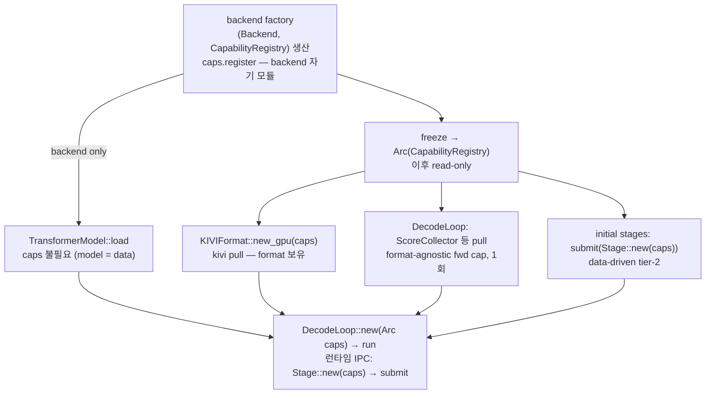
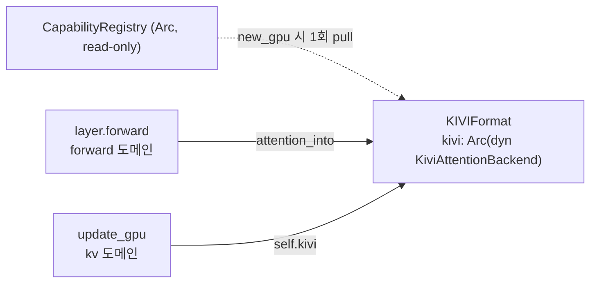
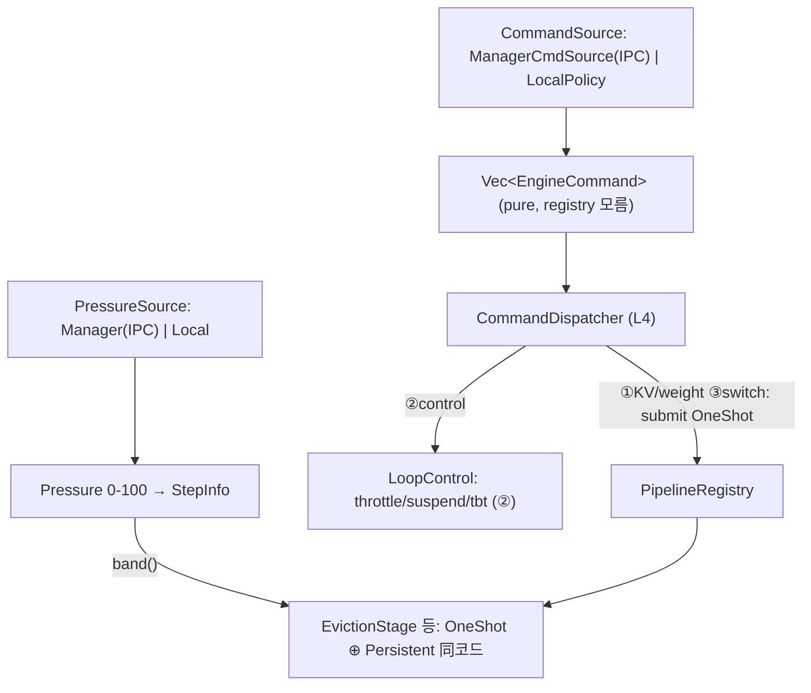
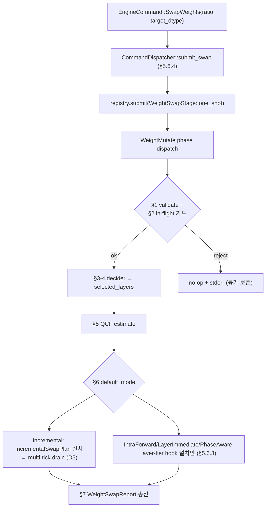
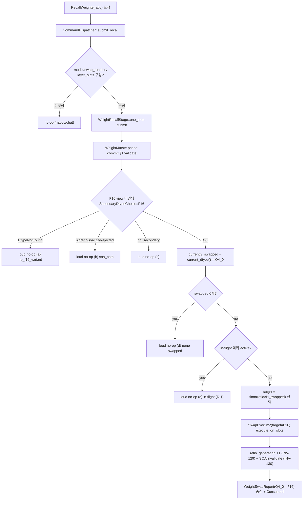
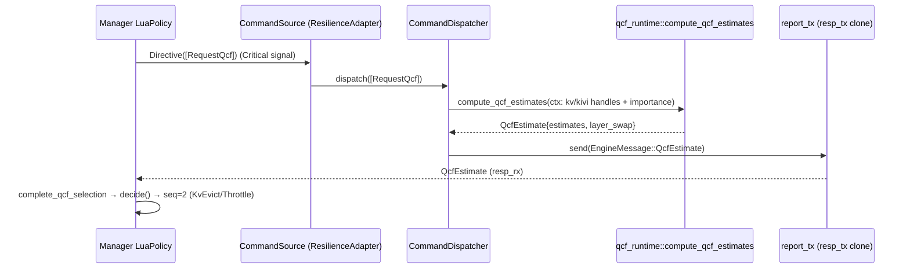
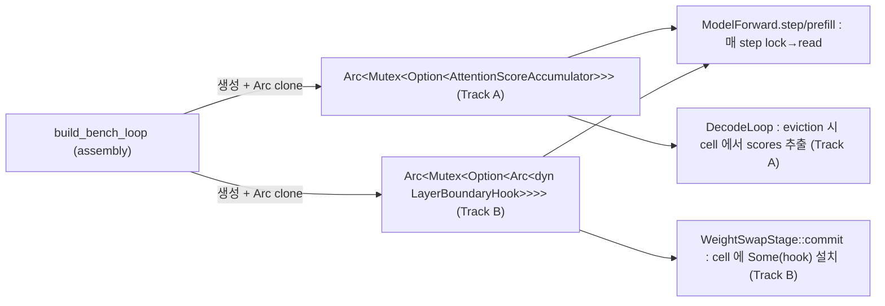

# 확장 가능 추론 파이프라인 아키텍처

> **상태**: clean 재작성 2026-05-29. 본 문서는 `arch/pipeline_stage_design.md` (v1, grill 이력 누적본) 를 **독자 우선 (overview-first) 구조로 재작성한 단일 진실원본**이다. v1 은 결정 이력 (grill 라운드 / 결정 #N 로그) 보존용으로 유지된다. 설계 *근거의 이력* 이 필요하면 v1 의 §13.5 / §16 / Resolution Log 를 본다. 설계의 *현재 상태* 가 필요하면 본 문서를 본다.
>
> **대응 spec**: `spec/41-invariants.md` §3.28 (INV-DECODE-STAGE / INV-KVCACHELAYER / INV-STAGE-LAYER-HANDLE / INV-BACKEND-COMPUTE-FALLBACK). (`INV-STAGE-ORDER-SAFETY` 는 R2 grill 에서 폐기 — §5.3 R2 연혁.)
> **선행 문서**: `arch/inference_pipeline.md` (v1 7-trait), `docs/adr/0001-kv-dispatch-paradigm.md` (KV dispatch Generic→Trait object).

---

## 0. Overview — 한 화면 정신 모델

### 0.1 미션

**어떤 기능 추가도 최소한의 변경으로 수용한다 — 단, 성능 타협 없이.**

이 한 문장이 본 아키텍처의 모든 결정을 지배한다. "기능 추가"는 새 backend(HW), 새 KV 관리 Format(KIVI/SnapKV/D2O), 새 score 알고리즘, 새 weight 관리, 새 pipeline 동작 등이다. 목표는 이들을 추가할 때 **기존 코드 수정을 최소화**하되, **hot path 성능을 회귀시키지 않는** 것이다.

이 두 목표는 hot path 에서만 충돌한다 (추상화는 indirection 을 부르고 hot path 에서 비용이 된다). 그 충돌을 **§1 의 governing principle** 로 해소한다.

### 0.2 지배 원칙 3개 (§1 상세)

| 원칙 | 한 줄 |
|---|---|
| **Path-dependent 합격선** | hot path = 성능 우선 + 비용 locality / cold path = zero-edit OCP. "최소 변경"의 정의가 path 에 따라 다르다. |
| **Mechanism over policy** | 프레임워크는 확장 *메커니즘*(stage 등록·순회)만 제공한다. 여러 유효 구성(stage 순서 등) 중 선택도, 그 구성에서의 *안전(crash-safe)* 도 통합자(stage 작성자) 책임 — policy/config 로 금지도, 안전 보장도 하지 않는다 (R2, 시스템 SW 확장점 모델). |
| **Capability over god-trait** | 기능별 능력은 god trait 에 method 를 붙이지 않고, 작은 opt-in capability 로 분리한다. 소비자는 capability handle 을 construction 시점에 보유한다. |

### 0.3 전체 구조

```mermaid
flowchart TB
    subgraph L4["L4 session/ : 진입점 / 조립"]
        decode["DecodeLoop run"]
        registry["PipelineRegistry"]
        factory["Backend factory + CapabilityRegistry build"]
    end

    subgraph L3stage["L3 stages/ : cross-cutting state mutation"]
        evict["EvictionStage"]
        swap["SwapDispatchStage"]
        kivi_q["KviQuantizeStage"]
        tier["TierMoveStage"]
        sw["SwitchStage : device 전환"]
    end

    subgraph L3inf["L3 inference/ : forward path"]
        fwd["Forward step"]
        layerexec["per-layer execution"]
    end

    subgraph L2["L2 engine 직속 : 확장점 trait"]
        be["Backend compute core"]
        hw["Hardware : hardware 축 resolver (backend, memory)"]
        kvl["KVCacheFormat"]
        wl["WeightFormat"]
        ps["PipelineStage / LifecyclePhase / StageContext"]
        caps["CapabilityRegistry"]
    end

    subgraph L1["L1 backend/ : HW impl + capability"]
        cpu["CpuBackend : universal fallback"]
        ocl["OpenCLBackend + KiviAttentionBackend / GpuScoreAccess"]
        cuda["CudaBackend"]
    end

    decode --> registry
    decode --> fwd
    factory --> caps
    registry --> evict
    registry --> swap
    registry --> kivi_q
    registry --> tier
    registry --> sw
    fwd --> layerexec
    layerexec --> kvl
    layerexec --> wl
    kvl --> be
    wl --> be
    hw --> be
    sw -.->|resolve| hw
    be --> cpu
    be --> ocl
    be --> cuda
    caps -.->|capability handle 주입| kivi_q
    caps -.-> tier
    ocl -.->|미가속 op fallback| cpu

    style L2 fill:#2d4a5a
    style L1 fill:#3d2d5a
    style L4 fill:#2d5a3d
```



### 0.4 Front-door 확장점 (외부 기여자가 배워야 하는 전부)

44개 trait 중 기여자가 "무언가를 추가하려면" 알아야 하는 것은 아래 ~7개뿐이다 (나머지는 opt-in capability 또는 내부 seam — §7). **"내 기능 = 어느 trait" 즉답표**:

| 추가하려는 것 | 구현할 trait | 위치 |
|---|---|---|
| 새 HW backend | `Backend` (가속할 op 만 override) | `backend/<hw>/` |
| 새 KV 관리 Format | `KVCacheFormat` + paired attention kernel | `kv/` + `backend/<hw>/` |
| 새 weight 관리 Format | `WeightFormat` | `models/weights/` |
| 새 pipeline 동작 (eviction trigger, swap, resilience, 측정) | `PipelineStage` | `stages/{kv,weight,system}/` |
| 새 eviction 정책 | `EvictionPolicy` | `kv/eviction/` |
| 새 resilience 전략 (manager-less 자율) | `ResilienceStrategy` (출력 `Vec<EngineCommand>`) | `resilience/strategy/` |
| 새 sampling 방법 | `TokenSampler` | `inference/sampling.rs` |
| 새 backend 능력 (fused kernel 등) | capability sub-trait + `CapabilityRegistry` 등록 | `backend/<hw>/` (자기 모듈) |
| 새 score 알고리즘 | `ScoreCollector` (CPU reference + 선택적 fused kernel) | `inference/` + `backend/<hw>/` |
| 새 pressure source (manager 수신 / 자율 계산 / 3rd-party) | `PressureSource` (default 제공, opt-in 교체) | `inference/` 또는 `resilience/` |
| 새 command source (manager IPC / manager-less 자율 정책) | `CommandSource` (`PressureSource` 대칭, 출력 `Vec<EngineCommand>`) | `resilience/` 또는 `session/` |

### 0.5 Wiring 3부작 — 모든 기능은 construction 에서 wiring 된다

| 무엇 | 어떻게 | 핵심 |
|---|---|---|
| **Capability** (KIVI attn, score 등) | `CapabilityRegistry` (typed anymap) | 소비자가 handle 을 construction 에서 보유. per-forward lookup 0. (도달 경로 §3.6) |
| **Backend** (HW) | backend factory + compute auto-default | 가속 op 만 구현, 나머지는 `cpu_companion` 자동 위임. |
| **Stage** | `registry.submit(stage)` | 순서는 사용자 책임, 안전은 프레임워크 보장. |

---

## 1. 지배 원칙 (Governing Principles)

### 1.1 Path-dependent 합격선

"최소 변경" 은 측정 가능한 합격선이 있어야 판정된다. 그 합격선은 path 에 따라 다르다:

| Path | 예 | 합격선 |
|---|---|---|
| **Cold** | eviction trigger, swap dispatch, score read/aggregation, tier move, resilience action, 모든 construction/wiring | **새 파일만 + 기존 파일 0 edit** (registration 1줄 제외). vtable/indirection 비용이 무시 가능하므로 OCP 를 끝까지 민다. |
| **Hot** | per-layer forward, score collection, matmul/attention dispatch | **그 기능 axis 의 concrete 모듈은 수정 OK. 단 (1) 다른 backend/layer impl 0 edit, (2) 기존 hot path 에 런타임 분기/vtable 추가 0** (선택을 construction 으로 흡수). perf 가 OCP 를 이기되, 그 비용을 한 모듈에 가둔다. |

두 목표(최소 변경 / 성능)는 hot path 에서만 충돌한다. cold path 에서는 충돌하지 않으므로 거기서는 순수 OCP 를 추구한다. hot path 에서는 충돌이 실재하므로 trade 를 허용하되, 그 비용(=concrete 모듈 수정)을 locality 로 가둔다.

이 합격선을 검증 가능한 형태로 박은 것이 `INV-HOTPATH-DISPATCH`(§8)다. **3-tier** 로 허용 dispatch 메커니즘을 명시한다 — **layer**(N_layers×/token, forward 내부) = 정적만(concrete / enum / `Option`+직접분기, **`dyn` 금지**) / **step**(1×/token, decode 루프 stage) = `Box<dyn>` OK / **boundary**(1×/generation) = 자유. enforce: static grep(per-layer forward 에 `dyn` 0) + runtime(S25 bit-identical + avg_tbt Δ≤+3%). layer tier 의 진짜 비용은 vtable 호출 자체(~ns)가 아니라 **인라인·Format 특화·벡터화의 장벽**이므로, dispatch 선택을 construction 시점에 보유한 concrete handle(§3.3 capability / §4.1 Format)로 흡수해 컴파일러 특화를 보존한다(= "성능 타협 없이" 의 검증 게이트).

> **layer-tier 의 정확한 적용 대상 (2026-06-03 type-flip ripple census 정정).** "layer-tier = dyn 금지" 는 **production hot 인 forward path** 에 적용된다. 소스 census 가 production GPU decode hot path = **plan path**(`backend/opencl/plan.rs::execute`)임을 확정했다 — `forward_gen`(→`forward_into`)은 plan invalidation / build 실패 / `--no-gpu-plan` 시에만 도는 **cold/fallback tier** 다. 따라서 layer-tier dyn 금지는 **plan path 의 attention dispatch** 에 적용되고, fallback 인 `forward_gen` 의 `Arc<dyn KVCacheFormat>::attention_into` vtable 은 **cold path 규정**(위 표) 안이라 본 불변식 위반이 아니다(Phase α-K substep (3) 이 fallback 을 trait flip 해도 합격; production hot 의 plan-flip = substep (3p) 가 본 layer-tier 규정의 정식 검증 대상). 상세: §9.1.

### 1.2 Mechanism over policy

확장점에 복수의 유효 구성이 존재할 때, 프레임워크는 확장 **메커니즘**(stage 등록·순회)만 제공한다. **"틀린 구성을 금지하는 policy"** 도 만들지 않고, **"어떤 구성에서도 안전(crash-safe)"** 도 보장하지 않는다. 의미상 옳은 구성의 선택 **및 그 구성에서의 안전** 은 통합자(stage 작성자) 책임이다 — 시스템 SW 의 확장점(커널 모듈 / 커스텀 allocator)과 같은 계약 (상세 §5.3).

예: stage 순서가 "eviction → KIVI" 든 "KIVI → eviction" 이든 프레임워크는 둘 다 *기계적으로* 허용한다. 어느 순서가 옳은지, 그 순서에서 자기 stage 가 선행 stage 의 state 를 잘못 가정해 crash 하지 않는지는 stage 작성자가 정하고 보장한다. 프레임워크는 "KIVI → eviction 은 안 됨" 같은 config 도, "어떤 순서든 안전" 같은 보장도 만들지 않는다.

### 1.3 Capability over god-trait

기능별 능력(KIVI fused attention, GPU score accumulator 등)은 공유 god trait(`Backend`)에 method 를 붙이지 않는다. 붙이면 새 기능 추가 = trait 수정 = 전 backend 재컴파일 = "최소 변경" 위반. 대신:

- 능력은 작은 **capability sub-trait** 로 분리한다 (opt-in — 미지원 backend 는 0줄).
- 소비자는 그 capability handle 을 **construction 시점에 보유**한다 (per-forward `as_xxx` lookup 0 → hot path 분기 0).
- handle 의 (backend → capability) 매핑은 **`CapabilityRegistry`** 한 곳이 담당한다 (§3.3).

---

## 2. 레이어링 (L1–L5)

`INV-LAYER-001 ~ 007` 정신 보존. 위치 요약:

| 항목 | 레이어 | 위치 |
|---|---|---|
| `Backend`, `KVCacheFormat`, `WeightFormat`, `PipelineStage`, `LifecyclePhase`, `StageContext`, `StepInfo`, `Pressure`, `PressureSource`, `PipelineDispatcher`, `CapabilityRegistry`, `Hardware` | **L2** (engine 직속) | `engine/src/` 직속 (파일 단위 배치 = **§2.1**) |
| concrete stage impl (`EvictionStage`, `KviQuantizeStage`, ...) | **L3** cross-cutting | `engine/src/stages/{kv,weight,system}/` |
| `KVCacheFormat` impl + forward path | **L3** | `engine/src/kv/` (KV format), `engine/src/layers/`·`inference/` (forward) |
| `WeightFormat` impl | **L3** | `engine/src/models/weights/` |
| `EvictionPolicy` impl | **L3** | `engine/src/kv/eviction/` |
| `PipelineRegistry`, `DecodeLoop`, backend factory | **L4** | `engine/src/session/` |
| HW backend impl + capability impl | **L1** | `engine/src/backend/<hw>/` |

### 2.1 Type → file 배치 (구현 결정성)

**역할.** §2 의 레이어 표가 *레이어* 만 정하면, 같은 L2 라도 어느 *파일* 에 사는지가 세션마다 갈려 모듈 그래프가 비결정적이 된다. 본 절은 신규 타입의 type→file 을 결정적으로 고정한다 (어느 구현자가 와도 같은 그래프로 수렴). 두 배치 규칙이 표를 지배한다:

- **규칙 A — L2 추상화는 top-level 형제 파일** (`core/` 우산 없음). `backend.rs`·`memory.rs`·`buffer.rs` 가 이미 L2 추상화를 top-level 파일로 두는 확립된 패턴이고, `core/` 접두어는 2026-05-29 제거됐다. 따라서 신규 L2 trait/타입도 top-level 형제(`hardware.rs`·`pipeline.rs`) 또는 응집 모듈(`capability/`)로 둔다. `core/` 를 되살리지 않는다.
- **규칙 B — `stages/` subdir = 그 Stage 가 *주로* 바꾸는 state 도메인** (`kv`/`weight`/`system`). 메커니즘이 아니라 주 의도로 가른다 (switch 는 KV migrate 를 *유발* 하지만 주 의도가 device 변경이므로 `system/`).
- **규칙 C — 모듈 파일 스타일 = no-`mod.rs`** (Rust 모던 path 스타일). 디렉토리 모듈의 루트는 `mod.rs` 가 아니라 형제 `foo.rs` 다 (`format/` → `format.rs`, `capability/` → `capability.rs`, `stages/` → `stages.rs`, `stages/kv/` → `stages/kv.rs`). **이미 top-level `backend.rs`/`buffer.rs`/`memory.rs`/`quant.rs` 가 채택한 패턴**이라 신규·이동 모듈은 이를 따른다(두 스타일 다 Rust 2024 유효; no-`mod.rs` 는 권장 모던 관용구라 프로젝트 컨벤션으로 채택). 기존 nested `mod.rs`(38개) 전역 정리는 CLAUDE.md 컨벤션 + 별도 마이그레이션 결정 (**✅ 완료 — commit `3895e17d`, 2026-06-02; engine/src nested mod.rs 38건 전부 git mv, 현 engine/src mod.rs 0개**).

| 모듈 / 파일 | 레이어 | 거주 type | 비고 |
|---|---|---|---|
| `backend.rs` | L2 | `Backend` (god-trait + required floor 만) | capability sub-trait 는 `capability/` 로 이동 → backend.rs 가 깨끗해짐 |
| `capability.rs` + `capability/` | L2 | `CapabilityRegistry` (typed anymap) | §3.3. 모듈 루트 = `capability.rs`(규칙 C, no-`mod.rs`) |
| `capability/{kivi_attention,gpu_score,score_collector,tier_movable}.rs` | L2 | 각 capability sub-trait | 새 capability = 새 파일(순수 OCP). impl·등록은 `backend/<hw>/`(L1) |
| `hardware.rs` | L2 | `Hardware`, `BackendRegistry`, `MemoryRegistry`, `DeviceTarget` | §3.5. `session/init.rs` 4 Arc 흡수. `DeviceTarget` = `{ Cpu, Gpu, Npu }` 추상 연산 역할(**G5 닫힘** — 구체 backend(OpenCL/CUDA)는 registry resolve). `resolve -> Option`(C1): `Cpu` 항상 `Some`, `Gpu`(CPU-only 빌드)·`Npu`(backend 부재) 미보유 시 `None` |
| `pipeline.rs` | L2 | `PipelineStage`, `LifecyclePhase`, `StageContext`, `StepInfo`, `Pressure`, `PressureSource`(trait), `StageOutcome`, `StopReason`, `StageLifecycle`, `PipelineDispatcher`(trait) | §5. `Pressure` 는 유일 소비처가 `StepInfo` 라 여기 동거(과거 `pressure/` 디렉토리 이름 충돌은 `kv/` rename 으로 해소). `StepInfo` = `{ pos, decode_step, pressure }` 3필드 `Copy`(**G5 닫힘** — `prev_token` 은 observe Stage 승격 trigger, `kv_capacity`→held handle query, `stop_requested`→`StageOutcome::Stop`) |
| `format.rs` + `format/` | L2 | (루트 `format.rs` = 모듈 선언·re-export) / `format/kv_cache_format.rs` = `trait KVCacheFormat` + `Merge`(compact arg) / `format/weight_format.rs` = `trait WeightFormat` + `LayerDispatch` + `SliceSpec`(apply_dispatch arg) | **C2 해소** — format 축의 L2 추상화 모듈(`capability/` 동급 응집 모듈, G3-reconcile "format=축, 추상화=L2 trait" 실현). 현 `kv_cache_ops.rs`(`KVCacheOps`) → `format/kv_cache_format.rs` 이동+rename(α-K trait rename 동행). `WeightFormat` 은 신설(현 코드 trait 부재). `Merge` 입주로 v2:455 미정의 해소. 공유 precision `DType` 는 기존 위치 참조(재정의 0). **guard rail: impl 은 여기 금지** — Standard/KIVIFormat→`kv/`, weight dispatch impl→`models/weights/`(L3) |
| `stages/kv/{eviction,d2o,kivi_quantize,swap_dispatch,tier_move}.rs` | L3 | 각 KV-mutate Stage (**얇은 trigger 만**) | 현 `*_handler.rs` 4종의 `handle()` trigger 부분 + `tier_move`(신규). 알고리즘(d2o merge·`offload_one`/`recall_one`)은 `kv/` 로 추출(**함수 단위 cut**, G3-reconcile Q3). `kv/` 정책·포맷에 수평 의존(L3→L3) |
| `stages/weight/weight_swap.rs` | L3 | `WeightSwapStage` (얇은 trigger) | concrete-handle `Arc<LayerSlot>`(§4.2). 현 `kv/weight_swap_handler.rs` 의 trigger 부분. swap 오케스트레이션은 `weight/`(아래 행) |
| `stages/weight/partition.rs` | L3 | `PartitionStage` (얇은 trigger, AB-4) | concrete-handle `Vec<Arc<LayerSlot>>` + `Arc<Hardware>`(§5.5). register 시점 `model.layers.clone()` 보유. `PreForward` 에서 sticky-gated `apply_partition_dispatch` fan-out (slot RCU + INV-120). WeightSwapStage 와 형제(둘 다 `stages/weight/`) — 파일 분리(swap 과 join 표면 0). **`weight.rs` 골격 'α-K 예정 입주자' 표기는 stale**(실 owner=WeightSwapStage(AB-6)이고 PartitionStage 는 별도 파일) |
| `stages/system/switch.rs` | L3 | `SwitchStage` | `Arc<Hardware>` resolve(§5.1). **system/ 확정 거주자 1개** |
| `stages/system/` (미정) | L3 | resilience-제어 Stage, observe/보고 Stage | §0.4 가 system/ 거주만 약속. 분해·명명은 downstream (resilience→stage 매핑은 별도 설계) |
| `kv/` (구 `pressure/` 에서 rename, γ-1 완료 2026-06-10) | L3 | `crate::format::KVCacheFormat` **impl**(`kv_cache.rs`=StandardFormat / `kivi_cache.rs`=KIVIFormat), `eviction/`(EvictionPolicy sliding/h2o/streaming), `offload/`(tier + `offload_one`/`recall_one`), `d2o/`(merge 알고리즘 + `d2o_layer_alloc`), `kv_migrate.rs`(🟡 §4.1 storage-slot 트랙) | KV-cache 도메인 = format-impl+policy+tier+algo. **trait 정의는 `format/`(C2)**, 여기엔 impl 만 flat(`kv/format/` subdir 아님). 트리거(Stage)만 `stages/` 로 분리(G3-reconcile Q1/Q3/Q4) |
| `weight/` (구 `pressure/weights/` 에서 rename, γ-1 완료 2026-06-10) | L3 | weight runtime swap 오케스트레이션(`swap_executor`/`phase_aware_swap`/`decider`/`async_swap`/`noise_table`/...) | §13.8-O trait 경계(`RuntimeResourcesAccess`) 유지. `models/weights/`(load-time artifact: LayerSlot/SecondaryMmap)와 분리(G3-reconcile Q2) |
| `inference/sampling.rs` | L3 | `TokenSampler`(trait, v1 `session/traits.rs` 서 이동) + 기존 `sample()`/`SamplingConfig` | front-door ①(§0.4/§7) 생존자 |
| `models/weights/` | L3 | `crate::format::WeightFormat` **impl** | §0.4. trait 정의는 `format/`(C2), 여기엔 impl 만 |
| `resilience/` | L3 | `ManagerPressureSource`(`PressureSource` impl), `ManagerCommandSource`/`LocalPolicy`(`CommandSource` impl), `ResilienceStrategy` 3종(thermal/energy/compute)+`resolve_conflicts`, resilience adapter | trait 정의는 `pipeline.rs`(L2), impl 만 여기. **`ResilienceAction`·`MemoryStrategy` 삭제**(§5.4). `CommandDispatcher`는 L4(`session/`) |
| `session/` | L4 | `PipelineRegistry`(impl `PipelineDispatcher`), `CommandDispatcher`(§5.4), `DecodeLoop`, backend factory, `DecodeResult`, `LocalPressureSource` | factory 가 `Hardware`/`CapabilityRegistry` 인스턴스 출생(타입은 L2) |
| `backend/<hw>/` | L1 | `Backend` impl + capability impl + `caps.register` | §0.4 |

**v1 잔재 처리.** `session/traits.rs`(v1 7-trait: `Forward`/`EvictionStage`/`SwapStage`/`CommandSource`/`EngineReport`/`TokenTickSink`/`ResilienceBundle`/`DecodeObserver` + `StepCtx`/`EvictionOutcome`)는 §5 가 단일 `PipelineStage` 로 흡수하므로 대부분 **SUPERSEDED — Phase β(DecodeLoop 재작성) 삭제** (dead code 제거, doc 과 달리 코드는 frozen 보존 안 함). 동명 충돌(v1 `EvictionStage`/`SwapStage` trait ↔ v2 concrete Stage)은 흡수로 소멸. 단 **`Forward`·`TokenSampler`·`CommandSource` 가 생존**:
- **`Forward` = 슬림 내부 seam 으로 잔존** (G2-(ii) 승인, 2026-06-10 — 직전 "Forward SUPERSEDED" 일괄 표기를 정정). `Forward` 는 PipelineStage 로 흡수되지 *않는다* — phase 에 반응하는 hook 이 아니라 driver 가 매 step *호출해 forward pass 를 당기는* pull형 표면이고, **3-impl 다형성**(`ModelForward`/`KiviForward`/`OffloadForward`, `session/forward/`)을 추상화하는 내부 seam 이라 driver 가 `Box<dyn Forward>` 로 보유한다(`prefill`/`step`/`on_kv_prune`/`finalize` 4-method 로 슬림화). v1 의 broad `Forward`(try_evict/try_offload 등 명령 메서드 포함)는 좁혀지되 trait 자체는 존속 — `INV-LAYER-006` 의 6 추상화 중 `session::Forward` 행이 이를 보존한다.
- **`TokenSampler`** → `inference/sampling.rs` 로 이동(front-door ①).
- **`CommandSource`** 는 이산 명령 source seam(`PressureSource` 대칭)으로 존속(§5.4 — 초기 "PipelineStage 흡수" 판정을 역전; 명령을 *생산*하지 phase 에 *반응*하지 않으므로 Stage 로 흡수 불가).

`EngineReport` 는 heartbeat/status 보고 역할로 `CommandExecutor` 에 잔류. `StopReason`/`StepCtx`/`EvictionOutcome` 등가물은 `pipeline.rs` 로 수렴.

**enforce.** 규칙 A/B 의 핵심 제약(capability·`Hardware`·`Pressure` 가 L2 여야 함)은 이미 `INV-LAYER-001~007`(L1 impl·L3 consumer 양 끝이 L2 abstraction 에 의존, DIP)로 강제된다 — 별도 INV 불요. 본 §2.1 표가 *파일 단위* 배치의 SSOT.

> **연혁** — G3 type→file 배치 확정 (2026-06-01 "설계 구체화" 세션 grill, Q1~Q6): §2 표가 레이어만 정하고 *파일* 은 미명세였던 공백(handoff G3) + §2/§0.4 의 stale `core/` 경로(2026-05-29 제거됨) + `stages/` 미생성을 닫음. Q1 스켈레톤 = `core/` 부활 안 함·L2 top-level 형제·`stages/` 3-way 신설·format impl 은 `pressure/` 유지. Q2 `Hardware` 클러스터 4종(+`DeviceTarget`) 단일 `hardware.rs`(레이어링이 L2 강제 — stage(L3)·WeightFormat 이 의존). Q3 `capability/` 모듈(registry+sub-trait 정의 한데, backend.rs 는 god-trait 만). Q4 단일 `pipeline.rs`(trait 패밀리+`StepInfo`+`Pressure`; impl 분산). Q5 stages 매핑(kv 5+weight 1+system switch 확정, resilience-control·observe 는 downstream; `pressure/`=데이터·정책 유지·`stages/`=트리거 분리; subdir=주 mutate 도메인). Q6 `session/traits.rs`=v1 폐기(Phase β)·`TokenSampler` 만 생존 이동. 코드 적용 = Phase α-W(`hardware.rs`/`capability/`/`pipeline.rs` 신설 + `stages/` 골격) / α-K(KV format impl `pressure/` 정착). `DeviceTarget` variant·`StepInfo` 필드는 **G5** 로 분리.
>
> **연혁** — G3-reconcile: `pressure/` 해체 (2026-06-02 "pressure grill" 세션, Q1~Q4): 위 G3 의 "format impl 은 `pressure/` 유지" 결정을 **SUPERSEDED**. Q1 `pressure/`→`kv/` rename — redesign 후 디렉토리 내용물이 전부 KV-cache 데이터(format+policy+tier+algo)라 "pressure" 는 역사적 사고이고, `Pressure` 타입↔dir 이름 충돌도 해소(blast radius 189 ref/53 file, 기계적). Q2 `pressure/weights/`(weight swap 오케스트레이션, KVCache 0 import — 오배치 입주자)→`weight/` 신설 (§13.8-O `RuntimeResourcesAccess` trait 경계 유지, `models/weights/` load-time artifact 와 분리). Q3 handler split = **함수 단위 cut**(트리거 `handle()`→`stages/`, 알고리즘→도메인 dir; d2o merge ~440 LOC·`offload_one`/`recall_one` 추출) — G3 의 "file 단위(handler 통째→Stage)" 를 정밀화(d2o_handler 2273 LOC 에 트리거+알고리즘 혼재). Q4 format = `kv/` **1차 타입(flat)**, `kv/format/` subdir 철회 — format 은 kv 종속이 아니라 **축**(추상화=L2 trait `KVCacheFormat`/`WeightFormat` + 공유수학=`quant/`, impl 만 데이터에 내재; per-layer 동적 precision 은 Stage+format mutation primitive 로 지원하므로 impl 위치 무관). 코드 적용 = Phase α-K(`kv/`/`weight/` rename + handler 함수 cut + `KVCacheFormat` trait 확립).
>
> **연혁** — G5 detail-fill (2026-06-02 "G5" 세션 grill, Q1~Q2): G3 가 `DeviceTarget`·`StepInfo` 를 file 에 배치만 하고 미룬 variant/필드 열거를 닫음. G5-1 `DeviceTarget` = `{ Cpu, Gpu, Npu }` 추상 연산 역할(§3.5) — 구체 backend 는 registry resolve(OpenCL↔CUDA feature 배타 → `Gpu` 택1, rpcmem 은 device 아님), `Npu` 는 backend 부재지만 partition `SliceSpec` 가 spec 레벨 전제. G5-2 `StepInfo` = `{ pos, decode_step, pressure }` 3필드 `Copy`(§5.1) — v1 `StepCtx` 5필드 중 `pos`/`decode_step` 승계, `prev_token`(샘플러)/`kv_capacity`(held-handle query)/`stop_requested`(`StageOutcome::Stop` 반환) 드롭, `prev_token` 은 observe Stage 승격 trigger(driver 보유 → ripple 0). 코드 적용 = Phase α-W(`hardware.rs`/`pipeline.rs` 신설 시 동봉).
>
> **연혁** — C1·C2 + 모듈 스타일 (2026-06-02 "C1·C2 grill"): 외부 2차 평가 리포트의 blocking 2건 + 파생 컨벤션 1건을 닫음. **C1** `Hardware::resolve` 반환 타입 모순(non-`Option` 튜플 ↔ "Npu resolve None" prose, 구현 불가) → 시그니처를 `Option<(&Arc<dyn Backend>, &Arc<dyn Memory>)>` 로 정정(§3.5). `Cpu` 항상 `Some`(universal floor), `Gpu`(CPU-only 빌드)·`Npu`(backend 부재) 부재 시 `None` — 현 코드 기성 모델(`session/init.rs:44` cpu non-`Option` + `:35` gpu `Option`) 승계. 부재 시 행동 = 호출자 정책(§1.2; switch=`resolve(Gpu).or_else(resolve(Cpu))`, partition setup=loud-fail). **C2** §2.1 "type→file SSOT" 가 가장 중심 trait(`KVCacheFormat`/`WeightFormat`)의 *정의 파일* 미지정(impl 행만) → **`format.rs` + `format/` 신설 L2 응집 모듈**(`capability/` 동급). `format/kv_cache_format.rs`(trait + `Merge`, 현 `kv_cache_ops.rs`/`KVCacheOps` 이동+rename) / `format/weight_format.rs`(trait 신설 + `LayerDispatch`/`SliceSpec`). impl 은 `kv/`·`models/weights/`(L3) 유지(guard rail). 부산물: `Merge` 미정의(v2:455) 해소. **모듈 스타일** 규칙 C 신설 = no-`mod.rs`(이미 top-level 채택, AGENTS.md 컨벤션). 기존 nested `mod.rs` 38개 일괄 sweep = 별도 `chore:` 커밋 (**✅ 완료 — commit `3895e17d`, 2026-06-02; engine/src 38건 전부 git mv 처리, 현 engine/src mod.rs 0개. [정정 2026-06-10]**). 코드 적용 = Phase α-W(`format/` 신설 + `Hardware` resolve `Option` + α-K 의 `kv_cache_ops.rs`→`format/kv_cache_format.rs` 이동 동행).

---

## 3. Backend & Capability 모델

### 3.1 `Backend` trait — compute core

`Backend` 는 **모든 backend 가 공유하는 compute primitive** 만 가진다. Format-specific 능력(KIVI 등)은 여기 없다 (§3.3 capability 로 분리).

**Required floor (~4)** — 새 backend 가 반드시 제공:

```rust
pub trait Backend: Send + Sync {
    fn cpu_companion(&self) -> &dyn Backend;   // fallback 대상 제공 의무
    fn name(&self) -> &str;
    fn device(&self) -> &str;
    fn as_any(&self) -> &dyn std::any::Any;     // cold-path 한정 escape hatch
    // ... compute + memory op (아래) ...
}
```

**Compute op — cpu_companion auto-default** (`INV-BACKEND-COMPUTE-FALLBACK`):

compute op (`matmul`, `attention_gen`, `flash_attention_prefill`, `rms_norm`, `rope_inplace`, `silu_mul`, ...) 의 default 본문은 `self.cpu_companion()` 으로 위임한다. 새 backend(구형 NPU 포함)는 **가속 가능한 op 만 override** 하고, 못하는 op 은 그냥 두면 자동으로 CPU 에서 정확히 동작한다.

```rust
    fn flash_attention_prefill(&self, /* ... */) -> Result<()> {
        fallback_profile::note(self.name(), "flash_attention_prefill");  // 기본 OFF → ~0
        self.cpu_companion().flash_attention_prefill(/* ... */)
    }
```

- CPU backend 는 universal fallback 이므로 모든 compute op 을 실제 구현한다 (`cpu_companion()` 이 self → 위임 default 를 쓰지 않음).
- 이로써 새 backend 비용 ↓ + core 에 새 compute method 추가 시 기존 backend 안 깨짐 (관리 비용 0).

**Memory/sync op — companion 위임 불가**:

`write_buffer` / `read_buffer` / `synchronize` / `wait_event` / `alloc_*` 등은 backend 자기 device 메모리를 다루므로 companion 으로 위임할 수 없다. 대부분 required, UMA 처럼 의미상 무방한 경우만 no-op default.

### 3.2 Fallback profiling

compute op 이 가속되지 않고 `cpu_companion` 으로 위임될 때, 어느 op 이 위임됐는지 **coverage map** 을 수집한다. 새 backend bring-up 시 가속 미달 op 을 즉시 보기 위함.

- `LLMRS_FALLBACK_PROFILE=1` 로 활성 (기본 OFF, `OnceLock` 캐시 → hot path 비용 ~0; 그나마 이미 느린 fallback 경로에서만 분기).
- count/coverage 만 수집 (timing 은 위임된 `cpu_companion` op 이 기존 `OpProfiler` 에 CPU 항목으로 이미 잡힘 — DRY).
- 기존 `observability/profile/op_trace.rs` sink 재사용.

```
LLMRS_FALLBACK_PROFILE=1 → "NPU_xyz: CPU-fallback[flash_attention_prefill ×1024, attention_gen ×1024]"
```

### 3.3 Capability sub-trait + `CapabilityRegistry`

**왜 필요한가.** 추론 경로는 backend 를 `Arc<dyn Backend>` 추상 핸들 하나로 들고 다닌다(CPU/OpenCL/CUDA 무관 — 호출지는 backend 종류를 몰라야 한다). 그런데 일부 능력은 특정 backend 에만 있다 — GPU score accumulator·KIVI fused attention 커널은 OpenCL 에만 존재한다. 추상 핸들로는 이 능력을 부를 수 없어, "이 backend 가 사실 OpenCL 이면 그 능력을 꺼내 쓰자" 는 escape hatch 가 시간이 지나며 **4종**(`as_any` downcast / `as_kivi_attention` / `gpu_score_acc` / `get_extension`)으로 자라났다. 같은 일(backend 능력 접근)을 4 문법으로 하고, hot path 가 토큰마다 downcast 를 반복하며, 새 backend 는 4종을 전부 흉내내야 한다 — "기능 추가를 최소 변경으로 수용" 의 정반대다.

**무엇을 신설하나 — registry 하나뿐.** 흔한 오해(폐기): "4 메커니즘을 1 registry 로 수렴". 실측이 이를 반박한다 — `as_any` 53 호출 중 capability lookup 은 **0건**이다(concrete backend downcast 32 + buffer downcast 25; `KiviAttentionBackend`/`GpuScoreAccess` 로 downcast 하는 곳은 없다 — 그것들은 전용 method 로만 접근). 4종은 성격이 전혀 다르므로 하나로 묶으면 buffer downcast·cold 자원까지 끌어들이는 과설계가 된다. 본 설계가 *신설*하는 메커니즘은 **`CapabilityRegistry` 하나**이며, 그것이 흡수하는 대상은 **backend-agnostic capability handle**(gpu_score·KIVI·score collector — 이종 소비자가 backend 종류를 모른 채 공유하는 능력) 뿐이다. 나머지 3종은 신설이 아니라 각자 제자리로 귀속된다(§3.3.1 표).

Format-specific 능력은 작은 sub-trait 으로 분리한다:

```rust
pub trait KiviAttentionBackend: Send + Sync {
    fn has_kivi_attn_kernel(&self, bits: u8) -> bool;
    fn is_nosub_device(&self) -> bool;
    fn attention_gen_kivi(&self, /* ... */) -> Result<()>;
}
pub trait GpuScoreAccess: Send + Sync { /* ... */ }
pub trait ScoreCollector: Send + Sync { /* §6 */ }
pub trait TierMovable: Send + Sync { /* cross-Format tier move */ }
```

소비자는 이 handle 을 **construction 시점에 보유**(도달 경로 = §3.6 wiring 표준) 하고 hot path 에서 직접 호출한다 (per-forward `backend.as_kivi_attention()` lookup 폐기 → hot path 분기 0). (backend → capability) 매핑은 `CapabilityRegistry` 한 곳이 담당한다(흡수 대상 = capability handle 뿐, 위 "무엇을 신설하나" 참조):

```rust
#[derive(Default)]
pub struct CapabilityRegistry { map: HashMap<TypeId, Box<dyn Any + Send + Sync>> }
impl CapabilityRegistry {
    pub fn register<C: ?Sized + 'static>(&mut self, h: Arc<C>) {
        self.map.insert(TypeId::of::<Arc<C>>(), Box::new(h));   // Arc<dyn Trait> 를 concrete payload 로 (unsafe 없음)
    }
    pub fn get<C: ?Sized + 'static>(&self) -> Option<Arc<C>> {
        self.map.get(&TypeId::of::<Arc<C>>())?.downcast_ref::<Arc<C>>().cloned()
    }
}

// backend factory — backend "자기 모듈" 에서만 등록
fn build_opencl() -> (Arc<dyn Backend>, CapabilityRegistry) {
    let ocl = Arc::new(OpenCLBackend::new(/* ... */));
    let mut caps = CapabilityRegistry::default();
    caps.register::<dyn KiviAttentionBackend>(ocl.clone());   // concrete→dyn (OpenCLBackend 가 impl)
    caps.register::<dyn GpuScoreAccess>(ocl.clone());
    (ocl, caps)
}
```

- **새 capability 종류** = 새 trait 으로 `register`/`get` — 공유 struct edit 0. 양 축(새 backend / 새 capability) 모두 open.
- registry lookup 은 construction(cold) 에서만 → 비용 무관.

#### 3.3.1 backend-specific 동작의 귀속 — registry 는 그중 하나

`as_any` 라는 범용 escape hatch 가 떠맡던 일은 **성격별로 제자리에 귀속**된다. 신설은 ① 하나뿐이고, ②·③ 은 *기존* 메커니즘 유지, 나머지는 *기존* abstraction·정당 예외다.

| 동작 성격 | 거처 | 신설? | 예 | 왜 여기 |
|---|---|---|---|---|
| **① 능력 (capability)** | `CapabilityRegistry` | **신설** | gpu_score, KIVI, score collector | 이종 소비자가 backend 종류 모른 채 공유 → handle 보유 + hot path 분기 0 |
| **② 자원 (resource)** | `get_extension(EXT_*)` | 유지 | OpenCL queue, rpcmem allocator | setup 순서 의존(소비자가 construction 에 미리 못 받음) → string-key cold lookup 이 자연 |
| **③ 관찰 (diagnostic)** | log macro + `action_diag_helper` | 유지 | cl_mem dump, profile flush, op label | fire-and-forget 디버깅 채널 — `d0bd0802` 가 EventSink trait 제거 → log 로 확정. capability trait 화는 회귀 |
| **메모리/buffer** | 기존 `memory/` abstraction | — | weight materialise, buffer write | backend capability 가 아니라 memory 도메인 책임 (buffer 는 이미 추상화됨) |

**②·③ 을 registry 에 넣지 않는 이유.** ② 자원은 capability handle 과 **라이프사이클이 다르다** — queue/allocator 는 setup 순서에 묶여 construction 시점에 핸들을 미리 줄 수 없다. ③ 관찰은 능력이 아니라 fire-and-forget 채널이고, 이미 `d0bd0802` 에서 sink trait 인프라(936 LOC)를 걷어내 log macro 로 이행한 영역이다 — 여기에 `BackendDiagnostics` capability trait 을 세우면 막 제거한 것을 되살리는 회귀가 된다.

#### 3.3.2 도메인 귀속 — concrete downcast 가 정당한 경우

위 ①~③ 으로 흡수되지 않고 남는 concrete backend downcast 는 **누수가 아니라 정당한 예외**일 수 있다. 판정 기준은 **호출 도메인**이다:

- **model forward 도메인 *내부*의 concrete downcast 는 정당하다.** model forward 는 "이 backend 로 forward 를 실행한다" 의 최종 책임자이므로 backend concrete 를 알 수밖에 없다. 예: `plan.execute(&OpenCLBackend)` (GPU kernel 실행 엔진 — 소비자가 model forward 단일 도메인, 1-consumer 라 capability 로 추출할 가설적 seam 도 아님), noshuffle SOA weight layout 설치/검증, raw enqueue. 이들은 `// LAYER-EXEMPT` 로 명시 인정한다.
- **다른 도메인(kv/eviction/session)이 backend concrete 를 downcast 하면 누수다.** capability(①)·자원(②)·관찰(③)·memory abstraction 중 하나로 흡수해야 한다. 예: weight swap 의 `try_pool_materialise` 가 OpenCL DMA-BUF 메모리를 직접 만지는 것 → memory 도메인으로 흡수 대상.

**KIVI 와 plan 이 갈리는 이유**(같은 OpenCL 실행이지만 운명이 다름): KIVI 는 소비자가 kivi_cache(kv) + transformer(forward) = **cross-domain** 이고 `KiviAttentionBackend` trait 이 *이미 존재*하므로 — 능력의 절반만 덮고 절반은 concrete 로 새는 **반쪽 trait** 이 최악이라 표면을 완성해 ① 로 흡수한다. plan 은 소비자가 model forward **단일 도메인** 이라 1-consumer 가설적 seam → 정당 예외로 둔다. (이미 존재하는 trait 은 완성하거나 폐기하거나, 반쪽 금지. 아직 없는 trait 은 2nd consumer 까지 만들지 않는다 — promotion-trigger.)

### 3.4 Stage Format-handle 형태 (3종 — 계층 아닌 메뉴)

Stage 가 Format 을 보유하는 `Arc<...>` handle 의 정적 타입은 Rust 에서 정확히 3가지뿐이다 (exhaustive, **순서 없는 선택지** — "tier/계층" 아님):

| 형태 | 타입 | 전형적 용례 | downcast |
|---|---|---|---|
| **base-trait-handle** | `Arc<dyn KVCacheFormat>` / `Arc<dyn WeightFormat>` | base primitive 만 호출 (어느 Format 인지 모름) | 0 |
| **concrete-handle** | `Arc<ConcreteFormat>` (예: `Arc<KIVIFormat>`) | 그 Format 의 concrete method 직접 호출 | 0 (register 시 compile-time type) |
| **capability-handle** | `Arc<dyn CapabilityTrait>` (Stage 측 정의) | 이종 Format 가로지르는 능력 | 0 |

규칙은 handle *타입* 에서 자동 도출된다 ("tier 라벨" 불필요): base-trait-handle 을 든 Stage 는 어느 Format 인지 몰라야 한다(`INV-KVCACHELAYER-PRIMITIVE-AGNOSTIC`); concrete-handle 을 든 Stage 가 그 타입을 아는 것은 위반이 아니다(그게 concrete 를 든다는 의미); capability-handle 은 Stage 측 trait 의 추상화 책임. 4번째 형태는 없다(enum-of-concrete 는 OCP 재발이라 기각).

**concrete-handle 실제 예시 — D2O eviction**: D2O 는 evict 토큰을 K 코사인 유사도로 retained nearest 에 merge 한다(`engine/src/kv/d2o/` — `dequantize_k` 가 F32/F16/Q4_0 분기). raw K read 가 필요해 base-trait-handle 로는 불가하지만, **capability-handle(`Arc<dyn DenseKVRead>`)을 지금 만들지 않는다**. raw-K-read 소비자가 D2O **하나뿐**이기 때문(H2O/SnapKV 는 attention score, Sliding/Streaming 은 position 으로 결정 — K 안 읽음). 1-adapter = 가설적 seam → capability trait 은 premature abstraction. 따라서 D2O Stage 는 `Arc<StandardFormat>` 를 든 **concrete-handle Stage** 로, K read 는 `StandardFormat` 의 inherent method (`read_k_layer_wide`) 직접 호출. dense concrete 가 `StandardFormat` 1개뿐이라 "dtype 변종마다 재구현" 부담 없음(이 type 이 F32/F16/Q4_0 내부 처리). KIVI/Sparse 위엔 타입 불일치로 build 시점 차단 → 잘못된 Format silent garbage 원천 봉쇄.
- **승격 trigger**: 2번째 raw-K-read 소비자(예: K-기반 클러스터링 eviction) **또는** 2번째 dense `KVCacheFormat` impl 이 등장하면 — 그때 `read_k_layer_wide` 를 `DenseKVRead` capability trait 으로 기계적 추출(method→trait + 양쪽 impl). 그 전엔 추출 금지(deletion-test 미통과).

> **연혁** — 결정 2026-05-29: D2O eviction 을 concrete-handle Stage(`Arc<StandardFormat>`)로 확정하고, `DenseKVRead` capability 는 미생성(raw-K-read 소비자 1개 = 가설적 seam).

### 3.5 Hardware — hardware 축 resolver

**역할.** **hardware 축**(연산 위치)의 좌표를 해석하는 **read-only resolver**. `Backend`(§3.1)가 단일 연산기라면, `Hardware` 는 전환·분산을 위해 **여러 backend + memory** 를 묶고 `resolve(target) → (backend, memory)` 로 좌표를 푼다. 활성 backend 를 mutable 하게 소유하지 않는다 — "현재 device" 는 decode-loop local 상태이고, 어떤 실행 경로도 이 객체를 통해 "현재" 를 관찰하지 않는다(실행은 텐서 태그로 storage 에서 backend 를 얻는다). hardware 가 정식 축인 근거는 precision(format)⊥backend 분리 가능성이다(`/CONTEXT.md` — 단일 backend 6 precision, q4 3 backend → many-to-many).

**backend ⊥ memory 직교.** 내부에 두 레지스트리를 분리 보유한다 — compute(backend) 와 data(memory). UMA(ARM SoC)에서는 여러 backend 가 한 memory 를 공유하고(switch 시 연산기 tag 만 교체, zero-copy), discrete GPU 에서는 backend 마다 별도 memory(VRAM↔RAM migrate). 1:1 페어로 묶지 않는 이유다. `resolve(target)` 이 "이 backend 로 가려면 어느 memory?" 의 UMA/discrete 분기를 한 곳에 가둔다 — 새 메모리 토폴로지가 추가돼도 호출지는 안 바뀐다.

```rust
struct Hardware {                // hardware 축 resolver (read-only, 2026-05-31 3축 확정)
    backends: BackendRegistry,   // compute: { cpu, gpu?, npu? }
    memories: MemoryRegistry,    // data:    { host, device? }  (UMA 면 device==host)
}
impl Hardware {
    // read-only: &self only. 활성 backend 소유 없음 (switch_to / current_backend 폐기).
    // 부재 target 은 None (C1) — Cpu 는 항상 Some(universal floor), Gpu/Npu 는 미컴파일/미보유 시 None.
    fn resolve(&self, target: DeviceTarget) -> Option<(&Arc<dyn Backend>, &Arc<dyn Memory>)>; // UMA/discrete 캡슐화
    fn mem_available(&self) -> usize;                  // HandlerContext.mem_available 흡수
}

pub enum DeviceTarget {   // hardware 축 좌표 = 연산 위치(추상 역할). 구체 backend 는 registry resolve (G5)
    Cpu,                  // NEON/AVX2 — 항상 존재 → resolve 가 항상 Some
    Gpu,                  // OpenCL or CUDA (feature 배타 → registry 가 컴파일된 것 택1). CPU-only 빌드면 resolve None
    Npu,                  // HeteroLLM GPU∥NPU 재진입분 (line 359). backend 미보유 시 resolve None
}
```

**`DeviceTarget` = 역할이지 구체 backend 아님 (G5-1).** OpenCL↔CUDA 는 같은 `Gpu` 위치의 플랫폼별 구현체이고 feature 배타(`lib.rs:1` `compile_error!`)라 한 바이너리에 공존 불가 → `Gpu` 하나가 컴파일된 GPU backend 로 resolve. `--opencl-rpcmem` 은 device 가 아니라 memory interop(DMA-BUF alias) 차이라 variant 아님. 구체 backend variant 화(`{Cpu, OpenCL, OpenCLRpcmem, Cuda}`)는 registry 책임 중복 + feature 배타로 인한 dead variant 라 기각. 다중 GPU(`Gpu(u8)`)는 타겟 플랫폼(ARM SoC·Jetson 단일 GPU)에서 YAGNI — 등장 시 후속 확장 trivial. `Npu` 는 코드상 backend 부재(qnn_oppkg 제거 2026-05-26)지만 partition `SliceSpec`(§4.x line 484 "GPU-f16 / NPU-q4")이 spec 레벨에서 이미 전제하므로 variant 보유("spec N-capable now / leaf grows later" line 491).

**부재 target 의미 (C1 확정 2026-06-02).** `resolve` 는 `Option` 을 반환한다 — `Cpu` 는 universal floor 라 항상 `Some`, `Gpu`/`Npu` 는 미컴파일(feature)·미보유(NPU backend 부재) 시 `None`. 이는 현 코드의 기성 모델(`session/init.rs:44` `cpu_backend_arc: Arc<dyn Backend>` 항상 존재 + `:35` `gpu_backend_arc: Option<...>` 부재 가능)을 그대로 승계한 것이라 신규 정신 0. **부재 시 무엇을 할지는 호출자 정책**(§1.2 safety over policy — 프레임워크가 "무조건 CPU 대체" 같은 정책을 박지 않는다): switch 의 "GPU 없으면 CPU" fallback 은 `resolve(Gpu).or_else(|| resolve(Cpu))` 로 호출자에서 한 줄 조합, partition setup 은 `SliceSpec.hardware` 가 `None` 이면 boundary tier 에서 loud-fail(조용한 CPU 강등으로 share 계산 오염 회피). resolve 호출자(switch/migrate/partition ~2–3 site)는 이미 GPU `Option` 에 분기하므로 blast radius ~0. **연혁** — C1: 시그니처가 non-`Option` 튜플인데 prose 가 "Npu resolve None" 이라 구현 불가였던 모순(2026-06-02 "C1·C2 grill")을 시그니처를 `Option` 으로 맞춰 해소(갈래 (A); (B) total+CPU-대체 = 은폐·정책 박제, (C) total+panic = §1.2 위반 기각). prose 의 "None" 은 Option 전제에선 옳았으므로 시그니처만 정정.

**Stage 가 잡는 방식 = register 시점 `Arc<Hardware>` 보관** (read-only 라 interior mutability 불요). `resolve()`/`mem_available()` 는 순수 query 라 ctx 로 매번 흘릴 필요 없음(god ctx 회피, `INV-STAGE-LAYER-HANDLE`). 현재 흩어진 4 변수(`cpu_backend_arc` / `gpu_backend_arc` / `cpu_memory_arc` / `gpu_memory_arc`, `session/init.rs`)를 이 객체가 흡수한다(신설). "현재 활성 device" 는 여기 들지 않고 decode-loop local 로 둔다 — switch(hardware 축 동작)가 그 local 을 갱신하고 필요시 KV migrate 를 트리거한다(migrate 메커니즘은 grill 중, item 1).

> **연혁 [SUPERSEDED → 아래 2026-05-31 3축 재확정]** — device 3축 분리 기각 → 2축 + 실행 바탕 (2026-05-30 grill): device(switch + partition)를 Format/Stage 와 동급의 3번째 축으로 분리하는 안을 검토 후 기각. device 가 바뀌어도 Format 은 따라가므로(KIVI 는 GPU 든 CPU 든 KIVI) "곱"이 아니라 "위치"다 — deletion test 통과(partition 은 이미 `WeightFormat` dispatch, switch 는 Stage 로 강등해도 복잡도 안 늚). 결과: **switch = device 제어 Stage**, **partition = `WeightFormat` dispatch 모드**, 별도 `LifecycleStage` trait 폐기. device 변종은 늘기보다 줄어드는 추세(2026-05-26 backend matrix 5→4)라 3축 격리 명분도 약함.
>
> **연혁** — `Hardware` 명명 확정 (2026-05-31 grill): 잠정명 `Fabric` 을 `Hardware` 로 확정. `Substrate`(추상적) / `Placement`(배치 결정 함의 → partition 과 혼동) / `ExecutionContext`(Context 과부하) / `Fabric`(network fabric 연상) 검토 후, device(추상 개념)를 구체적으로 보유하는 객체라는 점에서 가장 직역적·과부하 0 인 `Hardware` 채택. `RuntimeResources`(weight-domain init 자원, `weight/setup.rs`)와는 별개 개념이라 이름 충돌 없음. 코드 rename(4 변수 → `Hardware`, `session/init.rs`)은 Phase α-W.
>
> **연혁** — device 3축 재확정 (2026-05-31 grill, 위 2026-05-30 2축 결정 역전): stage/format/hardware 3축으로 재정의. 역전 근거 = precision(format) ⊥ backend(hardware) **분리 가능성** — 단일 OpenCL backend 가 6 precision(f32/f16/q4_0/q8_0/q6_k/mxfp4) 커널 보유 + q4_0 이 CPU·GPU·CUDA 에 모두 존재 → many-to-many, precision ≠ f(backend). 옛 "곱 아닌 위치" 논거는 옛 Format(바이트 레이아웃) 정의 전제였고, 새 정의(format = 표현/precision)에선 무효. (format × hardware) 커널은 환원 불가 M×N 이나 `Backend` 인터페이스 아래 격리되어 축 가산성(M+N+K) 유지. 결과: **switch = hardware 축 동작**(구 "device 제어 Stage" 폐기), **partition = format × hardware 곱**, **`Hardware` = read-only resolver**(`switch_to`/`current_backend` 폐기, "현재 device" 는 decode-loop local). 변종 감소 추세(5→4) 논거는 HeteroLLM(GPU∥NPU)이 NPU 를 재진입시켜 무효화. 상세: `/CONTEXT.md` 세 축.

### 3.6 Wiring — capability handle 도달 경로

**역할.** §3.3 이 capability 를 *무엇으로 분리하나*(sub-trait + `CapabilityRegistry`)를 정한다면, §3.6 은 그 handle 이 *어떻게 소비자에게 도달하나*를 정한다. "소비자는 handle 을 construction 시점에 보유"(§0.2 / §1.3 / §3.3 / §5.1)라는 반복 선언의 구체적 wiring 표준이다 — 누가 registry 를 소유하고(수명), 각 소비자군이 handle 을 어떻게 얻는가. 이 표준이 없으면 같은 "construction-held" 를 모두 충족하는 복수 소유 그래프(model-필드 / decode-resolve / layer-held / format-held)가 세션마다 갈려 **구현 비결정성**이 된다 — 본 절은 그 갈림을 닫는다.

**① registry 소유자 & 수명 — session-lived.** backend factory 가 `(Arc<dyn Backend>, CapabilityRegistry)` 를 생산하고, capability 는 backend "자기 모듈" 에서만 register 한다(§3.3). register 가 끝나면 `Arc<CapabilityRegistry>` 로 **freeze → 이후 read-only**. mutable(build phase) → `Arc`(read-only) 상태 전이를 타입으로 강제(`&mut` 비노출)해 build 후 register 를 봉쇄한다. 세션 소유자(`SessionInitCtx` 에서 출생 → `DecodeLoop` 이 `Arc` 보유)가 들고, **build-time 소유자와 런타임 IPC handler 양쪽이 `get()` 으로 pull** 한다(런타임 stage 생성 지원). `Hardware`(§3.5, read-only resolver `Arc`)와 **대칭** — 둘 다 factory/init 에서 태어나 세션 내내 read-only `Arc` 로 산다.

**② 획득 메커니즘 — locator-at-owner (조립자 god-wiring 회피).** 각 도메인 소유자가 *자기 생성 시점* 에 registry 에서 *자기 것만* pull 한다(`caps.get::<dyn C>()`). 조립자가 capability 를 손으로 열거하지 않으므로 capability 가 늘어도 **조립자 0 edit**. hot per-layer 코드는 registry 를 모른다 — 이미 resolve 된 handle 을 forward-args 로 관통받아 `Option` + 직접분기로 소비한다(`INV-HOTPATH-DISPATCH` layer-tier 가 허용하는 형태, per-forward `as_xxx()` lookup 0). 플러그인 천장 = **tier-2**(새 파일 + 등록 ≤1줄, data-driven). tier-1 자동발견(`inventory` 류)은 §5.3 "순서 = 사용자 책임" 과 충돌하므로 도입하지 않고 미래 escalation 으로만 열어둔다.

**③ 소비자군별 handle 거처 (생성 규칙).**

| 소비자군 | 도메인 | handle 거처 | 획득 시점 |
|---|---|---|---|
| `TransformerModel` | — | **보유 안 함** (model = data) | — |
| `TransformerLayer` (per-layer) | forward | **보유 안 함 — args 관통** | (소유자가 args 주입) |
| KV/Weight format (`KIVIFormat` 등) | forward + kv | 필드 | format 생성 시 pull |
| cache (`KiviCache` 등) | kv | 필드 | 생성 시 pull |
| stage | stage | 필드 | 생성 시(build/runtime) pull |
| execution 주인 (`DecodeLoop`) | forward(format-agnostic) | 필드/local | 1회 pull, args 관통 |

**생성 규칙(deterministic).** "생성 site 가 국소적인 *도메인 소유자* 가 handle 을 필드로 보유하고 자기 생성 시점에 registry 에서 pull 한다. per-layer hot 코드는 예외 — 필드 없이 소유자가 forward-args 로 관통한다(`TransformerLayer` 는 15+ struct-literal 생성 site + `INV-HOTPATH-DISPATCH` layer-tier `dyn` 금지라 필드 추가가 최소변경·hot 양쪽에서 진다). **model 은 어떤 capability 도 보유하지 않는다** — capability 는 execution/hardware 의 관심사이지 model state(weights+config)가 아니다(같은 model 이 CPU 면 KIVI 커널 없음, OpenCL 이면 있음)."

**④ forward-domain home 규칙 — capability 성격이 거처를 정한다.**

- **format 관심사 capability → 그 format 객체가 보유.** KIVI fused attention 은 KV 표현(`KIVIFormat`)의 관심사다. §4.1 ④ 가 KIVI attention dispatch 를 `attention_into` 안으로 캡슐화했으므로, kivi handle 은 `KIVIFormat` 필드로 산다(KV 생성 시 pull). **forward 소비자**(layer 가 호출하는 `attention_into`)와 **kv 소비자**(`update_gpu`)가 *동일 format 객체* 를 공유 → cross-domain capability 가 단일 소유자로 통일된다. KV format 은 어차피 decode-state 라 forward-args 로 layer 에 흐르므로 kivi 가 그에 얹혀 따라간다(별도 thread 불요). 현 `KiviCache.gpu_backend: Arc<dyn Backend>` 필드 + per-call `as_kivi_attention`(`kivi_cache.rs:252/1569`, `forward_gen.rs:419`)이 이미 절반 그 형태 — 마이그레이션 = 필드 타입을 `Arc<dyn KiviAttentionBackend>` 로 좁히고 per-call lookup 제거.
- **format-agnostic forward capability → execution 주인(`DecodeLoop`)이 보유, args 관통.** 탈 format 이 없는 forward cap(예: `ScoreCollector`, §6 — format-tied 여부는 score collection 결정 대기)은 `DecodeLoop` 이 1회 resolve 해 args 로 관통한다. **model 이 아니다.**

**⑤ 조립 시퀀스.** freeze ≺ 모든 pull. model 은 caps 와 독립(가장 강한 SoC 신호).



cross-domain capability 단일 소유자 (KIVI 예):



> **연혁** — G1 wiring 표준 확정 (2026-06-01 "설계 구체화" 세션 grill): construction-held 만 선언되고 *도달 경로* 가 미명세였던 공백(handoff G1)을 닫음. ① locator-at-owner(조립자 god-wiring 회피) + 플러그인 천장 tier-2(§5.3 순서 원칙 보존, tier-1 자동발견 미도입). ② session-lived registry(freeze 후 `Arc` read-only, 런타임 IPC pull 지원). ③/④ forward cap home = format 관심사→format / agnostic→execution 주인 / **model 금지** — 초기 "model-필드 + args 주입" 추천을 사용자 push back("capability 는 execution 관심사이지 model state 아님")으로 역전. KIVI 는 §4.1 `attention_into` 캡슐화에 따라 `KIVIFormat` 단일 보유로 대안 A(model-필드)/B(decode-resolve) 둘 다 증발. ⑤ freeze≺pull, model⊥caps. 코드 적용 = Phase α-W(`CapabilityRegistry` 신설 + `SessionInitCtx`/`Hardware` 정리 + `KiviCache.gpu_backend` 좁히기) / α-K(KV Generic→trait object 시 `KIVIFormat` 확립).

---

## 4. KV / Weight Format 모델

(γ) interior mutability 모델 — Format 이 `&self` 통해 자기 state 를 mutate (`LayerSlot::rcu_weights` 패턴의 자연 확장). KV dispatch 는 Generic monomorphization → Trait object (`docs/adr/0001`).

### 4.1 `KVCacheFormat`

**역할.** KV 캐시의 **state 책임**(geometry · mutation · attention)을 **storage-format-agnostic** 하게 제공하는 base trait — geometry 3(`idx` / `current_pos` / `capacity`) + mutation 3(`write_kv` / `write_kv_batch` / `compact`) + attention 1(`attention_into`) = **7 method**. base-trait-handle 을 든 Stage 는 geometry·mutation 만 알면 되고, forward 는 `attention_into` 로 q→out 만 보므로 양쪽 다 dtype/codebook/rotation/sparse pattern 을 모른다 (impl(`StandardFormat` / `KIVIFormat` / `SparseFormat`)이 캡슐화, `INV-KVCACHELAYER-PRIMITIVE-AGNOSTIC`). 새 Format = 새 impl + paired attention kernel (`INV-KVCACHELAYER-PAIRED-KERNEL`), **base trait·forward 변경 0**.

**read 표면은 두 갈래로 분리된다.** (1) **geometry**(idx / current_pos / capacity) 는 base trait method 로 Layer 본체가 단일 소유한다 — capacity 가 한 곳에만 있어 중복이 없다. (2) **content**(raw K/V 값) 는 base trait 에 두지 않는다; concrete-handle 의 read-only inherent method(예: `StandardFormat::read_k_layer_wide -> Cow<[f32]>`)로만 접근한다. 제네릭 read view 가 없으므로 mutation 이 샐 표면도 없다 (mutation 은 3 primitive 단일 경로). **attention 은 content read 표면을 늘리지 않는다** — `attention_into` 가 layer 내부에서 자기 K/V 를 소비하되 결과(out)와 파생 score(post-softmax attention weight, raw K/V 아님)만 호출자에 돌려주므로 content 가 base trait 으로 새지 않는다 (forward 는 q/out/scores 만 보고 K/V content 는 못 봄; score 는 §4.1 R4 연혁의 생산 seam).

```rust
pub trait KVCacheFormat: Send + Sync {
    fn idx(&self) -> usize;
    fn current_pos(&self) -> usize;
    fn capacity(&self) -> usize;
    fn write_kv(&self, /* ... */) -> Result<()>;
    fn write_kv_batch(&self, /* ... */) -> Result<()>;
    fn compact(&self, keep: &[usize], merges: &[Merge]) -> Result<()>;   // keep+merges atomic
    fn attention_into(
        &self,
        q: &Tensor,                  // forward 가 계산한 query
        backend: &dyn Backend,       // execution-owned 범용 backend (per-call, format ⊥ hardware)
        out: &mut Tensor,            // attention 출력
        dims: AttnDims,              // cache 가 모르는 값만 (n_heads_q / window)
        scores: Option<&mut [f32]>,  // 생산 seam: Some 이면 raw post-softmax score 기록. 누적·소비는 밖.
    ) -> Result<()>;                 // impl 이 paired kernel dispatch (NVIDIA fused / Adreno dequant)
    // as_any() 없음 — downcast 의도적 차단.
    // dtype() / KVCacheView 없음 — Stage 가 어느 Format 인지 모름.
    // needs_attn_scores() 없음 — KIVI AWQE 자기-need 는 impl 내부 흡수 (Q2). scores Option 은 stage-need 전용.
}

// per-call attention 파라미터 — cache 가 self 로 알 수 없는 외부 값만.
// (n_heads_kv / head_dim / capacity / current_pos / scale=1/√hd 는 전부 format 내부)
#[derive(Clone, Copy)]
pub struct AttnDims {
    pub n_heads_q: usize,        // GQA 쿼리 헤드 (q 속성 — KV 캐시는 kv_heads 만 앎)
    pub window: Option<usize>,   // Gemma3 local SWA (global 이면 None)
}
```

**왜 attention 이 format 에 속하고 stage 동작이 아닌가.** format(표현)과 stage(상주 데이터 조절)는 직교한다 — **표현**(format impl: Standard / KIVI)과 **동작**(stage: Sliding / H2O / D2O). 판단 기준: `compact(keep, merges)` primitive 로 표현되면 Stage(토큰을 버리는 동작), 저장 바이트 형태가 달라 전용 커널이 필요하면 Format impl(저장 형태). attention 은 모든 Format 이 갖는 보편 연산이며 Format 별 커널(NVIDIA fused / Adreno dequant)이 다르므로 **Format 소유** — deletion test 통과(base trait 에서 빼면 forward 가 다시 Format 을 sniff 해야 함). M 표현(format) × N stage = **M+N**(조합 폭발 없음). 성능·확장성 동시 달성의 비결은 **cold/hot 분리**다: base trait 은 `Arc<dyn KVCacheFormat>`(cold path, 외부 impl 수용)로 확장성을, plan 빠른 경로는 concrete-handle(hot path, vtable 0)로 성능을 잡는다. 용어 정의는 `/CONTEXT.md` 참조.

**승격 trigger**: 2번째 Format-agnostic content-read 소비자가 등장하면 그때 `KVCacheView` capability 를 재도입한다 (§3.4 D2O 의 `DenseKVRead` 와 대칭 — 그 전엔 빈 trait 금지, deletion test).

> **연혁** — Q-#1-4/5 해소 (2026-05-29): `KVCacheView` trait + `view()` 를 **삭제**했다. #18(dtype 폐기) + Q-#1-3 (a)(raw K → concrete-handle) 이후 `KVCacheView` 는 멤버 0·소비자 0 이 되었다 (eviction 정책은 position/score 만 읽고, backend·score·D2O 는 view 를 우회) → deletion test 불통과. 삭제의 부수 효과로 capacity 중복(Q-#1-4)과 mutation 누설 표면(Q-#1-5)이 함께 소거되었다.
>
> **연혁** — ④ KIVI creep 제거 (2026-05-30 grill): `attention_into` 를 base trait 에 추가(6→7 method)하여 `forward_gen` 의 `get_kivi_raw_buffers()` Some/None Format sniff 를 제거했다. KIVI-specific no-op creep(`get_kivi_raw_buffers` / `res_pos` / `q2_tokens` / `res_cap` / `needs_flush` / `flush_if_needed`)이 ADR-0001(Generic→dyn) 전환 시 base trait 에 영구화되는 것을 사전 차단. plan 빠른 경로는 concrete-handle(`Arc<KIVIFormat>`)로 KIVI 고유 step 을 읽어 **base trait creep 0 + hot path vtable 0** 동시 달성(④-a). plan `AttentionVariant` enum 평탄화(④-b)는 Phase α-K 로 연기(friction-triggered).
>
> **연혁** — Format 용어 정리 (2026-05-30 grill-with-docs): `/CONTEXT.md` 확정에 맞춰 본 v2 문서의 저장-형태 명칭을 `Layer → Format` 으로 일괄 정리했다 (`KVCacheLayer→KVCacheFormat` / `WeightLayer→WeightFormat` / `StandardLayer→StandardFormat` / `KIVILayer→KIVIFormat` / `SparseLayer→SparseFormat` / `ConcreteLayer→ConcreteFormat`, axis 명칭 `storage 축→Format 축` · `policy 축→Stage 축`, generic "paradigm"→"Format"). "Layer" 는 transformer 디코더 블록(`TransformerLayer`/`LayerSlot`/`layer_idx`) 전용으로 한정. **INV ID(`INV-KVCACHELAYER-*` / `INV-STAGE-LAYER-HANDLE`)는 추적용 안정 키로 유지**(본문 prose 만 갱신). **잔여 [P2]**: spec/41-invariants.md INV 본문 + 잔여 arch 문서(inference_pipeline·README·backend_conformance·adr/0001) + 코드(`KVCacheOps→KVCacheFormat`, Phase α-K 동행). v1(`pipeline_stage_design.md`)은 결정-이력 아카이브라 동결.
>
> **연혁** — item 1 (switch KV migrate) 해소 (2026-05-31 grill): migrate 를 **interior-mutate** 로 확정 (현 `kv/kv_migrate.rs::migrate_kv_caches` 의 `&mut [KVCache]` `*kv=new_kv` 값 교체는 held-handle 모델과 충돌 → Phase α-K 수렴). 결정적 관찰: UMA migrate 는 데이터(format 좌표) 불변·backend 태그(hardware 좌표)만 교체(`kv_migrate.rs:84-97`)라 **hardware 축 op** 이다. 따라서 migrate 는 KVCacheFormat mutation primitive(write_kv/compact)에 **넣지 않는다**(handoff 원 Q1 = No, cross-axis 오염 회피). seam: KV storage(buffer+태그)를 format 과 분리된 **slot 으로 빼고**(weight `Arc<LayerSlot>` 과 대칭 → "KV·weight 동일 3축" 원칙 실현) format 은 slot 을 읽어 계산만, migrate 는 slot 내용 swap — **(c) storage-slot 잠정 결정**(대안 (a) format 메서드=축 오염, (b) `Relocatable` capability=소비자 1개 deletion-test 불통과). 후속 재검토 여지 표시.
>
> **연혁** — R4 `attention_into` 시그니처 확정 (2026-06-02 grill-me): placeholder 주석(`/* q, backend, out, dims, scores */` + "impl 단계(#12)")을 실제 시그니처로 박았다. **미정이 아니라 미기재였음** — 현 3-way 분기(`forward_gen.rs:417-510`: `attention_gen_kivi`/`attention_gen`/`flash_attention_forward_strided`)의 인자를 "format 이 `&self` 로 아는 것"(n_heads_kv·head_dim·capacity·current_pos·scale·K/V 버퍼·stride·dtype·KIVI 토큰수) vs "forward 가 주는 것"(`q`·`backend`·`out`·`n_heads_q`·`window`·`scores`)으로 가르면 단일 시그니처로 수렴. ① **backend per-call 전달**(execution-owned 범용 backend, G1 "agnostic→execution 주인" 정합; format ⊥ hardware 유지. KIVI capability 만 `KIVIFormat` 보유=G1 settled. attention 은 Backend method 에서 Format method 로 이동 — format 이 raw 커널을 backend 에 위임). ② **`scores: Option<&mut [f32]>` = 생산 seam** — format 은 raw post-softmax score 를 *생산*만; 누적(시간축 importance)·소비(H2O ranking `evict_with_scores`(`eviction.rs:26`) / KIVI AWQE flush)는 밖. fused 경로 담보(별도 `compute_attention_scores` pass ~6배 회피). ③ **`needs_attn_scores()` format 내부 흡수** — KIVI AWQE 자기-need 는 impl 이 자기 버퍼에 자가 기록(8번째 method 안 만듦, ④ KIVI creep 제거 정신). `scores` Option 트리거는 stage-need 전용(forward 가 context 질의 = α-W 배선). ④ **`AttnDims{n_heads_q, window}`** = cache 가 모르는 외부 값만(no-redundancy, capacity 단일소유와 동일 정신; `scale` 은 `query_pre_attn_scalar` 모델 등장 시 promotion-trigger). 본 시그니처는 cold path(`Arc<dyn>`) 트레이트 표면 — hot path concrete-handle fast play(④-a)·`AttentionVariant` 평탄화(④-b)는 별도 inherent 라 트레이트와 독립, **α-K 유지**(friction-triggered). "#12" dangling(v1 동결 grill 번호)→실제 구현 = Phase α-K. ADR-0001 §43 annotation(SSOT=v2 §4.1)이 이제 구체 시그니처로 resolve. 코드 적용 = Phase α-K.

### 4.2 `WeightFormat`

**역할.** weight layer 의 dispatch 모드(Full / Skip / Partition)를 적용하는 base trait — KV(§4.1)와 대칭이다. base-trait-handle 을 든 Stage 는 dispatch 모드만 알고 weight content 는 모른다. precision swap 등 Format mutation 은 concrete-handle Stage(예: `WeightSwapStage` with `Arc<LayerSlot>`)가 concrete method 로 직접 수행한다. `LayerDispatch::Partition` 의 분산 대상 backend 는 `Hardware`(§3.5)에서 resolve 하고, 슬라이스마다 다른 (format, hardware) 좌표를 가질 수 있다(GPU-f16 / NPU-q4). **partition = format(표현) × hardware(위치)의 곱**이다 (§3.5 연혁 — hardware 정식 축).

**read 표면은 concrete-handle 로만.** forward 는 `slot.load_weights() -> Arc<TransformerLayer>` 로 concrete weight 를 직접 읽는다. base trait 에 제네릭 read view(`view()`)를 두지 않는 이유는 **런타임 weight 구조체가 `TransformerLayer` 단 하나**이기 때문이다 — 아키텍처 차이(Llama / Qwen / Gemma)는 load-time mapper(`models/mappers/`)가 `Option` 필드(예: Qwen `qkv_bias`)로 흡수하므로 런타임에는 단일 layout 만 존재한다. concrete layout 이 1개뿐이라 `&dyn WeightFormatView` 는 1-adapter 가설적 seam 이다.

```rust
pub trait WeightFormat: Send + Sync {
    fn idx(&self) -> usize;
    fn apply_dispatch(&self, d: LayerDispatch, hw: &Hardware) -> Result<()>;  // construction tier; companion 을 Hardware 로 resolve
    // view() 없음 — read 는 concrete-handle (load_weights) 경유. 연혁 참조.
    // apply_storage(spec) 없음 — precision swap 등은 concrete-handle Stage (Arc<LayerSlot>) 가 직접 호출
}

// LayerDispatch — construction-time spec. Partition 은 N-HW composite.
pub enum LayerDispatch {
    Full,                         // 1-slice dense fast-path (slice 기계 우회)
    Skip,                         // 0-slice; Full/Partition 과 나란한 모드 유지 (분리는 추후 — 2026-05-31 grill)
    Partition(Vec<SliceSpec>),    // N-slice composite, share 합 ≈ 1.0
}
pub struct SliceSpec { share: f32, hardware: DeviceTarget, format: DType }  // per-slice precision (GPU-f16 / NPU-q4)
```

**승격 trigger**: `TransformerLayer` 로 매핑 불가능한 2번째 런타임 weight layout 이 등장하면 그때 `WeightFormatView` 를 도입한다 (KV §4.1 의 `KVCacheView` 재도입 trigger 와 대칭).

> **연혁** — Q-#2(WeightFormatView) 해소 (2026-05-29): `WeightFormatView` trait + `WeightFormat::view()` 를 **삭제**했다 (KV §4.1 과 대칭). `WeightFormat::view()` 를 소비하는 base-trait-handle 보유자가 0 이고(forward 는 concrete `load_weights()` 우회), concrete layout 이 `TransformerLayer` 1개뿐이라 deletion test 불통과. `weight_tensor(name)` vs typed-method 논쟁도 함께 증발(concrete named 필드 직접 read).
>
> **연혁** — item 2 (partition wiring) 해소 (2026-05-31 grill): `apply_dispatch` 는 신설(코드 0건) — 현 `transformer.rs:990 prepare_tensor_partition(ratio, cpu_backend)`(setup 1회, ratio split → `PartitionContext` install, 단일 companion·2-way)의 일반화다. 결정: (1) **`LayerDispatch::Partition(Vec<SliceSpec>)`** = N-HW composite (CPU/GPU/NPU/DPU), `SliceSpec{share, hardware, format}` 로 per-slice precision. (2) companion 은 `Hardware.resolve(spec.hardware)` (baked-in `cpu_backend` 제거). (3) `PartitionContext` 재활용하되 `PartitionedWeight` 안쪽을 `gpu_slice/cpu_slice`(2-fixed) → `Vec<WeightSlice{tensor, backend, rows}>`(3+ companion 수용). (4) **spec·struct 는 N-capable 지금 / N-way 병렬 dispatch+merge 커널은 leaf 로 성장** — 새 HW 추가 시 spec 재형성 0, leaf 한 곳만(3축 "M×N 은 Backend 아래 leaf 격리" 원칙을 partition 에 적용). (5) `apply_dispatch` 는 construction(boundary) tier 라 Hardware·dyn 자유; forward 는 `Option<PartitionContext>` 정적 분기 유지(`INV-HOTPATH-DISPATCH`). (6) `Skip` 은 Full/Partition 과 나란한 모드로 유지(0-slice 통일 vs stage-축 분리는 friction-triggered). 코드: Phase α-W.

---

## 5. PipelineStage 모델

v1 의 7-trait (`Forward / EvictionStage / SwapStage / CommandSource / TokenSampler / DecodeObserver`) 을 **단일 `PipelineStage` + `LifecyclePhase` enum + entry point별 `PipelineRegistry`** 로 통합. 현 코드의 5개 hook trait(StepHook/PhaseHook/LayerBoundaryHook/DecodeObserver/StopCondition)에 대한 처분은 **흡수 2종 + 삭제 3종**으로 갈린다 (G2-(i) 승인, 2026-06-10 — 직전 "5 hook 흡수" 일괄 서술을 정밀화):
- **흡수 2종** — `DecodeObserver`·`StopCondition` 은 phase 에 *반응*하므로 `PipelineStage`(`on_phase`)로 흡수된다(observe Stage = PostSample 구독, StopCondition = PostSample 에서 `StageOutcome::Stop`).
- **삭제 3종 (발화 경로 0 orphan)** — `StepHook`·`PhaseHook`·`LayerBoundaryHook` 은 현 코드에서 라이브 발화 경로가 0(orphan)이라 *흡수가 아니라 삭제*된다. 다만 그들이 쓰던 **phase 어휘는 `LifecyclePhase` 가 승계**한다(`PhaseHook` 의 phase 개념 → §5.1 canonical phase enum). 코드 삭제는 β-7 (G3, roadmap §β-7), spec INV-147/149/150 은 phase 어휘 등가 승계 또는 폐기 표기.
- **pull형 표면 5종 = `on_phase` 환원 불가** — 현 코드의 pull(driver→model 질의) 표면 5종(snapshot/wait-gate/score_accumulator/needs_score_probe/extra_fields)은 driver 가 *호출해 값을 당기는* 형태라 phase-반응(`on_phase`)으로 환원되지 않는다 — Stage 흡수 대상이 아니며 각자의 seam(held-handle query·capability)로 잔존한다.

(단 `TokenSampler`·`CommandSource` 는 흡수 대상이 아니라 **생존** — `CommandSource` 는 이산 명령 source seam 으로 §5.4, `TokenSampler` 는 front-door ① §0.4; 둘 다 phase 에 *반응*하는 Stage 가 아니라 각각 *명령 생산*·*토큰 선택* 책임이라 PipelineStage 로 환원 불가.)

### 5.1 trait

```rust
pub trait PipelineStage: Send + Sync {
    fn name(&self) -> &str;
    fn lifecycle(&self) -> StageLifecycle { StageLifecycle::Persistent }
    fn on_phase(&self, phase: &LifecyclePhase, ctx: &mut StageContext<'_>) -> Result<StageOutcome>;
}

pub enum StageLifecycle { Persistent, OneShot }
pub enum StageOutcome { Continue, Consumed /* OneShot 만 */, Stop(StopReason) }

pub struct StageContext<'a> {   // 2 field 슬림
    pub step: StepInfo,         // read-only 값
    pub profiler: &'a mut Profiler,
}

pub struct StepInfo {           // read-only per-step VALUE (Copy, borrow 0) — G5
    pub pos: usize,             // 시퀀스 절대 위치 (구 StepCtx.pos) — eviction/RoPE/kv 소비
    pub decode_step: usize,     // decode 반복 카운터 0-based (구 StepCtx.decode_step) — OneShot/주기 stage
    pub pressure: Pressure,     // system 압력 scalar 0–100 (§5.1, pluggable PressureSource 출력)
    // 승격 trigger: observe Stage 가 토큰 스트림 소비 요구 시 `prev_token: u32` 추가
    //               (driver 가 이미 보유 — ripple 0, trait·소비자 무변경)
}

// LifecyclePhase — canonical variant 목록 (SSOT; spec/41 INV-DECODE-STAGE-001 은 본 목록을 참조한다)
pub enum LifecyclePhase {
    // 경계 (boundary tier)
    SessionStart, SessionEnd, TurnStart, TurnEnd,
    // prefill
    PrefillStart, PrefillChunkBoundary, PrefillEnd,
    // decode step (1×/token)
    DecodeStart, PreForward, PostForward, PreSample, PostSample, DecodeEnd,
    // cross-cutting stage hook (mutation 허용) — AB-6 rename: KvMutate(구 PreEviction) /
    // WeightMutate(구 PostEviction). dead variant PreSwap/PostSwapBefore/PostSwapAfter 3종 삭제
    // (driver 발화 0, 구독자 0 — §5.6.5). 발화 위치·순서 불변(B안 driver 무수정).
    // 구독자: KvMutate = EvictionStage + KiviQuantStage(AB-2 §5.7) / WeightMutate = WeightSwapStage.
    KvMutate, WeightMutate,
    // per-layer (N×/token) — mutation 금지 (INV-DECODE-STAGE-001)
    PreLayer, PostLayer, Fine(/* sub-step 식별자 */),
    Finalize,
}
```

**`StepInfo` 3필드 borrow-0 (G5-2).** v1 `StepCtx`(`session/traits.rs:21`) 5필드 중 `pos`·`decode_step` 만 승계. 드롭: `prev_token`(샘플러 도메인 — `TokenSampler` 별도 생존 front-door ①), `kv_capacity`(Stage 가 register 시점 보유한 `KVCacheFormat` handle 에서 query — ctx 로 흘리면 god-ctx, `INV-STAGE-LAYER-HANDLE` 위반), `stop_requested: &AtomicBool`(v2 는 `StageOutcome::Stop(StopReason)` **반환**으로 정지 → flag 관찰 불요, borrow 제거로 `Copy` 성립). prefill/decode 구분은 `on_phase(phase: &LifecyclePhase, ...)` 인자가 담아 중복 불요. 매 step driver 가 값 스냅샷을 복사 전달.

Stage 는 자기 책임 Format handle 을 **register 시점 보관** (wiring 표준 = §3.6; `StageContext` 에 `kv`/`weights` field 없음 — god ctx 회피, `INV-STAGE-LAYER-HANDLE`). handle 형태는 §3.4 의 3종 중 본질에 맞는 것. **Cardinality 자유**: 1 layer(signal-driven) / N layer(cross-layer policy) / 0 layer(backend-only).

**hardware 축 동작 Stage**(switch 등)는 `Arc<Hardware>`(§3.5)를 register 시점 보관하고 `resolve(target)` 으로 대상 backend/memory 를 푼다 (read-only — 옛 `switch_to` 내부 mutation 폐기). "현재 활성 device" 는 decode-loop local 이라 `StageContext` 에 device field 가 없다. switch 가 KV 를 새 backend 의 memory 로 옮기는 migrate 는 **interior-mutate**(값 교체 `*kv=new_kv` 아님) — KV storage(buffer + backend 태그)를 format 과 분리된 slot 에 두고(weight `LayerSlot` 과 대칭) migrate 가 slot 내용만 swap 하므로, migrate 는 KVCacheFormat mutation primitive 가 아니라 **hardware 축 op** 이고 held `Arc<dyn KVCacheFormat>` 는 정체성 유지·자동 최신이다 (item 1 해소 — §4.1 연혁; storage-slot seam (c)는 잠정). 따라서 `StageContext` 는 2 field 슬림을 유지한다.

**system 조건 입력 (pressure)**. Stage 가 반응하는 system 압력은 `StepInfo` 의 단일 필드 `pressure: Pressure`(0–100 scalar)로 흐른다. `Hardware`(register 시점 Arc, construction-stable 토폴로지)와 달리 pressure 는 *매 step 변하는* per-step 값이므로(드라이버가 디코드 진입 직전 스냅샷) `step` 에 싣는다 — 둘 다 read-only 지만 carrier 가 갈리는 지점은 **변화 주기**다(Hardware=construction-stable→register Arc query, pressure=per-step→StepInfo 값). 활성 device 자체는 둘 중 어느 쪽도 아닌 decode-loop local. 값의 출처는 pluggable `PressureSource`(`fn pressure(&self) -> Pressure`): `ManagerPressureSource`(기본, manager 가 통합한 숫자 수신) / `LocalPressureSource`(manager-less, 엔진 자율 계산 = 구 `cache_manager.rs::determine_pressure_level`) / 3rd-party. 소비 Stage 는 어느 source 인지 구분하지 않는다. **memory/thermal/energy 등 모든 system 압력의 magnitude 를 source impl 이 하나의 scalar 로 융합**하고, carrier 는 단일 scalar 로 안정 — 신호 *종류* 확장(anymap)은 불필요(닫힌 core 어휘). 이는 **의도적 lossy 단일화**(R1 2026-06-02): Stage 가 압력의 출처를 구분 못 하는 손실을 단순함·관리 용이의 대가로 수용한다. **단 scalar 로 환원 불가한 *mode* 동작(switch/suspend = on/off)은 이 스칼라가 아니라 §5.4 이산 채널로** 흐른다 — Pressure 스칼라는 *graded 입력*만 담는다(thermal 도 magnitude 는 스칼라에 융합되어 graded eviction 을 구동하되, switch 같은 mode 출력은 이산 명령으로 분리; 즉 thermal 은 입력 scalar 와 출력 이산명령 양쪽에 관여). 출처 분별 정책 등장 시 source-tag 재고(promotion-trigger). source 는 construction 시점 보유(교체 지점, `Arc<dyn PressureSource>`), value 는 StepInfo 값(read-only). 4-level `PressureLevel` enum 은 `Pressure(0–100)` 에 흡수되고 파생 `band()` 로 강등(ripple: `swap_handler`/`cache_manager`/`MemoryStrategy`/`d2o`).

### 5.2 `PipelineRegistry` (L4)

```rust
pub struct PipelineRegistry { stages: Mutex<Vec<Arc<dyn PipelineStage + Send + Sync>>> }

impl PipelineDispatcher for PipelineRegistry {
    fn dispatch(&self, phase: LifecyclePhase, ctx: &mut StageContext<'_>) -> Option<StopReason> {
        // submit 순서로 순회, 각 stage 가 on_phase 안에서 자기 phase self-filter.
        // Continue → 진행 / Consumed → OneShot GC / Stop(r) → break / Err → panic (fail-fast)
        // ...
    }
}
```

`Arc<PipelineRegistry>` + 내부 `Mutex` interior mutability — DecodeLoop 이 Manager IPC handler 에서 `registry.submit(stage)` 가능 (단일 스레드 추론 가정, `INV-018`).

#### 5.2.1 driver ↔ Stage 계약 (Phase β-1 확정)

§5.1 의 `StageOutcome`/`StageContext`(2-field) 가 *무엇을 담는가* 를 정했다면, 본 절은 driver(DecodeLoop)가 그 산출을 *어떻게 흡수하는가* 의 계약을 고정한다 — Phase β(DecodeLoop 재작성)의 진입 계약이자 `INV-DECODE-STAGE-004/005` 의 normative 본문이다. 4 계약:

**(가) eviction pos-환류 — `StageOutcome` 무변경, held-handle interior-mutate.** eviction 의 산출(prune 토큰 수·새 위치)은 `StageOutcome` 로 흐르지 *않는다*. `StageOutcome` 에 eviction-전용 variant 를 추가하지 않으며(§5.1 3-variant 고정), EvictionStage 가 자기 보유 held handle(`Arc<StandardFormat>`, §3.4 concrete-handle)을 `&self` interior-mutate 해 `current_pos` 를 감소시킨다. driver 는 `KvMutate`(구 `PreEviction`, AB-6 rename §5.6.5) dispatch 후 (dispatch 전 `pos`) vs (held handle `current_pos` query) 를 비교하고, 감소분이 있으면:

```text
KvMutate dispatch
  → new_pos = held_handle.current_pos()   // held handle query (StageContext 경유 아님)
  → if new_pos < pos { self.pos = new_pos; self.forward.on_kv_prune(new_pos); }
```

이는 v1 라이브 모델(`session/decode_loop.rs:171-177`: `forward.try_evict(cm, …) -> (removed, new_pos)` → `self.pos = new_pos` + `self.forward.on_kv_prune(new_pos)`)의 PipelineStage 등가다. `on_kv_prune`(`session/forward/model_forward.rs:474`)은 GPU plan invalidate(stale offset 방지). pos 가 `StageContext` 가 아니라 held-handle query 로 흐르므로 ctx 2-field 슬림이 유지된다(god-ctx 회피, `INV-STAGE-LAYER-HANDLE`).

**(나) EvictionStage 트리거 phase 확정.** v1 발화 지점 = `decode_loop.rs::run` 루프의 command-poll 직후·forward 직전(구 `eviction.before_step(&ctx)`, F1 census 참조). 이에 대응하는 v2 phase = **`KvMutate`**(구 `PreEviction`, AB-6 rename §5.6.5 — driver 가 forward 직전 dispatch). command-driven OneShot EvictionStage(§5.4 `kv.evict_h2o`/`kv.evict_sliding`/`kv.streaming`/`kv.merge_d2o`)도 **동일 `KvMutate` phase 에서 소비**된다 — pressure-driven Persistent EvictionStage 와 phase 공유(lifecycle `OneShot` vs `Persistent` 만 상이, §5.4 "동일 코드"). weight precision swap(WeightSwapStage, §5.6)은 **그 뒤 `WeightMutate`**(구 `PostEviction`) phase 에서 발화한다(KvMutate→WeightMutate 순서 = v1 eviction-before→swap-before 등가). 발화 순서·phase 는 driver(통합자) 가 고정(`INV-DECODE-STAGE-005`).

**(다) StopReason 수렴 매핑 (v1 5-variant → v2 4-variant).** v1 `StopReason`(`session/traits.rs:48-55`)이 5-variant, v2 `StopReason`(`pipeline.rs:106-111`)이 4-variant 다. 매핑:

| v1 (traits.rs:48) | v2 (pipeline.rs:106) | 흐름 |
|---|---|---|
| `EosToken` | `EosToken` | sample 결과 EOS → PostSample Stage `Stop(EosToken)` 또는 driver 직접 |
| `BudgetExhausted` | `BudgetExhausted` | max token 도달 → driver 루프 조건 |
| `CommandRequested` | `CommandRequested` | suspend 명령(`LoopControl`, §5.4) → driver break |
| `StopConditionMet` | `StopConditionMet` | chat StopCondition(§5.4 PostSample Stage) `Stop(StopConditionMet)` |
| **`StopFlag`** | **(variant 무) — driver stop_flag 직접 체크** | `stop_flag: Arc<AtomicBool>` 를 루프 상단에서 체크해 break. Stage 가 반환할 사유 아님 |

**`StopFlag` 는 v2 `StopReason` variant 로 승격하지 않는다** — `stop_flag` 는 외부(시그널 핸들러/Ctrl-C)가 set 하는 driver-소유 플래그라, Stage 의 phase-반응이 아니라 driver 의 루프 가드다. driver 가 루프 상단에서 `stop_flag.load()` 를 직접 체크해 break 하며, 이때 반환 사유는 v2 4-variant 어느 것도 아닌 driver-internal break(로그/관찰만, `DecodeResult.stopped_by` 표현은 friction-triggered). 신 variant 추가 0.

**(라) 미발화 phase variant 처분.** `LifecyclePhase`(§5.1)의 `PreLayer`/`PostLayer`/`Fine(*)` 는 **Phase β 범위에서 발화 경로 0(orphan)** 이다 — layer-tier(N×/token)라 `INV-HOTPATH-DISPATCH` 의 "layer-tier dyn 금지"(production hot)와 충돌하므로 β driver 가 dispatch 하지 않는다. enum variant 로 *정의만 존재*하고, β per-token 발화 phase 는 `DecodeStart`/`KvMutate`/`WeightMutate`/`PreForward`/`PostForward`/`PreSample`/`PostSample`/`DecodeEnd` 다 (`KvMutate`/`WeightMutate` = AB-6 rename, 구 `PreEviction`/`PostEviction`). `PreLayer`/`PostLayer`/`Fine` 의 실발화는 Phase γ/이후(layer-tier 정적 dispatch 인프라 확립 시점)로 defer — `pipeline.rs` `LifecyclePhase` doc 주석에 "β 미발화 orphan" 명시(`INV-DECODE-STAGE-001` β-1 보강).

> **연혁** — β-1 driver↔Stage 계약 확정 (G7, 2026-06-10 "계약·어휘 마감" substep): Phase β(DecodeLoop 재작성) 진입 전 INV-DECODE-STAGE-004/005 의 공백 계약 4건(eviction pos-환류·EvictionStage phase·StopReason 매핑·미발화 처분)을 normative 로 고정. 새 타입·variant 0(`StageOutcome`/`StopReason` 무변경) — 기존 v1 라이브 모델(`try_evict`/`stop_flag`/`before_step` 위치)을 PipelineStage 어휘로 1:1 사상. spec 동기화 = `spec/41-invariants.md` §3.28 INV-DECODE-STAGE-004/005/001 보강 + spec test `test_inv_decode_stage_004_007.rs`. roadmap `.agent/todos/roadmap_beta_decode_loop_rewrite_2026_06_10.md` §β-1 항목 3.

### 5.3 순서 + 안전 = stage 작성자 책임

stage 실행 순서는 **submit 순서** 이고, 이는 **통합자(stage 작성자) 책임** 이다 (`INV-DECODE-STAGE-005`). 프레임워크는 자동 ordering 추론을 하지 않으며, "이 순서만 허용" 같은 policy/config 를 만들지 않는다 (§1.2).

**프레임워크는 "어떤 순서에서도 crash-safe" 를 보장하지 않는다** (구 `INV-STAGE-ORDER-SAFETY` 폐기 — 아래 R2 연혁). 한 stage 가 다른 stage 의 선행 실행을 가정하다 그 가정이 깨져 panic 하는 것은 그 stage 작성자의 책임이다. 순서에 따라 *결과* 도 *crash 여부* 도 달라질 수 있으며, 둘 다 작성자가 보장한다.

> **우리가 ship 하는 stage**(eviction/KIVI/swap)는 일반 코드 품질로 방어적으로 작성하되, *형식 불변식으로 강제하지 않는다*. commutativity 강제 / named-phase ordering / priority 숫자 같은 ordering policy 도 **도입하지 않는다** — 메커니즘만 제공하는 §1.2 정신과 일관.

> **연혁** — R2 `INV-STAGE-ORDER-SAFETY` 폐기 + totality 미신설 (2026-06-02 grill-me): 외부 2차 평가가 짚은 "∀-약속(모든 순서 crash-safe) ∃-검증(순서 permutation 일부 테스트)" 갭을 닫음. **결정 = 안전 보장 폐기**(사용자 갈래) — 프레임워크는 메커니즘만, 순서+안전은 stage 작성자 책임으로 전환(§1.2 "Safety over policy"→"Mechanism over policy" 재서술). 리포트가 제안한 "7 primitive totality 계약으로 분해" 는 **메서드별 실현성 분석** 후 미채택: getter 3종 자명 total / `write_kv`·`write_kv_batch`·`compact` 는 이미 `Result<()>` 로 실패를 Err 표현(타입 레벨) / `attention_into` 입력(q/out/scores)은 stage 순서와 무관해 순서로 인한 partial state **부재**(vacuous). 비-vacuous 알맹이는 `compact`(OOB `keep`/`merges`→Err) 하나로 수렴하고 그조차 `compact -> Result<()>` 타입이 이미 표현 → **별도 totality 불변식 신설 0**. `attention_into` 의 kernel mismatch panic 은 *구성 오류 즉시 발각*(`INV-KVCACHELAYER-PAIRED-KERNEL` fail-fast)이라 본 폐기와 직교(순서 안전 아님). 적용: v2 §0.4/§0.2/§1.2/§5.3/§8 + spec/41 §3.28(INV-STAGE-ORDER-SAFETY 폐기 표기·카운트). 코드 영향 0(미구현 "신규" INV).

### 5.4 Resilience — 2-source 모델 (PressureSource ∥ CommandSource)

엔진의 resilience 반응은 **연속 신호**와 **이산 명령** 두 채널로 갈리고, 각 채널의 *출처*는 pluggable source 다. 두 source 는 대칭이다 — manager-full 은 IPC 수신, manager-less 는 엔진 자율 (둘 다 1급 요구, 엔진은 어느 source 인지 모름).

- **연속 채널 (graded)**: `PressureSource` → `Pressure(0–100)` → `StepInfo` → Stage 가 `band()` 로 반응 (§5.1). **memory·thermal·energy 등 모든 system 압력의 magnitude 가 이 단일 scalar 로 융합**되어 graded 응답(eviction 강도)을 구동한다 (R1 일원화 2026-06-02; `MemoryStrategy` 소멸 → `LocalPressureSource` 가 전 센서 합산). 의도적 lossy — Stage 는 출처를 모른다.
- **이산 채널 (discrete)**: `CommandSource` → `Vec<EngineCommand>` → `CommandDispatcher` 가 변환. switch/suspend 등 scalar 로 환원 불가한 **mode** 명령 *전용* (graded magnitude 는 연속 채널이 담당).

**`EngineCommand`(`shared/`)가 유일한 이산 어휘.** 구 `ResilienceAction`(engine 내부 coarse 7-variant)은 **삭제** — `EngineCommand`(fine 18-variant, `shared/src/lib.rs:189` 실측; `kv.*`/`weight.*` dot-prefix)가 이미 cross-domain 해소된 정식 wire format 이고, `ResilienceAction`/`ResilienceManager`/4-strategy/`resolve_conflicts` 는 production 소비자 0(test-only)였다. cross-domain 충돌 해소는 manager-full 에선 manager PolicyEngine(Lua DPP — joint action + safety override)이, manager-less 에선 `LocalPolicy` 의 `resolve_conflicts`(`EngineCommand` 로 retarget)가 수행한다.



**A-1 3역할 분리** (변환 단일 거처):

| 역할 | trait/struct | 책임 | impl |
|---|---|---|---|
| 명령 생산 | `CommandSource` (front-door, `PressureSource` 대칭) | `poll() -> Vec<EngineCommand>` (pure, registry 모름) | `ManagerCommandSource`(IPC drain) / `LocalPolicy`(strategies + `resolve_conflicts`) |
| 변환 | `CommandDispatcher` (L4) | `Vec<EngineCommand>` → ①KV/weight·③switch = `registry.submit(OneShotStage)` / ②control = `LoopControl` | 단일 (구 `CommandExecutor::apply_command` 이동) |
| 보고 | `EngineReport` | heartbeat/status (`KVSnapshot` 소비 — 변환 아님) | `CommandExecutor` 잔여 (이미 `ResilienceAdapter` 로 분리) |

- **`ResilienceStrategy` 생존** (front-door ①) — `react(&mut self, signal: &SystemSignal) -> Vec<EngineCommand>` (구 `mode` dead param 제거, 출력을 `EngineCommand` 로 통일). manager-less `LocalPolicy` 의 정책 단위. **이산 채널은 scalar 로 환원 불가한 *mode* 출력(switch/suspend) 전용**이다 (R1) — Thermal/Energy/Compute 는 *mode* 출력(switch/suspend)을 이 채널로 내되, 그들의 *magnitude* 는 연속 scalar 에 융합되어 graded eviction 도 구동한다(thermal = 입력 scalar ⊕ 출력 이산명령 양쪽 관여). Memory 는 mode 출력이 없어 graded(연속 scalar) 전용. `LocalPressureSource`(전 센서 → scalar 융합)와 `LocalPolicy`(센서 → mode 명령)는 같은 thermal/energy 센서를 두 목적으로 읽는다.
- **KV/weight 명령 = OneShot Stage** → `registry.submit`. pressure-driven persistent Stage 와 **동일 코드** (예: `kv.evict_h2o` = OneShot `EvictionStage` / pressure = Persistent `EvictionStage`). command-driven ↔ pressure-driven eviction 이중구현 제거 (god-module 회귀 차단). lifecycle 만 다름(`StageLifecycle::OneShot` vs `Persistent`).
- **`ExecutionPlan` → `LoopControl` 로 축소**: ②(throttle/target_tbt/suspend/resume/restore/request_qcf/prefill_policy)만 잔존. KV/weight 필드(evict/quant/offload/skip/swap/partition)는 OneShot Stage 로 승격 (15→~9 필드).

> **연혁** — R-5 갱신 + ResilienceStrategy 2-source 확정 (2026-06-01 grill): v1 R-5("`ResilienceAction` → OneShot stage, DecodeLoop 이 변환")를 갱신. 실측으로 `ResilienceAction`/`ResilienceManager`/4-strategy/`resolve_conflicts` 가 production 소비자 0(test-only)이고, 라이브 경로는 `EngineCommand`→`CommandExecutor::apply_command`(`executor.rs`, `ExecutionPlan` 생산)임을 확인. 따라서 (1) `ResilienceAction` 삭제·`EngineCommand` 단일 어휘, (2) `ResilienceStrategy` 출력을 `Vec<EngineCommand>` 로 통일·생존(front-door ①, manager-less `LocalPolicy`), (3) `MemoryStrategy` 소멸(graded → `LocalPressureSource`/Pressure; Thermal/Energy/Compute 만 이산 잔존), (4) **A-1** = `CommandSource`(pure 생산) / `CommandDispatcher`(변환, 구 `apply_command` 이동) / `EngineReport`(보고) 3분할 — A(source 가 submit 겸함, 변환 중복)는 DRY 적용 시 A-1 로 붕괴하는 불안정 균형이라 기각, (5) KV/weight 명령 OneShot Stage化(persistent 와 동일 코드 공유), (6) `ExecutionPlan`→`LoopControl` 축소. **manager-less 이산 정책(switch/suspend)이 1급 요구**(사용자 확정) → `CommandSource`/`LocalPolicy` 가 `PressureSource`/`LocalPressureSource` 와 대칭으로 생존(§2.1 v1 잔재의 `CommandSource` '흡수' 판정 역전). friction-triggered 잔여: setup-1회 명령(`SwapWeights`/`SetPartitionRatio`)이 persistent 공유 이득 없으면 OneShot Stage 우회 직접 적용(`LayerSlot`)으로 갈릴 여지 — Phase α-W 진입 시 판정. 미구축 의존성: manager-less 이산 정책은 로컬 센서 모니터(thermal/battery/usage 자율 수집) 인프라를 동반한다(현 production `SystemSignal` 생산자는 `dbus_transport`=manager 뿐). 코드 적용 = Phase α-W(`CommandSource`/`CommandDispatcher`/`LoopControl` 신설 + `CommandExecutor` 분해 + `ResilienceAction`/`MemoryStrategy` 삭제 + `ResilienceStrategy` 시그니처 변경).
>
> **연혁** — R1 Pressure scalar 일원화 (2026-06-02 "R1 grill"): 위 R-5 의 점 (3) *"Thermal/Energy/Compute 만 이산 잔존, Memory 는 graded 라 소멸"* 을 **부분 SUPERSEDE**. §5.1(스칼라에 3신호 융합)과 §5.4(thermal/energy 는 이산-전용)가 모순이었고(코드: 같은 Warning 에 memory→`Evict{0.85}` vs thermal→`SwitchBackend` — 단일 scalar 가 출처를 못 담음), 사용자 결정으로 **갈래 (a) 채택**: ① **입력 융합** — memory·thermal·energy 의 *magnitude* 를 `LocalPressureSource` 가 하나의 `Pressure(0–100)` 으로 융합(graded eviction 구동). **의도적 lossy**(Stage 가 출처 미구분)를 단순함·관리 용이의 대가로 수용 → "no anymap" 정당화가 hollow 가 아니라 *명시적 trade-off* 로 전환. ② **출력 분리** — `switch`/`suspend` 는 scalar 환원 불가한 *mode* 라 이산 `EngineCommand` 채널 유지(어차피 manager IPC 용 존재). thermal 은 입력 scalar ⊕ 출력 이산명령 양쪽 관여, Memory 는 mode 출력 없어 graded 전용. 모순의 근원 = "스칼라 입력(§5.1)"과 "mode 출력(§5.4)"을 혼동한 것. 갈래 (b)(완전 단일 채널, switch 를 threshold-stage 로) 는 출처 미상 → 메모리 압력에 switch 오발동(switch 는 메모리엔 무용·유해)이라 manager-less switch 1급 요구의 정확성 깨져 기각. promotion-trigger: 출처 분별 정책 등장 시 source-tag 재고. 대응 갱신 = §5.1 / §5.4 연속·이산 채널 bullet / `/CONTEXT.md` Pressure 항목. 정식 기록: `docs/adr/0002-pressure-scalar-lossy-unification.md`.
>
> **연혁** — G4 β 범위 manager-less 경계 확정 (2026-06-10 roadmap grill G4): §5.4 의 2-source 대칭 모델(`PressureSource`/`CommandSource` 가 manager-full ∥ manager-less 둘 다 1급)은 *목표 아키텍처*다. **Phase β 범위에서 실제 1급 구현되는 manager-less 분은 `LocalPressureSource`(memory-only graded) 하나로 한정**한다(roadmap §β-5). 즉:
> - **β 1급** — `LocalPressureSource`(memory graded, `/proc/meminfo` → `Pressure(0–100)`). happy-path 무주입(per-token syscall 차단), build_bench_loop 만 주입(§β-5).
> - **β defer (seam 만)** — `ManagerPressureSource`(엔진측 융합)·`LocalPolicy`(manager-less 이산 정책 switch/suspend)·로컬 센서 인프라(thermal/battery/usage 자율 수집)는 trait seam 만 두고 구현은 β 밖 후속. **`ManagerPressureSource` 의 엔진측 융합은 wire 무확장으로 가능**함이 확인됐다(`SystemSignal` 이 이미 graded magnitude 운반 — §9.1 정오표 참조 — 편차는 manager 측 융합 부재뿐이라 엔진 추가 wire 0). 따라서 manager 융합은 *가능*하나 β 범위 밖 defer.
> - **§5.4/v2:651 "manager-less 이산 정책 1급" 문언과의 긴장**: 그 문언은 *목표* 1급 요구(사용자 확정)이고, β 가 그것을 *전부 충족*하지는 않는다 — β 는 graded(memory) 1급까지, 이산(switch/suspend) manager-less 정책은 defer. 이 범위 한정을 SSOT 에 명시(roadmap §β-5 + 본 연혁). 코드 적용 = Phase β-5(LocalPressureSource) / β 밖(ManagerPressureSource·LocalPolicy).

### 5.5 AB-4 — `PartitionStage` (SetPartitionRatio runtime directive → OneShot PipelineStage)

**역할.** `SetPartitionRatio{ratio}` directive 를 받아 모든 layer 의 weight slot 을 런타임 re-slice 하는 OneShot Stage. CommandDispatcher 의 deprecated `LoopControl.partition_ratio` 필드(write-only dead-end, 소비자 0)를 제거하고, evict-family 4종(`submit_evict` → `EvictionStage::one_shot`)과 동형의 `submit_partition` → `PartitionStage::one_shot` 경로로 대체한다. AB-4 는 G1 동결 5종(offload/quant/partition/swap/layer-skip) 중 partition 분의 Stage 이전이다.

**§5.4 R-5 점 (5) "setup-1회 명령의 friction-triggered 잔여" 의 partition 판정 = 엔진 직결 OneShot (plugin 결정층 없음).** SetPartitionRatio 는 persistent 공유 이득이 없고(setup-1회 적용), 결정이 *항등*이다(directive ratio → 그대로 slot 에 fan-out, method-drop 같은 정책 변환 없음). 따라서 `"partition"` technique-api `WeightStage`(plan-returning plugin) 빌트인은 만들지 않고, dispatcher 가 직접 `PartitionStage::one_shot` 을 submit 한다 — `EvictionStage` 의 method-drop 선례와 동형(directive → OneShot Stage 직결). plugin 결정층은 **per-layer 알고리즘**(layer 별 다른 ratio, importance-driven split)이 등장할 때 재검토한다(ADR-0006 에 1줄 기록).

#### 5.5.1 PartitionStage 정의

| 항목 | 결정 | 근거 |
|---|---|---|
| **거주지** | `engine/src/stages/weight/partition.rs` (신규 파일, no-`mod.rs` 규칙 C) | `weight.rs` 골격의 'α-K 예정 입주자' 표기는 stale — 실 owner 는 WeightSwapStage(AB-6). PartitionStage 는 swap 과 join 표면이 0(weight slot dispatch mode 변경 vs precision swap)이라 별도 파일. 둘 다 `stages/weight/`(규칙 B — 주 mutate 도메인 = weight) |
| **lifecycle** | `OneShot` | directive 1회 = re-slice 1회 = GC 1회. EvictionStage::one_shot 동형. sticky 재적용 방지는 dispatcher 의 last-applied 게이트(§5.5.2)가 담당 — Stage 자체는 발화 후 무조건 `Consumed` |
| **보유 handle** | `Vec<Arc<LayerSlot>>` (concrete-handle, §3.4) + `Arc<Hardware>` + `gpu_ratio: f32` | register 시점 `model.layers.clone()` + `hardware.clone()`. EvictionStage 의 `Vec<Arc<StandardFormat>>` + `Arc<Mutex<CacheManager>>` 와 동형(INV-STAGE-LAYER-HANDLE). `LayerSlot::apply_dispatch(&self)` 가 ArcSwap RCU 라 `&self` Stage 가 mutate 가능 (Mutex 불요 — slot 자체가 Sync interior-mutable) |
| **구독 phase** | `PreForward` | v1 등가 census(§5.5.4): v1 `partition_ratio_sticky` → 매 step `plan.partition_ratio` carry → forward 직전 re-slice. v2 등가 = command-poll/dispatch 직후·forward 직전 = `PreForward`. **PartitionStage 는 `PreForward` 잔류**(AB-6 rename 무영향) — partition 은 plan 준비 성격(re-slice 후 forward 가 읽음)이고 AB-4 동결 직후라 phase 이동 없음. eviction(`KvMutate`, 구 PreEviction)·weight swap(`WeightMutate`, 구 PostEviction)보다 뒤, `forward.step` 직전이라 forward 가 re-sliced weight 를 읽기 전 완료 보장 |
| **self-filter** | `if *phase != PreForward { return Continue }` | EvictionStage 의 `KvMutate`(구 PreEviction) self-filter(§5.3) 동형 |
| **반환** | `Consumed` (발화 후) | OneShot GC. pos-환류 없음(eviction 과 달리 partition 은 weight 만 바꾸고 KV/pos 불변) → `StageOutcome` 무변경(§5.2.1 (가) 단순화 — driver 후처리 0) |
| **fan-out 본문** | `apply_partition_dispatch(&self.slots, self.gpu_ratio, &self.hw)?` (자유 함수, §5.5.3) | `prepare_tensor_partition` 의 slot 순회를 추출한 `layers/tensor_partition.rs` 자유 함수. GPU-only fast path(`is_gpu_only_ratio`)·INV-120 gen-counter 자동 무효화는 함수 내부 + `apply_dispatch` 가 보존 |

**dispatch tier.** PartitionStage 는 step-tier(1×/token, 단 OneShot 이라 실 발화 1회)라 `Box<dyn>`/`Arc<dyn>` 자유(`INV-HOTPATH-DISPATCH`). re-slice 자체는 boundary tier(`apply_dispatch` = construction tier, §4.2)라 Hardware·dyn 자유. **forward hot path 에는 dyn 추가 0** — re-slice 후 `Option<PartitionContext>` 정적 분기는 불변(§4.2 점 (5)). plan path 의 stale `cl_mem` 차단은 INV-120 gen-counter(`PlanInvalidated`)가 런타임 자동 처리 — PartitionStage 가 plan 을 직접 만지지 않는다(slot 만 mutate, ModelForward 의 `gpu_plan` 은 다음 `step` 진입 시 `PlanInvalidated` 로 self-rebuild).

#### 5.5.2 dispatcher 변경 — `submit_partition` + sticky last-applied 게이트

`SetPartitionRatio` arm 을 **② LoopControl deprecated 필드**에서 **① submit 분류**로 이동한다. `LoopControl.partition_ratio: Option<f32>` 필드를 삭제한다(write-only dead-end 소멸).

```text
EngineCommand::SetPartitionRatio { ratio } => self.submit_partition(*ratio),
```

```text
fn submit_partition(&mut self, ratio: f32):
    if self.last_partition_ratio == Some(ratio) { return }   // 값 무변경 → 재submit 0 (sticky 핵심)
    if self.layer_slots.is_empty() { return }                 // 미구성(happy/chat) — directive 무시
    self.last_partition_ratio = Some(ratio)
    let stage = PartitionStage::one_shot(self.layer_slots.clone(), self.hardware.clone(), ratio)
    self.registry.submit(Arc::new(stage))
```

**sticky 시맨틱 = last-applied 비교 게이트** (evict 의 `evict_armed` edge-trigger 복사 **금지**, handoff landmine 5/§검증게이트). v1 census(`executor.rs:572-574` ISSUE-5 + `:538` RestoreDefaults reset):
- v1 sticky = `partition_ratio_sticky: Option<f32>` 가 매 poll `plan.partition_ratio = sticky` carry. 같은 값 반복 directive 는 같은 ratio 를 carry 하므로 **재적용해도 산출 동일(idempotent)이나 re-slice 비용(split_weight × 3 × N-layer)을 매번 지불**. v2 는 `last_partition_ratio` 비교로 **값 변경 시에만 submit** — 비용 절감 + 산출 등가.
- **값 변경 시 재적용**: `last_partition_ratio != Some(ratio)` → 새 OneShot submit → re-slice(INV-120 bump → 기존 plan invalidate). evict 의 "RestoreDefaults 까지 1회" 와 다름 — partition 은 ratio 가 바뀌면 매번 재적용.
- **RestoreDefaults reset**: v1 `:538 partition_ratio_sticky = None`. v2 = RestoreDefaults arm 에서 `self.last_partition_ratio = None` + **Full 복원 OneShot submit**. v1 census(`generate.rs:3132 "[Partition] RestoreDefaults: re-split..."`) = RestoreDefaults 가 partition 을 GPU-only(Full)로 되돌렸다 → v2 등가 = `submit_partition_full()`(ratio 를 `1.0`/GPU-only 로 fan-out, `apply_dispatch(LayerDispatch::Full)`). `last_partition_ratio=None` 으로 두면 다음 SetPartitionRatio 가 어떤 ratio 든 재적용된다(재무장 등가).

> **last-applied vs armed 차이 (landmine)**: evict 는 *어떤 ratio 든 active 구간당 1회*(`evict_armed` bool, RestoreDefaults 까지 1회) — directive 가 *액션 트리거*(언제 evict 할지)라 값 무관. partition 은 *값이 곧 상태*(어떤 split geometry 인지)라 **값 비교**가 정확한 게이트다. bool armed 를 복사하면 "0.3 → 0.5 변경" 이 무시되는 버그(상태 미반영).

#### 5.5.3 fan-out 추출 — `apply_partition_dispatch` 자유 함수 (사용자 결정 a-2)

`prepare_tensor_partition`(transformer.rs:990, `&mut self` 시그니처지만 본문은 `&self.layers` 순회 + `apply_dispatch(&self)` fan-out 만)의 본문을 `layers/tensor_partition.rs` 자유 함수로 추출한다:

```rust
// layers/tensor_partition.rs (신규 자유 함수)
pub fn apply_partition_dispatch(
    slots: &[Arc<LayerSlot>],
    gpu_ratio: f32,
    hw: &Hardware,
) -> anyhow::Result<usize> {
    // is_gpu_only_ratio fast path → LayerDispatch::Full fan-out, return 0
    // else → LayerDispatch::Partition(specs) fan-out, return slots.len() * 3
}
```

- `transformer.rs::prepare_tensor_partition` 는 **thin wrapper** 로 잔존(CLI 정적 경로 `session/init.rs:838-851` 무변경): `apply_partition_dispatch(&self.layers, gpu_ratio, hw)`.
- PartitionStage 는 보유한 `Vec<Arc<LayerSlot>>` 로 같은 함수 직접 호출 — CLI 정적 경로와 런타임 directive 경로가 **단일 fan-out 함수 공유**(중복 0, INV-120 회계 단일 출처).
- `LayerSlot::apply_dispatch(&self)`(slot.rs:193) RCU·gen-counter 는 무수정 재사용(α-W-5 완료). 함수는 fan-out + fast-path 분기만 담당.

**disable 케이스 (`ratio <= 0.0`) 거처 = PartitionStage::run_partition (함수 아님).** 구현 census(2026-06-11, commits 359b9a29/6c0616cb/1ba1a6f7)에서 verify 시나리오 `direct_cmd_partition_ratio.yaml:27`(`SetPartitionRatio{ratio=0.0}` → `[Partition] Disabled (ratio=0)` marker)가 `apply_partition_dispatch` 의 2분기(GPU-only/Partition)에 미포함임이 드러났다. legacy(`generate.rs:2730-2745`)는 `ratio <= 0.0 || ratio >= 1.0` 을 disable(partition_ctx 클리어)로 처리. **거처 판정 = (i) Stage 책임**(`stages/weight/partition.rs::run_partition`, line 69-76):
- **근거**: `apply_partition_dispatch` 는 *순수 fan-out 메커니즘*이고, disable 은 *로그 계약(`[Partition] Disabled`)과 결합*한 directive-경로 고유 거동이다. CLI 정적 경로는 init.rs:838 가드(`tensor_partition > 0.0 && < 1.0`)가 `0.0` 을 함수 진입 *전*에 걸러내므로 함수를 ratio=0.0 으로 호출하지 않는다 — disable 로그/거동은 **runtime directive 경로(Stage)만 도달**한다. disable 을 함수로 내리면 (a) 공유 함수에 로그 책임이 침투하거나 (b) CLI 가드와 중복 분기가 생겨 외과성·단일출처가 *오히려* 약화된다.
- **단일출처 보존**: disable 분기도 종착점이 `LayerDispatch::Full` fan-out(slot.rs:199 verbatim)이라 `ratio >= 1.0`(GPU-only fast path, 함수 처리)과 동일 primitive 를 탄다 — fan-out/INV-120 회계 중복 0. Stage 는 `slot.apply_dispatch(LayerDispatch::Full, hw)` 를 직접 호출(host-map 생략 — CPU companion 미사용)하고 `[Partition] Disabled (ratio={})` 출력 후 `Consumed`.
- **`ratio >= 1.0` 비대칭**: legacy 와 달리 Stage 는 `ratio <= 0.0` 만 별도 disable 분기로 잡는다 — `ratio >= 1.0` 은 `apply_partition_dispatch` 의 `is_gpu_only_ratio`(≥0.995) fast path 가 이미 `LayerDispatch::Full` 로 클리어하기 때문(중복 분기 회피). 검증: unit `ratio_zero_disables_partition`(partition.rs:301, partition_ctx 클리어 확인).

#### 5.5.4 lazy mapping — slot-only `&self` 변형 (사용자 결정: slot-only 분리)

partition 활성에는 weight 가 CPU-accessible 이어야 한다(CPU companion matmul 이 host pointer 요구). CLI 정적 경로는 `session/init.rs:838` 이전에 `map_weights_for_cpu(&mut self)` 가 처리하나, **런타임 directive 경로는 최초 partition 활성 시 Stage 가 lazy 호출**해야 한다.

`map_weights_for_cpu(&mut self)`(transformer.rs:852)는 진짜 `&mut` 가 필요한 부분(top-level `self.norm`/`self.lm_head`/`self.gpu_embed_tokens` 직접 재할당, :963-972)을 포함한다. 그러나 **partition 에 필요한 것은 slot 내부 weight 만**(norm/lm_head/embed 는 SwitchHw 전용, partition 무관). 따라서 slot 순회 부분(:915-962)만 떼어 slot-only `&self` 변형을 신설한다:

```rust
// transformer.rs (신규 — map_weights_for_cpu 의 slot 루프만, &self)
#[cfg(feature = "opencl")]
pub fn map_layer_weights_for_host_access(&self, gpu_backend: &Arc<dyn Backend>) -> Result<usize>
// 본문: :915-962 slot 순회 (load_weights → clone → map_one → store_weights_same_dtype, INV-123)
// map_one 클로저 로직 재사용 (retag + map_for_cpu + read_buffer fallback)
```

- `&self` 가능 근거: slot 갱신은 `store_weights_same_dtype`(ArcSwap, `&self` 호환, INV-123 clone-then-install). top-level 재할당이 빠지면 순수 `&self`.
- **PartitionStage 가 최초 발화 시 1회 호출**: Stage 가 `Arc<TransformerModel>`(또는 model 측 lazy-map 호출 seam)를 보유하거나, `apply_partition_dispatch` 진입부에서 "이미 host-mapped 인지" 체크 후 미매핑이면 호출. **CPU backend 핸들**은 `hw.resolve(Cpu)` 로 도달(apply_dispatch 가 이미 사용) — 별도 인자 불요. gpu_backend 는 `hw.resolve(Gpu)`.
- non-OpenCL/CPU/CUDA-UMA backend 는 weight 가 이미 host-pointer-accessible → `map_weights_for_host_access` 가 `Ok(0)` (no-op wrapper, transformer.rs:836). slot-only 변형도 동일 cfg-gate-free wrapper 패턴 따름.

> **lazy 호출 위치 (구현 결정 여지)**: (가) `apply_partition_dispatch` 가 model handle 을 받아 함수 내부에서 최초 1회 map → 단일 진입점. (나) PartitionStage 가 model handle 을 보유하고 fan-out 전 map → Stage 책임 명확. CLI 정적 경로는 이미 init.rs 에서 map 하므로 (가)/(나) 모두 directive 경로에서만 실호출. **Implementer 가 `Arc<TransformerModel>` 도달 가능성 보고 택1** (PartitionStage 가 `Vec<Arc<LayerSlot>>` 만 들면 model 의 map 메서드 미도달 → model handle 도 보유 필요).

#### 5.5.5 v2 prefill 단일 호출 — 이번 범위 수용 (AB-5 defer)

v2 prefill 은 단일 호출(command poll/chunk 경계 부재, decode_loop.rs:193-213, handoff landmine 4). prefill 중 도착한 SetPartitionRatio directive 는 prefill 내에서 발화하지 못하고 **decode step 0 의 PreForward 에서 적용**으로 늦춰진다. `prefill_midway_partition_enable.yaml` 의 mid-prefill 적용 의도는 v2 에선 decode step 0 적용으로 사상된다.

**AB-4 범위에서는 이를 수용**한다(chunked prefill 신설은 AB-5 로 defer). 근거: (1) verify 시나리오의 marker(`[Partition] (Lazy-mapped|ratio=0\.3)`)는 prefill 중이든 decode step 0 이든 발화하면 통과 — 적용 시점이 step 0 으로 밀려도 marker 는 찍힘. (2) chunked prefill(`PrefillChunkBoundary` 발화)은 AB-5 의 별도 인프라(현재 driver 미발화 orphan, §5.2.1 (라)). AB-4 가 이를 끌어오면 범위 폭증(단순함 우선).

#### 5.5.6 로그 계약 (verify YAML marker — 글자단위 재현)

`prefill_midway_partition_enable.yaml:26` 이 `[Partition] (Lazy-mapped|ratio=0\.3)` regex 를 marker 로 검사한다. 신규 PartitionStage 발화 경로가 이 라인을 재현해야 한다. legacy 원문 4종(handoff_argus_bench_ab0_ab3:37):
- `[Partition] Re-split {n} weights with ratio {:.2}`(구 generate.rs:2807) — directive 재적용
- `[Partition] Lazy-mapped {n} weight tensors...`(구 :2789) — 최초 lazy map
- `[Partition] Disabled (ratio=0)`(구 :2743, f32 0.0 Display=`0`)
- `[Partition] RestoreDefaults: re-split...`(구 :3132) — RestoreDefaults Full 복원

**신규 발화 라인 명세** (regex `(Lazy-mapped|ratio=0\.3)` 만족 필요충분):
- 최초 lazy map 시: `eprintln!("[Partition] Lazy-mapped {} weight tensors for host access", n)` (slot-only 변형 반환값) — `Lazy-mapped` alt 매칭.
- re-slice 발화 시: `eprintln!("[Partition] Re-split {} weights with ratio {:.2}", n, ratio)` — ratio=0.3 일 때 `ratio=0.30` 출력 → regex `ratio=0\.3` 은 `ratio=0.30` 의 prefix 매칭 성공(`\.3` 뒤 `0` 은 regex 가 anchor 없어 OK).
- **disable 발화 시(`ratio <= 0.0`)**: `eprintln!("[Partition] Disabled (ratio={})", ratio)` — `direct_cmd_partition_ratio.yaml:27` 의 marker `[Partition] Disabled (ratio=0)` 매칭. `gpu_ratio: f32` 가 `0.0` 일 때 `{}`(Display) 출력은 `0`(소수점 없음) → `(ratio=0)` 글자단위 일치(§5.5.3 disable 거처). **`{:.2}` 아닌 `{}` 사용 필수** — `{:.2}` 면 `0.00` 출력으로 marker 불일치.

> **글자단위 정합 확인 의무 (Implementer)**: regex `ratio=0\.3` 는 `{:.2}` → `0.30` 에 매칭한다(`ratio=0.3` 까지가 패턴, 뒤 `0` 무관). PartitionStage 발화 라인이 `ratio={:.2}` 포맷을 쓰면 통과. 단 verify YAML 이 글자단위 계약이므로 **AB-4 device 게이트 실행 전 로그 라인 실측 매칭 1회 검증** 필수.

#### 5.5.7 argus_bench 가드 해제

| 가드 | 현 차단 | AB-4 해제 |
|---|---|---|
| `argus_bench.rs:66` (`bench_supported`) | `args.tensor_partition == 0.0` 요구 | 조건 제거 (partition>0 도 bench loop 지원) |
| `argus_bench.rs:118` (`reject_unsupported_modes_ab0`) | `tensor_partition > 0.0` → bail "lands in AB-4" | reject 제거 |

해제 후 `build_bench_loop` 가 partition 활성 경로를 지원해야 한다 — model.layers handle + hardware 를 dispatcher 가 보유하도록 배선(§5.5.8). **host smoke 불가**(GPU 부재 시 CPU silent no-op, handoff landmine 6) — build/clippy + CLI parse + dispatcher sticky 단위테스트 + 자유 함수 추출 등가까지. 실 partition decode·로그·정확성 = device 필수.

#### 5.5.8 배선 (build_bench_loop)

`CommandDispatcher::new` 에 partition handle 2개 추가(현 evict handle `Vec<Arc<StandardFormat>>` + CM 옆):
- `layer_slots: Vec<Arc<LayerSlot>>` = `mf.model().layers.clone()` (build_bench_loop:228 의 `kv_handles` 와 같은 위치에서 추출).
- `hardware: Arc<Hardware>` = build_bench_loop 가 이미 보유하거나 인자로 받아야 함. **현 build_bench_loop 시그니처에 hardware 부재** — `cpu_backend: Arc<dyn Backend>`(:180)는 있으나 full Hardware resolver 부재. **인자 추가 필요**(`hardware: Arc<Hardware>`) 또는 dispatcher 가 cpu/gpu backend 2개만 받아 내부 구성. apply_dispatch 가 `&Hardware` 를 요구하므로 Hardware 전달이 정합 — `session/init.rs` 가 이미 `hardware: Arc<Hardware>`(init.rs:822) 보유, build_bench_loop 호출처에서 전달.

> **non-local 변경 경고**: build_bench_loop 시그니처에 `hardware: Arc<Hardware>` 추가는 호출처(argus_bench 경로) 변경 동반. evict 의 `kv_handles` 가 이미 dispatcher 로 흐르는 패턴이 있어 handle 추가 자체는 국소이나, hardware 인자는 신규. CLI 정적 경로(init.rs)는 dispatcher 미경유(직접 `prepare_tensor_partition`)라 무영향.

### 5.6 AB-6 — `WeightSwapStage` (SwapWeights runtime directive → OneShot PipelineStage)

**역할.** Manager 의 `EngineCommand::SwapWeights{ratio, target_dtype}` directive 를 받아 모델 weight 의 precision 을 런타임 swap(F16→Q4_0)하는 OneShot Stage. CommandDispatcher 의 deprecated `LoopControl.swap_weights` 필드(set 후 v2 루프 소비자 0 — G1 과도기 dead-end)를 제거하고, partition 분(`submit_partition`→`PartitionStage::one_shot`, §5.5)과 동형의 `submit_swap`→`WeightSwapStage::one_shot` 경로로 대체한다. AB-6 는 G1 동결 5종(offload/quant/partition/swap/layer-skip) 중 **swap 분의 Stage 이전**이며, G1 의 마지막 weight-축 동결 항목이다(partition 은 AB-4 완료).

**ADR-0006 Seam 정합.** AB-6 = ADR-0006 D6 의 **Seam B 실배선**(`PipelineRegistry`/`PipelineDispatcher` 위에 weight swap executor 를 올리는 시점, ADR-0006 §6 Deferred 항목). 단 **본 AB-6 은 PartitionStage 와 동형의 엔진 직결 OneShot 경로**로 구현하며, ADR-0006 D1 의 plan-returning 빌트인(`WeightSwapDeciderAsStage`, Seam A `WeightStage`)을 **거치지 않는다**. 근거: 현 production swap trigger 정본 = `EngineSwapRuntime::handle_swap_weights`(swap_runtime.rs:137, orphan — 소비자 0)가 이미 decider(`WeightSwapDecider::decide`)·QCF estimate·4-mode commit 을 **한 함수에 결합**해 수행하며, 이를 그대로 Stage 본문으로 옮기는 것이 최소 변경이다. plugin 결정층(`WeightStage::plan`) 분리는 **per-layer 알고리즘**(layer 별 다른 precision, importance-driven swap geometry)이 등장할 때 재검토한다(ADR-0006 §6 재검토 trigger, EvictionStage·PartitionStage 의 directive→OneShot 직결 선례와 동형). landmine: `WeightSwapDeciderAsStage`(`weight/stage_registry.rs:26`)는 Seam A `WeightStage`(plan-returning plugin)이지 본 `WeightSwapStage`(PipelineStage)가 **아니다** — 혼동 금지(Seam A ⊥ Seam B, ADR-0006 D6).

#### 5.6.1 WeightSwapStage 정의

| 항목 | 결정 | 근거 |
|---|---|---|
| **거주지** | `engine/src/stages/weight/weight_swap.rs` (신규 파일, no-`mod.rs` 규칙 C) | `weight.rs` 골격이 이미 'AB-6 예정 입주자: WeightSwapStage' 로 표기(AB-4 에서 정정). PartitionStage 와 형제(둘 다 `stages/weight/`, 규칙 B — 주 mutate 도메인 = weight)이나 **join 표면 0** — partition 은 weight slot **dispatch mode**(GPU/CPU split geometry) 변경, swap 은 weight **precision**(F16→Q4_0) 변경(format 축). 별도 파일 |
| **lifecycle** | `OneShot` | `EngineCommand::SwapWeights` = command-only directive(graded Pressure 로 안 옴) → ADR-0006 D5 "command-driven = OneShot". swap=transient 시맨틱(아래 sticky 절)과 정합 |
| **dispatch tier (D5 multi-tick)** | step-tier(`Box<dyn>`/`Arc<dyn>` OK) — **Incremental mode 는 multi-tick drain**: `WeightMutate` 매 tick `drain_chunk` 후 `StageOutcome::Continue`(GC 아님), plan `is_done()` 되는 tick 에 `Consumed` 반환→GC. PartitionStage 의 1-tick `Consumed` 와 다른 유일점 | ADR-0006 D5 의미 고정 그대로: "1 plan = 1 OneShot 생명, 여러 tick Continue 후 종료 시 Consumed". 현 live retire(`SwapCommitSlot::take()` orphan) 자리 = `Consumed` 자리. drain 본문 = `IncrementalSwapPlan::drain_chunk`/`is_done`(incremental_plan.rs:57/69, `SwapExecutor::execute_on_slots` 호출). re-slice 자체(precision swap)는 boundary tier(slot mutate = construction tier)라 dyn 자유 |
| **보유 handle** | `Vec<Arc<LayerSlot>>` (concrete-handle, §3.4) + `Arc<EngineSwapRuntime>`(swap 자원 묶음) + commit params(`ratio: f32`, `target_dtype: DtypeTag`) | register 시점 `model.layers.clone()`. **EvictionStage(`Vec<Arc<StandardFormat>>`+`Arc<Mutex<CacheManager>>`)·PartitionStage(`Vec<Arc<LayerSlot>>`+`Arc<Hardware>`) 동형**(INV-STAGE-LAYER-HANDLE). `EngineSwapRuntime`(swap_runtime.rs:59)이 `swap_backend`/`dispatcher`(`AsyncSwapDispatcher`)/`config`/`release_worker`/`default_mode`/`phase_*` 를 캡슐화하므로 Stage 는 이 1 Arc + slots + params 만 보유한다(handle 표면 최소). `LayerSlot::store_weights_same_dtype`(ArcSwap RCU, INV-123)·`swap_weights(new_dtype)`(slot.rs:141)가 `&self` 라 `&self` Stage 가 mutate 가능 |
| **decider 입력 (importance)** | `Option<Arc<dyn ImportanceLookup>>` (register 시점 보유) | `handle_swap_weights` 가 `importance: Option<&dyn ImportanceLookup>` 인자로 받던 것을 Stage 가 held-handle 로 보유(god-ctx 회피, INV-STAGE-LAYER-HANDLE — `StageContext` 에 importance field 추가 0). `model.quant_noise`(noise table)는 `EngineSwapRuntime`/Stage 가 model 측 접근 seam 으로 query(§5.6.3) |
| **구독 phase** | **`WeightMutate`** (구 `PostEviction` rename, §5.6.5) | 사용자 확정 B안(기발화 phase 구독, driver 무수정): drain tick = 구 `PostEviction` 위치(decode_loop.rs:340, v1 (c) swap-before 등가) / commit·release = `PostForward`(decode_loop.rs:364, v1 (e) swap-after 등가). **신규 per-token dispatch 발화 0**. 본 Stage 는 `WeightMutate` 를 self-filter 로 잡아 Incremental drain 을 수행한다(commit 은 directive 도착 tick, §5.6.4) |
| **self-filter** | `if *phase != WeightMutate { return Continue }` | EvictionStage 의 `KvMutate`(구 PreEviction) self-filter(§5.3)·PartitionStage 의 `PreForward` self-filter 동형. (PostForward 의 commit/release 분은 §5.6.4 mode 별 분담 참조 — Incremental 의 per-tick drain 만 `WeightMutate` 구독) |
| **반환** | Incremental: drain 중 `Continue`, `is_done()` tick 에 `Consumed`(D5 multi-tick). non-Incremental(commit-only): 설치 후 즉시 `Consumed` | OneShot GC. **pos-환류 없음**(eviction 과 달리 swap 은 weight precision 만 바꾸고 KV/pos 불변) → `StageOutcome` 무변경(§5.2.1 (가) 단순화 — driver 후처리 0, PartitionStage 와 동일) |
| **commit 본문** | `EngineSwapRuntime::handle_swap_weights` 의 §1~7(swap_runtime.rs:152-296)을 Stage 본문으로 이전 | validate → in-flight 가드 → decider → QCF estimate → 4-mode commit → manager report. 이 orphan 함수가 **trigger 정본**이다(§5.6.2) |

**dispatch tier 상세.** WeightSwapStage 는 step-tier(1×/token, Incremental 은 plan 소진까지 N tick)라 `Box<dyn>`/`Arc<dyn>` 자유(`INV-HOTPATH-DISPATCH`). precision swap 자체(`SwapExecutor::execute_on_slots`→`slot.swap_weights`)는 boundary/construction tier 라 dyn 자유. **forward hot path 에는 dyn 추가 0** — swap 후 `slot.load_weights()`의 dtype-dispatch 는 정적 `current_dtype()` 분기(§4.2)로 불변. plan path 의 stale `cl_mem` 차단은 INV-129/130/131(plan invalidation + SOA registry coherence) + INV-150(plan run-to-completion)이 런타임 자동 처리 — WeightSwapStage 가 plan 을 직접 만지지 않는다(slot precision 만 mutate, ModelForward 의 `gpu_plan` 은 swap commit 시 dispatcher drain + synchronize + ratio_generation bump 로 self-rebuild, INV-150 정신).

#### 5.6.2 Stage 본문 = `handle_swap_weights` §1~7 (trigger 정본)

`EngineSwapRuntime::handle_swap_weights`(swap_runtime.rs:137, **orphan — 소비자 0**)가 swap trigger 의 정본이다. 본 함수 §1~7 을 `WeightSwapStage` 의 commit 경로로 이전한다(EvictionStage 가 v1 `try_evict` inner op 를 byte-identical 보존한 것과 동형 — 자기 비교 금지, 등가 anchor 는 `handle_swap_weights` 직접 호출):

```text
1. Validate         secondary present(model.secondary_mmap) / ratio∈(0,1] / target_dtype==Q4_0 (INV-126)
2. In-flight 가드     commit_slot.is_idle() 확인 (R-1 동시 활성화 차단 — swap_runtime.rs:170)
3. Collect swapped   model.layers[i].current_dtype()==Q4_0 인 layer 수집 (currently_swapped)
4. Decider          ratio→budget 환산(target_count - currently_swapped) → WeightSwapDecider::decide(budget)
5. QCF estimate     compute_qcf_weight_swap(selected_layers, quant_noise, importance, n_layers)
6. 4-mode commit    match default_mode { Incremental | IntraForward | LayerImmediate | PhaseAware }
7. Manager report   manager_report_out = Some((ratio, n_planned, Instant::now(), qcf))  → WeightSwapReport 송신(§5.6.6)
```



**reject 경로(예외 처리).** §1 validate 의 3 reject(no_secondary / invalid_ratio / unsupported_dtype) + §2 in-flight 가드 reject + §4 decider 빈 결과(`selected_layers.is_empty()`)는 **stderr 1회 + no-op return**(swap_runtime.rs 의 `eprintln!` + `return` 그대로). Stage 는 이 경우 commit 없이 `Consumed` 반환(OneShot GC — 실패한 directive 가 registry 에 잔류하지 않음). fail-fast(`Err`→panic)가 아니라 graceful no-op 인 이유: swap reject 는 *구성·타이밍 조건*(secondary 부재, 이미 in-flight)이지 *프로그래밍 오류*가 아니므로 EvictionStage 의 `force_evict` Err(`?`→panic) 와 카테고리가 다르다.

#### 5.6.3 4-mode 처리 — Incremental 만 Stage drain, 나머지는 layer-tier 서브시스템

`handle_swap_weights` §6 의 4-mode 는 **Stage 가 직접 multi-tick drain 하는 1종 + commit(설치)만 담당하고 실행은 layer-tier 서브시스템이 가져가는 3종**으로 갈린다. 이 구분이 `INV-HOTPATH-DISPATCH`(layer-tier dyn 금지 = production hot)와 정합한다:

| mode | Stage 책임 | 실행 주체 | tier / INV |
|---|---|---|---|
| **Incremental** | **multi-tick drain (D5)** — `WeightMutate` 매 tick `IncrementalSwapPlan::drain_chunk`(per_tick=2 layer) → `SwapExecutor::execute_on_slots` → `Continue`, `is_done()` 시 `Consumed` | Stage 자신(step-tier) | step-tier — `Box<dyn>` OK. Stage 가 plan 을 보유·소진 |
| **IntraForward** | **commit(설치)만** — `IntraForwardSwapHook::new`(slots/secondary/backend/dispatcher 주입) → `Arc<Self>` 생성 후 **공유 hook cell** 에 `Some` 설치(§5.9.2). ModelForward 가 매 step cell→forward args `layer_boundary_hook` 슬롯 주입 | `IntraForwardSwapHook`(impl `LayerBoundaryHook`, intra_forward_swap.rs:375) — **forward layer 경계 dispatch** | **layer-tier (N×/token, INV-149/150)** — `INV-HOTPATH-DISPATCH` 로 PipelineStage 로 못 올림. Stage 는 cell 설치만 |
| **LayerImmediate** | **commit(설치)만** — IntraForward 와 동일 hook, mode label 만 상이(§5.9.2 동일 cell) | `IntraForwardSwapHook`(layer-immediate 변형) | 동상 (layer-tier) |
| **PhaseAware** | **commit(설치)만** — `PhaseAwareSwapDispatcher::new` + `install_self_weak` + `commit_plan` + `set_max_chunks_per_token` 후 `op_trace::set_phase_hook`(process-wide singleton) 설치 | `PhaseAwareSwapDispatcher`(impl `PhaseHook`, phase_aware_swap.rs:684) — **op boundary dispatch** | **op-tier (INV-147)** — `INV-HOTPATH-DISPATCH` 로 PipelineStage 로 못 올림. Stage 는 설치만 |

- **핵심 분리.** Incremental 만 swap 진행이 *decode tick 경계*(step-tier)에서 일어나 PipelineStage 의 `on_phase` multi-tick drain 으로 자연 표현된다. IntraForward/LayerImmediate(layer 경계)·PhaseAware(op 경계)는 **forward 내부 hot path**에서 진행되므로 — `INV-HOTPATH-DISPATCH` 의 "layer-tier dyn 금지"(production hot)에 막혀 — PipelineStage 로 격상 불가다. 이들에 대해 Stage 는 directive 도착 tick 에 hook 객체를 *설치*(construction tier)하고 즉시 `Consumed` 반환한다. 실제 swap 은 그 hook 이 forward 중 layer/op 경계에서 자율 진행한다(INV-147/149/150 검증 = 별개 서브시스템, `pipeline.rs:203` census — StepHook/PhaseHook/LayerBoundaryHook 은 본 decode-loop pipeline 과 무관한 live 서브시스템).
- **설치 메커니즘 실배선 = §5.9.2.** IntraForward/LayerImmediate 의 "hook 설치" 는 **공유 cell**(`Arc<Mutex<Option<Arc<dyn LayerBoundaryHook>>>>`)을 경유한다: WeightSwapStage 가 commit tick 에 cell 에 `Some(hook)` 설치 → ModelForward 가 매 step `cell.lock()`→forward args `layer_boundary_hook` 슬롯 주입 → plan finalize(INV-150) 후 cell 클리어. 현 `weight_swap.rs:217-238` 의 `let _hook = …` drop("forward slot 배선은 device 게이트" 주석)이 본 cell 설치로 대체된다. **production decode 경로(`forward_into(TransformerModelForwardArgs)`, transformer.rs:1390)에는 현재 `layer_boundary_hook` 슬롯이 없으므로**(슬롯은 offload 전용 `OffloadForwardArgs` 에만 존재) — Track B 는 `TransformerModelForwardArgs` 슬롯 추가 + `forward_into` layer loop hook 호출 배선이 선결이다(§5.9.2 census). PhaseAware 는 `op_trace::set_phase_hook` global singleton 으로 이미 배선 완료(cell 불요).
- **production winner (LISWAP-6 등가 보존).** production winner = **per-tick=2 + async + dynamic-K + sub-batch pause**(메모리 spike 회피 hard constraint, LISWAP-6). 이는 Incremental mode 의 `IncrementalSwapPlan(per_tick=2)` + `AsyncSwapDispatcher` + `DynamicKController`/sub-batch pause 조합으로 표현된다 — AB-6 이전은 **이 조합을 등가 보존**한다(per_tick·async·pacing 메커니즘은 ADR-0006 D2 "pacing = executor 소유" 그대로, plan 에 안 담음). `handle_swap_weights` §6 Incremental arm 의 `per_tick = 2usize`(swap_runtime.rs:233) hardcode 가 이 winner 의 코드화이며, Stage 이전 시 동일 상수 보존.
- **commit_slot → Stage 내부 상태 흡수.** 현 `SwapCommitSlot`(swap_runtime.rs:35, 소비자 0 orphan)이 4-mode 객체를 담던 역할은 Stage 가 흡수한다 — Incremental plan 은 Stage 의 `Mutex<IncrementalSwapPlan>` 필드(ADR-0006 D5 "&mut 상태 = Mutex", `IntraForwardSwapHook`/`PhaseAwareSwapDispatcher` 의 `Mutex` 선례), hook 3종은 설치 후 process-global/transformer slot 으로 떠나므로 Stage 가 보유 불요.

#### 5.6.4 dispatcher 변경 — `submit_swap` + transient 시맨틱

`SwapWeights` arm 을 **② LoopControl deprecated 필드**(`swap_weights: Option<(f32, DtypeTag)>`, command_dispatcher.rs:108 — set 후 v2 소비자 0)에서 **① submit 분류**로 이동한다. `LoopControl.swap_weights` 필드를 삭제한다(write-only dead-end 소멸 — partition 의 `partition_ratio` 필드 삭제와 동형).

```text
EngineCommand::SwapWeights { ratio, target_dtype } => self.submit_swap(*ratio, *target_dtype),
```

```text
fn submit_swap(&mut self, ratio: f32, target_dtype: DtypeTag):
    let Some(rt) = self.swap_runtime.as_ref() else { return }   // 미구성(happy/chat) — directive 무시
    if self.layer_slots.is_empty() { return }                    // 미구성
    let stage = WeightSwapStage::one_shot(
        self.layer_slots.clone(), rt.clone(), self.importance.clone(), ratio, target_dtype)
    self.registry.submit(Arc::new(stage))
```

**sticky 시맨틱 = transient (no last-applied 게이트, no armed 게이트).** swap 은 **transient** 다 — partition 의 last-applied 비교 게이트(§5.5.2)도, evict 의 `evict_armed` edge-trigger 게이트(§5.4)도 **불요**하다. 근거:
- **transient 등가 anchor**: beta4 과도기 테스트(`engine/tests/beta4_command_channel.rs:220` "swap_weights 등가" + `command_dispatcher.rs:632` `assert_eq!(c2.swap_weights, None, "swap transient")`)가 swap=transient 를 단언한다 — directive 도착 tick 에만 set, 다음 dispatch 에서 carry 0(quant 처럼 sticky 아님). 이 transient 시맨틱을 OneShot submit 으로 보존: directive 도착 = submit 1회, 다음 tick 재submit 없음(carry 부재).
- **재submit 차단 = in-flight 가드가 담당**: partition 은 *값이 곧 상태*(어떤 split geometry)라 값 비교 게이트가 정확했으나, swap 은 *진행 중 동작*(F16→Q4_0 변환이 multi-tick 에 걸쳐 진행)이라 **R-1 동시 활성화 차단**이 핵심이다. 이 차단은 dispatcher 의 last-applied 비교가 아니라 **Stage commit 경로의 in-flight 가드**(§5.6.2 §2, `commit_slot.is_idle()` 등가 = 현 Incremental plan 이 미완 drain 이면 새 commit reject)가 담당한다. 즉 같은 directive 가 재도착해도 in-flight Stage 가 살아 있으면 새 submit 의 commit 이 §2 에서 reject 된다.
- **RestoreDefaults**: **swap 복원 no-op 유지** (2026-06-13 옵션 B 결정 후에도 불변). AB-6 의 `submit_swap` 는 RestoreDefaults 에 대응하지 않는다 — partition 의 `submit_partition_full` 같은 자동 역전 submit 없음. **단 swap 역전(F16 recall)은 더 이상 Deferred 가 아니다** — 명시 directive `RecallWeights`(MSG-043)로 발화하는 별도 OneShot `WeightRecallStage`(§5.6.8 신설)가 담당한다. 즉 "평시 RestoreDefaults=swap no-op" 는 production winner Incremental 의 Q4 유지 이득 보존(사용자 결정 B, INV-192)이고, 역전이 필요하면 manager/사용자가 명시 `RecallWeights` 를 발화한다. 상세: §5.6.8, ADR-0006 §6 (착수), ENG-ALG-240/241.

> **partition 과의 차이 (landmine)**: partition 게이트(`last_partition_ratio` 비교)를 swap 에 복사 **금지**. partition 은 idempotent re-slice(같은 ratio 재적용 = 같은 산출, 비용만 지불)라 값 비교로 비용 절감했으나, swap 은 같은 ratio 재도착이 *추가 layer swap*(currently_swapped 차감 후 budget) 또는 *in-flight 충돌*을 의미하므로 값 비교가 부정확하다. in-flight 가드가 정확한 차단이다.

#### 5.6.5 LifecyclePhase rename (`PostEviction`→`WeightMutate`, dead variant 3종 삭제)

본 절은 작업 항목 2 의 SSOT 다. `LifecyclePhase`(§5.1, `pipeline.rs:168`) 의 cross-cutting stage hook 블록을 정리한다 — **발화 위치·순서 불변**(driver 무수정 B안):

| 구 variant | 신 variant | 처분 | 근거 |
|---|---|---|---|
| `PreEviction` | **`KvMutate`** | rename | KV cache mutation phase(EvictionStage 구독). 발화 위치 = decode_loop.rs:330(v1 (b) eviction-before) 불변 |
| `PostEviction` | **`WeightMutate`** | rename | weight mutation phase(WeightSwapStage 구독 — Incremental drain). 발화 위치 = decode_loop.rs:340(v1 (c) swap-before) 불변. **구독자 0→WeightSwapStage** (rename 비용 최소 — 기존 PostEviction 구독자 부재) |
| `PreSwap` | — | **삭제** | driver 발화 0(decode_loop.rs grep — dispatch 호출처 부재), 구독자 0. dead variant |
| `PostSwapBefore` | — | **삭제** | 동상 (driver 발화 0, 구독자 0) |
| `PostSwapAfter` | — | **삭제** | 동상 (driver 발화 0, 구독자 0) |

- **rename 2종 (위치·순서 불변).** `PreEviction`→`KvMutate`, `PostEviction`→`WeightMutate`. 발화 지점(decode_loop.rs:330/340)·dispatch 순서(KvMutate 먼저, WeightMutate 다음)·self-filter 비교 리터럴(EvictionStage `if *phase != KvMutate`, WeightSwapStage `if *phase != WeightMutate`)만 리터럴 치환. 의미 변경 0 — KV 변형 phase 와 weight 변형 phase 를 도메인 이름으로 정직하게 표현(구 Pre/PostEviction 은 eviction 전용 어휘였으나 weight swap 도 같은 슬롯에서 발화하므로 도메인 중립 이름이 정확). **PartitionStage 는 `PreForward` 잔류** — partition 은 plan 준비 성격(re-slice 후 forward 가 읽음)이고 AB-4 동결 직후라 phase 이동 없음(§5.5.1 근거 보존; 주석·문서에 "plan 준비 성격 + AB-4 동결" 명시).
- **삭제 3종 (driver 발화 0 orphan).** `PreSwap`/`PostSwapBefore`/`PostSwapAfter` 는 v1 swap 인라인 슬롯((c)/(e)) 명명용 잔재였으나, β-7 driver 배선 결과 swap before=`PostEviction`(→`WeightMutate`)·swap after=`PostForward` 로 수렴(decode_loop.rs:338/362 주석 — "v1 (c) swap before / (e) swap after 인라인 슬롯 제거")해 이 3 variant 는 **driver 가 dispatch 하지 않고 구독자도 0**이다. enum 에서 삭제(EvictionStage·PartitionStage·TickStage 어느 구독 맵에도 부재 — 검증된 사실). 삭제 후 cross-cutting 블록 = `KvMutate`/`WeightMutate` 2종.
- **arch v2 내 전 참조 갱신 의무 (완료)**: §5.1 enum 본문·§5.2.1 (가)(나)(라)·§5.5.1(PartitionStage 의 eviction phase 언급)·INV-DECODE-STAGE-001 canonical 목록(spec/41 L597)·ADR-0006 D5("매 `PreSwap` tick"→"매 `WeightMutate` tick" 정오, ADR-0006 §2 D5). `Pre/PostEviction`·`PreSwap`/`PostSwap*` 리터럴 grep 전수 치환 완료(잔존 = 본 §5.6.5 rename 표의 "구 X" 설명용 표기뿐).
- **Implementer 코드 rename 대상**: `pipeline.rs:168` enum variant(`PreEviction`→`KvMutate` / `PostEviction`→`WeightMutate` / `PreSwap`·`PostSwapBefore`·`PostSwapAfter` 삭제) + `decode_loop.rs:330/340`(`dispatch_phase(LifecyclePhase::PreEviction/PostEviction)` 호출) + `eviction.rs:142`(self-filter `if *phase != LifecyclePhase::PreEviction`) + 테스트 리터럴(`eviction.rs`·`partition.rs`·`command_dispatcher.rs` 의 `LifecyclePhase::PreEviction` 등). 발화 위치·dispatch 순서 불변 — 순수 리터럴 치환 + dead variant 3종 제거.

#### 5.6.6 manager report 경로 (`WeightSwapReport` 송신)

`handle_swap_weights` §7 의 `manager_report_out = Some((ratio, n_planned, Instant::now(), qcf))` 는 후속 plan-retire 시점에 `WeightSwapReport` 로 송신된다. β-7 driver 배선 census(decode_loop.rs:611 주석 — "v1 report slot(EngineReport/ReportWrapper) 제거 — IPC 송출(capability/qcf/swap_report)은 decode loop 슬롯을 경유한 적이 없다")에 따르면 **IPC 송출은 decode loop slot 이 아니라 `ResilienceAdapter`(`CommandExecutor` 측) 직접 경로**다:

```text
WeightSwapStage commit (§7)
  → EngineReport::send_swap_report(WeightSwapReport)        [resilience_adapter.rs:95]
    → CommandExecutor::send_weight_swap_report(report)      [executor.rs:247]
      → resp_tx.send(EngineMessage::WeightSwapReport(report))  [executor.rs:248 — 유일 송출]
```

- **송신 잔존 경로 설계.** WeightSwapStage 가 commit 후 `WeightSwapReport`(ratio/n_planned/qcf/소요시간)를 구성해 **register 시점 보유한 `EngineReport` handle**(또는 `ResilienceAdapter` 의 `send_swap_report` 호출 seam)로 송신한다. partition(보고 없음)과 달리 swap 은 manager 가 적용 결과(actual swapped layers·QCF)를 받아야 하므로 report 송신이 필수다 — 이 handle 은 EvictionStage 가 `CacheManager` 를 register 시점 보유한 것과 동형(Stage 가 자기 책임 출력 채널을 held-handle 로 보유, god-ctx 회피). `EngineReport`(command_dispatcher.rs:56)는 이미 `send_swap_report(WeightSwapReport)`(L59)를 가지므로 trait 표면 무확장.
- **Incremental multi-tick 의 report 타이밍.** Incremental 은 commit(directive 도착 tick)에 `n_planned`(=selected_layers.len())이 확정되므로 report 는 commit 시점 1회 송신(plan-retire 까지 대기 불요 — `manager_report_out` 의 "후속 plan-retire 시점" 표현은 v1 의 지연 송출 관용으로, AB-6 은 commit 시점 송신으로 단순화 가능; Implementer 가 등가 anchor `qcf_runtime.rs:790` 송출 타이밍 확인 후 택1). non-Incremental 도 hook 설치 시점에 `n_planned` 확정 → 동일 commit-시점 송신.

#### 5.6.7 배선 (CommandDispatcher::new + build_bench_loop)

`CommandDispatcher::new`(command_dispatcher.rs:153)에 swap handle 추가(현 partition handle `layer_slots`/`hardware` 옆):
- `swap_runtime: Option<Arc<EngineSwapRuntime>>` = `main()` 진입 시 1회 생성(swap_runtime.rs:55 주석 — manager/CLI force-swap 신호 수신용 자원 묶음). `None` 이면 swap directive 무시(미구성 — happy/chat). build_bench_loop 가 secondary_mmap 보유 모델일 때만 구성.
- `importance: Option<Arc<dyn ImportanceLookup>>` = WeightSwapDecider 입력(`handle_swap_weights` 의 importance 인자). build_bench_loop 가 이미 importance 경로 보유 시 재사용.
- `layer_slots: Vec<Arc<LayerSlot>>` = **partition 분과 공유**(이미 AB-4 §5.5.8 에서 dispatcher 로 흐름 — swap 이 같은 handle 재사용, 추가 추출 0).

> **non-local 변경 경고**: `EngineSwapRuntime` 은 `swap_backend`/`AsyncSwapDispatcher`/`release_worker` 를 보유하므로 build_bench_loop 가 이들을 구성·전달해야 한다(현 swap 미배선 = `NoOpSwapStage`, ADR-0006 §5 "greenfield wiring"). secondary_mmap 부재 모델(happy/chat)은 `swap_runtime=None` → swap directive 무시(무영향). **host smoke 불가**(GPU 부재 + secondary 필요) — build/clippy + CLI parse + dispatcher transient/in-flight 단위테스트 + `handle_swap_weights` §1~7 등가 테스트까지. 실 swap decode·정확성·device 게이트 = S25/Jetson 필수(legacy frozen baseline 대조).

> **hook cell 배선 (Track B, §5.9.2) host scope 당김.** AB-6 작성 시점(2026-06-11)의 §5.6.3 표·본 §5.6.7 은 IntraForward/LayerImmediate 의 forward slot 배선을 *전부* device 게이트로 미뤘으나(weight_swap.rs:217-238 `let _hook` drop), §5.9.2 가 **공유 hook cell** 메커니즘을 정의하면서 배선의 *구조* 는 host scope 로 당겨진다: `TransformerModelForwardArgs` 슬롯 추가 + `forward_into` hook 호출 배선 + WeightSwapStage `hook_cell` 인자 + ModelForward cell-read 는 모두 host build/clippy/unit 으로 검증 가능(commit 시 cell=Some / finalize 후 cell=None / cell→forward args 주입 단위테스트). device 게이트에 남는 것은 **실 IntraForward swap dispatch 정확성·TBT**(secondary + GPU async swap 필요)뿐이다 — 구조 배선은 host, 동작 실증은 device 로 분담.

#### 5.6.8 `WeightRecallStage` — F16 recall (역방향, 옵션 B, 2026-06-13)

> 2026-06-13 사용자 결정 B(옵션 B "명시 트리거 F16 recall"). ADR-0006 §6 의 swap reversal 항목 착수. spec SSOT: ENG-ALG-240/241(§3.12.23), MSG-043, SEQ-065~067, INV-192~195. **본 절은 메커니즘 설계 요지** — Implementer 지시서는 본 라운드 산출물.

**설계 결정 (각 1줄 근거)**:

| 항목 | 결정 | 근거 |
|---|---|---|
| **directive 표면** | 신규 `EngineCommand::RecallWeights { ratio }`(MSG-043) | RestoreDefaults 는 De-escalation SEQ(SEQ-060~064)·verify 시나리오가 의존하는 "묶음 reset" 이라 의미 오염 금지. recall 은 secondary I/O + plan invalidation 동반 의도적 작업이라 명시 directive 가 정직. wire 호환: 신규 variant 추가는 serde additive(기존 15종 round-trip 무영향, mock_manager 신규 arm) |
| **역방향 경로** | `SwapExecutor` 재사용(target_dtype=F16) + 별도 OneShot `WeightRecallStage`(`WeightSwapStage` 역방향 형제) | `SwapExecutor.target_dtype` 은 dtype-generic 필드(이미 양방향 지원) — 인터페이스 변경 0. OneShot 모델 정합: 새 directive = 새 Stage submit(전방향과 동형, "Consumed OneShot 역기동" 비문제) |
| **swap된 layer 추적** | 엔진 측 `model.layers[i].current_dtype() == Q4_0` SSOT 재사용 | swap precision 은 transient(dispatcher 측 sticky 추적 부재 — §5.6.4) — "현재 Q4_0 인 layer" 가 곧 recall 후보. dispatcher 신규 sticky 상태 추가 불요 |
| **합성 역전(partition)** | **범위 제외** — recall 은 precision 축만 | partition(format×hardware 곱)은 RestoreDefaults 가 별도 Full 복원(`submit_partition_full`, AB-4). recall 과 직교 — 동시 적용 시 각자 자기 축만 역전. 두 축 합성 역전은 별도 결정 |
| **불가 분기 UX** | loud no-op(stderr 1회 + graceful Consumed, INV-195) | silent 금지(사용자 명시). F16 variant 부재/SOA 경로/no_secondary/swapped 0개/in-flight 5종 |

**처리 흐름**:



**인터페이스 (pub 시그니처 + pre/post)**:
- `WeightRecallStage::one_shot(model, runtime, ratio, hook_cell) -> Self` — pre: `ratio ∈ (0,1]`. post: OneShot Stage(`WeightMutate` self-filter).
- recall 은 전방향과 달리 **decider 비대칭** — `WeightSwapDecider`(importance×ε bottom-k)를 호출하지 않는다. F16 복원은 항상 품질 개선 방향이라 "되돌릴 layer" 를 importance-aware 로 고를 이유가 없다 → currently-swapped 역집합 단순 선택(ratio 이하 또는 전체). importance 인자 부재 = `WeightSwapStage` 대비 단순.
- **F16 view 캐싱**: recall 마다 F16 view 를 새로 바인딩하면 비용 중복 → `EngineSwapRuntime` 또는 model 측에 F16 secondary view 를 lazy-once 캐싱(`OnceLock<Result<Arc<SecondaryMmap>, LoadError>>` 권장 — 첫 recall 시 바인딩, 이후 재사용; reject 결과도 캐싱하여 매 recall loud-fail 반복 회피). 같은 `Arc<AufView>`/mmap 공유(INV-125).

**예외 처리**: 5종 loud no-op(ENG-ALG-241 표). `ReverseSwapRejected` 는 recall 경로에서 **절대 발생하지 않음**(전방향 production swap 안전 가드 — recall 은 의도적 역방향이라 `SecondaryDtypeChoice::F16` 바인딩 시 그 가드를 우회하도록 별도 진입점 필요. 상세는 Implementer 지시서).

**코드-스펙 차이**: 현 `run_layer_swap`(qcf_runtime.rs:56)이 `DType::Q4_0` 하드코딩으로 executor 생성 → recall 은 target_dtype=F16 변형 진입점 필요(Implementer 지시서 §executor). `open_secondary_auf`(auf/secondary.rs:209)의 `ReverseSwapRejected`(L499-503)는 production swap 전용 가드 — recall 의 F16 view 바인딩은 이 가드를 우회하는 별도 호출 경로(예: `open_secondary_f16_for_recall` 또는 reject 우회 flag) 필요.

### 5.7 AB-2 — `KiviQuantStage` (KvQuantDynamic runtime directive → OneShot PipelineStage, KIVI 축)

**역할.** Manager 의 `EngineCommand::KvQuantDynamic{target_bits}` directive 를 받아 KIVI KV cache 의 양자화 bit-width 를 런타임 전환(F16↔Q2/Q4/Q8)하는 OneShot Stage. CommandDispatcher 의 deprecated `LoopControl.kv_quant_bits` 필드(write-only dead-end — set 만 하고 decode_loop 소비자 0, KvQuantDynamic directive 가 현재 **silent no-op**)를 제거하고, evict-family(`submit_evict`→`EvictionStage::one_shot`)와 동형의 `submit_kv_quant`→`KiviQuantStage::one_shot` 경로로 대체한다. AB-2 는 G1 동결 5종(offload/quant/partition/swap/layer-skip) 중 **quant 분의 Stage 이전**이며, **partition/swap(weight 축)과 달리 KV 축 Stage**다 — EvictionStage 와 같은 KV 도메인(`stages/kv/`)에 거주한다.

**축 구분 (AB-4/AB-6 과의 본질 차이).** PartitionStage(AB-4)·WeightSwapStage(AB-6)는 weight 축(`stages/weight/`) Stage 로, weight slot 의 dispatch mode 와 precision 을 바꿨다. KiviQuantStage(AB-2)는 **KV 축** Stage 로 KV cache 의 표현(KIVI bit-width)을 바꾼다 — EvictionStage(KV 토큰 prune)와 같은 도메인이되 mutate 대상이 다르다(eviction=토큰 삭제, quant=bit-width 전환). 따라서 거주지·발화 phase·held-handle 형태 모두 EvictionStage 선례를 따른다(partition/swap 의 weight 선례가 아니라).

**ADR-0006 무관 (KV 축).** ADR-0006(`WeightStage` plan-returning unification)은 **weight 축 전용**(swap/partition/skip)이다. AB-2 의 quant 는 KV 축이라 ADR-0006 의 Seam A/B/C 결정 범위 밖이며, KV 축 Seam(EngineCommand `KvEvict*`/`KvQuantDynamic` → OneShot KV Stage)은 EvictionStage(β-3)가 이미 선례를 확립했다. ADR-0006 정오 불필요(§Spec triage 결론). KV evict 가 `KvEvictStage`(technique-api plan-returning) 결정층을 거치지 않고 directive→OneShot 직결인 것과 동형으로, KvQuantDynamic 의 결정은 *항등*(directive bits → 그대로 모든 layer 에 fan-out, method-drop 같은 정책 변환 없음)이라 plugin 결정층 없이 dispatcher 가 직접 `KiviQuantStage::one_shot` 을 submit 한다.

#### 5.7.1 접근 모델 — 대안 비교 + 확정

AB-2 의 핵심 설계 결정은 **KiviForward 가 transition_bits 를 적용할 KIVI cache handle 에 Stage 가 어떻게 도달하는가**다. 현 KiviForward 는 owned `Vec<KiviCache>` 를 보유하고 매 prefill/step 마다 `mem::take`→`Arc<KIVIFormat>` 신규 wrap→forward→`Arc::try_unwrap().into_inner()`(외부 clone 존재 시 **panic**)로 왕복한다(kivi_forward.rs:159-203/219-261). 이 transient-wrap 모델에서는 Stage 가 cache 를 가리킬 영속 handle 이 없다(매 step 새 Arc).

| 대안 | 골자 | 장점 | 단점 | 판정 |
|---|---|---|---|---|
| **status quo** | `control.kv_quant_bits` set + 소비자 0 | 변경 0 | KvQuantDynamic = silent no-op(directive 무효). v1 등가(transition_bits 호출) 미달성. G1 quant 트랙 미이전 — AB 골격("LoopControl 필드 → Stage 이전 + 필드 삭제") 미충족 | **기각** |
| **B안 (Forward seam)** | `Forward` trait 에 `try_kv_quant(bits)` 기본 no-op 추가, KiviForward override(`self.kv_caches[i].transition_bits(bits)`), driver 가 `control.kv_quant_bits` 소비(decode_loop 의 `try_offload` 소비 동형) | 최소 diff. transient-wrap 존속(KiviForward 무구조변경) | deprecated `LoopControl.kv_quant_bits` 필드 **존속** — AB 공통 골격("필드 삭제") 미달, AB-2 만 Stage 미이전 트랙으로 잔존. `Forward` trait 표면 확장(새 method). PipelineStage 모델과 분기(eviction/partition/swap 은 Stage, quant 만 Forward seam) | **기각** |
| **A안 (handle Arc화 = ModelForward 5-F 동형)** | KiviForward 를 ModelForward(model_forward.rs:73-76 `fmt_caches: Option<Vec<Arc<StandardFormat>>>`) 와 동형 전환: `new()` 에서 persistent `Vec<Arc<KIVIFormat>>` 1회 wrap(`ensure_kivi_wrapped`), prefill/step 은 Arc clone 만으로 dyn fmts 구성(per-step 할당 댄스 제거), `kivi_caches()` getter 노출. Stage 는 register 시점 handle clone 보유(EvictionStage 동형). transition_bits 적용은 `KIVIFormat::with_cache_mut`(StandardFormat L65 동형 신규 접근자) | **AB 골격 완전 충족**(LoopControl 필드 삭제 + Stage 이전). EvictionStage/PartitionStage/WeightSwapStage 와 INV-STAGE-LAYER-HANDLE 동형(held-handle). transient-wrap 댄스 + per-step Arc 할당 + `try_unwrap` panic 위험 제거(부수 정리). PipelineStage 모델 일관(KV/weight 全 directive = Stage) | **확정** |

**확정 = A안 (handle Arc화).** 사용자 위임 기준("더 확장성 있고 기존 프로젝트와 일관된 방식")에 정합한다:
- **일관성**: ModelForward 가 이미 `fmt_caches` 1회 wrap + getter 노출 모델로 수렴(5-F, β-3)했고, EvictionStage 가 그 handle 을 register 시점 보유한다(INV-STAGE-LAYER-HANDLE). KiviForward 만 transient-wrap 잔재로 남아 있는데, A안은 이를 ModelForward 와 동형으로 수렴시켜 **양 Forward 가 동일 held-handle 패턴**을 갖는다. EvictionStage(StandardFormat)·KiviQuantStage(KIVIFormat) 가 같은 register-handle 구조를 공유한다.
- **확장성**: persistent Arc handle 은 KIVI 경로의 **후속 KV Stage 해금**(eviction/swap 등 — 현 KiviForward 는 `on_kv_prune` no-op 으로 eviction 미지원, D4)의 전제다. transient-wrap 은 매 step 새 Arc 라 어떤 Stage 도 cache 를 영속 가리킬 수 없다. A안이 KIVI 경로를 PipelineStage 모델에 정식 편입한다.
- **부수 이득**: `Arc::try_unwrap().into_inner()` 의 "external Arc clone → panic" 위험(kivi_forward.rs:200/258)이 제거된다(영속 Arc 라 unwrap 자체 소멸). per-step `mem::take`+wrap+unwrap 할당 댄스(layer당 1 Arc 신규/소멸 × 매 step) 제거로 미세 perf 개선(happy-path Standard 무영향 — A안은 KiviForward 만 건드림).

**A안 비용/리스크.**
- KiviForward 구조 변경(필드 `kv_caches: Vec<KiviCache>` → `kivi_caches: Option<Vec<Arc<KIVIFormat>>>`)은 KiviForward 내부 4 메서드(prefill/step/reset_kv/kv_caches_mut)에 ripple. `KIVIFormat` 에 `with_cache_mut`(StandardFormat L65 verbatim 동형) + `kivi_caches()` getter 추가.
- **eval 경로 무영향**(census 확정): eval_setup.rs:655/ppl/runner.rs:287/eval/kivi_hook.rs 는 **자기 소유 `Vec<KiviCache>` 를 독립 transient wrap** 하므로 KiviForward 의 내부 모델 변경과 무관하다(KiviForward 를 경유하지 않음). `kv_caches_mut()` 소비자 = KiviForward 내부뿐(외부 0, census). getter 명을 `kivi_caches()`(영속 Arc 노출)로 전환해도 외부 호출처 부재.
- **`KIVIFormat::new` 는 이미 `Mutex<KiviCache>`**(kivi_format.rs:29) — 내부 가변성 보유. `with_cache_mut` 접근자만 추가하면 `&self` 로 transition_bits 도달(StandardFormat 동형, 신규 lock 비용 = cold path 라 무관).

#### 5.7.2 KiviQuantStage 정의

| 항목 | 결정 | 근거 |
|---|---|---|
| **거주지** | `engine/src/stages/kv/kivi_quant.rs` (신규 파일, no-`mod.rs` 규칙 C) | **KV 축** Stage — EvictionStage(`stages/kv/eviction.rs`)와 형제(둘 다 KV 도메인, 규칙 B). partition/swap(`stages/weight/`)이 아니다 — quant 는 KV cache 표현 변경이지 weight 변경이 아니다 |
| **lifecycle** | `OneShot` | directive 1회 = transition 1회 = GC 1회. EvictionStage::one_shot 동형. sticky 재적용 방지(같은 bits 무시)는 dispatcher 의 last-applied 게이트(§5.7.3)가 담당 — Stage 자체는 발화 후 무조건 `Consumed` |
| **보유 handle** | `Vec<Arc<KIVIFormat>>` (concrete-handle, §3.4) + `target_bits: u8` | register 시점 `kivi_forward.kivi_caches().to_vec()`. EvictionStage 의 `Vec<Arc<StandardFormat>>` 동형(INV-STAGE-LAYER-HANDLE). **CacheManager 불요** — transition 은 정책(eviction policy)이 아니라 직접 bit-width 전환(KiviCache 가 backend 를 자체 보유, alloc 시 주입). `KIVIFormat::with_cache_mut(&self)` 가 `Mutex<KiviCache>` interior-mutate 라 `&self` Stage 가 transition 가능(EvictionStage 의 `Mutex<CacheManager>` 와 달리 추가 Mutex 불요 — KIVIFormat 이 이미 Mutex 보유) |
| **구독 phase** | `KvMutate` | KV 구조 변경 윈도우(EvictionStage 와 동일 phase). transition 은 KV 내용 변경(dequant→requant)이라 forward 가 읽기 전 완료돼야 하는데, `KvMutate`(command-poll 직후·forward 직전, eviction 슬롯)가 정확히 그 윈도우다(§5.7.4 근거). PreForward(partition 슬롯)도 후보였으나 **KvMutate 채택** — KV mutation 은 KV phase 에서(도메인 정합), partition 의 PreForward 는 weight plan 준비 성격이라 슬롯이 다르다 |
| **self-filter** | `if *phase != KvMutate { return Continue }` | EvictionStage 의 `KvMutate` self-filter(eviction.rs:142) verbatim 동형 |
| **반환** | `Consumed` (발화 후) | OneShot GC. **pos-환류 없음**(eviction 과 달리 quant 는 KV bit-width 만 바꾸고 토큰 수·pos 불변) → `StageOutcome` 무변경(§5.2.1 (가) 단순화 — driver 후처리 0, partition/swap 과 동일) |
| **transition 본문** | `for h in &self.handles { h.with_cache_mut(|c| c.transition_bits(self.target_bits))?; }` + 로그 (§5.7.5) | v1 등가 anchor = `generate.rs`(d5ed71d2^) L4392-4407 의 `for cache in kv_caches.iter_mut() { cache.transition_bits(bits) }` loop. `transition_bits`(kivi_cache.rs:1034)는 2/4/8/16 양방향, GPU/CPU 모두 지원, no-op if same bits |

**dispatch tier.** KiviQuantStage 는 step-tier(1×/token, 단 OneShot 이라 실 발화 1회)라 `Box<dyn>`/`Arc<dyn>` 자유(`INV-HOTPATH-DISPATCH`). transition 자체(`KiviCache::transition_bits` = dequant→requant)는 boundary/cold tier(전환은 directive 도착 시 1회, decode hot path 아님)라 dyn·할당 자유. **forward hot path 에 dyn 추가 0** — KIVI forward 경로(kivi_format `attention_into` / KiviCache `assemble_view_gpu`)는 transition 후 bit-width 가 바뀐 cache 를 정적으로 읽을 뿐 Stage 를 경유하지 않는다. v1 의 `gpu_plan = None` 무효화는 **v2 KiviForward 무관**(KiviForward 는 plan path 미사용 — kivi_forward.rs:3 주석 "plan path 를 제외한다") → transition 후 plan 무효화 불필요(v1 census 명시).

#### 5.7.3 dispatcher 변경 — `submit_kv_quant` + sticky last-applied 게이트

`KvQuantDynamic` arm 을 **② LoopControl deprecated 필드**(`kv_quant_bits: Option<u8>`, command_dispatcher.rs:108 — set 후 decode_loop 소비자 0)에서 **① submit 분류**로 이동한다. `LoopControl.kv_quant_bits` 필드를 삭제한다(write-only dead-end 소멸 — partition `partition_ratio`·swap `swap_weights` 필드 삭제와 동형).

```text
EngineCommand::KvQuantDynamic { target_bits } => self.submit_kv_quant(*target_bits),
```

```text
fn submit_kv_quant(&mut self, target_bits: u8):
    if self.last_quant_bits == Some(target_bits) { return }   // 값 무변경 → 재submit 0 (sticky 핵심)
    if self.kivi_handles.is_empty() { return }                 // 미구성(non-KIVI: Standard/Offload) — directive 무시
    self.last_quant_bits = Some(target_bits)
    let stage = KiviQuantStage::one_shot(self.kivi_handles.clone(), target_bits)
    self.registry.submit(Arc::new(stage))
```

**sticky 시맨틱 = last-applied 비교 게이트** (evict 의 `evict_armed` edge-trigger 복사 **금지**, handoff landmine 5). v1 census(`generate.rs`(d5ed71d2^) L4392 `kivi_last_quant_bits != Some(bits)`):
- v1 sticky = `kivi_last_quant_bits: Option<u8>` 가 매 step `plan.kv_quant_bits` 와 비교 → **다를 때만** transition_bits + `kivi_last_quant_bits = Some(bits)`. 같은 bits 반복 directive 는 no-op(transition_bits 가 same-bits 면 자체 no-op 이기도 하나, v1 은 guard 로 loop 진입 자체 차단 = 비용 절감). v2 는 dispatcher 의 `last_quant_bits` 비교로 **값 변경 시에만 submit** — v1 등가(비용 절감 + 산출 동일).
- **partition `last_partition_ratio` 게이트와 정확히 동형**(AB-4 §5.5.2). quant 도 *값이 곧 상태*(어떤 bit-width 인지)라 **값 비교**가 정확한 게이트다(bool armed 복사 시 "4bit → 8bit 변경" 무시 버그). last-applied vs armed 차이는 §5.5.2 landmine 박스 참조(동일 논리).
- **RestoreDefaults = guard clear 만** (`self.last_quant_bits = None`) — **16bit 복귀 transition 없음**(v1 등가 유지). v1 census(`generate.rs`(d5ed71d2^))는 RestoreDefaults 에서 `kivi_last_quant_bits = None` 만 하고 16bit 로 되돌리는 transition_bits 호출이 **없다**. partition 의 `submit_partition_full`(Full 복원 OneShot submit)과 **비대칭** — quant 는 RestoreDefaults 가 guard 만 클리어해 다음 KvQuantDynamic 이 어떤 bits 든 재적용 가능하게 한다(재무장), 16bit 복원 submit 은 없다. 근거: v1 등가 보존(RestoreDefaults 는 transition 역방향을 트리거하지 않음 — verify YAML `direct_cmd_kvquant_restore.yaml:29` 는 `RestoreDefaults|Restored` marker 만 검사하고 "16bit 로 transition" 로그를 요구하지 않는다).

> **partition `submit_partition_full` 와의 비대칭 (landmine)**: partition RestoreDefaults 는 GPU-only(Full) 복원 OneShot 을 submit 했으나(v1 이 partition 을 GPU-only 로 되돌림), quant RestoreDefaults 는 **guard clear 만**(16bit 복원 submit 없음). v1 등가가 다르기 때문 — partition v1 은 RestoreDefaults 에서 re-split 했고, quant v1 은 guard 만 None 으로 뒀다. partition 의 `submit_partition_full` 패턴을 quant 에 복사 금지. (RestoreDefaults arm 의 `self.control.kv_quant_bits = None`(command_dispatcher.rs:282)은 필드 삭제로 사라지고, `self.last_quant_bits = None` 으로 대체된다.)

#### 5.7.4 발화 phase 근거 — `KvMutate` (PreForward 기각)

transition_bits 는 KV cache 내용 변경(dequant→requant)이라 **두 phase 가 후보**였다:
- **KvMutate**(eviction 슬롯, decode_loop.rs:330 — command-poll 직후·forward 직전): KV mutation phase. EvictionStage(KV 토큰 prune)와 같은 슬롯.
- **PreForward**(partition 슬롯, forward 직전): plan 준비 성격 슬롯. PartitionStage(weight re-slice)가 여기.

**KvMutate 확정.** 근거:
1. **도메인 정합**: quant 는 KV cache 표현 변경이라 KV mutation phase(`KvMutate`)가 정직한 슬롯이다 — EvictionStage 와 동일 도메인(둘 다 KV cache 를 mutate). PreForward 는 weight plan 준비 성격(partition re-slice 후 forward 가 읽음)이라 KV mutation 의 슬롯이 아니다.
2. **타이밍 충분**: `KvMutate` 는 forward 직전이라 transition 후 forward 가 바뀐 bit-width cache 를 읽기 전 완료가 보장된다(eviction 이 같은 슬롯에서 KV 를 prune 한 뒤 forward 가 읽는 것과 동형). PreForward 도 타이밍은 충족하나 도메인 부정합(KV mutation 을 weight 슬롯에서 발화).
3. **pos 불변**: transition 은 pos 를 바꾸지 않으므로(토큰 수·위치 불변, bit-width 만 변경) eviction 의 pos-환류 윈도우와 충돌하지 않는다 — KvMutate 슬롯에서 eviction(있다면)과 quant 가 같은 phase 에 발화해도 순서만 통합자(build_bench_loop)가 정하면 안전(INV-DECODE-STAGE-005). 현 KIVI 경로는 eviction 미지원(D4)이라 KvMutate 에 KiviQuantStage 만 발화.

**dead variant 부활 금지** (handoff landmine): PreSwap/PostSwapBefore/PostSwapAfter 3종은 AB-6 rename(§5.6.5)에서 삭제됐다. KiviQuantStage 는 현 enum(pipeline.rs:168) 의 `KvMutate`(구 PreEviction)를 구독하며 **새 phase variant 를 추가하지 않는다**(INV-DECODE-STAGE-001 canonical 목록에 `KvMutate` 이미 포함 — 새 phase 0).

#### 5.7.5 로그 계약 (verify YAML marker — 글자단위 재현)

v1 등가 anchor(`generate.rs`(d5ed71d2^) L4406)의 transition 로그를 byte-identical 재현해야 한다. verify 시나리오 2종이 이를 regex marker 로 검사한다(handoff landmine 5):
- `direct_cmd_kvquant_to_q4.yaml:26`: `\[KIVI-Resilience\] Transitioned KV cache to 4bit` (stderr_patterns)
- `direct_cmd_kvquant_restore.yaml:28`: `\[KIVI-Resilience\] Transitioned KV cache to 4bit` (stderr_sequence, name=to_q4)

**신규 발화 라인 명세** (KiviQuantStage::run_kivi_quant 본문):
```text
for h in &self.handles:
    h.with_cache_mut(|c| c.transition_bits(self.target_bits))   // Err 시 eprintln!("[KIVI-Resilience] transition_bits({}) error: {}", bits, e) 후 continue (v1 등가)
eprintln!("[KIVI-Resilience] Transitioned KV cache to {}bit", self.target_bits)   // ← marker 라인
```
- **글자단위 정합**: `target_bits=4` 일 때 `[KIVI-Resilience] Transitioned KV cache to 4bit` 출력 → regex `\[KIVI-Resilience\] Transitioned KV cache to 4bit` 정확 일치. `{}`(Display) u8 출력은 `4`(접미사 없음) → `4bit` 글자단위 일치. **v1 anchor L4406 의 `"[KIVI-Resilience] Transitioned KV cache to {}bit"` 포맷 문자열 verbatim 복사 필수**.
- **에러 경로(v1 등가)**: v1(L4393-4395)은 `transition_bits` Err 시 `eprintln!("[KIVI-Resilience] transition_bits({}) error: {}", bits, e)` 후 loop 계속(다음 layer). KiviQuantStage 도 동일 — Err 를 `?` 로 전파하지 않고(fail-fast panic 회피) 로그 후 continue, 전체 loop 후 marker 라인 1회 출력. **EvictionStage 의 `force_evict` Err→`?`→panic 과 카테고리 다름** — transition 실패는 *구성/타이밍 조건*(특정 layer 의 cast 실패 등)이지 프로그래밍 오류가 아니므로 WeightSwapStage reject(§5.6.2 graceful no-op)와 동일 카테고리(graceful continue).

> **글자단위 정합 확인 의무 (Implementer/Tester)**: verify YAML 이 글자단위 계약이므로 **AB-2 device 게이트 실행 전 로그 라인 실측 매칭 1회 검증** 필수(AB-4 §5.5.6 landmine 동형). marker 미일치 시 verify functional FAIL.

#### 5.7.6 heartbeat `kv_dtype` 보고 — AB-2 포함 (비용 평가 결과)

`direct_cmd_kvquant_to_q4.yaml:27-30` 이 heartbeat `kv_dtype` 필드가 `q4` 로 transition 됨을 `required:true` 로 검사한다(`heartbeat_checks`). v1 은 KVSnapshot.kv_dtype(shared/src/lib.rs:347 필드 존재)로 보고했으나, **v2 ResilienceAdapter(resilience_adapter.rs:72 `build_kv_snapshot`)는 partial snapshot**(`total_tokens`/`capacity` 만, `kv_dtype` 는 default `""`)이다. `direct_cmd_kvquant_to_q4.yaml` 은 `pass_criteria: functional_only` 이나 `kv_dtype` 검사가 `required:true` 라 **AB-2 포함이 정합**하다.

**판정 = AB-2 포함**(이연 시 AB-5 잔여로 명기할 수도 있으나, marker 가 `required:true` 라 미포함 시 해당 시나리오 functional FAIL → AB-2 자체가 불완전). 비용:
- ResilienceAdapter 가 layer-0 KIVIFormat handle 의 현재 bit-width 를 query 하는 seam 추가. 현 `set_kv_handle(Arc<dyn KVCacheFormat>)`(resilience_adapter.rs:44)는 `current_pos`/`capacity` 만 query(base trait). bit-width 는 base trait 표면에 없다 — **KIVIFormat concrete query 필요**(`KIVIFormat::current_bits()` 류) 또는 KVSnapshot 구성 시점에 bits 주입 seam.
- **최소 접근**: dispatcher 가 transition 적용 시점(submit_kv_quant)에 `last_quant_bits` 를 알고 있으므로, ResilienceAdapter 가 이 값을 받아 `kv_dtype` 문자열(`bits→dtype` 매핑: 4→"q4", 8→"q8", 2→"q2", 16→"f16")로 KVSnapshot 에 채우는 seam. 또는 build_kv_snapshot 가 layer-0 KIVIFormat handle 에서 `current_bits()` query 후 매핑. **Implementer 가 두 seam 비용 비교 후 택1**(dispatcher→adapter 값 전달 vs adapter→handle query) — adapter 가 이미 held-handle query 모델(§5.2.1 (가))이므로 후자(handle query)가 패턴 정합.

> **이연 시 명기 의무**: 만약 device 게이트에서 `kv_dtype` 보고 seam 이 범위 폭증(KVSnapshot 전면 재배선 등)으로 판명되면, **AB-5 잔여로 분리**하고 `direct_cmd_kvquant_to_q4.yaml` 의 `heartbeat_checks` 를 한시적 `required:false` 로 완화하는 것을 Tester 와 협의. 단 1차 목표는 **AB-2 포함**(handle query seam = adapter 패턴 정합, 최소 비용 추정).

#### 5.7.7 bench KIVI 분기 (검증 수단 — 사용자 확정)

검증 수단 = **argus_bench KIVI 분기**(argus-chat bin화 기각, 사용자 확정 2026-06-11). `bin_setup`/`build_bench_loop` 에 `KvMode::Kivi` 분기를 신설한다.

| 가드/배선 | 현 상태 | AB-2 변경 |
|---|---|---|
| `argus_bench.rs:103` (`reject_unsupported_modes_ab0`) | `!matches!(effective_kv_mode(), KvMode::Standard)` → bail "KIVI/Offload land in AB-2/AB-3" | **Kivi 만 해제**(Offload bail 유지): `!matches!(.., KvMode::Standard \| KvMode::Kivi)` |
| `build_bench_loop`(build_bench_loop.rs:191) | `ModelForward`(Standard) 강결합 — `kv_caches: Vec<KVCache>` 소비, `mf.fmt_caches()` 로 handle 추출 | **KIVI 분기 필요** — `KiviForward` 는 `Vec<KiviCache>` 소비, dispatcher 에 `kivi_handles` 주입. build_bench_loop 가 `ModelForward` 에 강결합돼 있어 KIVI 는 별 조립 경로 필요(§아래) |

**KIVI 진입 시맨틱 (v1 census, `generate.rs`(d5ed71d2^) L744-760 재현).** `bin_setup` 이 `effective_kv_mode()`/flag 로 KIVI cache 를 구성한다:
- `--kv-mode kivi` → `initial_bits = --kv-kivi-bits`(kv_mode.rs:19, default 2), `residual = --kv-kivi-residual-len`(kv_mode.rs:23, default 128).
- `--kv-dynamic-quant`(cli.rs:634, 현재 orphan flag) → `initial_bits = 16`(residual-only, F16 등가 진입), `residual = (max_seq_len/32)*32`. **verify YAML baseline 이 `--kv-dynamic-quant` 로 진입**하므로(`direct_cmd_kvquant_to_q4.yaml:14`) 이 시맨틱 재현 필수 — F16 KV 로 시작 후 KvQuantDynamic{4} directive 로 Q4 전환.

**조립 경로.** 선례:
- KIVI cache alloc = `alloc_kivi_kv_caches`(kivi_forward.rs:322) — `caps.get::<dyn KiviAttentionBackend>()` pull(R3 불변식: OpenCL backend 면 `Some` 필수, init.rs 가 register). build_bench_loop KIVI 분기가 이 caps pull 도달 가능해야 함.
- KiviForward 생성 recipe = `build_chat_kivi`(chat/session.rs:491, orphan — chat 전용, dispatcher/registry 무배선) 참고하되, **build_bench_loop 는 dispatcher/registry/resilience 배선이 필요**하므로 build_chat_kivi 를 그대로 재사용 불가. KIVI 용 build 함수(`build_bench_loop_kivi` 또는 build_bench_loop 내부 분기)가 KiviForward + KiviQuantStage 배선을 수행.
- **`build_bench_loop` 의 ModelForward 강결합 (non-local 변경 경고)**: 현 build_bench_loop(L231)는 `ModelForward::new` 를 직접 호출하고 `mf.fmt_caches()`/`mf.model().layers` 로 handle 을 뽑는다. KIVI 는 `KiviForward::new` + `kivi.kivi_caches()` 경로라 **별 분기 또는 별 함수**가 필요하다. Implementer 가 (가) build_bench_loop 에 `KvMode` 분기 추가 vs (나) `build_bench_loop_kivi` 신설 중 택1 보고. EvictionStage/PartitionStage/WeightSwapStage 배선(dispatcher 구성)은 Standard 와 공유하되, KIVI 는 **KiviQuantStage 만 활성**(아래 stage 배선 범위).

**KIVI 분기 stage 배선 범위 (명시 결정).** v1 은 KIVI 경로에서 offload no-op·eviction 미지원이었다(`on_kv_prune` no-op, D4). 따라서 KIVI 분기 dispatcher 는:
- **활성**: control 디렉티브(Throttle/SetTargetTbt/Suspend/Resume/RestoreDefaults 등 — KV/weight 무관 loop 제어) + **KvQuantDynamic(KiviQuantStage)**.
- **inert**: 표준 전용 stage(EvictionStage/PartitionStage/WeightSwapStage)는 KIVI 분기에서 **미배선 또는 빈 handle**. eviction 은 `kv_handles`(StandardFormat) 가 KIVI 경로엔 부재 → CM=None 또는 빈 handle 로 inert(evict CM=None 동형). partition/swap 도 KIVI 경로에서 미배선(`layer_slots` 는 weight 라 공유 가능하나 KIVI 는 partition/swap 검증 범위 밖 — 빈 또는 inert). 최소 = **control + KvQuantDynamic 만 소비, 나머지 inert**.

> **host smoke 불가** (handoff landmine 6): KIVI GPU 경로(kivi_format `attention_native`/kivi_cache `update_gpu`)는 OpenCL 필수 — host(GPU 부재)는 CPU KiviCache(`new_with_bits`)로 fallback 되나 transition_bits 자체는 CPU 모드도 지원(kivi_cache.rs:1034 양방향)이라 **dispatcher sticky 단위테스트 + transition_bits 등가 + CLI parse 까지 host 검증**. 실 KIVI decode·로그 marker·heartbeat·정확성 = device(S25) 필수.

#### 5.7.8 배선 (CommandDispatcher::new + build_bench_loop KIVI 분기)

`CommandDispatcher` 에 quant handle 추가(현 evict `kv_handles` + partition `layer_slots` + swap `swap_runtime` 옆):
- `kivi_handles: Vec<Arc<KIVIFormat>>` = KIVI 분기에서만 비-빈(`kivi_forward.kivi_caches().to_vec()`). Standard/Offload 경로는 **빈 Vec** → `submit_kv_quant` 가 빈 handle 이면 inert(evict CM=None·partition 빈 layer_slots 동형 — directive 무시).
- `last_quant_bits: Option<u8>` = sticky last-applied 게이트(§5.7.3). `new()` 에서 `None` 초기화.
- **`CommandDispatcher::new` 시그니처에 `kivi_handles: Vec<Arc<KIVIFormat>>` 인자 1개 추가**(현 8-arg → 9-arg). Standard/Offload 호출처는 빈 Vec 전달. KIVI 호출처(build_bench_loop KIVI 분기)는 `kivi.kivi_caches().to_vec()` 전달.

> **non-local 변경 경고**: `CommandDispatcher::new` 인자 추가는 모든 호출처(build_bench_loop Standard 분기 + KIVI 분기 + 단위테스트 `make_dispatcher`) ripple. evict `kv_handles` 가 이미 dispatcher 로 흐르는 패턴이라 handle 추가 자체는 국소이나, KIVI 분기 조립(build_bench_loop ModelForward 강결합 우회)은 신규. 과도기 등가 테스트(command_dispatcher.rs:775+ "quant sticky")는 **Stage 모델로 승계**(§5.7.9).

#### 5.7.9 과도기 등가 테스트 승계

현 과도기 테스트 2종(command_dispatcher.rs:777-804)을 Stage 모델로 승계한다(LoopControl 필드 삭제로 단언 변경):
- `transitional_fields_equivalence`(L777): `assert_eq!(c.kv_quant_bits, Some(4))`(L789) + `assert_eq!(c2.kv_quant_bits, Some(4), "quant sticky")`(L793) — **LoopControl.kv_quant_bits 삭제로 이 단언 제거**. 대신 partition/swap 선례(L780-782 주석 "OneShot Stage submit 으로 이전됨")처럼 KvQuantDynamic 도 Stage submit 으로 이전 명기 + 잔존 과도기 필드(offload/layer_skip)만 단언. quant sticky 등가는 신규 테스트(`quant_sticky_resubmits_on_value_change` 류 — partition `partition_sticky_*` 선례 동형)가 승계: `submit_kv_quant(4)` 후 registry 에 1 stage, 같은 4 재submit 시 0 추가, 8 submit 시 1 추가, RestoreDefaults 후 last=None 재무장.
- `restore_defaults_clears_sticky_quant`(L797): `assert_eq!(c.kv_quant_bits, None)`(L802) — LoopControl 필드 삭제로 변경. RestoreDefaults 후 `last_quant_bits == None`(dispatcher 내부 상태) 직접 단언 또는 다음 KvQuantDynamic{8} 이 재submit 됨(재무장)으로 등가 검증. **16bit 복원 submit 부재** 단언 추가(partition `submit_partition_full` 과 비대칭 — RestoreDefaults 가 quant stage 를 submit 하지 *않음* 확인).

beta4 매핑표(`arch/beta4_command_channel_mapping.md`) §1.3 #12 행 + §1.5 #10 행을 AB-2 완료로 갱신(§아래 동기화).

---

### 5.8 AB-5 — QCF estimate 역방향 IPC 재배선 (RequestQcf → QcfEstimate, query-only)

**역할.** `RequestQcf` directive 를 받아 6 lossy action 의 QCF cost 를 dry-run 으로 산출하고 `QcfEstimate`(`EngineMessage`)를 manager 로 송출하는 경로를 v2 에 재배선한다. β-7 이 v1 report slot(IPC 송출: capability/qcf/swap_report)을 제거한 뒤, capability(connect 시)·swap_report(AB-6 §5.6.6 `report_tx`)는 재배선됐으나 **QcfEstimate 만 미재배선**으로 남았다. 현 상태: `CommandDispatcher` 가 `RequestQcf` 수신 시 `LoopControl.request_qcf=true` 만 set(command_dispatcher.rs:309-311)하고 **소비자 0** → manager LuaPolicy(`llm_default`)의 2-step handshake(`process_signal` Critical → `RequestQcf` + `qcf_pending_signal` 기록(lua_policy.rs:780-790) → `QcfEstimate` 대기 → `complete_qcf_selection`(lua_policy.rs:871-891) decide() 재실행 → KvEvict/Throttle)가 `check_qcf_timeout`(lua_policy.rs:893-902, 1.0s)으로 끊긴다.

**S25 verify 단일 차단기 (AB-5 매트릭스 30/30 유일 FAIL 원인).** `signal_memory_critical`·`signal_thermal_critical_throttle` × {f16, q4} 4건이 모두 이 원인 — manager 가 `RequestQcf` 를 보내고 응답을 받지 못해 seq=1 에서 정지. **응답 도착 자체가 unblock 의 충분조건**이다 — `complete_qcf_selection`(lua_policy.rs:871-891)이 `qcf_pending_at.take()` 직후 `pending_signal` 로 decide() 를 재실행하므로, `estimates` 가 *비어 있어도*(키 0개) handshake 가 성사된다(`test_seq_096_empty_qcf_estimate_when_cache_empty` 가 빈 map 응답을 정상 경로로 검증). 이는 ISSUE-6(device-only v_buffer 면 KV 액션 전부 skip → 빈 estimates)에서 v1 도 S25 기본 경로에서 사실상 빈 응답을 보냈으나 manager 가 unblock 됐던 v1 거동과 등가다.

#### 5.8.0 §5.4 R-5 점 (5) 판정 — query 는 Stage 가 아니라 dispatcher 직결

§5.5/§5.6/§5.7 의 partition/swap/quant 는 **mutation directive** → OneShot Stage(KV/weight phase 발화 시점에 상태 변경)다. RequestQcf 는 **query directive** — KV cache 를 한 바이트도 prune/transition 하지 않고, dry-run 으로 읽어 IPC 응답만 만든다. 따라서:

- **OneShot Stage 부적합**: Stage 모델은 `StageContext`(읽기 2-field 슬림, §5.2.1)로 phase 발화 시 *상태를 변형*하는 actuator 다. QCF 산출은 변형이 없고, `report_tx` 송출이라는 부수효과만 있어 `StageOutcome`(Consumed/Continue)에 사상할 자연스러운 의미가 없다. Stage 로 강제하면 "변형 없는 Stage" 라는 의미 없는 변종이 생긴다.
- **dispatcher 직결 채택**: `CommandDispatcher` 가 `RequestQcf` dispatch 시점에 보유 자원(kv_handles·kivi_handles·importance)으로 직접 compute + `report_tx.send(QcfEstimate)` 한다 — **AB-6 swap directive 가 `submit_swap` 으로 Stage 를 submit 하는 대신, RequestQcf 는 `compute_and_send_qcf` 로 즉시 산출·송출**한다는 점만 다르다(둘 다 dispatch 시점 처리, dispatcher 가 데이터 보유처). report 채널 주입은 §5.6.6 `report_tx` 선례와 **동형**(adapter `report_sender()` clone → `EngineMessage::QcfEstimate` 송출).

**대안 비교**:

| 대안 | 설명 | 평가 |
|---|---|---|
| **(a) dispatcher 가 dispatch 시점 직접 compute+send** | RequestQcf dispatch → dispatcher 가 `report_tx.send(QcfEstimate(compute(...)))` | **채택** — dispatcher 가 데이터 보유처(kv_handles/kivi_handles/importance). AB-6 swap directive 처리와 동형(dispatch 시점 자율 처리). LoopControl 경유 0(query 는 loop control 상태가 아님) |
| (b) driver 가 `LoopControl.request_qcf` 소비 | dispatcher 가 flag set, driver 가 매 step flag 보고 compute+send | 기각 — 과도기 flag 존속(AB 방향 = LoopControl 축소, write-only dead-end 소멸 역행). driver 는 layer-0 `kv_pos_handle` 만 보유 → 전 layer 접근 불가(dispatcher 에 있음). god-loop 화 |
| (c) OneShot QueryStage | RequestQcf → `registry.submit(QcfStage)` → phase 발화 시 compute+send | 기각 — mutation 아닌 query 라 §5.2.1 2-field 슬림 StageContext·`StageOutcome` 시맨틱과 부정합(5.8.0). 발화 phase 선택도 인위적(어느 phase 든 query 결과 무차이) |

#### 5.8.1 compute 이식처 = `session/qcf_runtime.rs`

v1 `compute_qcf_estimates`(+`QcfEstimateContext`)는 legacy generate(`d5ed71d2^` L3676-3850)에 **bin-local** 로 존재했고 generate 분할로 소멸했다. 이식처는 기존 QCF 거처인 `session/qcf_runtime.rs`(`run_qcf_warmup_workflow`/`dispatch_swap_weights` 등 동거)로 한다 — swap dump compute(`dispatch_swap_weights`)와 동일 모듈에 KV-action compute 가 모이는 게 자연(lib-level 공유 helper 모음).

**신규 pub 함수** (`qcf_runtime.rs`):
```text
pub fn compute_qcf_estimates(ctx: &QcfEstimateContext) -> QcfEstimate
```

`QcfEstimateContext` 는 v1 ctx(kv_caches/kivi_caches/importance + model geometry)를 handle UER 로 어댑트한 read-only 입력 묶음:
- `kv_handles: &[Arc<StandardFormat>]` — v1 `&[KVCache]` 를 handle 로 교체. 각 layer 의 `v_buffer`/`k_buffer` 는 `StandardFormat` 의 read seam(`with_cache_mut` 또는 read 변형)으로 접근 후 `VDataSource::from_buffer(&cache.v_buffer, cpu_bytes)` 로 변환. **ISSUE-6 가드는 `from_buffer` 가 내장** — `buffer.buffer().as_ptr().is_null()`(device-only) 이면 `None` 반환(qcf_kv.rs:118-119)하므로, v1 의 `as_ptr()==null → skip + eprintln` 와 byte-등가(skip 시 해당 action estimate 미삽입 → estimates 빈 map 또는 부분 map).
- `kivi_handles: &[Arc<KIVIFormat>]` — KIVI 경로의 `kv.quant_dynamic` estimate 산출(§5.8.5 KIVI 분기, v1 L4373-4388 등가). Standard 경로는 빈 slice → quant estimate 미삽입.
- `importance: Option<&dyn ImportanceLookup>` — flat `attention_scores`/`head_attn` 입력. `None`(argus_bench score accumulator 미장착)이면 uniform fallback(v1 fallback 경로 등가 — score_accumulator/streaming_config bench 미장착도 동일).
- model geometry(`n_kv_heads`/`head_dim`/`current_pos`/`capacity`/`layout`) — handle query + dispatcher 보유 config.

**산출 본문 (v1 byte-등가 anchor `d5ed71d2^` L3676-3850)**: 6 lossy action 을 `QcfActionType`(qcf_kv.rs:45) dry-run:

| action 키 (estimates map) | QcfActionType | 비고 |
|---|---|---|
| `kv.evict_sliding` | `EvictSliding{target_len}` | recent window |
| `kv.evict_h2o` | `EvictH2o{target_len, ...}` | H2O 3-partition |
| `kv.merge_d2o` | `MergeD2o{target_len, ...}` | K-source nearest |
| `kv.evict_streaming` | `EvictStreaming{sink_size, window_size}` | sink + recent |
| `kv.quant_dynamic` | (KIVI 경로 — §5.8.5) | KIVI handle 필요 |
| `weight.skip` (layer_skip) | (layer importance — `weight.*` 패밀리) | QCF_weight, importance table 기반 |

각 action 별로 `compute_qcf_kv(&QcfKvParams{...})`(qcf_kv.rs:163) 호출 → `(aggregated_qcf, _per_head)` 의 aggregated 값을 estimates 에 삽입. 키 문자열은 v1·mock_engine(`manager/src/bin/mock_engine.rs:125-130`)·`QcfEstimate` serde 컨벤션(`kv.*`/`weight.*` dot-prefix)과 글자단위 일치. layer 별 산출은 layer-wide 단일 argmax(D2O nearest)·layer-0 geometry 등 v1 의 layer 처리 규칙을 그대로 이식한다.

> **이식 원칙 = byte-수준 lift-and-shift (본문 변경 0)**: ISSUE-6 가드·키 문자열·uniform fallback·layer 처리는 v1 본문을 그대로 옮긴다. **유일한 어댑트는 `&[KVCache]` → `&[Arc<StandardFormat>]` handle UER 접근**(`cache.v_buffer` 를 handle read seam 경유로 얻기) — `run_qcf_warmup_workflow` 가 이미 `KVCache::forward_fmt_roundtrip` 로 fmt 와 KVCache 를 오가는 패턴과 동질. v1 등가는 Implementer 가 `d5ed71d2^` L3676-3850 본문을 diff base 로 삼아 보존 검증한다.

#### 5.8.2 dispatcher 배선 — `compute_and_send_qcf` (report_tx 주입)

`CommandDispatcher` 가 §5.6 swap_runtime `report_tx` 와 동형으로 송출 채널을 보유한다:

- **신규 필드**: `report_tx: Option<std::sync::mpsc::Sender<EngineMessage>>` — `None` 이면 미배선(resilience-off / host 단위테스트) → RequestQcf 가 compute 만 하고 송출 drop(또는 compute 자체 skip — 송출 불가하면 무의미). `report_sender()` clone 주입(§5.6.6 swap_runtime 과 동일 source).
- **`apply` 의 RequestQcf arm 변경**(command_dispatcher.rs:309-311): `self.control.request_qcf = true;` → `self.compute_and_send_qcf();` (control flag set 은 §5.8.3 판정에 따라 삭제).
- **신규 메서드**:
  ```text
  fn compute_and_send_qcf(&self) {
      let Some(tx) = self.report_tx.as_ref() else { return };  // 미배선 → drop
      let ctx = QcfEstimateContext { kv_handles: &self.kv_handles, kivi_handles: &self.kivi_handles,
                                     importance: self.importance.as_deref(), /* geometry */ };
      let est = crate::session::qcf_runtime::compute_qcf_estimates(&ctx);
      let _ = tx.send(EngineMessage::QcfEstimate(est));
  }
  ```
  `&self`(mutation 없음 — query). swap directive 의 `submit_swap`(`registry.submit`) 자리에 RequestQcf 는 `compute_and_send_qcf`(직접 송출)가 대응.



**`EngineReport::send_qcf_estimate` trait 메서드 처분**: 소비자가 raw `report_tx` 면 `EngineReport::send_qcf_estimate`(command_dispatcher.rs:64) trait 메서드는 **orphan** 이 된다(β-7 주석 line 148-150 "IPC 송출은 EngineReport trait 슬롯을 경유한 적이 없다" 와 정합 — capability/swap 도 이미 raw 경로). **판정: trait 메서드 + `ResilienceAdapter` impl(resilience_adapter.rs:134) 유지**(삭제 안 함). 근거 = (1) `EngineReport` 는 §5.4 A-1 보고 역할의 front-door 표면이고 capability/swap_report 메서드와 대칭(send_qcf_estimate 만 제거하면 비대칭), (2) `CommandExecutor::send_qcf_estimate`(executor.rs:239)는 `executor.rs:240` `resp_tx.send(QcfEstimate)` 로 직접 송출하는 **얇은 wrapper** 라 `report_tx` 경로와 등가(둘 다 같은 resp_tx) — orphan 이나 dead 가 아니고 등가 anchor 로 보존. 단순 구현 변경이라 본 sprint 에서 적극 삭제하지 않는다(외과적 변경 원칙). 단 dead_code 경고가 뜨면 `#[allow]` 부착(Implementer 판단).

#### 5.8.3 `LoopControl.request_qcf` 필드 처분 = 삭제 (AB-2 `kv_quant_bits` 선례)

`compute_and_send_qcf` 가 dispatch 시점 직접 처리하면 `LoopControl.request_qcf`(command_dispatcher.rs:95)는 **write-only dead-end** 가 된다(set 후 소비자 0 — 현재도 그렇지만 신 경로는 set 자체가 불요). AB-2 `kv_quant_bits`·AB-4 `partition_ratio`·AB-6 `swap_weights` 필드 삭제 선례와 동형으로 **삭제**한다:
- `LoopControl` struct 의 `request_qcf: bool` 필드 제거(command_dispatcher.rs:95) + `dispatch` 의 transient reset(command_dispatcher.rs:229) 제거.
- 과도기 등가 테스트(`test_seq_095`(test_seq_095_098.rs:27) `assert!(plan.request_qcf)`)는 **Stage/dispatcher 모델로 승계**(§5.8.6): `request_qcf` flag 단언 → "RequestQcf dispatch 시 `report_tx` 로 QcfEstimate 1회 송출" 단언으로 교체(AB-2 `quant sticky` 승계 동형).

#### 5.8.4 build_bench_loop 배선

dispatcher 생성부(build_bench_loop.rs:312)에 `report_tx` 인자 추가:
- `report_tx = resilience.as_ref().map(|a| a.report_sender())` — swap_runtime 의 `report_tx`(build_bench_loop.rs:289)와 **동일 source**(같은 `report_sender()` clone). resilience-off 면 `None` → dispatcher 가 RequestQcf 무송출(inert).
- `CommandDispatcher::new` 시그니처에 `report_tx: Option<Sender<EngineMessage>>` 1개 추가(현 9-arg → 10-arg). 호출처 = build_bench_loop Standard 분기 + KIVI 분기 + 단위테스트 `make_dispatcher`. **non-local 변경** — AB-2 `kivi_handles` 추가 ripple 과 동일 패턴(§5.7.8 경고 참조).

#### 5.8.5 KIVI 분기 = 범위 포함 (kivi_handles 로 quant estimate)

v1 KIVI 경로(`d5ed71d2^` L4373-4388)는 `kivi_caches` 로 `kv.quant_dynamic` estimate 를 산출했다. dispatcher 는 이미 `kivi_handles: Vec<Arc<KIVIFormat>>`(AB-2 §5.7.8)를 보유하므로 **동형 가능 — 범위 포함**한다: `compute_qcf_estimates` 가 `kivi_handles` 비-빈이면 `kv.quant_dynamic` estimate 를 추가 산출. Standard 경로는 빈 slice → quant estimate 미삽입(나머지 5 action 만). KIVI handle read 표면(`KIVIFormat::current_bits()` 등)은 AB-2 가 이미 노출(resilience_adapter.rs:59 `set_kivi_handle` 선례). **이연 사유 없음** — handle 이 이미 dispatcher 에 도달 가능하고 v1 등가 본문이 명확.

> **device GPU 경로 catch**: ISSUE-6 가드(device-only v_buffer null)는 Standard·KIVI 양쪽 모두 동일 적용 — S25 기본 OpenCL 경로에서 KV action 산출이 skip 되어 estimates 가 빈/부분 map 일 수 있으나, **응답 도착 자체가 manager unblock 의 충분조건**(5.8 본문)이므로 device GREEN 의 충분조건이다. 빈 estimates 도 `complete_qcf_selection` 을 성사시킨다.

#### 5.8.6 host 게이트 (AB-5 host 검증)

1. **dispatcher 송출 단위테스트**: `make_dispatcher` 에 mock `report_tx`(mpsc) 주입 → `dispatch([RequestQcf])` → `report_rx.recv()` 가 `EngineMessage::QcfEstimate` 1회 수신. `report_tx=None` 이면 무송출(inert) 확인.
2. **compute 등가 테스트** (`qcf_runtime`): `StandardFormat` handle(host CPU KVCache) + uniform importance 입력 → `compute_qcf_estimates` 가 v1 키 집합(`kv.evict_sliding`/`kv.evict_h2o`/`kv.merge_d2o`/`kv.evict_streaming`) 산출. device-only(null buffer) handle 면 빈 estimates(ISSUE-6 등가).
3. **`request_qcf` flag 삭제 승계** (§5.8.3): `test_seq_095`(test_seq_095_098.rs:27)의 `plan.request_qcf` 단언 제거 → dispatcher 송출 단언으로 교체. `test_seq_096`(test_seq_095_098.rs:46-101)은 `executor.send_qcf_estimate` 직접 호출이라 **무변**(executor 표면 유지 §5.8.2).
4. **INV-128 연속성** (spec/41-invariants.md:254): "RequestQcf → QcfEstimate 1회 송출" 완결성이 신 경로에서도 성립(armed collector 누수 금지는 v2 에선 compute query 라 무관 — collector 상태 전이 없음. INV-128 의 송출 1회 보장만 dispatcher 송출로 승계).

> **device 게이트** (host 밖): S25 verify 4건(`signal_memory_critical`·`signal_thermal_critical_throttle` × f16/q4) RED→GREEN. 호스트 GPU 부재로 ISSUE-6 가드 실경로(device-only null buffer)는 S25 에서만 실증.

**v1 등가 anchor 총괄**: compute 본문 = `generate.rs`(`d5ed71d2^`) L3676-3850(`compute_qcf_estimates` + `QcfEstimateContext`) / KIVI quant = L4373-4388 / manager handshake = `lua_policy.rs:780-790`(RequestQcf 발행) + `:871-891`(complete_qcf_selection). beta4 매핑표(`arch/beta4_command_channel_mapping.md`) §1.2 #10 행 + §1.5 #14 행을 AB-5 완료로 갱신(§아래 동기화).

### 5.9 공유 슬롯 배선 — ModelForward `None`-고정 슬롯의 사후 주입 (Track A score accumulator + Track B layer-boundary hook)

**역할.** β-7 DecodeLoop 재작성이 `ModelForward`(`session/forward/model_forward.rs:7-12` 주석)의 forward args eval-feature 슬롯들(`score_accumulator`/`skip_config`/`importance_collector`/`layer_boundary_hook` 등)을 전부 `None` 고정으로 남겼다 — "absorbed by the PipelineStage registry". 본 절은 그중 두 슬롯의 *실배선* 을 정의한다: (A) `score_accumulator`(h2o/d2o eviction score 누적 — argus_bench) / (B) `layer_boundary_hook`(IntraForward/LayerImmediate swap dispatch — §5.6.3). 두 트랙은 **같은 구조적 문제** 를 푼다: ModelForward 가 매 step 읽고 Stage(또는 assembly)가 mid-loop 에 쓰는 **공유 cell** 이 필요하다.

#### 5.9.0 공유 cell 패턴 — 1회 정의, 두 트랙 공용

**문제.** ModelForward 의 forward args 슬롯은 `Option<&'a mut …>`/`Option<&'a dyn …>` 의 *call-local borrow* 다(`step`/`prefill` 함수 스코프 내 lifetime). 이 슬롯의 owner 는 두 트랙에서 각각:
- **Track A**: score accumulator 의 *상태*(누적 importance)는 step 간 유지돼야 하고(매 step `accumulate`→`end_step`), eviction Stage 가 그 상태를 읽어야 한다 → ModelForward 와 EvictionStage 가 **같은 accumulator 를 공유**.
- **Track B**: hook 객체는 WeightSwapStage::commit(directive 도착 tick = mid-loop)이 *생성*하고, ModelForward 의 매 step forward 가 *소비*(forward args 로 전달)한다 → Stage 가 쓰고 ModelForward 가 읽는 cell.

**채택 = assembly 시점 생성 `Arc<Mutex<T>>` cell, 양측이 각자 Arc clone 보유.** assembly(`build_bench_loop`)가 cell 1개를 만들어 ModelForward(생성자 인자)와 소비자(Track A=EvictionStage 경유 미사용, 아래; Track B=WeightSwapStage 생성자 인자)에 각각 `Arc` clone 으로 넘긴다. ModelForward 는 forward 직전 `cell.lock()` 으로 내용을 빌려 forward args 슬롯에 주입한다(step-tier 1 lock/step).



- **INV-STAGE-LAYER-HANDLE 동형 (god-ctx 회피 보존).** 본 cell 은 `StageContext` 의 **새 필드가 아니다** — assembly 가 만들어 양측 owner 가 `Arc` 로 보유한다(EvictionStage 가 `Vec<Arc<StandardFormat>>` 를, WeightSwapStage 가 `Arc<EngineSwapRuntime>` 를 register 시점 보유한 것과 동형). `StageContext` 는 `step`/`profiler` 2-field 그대로 유지(§5.2.1, INV-DECODE-STAGE-006). cell 은 "Stage 가 자기 책임 입출력 채널을 held-handle 로 보유" 패턴의 자연 확장이다.
- **Mutex 비용 = step-tier 1 lock/step.** 추론은 단일 스레드(INV-018)라 contention 0. EvictionStage 가 `Mutex<CacheManager>`(eviction.rs:46) 를 per-dispatch 1 lock 으로 쓰는 선례와 동급. forward hot path(plan path layer-tier)에는 lock 추가 0 — cell read 는 forward 진입 *전* step-tier 1회.
- **대안 비교 ≥1.**

  | 대안 | 골자 | 판정 |
  |---|---|---|
  | **status quo** | 슬롯 `None` 고정 유지 | **기각** — Track A: h2o/d2o QCF estimate 미산출 + eviction uniform fallback(현 backlog AB-1 잔여). Track B: IntraForward/LayerImmediate swap dispatch 부재(`let _hook` drop, weight_swap.rs:217-238). AB-6 device 게이트 미완. |
  | **ModelForward setter + LoopControl 경유** | DecodeLoop 이 매 step `forward.set_hook(…)`/`set_scores(…)` setter 호출, hook/score 는 `LoopControl`(transient 필드)로 carry | **기각** — (a) `Forward` trait 표면에 setter 2종 신설(front-door 확장, §7 ① 위반). (b) `LoopControl` 은 AB-2/4/5 에서 *축소* 방향(deprecated 필드 삭제, §5.6.4/§5.7.3)이라 새 carry 필드 추가가 역행. (c) Track B hook 은 plan 소진까지 *잔존* 해야 하는데 transient carry 는 매 tick clear 라 시맨틱 불일치. (d) setter 경로는 DecodeLoop 가 hook/score lifetime 을 알아야 함 → driver 책임 비대화. |
  | **채택: assembly 생성 `Arc<Mutex<T>>` cell** | 위 다이어그램 | **확정** — trait 표면 무확장, god-ctx 회피, lifetime 은 cell owner(Stage/assembly) 책임, Track A/B 단일 관용구. |

- **두 트랙의 cell 타입.** Track A = `Arc<Mutex<Option<AttentionScoreAccumulator>>>`(accumulator 상태가 cell 안에 *소유* — borrow 아님, step 간 유지). Track B = `Arc<Mutex<Option<Arc<dyn LayerBoundaryHook>>>>`(hook 은 이미 `Arc<Self>`(intra_forward_swap.rs:176 반환), cell 은 *설치 여부* 만 toggle). 두 트랙 cell 타입은 다르나 **관용구(assembly 생성 + Arc clone 양분 + ModelForward step-tier lock-read)는 동일**.

#### 5.9.1 Track A — score accumulator 배선 (argus_bench h2o/d2o)

**현 상태 census (2026-06-11, 소스 직접).**
- ModelForward: `score_accumulator: None`(model_forward.rs:384 prefill / :468 decode 고정).
- EvictionStage: `run_eviction`(eviction.rs:111-124)이 `cache_manager.force_evict(&mut temp, ratio)` — **score-free**. score 경로(`force_evict_with_scores`)·accumulator handle 보유 모두 부재 → eviction 이 `ScoreContext::None` uniform fallback(cache_manager.rs:578 `ScoreContext::None => (None, None, 0)`).
- QCF estimate: `compute_qcf_estimates`(qcf_runtime.rs:890)가 `let scores_opt: Option<Vec<f32>> = None`(uniform fallback 하드코딩) + `requires_scores && scores_opt.is_none() { continue }`(L934-936) → `kv.evict_h2o`/`kv.merge_d2o`(requires_scores=true) **skip**.
- assembly: `build_bench_loop.rs:329` `None, // importance` 는 **weight-family** `ImportanceLookup`(WeightSwapDecider 입력)이지 token-level KV scores 가 아니다 — 별개 채널.

**v1 reference + 살아있는 등가 anchor.** v1 generate.rs(`d5ed71d2^`)는 삭제됐으나 **eval 경로(`session/eval/`)가 동일 패턴을 live 보존** 한다(등가 anchor — 자기 비교 금지, anchor = eval EvictionHook):
- 생성: `policy ∈ {h2o, d2o, h2o_plus}` 일 때만 `AttentionScoreAccumulator::new_gqa(max_seq, n_heads, n_kv_heads, total_layers, last_n, decay)`(attention_scores.rs:86) + `set_active(true)` + `set_time_normalize(!raw_scores)`(L121).
- forward 전: caller 가 `acc.begin_step()`(eval_loop.rs:261/353/865/919) 호출 후 forward args 에 `score_accumulator: Some(&mut acc)` 전달.
- **end_step 시점 = `forward_into` 내부**(transformer.rs:1643-1644 `if let Some(ref mut acc) = score_accumulator { acc.end_step() }`) — caller 가 별도 호출 **불요**. forward 가 layer 누적(`accumulate_layer_gqa`, attention_scores.rs:198 / transformer.rs:1620-1638) + step flush 를 자체 수행한다.
- eviction 시: `acc.importance_scores()`(L278, time-normalize 면 normalized)를 `.to_vec()` → `force_evict_with_scores(caches, ratio, &scores)`(eviction_hook.rs:503-510).
- **eviction 후 = `acc.reset()`**(eviction_hook.rs:523-524) — **score compaction 아님**.

**★ landmine 해소 (eviction 후 score 재정렬).** 작업 명세가 우려한 "eviction 이 KV 위치를 prune 하면 accumulator per-token scores 도 재배열 필요(2번째 eviction부터 misaligned)" 는 **reset 으로 해소된다 — compaction 메서드 불요**. 근거: (1) `AttentionScoreAccumulator` 에 compaction 메서드 부재(소스 grep — `reset`/`begin_step`/`end_step`/`import_gpu_scores` 만, position-shift 메서드 0). (2) eval/v1 정본 거동 = eviction 직후 `acc.reset()`(eviction_hook.rs:524) — 누적 importance 전체를 0 으로 비운다. 시맨틱: eviction 이 일어나면 cumulative score 가 *무효* 가 되므로(KV geometry 변경) **다음 decode step 부터 재누적**. H2O 논문의 per-eviction 독립성과 정합(eviction 마다 fresh window). **따라서 Track A 의 compaction 계약 = "없음. eviction 후 reset"** 이 정답이고, 이는 misalignment 를 원천 차단한다(prune 후 stale score 가 다음 eviction 에 안 흘러감). 이 결정이 본 트랙 최대 landmine 의 정식 처분이다.

**v1 보다 좁은 생성 조건 (backlog AC).** argus_bench 에서 **score-based policy(`h2o`/`h2o_plus`/`d2o`) 구성 시에만** accumulator 생성. `needs_caote`/`enable_resilience` 단독은 제외(스코프 최소화 — hot path 비용 회피, argus_cli 범위 밖). v1 의 `needs_score_based = policy in {h2o, d2o, h2o_plus}` 조건을 그대로 차용하되 caote 항은 뺀다.

**배선 메커니즘 (공유 cell 적용).**
- assembly(`build_bench_loop`)가 score-based policy 일 때 `Arc<Mutex<Option<AttentionScoreAccumulator>>>` cell 생성(`Some(new_gqa(..).set_active(true))`), 아니면 `Arc::new(Mutex::new(None))`.
- ModelForward 가 cell 의 `Arc` clone 을 생성자 인자로 보유. `step`/`prefill` 에서 forward 직전 `cell.lock()` → `Option<&mut acc>` 을 forward args `score_accumulator` 에 주입. **begin_step 도 ModelForward 가 호출**(forward 전, lock 보유 동안) — eval caller 가 begin_step 하던 책임을 ModelForward 가 흡수(단일 lock 스코프 내 begin_step→forward(=end_step 자동)). cell 이 `None` 이면 슬롯 `None`(거동-0, happy-path).
- **eviction score 흐름**: EvictionStage 는 score cell 을 보유 *하지 않는다* — DecodeLoop 의 `try_evict` 경로가 score 를 전달한다. 현 driver(`decode_loop.rs:330` KvMutate dispatch)는 `EvictionStage::run_eviction` 이 score-free `force_evict` 를 부른다. **score-aware 변형**: assembly 가 score-based policy 일 때 EvictionStage 를 score cell 도 보유하는 변형으로 구성(`EvictionStage::one_shot_scored(handles, cm, ratio, score_cell)`) → `run_eviction` 이 `score_cell.lock()` 에서 `importance_scores().to_vec()` 추출 후 `force_evict_with_scores(temp, ratio, &scores)` 호출, 직후 같은 lock 에서 `acc.reset()`. **단일 cell** 이 ModelForward(write 누적)와 EvictionStage(read+reset)를 잇는다.

  > **EvictionStage cell 보유 = INV-STAGE-LAYER-HANDLE 동형.** score cell 은 EvictionStage 가 `cache_manager`(Arc<Mutex>)를 register 시점 보유한 것과 같은 held-handle 이다(`StageContext` 무확장). `run_eviction` 본문만 score-aware 분기(현 `force_evict` ↔ `force_evict_with_scores`, eval_loop.rs:497-516 와 동일 2분기)를 추가하고, OneShot/Persistent 구분·UER(take_inner/put_inner) 골격은 무변.

- **QCF estimate 흐름**: `compute_qcf_estimates`(qcf_runtime.rs:831)의 `QcfEstimateContext` 에 score cell 접근이 필요하다. 현 `importance: Option<&dyn ImportanceLookup>` 필드(qcf_runtime.rs:813)는 **weight-family layer importance** 라 별개 — h2o/d2o 가 요구하는 token-level KV scores 는 **신규 필드**(`token_scores: Option<&[f32]>`)로 주입한다. dispatcher 의 `compute_and_send_qcf`(§5.8.2)가 score cell 을 lock 해 `importance_scores()` 를 빌려 `token_scores` 로 넘기면, L890 의 `scores_opt = None` 하드코딩이 실 scores 로 교체돼 `requires_scores` skip(L934-936)이 풀린다.

  > **importance vs token_scores 비대칭 (명시).** `QcfEstimateContext.importance`(ImportanceLookup)는 **weight 가족**(layer-level, swap/skip QCF 용)이고, h2o/d2o 의 `attention_scores`(`QcfKvParams.attention_scores`, qcf_runtime.rs:951)는 **KV 가족**(token-level). 두 필드를 합치지 말 것(QCF 명명 컨벤션 — QCF_weight ⊥ QCF_kv, CLAUDE.md). 신규 `token_scores` 필드는 KV 가족이며 score cell 이 그 source 다.

**게이트 시나리오.** `verify/scenarios/signal_memory_critical.yaml` — `--eviction-policy h2o` + MemoryPressure critical → manager `RequestQcf` → `QcfEstimate` 에 `kv.evict_h2o`/`kv.merge_d2o` 포함(score 산출돼 skip 안 됨) → policy `KvEvict` 선택 → `[CacheEvent] Eviction completed`(cache_manager.rs:300) ≥1. **host smoke 불가**(GPU score 누적은 device, host CPU 는 separate-pass — 다만 score-free force_evict 등가 + accumulator unit 은 host). 실 score-driven eviction 정확성 = S25 device 게이트.

#### 5.9.2 Track B — IntraForward/LayerImmediate hook forward slot 실배선 (§5.6.3 보강)

**현 상태 census (2026-06-11, 소스 직접).**
- `WeightSwapStage::commit`(weight_swap.rs:203-238)의 IntraForward/LayerImmediate arm: `IntraForwardSwapHook::new(…)` → `Arc<Self>`(intra_forward_swap.rs:176) 생성 후 **`let _hook = …` drop**(L217-238). 설치 대상 부재 — "forward slot 배선은 device 게이트(§5.6.7)" 주석만(L234-237).
- 설치 대상 슬롯: `OffloadForwardArgs.layer_boundary_hook: Option<&'a dyn LayerBoundaryHook>`(transformer.rs:287, ENG-ALG-235)에 **존재** 하나, **production decode 경로 = `forward_into(TransformerModelForwardArgs)`**(transformer.rs:1390)가 쓰는 `TransformerModelForwardArgs`(transformer.rs:297-322)에는 **`layer_boundary_hook` 슬롯이 없다**. 즉 Track B 는 슬롯 *주입* 만이 아니라 **`TransformerModelForwardArgs` 에 슬롯 추가 + `forward_into` layer loop 에 hook 호출 배선**(현 `forward_into` 본문에 `on_layer_boundary`/`pending_event_for_dyn` 호출 0 — grep 확인)이 선결이다. `OffloadForwardArgs` 의 hook 슬롯은 offload 전용(offload_forward.rs:208/247 `None` 고정)이라 production decode 와 무관.
- PhaseAware(weight_swap.rs:240-265)는 `op_trace::set_phase_hook`(process-wide singleton, L261)으로 **이미 배선 완료** — cell 불요(global). 본 트랙은 IntraForward/LayerImmediate 만 대상.

**난점 = mid-loop 주입.** hook 설치는 register 시점 1회가 아니라 `WeightSwapStage::commit`(directive 도착 tick, decode 루프 중간)에서 일어난다. ModelForward 가 매 step 읽고 Stage 가 commit tick 에 쓰는 공유 cell(§5.9.0 Track B 타입)이 필요하다.

**배선 메커니즘 (공유 cell 적용).**
- assembly 가 `Arc<Mutex<Option<Arc<dyn LayerBoundaryHook>>>>` cell 생성. 초기값 `None`(설치 전).
- ModelForward 가 cell `Arc` clone 보유. `step` 에서 forward 직전 `cell.lock()` → `Option<Arc<dyn LayerBoundaryHook>>` 가 `Some` 이면 그 `&dyn` 을 forward args `layer_boundary_hook` 슬롯에 주입(`TransformerModelForwardArgs` 신규 슬롯). `None`(미설치)이면 슬롯 `None` — **INV-147 zero-overhead**(forward layer loop 의 `Option::is_some` branch 1회, hook=None).
- WeightSwapStage 가 cell `Arc` clone 을 register 시점 보유(생성자 신규 인자 `hook_cell: Arc<Mutex<Option<Arc<dyn LayerBoundaryHook>>>>`). `commit` 의 IntraForward/LayerImmediate arm 에서 `let _hook` drop 을 **`*self.hook_cell.lock() = Some(hook as Arc<dyn LayerBoundaryHook>)`** 로 교체. LayerImmediate 는 **동일 hook, mode label 만 상이**(현 `mode_label` 분기 보존, weight_swap.rs:205-212).

**hook lifetime / 제거 시점 (v1 시맨틱 확인).** v1 에서 hook 은 `IncrementalSwapPlan` 과 달리 **plan 소진 후에도 잔존** 하는가? — `IntraForwardSwapHook` 의 lifecycle 은 **finalize 기반**(intra_forward_swap.rs:120 `finalize` — "plan complete 후 decode loop 가 호출. drain → synchronize → ratio_generation+1 → invalidate", INV-150). plan dispatch 가 끝나면(`is_done`) decode loop 가 `finalize` 를 호출하고, 그 후 hook 은 더 dispatch 하지 않는다(`stage_gate_armed`/`finalized` atomics 가드). **cell 제거 = finalize 후 driver(또는 Stage)가 `*hook_cell.lock() = None`** 로 비운다 — 잔존 hook 이 다음 swap directive 의 새 hook 설치를 막지 않게. 단 hook=None 으로 둬도 `on_layer_boundary` 가 `plan.should_dispatch(idx)` false 면 즉시 return(intra_forward_swap.rs:392)이라 **finalize 후 cell 비우기는 정확성이 아니라 위생(다음 directive 의 fresh 설치)** 목적. v1 등가: hook 은 plan 종료까지 forward 슬롯에 잔존, 종료(finalize) 후 슬롯 클리어. **Implementer 가 finalize 호출처(decode loop 의 plan-complete 감지)를 v2 DecodeLoop 의 어느 phase 가 담당할지 확정** — 후보: PostForward 에서 `runtime.is_idle()` 전이 감지 시 cell 클리어(§5.6.4 in-flight 가드와 동일 마커).

  > **§5.6.3 표 "commit(설치)만" 의 실배선 = 본 절.** §5.6.3 표의 IntraForward/LayerImmediate 행 "commit(설치)만 — `IntraForwardSwapHook::new` 생성 후 `transformer.layer_boundary_hook` slot 에 설치" 의 *설치 메커니즘* 이 본 §5.9.2 의 hook cell 이다. WeightSwapStage 는 cell 에 `Some(hook)` 설치, ModelForward 가 매 step cell→forward args 주입, finalize 후 cell 클리어. "Stage 는 설치만, 실 swap 은 hook 이 layer 경계에서 자율 진행"(§5.6.3 핵심 분리)은 불변 — cell 은 그 *설치 채널* 일 뿐이다.

**INV-HOTPATH-DISPATCH 준수.** layer-tier dispatch 자체(`on_layer_boundary` 호출)는 forward args 의 `Option<&dyn LayerBoundaryHook>` 정적 분기(INV-147, 기존 메커니즘)다 — 본 배선이 새로 더하는 비용은 **step-tier cell 읽기 1 lock/step**(ModelForward.step 의 forward 직전). layer-tier 에 dyn 추가 0(hook 슬롯은 §8 표의 "step→boundary 자유" 가 아니라 *layer-tier* 지만, 이미 INV-147 이 hook=None zero-overhead 로 규정한 기존 슬롯 — 본 배선은 그 슬롯을 `None`→`Some` 토글만, 새 layer-tier dyn 신설 0).

**host 게이트 / device 게이트.** host: `TransformerModelForwardArgs` 슬롯 추가 + `forward_into` hook 호출 배선 빌드/clippy + hook cell 설치/클리어 단위테스트(commit 시 cell=Some, finalize 시 cell=None) + ModelForward cell-read 단위테스트(cell=Some 면 forward args 슬롯 Some, cell=None 면 None). **실 IntraForward swap dispatch·정확성 = S25 device 게이트**(secondary 필요 + GPU async swap, §5.6.7 "IntraForward/PhaseAware = device 필수"). AB-6 device 게이트의 IntraForward/LayerImmediate arm 이 본 배선으로 GREEN 가능해진다.

---

## 6. Score collection

score collection 은 본질이 hot-path compute capability 이므로 §3 모델을 그대로 적용한다 (별도 메커니즘/별 sprint 두지 않음).

- **score formula** = `ScoreCollector` capability. 새 알고리즘(예: attention×value) = 새 `ScoreCollector` impl.
  - **CPU reference** → companion 경유 어디서나 즉시 동작 (correctness 최소 변경). accumulator / `EvictionPolicy` / read API 0 edit (출력 shape 불변: per-token `importance`).
  - **선택적 fused GPU kernel** → 그 backend 모듈에 변종 + `CapabilityRegistry` 등록 (opt-in 성능). 없으면 CPU separate-pass fallback (`LLMRS_FALLBACK_PROFILE` 에 노출).
- **hot/cold asymmetry (intentional)**: collection(매 layer, hot) = capability / aggregation+read(cold) = `AttentionScoreAccumulator` + `EvictionStage`. asymmetry 는 도메인 본질(hot/cold 분리)의 정직한 표현이다.
- **정직한 catch**: 새 formula 의 GPU-fused 성능은 fused attention kernel 변종을 요구한다(score 가 attention 중간값과 register-level 로 엮임). 이는 환원 불가능한 hot-path 비용 — §1.1 hot path 합격선이 허용하는 "그 formula axis 가 그 backend kernel 모듈을 만짐". 다른 backend/formula 0 edit, correctness-everywhere 는 공짜.
- accumulator **출력 shape** 확장성(새 정책이 importance 아닌 shape 요구)은 문제 될 때 재고 (YAGNI).

---

## 7. Trait 표면 거버넌스

**핵심: 입문 장벽 = front-door 크기지, trait 총개수가 아니다.** OCP 가 제대로 작동하면 capability sub-trait 은 자연히 늘어난다(정상). 총개수를 god-trait 로 줄이면 OCP 가 깨진다. 따라서 trait 을 3 범주로 관리한다:

| 범주 | 무엇 | 인지 부담 | 규칙 |
|---|---|---|---|
| **① Front-door 확장점** (~8) | Backend, KVCacheFormat, WeightFormat, PipelineStage, EvictionPolicy, ResilienceStrategy, TokenSampler, CommandSource | 모든 기여자 1회 학습 | **capping** — 새 front-door 는 ADR급 정당화. (PipelineStage 가 5+ hook 흡수로 *줄임*; `CommandSource`/`PressureSource` 는 source-swap 대칭 쌍 §5.4) |
| **② Capability sub-trait** | KiviAttentionBackend, ScoreCollector, TierMovable, ... (성장) | 그 Format 추가자만 | 자유 성장. opt-in + 한 모듈 co-located + `CapabilityRegistry` 경유 → front-door 비용 0 |
| **③ 내부 seam** | ImportanceCollect, VarianceObserver, ... (long tail) | 기여자 비노출 | deletion test 로 가지치기 (single-impl + testability용뿐이면 collapse) |

- §0.4 의 "내 기능 = 어느 trait" 표가 front-door 단일 입문 가이드.
- 신규 trait 은 범주를 선언한다. ① 는 정당화 필요, ② 는 registry+co-location 의무, ③ 는 deletion test 통과.
- 44개 trait 의 ③ deletion-test 감사는 별 액션 (PipelineStage sprint 중 자연 정리 또는 설계 완료 후).

---

## 8. 불변식 요약

| INV | 한 줄 | 검증 |
|---|---|---|
| `INV-STAGE-LAYER-HANDLE` | Stage 는 Format handle 을 register 시점 보관 (ctx 에 kv/weights 없음). handle 형태 3종, cardinality 자유. | static + test |
| `INV-KVCACHELAYER-PRIMITIVE-AGNOSTIC` | base-trait-handle Stage 는 어느 Format(dtype/codebook/...)인지 모름. concrete-handle Stage 는 의식 OK. `as_any`/`dtype` 부재. | static + test |
| `INV-KVCACHELAYER-PAIRED-KERNEL` | KVCacheFormat impl 과 paired attention kernel 매핑 의무 — `attention_into` 가 impl 별 커널 dispatch 를 캡슐화(실체화). mismatch → panic. | static + runtime |
| ~~`INV-STAGE-ORDER-SAFETY`~~ | **폐기 (R2, 2026-06-02)** — 안전 보장을 stage 작성자 책임으로 전환(§5.3). totality 분해도 미채택(compact Result 흡수). | — |
| `INV-BACKEND-COMPUTE-FALLBACK` (신규) | compute op default 는 `cpu_companion` 위임 + `fallback_profile::note` 호출. `unimplemented!()` 금지. memory/sync op 은 자기 contract. | static + conformance |
| `INV-DECODE-STAGE-004/005/006/007` | Outcome 처리 / 순서=caller 책임 / ctx 2-field 권한 / OneShot GC. | runtime + static |
| `INV-LAYER-006` | DecodeLoop `pipeline: Arc<dyn PipelineDispatcher>`, `PipelineDispatcher` L4. | static |
| `INV-HOTPATH-DISPATCH` (신규) | dispatch tier별 허용 메커니즘: layer(N×/token, **production hot**) 정적(concrete/enum/Option, **dyn 금지**) / step(1×/token) `Box<dyn>` OK / boundary(1×/gen) 자유. **cold/fallback tier dyn 허용 (2026-06-03 census 정정)**: `forward_gen`(plan invalidation/build-fail/`--no-gpu-plan` 시에만 도는 fallback)의 `Arc<dyn KVCacheFormat>::attention_into` vtable 은 §1.1 cold path 규정 안이라 본 INV layer-tier "dyn 금지" 의 *production hot* 대상이 아니다. layer-tier dyn 금지는 plan path(`plan.rs::execute`, production hot) 에 적용된다. §1.1 operationalize. spec/41 normative + test 는 Phase α 구현 시점. | static grep(**plan path** forward 에 dyn 0; forward_gen fallback 은 예외) + runtime(S25 bit-identical + avg_tbt Δ≤+3%) |
| `INV-CAP-WIRING` (신규) | capability handle 도달 = §3.6 표준: registry freeze 후 read-only / model 은 capability 보유 0 / per-forward `as_xxx()` lookup 0 (resolved handle 을 args·field 로 보유). spec/41 normative + test 는 Phase α 구현 시점. | static grep + test |

---

## 9. Sprint 분기

```
[Phase α-W (2-3주)]  Weight + PipelineStage 인프라 + Bundle 폐기 + CapabilityRegistry
   ↓
[ADR-0001 (2-3일)]   KV dispatch paradigm Accepted
   ↓
[Phase α-K (4-6주)]  KV Generic → Trait object 전환
   ↓
[Phase β (3-4주)]    DecodeLoop 재작성
   ↓
[Phase γ (3-4주)]    rename + sweep + bin화 + orphan 처분
```

**Phase γ 재정의** (G2-(iii) 승인, 2026-06-10). 직전 γ 정의("legacy generate.rs 잔여 마이그레이션 + PACT2026 PoC")는 **빈 껍데기가 됐다** — legacy 잔여 마이그레이션은 α-K BC 결정(2026-06-04, §9.1 BC)에서 "legacy disposable + β-7 v1 표면 삭제" 로 흡수됐고, 마이그레이션 대상이 β 로 당겨졌기 때문이다. γ 를 다음 4 잔여 작업으로 재정의한다:
- **(γ-1) `kv/`·`weight/` rename** — **✅ 완료 2026-06-10, commit `7fe1fe8b`** (mv 43파일 + ref ~331건/95파일, host 게이트 GREEN, device 면제 — dispatch tier 무변 순수 rename) + 문서 anchor 정오 동반 커밋. `pressure/`→`kv/`, `pressure/weights/`→`weight/`(§2.1 G3-reconcile Q1/Q2). blast radius 189 ref / 53 file(기계적). **[정정 2026-06-10] 실측** 기준 `crate::pressure` **232 ref / 63 file**(engine/src + engine/tests; β 기간 Pressure 일원화 등으로 참조 증가). 기계적 성격은 불변 — 착수 시 재census 권장. `Pressure` 타입 ↔ `pressure/` 디렉토리 이름 충돌 해소.
- **(γ-2) nested `mod.rs` 38개 sweep** — **✅ 완료** (commit `3895e17d`, 2026-06-02, "chore: migrate nested mod.rs to modern no-mod.rs module style"). no-`mod.rs` 모던 path 스타일(§2.1 규칙 C / CLAUDE.md 컨벤션)로 일괄 정리, `git mv` history 보존. engine/src 의 nested `mod.rs` **정확히 38건 전부**를 처리했고 현 engine/src mod.rs **0개** 실측. γ 재정의(2026-06-10)가 기완료 작업을 잔여로 재등재한 stale 이었음 — **[정정 2026-06-10]**. 잔여 mod.rs 11개(= manager/src 8 + manager/tests/common 1 + crates/qnn_oppkg/src 2)는 원 38 census(engine 한정) **범위 밖**이며, 처분(범위 재정의 또는 backlog)은 별도.
- **(γ-3) argus-eval / chat bin화** — **✅ 완료 2026-06-11** (commit `33d5bc8f` γ-3a + `11c8721f` γ-3b). 신규 bin `engine/src/bin/argus_eval.rs` 신설로 `bin/generate.rs` 폐기(`d5ed71d2`)에 orphan 화됐던 eval 패밀리 진입 함수(`run_eval_ll`/`run_ppl_dispatch`/`run_kivi_ppl`/`run_dump_importance`/`dump_qcf_swap_json`/`ExperimentSchedule`)를 정착. **표면 5종** = `ll`/`ppl`/`dump-importance`/`qcf-dump`(modifier)/`experiment`(`ScheduleCommandSource`, β-4 `CommandSource` seam 활용). **CLI 구조 = flag-based dispatch** — v0 handoff 의 "서브커맨드 4종" 문구는 `Args` 의 eviction subcommand 슬롯 충돌로 **stale 정정**(상세: `arch/inference_pipeline.md` §13.1). chat bin화는 §9 정의의 잔여(별도)나, γ 종결 시점에 eval 표면이 완성되어 본 항목 closed. 설계 anchor: `arch/inference_pipeline.md` §13 (단일 설계 원본 — 별도 `argus_eval_bin.md` 미신설).
- **(γ-4) batch orphan 처분** — **✅ 완료 2026-06-11** (commit `2e53cf44`). orphan 확정(호출처 0)된 batch 모듈 ~1170 LOC 순수 삭제 + `StepHook::post_decode_step` 축소(유일 production 호출자 `batch/runner.rs` 소멸). `--prompt-batch`/`--prompt-batch-loop` flag 및 reject 3곳 제거. **2차 orphan(`CommandExecutor::poll`/`apply_command`/`ExecutionPlan`/legacy mpsc 채널)은 보수 범위(executor 내부 test 다수가 poll 사용 + `SetPrefillPolicy` IPC variant 잔류) 초과로 후속 census 로 이월**. 상세: `arch/inference_pipeline.md` §13.8.

**✅ Phase γ 종결 (2026-06-11)** — γ 4항목 전부 완료: γ-1(rename `7fe1fe8b`, 06-10 ✅) · γ-2(nested mod.rs sweep `3895e17d`, 06-02 기완료 ✅) · γ-3(argus-eval bin `33d5bc8f`+`11c8721f`, 06-11 ✅) · γ-4(batch 삭제 `2e53cf44`, 06-11 ✅). v2 DecodeLoop 재작성 sprint 의 마지막 phase 가 닫혔다.

**별 sprint**: Score collection 의 ScoreCollector capability 통합(§6, 구 #17/#13 회수) / 44-trait deletion-test 감사(§7) / Phase NPU-1~5 (llm.npu 흡수) / **chat bin화 잔여**(γ-3 정의의 chat 분리 — eval 표면과 분리되어 별 sprint 로 이월) / **CommandExecutor legacy 채널 2차 orphan census**(γ-4 이월분).

### 9.1 Phase α-K 점진 마이그레이션 게이트 (R3)

Phase α-K(KV Generic→trait object, 4–6주)는 **branch-by-abstraction** 으로 진행한다 — `KVCacheOps` + `KVCacheFormat` 가 전환 기간 동안 공존하므로(ADR-0001 §8 item 2) 매 substep 이 *컴파일+실행되는* 엔진을 남긴다. **이 공존이 중간 게이트를 가능케 하는 전제다** (진짜 atomic 전환이면 중간 검증 자체가 불가). end-only 게이트(ADR-0001 §6)는 4–6주 후에야 회귀를 발견 → 원인이 ~20 file diff 전체. 중간 게이트는 회귀를 **한 substep diff 로 격리**한다 (R3 실익 전부). Phase 4-1/4-2/4-3 의 단계별 device bit-identical 게이트 cadence([[project_layered_architecture_decision]])를 α-K substep 으로 명시 확장.

> **⚠️ 정정 (β-1 사실 정오표, 2026-06-10 — 소스 직접 재검증 `master HEAD 428ed2d6`).** β census 수집 과정에서 본 §9 의 census 서술 6건이 코드 실측과 어긋남이 확인됐다. 코드가 권위 — 아래로 정정한다. (이 정오표는 §9.1-EVICT 의 F1~F4 census 가 작성된 시점 이후 AB-1 배선이 들어와 stale 해진 것을 포함한다.)
> - **(E1) F1 "`Forward::try_evict` 는 run 루프에서 호출되지 않는다(grep 0)" → stale·정정.** §9.1-EVICT (c) F1(본 문서 위)은 "World A 에서 real eviction 은 한 번도 발화한 적이 없고, 발화 seam 자체가 미구축" 이라 했으나, **argus-bench AB-1(`94ef643f`)이 그 후 `decode_loop.rs::run` 에 try_evict 를 기배선했다** — `decode_loop.rs:171-174`: `if let Some(cm) = self.cache_manager.as_ref() { self.forward.try_evict(cm, None, true, evict_plan.target_ratio)? }`. 즉 **(a.5) command-driven(resilience directive) eviction 발화 경로는 World A(DecodeLoop)에 존재**한다. **단 happy-path 는 미발동** — `cache_manager: Option<…>` 가 `None`(happy-path/chat builder 무주입, `decode_loop.rs:45`)이라 try_evict 가스스로 스킵된다. 정정: "World A real eviction 발화 경로 부재" → "**(a.5) command-driven eviction 경로는 AB-1 이 기배선(`decode_loop.rs:171`), happy-path 는 `cache_manager=None` 미발동**". (F1 이 짚은 *pressure-driven/before_step* seam 미구축은 여전히 유효 — β-3 가 그 일반 seam 을 짓는다.)
> - **(E2) "fmt.compact()" 서술 → `execute_kv_plan` 정본(ADR-0005).** §9.1-EVICT 가 eviction→compact flip 의 적용점을 `fmt.compact(keep, merges)` 로 서술했으나, 현 코드의 keep-list 적용 정본 함수는 **`execute_kv_plan(cache, plan)`**(`engine/src/pressure/eviction/stage_registry.rs:94`, ADR-0005)다. `compact`/`compact_keep_positions` 는 그 하위 KVCache 메서드다. 정오표상 "compact flip" 의 정식 진입점 = `execute_kv_plan`(plan→keep 적용)으로 읽는다.
> - **(E3) line drift 정정.** `KVCache::compact_keep_positions` 는 **`kv_cache.rs:857`(census 표기) → 실측 `kv_cache.rs:1113`**(`engine/src/pressure/kv_cache.rs:1113`, `compact_keep_positions_for_head`=`:1155`). 본 문서 내 line-anchor "kv_cache.rs:857" 은 stale — 권위는 코드 grep(`fn compact_keep_positions`). 유사하게 다른 line-anchor(`:558`→ 본 문서 §번호 재배치로 `:654` 류)도 편집 누적으로 drift 했으니 **본 문서의 line-anchor 는 grep 우선**(파일:라인 고정 대신 함수명 anchor 권장 — §arch 작성 원칙).
> - **(E4) `ExecutionPlan` 필드 수 15 → 실측 19.** §5.4 "15→~9 필드" 의 출발점 "15" 는 stale — `ExecutionPlan`(`engine/src/resilience/executor.rs:19-65`)은 실측 **19 pub 필드**(evict/switch_device/prepare_device/throttle_delay_ms/target_tbt_ms/target_tbt_set/suspended/resumed/layer_skip/kv_quant_bits/offload_ratio/recall_offload/restore_defaults/request_qcf/partition_ratio/prefill_chunk_size/prefill_yield_ms/prefill_cpu_chunk_size/swap_weights). β-4 `LoopControl` 축소 출발점은 **19**필드 기준(②control 잔존 ~9, KV/weight 필드 OneShot Stage 승격).
> - **(E5) §9 "γ = legacy 잔여 마이그레이션" stale → 재정의.** §9 다이어그램의 직전 γ 정의가 빈 껍데기가 된 건 위 §9 "Phase γ 재정의"(G2-(iii))에서 처리 완료 — γ = rename(189ref/53file)+nested mod.rs 38 sweep+argus-eval/chat bin화+batch orphan 처분.
> - **(E6) "manager Level-only 송출" 오기 → 정정.** manager 가 엔진에 `Level` enum(Normal~Emergency)만 보내고 graded magnitude 는 못 담는다는 서술은 **오기**다. `SystemSignal`(`shared/src/lib.rs:126-149`)은 **graded magnitude 를 이미 운반**한다 — `MemoryPressure{ available_bytes, total_bytes, reclaim_target_bytes }`, `ThermalAlert{ temperature_mc, throttle_ratio }`, `EnergyConstraint{ power_budget_mw }` 등 연속값 필드를 `Level` 옆에 동봉. 즉 wire 는 graded 를 운반할 능력이 *있고*, §5.1/§5.4 의 `Pressure(0–100)` 융합에 필요한 입력은 wire 에 이미 존재한다. 편차의 원천은 wire 가 아니라 **manager 측 융합 부재**(현 manager 가 다신호를 단일 scalar 로 합산해 보내는 PolicyEngine 단을 안 거침) + **엔진측 `LocalPressureSource` 미구현**(β-5)뿐이다 → `ManagerPressureSource` 의 엔진측 융합은 **wire 무확장으로 가능**(G4 연혁 §5.4 참조).
>
> **census 전제 (β-1 census 가 의존하는 코드 실측 3건, 2026-06-10 재확인).** 본 정오표·계약은 다음 3 사실을 전제로 한다(향후 census 재진입 시 재확인 기준점):
> 1. **try_evict 기배선** — AB-1(`94ef643f`)이 `decode_loop.rs:171-194` 에 command-driven eviction(try_evict) + offload(try_offload, `:201-`)를 배선. happy-path `cache_manager=None` 미발동(E1).
> 2. **`ResilienceAction`/`MemoryStrategy` 기삭제** — `pub enum ResilienceAction`/`pub struct MemoryStrategy` 타입 정의 grep 0(`engine/src` 전체). 잔여 매칭(`strategy.rs:25`/`manager.rs:31,140`/`pipeline.rs:40`)은 전부 *역사 주석*(폐기 사실 기록)이지 타입 사용 아님. §5.4 "ResilienceAction/MemoryStrategy 삭제" 와 코드 일치.
> 3. **compact_parity 9종 완비** — `engine/src/pressure/eviction/compact_parity.rs` 존재(§9.1-EVICT 결정 4 의 sliding/h2o/streaming/noeviction × F32/F16/Q4_0 bit-identical 자산). β-3 eviction baseline 의 승계 자산(roadmap §β-3).

**게이트 강도 = 그 substep 이 바꾸는 dispatch tier** (`INV-HOTPATH-DISPATCH` 3-tier 재사용 — 새 taxonomy 0):

| substep (ADR-0001 §8.3) | 바꾸는 tier | 게이트 |
|---|---|---|
| (1) `KVCacheFormat` trait 정의 + `StandardFormat`/`KIVIFormat` impl | 없음 (purely additive, wiring 0) | **host**: build + `cargo test` (옛 경로 byte-불변) |
| (2) `CacheManager` → Stage 분해 (Eviction/KvMerge/SwapDispatch) | step-tier (1×/token) | **device**: bit-identical + avg_tbt Δ≤+3% |
| (3) forward **fallback** path generic → trait object (`forward_gen`/`attention_into`) | **cold/fallback-tier** (production 거의 안 탐 — 아래 ⚠️) | **device(강제)**: `--no-gpu-plan` bit-identical + avg_tbt Δ≤+3% |
| (3p) **plan path** generic → **④-a concrete-handle** (`plan.rs::execute<C: KVCacheOps>` → `Arc<StandardFormat>`/`Arc<KIVIFormat>` static dispatch) | **layer-tier (N×/token) — production hot crux** | **device**: bit-identical + avg_tbt Δ≤+3% ★perf 측정 대상 = layer당 Mutex lock (vtable 아님, 아래 ⚠️ ④-a) |
| (4) `KVCacheOps` 폐기 | 없음 (deletion) | **device**: bit-identical + avg_tbt Δ≤+3% (parallel path 제거 후 *진짜 최종 perf*) — 차단자 5 cluster(B-1~B-5). **B-5(legacy) ✅해소**(2026-06-04 사용자 결정: legacy disposable) → **완전 폐기 달성 가능**. (3p)=B-1 해소 + B-2/B-3/B-4 + legacy 폐기/이주 선결(아래 ⚠️ α-K (3p)/(4) 방향) |

- **device 게이트** = 5 KV 구성(Sliding/H2O/D2O/KIVI/SnapKV) × 32-tok token-id 완전 일치 + avg_tbt Δ≤+3% (n≥5 median, tok0 inclusive — `feedback_tbt_metric_tok0_inclusive`), S25 OpenCL + Jetson CUDA.
- **baseline**: α-K 진입 commit 에서 1회 동결 (ADR-0001 §6.1/6.2 baseline 을 진입 시점 캡처 → 매 device 게이트가 frozen 기준과 비교).
- **avg_tbt 를 (2)/(4)에도 측정** (사용자 결정 — "가정 말고 실측", `feedback_adreno_subgroup_reduce` 정신): regression 이 *예상 가능*한 곳은 **(3p)** 다 — 단 **vtable 이 아니라 ④-a concrete-handle 이 추가하는 layer당 Mutex lock**(`StandardFormat::current_pos`/`capacity` 등 getter 마다 `inner.lock()`, `standard_format.rs` 의 `inner.lock().unwrap()` 패턴). ④-a 는 static dispatch 라 vtable 비용 0(아래 ⚠️ ④-a). (2)/(3)/(4)는 이론상 무변이라 Δ>+3% 면 **surprise → root-cause 의무**(tripwire). 특히 (4) avg_tbt 가 *진짜 최종 perf* — parallel path 제거 후라야 실제 monomorphization 이 드러남.
- **(1)만 host-only** — 순수 *추가*(수정 아님)라 host build+test 가 옛 경로 불변을 완전 커버. (1)에 forward wiring 이 섞이면 device 로 승격.

> **⚠️ cold/hot tier 정정 (2026-06-03, type-flip ripple census `wf_c2e4bf13-9e3` — 소스 직접 검증).** 본 census 이전 표는 substep (3)(forward path flip)을 "layer-tier (N×/token) ★perf 위험 집결" 으로 규정했으나, **소스가 이를 반증했다**. production GPU decode hot path 는 **plan path**(`backend/opencl/plan.rs::execute`)이고 `forward_gen`(→ `forward_into`)은 **plan invalidation / build 실패 / `--no-gpu-plan` 시에만 도는 cold/fallback tier** 다(`session/forward/model_forward.rs::step` 이 매 decode step `execute_plan` 먼저 시도 → `Ok(true)` 면 즉시 return). 따라서:
>   - **(3) forward_gen flip 은 production-hot layer-tier crux 가 아니다.** flip 으로 `Arc<dyn KVCacheFormat>::attention_into` vtable + (`StandardFormat`) interior-mutability lock 이 추가되나, 이는 §4.1 cold/hot 분리에서 **cold path** 다(`StandardFormat` 파일 docstring: "cold-path 라 lock 비용 무관"). production TBT 에 닿지 않으며 `INV-HOTPATH-DISPATCH` 위반이 아니다(ADR §5.2 R-G1 이 명시 허용한 측정-게이트 vtable; §8 표는 layer-tier *production hot* 에 dyn 금지 — fallback tier 의 dyn 은 §1.1 cold path 규정 안).
>   - **(3) perf 게이트의 철학적 한계.** (3) device 게이트는 `--no-gpu-plan` 을 **강제하지 않으면 vacuous** 하다(production 은 plan path 만 타므로 forward_gen flip 코드를 아예 안 밟음). `--no-gpu-plan` 강제로 측정해도 그 대상은 **production 이 거의 안 타는 cold path** 라, "production perf 회귀 없음" 을 직접 증명하지 못한다. (3) 게이트의 역할은 *fallback path 의 정확성*(bit-identical)과 *fallback 자체 perf 회귀 부재* 검증에 한정된다 — production perf crux 는 (3p) 가 진다.
>
> **⚠️ plan-flip = layer-tier crux, 단 dyn-flip 이 아니라 ④-a concrete-handle (vtable 0) — 정정 (2026-06-04, 검증 wf `wf_00283de8-f1a` 소스 직접 재확인).** plan path 가 production hot 인데 `plan.rs::execute<C: KVCacheOps>`(:1257) 는 **여전히 `<C: KVCacheOps>` generic** 이고 attention 을 `AttentionVariant` enum static dispatch(:1378/1408/1476/1518/1532)로 처리(`attention_into` 호출 0건). census 이전엔 어느 substep 에도 명확히 안 들어가 있었다 → **(3p) 로 분리 신설**(별도 substep 승격이 아니라 (3) 직후·(4) 직전 선결 증분).
> >   - **본 정정 이전 표기 부정확**: 직전 cut 은 (3p) 를 "plan path generic → trait object(`attention_into` 배선)"으로 기재했으나 소스가 이를 반증한다. `execute<C: KVCacheOps>` 가 C 에 닿는 표면 = **6 스칼라 getter**(`capacity`(:1286/1293)·`current_pos`(:1286/1290/1291/1851)·`res_pos`(:1294)·`q2_tokens`(:1295)) + **`advance_pos` 1회**(:1828) 뿐이다. K/V 버퍼 데이터 접근 0, attention 은 `AttentionVariant` enum static(`attention_into` 호출 0). 따라서 (3p) 의 설계 경로는 §4.1(연혁 ④/R4) 이 명시한 **④-a concrete-handle**(`Arc<StandardFormat>`/`Arc<KIVIFormat>`, static dispatch, **vtable 0** — §3.x handle 비용 표 concrete-handle 행)이다. plan path 를 `Arc<dyn>` trait object 로 flip 하는 게 아니다.
> >   - **vtable 비용 무효**: ADR-0001 §4.2 의 vtable 비용(0.1~0.3 ms/tok)은 **dyn-flip 가정에서만 성립** — ④-a 는 vtable 0. (3p) perf 측정 대상은 vtable 이 아니라 **`advance_pos` + 5 getter 의 layer당 Mutex lock**(`StandardFormat` 의 getter 마다 `inner.lock().unwrap()`, `standard_format.rs::current_pos` 등).
> >   - **perf 방향 = neutral-or-slightly-worse(cleanup, gain 아님)**: 현 production plan path 는 generic monomorphization(`execute::<KVCache>`)이라 **이미 vtable 0 + lock 없음 = perf-optimal**. ④-a 는 vtable 0 을 유지하나 getter 의 Mutex lock 을 추가하므로 (3p) 는 perf gain 이 아니다(목적 = `KVCacheOps`/`KVCacheFormat` dual-trait cleanup). lock 비용은 격리 microbench 가 아니라 **end-to-end avg_tbt device 게이트**가 직접 잡는다.
> >   - **직전 (3d) cut 의 "plan getter microbench 로 vtable 측정" 항목 폐기**: ④-a 는 vtable 0 이라 측정 대상 부재 + 격리 microbench 는 `--profile` 류 sync artifact 위험만 더한다. (scope-RPN 적대 검증이 이 microbench 를 decision-irrelevant 로 refute 한 것과 정합.)
>
> 근거: (i) plan path 가 production hot 임이 소스로 확정(위), (ii) `attention_into` 미배선이라 (3) 와 독립한 별도 작업, (iii) (4) `KVCacheOps` 폐기가 plan flip 에 차단됨(아래 plan-dep). ④-b(`AttentionVariant` 평탄화)는 (3p) 와 한 묶음일 수 있으나 friction-triggered 로 별도 평가.
>
> **⚠️ plan-dep — (4) 차단 의존성. ⚠️ 정정 (2026-06-04, wf `wf_00283de8-f1a` 전수 census): plan 은 (4) 의 *필요조건이나 충분조건 아님* — KVCacheOps 폐기 차단자는 5 cluster.** 직전 표기("`plan.rs::execute` 가 `KVCacheOps` 의 *마지막* generic 소비자")는 **부정확**(이 문구는 직전 cut + ADR §8.3:208 에 있었음). 전수 census 결과 `KVCacheOps` 폐기((4))의 컴파일 차단자 = 다음 5 cluster:
> >   - **B-1 — plan `execute<C: KVCacheOps>`**(plan.rs:1257) ← **(3p)/④-a 가 해소**(concrete-handle 흡수). (3p) 는 (4) 의 선결 조건 — 미flip 시 plan path 가 `KVCacheOps` generic bound 를 계속 쓰므로 폐기 컴파일 차단.
> >   - **B-2 — forward chain full-surface**: `forward_into<C: KVCacheOps>`(transformer.rs:1491) + `forward_gen<C>`(forward_gen.rs:24) + `forward_prefill<C>`(forward.rs:41) + `update_kv_cache<C>`(transformer_layer.rs:33) + Args struct. **full-surface 라 ④-a(getter+advance만 닿는 plan)로 못 벗긴다.** 소비자 = prefill/eval/ppl/batch/warmup/qcf_runtime + decode fallback. fmt fork(`forward_into_fmt`/`forward_gen_fmt`, model_forward.rs)는 **decode-only · 게이트 OFF** 라 비-decode forward 를 미대체. → **prefill flip + 비-decode forward flip 선결**((3d) 범위).
> >   - **B-3 — offload**: `PrefetchableCache: KVCacheOps` supertrait(kv_cache.rs:16) + `forward_into_offload<C>`(transformer.rs:2906) + `preload_erased<C>` fn-ptr(preload_pool.rs:177). **production hot 아님**(opt-in `--kv-offload`, plan path 미사용). 권장 처리 = `PrefetchableCache` 를 `KVCacheOps` 비의존으로 재정의(supertrait bound 제거안)해 (4) 트랙에서 분리.
> >   - **B-4 — eval 다형성**: `run_eval_ll_generic<C>`(eval_loop.rs:45) + `StepHook<C>`/`CacheSnapshot<C>`(eval/hook.rs — `StepHook<KVCache>` eviction_hook.rs:217, `StepHook<KiviCache>` kivi_hook.rs:137). KVCache/KiviCache **런타임 다형성** → trait object/enum 전환이 별 substep.
> >   - **B-5 — legacy 충돌 → ✅해소(2026-06-04 사용자 결정)**: `legacy/generate.rs`(= `legacy_generate` bin)가 `forward_into`(:2092/4149/4309/4784) + `execute_plan`(:2024) + `execute_plan_for_kivi`(:4287) + `forward_into_offload`(:4888) + `run_eval_ll_generic`(:347) + `use KVCacheOps`(:4044/4645) **전부 호출**(소스 확인). **그러나 사용자 결정(2026-06-04): legacy 는 참고용 보존일 뿐 호환성 유지 불필요 — 마이그레이션이 legacy 를 깨면 legacy 를 폐기한다.** → **B-5 는 hard blocker 가 아니다**(frozen 가정 폐기). 단 부수효과: `legacy_generate` 가 현 device-gate bin 이므로(MEMORY [[project_pipeline_alpha_w]]) 폐기 시 **device 게이트를 `argus_cli` 로 이주**해야 한다(선결 작업).
> > **따라서 (4)="KVCacheOps 완전 폐기"는 달성 가능** — B-1((3p)/④-a) + B-2(forward chain) + B-3(offload) + B-4(eval) + legacy 폐기/이주 의 다-substep 작업으로 도달. (3p) 단독은 B-1 만 해소(필요조건이나 충분조건 아님). 남은 판단점은 B-5 가 아니라 **(3p) hot-path Mutex lock 비용 + cleanup ROI**(아래 ⚠️ α-K (3p)/(4) 방향).
>
> **⚠️ α-K (3p)/(4) 방향 (2026-06-04 ④-a viability cut + 사용자 legacy 결정).** B-5 가 사용자 결정으로 해소(legacy disposable)되어 **(4) 완전 폐기가 달성 가능**해졌다. 남은 단일 판단점 = **(3p) 가 production hot path 에 추가하는 Mutex lock(④-a getter/advance, neutral-or-slightly-worse) 비용 + cleanup ROI 를 감수할지**. 두 갈래:
> >   - **(옵션 A) 현 상태를 α-K 종착으로 수용** — production 은 검증된 generic monomorphization plan path(이미 vtable 0 · lock 없음 = perf-optimal) 유지, `KVCacheFormat` 은 forward-fallback + eviction(host 증명)에 존재. dual-trait 공존 = 실용 종착. (3p)/(4) 미추진. (3c) 투자 휴면 유지.
> >   - **(옵션 BC) (4) 까지 마이그레이션 완주** — (3p) ④-a 로 production 을 `KVCacheFormat` 패러다임으로 통일(휴면 (3c) 투자 실현) → B-2(forward chain/prefill) + B-3(offload) + B-4(eval) flip → legacy 폐기/이주(device-gate 를 `argus_cli` 로 이주) → `KVCacheOps` 완전 삭제. (3p) hot-path lock 은 device avg_tbt Δ≤+3% 게이트로 실측 검증. **정당화 강도는 mixed-storage/런타임 포맷 다형성 수요에 비례**(ADR §3.1 동기).
> > **✅ 결정 (2026-06-04 사용자): BC 완주.** 순서(위험 낮은 순, **legacy = reference baseline 유지 → 마지막 폐기**): ① **B-2/B-4 cold-path flip**(forward_into prefill + eval, hot 미접촉) → ② **B-3 offload 분리**(`PrefetchableCache` KVCacheOps 비의존 재정의) → ③ **(3p) ④-a hot-path flip**(avg_tbt Δ≤+3% device 게이트로 lock 비용 실측; **회귀 시 (3p)만 revert** + cold cluster 정리는 유지) → ④ **device-gate 를 `argus_cli` 로 이주** → ⑤ **legacy 폐기 + `KVCacheOps` 삭제**. 각 cluster flip 은 legacy 출력과 bit-identical 비교(legacy = migration 내내 reference). 정식 roadmap TODO = `.agent/todos/` (PM 수립). ADR-0001 §8.3 cross-ref.
>
> **§9.1-BC1 — step ① B-2/B-4 cold-path flip 분해 + 첫 증분 cut (2026-06-04, 소스 직접 검증 `wf_00283de8-f1a` 연장).**
> > **⚠️ 정정 (2026-06-04, 메인 세션 소스 반증 `eval_loop.rs:45/:268`). 본 §9.1-BC1 의 직전(同 날짜) cut 은 결함이 있었다: "①-a eval(B-4) 을 첫 증분으로, forward entry(`forward_into`) 미접촉, B-2/prefill C1~C3 와 독립" 이라 했으나 소스가 이를 반증했다.** 결함의 핵심 = **eval 의 type-param `C` 가 곧 `forward_into` 의 cache 타입**이라는 사실을 census 가 놓쳤다. 아래 (가)~(라)·(다)표·(라)근거를 전면 재작성한다. 정정 census 는 §9.1-BC1' 로 이어진다.
>
> **§9.1-BC1' — 정정 census + step ① 재분해 (2026-06-04, 소스 직접 재검증).**
>
> BC roadmap 의 ①(B-2/B-4 cold-path flip)을 *각각 runnable + 개별 gated* 인 증분으로 분해한다. 직전 cut 은 B-2(forward chain)와 B-4(eval)를 "표면이 달라 독립" 으로 보았으나, **소스가 의존 방향을 반대로 확정했다 — eval(B-4)은 `forward_into<C: KVCacheOps>`(B-2)의 thin 소비자이고, eval 의 KVCacheOps 의존을 *실제로 제거*하려면 forward_into flip(B-2)이 선결**이다.
>
> **(가) 정정 소스 census 확정 사실 (6, 직전의 ②③⑤ 항 반증 포함).**
> - **B-2 표면**: `forward_into<C: KVCacheOps>`(transformer.rs:1491) + 레이어 chain(`forward_gen<C>`/`forward_prefill<C>`/`update_kv_cache<C>`/`TransformerModelForwardArgs<C>`). 비-decode 소비자 = `ModelForward::prefill`(model_forward.rs:355) → `forward_into`(seq_len>1) · `run_chunked_prefill` · warmup · qcf_runtime · batch/runner · ppl/runner · **eval(B-4)**. decode fallback 은 (3c-fwd) 가 이미 `forward_into_fmt`(decode-only)로 분기 완료.
> - **★반증 1 — eval 의 `C` = forward_into 의 cache 타입.** `run_eval_ll_generic<C: KVCacheOps>(... kv_caches: &mut [C], hook: &mut dyn StepHook<C>, ...)`(eval_loop.rs:45/50/51)의 `kv_caches: &mut [C]` 가 `forward_into(TransformerModelForwardArgs{ kv_caches, ... })`(eval_loop.rs:265/357/577/715/783/873/929 — **forward_into 호출 7곳**)에 그대로 전달된다. eval 의 `C: KVCacheOps` bound 는 `forward_into<C: KVCacheOps>`(transformer.rs:1491)의 bound 와 **동일 표면**이다. 즉 eval 은 forward_into 의 소비자이지 독립 cluster 가 아니다.
> - **★반증 2 — eval 은 multi-token prefill 을 거친다(C1 난점 그대로).** `run_full_prefill<C: KVCacheOps>`(eval_loop.rs:748, `start_pos: 0` + multi-token `input_tensor` → `forward_into`(:783)) · `run_chunked_prefill<C: KVCacheOps>`(eval_loop.rs:826) 가 prompt 를 batched 로 forward 한다. eval 은 decode-only 가 아니라 **prefill batch-entry(C1)** 를 그대로 안는다.
> - **★반증 3 — enum-wrap 은 (4) KVCacheOps 폐기에 기여 0.** eval `<C>` → 구체 `enum EvalCache{Standard(KVCache),Kivi(KiviCache)}` 전환은 컴파일·동작은 되지만, `forward_into<C: KVCacheOps>(... kv_caches: &mut [EvalCache] ...)` 가 성립하려면 **`EvalCache` 가 여전히 `KVCacheOps` 를 impl** 해야 한다(forward_into 의 bound 가 그대로다). 소비자가 `KVCacheOps` 를 계속 요구하므로 (4) 진전 0 — 직전 cut 의 "①-a 가 (4) cold-path flip 의 첫 증분" 주장은 거짓이다.
> - **C1 — decode-only 게이트 한계**: 신 entry `forward_into_fmt`(transformer.rs:2015)는 `debug_assert_eq!(seq_len, 1)` decode-only 다. prefill(multi-token)을 `KVCacheFormat` 으로 flip 하려면 **decode-only 게이트로는 못 닿는다** — multi-token batch 경로가 별도다. eval·ppl·batch·warmup 의 prefill 도 이 경로를 탄다.
> - **C2 — prefill 부가 기능 다수**: `forward_prefill`(forward.rs:41)은 decode 가 안 쓰는 기능을 다수 쓴다 — `variance_collector`/`importance_collector`/`score_accumulator` collector, `prefill_workspace`(GPU 버퍼 재사용), chunk(`run_chunked_prefill`), partition·CPU-interleave, `layer_boundary_hook`. `forward_into_fmt` 의 happy-path 슬림 골격(collector·profiler·skip·partition 전부 비활성)으로는 prefill 의 라이브 arm 을 대체할 수 없다. **fmt 표면에 이 기능들을 추측성으로 미리 짓지 않는다**(§1.1 cold-path OCP 는 "추가" 이지 "추상화 선반영" 이 아님 — CLAUDE.md §2).
> - **C3 — `write_kv_batch` GPU scatter 미흡수**: `StandardFormat::write_kv_batch`(standard_format.rs:213, 이미 `backend: &dyn Backend` 인자 보유)는 `write_inner(.., decode_fast_path=false)` 라 **GPU prefill batch scatter fast-path 를 흡수하지 않았다**(주석 명시: "GPU prefill batch scatter 흡수는 후속 substep"). prefill batch entry 를 fmt 로 flip 해도 batch scatter 가속이 빠진다.
> - **B-4 thin-소비자 census**: `run_eval_ll_generic<C: KVCacheOps>`(eval_loop.rs:45) + `StepHook<C>`/`CacheSnapshot<C>`(hook.rs). **production 호출자 2개**: (i) `runner.rs::run_eval_ll`(legacy generate.rs:1673 가 호출) → `C=KVCache` + `EvictionHook`(eviction_hook.rs:217, `StepHook<KVCache>`); (ii) **legacy generate.rs:347 직접** → `C=KiviCache` + `KiviHook`(kivi_hook.rs:137, `StepHook<KiviCache>`). eval 은 cold path 라 `INV-HOTPATH-DISPATCH` 무관(dyn 허용). 단 **위 ★반증 1~3 에 의해 eval 의 KVCacheOps 의존 제거는 forward_into flip 의 *follow-on*** 이다(독립 증분 아님).
>
> **(나) 정정된 의존 방향 — root = forward_into → KVCacheFormat flip(B-2), eval/ppl/batch/warmup 은 그 thin follow-on.**
> > step ① 의 진짜 root 는 **`forward_into` 를 `KVCacheFormat` 패러다임으로 flip(B-2)** 하는 것이다. 그 선결 사슬:
> >   1. **(3a) trait-gap 흡수** — `KVCacheFormat`(7 method)에 누락된 forward_gen 호출 집합(layout/kv_dtype/get_buffers_mut/ensure_capacity/advance_pos/needs_attn_scores/get_kivi_raw_buffers)을 **base trait 에 추가하지 않고** impl(`attention_into`/`write_kv`) 내부로 흡수할 seam 을 host-only additive 로 준비. base-trait creep 금지(`INV-KVCACHELAYER-PRIMITIVE-AGNOSTIC`).
> >   2. **(3b) write_kv/attention_into GPU fast-path** — `attention_into`+`write_kv` 의 GPU scatter fast-path(`ensure_capacity→get_buffers_mut→kv_scatter→advance_pos`) 흡수 완성. `write_kv` 도 `attention_into` 와 대칭으로 `backend: &dyn Backend` 인자 흡수(§4.1 권고 (A), 이미 standard_format.rs:208 시그니처에 `backend` 보유).
> >   3. **(C1) forward_into_fmt multi-token prefill batch entry** — `forward_into_fmt`(decode-only `debug_assert seq_len==1`)에 multi-token prefill batch 경로를 추가(C2 의 prefill 부가기능은 *실제 필요분만* 점진 추가, 추측성 선반영 금지).
> >   4. **(C3) write_kv_batch GPU scatter 흡수** — `write_kv_batch` 의 `decode_fast_path=false` 를 GPU prefill batch scatter fast-path 로 승격.
> >   - 이 사슬은 **직전 cut 이 ①-b 로 *미룬* 그 작업과 동일**하다. 정정의 핵심 = 그것이 step ① 의 *나중* 부분이 아니라 *root* 라는 것 — eval/ppl/batch/warmup 의 KVCacheOps 의존은 forward_into 가 KVCacheFormat 으로 flip 된 *이후*에야 thin follow-on(호출 시그니처 교체 + StepHook 다형성 정리)으로 닫힌다.
>
> **(다) step ① 재분해 (각 runnable+gated, 의존 순서 보존).**
>
> | 증분 | cluster | 바꾸는 것 | tier | 게이트 |
> |---|---|---|---|---|
> | **①-a ★정정된 첫 증분** | B-2 (3a)/(3b) trait-gap + GPU fast-path seam | `KVCacheFormat` impl(`StandardFormat::{write_kv, attention_into}`) 에 forward_gen 호출 집합(layout/kv_dtype/ensure_capacity/get_buffers_mut/advance_pos/needs_attn_scores)을 **base-trait 확장 없이** impl 내부로 흡수하는 seam 을 **host-only additive** 로 준비 + `write_kv` GPU scatter fast-path(decode 묶음) 흡수. **신 entry/배선 0 — 순수 추가**(기존 forward_gen·plan·legacy 미접촉). (3c-fwd) decode fast-path 와 **공유 선결**(아래 (라)). | host-only additive (wiring 0, INV-HOTPATH 무관) | **host**: build + `cargo test`(kv/format 관련 spec/unit) + fmt + clippy. 옛 경로 byte-불변(`StandardFormat` 신 seam 은 unwired 라 production 미발화). |
> | **①-b** | B-2 prefill entry (C1/C3) | (C1) `forward_into_fmt` 에 multi-token prefill batch entry 추가(prefill 부가기능 *실제 필요분만* 점진) + (C3) `write_kv_batch` GPU batch scatter 흡수 → `ModelForward::prefill`·`run_chunked_prefill` 의 prefill 호출처를 fmt batch entry 로 전환. | cold/fallback(prefill 은 plan path 아님이나 GPU 가속 경로 — bit-identical 필수) | **device**: `--no-gpu-plan` bit-identical(F16/Q4_0/F32-device-only carve-out) + avg_tbt Δ≤+3% (prefill TTFT 회귀 부재) |
> | **①-c** | B-4 eval flip (B-2 follow-on) | `forward_into` 가 `KVCacheFormat` 으로 flip 된 *이후*, `run_eval_ll_generic<C: KVCacheOps>` + `StepHook<C>`/`CacheSnapshot<C>` 의 `C` 다형성을 fmt-cache(또는 enum `EvalCache{Standard,Kivi}` over `Arc<dyn KVCacheFormat>`)로 전환 → eval 의 KVCacheOps 의존 제거. forward entry 는 ①-b 가 이미 flip 했으므로 eval 은 thin 소비자 교체. | cold (eval, INV-HOTPATH 무관, dyn 허용) | **host**: build + `cargo test`(eval 관련) + legacy `--eval-ll` 출력(EvalOutput JSON) bit-identical(KVCache·KiviCache 경로 각 1회) |
> | **①-d** | B-2 비-decode thin 소비자 잔여 | ppl/runner · batch/runner · warmup · qcf_runtime 의 `forward_into<C>` 호출처를 fmt entry 로 전환(eval 과 동질의 thin follow-on). | cold (perf 게이트 무관, GPU 가속 경로면 sanity) | **host**: build + `cargo test` + 해당 경로 출력 bit-identical(가능 시). GPU 가속 분은 device sanity 보조. |
>
> ①-a → ①-b → (①-c, ①-d) 순서로 의존이 흐른다. **①-c/①-d(eval/ppl/batch/warmup)는 forward_into flip(①-b) *이후*의 thin follow-on 으로 재배치**됐다 — 직전 cut 이 eval 을 첫 증분(①-a)으로 놓았던 것을 역전한다.
>
> **(라) 정정된 첫 증분 = ①-a (3a)/(3b) trait-gap + GPU fast-path seam — 가장 작은·가장 낮은 위험.** 근거 4:
> 1. **host-only additive (wiring 0).** ①-a 는 `StandardFormat::{write_kv, attention_into}` impl 내부에 seam 을 *추가*할 뿐 신 entry·배선·plan·legacy·forward_gen 호출처를 건드리지 않는다. 옛 경로는 byte-불변(신 seam unwired → production 미발화) → device 불요, host build+test 가 옛 경로 불변을 완전 커버(substep (1) 게이트 등급과 동일).
> 2. **(3c-fwd) decode fast-path 와 공유 선결.** (3a) trait-gap 흡수와 (3b) write_kv/attention_into GPU fast-path 는 (3c-fwd) 가 happy-path 슬림으로 박은 decode fast-path 흡수와 **동일 seam 을 공유**한다 — ①-a 가 이를 host-only 로 선제 정리하면 ①-b(prefill batch entry) 와 BC roadmap ③(3p) 양쪽의 공통 선결이 된다(질문 3 의 평가 결과: **그렇다 — (3a)/(3b)가 첫 증분으로 적합**).
> 3. **eval/prefill 의 C1~C3 난점을 안 건드린다.** ①-a 는 decode-tier seam 만 흡수하므로 multi-token batch entry(C1)·prefill 부가기능(C2)·batch scatter(C3)와 독립이다. prefill·eval 의 위험은 ①-b 이후로 격리된다.
> 4. **(4) KVCacheOps 폐기로 가는 직선 경로의 root.** ①-a→①-b 가 forward_into 를 KVCacheFormat 으로 flip 하면 그 뒤 ①-c/①-d 가 thin follow-on 으로 닫히고, B-1((3p)/④-a)·B-3(offload) 와 합쳐 (4)에 도달한다 — enum-wrap(직전 ①-a)이 (4) 기여 0 이었던 것(★반증 3)과 대비된다.
> >   - **(3b) write_kv GPU scatter 흡수 형태 = (A) `backend` 인자 흡수** — `write_kv`(standard_format.rs:208)·`write_kv_batch`(:213)·`attention_into`(:235) 가 **이미 `backend: &dyn Backend` 를 per-call 받으므로**(소스 확인) 추가 시그니처 변경 없이 impl 내부 GPU/CPU 분기로 흡수 가능. base-trait 표면에 backend 종류가 새지 않음(§4.1 권고 (A) 정합, `INV-KVCACHELAYER-PRIMITIVE-AGNOSTIC` 위반 아님).
> >   - **base-trait creep 금지**: ①-a 는 `KVCacheFormat` base trait(7 method)에 method 를 *추가하지 않는다* — forward_gen 호출 집합은 impl 내부(`StandardFormat`)로 흡수한다(④ KIVI creep 제거 정신).
>
> **PM roadmap Step1 sub-순서 정정 노트 (PM 소관 — Architect 는 노트만).** `.agent/todos/roadmap_alpha_k_bc_completion_2026_06_04.md` 의 Step 1 sub-item 순서(현 "1a eval → 1b prefill")는 본 정정과 **역전**되어야 한다: **forward_into flip(prefill·trait-gap)이 eval 의 선결**이므로, 정정 순서 = ①-a (3a)/(3b) trait-gap+seam → ①-b prefill batch entry(C1/C3) → ①-c eval flip → ①-d ppl/batch/warmup. PM 이 roadmap TODO 의 1a/1b sub-순서를 forward_into-first 로 재배열할 것(이 파일은 PM 소관이라 Architect 미수정).
>
> **§9.1-BC1-CONTRACT — ①-a Implementer 계약 (정정 2026-06-04: eval flip → (3a)/(3b) trait-gap+GPU fast-path seam 으로 첫 증분 교체).**
> > **⚠️ 직전 contract 폐기.** 직전(同 날짜) contract 는 첫 증분을 "eval `run_eval_ll_generic<C>` 의 `C` enum/dyn 화" 로 잡았으나, §9.1-BC1' ★반증 1~3 이 이를 무효화했다(eval 의 `C` = forward_into cache 타입 → enum-wrap 도 `EvalCache: KVCacheOps` 필요 → (4) 기여 0). 정정된 첫 증분 = §9.1-BC1'(다)표 **①-a = (3a)/(3b) trait-gap 흡수 + write_kv/attention_into GPU fast-path seam (host-only additive)**. eval flip 은 ①-c 로 재배치(forward_into flip 이후의 thin follow-on).
> >
> > **⚠️⚠️ 2차 정정 (2026-06-04, 메인 세션 `standard_format.rs` 직접 검증). ①-a 는 phantom — 이미 완료됨.** `StandardFormat::write_kv`(:208)는 `write_inner(decode_fast_path=true)` 로 **decode GPU fused cast+scatter fast-path 이미 완성**(:120 `kv_scatter_f32_to_f32_batch(.., 1)` + 비-F32 cast :132 + F32 update :191), `attention_into`(:235) 도 완성·wired((3c-fwd) device PASS). (3a)/(3b) ✅(`5ea8ad47`/`3bc03e59`). → **①-a(decode-tier seam)는 추가 작업 없음.** **진짜 첫 실행 증분 = ①-b 의 C3 = `write_kv_batch`(:213) GPU prefill batch scatter 흡수** — 현재 `write_inner(decode_fast_path=false)` 라 cast/update 폴백(:214 주석 "GPU prefill batch scatter 흡수는 후속 substep"). `write_kv_batch` 는 **unwired**(forward_into_fmt decode-only라 호출처 0) → 순수 additive·production-safe. **게이트 = device**(write_kv_batch GPU scatter == 현 cast/update 결과 bit-identical, F32/F16; Q4_0 은 GPU fast-path 부재 :131 라 cast 유지). 아래 CONTRACT 의 "수정 파일" 은 `write_kv_batch`/`write_inner`(decode_fast_path=false 분기)로 읽는다.
> - **수정 파일** (소스, Implementer): (1) `engine/src/kv/standard_format.rs` — `StandardFormat::{write_kv, attention_into}` impl 내부에 forward_gen 호출 집합(layout/kv_dtype/ensure_capacity/get_buffers_mut/advance_pos/needs_attn_scores)을 흡수할 seam 추가 + `write_kv` 의 GPU scatter fast-path(decode 묶음 `ensure_capacity→get_buffers_mut→kv_scatter→advance_pos`) 흡수. `write_kv`(:208)·`write_kv_batch`(:213)·`attention_into`(:235)는 **이미 `backend: &dyn Backend` 를 받으므로** 시그니처 변경 없이 impl 내부 GPU/CPU 분기로 흡수(§4.1 권고 (A)). (2) (필요 시) `engine/src/format/kv_cache_format.rs`(`KVCacheFormat` trait 정의, :57) — **base trait method 추가 0** (creep 금지). 흡수는 impl 전용. **forward entry(transformer.rs)·`forward_into`/`forward_gen`/`forward_into_fmt`·plan path·DecodeLoop·legacy generate.rs·eval/ppl/batch/warmup 은 수정 금지**(①-a 는 순수 추가, 배선 0). `KVCacheFormat` base trait(7 method) 표면 확장 금지(`INV-KVCACHELAYER-PRIMITIVE-AGNOSTIC`).
> - **변경 성격**: host-only additive(impl 내부 seam 추가 + GPU fast-path 흡수). 신 entry·배선·호출처 전환 0. 기존 production 경로(forward_gen·plan·legacy) 미발화 — 신 seam 은 unwired. 알고리즘·출력 로직 변경 0(외과적).
> - **검증 게이트** (host-only, device 불요 — substep (1) 등급):
>   ```
>   # 1) build + 단위 테스트 + lint
>   cargo build --release -p llm_rs2
>   cargo test -p llm_rs2 standard_format   # StandardFormat write_kv/attention_into seam unit
>   cargo test -p llm_rs2 kv                 # kv/format 관련 spec/unit
>   cargo fmt --all && cargo clippy -p llm_rs2 -- -D warnings
>   # 2) 옛 경로 byte-불변 확인 (신 seam 은 unwired 라 production 미발화):
>   #    decode/prefill 산출이 flip 이전 HEAD 와 동일해야 함 (host CPU 단일 실행).
>   ./legacy_generate -m <qwen2.5-1.5b-q40.gguf> -b cpu --greedy -n 32 \
>     -p "..." --tokenizer-path <tok> > out_after.txt
>   diff out_baseline.txt out_after.txt      # exit 0 (옛 경로 불변)
>   ```
> - **성공 기준**: (a) build/fmt/clippy clean, (b) `StandardFormat` seam unit test(신 흡수 경로가 forward_gen 의 기존 decode write/attention 과 등가) 통과, (c) **옛 경로 출력 byte-불변**(신 seam unwired → production 미발화, host CPU decode/prefill 산출 diff 0), (d) base trait 표면 미확장(`KVCacheFormat` 7 method 불변 — grep 검증). device 게이트 없음(host-only additive, INV-HOTPATH 무관). legacy 는 reference baseline 으로 보존(이 단계 미수정).
> - **(3c-fwd) 공유 선결 검증**: ①-a 의 seam 이 (3c-fwd) decode fast-path 흡수와 동일 seam 을 공유함을 unit test 로 확인(decode write_kv → `StandardFormat::write_kv` 흡수 경로 == forward_gen 기존 GPU scatter 묶음 bit-identical). 이로써 ①-b(prefill batch entry)와 BC roadmap ③(3p)의 공통 선결이 host 에서 닫힌다.
> - **revoke 연동**: ①-a 는 host-only additive 라 production 미발화 — revoke 무게 최저. 단 옛 경로 byte-불변 fail(diff ≠ 0) 또는 seam unit test fail = surprise·tripwire(원칙상 순수 추가는 production 거동 무변이라 회귀 신호) → 즉시 root-cause. (3a)/(3b)/(C3) 의 후속 device 게이트(①-b·③)는 그때 발동.

- **(3) 세부 cut-point 확정 (branch-by-abstraction, 2026-06-03 census).** (3)은 *각각 runnable + 개별 device-gated* 인 증분으로 쪼갠다. **in-place flip 불가** — `ModelForward` 의 단일 `kv_caches: Vec<KVCache>` 필드를 prefill / `execute_plan` / fallback 이 공유하므로, 기존 entry 를 바꾸면 plan path 가 동시에 깨진다. 따라서 **신 entry `forward_into_fmt` + 신 args struct** 로 fallback 을 branch-by-abstraction 으로 분기한 뒤 단일 호출처로 전환한다:
>   - **(3a)** trait gap 봉합 — `KVCacheFormat`(7 method) 에 누락된 forward_gen 호출 집합(layout / kv_dtype / get_buffers_mut / ensure_capacity / advance_pos / needs_attn_scores / get_kivi_raw_buffers) 을 **base trait 에 추가하지 않고**(추가 시 `INV-KVCACHELAYER-PRIMITIVE-AGNOSTIC` 위반 — geometry/agnostic 원칙) impl 내부(`attention_into` / `write_kv`)로 흡수할 seam 을 host-only additive 로 준비. **base-trait creep 금지**(④ KIVI creep 제거 정신). 게이트: host build + test.
>   - **(3b)** `attention_into` + `write_kv` 의 GPU scatter fast-path(forward_gen 의 `ensure_capacity→get_buffers_mut→kv_scatter→advance_pos` 묶음) 흡수 완성. host.
>     - **open question 권고 — `write_kv` GPU scatter 흡수 형태 (2026-06-03).** 두 갈래: (A) `write_kv` 시그니처에 `backend: &dyn Backend` 게이팅 인자 추가(base trait 변경 — 모든 impl 영향) vs (B) `StandardFormat` concrete inherent `write_kv_scatter(backend,...)`(base trait 불변). **(B)는 불가** — `forward_gen` 은 `Arc<dyn KVCacheFormat>` 만 들고(branch-by-abstraction), `as_any()` 차단(`INV-KVCACHELAYER-PRIMITIVE-AGNOSTIC`)이라 concrete `StandardFormat` 에 **도달 불가**. **권고 = (A)**: `attention_into` 가 이미 `backend: &dyn Backend` 를 per-call 받으므로(§4.1 — "format 이 raw 커널을 backend 에 위임", G1 정합), `write_kv` 도 **대칭으로 `backend` 인자 흡수**가 자연스럽다. INV-KVCACHELAYER-PRIMITIVE-AGNOSTIC 정합성: `backend` 는 execution-owned 범용 핸들(format ⊥ hardware)이라 base-trait-handle Stage 가 dtype/codebook 을 아는 것과 무관 — agnostic 위반 아님(`attention_into` 가 이미 같은 패턴으로 통과). scatter 의 GPU/CPU 분기는 impl(`StandardFormat::write_kv`) 내부가 `backend` 능력으로 판단하여 base trait 표면에 backend 종류가 새지 않는다. **근거 1개·권고 1개로 수렴** — §4.1 `write_kv` placeholder 시그니처를 (A) 형태(`backend` 인자 포함)로 구현 시점 확정. (forward_gen 외 `write_kv` 호출처가 backend 를 손에 들고 있는지는 (3a) trait gap census 에서 재확인 — 미확인 시 미결.)
>   - **(3c) = (3c-fwd) + (3c-evict) 2 증분 분리 (2026-06-03 census 정정).** 신 entry `forward_into_fmt` 도입 시 census 가 "eviction 발화 + fmt flip 동시 성립 불가"를 잡았다 — `StandardFormat` 이 `KVCache` 를 by-value 소유(`Vec<Arc<StandardFormat>>`)하므로 eviction dispatch chain 이 요구하는 연속 `&mut [KVCache]` slice 를 만들 수 없다(아래 §9.1-EVICT 충돌 census). 따라서 forward flip 과 eviction flip 을 분리한다:
>     - **(3c-fwd) ✅ 완료 (`c2b05aff`)** — 신 entry `forward_into_fmt` + 신 args struct + `ModelForward` fmt-cache wiring 으로 **decode forward 단일 호출처**를 trait object 로 전환. **NoEviction happy-path 한정** — eviction 발화는 (3c-evict) 로 이동. ★device 게이트 — **`--no-gpu-plan` 강제 필수**(미강제 시 vacuous, 위 ⚠️). **happy-path(eviction subcommand 없이)** 로 측정(`is_standard_happy_path` 가 `eviction_policy()=="none"` 강제 → World A · `NoOpEvictionStage`). F16/Q4_0/F32-device-only KV 만 bit-identical(아래 carve-out). S25 PASS.
>     - **(3c-evict) ★다음** — eviction in-place mutation(`EvictionPolicy::evict(&mut KVCache)`)을 `KVCacheFormat::compact(keep, merges)`(ADR-0001 §4.2 interior-mutability)로 flip. EvictionPolicy 가 keep-list(+merges)를 산출해 `fmt.compact()` 를 호출하는 신 경로(branch-by-abstraction). **★1차 게이트 = host unit test** (γ 확정, F1~F4 재평가 §9.1-EVICT-DECISION) — `CpuBackend`(buffer_shift 동일 경로)로 정책별 in-place evict 버퍼 == keep-list compact 버퍼 bit-identical(4 정책 × 3 dtype). **DecodeLoop 발화 배선·device bit-identical eviction 게이트는 (3c-evict) 범위 밖 → (3d)/Phase 4-4 로 defer**(F1: World A eviction 발화 seam 미구축). device 는 sanity(crash-free + sane, bit-identical 아님) 보조. bit-identical 범위 = **Sliding · H2O · StreamingLLM · NoEviction** (per-head H2O+ · 가중 merge D2O 는 deferred, 아래 §9.1-EVICT-DEFER).
>   - **(3d)** prefill path flip + plan 평가(여기서 (3p) 분기 결정 — plan path 가 `KVCacheOps` 유지인지 trait flip 인지) + **World A eviction 발화 배선(EvictionStage→cache 도달 seam, Phase 4-4) + device bit-identical eviction 게이트**(3c-evict 에서 defer 된 분). device.
> 원칙(증분마다 runnable+gated)은 불변 — device 게이트 실패가 (3) 안에서도 한 증분으로 격리.
>
> **§9.1-EVICT — (3c-evict) eviction→compact flip 의 충돌 census·게이트·deferred 범위 (2026-06-03, 소스 직접 검증).**
>
> **(a) 구조적 충돌 (eviction ⊥ fmt 동시 불가).** 현 eviction dispatch chain 전체가 contiguous `&mut [KVCache]` slice 에 강결합한다 — `CacheManager::{force_evict,maybe_evict,force_evict_with_scores,...}` → `execute_dispatch(&mut [KVCache])` → `HandlerContext{caches: &mut [KVCache]}` → `pipeline.execute` → `EvictionHandler::handle` → `CacheManager::run_policy_eviction(policy, &mut [KVCache], ...)` → `for cache in caches.iter_mut() { policy.evict(cache, ...) }`. fmt 활성 시 캐시는 `Vec<Arc<StandardFormat>>`(각 `KVCache` 를 `Mutex` 안에 by-value 소유)라 이 slice 를 만들 수 없다 = ADR §4.2 의 핵심 충돌점. 해소 = eviction 을 `&mut [KVCache]` 가 아니라 `fmt.compact(keep, merges)`(`&self`, interior mutability)로 옮긴다 — by-value 소유 ⊥ contiguous-slice 충돌이 사라진다. **`force_evict(&mut [KVCache])` 를 불변 제약으로 보면 안 된다.**
>
> **(b) bit-identical 등가성 (R-G5 핵심).** `KVCache::compact_keep_positions(keep, write_start)`(kv_cache.rs:857)는 keep 의 contiguous run 을 batching 해 `shift_positions(src, dst, count)` 호출(`current_pos` 는 갱신 안 함 — caller 가 set, ascending keep 가정). 각 정책의 in-place `evict()` 가 `KVCacheFormat::compact(keep, [])`(= `compact_keep_positions(keep, 0)` + `set_current_pos(keep.len())`)와 바이트 동일함이 소스로 확인되었다:
>   - **Sliding** (sliding_window.rs:43): keep = `[0..protected_prefix) ∪ [protected_prefix+prune_count..current)`. compact(keep, 0) 이 sliding 의 `shift_positions(protected_prefix+prune_count, protected_prefix, remaining)` + `current_pos -= prune_count` 와 동일(prefix batch 는 src==dst 라 no-op). `protected_prefix==0` 분기(`prune_prefix`/buffer_shift)도 shift_positions 와 동일(`release_unused_pages` 는 메모리만, 토큰 출력 무관).
>   - **H2O** (h2o.rs:169): **이미 `compact_keep_positions(keep_all, protected_prefix)` 사용**. keep_all = `[hh_positions(정렬) ++ recent range]`(prefix 제외). compact(prefix-포함 keep, 0)과 등가(prefix batch no-op 후 동일), `current_pos` 동일.
>   - **StreamingLLM** (streaming_llm.rs:53): keep = `[0..sink_size) ∪ [recent_start..current)`. 단일 ascending keep-list, merge 없음 → compact 가능. **주의: `sink_size.max(1)`** (Sliding 의 `protected_prefix.max(4)` 와 다름) — keep-list 구성 시 정확 반영.
>   - **NoEviction** (no_eviction.rs:26): `evict()` = no-op → keep = `[0..current)` (전부 keep) 또는 호출 자체 스킵. 자명 등가.
>
> **(c) ⚠️ 발화 타이밍 census — World 분할 device 게이트는 성립 불가 (2026-06-03, 소스 직접 trace `wf_*` 후속).** 본 census 이전 (c) 는 (3c-fwd) 패턴을 그대로 답습해 "gate OFF(`forward_into`, World B legacy) vs gate ON(`forward_into_fmt`, World A DecodeLoop)" 의 bit-identical 비교를 제안했다. **소스 trace 가 이를 반증했다** (아래 §9.1-EVICT-DECISION 결정 1/2/5 의 근거). 4 사실:
>   - **F1 — World A eviction 은 forward *전*(pre-forward) 발화, `EvictionStage::before_step` 경유, 캐시 접근 권한 부재.** `session/decode_loop.rs::run` 루프 순서 = command poll → **eviction `self.eviction.before_step(&ctx)`(line 159)** → swap before → **forward `self.forward.step()`(line 194)** → swap after → sample. `Forward::try_evict` 는 run 루프에서 **호출되지 않는다**(grep 0). 그리고 `EvictionStage::before_step(&self, ctx: &StepCtx)` 는 `StepCtx`(`pos`/`prev_token`/`kv_capacity`/`decode_step`/`stop`)만 받아 **ModelForward 의 캐시(`kv_caches`/`fmt_caches`)에 도달할 seam 이 구조적으로 부재**(model_forward.rs:227 "Phase 4-4 `EvictionStage` will reach in … once those traits are wired"). 게다가 `build_standard_loop`(assembly/build_standard_loop.rs)은 eviction stage 를 **주입하지 않는다** → `DecodeLoopBuilder` default = `NoOpEvictionStage`(decode_loop.rs:558). **결론: World A 에서 real eviction 은 한 번도 발화한 적이 없고, 발화 seam 자체가 미구축.**
>   - **F2 — World B(legacy) eviction 은 forward *후*(post-forward) 발화.** `engine/legacy/generate.rs`: `model.forward_into(&mut kv_caches)`(line 2092) → `run_auto_eviction(&mut kv_caches)`(line 2278, eviction_trigger.rs). post-decode auto-eviction.
>   - **F3 (귀결) — World A(pre) vs World B(post) bit-identical 은 타이밍상 원천 불가.** 같은 decode step 에서 pre-forward 발화와 post-forward 발화는 캐시 크기가 한 토큰 다르다. sliding(window=256)은 `current_pos > window+prefix` 에서 발화하므로 발화 시점이 pos=256(post) vs pos=257(pre) 로 어긋나면 생존 토큰 집합이 달라져 출력이 발산한다. **따라서 "OFF=World B / ON=World A" 분할로는 bit-identical 게이트가 성립하지 않는다.** (3c-fwd)가 깨끗했던 유일한 이유 = OFF/ON 둘 다 World A(happy-path eviction=none → `NoOpEvictionStage`)였기 때문이다. eviction 이 끼는 순간 `is_standard_happy_path`(line 66 `eviction_policy()=="none"`)가 OFF 를 **World B 로 강제 라우팅**해 World 가 갈린다.
>   - **F4 — compact 의 GPU 연산은 World B 가 이미 쓰는 연산 (device 한계효용 낮음).** `KVCacheFormat::compact` → `KVCache::compact_keep_positions`(kv_cache.rs:857) → `shift_positions`(:639) → `backend.buffer_shift`(:656). World B 의 sliding `evict()` 도 `shift_positions`/`prune_prefix`(:569) → 같은 `backend.buffer_shift`. **즉 fmt compact 는 새 GPU 커널 0 도입, production-검증된 `buffer_shift` 재사용** → device bit-identical(compact vs evict)의 증명 가치가 낮다. **진짜 증명은 host unit test**(plan_keep keep-list 를 compact 에 넣은 버퍼 == in-place evict 버퍼; `CpuBackend` 도 동일 `buffer_shift` 경로, backend.rs).
>
> **→ device 게이트 = "동일 World·동일 타이밍" 안에서만 bit-identical 측정 가능 / host unit test 가 1차 증명.** 확정 갈래는 §9.1-EVICT-DECISION 참조. 게이트 명령은 거기서 갱신.
>
> **(d) deferred 범위 (§9.1-EVICT-DEFER).** 다음은 (3c-evict) 범위 밖, 후속 substep:
>   - **H2O+** (h2o_plus.rs:142): **per-KV-head 로 다른 HH 토큰 선택** → 단일 layer-wide keep-list 표현 불가(`compact_keep_positions_for_head` 사용). base trait `compact(keep, merges)` 는 per-head API 없음. → **deferred to (3c-evict-perhead)** (별도 per-head compact seam 필요 — base trait 오염 금지 원칙상 `KVCacheFormat` 표면 확장이 아니라 신 method 의 per-head 변형 또는 별도 capability-handle).
>   - **D2O** (d2o_handler.rs): 가중 merge(Eq.11 `w_c=e/D`/`w_e=exp(u)/D`, EMA threshold τ_t) vs `standard_format::apply_merges` 의 균등평균(w=1/n) **불일치** → compact flip 시 bit-identical 깨짐. + D2O 는 `EvictionPolicy` 가 아니라 `CachePressureHandler`(D2OHandler) → keep-list seam 이 EvictionPolicy 레벨이라 자동 적용 불가. → **deferred to (3c-evict-d2o)** (`Merge` 가중 표현을 standard_format::apply_merges 가 수용하도록 확장 — 균등 → config 가중 — 후 D2OHandler 가 keep-list+가중 Merge 를 산출하는 별도 작업).
>
> **§9.1-EVICT-DECISION — 발화 지점/타이밍/게이트 확정 (결정 1·2·5 보정, 2026-06-03 F1~F4 재평가).**
>
> F3 가 "OFF/ON 을 같은 World·같은 타이밍에 둘 것" 을 강제하므로, 직전 cut 의 결정 1(=Q, World 분할 발화)·결정 2(=ii, World 분할 게이트 완화)·결정 5(device 1차 증명)를 아래로 **역전·확정**한다. 결정 3(plan_keep seam)·4(bit-identical 범위 = Sliding·H2O·StreamingLLM·NoEviction)는 유지된다(아래 영향 명시).
>
> **갈래 4안 비교** (judged on: (a) bit-identical 게이트 성립성 / (b) (3c-fwd) 아키텍처 = fmt 는 World A 한정·legacy frozen 정합 / (c) production routing·거동 변경 / (d) (3c-evict) 범위 적정성):
>
> | 갈래 | 요지 | (a) 게이트 | (b) (3c-fwd) 정합 | (c) routing | (d) 범위 | RPN(최대) |
> |---|---|---|---|---|---|---|
> | **(α)** World A 에 eviction 발화 seam 신설 + happy-path 일반 개방 (OFF/ON 모두 World A, pre-forward) | EvictionStage→cache 도달 seam 구축(Phase 4-4 TODO), eviction subcommand 를 World A 로 라우팅 | ○ 성립(동일 World·타이밍) | ✗ legacy frozen 유지하나 **production eviction 라우팅을 World A 로 이주** = (3c-evict) 가 아닌 Phase 4-4 작업 | **변경** (pre-forward 발화 → World B post-forward 와 출력 의미 상이; happy-path 정의 확장) | **과대** (Phase 4-4 World A eviction 구축 + production 검증) | **240** |
> | **(β)** World B(legacy)에 gated fmt 주입 (OFF=legacy 무변, ON=fmt, 둘 다 World B post-forward) | `forward_into`→(gate)`forward_into_fmt` + `run_auto_eviction`→(gate)compact, gate 시 StandardFormat wrap | ○ 성립(동일 World·타이밍) | ✗ **fmt wrap 을 World A·World B 양쪽 중복** + frozen legacy 에 gated 분기 침범 | OFF 무변(byte-동일) | 적정 | **180** |
> | **(γ) ★확정** host-test 1차 증명 + device sanity 한정 | plan_keep==evict 버퍼 등가 host unit test 가 정식 bit-identical 증명(F4: GPU op 무변). device = crash-free sane-output sanity(World 무관 단일 실행) 또는 (3d) defer. fmt-eviction 발화는 최소 seam(ModelForward `try_evict` fmt 분기, DecodeLoop 미배선이라 실발화는 후속) | ○ host 가 정식 게이트(taint-free) | ○ **legacy frozen·fmt=World A 한정 유지**(World 분할 안 함) | **무변** (production 미라우팅) | **최소** (Phase 4-4 미인입) | **90** |
> | **status quo** (do nothing) | (3c-evict) 미개봉, (3d)/(3p) 로 직행 | — | — | — | branch-by-abstraction "매 substep runnable" 위반 위험 | **150** |
>
> **확정 = (γ).** 근거 4:
> 1. **F4 가 device 증명 가치를 무력화한다.** compact 는 새 GPU 커널 0 도입(World B 가 이미 쓰는 `buffer_shift` 재사용)이라, device bit-identical(compact vs evict)이 추가로 증명할 것이 거의 없다. 반면 host unit test 는 `CpuBackend` 의 동일 `buffer_shift` 경로로 **plan_keep keep-list → compact 버퍼 == 정책 in-place evict 버퍼**를 결정적·taint-free 로 증명한다 → 정식 1차 증명이 host 로 이동한다.
> 2. **(α)/(β)/status quo 의 RPN 이 (γ)를 압도한다** (premortem 아래). (α)는 (3c-evict) 를 Phase 4-4(World A eviction 구축)로 비대화시켜 범위 폭발 + production eviction routing 변경(pre vs post 거동 차) 위험, (β)는 (3c-fwd)가 확립한 "fmt=World A 한정·legacy frozen" 을 깨고 fmt wrap 을 양쪽 중복, status quo 는 branch-by-abstraction 불변(매 substep runnable) 위반.
> 3. **(3c-fwd) 아키텍처 보존.** (γ)는 fmt 를 World A(ModelForward) 한정으로 유지하고 legacy 를 frozen 둔다 — (3c-fwd) 결정과 완전 정합. World 분할을 만들지 않으므로 F3 충돌이 애초에 발생하지 않는다.
> 4. **production 무영향.** device 게이트가 sanity(단일 실행 crash-free + sane output)로 강등되거나 (3d) 로 defer 되므로 production routing/거동 변경 0 — §1.1 cold-path 합격선과 일관(eviction→compact flip 은 §4.1 cold path).
>
> **결정 1 — fmt-eviction 발화 지점 (구 결정 1=(Q) "World 분할 발화" 역전).** (3c-evict) 의 발화 seam 은 **`ModelForward` 가 보유한 fmt-cache 에 대한 in-process compact 호출**이고, 정식 증명은 **host unit test**(아래 contract)다. **DecodeLoop `EvictionStage::before_step` 으로의 배선은 (3c-evict) 범위 *밖***이다 — F1 이 그 seam(StepCtx→cache 도달)이 미구축임을 확정했고, 그것을 짓는 일은 Phase 4-4(World A eviction 구축)다. (3c-evict) 는 EvictionPolicy 가 keep-list(+merges)를 산출 → `fmt.compact(keep, merges)` 호출하는 **함수-레벨 경로의 정확성**(branch-by-abstraction)을 host 로 확정하는 데 그친다. device 발화 배선은 후속(Phase 4-4 / (3d) 이후)으로 명시 분리.
>
> **결정 2 — 게이트 (구 결정 2=(ii) "동일 World 내 OFF/ON 완화" 역전; OFF=B/ON=A 가 F3 으로 불가).** **(2-가) 정식 게이트 = host unit test** (taint-free, 1차 증명):
> ```
> # tests/spec/ 또는 kv 모듈 #[cfg(test)] — CpuBackend(buffer_shift 동일 경로):
> #   given KVCache 채운 뒤, 각 정책(sliding/h2o/streaming/noeviction)의
> #     (A) in-place evict() 결과 버퍼  vs
> #     (B) 같은 정책이 산출한 keep-list 를 compact(keep, []) 에 넣은 결과 버퍼
> #   → K/V 버퍼 바이트 + current_pos 동일(assert_eq). F32/F16/Q4_0 dtype 3종 × 4 정책.
> ```
> **(2-나) device 게이트 = sanity 한정** (World 무관 단일 실행, OFF/ON 비교 아님): `LLMRS_KV_FMT=1` + eviction subcommand 로 S25 1회 실행해 **crash 없음 + sane output**(garbage/NaN 아님) 확인. *bit-identical 약속 없음* — eviction 이 World A 에 미배선(F1)이라 fmt 경로 자체가 device 에서 eviction 을 발화시키지 못하므로(happy-path 탈출 시 World B 라우팅), device 에서 "fmt compact vs evict" 동일 실행 비교는 (3c-evict) 시점에 구성 불가. 따라서 device sanity 는 fmt forward 경로 회귀 부재(이미 (3c-fwd) device PASS) 재확인 + compact host-증명의 보조다. 더 강한 device 검증이 필요하면 **(3d)/Phase 4-4(World A eviction 배선 완료) 로 defer**.
> ```
> # device sanity (bit-identical 아님 — crash-free + sane 확인만):
> #   LLMRS_KV_FMT=1 ./legacy_generate -m <gguf> -b opencl --opencl-rpcmem --no-gpu-plan \
> #     --greedy -n 256 -p "..." eviction sliding --window 256
> #   → World B(legacy) 경로(eviction subcommand → happy-path 탈출)라 fmt 미발화.
> #     fmt 발화 검증은 host. device 는 legacy eviction crash-free 재확인.
> ```
>
> **결정 5 — 1차 증명 매체 (host vs device).** **host unit test 가 1차 증명** (구 결정 5 의 device-우선 의도 역전). F4 의 함의 = compact GPU op 가 production-검증된 `buffer_shift` 재사용이라 device 가 추가 증명할 게 적고, host(`CpuBackend` 동일 경로)가 결정적이다. device 는 sanity(보조). 이는 §1.1 cold-path 합격선(eviction→compact = cold path, §4.1) + INV-HOTPATH-DISPATCH (3) cold/fallback tier 규정과 일관 — production hot(plan path)에 닿지 않는 변경이라 device perf 게이트의 무게가 낮다.
>
> **결정 3·4 영향.** 결정 3(plan_keep seam = EvictionPolicy 가 keep-list 산출 → `compact(keep, merges)`)·결정 4(bit-identical 범위 = Sliding·H2O·StreamingLLM·NoEviction, H2O+·D2O defer)는 **유지**된다. (γ) 가 바꾸는 것은 *증명 매체*(device→host)와 *발화 배선 범위*(DecodeLoop 배선 → 후속 defer)뿐이며, keep-list seam 과 등가성 범위(위 §9.1-EVICT (b))는 그대로다. host unit test 의 정책 커버리지 = 결정 4 범위(Sliding·H2O·StreamingLLM·NoEviction) × dtype 3종.
>
> **premortem (왜 다른 갈래가 실패하는가).**
> - **(α) 실패 시나리오 (RPN 240)**: World A 에 eviction 발화 seam 을 짓다가 Phase 4-4 의 `EvictionStage`→cache 도달 설계(StepCtx 확장 or held-handle)가 미결인 채 (3c-evict) 에 끌려들어와 substep 이 4–6주 매몰. + production eviction 을 World A(pre-forward)로 이주하면 World B(post-forward)와 **출력이 의미적으로 달라져**(pos=256 vs 257) 기존 device 게이트(5 KV 구성 32-tok 일치)와 충돌, 회귀 디버깅 난항.
> - **(β) 실패 시나리오 (RPN 180)**: frozen legacy 에 gated fmt 분기를 심으면 (3c-fwd)가 "fmt=World A 한정" 으로 박은 경계가 무너져 fmt wrap 로직이 World A·World B 양쪽에 중복 — 한쪽 수정이 다른 쪽과 어긋나는 maintenance 회귀. OFF 가 byte-동일이라 production 거동은 보존되나, "legacy frozen" 계약 위반이 누적 부채.
> - **status quo 실패 시나리오 (RPN 150)**: (3c-evict) 를 건너뛰고 (3p)/(4) 로 가면, (4) `KVCacheOps` 폐기 시 eviction in-place 경로(`run_policy_eviction` → `policy.evict(&mut KVCache)`)가 `KVCacheOps`/`KVCache` 잔존 소비자로 남아 폐기 차단 여부를 별도 평가해야 한다(census 미완 부채). branch-by-abstraction "매 substep runnable" 원칙도 흔들림.
> - **(γ) 잔여 위험 (RPN 90, 수용)**: device 가 "fmt compact 실발화" 를 직접 증명하지 못한다 — 그러나 F4 가 그 증명 가치를 낮추고(GPU op 무변), host 가 결정적으로 대체하며, device 실발화 검증은 (3d)/Phase 4-4 로 명시 defer 되어 분실되지 않는다. 완화: contract 에 host test 범위(4 정책 × 3 dtype)를 박고, (3d) 진입 조건에 "World A eviction 배선 + device bit-identical" 를 적재.
>
> **Implementer contract 갱신 (수정 파일 · 발화 지점 · 게이트).**
> - **수정 파일**: (1) `engine/src/kv/eviction/*.rs`(또는 현 `core/eviction/`) — 각 정책에 keep-list 산출 헬퍼(이미 H2O 는 `compact_keep_positions` 사용, Sliding/Streaming/NoEviction 은 keep-list 노출 추가). (2) `engine/src/kv/...standard_format.rs` — `compact(keep, merges)` impl(이미 standard_format.rs:207 존재 — 검증·재사용). (3) **테스트 신규**: `engine/tests/spec/` 또는 kv 모듈 `#[cfg(test)]` — 결정 2-가 host unit test. **소스 hot-path / DecodeLoop / legacy generate.rs 는 수정하지 않는다**(발화 배선은 후속 defer).
> - **발화 지점**: (3c-evict) 는 함수-레벨 경로(`EvictionPolicy::keep_list → fmt.compact`)의 host 증명에 한정. **DecodeLoop `EvictionStage::before_step` 배선 + `ModelForward` 캐시 도달 seam 은 (3c-evict) 범위 밖**(Phase 4-4 / (3d) 이후).
> - **게이트**: 정식 = 결정 2-가 host unit test(4 정책 × 3 dtype bit-identical 버퍼 비교). 보조 = 결정 2-나 device sanity(crash-free + sane, bit-identical 아님). **device bit-identical eviction 게이트는 (3d)/Phase 4-4 로 defer**.
> - **F4 함의 반영**: host unit test 가 1차 증명이라는 점을 contract 의 게이트 정의에 명시(위). device 는 보조.
- **revoke 연동**: device 게이트 실패는 ADR-0001 §6.5 revoke 조건 평가 trigger — substep 단위 조기 발견으로 4–6주 매몰 전 후퇴 가능. 단 **(3) 의 게이트 실패는 cold path 한정**이라 revoke trigger 강도가 낮다(production 미영향); production perf revoke 판정의 무게는 **(3p)** 에 있다(§6.5 cold-path 반영). **(3c-evict) 는 (γ) 확정으로 host unit test 가 1차 게이트** — host test fail 이 revoke 1차 trigger(device 아님). device sanity fail 은 (3c-fwd) forward 경로 회귀 신호(별도 root-cause).
