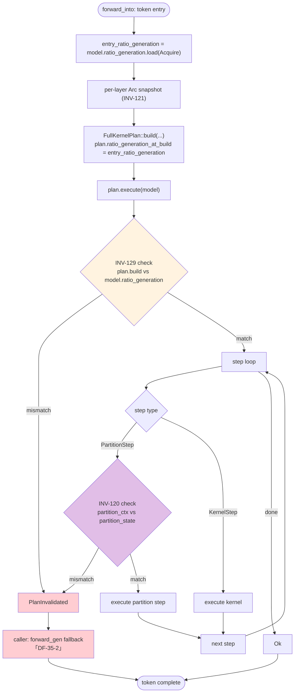

# Plan × Tensor Partition Integration

> **상태**: Draft (2026-04-25, Phase 3.5 cross-ref 추가)
> **작성**: 2026-04
> **갱신**: 2026-04-25 (A.11 cross-ref — INV-129 결합)
> **범위**: `FullKernelPlan`이 `PartitionStep`을 포함할 때의 stale 감지 메커니즘. INV-120(per-partition) ↔ INV-129(전역) OR 결합.
> **대상 스펙**:
>   - `spec/32-engine-algorithms.md` §3.11.1 (ENG-ALG-200), §3.12.13~3.12.14 (ENG-ALG-219, ENG-ALG-220).
>   - `spec/41-invariants.md` §3.12 (INV-120), §3.14 (INV-129).
>   - `arch/weight_swap.md` §2.2.2 (Plan 경로 소비 규약).

---

## A.6 Plan Stale 감지 (per-context)

### A.6.2 PartitionStep::run의 generation 검사 — INV-120

`FullKernelPlan`이 `PartitionStep`을 포함할 때, 각 `PartitionStep::run` 진입 시 다음을 비교한다:

| 비교 대상 | 캡처 시점 | 비교 시점 |
|-----------|----------|----------|
| `PartitionPlanContext::ratio_generation_at_build` | Plan 빌드 시점 (전역 카운터 snapshot) | `PartitionStep::run()` 진입마다 |
| `PartitionContext::ratio_generation` | `prepare_tensor_partition()` 내부에서 갱신 | (현재 값) |

mismatch 시 `PartitionStep::run`은 `Err(PlanError::PlanInvalidated)`를 반환하며 caller는 plan 재빌드 또는 `forward_gen` fallback을 수행한다. 이는 partition re-prep 이벤트(`SetPartitionRatio` 처리, ratio 변경)에 대응하는 fine-grained 검사이다.

**비용**: per-step 검사. step 수에 비례.

**스펙 cross-ref**: INV-120, ENG-ALG-200.

---

## A.11 Plan Invalidation Trigger 통합 (Phase 3.5)

### A.11.1 두 trigger의 OR 결합

Phase 3.5 (2026-04-25) 도입으로 plan invalidation은 **두 검사 지점**이 OR 결합되어 동작한다:

| 검사 ID | 검사 위치 | 검사 대상 | trigger 조건 | 비용 |
|---------|----------|----------|-------------|------|
| **INV-120** (기존, per-partition) | `PartitionStep::run()` 진입마다 | `PartitionPlanContext.ratio_generation_at_build` ↔ `PartitionContext.ratio_generation` | partition re-prep (`SetPartitionRatio`) | per-step atomic load |
| **INV-129** (신규, 전역) | `FullKernelPlan::execute()` 진입 1회 | `plan.ratio_generation_at_build` ↔ `model.ratio_generation` | weight swap 또는 partition re-prep 모두 | per-token atomic load 1회 |

### A.11.2 OR 결합 다이어그램

### A.11.3 Trigger별 catch 매트릭스

| 발생 이벤트 | INV-129 (전역) catch | INV-120 (per-partition) catch | 처리 결과 |
|-------------|---------------------|-------------------------------|----------|
| Weight swap만 발생 | ✅ catch | ❌ (partition_ctx 미변경 가능) | INV-129 단독 catch → fallback |
| Partition re-prep만 발생 | ✅ catch (전역 카운터도 bump) | ✅ catch | 둘 다 catch (redundancy) |
| 둘 다 발생 | ✅ catch | ✅ catch | 둘 다 catch |
| 둘 다 미발생 | match (no-op) | match (no-op) | Plan 정상 실행 |

**redundancy의 의미**: weight swap 경로는 INV-129 단독으로 충분히 catch되므로 INV-120은 **fine-grained partition state 검증**의 책임만 진다. 두 검사가 OR로 결합되어 어느 쪽 trigger도 누락 없이 처리된다.

### A.11.4 weight swap × tensor_partition 상호 배타 (DF-35-3)

Phase 3.5 결정에 따라 **weight swap이 활성화된 모델 인스턴스에서는 `partition_ctx = None`으로 강제**된다 (`arch/weight_swap.md` §2.2.2 참조). 이 경우:
- INV-120 검사 경로는 자연 비활성 (PartitionStep이 plan에 포함되지 않음).
- INV-129 검사만 활성. 단일 trigger 경로로 단순화.

**상호 배타가 없는 경우(weight swap 미사용 + partition 활성)**:
- INV-129 검사는 항상 활성이지만 `model.ratio_generation`은 partition re-prep시에만 bump되므로, INV-120과 동일 trigger를 두 지점에서 검사하는 redundancy 형태가 된다.
- 비용은 per-token atomic load 1회 추가에 그치므로 무시 가능.

### A.11.5 cross-ref

- 알고리즘:
  - `spec/32-engine-algorithms.md` §3.11.1 (ENG-ALG-200, Plan × Partition 통합).
  - `spec/32-engine-algorithms.md` §3.12.13 (ENG-ALG-219, FullKernelPlan 진입 검사).
  - `spec/32-engine-algorithms.md` §3.12.14 (ENG-ALG-220, entry_ratio_generation 소비).
- 불변식:
  - `spec/41-invariants.md` §3.12 (INV-120, per-partition).
  - `spec/41-invariants.md` §3.14 (INV-129, 전역).
- arch:
  - `arch/weight_swap.md` §2.2.2 (Plan 경로 소비 규약).
  - `arch/weight_swap.md` §6 (Phase 3.5 In-scope, DF-35-1~4).

---

## 변경 이력

- **2026-04-25**: A.11 신규 (Phase 3.5 INV-129 cross-ref + OR 결합 다이어그램).
- **2026-04** (초기): A.6.2 INV-120 정의.
