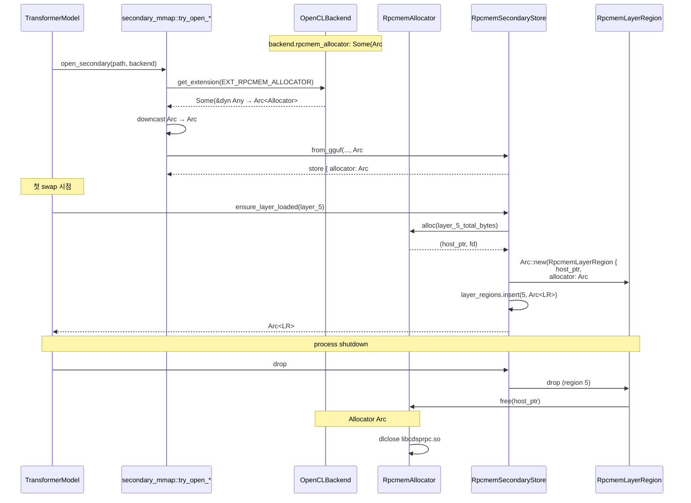

# Precision Swap — `RpcmemSecondaryStore` Allocator Routing (Sprint 2a Phase 2 부분)

> **상태**: Draft v1 (2026-05-26, Sprint 2a Phase 2 spec/arch — 구현 대기).
> **범위**: 본 문서는 `RpcmemSecondaryStore` 가 `Arc<RpcmemAllocator>` 를 어떻게 받는지에 한정. precision swap 전체 (LayerSlot / ArcSwap / Phase 1~6.5 / AUF self-secondary) 는 `arch/weight_swap.md` + `arch/auf_format.md` 참조.
> **대상 spec**: `spec/30-engine.md` 부록 E.4 (ENG-RPCMEM-030 ~ ENG-RPCMEM-033).
> **연관 문서**: `arch/rpcmem_allocator.md` (allocator 자체), `arch/opencl_backend.md` (다른 consumer + extension provider).
> **명명**: "precision swap" 은 weight swap (dtype 정밀도 교체) 의 공식 명칭 (MEMORY `feedback_precision_swap_terminology.md` 2026-05-25).

---

## 1. 변경 범위

| 컴포넌트 | 파일 | 변경 종류 |
|----------|------|----------|
| RpcmemSecondaryStore | `engine/src/models/weights/rpcmem_secondary.rs` | constructor parameter `(RpcmemAllocFn, RpcmemFreeFn)` → `Arc<RpcmemAllocator>`. 내부 field 도 동일 교체. |
| RpcmemLayerRegion | `engine/src/models/weights/rpcmem_secondary.rs` | `rpcmem_free: RpcmemFreeFn` field → `allocator: Arc<RpcmemAllocator>` field. Drop 의 `(self.rpcmem_free)(...)` → `self.allocator.free(...)`. |
| secondary_mmap.rs | `engine/src/models/weights/secondary_mmap.rs` | `try_open_rpcmem_secondary` / `try_open_rpcmem_self_secondary_for_auf` 의 backend lookup 분기를 2-tier 우선순위로 변경 (EXT_RPCMEM_ALLOCATOR 우선, EXT_QNN_OPPKG fallback). |
| backend_supports_rpcmem_secondary | `engine/src/models/weights/secondary_mmap.rs` | OpenCL backend 도 true 반환하도록 분기 확장 (rpcmem allocator extension 보유 시). |

`RpcmemSecondaryStore` 의 다른 public method (`ensure_layer_loaded` / `host_ptr_for` / `cached_alias` / `populate_alias_cache_for_layer` 등) 와 `RpcmemAliasBuffer` 자체는 무변경.

---

## 2. 변경된 API 시그니처

### 2.1 RpcmemSecondaryStore

```rust
// 변경 전 (현행)
impl RpcmemSecondaryStore {
    pub fn from_gguf(
        path: &Path,
        primary_config: &ModelConfig,
        primary_gguf: &GgufFile,
        backend: Arc<dyn Backend>,
        #[cfg(target_os = "android")] qnn_runtime_rpcmem_fns: (RpcmemAllocFn, RpcmemFreeFn),
    ) -> Result<Self>;

    pub fn from_auf_self_secondary(
        view: Arc<crate::auf::AufView>,
        layer_index: Vec<LayerTensorSlice>,
        diag_source_path: PathBuf,
        backend: Arc<dyn Backend>,
        #[cfg(target_os = "android")] qnn_runtime_rpcmem_fns: (RpcmemAllocFn, RpcmemFreeFn),
    ) -> Result<Self>;
}

// 변경 후 (Sprint 2a Phase 2)
impl RpcmemSecondaryStore {
    pub fn from_gguf(
        path: &Path,
        primary_config: &ModelConfig,
        primary_gguf: &GgufFile,
        backend: Arc<dyn Backend>,
        #[cfg(target_os = "android")] allocator: Arc<crate::memory::rpcmem::allocator::RpcmemAllocator>,
    ) -> Result<Self>;

    pub fn from_auf_self_secondary(
        view: Arc<crate::auf::AufView>,
        layer_index: Vec<LayerTensorSlice>,
        diag_source_path: PathBuf,
        backend: Arc<dyn Backend>,
        #[cfg(target_os = "android")] allocator: Arc<crate::memory::rpcmem::allocator::RpcmemAllocator>,
    ) -> Result<Self>;
}
```

### 2.2 RpcmemLayerRegion

```rust
// 변경 후
pub struct RpcmemLayerRegion {
    host_ptr: *mut u8,
    #[allow(dead_code)]
    size: usize,
    tensor_map: HashMap<String, (usize, usize, DType)>,
    // 신규 — fn-pointer 보유 대신 allocator Arc 보유.
    #[cfg(target_os = "android")]
    allocator: Arc<crate::memory::rpcmem::allocator::RpcmemAllocator>,
}

impl Drop for RpcmemLayerRegion {
    fn drop(&mut self) {
        #[cfg(target_os = "android")]
        if !self.host_ptr.is_null() {
            // SAFETY: host_ptr 는 self.allocator.alloc 결과. Drop 1회.
            unsafe { self.allocator.free(self.host_ptr) };
        }
    }
}
```

### 2.3 store 내부 변경

```rust
// 변경 후 — store 가 fn-pointer 가 아닌 allocator 보유.
pub struct RpcmemSecondaryStore {
    backing: Arc<dyn WeightSectionView>,
    source_path: PathBuf,
    layer_index: Vec<LayerTensorSlice>,
    layer_regions: Mutex<HashMap<usize, Arc<RpcmemLayerRegion>>>,
    alias_cache: Mutex<HashMap<(usize, String), Arc<dyn Buffer>>>,
    backend_weak: Mutex<Option<Weak<dyn Backend>>>,
    self_weak: OnceLock<Weak<SecondaryMmap>>,
    #[cfg(target_os = "android")]
    allocator: Arc<crate::memory::rpcmem::allocator::RpcmemAllocator>,
}

// build_layer_region 의 alloc 호출:
let host_ptr = unsafe { self.allocator.alloc(total)? };
// ... memcpy ...
Ok(Arc::new(RpcmemLayerRegion {
    host_ptr: host_ptr.0,
    size: total,
    tensor_map,
    allocator: self.allocator.clone(),
}))
```

---

## 3. Backend lookup 분기 (secondary_mmap.rs)

### 3.1 backend_supports_rpcmem_secondary

```rust
// 변경 전 (현행) — qnn_oppkg backend 만 true.
fn backend_supports_rpcmem_secondary(backend: &Arc<dyn Backend>) -> bool {
    matches!(backend.name(), "qnn_oppkg" | "qnngpu")
}

// 변경 후 — OpenCL backend 가 rpcmem allocator 보유 시에도 true.
fn backend_supports_rpcmem_secondary(backend: &Arc<dyn Backend>) -> bool {
    // 1. opencl backend + rpcmem allocator 보유.
    if backend.get_extension(crate::backend::EXT_RPCMEM_ALLOCATOR).is_some() {
        return true;
    }
    // 2. qnn_oppkg backend (Sprint 2a 공존, 2b 에서 삭제).
    #[cfg(all(feature = "qnn", target_os = "android"))]
    {
        if matches!(backend.name(), "qnn_oppkg" | "qnngpu") {
            return true;
        }
    }
    false
}
```

### 3.2 try_open_rpcmem_secondary (GGUF path) — ENG-RPCMEM-031 우선순위

```rust
fn try_open_rpcmem_secondary(
    path: &Path,
    primary_config: &ModelConfig,
    primary_gguf: &GgufFile,
    backend: &Arc<dyn Backend>,
) -> Result<SecondaryMmap, LoadError> {
    #[cfg(target_os = "android")]
    {
        // 우선순위 1: OpenCLBackend 의 EXT_RPCMEM_ALLOCATOR 확인.
        if let Some(any) = backend.get_extension(crate::backend::EXT_RPCMEM_ALLOCATOR) {
            if let Some(allocator_arc) =
                any.downcast_ref::<Arc<crate::memory::rpcmem::allocator::RpcmemAllocator>>()
            {
                let store = crate::models::weights::rpcmem_secondary::RpcmemSecondaryStore::from_gguf(
                    path,
                    primary_config,
                    primary_gguf,
                    Arc::clone(backend),
                    allocator_arc.clone(),
                )
                .map_err(|e| LoadError::SecondaryUnavailable {
                    path: path.to_path_buf(),
                    source: e,
                })?;
                return Ok(SecondaryMmap::Rpcmem(store));
            }
        }

        // 우선순위 2 (Sprint 2a 공존): qnn_oppkg backend path.
        #[cfg(feature = "qnn")]
        {
            if let Some(qnn) = backend
                .get_extension(crate::backend::EXT_QNN_OPPKG)
                .and_then(|a| a.downcast_ref::<crate::backend::qnn_oppkg::QnnOppkgBackend>())
            {
                let runtime = qnn.runtime_arc();
                let rpcmem_fns = runtime.rpcmem_fns();
                // 임시 어댑터 — Sprint 2a 동안만 qnn_oppkg 의 raw fn-pointer 를
                // RpcmemAllocator 와 동등하게 다루는 wrapper (예: ExternalRpcmemAllocator).
                // Sprint 2b backend 삭제 시 본 분기 + wrapper 함께 삭제.
                let allocator = crate::memory::rpcmem::allocator::RpcmemAllocator::from_external_fns(
                    rpcmem_fns.0,
                    rpcmem_fns.1,
                    rpcmem_fns.2,
                );
                let allocator_arc = Arc::new(allocator);
                let store = crate::models::weights::rpcmem_secondary::RpcmemSecondaryStore::from_gguf(
                    path,
                    primary_config,
                    primary_gguf,
                    Arc::clone(backend),
                    allocator_arc,
                )
                .map_err(|e| LoadError::SecondaryUnavailable {
                    path: path.to_path_buf(),
                    source: e,
                })?;
                return Ok(SecondaryMmap::Rpcmem(store));
            }
        }

        Err(LoadError::SecondaryUnavailable {
            path: path.to_path_buf(),
            source: anyhow::anyhow!(
                "rpcmem secondary: neither EXT_RPCMEM_ALLOCATOR nor EXT_QNN_OPPKG available"
            ),
        })
    }
    #[cfg(not(target_os = "android"))]
    {
        let _ = (path, primary_config, primary_gguf, backend);
        Err(LoadError::SecondaryUnavailable { /* ... */ })
    }
}
```

> **주의 — `RpcmemAllocator::from_external_fns`**: Sprint 2a 공존 기간만 존재하는 어댑터 생성자. 외부 fn-pointer 를 받아 dlopen 없이 RpcmemAllocator 와 동일 API 를 제공한다. INV-RPCMEM-002 (single allocator per session) 는 본 path 에서 약화됨을 명시 — Sprint 2a 에선 `--backend qnn_oppkg` 사용 시 qnn_oppkg 의 fn-pointer 를 wrapping 한 별도 allocator 가 생기지만, 같은 process 안에 OpenCLBackend + QnnOppkgBackend 가 동시 init 되는 케이스는 INV-RPCMEM-006 (CLI mutex) 으로 차단. Sprint 2b 에서 본 어댑터와 fallback 분기 모두 삭제 → INV-RPCMEM-002 full 강제.
>
> 어댑터 구현은 Implementer 가 결정 — 단순한 enum variant (`RpcmemAllocator::OwnedDlopen { ... }` / `RpcmemAllocator::ExternalFns { ... }`) 가 가장 단순. Drop 동작이 variant 별로 다르므로 (전자만 dlclose) match arm 으로 분리.

### 3.3 try_open_rpcmem_self_secondary_for_auf (AUF self-secondary path)

`secondary_mmap.rs:740` 의 함수도 동일 우선순위 (EXT_RPCMEM_ALLOCATOR → EXT_QNN_OPPKG) 로 변경. `from_auf_self_secondary` 호출 시 allocator Arc 전달.

---

## 4. 처리 흐름 — Single Allocator Sharing



같은 `Arc#42` 가 OpenCLBackend / OpenCLMemory / RpcmemSecondaryStore / RpcmemLayerRegion 으로 흘러간다. INV-RPCMEM-002 검증은 `Arc::as_ptr` equality 로 가능.

---

## 5. 코드-스펙 차이

| 항목 | 현재 | Sprint 2a Phase 2 신규 |
|------|------|----------------------|
| `RpcmemSecondaryStore` 의 allocator 보유 | `(RpcmemAllocFn, RpcmemFreeFn)` 2개 fn-pointer | `Arc<RpcmemAllocator>` (allocator lifetime 으로 fn-pointer 유효성 보장) |
| `RpcmemLayerRegion::Drop` | `(self.rpcmem_free)(host_ptr.cast())` | `self.allocator.free(host_ptr)` |
| backend lookup 우선순위 | `EXT_QNN_OPPKG` 만 (qnn_oppkg 하드코딩) | `EXT_RPCMEM_ALLOCATOR` 우선, qnn_oppkg fallback |
| host build 동작 | `from_gguf` 가 즉시 Err | 동일 (allocator parameter 가 `cfg(android)` 게이트라 컴파일 자체에서 분기) |
| `backend.name() == "qnn_oppkg"` 의존 | secondary loader 가 직접 매치 | extension lookup 으로 추상화 — OpenCL backend 도 동일 path |

---

## 6. 측정 영향

본 변경은 **alloc 경로만** 다루며 hot path (RpcmemAliasBuffer 생성 + GPU read/write) 는 무변경. 측정 영향:

| 측정 | 영향 | 기대 |
|------|------|------|
| 첫 swap 시점 layer alloc | 무변경 (rpcmem_alloc 호출 동등) | baseline 와 동등 |
| Secondary 로딩 (model load 단계) | rpcmem allocator init 1회 (이미 backend init 시점에 수행) | 변동 없음 |
| RpcmemAliasBuffer 생성 (LISWAP-6 Phase 1 cache) | 무변경 | Phase 6.5 결과 그대로 |
| Allocator Drop 시 dlclose | session 종료 시 1회 | 무시 |

Sprint 2a 의 측정 게이트 (Avg TBT, Memory slope, NMSE, Δ top-1) 는 본 변경으로 영향 없어야 함 — 측정 결과로 검증.

---

## 7. Implementer 인수인계

- `from_gguf` / `from_auf_self_secondary` 의 시그니처 변경은 breaking — host build 에서는 `cfg(target_os = "android")` 가 parameter 자체를 제거하므로 callsite 가 단순. Android build callsite (2건: `secondary_mmap.rs:757, 805`) 만 수정.
- `RpcmemAllocator::from_external_fns` 어댑터는 Sprint 2a 공존을 위해 신설. variant 기반 enum 또는 두 별도 struct (`OwnedRpcmemAllocator` / `ExternalRpcmemAllocator`) + trait 모두 가능. enum variant 가 더 단순하며 Drop arm 만 분기.
- `RpcmemSecondaryStore` 의 다른 메서드 (`populate_alias_cache_for_layer` 등) 는 allocator 를 직접 사용하지 않으므로 무변경. `alloc_alias_weight_buffer` (OpenCL backend 의) 도 무변경.
- 단일 process 에서 `--backend qnn_oppkg --opencl-rpcmem` 같은 조합은 CLI parser (`session/cli/mod.rs`) 에서 INV-RPCMEM-006 에 따라 차단 — secondary loader 가 두 extension 을 동시 처리할 필요는 없음.
- `LISWAP-6 Phase 1` alias cache populate path 의 `Backend::alloc_alias_weight_buffer` 호출은 ENG-RPCMEM-033 에 따라 무변경. OpenCLBackend 가 이미 구현 보유 (mod.rs:5311~5373).
- 본 단계에서 GPU CL_MEM_USE_HOST_PTR alias 생성 자체는 `rpcmem_secondary.rs::populate_alias_cache_for_layer` 가 처리하며 (OpenCLBackend::alloc_alias_weight_buffer 호출), allocator 분리와 직교.
