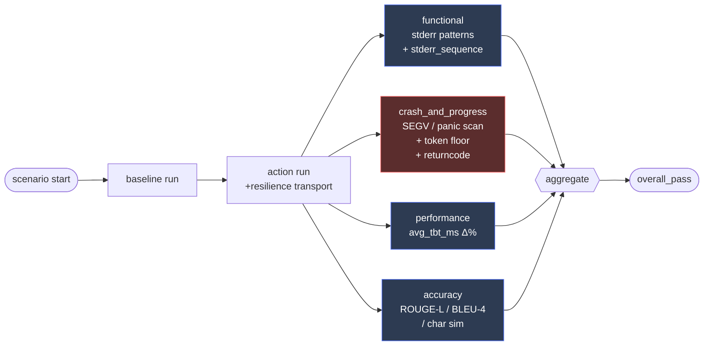
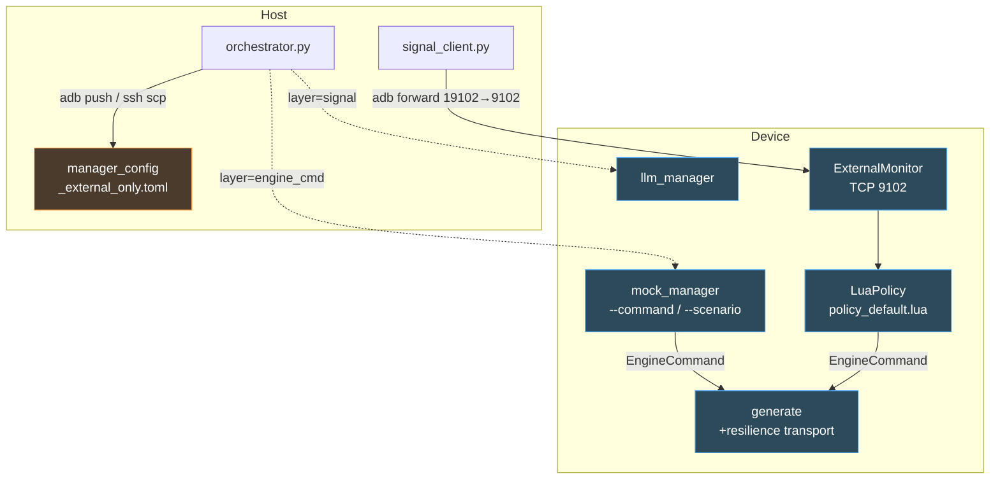
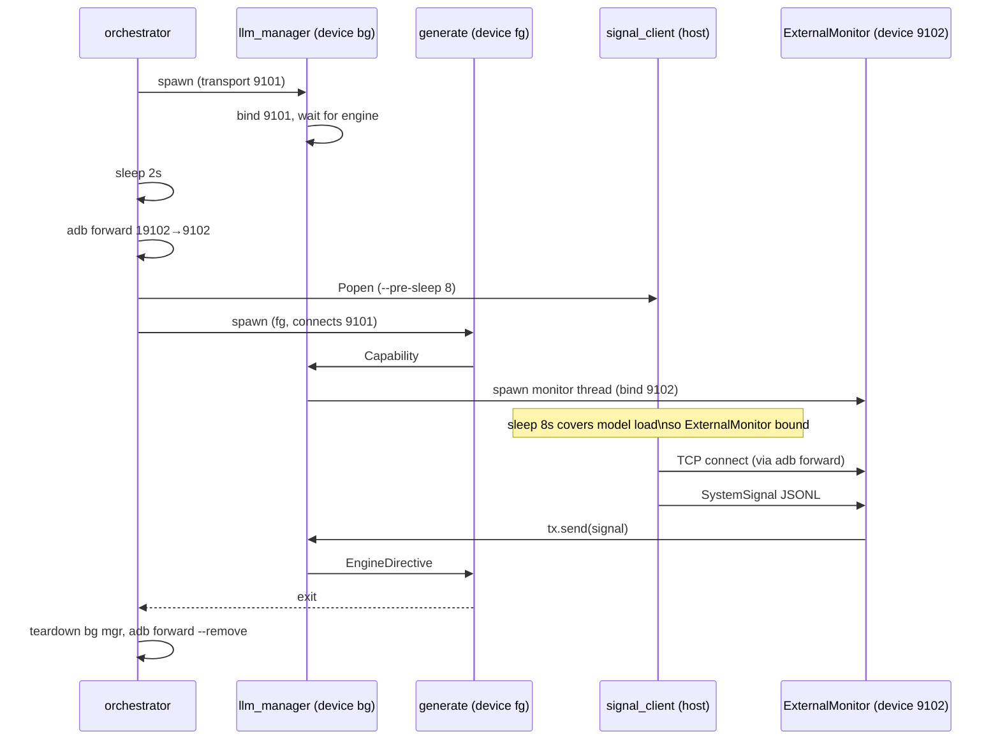

# Resilience Verify Harness (v2)

v1 하네스가 "디렉티브 로그 라인이 찍혔는가"만 확인했다면 v2는 "해당 이벤트 이후에도 파이프라인이 정상 동작했는가"까지 강제한다. 2026-04-23 S25 매트릭스 전수 PASS(v1) → 사용자 제보 크래시가 별도로 존재 → 4개 구조적 blind spot 확인 → v2 개정.

## 4-Layer Gate

`crash_and_progress`는 `pass_criteria`와 무관하게 **하드 게이트**. `functional_only`는 KvQuantDynamic→q4 같이 출력이 의도적으로 달라지는 경우에만 명시적으로 opt-in.

## 두 가지 주입 경로

v2는 두 개의 독립 경로를 모두 돌려 정책·엔진 양쪽을 동시에 커버한다.

- `layer: engine_cmd` — `mock_manager`가 EngineCommand를 직접 주입. 엔진 핸들러 단위 검증.
- `layer: signal` — 진짜 `llm_manager` 바이너리 + Lua policy + ExternalMonitor를 구동해 SystemSignal → Policy.eval → EngineCommand 변환 경로까지 end-to-end 검증. adb 환경에서는 `adb forward` TCP 터널로 호스트 signal_client를 device 9102에 연결.

## 주입 타이밍

이 순서가 어긋나면(예: pre-sleep 없이 signal_client가 너무 빨리 연결) adb-forward는 accept하지만 device 측 listener가 아직 없어 데이터가 드롭된다 — v2-3 구현 초기에 관찰된 실패 패턴.

## v2 Blind Spot → 시나리오/Assertion 매핑

| Blind spot | Assertion | 대표 시나리오 |
|---|---|---|
| BS1 enable 경로 미검증 | baseline=off, action=on + `stderr_sequence` | `direct_cmd_partition_ratio_enable`, `prefill_midway_partition_enable` |
| BS2 functional_only 마스킹 | `pass_criteria: all` 기본값, `functional_only`는 명시 opt-in + justify 주석 | 전 시나리오 재감사 완료 |
| BS3 "로그 존재"만 체크 | `stderr_sequence` (after 제약) + `crash_and_progress` 하드 게이트 | 모든 시나리오 공통 |
| BS4 Strategy 매핑 미검증 | `layer: signal` + llm_manager + ExternalMonitor | `signal_memory_critical`, `signal_thermal_critical_throttle` |

## 결과 샘플 (S25 F16+Q4, v1 → v2 회귀)

| 시나리오 | v1 | v2 | 드러난 이슈 |
|---|---|---|---|
| `direct_cmd_partition_ratio` f16 | PASS | FAIL | ROUGE 0.29, disable인데 출력 크게 다름 |
| `direct_cmd_partition_ratio_enable` f16 | (N/A, 신규) | FAIL | 0/64 tokens — action 완전 실패 |
| `prefill_midway_partition_enable` f16/q4 | (N/A, 신규) | FAIL | 디렉티브 수신은 됐지만 activation 로그 없음 (silent no-op) |
| `signal_memory_critical` q4 | (N/A, 신규) | FAIL (CRASH) | RequestQcf 처리 중 SIGSEGV 139 |
| `signal_thermal_critical_throttle` f16/q4 | (N/A, 신규) | FAIL (CRASH) | 29–38 tokens 후 crash |

## 주요 파일

- `resilience_verify/verify.py` — CLI entrypoint (build/deploy + dispatch)
- `resilience_verify/harness/orchestrator.py` — `_run_scenario_{local,ssh,adb,adb_signal}`
- `resilience_verify/harness/signal_client.py` — SystemSignal JSONL TCP/Unix injector
- `resilience_verify/harness/assertions.py` — `verify_{functional,crash_and_progress,performance,accuracy}` + `aggregate_verdict`
- `resilience_verify/harness/log_parser.py` — `find_sequence`, `find_crash_signatures`, `count_decoded_tokens`
- `resilience_verify/fixtures/manager_config_external_only.toml` — 결정론 보장을 위해 실측 monitor 전부 off, ExternalMonitor만 on
- `resilience_verify/scenarios/*.yaml` — YAML scenario spec (v2 schema)
