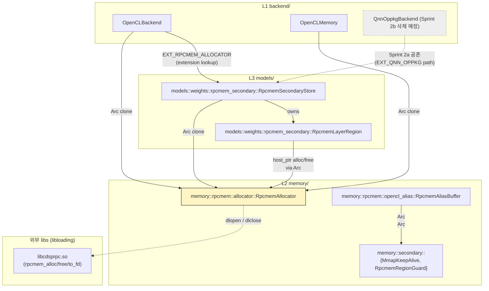
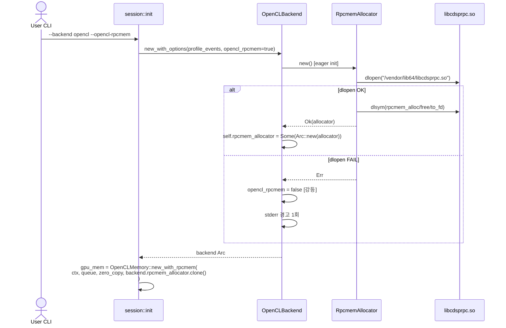
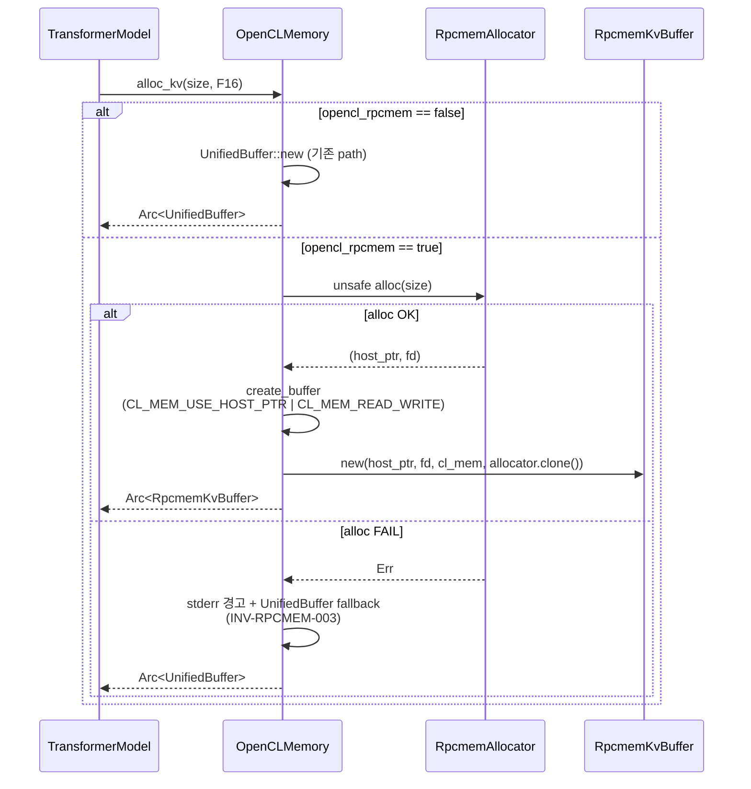
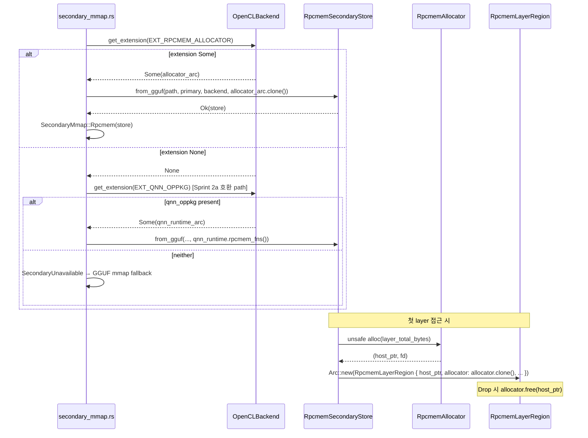

# RpcmemAllocator — Backend-agnostic rpcmem (DMA-BUF heap) Allocator

> **상태**: Draft v1 (2026-05-26, Sprint 2a Phase 2 spec/arch — 구현 대기).
> **대상 spec**: `spec/30-engine.md` 부록 E (ENG-RPCMEM-010 ~ ENG-RPCMEM-C04), `spec/41-invariants.md` §3.27 (INV-RPCMEM-001 ~ 008).
> **연관 문서**: `arch/opencl_backend.md` (consumer #1: KV alloc), `arch/precision_swap.md` (consumer #2: secondary store), `arch/weight_swap.md` §1.4 (RpcmemSecondaryStore 기존 매핑).
> **연관 메모리**: `project_qnn_oppkg_m2_complete_20260510.md` (M2 가설), `project_swap_overhead_opencl_complete_20260509.md` (Adreno UMA 검증), `project_liswap5_phase10_htp_feasibility_20260509.md` (HeteroLLM raw clientBuf negative).

---

## 0. 컨텍스트

`libcdsprpc.so` 의 3 심볼 (`rpcmem_alloc` / `rpcmem_free` / `rpcmem_to_fd`) 은 Adreno SoC 의 zero-copy DMA-BUF heap 접근에 사용되는 production-critical API 다. 기존에는 이 dlopen / symbol caching 코드가 `engine/src/backend/qnn_oppkg/runtime.rs::android_init` 안에 `libQnnGpu.so` / `libqnn_oppkg.so` dlopen 과 함께 묶여 있었으며, RpcmemSecondaryStore 가 `QnnOppkgRuntime::rpcmem_fns()` 를 호출하여 fn-pointer 를 받아 사용했다.

Researcher Phase 1 dry-run 결정:
- `libQnnGpu.so` / `libqnn_oppkg.so` 는 production code path 에서 dead. M3 layer graph fast path 가 사용되지 않으며 (`--backend qnn_oppkg fast off` default 가 production) trait fallback 경로의 실측 가속은 모두 rpcmem KV / secondary 에서 기인.
- libcdsprpc.so 의 3 심볼만 hot path. 추출 가능.

본 모듈은 libcdsprpc.so 의존을 backend-agnostic 한 단일 책임 모듈로 격리한다.

---

## 1. 컴포넌트 위치

```
engine/src/memory/rpcmem/
├── mod.rs              # 기존 (변경: allocator 등록)
├── allocator.rs        # 신규: RpcmemAllocator (본 문서 §2)
└── opencl_alias.rs     # 기존 (변경 없음, RpcmemAliasBuffer)
```

L2 (`memory/`) 산하. INV-LAYER-002 에 따라 L3 도메인 (`models/`, `pressure/`, `inference/`) 의 어떤 모듈도 import 하지 않으며, raw byte interface (`*mut u8`, `RawFd`) 만 노출한다.

### 1.1 모듈 의존 그래프



`RpcmemAllocator` 는 backend-agnostic L2 모듈. `Arc<RpcmemAllocator>` 가 OpenCLBackend (KV path) + OpenCLMemory + RpcmemSecondaryStore + RpcmemLayerRegion 으로 clone 되어 공유된다.

---

## 2. RpcmemAllocator API

### 2.1 Struct 정의

```rust
// engine/src/memory/rpcmem/allocator.rs

#[cfg(target_os = "android")]
mod android_impl {
    use std::os::unix::io::RawFd;
    use libloading::{Library, Symbol};

    type RpcmemAllocFn = unsafe extern "C" fn(i32, u32, i32) -> *mut std::ffi::c_void;
    type RpcmemFreeFn  = unsafe extern "C" fn(*mut std::ffi::c_void);
    type RpcmemToFdFn  = unsafe extern "C" fn(*const std::ffi::c_void) -> i32;

    pub struct RpcmemAllocator {
        // dlopen handle — Drop 순서가 fn-pointer 의 lifetime 을 결정.
        // 본 field 가 마지막에 drop 되어야 fn-pointer 호출이 안전.
        _lib: Library,
        rpcmem_alloc: RpcmemAllocFn,
        rpcmem_free:  RpcmemFreeFn,
        rpcmem_to_fd: RpcmemToFdFn,
    }
}

#[cfg(not(target_os = "android"))]
pub struct RpcmemAllocator {
    _never: std::convert::Infallible,
}
```

### 2.2 공개 API

```rust
impl RpcmemAllocator {
    /// `libcdsprpc.so` dlopen + 3 심볼 lookup.
    ///
    /// 환경 변수 `LLMRS_RPCMEM_LIB` 로 path override 가능
    /// (default `/vendor/lib64/libcdsprpc.so` — qnn_oppkg::runtime 의 `QNN_RPCMEM_LIB` 와 동일).
    ///
    /// **Pre**: target_os = "android".
    /// **Post**: 성공 시 dlopen 핸들 + 3 fn-pointer 캐시. 실패 시 Err.
    ///   - host 빌드: 호출 시점에 compile error 또는 즉시 Err (INV-RPCMEM-001).
    ///   - dlopen 실패 (so 부재): Err with anyhow context.
    ///   - 심볼 lookup 실패: Err with anyhow context.
    pub fn new() -> anyhow::Result<Self>;

    /// rpcmem heap 에서 `size` byte alloc + dma-buf fd 추출.
    ///
    /// **Pre**: `size > 0`.
    /// **Post**: 성공 시 (host_ptr, dma_buf_fd) 반환. CPU 가 host_ptr 으로 직접 read/write 가능.
    ///   - host_ptr 은 page-aligned 보장 (libcdsprpc 계약).
    ///   - 실패 시 Err — 호출자는 per-buffer fallback (INV-RPCMEM-003).
    ///
    /// # Safety
    /// 반환된 host_ptr 은 self.free 로 명시적으로 free 해야 한다 — Drop 자동 호출되지 않는다.
    /// 호출자가 (RpcmemKvBuffer / RpcmemLayerRegion) 의 Drop 에서 free 호출 책임.
    pub unsafe fn alloc(&self, size: usize) -> anyhow::Result<(*mut u8, RawFd)>;

    /// `alloc` 으로 받은 host_ptr 해제.
    ///
    /// **Pre**: host_ptr 은 self.alloc 이 반환한 유효 포인터.
    /// **Post**: rpcmem region 해제, host_ptr 무효화.
    ///
    /// # Safety
    /// double-free / use-after-free 책임은 호출자.
    pub unsafe fn free(&self, host_ptr: *mut u8);

    /// (선택) raw fn-pointer 추출 — 기존 `RpcmemSecondaryStore` 가 fn-pointer 기반으로
    /// 작성되어 있어 마이그레이션 첫 단계에서 fn-pointer interface 호환을 위해 노출한다.
    /// 신규 코드는 alloc/free 메서드를 사용하고 본 메서드는 deprecate 대상.
    #[doc(hidden)]
    pub fn raw_fns(&self) -> (RpcmemAllocFn, RpcmemFreeFn);
}

// SAFETY: libcdsprpc.so 의 3 심볼은 thread-safe (Qualcomm Adreno driver 문서 기준).
// libloading::Library 는 internally Sync (Drop 만 mutates).
unsafe impl Send for RpcmemAllocator {}
unsafe impl Sync for RpcmemAllocator {}
```

### 2.3 Drop 정책

`RpcmemAllocator::Drop` 은 `libloading::Library::drop` 만 수행하며, outstanding host_ptr 은 free 하지 않는다. 호출 순서 (allocator > library) 는 struct field 선언 순서 (`_lib` 가 마지막) 가 강제한다.

**INV-RPCMEM-005 보장 방법**: `Arc<RpcmemAllocator>` 가 OpenCLBackend / OpenCLMemory / RpcmemSecondaryStore / RpcmemKvBuffer / RpcmemLayerRegion 의 `Arc` field 로 보유된다. 모든 buffer struct 가 drop 된 후에야 allocator 의 strong count 가 0이 되어 dlclose 수행. dependency graph:

```
RpcmemKvBuffer { _allocator: Arc<RpcmemAllocator>, ... }  // KV
RpcmemLayerRegion { _allocator: Arc<RpcmemAllocator>, ... }  // secondary
OpenCLBackend { rpcmem_allocator: Option<Arc<RpcmemAllocator>>, ... }
OpenCLMemory { rpcmem_allocator: Option<Arc<RpcmemAllocator>>, ... }
RpcmemSecondaryStore { allocator: Arc<RpcmemAllocator>, ... }
```

**기존 `QnnOppkgKvBuffer` / `RpcmemLayerRegion` 의 fn-pointer 직접 보유 패턴**과 다르다 — 새 패턴은 `Arc<RpcmemAllocator>` 보유. fn-pointer 만 보유하면 allocator 가 먼저 drop 될 위험이 있다 (현재 코드는 운좋게 allocator 가 `Backend` Arc 안에 묶여 buffer 보다 오래 살지만 explicit lifetime contract 부재). 신규 패턴은 lifetime 을 type system 으로 강제.

---

## 3. 처리 흐름

### 3.1 Backend init 시점



### 3.2 KV alloc 흐름



### 3.3 Precision swap secondary 흐름



---

## 4. 예외 처리

| 경로 | 실패 모드 | 처리 | 대응 INV |
|------|----------|------|---------|
| `RpcmemAllocator::new()` (host) | compile-gated 또는 즉시 Err | `OpenCLBackend::new_with_options` 가 `opencl_rpcmem = false` 로 강등 + warning | INV-RPCMEM-001 |
| `RpcmemAllocator::new()` (Android, so 부재) | dlopen FAIL | 위와 동일 (강등) | INV-RPCMEM-001 |
| `RpcmemAllocator::alloc()` (heap exhaustion) | host_ptr NULL | OpenCLMemory: UnifiedBuffer fallback; RpcmemSecondaryStore: Err propagate → SecondaryUnavailable → GGUF mmap fallback | INV-RPCMEM-003 |
| Backend extension lookup mismatch | `EXT_RPCMEM_ALLOCATOR` None + `EXT_QNN_OPPKG` None | secondary 활성화 안 됨 → 일반 GGUF/AUF mmap path | spec ENG-RPCMEM-031 |
| `--opencl-rpcmem` + `--backend qnn_oppkg` 동시 | CLI parser warn | `opencl_rpcmem = false` 로 강등 + stderr 경고 | INV-RPCMEM-006 |

---

## 5. 코드-스펙 차이

본 단계는 spec/arch 작성만 수행하며 구현 없음. **현재 코드와의 차이**:

1. **fn-pointer 보유 → Arc 보유**:
   - 기존: `RpcmemSecondaryStore` / `QnnOppkgKvBuffer` 가 raw fn-pointer (`RpcmemFreeFn`) 를 보유. allocator lifetime 보장은 implicit (운좋게 backend Arc 가 buffer 보다 오래 살음).
   - 신규: `Arc<RpcmemAllocator>` 보유로 lifetime contract 를 type system 으로 강제. INV-RPCMEM-005 보장.

2. **dlopen path 단일화**:
   - 기존: `engine/src/backend/qnn_oppkg/runtime.rs::android_init` 안에 libQnnGpu.so + libqnn_oppkg.so + libcdsprpc.so 3개 dlopen.
   - 신규: `engine/src/memory/rpcmem/allocator.rs` 가 libcdsprpc.so 단독 dlopen. qnn 관련 2개 so 는 Sprint 2b 에서 backend 와 함께 제거.

3. **OpenCLBackend 의존**:
   - 기존: OpenCLBackend 는 rpcmem 무관. `--backend qnn_oppkg` 가 QnnOppkgHybridMemory 를 통해 KV path 만 zero-copy 화.
   - 신규: OpenCLBackend 가 직접 `Arc<RpcmemAllocator>` 를 보유하고 OpenCLMemory + EXT_RPCMEM_ALLOCATOR extension 양쪽에 노출.

4. **공존 기간**:
   - 본 sprint(2a)에서는 두 path (qnn_oppkg backend / `--opencl-rpcmem`) 가 공존. Sprint 2b 에서 backend 삭제 + ENG-RPCMEM-031 의 우선순위 #2 분기 + INV-RPCMEM-006 자연 만료.

---

## 6. Config / CLI

| 항목 | 키 | 기본값 | 비고 |
|------|----|--------|------|
| CLI flag | `--opencl-rpcmem` | false | Android-only. Host 에서는 강등 + warning. |
| env override | `LLMRS_RPCMEM_LIB` | `/vendor/lib64/libcdsprpc.so` | dlopen path override. qnn_oppkg 의 `QNN_RPCMEM_LIB` 와 동일 의미. |
| Backend extension | `EXT_RPCMEM_ALLOCATOR` (신규) | (등록 대상) | `Arc<RpcmemAllocator>` raw view (`&dyn Any`). RpcmemSecondaryStore 가 lookup. |

`EXT_RPCMEM_ALLOCATOR` 는 `engine/src/backend/mod.rs` 의 기존 `EXT_QNN_OPPKG` / `EXT_OPENCL_QUEUE` / `EXT_OPENCL_SECONDARY` 와 같은 const 형식 (예: `pub const EXT_RPCMEM_ALLOCATOR: &str = "rpcmem_allocator";`) 으로 추가한다.

---

## 7. 측정 / 검증 hook

본 sprint 의 verification gate 는 별도 microbench bin 이 아닌 production opt-in flag 기반이다. `--opencl-rpcmem` 활성 / 비활성 두 경우의 measurement matrix:

| 측정 | 비교 baseline | 목표 |
|------|--------------|------|
| TBT (Decode ms/tok) | `--backend opencl` (rpcmem off) | rpcmem on 이 ≤ baseline × 1.0 (즉 동등 또는 가속) |
| TBT (Decode ms/tok) | `--backend qnn_oppkg` (rpcmem on via QnnOppkgHybridMemory) | rpcmem on 이 동등 (±5% within noise) |
| Memory: VmRSS slope | rpcmem off | rpcmem on 의 token 단위 leak slope < 50 KB/token (INV-178 정신) |
| Precision swap quality | NMSE / Δ top-1 | INV-122 v2.1 임계값 유지 |

Sprint 2b 진입 게이트: 위 4 측정 모두 GREEN.

---

## 8. Implementer 인수인계 — 본 문서가 명시 안 한 사항

- **`RpcmemKvBuffer` 신설 vs `QnnOppkgKvBuffer` 이동**: 본 단계는 spec 만 — Implementer 가 `engine/src/memory/rpcmem/kv_buffer.rs` 를 신설할지 (권장), 또는 `qnn_oppkg/kv_buffer.rs` 를 `memory/rpcmem/` 으로 이동할지 결정. Sprint 2b 에서 qnn_oppkg 가 삭제되므로 후자도 안전.
- **`OpenCLBackend::new` 시그니처**: ENG-RPCMEM-020 은 SHOULD 로 표시. Implementer 가 `new_with_options` 신설 + 기존 method 위임을 그대로 따르면 됨. 시그니처 변경(parameter 추가) 은 unit test 다수 수정이 필요해 비권장.
- **Sprint 2a 시점의 `qnn_oppkg` 분기 처리**: ENG-RPCMEM-031 우선순위 표대로 양 extension 모두 lookup 하되 `EXT_RPCMEM_ALLOCATOR` 가 더 높은 우선순위. 단일 process 에서 OpenCLBackend (with `--opencl-rpcmem`) 와 QnnOppkgBackend 동시 init 은 INV-RPCMEM-006 으로 차단 (전자가 무시됨).
- **libloading version**: `engine/Cargo.toml` 에 이미 등재. 별도 추가 불필요.
- **`EXT_RPCMEM_ALLOCATOR` const 위치**: `engine/src/backend/mod.rs` 의 기존 EXT_* 가 모두 모여 있는 블록 (line ~25 근처). 동일 위치에 추가.
