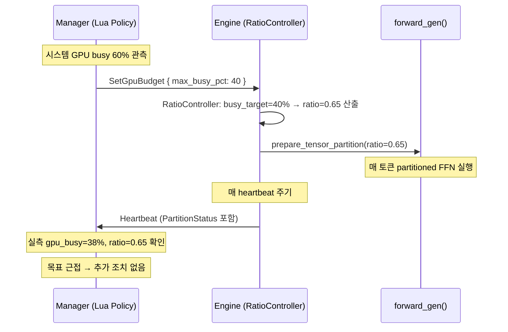
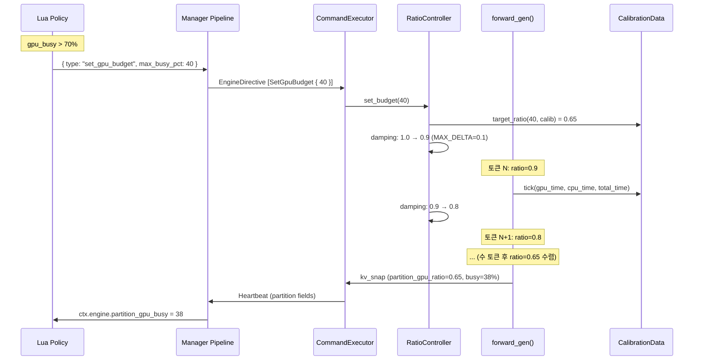
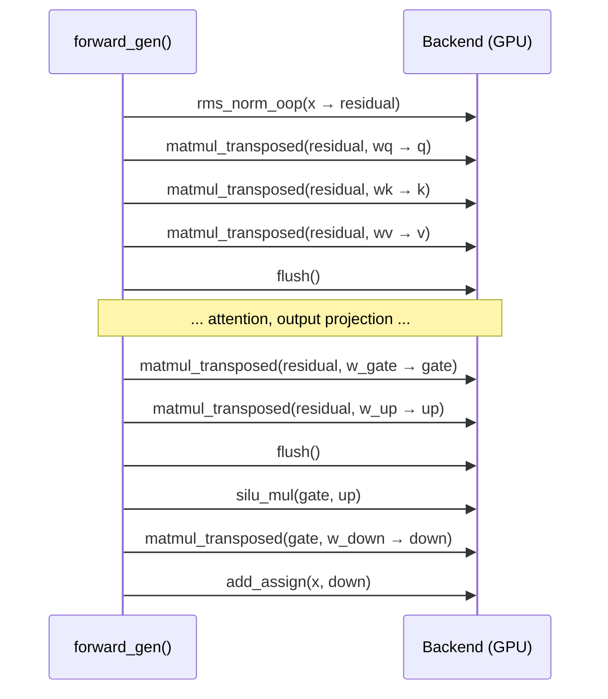
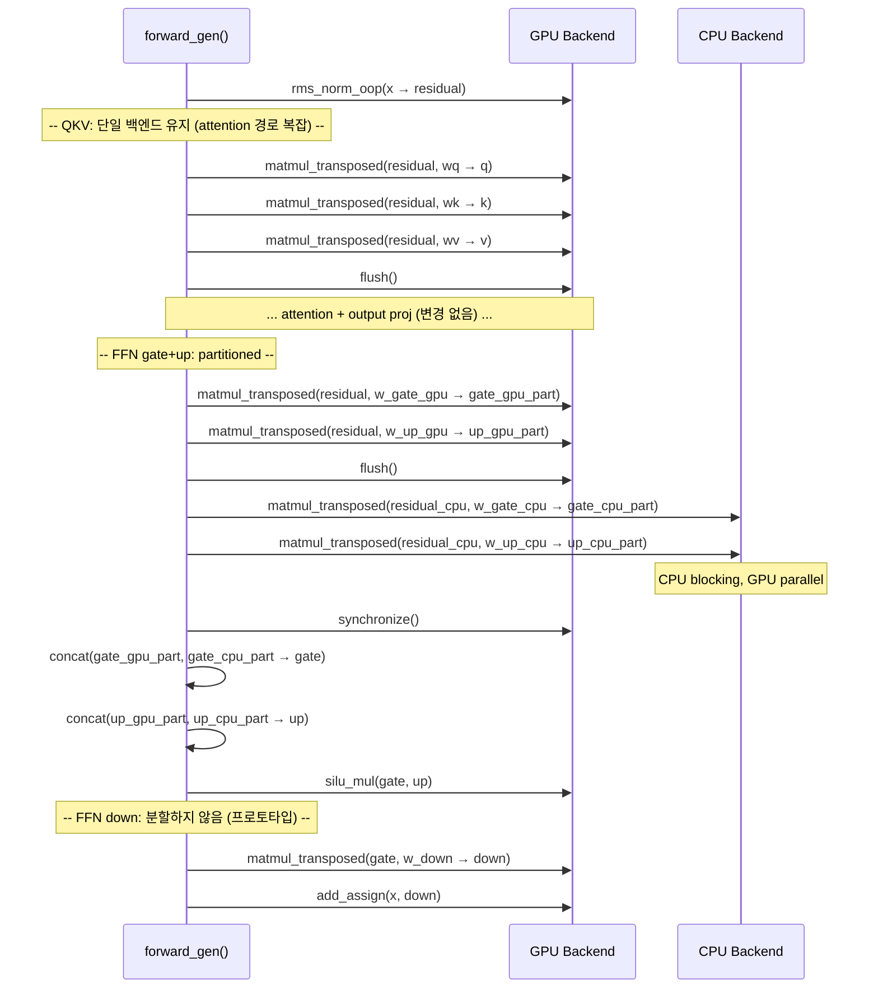
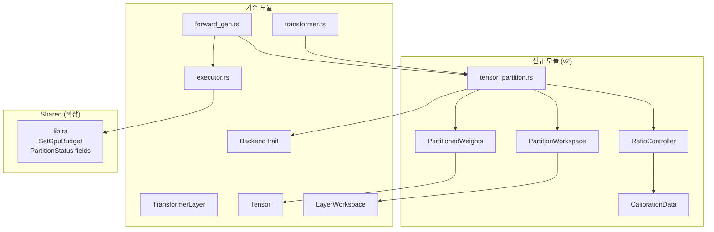
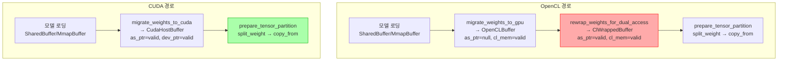

# Tensor Partition — CPU-GPU Cooperative Inference 설계 (v2: 역할 분리 모델)

> **상태**: Draft v2  
> **작성**: 2026-04-06  
> **대상**: Decode-only (seq_len == 1) linear projection  
> **전제**: UMA SoC (ARM Adreno/Mali), ClWrappedBuffer (CL_MEM_USE_HOST_PTR)  
> **변경 이력**: v1 → v2: Manager-Engine 역할 분리 모델로 전면 재설계

---

## 1. 개요

### 1.1 문제

현재 decode 경로에서 모든 matmul(QKV, O, gate/up/down)이 **단일 백엔드**(GPU 또는 CPU)에서
순차 실행된다. GPU가 matmul을 실행하는 동안 CPU는 유휴 상태이고, 그 역도 마찬가지다.
UMA SoC에서 CPU와 GPU가 동일 DRAM에 접근 가능하므로, weight matrix를 column 방향으로
분할하여 양쪽에서 동시 계산하면 decode latency(TBT)를 줄일 수 있다.

### 1.2 핵심 아이디어

Linear projection `y = x * W^T` 에서 W를 column 방향(output dimension)으로 분할:

```
W [out_dim, in_dim] = [ W_gpu[0..split, :] ]   → GPU matmul → y_gpu[0..split]
                       [ W_cpu[split.., :] ]   → CPU matmul → y_cpu[split..]
```

`y = concat(y_gpu, y_cpu)` — 두 partial result를 이어 붙이면 원래 output과 동일.

### 1.3 실행 패턴 (단일 스레드, 이벤트 기반)

```
GPU enqueue(x, W_gpu, y_gpu)  →  clFlush()  →  CPU matmul(x, W_cpu, y_cpu)  →  clFinish()
                                                   ↑ GPU는 flush 이후 비동기 실행
                                                   ↑ CPU는 자신의 partition을 blocking으로 계산
```

OpenCL matmul은 이미 non-blocking(`enqueue_kernel`만 수행). `flush()`가 GPU 파이프라인
시작을 보장하므로, CPU가 자신의 부분을 계산하는 동안 GPU도 병렬 실행된다.
**별도 thread 불필요**.

### 1.4 역할 분리 모델 (v2 신규)

**v1 문제점**: Manager가 `TensorPartition { gpu_ratio: 0.5 }` 를 직접 지정하는 설계.
Manager는 ratio → GPU busy % 비선형 매핑을 알 수 없으므로 blind control이 되고,
피드백 루프 진동 리스크가 높다.

**v2 역할 분리**: Manager는 "목표"만, Engine이 "방법"을 결정한다.

```
Manager                          Engine
───────                          ──────
시스템 전체 상태를 관찰            calibration 데이터 보유
  (GPU busy, FPS, 온도, 메모리)    (T_gpu_full, T_cpu_full, overlap ratio)
        │                              │
        ▼                              ▼
  SetGpuBudget { max_busy_pct }  ───► RatioController
  (WHAT: GPU를 최대 40%만 써라)        (HOW: ratio=0.65가 40% busy를 달성한다)
        ◄────────────────────────── PartitionStatus 보고
                                    (실측 busy%, 실측 ratio, calibration 신뢰도)
```

**정보 비대칭 해결**:

| 정보 | Manager가 잘 아는 것 | Engine이 잘 아는 것 |
|------|---------------------|-------------------|
| GPU busy % (게임 등 외부 포함) | O | X (자기 GPU만 측정 가능) |
| FPS, 온도, 메모리 압력 | O | X |
| matmul 실행 시간 | X | O |
| bandwidth 포화도 | X | O |
| overlap 비율 | X | O |
| calibration 데이터 | X | O |

이렇게 하면:
- Manager의 Lua policy가 단순해짐 (GPU busy 기반 threshold만)
- 비선형 ratio-to-busy 매핑은 Engine이 calibration으로 해결
- 피드백 루프 진동 리스크가 줄어듦 (Engine 내부에서 damping)

---

## 2. Manager-Engine 역할 분리 설계 (v2 신규)

### 2.1 통신 프로토콜 개요



### 2.2 EngineCommand 확장: SetGpuBudget

```rust
// shared/src/lib.rs — EngineCommand에 추가
/// GPU 사용 예산 목표를 설정한다. Engine이 calibration 기반으로 최적 partition ratio를 자율 산출.
/// max_busy_pct: 0 = partition 비활성화 (GPU 100% 사용), 1~99 = 목표 GPU busy %.
SetGpuBudget { max_busy_pct: u8 },
```

**MSG 번호 할당**: `MSG-042` (기존 MSG-041 Resume 이후 다음 번호)

**SwitchHw/Throttle과의 공존 규칙**:

| 상황 | 동작 |
|------|------|
| `SwitchHw { device: "cpu" }` 수신 | Partition 비활성화. GPU 0% 사용. SetGpuBudget 무시. |
| `SwitchHw { device: "opencl" }` 수신 | GPU 전용 모드. SetGpuBudget이 활성이면 partition 적용. |
| `Suspend` 수신 | 모든 partition 상태 freeze. Resume 후 직전 budget 복원. |
| `RestoreDefaults` 수신 | budget=0 (partition 비활성화), ratio=1.0으로 복원. |
| `Throttle` + `SetGpuBudget` 동시 | 독립 적용. Throttle은 토큰 간 딜레이, budget은 matmul 분할. |

**우선순위**: `Suspend > SwitchHw > SetGpuBudget > Throttle`
SwitchHw로 CPU 전용이면 SetGpuBudget은 CommandResult::Rejected 반환.

### 2.3 EngineStatus 확장: PartitionStatus 필드

기존 `EngineStatus` heartbeat에 partition 관련 필드를 추가한다.
`#[serde(default)]`로 하위 호환성 유지 (INV-028 준수).

```rust
// shared/src/lib.rs — EngineStatus에 추가
pub struct EngineStatus {
    // ... 기존 16 필드 ...

    /// 현재 partition GPU ratio (0.0~1.0). 0.0 = 비활성. default = 0.0.
    #[serde(default)]
    pub partition_gpu_ratio: f32,

    /// 실측 partition GPU busy % (calibration 기반). default = 0.0.
    #[serde(default)]
    pub partition_gpu_busy_pct: f32,

    /// Manager가 설정한 GPU busy 목표 %. 0 = 미설정. default = 0.
    #[serde(default)]
    pub partition_budget_pct: u8,

    /// Calibration 신뢰도 (0.0~1.0). 0.0 = 미보정. default = 0.0.
    #[serde(default)]
    pub partition_calibration_confidence: f32,
}
```

**MSG 번호**: MSG-060 EngineStatus 필드 17~20 추가 (MSG-067).

### 2.4 Manager 측: Lua Policy 통합

Manager의 `LuaPolicy`에서 `SetGpuBudget` 커맨드를 생성할 수 있다.
`build_ctx()`에 partition 상태를 노출하고, `parse_single_action()`에 파싱을 추가한다.

**ctx.engine에 추가되는 필드**:
```lua
ctx.engine.partition_ratio       -- 현재 GPU ratio (0.0~1.0)
ctx.engine.partition_gpu_busy    -- 실측 GPU busy %
ctx.engine.partition_budget      -- 현재 budget 목표 %
ctx.engine.partition_confidence  -- calibration 신뢰도
```

**Lua policy 예시**: 게임 동시 실행 시 GPU 양보
```lua
function decide(ctx)
    local gpu_busy = sys.read_gpu_busy()   -- sysfs에서 전체 GPU busy % 읽기
    local actions = {}

    if gpu_busy > 70 and ctx.engine.partition_budget == 0 then
        -- GPU 과부하: partition 활성화, GPU 40%만 사용
        table.insert(actions, { type = "set_gpu_budget", max_busy_pct = 40 })
    elseif gpu_busy > 50 and ctx.engine.partition_budget > 0 then
        -- 여전히 높음: budget 유지
    elseif gpu_busy < 30 and ctx.engine.partition_budget > 0 then
        -- GPU 여유: partition 해제
        table.insert(actions, { type = "set_gpu_budget", max_busy_pct = 0 })
    end

    return actions
end
```

---

## 3. Engine 측 설계: Calibration + Ratio Controller + Status Reporter

### 3.1 Calibration 모듈

#### 설계 결정: 왜 calibration이 필요한가

ratio → GPU busy % 매핑은 다음 요인으로 비선형이다:
- GPU matmul throughput은 행렬 크기에 비례하지 않음 (launch overhead, 워크그룹 효율)
- CPU NEON throughput은 행 수에 정비례에 가까움
- UMA bandwidth 경합은 CPU+GPU 동시 접근 시 비선형 감속을 유발
- 외부 GPU 부하(게임 등)는 Engine이 관측 불가능

이러한 비선형성을 runtime calibration으로 해결한다.

#### 워밍업 Calibration (시작 시)

```
시점: 첫 decode 루프 시작 후 N_WARMUP 토큰 동안 (기본 N_WARMUP = 8)
방법:
  1. 토큰 0~3: GPU-only matmul (ratio=1.0) → T_gpu_full 측정
  2. 토큰 4~7: CPU-only matmul (ratio=0.0) → T_cpu_full 측정
  3. 이론적 최적 ratio 산출:
     optimal_ratio = T_cpu_full / (T_gpu_full + T_cpu_full)
     // GPU가 빠를수록 ratio가 높아짐 (GPU에 더 많이 할당)
  4. bandwidth 경합 보정 계수 (BW_PENALTY) 적용:
     adjusted_ratio = optimal_ratio * BW_PENALTY  (기본 BW_PENALTY = 0.85)
```

**측정 방법**: FFN gate matmul 1개만 기준으로 사용.
- GPU: `enqueue → flush → clFinish`, clFinish 직전/직후 `Instant::now()` 차이
- CPU: `matmul_transposed` 호출 전후 `Instant::now()` 차이

#### 주기적 Re-calibration

```
주기: 매 M_RECAL 토큰 (기본 M_RECAL = 64)
방법:
  1. 현재 partition 실행에서 GPU part / CPU part 시간을 측정 (추가 비용 0)
     - GPU: enqueue~synchronize 구간 wall-clock
     - CPU: CPU matmul 구간 wall-clock
  2. overlap 비율 계산:
     overlap = (T_gpu + T_cpu - T_total) / min(T_gpu, T_cpu)
  3. 불균형 감지:
     imbalance = |T_gpu - T_cpu| / max(T_gpu, T_cpu)
     if imbalance > 0.2: ratio 조정 필요
  4. EMA 갱신 (alpha=0.2):
     T_gpu_ema = 0.2 * T_gpu_measured + 0.8 * T_gpu_ema
     T_cpu_ema = 0.2 * T_cpu_measured + 0.8 * T_cpu_ema
```

**신뢰도(confidence) 계산**:
```
confidence = min(1.0, measured_tokens / 32.0) * (1.0 - imbalance)
// 측정 횟수가 많고, GPU-CPU 시간 차이가 작을수록 신뢰도 높음
```

#### CalibrationData 구조체

```rust
// engine/src/layers/tensor_partition.rs
pub struct CalibrationData {
    /// GPU-only FFN matmul 시간 EMA (초)
    pub t_gpu_full: f32,
    /// CPU-only FFN matmul 시간 EMA (초)
    pub t_cpu_full: f32,
    /// 마지막 측정된 GPU partition 시간
    pub t_gpu_part: f32,
    /// 마지막 측정된 CPU partition 시간
    pub t_cpu_part: f32,
    /// bandwidth 경합 보정 계수
    pub bw_penalty: f32,
    /// calibration 신뢰도 (0.0~1.0)
    pub confidence: f32,
    /// calibration 이후 측정된 토큰 수
    pub measured_tokens: u32,
    /// 워밍업 완료 여부
    pub warmup_done: bool,
}
```

### 3.2 Ratio Controller

Manager의 `max_busy_pct` 목표를 받아서 gpu_ratio로 변환하는 컴포넌트.

#### 핵심 로직: busy% 예측 모델

```
입력: max_busy_pct (Manager 목표), CalibrationData
출력: gpu_ratio (0.0~1.0)

// 1. GPU busy % 예측 모델
// partition ratio r에서 GPU가 차지하는 시간 비율:
//   gpu_wall_time(r) = r * T_gpu_full  (calibration 기반)
//   total_wall_time(r) = max(r * T_gpu_full, (1-r) * T_cpu_full) + sync_overhead
//   predicted_busy(r) = gpu_wall_time(r) / token_interval * 100
//
// 단순화: token_interval ≈ total_wall_time(r) + non_matmul_overhead
// Engine의 matmul이 아닌 시간(attention, RoPE 등)은 상수 C_overhead로 근사

// 2. 목표 ratio 역산
// max_busy_pct / 100 = r * T_gpu_full / (max(r * T_gpu_full, (1-r) * T_cpu_full) + C_overhead)
// 이 방정식을 r에 대해 풀면 (닫힌 형태 없으므로 이분 탐색):
fn target_ratio(max_busy_pct: u8, calib: &CalibrationData) -> f32 {
    let target = max_busy_pct as f32 / 100.0;
    // 이분 탐색: r in [0.0, 1.0]
    let mut lo = 0.0_f32;
    let mut hi = 1.0_f32;
    for _ in 0..20 {  // 20 iterations → 정밀도 ~1e-6
        let mid = (lo + hi) / 2.0;
        let predicted = predict_busy(mid, calib);
        if predicted > target { hi = mid; } else { lo = mid; }
    }
    (lo + hi) / 2.0
}
```

#### Damping: 변경 폭 제한

ratio 변경 시 급격한 전환을 방지한다:

```
MAX_RATIO_DELTA = 0.1  (토큰당 최대 ratio 변경)

new_ratio = target_ratio(budget, calib)
clamped_ratio = clamp(new_ratio, current_ratio - MAX_RATIO_DELTA, current_ratio + MAX_RATIO_DELTA)
```

#### Clamp: CPU bottleneck 하한

calibration에서 CPU가 너무 느리면 ratio를 과도하게 낮추는 것을 방지:

```
MIN_RATIO = max(0.3, 1.0 - (T_gpu_full / T_cpu_full) * 0.8)
// CPU가 GPU보다 5배 느리면: MIN_RATIO = max(0.3, 1.0 - 0.16) = 0.84
// → ratio를 0.84 이하로는 내리지 않음 (CPU bottleneck 방지)
```

#### RatioController 구조체

```rust
// engine/src/layers/tensor_partition.rs
pub struct RatioController {
    /// Manager가 설정한 GPU busy 예산 (0 = 미설정/비활성)
    pub budget_pct: u8,
    /// 현재 적용 중인 GPU ratio
    pub current_ratio: f32,
    /// Calibration 데이터
    pub calibration: CalibrationData,
    /// Damping: 토큰당 최대 ratio 변경 폭
    pub max_delta: f32,       // 기본 0.1
    /// 최소 ratio (CPU bottleneck 하한)
    pub min_ratio: f32,       // calibration에서 동적 산출
    /// Re-calibration 주기 (토큰 수)
    pub recal_interval: u32,  // 기본 64
    /// 마지막 re-calibration 이후 토큰 수
    pub tokens_since_recal: u32,
}

impl RatioController {
    /// budget 변경 시 호출. 즉시 ratio를 조정하지 않고 다음 토큰에서 damping 적용.
    pub fn set_budget(&mut self, max_busy_pct: u8);

    /// 매 토큰 호출. calibration 데이터 갱신 + ratio 조정 + re-split 필요 여부 반환.
    pub fn tick(&mut self, gpu_time: f32, cpu_time: f32, total_time: f32) -> Option<f32>;

    /// 현재 ratio 반환 (forward에서 사용).
    pub fn ratio(&self) -> f32;
}
```

### 3.3 Status Reporter

Engine → Manager로 보내는 heartbeat에 partition 관련 실측 데이터를 추가한다.

**기존 heartbeat 구조** (`CommandExecutor::send_heartbeat()`):
- `KVSnapshot`에서 KV 캐시 상태를 수집
- `EngineStatus`에 16개 필드를 채워 전송

**확장**: `KVSnapshot`에 partition 필드를 추가하거나, 별도 구조체로 전달.

```rust
// executor.rs — KVSnapshot 확장
pub struct KVSnapshot {
    // ... 기존 필드 ...
    /// 현재 partition GPU ratio. 0.0 = 비활성.
    pub partition_gpu_ratio: f32,
    /// 실측 GPU busy % (calibration 기반 추정).
    pub partition_gpu_busy_pct: f32,
    /// Manager가 설정한 budget 목표 %.
    pub partition_budget_pct: u8,
    /// Calibration 신뢰도 (0.0~1.0).
    pub partition_calibration_confidence: f32,
}
```

**데이터 흐름**:
```
generate.rs decode 루프:
  ratio_controller.tick(gpu_time, cpu_time, total_time)
  → kv_snap.partition_gpu_ratio = ratio_controller.ratio()
  → kv_snap.partition_gpu_busy_pct = ratio_controller.predicted_busy()
  → kv_snap.partition_budget_pct = ratio_controller.budget_pct
  → kv_snap.partition_calibration_confidence = ratio_controller.calibration.confidence
  → executor.poll(&kv_snap)
  → send_heartbeat() → EngineStatus에 포함 → Manager 수신
```

### 3.4 ExecutionPlan 확장

```rust
// executor.rs — ExecutionPlan 확장
pub struct ExecutionPlan {
    // ... 기존 필드 ...
    /// GPU busy 예산 목표 (SetGpuBudget). None = 변경 없음.
    pub gpu_budget_pct: Option<u8>,
}
```

**apply_command 확장**:
```rust
EngineCommand::SetGpuBudget { max_busy_pct } => {
    if self.active_device == "cpu" {
        // CPU 전용 모드에서는 partition 불가
        CommandResult::Rejected { reason: "cpu-only mode".into() }
    } else {
        plan.gpu_budget_pct = Some(*max_busy_pct);
        if *max_busy_pct > 0 {
            if !self.active_actions.contains(&"set_gpu_budget".to_string()) {
                self.active_actions.push("set_gpu_budget".to_string());
            }
        } else {
            self.active_actions.retain(|a| a != "set_gpu_budget");
        }
        CommandResult::Ok
    }
}
```

---

## 4. 아키텍처 다이어그램

### 4.1 전체 통신 흐름



### 4.2 Engine 내부: Calibration-Controller-Forward 루프

```mermaid
flowchart TD
    subgraph "Decode 루프 (매 토큰)"
        A[executor.poll] --> B{gpu_budget_pct?}
        B -->|Some| C[ratio_controller.set_budget]
        B -->|None| D[ratio_controller.tick]
        C --> D
        D --> E{ratio 변경?}
        E -->|Yes| F[prepare_tensor_partition<br/>re-split weights]
        E -->|No| G[forward_gen]
        F --> G
        G --> H[Partitioned FFN]
        H --> I[measure gpu_time,<br/>cpu_time, total_time]
        I --> J[ratio_controller.tick<br/>calibration 갱신]
        J --> K[kv_snap에 partition<br/>상태 기록]
        K --> A
    end

    subgraph "Calibration"
        L[워밍업 8토큰] --> M[T_gpu_full, T_cpu_full 측정]
        M --> N[optimal_ratio 산출]
        N --> O[BW_PENALTY 적용]
        O --> P[min_ratio 계산]
    end

    subgraph "Re-calibration (64토큰 주기)"
        Q[partition 실행 시간 측정] --> R[T_gpu_ema, T_cpu_ema 갱신]
        R --> S[confidence 갱신]
        S --> T[imbalance > 0.2?]
        T -->|Yes| U[ratio 재조정]
    end
```



### 4.3 현재 Decode Forward Path (Single Backend) — v1과 동일



### 4.4 변경 후 Decode Forward Path (Dual Backend Partition) — v1과 동일



### 4.5 모듈 의존성 변경



---

## 5. 핵심 설계 결정 (Weight/Forward/Sync/Merge) — v1 유지

### 5.1 Weight Pre-Split 전략

#### 시점: 모델 로딩 완료 후, 첫 추론 전 (+ ratio 변경 시 re-split)

`TransformerModel`에 `prepare_tensor_partition()` 메서드를 추가한다.
`rewrap_weights_for_dual_access()` 이후 호출 (dual-access 버퍼가 이미 준비된 상태).

**v2 변경점**: ratio는 RatioController가 산출한 값을 사용. CLI `--tensor-partition` 인자는
초기 ratio 힌트 또는 수동 모드 용도로 유지.

#### 분할 방법

Weight matrix `W [out_dim, in_dim]` 을 out_dim 축(행)으로 분할한다.
matmul_transposed는 `y = x * W^T` 를 계산하므로, W의 행이 output 채널에 대응한다.

```
out_dim_gpu = align_down(out_dim * gpu_ratio, ALIGN)
out_dim_cpu = out_dim - out_dim_gpu

W_gpu = W[0..out_dim_gpu, :]         → Tensor(shape=[out_dim_gpu, in_dim])
W_cpu = W[out_dim_gpu..out_dim, :]   → Tensor(shape=[out_dim_cpu, in_dim])
```

#### Q4_0 Alignment 보장

Q4_0 블록은 32개 값을 하나의 `BlockQ4_0`(18 bytes)로 묶는다.
- `in_dim`은 항상 32의 배수 (모델 아키텍처 보장) → 행 단위 분할 시 in_dim alignment 문제 없음
- `out_dim_gpu`는 **128의 배수로 정렬** (GPU 워크그룹 크기 호환 + 4 block 정렬)
- F16: 별도 alignment 제약 없음 (행 단위 분할이므로 연속 메모리)

#### 분할 대상: 프로토타입은 FFN gate/up 2개 weight만

| Weight | Shape | 분할 축 | 비고 |
|--------|-------|---------|------|
| `w_gate` | [ffn_hidden, dim] | 행(out_dim) | FFN gate |
| `w_up` | [ffn_hidden, dim] | 행(out_dim) | FFN up |

QKV, wo, w_down은 프로토타입 범위에서 제외 (v1과 동일 이유).

#### 메모리: SliceBuffer (zero-copy)

**결정: Option A (SliceBuffer)** — zero-copy이고, UMA에서 메모리 낭비 없음.
단, `clCreateSubBuffer`가 실패하는 기기에서는 Option B (Pre-copy) fallback.

### 5.2 Forward 경로 분기 — v1과 동일

기존 `forward_gen()` 내에 조건 분기를 삽입한다 (FFN gate/up 구간만).

### 5.3 동기화 패턴 — v1과 동일

```
GPU enqueue → flush → CPU blocking matmul → GPU synchronize → merge
```

**현재 코드 삽입 지점**: `forward_gen.rs` L906~L914

### 5.4 Output Merge 전략 — v1과 동일

Pre-allocated split output buffer + memcpy concat.
PartitionWorkspace에 4개 scratch 버퍼: `gate_gpu_part`, `gate_cpu_part`, `up_gpu_part`, `up_cpu_part`.

---

## 6. 데이터 구조 설계

### 6.1 SliceBuffer (신규) — v1과 동일

```rust
// engine/src/buffer/slice_buffer.rs
pub struct SliceBuffer {
    inner: Arc<dyn Buffer>,
    offset: usize,
    length: usize,
    dtype: DType,
    #[cfg(feature = "opencl")]
    cl_sub_buffer: Option<Mem>,
}

impl Buffer for SliceBuffer { /* v1 설계 참조 */ }
```

### 6.2 PartitionedWeights (신규) — v1과 동일

```rust
pub struct PartitionedWeight {
    pub gpu_slice: Tensor,
    pub cpu_slice: Tensor,
    pub split_row: usize,
}
```

### 6.3 PartitionContext (v2 확장: RatioController 포함)

```rust
pub struct PartitionContext {
    pub controller: RatioController,
    pub cpu_backend: Arc<dyn Backend>,

    // FFN weights (partitioned)
    pub gate: PartitionedWeight,
    pub up: PartitionedWeight,
}
```

**v1과의 차이**: `gpu_ratio: f32` 필드가 `controller: RatioController`로 대체.
ratio는 `controller.ratio()`로 접근. Controller가 ratio를 변경하면 `PartitionContext`는
새 `PartitionedWeight`를 생성해야 한다 (re-split).

### 6.4 PartitionWorkspace — v1과 동일

```rust
pub struct PartitionWorkspace {
    pub gate_gpu: Tensor,
    pub gate_cpu: Tensor,
    pub up_gpu: Tensor,
    pub up_cpu: Tensor,
}
```

---

## 7. 파일별 변경 명세

### 신규 파일

| 파일 | 역할 | 예상 LOC |
|------|------|----------|
| `engine/src/buffer/slice_buffer.rs` | SliceBuffer — offset+length 부분 참조 버퍼 | ~120 |
| `engine/src/layers/tensor_partition.rs` | PartitionContext, RatioController, CalibrationData, weight 분할/merge 로직, partitioned FFN 실행 | ~550 |

### 수정 파일

| 파일 | 변경 유형 | 변경 내용 | 예상 LOC 변경 |
|------|----------|----------|--------------|
| `engine/src/buffer/mod.rs` | 수정 | `pub mod slice_buffer;` 추가 | +1 |
| `engine/src/layers/mod.rs` | 수정 | `pub mod tensor_partition;` 추가 | +1 |
| `engine/src/layers/transformer_layer/mod.rs` | 수정 | `TransformerLayer`에 `pub partition_ctx: Option<PartitionContext>` 필드 추가 | +5 |
| `engine/src/layers/transformer_layer/forward_gen.rs` | 수정 | FFN gate/up 구간 partition 분기 삽입 + calibration 시간 측정 instrumentation | +50 |
| `engine/src/layers/workspace.rs` | 수정 | `PartitionWorkspace` 구조체 추가, `LayerWorkspace`에 옵션 필드 추가 | +50 |
| `engine/src/models/transformer.rs` | 수정 | `prepare_tensor_partition(ratio, cpu_be, gpu_be)` 메서드 추가 | +80 |
| `engine/src/bin/generate.rs` | 수정 | `--tensor-partition <ratio>` CLI 인자 + decode 루프에서 RatioController 연동, budget 처리, calibration 측정값 전달 | +80 |
| `shared/src/lib.rs` | 수정 | `EngineCommand::SetGpuBudget { max_busy_pct: u8 }` 추가, `EngineStatus`에 4개 partition 필드 추가 (serde default) | +25 |
| `engine/src/resilience/executor.rs` | 수정 | `ExecutionPlan.gpu_budget_pct: Option<u8>` 추가, `KVSnapshot`에 partition 4필드 추가, `apply_command`에 SetGpuBudget 처리, `send_heartbeat`에 partition 필드 매핑, `compute_available_actions`에 "set_gpu_budget" 추가 | +40 |
| `manager/src/lua_policy.rs` | 수정 | `build_ctx()`에 partition 필드 4개 추가, `parse_single_action()`에 "set_gpu_budget" 파싱 추가 | +20 |
| `engine/src/core/backend.rs` | **미변경** | Backend 트레이트에 새 메서드 불필요 | 0 |
| `engine/src/core/tensor.rs` | **미변경** | Tensor 자체에 split 메서드 불필요 | 0 |

**총 예상 변경**: 신규 ~670 LOC + 수정 ~352 LOC = **~1,020 LOC**

(v1 대비 +320 LOC: RatioController, CalibrationData, Status Reporter, Lua 연동)

---

## 8. 리스크 분석

### 8.1 v1 리스크 상태 (R1~R8)

| # | 리스크 | v2에서의 상태 | 변화 |
|---|--------|-------------|------|
| R1 | UMA bandwidth 포화 | **유지** | 변경 없음. 근본적 하드웨어 제약. |
| R2 | CPU matmul이 GPU보다 훨씬 느림 | **완화** | Calibration이 자동으로 min_ratio를 산출하여 CPU bottleneck 방지. 수동 ratio 설정 불필요. |
| R3 | clCreateSubBuffer 호환성 | **유지** | 변경 없음. |
| R4 | concat/merge memcpy 오버헤드 | **유지** | 변경 없음. |
| R5 | forward_gen() 코드 복잡도 | **약간 악화** | calibration 측정 instrumentation이 추가됨. 단, tensor_partition.rs에 캡슐화하여 영향 최소화. |
| R6 | Q4_0 block boundary 분할 | **유지** | 변경 없음. |
| R7 | clFlush/clFinish 오버헤드 | **유지** | 변경 없음. |
| R8 | Non-UMA 기기 비호환 | **유지** | 변경 없음. |

### 8.2 v2 신규 리스크

| # | 리스크 | 심각도 | 발생 가능성 | 영향 | 완화 방안 |
|---|--------|--------|-------------|------|-----------|
| R9 | **Calibration 부정확** — 워밍업 8토큰이 대표성 부족. GPU 온도 상승, memory throttling 등으로 실행 시간이 변함 | 중간 | 중간 | ratio가 최적이 아닌 값에 수렴 → TBT 개선 미달 | 주기적 re-calibration(64토큰)으로 보정. EMA로 과거 데이터 비중을 줄임. confidence가 낮으면 ratio 변경을 보수적으로 적용 |
| R10 | **Damping 진동** — budget 변경 시 ratio가 목표에 도달하기까지 여러 토큰이 소요되어 과도기에 성능 저하 | 낮음 | 중간 | budget 변경 후 5~10토큰 동안 최적이 아닌 ratio로 실행 | MAX_DELTA=0.1은 보수적 값. budget 변경이 자주 발생하지 않으면 과도기 비용 무시 가능. 급격한 변경 필요 시 MAX_DELTA를 config로 조절 가능 |
| R11 | **프로토콜 확장 호환성** — EngineStatus에 4개 필드 추가. 구버전 Manager가 새 필드를 무시할 수 있나 | 낮음 | 낮음 | Manager/Engine 버전 불일치 시 partition 상태 미보고 | `#[serde(default)]`로 하위 호환 보장 (INV-028). 구 Manager는 partition 필드를 무시하고 동작 |
| R12 | **Re-split 비용** — ratio 변경 시 모든 layer의 PartitionedWeight를 재생성. SliceBuffer는 O(num_layers) offset 재계산만이지만, re-split 중 forward 실행 불가 | 낮음 | 중간 | ratio 변경 시 ~0.1ms 지연 (32 layer * offset 재계산). damping으로 변경 빈도 제한 | re-split은 current 토큰 forward 완료 후, 다음 토큰 forward 전에 실행 (non-preemptive). SliceBuffer offset 재계산은 매우 경량 |
| R13 | **외부 GPU 부하 불관측** — Engine은 자기 GPU matmul 시간만 측정 가능. 게임 등 외부 앱의 GPU busy %는 Manager만 관측 가능 | 중간 | 높음 | Engine의 predicted_busy가 실제 시스템 GPU busy와 괴리 | 이것이 역할 분리의 핵심 이유. Manager가 시스템 전체 GPU busy를 관측하고 budget을 조절함. Engine은 자기 matmul 시간 비율만으로 ratio를 산출하되, Manager budget이 상한 역할. |

### 8.3 리스크 심각도 매트릭스

```
높음  │ R1         R13
      │
중간  │ R3 R4 R9   R5
      │
낮음  │ R6 R7 R8   R10 R11 R12
      │
      └──────────────────────────
        낮음        중간        높음
                 발생 가능성
```

---

## 9. 프로토타입 범위 재정의

### 9.1 최소 프로토타입: Phase A (수동 ratio) + Phase B (calibration + budget)

**Phase A — 수동 ratio 프로토타입** (v1 수준):

정확성 검증과 TBT 기초 측정에 집중. Calibration과 Manager 연동 없이
CLI `--tensor-partition <ratio>` 로 고정 ratio 사용.

변경 범위:
1. `slice_buffer.rs` (신규)
2. `tensor_partition.rs` (신규 — PartitionContext, split/merge만)
3. `forward_gen.rs` (수정 — FFN gate/up 분기)
4. `workspace.rs` (수정 — PartitionWorkspace)
5. `transformer.rs` (수정 — prepare_tensor_partition)
6. `generate.rs` (수정 — CLI 인자)

**Phase A 성공 기준**:
- 수치 정확성: max abs error < 0.01
- TBT 측정: ratio=0.7에서 단일 GPU 대비 변화 측정 (개선 불필요, 측정만)
- overlap 비율 50% 이상

**Phase B — Calibration + Budget 연동** (v2 핵심):

Phase A 성공 후 추가. Engine 자율 조절과 Manager 통신.

추가 변경:
1. `tensor_partition.rs` (확장 — RatioController, CalibrationData)
2. `shared/src/lib.rs` (수정 — SetGpuBudget, EngineStatus 필드)
3. `executor.rs` (수정 — ExecutionPlan, KVSnapshot, apply_command)
4. `generate.rs` (수정 — decode 루프에서 controller 연동)
5. `lua_policy.rs` (수정 — budget 파싱, ctx 필드)

**Phase B 성공 기준**:
- SetGpuBudget(40) → ratio가 자동 산출되어 GPU busy ~40%에 수렴
- budget 변경 후 10토큰 내 ratio 수렴
- calibration confidence > 0.7 (32토큰 이후)
- Heartbeat에 partition 필드가 정상 보고됨

### 9.2 비포함 (프로토타입 외)

- QKV partition (attention 파이프라인 변경 필요)
- wo partition
- w_down partition (column split + partial sum 필요)
- Manager 측 HierarchicalPolicy (PI Controller) 통합 — Lua policy만 지원
- GPU busy % 실시간 sysfs 모니터링 (Manager 기능, 별도 작업)

### 9.3 측정 지표

| 지표 | 측정 방법 | 의미 |
|------|----------|------|
| **TBT** | 기존 OpProfiler의 `matmul_ffn` + 전체 토큰 시간 | 핵심 성능 지표 |
| **GPU busy %** | `CL_PROFILING_COMMAND_START/END` 로 GPU matmul 실행 시간 측정 | GPU 활용률 |
| **CPU matmul 시간** | `Instant::now()` 전후 측정 | CPU partition 비용 |
| **overlap 비율** | `(GPU_time + CPU_time - Total_time) / min(GPU_time, CPU_time)` | 실질 병렬 실행률 |
| **ratio 수렴 시간** | budget 변경 후 ratio가 목표의 +-5% 이내에 도달하는 토큰 수 | Controller 응답성 |
| **calibration 정확도** | predicted_busy vs 실측 busy % 오차 | 예측 모델 품질 |
| **bandwidth utilization** | `simpleperf stat` 또는 Adreno GPU counter | UMA 포화 여부 |
| **정확성** | `test_backend` 도구로 partition 결과 vs 단일 GPU 결과 비교 | 수치 오차 확인 |

### 9.4 성공/실패 기준 (최종)

| 기준 | 성공 | 실패 |
|------|------|------|
| TBT 개선 | Partition 활성 시 TBT가 단일 GPU 대비 **10% 이상 감소** | TBT 변화 없거나 악화 |
| 수치 정확성 | max abs error < 0.01 (F32 기준) | 0.01 초과 |
| overlap 비율 | **50% 이상** 실질 병렬 실행 | 30% 미만 |
| bandwidth 포화 | DRAM bandwidth < 80% 포화 | 90%+ 포화 |
| budget → ratio 수렴 | budget 변경 후 **10토큰 이내** ratio 수렴 | 20토큰 이상 미수렴 |
| calibration 정확도 | predicted_busy 오차 **+-10%** 이내 | +-20% 초과 |

**판정**: Phase A — TBT + 정확성 통과 시 Phase B 진행. Phase B — budget 수렴 + calibration 정확도 통과 시 성공.

### 9.5 실패 시 대안

| 실패 원인 | 대안 |
|-----------|------|
| bandwidth 포화 | Layer-level Pipeline (Option C) |
| CPU matmul 너무 느림 | GPU ratio 0.9+로 CPU를 아주 작은 비율만, 또는 NEON 최적화 |
| calibration 부정확 | re-calibration 주기 단축 (64 → 16 토큰), BW_PENALTY 경험적 튜닝 |
| budget 수렴 느림 | MAX_DELTA 증가 (0.1 → 0.2), damping 약화 |
| clCreateSubBuffer 실패 | Pre-copy fallback (메모리 2x 소비) |

---

## 10. 구현 순서 (Implementer에게 전달)

```
Phase A — Infrastructure + 수동 Partition (v1 수준)
  A1. slice_buffer.rs 구현 + 단위 테스트
  A2. clCreateSubBuffer 지원 여부 런타임 체크 + fallback
  A3. tensor_partition.rs: split_weight(), PartitionContext (RatioController 없이)
  A4. workspace.rs: PartitionWorkspace
  A5. transformer.rs: prepare_tensor_partition()
  A6. forward_gen.rs: FFN gate/up 분기 삽입
  A7. generate.rs: --tensor-partition <ratio> CLI
  A8. test_backend 확장: partition mode 비교 테스트
  A9. Android 디바이스 TBT 벤치마크 (수동 ratio)

Phase B — Calibration + Manager 연동
  B1. CalibrationData + 워밍업 calibration 로직
  B2. RatioController: target_ratio(), tick(), damping, min_ratio
  B3. shared/src/lib.rs: SetGpuBudget + EngineStatus 필드 추가
  B4. executor.rs: apply_command(SetGpuBudget), KVSnapshot 확장, heartbeat 매핑
  B5. generate.rs: decode 루프에서 RatioController 연동 (budget → ratio → re-split)
  B6. lua_policy.rs: build_ctx() partition 필드 + parse "set_gpu_budget"
  B7. serde 호환성 테스트: 구버전 JSON에서 새 필드 default 처리
  B8. 통합 테스트: mock_manager → SetGpuBudget → Engine ratio 수렴 확인
```

---

## 11. 개방 질문

1. **clCreateSubBuffer alignment**: Adreno GPU의 `CL_DEVICE_MEM_BASE_ADDR_ALIGN` 값이
   Q4_0 행 크기의 배수인지 확인 필요 (보통 4096 바이트)
2. **NEON fused_matmul_f16 경로**: partition이 활성일 때 fused 경로를 비활성화해야 하는가?
   → GPU primary이므로 is_cpu_f16=false, 충돌 없을 것으로 예상
3. **Gemma3 호환성**: post_ffn_norm은 gate/up partition과 독립.
   pre_ffn_norm이 있는 경우 residual 접근 시점 확인 필요
4. **thread_pool batch mode**: CPU matmul이 thread pool을 사용하면 GPU batch와 간섭 가능성
5. **(v2 신규) GPU busy % sysfs 경로**: Manager의 ComputeMonitor는 현재 `last_gpu = 0.0`으로
   GPU busy를 측정하지 않고 있다 (compute.rs L75). Adreno/Mali의 sysfs GPU busy 경로를
   구현해야 Manager가 유의미한 budget을 설정할 수 있다. 이것은 별도 Manager 작업.
6. **(v2 신규) Re-split 중 forward 실행**: ratio 변경 시 re-split이 필요하나,
   SliceBuffer는 offset만 바꾸면 되므로 실질적으로 lock-free. 다만 Tensor 재생성은 필요.
   현 토큰 forward 완료 후~다음 토큰 전 사이에 실행 (generate.rs decode 루프에서).

---

## 12. Spec 변경 필요 사항 (구현 착수 시)

이 arch 문서는 설계 단계이다. 실제 구현 착수 시 다음 spec 변경이 필요하다:

| 변경 항목 | 대상 spec | 변경 내용 | ID 할당 |
|-----------|----------|----------|---------|
| 새 EngineCommand variant | `spec/11-protocol-messages.md` | MSG-042: SetGpuBudget { max_busy_pct: u8 } 추가 | MSG-042 |
| EngineStatus 필드 확장 | `spec/11-protocol-messages.md` | MSG-067: partition_gpu_ratio, partition_gpu_busy_pct, partition_budget_pct, partition_calibration_confidence 필드 추가 | MSG-067 |
| EngineCommand 총 종류 수 갱신 | `spec/11-protocol-messages.md` | MSG-030 "14종" → "15종" 갱신 | MSG-030 수정 |
| ExecutionPlan 확장 | `spec/32-engine-algorithms.md` | gpu_budget_pct 필드, SetGpuBudget 처리 로직 | ENG-ALG 신규 |
| 불변식 추가 | `spec/41-invariants.md` | INV 신규: SetGpuBudget max_busy_pct 범위 [0,99], Rejected 조건 등 | INV 신규 |
| Lua action type 추가 | `spec/22-manager-algorithms.md` | "set_gpu_budget" Lua action type 정의 | MGR-ALG 신규 |

**판정 근거**: 새 프로토콜 메시지(MSG-042), 기존 메시지 확장(MSG-067), 새 알고리즘(calibration/controller)은 모두 spec 변경 대상이다. 단순 코드 리팩토링이나 성능 최적화가 아닌 새 인터페이스 추가이므로 spec 변경이 불가피하다.

---

## 13. CUDA 지원 설계

> **상태**: Draft  
> **작성**: 2026-04-06  
> **대상**: Jetson UMA (SM >= 7.2) — cuMemHostAlloc zero-copy  
> **전제**: Phase A (수동 ratio)가 OpenCL에서 구현 완료 상태

### 13.1 CUDA 메모리 모델 분석

#### 13.1.1 버퍼 타입 (코드 근거: `engine/src/buffer/cuda_buffer.rs`)

CUDA 백엔드는 두 가지 버퍼 타입을 제공한다:

| 타입 | 할당 API | `as_ptr()` 반환 | `device_ptr()` | 용도 |
|------|---------|----------------|----------------|------|
| `CudaBuffer` | `cuMemAllocManaged` (CU_MEM_ATTACH_GLOBAL) | `dev_ptr as *const u8` (UMA에서만 유효) | `dev_ptr` | 현재 미사용 (Phase 1 잔존) |
| `CudaHostBuffer` | `cuMemHostAlloc` (DEVICEMAP + PORTABLE) | `host_ptr` (항상 유효한 page-locked host pointer) | `cuMemHostGetDevicePointer_v2` 결과 | **실제 사용**: CudaMemory::alloc(), CudaBackend::copy_from() |

**핵심**: `CudaHostBuffer`는 OpenCL의 `CL_MEM_ALLOC_HOST_PTR` (zero-copy)과 동등한 의미를 가진다.
- `as_ptr()` → CPU에서 직접 읽기/쓰기 가능한 host pointer
- `device_ptr()` → cuBLAS/CUDA 커널에 전달할 수 있는 device pointer
- Jetson UMA에서 host_ptr과 dev_ptr은 동일 물리 DRAM을 가리킴 (zero-copy)

#### 13.1.2 CudaMemory 할당자 (코드 근거: `engine/src/backend/cuda/memory.rs`)

```rust
impl Memory for CudaMemory {
    fn alloc(&self, size: usize, dtype: DType) -> Result<Arc<dyn Buffer>> {
        let buf = CudaHostBuffer::new(size, dtype)?;  // 항상 CudaHostBuffer
        Ok(Arc::new(buf))
    }
}
```

모든 workspace 버퍼(`gate`, `up`, `residual` 등)가 `CudaHostBuffer`로 할당되므로,
OpenCL과 달리 별도의 `zero_copy` 플래그가 불필요하다.
**모든 CUDA 버퍼가 본질적으로 zero-copy이다**.

#### 13.1.3 migrate_weights_to_cuda() (코드 근거: `engine/src/models/transformer.rs` L938~1008)

```rust
let migrate_one = |t: &Tensor| -> Result<Tensor> { gpu_backend.copy_from(t) };
```

`CudaBackend::copy_from()` (코드 근거: `engine/src/backend/cuda/mod.rs` L1097~1119):
1. `synchronize()` — GPU 작업 완료 대기
2. `CudaHostBuffer::new(size, dtype)` — page-locked host memory 할당 + device mapping
3. `std::ptr::copy_nonoverlapping(src.as_ptr(), cuda_buf.as_mut_ptr(), size)` — memcpy
4. 새 `Tensor` 반환 (CudaHostBuffer + CudaBackend)

**결과**: `migrate_weights_to_cuda()` 이후 모든 weight는 `CudaHostBuffer`에 있으며,
`as_ptr()`이 유효한 host pointer를 반환한다.

### 13.2 OpenCL vs CUDA: Weight 준비 경로 비교



**핵심 차이**: CUDA에서는 `rewrap_weights_for_dual_access()`가 불필요하다.
`CudaHostBuffer`가 이미 dual-access (host + device) 특성을 가지므로,
OpenCL의 3단계 과정(migrate → rewrap → partition)이 CUDA에서는
2단계(migrate → partition)로 단순화된다.

### 13.3 split_weight() 동작 분석 (CUDA)

`split_weight()` (코드 근거: `engine/src/layers/tensor_partition.rs` L86~178) 경로를 CUDA에서 추적:

1. **SliceBuffer 생성**: `SliceBuffer::new(parent_buf, offset, gpu_bytes, dtype)`
   - `parent_buf`는 `CudaHostBuffer` (migrate 이후)
   - `SliceBuffer::as_ptr()` = `CudaHostBuffer::as_ptr() + offset` = `host_ptr + offset` (유효)

2. **GPU slice copy**: `weight.backend().copy_from(&tmp_gpu_tensor)`
   - `weight.backend()` = CudaBackend
   - `CudaBackend::copy_from()` → `CudaHostBuffer::new()` + memcpy(src.as_ptr() → dst)
   - `src.as_ptr()` = SliceBuffer의 `host_ptr + offset` (유효)
   - **결과**: 새로운 독립 `CudaHostBuffer` (GPU kernel에서 `device_ptr()`로 접근 가능)

3. **CPU slice copy**: `cpu_backend.copy_from(&tmp_cpu_tensor)`
   - `cpu_backend` = CpuBackend
   - `CpuBackend::copy_from()` → `SharedBuffer` + memcpy
   - `src.as_ptr()` = SliceBuffer의 `host_ptr + gpu_bytes` (유효)
   - **결과**: 새로운 독립 `SharedBuffer` (CPU matmul에서 직접 접근)

**결론**: split_weight()는 CUDA에서 코드 변경 없이 정상 동작한다.

### 13.4 Forward Path 동작 분석 (CUDA)

forward_gen.rs (코드 근거: L883~936) partition 분기의 각 단계를 CUDA에서 추적:

| 단계 | 코드 | CUDA 동작 | 정상 여부 |
|------|------|----------|----------|
| 0. sync + residual copy | `backend.synchronize()` + `backend.read_buffer(&ws.residual, dst)` | cuStreamSynchronize + memcpy(CudaHostBuffer→cpu_buf) | O — `read_buffer`는 sync 후 `as_ptr()`로 memcpy |
| 1. GPU matmul enqueue | `backend.matmul_transposed(residual, w_gate_gpu, gate_gpu)` | cuBLAS sgemm/gemmEx (device_ptr 경유) | O — 모든 버퍼가 CudaHostBuffer이므로 device_ptr 유효 |
| 2. flush | `backend.flush()` | no-op (기본 구현) | O — CUDA는 default stream에서 동기 실행 |
| 3. CPU matmul | `cpu.matmul_transposed(residual_cpu, w_gate_cpu, gate_cpu)` | CpuBackend NEON/AVX2 matmul | O — 모든 버퍼가 SharedBuffer |
| 4. GPU sync | `backend.synchronize()` | cuStreamSynchronize | O |
| 5. Merge read | `backend.read_buffer(&pw.gate_gpu, &mut combined)` | memcpy(CudaHostBuffer→Vec) | O — `as_ptr()` = host_ptr (유효) |
| 6. CPU data copy | `std::slice::from_raw_parts(pw.gate_cpu.as_ptr(), ...)` | SharedBuffer의 host pointer | O |
| 7. Merge write | `backend.write_buffer(&mut ws.gate, &combined)` | 기본 구현: memcpy(Vec→CudaHostBuffer) | O — `as_mut_ptr()` = host_ptr (유효) |

**CUDA 특수 사항**: CudaBackend의 `matmul_transposed()`는 호출 전에 `self.synchronize()`를 수행하고,
호출 후에도 `self.synchronize()`를 수행한다 (코드 근거: mod.rs L377, L427). 따라서 실질적으로
모든 GPU 연산이 **동기적**으로 실행된다. OpenCL처럼 enqueue→flush→CPU→synchronize 패턴으로
GPU/CPU 병렬 실행이 되지 않는다 — 이것은 성능 제약이지 정확성 문제는 아니다.

### 13.5 발견된 문제점과 필요한 변경

#### 문제 1: `is_gpu()` 반환값 오류 (버그)

```rust
// engine/src/backend/cuda/mod.rs L340-342
fn is_gpu(&self) -> bool {
    false  // BUG: CUDA backend는 GPU이다
}
```

이 값은 forward_gen.rs에서 profiler sync와 `flush()` 호출 제어에 사용된다.
`false`이면 GPU 커널 완료를 기다리지 않고 profiler 시간을 측정하므로 부정확한 프로파일링 결과가 나온다.
partition 동작 자체에는 영향이 없다 (partition 분기는 `partition_ctx` 존재 여부로 결정).

**변경**: `is_gpu() -> true`로 수정.

**파일**: `engine/src/backend/cuda/mod.rs`

#### 문제 2 (의도된 제약): CUDA 동기 실행으로 인한 GPU/CPU 병렬화 불가

현재 CudaBackend의 `matmul_transposed()`는 내부에서 `synchronize()`를 2회 호출한다:
- 진입 시: "Sync before cuBLAS" (L377)
- 완료 시: sgemm/gemmEx 이후 (L427, L481, L513)

이로 인해 partition 경로의 GPU enqueue가 사실상 blocking이 되어,
GPU matmul이 완료된 후에야 CPU matmul이 시작된다.

```
현재 CUDA:  [GPU matmul (blocking)] → [CPU matmul] → [merge]
기대 패턴:  [GPU matmul (async)]    → [merge]
                  ↕ 병렬
            [CPU matmul]
```

**변경 전략 (2단계)**:

**Phase 1 — 정확성 우선**: 현재 동기 실행 방식으로 먼저 정확성을 검증한다.
partition이 동작하되 성능 이득은 없다 (순차 실행). 변경 최소화.

**Phase 2 — 비동기 실행**: CudaBackend에 별도 stream을 도입하여
matmul을 비동기로 enqueue하고, 별도 `flush()`에서 stream submit,
`synchronize()`에서 stream wait를 수행한다.

```rust
// Phase 2 구상 (CudaBackend 확장)
pub struct CudaBackend {
    // ... 기존 필드 ...
    compute_stream: CudaStream,  // matmul 전용 stream
}

fn matmul_transposed_async(&self, ...) -> Result<()> {
    // synchronize() 없이 cuBLAS enqueue만 수행
    // compute_stream에 sgemm/gemmEx 발행
}

fn flush(&self) -> Result<()> {
    // cuStreamQuery or no-op (stream은 enqueue 즉시 실행 시작)
}

fn synchronize(&self) -> Result<()> {
    self.compute_stream.synchronize()
}
```

**파일**: `engine/src/backend/cuda/mod.rs`

#### 문제 3: generate.rs에서 CUDA 분기의 zero_copy 플래그 미처리

현재 generate.rs의 CUDA 초기화 (L494~501):
```rust
"cuda" => {
    let gpu_concrete = Arc::new(CudaBackend::new()?);
    let gpu_mem = Arc::new(CudaMemory::new());
    let gpu: Arc<dyn Backend> = gpu_concrete;
    (gpu.clone(), gpu_mem.clone(), Some(gpu), Some(gpu_mem), true)
}
```

OpenCL 분기와 달리 `tensor_partition > 0.0` 조건에 따른 처리가 없다.
그러나 `CudaMemory::alloc()`이 항상 `CudaHostBuffer`를 반환하므로 실질적 문제는 없다.
다만 일관성을 위해 로그 메시지를 추가하는 것이 좋다.

**변경**: CUDA 분기에서 `tensor_partition > 0.0`일 때 정보 로그 추가.

**파일**: `engine/src/bin/generate.rs`

### 13.6 파일별 변경 명세

| 파일 | 변경 유형 | 변경 내용 | Phase |
|------|----------|----------|-------|
| `engine/src/backend/cuda/mod.rs` | 수정 | `is_gpu()` → `true` 반환 | 1 |
| `engine/src/bin/generate.rs` | 수정 | CUDA + tensor_partition 시 로그 메시지 + `rewrap_weights_for_dual_access` 가드를 OpenCL/CUDA 공통 조건으로 분기 | 1 |
| `engine/src/backend/cuda/mod.rs` | 수정 (Phase 2) | `matmul_transposed()`에서 동기화 제거, 비동기 enqueue 지원 | 2 |

**변경하지 않아도 되는 파일** (코드 분석 결과):

| 파일 | 이유 |
|------|------|
| `engine/src/layers/tensor_partition.rs` | `split_weight()`는 Backend trait의 `copy_from()`만 사용 — CUDA에서 동작 확인 |
| `engine/src/layers/workspace.rs` | `PartitionWorkspace::new()`는 Memory trait의 `alloc()`만 사용 — CudaMemory에서 동작 |
| `engine/src/layers/transformer_layer/forward_gen.rs` | partition 분기는 Backend trait의 `synchronize/read_buffer/write_buffer/flush/matmul_transposed`만 사용 — 모두 CUDA에서 기본 구현 또는 오버라이드 존재 |
| `engine/src/models/transformer.rs` | `prepare_tensor_partition()`은 `split_weight()` 호출만 — CUDA에서 동작 |
| `engine/src/buffer/slice_buffer.rs` | `as_ptr()`는 parent의 `as_ptr()` + offset — CudaHostBuffer parent에서 유효 |

### 13.7 OpenCL/CUDA 공통 추상화 전략

#### 13.7.1 현재 추상화 수준

tensor partition 코드는 이미 Backend trait 수준에서 작성되어 있다:

```
split_weight()   → Backend::copy_from()
forward_gen()    → Backend::synchronize/read_buffer/write_buffer/flush/matmul_transposed
PartitionWorkspace → Memory::alloc()
```

OpenCL/CUDA 모두 동일한 trait 메서드를 구현하므로, **partition 코드 자체에 `#[cfg]` 가드가 필요 없다**.

#### 13.7.2 `rewrap_weights_for_dual_access` 통합 (선택적)

현재 이 함수는 `#[cfg(feature = "opencl")]`으로 OpenCL 전용이다.
CUDA에서는 `migrate_weights_to_cuda()`가 동등한 역할을 수행한다.

**통합 방안** (향후 리팩토링):

```rust
// Backend trait에 메서드 추가 (선택적)
trait Backend {
    /// Weight를 CPU+GPU 양쪽에서 접근 가능한 버퍼로 변환.
    /// OpenCL: ClWrappedBuffer, CUDA: CudaHostBuffer, CPU: no-op.
    fn ensure_dual_access(&self, t: &Tensor) -> Result<Tensor> {
        Ok(t.clone())  // 기본: no-op
    }
}
```

그러나 현재 시점에서는 불필요하다:
- OpenCL: `rewrap_weights_for_dual_access()` + `migrate_weights_to_gpu()`
- CUDA: `migrate_weights_to_cuda()` (이미 dual-access)

두 경로 모두 `prepare_tensor_partition()` 호출 전에 weight가 host-accessible 상태를 보장한다.
generate.rs에서의 호출 순서가 이를 올바르게 처리하고 있다.

#### 13.7.3 `is_gpu()` 의미 정리

| 메서드 | OpenCL | CUDA | CPU |
|--------|--------|------|-----|
| `is_gpu()` | `true` | `true` (수정 필요) | `false` |
| `is_discrete_gpu()` | `false` (UMA) | `!self.is_uma` | `false` |

`is_gpu()`는 "GPU 커널을 실행할 수 있는 백엔드인가"의 의미이며,
CudaBackend는 cuBLAS/CUDA 커널을 실행하므로 `true`가 올바르다.

### 13.8 CUDA에서의 비동기 실행 패턴 (Phase 2 상세)

#### 13.8.1 문제

OpenCL에서 tensor partition의 성능 이득은 GPU/CPU 병렬 실행에서 온다:

```
OpenCL:
  enqueue(gpu_matmul) → clFlush → [CPU matmul 동시 실행] → clFinish
  총 시간 ≈ max(GPU_time, CPU_time)
```

CUDA CudaBackend의 현재 `matmul_transposed()`는 매 호출마다 `synchronize()`하므로:

```
CUDA (현재):
  cuBLAS_sgemm + cuStreamSync → [CPU matmul] → cuStreamSync
  총 시간 = GPU_time + CPU_time  (순차 실행)
```

#### 13.8.2 해결: cuBLAS 비동기 패턴

cuBLAS API는 본질적으로 비동기이다. `cublasSgemm()`은 GPU에 작업을 enqueue만 하고
즉시 반환한다. 현재 코드의 `self.synchronize()`가 이를 강제 동기화하고 있다.

partition 전용 비동기 matmul 경로:

```rust
/// Partition-optimized: enqueue matmul without synchronization.
/// Caller must call synchronize() explicitly after all enqueues.
fn matmul_transposed_enqueue_only(
    &self, a: &Tensor, b: &Tensor, out: &mut Tensor
) -> Result<()> {
    // synchronize() 호출 없이 cuBLAS enqueue만 수행
    // 전제: 입력 버퍼가 이미 준비 완료 상태 (caller가 보장)
}
```

그러나 이것은 Backend trait 확장이 필요하며, 프로토타입 범위를 넘는다.

**대안: 기존 `matmul_transposed()`의 동기화 제거**

현재 `matmul_transposed()`는 진입 시 + 완료 시 모두 synchronize한다.
partition 경로에서는 caller (forward_gen.rs)가 명시적으로 synchronize를 관리하므로,
`matmul_transposed()` 내부의 synchronize를 제거해도 partition 경로에서는 안전하다.

그러나 **비-partition 경로에서의 호환성 검증**이 필요하다:
- 다른 op (rms_norm, silu_mul 등)도 각각 synchronize를 호출하므로,
  matmul → rms_norm 순서에서 rms_norm 진입 시 synchronize가 matmul 완료를 보장
- Q4_0 CPU fallback 경로: sync 없이 cuBLAS enqueue 후 CPU fallback이 GPU buffer를 읽으면 race condition

**결론**: Phase 2는 matmul_transposed 내부의 sync 제거가 아니라,
partition 전용 비동기 경로(`matmul_transposed_async` 또는 `no_sync` 플래그)를 도입하는 것이 안전하다.

### 13.9 리스크 분석

| # | 리스크 | 심각도 | 발생 가능성 | 영향 | 완화 방안 |
|---|--------|--------|-------------|------|-----------|
| R14 | **CUDA 동기 실행으로 성능 이득 없음** — Phase 1에서 GPU/CPU가 순차 실행되어 partition 활성화가 오히려 overhead (merge memcpy)만 추가 | 중간 | 높음 | TBT가 단일 GPU 대비 악화할 수 있음 | Phase 1은 정확성 검증 목적. Phase 2에서 비동기 cuBLAS로 병렬화 도입 후 성능 측정 |
| R15 | **is_gpu() 수정의 부작용** — `true`로 변경 시 forward_gen.rs의 profiler sync와 flush가 활성화됨. flush는 no-op이므로 무해하나, profiler sync가 추가 overhead 발생 | 낮음 | 높음 | 매 op 측정 시 cuStreamSync 추가 (profiler 활성 시에만) | profiler 비활성 시 영향 없음. profiler 활성 시에도 정확한 측정을 위해 필요한 동작 |
| R16 | **CudaHostBuffer 할당 실패** — partition으로 weight 복사본(gpu_slice)이 추가로 CudaHostBuffer에 할당됨. Jetson의 pinned memory 한도 초과 가능 | 중간 | 낮음 | `cuMemHostAlloc` 실패 → partition 준비 실패 | prepare_tensor_partition 실패 시 graceful fallback (단일 GPU 경로 유지). 3B 모델 기준 FFN gate+up 전체 ~500MB, partition 복사 ~500MB 추가 — Jetson AGX Orin 32GB에서는 충분 |
| R17 | **Phase 2 비동기 도입 시 race condition** — cuBLAS enqueue 후 sync 없이 CPU가 동일 버퍼를 읽으면 데이터 불일치 | 높음 | 중간 | 수치 오류 또는 segfault | partition 경로 전용 비동기 메서드 도입으로 기존 동기 경로와 격리. read_buffer/write_buffer는 반드시 synchronize 후 호출 (forward_gen.rs에서 이미 이 패턴을 따름) |
| R18 | **Non-UMA CUDA 디바이스** — 데스크톱 GPU에서 CudaHostBuffer의 host_ptr과 device_ptr이 다른 물리 메모리를 가리킴. PCIe 전송 overhead 발생 | 낮음 | 낮음 | Jetson 타겟이므로 현재 무관. 향후 데스크톱 지원 시 고려 필요 | CudaBackend 초기화 시 `is_uma` 플래그로 분기 가능. non-UMA에서는 partition 비활성화 또는 경고 |

### 13.10 구현 순서

```
Phase 1 — CUDA 정확성 검증 (변경 최소)
  C1. CudaBackend::is_gpu() → true 수정
  C2. generate.rs: CUDA + tensor_partition 시 정보 로그 추가
  C3. 디바이스 테스트: Jetson에서 --backend cuda --tensor-partition 0.5 실행
  C4. 정확성 검증: test_backend로 partition 결과 vs 단일 GPU 결과 비교

Phase 2 — 비동기 실행 (성능 최적화)
  C5. CudaBackend에 matmul enqueue-only 경로 추가 (sync 제거)
  C6. flush() 오버라이드: cuStreamQuery 또는 no-op 유지
  C7. forward_gen.rs: CUDA partition에서 enqueue → flush → CPU → sync 패턴 활성화
  C8. TBT 벤치마크: 비동기 vs 동기 비교
```

### 13.11 개방 질문

1. **Jetson pinned memory 한도**: `cuMemHostAlloc`의 총 할당량 제한이 있는가?
   Jetson AGX Orin에서 전체 DRAM의 몇 %까지 pinned로 할당 가능한지 확인 필요
2. **cuBLAS stream 동작**: cuBLAS 호출이 default stream에서 실행될 때,
   커널 enqueue 후 즉시 반환되는지, 아니면 내부적으로 sync하는지 확인 필요
   (cublasSetPointerMode, cublasSetStream 설정에 따라 다를 수 있음)
3. **multi-stream 도입 시 cuBLAS handle**: cuBLAS handle을 별도 stream에 바인딩해야 하는가?
   현재 코드는 `cublasSetStream(handle, ctx.default_stream())`으로 설정되어 있음
4. **CudaBuffer (managed memory) 활용**: `cuMemAllocManaged`로 할당하면
   CUDA runtime이 자동으로 host/device 간 페이지 마이그레이션을 수행한다.
   pinned memory 대신 managed memory를 사용하면 할당 한도 문제를 피할 수 있으나,
   첫 접근 시 page fault 오버헤드가 발생한다. 성능 비교 필요
