# Weight Swap — Dynamic Runtime Swap Architecture

> **상태**: Draft v9 (2026-05-07, Phase 6.5 Swap Overhead Reduction 추가. §7 신규)
> **작성**: 2026-04-24, **갱신**: 2026-05-07
> **범위**: Manager 신호 기반 동적 weight swap. 평시 제로 오버헤드, on-demand 측정, Arc snapshot 기반 lock-free 교체, Manager가 상한 ratio/Engine이 layer 선택, plan 경로 lazy invalidation, GPU SOA registry 동기화, **swap critical path 단발 stall 감축**.
> **대상 스펙**:
>   - Phase 1/2: `spec/33-engine-data.md` §3.17~3.20 (ENG-DAT-090, 092, 093, 094), `spec/32-engine-algorithms.md` §3.12.1~3.12.7 (ENG-ALG-210~214, ENG-ALG-214-SNAP), `spec/41-invariants.md` §3.13 (INV-121~125).
>   - Phase 3: `spec/33-engine-data.md` §3.21 (ENG-DAT-095), `spec/32-engine-algorithms.md` §3.12.8~3.12.12 (ENG-ALG-214-ROUTE, ENG-ALG-215~218), `spec/41-invariants.md` §3.13 (INV-126~128), `spec/11-protocol-messages.md` (MSG-042, 082, 088, 089).
>   - Phase 3.5: `spec/32-engine-algorithms.md` §3.12.13~3.12.14 (ENG-ALG-219, ENG-ALG-220), `spec/41-invariants.md` §3.14 (INV-129).
>   - Phase 3.6: `spec/32-engine-algorithms.md` §3.12.15 (ENG-ALG-221), `spec/41-invariants.md` §3.15 (INV-130).
>   - **Phase 6.5 (NEW)**: `spec/32-engine-algorithms.md` §3.12.19~3.12.20 (ENG-ALG-226~231), `spec/33-engine-data.md` §3.23 (ENG-DAT-100), `spec/41-invariants.md` §3.19 (INV-140~143).
> **대상 모델**: Llama 3.2 1B (16 decoder layers, no tying), Qwen 2.5 1.5B (28 decoder layers, tying 가능).
> **전제**: GGUF primary + GGUF secondary (dtype 다름). Safetensors는 부차 지원.

## 0. 폐기 기록 (Deprecation Notice)

**폐기일**: 2026-04-24.

**폐기 대상**:
- 정적 per-layer mixed precision 노선 전체.
- `LayerDtypeProfile` TOML 스키마 (`ENG-DAT-091`, **ID 재사용 금지**).
- `quantize_profile` 바이너리 및 offline calibration 흐름.
- CLI 플래그 `--layer-dtype-profile`.
- 구 `arch/weight_swap.md` v1의 Phase A 섹션 전체.

**폐기 사유**:
- 사용자 의도가 **런타임 동적 swap**이었음 (Android 메모리 극한 환경, Manager 신호 기반).
- 정적 프로파일은 배포 번거로움, calibration 파이프라인 필요, prefill 전 로딩 시간 증가 등 실용성 저해.
- Secondary 파일을 디스크에 둔 채 **평시 제로 오버헤드**가 최상위 요구사항.

**승계된 식별자**:
- `ENG-DAT-090` (LoadConfig) — 재정의.
- `ENG-ALG-210` — 의미 재정의 (정적 dispatch → 초기 uniform load).
- `INV-121/122` — 동적 swap 문맥으로 재정의.

---

---

## 1. 아키텍처 개요

### 1.1 전체 컴포넌트 다이어그램

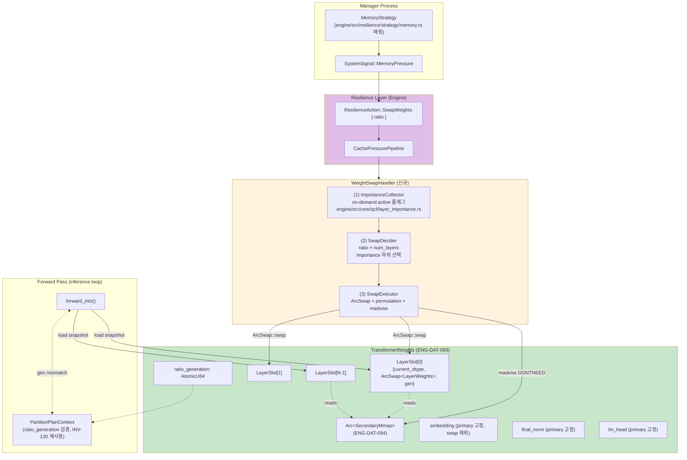

### 1.2 시그널 → Swap 완료 Sequence

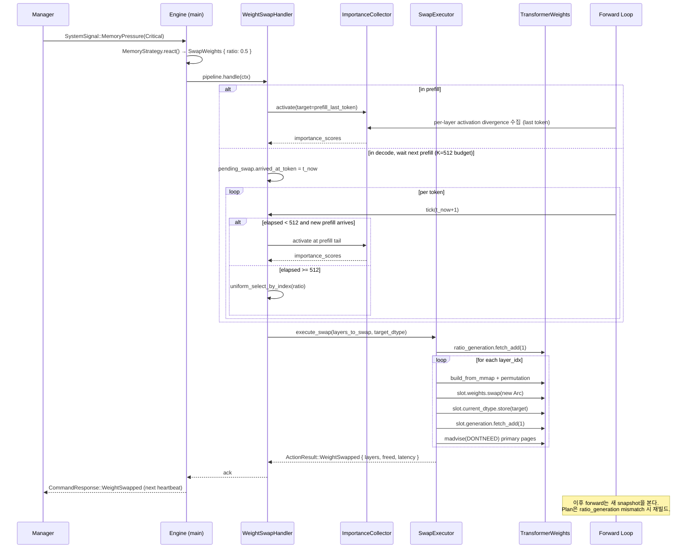

### 1.3 Llama vs Qwen 처리 차이

| 항목 | Llama 3.2 1B | Qwen 2.5 1.5B | 처리 분기 |
|------|--------------|---------------|----------|
| Decoder layer 수 | 16 | 28 | `num_layers`에서 자동 흡수 (ratio 기반) |
| Embedding/lm_head tying | 없음 | 있음 가능 | `LoadConfig`에서 `tie_word_embeddings` 판독, `lm_head` Option 처리 |
| Q/K permutation | GGUF convention | GGUF convention | **공통**, 분기 없음 (gguf.rs:514-534, 677-697) |
| Swap 대상 | decoder block 16개 | decoder block 28개 | `TransformerWeights::layers[i]`만, embedding/lm_head/final_norm은 제외 (ENG-DAT-C11) |
| ratio=0.25 swap 수 | 4 | 7 | `(ratio × num_layers).round()` |
| ratio=0.5 swap 수 | 8 | 14 | |
| ratio=1.0 swap 수 | 16 | 28 | |

**Architectural invariant**: swap 대상은 **decoder block layer만**. 모델별 분기는 `num_layers`와 `lm_head` 유무로 완전 흡수되며, SwapExecutor/SwapDecider 로직 자체는 모델 공통.

### 1.4 Per-token Atomic Snapshot 시점 (ENG-ALG-214-SNAP, INV-121)

Forward pass와 SwapExecutor는 **토큰 경계**에서만 상호작용한다. 토큰 내부에서는 snapshot 교체가 관측되지 않는다.

```mermaid
sequenceDiagram
    participant Fwd as Forward Loop<br/>(forward_into)
    participant Slot as LayerSlot[i].weights<br/>(ArcSwap)
    participant Exec as SwapExecutor
    participant Plan as PartitionPlanContext<br/>(INV-120)

    rect rgb(230, 245, 230)
    Note over Fwd: Token N 시작 — per-token snapshot 획득 (INV-121)
    loop for each layer i
        Fwd->>Slot: load_full() → Arc_old
        Slot-->>Fwd: Arc&lt;LayerWeights_old&gt;
        Fwd->>Slot: current_dtype.load()
        Slot-->>Fwd: DType_old
    end
    Fwd->>Plan: ratio_generation.load() → gen_0
    end

    rect rgb(255, 243, 224)
    Note over Fwd,Exec: Token N 처리 중 — Swap 동시 발생 (mid-token)
    par Forward 진행
        Fwd->>Fwd: layer loop 실행<br/>(Arc_old snapshots 재사용)
    and Swap 실행
        Exec->>Slot: store(Arc&lt;LayerWeights_new&gt;)<br/>「INV-123: 단일 원자 단계」
        Exec->>Slot: current_dtype.store(DType_new)<br/>「INV-124: 동일 논리 단계」
        Exec->>Exec: (batch 계속)
        Exec->>Plan: ratio_generation.fetch_add(1)<br/>「batch 완료 후 1회」
    end
    Note right of Fwd: Token N은 여전히 Arc_old 사용<br/>→ stale 관찰 0건 (INV-121)
    end

    rect rgb(230, 245, 230)
    Note over Fwd: Token N+1 시작 — 새 snapshot 획득
    Fwd->>Slot: load_full() → Arc_new
    Slot-->>Fwd: Arc&lt;LayerWeights_new&gt;
    Fwd->>Plan: ratio_generation.load() → gen_1
    Note right of Plan: gen_1 != gen_0 → PlanInvalidated<br/>plan 재빌드 or forward_gen fallback
    end
```

**핵심 규약**:
- Token 진입 시 `load_full()`을 각 layer에 대해 1회 호출 → `Vec<Arc<LayerWeights>>` 생성. 토큰 내내 이 벡터만 참조한다.
- 같은 토큰 내부에서 `slot.weights.*`를 **다시 읽지 않는다**. Mid-token swap이 발생해도 현재 토큰은 기존 snapshot으로 완주.
- 토큰 경계에서만 새 snapshot이 관측된다. `ratio_generation` 값도 토큰 경계에서 재획득되며, plan 빌드 경로가 이 값으로 stale 판정을 수행한다.

## 2. 컴포넌트 상세

### 2.1 컴포넌트: `LoadConfig` (ENG-DAT-090)

**설계 결정**:
- **이원화된 파일 역할**: `primary_source`는 초기 모든 layer 로딩 소스. `secondary_source`는 **초기 로딩에 사용되지 않는다** — metadata 검증과 `SecondaryMmap` 구축에만 사용되며, 실제 byte 접근은 `SwapExecutor` 런타임 단계에서 처음 발생한다.
- **per_layer_dtype 필드 제거**: 이전 정적 노선의 overlay 필드는 폐기. 런타임 dtype은 `LayerSlot::current_dtype`의 atomic state로 표현된다.
- **secondary None = swap 경로 비활성**: 한 파일만 제공되면 `WeightSwapHandler`는 NoOp. 평시 제로 오버헤드.

**인터페이스**:
```rust
// engine/src/models/loader/mod.rs
pub struct LoadConfig {
    pub primary_source: PathBuf,
    pub default_dtype: DType,
    pub secondary_source: Option<PathBuf>,   // swap reservation only
}
// 전제 (pre): primary_source 존재 확인
// 후조건 (post): secondary_source.is_some() ⇒ TransformerModel.secondary_mmap.is_some() (INV-125)
//                모든 layer의 current_dtype == default_dtype (초기 상태)
```

**구현 전환 일정 (Phase 1 → Phase 2)**:

- **Phase 1 (현재)**: `LoadConfig` struct는 `engine/src/models/loader/mod.rs`에 **선언만** 되어 있으며, 실제 loader 엔트리(`load_gguf_with_secondary` 등)는 여전히 `primary_path: &Path`, `default_dtype: DType`, `Option<&Path>` 를 **낱개 파라미터**로 받는다. 이 shim 시그니처가 Phase 1의 정답이다.
- **Phase 2 WSWAP-2-TRIGGER 커밋 (예정)**: `--force-swap-ratio` CLI 플래그 추가와 동반하여 loader 시그니처를 `pub fn load_model(config: LoadConfig) -> Result<TransformerModel, LoadError>` 단일 엔트리로 **일괄 전환**한다. CLI 파싱 → `LoadConfig` 구성 → `load_model` 호출이 유일한 경로가 된다.
- **이유**: Phase 1에서 시그니처까지 바꾸면 master merge 충돌 표면적이 불필요하게 커진다. struct 선언 + secondary mmap 인프라까지만 마감하고, trigger 커밋에서 한 번에 옮긴다.

---

### 2.2 컴포넌트: `LayerSlot` (ENG-DAT-092)

**설계 결정**:
- **ArcSwap 우선 권장**: `arc_swap::ArcSwap<LayerWeights>`는 lock-free snapshot 교체를 제공. Writer-serialized + reader-wait-free. Mutex 대비 forward hot path에서 zero contention.
- **대안 허용**: `RwLock<Arc<LayerWeights>>` 또는 epoch 기반 custom swap도 INV-121~124 충족 시 허용. **최종 선택은 Senior Implementer PoC에서 decode latency로 결정**.
- **`generation` 필드는 debug/tracing 전용**: forward hot path, plan invalidation, 재진입 판정 등 **정확성 경로에서 절대 참조하지 않는다**. 전역 `TransformerModel::ratio_generation` 하나가 정확성 트리거의 유일한 소스이다 (3-counter 표 참조).

**트레이드오프**:

| 구현 | Reader 비용 | Writer 비용 | 메모리 | 복잡도 |
|------|-------------|-------------|-------|--------|
| `ArcSwap<LayerWeights>` | atomic load + Arc clone (wait-free) | RCU 기반, 느린 edge case 존재 | +1 atomic ptr/slot | 중 (외부 crate 의존) |
| `RwLock<Arc<LayerWeights>>` | read lock + clone | write lock | lock 구조체 | 낮음 (std) |
| Custom epoch | wait-free load | epoch GC 필요 | epoch 추적 | 높음 |

**인터페이스**:
```rust
pub struct LayerSlot {
    pub current_dtype: AtomicDType,          // or AtomicU8 wrapping DType discriminant
    pub weights: ArcSwap<LayerWeights>,      // 권장; 대안 허용
    pub secondary_mmap_handle: Option<Arc<SecondaryMmap>>,
    pub generation: AtomicU64,               // DEBUG/TRACING ONLY (not read by forward/plan)
}
// 전제: weights의 dtype == current_dtype (INV-124 불변)
// 후조건: swap 후 generation += 1 (로그/테스트용), 신규 weights와 current_dtype 원자 단위로 갱신
```

#### 2.2.1 3-counter 관계 (generation counters)

본 설계에는 이름이 비슷한 세 개의 generation counter가 존재한다. 역할을 혼동하면 plan 재빌드가 누락되거나 forward가 stale 상태에 빠질 수 있으므로 아래 표를 단일 근거로 삼는다.

| 카운터 | 스코프 | 증가 주체 | 증가 단위 | 관찰자 | 용도 |
|--------|--------|-----------|-----------|--------|------|
| `LayerSlot::generation` | per-slot | `SwapExecutor` (step c) | slot 단일 swap마다 +1 | tracing/로그/테스트 | **Debug 전용**. 정확성 경로 참조 금지. |
| `TransformerModel::ratio_generation` | global | `SwapExecutor` (step e) | **batch 완료 후 정확히 1회** | Plan 빌드 경로, `PartitionPlanContext` | 전역 plan 재빌드 트리거의 유일한 소스. |
| `PartitionPlanContext::ratio_generation` (INV-120 기존) | plan snapshot | Plan 빌드 시점 | Plan 빌드 시 global 값 캡처 | `PartitionStep::run` | Plan stale 감지. mismatch 시 `PlanInvalidated`. |

**규칙**:
- `SwapExecutor`가 여러 layer를 한 batch로 교체할 때, per-layer loop에서는 `LayerSlot::generation`만 bump하고 전역 counter는 **건드리지 않는다**. batch 전체가 끝난 뒤 **단 한 번** `ratio_generation.fetch_add(1, SeqCst)` 를 호출한다 (ENG-ALG-211 step (e)).
- Forward hot path는 토큰 진입 시 `ratio_generation`을 **읽지 않는다** (per-token snapshot 규약으로 충분하므로). Plan 빌드 시점에만 비교 대상으로 사용된다.

#### 2.2.2 Plan 경로 소비 규약 (Phase 3.5, ENG-ALG-219, ENG-ALG-220, INV-129)

**핵심 변경 (v5, 2026-04-25)**: Phase 3에서 `SwapExecutor`가 `TransformerModel::ratio_generation`을 batch 단위 1회 bump하는 메커니즘은 정의되었으나, **plan 경로의 stale 감지 진입점**은 미정이었다 (Phase 3.5 OOS). v5에서 본 규약을 도입한다.

**규약 4종**:

1. **Build 시 snapshot**: `FullKernelPlan::build()`는 진입 시 `model.ratio_generation.load(Acquire)` 값을 plan struct의 `ratio_generation_at_build: u64` 필드에 기록한다.
2. **Execute 시 1회 비교**: `FullKernelPlan::execute()`는 진입부에서 `model.ratio_generation.load(Acquire)`와 `self.ratio_generation_at_build`를 비교한다. mismatch 시 `Err(PlanError::PlanInvalidated)` 반환.
3. **per-token 비용 = atomic load 1**: 비교는 토큰당 1회. layer 수나 step 수에 무관.
4. **Lazy rebuild + forward_gen fallback**: Caller(`forward_into`)는 `PlanInvalidated` 수신 시 `forward_gen` 경로로 fallback (DF-35-2). 다음 토큰 진입 시 자연 재빌드.

**상호 배타 (DF-35-3)**: weight swap이 활성화된 모델 인스턴스에서는 `FullKernelPlan` 빌드 시 `partition_ctx = None`으로 강제된다. tensor_partition × weight swap은 **상호 배타**이며 동시 활성을 지원하지 않는다.

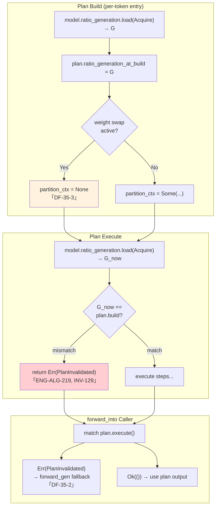

**INV-120과의 OR 결합**:

| 검사 | 위치 | 검사 대상 | trigger 조건 |
|------|------|----------|-------------|
| INV-129 (전역) | `FullKernelPlan::execute()` 진입 1회 | `model.ratio_generation` | weight swap 또는 partition re-prep 모두 |
| INV-120 (per-context) | `PartitionStep::run()` 진입마다 | `PartitionPlanContext.ratio_generation_at_build` | partition re-prep |

두 검사는 **OR 결합**: 어느 하나라도 mismatch면 plan stale로 판정한다. weight swap만 발생한 경우 INV-129가 단독으로 catch (INV-120 컨텍스트는 변하지 않을 수 있음). partition re-prep만 발생한 경우 둘 다 catch (전역 카운터도 bump되므로) — redundancy는 안전 마진.

**ENG-ALG-220 (`entry_ratio_generation` 소비)**:
- `forward_into`는 토큰 진입 시 `entry_ratio_generation = model.ratio_generation.load(Acquire)`를 1회 capture (INV-121 per-token snapshot과 동일 시점).
- 동일 토큰 내 plan 빌드 시 이 값을 plan에 전달 → `plan.ratio_generation_at_build = entry_ratio_generation`.
- Mid-token swap이 발생해도 현재 토큰의 plan은 snapshot 값으로 비교한다 → mismatch catch → `forward_gen` fallback. layer Arc snapshot도 INV-121에 의해 토큰 내 재사용되므로 stale weights 노출 0건.

**스펙 cross-ref**:
- ENG-ALG-219: `FullKernelPlan` 진입 1회 atomic load 비교.
- ENG-ALG-220: `entry_ratio_generation` 캡처 + plan 전달 의무.
- INV-129: 전역 plan stale 감지 불변식.
- INV-120: per-partition stale (별도, OR 결합).
- INV-121: per-token forward snapshot (layer Arc).

#### 2.2.3 Noshuffle SOA Registry Coherence (Phase 3.6, ENG-ALG-221, INV-130)

**핵심 변경 (v6, 2026-04-25)**: Phase 3.5의 plan invalidation은 `FullKernelPlan` 메타데이터의 stale 감지를 다루지만, **GPU 백엔드 내부의 layer-별 캐시 자료구조**는 별개 경로로 stale 상태가 된다. Q4_0 weight swap 시 `OpenCLBackend::noshuffle_soa_registry`(cl_mem 주소 key의 HashMap)는 `SwapExecutor`에 의해 갱신되지 않으므로 **silent correctness bug**의 원인이 된다. v6에서 본 규약을 도입한다.

**문제 정의**:
- `OpenCLBackend::noshuffle_soa_registry`는 `cl_mem` 포인터 주소를 key로 하는 `HashMap`이다. 각 entry는 Q4_0 layer weight tensor의 SOA(structure-of-arrays) 디스크립터를 보관한다 (`engine/src/backend/opencl/mod.rs`의 registry 정의 참조).
- Q4_0 weight tensor가 `ArcSwap::store`로 교체되면 새 `cl_mem`이 할당된다. 옛 cl_mem은 drop되며 주소는 재사용 가능 풀로 돌아간다.
- `SwapExecutor`가 SOA registry를 invalidate하지 않으면, 옛 주소 key의 entry는 **stale**이다. 새 cl_mem과 매칭되는 SOA descriptor가 없거나, 주소 재사용 시 잘못된 SOA descriptor가 매칭될 위험이 있다.
- 호스트 환경: OpenCL backend가 비활성이거나 SOA registry가 비어 있어 발현 안 됨 → **device-only silent correctness bug**.
- `OpenCLBackend::clear_noshuffle_soa_registry()` 헬퍼는 이미 `engine/src/backend/opencl/mod.rs`에 존재한다. 본 규약은 이를 SwapExecutor 경로에 연결하는 것이다.

**규약 4종**:

1. **Invalidate 시점**: `SwapExecutor::execute_swap`의 batch 종료 직후, `model.ratio_generation.fetch_add(1, SeqCst)`(ENG-ALG-211 step (e))과 동일 단계에서 SOA registry invalidate를 수행한다. 순서는 SOA invalidate → ratio_generation bump 또는 그 반대 모두 허용 (둘 다 batch 후 수행되며 forward는 다음 토큰 경계부터 새 snapshot을 본다).
2. **Invalidate 단위 선택**: 전체 `clear_noshuffle_soa_registry()` 호출 또는 per-layer key 기반 제거 중 택일. Phase 3.6 구현 시 측정 기반 결정 (DF-36-2 참조).
3. **빈 결과 처리**: swap 결과가 비어 있는 경우 (`swapped.is_empty()`) SOA invalidate도 생략. `ratio_generation` bump 생략 규약(ENG-ALG-211)과 동일 분기.
4. **자연 재등록**: invalidate 이후 다음 forward에서 plan rebuild가 트리거되며(ENG-ALG-219로 PlanInvalidated 또는 forward_gen fallback), GPU matmul 경로가 새 cl_mem 주소로 SOA descriptor를 자연 재등록한다. SwapExecutor는 사전 등록을 시도하지 않는다.

**구현 전략 트레이드오프**:

| 전략 | 동작 | 장점 | 단점 |
|------|------|------|------|
| **전체 clear** (권장 default) | `backend.clear_noshuffle_soa_registry()` 1회 호출 | 단순. 1줄 추가. correctness 명확. SwapExecutor가 layer별 cl_mem 주소를 알 필요 없음. | 비-swap layer의 SOA descriptor도 비워져 첫 forward에서 모든 layer 재등록 비용 발생. ratio < 1.0 시 일부 비효율. |
| **Per-layer key 제거** | 교체된 layer의 옛 cl_mem 주소 목록을 swap 직전 수집 → swap 후 `HashMap::remove()` | 비-swap layer 영향 0. 첫 forward 재등록 비용 최소. | 옛 cl_mem 주소 수집 로직 필요. SwapExecutor가 backend 내부 자료구조에 더 깊이 결합. |

**선택 근거 (Phase 3.6 진입 시)**: 대부분 ratio (0.25/0.5)에서 swap 직후 첫 decode는 어차피 plan rebuild를 거치므로 **전체 clear**가 추가 비용 거의 없이 단순한 정답이다. ratio=0.25에서 비-swap layer 75%의 SOA 재등록 비용이 측정상 유의미할 때만 per-layer 전략을 검토한다. 결정은 디바이스(S25, Adreno 830)에서 logit NMSE 정확성과 swap-직후 TBT 두 메트릭으로 한다.

**Mermaid 처리 흐름**:

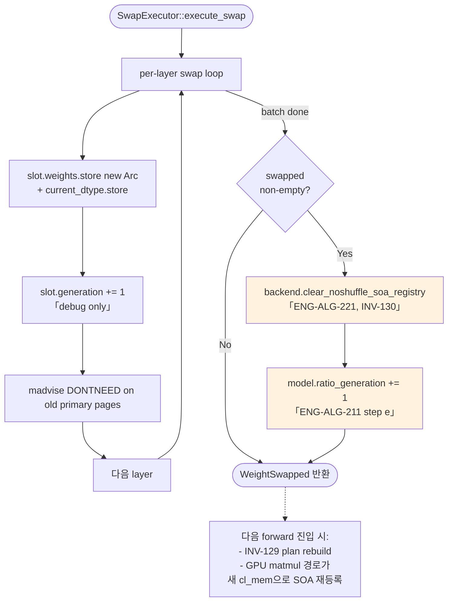

**예외 처리**:

| 조건 | 처리 |
|------|------|
| `noshuffle_soa_registry`가 빈 상태 (호스트 환경 등) | clear는 NoOp, panic 없음. spec test에서 빈 registry clear 안전성을 검증. |
| `clear_noshuffle_soa_registry()` 자체가 panic 위험 | 없음 — `HashMap::clear()` 기반의 단순 작업. lock 충돌 시에도 deadlock 가능성 없음(SwapExecutor는 forward와 토큰 경계로 분리). |
| Swap 결과 빈 (전 layer skip) | SOA clear도 생략. 불필요한 cache invalidation 회피. |

**호스트 vs 디바이스 관측 가능성**:

| 환경 | SOA registry 상태 | 위반 시 결과 | 검증 방법 |
|------|------------------|-------------|----------|
| 호스트 (NVIDIA OpenCL 또는 CPU only) | 비어 있거나 사용 안 됨 | 발현 안 됨 — silent fallback | spec test로 "registry 비어 있을 때 clear 안전" 정도만 검증 |
| 디바이스 (S25, Adreno 830) | 채워져 있음 | swap 직후 첫 decode가 garbage logits 생성 | 디바이스 실측: swap 후 logit NMSE / top-1 match (INV-122 sweep과 통합) + 수동 검증 |

**결정 플래그 (DF-36-1, DF-36-2)**:

| ID | 결정 | 채택안 | 근거 |
|----|------|--------|------|
| **DF-36-1** | Invalidate 시점 | SwapExecutor batch 종료 직후 (ratio_generation bump와 동일 단계) | 단일 진입점. forward와 시간적으로 분리되어 race 없음. |
| **DF-36-2** | Invalidate 단위 | **전체 clear 권장 default**, per-layer는 측정 기반 선택지 | 대부분 ratio에서 plan rebuild가 어차피 발생. 단순성 우선. |

**스펙 cross-ref**:
- ENG-ALG-221: SwapExecutor batch 종료 후 SOA registry invalidate 알고리즘.
- INV-130: 전역 SOA registry coherence 불변식 (디바이스 한정).
- ENG-ALG-211: SwapExecutor batch 흐름 (step (e) ratio_generation bump와 동일 단계).
- ENG-ALG-219 / INV-129: 다음 forward의 plan rebuild가 자연 재등록 경로를 트리거.
- `OpenCLBackend::noshuffle_soa_registry` (engine/src/backend/opencl/mod.rs).
- `OpenCLBackend::clear_noshuffle_soa_registry()` (engine/src/backend/opencl/mod.rs, 기존 헬퍼).

---

### 2.3 컴포넌트: Swap 필드는 `TransformerModel`의 flat 배치 (ENG-DAT-093)

**설계 결정 (2026-04-24 확정)**:
- **별도의 `TransformerWeights` wrapper struct를 두지 않는다.** Swap 관련 필드는 모두 `TransformerModel`(`engine/src/models/transformer.rs`)의 flat 멤버로 배치한다.
- 근거: `TransformerModel`은 이미 embedding/final_norm/lm_head를 자체 필드로 보유한다. 독립 struct로 묶을 경우 **이중 소유 또는 중복 필드**가 발생한다. Phase 1 구현에서 이를 회피하기 위해 `engine/src/models/weights/transformer_weights.rs`에 `TransformerWeights` struct를 선언만 해 두었으나 **실사용처가 0**이다 — 죽은 추상화이다.
- Phase 2 구현 진입 시 `engine/src/models/weights/transformer_weights.rs` 파일 및 `mod.rs`의 pub re-export를 제거한다. 이름 `TransformerWeights`는 폐기되며, **식별자 `ENG-DAT-093`은 본 flat 배치로 의미 승계**된다.
- **Cross-layer tensor 분리**: embedding/final_norm/lm_head는 `TransformerModel`의 기존 필드 그대로 사용. Swap 대상이 아니므로 `LayerSlot` 래핑 불필요.
- **secondary_mmap은 최후 소유권**: `TransformerModel`이 `Arc<SecondaryMmap>`의 "keeper". 모든 `LayerSlot::secondary_mmap_handle`은 여기서 clone된 Arc를 공유. INV-125를 구조적으로 보장.
- **ratio_generation은 Plan 재빌드 트리거의 단일 소스**: 기존 `PartitionPlanContext::ratio_generation`(INV-120)과 **의미 통합**. Plan stale 감지 메커니즘 단일화.

**실구조 (Phase 1 구현 반영)**:
```rust
// engine/src/models/transformer.rs
pub struct TransformerModel {
    // 기존 필드 (재사용)
    pub embedding: Arc<Tensor>,
    pub final_norm: Arc<Tensor>,
    pub lm_head: Option<Arc<Tensor>>,

    // Phase 1에서 추가된 swap 필드 (ENG-DAT-093 대응)
    pub layers: Vec<LayerSlot>,
    pub secondary_mmap: Option<Arc<SecondaryMmap>>,
    pub ratio_generation: AtomicU64,

    // ... 기타 기존 필드 ...
}
```

**구조 다이어그램**:

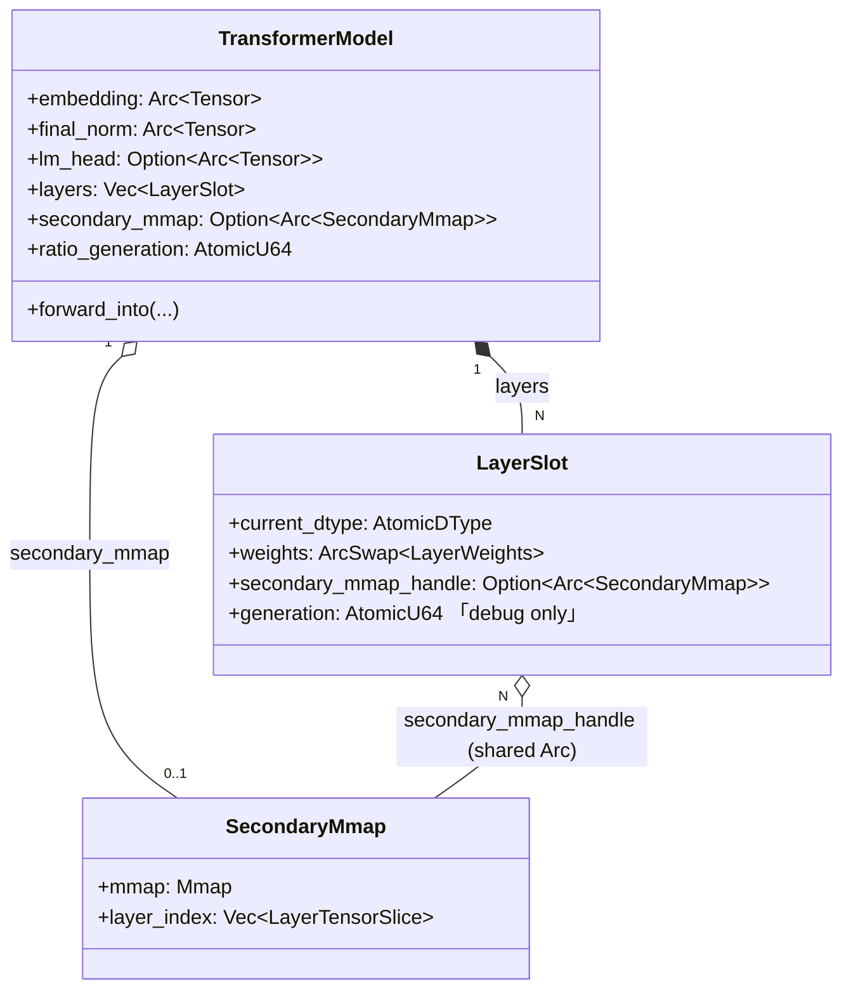

**코드-스펙 차이 / Phase 1 구현 현황**:

| 항목 | 상태 | 조치 |
|------|------|------|
| `TransformerModel`에 `layers: Vec<LayerSlot>`, `secondary_mmap`, `ratio_generation` flat 필드 | 구현 완료 | 유지 |
| `engine/src/models/weights/transformer_weights.rs`의 `TransformerWeights` struct | 죽은 선언 (미사용) | **Phase 2 구현 진입 시 파일 및 pub re-export 삭제** (코드 수정은 Implementer 담당) |
| `mod.rs`의 `pub use transformer_weights::*` | 미사용 re-export | Phase 2에서 함께 제거 |

---

### 2.4 컴포넌트: `SecondaryMmap` (ENG-DAT-094)

**설계 결정**:
- **Read-only mmap**: `memmap2::Mmap` (아님 `MmapMut`). 파일은 절대 수정 대상 아님.
- **Layer tensor 인덱스 사전 구축**: open 시 GGUF header 1회 파싱으로 `layer_index: Vec<LayerTensorSlice>` 완성. 이후 lookup은 O(1).
- **Lazy 접근**: mmap은 열려있지만 page-in은 커널이 first-touch 시 수행. `SwapExecutor` 첫 호출 시 IO가 발생.
- **Swap 범위: decoder block layer로 고정**: embedding / final_norm / lm_head 등 cross-layer tensor는 swap 대상이 아니므로 `SecondaryMmap`도 이에 대한 offset 정보를 **보관하지 않는다**. 메타데이터 정합성은 loader가 open 시점에 로컬 변수로 확인하고 폐기한다.

**인터페이스**:
```rust
pub struct SecondaryMmap {
    pub mmap: memmap2::Mmap,
    pub layer_index: Vec<LayerTensorSlice>,   // indexed by layer_idx, length == num_layers
    // (cross_layer_offsets 필드는 제거됨 — Phase 1에서 populate만 되고 read 경로 없음)
}
pub struct LayerTensorSlice {
    pub tensors: HashMap<String /* subname */, (u64 /* offset */, u64 /* len */, DType, Vec<usize> /* shape */)>,
}
```

**코드-스펙 차이 / Phase 1 구현 현황**:

| 항목 | 상태 | 조치 |
|------|------|------|
| `mmap`, `layer_index`, `metadata` 필드 | 구현 완료 | 유지 |
| `cross_layer_offsets: HashMap<String, (u64, u64, DType)>` 필드 | **Phase 1에서 populate만 되고 read 경로 0** | **Phase 2 구현 진입 시 필드 및 채우는 코드 삭제** (코드 수정은 Implementer 담당). 향후 non-layer tensor swap 필요 시 별도 신규 필드/ID로 재도입. |

---

### 2.5 컴포넌트: `WeightSwapHandler` (ENG-ALG-214)

**설계 결정**:
- **`CachePressureHandler` 구현**: 기존 pipeline trait을 준수하여 `CachePressurePipeline`에 등록 가능. KV `SwapHandler`(ENG-ALG-092)와 **독립 handler**로 나란히 동작.
- **HandlerContext 확장**: `swap_weights_ratio: Option<f32>` 필드 추가. Pipeline이 Resilience에서 받은 ratio를 context에 주입.
- **측정-결정-실행 3단계**: (1) ImportanceCollector 활성화/결과 수신, (2) SwapDecider, (3) SwapExecutor. 각 단계는 분리된 struct로 테스트 용이성 확보.

**인터페이스**:
```rust
pub struct WeightSwapHandler {
    weights: Arc<TransformerWeights>,
    collector: Arc<Mutex<ImportanceCollector>>,  // on-demand active 플래그 포함
    already_swapped: Mutex<HashSet<usize>>,
    pending_swap: Mutex<Option<PendingSwap>>,
    fallback_k: u64,   // default 512
}

impl CachePressureHandler for WeightSwapHandler {
    fn handle(&self, ctx: &mut HandlerContext) -> ActionResult {
        let Some(ratio) = ctx.swap_weights_ratio else { return ActionResult::NoOp };
        // ImportanceCollector 활성화 or wait next prefill or uniform fallback
        // SwapDecider → SwapExecutor
    }
}
```

---

### 2.6 컴포넌트: `ImportanceCollector` on-demand 확장

**설계 결정**:
- **기존 코드 재사용**: `engine/src/core/qcf/layer_importance.rs`의 `ImportanceCollector`/`ImportanceTable` 그대로 사용.
- **`active: AtomicBool` 플래그 추가**: 기본값 `false`. Hot path에서 `active.load(Relaxed)` 한 번으로 조기 반환하여 **평시 제로 오버헤드** 달성.
- **Prefill-tail 측정**: `active == true`이고 현재 토큰 == `tail_target_token`일 때만 divergence 수집.

**처리 흐름**:

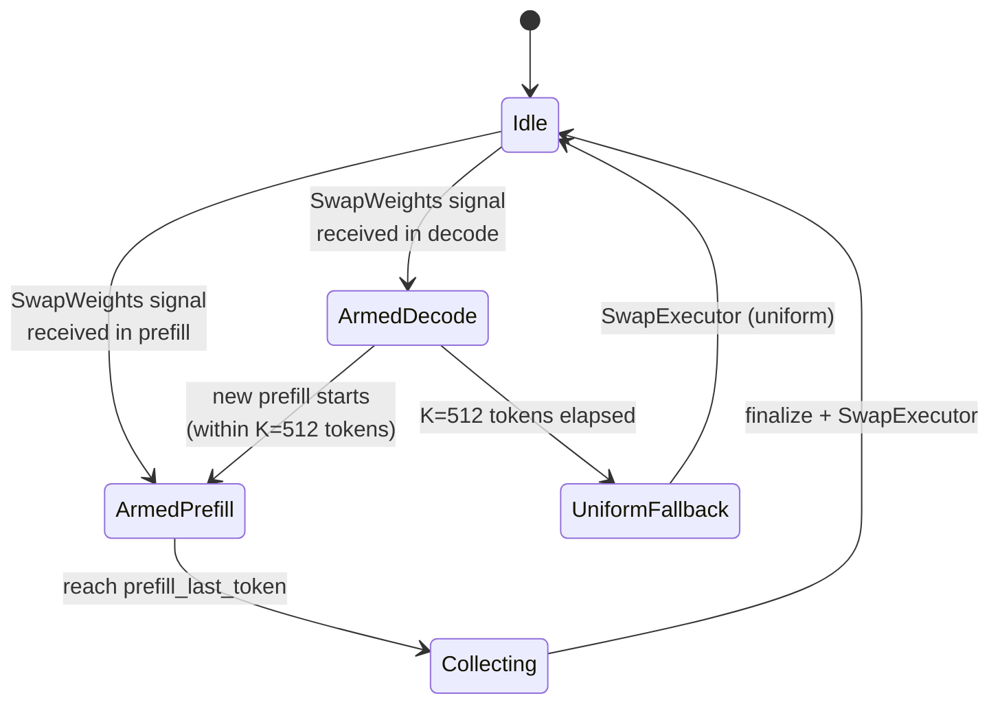

---

### 2.7 컴포넌트: `SwapExecutor` (ENG-ALG-211)

**설계 결정**:
- **Per-layer 순차 실행**: 병렬 swap은 madvise 힌트 충돌과 IO 스파이크 우려로 배제. 순차가 총 latency에 더 유리 (측정으로 재확인).
- **Q/K permutation 재사용**: primary loader의 permutation 함수를 `SwapExecutor`가 직접 호출. dtype에 무관하므로 분기 없음.
- **madvise 2단계**: step (c) `ArcSwap::store` 직후 old Arc에 잡힌 primary 페이지 힌트 전달. old가 forward에 잡혀 있으면 drop까지 지연되며, 최종 회수는 커널 판단.
- **`ratio_generation` bump는 batch 단위 1회**: per-layer loop 내부에서는 `LayerSlot::generation`(debug 전용)만 증가시키고, batch 전체 swap이 끝난 뒤 `TransformerModel::ratio_generation.fetch_add(1, SeqCst)` 를 **정확히 1회** 호출한다. 이 한 번의 bump가 plan invalidation의 유일한 trigger이다 (INV-120, 3-counter 표 참조).

**처리 흐름**:


**예외 처리**:

| 조건 | 처리 | 스펙 |
|------|------|------|
| `secondary_mmap == None` | NoOp 반환 | ENG-DAT-C09 |
| layer_idx 범위 밖 | skip (NoOp for that layer) | ENG-DAT-C08 |
| 이미 swap된 layer | skip | ENG-ALG-211 |
| permutation 실패 | panic (logic bug) | — |
| madvise EINVAL | 로그 후 계속 (수치 결과는 유지) | ENG-ALG-C05 |
| batch swap 결과가 비어있음 (전 layer skip) | `ratio_generation` **bump 생략** | ENG-ALG-211 |

---

### 2.8 컴포넌트: `ResilienceAction::SwapWeights` (engine 내부) vs `EngineCommand::SwapWeights` (shared)

**중요 정정 (2026-04-24 v4)**: 이전 arch 초안은 `ResilienceAction`을 shared crate의 enum으로 서술했으나, 실구조는 **engine 내부 enum**이다 (`engine/src/resilience/strategy/mod.rs`). Phase 3에서 Manager 통합은 **shared의 `EngineCommand` enum에 variant를 추가**하는 별개 경로로 수행된다.

**두 경로의 구분**:

| 타입 | 위치 | 역할 | Phase 3 처리 |
|------|------|------|-------------|
| `ResilienceAction::SwapWeights { target_ratio }` | `engine/src/resilience/strategy/mod.rs` (내부 enum) | Engine 내부 `MemoryStrategy::react()`가 Manager 없이 생성하는 fallback action | **Phase 3 신규 variant로 추가 권장** (Phase 2 범위에선 미추가). dispatch는 최종적으로 Phase 3의 공통 helper로 귀결. shared 프로토콜과 무관. |
| `EngineCommand::SwapWeights { ratio, target_dtype }` | `shared/src/lib.rs` (프로토콜 enum) | Manager → Engine IPC payload | **MSG-042로 정의**. shared crate에 필수 추가. |

**설계 결정**:

- **ENG-ALG-214-ROUTE**: `generate.rs` dispatch 루프에 단일 `handle_swap_weights(ratio, target_dtype)` 함수를 추가한다. 두 진입점(shared `EngineCommand` / engine internal `ResilienceAction`)이 이 함수를 공유한다.
- **MemoryStrategy 기본 매핑 (engine-internal fallback)**:
  - `MemoryPressure::Critical → ResilienceAction::SwapWeights { target_ratio: 0.5, target_dtype: Q4_0 }`
  - `MemoryPressure::Emergency → ResilienceAction::SwapWeights { target_ratio: 1.0, target_dtype: Q4_0 }`
  - 이는 **Manager가 응답 지연 시**의 engine-independent fallback용이다. Manager가 활성화되면 Manager의 LuaPolicy 결정이 우선한다 (더 최신 signal).
- **프로토콜 호환성**: shared 쪽 신규 필드는 `#[serde(default, skip_serializing_if = "Option::is_none")]` 원칙(INV-028) 준수. 구 Manager는 `layer_swap`/`weight_swap_report`를 모르는 상태로도 동작 가능.

**인터페이스 (shared, MSG-042/082/089)**:
```rust
// shared/src/lib.rs
#[derive(Serialize, Deserialize, Debug, Clone, Copy, PartialEq, Eq)]
#[serde(rename_all = "snake_case")]
pub enum DtypeTag {
    Q4_0,
    F16,
    F32,
    Q8_0,
}

pub enum EngineCommand {
    // ... 기존 14 variant ...
    SwapWeights { ratio: f32, target_dtype: DtypeTag },
}

pub enum EngineMessage {
    // ... 기존 4 variant ...
    WeightSwapReport(WeightSwapReport),
}
```

**인터페이스 (engine 내부, Phase 3 권장 신규)**:
```rust
// engine/src/resilience/strategy/mod.rs
pub enum ResilienceAction {
    // ... 기존 variant ...
    SwapWeights { target_ratio: f32, target_dtype: DtypeTag },  // DtypeTag는 shared에서 re-export
}
```

---

### 2.9 컴포넌트: Manager 측 SwapWeights 통합 (lua_policy 직접 매핑 + hierarchical ActionId 경로)

**설계 결정**: SwapWeights는 Manager에서 두 경로로 노출된다. 두 경로는 **동일한 IPC 명령**(`EngineCommand::SwapWeights { ratio, target_dtype }`)을 산출하지만 산출 단계와 정책 표면이 다르다. spec/23-manager-data.md MGR-DAT-040의 카탈로그가 두 경로에 대한 단일 진실원이다.

| 경로 | 정의 위치 | 트리거 단계 | 정책 표면 | spec ID |
|------|-----------|------------|-----------|---------|
| **Lua 직접 매핑** (default) | `manager/src/lua_policy.rs::parse_single_action` "swap_weights" + `action_to_str` | Lua `decide()` 반환 테이블의 entry → 즉시 EngineCommand 변환 | `policy_default.lua` 내 lua 코드 | MGR-049, MGR-090 |
| **Hierarchical ActionId** | `manager/src/types.rs::ActionId::SwapWeights` + ActionRegistry + parametrize + ActionCommand→EngineCommand 변환 | ActionSelector(MGR-ALG-030~037) → ActionCommand → EngineCommand | TOML `[policy.actions.swap_weights]` + parametrize 선형 보간 | MGR-DAT-040, MGR-DAT-054, MGR-ALG-036 |

**왜 두 경로가 공존하는가**:
- LuaPolicy(MGR-049)가 2026-04부터 default 정책 엔진이므로 lua_policy의 직접 매핑은 production hot path다.
- HierarchicalPolicy(MGR-040~042)는 `--policy-engine hierarchical`로 선택되며, ActionRegistry/ReliefEstimator/ActionSelector를 거치는 학습형 경로다.
- 두 경로는 정책 결정 알고리즘이 다르지만 IPC 출력 형태는 동일해야 한다(shared `EngineCommand::SwapWeights`만이 Engine과의 계약). Manager 코드 변경 시 두 경로를 항상 함께 점검한다.

**정합 규칙**:
1. **명령 동등성**: 동일 ratio·target_dtype 입력에 대해 두 경로가 산출하는 `EngineCommand::SwapWeights`는 비트 단위로 동일해야 한다. `target_dtype`은 현재 `Q4_0` 고정(다른 dtype은 lua_policy가 거부, hierarchical에서도 동일 거부 정책 적용).
2. **Ratio clamp 일치**: lua_policy.rs에서 ratio > 0.9를 0.9로 clamp + 경고 로그(arch §2.8 ENG-ALG-214-ROUTE 정합). hierarchical 경로의 ParamRange(min=0.0, max=0.9, MGR-DAT-056)와 같은 상한이 적용된다. `parametrize`(MGR-ALG-035)가 [0.0, 0.9] 외 값을 산출할 수 없으므로, hierarchical 경로는 추가 clamp가 불필요하지만 변환 단계에서 안전 마진으로 한 번 더 clamp(MGR-ALG-036).
3. **카탈로그 동기화**: 새 ActionId variant 추가/제거 시 다음 6 지점을 항상 함께 갱신:
   - `manager/src/types.rs` ActionId enum (`hierarchical_types` 모듈) — 변형, `from_str`, `all`, `primary_domain`
   - `manager/src/action_registry.rs::default_param_range`
   - `manager/src/relief/linear.rs::action_to_key`, `default_relief`
   - `manager/src/lua_policy.rs::action_to_str`, `parse_single_action`
   - `spec/23-manager-data.md` MGR-DAT-040, MGR-DAT-054, MGR-DAT-056, MGR-DAT-060
   - `spec/22-manager-algorithms.md` MGR-ALG-035 parametrize 표, MGR-ALG-036 변환 표
4. **FeatureVector 인덱스**: 현재 FEATURE_DIM=13에는 SwapWeights 활성 인덱스가 없다(MGR-DAT-046 인덱스 7~12). 본 항목은 **호환성 보존**을 위해 v1에서 추가하지 않는다. 신규 ACTIVE_SWAP_WEIGHTS 인덱스를 도입하면 FEATURE_DIM 변경 → ReliefEstimator의 모든 LinearModel weight 차원 변경 → 기존 영속화 모델 invalid가 되므로, 도입은 별도 spec 변경(MGR-DAT-046, INV-046~049)을 거친다. v1에서는 SwapWeights 활성 정보를 ACTIVE_KV_QUANT(idx=12) 등에 우회 매핑하지 않는다(의미 충돌). 이로 인해 ReliefEstimator는 SwapWeights에 대해 활성/비활성 신호를 학습 입력으로 받지 못한다 — cold-start prior(MGR-DAT-060)에 의존하며 observe()는 정상 동작한다(상태 벡터에서 swap-specific 신호만 비어 있을 뿐).

**Mermaid: 두 경로 비교**:

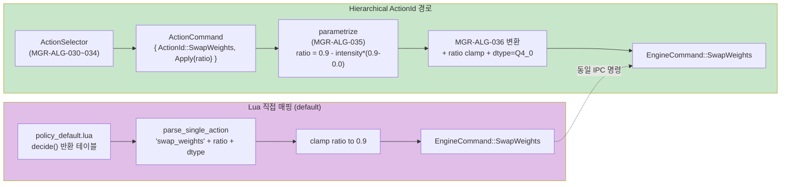

**제약 / 미해결 항목**:
- `target_dtype` 다중 지원 (F16↔Q4_0↔Q8_0 동적 선택)은 v1 범위 외. 추후 lua_policy + hierarchical 양쪽에서 동일 enum 표면을 추가할 때 함께 진행한다.
- ActiveSwapWeights feature index 추가가 필요해지면 MGR-DAT-046 + ReliefEstimator 영속화 마이그레이션을 함께 spec한다(별도 작업).

---

## 3. Config / CLI

| 키/플래그 | 타입 | 기본값 | spec 근거 |
|-----------|------|--------|-----------|
| `--model-path` | String | (기존) | ENG-DAT-070 |
| `--model-path-secondary` | `Option<String>` | None | ENG-DAT-090 |
| `--force-swap-ratio` | `Option<f32>` | None | Debug hook. Manager 없이 prefill 종료 시 `SwapWeights { ratio }` 직접 트리거. |

---

## 4. 테스트 요구사항

| 테스트 대상 | 위치 | 스펙 |
|-------------|------|------|
| LoadConfig secondary reservation | `engine/tests/spec/test_eng_dat_090_load_config.rs` | ENG-DAT-090 |
| LayerSlot atomic swap | `engine/tests/spec/test_eng_dat_092_layer_slot.rs` | ENG-DAT-092, INV-124 |
| TransformerWeights 구조 | `engine/tests/spec/test_eng_dat_093_transformer_weights.rs` | ENG-DAT-093 |
| SecondaryMmap layer index | `engine/tests/spec/test_eng_dat_094_secondary_mmap.rs` | ENG-DAT-094 |
| 초기 uniform 로딩 | `engine/tests/spec/test_eng_alg_210_initial_load.rs` | ENG-ALG-210 |
| SwapExecutor end-to-end | `engine/tests/spec/test_eng_alg_211_swap_executor.rs` | ENG-ALG-211 |
| ImportanceCollector on-demand 활성화 + K=512 fallback | `engine/tests/spec/test_eng_alg_212_importance_activation.rs` | ENG-ALG-212 |
| SwapDecider ratio 계산 + already_swapped 제외 | `engine/tests/spec/test_eng_alg_213_swap_decider.rs` | ENG-ALG-213 |
| WeightSwapHandler 통합 (manual trigger) | `engine/tests/spec/test_eng_alg_214_weight_swap_handler.rs` | ENG-ALG-214 |
| Forward 재진입 안전성 (stress 10K+) | `engine/tests/spec/test_inv_121_swap_reentrancy.rs` | INV-121 |
| Mixed precision 정확성 (Llama + Qwen, ratio 0.25/0.5/1.0, **단일-token 단위, v2.1**) | `engine/tests/spec/test_inv_122_mixed_precision.rs` | INV-122 (§3.12.6 v2.1) |
| ArcSwap atomicity (lock-free reader/writer) | `engine/tests/spec/test_inv_123_swap_atomicity.rs` | INV-123 |
| LayerSlot current_dtype 일관성 | `engine/tests/spec/test_inv_124_slot_dtype_consistency.rs` | INV-124 |
| SecondaryMmap lifetime 보장 | `engine/tests/spec/test_inv_125_secondary_mmap_lifetime.rs` | INV-125 |
| SwapWeights serde round-trip | `shared/tests/spec/test_msg_080_swap_weights.rs` | MSG-080 |
| EngineCommand SwapWeights 처리 | `shared/tests/spec/test_msg_081_swap_cmd.rs` | MSG-081 |
| ActionId::SwapWeights 카탈로그 정합 (from_str/all/primary_domain) | `manager/tests/spec/test_mgr_dat_040_action_id_catalog.rs` | MGR-DAT-040 |
| ActionRegistry default_param_range/default_relief에 swap_weights 포함 | `manager/tests/spec/test_mgr_dat_054_swap_weights_meta.rs` | MGR-DAT-054, MGR-DAT-056, MGR-DAT-060 |
| Lua/hierarchical 경로 EngineCommand 동등성 | `manager/tests/spec/test_swap_weights_dual_path_equivalence.rs` | arch/weight_swap.md §2.9 |

---

## 5. Phase 실측 계획 (Llama + Qwen)

| 메트릭 | Llama 3.2 1B | Qwen 2.5 1.5B | 측정 도구 |
|--------|--------------|---------------|----------|
| PSS 감소 (ratio=0.25) | target ≥ 6% | target ≥ 6% | /proc/self/smaps_rollup |
| PSS 감소 (ratio=0.5) | target ≥ 12% | target ≥ 12% | |
| PSS 감소 (ratio=1.0) | target ≥ 25% | target ≥ 25% | |
| Swap latency (per layer) | < 50 ms | < 50 ms | ActionResult::WeightSwapped.latency_ms |
| TBT 증가 (swap 직후 토큰) | < 20% | < 20% | `Decode: X ms/tok` 로그 |
| INV-122 충족 여부 | pass | pass | test_inv_122_mixed_precision.rs |

실측 환경: Galaxy S25 (Android), OpenCL backend. `run_device.py -d s25` 경유. 6T 스레드 설정.

### 5.1 INV-122 정확성 측정 방법론 (Phase 4 정립 → Phase 5 Sprint A 단위 고정, 2026-04-26)

INV-122 (`spec/32-engine-algorithms.md` §3.12.6 v2.1)의 두 조건을 측정하는 표준 방법론. Phase 4 측정 결과(`results/data/weight_swap/phase_4_accuracy.md`)에서 정립, Phase 5 Sprint A(`results/data/weight_swap/phase_5_accuracy_sweep.md`) 진단으로 측정 단위가 단일-token으로 명시 고정됨.

#### 5.1.0 측정 단위 — 단일-token next-token logit (v2.1 핵심)

INV-122의 모든 임계값(NMSE, Δ Top-1)은 **prefill 종료 직후의 첫 next-token logit 1개**에 대해 측정된다. Decode loop(32-token greedy continuation 등)는 본 게이트의 측정 범위에 포함되지 않으며 §5.1.5의 보조 sanity로만 활용된다.

이 결정의 배경은 §5.1.8에 기록된다. 핵심 요약:
- Phase 5 Sprint A에서 32-token decode 누적 drift로 ratio=0.25에서도 Δtop-1=44.85pp 관측 — 단일 token 분기의 누적 효과로 임계값이 비현실적으로 부풀려짐.
- 정확성 회귀(garbage 출력, 무한 반복) 0건 — 측정 단위 자체의 미스매치이지 swap/AUF 구현 회귀가 아님.
- 단일-token 단위는 swap이 단일 forward step에서 추가 손실을 만들지 않음을 검증하는 INV-122의 책임 범위와 정확히 일치한다.

#### 5.1.1 측정 baseline 두 가지

모든 baseline 비교는 단일-token logit(§5.1.0) 단위로 수행된다.

| Baseline | 사용처 | 의미 |
|----------|--------|------|
| **Primary single-precision** (e.g. F16) | 단일-token NMSE 측정 (조건 1) | swap이 logit value scale을 망가뜨리지 않는지 확인. ratio 전 영역에서 절대값 ≤ 0.01 강제. |
| **Secondary dtype 단독 (Q4_0 baseline)** | 단일-token Δ Top-1 측정 (조건 2, ratio=1.0 한정) | swap이 양자화 본질 노이즈 외 추가 ranking 변동을 발생시키지 않는지 확인. mixed=full swap이 single-dtype 단독 로드와 (보호 layer 차이를 제외하면) 사실상 동등해야 함. |

Q4_0 baseline은 `--model-path <q4_0.gguf>` 단독 로드(`--secondary-source` 없음)로 같은 prompt set을 돌려 얻는다.

#### 5.1.2 측정 절차 (Llama 3.2 1B 기준, 단일-token)

각 run은 prefill 종료 직후 **첫 next-token logit 1개**만 추출한다. decode loop가 활성화된 자동화 스크립트라도 INV-122 게이트 판정은 첫 token logit만 사용한다.

```mermaid
flowchart LR
    PROMPTS[100 prompt set<br/>QA + SYN + NIAH + PPL + MED + SHORT]
    REF[F16 ref run<br/>--model-path f16.gguf<br/>prefill only<br/>extract first logit]
    Q4REF[Q4_0 baseline run<br/>--model-path q4_0.gguf<br/>prefill only<br/>extract first logit]
    SWAPS[ratio R ∈ {0.25, 0.5, 0.75, 1.0}<br/>--model-path f16.gguf<br/>--secondary-source q4_0.gguf<br/>--force-swap-ratio R<br/>prefill only<br/>extract first logit]

    PROMPTS --> REF
    PROMPTS --> Q4REF
    PROMPTS --> SWAPS

    REF -->|first logit topK| AGG[Aggregate per prompt × ratio:<br/>top-1 match @ first token,<br/>NMSE proxy @ first logit]
    Q4REF -->|first logit topK| AGG
    SWAPS -->|first logit topK| AGG

    AGG --> COND1{single-token<br/>NMSE ≤ 0.01?<br/>「조건 1, 절대값」}
    AGG --> COND2{single-token<br/>Δ Top-1 ≤ 1 pp<br/>at ratio=1.0?<br/>「조건 2, vs Q4 baseline」}

    COND1 -- Pass --> PASS[INV-122 PASS]
    COND2 -- Pass --> PASS
    COND1 -- Fail --> FAIL_NMSE[swap이 logit value scale 손상]
    COND2 -- Fail --> FAIL_DELTA[swap 구현 부수효과]

    AGG -.optional.-> SANITY[보조 sanity:<br/>32-token greedy continuation<br/>garbage / 무한 반복 detection<br/>FYI only - 게이트 아님]
```

#### 5.1.3 측정 핵심 산출물

| 산출물 | 위치 |
|--------|------|
| Phase 4 raw logits (500 runs) | `/tmp/inv122_results/r_{ref,q4_baseline,0.25,0.5,0.75,1.0}/` (host) |
| Phase 4 prompt set | `/tmp/inv122_prompts.jsonl` (host) |
| Phase 4 보고서 | `results/data/weight_swap/phase_4_accuracy.md` |
| 측정 스크립트 | `/tmp/inv122_measure_v2.sh`, `/tmp/inv122_q4_baseline.sh` |

#### 5.1.4 NMSE 측정 한계와 정직성 표기

NMSE는 prefill 종료 직후 첫 next-token logit에 대한 단일-token 측정이다. 현재 측정은 `--experiment-logits-topk 10`으로 추출한 top-K 안의 공통 token id에 대한 lower bound이다. 양자화 영향으로 ranking이 크게 바뀐 경우 공통 token id가 부족해 측정 누락 가능. 진정한 vocab 전체 NMSE 측정을 위해 향후 `--experiment-logits-full` 옵션 추가 검토.

#### 5.1.5 Δ Top-1 임계값 1 pp의 근거 (단일-token 단위)

본 표는 §5.1.0의 단일-token next-token logit Δ에 대해 적용된다. 32-token decode window의 누적 Δ는 본 표의 분류 대상이 아니다(§5.1.8 참조).

| Δ Top-1 (단일-token) | 판정 |
|---------|------|
| < 1 pp  | (a) 본질적 양자화 노이즈 — swap 구현 영향 미미 → INV-122 PASS |
| 1 ~ 5 pp | (회색) swap 부수효과 + 양자화 노이즈 혼합 → 디버그 권고 |
| > 5 pp | (b) swap 구현 부수효과가 강한 신호 → INV-122 FAIL |

Phase 4 (3.7a + 이슈 A/B fix `73f8675`) 실측 Δ = +0.33 pp로 (a) 영역에 위치. 측정 추가 증거: token sequence 79/100 일치, imperfect prompt set 90%+ intersection, bimodal 분포(perfect/zero/partial)도 거의 동일.

#### 5.1.6 AUF (Phase 3.7b) 도입 후 재측정 가이드

AUF는 SOA 재변환 비용 제거(속도/메모리)이며 정확성 회복 도구가 아니다. Phase 4 측정에서 swap 구현 부수효과가 0.33 pp로 미미함이 확인되어, AUF 도입 후에도 정확성은 거의 동일할 것이 예측된다.

| 항목 | AUF 도입 후 기대 |
|------|-------------------|
| Q4_0 baseline (top-1 = 0.6567) | **불변** (양자화 본질 noise) |
| ratio=1.0 mixed top-1 | 0.660 ± 0.01 (현재와 동일 수준) |
| Δ Top-1 (ratio=1.0 mixed vs Q4 baseline) | **≤ 1 pp 유지** (회귀 검출용) |
| NMSE | ≤ 0.01 유지 |

**재측정 트리거**:
1. AUF cache hit 경로가 도입되면 동일 100 prompt set으로 4 ratio + Q4 baseline 다시 실행.
2. 결과를 `results/data/weight_swap/phase_4_accuracy_auf.md`로 별도 저장.
3. Δ Top-1 > 1 pp이면 AUF SOA descriptor 검증 (정확성 회귀).
4. Δ Top-1 ≤ 1 pp이면 PASS, AUF는 정확성 측면에서도 문제 없음 확정.

#### 5.1.7 향후 확장 (out of Phase 4 scope)

- Q5_K/Q8_0 secondary dtype baseline 측정 → 정확성 vs 메모리 곡선 작성. 1B 온디바이스 타겟에서 Q4_0 trade-off가 합리적이지만 8B+ 모델에서 재평가 필요.
- 표준 평가 set (HumanEval, MMLU 등) 일부 추가하여 합성 prompt 비중(현재 75%) 축소.
- vocab 전체 logit dump 옵션 추가 시 NMSE 임계값 재검토.

#### 5.1.8 측정-임계값 미스매치 진단과 decoupling principle (Phase 5 Sprint A, 2026-04-26)

##### 배경

Phase 5 Sprint A `WSWAP-5-INV122-SWEEP` 실측(`results/data/weight_swap/phase_5_accuracy_sweep.md`)에서 다음이 관측되었다:

- **100 prompt × 5 ratio = 500 runs** (32-token greedy decode, wall-clock 69분)
- 정확성 회귀 0건 — garbage 출력("/buttons" 등) 없음, 자연어 정상
- ratio=1.0: NMSE p50=0.00964 PASS / p95=0.03744 FAIL / max=0.231 FAIL, **Δtop-1=76.56pp FAIL**
- **ratio=0.25에서도 Δtop-1=44.85pp FAIL** — 핵심 진단 신호

##### 진단

INV-122 v2 임계값(NMSE ≤ 0.01, Δ top-1 ≤ 1pp)은 **단일-token logit 비교 기준**으로 설계되었으나, 실제 측정은 **32-token decode 누적**으로 수행되었다. 32-token greedy continuation은 본질적으로 다음 구조이다:

```
token[0] = argmax(forward(prompt))
token[1] = argmax(forward(prompt + token[0]))
...
token[31] = argmax(forward(prompt + token[0..30]))
```

token[0]이 baseline과 다르면 token[1]의 입력 자체가 달라지고, 이후 sequence가 줄줄이 갈린다. 누적 drift는 다음 두 항의 합이다:

1. **양자화 본질 noise** (각 forward step의 ranking 흔들림) — dtype/모델 책임.
2. **Greedy decode의 결정론적 분기 효과** — 첫 분기 이후의 sequence는 양자화와 무관하게 새 prompt에서의 forward 결과이므로, baseline과 비교하면 큰 Δ를 만든다.

ratio=0.25(Q4_0 layer 4개만)에서도 Δtop-1=44.85pp가 발생한 사실이 이 구조를 직접 증명한다 — 단일 token logit은 거의 일치하지만(Phase 4 ratio=0.25 top-1=0.887), 분기 이후의 누적 drift가 Δ를 비현실적으로 부풀린다.

##### Decoupling principle

Phase 5 Sprint A는 다음 원칙을 spec에 결정시켰다:

> **임계값과 측정 단위는 동일한 forward 단위에서 정의되어야 한다.**

INV-122의 책임은 "swap이 단일 forward step에서 추가 손실을 만들지 않는다"이며 이는 단일-token logit으로만 정확히 측정된다. Decode window metric은 양자화 누적 drift가 본질이며, 이는 **별도의 spec이 필요한 별개 책임**이다 (예: 향후 INV-1xx — 자연어 품질 게이트 / decode drift 게이트). 두 책임을 한 invariant에 묶으면 임계값을 어느 단위에 맞춰도 다른 쪽이 부정확해진다.

##### Sprint A 후속 결정

- **Spec 갱신** (본 작업): INV-122의 측정 단위를 단일-token으로 명시 고정 (v2.1). spec/32 §3.12.6.1, §3.12.6.2, §3.12.6.5 + spec/41 INV-122 행 + 본 §5.1 갱신.
- **Phase 4 자료 호환성 유지**: Phase 4(NMSE mean=0.0062, Δ top-1=+0.33pp)는 v2.1 기준으로도 PASS. 이전 verdict 변경 없음.
- **Decode window metric 분리**: 32-token greedy continuation은 §5.1.5 보조 sanity로 유지. 향후 별도 invariant 신설 시 본 절을 reference로 사용한다.
- **Sprint A 채택 옵션**: 옵션 A (단일-token NMSE로 재정의) — 학술 표준, Phase 4 자료 재사용, 측정 단위와 임계값 정합.

##### 향후 metric 추가 시 reference

새로운 정확성 metric을 INV에 추가할 때는 다음 체크리스트를 따른다:

1. 측정 단위(forward step 수)를 명시한다 (단일-token / N-token decode / full sequence).
2. 임계값이 해당 측정 단위에서 도출된 실측치인지 확인한다.
3. 한 invariant에 다중 측정 단위가 섞이면 책임을 분리하여 별도 invariant로 만든다.
4. 자연어 품질 회귀(garbage, 무한 반복)는 정량 임계값으로 검출되지 않을 수 있다 — sanity dump 출력을 부수적으로 제공한다.

---

## 5.2 Phase 4 측정 changelog (2026-04-25)

| Task | 산출물 | 핵심 수치 | 결과 |
|------|--------|----------|------|
| WSWAP-4-LATENCY | `results/data/weight_swap/phase_4_latency.md` | per-layer p50 ≈ 206 ms (ratio 무관 선형) | SLA(< 50 ms/layer) FAIL — Option β stage instrumentation 분기 권고 |
| WSWAP-4-PSS | `results/data/weight_swap/phase_4_pss.md` | ΔPSS@ratio=1.0 = -843 MB (대부분 Pss_Shmem) | spec target ≥ 25% 충족 |
| WSWAP-4-TBT | `results/data/weight_swap/phase_4_throughput.md` | F16 23.77 / Q4 61.30 / mixed 1.0 = 48.60 tok/s | swap 자체의 forward 성능 영향 측정 — TBT 증가 < 20% spec 충족 |
| WSWAP-4-INV122 | `results/data/weight_swap/phase_4_accuracy.md` | Δ Top-1 (mixed=1.0 vs Q4 baseline) = +0.33 pp, NMSE ≤ 0.0062 | INV-122 v2 재정의 및 PASS — §3.12.6 spec 갱신 |

**INV-122 spec v2 결정 (2026-04-25)**:
- 이전 임계값 (top-5 ≥ 0.9, top-1 ≥ 0.95)이 Q4_0 + 1B 모델에서 물리적으로 도달 불가함이 확인됨 (Q4_0 단독 baseline = top-1 0.6567).
- 새 임계값: NMSE ≤ 0.01 (절대값) + Δ Top-1 ≤ 1 pp (mixed=1.0 vs single-dtype baseline).
- 책임 분리: 양자화 본질 노이즈는 dtype/모델 책임, swap 구현은 추가 회귀 만들지 않음만 책임.
- 측정 방법론: §5.1 (본 문서) 참조. 100+ prompt × 4 ratio + Q4 baseline 표준화.
- 측정 근거 raw data: `/tmp/inv122_results/r_{ref,q4_baseline,0.25,0.5,0.75,1.0}/` (host).
- 영향받는 spec: `spec/32-engine-algorithms.md` §3.12.6, `spec/41-invariants.md` §3.13 INV-122 행 + 교차 참조 노트.
- 영향받는 test: `engine/tests/spec/test_inv_122_mixed_precision.rs` — Implementer가 v2 임계값으로 갱신 필요 (placeholder 사용 시 즉시 PASS로 위장 가능, 실제 회귀 검출 불가).

**INV-122 spec v2.1 결정 (2026-04-26, Phase 5 Sprint A 진단 기반)**:
- 측정 단위를 **단일-token next-token logit**으로 명시 고정. Phase 5 Sprint A의 100-prompt × 4-ratio sweep(`results/data/weight_swap/phase_5_accuracy_sweep.md`)에서 32-token decode 누적 drift로 ratio=0.25에서도 Δtop-1=44.85pp 관측 — 측정-임계값 미스매치 진단.
- 임계값 자체(NMSE ≤ 0.01, Δ top-1 ≤ 1 pp)는 v2와 동일. 측정 단위만 변경 (단일-token).
- Decode window metric(32-token greedy continuation 등)은 보조 sanity로 분리. 게이트 아님.
- 책임 분리 명시: 단일-token = AUF/SOA/quantization 자체 정확성 게이트 / decode window = 양자화 누적 drift(swap 직접 책임 아님).
- Phase 4 자료(NMSE mean=0.0062, Δ top-1=+0.33pp)는 v2.1 기준으로도 PASS — 이전 verdict 변경 없음.
- 영향받는 spec: `spec/32-engine-algorithms.md` §3.12.6 (서브섹션 §3.12.6.1~§3.12.6.11 재구성), `spec/41-invariants.md` §3.13 INV-122 행 + 교차 참조 + 5.1 footnote, `arch/weight_swap.md` §5.1 (본 문서) + §5.1.0 신설 + §5.1.8 신설(measurement decoupling principle).
- 영향받는 test: `engine/tests/spec/test_inv_122_mixed_precision.rs` — 코드 변경은 별도 sprint(Implementer 위임). 단일-token 기준으로 이미 작성된 가능성 높으나 docstring/주석에서 v2.1 측정 단위 명시 필요. logic 변경이 필요하면 sprint 추가 발주.
- 자세한 진단/decoupling principle: §5.1.8 참조.

---

## 6. 알려진 미결 사항

1. **Arc snapshot 최종 구현**: ArcSwap vs RwLock vs custom. Senior Implementer PoC의 decode TBT 측정으로 결정 (스펙은 ArcSwap 권장하되 대안 허용).
2. **K=512 fallback 값**: 실측 후 조정 여지. Prefill 빈도가 낮은 워크로드에서 더 큰 값이 유리할 가능성.
3. **Secondary 파일 open 실패 정책**: `LoadConfig::secondary_source`가 Some이나 파일 부재 시 (a) 에러로 중단 vs (b) warning 후 primary-only 진행 중 어느 쪽이 기본? 현재 초안은 (a). 최종 결정은 `generate` CLI 사용자 경험 검토 필요.
4. **Manager 측 정책 조정**: `MemoryPressure::Critical → SwapWeights { ratio: 0.5 }`의 ratio는 정책 기본값. LuaPolicy에서 override 가능하게 설계할지 여부는 Manager팀 결정.
5. **Backend별 신규 Buffer 래핑 경로**: Swap 후 새 `LayerWeights` 생성 시 `rewrap_weights_for_dual_access()` 호출 타이밍. 현 초안은 `SwapExecutor` 내에서 ArcSwap::swap 전에 완료. OpenCL 백엔드에서 zero-copy 보장 확인 필요.

---

## 3. Phase 3 Manager 통합 (2026-04-24)

Phase 3은 Phase 1/2에서 구축한 Engine 내부 인프라에 Manager 경로를 연결한다. 핵심 결정:

1. **라우팅 (ENG-ALG-214-ROUTE)**: `EngineCommand::SwapWeights`는 `generate.rs`의 command dispatch 루프에서 **직접** 수신. Pipeline 자동 dispatch는 사용하지 않는다.
2. **Manager = 상한, Engine = 선택**: Manager가 `ratio` 상한만 지정하고 Engine의 `WeightSwapDecider`(ENG-ALG-215)가 실제 layer 집합을 결정.
3. **Payload**: `{ ratio, target_dtype: DtypeTag }`. Q4_0만 Phase 3 유효, 나머지는 reserved.
4. **QCF on-demand (ENG-ALG-218)**: `RequestQcf` → 다음 prefill에 `ImportanceCollector` 주입 → finalize → `QcfEstimate.layer_swap` 응답.
5. **ε eager 측정 (ENG-ALG-216, ENG-DAT-095)**: engine init에서 `QuantNoiseTable` 1회 계산, 이후 Decider의 독립 입력.

### 3.1 End-to-End 시퀀스

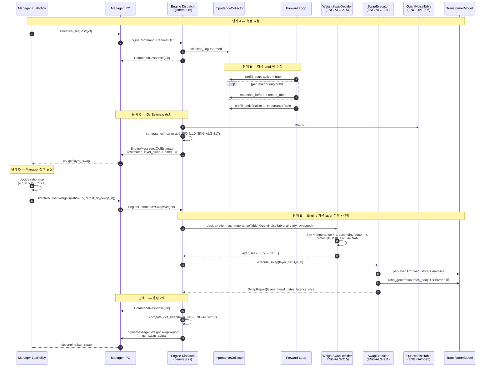

### 3.2 Command Dispatch 구조

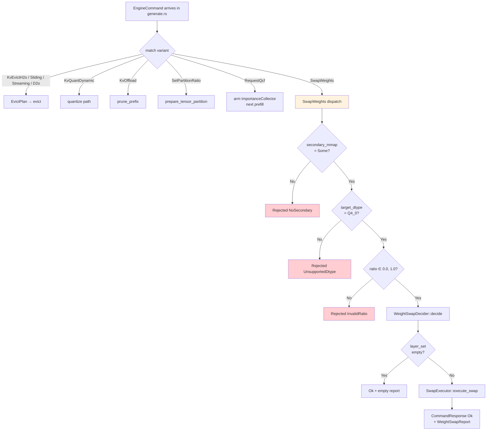

### 3.3 Routing 결정 — Pipeline vs Direct dispatch

| 관점 | Pipeline 경로 (기각) | Direct dispatch (채택) |
|------|---------------------|------------------------|
| Trigger | PressureLevel 자동 (Warning 이상) | Manager 명시적 EngineCommand |
| 기존 유사 패턴 | `EvictionHandler`, `D2OHandler` (KV) | `KvEvictH2o`, `SetPartitionRatio` 등 모든 Manager command |
| Ratio 결정 | Engine 내부 (PressureLevel → ratio 매핑) | Manager LuaPolicy |
| Test 표면적 | Pipeline + handler + context | Dispatch test + decider unit test + executor integration |
| Stage 2 `weight_swap_handler.rs` | 등록 대상 | 내부 오케스트레이터로 유지 (재사용 모듈) |

Stage 2 `weight_swap_handler.rs`는 `CachePressurePipeline`에 **등록하지 않는다**. 대신 "Decider → Executor" 호출을 캡슐화하는 내부 모듈로 격하한다. 이 경우 Stage 2 테스트(WSWAP-2-HANDLER)는 그대로 유효하며, 단지 Pipeline dispatch test만 제거된다.

**engine 내부 fallback 경로**: `ResilienceAction::SwapWeights`(engine 내부 enum)은 별도 경로이다. `MemoryStrategy`(`engine/src/resilience/strategy/memory.rs`)가 Manager 없이 engine 독립으로 swap을 트리거할 때 발행하는 engine-internal action이다. 이는 `generate.rs`의 resilience action loop에서 **동일한** dispatch 함수(SwapWeights 처리 코드)로 귀결된다. 즉 두 진입점이 있으나 공통 Decider + Executor를 공유한다. `ResilienceAction::SwapWeights`는 shared crate에 노출되지 않으며 테스트 대상도 아니다.

### 3.4 LuaPolicy API shape 예시

Manager LuaPolicy는 `ctx.qcf.layer_swap`과 `ctx.engine.last_swap`을 읽어 결정한다. 본 arch는 Python/Lua 코드를 규정하지 않으나 기본 shape 예시:

```lua
-- 1. QCF 기반 결정
if ctx.memory.level == "critical" and ctx.qcf.layer_swap then
    local qcf_at_half = ctx.qcf.layer_swap.qcf_swap_at_ratio["0.5"]
    if qcf_at_half < 0.3 then
        return { action = "swap_weights", ratio = 0.5, target_dtype = "q4_0" }
    else
        return { action = "swap_weights", ratio = 0.25, target_dtype = "q4_0" }
    end
end
```

구체 Lua 바인딩 계약은 Manager 쪽 arch에서 다룬다 (Phase 3 구현 단계에서 확정).

---

## 4. ε 측정 (QuantNoiseTable Eager 빌드)

### 4.1 흐름

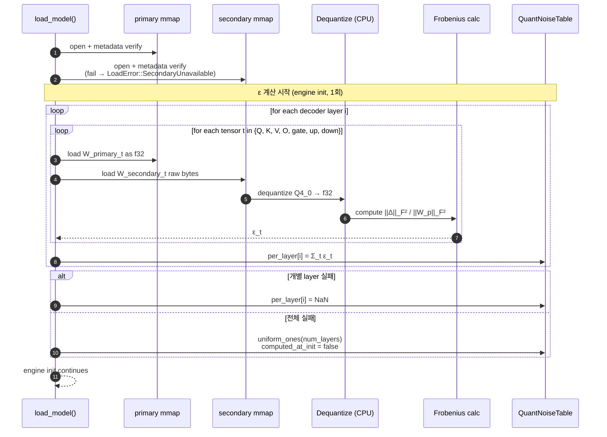

### 4.2 계산 비용과 progress log

| 모델 | 총 deq + Frob 바이트 | 호스트 CPU 예상 latency | progress log |
|------|---------------------|------------------------|--------------|
| Llama 3.2 1B | 16 layer × ~110 MiB | 200~500ms (호스트 x86) | 불요 |
| Qwen 2.5 1.5B | 28 layer × ~55 MiB | 300~700ms | 불요 |
| (hypothetical) Llama 3B | 32 layer × ~220 MiB | 2~5s (저성능 Android) | 권장 (레이어 단위 stderr) |

**실패 fallback 시 degradation**: `computed_at_init = false, per_layer == [1.0; N]`. Decider의 key `importance × ε`에서 ε가 상수이므로 **importance만으로** 정렬된다. 이는 ENG-ALG-213 (Phase 2 단순 decider)와 동치 경로로, 정상 동작의 손실 하한선이다.

### 4.3 Implementer-facing 구현 힌트 (non-normative)

- `engine/src/models/weights/` 디렉토리에 신규 파일 `quant_noise.rs` 추가를 권장.
- Dequantize는 `engine/src/backend/cpu_neon.rs`의 `dequantize_q4_0_block` 유사 함수를 재사용. GPU path 아님 (init 시점엔 GPU buffer 미생성).
- Frobenius는 단순 `(a - b).powi(2).sum()` 루프로 충분. SIMD 최적화는 불필요(1회 비용).
- 실패 감지: try-catch 대신 `Result<f32, NoiseError>`와 layer 단위 graceful degradation. panic 금지.

---

## 5. WeightSwapDecider — Layer 선택 알고리즘

### 5.1 컴포넌트 구성

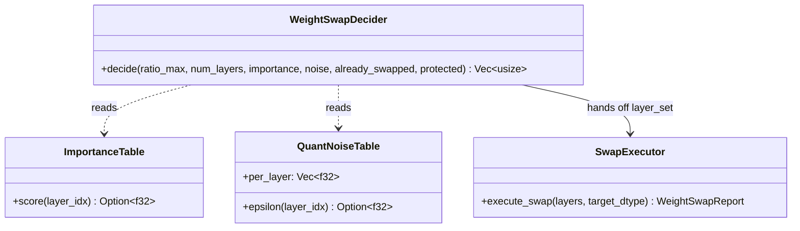

**배치**: `engine/src/models/weights/decider.rs` (권장). `engine/src/core/pressure/weight_swap_handler.rs`(Stage 2)와 다른 파일에 독립 배치하여 "Decider" 책임(선택)과 "Handler/Orchestrator" 책임(오케스트레이션)을 물리적으로 분리.

### 5.2 Key 계산과 tie-breaking

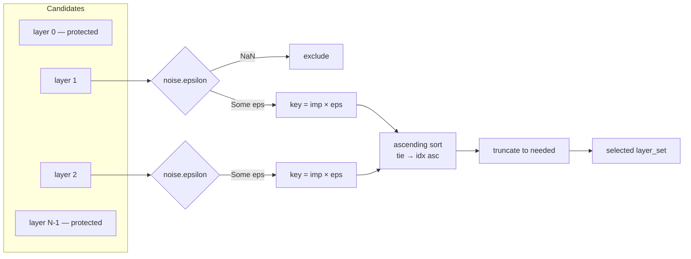

### 5.3 Uniform fallback 트리거

| 상황 | 경로 |
|------|------|
| `ImportanceTable == None` (RequestQcf 없이 SwapWeights만 도착) | Uniform fallback (균등 간격 index 선택) |
| `QuantNoiseTable == None` (secondary 부재) | 도달 불가 (dispatch 단계에서 Rejected) |
| `QuantNoiseTable::computed_at_init == false` (계산 실패 전체 fallback) | importance×1.0 정렬 (degrade, but not uniform) |
| `QuantNoiseTable::epsilon(i) == None` (layer i만 실패) | layer i 후보 제외, 나머지는 정상 정렬 |

### 5.4 이미 swap된 layer의 처리

Decider는 `already_swapped: &HashSet<usize>`를 입력받아 후보에서 **제외**한다. "상한" 의미(ENG-ALG-215)에서 `needed = target_count - already_swapped.len()`이다. 즉 Manager가 ratio=0.5를 거듭 지시해도 이미 8개가 swap되어 있다면 추가 선택은 0이다. 단방향 유지.

---

## 6. Phase 3.5 In-scope — Plan Invalidation 통합 (2026-04-25 승격)

> **상태 변경**: 이전 v4의 "Phase 3.5 Out-of-scope" 섹션은 v5에서 **In-scope로 승격**되었다. 본 섹션은 이미 §2.2.2에서 정의된 ENG-ALG-219 / ENG-ALG-220 / INV-129 규약의 작업 범위와 결정 근거를 정리한다.

### 6.1 결정 플래그 (DF-35-1 ~ DF-35-4)

| ID | 결정 | 채택안 | 근거 |
|----|------|--------|------|
| **DF-35-1** | Plan stale 감지 위치 | `FullKernelPlan::execute()` 진입 1회 atomic load 비교 | 토큰당 비용 atomic load 1회. layer/step 수에 무관. INV-120 per-partition 검사와 OR 결합. |
| **DF-35-2** | Stale 감지 후 처리 | Lazy rebuild — `PlanInvalidated` 반환 → caller가 `forward_gen` fallback | 재빌드 비용을 토큰 경계로 흡수. 현재 토큰은 `forward_gen`으로 완주, 다음 토큰부터 새 plan. |
| **DF-35-3** | tensor_partition × weight swap | **상호 배타** — swap 활성 시 `partition_ctx = None` 강제 | 두 메커니즘 동시 활성 시 plan invalidation 의미 모호 (어느 trigger 우선). race 윈도우 발생. |
| **DF-35-4** | Phase 3.5 작업 범위 | (c) Plan invalidation만. Noshuffle SOA는 **WSWAP-3.6 별도 작업** | 리스크 분리. SOA 변경은 layer 레이아웃 전반에 영향. |

### 6.2 작업 범위 (Phase 3.5)

**In-scope**:
1. `engine/src/core/plan.rs`의 `FullKernelPlan` struct에 `ratio_generation_at_build: u64` 필드 추가.
2. `FullKernelPlan::build()` 진입에서 `model.ratio_generation.load(Acquire)` capture (ENG-ALG-220).
3. `FullKernelPlan::execute()` 진입에서 atomic load 비교 + `PlanInvalidated` 반환 (ENG-ALG-219).
4. `forward_into`에서 `PlanInvalidated` 수신 시 `forward_gen` fallback 분기 (DF-35-2).
5. Weight swap 활성 인스턴스에서 partition_ctx 강제 None (DF-35-3).
6. spec test: `engine/tests/spec/test_eng_alg_219_plan_invalidation.rs` (Implementer 작성).

**Out-of-scope (Phase 3.5에서 하지 않는 것)**:
- Noshuffle SOA / per-layer 메모리 레이아웃 변경 → **WSWAP-3.6**에서 별도 처리.
- `ratio_generation`의 multi-source bump API 변경. 단일 source(SwapExecutor batch + partition prep)는 v3에서 정의된 채로 유지.
- `forward_gen` 경로의 성능 최적화. fallback은 정합성 우선이며 성능은 다음 토큰의 plan 재빌드로 회수.
- tensor_partition × weight swap 동시 활성 지원. **명시적 상호 배타**(DF-35-3).

### 6.3 cross-ref

- 알고리즘: `spec/32-engine-algorithms.md` §3.12.13 (ENG-ALG-219), §3.12.14 (ENG-ALG-220).
- 불변식: `spec/41-invariants.md` §3.14 (INV-129).
- 컴포넌트 규약: 본 문서 §2.2.2.
- 테스트: `engine/tests/spec/test_eng_alg_219_plan_invalidation.rs` (Phase 3.5 구현 단계).

---

## 7. Phase 6.5 Swap Overhead Reduction (2026-05-07)

> **목적**: Galaxy S25 측정에서 weight swap 단발 stall이 1564.6 ms (ratio=0.9, AOS .auf secondary) → user-facing UX criterion(~37 frame freeze) 미달. critical path를 단계별로 압축하여 single-shot stall 50% 이상 감축.
>
> **대상 스펙**:
> - `spec/32-engine-algorithms.md` §3.12.19~20 (ENG-ALG-226~231)
> - `spec/41-invariants.md` §3.19 (INV-140~143)
> - `spec/33-engine-data.md` §3.23 (ENG-DAT-100, primary release worker)
>
> **컨텍스트 참조**: `papers/eurosys2027/_workspace/experiment/swap_overhead_s25.md`. Stage breakdown — soa_reconvert 758ms / prefault 328ms / mmap_permute 305ms / "madvise" 라벨 173ms (실제 primary cl_mem release).
>
> **선행 가정**: §2.7 (SwapExecutor) `execute_on_slots` 흐름, ENG-ALG-211 step (a) ~ (e) 그대로 유지. 본 절의 모든 컴포넌트는 step 내부 구현 최적화이며 외부 계약(SwapReport, ratio_generation bump 단일성, INV-121~125)은 변경하지 않는다.

### 7.1 변경 영향 매트릭스

| Finding | 영향 stage | 측정 절감 (목표) | 새 ID | 수정 파일 (구현 위치 후보) |
|---------|-----------|-----------------|-------|-------------------------|
| A. Fused SOA convert kernel | (d) `soa_reconvert` | 500–650 ms (66–86%) | ENG-ALG-226, INV-140 | `engine/kernels/cvt_q4_0_noshuffle*.cl`, `backend/opencl/mod.rs::convert_q4_0_to_noshuffle` |
| B. AOS path heap copy 제거 | (a) `mmap_permute` | 80–100 ms (26–33%) | ENG-ALG-227 | `models/weights/swap_executor.rs::materialise_tensor` |
| C. Deferred primary release | (c) `primary_release` (구 madvise 라벨) | 173 ms (100% critical path) | ENG-ALG-228, INV-141, ENG-DAT-100 | `models/weights/swap_executor.rs::release_primary_weights` |
| D. Targeted prefault | (a-pre) `prefault` | ~40 ms (12%) | ENG-ALG-229 | `models/weights/secondary_mmap.rs::prefault` |
| E. Stage label rename | (label-only) | 0 (정합성) | (rename 작업, ID 미할당) | `models/weights/swap_executor.rs::StageBreakdown` + shared `LayerSwapStages` |
| F. Async upload 1회 finish | (a) `mmap_permute` (sub-stage) | ~150 ms (49%) | ENG-ALG-230 | `backend/opencl/mod.rs::alloc_and_upload_soa_buffers` |
| (cross-cut) Stage gate ordering | step (a-pre, a, c, d, e) | — | ENG-ALG-231, INV-142 | 통합 invariant — execute_on_slots 흐름 검증 |
| (cross-cut) AOS borrow lifetime | (a) | — | INV-143 | secondary_mmap Arc 생존 보증 |

### 7.2 컴포넌트: Fused SOA Convert Kernel (ENG-ALG-226 / INV-140)

#### 설계 결정

기존 `convert_q4_0_to_noshuffle()`는 6단계 호스트/디바이스 round-trip을 수행한다 (커널 dispatch → `queue.finish()` → `read_buffer(blocking)` → CPU 2D transpose → `write_buffer(blocking)` × 2회 (q, d 분리)). 25 layers × 7 weight tensor × 6 round-trip ≈ 1050 sync point. 측정된 758 ms의 거의 전부가 GPU stall이다.

**전략**: SOA 변환 + 2D transpose + (선택) image1d view 셋업을 **단일 OpenCL kernel dispatch**로 fuse한다. 출력 buffer를 transpose 후 layout으로 직접 쓴다. host round-trip 0회, 큐 sync는 batch 마지막의 `synchronize()` 1회로 흡수.

**제약**:
- 결과 cl_mem 주소(노출 인터페이스)는 동일. registry key (cl_mem 주소) 의미 변경 없음 → INV-130/131 영향 없음.
- AUF SOA bypass 경로(`alloc_pre_converted_soa_tensor`)는 본 path를 거치지 않으므로 영향 없음.
- Adreno register 한계: per-thread 32 float4 초과 시 register spill (CLAUDE feedback). transpose row stride 분기는 SLM 또는 work-group 차원 분할로 우회. 측정 후 결정.

#### 인터페이스

```rust
impl OpenCLBackend {
    pub fn convert_q4_0_to_noshuffle(
        &self,
        src: &ocl::core::Mem,
        num_blocks: usize,
        ne00: usize,    // K, elements per row
        ne01: usize,    // M, number of rows
    ) -> Result<(ocl::core::Mem /* dst_q transposed */,
                 ocl::core::Mem /* dst_d transposed */,
                 Option<ocl::core::Mem /* q image view, lazy */>)>
    // 전제: src는 Q4_0 AOS 18B/block layout
    // 후조건:
    //   - dst_q[col*ne01 + row] (column-major ushort) 와 GEMV가 기대하는 layout 일치 (INV-140)
    //   - dst_d[k*ne01 + row] (column-major half) 와 GEMV가 기대하는 layout 일치
    //   - host round-trip 0회 (INV-140)
    //   - swap critical path에서 호출될 때 호출당 sync 0회. 최종 sync는 caller(execute_on_slots)
    //     또는 alloc_and_upload_soa_buffers 종료 시 1회 (ENG-ALG-230과 결합)
}
```

#### 처리 흐름

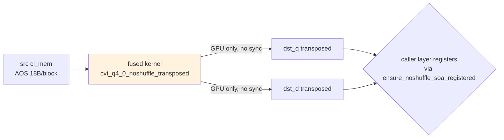

#### 예외 처리

| 조건 | 처리 |
|------|------|
| Adreno OpenCL 컴파일 실패 (register spill 등) | runtime fallback: 기존 4-step path 호출. `kernel_cvt_q4_0_noshuffle_fused.is_none()` 플래그로 감지. INV-140 v1 위반이 아니라 graceful degrade. |
| ne00 % 4 != 0 또는 ne01 % 2 != 0 | 정렬 미충족. 4-step fallback 강제. |
| q_total_ushort > device max alloc | 4-step fallback. (lm_head 같은 큰 tensor 에지 케이스) |

#### 코드-스펙 차이

현재 코드의 `Step 2/3: CPU transpose` 주석은 early implementation 흔적이다. 본 spec 도입과 함께 fused 경로가 정식이 되며, 4-step 경로는 fallback으로 격하된다 (제거 아님 — 호환 안전망).

### 7.3 컴포넌트: AOS Path Borrow Buffer (ENG-ALG-227 / INV-143)

#### 설계 결정

`materialise_tensor()`는 AUF AOS 경로(`needs_qk_unpermute_at_swap()=false`)에서도 mmap byte slice를 항상 `data.to_vec()`으로 owned heap copy한다. 25 layers × 7 tensor × ~5 MB ≈ 870 MB heap traffic ≈ 80–100 ms 낭비.

**전략**: secondary mmap Arc가 `TransformerModel.secondary_mmap`(INV-125)에 model lifetime 동안 살아 있으므로, AOS 무변환 경로에서는 borrow 기반 buffer를 직접 `copy_weight_from`/`copy_from`에 전달한다. permutation 경로(GGUF QK)는 owned 유지 (transform이 새 buffer를 생성).

**제약**:
- borrow buffer의 lifetime은 secondary mmap Arc에 종속. mmap drop 금지(INV-125)는 swap 도중에도 보장된다.
- backend `copy_weight_from`은 입력 buffer 호스트 메모리를 호출 종료 전까지만 읽으므로 borrow가 안전. CPU backend의 경우 `Tensor`가 borrow buffer를 그대로 보관할 수 있으므로 별도 Arc clone이 필요할 수 있다 — 구현 시 결정.

#### 인터페이스

```rust
impl SwapExecutor {
    fn materialise_tensor(
        &self,
        secondary: &Arc<SecondaryMmap>,
        layer_idx: usize,
        subname: &str,
        primary: &Tensor,
        is_weight: bool,
    ) -> Result<Tensor, SwapError>
    // 전제: secondary가 self-mmap을 보유.
    // 후조건:
    //   - permutation 필요 시: 기존 owned Vec<u8> 경로 (변경 없음).
    //   - permutation 불필요 시: secondary mmap byte slice를 borrow한 Buffer 사용.
    //     borrow Buffer는 secondary Arc clone을 보관하여 lifetime 보장 (INV-143).
    //   - copy_weight_from / copy_from의 결과 cl_mem 내용은 owned vs borrow 경로에서 비트 동일 (INV-140 회귀 방지).
}
```

#### 처리 흐름

```mermaid
flowchart TD
    ENTER[materialise_tensor] --> NEEDS_PERM{needs_qk_unpermute<br/>_at_swap?}
    NEEDS_PERM -- Yes --> OWNED[owned Vec\<u8\>:<br/>unpermute_qk_rows]
    NEEDS_PERM -- No --> BORROW[BorrowedMmapBuffer<br/>{ slice: &mmap_bytes, _arc: secondary.clone() }]
    OWNED --> SHARED[SharedBuffer::from_vec]
    BORROW --> COPY
    SHARED --> COPY[backend.copy_weight_from / copy_from]
    COPY --> OUT([Tensor on target backend])
```

#### 예외 처리

| 조건 | 처리 |
|------|------|
| backend가 borrow buffer 미지원 | runtime check 후 owned path fallback. 호환 안전망. |
| copy_weight_from가 비동기로 buffer를 보관 (queue 진행 중) | secondary Arc clone이 buffer drop을 막으므로 안전. ENG-ALG-230 (1회 finish) 와 정합. |

### 7.4 컴포넌트: Deferred Primary Release Worker (ENG-ALG-228 / INV-141 / ENG-DAT-100)

#### 설계 결정

`Stage (c)`는 `Arc::try_unwrap` + `release_primary_weights`로 F16 primary cl_mem chain을 critical path에서 drop한다. 25 layers × 7+ tensor × ~1 ms `clReleaseMemObject` ≈ 173 ms. atomic install(step b)은 이미 완료된 시점이라 forward 정합성 측면에서 drop은 critical path에 있을 필요가 없다.

**전략**: 단일 mpsc 큐 + 백그라운드 워커 thread (1개) 도입. step (c)에서 old `Arc<LayerWeights>`를 큐에 enqueue만 하고 즉시 다음 layer로 진행. 워커가 background에서 `Arc::try_unwrap` 시도 + drop. **다음 swap 트리거가 도착하기 전에 큐가 비어 있어야 한다(INV-141)**.

**제약**:
- INV-125 (secondary mmap drop 금지)는 영향 없음 — primary release는 secondary와 무관.
- 메모리 회수 latency 증가 → resilience 신호 emergency 시 곤란할 수 있음. INV-141의 "다음 swap 전 drain 의무"가 backpressure 역할.
- 워커 thread 수명은 model lifetime. shutdown 시 graceful drain.

#### 인터페이스

```rust
pub struct PrimaryReleaseWorker {
    sender: mpsc::Sender<Arc<LayerWeights>>,
    pending: Arc<AtomicUsize>,    // 큐에 남은 항목 수, INV-141 검증용
    handle: thread::JoinHandle<()>,
}

impl PrimaryReleaseWorker {
    pub fn spawn(backend: Arc<dyn Backend>) -> Self;
    pub fn enqueue(&self, layer: Arc<LayerWeights>);
    pub fn drain(&self, deadline: Duration) -> Result<(), DrainTimeout>;
    pub fn pending_count(&self) -> usize;    // INV-141 assertion
}

impl SwapExecutor {
    fn execute_on_slots(...) -> Result<SwapReport, SwapError> {
        // (Stage c-pre) INV-141: 시작 시 worker.pending_count() == 0 검증.
        //                         non-zero이면 worker.drain(short_deadline) 후 재검증.
        //                         drain 실패 시 에러 반환 (정합성 우선).
        // ...
        // (Stage c) old Arc → worker.enqueue(old) (즉시 반환)
    }
}
```

#### 처리 흐름

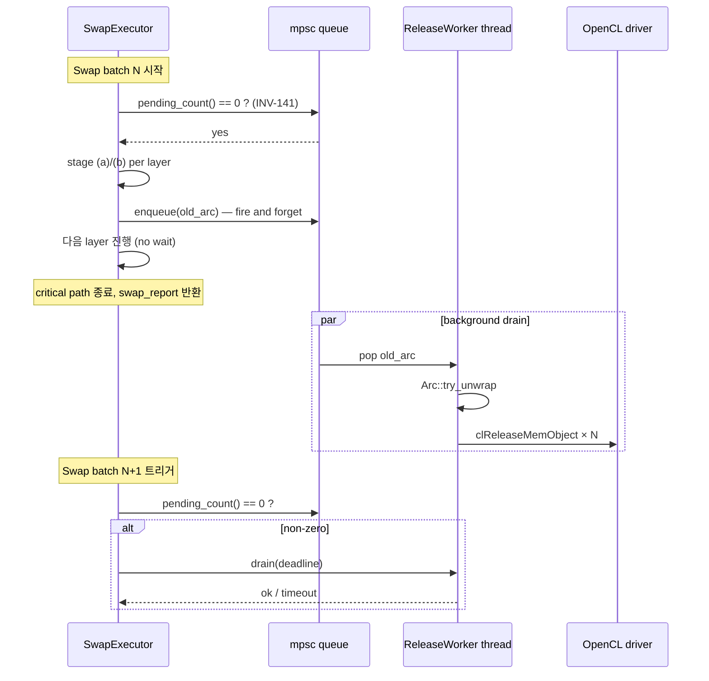

#### 예외 처리

| 조건 | 처리 |
|------|------|
| 워커 패닉 | `JoinHandle::is_finished()` 검사 후 critical path에서 inline drop fallback. 동작 정확성은 보존, 성능만 회귀. |
| `drain(deadline)` 타임아웃 | 다음 swap 거부 (Rejected) — 메모리 누수 방지가 정합성보다 우선. |
| Arc 외부 holder 잔존 (forward가 토큰 경계에서 snapshot 잡고 있는 케이스) | 워커 내부에서 backoff 루프로 try_unwrap 재시도. forward 토큰 경계 통과 즉시 성공 (INV-121 토큰 경계 보장). |

#### 코드-스펙 차이

기존 `release_primary_weights`는 ENG-ALG-211 step (c) inline에서 호출된다. 본 컴포넌트 도입 시 step (c)는 **enqueue로 단순화**되며, 실제 release는 비동기다. ENG-ALG-211의 step (c) 의미는 "primary 페이지 회수 시작"으로 완화되며, 회수 완료는 INV-141의 "다음 swap 전 drain"으로 보장된다.

### 7.5 컴포넌트: Targeted Prefault (ENG-ALG-229)

#### 설계 결정

`AufSecondaryMmap::prefault()`는 전체 WEIGHTS 섹션을 page-touch한다 (28 layer + cross-layer). ratio=0.9에선 25 layer만 swap 대상이지만 28 layer 전체 page-fault 비용을 부담한다.

**전략**: prefault에 `target_layer_indices: &[usize]` 파라미터를 추가, target layer의 byte range만 prefault한다. SwapExecutor는 stage (a-pre)에서 `target_layers`를 prefault에 전달.

**제약**:
- AUF/GGUF 모두 layer-keyed tensor index를 보유하므로 byte range 계산은 O(layer × tensors_per_layer).
- doc 3.1 (eager prefault at startup)과 결합 시 본 경로는 NoOp로 단축 가능.

#### 인터페이스

```rust
impl SecondaryMmap {
    pub fn prefault(&self);    // 기존 — 전체 WEIGHTS 섹션
    pub fn prefault_layers(&self, target_layers: &[usize]);    // 신규
    // 후조건:
    //   - target_layers에 속하는 모든 layer-keyed tensor의 byte range만 madvise(WILLNEED) + page-touch
    //   - cross-layer tensor는 본 호출에서 prefault하지 않음 (swap 대상 아님)
}
```

#### 처리 흐름

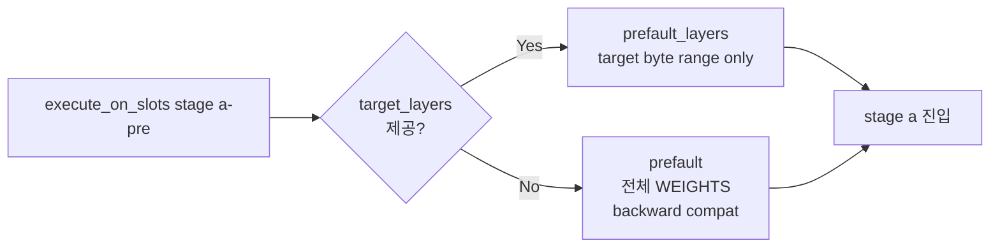

### 7.6 컴포넌트: Async Upload + Single Finish (ENG-ALG-230 / INV-142)

#### 설계 결정

`alloc_and_upload_soa_buffers()`의 `enqueue_write_buffer` 호출 4개가 모두 `blocking=true`. 175 tensor × ~1 ms 동기 = ~150 ms.

**전략**: write_buffer를 `blocking=false`로 호출 + ocl Event 누적. swap batch 마지막에 `queue.finish()` 1회로 일괄 동기화. `convert_q4_0_to_noshuffle` (ENG-ALG-226)도 동일 큐를 공유하므로 같은 finish가 fused kernel sync까지 흡수한다.

**제약 / INV-142**:
- swap_report 반환 시점에 모든 GPU 작업이 완료되어 있어야 한다(forward 진입 안전성). `execute_on_slots`는 stage (e) 직전 또는 직후 `synchronize()` 1회 호출 의무 — INV-142.
- `copy_weight_from` 등 다른 backend API와 큐를 공유하므로 ordering이 자연 직렬화되어 race 없음.

#### 인터페이스

```rust
impl OpenCLBackend {
    pub fn alloc_and_upload_soa_buffers(
        &self,
        q_bytes: &[u8],
        d_bytes: &[u8],
        ne00: usize,
        ne01: usize,
        num_blocks: usize,
    ) -> Result<(ocl::core::Mem, ocl::core::Mem)>
    // 전제: 동일 backend queue 공유.
    // 후조건:
    //   - 호출당 sync 0회.
    //   - 호출자(execute_on_slots)가 batch 종료 시 synchronize() 1회 호출 의무 (INV-142).
}
```

### 7.7 컴포넌트: Stage Label Rename + IPC 동기화 (E)

#### 설계 결정

`StageBreakdown::madvise_ms`는 코드상 `Arc::try_unwrap` + `clReleaseMemObject` chain의 누적 시간이다 — `madvise(MADV_DONTNEED)`가 아니라 primary cl_mem release. 라벨이 측정 분석 시 혼동을 야기한다 (paper context의 swap_overhead_s25.md "madvise" 173ms 해석).

**전략**:
- `StageBreakdown.madvise_ms` → `primary_release_ms` rename.
- `to_log_line()` 출력 토큰 `madvise=` → `primary_release=`.
- Manager/IPC 표면에 노출되어 있다면(`shared::LayerSwapStages` 등) 동시 rename. 미노출이면 engine-internal 변경.
- E-task는 **다른 모든 fix 머지 후 batch로** 수행. 이전 측정 data와 비교 가능성 위해.

**호환성**: 본 rename은 spec ID 신규 할당 없음. arch/spec 영향 최소. shared crate 노출 여부 확인 후 deprecated 별칭 1단계 유지 권장.

### 7.8 통합 invariant: Stage Gate Ordering (ENG-ALG-231 / INV-142)

#### 설계 결정

ENG-ALG-226~230이 모두 적용되면 `execute_on_slots`의 GPU 작업이 비동기화되어 stage 간 ordering이 명시 invariant 없이는 race 가능성 발생. 다음을 강제한다:

```
(a-pre) prefault_layers       — host page touch, sync 무관
(a)     materialise_tensor    — fused convert kernel + async write_buffer (큐 누적)
(b)     LayerSlot::swap_weights — atomic, ordering 영향 없음 (INV-123)
(c)     primary release worker enqueue — 비동기, GPU와 무관
(c-fin) stage gate             — backend.synchronize() 1회 (INV-142)
(e-pre) invalidate_noshuffle_soa_registry — synchronize 후에만 호출
(d)     ensure_noshuffle_soa_registered  — synchronize 후에만 호출
(e)     ratio_generation.fetch_add        — 모든 GPU 작업 완료 후
```

**INV-142 (Stage Gate)**: ratio_generation bump 직전 backend queue가 idle해야 한다. 위반 시 forward가 미완성 cl_mem을 보고 garbage 산출 가능. 검증은 `synchronize()` 호출 직후 `clGetEventInfo` 또는 `OpenCLBackend::queue_idle()` 헬퍼.

#### 처리 흐름

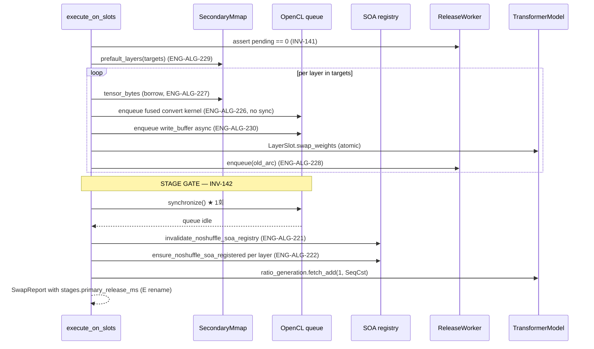

### 7.9 새 ID 요약

| ID | 분류 | 한줄 의도 | 의존 |
|----|------|----------|------|
| ENG-ALG-226 | Algorithm | Fused SOA convert + transpose: host round-trip 제거 | INV-130, INV-131 (등록 의무 유지) |
| ENG-ALG-227 | Algorithm | AOS path borrow buffer: secondary mmap 직접 read | INV-125 (mmap 생존), INV-143 |
| ENG-ALG-228 | Algorithm | Deferred primary release: critical path에서 cl_mem drop 제거 | INV-121 (forward snapshot), INV-141 |
| ENG-ALG-229 | Algorithm | Targeted prefault: target layer byte range만 page touch | ENG-DAT-094 (decoder layer index) |
| ENG-ALG-230 | Algorithm | Async upload + single finish: write_buffer non-blocking + batch end synchronize | INV-142 |
| ENG-ALG-231 | Algorithm | Stage gate ordering: synchronize → registry 갱신 → bump 순서 | INV-142, INV-130, INV-131, INV-129 |
| INV-140 | Correctness | Fused convert kernel 결과는 4-step path와 비트 동일 | ENG-ALG-226 |
| INV-141 | Correctness | ReleaseWorker는 다음 swap 전 drain 완료 | ENG-ALG-228 |
| INV-142 | Safety/Correctness | ratio_generation bump 시 queue idle 보장 | ENG-ALG-230, ENG-ALG-231 |
| INV-143 | Safety | borrow buffer는 secondary Arc clone을 보관, mmap drop 금지 | ENG-ALG-227, INV-125 |
| ENG-DAT-100 | Data | PrimaryReleaseWorker struct 정의 | ENG-ALG-228 |

### 7.10 작업 분배 권고

- **Senior Implementer**: ENG-ALG-226 (`engine/kernels/cvt_q4_0_noshuffle_fused.cl` 신규 + 4-step fallback gate, Adreno register 한계 측정 필요).
- **Implementer**: ENG-ALG-227 (borrow buffer wrapper + materialise_tensor 분기), ENG-ALG-228 + ENG-DAT-100 (PrimaryReleaseWorker), ENG-ALG-229 (prefault_layers signature), ENG-ALG-230 (alloc_and_upload_soa_buffers async), ENG-ALG-231 (execute_on_slots stage gate 정렬).
- **Implementer (E rename, batch)**: 다른 fix 머지 후 단독 PR로 `madvise_ms` → `primary_release_ms`. shared crate 노출 시 deprecated alias 1 cycle 유지.
- **Tester**: 각 spec test 디바이스 검증 + Galaxy S25 stage breakdown 재측정 (ratio=0.9 기준 1564.6 ms → 목표 < 800 ms).

---

## 10. Phase 6.7 Intra-forward Layer-aligned Swap (LISWAP-4, 2026-05-08)

> **편집 노트**: §8 / §9 슬롯은 LISWAP-1 (Layer-Incremental Swap Stage 1 MVP) 트랙용으로 예약. LISWAP-1 spec이 본 arch에 명문화될 때 §8 (LISWAP-1 본체) / §9 (LISWAP-1 변경 이력)로 사용된다. ID 재사용 금지 원칙에 따라 §10은 LISWAP-4 전용으로 발급한다.

§7 Phase 6.5는 290 ms 단발 stall을 절대 감축, LISWAP-1(§8 예약)은 N decode tick에 분산. §10 LISWAP-4는 forward **중간** layer 경계에서 swap을 dispatch하여 같은 forward 후속 layer compute + 다음 토큰 forward 선행 layer compute와 swap window를 overlap한다. LISWAP-2 prototype(forward 직후 일괄 dispatch)이 Adreno multi-queue serialize로 0% saving이었던 것과 다른 timing 영역이다.

### 10.1 LISWAP-2 negative result와의 차이

| 항목 | LISWAP-2 (negative) | LISWAP-4 (신) |
|------|----------------------|----------------|
| Dispatch 시점 | forward 종료 직후 | forward 중간 layer 경계 |
| 한 번의 dispatch chunk size | 전체 layer (예: 28 layer × ~10 MiB = 280 MiB) | 단일 layer (~10 MiB) |
| Overlap 대상 | 다음 forward 전체 | 같은 forward의 후속 layer + 다음 forward의 선행 layer |
| Swap window | 다음 forward 시간 ≈ 23–28 ms (Adreno에서 GPU 직렬화로 실효 0) | 같은 forward 후속 layer (~6 ms) + 다음 forward 선행 (~17 ms) ≈ 23 ms |
| Adreno serialize 영향 | hardware-level 직렬화로 hidden 0% (`swap_overhead_async_dispatch_phase6.md`) | chunk가 작고 dispatch가 forward 중간이라 timing 다름 — 측정 미답 |
| Stage gate 횟수 | 1회 | plan당 1회 (LISWAP-1의 N회와 다름, INV-150) |

### 10.2 컴포넌트: `LayerBoundaryHook` trait (ENG-ALG-235 / INV-147)

#### 설계 결정

- **`Option<&dyn LayerBoundaryHook>` 인자 1개 추가**: `TransformerModelForwardArgs`에 `layer_boundary_hook: Option<&dyn LayerBoundaryHook>` 필드 추가. 기존 호출 사이트는 `Default::default()` 또는 명시 None으로 무영향. INV-147 (zero overhead)은 `if let Some(hook) = ...` 분기에서 `Some` 분기가 거의 발생하지 않는 hot path 특성 + branch predictor에 의존.
- **trait 메서드는 `&self` 만 받음**: hook 자신의 mutable state는 내부 ArcSwap/Mutex로 캡슐화. 호출자가 hook을 borrow checker 마찰 없이 forward에 통과시키기 위함.
- **호출 위치는 layer i compute **직후**, layer i+1 compute **직전**: `importance_collector.snapshot_after()`와 동일 라인 그룹. 마지막 layer (idx == num_layers - 1) 후에도 호출됨 — `final_norm` 진입 직전.
- **prefill과 decode 모두 호출**: `seq_len` 인자로 분기 가능. LISWAP-4 hook은 `seq_len == 1`(decode)에서만 dispatch하도록 자체 구현 (prefill 중 swap은 cl_mem 사이즈 폭증 risk).

#### 인터페이스

```rust
pub trait LayerBoundaryHook: Send + Sync {
    /// pre: 0 <= idx < num_layers
    /// pre: hook does NOT mutate `x` activation
    /// post: forward path state unchanged (hook is observe-and-dispatch only)
    fn on_layer_boundary(&self, idx: usize, seq_len: usize);
}
```

`TransformerModelForwardArgs`에 추가:
```rust
pub struct TransformerModelForwardArgs<'a, C> {
    // ... existing fields ...
    pub layer_boundary_hook: Option<&'a dyn LayerBoundaryHook>,
}
```

#### 처리 흐름 (forward_into 내부)

```mermaid
flowchart TD
    START([forward_into 진입]) --> SNAPSHOT[layer_snapshots = self.layers.iter&lpar;&rpar;<br/>.map&lpar;|s| s.load_weights&lpar;&rpar;&rpar;.collect&lpar;&rpar;<br/>「INV-121」]
    SNAPSHOT --> EMBED[embedding lookup]
    EMBED --> LOOP_START{i < num_layers?}

    LOOP_START -- Yes --> WAIT_GATE{layer_boundary_hook<br/>== Some?}
    WAIT_GATE -- Yes --> CHECK_PEND{hook.pending_event_for&lpar;i&rpar;<br/>== Some&lpar;evt&rpar;?}
    CHECK_PEND -- Yes --> WAIT[backend.wait_event_blocking&lpar;&evt&rpar;<br/>「ENG-ALG-238 / INV-149」]
    CHECK_PEND -- No --> LAYER
    WAIT --> LAYER[layer.forward&lpar;...&rpar;<br/>reads layer_snapshots&lbrack;i&rbrack;]
    WAIT_GATE -- No --> LAYER

    LAYER --> POST_HOOK{layer_boundary_hook<br/>== Some?}
    POST_HOOK -- Yes --> ON_BOUNDARY[hook.on_layer_boundary&lpar;i, seq_len&rpar;<br/>「ENG-ALG-235」]
    POST_HOOK -- No --> NEXT_I[i += 1]
    ON_BOUNDARY --> NEXT_I
    NEXT_I --> LOOP_START

    LOOP_START -- No --> FINAL_NORM[final_norm + lm_head]
    FINAL_NORM --> END([forward_into 종료])

    style WAIT fill:#ffebee
    style ON_BOUNDARY fill:#c8e6c9
```

### 10.3 컴포넌트: `IntraForwardSwapHook` (ENG-ALG-236, ENG-ALG-237 / INV-148, ENG-DAT-101)

#### 설계 결정

- **per-slot pending event registry**: `Vec<ArcSwapOption<GpuEvent>>` 길이 `num_layers`. lock-free read를 위해 `Mutex<HashMap>` 안 사용. (대안 검토: `LayerSlot::pending_swap_event` 필드 추가 — slot SRP 침해로 reject. `AsyncSwapDispatcher` 내부 map — forward thread가 dispatcher lock 잡아야 해 reject.) 결론: hook 자체에 registry 보유하는 것이 lifetime/lock-free/SRP 모두에 최적.
- **plan은 BTreeSet 기반**: `dispatch_at`는 layer index 집합. order는 hook 외부에서 결정 (CLI / decider). 동일 layer 중복 dispatch 방지(INV-148)는 `dispatched` set으로 enforce.
- **AsyncSwapDispatcher 재사용**: LISWAP-2 인프라(`SwapCommitJob`, `submit_commit`, worker_loop의 wait_event_blocking → swap_weights → release chain)를 그대로 사용. 새로 추가하는 것은 hook 본체 + `arm_pending`/`clear_pending` 콜백뿐. dispatcher worker는 `slot.swap_weights` 직후 hook의 `clear_pending(idx)`를 호출하도록 약간 확장 필요 (`SwapCommitJob`에 `on_complete: Option<Arc<dyn Fn(usize) + Send + Sync>>` 필드 추가 검토 — 또는 worker가 hook 참조를 보유하도록).
- **hook이 `Arc<dyn LayerBoundaryHook>`로 wrap**: Arc clone을 dispatcher worker가 보유하여 worker thread에서 `clear_pending` 호출 가능.
- **prefill swap 금지**: hook 내부에서 `seq_len > 1`이면 즉시 return. prefill 중 cl_mem 메모리 폭증 risk 회피.

#### 인터페이스

```rust
pub struct IntraForwardSwapHook {
    plan: Mutex<IntraForwardSwapPlan>,
    dispatcher: Arc<AsyncSwapDispatcher>,
    secondary: Arc<SecondaryMmap>,
    layer_slots: Vec<Arc<LayerSlot>>,
    backend: Arc<dyn Backend>,
    release_worker: Option<Arc<PrimaryReleaseWorker>>,
    pending_events: Vec<ArcSwapOption<GpuEvent>>,
    stage_gate_armed: AtomicBool,
}

impl IntraForwardSwapHook {
    pub fn new(
        layers: Vec<usize>,
        token: usize,
        dispatcher: Arc<AsyncSwapDispatcher>,
        secondary: Arc<SecondaryMmap>,
        layer_slots: Vec<Arc<LayerSlot>>,
        backend: Arc<dyn Backend>,
        release_worker: Option<Arc<PrimaryReleaseWorker>>,
        num_layers: usize,
    ) -> Arc<Self>;

    /// Read-only snapshot for forward-thread wait gate (ENG-ALG-238).
    pub fn pending_event_for(&self, idx: usize) -> Option<GpuEvent>;

    /// Plan progress probe.
    pub fn plan_is_complete(&self) -> bool;

    /// Decode loop calls this after `plan_is_complete()` returns true.
    /// Performs: drain → synchronize → ratio_generation += 1 →
    /// invalidate_noshuffle_soa_registry. Returns Err on drain timeout
    /// or backend sync error (INV-150).
    pub fn finalize(
        &self,
        ratio_generation: &AtomicU64,
        soa_registry_invalidate: impl FnOnce(),
        deadline: Duration,
    ) -> Result<()>;

    /// Internal — called by hook itself before submit_commit.
    fn arm_pending(&self, idx: usize, event: GpuEvent);

    /// Internal — called by AsyncSwapDispatcher worker after slot.swap_weights.
    /// Worker must hold an Arc<IntraForwardSwapHook> for this callback.
    fn clear_pending(&self, idx: usize);
}

impl LayerBoundaryHook for IntraForwardSwapHook {
    fn on_layer_boundary(&self, idx: usize, seq_len: usize) {
        if seq_len > 1 { return; }  // prefill: never dispatch
        let mut plan = self.plan.lock().unwrap();
        if !plan.should_dispatch(idx) { return; }
        // 1. Build secondary tensor (ENG-ALG-211 step a/b borrow)
        // 2. enqueue_write_async (ENG-ALG-230)
        // 3. arm_pending(idx, evt)
        // 4. submit_commit(SwapCommitJob{...write_event=evt})
        // 5. plan.mark_dispatched(idx)
        // 6. self.stage_gate_armed.store(true, Release)
    }
}
```

#### 처리 흐름

`spec/32-engine-algorithms.md` §3.12.22.3의 mermaid sequence와 동일. forward thread는 hook을 호출하고 즉시 반환, dispatcher worker가 cl_event 완료 후 ArcSwap commit + `clear_pending` 수행.

#### 예외 처리

- **`enqueue_write_async` 실패**: hook 내부에서 에러 로그 후 plan 진행 (해당 layer는 swap 안 됨, 다음 plan에서 재시도 가능). dispatcher submit 안 함, `arm_pending` 안 함.
- **dispatcher 내부 panic**: worker thread가 죽으면 `submit_commit`이 channel error 반환. hook은 plan 무효화 + `pending_events` 모두 None clear + finalize에서 dispatcher drain timeout 발생 → 호출자가 swap fallback 결정.
- **dispatcher drain timeout (10초 권장)**: `finalize`가 `SwapError::DispatcherDrainTimeout` 반환. decode loop는 다음 swap 신호를 reject하고 manager에 alert.

### 10.4 컴포넌트: cl_event Wait Gate (ENG-ALG-238 / INV-149)

#### 설계 결정

- **wait gate 위치 = layer i forward 호출 직전**: `layer.forward(...)` 호출 직전에 `hook.pending_event_for(i)` 검사. ArcSwap snapshot은 이미 `layer_snapshots`에 잡혀 있음(INV-121) — wait gate는 그 snapshot 안의 cl_mem이 GPU에서 visible한지를 강제.
- **`backend.wait_event_blocking`은 fast no-op for completed event**: dispatcher worker가 이미 `slot.swap_weights` + `clear_pending`을 끝냈더라도 forward thread가 잡은 evt clone은 여전히 valid (cl_event는 retain count로 관리). completed event에 대한 wait는 driver-level fast no-op.
- **wait는 forward thread를 block**: 평균적으로 swap이 forward window 안에 끝나도록 plan ordering이 잡혀 있어 wait time 0. worst case는 단일 token spike (handoff §4.4 risk).

### 10.5 Decode Loop 통합 (Plan Lifecycle)

```mermaid
flowchart TD
    START([Decode 진입]) --> NEW_TOKEN([Token T])
    NEW_TOKEN --> FWD[forward_into&lpar;args.with_hook&lpar;intra_forward_hook&rpar;&rpar;<br/>「내부에서 wait gate + on_boundary 발동」]
    FWD --> SAMPLE[sample]
    SAMPLE --> CHECK_HOOK{intra_forward_hook<br/>== Some?}

    CHECK_HOOK -- Yes --> CHECK_COMPLETE{hook.plan_is_complete&lpar;&rpar;?}
    CHECK_COMPLETE -- Yes --> FINALIZE[hook.finalize&lpar;&ratio_generation, invalidate_soa, 10s&rpar;<br/>「INV-150」<br/>drain → synchronize → bump → invalidate]
    FINALIZE --> RETIRE[intra_forward_hook = None]
    RETIRE --> SIG_CHK
    CHECK_COMPLETE -- No --> SIG_CHK
    CHECK_HOOK -- No --> SIG_CHK

    SIG_CHK{새 SwapWeights signal?}
    SIG_CHK -- No --> NEXT([Token T+1])
    SIG_CHK -- Yes --> IN_FLIGHT_CHK{intra_forward_hook<br/>== Some?}

    IN_FLIGHT_CHK -- Yes --> IGNORE[logged-and-dropped]
    IN_FLIGHT_CHK -- No --> CLI_CHK{cli.swap_intra_forward?}
    CLI_CHK -- Yes --> COMMIT[intra_forward_hook = Some&lpar;Arc::new&lpar;<br/>IntraForwardSwapHook::new&lpar;target_layers, ...&rpar;&rpar;&rpar;]
    CLI_CHK -- No --> SINGLE[swap_executor.execute_on_slots&lpar;&target_layers&rpar;<br/>「single-shot 기존 경로」]
    IGNORE --> NEXT
    COMMIT --> NEXT
    SINGLE --> NEXT

    style FINALIZE fill:#fff3e0
    style IGNORE fill:#ffebee
    style COMMIT fill:#c8e6c9
```

### 10.6 LISWAP-1과의 상호 배타 (ENG-DAT-C18)

`--swap-incremental-per-tick > 0`와 `--swap-intra-forward = true`는 동시 활성화 금지. 이유: LISWAP-1의 ratio_generation bump는 chunk마다(N회), LISWAP-4는 plan당(1회). 동시 활성화 시 plan invalidation의 의미가 불일치. CLI parser는 둘 다 활성이면 다음 메시지로 reject:

```
ERROR: --swap-incremental-per-tick (= N) and --swap-intra-forward (= true)
       are mutually exclusive (ENG-DAT-C18). Pick one:
       (a) --swap-incremental-per-tick=N --swap-intra-forward=false   (LISWAP-1)
       (b) --swap-incremental-per-tick=0 --swap-intra-forward=true    (LISWAP-4)
       (c) --swap-incremental-per-tick=0 --swap-intra-forward=false   (single-shot)
```

### 10.7 새 ID 요약

| ID | 분류 | 한줄 의도 | 의존 |
|----|------|----------|------|
| ENG-ALG-235 | Algorithm | `LayerBoundaryHook` trait — forward layer 경계 hook 인터페이스. None일 때 zero overhead. | INV-147 |
| ENG-ALG-236 | Algorithm | `IntraForwardSwapPlan` 자료구조 (BTreeSet, should_dispatch / mark_dispatched 멱등) | INV-148 |
| ENG-ALG-237 | Algorithm | `IntraForwardSwapHook` 동작 sequence (build → enqueue_write_async → arm → submit → mark) | ENG-ALG-235/236, ENG-ALG-230 (async upload), AsyncSwapDispatcher (LISWAP-2 인프라) |
| ENG-ALG-238 | Algorithm | Wait gate at next forward layer K + plan run-to-completion finalize | INV-149, INV-150, INV-141 (drain) |
| ENG-DAT-101 | Data | `pending_events: Vec<ArcSwapOption<GpuEvent>>` per-slot registry | ENG-ALG-237/238 |
| ENG-DAT-C18 | Constraint | `--swap-incremental-per-tick > 0` × `--swap-intra-forward = true` 상호 배타 | ENG-ALG-238 |
| INV-147 | Performance | hook=None 시 forward path zero overhead (<1% 시간 차이) | ENG-ALG-235 |
| INV-148 | Correctness | plan 내 동일 layer 정확히 1회 dispatch (멱등) | ENG-ALG-236 |
| INV-149 | Safety/Correctness | wait gate ordering — pending_event_for(K) == Some → wait_event_blocking 강제 | ENG-ALG-238, ENG-DAT-101 |
| INV-150 | Safety/Correctness | plan run-to-completion: drain → synchronize → ratio_generation +1 → invalidate (plan당 1회) | ENG-ALG-238, INV-141, INV-142 |

### 10.8 위험 분석 / 결정 분기

| Risk | 확률 | 영향 | 완화 |
|------|------|------|------|
| **Adreno multi-queue serialize 재발** (LISWAP-2와 동일 결과) | medium-high | 효과 0% | 측정으로 확인. fail이라도 paper에 "Adreno serialize는 chunk 크기/timing 무관" 결론 강화. (handoff §4.4) |
| Hook hot-path overhead (INV-147 위반) | low | forward_ms 인플레 | hook=None microbench로 baseline 비교. NoOpHook 측정으로 trait dispatch 자체 비용 격리. <1% 시간차이가 INV-147 임계. |
| Wait gate가 forward 첫 layer 진입 시 block (worst case) | medium | 단일 token spike | swap window(25–28 ms) > H2D(17 ms)이므로 정상 워크로드에서 wait 거의 0. spike 발생 빈도 측정 필요. |
| ArcSwap commit timing race | low | 정확성 fail | INV-149 wait gate가 commit-before-read ordering 강제. dispatcher worker thread에서 commit 후 clear_pending. |
| `enqueue_write_async` 실패가 plan을 stuck | low | plan retire 실패 → dispatcher drain timeout | hook 내부에서 enqueue 실패 시 plan에 mark_dispatched 호출 안 함 → finalize 조건 영원히 false. workaround: plan에 `failed_dispatches` set 추가하여 finalize 조건을 `dispatched ∪ failed == dispatch_at`로 완화. (Stage 2 결정) |
| LISWAP-1과 동시 활성 | low | ratio_generation bump 의미 불일치 | ENG-DAT-C18 CLI parser reject. spec test로 회귀 차단. |

### 10.9 측정 sweep 가이드

handoff §4.5 그대로:

```
# Galaxy S25
prompt = "The quick brown fox jumps"
n_tokens = 40
threads = 6
backend = opencl
force-swap-ratio = 0.9
secondary-layout = aos

scenarios:
  - sync_singleshot      # baseline (existing)
  - sync_incremental_pt1 # LISWAP-1 baseline (per_tick=1, 명문화 대기)
  - intra_forward_swap   # LISWAP-4

n=5 each
```

비교 항목: 단발 stall (single-shot 비교), per-token TBT (incremental/intra-forward 비교), forward_ms transitional / post-plan, total per-plan wall-clock, decode 정확성 (5/5 OK 필수).

Decision gate (LISWAP-4 success, handoff §4.5):
- AC1: decode 정확성 5/5 (top-5 overlap > 99% vs sync_singleshot)
- AC2: forward_ms 인플레 ≤ 10% (hook overhead)
- AC3: sync baseline 대비 wall-clock saving ≥ 20% (per-plan total)
- AC4: 50ms frame budget 무시 (사용자 결정 2026-05-08)

### 10.10 작업 분배 권고

- **Architect (이 문서)**: spec 작성 — ENG-ALG-235~238, ENG-DAT-101, ENG-DAT-C18, INV-147~150. spec 32/33/41 + COVERAGE.md + arch §10.
- **Senior Implementer**: ENG-ALG-237 (`IntraForwardSwapHook` 본체), ENG-ALG-238 (wait gate + finalize), ENG-DAT-101 (pending_events registry). 신규 파일 `engine/src/models/weights/intra_forward_swap.rs` 권장 (async_swap.rs 확장 대신 — 가독성 + 책임 분리). `AsyncSwapDispatcher`의 worker_loop는 `SwapCommitJob`에 `on_complete: Option<...>` callback 필드 추가하는 작은 수정만 필요.
- **Implementer**: ENG-ALG-235 (`LayerBoundaryHook` trait + `TransformerModelForwardArgs.layer_boundary_hook` 추가), ENG-ALG-236 (`IntraForwardSwapPlan` 자료구조), ENG-DAT-C18 CLI parser 배타 검사, decode loop finalize 통합 (`engine/src/bin/generate.rs`).
- **Implementer (spec test)**: 4개 테스트 파일.
- **Tester**: Galaxy S25에서 sync vs LISWAP-4 sweep n=5. 보고서: `papers/eurosys2027/_workspace/experiment/swap_overhead_intra_forward.md` (가칭).

### 10.11 변경 대상 파일 + 함수 + 위치 (Senior Implementer 인계용)

| 파일 | 함수 / 위치 | 변경 내용 |
|------|-------------|----------|
| `engine/src/core/backend.rs` | `Backend::enqueue_write_async`, `wait_event_blocking` | 재사용 (변경 없음). hook이 호출. |
| `engine/src/models/weights/async_swap.rs` | `SwapCommitJob` struct | `on_complete: Option<Arc<dyn Fn(usize) + Send + Sync>>` 필드 추가. worker_loop의 `process_commit`이 `slot.swap_weights` 직후 호출. |
| `engine/src/models/weights/async_swap.rs` | `worker_loop::process_commit` | `slot.swap_weights` 후 `if let Some(cb) = &job.on_complete { cb(layer_idx); }` 추가. |
| `engine/src/models/weights/intra_forward_swap.rs` (**신규**) | `IntraForwardSwapHook`, `IntraForwardSwapPlan`, `LayerBoundaryHook` trait | ENG-ALG-235~237 본체 구현. ~250 LOC 추정. |
| `engine/src/models/weights/mod.rs` | pub mod | `pub mod intra_forward_swap;` 추가. |
| `engine/src/models/transformer.rs` | `TransformerModelForwardArgs` struct | `pub layer_boundary_hook: Option<&'a dyn LayerBoundaryHook>` 필드 추가 (lifetime 'a 추가 필요). |
| `engine/src/models/transformer.rs` | `forward_into` layer loop | layer loop 안에 (1) layer.forward 직전 wait gate, (2) layer.forward 직후 on_layer_boundary 추가. |
| `engine/src/bin/generate.rs` | CLI parser | `--swap-intra-forward: bool` 추가. ENG-DAT-C18 배타 검사 (둘 다 양수면 anyhow::bail!). |
| `engine/src/bin/generate.rs` | decode loop main body | `intra_forward_hook: Option<Arc<IntraForwardSwapHook>>` 상태 변수. forward 호출 시 hook 주입. plan complete 시 finalize + retire. swap signal 진입 시 `swap_intra_forward` flag로 분기. |
| `engine/tests/spec/test_inv_147_hook_zero_overhead.rs` | (신규) | hook=None vs hook=Some(NoOpHook) forward 시간 비교. |
| `engine/tests/spec/test_inv_148_plan_dispatch_idempotent.rs` | (신규) | should_dispatch / mark_dispatched 시퀀스 멱등성. |
| `engine/tests/spec/test_inv_149_wait_gate_ordering.rs` | (신규) | stub backend로 wait_event_blocking 호출 검증. |
| `engine/tests/spec/test_inv_150_plan_run_to_completion.rs` | (신규) | finalize 호출 순서 trace + ratio_generation +1 검증. |
| `engine/tests/spec/test_eng_alg_237_intra_forward_hook.rs` | (신규) | Hook full sequence (build → enqueue → submit → mark) integration. |
| `engine/tests/spec/test_eng_dat_101_pending_event_registry.rs` | (신규) | arm/clear/read concurrent 시나리오. |
| `engine/tests/spec/test_eng_dat_c18_liswap_mutual_exclusion.rs` | (신규) | CLI parser reject 검증. |

### 10.12 tests/spec/ 테스트 케이스 명세 (Implementer 작성용)

#### 10.12.1 `test_inv_147_hook_zero_overhead.rs` (정확성 + Performance)

**목적**: INV-147 — hook=None 시 forward path는 baseline과 byte-equal 출력 + 시간 차이 < 1%.

**케이스**:

```rust
// CASE 1: hook=None vs no hook arg (legacy default) byte-equal
let model = build_synthetic_1b_model();
let logits_a = run_forward(&model, &tokens, /*hook=*/None);
let logits_b = run_forward_legacy(&model, &tokens);  // pre-LISWAP-4 path
assert_eq!(logits_a.as_bytes(), logits_b.as_bytes());

// CASE 2: hook=None microbench < baseline + 1%
let baseline = bench_forward(&model, &tokens, None, n_iter=100);
let with_none = bench_forward_with_hook(&model, &tokens, None, n_iter=100);
assert!(with_none.median <= baseline.median * 1.01,
    "hook=None overhead {} > 1%", (with_none.median / baseline.median - 1.0));

// CASE 3: NoOpHook overhead < 10%
struct NoOpHook;
impl LayerBoundaryHook for NoOpHook {
    fn on_layer_boundary(&self, _idx: usize, _seq_len: usize) {}
}
let with_noop = bench_forward_with_hook(&model, &tokens, Some(&NoOpHook), n_iter=100);
assert!(with_noop.median <= baseline.median * 1.10);
```

**제약**: 이 테스트는 host에서 synthetic model로 격리 가능. 디바이스 microbench는 별도 Tester 작업.

#### 10.12.2 `test_inv_148_plan_dispatch_idempotent.rs` (정확성)

**목적**: INV-148 — `IntraForwardSwapPlan` 내 동일 idx 정확히 1회 dispatch.

**케이스**:

```rust
// CASE 1: should_dispatch / mark / should_dispatch 시퀀스
let mut plan = IntraForwardSwapPlan::new(vec![3, 5, 7], 0);
assert!(plan.should_dispatch(3));
plan.mark_dispatched(3);
assert!(!plan.should_dispatch(3));
assert!(plan.should_dispatch(5));

// CASE 2: 중복 mark 안전
plan.mark_dispatched(3);  // double mark
assert!(!plan.should_dispatch(3));

// CASE 3: dispatch_at 외 idx
assert!(!plan.should_dispatch(0));
assert!(!plan.should_dispatch(99));

// CASE 4: 모든 layer mark 후 is_complete
for i in [3, 5, 7] { plan.mark_dispatched(i); }
assert!(plan.is_complete());
assert_eq!(plan.pending_layers().count(), 0);

// CASE 5: 빈 plan
let empty = IntraForwardSwapPlan::new(vec![], 0);
assert!(empty.is_complete());  // 또는 호출자가 생성하지 않음 — 의미 결정 필요
```

#### 10.12.3 `test_inv_149_wait_gate_ordering.rs` (정확성 + Safety)

**목적**: INV-149 — wait gate가 layer K forward 진입 직전 호출됨.

**케이스**:

```rust
// CASE 1: stub backend로 wait_event_blocking 호출 추적
struct TraceBackend { calls: Mutex<Vec<String>> }
impl Backend for TraceBackend {
    fn wait_event_blocking(&self, _evt: &GpuEvent) -> Result<()> {
        self.calls.lock().unwrap().push("wait".into());
        Ok(())
    }
    // ... matmul 등은 "matmul" push
}

// hook이 layer 5의 pending_events에 evt 주입
let hook = Arc::new(IntraForwardSwapHook::new(...));
hook.arm_pending(5, GpuEvent::dummy());

run_forward(&model, &tokens, Some(hook.as_ref()));
let calls = backend.calls.lock().unwrap();

// "wait" 호출이 "layer_5_matmul" 호출 직전에 있어야 함
let wait_idx = calls.iter().position(|c| c == "wait").unwrap();
let layer_5_idx = calls.iter().position(|c| c == "layer_5_matmul").unwrap();
assert!(wait_idx < layer_5_idx);

// CASE 2: pending_event_for(K) == None 시 wait 호출 없음
hook.clear_pending(5);
let calls_2 = run_forward(...);
assert!(!calls_2.contains(&"wait".to_string()));

// CASE 3: completed event에 대한 wait도 fast no-op (직접 검증 어려움 — 통과 시간 측정으로 대체)
```

#### 10.12.4 `test_inv_150_plan_run_to_completion.rs` (정확성 + Safety)

**목적**: INV-150 — finalize가 drain → synchronize → ratio_generation +1 → invalidate 순서로 실행, plan당 1회.

**케이스**:

```rust
// CASE 1: 호출 순서 trace
let trace = Arc::new(Mutex::new(Vec::new()));
let backend = TraceBackend { trace: trace.clone() };
let dispatcher = Arc::new(AsyncSwapDispatcher::new(backend.clone()));

let hook = Arc::new(IntraForwardSwapHook::new(vec![3], 0, dispatcher.clone(), ...));

// Pretend plan complete
hook.plan.lock().unwrap().mark_dispatched(3);
assert!(hook.plan_is_complete());

let ratio_gen = AtomicU64::new(42);
let invalidate_called = Arc::new(AtomicBool::new(false));
let inv_clone = invalidate_called.clone();
hook.finalize(&ratio_gen, || inv_clone.store(true, Release), Duration::from_secs(1)).unwrap();

let trace_vec = trace.lock().unwrap();
let drain_idx = trace_vec.iter().position(|x| x == "drain").unwrap();
let sync_idx = trace_vec.iter().position(|x| x == "synchronize").unwrap();
assert!(drain_idx < sync_idx);

assert_eq!(ratio_gen.load(Acquire), 43);  // +1
assert!(invalidate_called.load(Acquire));  // invalidate called

// CASE 2: ratio_generation bump 정확히 1회 (plan당)
// → CASE 1에서 finalize 후 다시 호출하지 않음을 호출자가 보장 (retire pattern)
// 호출자 책임이라 unit test는 retire 후 finalize 호출 시 panic/error 검증으로 대체
let result_2 = hook.finalize(&ratio_gen, || {}, Duration::from_secs(1));
assert!(result_2.is_err());  // 또는 NoOp 후 정확히 1회 보존 (선택)
assert_eq!(ratio_gen.load(Acquire), 43);  // 변동 없음

// CASE 3: dispatcher drain timeout
// → 의도적으로 stuck dispatcher 시나리오에서 finalize timeout
let stuck_dispatcher = stub_stuck_dispatcher();
let hook_stuck = IntraForwardSwapHook::new(... stuck_dispatcher ...);
let result = hook_stuck.finalize(&ratio_gen, || {}, Duration::from_millis(50));
assert!(matches!(result, Err(SwapError::DispatcherDrainTimeout)));
```

---

## 11. Phase-aware Async Chunk Swap (M4 placeholder, 2026-05-10)

> **TL;DR (placeholder)**: M3 layer graph cache (`engine/src/backend/qnn_oppkg/`) 위에서 14-node DAG 정적 phase analyzer + chunk swap dispatcher를 도입한다. cache-fit phase 진입 시 weight chunk를 `enqueue_write_async`로 dispatch하고 DDR-heavy phase 시작 직전 `wait_event_blocking`. Phase 6.5 인프라 (LayerSlot/SecondaryMmap/IntraForwardSwapHook/AsyncSwapDispatcher/HostPtrPool/AUF) 100% 재사용. 본 절은 M4 진입 시 본격 채우며, **M3.0 단계에서는 컴포넌트 간 seam 도식과 재사용 자산 표만 placeholder로 명시**한다.

> 대응 spec: `30-engine.md` 부록 D (ENG-QNN-301~320, INV-181~188).

### 11.1 컴포넌트 간 seam

```mermaid
flowchart LR
    subgraph M3 ["M3 Backend (already built)"]
        QBE["QnnOppkgBackend<br/>+ enqueue_write_async<br/>+ wait_event_blocking"]
        QGC["graph_cache<br/>(28 LayerGraph)"]
        QLG["LayerGraph<br/>(14 nodes, INV-176)"]
    end

    subgraph M4_NEW ["M4 신규 (placeholder)"]
        PA["phase_analyzer.rs<br/>14-node static DAG<br/>(INV-184, INV-185)"]
        PT["phase_table.rs<br/>const DDR_HEAVY: &#91;7&#93;<br/>const CACHE_FIT: &#91;9&#93;"]
        CD["chunk_dispatcher.rs<br/>chunk size sweep<br/>{1,2,4,8,16} MB<br/>(INV-183)"]
        REBIND["graph_weight_rebind<br/>옵션 A: SDK API<br/>옵션 B: graph 재build<br/>(INV-167 invalidation)"]
    end

    subgraph PHASE65 ["Phase 6.5 인프라 (재사용)"]
        LS["LayerSlot<br/>(slot.rs, 변경 0)"]
        SM["SecondaryMmap<br/>(secondary_mmap.rs,<br/>변경 0)"]
        IFSH["IntraForwardSwapHook<br/>(intra_forward_swap.rs,<br/>확장: chunk dispatcher 호출)"]
        ASD["AsyncSwapDispatcher<br/>(async_swap.rs, 변경 0)"]
        HPP["HostPtrPool<br/>(host_ptr_pool.rs,<br/>변경 0, n_slots config)"]
        SE["SwapExecutor<br/>(swap_executor.rs,<br/>+ build_chunk_from_mmap_async)"]
    end

    QLG -.->|14-node DAG enumerate| PA
    PA --> PT
    PT --> CD
    CD -->|enqueue_write_async| QBE
    CD -->|chunk source slice| SM
    CD -->|target slot pointer| LS
    CD -->|completion event| ASD
    CD -->|chunk granularity| HPP
    CD -->|"chunk method 호출"| SE
    QBE -->|"chunk swap 후<br/>weight handle update"| REBIND
    REBIND -.->|QGC invalidate<br/>(layer_idx만)| QGC

    IFSH -->|on_layer_boundary| CD
    IFSH -->|drain + wait| ASD
```

### 11.2 컴포넌트 책임 (placeholder)

| 컴포넌트 | 책임 | 신규/재사용 | 변경 |
|---------|------|-----------|------|
| `phase_analyzer.rs` | 14-node static DAG 분류 (DDR-heavy 7 / cache-fit 9). 현재 처리 중 node가 어느 phase인지 lookup. | 신규 (M4.0) | — |
| `phase_table.rs` | build-time const table: `DDR_HEAVY: &[NodeId; 7]`, `CACHE_FIT: &[NodeId; 9]`. INV-185 동기화 강제. | 신규 (M4.0) | — |
| `chunk_dispatcher.rs` | weight tensor를 chunk 분할 → cache-fit phase 진입 시 `enqueue_write_async` push → 누적 `GpuEvent` → DDR-heavy phase 직전 `wait_event_blocking`. | 신규 (M4.1) | — |
| `graph_weight_rebind` | chunk swap 후 graph cache의 weight handle을 새 buffer 주소로 update. M4.1 spike 1일 후 옵션 A/B 결정. | 신규 (M4.1) | — |
| `LayerSlot` | weight snapshot pointer. chunk dispatcher의 target slot. | 재사용 | 변경 0 |
| `SecondaryMmap::tensor_bytes(layer, kind)` | chunk source slice (offset/length). | 재사용 | 변경 0 |
| `IntraForwardSwapHook` | LISWAP-4 layer boundary hook. chunk dispatcher 호출 추가 (확장). | 재사용 + 확장 | 호출 1줄 추가 |
| `AsyncSwapDispatcher` | worker thread + cl_event wait. | 재사용 | 변경 0 |
| `HostPtrPool` | chunk source pool (n_slots = 8~16, chunk size 따라 instantiate). | 재사용 | 설정만 변경 |
| `SwapExecutor::build_chunk_from_mmap_async` | layer-level method 보존하면서 chunk 단위 신규 method 추가. | 확장 | method 1개 추가 |

### 11.3 Sequence (forward 1 layer 동안 chunk swap, placeholder)

```mermaid
sequenceDiagram
    participant FWD as transformer.rs<br/>forward_into (layer i)
    participant QBE as QnnOppkgBackend
    participant LG as LayerGraph i
    participant PA as phase_analyzer
    participant CD as chunk_dispatcher
    participant ASD as AsyncSwapDispatcher
    participant SDK as QNN SDK transfer queue
    participant SLOT as LayerSlot[j]<br/>(target swap layer)

    FWD->>QBE: execute_layer_graph(i, ...)
    QBE->>LG: dispatch (14 nodes serial)

    Note over LG,PA: node 1 (RmsNormPre) — cache-fit
    LG->>PA: current_phase = cache_fit
    PA-->>CD: dispatch hint (slot_j chunk N)
    CD->>ASD: enqueue chunk N (1~16 MB)
    ASD->>SDK: enqueueWriteBuffer (transfer queue, async)

    Note over LG: node 2~4 (matmul Q/K/V) — DDR-heavy
    LG->>PA: current_phase = ddr_heavy
    PA-->>CD: pause (no new dispatch, INV-182)

    Note over LG: node 5~9 (rope, kv_scatter, flash_attn) — cache-fit
    LG->>PA: current_phase = cache_fit
    PA-->>CD: dispatch hint (slot_j chunk N+1)
    CD->>ASD: enqueue chunk N+1
    ASD->>SDK: async transfer

    Note over LG: node 10 (Wo matmul) — DDR-heavy
    LG->>PA: ddr_heavy
    PA-->>CD: pause

    Note over LG,FWD: layer i 완료
    LG-->>QBE: x_out
    QBE-->>FWD: Ok

    Note over FWD: 다음 token decode 시작 직전
    FWD->>CD: drain pending events
    CD->>ASD: wait_event_blocking (INV-186)
    ASD-->>CD: all chunks done
    CD->>SLOT: swap commit (LayerSlot generation++)
    Note over CD: hide ratio = 1 - (overlapped / forward) ≥ 20% (INV-187)
```

### 11.4 측정 메트릭 (placeholder)

| 메트릭 | 정의 | INV |
|--------|------|-----|
| swap_pause_time | `wait_event_blocking` total wall-clock | — |
| forward_time | layer loop wall-clock | — |
| overlapped_time | min(swap_pause_time, forward_time) | — |
| hide_ratio | `1 - (overlapped / forward)` | INV-187 (≥ 20%) |
| swap_on_off_diff | swap on/off 동일 prompt+seed 32-token decode token sequence diff | INV-188 (== 0) |

### 11.5 Pass Gate (M4.2)

- chunk size sweep `{1, 2, 4, 8, 16}` MB 5점 × 5회 측정 (INV-183).
- 1점에서라도 hide_ratio ≥ 20% 만족 → GREEN (INV-187).
- 모든 size에서 < 20% → phase analyzer 분류 재검토 (M4.0 1회 retry).
- swap on/off token sequence 100% 일치 (INV-188).
- 기존 OpenCL backend swap path (Phase 6.5) 무회귀 (`cargo test --workspace --features opencl,resilience`).

### 11.6 미결 결정 사항

| ID | 시점 | 결정 사항 | 가정 |
|----|------|----------|------|
| **D3** | M4.1 진입 전 | Graph weight handle rebind 전략 | 옵션 A (SDK API) 우선, 미존재 시 옵션 B (graph 재build, 200ms penalty) fallback. M4.1 spike 1일 후 사용자 보고. |
| **D8** | M4.2 종료 | chunk size default | sweep 결과 채택 (가설: 4 MB) |

### 11.7 본 placeholder 채움 시점

M3.4 메인 게이트(INV-172/179) 통과 후 M4.0 단계 진입 시점에 본 §11을 본격 도식화한다. 그 시점까지 본 placeholder는 컴포넌트 seam과 재사용 자산 표를 명시하여 `engine/src/backend/qnn_oppkg/` 구현 단계에서 M4 hook 고려 누락을 방지한다.

## 12. 변경 이력

> **편집 노트**: 본 문서는 §8 / §9를 LISWAP-1 (Layer-Incremental Swap Stage 1 MVP) 트랙용으로 예약 중이다. 변경 이력은 §12에 배치하여 LISWAP-1 spec 본체가 명문화될 때 §8 / §9를 자연스럽게 채울 수 있도록 한다.

- **2026-05-10 (v12, QNN OpPackage M4 Async Chunk Swap placeholder)**:
  1. §11 신규 placeholder. M3 layer graph cache 위에서 14-node DAG phase analyzer + chunk swap dispatcher seam 명세.
  2. ENG-QNN-301~320 (M4 placeholder), INV-181~188 신규 ID 예약 (`spec/30-engine.md` 부록 D, `spec/41-invariants.md` §3.25).
  3. §11.1 컴포넌트 seam Mermaid — Phase 6.5 인프라 (LayerSlot/SecondaryMmap/IntraForwardSwapHook/AsyncSwapDispatcher/HostPtrPool/SwapExecutor) 100% 재사용 명시.
  4. §11.3 forward 1 layer 동안 chunk swap sequence Mermaid — cache-fit/DDR-heavy phase 진입 시점 dispatch + drain.
  5. §11.5 Pass Gate (INV-187 hide ratio ≥ 20% 1점 PASS) + §11.6 미결 결정 (D3 graph weight rebind, D8 chunk size default).
  6. 본 §11은 M3.4 메인 게이트 통과 후 M4.0 진입 시점에 본격 도식화. M3.0 단계는 seam 명시까지.

- **2026-05-08 (v11, Phase 6.7 Intra-forward Layer-aligned Swap, LISWAP-4)**:
  1. §10 신규. forward 중간 layer 경계 dispatch + 같은 forward 후속 layer / 다음 token 선행 layer와 swap window overlap 시도 트랙. LISWAP-2 negative result(forward 직후 일괄 dispatch)와 timing 영역이 다른 측정.
  2. ENG-ALG-235~238 (4개), INV-147~150 (4개), ENG-DAT-101 (1개), ENG-DAT-C18 (1개) 신규 ID.
  3. §10.2 `LayerBoundaryHook` trait — hook=None zero overhead (INV-147). §10.3 `IntraForwardSwapHook` 본체. §10.4 wait gate. §10.5 decode loop lifecycle (Mermaid).
  4. §10.6 LISWAP-1과 상호 배타 (ENG-DAT-C18) — ratio_generation bump 의미 충돌 방지.
  5. §10.11 변경 대상 파일 + 함수 위치 (Senior Implementer 인계용).
  6. §10.12 tests/spec 4개 케이스 명세 (INV-147~150).
  7. AsyncSwapDispatcher 인프라 100% 재사용 — `SwapCommitJob`에 `on_complete` callback 1개 필드만 추가.

- **2026-05-07 (v9, Phase 6.5 Swap Overhead Reduction)**:
  1. §7 신규. 측정 결과(swap_overhead_s25.md) 기반 6 finding을 컴포넌트 단위로 분해.
  2. ENG-ALG-226~231 (6개), INV-140~143 (4개), ENG-DAT-100 (1개) 신규.
  3. §7.8 통합 stage gate ordering invariant (INV-142). 비동기화로 인한 잠재 race 차단.
  4. §7.7 stage label rename (madvise_ms → primary_release_ms). batch task로 분리.
  5. 작업 분배 권고: Senior(.cl) / Impl(Rust) / Impl(rename batch) / Tester.

- **2026-04-25 (v6, Phase 3.6 Noshuffle SOA registry coherence)**:
  1. §2.2.3 "Noshuffle SOA Registry Coherence" 신규. ENG-ALG-221 / INV-130 cross-ref.
  2. SwapExecutor batch 종료 후 `OpenCLBackend::noshuffle_soa_registry` invalidate 의무 명문화. 전체 clear vs per-layer 트레이드오프 표 + Mermaid flow.
  3. 결정 플래그 DF-36-1 (invalidate 시점 = batch 종료 직후), DF-36-2 (전체 clear 권장 default) 추가.
  4. 헤더 대상 스펙에 Phase 3.6 ID 추가 (ENG-ALG-221 / INV-130).
  5. 호스트 환경에서는 발현 불가하며 디바이스(Adreno 830) 실측 필수임을 명시.
- **2026-04-25 (v5, Phase 3.5 Plan invalidation 통합)**:
  1. §2.2.2 "Plan 경로 소비 규약" 신규. ENG-ALG-219 / ENG-ALG-220 / INV-129 cross-ref.
  2. §6 "Phase 3.5 Out-of-scope" → "Phase 3.5 In-scope"로 승격. 결정 플래그 DF-35-1~DF-35-4 채택안 명시.
  3. 헤더 대상 스펙에 Phase 3.5 ID 추가 (ENG-ALG-219, 220 / INV-129).
  4. tensor_partition × weight swap 상호 배타 결정(DF-35-3) 명문화. Noshuffle SOA는 WSWAP-3.6 별도 작업으로 분리(DF-35-4).
  5. 본 작업은 plan invalidation만. layer 메모리 레이아웃 변경 미포함.
- **2026-04-24 (v4, Phase 3 Manager 통합)**:
  1. §3 Manager 통합 신규 (E2E sequence, dispatch flowchart, routing 결정 근거, LuaPolicy shape).
  2. §4 ε 측정 (QuantNoiseTable eager 빌드, fallback 규약, 비용 표) 신규.
  3. §5 WeightSwapDecider 컴포넌트 (importance × ε bottom-k, tie-breaking, fallback trigger) 신규.
  4. §6 Phase 3.5 Out-of-scope (`_entry_ratio_generation` plan invalidation) 신규.
  5. 스펙 ID 추가: ENG-ALG-214-ROUTE, ENG-ALG-215~218, ENG-DAT-095, INV-126~128, MSG-042, MSG-082, MSG-088, MSG-089.
  6. Stage 2 `weight_swap_handler.rs`의 포지션 재정의 (Pipeline 비등록, 내부 orchestrator 유지).
- **2026-04-24 (v3, Phase 1 구현 반영 + Spec 명확화 5건)**:
  1. `TransformerWeights` struct 폐기, `TransformerModel` flat 배치로 재정의 (ENG-DAT-093 의미 승계, Phase 2에서 죽은 파일 제거).
  2. Layer 간 dtype 혼합 = 정상 상태 명시. Per-token atomic snapshot 규약(ENG-ALG-214-SNAP, INV-121 재작성) 도입. Mermaid sequence diagram §1.4 추가.
  3. `SecondaryMmap::cross_layer_offsets` 필드 제거 결정 + swap 범위 "decoder layer only" 제약 명시.
  4. 3개 generation counter 역할 표 추가 (§2.2.1): `LayerSlot::generation` = debug only, `TransformerModel::ratio_generation` = 전역 plan 트리거 단일 소스 (batch 단위 1회 bump), `PartitionPlanContext::ratio_generation` = plan 빌드 snapshot. SwapExecutor Mermaid flow 갱신.
  5. `LoadConfig` 전환 시점을 Phase 2 WSWAP-2-TRIGGER 커밋으로 확정 (§2.1).
- **2026-04-24 (v2, 전면 재작성)**: 정적 per-layer mixed precision 노선 폐기. Manager 신호 기반 동적 swap으로 전환. ENG-DAT-091 + `quantize_profile` + `--layer-dtype-profile` 제거. LayerSlot/TransformerWeights/SecondaryMmap/WeightSwapHandler 신규. INV-123~125 추가.
- 2026-04-24 (v1, 초안, **폐기**): Phase A 정적 per-layer mixed precision 설계. ENG-DAT-090/091, ENG-ALG-210, INV-121/122 초안.
