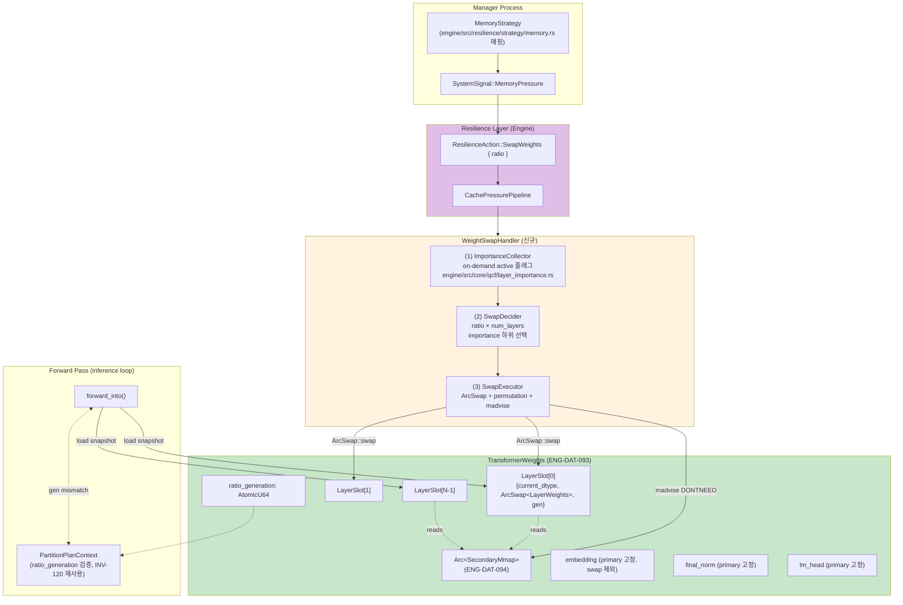
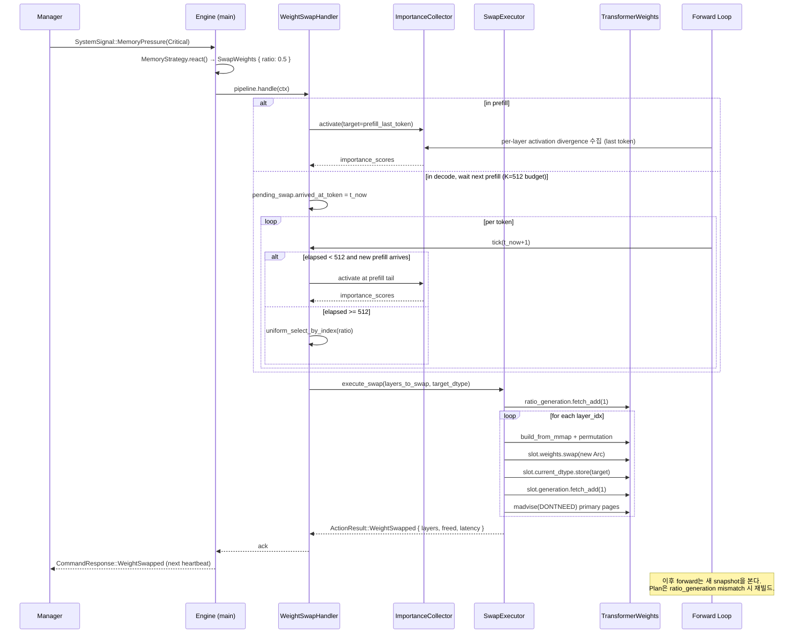
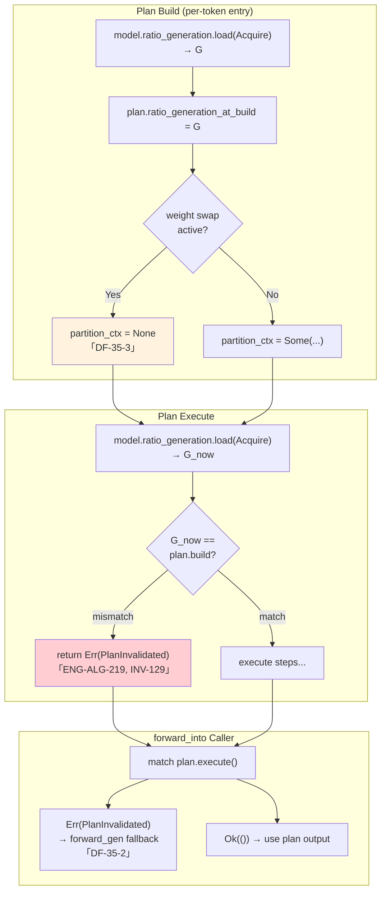
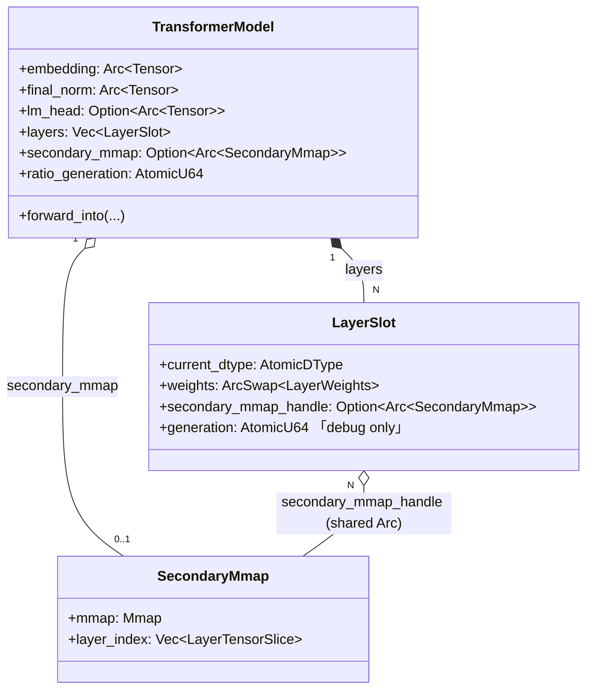
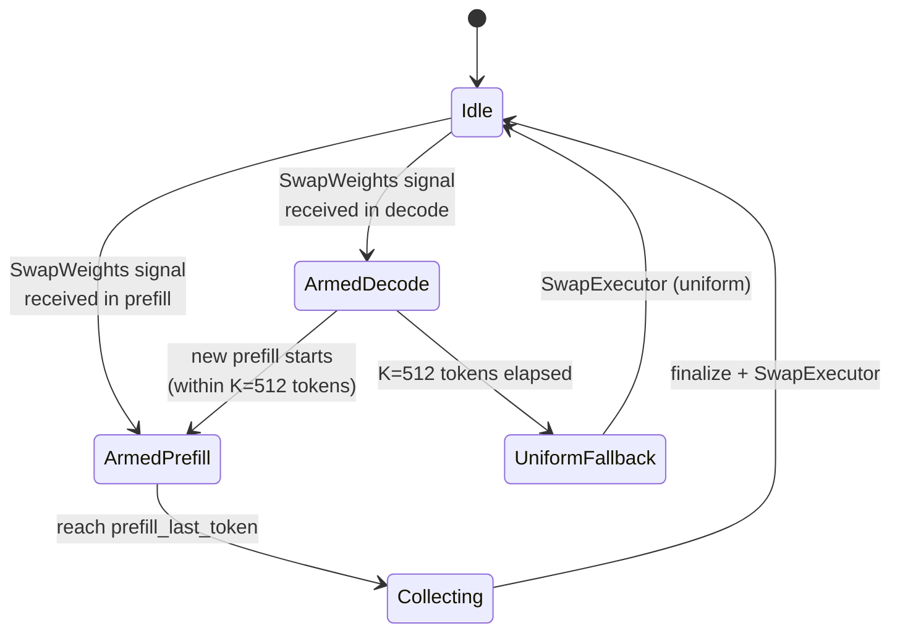
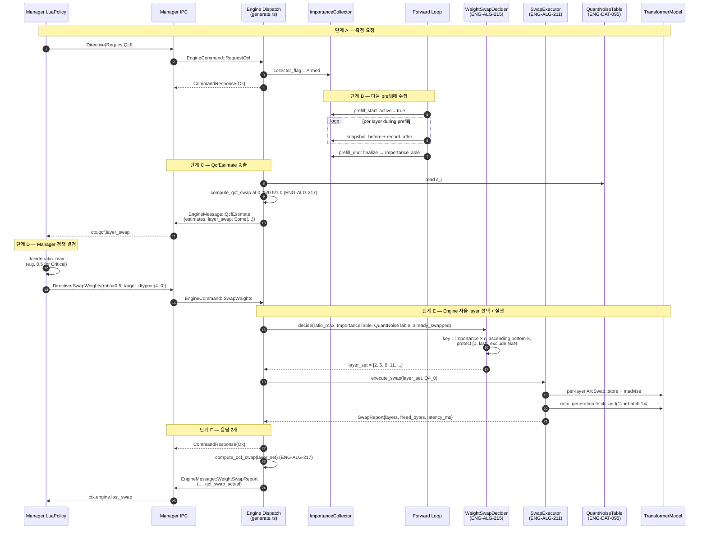
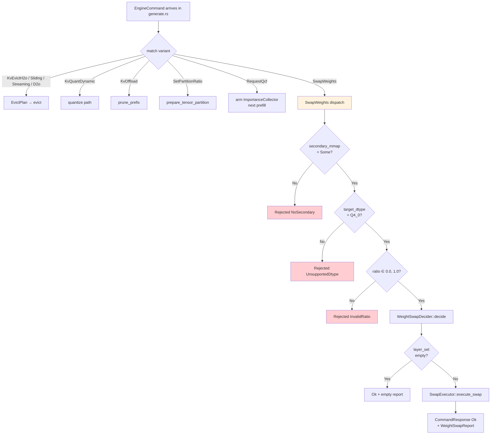
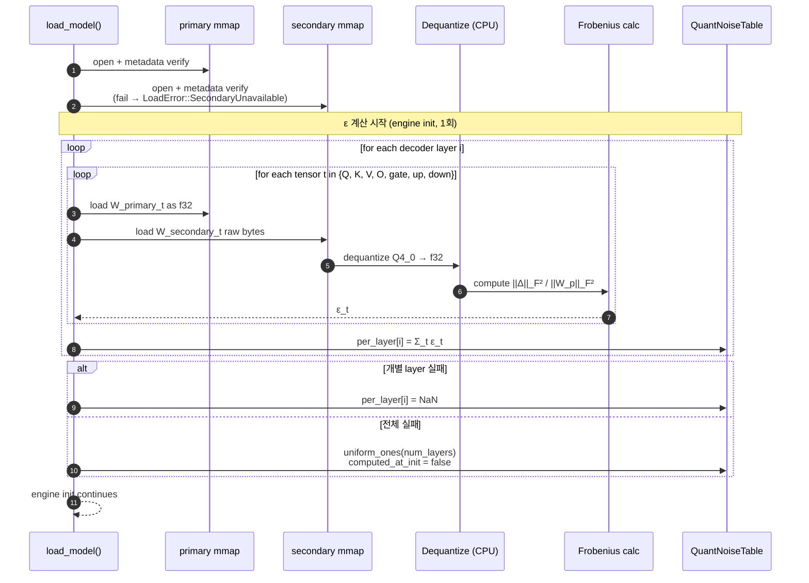
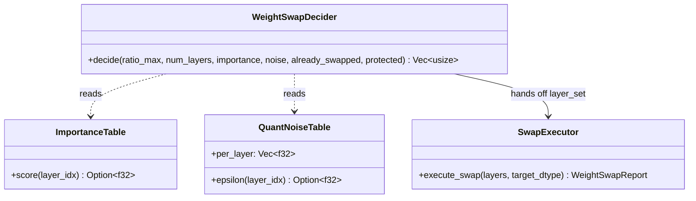
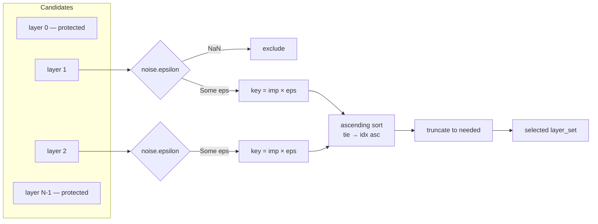

# Weight Swap — Dynamic Runtime Swap Architecture

> **상태**: Draft v5 (2026-04-25, Phase 3.5 Plan invalidation 통합 반영)
> **작성**: 2026-04-24, **갱신**: 2026-04-25
> **범위**: Manager 신호 기반 동적 weight swap. 평시 제로 오버헤드, on-demand 측정, Arc snapshot 기반 lock-free 교체, Manager가 상한 ratio/Engine이 layer 선택, plan 경로 lazy invalidation.
> **대상 스펙**:
>   - Phase 1/2: `spec/33-engine-data.md` §3.17~3.20 (ENG-DAT-090, 092, 093, 094), `spec/32-engine-algorithms.md` §3.12.1~3.12.7 (ENG-ALG-210~214, ENG-ALG-214-SNAP), `spec/41-invariants.md` §3.13 (INV-121~125).
>   - Phase 3: `spec/33-engine-data.md` §3.21 (ENG-DAT-095), `spec/32-engine-algorithms.md` §3.12.8~3.12.12 (ENG-ALG-214-ROUTE, ENG-ALG-215~218), `spec/41-invariants.md` §3.13 (INV-126~128), `spec/11-protocol-messages.md` (MSG-042, 082, 088, 089).
>   - **Phase 3.5 (NEW)**: `spec/32-engine-algorithms.md` §3.12.13~3.12.14 (ENG-ALG-219, ENG-ALG-220), `spec/41-invariants.md` §3.14 (INV-129).
> **대상 모델**: Llama 3.2 1B (16 decoder layers, no tying), Qwen 2.5 1.5B (28 decoder layers, tying 가능).
> **전제**: GGUF primary + GGUF secondary (dtype 다름). Safetensors는 부차 지원.

## 0. 폐기 기록 (Deprecation Notice)

**폐기일**: 2026-04-24.

**폐기 대상**:
- 정적 per-layer mixed precision 노선 전체.
- `LayerDtypeProfile` TOML 스키마 (`ENG-DAT-091`, **ID 재사용 금지**).
- `quantize_profile` 바이너리 및 offline calibration 흐름.
- CLI 플래그 `--layer-dtype-profile`.
- 구 `arch/weight_swap.md` v1의 Phase A 섹션 전체.

**폐기 사유**:
- 사용자 의도가 **런타임 동적 swap**이었음 (Android 메모리 극한 환경, Manager 신호 기반).
- 정적 프로파일은 배포 번거로움, calibration 파이프라인 필요, prefill 전 로딩 시간 증가 등 실용성 저해.
- Secondary 파일을 디스크에 둔 채 **평시 제로 오버헤드**가 최상위 요구사항.

**승계된 식별자**:
- `ENG-DAT-090` (LoadConfig) — 재정의.
- `ENG-ALG-210` — 의미 재정의 (정적 dispatch → 초기 uniform load).
- `INV-121/122` — 동적 swap 문맥으로 재정의.

---

---

## 1. 아키텍처 개요

### 1.1 전체 컴포넌트 다이어그램



### 1.2 시그널 → Swap 완료 Sequence



### 1.3 Llama vs Qwen 처리 차이

| 항목 | Llama 3.2 1B | Qwen 2.5 1.5B | 처리 분기 |
|------|--------------|---------------|----------|
| Decoder layer 수 | 16 | 28 | `num_layers`에서 자동 흡수 (ratio 기반) |
| Embedding/lm_head tying | 없음 | 있음 가능 | `LoadConfig`에서 `tie_word_embeddings` 판독, `lm_head` Option 처리 |
| Q/K permutation | GGUF convention | GGUF convention | **공통**, 분기 없음 (gguf.rs:514-534, 677-697) |
| Swap 대상 | decoder block 16개 | decoder block 28개 | `TransformerWeights::layers[i]`만, embedding/lm_head/final_norm은 제외 (ENG-DAT-C11) |
| ratio=0.25 swap 수 | 4 | 7 | `(ratio × num_layers).round()` |
| ratio=0.5 swap 수 | 8 | 14 | |
| ratio=1.0 swap 수 | 16 | 28 | |

**Architectural invariant**: swap 대상은 **decoder block layer만**. 모델별 분기는 `num_layers`와 `lm_head` 유무로 완전 흡수되며, SwapExecutor/SwapDecider 로직 자체는 모델 공통.

### 1.4 Per-token Atomic Snapshot 시점 (ENG-ALG-214-SNAP, INV-121)

Forward pass와 SwapExecutor는 **토큰 경계**에서만 상호작용한다. 토큰 내부에서는 snapshot 교체가 관측되지 않는다.

```mermaid
sequenceDiagram
    participant Fwd as Forward Loop<br/>(forward_into)
    participant Slot as LayerSlot[i].weights<br/>(ArcSwap)
    participant Exec as SwapExecutor
    participant Plan as PartitionPlanContext<br/>(INV-120)

    rect rgb(230, 245, 230)
    Note over Fwd: Token N 시작 — per-token snapshot 획득 (INV-121)
    loop for each layer i
        Fwd->>Slot: load_full() → Arc_old
        Slot-->>Fwd: Arc&lt;LayerWeights_old&gt;
        Fwd->>Slot: current_dtype.load()
        Slot-->>Fwd: DType_old
    end
    Fwd->>Plan: ratio_generation.load() → gen_0
    end

    rect rgb(255, 243, 224)
    Note over Fwd,Exec: Token N 처리 중 — Swap 동시 발생 (mid-token)
    par Forward 진행
        Fwd->>Fwd: layer loop 실행<br/>(Arc_old snapshots 재사용)
    and Swap 실행
        Exec->>Slot: store(Arc&lt;LayerWeights_new&gt;)<br/>「INV-123: 단일 원자 단계」
        Exec->>Slot: current_dtype.store(DType_new)<br/>「INV-124: 동일 논리 단계」
        Exec->>Exec: (batch 계속)
        Exec->>Plan: ratio_generation.fetch_add(1)<br/>「batch 완료 후 1회」
    end
    Note right of Fwd: Token N은 여전히 Arc_old 사용<br/>→ stale 관찰 0건 (INV-121)
    end

    rect rgb(230, 245, 230)
    Note over Fwd: Token N+1 시작 — 새 snapshot 획득
    Fwd->>Slot: load_full() → Arc_new
    Slot-->>Fwd: Arc&lt;LayerWeights_new&gt;
    Fwd->>Plan: ratio_generation.load() → gen_1
    Note right of Plan: gen_1 != gen_0 → PlanInvalidated<br/>plan 재빌드 or forward_gen fallback
    end
```

**핵심 규약**:
- Token 진입 시 `load_full()`을 각 layer에 대해 1회 호출 → `Vec<Arc<LayerWeights>>` 생성. 토큰 내내 이 벡터만 참조한다.
- 같은 토큰 내부에서 `slot.weights.*`를 **다시 읽지 않는다**. Mid-token swap이 발생해도 현재 토큰은 기존 snapshot으로 완주.
- 토큰 경계에서만 새 snapshot이 관측된다. `ratio_generation` 값도 토큰 경계에서 재획득되며, plan 빌드 경로가 이 값으로 stale 판정을 수행한다.

## 2. 컴포넌트 상세

### 2.1 컴포넌트: `LoadConfig` (ENG-DAT-090)

**설계 결정**:
- **이원화된 파일 역할**: `primary_source`는 초기 모든 layer 로딩 소스. `secondary_source`는 **초기 로딩에 사용되지 않는다** — metadata 검증과 `SecondaryMmap` 구축에만 사용되며, 실제 byte 접근은 `SwapExecutor` 런타임 단계에서 처음 발생한다.
- **per_layer_dtype 필드 제거**: 이전 정적 노선의 overlay 필드는 폐기. 런타임 dtype은 `LayerSlot::current_dtype`의 atomic state로 표현된다.
- **secondary None = swap 경로 비활성**: 한 파일만 제공되면 `WeightSwapHandler`는 NoOp. 평시 제로 오버헤드.

**인터페이스**:
```rust
// engine/src/models/loader/mod.rs
pub struct LoadConfig {
    pub primary_source: PathBuf,
    pub default_dtype: DType,
    pub secondary_source: Option<PathBuf>,   // swap reservation only
}
// 전제 (pre): primary_source 존재 확인
// 후조건 (post): secondary_source.is_some() ⇒ TransformerModel.secondary_mmap.is_some() (INV-125)
//                모든 layer의 current_dtype == default_dtype (초기 상태)
```

**구현 전환 일정 (Phase 1 → Phase 2)**:

- **Phase 1 (현재)**: `LoadConfig` struct는 `engine/src/models/loader/mod.rs`에 **선언만** 되어 있으며, 실제 loader 엔트리(`load_gguf_with_secondary` 등)는 여전히 `primary_path: &Path`, `default_dtype: DType`, `Option<&Path>` 를 **낱개 파라미터**로 받는다. 이 shim 시그니처가 Phase 1의 정답이다.
- **Phase 2 WSWAP-2-TRIGGER 커밋 (예정)**: `--force-swap-ratio` CLI 플래그 추가와 동반하여 loader 시그니처를 `pub fn load_model(config: LoadConfig) -> Result<TransformerModel, LoadError>` 단일 엔트리로 **일괄 전환**한다. CLI 파싱 → `LoadConfig` 구성 → `load_model` 호출이 유일한 경로가 된다.
- **이유**: Phase 1에서 시그니처까지 바꾸면 master merge 충돌 표면적이 불필요하게 커진다. struct 선언 + secondary mmap 인프라까지만 마감하고, trigger 커밋에서 한 번에 옮긴다.

---

### 2.2 컴포넌트: `LayerSlot` (ENG-DAT-092)

**설계 결정**:
- **ArcSwap 우선 권장**: `arc_swap::ArcSwap<LayerWeights>`는 lock-free snapshot 교체를 제공. Writer-serialized + reader-wait-free. Mutex 대비 forward hot path에서 zero contention.
- **대안 허용**: `RwLock<Arc<LayerWeights>>` 또는 epoch 기반 custom swap도 INV-121~124 충족 시 허용. **최종 선택은 Senior Implementer PoC에서 decode latency로 결정**.
- **`generation` 필드는 debug/tracing 전용**: forward hot path, plan invalidation, 재진입 판정 등 **정확성 경로에서 절대 참조하지 않는다**. 전역 `TransformerModel::ratio_generation` 하나가 정확성 트리거의 유일한 소스이다 (3-counter 표 참조).

**트레이드오프**:

| 구현 | Reader 비용 | Writer 비용 | 메모리 | 복잡도 |
|------|-------------|-------------|-------|--------|
| `ArcSwap<LayerWeights>` | atomic load + Arc clone (wait-free) | RCU 기반, 느린 edge case 존재 | +1 atomic ptr/slot | 중 (외부 crate 의존) |
| `RwLock<Arc<LayerWeights>>` | read lock + clone | write lock | lock 구조체 | 낮음 (std) |
| Custom epoch | wait-free load | epoch GC 필요 | epoch 추적 | 높음 |

**인터페이스**:
```rust
pub struct LayerSlot {
    pub current_dtype: AtomicDType,          // or AtomicU8 wrapping DType discriminant
    pub weights: ArcSwap<LayerWeights>,      // 권장; 대안 허용
    pub secondary_mmap_handle: Option<Arc<SecondaryMmap>>,
    pub generation: AtomicU64,               // DEBUG/TRACING ONLY (not read by forward/plan)
}
// 전제: weights의 dtype == current_dtype (INV-124 불변)
// 후조건: swap 후 generation += 1 (로그/테스트용), 신규 weights와 current_dtype 원자 단위로 갱신
```

#### 2.2.1 3-counter 관계 (generation counters)

본 설계에는 이름이 비슷한 세 개의 generation counter가 존재한다. 역할을 혼동하면 plan 재빌드가 누락되거나 forward가 stale 상태에 빠질 수 있으므로 아래 표를 단일 근거로 삼는다.

| 카운터 | 스코프 | 증가 주체 | 증가 단위 | 관찰자 | 용도 |
|--------|--------|-----------|-----------|--------|------|
| `LayerSlot::generation` | per-slot | `SwapExecutor` (step c) | slot 단일 swap마다 +1 | tracing/로그/테스트 | **Debug 전용**. 정확성 경로 참조 금지. |
| `TransformerModel::ratio_generation` | global | `SwapExecutor` (step e) | **batch 완료 후 정확히 1회** | Plan 빌드 경로, `PartitionPlanContext` | 전역 plan 재빌드 트리거의 유일한 소스. |
| `PartitionPlanContext::ratio_generation` (INV-120 기존) | plan snapshot | Plan 빌드 시점 | Plan 빌드 시 global 값 캡처 | `PartitionStep::run` | Plan stale 감지. mismatch 시 `PlanInvalidated`. |

**규칙**:
- `SwapExecutor`가 여러 layer를 한 batch로 교체할 때, per-layer loop에서는 `LayerSlot::generation`만 bump하고 전역 counter는 **건드리지 않는다**. batch 전체가 끝난 뒤 **단 한 번** `ratio_generation.fetch_add(1, SeqCst)` 를 호출한다 (ENG-ALG-211 step (e)).
- Forward hot path는 토큰 진입 시 `ratio_generation`을 **읽지 않는다** (per-token snapshot 규약으로 충분하므로). Plan 빌드 시점에만 비교 대상으로 사용된다.

#### 2.2.2 Plan 경로 소비 규약 (Phase 3.5, ENG-ALG-219, ENG-ALG-220, INV-129)

**핵심 변경 (v5, 2026-04-25)**: Phase 3에서 `SwapExecutor`가 `TransformerModel::ratio_generation`을 batch 단위 1회 bump하는 메커니즘은 정의되었으나, **plan 경로의 stale 감지 진입점**은 미정이었다 (Phase 3.5 OOS). v5에서 본 규약을 도입한다.

**규약 4종**:

1. **Build 시 snapshot**: `FullKernelPlan::build()`는 진입 시 `model.ratio_generation.load(Acquire)` 값을 plan struct의 `ratio_generation_at_build: u64` 필드에 기록한다.
2. **Execute 시 1회 비교**: `FullKernelPlan::execute()`는 진입부에서 `model.ratio_generation.load(Acquire)`와 `self.ratio_generation_at_build`를 비교한다. mismatch 시 `Err(PlanError::PlanInvalidated)` 반환.
3. **per-token 비용 = atomic load 1**: 비교는 토큰당 1회. layer 수나 step 수에 무관.
4. **Lazy rebuild + forward_gen fallback**: Caller(`forward_into`)는 `PlanInvalidated` 수신 시 `forward_gen` 경로로 fallback (DF-35-2). 다음 토큰 진입 시 자연 재빌드.

**상호 배타 (DF-35-3)**: weight swap이 활성화된 모델 인스턴스에서는 `FullKernelPlan` 빌드 시 `partition_ctx = None`으로 강제된다. tensor_partition × weight swap은 **상호 배타**이며 동시 활성을 지원하지 않는다.



**INV-120과의 OR 결합**:

| 검사 | 위치 | 검사 대상 | trigger 조건 |
|------|------|----------|-------------|
| INV-129 (전역) | `FullKernelPlan::execute()` 진입 1회 | `model.ratio_generation` | weight swap 또는 partition re-prep 모두 |
| INV-120 (per-context) | `PartitionStep::run()` 진입마다 | `PartitionPlanContext.ratio_generation_at_build` | partition re-prep |

두 검사는 **OR 결합**: 어느 하나라도 mismatch면 plan stale로 판정한다. weight swap만 발생한 경우 INV-129가 단독으로 catch (INV-120 컨텍스트는 변하지 않을 수 있음). partition re-prep만 발생한 경우 둘 다 catch (전역 카운터도 bump되므로) — redundancy는 안전 마진.

**ENG-ALG-220 (`entry_ratio_generation` 소비)**:
- `forward_into`는 토큰 진입 시 `entry_ratio_generation = model.ratio_generation.load(Acquire)`를 1회 capture (INV-121 per-token snapshot과 동일 시점).
- 동일 토큰 내 plan 빌드 시 이 값을 plan에 전달 → `plan.ratio_generation_at_build = entry_ratio_generation`.
- Mid-token swap이 발생해도 현재 토큰의 plan은 snapshot 값으로 비교한다 → mismatch catch → `forward_gen` fallback. layer Arc snapshot도 INV-121에 의해 토큰 내 재사용되므로 stale weights 노출 0건.

**스펙 cross-ref**:
- ENG-ALG-219: `FullKernelPlan` 진입 1회 atomic load 비교.
- ENG-ALG-220: `entry_ratio_generation` 캡처 + plan 전달 의무.
- INV-129: 전역 plan stale 감지 불변식.
- INV-120: per-partition stale (별도, OR 결합).
- INV-121: per-token forward snapshot (layer Arc).

---

### 2.3 컴포넌트: Swap 필드는 `TransformerModel`의 flat 배치 (ENG-DAT-093)

**설계 결정 (2026-04-24 확정)**:
- **별도의 `TransformerWeights` wrapper struct를 두지 않는다.** Swap 관련 필드는 모두 `TransformerModel`(`engine/src/models/transformer.rs`)의 flat 멤버로 배치한다.
- 근거: `TransformerModel`은 이미 embedding/final_norm/lm_head를 자체 필드로 보유한다. 독립 struct로 묶을 경우 **이중 소유 또는 중복 필드**가 발생한다. Phase 1 구현에서 이를 회피하기 위해 `engine/src/models/weights/transformer_weights.rs`에 `TransformerWeights` struct를 선언만 해 두었으나 **실사용처가 0**이다 — 죽은 추상화이다.
- Phase 2 구현 진입 시 `engine/src/models/weights/transformer_weights.rs` 파일 및 `mod.rs`의 pub re-export를 제거한다. 이름 `TransformerWeights`는 폐기되며, **식별자 `ENG-DAT-093`은 본 flat 배치로 의미 승계**된다.
- **Cross-layer tensor 분리**: embedding/final_norm/lm_head는 `TransformerModel`의 기존 필드 그대로 사용. Swap 대상이 아니므로 `LayerSlot` 래핑 불필요.
- **secondary_mmap은 최후 소유권**: `TransformerModel`이 `Arc<SecondaryMmap>`의 "keeper". 모든 `LayerSlot::secondary_mmap_handle`은 여기서 clone된 Arc를 공유. INV-125를 구조적으로 보장.
- **ratio_generation은 Plan 재빌드 트리거의 단일 소스**: 기존 `PartitionPlanContext::ratio_generation`(INV-120)과 **의미 통합**. Plan stale 감지 메커니즘 단일화.

**실구조 (Phase 1 구현 반영)**:
```rust
// engine/src/models/transformer.rs
pub struct TransformerModel {
    // 기존 필드 (재사용)
    pub embedding: Arc<Tensor>,
    pub final_norm: Arc<Tensor>,
    pub lm_head: Option<Arc<Tensor>>,

    // Phase 1에서 추가된 swap 필드 (ENG-DAT-093 대응)
    pub layers: Vec<LayerSlot>,
    pub secondary_mmap: Option<Arc<SecondaryMmap>>,
    pub ratio_generation: AtomicU64,

    // ... 기타 기존 필드 ...
}
```

**구조 다이어그램**:



**코드-스펙 차이 / Phase 1 구현 현황**:

| 항목 | 상태 | 조치 |
|------|------|------|
| `TransformerModel`에 `layers: Vec<LayerSlot>`, `secondary_mmap`, `ratio_generation` flat 필드 | 구현 완료 | 유지 |
| `engine/src/models/weights/transformer_weights.rs`의 `TransformerWeights` struct | 죽은 선언 (미사용) | **Phase 2 구현 진입 시 파일 및 pub re-export 삭제** (코드 수정은 Implementer 담당) |
| `mod.rs`의 `pub use transformer_weights::*` | 미사용 re-export | Phase 2에서 함께 제거 |

---

### 2.4 컴포넌트: `SecondaryMmap` (ENG-DAT-094)

**설계 결정**:
- **Read-only mmap**: `memmap2::Mmap` (아님 `MmapMut`). 파일은 절대 수정 대상 아님.
- **Layer tensor 인덱스 사전 구축**: open 시 GGUF header 1회 파싱으로 `layer_index: Vec<LayerTensorSlice>` 완성. 이후 lookup은 O(1).
- **Lazy 접근**: mmap은 열려있지만 page-in은 커널이 first-touch 시 수행. `SwapExecutor` 첫 호출 시 IO가 발생.
- **Swap 범위: decoder block layer로 고정**: embedding / final_norm / lm_head 등 cross-layer tensor는 swap 대상이 아니므로 `SecondaryMmap`도 이에 대한 offset 정보를 **보관하지 않는다**. 메타데이터 정합성은 loader가 open 시점에 로컬 변수로 확인하고 폐기한다.

**인터페이스**:
```rust
pub struct SecondaryMmap {
    pub mmap: memmap2::Mmap,
    pub layer_index: Vec<LayerTensorSlice>,   // indexed by layer_idx, length == num_layers
    // (cross_layer_offsets 필드는 제거됨 — Phase 1에서 populate만 되고 read 경로 없음)
}
pub struct LayerTensorSlice {
    pub tensors: HashMap<String /* subname */, (u64 /* offset */, u64 /* len */, DType, Vec<usize> /* shape */)>,
}
```

**코드-스펙 차이 / Phase 1 구현 현황**:

| 항목 | 상태 | 조치 |
|------|------|------|
| `mmap`, `layer_index`, `metadata` 필드 | 구현 완료 | 유지 |
| `cross_layer_offsets: HashMap<String, (u64, u64, DType)>` 필드 | **Phase 1에서 populate만 되고 read 경로 0** | **Phase 2 구현 진입 시 필드 및 채우는 코드 삭제** (코드 수정은 Implementer 담당). 향후 non-layer tensor swap 필요 시 별도 신규 필드/ID로 재도입. |

---

### 2.5 컴포넌트: `WeightSwapHandler` (ENG-ALG-214)

**설계 결정**:
- **`CachePressureHandler` 구현**: 기존 pipeline trait을 준수하여 `CachePressurePipeline`에 등록 가능. KV `SwapHandler`(ENG-ALG-092)와 **독립 handler**로 나란히 동작.
- **HandlerContext 확장**: `swap_weights_ratio: Option<f32>` 필드 추가. Pipeline이 Resilience에서 받은 ratio를 context에 주입.
- **측정-결정-실행 3단계**: (1) ImportanceCollector 활성화/결과 수신, (2) SwapDecider, (3) SwapExecutor. 각 단계는 분리된 struct로 테스트 용이성 확보.

**인터페이스**:
```rust
pub struct WeightSwapHandler {
    weights: Arc<TransformerWeights>,
    collector: Arc<Mutex<ImportanceCollector>>,  // on-demand active 플래그 포함
    already_swapped: Mutex<HashSet<usize>>,
    pending_swap: Mutex<Option<PendingSwap>>,
    fallback_k: u64,   // default 512
}

impl CachePressureHandler for WeightSwapHandler {
    fn handle(&self, ctx: &mut HandlerContext) -> ActionResult {
        let Some(ratio) = ctx.swap_weights_ratio else { return ActionResult::NoOp };
        // ImportanceCollector 활성화 or wait next prefill or uniform fallback
        // SwapDecider → SwapExecutor
    }
}
```

---

### 2.6 컴포넌트: `ImportanceCollector` on-demand 확장

**설계 결정**:
- **기존 코드 재사용**: `engine/src/core/qcf/layer_importance.rs`의 `ImportanceCollector`/`ImportanceTable` 그대로 사용.
- **`active: AtomicBool` 플래그 추가**: 기본값 `false`. Hot path에서 `active.load(Relaxed)` 한 번으로 조기 반환하여 **평시 제로 오버헤드** 달성.
- **Prefill-tail 측정**: `active == true`이고 현재 토큰 == `tail_target_token`일 때만 divergence 수집.

**처리 흐름**:



---

### 2.7 컴포넌트: `SwapExecutor` (ENG-ALG-211)

**설계 결정**:
- **Per-layer 순차 실행**: 병렬 swap은 madvise 힌트 충돌과 IO 스파이크 우려로 배제. 순차가 총 latency에 더 유리 (측정으로 재확인).
- **Q/K permutation 재사용**: primary loader의 permutation 함수를 `SwapExecutor`가 직접 호출. dtype에 무관하므로 분기 없음.
- **madvise 2단계**: step (c) `ArcSwap::store` 직후 old Arc에 잡힌 primary 페이지 힌트 전달. old가 forward에 잡혀 있으면 drop까지 지연되며, 최종 회수는 커널 판단.
- **`ratio_generation` bump는 batch 단위 1회**: per-layer loop 내부에서는 `LayerSlot::generation`(debug 전용)만 증가시키고, batch 전체 swap이 끝난 뒤 `TransformerModel::ratio_generation.fetch_add(1, SeqCst)` 를 **정확히 1회** 호출한다. 이 한 번의 bump가 plan invalidation의 유일한 trigger이다 (INV-120, 3-counter 표 참조).

**처리 흐름**:


**예외 처리**:

| 조건 | 처리 | 스펙 |
|------|------|------|
| `secondary_mmap == None` | NoOp 반환 | ENG-DAT-C09 |
| layer_idx 범위 밖 | skip (NoOp for that layer) | ENG-DAT-C08 |
| 이미 swap된 layer | skip | ENG-ALG-211 |
| permutation 실패 | panic (logic bug) | — |
| madvise EINVAL | 로그 후 계속 (수치 결과는 유지) | ENG-ALG-C05 |
| batch swap 결과가 비어있음 (전 layer skip) | `ratio_generation` **bump 생략** | ENG-ALG-211 |

---

### 2.8 컴포넌트: `ResilienceAction::SwapWeights` (engine 내부) vs `EngineCommand::SwapWeights` (shared)

**중요 정정 (2026-04-24 v4)**: 이전 arch 초안은 `ResilienceAction`을 shared crate의 enum으로 서술했으나, 실구조는 **engine 내부 enum**이다 (`engine/src/resilience/strategy/mod.rs`). Phase 3에서 Manager 통합은 **shared의 `EngineCommand` enum에 variant를 추가**하는 별개 경로로 수행된다.

**두 경로의 구분**:

| 타입 | 위치 | 역할 | Phase 3 처리 |
|------|------|------|-------------|
| `ResilienceAction::SwapWeights { target_ratio }` | `engine/src/resilience/strategy/mod.rs` (내부 enum) | Engine 내부 `MemoryStrategy::react()`가 Manager 없이 생성하는 fallback action | **Phase 3 신규 variant로 추가 권장** (Phase 2 범위에선 미추가). dispatch는 최종적으로 Phase 3의 공통 helper로 귀결. shared 프로토콜과 무관. |
| `EngineCommand::SwapWeights { ratio, target_dtype }` | `shared/src/lib.rs` (프로토콜 enum) | Manager → Engine IPC payload | **MSG-042로 정의**. shared crate에 필수 추가. |

**설계 결정**:

- **ENG-ALG-214-ROUTE**: `generate.rs` dispatch 루프에 단일 `handle_swap_weights(ratio, target_dtype)` 함수를 추가한다. 두 진입점(shared `EngineCommand` / engine internal `ResilienceAction`)이 이 함수를 공유한다.
- **MemoryStrategy 기본 매핑 (engine-internal fallback)**:
  - `MemoryPressure::Critical → ResilienceAction::SwapWeights { target_ratio: 0.5, target_dtype: Q4_0 }`
  - `MemoryPressure::Emergency → ResilienceAction::SwapWeights { target_ratio: 1.0, target_dtype: Q4_0 }`
  - 이는 **Manager가 응답 지연 시**의 engine-independent fallback용이다. Manager가 활성화되면 Manager의 LuaPolicy 결정이 우선한다 (더 최신 signal).
- **프로토콜 호환성**: shared 쪽 신규 필드는 `#[serde(default, skip_serializing_if = "Option::is_none")]` 원칙(INV-028) 준수. 구 Manager는 `layer_swap`/`weight_swap_report`를 모르는 상태로도 동작 가능.

**인터페이스 (shared, MSG-042/082/089)**:
```rust
// shared/src/lib.rs
#[derive(Serialize, Deserialize, Debug, Clone, Copy, PartialEq, Eq)]
#[serde(rename_all = "snake_case")]
pub enum DtypeTag {
    Q4_0,
    F16,
    F32,
    Q8_0,
}

pub enum EngineCommand {
    // ... 기존 14 variant ...
    SwapWeights { ratio: f32, target_dtype: DtypeTag },
}

pub enum EngineMessage {
    // ... 기존 4 variant ...
    WeightSwapReport(WeightSwapReport),
}
```

**인터페이스 (engine 내부, Phase 3 권장 신규)**:
```rust
// engine/src/resilience/strategy/mod.rs
pub enum ResilienceAction {
    // ... 기존 variant ...
    SwapWeights { target_ratio: f32, target_dtype: DtypeTag },  // DtypeTag는 shared에서 re-export
}
```

---

## 3. Config / CLI

| 키/플래그 | 타입 | 기본값 | spec 근거 |
|-----------|------|--------|-----------|
| `--model-path` | String | (기존) | ENG-DAT-070 |
| `--model-path-secondary` | `Option<String>` | None | ENG-DAT-090 |
| `--force-swap-ratio` | `Option<f32>` | None | Debug hook. Manager 없이 prefill 종료 시 `SwapWeights { ratio }` 직접 트리거. |

---

## 4. 테스트 요구사항

| 테스트 대상 | 위치 | 스펙 |
|-------------|------|------|
| LoadConfig secondary reservation | `engine/tests/spec/test_eng_dat_090_load_config.rs` | ENG-DAT-090 |
| LayerSlot atomic swap | `engine/tests/spec/test_eng_dat_092_layer_slot.rs` | ENG-DAT-092, INV-124 |
| TransformerWeights 구조 | `engine/tests/spec/test_eng_dat_093_transformer_weights.rs` | ENG-DAT-093 |
| SecondaryMmap layer index | `engine/tests/spec/test_eng_dat_094_secondary_mmap.rs` | ENG-DAT-094 |
| 초기 uniform 로딩 | `engine/tests/spec/test_eng_alg_210_initial_load.rs` | ENG-ALG-210 |
| SwapExecutor end-to-end | `engine/tests/spec/test_eng_alg_211_swap_executor.rs` | ENG-ALG-211 |
| ImportanceCollector on-demand 활성화 + K=512 fallback | `engine/tests/spec/test_eng_alg_212_importance_activation.rs` | ENG-ALG-212 |
| SwapDecider ratio 계산 + already_swapped 제외 | `engine/tests/spec/test_eng_alg_213_swap_decider.rs` | ENG-ALG-213 |
| WeightSwapHandler 통합 (manual trigger) | `engine/tests/spec/test_eng_alg_214_weight_swap_handler.rs` | ENG-ALG-214 |
| Forward 재진입 안전성 (stress 10K+) | `engine/tests/spec/test_inv_121_swap_reentrancy.rs` | INV-121 |
| Mixed precision 정확성 (Llama + Qwen, ratio 0.25/0.5/1.0) | `engine/tests/spec/test_inv_122_mixed_precision.rs` | INV-122 |
| ArcSwap atomicity (lock-free reader/writer) | `engine/tests/spec/test_inv_123_swap_atomicity.rs` | INV-123 |
| LayerSlot current_dtype 일관성 | `engine/tests/spec/test_inv_124_slot_dtype_consistency.rs` | INV-124 |
| SecondaryMmap lifetime 보장 | `engine/tests/spec/test_inv_125_secondary_mmap_lifetime.rs` | INV-125 |
| SwapWeights serde round-trip | `shared/tests/spec/test_msg_080_swap_weights.rs` | MSG-080 |
| EngineCommand SwapWeights 처리 | `shared/tests/spec/test_msg_081_swap_cmd.rs` | MSG-081 |

---

## 5. Phase 실측 계획 (Llama + Qwen)

| 메트릭 | Llama 3.2 1B | Qwen 2.5 1.5B | 측정 도구 |
|--------|--------------|---------------|----------|
| PSS 감소 (ratio=0.25) | target ≥ 6% | target ≥ 6% | /proc/self/smaps_rollup |
| PSS 감소 (ratio=0.5) | target ≥ 12% | target ≥ 12% | |
| PSS 감소 (ratio=1.0) | target ≥ 25% | target ≥ 25% | |
| Swap latency (per layer) | < 50 ms | < 50 ms | ActionResult::WeightSwapped.latency_ms |
| TBT 증가 (swap 직후 토큰) | < 20% | < 20% | `Decode: X ms/tok` 로그 |
| INV-122 충족 여부 | pass | pass | test_inv_122_mixed_precision.rs |

실측 환경: Galaxy S25 (Android), OpenCL backend. `run_device.py -d s25` 경유. 6T 스레드 설정.

---

## 6. 알려진 미결 사항

1. **Arc snapshot 최종 구현**: ArcSwap vs RwLock vs custom. Senior Implementer PoC의 decode TBT 측정으로 결정 (스펙은 ArcSwap 권장하되 대안 허용).
2. **K=512 fallback 값**: 실측 후 조정 여지. Prefill 빈도가 낮은 워크로드에서 더 큰 값이 유리할 가능성.
3. **Secondary 파일 open 실패 정책**: `LoadConfig::secondary_source`가 Some이나 파일 부재 시 (a) 에러로 중단 vs (b) warning 후 primary-only 진행 중 어느 쪽이 기본? 현재 초안은 (a). 최종 결정은 `generate` CLI 사용자 경험 검토 필요.
4. **Manager 측 정책 조정**: `MemoryPressure::Critical → SwapWeights { ratio: 0.5 }`의 ratio는 정책 기본값. LuaPolicy에서 override 가능하게 설계할지 여부는 Manager팀 결정.
5. **Backend별 신규 Buffer 래핑 경로**: Swap 후 새 `LayerWeights` 생성 시 `rewrap_weights_for_dual_access()` 호출 타이밍. 현 초안은 `SwapExecutor` 내에서 ArcSwap::swap 전에 완료. OpenCL 백엔드에서 zero-copy 보장 확인 필요.

---

## 3. Phase 3 Manager 통합 (2026-04-24)

Phase 3은 Phase 1/2에서 구축한 Engine 내부 인프라에 Manager 경로를 연결한다. 핵심 결정:

1. **라우팅 (ENG-ALG-214-ROUTE)**: `EngineCommand::SwapWeights`는 `generate.rs`의 command dispatch 루프에서 **직접** 수신. Pipeline 자동 dispatch는 사용하지 않는다.
2. **Manager = 상한, Engine = 선택**: Manager가 `ratio` 상한만 지정하고 Engine의 `WeightSwapDecider`(ENG-ALG-215)가 실제 layer 집합을 결정.
3. **Payload**: `{ ratio, target_dtype: DtypeTag }`. Q4_0만 Phase 3 유효, 나머지는 reserved.
4. **QCF on-demand (ENG-ALG-218)**: `RequestQcf` → 다음 prefill에 `ImportanceCollector` 주입 → finalize → `QcfEstimate.layer_swap` 응답.
5. **ε eager 측정 (ENG-ALG-216, ENG-DAT-095)**: engine init에서 `QuantNoiseTable` 1회 계산, 이후 Decider의 독립 입력.

### 3.1 End-to-End 시퀀스



### 3.2 Command Dispatch 구조



### 3.3 Routing 결정 — Pipeline vs Direct dispatch

| 관점 | Pipeline 경로 (기각) | Direct dispatch (채택) |
|------|---------------------|------------------------|
| Trigger | PressureLevel 자동 (Warning 이상) | Manager 명시적 EngineCommand |
| 기존 유사 패턴 | `EvictionHandler`, `D2OHandler` (KV) | `KvEvictH2o`, `SetPartitionRatio` 등 모든 Manager command |
| Ratio 결정 | Engine 내부 (PressureLevel → ratio 매핑) | Manager LuaPolicy |
| Test 표면적 | Pipeline + handler + context | Dispatch test + decider unit test + executor integration |
| Stage 2 `weight_swap_handler.rs` | 등록 대상 | 내부 오케스트레이터로 유지 (재사용 모듈) |

Stage 2 `weight_swap_handler.rs`는 `CachePressurePipeline`에 **등록하지 않는다**. 대신 "Decider → Executor" 호출을 캡슐화하는 내부 모듈로 격하한다. 이 경우 Stage 2 테스트(WSWAP-2-HANDLER)는 그대로 유효하며, 단지 Pipeline dispatch test만 제거된다.

**engine 내부 fallback 경로**: `ResilienceAction::SwapWeights`(engine 내부 enum)은 별도 경로이다. `MemoryStrategy`(`engine/src/resilience/strategy/memory.rs`)가 Manager 없이 engine 독립으로 swap을 트리거할 때 발행하는 engine-internal action이다. 이는 `generate.rs`의 resilience action loop에서 **동일한** dispatch 함수(SwapWeights 처리 코드)로 귀결된다. 즉 두 진입점이 있으나 공통 Decider + Executor를 공유한다. `ResilienceAction::SwapWeights`는 shared crate에 노출되지 않으며 테스트 대상도 아니다.

### 3.4 LuaPolicy API shape 예시

Manager LuaPolicy는 `ctx.qcf.layer_swap`과 `ctx.engine.last_swap`을 읽어 결정한다. 본 arch는 Python/Lua 코드를 규정하지 않으나 기본 shape 예시:

```lua
-- 1. QCF 기반 결정
if ctx.memory.level == "critical" and ctx.qcf.layer_swap then
    local qcf_at_half = ctx.qcf.layer_swap.qcf_swap_at_ratio["0.5"]
    if qcf_at_half < 0.3 then
        return { action = "swap_weights", ratio = 0.5, target_dtype = "q4_0" }
    else
        return { action = "swap_weights", ratio = 0.25, target_dtype = "q4_0" }
    end
end
```

구체 Lua 바인딩 계약은 Manager 쪽 arch에서 다룬다 (Phase 3 구현 단계에서 확정).

---

## 4. ε 측정 (QuantNoiseTable Eager 빌드)

### 4.1 흐름



### 4.2 계산 비용과 progress log

| 모델 | 총 deq + Frob 바이트 | 호스트 CPU 예상 latency | progress log |
|------|---------------------|------------------------|--------------|
| Llama 3.2 1B | 16 layer × ~110 MiB | 200~500ms (호스트 x86) | 불요 |
| Qwen 2.5 1.5B | 28 layer × ~55 MiB | 300~700ms | 불요 |
| (hypothetical) Llama 3B | 32 layer × ~220 MiB | 2~5s (저성능 Android) | 권장 (레이어 단위 stderr) |

**실패 fallback 시 degradation**: `computed_at_init = false, per_layer == [1.0; N]`. Decider의 key `importance × ε`에서 ε가 상수이므로 **importance만으로** 정렬된다. 이는 ENG-ALG-213 (Phase 2 단순 decider)와 동치 경로로, 정상 동작의 손실 하한선이다.

### 4.3 Implementer-facing 구현 힌트 (non-normative)

- `engine/src/models/weights/` 디렉토리에 신규 파일 `quant_noise.rs` 추가를 권장.
- Dequantize는 `engine/src/backend/cpu_neon.rs`의 `dequantize_q4_0_block` 유사 함수를 재사용. GPU path 아님 (init 시점엔 GPU buffer 미생성).
- Frobenius는 단순 `(a - b).powi(2).sum()` 루프로 충분. SIMD 최적화는 불필요(1회 비용).
- 실패 감지: try-catch 대신 `Result<f32, NoiseError>`와 layer 단위 graceful degradation. panic 금지.

---

## 5. WeightSwapDecider — Layer 선택 알고리즘

### 5.1 컴포넌트 구성



**배치**: `engine/src/models/weights/decider.rs` (권장). `engine/src/core/pressure/weight_swap_handler.rs`(Stage 2)와 다른 파일에 독립 배치하여 "Decider" 책임(선택)과 "Handler/Orchestrator" 책임(오케스트레이션)을 물리적으로 분리.

### 5.2 Key 계산과 tie-breaking



### 5.3 Uniform fallback 트리거

| 상황 | 경로 |
|------|------|
| `ImportanceTable == None` (RequestQcf 없이 SwapWeights만 도착) | Uniform fallback (균등 간격 index 선택) |
| `QuantNoiseTable == None` (secondary 부재) | 도달 불가 (dispatch 단계에서 Rejected) |
| `QuantNoiseTable::computed_at_init == false` (계산 실패 전체 fallback) | importance×1.0 정렬 (degrade, but not uniform) |
| `QuantNoiseTable::epsilon(i) == None` (layer i만 실패) | layer i 후보 제외, 나머지는 정상 정렬 |

### 5.4 이미 swap된 layer의 처리

Decider는 `already_swapped: &HashSet<usize>`를 입력받아 후보에서 **제외**한다. "상한" 의미(ENG-ALG-215)에서 `needed = target_count - already_swapped.len()`이다. 즉 Manager가 ratio=0.5를 거듭 지시해도 이미 8개가 swap되어 있다면 추가 선택은 0이다. 단방향 유지.

---

## 6. Phase 3.5 In-scope — Plan Invalidation 통합 (2026-04-25 승격)

> **상태 변경**: 이전 v4의 "Phase 3.5 Out-of-scope" 섹션은 v5에서 **In-scope로 승격**되었다. 본 섹션은 이미 §2.2.2에서 정의된 ENG-ALG-219 / ENG-ALG-220 / INV-129 규약의 작업 범위와 결정 근거를 정리한다.

### 6.1 결정 플래그 (DF-35-1 ~ DF-35-4)

| ID | 결정 | 채택안 | 근거 |
|----|------|--------|------|
| **DF-35-1** | Plan stale 감지 위치 | `FullKernelPlan::execute()` 진입 1회 atomic load 비교 | 토큰당 비용 atomic load 1회. layer/step 수에 무관. INV-120 per-partition 검사와 OR 결합. |
| **DF-35-2** | Stale 감지 후 처리 | Lazy rebuild — `PlanInvalidated` 반환 → caller가 `forward_gen` fallback | 재빌드 비용을 토큰 경계로 흡수. 현재 토큰은 `forward_gen`으로 완주, 다음 토큰부터 새 plan. |
| **DF-35-3** | tensor_partition × weight swap | **상호 배타** — swap 활성 시 `partition_ctx = None` 강제 | 두 메커니즘 동시 활성 시 plan invalidation 의미 모호 (어느 trigger 우선). race 윈도우 발생. |
| **DF-35-4** | Phase 3.5 작업 범위 | (c) Plan invalidation만. Noshuffle SOA는 **WSWAP-3.6 별도 작업** | 리스크 분리. SOA 변경은 layer 레이아웃 전반에 영향. |

### 6.2 작업 범위 (Phase 3.5)

**In-scope**:
1. `engine/src/core/plan.rs`의 `FullKernelPlan` struct에 `ratio_generation_at_build: u64` 필드 추가.
2. `FullKernelPlan::build()` 진입에서 `model.ratio_generation.load(Acquire)` capture (ENG-ALG-220).
3. `FullKernelPlan::execute()` 진입에서 atomic load 비교 + `PlanInvalidated` 반환 (ENG-ALG-219).
4. `forward_into`에서 `PlanInvalidated` 수신 시 `forward_gen` fallback 분기 (DF-35-2).
5. Weight swap 활성 인스턴스에서 partition_ctx 강제 None (DF-35-3).
6. spec test: `engine/tests/spec/test_eng_alg_219_plan_invalidation.rs` (Implementer 작성).

**Out-of-scope (Phase 3.5에서 하지 않는 것)**:
- Noshuffle SOA / per-layer 메모리 레이아웃 변경 → **WSWAP-3.6**에서 별도 처리.
- `ratio_generation`의 multi-source bump API 변경. 단일 source(SwapExecutor batch + partition prep)는 v3에서 정의된 채로 유지.
- `forward_gen` 경로의 성능 최적화. fallback은 정합성 우선이며 성능은 다음 토큰의 plan 재빌드로 회수.
- tensor_partition × weight swap 동시 활성 지원. **명시적 상호 배타**(DF-35-3).

### 6.3 cross-ref

- 알고리즘: `spec/32-engine-algorithms.md` §3.12.13 (ENG-ALG-219), §3.12.14 (ENG-ALG-220).
- 불변식: `spec/41-invariants.md` §3.14 (INV-129).
- 컴포넌트 규약: 본 문서 §2.2.2.
- 테스트: `engine/tests/spec/test_eng_alg_219_plan_invalidation.rs` (Phase 3.5 구현 단계).

---

## 7. 변경 이력

- **2026-04-25 (v5, Phase 3.5 Plan invalidation 통합)**:
  1. §2.2.2 "Plan 경로 소비 규약" 신규. ENG-ALG-219 / ENG-ALG-220 / INV-129 cross-ref.
  2. §6 "Phase 3.5 Out-of-scope" → "Phase 3.5 In-scope"로 승격. 결정 플래그 DF-35-1~DF-35-4 채택안 명시.
  3. 헤더 대상 스펙에 Phase 3.5 ID 추가 (ENG-ALG-219, 220 / INV-129).
  4. tensor_partition × weight swap 상호 배타 결정(DF-35-3) 명문화. Noshuffle SOA는 WSWAP-3.6 별도 작업으로 분리(DF-35-4).
  5. 본 작업은 plan invalidation만. layer 메모리 레이아웃 변경 미포함.
- **2026-04-24 (v4, Phase 3 Manager 통합)**:
  1. §3 Manager 통합 신규 (E2E sequence, dispatch flowchart, routing 결정 근거, LuaPolicy shape).
  2. §4 ε 측정 (QuantNoiseTable eager 빌드, fallback 규약, 비용 표) 신규.
  3. §5 WeightSwapDecider 컴포넌트 (importance × ε bottom-k, tie-breaking, fallback trigger) 신규.
  4. §6 Phase 3.5 Out-of-scope (`_entry_ratio_generation` plan invalidation) 신규.
  5. 스펙 ID 추가: ENG-ALG-214-ROUTE, ENG-ALG-215~218, ENG-DAT-095, INV-126~128, MSG-042, MSG-082, MSG-088, MSG-089.
  6. Stage 2 `weight_swap_handler.rs`의 포지션 재정의 (Pipeline 비등록, 내부 orchestrator 유지).
- **2026-04-24 (v3, Phase 1 구현 반영 + Spec 명확화 5건)**:
  1. `TransformerWeights` struct 폐기, `TransformerModel` flat 배치로 재정의 (ENG-DAT-093 의미 승계, Phase 2에서 죽은 파일 제거).
  2. Layer 간 dtype 혼합 = 정상 상태 명시. Per-token atomic snapshot 규약(ENG-ALG-214-SNAP, INV-121 재작성) 도입. Mermaid sequence diagram §1.4 추가.
  3. `SecondaryMmap::cross_layer_offsets` 필드 제거 결정 + swap 범위 "decoder layer only" 제약 명시.
  4. 3개 generation counter 역할 표 추가 (§2.2.1): `LayerSlot::generation` = debug only, `TransformerModel::ratio_generation` = 전역 plan 트리거 단일 소스 (batch 단위 1회 bump), `PartitionPlanContext::ratio_generation` = plan 빌드 snapshot. SwapExecutor Mermaid flow 갱신.
  5. `LoadConfig` 전환 시점을 Phase 2 WSWAP-2-TRIGGER 커밋으로 확정 (§2.1).
- **2026-04-24 (v2, 전면 재작성)**: 정적 per-layer mixed precision 노선 폐기. Manager 신호 기반 동적 swap으로 전환. ENG-DAT-091 + `quantize_profile` + `--layer-dtype-profile` 제거. LayerSlot/TransformerWeights/SecondaryMmap/WeightSwapHandler 신규. INV-123~125 추가.
- 2026-04-24 (v1, 초안, **폐기**): Phase A 정적 per-layer mixed precision 설계. ENG-DAT-090/091, ENG-ALG-210, INV-121/122 초안.
